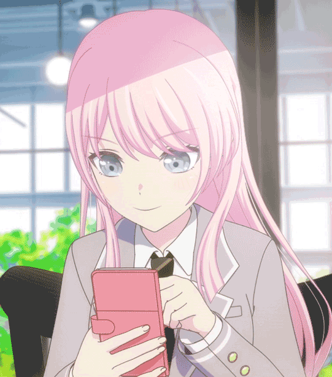

# 爱素 ，但是爱音不被需要，但是爱音是病娇

## 1

## 2

病娇可不只是拴人，不要小瞧病娇阿魂淡们！有人催我我就更新没人催我我就放着

## 3

千早爱音第一次见到长崎素世的时候，长崎素世还不是长崎素世。不过千早爱音也并不知道那个看起来额头很大的亚麻色头发少女的名字。但是千早爱音想要知道，因为她坠入了爱河。所以千早爱音理所当然的得知了一之濑素世的名字，因为她是千早爱音，她有的是交际的本领，要知道一个和自己年纪相仿的女孩子的名字自然不难。但是她们终究不相识。但是爱音终究有自己的生活，她要一路升学，然后出国，这才符合她的身份，这样她才配得上在月之森这种贵族学校读书的素世。在那之前，她知道了素世组了一个乐队，其名为crychic。在那之前，她也曾在台下看过那唯一一场的live。在这之后，她就怀着可能就此永别的心情准备离开。但是千早爱音大概是个病娇，到了伦敦，没有多久，心里便念及素世了。虽然直到这个时候，长崎素世还是不认识千早爱音。但是爱音却已经想到素世可能已经上到了不知道哪个女孩子床上已经被扣到怀孕了。如此这般，日思夜想，夜不能寐，昼不能安。最终，千早爱音决定回到日本。恰巧， 她回国之后的后座同学，正是素世之前同一个乐队的成员。只要和灯组乐队，就能顺理成章的和素世结识吧？直到素世逃走之前，爱音都是这样认为的。一起还是按部就班，一起还是顺理成章。直到长崎素世逃离。

## 4

虽然千早爱音终于按照她自己的心意来到了早早就找到的素世的家门口。但是她并没有抱着什么让素世回乐队的想法。她按了一下门铃。果不其然，没有回应。但是爱音知道素世此时此刻的的确确是在家的。不过既然素世不愿意和自己见面，那么爱音也并不是没有办法——只要自己顺着素世的意思就可以了。“素世，你在家吗？”果不其然，连已读都没有。“我是来帮你的，素世是想让crychic重新聚在一起的吧？”素世还是没有一星半点的回应。“其实我也是crychic的粉丝，之前你们那次live真的很精彩。”唯独这件事情，素世无法置之不理，她不能容许爱音空口胡说八道crychic的事情。“不要说了，之前你好像没有这么说过吧？如果你真的早就知道为什么之前一直都没有和我说过？”“我觉得你们解散一定是有原因的，所以才没有告诉你们。”“谢谢你的好意，不过，我不会再组什么乐队了，你走吧。”“‘不需要了。’是吗？”“是。”“也不需要我了吗？”“从来没有需要过。”太阳落山了。千早爱音下定决心，她要让自己成为长崎素世唯一需要的事物。首先就从学校开始吧。长崎素世在月之森可是很受欢迎的。就连曾经的丰川祥子都要来找她组乐队呢。既然祥子可以转学到羽丘，爱音的水平也同样足够她前去月之森就读。

## 5

祥子曾经在灯面前消失了，像是春天的阳光。爱音同样在灯的面前消失了，犹如夏天的流云。当千早爱音身穿月之森校服走上讲台的时候，长崎素世便在一瞬间目瞪口呆。是的，千早爱音是爱慕虚荣的，所以她的转校在谁看来都一样是合情合理的。除了长崎素世。一下课，众人便理所当然的围了上去，而千早爱音也可以十全十美的应对好所有人，甚至若叶睦。但哪怕放学之后，素世也没有走到爱音身边。她只给爱音发去消息、“你为什么转学过来？”“因为我爱慕虚荣。”

## 6

千早爱音总是会吸引身边的人，她自然也是精通此道。长崎素世虽然仍心怀芥蒂，但自此以后在其他同学面前仍同千早爱音保持着表面上的体面。至于千早爱音？她自然是尊重素世的，既然素世选择这样一种态度，她也以同样的态度回应。但除此之外，在月之森，除了千早爱音和长崎素世，和这些事情有所关联的还有一位——若叶睦。但毕竟那是若叶睦，就算加上若叶睦，这三个人之间在正常情况下也不会有半句多余的对话和行为。形同陌路。。。。直到某一天。在之前，高松灯是和千早爱音一同去找过椎名立希的。人总是会重复成功过的方式方法，这大概就是所谓的路径依赖？灯并不知道爱音去了哪里，但至少她还是知道素世去了哪里。但是她在月之森门口等到的却先是千早爱音。但是月之森却不是花咲川，外校的学生不能说进就进。素世迟迟没有出门去，爱音也迟迟没有出门去。只有若叶睦没有对高松灯避之不及的理由。“别等了。”

## 7

千早爱音十分清楚明白，现在的长崎素世绝对不会接受自己任何接近她的尝试。此时此刻，若叶睦在目的上便仿佛成了她最合适的同道和最难办的敌手。爱音在考虑着，不过，在这之前，灯和立希一边先找上了睦。。。。在ring的咖啡厅，若叶睦理所当然的被灯带到了立希和乐奈跟前。“哈？！”立希一巴掌几乎把桌子拍碎。“那家伙跑去月之森了？”“是。”灯低着头，艰难的回答着。不过睦还是在一旁若无其事的吸着她自己的芒果汁。“若叶。。”立希也坐了下来。“我知道你可能知道的也不多，或者也有自己的原因不能告诉我们之类的。但我们现在真的很需要知道她们两个的事情。”“她们不会再组乐队了。”“嘶。。”虽然早有预感，但是这话由睦说出来也还是让立希心里一紧。“真是这样吗？”“是我的看法，也许不是。”“你有几成把握？”“八成。”睦面无表情，但立希相信她没有说谎。。。。另一边，因为灯的干扰，爱音和素世同时错过了和其他同学一起离开，爱音便紧随素世离开学校。“不要跟着我。”长崎素世收起了平日常见的笑容，取而代之的是和睦一样的面无表情，但语气强硬许多。“素世世，这是你这些天第一次和我说话。”“麻烦。”长崎素世向公路方向招手，打车离开。

## 8

长崎素世自然可以对其他人毫不留情，毕竟，丰川祥子当日就是这样对她的。但是自己受到了伤害，就可以用同样的方式伤害其他人吗？未经他人苦，莫劝他人善。乐队的故事到此结束。结束？椎名立希不会让事情再次轻易结束，她绝对不想再次和灯分道扬镳。如果素世不肯来，她可以去找海铃。现在爱音也不会再来，她马上就想到面前是同样会弹吉他的若叶睦。“你呢？还打算组吗？”睦吸了几口芒果汁，同时不置可否。睦拿不准的事情很多，当然也包括自己是否想组乐队。“我不是千早爱音。”千早爱音——这个粉毛吉他手转到月之森之后，睦才知道了她的名字。“你当然不是，既然她们两个已经和我还有灯，还有乐奈，已经一刀两断了，那我们三个找新人组乐队也没有什么问题。若叶，贝斯手我已经有人选了，现在只要你来就没问题。”“叫我睦就可以。”“这算是？”“明天再答复，可以吗？”“当然。”立希稍稍放心，看向灯，灯还是微微低头，似有什么心事。。。。“立希邀请我组乐队了。”“椎名立希？”“椎名立希，高松灯也在。”“她们没说我的事情？只邀请你？”“没有，有上次的白头发的吉他手和另一个贝斯手。”“那长崎素世和千早爱音呢？就是那个粉色头发的吉他。”“她们不组乐队。”“你怎么知道？是立希说的吗？”“千早爱音转学到我和素世的班上了。”“睦是怎么想的呢？要加入吗？”“我想再试一次，和祥上次和我说的那个乐队一样，试一试。”“小心一些。”“嗯。”

## 9

千早爱音是世界上最了解长崎素世的人，尽管大多只是外物的方面。但她心里明白，素世平日的所谓喜好，大都不过是在迎合身边的那些月之森大小姐而已。终究没人知道长崎素世真正的喜好。就如同长崎素世并不是真正喜欢音乐一样——她只是找一个地方满足自己缺少的亲密关系。甚至未必是一个地方，可能只是一个丰川祥子。没有丰川祥子，这所谓的乐队对长崎素世便毫无意义了。既然如此，那摆在爱音面前的下一步便一定是：解决丰川祥子。目的很明确，但是方式方法却难以抉择。要让素世对祥子死心，这一点哪怕祥子死掉都难以做到。哪怕祥子死掉，她在素世心里也会是那个会给她热情和温暖的丰川祥子。所以爱音不会让祥子死掉，她只能把祥子毁掉。即便如此，素世也仍会努力让祥子变回她初见的，热情洋溢的笑着的丰川祥子。所以爱音只能把祥子毁个彻底，再也不存在恢复如初的任何可能。这便让爱音想到若叶睦，显然，祥子和睦这二人的关系堪称亲密无间。要把丰川祥子毁掉，若叶睦当然是她避不过去的一道关。而通过关口往往只有三种方式：强攻，离间，化敌为友。不过，不管哪一种，都要先接触到睦。这也是爱音等在RiNG门口的一个原因。

## 10

若叶睦很久都没有睡过这样好的一觉了。“自己是什么时候睡着的？”半梦半醒之间，一个这样的想法在睦的意识里猛然浮现。但是眼皮外面，应该是很暗的。在环境很暗的时候，人想要在半梦半醒之间醒过来的努力就更加困难。如果床和枕头都很舒服的话，更是如此。。。。要绑走若叶睦，说来其实简单，对千早爱音来说只需要一个出租屋和一个行李箱。甚至于就连谋划这一切，爱音都没有用上多久。甚至睦的身体比爱音想象中还要更轻更软，连行李箱都显得大出许多。千早爱音就这样邦加了若叶睦。事情很明白，但原因还要追溯到更早一些，在这之前，爱音也并非没有约谈过睦。只是，谈话已经毫无意义。睦绝对不会对祥子的事情坐视不管，全然没有发觉爱音的眼神有什么异样。什么都想得到的人往往是什么也得不到。两面都想讨好的人终究一面都没能和好。。。。“你该醒了，若叶睦。”

## 11

睦今天没有上学。虽然说只是感冒，但是没人注意不到老师和主任叫走长崎素世谈话，事情大概并不是那么简单。虽然整个班里几乎没有人和她有什么联系，甚至就连联系方式都没有加过。但素世和睦之前确实经常一起去园艺部的菜园子说些什么，这事情人尽皆知。爱音并非没有料到这点，只是她知道素世和睦的失踪毫无关系，至少毫无直接关系，而间接关系——素世并不会和其他人说。何况素世也不会料到爱音有多大的决心。爱音的确去过RiNG，但去了RiNG的人实在太多，要挨个排查未免动静太大。更何况事情还关乎月之森的声誉，和若叶睦家里的声誉，牵扯太多，睦的生死和下落反而没有那么重要。何况邦非还没有送来任何有关勒索的事情，睦也没有任何踪迹。正所谓活不见人，死不见尸。那么若叶睦死了吗？还没有，至少现在没有。

## 12

对椎名立希来说，事情很奇怪，和她组乐队的人总会莫名其妙的退出和逃跑和失踪。从丰川祥子，到crychic时候的灯，再到素世和爱音，现在又到了若叶睦无缘无故没了消息的状态。四个人组乐队，虽说可以，但总归少些什么。看着手机里四个可能永远不会来消息的联系人，立希还在思索。其中一个却来了消息——丰川祥子。“你有睦的消息吗？”“没有？你也没有？”“你在哪？我们对面聊聊。”睦没了音讯，祥子自然最为心焦。而对睦的下落，她更有她的想法：必然是长崎素世或骗或绑，不知把睦弄去了哪里。毕竟那晚，睦什么都没说，什么都没做。毕竟一直以来。可以算得上帮到素世的事情，睦一件也没有做过。长崎素世定是恨透了睦，恨睦坏了她大小姐的家家酒。这样，长崎素世做出什么事情都不奇怪。毕竟，她连下跪都轻易做得出。“轻易”轻易？是否轻易，就只有素世自己知道了。虽然心里不很情愿，素世也不希望睦继续失踪。毕竟哪怕素世身正不怕影子斜，月之森人多口杂，难免捕风捉影，弄得素世不干不净。睦在自己玩失踪，借此喧宾夺主——素世倒是这样想的，她甚至想到这甚至可能是睦家里人安排的一场炒作。“别闹了。”只不过睦一时半刻之内大抵是看不到素世发来的抱怨了。

## 13

睦根本不知道爱音为什么要绑架自己，但爱音绑架来自己又什么都没有做。因此，睦一开始甚至以为自己只是睡着了被爱音好心带回家而已。睦当然想过反抗，也当然反抗了那么一下。但她没能反抗几秒，就被爱音擒住。“还是别让我觉得夜长梦多比较好。你说对吧？睦。”睦也只好假意顺从，不敢再轻举妄动。但她实在想不到自己哪里有得罪爱音，会让她把自己关在这里。但既然自己被绑了而且看来一时又没有危险——大抵是醉翁之意不在酒的了。爱音不会缺钱，和自己比较有关系的又只有两个人，这让睦也有了些头绪。“祥子还是素世？”

## 14

睦的确不会轻易出卖祥子，但是事情已经危及自己的性命，她也只能希望祥子那边可以化险为夷。毕竟被绑着掐住脖子确实不是很好受，特别是对方下足了力气的时候。至于祥子，现在还不至于有什么问题，毕竟她还在和立希相互指责，至少在和立希等人分开之前，不会有某个粉色头发的少女同样把她也绑走。“你不知道睦去哪了我怎么就能知道？我也想知道她搞什么名堂！”“睦失踪了，我说的还不够清楚吗？失-踪，昨天她告诉我要和你们组乐队之后人就找不到了，你以为我还想和你们扯上关系？”“不要把事情算在我们这里，她是从RiNG出去的，而且我们也想知道她的下落。再说了，要说睦的事情，不是还有两个在月之森的家伙吗？”“两个？”“你还不知道？那个粉毛也去月之森了。”“千早爱音？”“没错，原来你们认识？”“不熟，而且我不想和她们说什么。”这时，灯却突然插嘴——“睦的事情，我觉得应该去问问她们。”立希和祥子不约而同的叹气。立希拨打了爱音的号码，祥子解除了素世的拉黑。

## 15

素世自然是知道自己这样照看睦，是可能激起爱音嫉妒心的。但她没有办法，她想保下爱音，就只能先稳住先安慰好睦。可谁安慰的了刚刚死里逃生而罪魁祸首就在一旁无拘无束的女高中生？同样只是高中生的长崎素世自然做不到。而她清楚的知道，如果事情被第四个人知道，要么爱音失控做出更不可控的事情，要么爱音的人生就要完蛋。素世总是这样。想保全一切，结果往往失去一切。自以为做的天衣无缝。到头来仍要追悔莫及。如果那一天，自己无论如何也要让祥子留在乐队的话，哪怕只挂一个名字？如果那一次，自己没有二话不说和其他人一刀两断的话，哪怕温和一些？如果前些天，自己即便是只把爱音当作普通朋友的话，哪怕多说几句？事情会不一样吗？会吗？其他人可以毫不犹豫的，抑或犹豫一下就迈步向前。但长崎素世从来做不到，过去的事情对她不只是影子，而是包袱。她试过抛下这包袱，便使得爱音做了绑架和沙人未遂的事情，睦也犯险遭难。她现在只有再把这包袱重新背负，连同爱音的一份一起。当她决心帮助爱音掩盖，某种意义上，各种意义上，她也是共犯了。爱音的目的也以她未曾设想的方式，达成了。

## 16

可素世一时半会要安慰好睦，又谈何容易，更别说爱音还在一旁，这让素世事情更加难办。“小睦要不要先去我家？”情急之下，素世灵机一动，想出法来。“我想回家。。”睦的回答也是情理之中，也在素世意料之中。“我知道，我们先去我家休息一下，等休息好我再带你回去。”睦停顿了片刻，终于点了点头。可素世抱起睦刚要出门离开，却感觉衣摆被挂住一般。回头，却是爱音，也只会是爱音。“你在这里等我。”素世要把爱音也稳住，可她不能说太多，也不能让爱音说什么做什么，免得让睦因此再闹起来。于是素世眨了眨眼，爱音自是懂了些不知什么，便松了手。在回家的出租车上，素世把手机关了机。无论如何，现在不是让祥子知道的时候。这不是为了爱音，这是为了弥补自己的过错。为了补一个错，人总是可能犯下更大的未知的错。拆东墙，补西墙，拆来拆去，总早晚拆得砖断石碎。但是如果不补，只怕事情一发不可收拾，终落得个墙倒屋也塌，家破人又亡。

## 17

素世回到家没多久，这大抵也就是祥子等人等不来消息的时候。没有办法，也只能联系爱音，毕竟素世最后给出的线索也是指向爱音。虽然立希已经打过一次，但就立希的风格，大抵问不出什么。所以这次换灯来打，而祥子也仍要在一旁细听。那么这段时间内，爱音又是如何想的？又做了什么？想倒有想，做却没做。事情败露是爱音预料之外的事，但素世没有直接了当的大发雷霆，更让爱音始料未及。但素世让她等，好歹是有了盼头，那她自然会等。在她等待素世的时候，灯却来了电话。大抵还是睦的事情？不过立希不是已经打过了吗？就用和给立希的一样的答复搪塞过去吧。。。毕竟现在只要等素世就好。

## 18

“小爱说的都是真的吗？”哪怕很相信爱音，灯仍旧要为了睦和祥子和乐队再次追问。“是真的。”爱音强撑着做出认真的回答，自然没有之前答复立希那样从容。祥子听出端倪，也在一旁用手机打字指示灯追问下去：问问她家在哪“小爱，你家在哪，我还没去过你家呢，我想当面和你说一下。”“怎么突然说这个？我们已经不是乐队队友了吧？”爱音自然不想同意，本能的搬出理由来拒绝。可睦既然已经不在，她也没有拒绝的必要，让灯来看看反倒可以洗清嫌疑。“真的不行吗？”“好吧，我把地址发给你。。。灯你一个人来吗？吃饭了吗？”灯看了看祥子，又看了看祥子的手机。“是，就我一个。”立希扯住了祥子的衣领，凑到她耳边去。“要是灯出了什么事情，我绝对不会放过你。”“不劳费心。”祥子用刚好只让立希听到的声音说道。

## 19

灯本以为爱音会住在普通的一户建的家里，但当她照着地址到了地方，才发现是一栋公寓楼。按计划，祥子把自己的手机和立希保持通话，之后放到灯的口袋里，这样她们在场外也好及时分析或者支援。“灯！这么快就到了阿？”爱音下楼迎接，看来她之前是在家的，要不就是打过电话才赶回家。“阿。。小爱，你住在这里？”按理说在月之森就读的学生，大抵是不至于沦落到住公寓的。——祥子因此对此表示怀疑。“但是也有靠成绩而不是家境进去的学生就是了。”“废话。”话虽如此，立希也好奇为什么爱音不在家住宿。“是这样，我想先自己调整一下适应新环境，影响到家里人总感觉有点不太好。”“这样阿。”“你们还在找若叶同学吗？”比起一味逃避，爱音倒也开始主动出击，毕竟睦已经不在她这里，只要不把这些人导向素世就算成功。“是！小爱有什么线索吗！睦从昨天开始就失踪了，大家都很担心她！”与此同时的另一边——“我就说不能让灯一个人去！”“安静，椎名，稍安勿躁。”“你是忘了我的名字还是纯粹是想找打！？”“立希，灯肯定能套出点什么的。”虽然已经分道扬镳，但立希点饮料也顺手点了祥子一份，毕竟立希不是什么小肚鸡肠的人，祥子也因此得以摆起架子喝起来。“你不能用你的想法往灯身上去套。”“什么叫‘我的想法’？我和灯的想法不是差不多吗？大家都在想找到睦，你不也是一样吗？”“不一样，过程不一样，所以结果也会不一样。”“真是高高在上。。。”“这是现在最有效率的办法了，如果这里不行，我们就只能想办法再找长崎素世一回。”

## 20

灯显然不会发现睦和素世都曾来过她当下所在的公寓，毕竟不是人人都有细品香薰的习惯，素世虽然有用过也来过，但是终究只是短暂停留，何况灯也不知道素世现在所用的香薰。要让灯联系起来，也就只有今天去到素世家中或者和素世见上一面。甚至如果去得晚些，在安抚过睦之后，素世大抵也会想起来掩盖。跟在爱音身后进去，灯也理所当然的打量起房间，也理所当然的注意起那个关着门的房间。爱音端来饭菜，仍是先行开口，意图抢占主动权。“灯，你们有睦的消息了吗？”灯自然没有什么言谈的技巧，而祥子和立希也只能干着急。毕竟手机哪怕只是振动，也或多或少会有声响。既然如此，祥子事前也叮嘱过灯一些：“如果爱音问起我们的事情，就只要照常回答，只是不要提爱音和素世。”“还没，小爱你肯定比我们知道多一些的，你和小睦是一个学校的不是吗？”“是这样。。可是，灯，你和祥子同学不也在一个学校吗？”此言既出，灯是要想一时半刻的，而立希更是没好气的瞪着祥子，虽然本来不过也就是这样，只是立希瞪的更多了一些。爱音压下得意，自以为胜券在握。但是灯已经下定决心，去搏一搏可能的机会。“爱音，是你做的吗？”

## 21

灯话音刚落，祥子心里却已有七成猜测。因为爱音恰到好处的停了一下，方才作答。连立希也不是没有反应过来，只不过比起睦的去向，现在立希更担心的是灯的安危。虽然灯问的很是直接，但爱音自认为没再有什么马脚，便更加坚信灯是在耍诈。哪怕已经有了素世的前车之鉴，爱音仍决心撑上一撑。“灯，我知道你很想找到睦，可我们真的只是同学关系。而且我为什么要这么做？我和睦根本无冤无仇吧？”无冤无仇——这个词刚刚出口，爱音马上就有些后悔。如果爱音和睦之间是无冤无仇，那要说和睦是有冤有仇的自然就只有素世，最多也只能算上祥子，或许祥子和睦之间有什么不为人知的事情。“对不起，小爱。。。”可灯终究没把事情想的太糟，也不会真的怀疑爱音和素世。但对于祥子和立希，她们考虑的事情就多很多了。直到这个时候，她们才想起来计划有一疏漏：如果现在要联系灯，就只有用海铃的手机——祥子和立希的手机正在保持通话以窃听爱音和灯的对话，而乐奈，乐奈不会打电话。如果用乐奈的手机给灯打电话，则爱音细心一些就会发现并且起疑。如果一开始用乐奈的手机做窃听器就好了。可惜，时间不能倒流，事情也不能重来。至于此时此刻的海铃？海铃和初华正在通过人际关系广撒网。至于效率，难说，毕竟她们终究是学生，自不比若叶家的人际关系神通广大，只是聊胜于无罢了。事情到这里仍有对策，只要用乐奈的手机联系海铃，让海铃打电话联系灯离开爱音住处。不可以是初华，因为初华和灯并不熟识。可是，当立希真这样照做的时候，竟没能拨通海铃的号码。

## 22

八幡海铃从一开始就觉得立希乐队里气氛是很奇怪的，从一开始亲眼看到那个粉毛吉他手离开，再到那个淡绿色头发的吉他手加入过来。很奇怪，之前的几十个乐队都没有过这样的氛围。在常人看了来，这只是大少女乐队时代的时代背景下的一个如草芽似牛毛的普普通通的乐队。但海铃是混过三十个乐队的，至少她自以为已经看得出一个乐队能不能长久下去。但是这次不行，只有这次不行，无论如何海铃也看不透是什么原因把这些人聚在一起而且要组一个乐队。这绝对不正常，这个乐队的现状毫无疑问是病态的。但这次是立希请她来。可这是立希请她来，她无论如何也不会也不知道要如何拒绝，也同样不会劝立希放弃。至于现在要寻找那个淡绿色头发的吉他手，也就是若叶睦，海铃实际上也完全没有头绪。最初她也只是四处联系加入过的和认识的其他乐队的成员，希望能帮上忙，但大多不是无能为力一无所知就是竹篮打水一场空。直到她看到一个极相似的背影和一个身穿月之森校服的高个子亚麻色头发女孩子一同走进了一栋高档高层住宅楼。她当然尝试过联系立希，但是她理所当然的没有打通——因为此时立希和祥子的手机已经在通话中。为了不让立希回拨来的铃声吸引到对方注意，海铃开启了手机静音，之后跟了上去。

## 23

比起正在绞尽脑汁想方设法斗智斗勇的其他人，此时此刻，若叶睦和长崎素世倒是安逸许多。甚至，如果忽略掉前面发生的一切事情，看起来就只是普通平常且简单的一次准备过夜的作客。睦也并非没有怀疑素世和爱音同流合污，但她知道，素世怎么也不会做这种事情。置之不理就已经是素世下过最狠的心了，而比这更重的事情素世怎么也不会做。而现在素世的想法，睦自然也知道：素世不想让自己报警或者告诉其他人，她希望可以大事化小。因为素世就是这样。毕竟素世总是这样。素世费尽心机也终究只能为了维持现状和恢复原状，只有连这都做不到，她才下得了决心放弃。但睦理所当然的不打算原谅爱音，好歹是鬼门关上走了一遭，换谁也不可能一笑泯恩仇。素世也知道这一点，所以并没有提起，只是在吃喝洗睡方面帮睦做一些力所能及的事情。尽管素世知道事情不能拖下去。尽管睦也知道事情不能拖下去。当这时，门铃响起，素世也只好让睦先回卧室休息。

## 24

爱音既然知道素世有心包庇自己，自然已经放心许多。至于灯会来，这倒是早在爱音意料之中。同样意料之中的，则是祥子和立希也都在寻找睦的下落。唯一的问题只是，她们从爱音这里离开，自然会去素世那里。但紧随其后，灯的询问打消了爱音的疑虑。“小爱知道素世家在哪吗？”“不知道，素世世她还没有让我去过，灯你给她打过电话了吗？”“素世不接电话，关机了。”“这样啊。。”爱音佯作思索。“我想她应该是需要休息吧，毕竟今天在学校里很多人都在问她睦的事情。”“是这样吗。。”立希和祥子此刻却只有心急如焚的份，只能担心灯和睦的安危。“我感觉是这样的。”之后稍坐片刻，灯也没再有什么疑问。“小爱，那我先走了？”身处后方的祥子和立希刚刚稍稍放下心来。却听到了什么东西落地的声音。“灯。。你的手机？你换了和丰川同学一样的型号吗？”

## 25

祥子没能拉住立希。从灯支支吾吾面红耳赤的姿态上，哪怕是不认识的人，也会知道她肯定是做了什么，更不用说对面是千早爱音。“是祥子和立希在听吧？”灯点了点头，难掩窘迫，捡起手机就要走。“她们也想听的话，为什么不让她们也过来？”灯张张口，却不知作何解释，也不知是走是留，更不知爱音是何用意。“灯，你们在怀疑我吗？”爱音心一横，决心转守为攻。无论是拉拢到灯还是吸引对方目光避免她们前去调查素世，此时对爱音都是有利结果。灯可能会隐瞒，但绝对不会说谎。“有怀疑小爱，还有素世。”情理之中。“你们只是学生，这种事情是警察要做的，你们难道不知道随便进到可能是嫌疑人的人家里是狠危险的吗？”“小爱不是嫌疑人。。”“但你们已经觉得我是了。”灯能回答什么呢？只有沉默。直到粗暴的敲门声打破静默。

## 26

灯离门要近一些，理所当然，她去帮忙开门，也顺便脱身。只是。。。她一打开门锁，门就被猝然拉开，紧随其后的是一个红色的东西砸到了她的头上。那个红色的东西是一个灭火器，但显然灯并没有预先准备或者反应过来抵挡或躲避，便是被砸了个头破血流，一下子倒在地上，昏死过去。而那个拿着灭火器的人是椎名立希。那个把灯砸的头破血流乃至昏死的人是椎名立希。她就那样拿着那凶器，呆呆地站在了那里。直到爱音打了急救电话，直到灯被赶来的医护人员抬走，她还是站在那里。“你先冷静一下吧，出去的话记得关门。”这之后，她还是站在那里。过去了一些时间，不知多少的时间。最关心灯的椎名立希，第一次不敢去想灯的事情。时间在空气中仿佛一点一点化作实体，挤压得立希动弹不得，难以呼吸。她终于费劲全力动得一动，却因腿木脚麻，坐倒在地。灭火器仍是红色的，为了醒目的夺目的红。没有灯流出的血那么红。

## 27

爱音没有告诉其他人立希做了什么，除了祥子。祥子的手机还在灯在口袋里，祥子也还是只守着立希的手机，正因如此，爱音得以联系上祥子。而得知立希刚刚把灯打至昏死，对祥子好比五雷轰顶，震得她脑中一片空白，浑身一下子没了力气。“立希还在我家，你去看看她，她状态好像不太好。”立希的突然袭击，倒让爱音一下子脱出身来，所以爱音也没有必要再画蛇添足，现在她只要在医院稍作等待。至少她相信，现在的立希和祥子，是绝对无暇顾及睦和素世的。但是八幡海铃并不知道这边发生了什么。她第一次按响这种地方的门铃，却是为了这样的事情。“请问你是？”对方的声音听起来很是细腻，却给海铃一种莫名的虚情假意的感觉。门口理所当然要有摄像头，而门里理所当然会有对应的显示屏。“我是谁不重要，请问若叶睦在里面吗？”素世暗叫不好，自己从爱音家带睦回来不过片刻，却已经有人找上门来。不过她同样看到对方是学生模样，姑且稍微放心。“你是她的？”“我们是一个乐队的，请问她现在在您家里吗？”对方开了门，确实是海铃刚刚看到的月之森的高中生。“有空吗？不介意的话，可以先进来坐坐吗？”

## 28

虽然海铃也算见多识广，但这次除外，就算是海铃也要吃惊一会才想起来还有正事。海铃的手机关了机，素世的手机也关了机，就算另一边闹出洪水滔天，她们现在也不会知道。“你是睦的同学或者朋友吧？”海铃没有喝素世端来的茶水，只在沙发上坐了下来。“如果睦有什么必须不能露面而且必须瞒着其他人的事情和原因，希望你可以向我透露一些。如果需要签什么保密协议，我可以签。”眼见对方看起来极有把握，素世便知道，这人大抵是比爱音更难对付。毕竟爱音还是莫名其妙的爱着她的。“请等些时日，好吗？”素世需要时间，如果没有时间，她势必什么都做不到。“我需要知道睦现在是否安全。”“我可以向你保证，睦现在绝对安全。”“证据呢？我怎么知道你是不是在骗我？睦现在就在你家里，对吧？让我见她一面，我再考虑相信你的说法。”迫于无奈，素世只能承认。但在承认之前——“我没事，相信素世说的吧。”大抵是门铃声为了可以让卧室的人也听得到所以设计的有些太响了？

## 29

海铃刚想追问，睦却又转身离开，留那两人继续对峙。对海铃来说，事情还是有两种可能，睦是自愿或者受胁迫的两种情况，现在都有可能。只不过冤有头债有主，比起之前的无头苍蝇一样的乱找一通，现在情况总归是好转不少。既然如此，海铃也不需要再纠缠什么，只要留一下这女生的联系方式便好。既然如此，素世也没有什么拒绝的理由。既然如此，海铃要把关了机的手机开机，素世也要把关了机的手机开机。所以显然两人这一下就没办法马上交换联系方式。因为有更重要的事情，两个人的手机都被未读消息淹没。消息虽多，但海铃只看见最后立希发来几句：我是祥子，立希把灯打伤了，她状态好像很不好，你去xx公寓xxx房找她，她没带手机。爱音则把事情复述给了素世，只指望素世还可以宽恕。毕竟，哪怕是立希动手，追根溯源起因仍是爱音。但是事已至此，素世也是共犯。共犯是最亲密无间的关系，直到面临囚徒困境之前都会是这样。为了事情不再扩大下去，素世也只能去爱音家里，去照看立希。两人匆匆交换了联系方式，之后却是不约而同的一起匆匆下楼。“你去哪里？睦不用人照看吗？是什么更重要的事？”“你走的也这么着急，是又出了什么事情？”电梯缓缓下行，楼层足够高，足够她们继续相持不下。终究是素世先认了自己忘不掉那个乐队的那些人，而海铃却不认为有什么事情会比立希重要。“我去找立希。”“你要找她做什么！”这是长崎素世第二次被人揪住衣领。

## 30

在立希急不可耐的冲往爱音住处的时候，并不是没有人做过什么。祥子试过喝止她，乐奈也紧随其后跟了上去。也因为乐奈跟了上去，祥子也以为事情不会怎么样，毕竟两人同一乐队，立希要做什么，有乐奈在场也总不至于太糟。可乐奈也没有带上手机。虽然乐奈会不会接起电话是要另说的，但是她也没有带走手机。也因为立希和乐奈也双双失联，祥子最初得知灯被砸昏的时候，并不相信爱音，直到爱音把手机交给救护车车上的医生才说服了祥子。在去安慰立希和马上去看望灯的情况之间，祥子终究选了灯的一边。毕竟乐奈也跟过去了不是吗？可是乐奈应该跟过去了不是吗？ 既然如此，她为什么没有拦下立希？祥子想到了这些问题，但是她已经没办法处理和解决。分身乏术，无能为力。或许自作主张寻找睦这件事情是错误的？或许从一开始她们就不应该寻找睦？当然不是。抱着没有多大的希望，在前往医院的电车上，祥子还是又用立希的手机给素世打了过去。连祥子也没有想到，这次竟可以接通。

## 31

椎名立希知道自己做事的方式是有所不妥的，自然，她也不是没有想过心平气和的改正这一点。但江山易改，本性却难移。更何况这一点在平日里并没有多大影响，立希便把平心静气这件事情一拖再拖。终于是一直也没有能够改正，直到这一天。直到灯倒在她面前这一天，立希才终于明白，有些事情拖不得。。。。乐奈并没有多关心睦，也没有觉得其他人这样可以找得到她，但是既然立希答应过抹茶芭菲，有趣的女孩子灯也在找，乐奈也没有什么非要拒绝的理由。乐奈从来没有见过立希走的这么着急，不过比起和不认识的蓝色头发女孩子在一起，乐奈还是更喜欢立希。所以乐奈紧随其后跑了过去。但是没能跟得上。也就没能拦得下。要乐奈站在路口，想着吉他和乐队，耳边传来了救护车的警笛声。。。。海铃和素世在电梯里对峙，相持不下，她们都有不能让步的理由。素世的手机铃声恰到好处的不合时宜的响了起来。“介意我先接个电话吗？”海铃无奈松了手，眼仍是盯着对方。“谁的电话？”“立希？”“你接吧。”素世也没想到对面会是祥子的声音。“祥子？你怎么用立希的手机打给我？”“你答应我们的一个小时呢？长崎素世。”祥子只觉得浑身乏力，无头苍蝇一样乱转一通，终是赔了夫人又折兵。“你真知道什么的话，告诉告诉我们吧？睦到底怎么样了？”素世的内心煎熬着，如果她没有决心包庇爱音，灯也不会受伤，立希也不会经历这种事情。这便是沉没成本和及时止损之间的纠结。“睦没事，我现在正在去找立希。”“睦是在你家吗？”“是。”

## 32

灯的伤势虽重，但好歹不至无可挽回，只是一时还不好见人。在病房外，祥子总算再见到了爱音。“这里没有你的事情了吧？不相干的人还是尽早离开为好，灯家里人要我们说明什么情况的话我可以和他们说。”祥子在爱音面前站住，伸出一只手来。“偷听你们谈话的事情，我很抱歉。最后，可以把手机还给我吗？”“那我就先回去了。”爱音把祥子的手机交还过去，点了点头。“如果有立希或者睦的消息我再联系你吧。”“不劳费心，你不要添乱就好。”祥子没有追究睦的事情，毕竟，睦已经找到，灯和立希的事情才是现在要关心的。至于爱音，她也要回去收拾烂摊子，以及等待素世的消息。至少这件事情过去之后，素世也没法再行嘴硬之事？而八幡海铃还在寻找椎名立希，却只找到了乐奈。而立希会去哪里？此时此刻，只能回家。现在立希害怕看到任何认识自己的人，甚至这一范围可能扩大到任何可能认识自己的人，乃至任何人。所以只能回家，回到她那总拉着窗帘的房间。立希自以为是的举动让她铸成大错，她不敢想灯的事情，她不敢知道，所以不敢问，也不敢去拿回手机或者找到认识的任何人代为取回。不知道就可以不面对。像是纸壳箱里薛定谔的猫，只要不知道，就可以永远把问题保持下去？但是这是理想状况。并没有完完全全密不透风的纸壳箱，不去打开，活猫也会变成死猫，死猫的尸体也终究会发臭。不知道就可以不面对？至少现在还可以，直到活猫变成死猫。

## 33

海铃知道立希可能回家了，但终究无法确定，如果立希没回家，那事情可能非常难办。可海铃也不方便去问老师要立希家的地址去看去问，心急也只能干着急。但是毕竟还是可以做得排除法，从花咲川找到RiNG，从爱音家找到素世家，最后在医院附近找了一圈。终是一无所获，也只好再和祥子碰面。海铃和祥子其实没什么好说，两人都是这这件事间接的受害者。把乐奈送回去之后，便在路上聊起来。“所以闹了半天只是若叶去朋友家里住了一天？原因呢？只是逃避压力吗？”海铃并不是很关心睦，她更想找到该为这件事情负责的——为立希打到灯这件事情。“给，立希的手机，你找机会还给她吧。”“你也不知道？”“我不知道，可能就是你说的那样。”。。。素世回到家，却没想通睦为什么会帮自己蒙混过关。大概和自己帮爱音是一样的道理？只是现在，爱音需要冷静，素世需要思考，睦则是需要恢复。事情就此归于平静？事事都需要时间，但是时间是否足够？毕竟睦还是被其他人寻找着，被她的家人寻找。

## 34

常言道，今日事今日毕，但也不是所有事情都是一日之事。一日完成不得便要二日，一生二，二生三，长此以往，便是来日方长。一事来日方长，事事来日方长。可一辈子还是太短，总是完不成那么多来日方长。人总不能不眠不休的，但躺到床上，此刻又有几人安眠？至少乐奈还睡得着；至少睦也难耐疲惫睡了过去；至少灯也谨遵医嘱睡了下去。至于其他人，便是想睡也睡不着的了。无计可施，可又不能坐视不理，这样的组合只会催生出不合格的生搬硬凑笨办法。成则随机应变，败则饮鸩止渴。祥子还是按照海铃给的地点，来到了素世家的楼下，可她还是要犹豫。一不做，二不休，往往也是走投无路。祥子打给了素世。同样难以入眠的素世却也只能看着发亮的手机屏幕，直到祥子的来电变成未接来电。

## 35

如此这般到天明，素世也还是要去学校。毕竟学校里唯一和睦有关系的人，如果不去学校，那是要被锁定嫌疑的。海铃也是要去学校，哪怕是需要要到立希的住址，也是要去学校对面和老师说明才好。至于其他人？大抵是不需要？祥子只等素世离开再去素世家里单独和睦说话。灯还要在医院卧床静养。立希更不用说，哪怕是和家人，她也只说身体不适。但是爱音也还是去了学校，因为她知道素世会去，这样，她们好歹可以在学校里好好谈谈。如果素世愿意的话。。。。事情往往不会如所有人的愿，更可能的情况反倒是所有人都不会如愿。折中和妥协，是大部分的情况。素世想要抹平一切是非，而祥子希望冤有头债有主。素世太过绥靖，而祥子太严苛，所以睦打算折中，她自然也知道祥子今天大概会来。并没有人责怪立希，但是立希仍没有办法原谅自己，哪怕是灯亲自开口说明，也只会加深而不会缓解。所以海铃会追根究底，直到找到起因，才好洗脱立希的自责。

## 36

首先，自然是爱音和素世先行碰面，但她们也要下课后才好说话。所以更早一些开始交流的，却是睦和祥子。素世总归是相信睦的，甚至把自己家的钥匙也给睦留了下来。素世对其他人的好，经常是在这种小事上面，而又有一丝刻意的嫌疑。但哪怕是临走前，素世也还是告诉了睦。“如果祥子来找你，就开门吧。”睦开了门，祥子便迫不及待的冲了进去仔仔细细的查看了睦的情况，直到确认无虞才把门关好、“是你自己要来的吗？”祥子提问睦的第一件事，也正是开门见山的最关键的一件事。但是睦没有回答。虽然她对爱音又恨又怕，可素世也万般恳求过她。“我一定会让爱音罪有应得的。”素世也这样保证过了。睦还是太过善良，总是忍气吞声，委曲求全。如果她再果决一些，便一定要亲自处理爱音。不过，素世倒也真心打算教训爱音一下。

## 37

要说月之森有什么几乎没人去的地方，也就只有园艺部的花园和菜园子，也正是往常素世和睦谈话的地方。但今天却是素世和爱音碰面的地方。素世在给黄瓜浇水，而爱音只好在一旁琢磨对方的想法。“你值得我这么做吗？”素世此刻却像是在问自己了。“我值得你这么做吗？”爱音并不回答，只上前接近素世。随后却被一水壶砸到头上，吃了不小的痛。“今天下午你跟我回去，当面和其他人好好说明白，要怎么处置你得由她们一起商量。”素世又担心其他人不念旧情。“至于怎么处置我管不着，但我保证她们处置完我不会不管你。”水壶比起灭火器，还是太轻。惩罚比起奋力一击，也是太弱。

## 38

爱音此刻距离素世只有一步之遥。然而两人之间仿佛有一层隔膜，素世是可望而不可及的，总让爱音望而却步。素世把要说的说完，便转身要回去教室。‘可她也没有走多么快，自然是给爱音留了些机会。但她自然也没有多么想给爱音机会，只是觉得应该给她一些。如果爱音被逼的太紧，当然会闹出大事，所以素世才如此做事。爱音只是从后方握住了素世的手，两人的手都有些发凉。素世本以为爱音会从后面抱来，可既然只是握手，倒也可以？但随后她便被扑倒在地。毕竟食髓知味。

## 39

却说与此同时，八幡海铃也终于说服了老师，得以拿到地址去看望椎名立希。这个时间，立希的父母自然要去工作，姐姐自然也是去上学，家里理所当然只有她一个人。如果门铃声响起，四下无声的家里立希毫无疑问的听得到。但至于是否开门就是另一回事了，立希当下也毫无疑问是不想开门的。但是门铃又响了一下。对方可能确实有什么事情吧？如果因为自己的任性而耽误了事情，那可不好。这样想着，立希还是随便收拾了一下自己，便下楼开门。海铃也并不确定立希称病就一定是在家，但眼下其他地方她也没有头绪，只好再等片刻，如若实在无果，再另做打算。立希站到门后，看了眼猫眼，便不由得心里一沉。她不想见人，但还是迫切的想知道灯的情况，她便不得不开口问道：“灯怎么样了？”她还是这样，一开口便是灯的事情。

## 40

素世被爱音压在身下，虽算不上喘不动气，可也不算好受。但她一自然是不敢作声引来什么人的，二是也想试探爱音，试探一下爱音的态度。所以素世并不急于起身，也并不急于开口，在上课之前她还有一些时间上的余裕，自然要充分利用。恰巧，不巧，好巧不巧，爱音也是这样认为的。两人就这样相互试探着，爱音没有进一步做什么，素世也不做反抗。而素世为前往教室预留的时间，自然不如爱音精准，先行打破了僵持，想要从爱音身下起身。可是爱音块头也不小，愣逼到素世不得不开口。“可以了吧？要上课了。”“今天中午可以一起吃饭吗？”“这件事你不需要压着我我也可以答应。”素世感到后颈有所接触，是她没有过类似经验的接触，不由自主的让她耳朵发起热来。“一言为定。”

## 41

想要催更可以加裙⑧有什么灵感也可以加七是我的粉丝也可以加⑨不是也可以⑦想攻击我也可以加0全新新作——《RiNG火灾事件调查》筹划中8欢迎交流8号码在每句话最后⑦唉，贴吧④

## 42

“乐奈？”灯还是躺在病床上，什么都做不得，只好想事情和歌词。可眨眼之间，一张熟悉的脸出现在她的正上方。虽然因为横着的缘故，看起来有点别扭。灯知道这个时间，其他人应该是在上学上课的，乐奈自然不该例外。不过既然来了，大抵是请了假，比起这个，灯还是更关心之前的事情。“睦找到了吗？”乐奈花了两秒把“睦”和绿色头发的吉他手联系起来，然后摇了摇头。毕竟其他人还没有把找到睦的事情告诉她。灯在听后，也难免有些失落。乐奈不喜欢消毒水的味道，也想要向灯表达自己的关心，于是说道：“什么时候可以live？”灯苦笑了一下。乐奈是知道这个表情的，这是对方接下来要说的话不能让自己满意的时候会有的表情。也就是说——可能很长时间都没办法live了。乐奈拿起一旁的水果刀，削起苹果。她见过姥姥在她生病的时候，是有这样做过的。这也是此时此刻她能为有趣的女孩子做的唯一的事情了。

## 43

在立希家门口，海铃是此时此刻最无奈的人。“灯没事，你不去看看她吗？睦找到了，事情结束了。”立希向前一步，似乎要追问海铃，但又很快停住，立在原处。“我还是不要去了。。”立希还想往下说，可海铃实在受不了立希这个样子，拉住了立希准备关上的房门。“你打算在家里躲到什么时候？躲到灯过来找你吗？还是说你要躲到我们所有人一起来请你？”“我怎么能去见灯！”立希落下泪来，什么事都忙不迭来不及做，只得啜泣。“为什么不能？灯没事的，我既然来找你，就说明灯肯定不会有事情的吧？给，你的手机。”海铃把手机塞到立希手中。“要是你还是不信，那就自己给她打个电话。”“我知道，再等我一段时间。可以吗？海铃。”海铃也已经尽了自己可能的对立希最强硬的态度，接下来就只能看立希自己了。“知道了，好好吃饭，好好休息吧。”

## 44

丰川祥子算是有着朴素的正义感，也往往不会忍气吞声。她不相信睦会不和自己说就到素世家里躲着，也同样不会看不出睦在说谎。可是，睦同样知道这一点，在被祥子看穿之后便什么也不愿意透露。祥子改变不了睦的想法，这是她们彼此都知道的。但即便如此，祥子还是要把该说的事情都说过几回。并非走马观花，实为万般无奈。“无论睦说什么我都会相信，但我还是想确认一下，真的没有人威胁你这样说吗？”“没有。”祥子知道，哪怕自己现在揭穿睦，对方也只会默不作声。“你不告诉我我也会再去问素世的。”“当作无事发生吧。”“如果你在昨天下午之前现身，倒是可以无事发生。”“是时间问题？我已经现身了。”“不，是有人要为灯的事情负责？”“高松灯？”“因为找你，灯被立希误伤到，现在还在医院里。该有人为这件事情负责，如果那个人是你，也不例外。”祥子起身便要离开。“灯是无辜的，我希望你也是。”睦没有说话，只目送祥子离开。一不做，二不休。一已做，二不能休。

## 45

在中午将要下课还未下课时，素世显然没有准备好如何应付爱音。但她姑且相信，爱音做不出太出格的事情。至少对自己是这样。对自己应该是这样？爱音倒是没有狼吞虎咽也没有对素世狼吞虎咽，只是平常的吃完。而爱音吃东西大抵多少是比素世要快上一些，吃完也会早一些。至于这之后，爱音做什么都显得理所当然。当然也包括耐心的等待素世用餐结束。素世知道爱音中午约自己可能有什么样的意图，可是，爱音没有让她拒绝的理由，她也没有说服自己拒绝的理由。哪怕爱音主动亲上来，也同样没有。哪怕爱音把手放过来，也依然没有。素世的内心复杂而深邃，但此时此刻却是一片空白。

## 46

祥子离开了并不想久留的素世的家，但一时也没有接下来该去哪里调查这件事情的头绪。既然如此，不妨梳理一下已经掌握的情报，眼下只能如此。睦的失踪要追溯到前天下午，祥子则是在这天晚上接到睦的母亲打来的电话的。当晚，祥子去过很多她认为睦可能去到的地方，但是都没有找到。时间来到第二天下午，警察开始参与，在睦家里人的劝说下，祥子本可以不再插手过问。但毕竟是睦的事情，祥子不会坐视不理。祥子原本就打算如果到第二天下午还是没有睦的消息，就重新开始寻找。所以根据睦的新乐队的说法，祥子联系了灯和立希。同时她们也在寻找，不过同样没有什么收获。最初有进展是什么时候的事情？是素世匆忙打电话过来：她说是爱音做的。但之后素世就失联了，直到海铃找到她家里。素世的失联，间接导致她们的调查方向只能去往爱音一方。但是直到立希误伤到灯，也并没有很多迹象表明事情和爱音有关，唯一指向爱音的证据是第一嫌疑人素世的证词。这一切都是素世做的吗？或者是素世和睦一起谋划的吗？但祥子仍知道一些事情：睦不会完全听命于素世，越大的事情越是这样。素世也并没有什么理由要把睦藏在自己家里。不完整的证据链，自然勾勒不出明确的可能性。

## 47

海铃无法说服立希走出昨天的事情，祥子也无法说服睦讲出这些天的事情。亲友之情相比恋爱之感，通常更加坚固。所谓的爱或恋如何悲欢离合，亲人和朋友却不常有甚变动。亲友离析需要背叛，爱恋相解只用热情消散。海铃要弄清楚事情为什么会开始，所以她联系到可能了解更多的丰川祥子。好在对方也没有去学校，两人得以及时碰面。“你见到若叶了吧？”海铃开门见山的说起来，她不打算拐弯抹角什么。“她和你说什么了吗？就只是闹脾气？然后去同学家里过了一夜两夜不去上学？”“她怎么说不重要，重要的是她为什么这么说。”“接着说，她为什么这么说？”“如果我知道她为什么这么说也不需要来见你了。”祥子看起来比海铃疲惫的多，海铃见面后也不得不承认，祥子大抵是真的费了心力的。“但我们都不在月之森读书的，能做什么？”“打算我当面和长崎素世对峙，我要问问她到底搞什么名堂。”“昨天你没去吗？”“她躲着我，所以我准备去拦住她。为了保险，你可以和我一起去吗？”祥子站起身来。“你也想知道事情真相吧？”“乐意效劳。”

## 48

世事无常，多因人心难测。无论其他人如何值得信任——能完全相信的人也只有自己而已。至少丰川祥子现在是这样认为的。哪怕直到现在，她甚至也都没有完全相信八幡海铃。为此，她甚至妄想出这样一种可能性：海铃也是共犯之一，在试图蒙混过关。要不然，她怎么偏偏找得到睦的下落。偏偏是她找到了睦的下落。相近的想法，却往往是截然不同的逻辑。越是走投无路，就越是病急乱投医。越是无助，越是偏执。”你和这件事情没有关系吧？没有事情瞒着我吧？“在两人前去月之森的路上，祥子还是没能耐住性子，开口发问。喜怒不形于色，这一点八幡海铃也做得到。即便如此，她的内心活动也经历了：震惊，诧异，然后愤怒，最后无奈。”如果你不相信我，大可以自己去查。“

## 49

爱音只要得到素世的爱并且永不分离就足够，而素世要考虑的事情就多得多了。爱憎都是简单的事情，相比之下其他诸多事宜才更需要好好考虑。素世值得爱音放下一切，素世却不能为了爱音放下一切。但，真的不能吗？不如说只是不愿意而已，只要不是一下子全部压上，素世总下得去手，把它们一个一个全部舍弃。这大抵也是常有的事，沉没成本之类的事。常人尚且大多不能割舍，遑论长崎素世又如此念旧甚至于恋旧。遑论每一次取舍总是其中一方重要的多。当长崎素世发现丰川祥子和八幡海铃拦在自己前面的时候，亦是如此。素世对她们的来意心知肚明，无非催促早日解决睦的事情，或者盘根究底。“好久不见了，长崎同学，方便找个地方说点事情吗？”

## 50

无论如何，素世总是被动的承受一切，仿佛只有被动才好心安理得。被动起来，大抵倒确实是心安理得了。缺点也同样不言自喻：事情往往不会按她的设想发展。不管她做多少事情，做多少她看起来完美无缺的准备，总有她始料未及的事情发生。可即便这样，她也只能这样。祥子有很多问题要问素世，素世自然知道，但她却不能够说什么实话。没人喜欢说谎，特别是在不得不说谎的时候。“你昨天为什么说谎？”祥子一落座，便要发问。当谎言后来居上，实话反倒变成了谎。此时此刻，素世昨天说的实话，反倒变成了要圆的谎。这荒谬得甚至要令素世心中生起一丝笑意。但是她又不得不圆起这个谎，为此她要把实话解释成一个合理的谎言。而责任又不能推给其他人。

## 51

“当时只是不想让你们牵扯进来而已，没有想那么多。”自己是什么时候开始对说谎熟能生巧的？长崎素世并不知道。大抵是大多时候，说一些违心的话就能让对方开心一些，所以违心话也成了日常的话。可是，说违心话，虽然不涉及其他人，一样也是谎言。祥子不想去逼问睦，所以她才来和素世扯皮。但既然素世什么都不愿意接待，她倒也觉得有了去逼问睦的必要。毕竟只要狠下心去，睦的想法大抵没有那么重要？毕竟自己也是为了睦好。不是吗？“你们到底在闹什么？”海铃本就不打算理睬这些大抵是情感纠纷的扯皮事情，只是事情波及到了立希。“现在问题是你把我们都弄到千早那里去，才让立希砸伤灯的。你开口之前没有想过会让其他人误会吗？而且如果我们知道是睦和你商量好的，那我们为什么要牵扯进去？”“立希和灯的事情我也很抱歉，我确实没有想到。医药费方面，我可以出。”祥子计上心来，她还另有一份筹码。“我可以把我退出crychic的原因告诉你，你能说说实话吗？事情到底是怎么回事？”

## 52

长崎素世曾经无比看重crychic，没有人能比她还看重这个名不见经传的乐队。至少曾经是这样。在它被所有人弃如敝履之前，曾经是这样。这里的“所有人”自然也是包括着丰川祥子的。然而事到如今，她却又提起这事情来，却是作为谈判条件。凤兮凤兮，何德之衰！往者不可谏，来者犹可追！可以知道祥子退出crychic的原因，对素世而言自然是充满诱惑。但知道了又能怎样，木已成舟，素世也已经认清了其他人并不想要复活crychic。既然如此，素世并没有为了已死的乐队放弃新得的恋人的必要。恋人？虽然并没有谁开口说过，不过，大概算是恋人吧？“crychic已经是过去的事情了，这是小祥你亲口说过的。”素世仍要站起身来，做要走的姿态。“事到如今还纠缠什么？过几天小睦就会回去了，都只是误会而已。”只要睦休息好之后回去，事情就会回到原点，仿佛无事发生。至少素世是这样的认为的，毫不知情的其他人也很容易这样认为。灯没有受很重的伤，立希也只要去和灯接触沟通一下就好。一切都回到原点，一切都无事发生。如果一切都这样按部就班毫无意外的话。

## 53

“祥子去找你了？”素世回到家，并没有设想中可能的爱音来自己家大闹一番，只有睦的声音，显然她也已经猜到祥子可能找到自己。现在的素世，既不想，也觉得不应该隐瞒。“是。”“我等一下就回去吧。”“不再休息一下了吗？”说是休息，彼此都心知肚明，只是拖延而已。“我已经休息好了，没事的。”“没事就好，还是先吃过晚饭再回去吧？”若叶睦从来不知道，长崎素世说话有几分真心。她更不明白，为什么其他人说话如此拐弯抹角。哪怕是现在，她也不知道素世是真心留自己，还是又要套什么话出来。“我还是先回去吧。”“那。。”“不用送了，素世也没办法应付大人的。”素世看着睦走到门口，有话想说，却如鲠在喉。睦却回过身来，作一个素世久未见过的笑容。“祝你们幸福。”

## 54

事情到这里便告一段落，再难起什么波澜。想要追究的人却无权追究，有权追责的人也不打算纠缠。乐队之类的，只要等灯出院就好。立希被海铃和乐奈强行带到了灯的病床前，其他人好歹劝了好一会，才终于原谅了自己。毕竟只要之后知错就改，就是善莫大焉嘛。All is well.毕竟尘埃落定，爱音也理所当然的按响了素世家的门铃。“怎么这么快就来？”素世并不放心，还想发问。“如果祥子她们还在。。”爱音却是早就心痒难耐，并没有听下去的心思，也没有让素世说下去，只是吻了过去。All is well.祥子还是约见了睦，虽然没有明说，睦也知道祥子有什么意图。她知道祥子的想法也只是为了帮自己和灯和立希打抱不平，但她同样知道：无论祥子如何保证知道之后什么都不会做，丰川祥子依然会去做她认为该做的事情。所以睦没有说。祥子猜了大半，终究没有了下文。好似一拳打在了棉花上，有气难出。All is well？说到这里，似乎也已经是个大团圆。成为共犯的二人得以长相厮守。拼拼凑凑的乐队再度踏上正轨？和往常一样排练，然后live。。。。。。事情本可以大团圆的。如果灯还可以唱出歌的话，如果那个灭火器没有砸的那样巧的话。《爱素 ，但是爱音不被需要，但是爱音是病娇》完（？）

