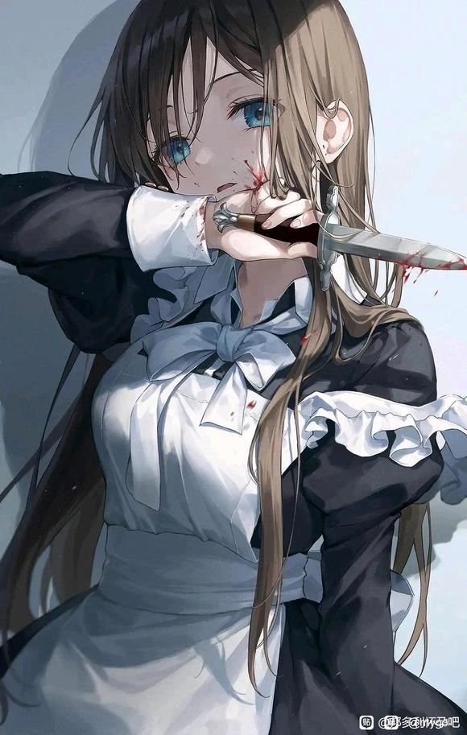
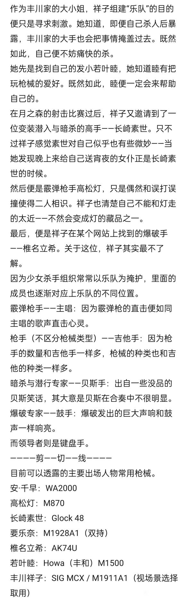

# Live House？大陆酒店？少女乐队其实是少女杀手组织？【邦多利怀孕吧】_百度贴吧

## 1

## 2

为什么东京有如此多的少女乐队？为什么live house越开越多，越开越大？为什么没有人看的live也能一天一天开下去？为什么live house的隔音效果如此之好？为什么老板娘会拄着拐杖？为什么乐队成员演奏水平日益参差不齐？为什么乐队成员心理状况日益糟糕？。。。这一切一切的答案，在思来想去之下，指向了一个方向——所谓的Live House RiNG，其实是类似大陆酒店一样的杀手聚集地。而一个一个一个一个的所谓少女乐队，其实是一个一个一个一个的少女杀手小队。“太拼命了”“尽力了吗”

## 3

RiNG里面的杀手小队，可谓百花齐放，各显神通。有以传统方式著称的PPP；以花道等艺术作为事后标记的AG；以缤纷色彩浮夸风行事的PP；以古典西方方式行刺的Roselia；了解外国人，负责对外事务的HHW；以化学武器、生物武器致幻杀人的Morfonica；平日行事神秘，但做事张扬的RAS。。。。以及本次我们的主角之一，新近成立的MyGO!!!!!

## 4

MyGO!!!!!一共五人，似乎并不是一开始便是此五人。其曾有一个名为crychic的前身。因为一些事情，crychic不欢而散，其原因至今无人知晓。“我从来没觉得杀人开心过。”这是当时crychic狙击手若叶睦的话，也标志着crychic的解散。至于MyGO!!!!!的组建，也颇有传奇色彩。从海外携带wa2000逃亡归国的狙击手安·千早意外的发现了霰弹枪手高松灯在事发现场捡拾霰弹枪弹丸。为了不被灯找到机会杀人灭口，也为了抱团取暖，她决定以千早爱音的化名接近高松灯。灯没有想到爱音会接近自己，甚至不小心在天文部室让自己的杀人计划《春日影》被爱音看到。为了不被爱音告发，灯也只好暂时同意爱音一起组建“乐队”的请求。只不过，逃亡至此的爱音不觉得自己可以和灯组一辈子“乐队”，导致灯不能放下心和爱音合伙而逃走。爱音追出去，结果遇到了之前与灯同一个“乐队”的暗杀者长崎素世和爆破手椎名立希。素世为了安抚爱音不被追下去了解更多，也出于某些目的想要复活crychic。她决定表面上与爱音联手，组建“乐队”。

## 5

在素世的撮合下，曾在crychic的灯和立希也就同意加入进来。但其他人很快发现一个问题：虽然爱音的wa2000相当的好，但是她的枪法却相当的烂。烂到立希怀疑爱音根本不是她说的“在伦敦大杀四方以至于被军情七处通缉不得不逃回日本”，而是搞砸了任务偷了枪逃回来的。素世倒是不在意，对她来说，爱音只是复活crychic的工具，事成之后灭口便是。于是在素世的劝说下，立希也愿意把行动方案改的简单些以配合爱音的水平。当四人在RiNG靶场试枪时，一个拉着箱子的白发异色瞳少女开门走了进来。“喂！野猫，这里不是你该来的地方！”爆破手椎名立希是见过这少女的，她名叫要乐奈，常来RiNG赊账吃抹茶芭菲，但是却没人计较。少女并未理睬，只从箱子里摸出两把汤姆逊冲锋枪，对着靶子一通连射，却完全没有脱靶。显而易见，哪怕爱音也看得出来，眼前这少女确实是一顶一的高手了。“打枪，爽。”乐奈看着靶子，满意的笑了。“野猫，你留下。”立希连忙把行动计划交给了乐奈。立希只能这么做，因为以乐奈的实力，把在场四人直接抹杀也未必不可能。

## 6

高松灯喜欢小动物，只不过喜欢的是捕杀动物，之后作成标本。受祖辈的影响，她自小便接触猎枪、霰弹枪，狩猎了许多动物。灯喜欢什么动物，就猎杀什么动物，然后将之作成标本保存在仓库里。但是她也有喜欢的朋友，她也猎杀了朋友，将之作成标本保存在仓库里。这之后，灯不得不转学到校风诡异的羽丘去，在这附近的学校，尤以少女犯罪者众多而扬名。虽然如此，羽丘在表面上仍是风平浪静。除了这里的同学大多背着乐器盒，嘴里说着RiNG、live、乐队等等灯并不熟悉的话语。直到她遇到了丰川祥子，祥子在桥上扑倒了伸手向树梢小鸟的她。为了给祥子包扎，灯便把祥子带到了自家的仓库。祥子也因此了解到，高松灯是用枪的好手。见识过灯的枪法和兴趣，祥子便邀请灯加入她的“乐队”。直到这时，灯才真正了解到——所谓的“乐队”，便是杀手小队的隐晦称呼。所谓的“live”，便是行动的隐晦称呼。所谓的“live house RiNG”，则是发布任务、训练枪法、倒卖军火、交流情报的——杀手集散地。

## 7

## 8

丰川祥子给自己的“乐队”取名为crychic，素世则把crychic上传到杀手网站上。凡是要接单的杀手组合，都是要在网上备案的，至于这有什么人会监管这个——只有死人才知道。然而直到进入靶场，众人才发现一个问题：高松灯不敢开枪。“明明只有你杀过人，为什么不敢开枪？”椎名立希冷静的评价道。“不要心急嘛立希，灯只是需要点时间。”素世的圆场被立希直接戳穿。“要大家一起等的话不如我们换个人来好了。”“我们先去猎场试试看怎么样？”祥子提出了一个看似合理的方案。于是五人便来到了猎场。只是打打小动物，五人却没人打第一枪，最终却是一声不吭的若叶睦打掉了第一只松鸡。这之后，至少从靶场上的表现看来，祥子看人的眼光确实没有问题。再然后，便是crychic的第一次任务。在素世完美的伪装潜入侦察帮助下，祥子也详细的研究好任务地点。睦的瞄准镜早已调好，准确无误。而立希的炸药剂量也计算完毕。一切都如此完美。睦找到制高点架起枪。素世帮助大家化装进入地点，立希在爆破点固定好炸药，灯则带头突入。只不过当目标倒在高松灯的枪下，丰川祥子才看清那人正是自己的母亲。来不及悲伤，素世驱车载着众人逃离现场。一切都如此成功。。。。。。。丰川家将祥子和其赘婿父亲赶出了家门。祥子也退出了crychic，但是其他人并不知道缘由，除了和祥子一起长大的若叶睦。

## 9

千早爱音，或者说怪盗安·千早。她曾经渴望在英国打出自己的一片天。但是因为人生地不熟，加之技术生疏，只落得替苏格兰场干清理街头流浪汉之类的脏活。“还不如回日本呢。”想到这里，她便想起在日本的好日子来。不过在那之前，她还是先去枪械火炮博物馆选了一把最喜欢的枪带回了日本。“就当是大英帝国补偿我的咯？”只不过回到日本，千早才想起，日本杀手都是要组团狩猎的。至于独狼——要么强，要么死。显而易见的，千早并不是什么特别强的选手。只不过她总是有那么些好运气。只不过今天她的运气似乎没有那么好。她循着钢琴声摸进一间教室，但是里面却没有人。但是她感觉自己好像被一个金属柱状物抵住了后背，她便习惯性的举起双手任凭对方搜身。但是好在对方搜身没发现什么武器，便先开了口：“你来这里是有什么事情？”“我想组个‘乐队’，不过人还缺一些。”“千早爱音？没听说过的名字，请你不要再过来了，我没有加入你‘乐队’的兴趣。”对方把千早的学生证塞回她的口袋，然后把她推出门外，关上了门。“好怪的人啊，诶，小灯，我们走吧。”

## 10

月之森的恶妇——这便是长崎素世在各个“乐队”之间流传着的称呼。至于这个称呼的来源，有人说是来自她杀人的方式往往令人痛苦万分；有人说是她连队友也不会放过；更多人则是对未知的恐惧。长崎素世可能以任何身份出现在你身边取你性命的恐惧。不过千早并不担心这一点，见素世今天身着女仆装便情不自禁的使唤起来。“素世，帮我按摩一下肩膀。”“帮我拿杯红茶过来。”“素世，我想吃巧克力面包。”就连一旁的椎名立希看了都要瞠目结舌：“这粉毛怎么还活着啊？”“爱音酱，我不是你的女仆呀。”素世一边给千早按摩一边笑着说。“我知道我知道，我这是帮你训练潜入技巧。”千早姑且享受着女仆按摩服务。只不过她马上感觉到有什么锋利的金属物体架在了她的脖子上。“我也帮你训练一下防范暗杀的技巧怎么样？”

## 11

然后说安·千早一定有什么出类拔萃的方面，投降和求饶是一定有的。当她带着哭腔打着哆嗦连尿都流出来的时候，长崎素世也就没继续为难她了，只让她去换衣服并且把尿擦干净。毕竟对素世来说，千早爱音现在还不能死，一个听话的活人往往比十多个不听话的死人有用。不过。。。“爱音酱好像不是很听话啊？”长崎素世感觉自己的脑袋被枪口指着，顶着。“女仆就要有女仆的样子，现在，跪下，给我把地上舔干净。”当着椎名立希和高松灯的面，素世跪了下去。如同猫咪舔食牛奶一般，舔舐着地面上的水渍。

## 12

长崎素世其实有一种从骨子里渴求着的被征服欲和被占有欲，而千早爱音现在刚好满足了她。对于爱音来说，素世的力量并不怎么强。在身上的暗器被摸了个精光，外加吃了爱音两通打再加扣晕了三回之后，她更是变成了爱音怀里一只穿着女仆装的小狗。此正所谓一力降十会。“果然素世你就是个只记打不记吃的坏狗狗。”所幸爱音打人熟能生巧，她可舍不得把素世打坏，故而素世只是在爱音怀里尚未从余韵中恢复而已。爱音知道，再扣一回，素世定是要彻底昏过去的。由此爱音与素世便达成了某种默契——素世喜欢上了爱音的手法，爱音喜欢上了素世的手感。“她们俩怎么不打了？”一旁的围观的乐奈吃着抹茶芭菲向立希提出疑问。“不知道，可能是要结婚生孩子了。”立希从头到脚的感觉二人肉麻。

## 13

今天的作战训练因为素世失去作战能力而不得不中止。在场所有人一致同意罪魁祸首爱音负责收拾好场地把素世护送回家。只不过灯也留下来帮忙，所以立希也留下来帮忙。要乐奈则提枪而出，以她的水平，也确实可以以独狼身份出击。只不过爱音把素世带回了自己家。“把这当成自己家就行，希望你不会太认床。”爱音刚放下吉他包便把素世抱住。“素世你好香啊！”虽然素世很享受和爱音一起do，但是她还没忘了复活crychic的大计。不过现在的事情她还是以“暂时迷惑千早爱音”为由说服了自己，只是站在那里任凭爱音为她宽衣解带。好像事成之后留她一命也不是不行。

## 14

次日，月之森的教室里，若叶睦最先发现长崎素世今日似乎格外疲惫。既然如此，自己是不是有些接近她的机会呢？睦在月之森加入的社团是园艺部，而园艺部名义上是凭各人爱好随便种些，实际上则是Morfonica重要的生化原料来源。睦种的黄瓜也在其中，也有些奇怪的作用，她每天领素世一起浇水也有让素世吸入花粉之类物质的用意。只要类似的物质吸入多了，就会日渐虚弱而且渐渐离不开，而其发挥作用的秘密只有Morfonica的“主唱”仓田真白知道。作为园艺部干部的若叶睦也只是知道其中很少的作法。但是用来对付长崎素世足够了。若叶睦想要把长崎素世变成自己的女仆、恋人、⭐奴隶、老师、朋友、宠物、主人、亲人、心理医生。。。但是若叶睦毕竟不擅长近身战，她想要打到素世身上的针管此刻落到了素世的手上，而自己则被按在墙上。但是素世没有一直按着她。素世清楚睦的实力，只能在视距之外拿枪把自己打死打伤，既然愿意近身，便不是真心想对自己下手。她把针管小心的插入睦的静脉，注射。睦便再也无法按捺自己的情感，抱住了素世。

## 15

把若叶睦放到凉亭安顿好，素世便要去RiNG见她的队友们。经过昨天的事情，被爱音架着近乎于拖出RiNG的长崎素世可谓一败涂地。而千早爱音则一跃成为RiNG新的传奇。“那女人把月之森的恶妇打至跪地，还带回家当⭐奴隶啊！这便是今日素世听到过的讨论。所幸是队内纠纷，还不至于让那些小喽啰把素世看的太低。但是当她走入训练室，却看到——乐奈和立希正用枪指着对方。“野猫，谁让你动我东西了？”“别拿枪指着我。”两人一副马上就要同归于尽的样子。“你们两个都把枪放下。”素世放下自己的贝斯盒，与吉他手个个装枪不同的是，贝斯手的乐器盒往往会带几件衣服和一些工具。话虽如此，她也摸上自己身上的Glock 48。“素世，这野猫拿我雷管当鞭炮玩！”立希冲素世怒吼着。“要是灯拿着玩你不是巴不得把你钱全买雷管给灯玩？”素世直接戳穿椎名立希双标的事实。”把你那破枪放下，雷管我给你买上。“”分明是她那一战玩意更tmd破。“立希无奈的把枪放下，拿出一支烟要抽，却发现一次性火机没了气。乐奈则冲着靶子打空了子弹，吃起化了一半的抹茶芭菲。素世躺到昨天爱音接受按摩的躺椅上，显然她还没有恢复过来，只能祈祷那粉毛今天下手轻一些。

## 16

所幸今天爱音可能是来不了了，以后可能也来不了了。她正在和高松灯玩可能是两人一生一次的捉迷藏。准确的说，是高松灯端着M870在一间一间教室搜索她。走廊要到尽头了，她只能冲进走廊尽头发出钢琴声的教室。然后，在面前刚刚停下弹钢琴的蓝发少女掏出手枪瞄准自己之前一拳把她打倒。虽然不知道这人为什么在这弹钢琴，爱音还是捡起她的手枪，检查了一下弹匣，便看向脚边的少女。“这就昏过去了？体格好差。”一刻也来不及为地上的少女担心，爱音躲到进门前披萨饼检查的死角埋伏好。所幸灯似乎也没有真要杀爱音的想法，进门一被爱音用枪指着便放下枪来。“是小祥啊？”只不过她又看到了地上的蓝发少女，便走了过去。“灯，你认识她？”听到爱音发问，灯也点点头，只不过又把枪瞄向了蓝发少女，然后踢了她两脚。“别。。别打我了。”醒过来的蓝发少女抱着头蜷缩起来。“祥子，我们还是不是朋友？”灯蹲了下去，用枪戳了戳她。“杀了我吧。”得知来人，祥子反而不再挣扎，放松了身体坦然赴死。“我不杀想死的人，你可以自我了断。”灯把爱音拿着的枪丢到地上，拉起爱音的手便走。“祝你幸福，下辈子。”

## 17

一刻也来不及为凉亭里的若叶睦和地板上的丰川祥子悲哀，马上登场的是——在椅子上试图拆掉身上炸弹的八幡海玲。八幡海玲是流窜于三十多个“乐队”的雇佣兵贝斯手，毕竟比起打枪放炸弹，潜入确实是一种技术活。而至于她为什么在拆炸弹，则是另一件事——她无可救药的爱着椎名立希。为了不被这家伙打倒在地抓回家作★奴隶，立希倒也是煞费苦心，首先是把加了料的牛奶冻交给海玲。海玲纵然知道，可也是立希送的，她便是毒药也喝。好在立希不是滥杀无辜之人，只在她身上绑个定时炸弹便匆匆离去。虽说是定时炸弹，这炸弹却是位置触发，定时则是取消触发。在海玲看来，这甚至又成了立希心里有她的一大表现。——————————八幡海玲的常用武器：AAC蜜獾

## 18

一刻也来不及为凉亭里的若叶睦、地板上的丰川祥子、绑着炸弹的八幡海玲悲哀，马上登场的是——即将成为⭐奴隶的传奇枪手组合sumimi成员三角初华。此时此刻，初华正对着crychic的通缉公告看的出神——是的，虽然杀人和死人十分常见，police们仍有限的发挥着作用，比方说发布一些可能有其他杀手看到之后完成的悬赏通缉。因为这个，police甚至也成为RiNG的一大主顾。crychic虽然只作过一起案件，但是却杀到了财阀的头上，悬赏仍是不低的。只不过对初华来说，也只是苍蝇肉而已。她真正在看的，是照片上下落不明不回消息的发小丰川祥子。她习惯性的接过同伙纯田真奈递来的甜甜圈，只不过刚刚下肚，便感觉到手脚麻痹。她便知道这家伙又往里面掺东西了。真奈喜欢自己，初华十分清楚这一点。只不过为了sumimi能运行下去，真奈还不会做太过分的事情，初华也会满足真奈的需要。今天也只是扣到初华药效过去开始推搡自己而已。————————————三角初华的常用武器：MK18纯田真奈的常用武器：G36C

## 19

一刻也来不及为凉亭里的若叶睦、地板上的丰川祥子、绑着炸弹的八幡海玲、瘫软在沙发上的三角初华悲哀，马上登场的是被安排卧底RiNG的警校生佑天寺若麦。“诶？我去RiNG卧底？真的假的？”直到佑天寺若麦被分配到了“喵梦”的代号，她还是相当的不知所谓。所幸上级没有直接让她进RiNG大张旗鼓要组“乐队”，而是告知她有一个叫丰川祥子的前crychic“乐队”成员正在试图纠集人手报复RiNG，居然也联系到了警局。而要警局派出卧底，自然是样貌年轻，平时行事也没有警察样子反而性子十分活跃的佑天寺若麦。为了向前crychic的成员报复以及东山再起，为了把前crychic的成员抓到做自己的⭐奴隶（或者自己成为对方的⭐奴隶），为了和祥子共度余生，为了公平和正义选择服从命令卧底杀手组织。“键盘”丰川祥子、“吉他手”若叶睦、“贝斯手”八幡海玲、“吉他主唱”三角初华、“鼓手”喵梦亲。便组成了新的杀手组织Ave Mujica，祥子还为每个人都取了难懂的代号。为了撮合众人，祥子做出了许多妥协。1、不可以伤害长崎素世和椎名立希，尽量避免与二人敌对。如果不得不与此二人敌对，应考虑非致命非致残武力或先行撤退。2、丰川祥子不可以以身犯险。3、不可以伤害无辜者，喵梦亲不参与对无战斗能力者的加害。————————————佑天寺若麦的常用武器：HK USP 9x19mm

## 20

人到齐了，可以开杀了，我先沉淀

## 21

作为危害最大毒害最大，也是最破坏规矩的“乐队”，化学工艺日渐完备、实力日益强大的Morfonica常年受到各方势力的通缉。只不过在这之前，虽然其核心仓田真白不问日常事务，Morfonica其他人仍在各方势力之间保持着平衡并且控制着月之森。但是随着她们实力越来越强，警方和RiNG也越来越难以容忍。如今丰川祥子成立了Ave Mujica，对自己实力相当自信的她，此刻便需要一个投名状，一个可以让警方和RiNG都满意的投名状。新“乐队”的加入似乎即将成为压垮Morfonica最后的稻草。MyGO众人亦是初出茅庐，只是乐奈擅自报名了对Morfonica的共同悬赏任务，从而达到了发起任务的战力要求。然而任谁都知道，虽然MyGO在排行榜上总排名不低，任务中另一个名叫Ave Mujica的“乐队”也堪称银河战舰般豪华。但是两队人马也都有一个一模一样的组建磨合期问题。好在PPP承诺会给与武器装备协助，作为明面上的RiNG员工，她们自然要打压风头正盛的Morfonica。只不过她们给的东西在参战人员看来多少有些清库存的嫌疑，这嫌疑明显到只有乐奈能熟练运用她们送来的军火。但是Morfonica不会坐以待毙，长期运营月之森资源的她们此刻便动用起资金和化学品资源，试图和悬赏金比拼价码。虽然RiNG众乐队各怀鬼胎，但是也不乏有情有义之人念及旧日情分不愿下场趟浑水。只有HHW为了维持自己销往海外的化学品来源出手相助，不过其力度之大，倒也让人惊叹HHW的财力。几天之内，月之森已然化作一座戒备森严的堡垒。幸或不幸，MyGO和Ave Mujica都尚有一人在月之森内部。

## 22

为了尽可能收集情报，参与“live”的两支“乐队”都没有及早撤出自己在月之森的人员。无论如何，若叶睦都要护得长崎素世周全，便决定在行动日前一天提醒素世。长崎素世的本意是复活crychic，要复活crychic，若叶睦便不可以死，她也决定在行动前一天提醒睦。但是她们低估了Morfonica捍卫自己领土、权力、利益、名誉的决心。当月之森的通风管道开始放出蓝色的烟雾，马上便有人目光呆滞，脸上也浮现出笑容。若叶睦知道一些Morfonica的计划，可她没想到她们竟如此胆大妄为，试图把全校的学生当作打手和肉盾。她只有强撑着喂素世吃下自己以实验为由拿到的唯一的解药，之后一头撞昏过去。长崎素世是如此看重crychic，同时她也知道自己为什么没有受到身边同学们一样的精神影响。她扛起若叶睦，试图从最偏僻的暗门逃走。只不过月之森早已遍布监控。素世在即将接触到阳光之时看到了阳光下身旁环绕大蓝闪蝶的仓田真白，以及她身后的Morfonica众人。“学妹，还没到放学时间吧？”八潮瑠唯亮出了西洋剑。

## 23

“真是令人感动的友情啊，可惜到此为止了。”仓田真白关上了素世逃离的唯一生路。而长崎素世，虽然她有着永不放弃的决心，可背负若叶睦逃到出口已经几乎耗尽了她的体力。要依靠匕首对抗西洋剑，显然过于异想天开。随着血液从伤口流出，素世的身体逐渐麻木和冰冷，她便只剩下最后的机会。长崎素世试图挟持仓田真白以威胁其他人退下。不过她只刺中了纷飞的大蓝闪蝶。长崎素世失衡倒在地上，眼前却看到若叶睦睁开无神的双眼。她便用尽最后的力气，爬到睦身上，吻了上去。[若叶睦，我知道，这样你一定会醒。]若叶睦睁大双眼，瞳孔也不由得颤抖，之后便心领神会闭上了眼。与此同时，月之森安保监控室内。“真是令人感动。”仓田真白突发奇想。“先让她俩多活一会。”——————————————与此同时的RiNG作战会议室内，MyGO、Ave Mujica，以及代表RiNG和PPP的户山香澄，齐聚一堂。“按素世说的，现在她估计凶多吉少了，你们在月之森的线人呢？”爱音看向面前全副武装戴着防毒面具的四个人里面看起来有点眼熟的蓝发少女。“Mortis没来过消息，估计也没能跑出去。”丰川祥子反复检查着弹药，似乎也有些不安。“你们两个是说还没开打，你们就少了两个人？”户山香澄听完两位后辈的交流，差点笑出声来。“牺牲是在所难免的吧？至少她们把情报传出来了。”椎名立希在桌面上摁灭烟头。她有些好奇，海玲为什么最近没有找她麻烦，莫不是也卷入了这大麻烦？虽然自己不怎么喜欢她，不过好歹她还给自己带烟带牛奶冻来着，似了那不是凭空少了贡品？“那你们还打不打了，不打记得退违约金，就你们两边这么一闹，别人再打月之森都难上天了。”香澄把合同拿出来放在桌上。“恰恰相反。”千早爱音由香澄看向蓝发少女，蓝发少女便接着说。“我们不是会抛弃队友的小人。”“那就好，快去干活吧。”户山香澄把笑容收起。“立希，修桌面的钱从你工资里扣。”

## 24

作为警方的诚意，警视厅按祥子和喵梦的说法，调集来所有可能的警力堵住正门以吸引火力和注意力。之后，因为长崎素世和Mortis已经身陷囹圄，八幡海玲也不清楚月之森具体情况，侦察工作只有交给精通无人机操作的喵梦，狙击任务只有交给半生不熟的千早爱音。“这可是我从警局偷来的最新科技无人攀附侦察机器人。”众人看了或多或少有些眼馋，却不熟悉操作，只能让喵梦来用。至少警察的围堵起着作用，月之森的绝大部分学生和桐谷透子确实在正门方向布置。只不过，还有其他人也埋伏在附近，而隐蔽点是有限的，不同的乐队也会不是冤家不聚首。从某个角落传出了一声枪响，战斗便马上开始，枪炮在四面八方作响。。。。千早爱音无法忍受有人夺走她心爱的长崎素世，虽说只是肉体关系，她毫不犹豫的瞄准了对方的一线指挥官。但是在突击指挥Oblivionis的建议下，暂时没有开枪暴露自己。佑天寺若麦科班出身的技术本领确实不错，此时已经接入了月之森监控，通过监控汇报着敌人信息。高松灯手持重型防爆盾掩护众人，椎名立希和Timoris负责破门侦察，Obilivionis和Doloris则负责火力支援。至于要乐奈，从行动开始后便不知所踪，说了一句：“我去救人。”后不知去向。虽然Morfonica的化学战水平很高，但是对方已经做好了防化准备，便只有拿出真本事来。

## 25

要乐奈第一次遇上了令自己兴奋的对手——动力装甲米歇尔mk1。虽然缺乏重武器，但是肆意妄为的要乐奈一路打爆摄像头的习惯此刻倒是成了一大好习惯。奥泽美咲在第一时间呼叫了自己的队友，不过显然她们一开始过于相信米歇尔的单兵作战能力，此刻一时半会无法赶到。但是要乐奈的单兵作战能力也同样强悍，此刻，她已借助烟雾弹从米歇尔受限的视野里消失。然后便是美咲痛苦的喊叫与哀嚎。一颗不知从哪里抛出的手雷在米歇尔的膝盖连接处后侧炸开。虽是破片手雷，不足以破防米歇尔的复合装甲，仍把美咲的膝盖震伤震裂，让她站立不稳，跪倒在地。在这之后，奥泽美咲实质上已是死人，因为要乐奈不可能手下留情。HHW和Morfonica在月之森指挥系统里争执不休，要乐奈却已前往下一处战场。

## 26

弦卷心在月之森指挥频道痛苦而愤怒的质问仓田真白，不过仓田真白并没有兴趣听下去。此刻她唯一有兴趣的事情便是观察禁闭室内的两个小学妹，他们两个当时到底是出于什么样的心情呢？真白在监控室反复的思考着。素世经过了简单的包扎和输血后逐渐清醒过来，也逐渐感觉到自己躺在陌生的床上，只不过身上扔了个不怎么陌生的人。她马上想起了昏迷之前的事情，也想到自己可能正被监视着，便慢慢装作不太舒服，把睦弄到自己身边。奇怪的是睦却也是醒着的，想到这里，既然Morfonica此刻没有杀死她们二人，势必有更坏更大的谋划。然而她感觉睦不老实的手却伸向她的裙底，素世刚想发怒，但是却感到睦是以某种频率——摩斯电码抚摸着她。于是她也把手慢慢伸向了睦的裙下，二人就这样交流起来。“动物死前果然会想要交配啊。”真白饶有兴致的看着监控。。。。但是来者从多个方位的进攻并不会在真白研究人类的时候就此停止。要乐奈和突击小队正从不同方向突入月之森内部。m正门方向，虽然暂时抵挡住了警察攻势，但是进入掩体对峙之后，精神毒气控制着的高中女生终究不敌专门训练过的警察和警校生，逐渐败下阵来。但是一辆90式主战坦克从月之森开了出来。今夜，弦卷心要所有人为米歇尔陪葬。

## 27

素睦二人此时自然是手无寸铁，对外的联系方式更是没有。睦坐起来看了看周围，四周都安着监控。该说不愧是月之森吗？连禁闭室都有双人大床。睦下床去开门，门自然是打不开。至于窗户，则是根本没有。于是她抱着试一试的心态——目前其他大部分人还不清楚她们两个现在的“乐队”，最多知道已经解散的crychic。“有人在吗？”她分别向门外和摄像头发问。只是连回声也没有传来，睦便想要回到床上和素世一起。素世因为伤势还未恢复，早已睡了过去。[和素世一起死在这里，倒也不错。][但是我还是想和素世一起活下去。]只是房间里，完全没有可以给她使用的工具，甚至没有任何可以破坏和拆卸的东西，除了被褥和枕头。睦用身体撞门，门也纹丝不动。“好啦好啦，小睦想出去的话，就杀了素世酱吧。”“记得要快一点决定哦。”仓田真白离开了监控室，她要去和闯入者谈一谈。

## 28

在烟雾缭绕的连廊通道上，七深和乐奈仍在对峙。疼痛不会让要乐奈退缩，只会让她感到战斗的快感。所幸七深只打到乐奈的肩膀，只不过这对七深来说却是不幸。明明是自己打到了对方，为什么此刻却是自己胆怯了——广町七深萌发出这样的想法。中枪之后非但一声不吭还能和自己对峙的家伙，确实值得自己恐惧。但是烟雾正在散去，七深在紧张的搜索对方。只不过直到烟雾全部散去也没有发现那个中枪的家伙。“中计了！”此刻七深并不知道对方是逃走抑或前进。她向真白呼叫查看监控，却没有得到回应。。。。另一边，突击小队五人分作两组，分头搜索。高松灯和椎名立希为一组，Ave Mujica三人为另一组，为保持平衡，祥子让喵梦多去关注灯一面的监控动向。但是仓田真白出现在了Ave Mujica三人的面前。她面向她们举起双手。“你们带不走我。杀了我，你们也一样会死在这里。”“如果你们离开，我会帮你们付齐任务违约金，并且把HHW在月之森的权利转交你们，如何？”

## 29

丰川祥子曾崇拜过Morfonica，这是不争的事实，至少前crychic的其他四人都知道这件事情。但是她们四个现在有两个身陷囹圄，另外两个则根本不知道祥子的身份而且和祥子分开行动。祥子也深谙利益交换的道理。虽然真白开出的条件看起来很充裕。但如果自己现在反水，则很可能落得HHW一样的下场。“你不是在说笑吧？违约可不只是付钱这么简单，你也能看到，条子和RiNG的人已经把月之森围的一只鸟也飞不出去了。你现在投降的话，说不定还能留一条命去给他们干活。”“你转学走就是为了毁掉月之森吗？”真白看起来完全没有投降的意思。“我们可是愿意为月之森付出生命的呀，长崎酱和若叶酱也是这样认为的吧。”“我和她们两个没有关系，她们要怎么做是她们的事情。”祥子仍强装镇定。“还真是高高在上阿。”真白见无法说服来人，便束手就范。——————————————乐奈并不是胆怯退缩或者宽宏大量的人，恰恰相反，除了亲密的人之外，她不会允许伤到自己的人活着，更不会让对方痛快的死。乐奈自然没有跑开，她联系上爱音“我需要无人机看一下走廊窗口里面。”爱音虽然不知道乐奈在做什么，但是对于队里的战力天花板，她仍然十分信任。她接过喵梦递过来的无人机显示器，不太熟练的飞到可以看到走廊内位置的方位，向乐奈汇报过去。要乐奈即刻再来战广町七深，在七深反应过来调转枪口之前，乐奈已经破窗而入。双方已接近到枪械无法起作用的距离，便只有如野兽般互斗。

## 30

广町七深果断的和要乐奈厮打在一起，作你死我活的困兽之斗。“力气好大，明明都中了一枪。”七深渐渐力不能支，被乐奈按在身下打的无力还手，连防毒面具都被打飞。这时，爱音接到了真白投降的消息，于是向乐奈通话：“尽量抓活的。”乐奈自然不想放过这个打了自己一枪的家伙。“怎么把她弄出去？”七深此刻已被打至有气无力了。“喵梦，你看看乐奈怎么和其他人会合比较好？”爱音于是向喵梦询问路线。“你投降吗？”乐奈拍了拍七深被打的满是淤青和血迹的脸。七深姑且也还想活着。“我投降，我投降”乐奈为了让七深没有反抗的机会，便折断了她的手指。广町七深的尖叫连看守禁闭室的八潮瑠唯也听得到。

## 31

瑠唯把禁闭室里依偎着的二人逮了出来，但为了不至于控制不住，就把睦重新关了回去。她试图按真白的说法，用现在这人去换她们。素世一出门便听到枪声四下里作响，如果要杀自己立威，拍一个视频就好，自然不必带走自己。“你要绑我去讲和吗？”素世冷静的发问。“少管闲事，把你打晕了带过去也一样。”瑠唯并不怎么想理她。“真想谈判就让我去说，要不然你们一样是死。”素世提出了自己的意见。“但是你要带上你那相好的姑娘是吧？”瑠唯站定，看向面前的素世。“你放心，现在我们俩加一块也打不过你。”素世面露微笑。“更何况我们本来也没想打。”想到七深也被抓了，瑠唯只好去把睦也带出来，押送二人前去谈判。只不过为了保险，她还是把二人捆到了一起。话分两头，另一面仍是不太平。椎名立希和二叶筑紫在野蛮的相互投掷着爆炸物，所幸月之森的设计强度尚可。立希躲到灯的防爆盾之后，而筑紫只有用月之森学生的尸体或身体阻挡爆炸。虽然立希不愿承认，但喵梦提供的情报确实给了她非常大的帮助。

## 32

双方携带人质在会议室见面，但双方最适合谈判的人选恰恰也在人质里面——掌握着化学合成技术的真白，和当前最了解双方情况的素世。在一番谈判过后，Morfonica同意全员投降，前提是不把她们交给RiNG，而是交给警察。至于弦卷心则交给RiNG，让RiNG在她身上榨出足够的油水达成平衡。于是MyGO!!!!!和Ave Mujica的初次live顺利落下帷幕。战果则是Morfonica全员被捕，HHW在实质上全灭。然而对方却拒绝了素世发出的庆祝邀请，只有若叶睦参加。虽然素世向睦解释过自己对她并没有多余的感情，睦还是紧紧的贴在素世身边。素世另一边则是刚刚把自己的星怒从龙潭虎穴救出来的千早爱音，只要一个眼神，素世便明白到今晚将会怎样了。但是庆功宴还是很丰盛，酒保户川香澄也新上了一杯名叫Happy Happy World！的新款鸡尾酒。在RiNG，只有死人和所有人共同的敌人可以有用自己命名的酒。只不过众人都很没酒品，立希抱着灯踢飞了的鞋子舔，高松灯把打空子弹的m870捅进千早爱音的嘴，爱音的手一早就揉着素世的胸，素世把若叶睦当成丰川祥子大倒苦水，睦则用着素世的格洛克手枪紫薇。醉倒在地板上的要乐奈是最正常的一个。

## 33

另一边的Ave Mujica，正在开着缺席一人的作战总结会议。说是总结会，实际上就是头子丰川祥子在训话。“首先要表扬喵梦桑在本次任务中表现出的极佳专业性和强悍的实力。”任谁都知道，不是所有人都玩的来骇入监控系统这种事情的。“表扬？我？真的假的？”喵梦手上却是第一次沾血，虽说死者是杀人无数的HHW，但她仍有些过意不去。如果她可以选择的话，她更想瘫痪那辆90式逮捕里面的人。此外，她也把赏金交给了警局，只不过警局以“卧底也需要活动资金”为由并没有收下，这也是她第一次见到如此之多的钱——可以买上各种各样想要的军用小道具了。全场只有初华一个人鼓掌。“其次说一下海玲，你就差没给立希挡子弹了，我不希望如果有下次你还是这样。”祥子转头看向海玲。“既然如此就下次你就看好了别接和她们一起的，再说了就差没给别人挡子弹的也不是就我一个，给你挡子弹的那个你怎么不说？”海玲倒是毫不慌张的吸着牛奶冻。“那就是我下一个要说的，初华，你不要老是往我身前站。”祥子话音刚落，初华便点头如捣蒜。她又看向任务报表，心里盘算着一些事情。“好像对面那个叫要乐奈的吉他手挺强的，要不要试试挖过来？”“那是RiNG的野猫，不服管教的，上你这来半天不到你就得吃枪子。也就MyGO!!!!!那种基本上没什么组织性纪律性的乐队她才呆的住。”作为老练的贝斯雇佣兵，海玲对RiNG的了解比绝大多数人要好。

## 34

人人有枪的世界并非一直不乱，当矛盾超过武力构成的制衡，就势必会乱起来。Afterglow的主唱吉他美竹兰总想金盆洗手回家继承花道事业，事情早已传的人尽皆知。只是最近发生了月之森战役级别的会战，更有HHW和Morfonica的前车之鉴，这便导致了兰更加坚定了自己退队的想法。显然Afterglow的其他人不会坐视不管，于是决定依靠一场“演习”让乐队重新团结一致。学生会长茨菇的声音从扬声器传来——“羽丘全校正遭到攻击！”“今天，我们为被害的同学哀悼！明天，我们就要让凶手付出代价！”“羽丘不会允许，对我校领土领空的入侵，或对校风的干涉！”“我们伟大的学校拒绝屈服，共同的损失让我们更加团结一致！”“我们其他学校的朋友们，要为可耻共谋入侵羽丘，做出回答！”为了确保安全，学生会事先已经通知过全校换装空包弹。但是这不代表不会有人故意不小心上实弹，比如高松灯。好在从接到通知的那一刻，千早爱音和丰川祥子就做好了马上开始逃离的准备。不太妙的是她们俩选在了同一个路线上。如果你和另一个人同时被野兽追逐，你只需要跑的比另一个人快就好。“千早 ，你别怪我无情！你跟她一个乐队的，你去陪她！”祥子对身边的爱音使用了肘击，只不过没有命中。“要不是你先跟她说组乐队就能杀人，我会被这么追？”爱音连枪都没拿，身上摸了一遍就找着一把昨天晚上在⭐奴隶长崎素世家里当玩具不小心顺出来的不知道里边有没有子弹的格洛克。“先一块跑了再说，你再肘我我打断你腿！”

## 35

高松灯从来不介意误伤到谁，也没有人觉得她不是羽丘最强的霰弹枪主唱。本应让羽丘团结一致的演习现在已经变成了灯的捉迷藏游戏，灯在追，祥子和爱音在躲，如果有其他人阻挡到灯，后果相当可能是被一枪轰飞。高松灯，不可阻挡。何况她要杀的两个人，一个是没朋友的祥子，另一个是转学过来的爱音。整个羽丘也找不出一个愿意为了这两人阻止高松灯的人。就算是整个东京也未必找的出几个。所幸爱音是知道的，至少有那么一个人虽然不会来救自己，但是会来救祥子。“喂！沟槽的素世，快来羽丘救我！灯在追我！我tm知道你不来，祥子也在被追！”显然祥子是不愿意让素世来救的，她同样知道一个人，会来救自己，而且不会愿意让素世冒险。“睦，你听我说，别让素世出学校，她出学校就要来羽丘，就会有危险，你快把她留在月之森然后过来帮我一下！”但是爱音也听得到祥子打的电话。“素世，小心睦！她要把你留在月之森不让你来羽丘见祥子！什么？会赢的？好好好！”与此同时的月之森走廊上——与此同时的长崎素世和若叶睦——“DOMO，长崎素世=SAN，若叶睦DESU。”睦在手上缠好了绷带，摆好了架势。“DOMO，若叶睦=SAN，长崎素世DESU。”素世则只是活动了一下筋骨。这便是月之森的新任学生会不知道从哪里借鉴来的不知道什么规章制度，打架之前要先问好和自报家门。但是睦显然没有丝毫胜算，在和素世近战这一对局上，她从来没有赢过。但是素世也不是什么无情无义之人，她知道对睦来说，只要睦输了自己就算努力过了，就可以理所当然的听自己的话了。素世拉上睦向羽丘奔去。

## 36

经常负责潜入类任务的素世，她的低音提琴盒里，不会没有羽丘的校服。但如今既然还要带上睦，睦又是非要进去不可的，她就要另作打算了。“羽丘那边好像在搞什么演习？睦你就充当被我抓来的月之森学生吧。”反正睦的近身能力不能说没有，只能说完全没有练习过。这也是她每次都可以名正言顺的听素世话的一大理由，或者说借口。素世给睦打了个活结，随即通过口才说服羽丘门卫之后进入了羽丘。但是此时的羽丘，不说一盘散沙，也是在灯的搅局之下，变成了个人竞技大乱斗。身穿月之森校服的睦自然被名正言顺的人见人打，虽然大多都是空包弹。此时的祥子和爱音则已经快被逼上了天台。“我才不要和你同年同月同日死！”祥子把课桌丢到路口，试图阻挡灯的脚步。“素世来了，素世来了！”爱音拿着手机叫喊起来。“素世！我们在顶楼这边，你再不过来就用不着过来了！”听到这个，素世和睦也不管什么了，顶着枪林弹雨就往楼上冲去。。。。此时此刻的天台上，Afterglow五人中的四人仍在轮流开导美竹兰。晓之以情、动之以理、威逼利诱、以***。四人为了挽留美竹兰可谓费尽心思，全然不顾羽丘已经热火朝天。可惜天要下雨，娘要嫁人，兰要退队，这都是拦不住的事情。天不合时宜的下起雨来，但是五个人谁也没有离开的意思。

## 37

在迫近灯的位置之后，素世只让睦想办法绕路去找祥子和爱音，然后把带来的手枪和弹药发给她们。“素世要一个人去找灯？”只不过睦也有着自己的考虑。“太冒险了，不如让立希她们也来。”然而素世没有同意，月之森偷偷进来两个人尚且说的明白，如果花咲川来人，势必不可能是“偷偷进来”，而是成群结队大摆阵仗从正面强攻了。在花咲川，哪怕是“贝斯手”“鼓手”“键盘手”，绝大部分时候也是在负责强攻类任务的。羽丘则只主打中规中矩，各司其职。月之森出产的“乐队少女”，各个都是“花架子”，实战未必强于其他两校，但是一定是有自己一技之长的。比方说长崎素世，她就精通更衣潜入，哪怕设卡检查，她往往也可蒙混过关。与此同时，高松灯并没有闲着，端着m870身着防弹衣，她自然是跑不过两个猎物。不过她也并不需要跑过谁，羽丘的上几个楼层她再熟悉不过，她只要慢慢逼过去就好。“小爱，小祥，我们要组一辈子‘乐队’。就让我来帮你们结束这一辈子吧！”她轻而易举的把祥子和爱音设置的障碍轰碎，踹开。这时她突然察觉到身后似乎有什么人在接近，也许是细微的气流扰动让她察觉到了这一点。她飞快的转身，而枪口则转的更快，在她看到对方之前就已经开了一枪。与枪声同时爆发出来的不止有弹丸，还有催泪瓦斯和烟雾弹。素世顺势试图夺下灯的霰弹枪，她知道灯只会用霰弹枪或者土制猎枪杀人，这也是灯的一种——大概是哲学？习惯？爱好？习性？貌似都不太准确。灯屏住呼吸，在她不得不吸入催泪瓦斯之前，她要先制服素世并且退出瓦斯覆盖的范围。因此她果断的放开枪，试图先制住素世。然而素世毕竟人高马大，而且专职格斗，离了霰弹枪空有蛮力的灯哪里是她的对手。不多时就败下阵被素世铐了起来。高松灯不会善罢甘休的，谁都知道灯不会善罢甘休的。但是至少这一次，现在，祥子和爱音是保住了性命。

## 38

与此同时，几米的高度之上，有另外一些不会善罢甘休的人。杀手组织当然有不能退出的不成文的“规矩”，还有很多其他的规矩。但是这些规矩在真正有需要有必要去违反的人看来，并不能够约束到什么。但显然afterglow的其他人并不想惊动RiNG，就算需要援手也只打算考虑羽丘校内的人手。刚好高松灯刚刚肆无忌惮的追杀行动和千早爱音丰川祥子的逃亡已经把天台和下面的楼层隔离开来。连天台四周也都围着栅栏，美竹兰可谓插翅难飞。但是一路躲到了天台门外的爱音和祥子听到了她们的争论，与其现在就离开，她们显然更想再多了解一些消息。但是当爱音知道今天的演习只是为了留下兰而搞，被灯几乎追到没命的她便想要马上冲进天台讨个说法。好在祥子拉住了她。“你还是先看看有没有子弹再说吧，下次别带这把了，看起来像是小孩子玩的。”爱音也冷静下来，一看，果然一颗子弹都没有。显然素世毕竟不是灯，没有在家里显眼地方也放着装满子弹的枪的习惯。却说素世缴了灯的枪，便交给睦来拿，然后便要打电话联系爱音。但是爱音可没有把手机静音的习惯。手机铃声理所当然的吸引了afterglow的注意，特别是一直在门口方向的美竹兰。为了阻挡灯而拉过来搬过来的桌椅此刻却把爱音和祥子的退路又堵得严严实实，和美竹兰一样插翅难飞。

## 39

Afterglow在羽丘的地位，大抵和Morfonica在月之森的地位差不多。但是相较于Morfonica生物制剂和化学药品下仓田真白一个人的统治不同，羽丘并没有变成什么纯粹的，某个乐队的一言堂。羽丘的学生们相比之下，也自然是尊重和敬服Afterglow更多一些。所以，Afterglow即将破碎的当下，其他学生也并不打算干涉，只希望她们好聚好散，最好不散。所以今天，她们心甘情愿胡闹这一场。但是高松灯除外，被高松灯追到天台门前的丰川祥子和千早爱音也除外，从月之森一路赶来的长崎素世和若叶睦更加除外。“有什么声音吗？”“可能只是下面哪里来的吧？”兰想要开门逃离，一走了之，但她清楚这不是那么容易的。一门之隔，爱音和祥子手忙脚乱又不得不蹑手蹑脚的试图搬开自己搬来挡路的乱七八糟的旧桌椅。素世没得到什么消息，便要上楼去看看情况。此时此刻灯倒是像只小动物，乖乖的走在一边带路了，完全没有刚刚持枪对抗时的气势，三人便一起排开乱七八糟的障碍物上楼去。大部分时候，吉他主唱的战斗力往往是乐队里面最强的，灯的缺点便是只担任主唱，而吉他手的技巧就不大精通了。所以兰并不是完全没有胜算，胜机只有一墙之隔。只要闪开可能的攻击，然后逃出羽丘，就算胜利。会赢的！

## 40

天台之门是向外开的金属防盗门。美竹兰果断去打开门，之后死死把门拉住。“你们两个！把那些东西弄过来堵上门！”“美竹前辈？”爱音虽然没搞懂情况，但是还是把桌椅搬去。祥子倒是搞懂了情况，所以她拼尽全力想跑出去，虽然客观来说也算是为另外二人开路。至于被搁置在天台的ag众人，则开始各显神通。青叶摩卡已经找好了位置，哪怕兰可以跑下楼，她也难以离开学校。上原绯玛丽在试图借助绳索降到下面的楼层前去拦截。巴准备爆破破拆掉防盗门，而羽泽鸫仍在劝说。。。。绯玛丽从天而降，正正好好，冲破的玻璃让押送着高松灯前去寻找千早爱音和丰川祥子的长崎素世与若叶睦猝不及防。夹在素睦之间的灯也一下子挣开了束缚。灯确实是被手铐拷着的，只不过这是素世的手铐，它在之前就因为爱音和素世的一些小play，早已不成样子。于是她试图从一旁的睦的手中抢过霰弹枪，睦虽不擅近战，却也本能的护着。所幸她整日要挨素世的打，要论耐打，确实一下子是不会输。素世和绯玛丽却一下子把对方当成了假想敌——兰的救兵和灯的援手。同为贝斯手的二人于是相当默契的打斗起来。上原绯玛丽，羽丘三年级生，afterglow的贝斯手。论经验，大抵多出素世不少，但个头又比素世矮上不少。只不过绯玛丽有所防备，而素世猝不及防。但是若在这里先有一战，她还能拦下出走的美竹兰吗？

## 41

若叶睦总是在挨打。作为“吉他手”的若叶睦却总要挨其他身份的其他人的打，听来确实有些可笑。从最初的训练开始，她就挨过丰川祥子的打，不过祥子并不故意打，只是训练时睦总落下风，祥子也没有办法。而在crychic，她也往往受气，哪怕有祥子护着素世从中说和，高松灯也会不时发发神经，立希也会不时发发火气。其他人架得住，可是若叶睦架不住，她只有她的狙击枪。所以她从来没觉得“乐队”开心过。而在月之森，她又是倾慕着长崎素世的，虽然素世总吊着她，但又不至于不管她。所以她总向素世讨打，素世也渐渐习惯，渐渐无奈，并不真打。但即便是若叶睦，也有要保护的人。最少也有丰川祥子，其次包括长崎素世。她便绝对不能让霰弹枪落回到高松灯手中。刹那间，她回想过祥子和素世过去教给她的全部的招式。在过去，睦对这些东西全部都是一知半解，全部都是生搬硬套。但是今天不同，就是生搬硬套，她也要阻止高松灯。灯没想到睦会还手，更没想到她会把霰弹枪当作棍棒钝器来用。转瞬间，攻守之势异也——灯不是会投降的类型，只有走投无路她才可能认输。只不过今天，她还没能来得及认输，便被自己的M870霰弹枪枪托打晕在地。

## 42

Afterglow和MyGO!!!!!素日并无什么多余往来，和Ave Mujica，哪怕是和Crychic也都差不多。唯一的联系是椎名立希算是Afterglow的粉丝，但今天她偏偏没有来。现在双方最直接的冲突大抵是厮打在一起的上原绯玛丽和长崎素世，而最接近这两人的则是昏倒在地的高松灯，以及一旁手中仍拿着霰弹枪几乎筋疲力尽的若叶睦。虽然二人直接打了起来，但无论是素世还是绯玛丽，实际上都没有这样搏斗的理由。素世并不是来帮助美竹兰，绯玛丽也同样不是来解救高松灯。直到绯玛丽想起对方三人中有一个是尤为“著名”的高松灯，这才差不多搞明白月之森二人的来意。但素世还不知道，所以绯玛丽一时也不好停手。但绯玛丽看到：一旁淡绿色头发的少女已经强撑着，举起霰弹枪来。她就只能冒着被亚麻色头发少女所伤的相对比较小的风险强行说停对方。“我不是来打架的！”尽管绯玛丽强行拉开了一些身位，但她又不能拉开太多，如果身位拉开太多，霰弹枪马上就有机会开火。也因为如此，素世理所当然的擒住了绯玛丽。要解释清楚并不费劲，而因为擅闯了羽丘还弄乱了Afterglow的拦截计划，长崎素世和若叶睦也同意帮助绯玛丽参与拦截，以换取羽丘学生会对灯和月之森二人的暂不追究。毕竟瘦死骆驼比马大，更何况月之森元气已经大伤，在Morfonica和敬方达成交易洗白完成重返月之森之前，明面上可没什么人能保护出身月之森的素睦二人。只不过上原绯玛丽没想到，长崎素世和若叶睦也没想到，美竹兰此时也并非孤身一人了。

## 43

想要催更可以加裙⑧有什么灵感也可以加七是我的粉丝也可以加⑨不是也可以⑦想攻击我也可以加0全新新作——《RiNG火灾事件调查》筹划中8欢迎交流8号码在每句话最后⑦唉，贴吧④

## 44

美竹兰已经同爱音祥子说好，一起先逃出去再做商议。虽然祥子并不想掺和进去，但难免被爱音的冲动带进去。更何况现在大概率其他学姐也不会善罢甘休，祥子也只能走一步算一步。于是——戏剧性的一幕便在走廊上演了。上原绯玛丽身后跟着长崎素世和若叶睦，美竹兰旁边却站着丰川祥子和千早爱音。双方一打照面，绯玛丽和美竹兰自然毫无顾忌动起手来，其他四个却只有大眼瞪小眼的份。但是子弹不长眼，哪怕她们四个没想打，两个高年级前辈可没把她们当空气。实际上，虽然当空气也可能吃枪子，但是不会专门被枪瞄着吃。不能不打，但是又不能大打出手，爱音倒是先想到了个办法：去干翻素世。只要自己先让素世失去战斗力，然后自己架着素世退出去，至少可以保全自己和素世。说干就干！当爱音摸过来的时候，素世显然还没有反应过来她要干什么，睦更是呆的若根木头。另一边的祥子乃至正在大打出手的二位，见此情形，一时间都停了火。毕竟本来兰和绯玛丽也没有要伤人的意图，主要的事情毕竟还是走与留的分歧。于是五个人一起看着贴着走廊墙壁试图穿过的千早爱音。但爱音也没有停的意思，虽然她不知道为什么其他人没有再继续交火，但是一不做二不休自己只能往前走。如果兰后面没有从天台来的追兵的话，说不定这次走廊上的战斗还真的会这样戏剧性的收场了。

