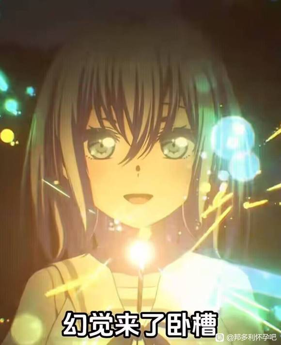
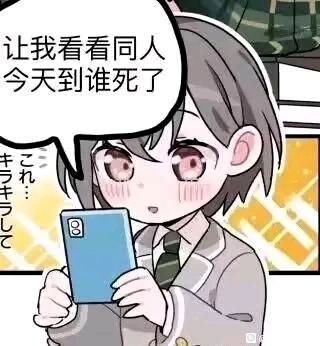
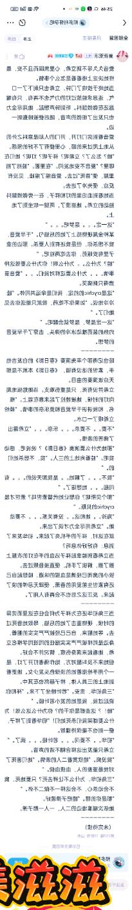
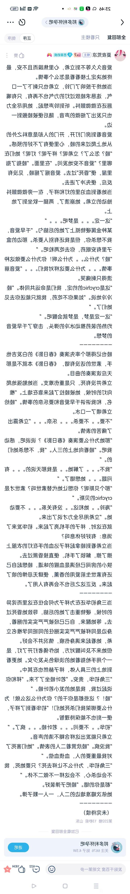

# 【图片】如果素世在第七集心脏病发作似在祥子甩手走人的一刻【邦多利怀孕吧】_百度贴吧

## 1

长期素食外加受到重大打击，心脏病发作也很合理的吧？

## 2

长崎素世看到眼前的祥子甩手离去。跪下的双腿站不起来，心脏骤然停搏，倒了下去。视线里的祥子渐渐模糊、渐渐消失。在此刻长崎素世还没有死，但祥子只觉得她还在表演，还在自我感动。睦，也不会插手。如此，睦在她的身旁站了一夜，直到第二天白天。这时，素世，已上天堂了。

## 3

长崎素世似了，死因是突发心脏病。睦今天没有去上学，她跟着救护车去到了急救室，又跟着推出来的盖着白布的素世到了太平间门口。睦的电话响过，响了好多，后来不响了。素世的手机却有许多未读消息，“爱音”发来的格外的多，大概是新乐队的朋友吧。素世的母亲来了，太平间里传来了撕心裂肺的哭声。将素世的手机交给她，睦离开了医院。如果自己可以主动一点，只要一点点，素世就不会似吧。若叶睦是这样想的。

## 4

鬼使神差，或者鬼迷心窍，若叶睦去到了RiNG。坐在曾经的位子上。”一杯大吉岭，一杯伯爵红茶。“”一杯大吉岭，一杯伯爵红茶。“”一杯大吉岭，一杯伯爵红茶。“。。。。。直到，黑头发的少女过来打工。“哈？”

## 5

立希走向喝着红茶的睦，站定之后问道：“素世那家伙在哪里？”“死了。”若叶睦如鲠在喉，连红茶也难以下咽。“你在开玩笑！”椎名立希知道睦从来没开过玩笑。但她就是不能相信，那个亚麻色头发的少女死了。她给长崎素世打去电话，接听的人却不是预想中少女温柔的或是坚决的声音。而是一个悲伤母亲沙哑的声音。“是素世的朋友吗？”

## 6

长崎素世死了，千早爱音是她乐队伙伴中第三个知道的。当时她正在教室里值日，隐隐约约听着钢琴的旋律，眼前是一起值日的灯。这本是平常的一天，等值完日后她还要给素世去一个电话，说不定素世世心软会接的吧。但是现在，立希给她打来电话，告知了她最难以置信的事情：素世死了。最难以逾越的隔阂是什么？阶级？文化？语言？性格？爱好？都不是，是生与死。爱音找了一个借口让灯先行回家，自己则默默走向了医院，连吉他都不曾背上。至少现在不能让灯知道。

## 7

千早爱音、椎名立希还有若叶睦，一起到了素世所在的医院。一路上，三人无言。若叶睦想见素世，她还有最后一点点幻想，幻想素世起死回生。爱音和立希还在犹豫，她们还没有经历过如此熟悉的人这样离开。睦先行迈步走去，她们也快步跟了上去。三人走到阴冷的太平间门口，素世的母亲已经离开，她实在不能再多看自己孤单死去的女儿。睦打开门，一股彻骨的寒意让爱音打了个寒战。少女的身形被无暇的白布遮盖，紫光灯照不出太阳的温暖。没等睦掀开白布，千早爱音便逃走了，像她曾经做过的一样。

## 8

难以置信。看着躺在冰冷太平间的素世。“为了逃避排练居然在这里装死”“明明前几天还在冲我们发火”“明明和灯说好了要组一辈子乐队的”这些想法闪过椎名立希的脑海，直到她的指尖触碰到素世的额头，才明白素世真的已经死了。立希缩回手，悲从中来，放声落泪。她是第一个为长崎素世的死哭泣的乐队伙伴。

## 9

立希还是走了，回到家里独自躲在昏暗的房间里。她想念素世的温柔，她还没有感谢素世把灯带回到她身边。自己总是没好气的对待所有人，有时连灯都难免波及。每次都是素世微笑着大事化小小事化了。如果那一天，祥子退队的那一天，自己没有和平时一样冲动。“素世是不是不会死呢？”

## 10

千早爱音逃跑了，跑到喉咙刺痛、跑到肌肉僵硬、跑到视野暗下去。她停了下来，喘着气，不知是奔跑过度还是伤心过度，抑或两者兼有，眼泪流了出来。千早爱音想到那个笑着回答她可以组乐队的女孩子；第一次愿意和她组建乐队的女孩子；总是温柔的笑着说话的女孩子。如今爱音再也听不到她温暖的声音，再看不到她矜持的微笑。千早爱音眼中的东京，此刻却比伦敦更加还要昏暗，看不到头的昏暗。要是没有演奏春日影就好了。

## 11

此时此刻，若叶睦还要站在素世身旁。她已有两天一夜没合眼了。在素世和祥子之间，她无法做出选择，失去一方是早晚的事情。只是她没有想到，甚至没有想过，会是这种方式。素世和祥子是她人生中唯二的温暖，祥子是与生俱来的温暖，是无法选择的，如果没有祥子，睦的家人也找得到第二个“祥子”。素世的温暖却是她给予睦的，她总是无差别的向身边的每个人释放善意，别人需要的越多，她给予的便越多。可惜若叶睦的家庭和教育，不允许睦向任何人索取。这一点上，祥子也是一样。睦便尽可能的接近素世，以得到素世更多的温暖。这样的事情，却也在祥子父女被迫离家的时候被迫结束了。在祥子和素世之间，她只能选择祥子，因为祥子别无他选。只不过，这样的选择，大概也正是双方家族一开始就安排好的——人造的朋友关系。“对不起，素世。”若叶睦吻上了长崎素世的唇，如同俗套的人偶童话剧场。

## 12

好了好了不熬夜了，大家也要预防心脏病呀

## 13

“真安静啊。”和素世在一起，睦才真正有常人一般的安心，她正像热恋中的情侣一般，索取素世的唇。若叶睦渴望长崎素世睁开眼，把她推开或是打她一巴掌，但是这一切都没有发生。直到这一刻，睦才真正有了“素世已经死了”这件事的真实感。一滴泪落下，落在素世的脸上。出于义务，或是出于报复。若叶睦拿出了手机，在锁屏的未接电话消息里面选中“祥子”，点了下去。“祥，素世死了，你满意了吗？”这是若叶睦为自己做的第二件事。

## 14

没有live，也没有芭菲，立希也不在RiNG，要乐奈便在街上闲逛。不过，她看到了有趣的女孩子。“灯，live”乐奈就像猫猫被光点吸引一样凑了过去。“诶！？可是只有我和乐奈。”“足够了。”乐奈拉起灯的手，二人前往RiNG。“乐奈看到其他人了吗？”乐奈摇头。有趣的女孩子还在，大家肯定会过来live的，只要自己不演奏那首叫春日影的好听的歌就是了，都是春日影的错。

## 15

丰川祥子得知了素世的死讯，还未来得及反应，便是电话对面若叶睦的第二句话。”就在昨晚你走掉的时候，素世死了。“从这以后，睦再没有对祥子说一句话，无论祥子如何哀求、如何质问、如何辩解。连客服工作也无法做好，丰川祥子被辞退了。独自走在归路上，走去了crychic第一次见面的咖啡馆。”来咖啡馆，我要见素世。“睦会来吗？睦还是来了。祥子也不再对睦说多余的话，她知道睦已是恨透了她。在高中生的年纪，终究不能想象身边人阴阳两隔的情况。爱音是这样，祥子也是这样。强打精神迈进医院，消毒水的气味刺鼻而来。强令双腿走下台阶，太平间的冰冷包裹上来。祥子本能地干呕，并非因为外物，而是令人作呕的自己。

## 16

为什么混蛋老爹会借酒消愁？看着不远处放送着sumimi宣传片的大屏幕，祥子有了一些答案。喝酒的人，又有多少是为味道去喝？社交、应酬、交流，灯红酒绿，觥筹交错，在混蛋老爹还没有现在这样混蛋的时候，祥子也见过不少。只不过那些与现在的混蛋老爹不同，也与现在的祥子不同。他们只是借酒精让自己逃离不想面对的现实。强忍着苦涩，让啤酒流入喉咙，祥子自然没有觉得有多么好喝，只是想喝。或许在乙醇的作用下，儿时的初华、身边的睦、演奏提琴的素世、向花瓣伸出手去的灯，都会回到自己身边吧。大多事情都不会和预先设想的一样好，丰川祥子的初次醉酒便是这样。她无力的躺在台阶上，在反胃和头痛中昏迷过去，坠入无梦的深渊。即便如此，她仍听见了春日影的旋律。

## 17

（可能算是day1总集篇）长崎素世在一天前死于心脏病发作之后，她身边的人直接或间接或多或少的受着影响。同时，她们也直接或间接或多或少影响着其他人。若叶睦在做梦，在梦中仍想要追上离去的人。丰川祥子醉酒，露宿街头。千早爱音回家之后，为了灯绞尽脑汁思考对策。海玲携立希乐奈二人回家，三人相拥而眠。高松灯仍在不知所措， 如同从前一样。此时此刻，三角初华忧心忡忡的看着手机上发送的未读消息。“祥子，你到底遇到了什么事情呢？”

## 18

（下面是时间线整理）第八集结尾晚上，素世惊世一跪之后心脏病发作倒地，祥子离开，睦留下。次日天亮，路人拨打急救电话，睦随救护车前往医院，确认素世死亡。不久之后素母到医院，睦交予素世手机并前往ring直至下午。下午，立希前往ring打工，遇到睦并且得知死讯，联系爱音并且和睦前往医院，爱音得知消息之后和灯分开并前往医院。灯和爱音分开之后遇乐奈，二人前往ring排练。爱音、立希、睦一起抵达医院。爱音逃跑，之后前往ring，排练结束后和乐奈分开并送灯回家，之后回自己家。立希见过素世后回家，晚上约见海玲。灯回家后向素世手机发送消息得知素世死讯。睦联系祥子，祥子前往医院遇素母，之后前往工作地，无心工作被迫离职，购买便当啤酒之后并未马上回家遇乐奈。乐奈和祥子分开后遇到海玲和立希，三人前往海玲家过夜。祥子前往大屏幕附近喝酒并醉酒。

## 19

昏过去了。不如先考虑下skip至素世葬礼，还是慢慢写。

## 20

次日，八幡海玲舒服但是并不怎么舒服的醒了过来。舒服是因为身边有一个女孩子，不怎么舒服是因为身上还有一个女孩子。把身上名叫乐奈的球形物体挪到一边，海玲思来想去决定不叫醒立希。毕竟花咲川不比羽丘月之森，请假还是相对方便的。海玲把早餐放到床头柜上，留好字条便前往学校。于是她便遇到了又一奇事。班上最忙的大忙人，sumimi现役偶像三角初华，居然一大早出现在教室位置上。在自己帮立希向老师请假之后，她便更感觉到来自后方的注视。三角初华在看自己？真的假的？

## 21

三角初华得不到祥子的消息，便再度看向祥子之前乐队crychic的照片。只不过当她看向祥子之外的人，特别是鼓手的时候，却感觉莫名眼熟。初华并没有和班上同学很熟络，因为她是大忙人。同样因为她是大忙人，祥子的事情也只能暂时放在脑后。只有现在，发给祥子的消息久久没有已读标记的时候，她才不得不仔仔细细寻找祥子的线索。“这，这不是椎名立希吗？”这时，初华便后悔起为了避免骚扰没有和同学互换联系方式的事情来。于是初华一大早来到学校，只为向椎名立希询问祥子的事情。可是立希没有来，是海玲帮她请假。既然如此，海玲一定也有线索，最次也可以联系到立希。于是初华拉起海玲。“老师，海玲身体不舒服，我带她去看医生。”

## 22

在一番你情我愿的”在役偶像在上课时拉走前桌同学“之后，远离事件中心的二人拉拉扯扯到了一家鲜有人知的小咖啡馆里。又是一番交流之后，二人便搞明白十有八九是立希和祥子二人之前的乐队的事情。”你是说你看都没看椎名的手机？“初华好险没把咖啡喷出来。”怎么？我很像会做那种事的样子？“海玲其实也想过要看一下，只不过怕立希乐奈发现才没看。这时的她正在飞快地搜索crychic的主页，想找那张刚才初华给她看的一闪而过有穿着初中校服的立希的crychic合照。”你都把人带回家了！“”这是两码事，请不要混为一谈。不过你说你那个发小丰川祥子，她是说要和你组商业乐队？“”是，不过昨天下午突然又说不组了，然后就联系不上了。“初华叹了口气。”昨天下午？“”是，昨天下午，怎么了？“传奇贝斯雇佣兵八幡海玲的大脑飞速运转，在手机上查找了一会。”你看看她的联系方式是不是这个？“初华看着眼前熟悉的号码。”是她，可这有什么用？“于是二人决定去找立希问个明白，因为她们实在找不到祥子。

## 23

椎名立希在陌生的床上醒来，看着陌生的天花板，她睡得并不好，因为身上还有一个白色的温暖球状物。低头看过去之后，立希便有些摸不着头脑。怎会是野猫？明明昨天自己是睡在海玲腿上，现在怎会和野猫同床共枕了？所幸疑惑并未很久，立希便看到了床头柜上的字条和早餐，还有一把钥匙。但是在看到时间以后，她还是把野猫拎起来洗漱干净勒令吃过饭轰去上学了。“初中生还是得好好上学的，要不然高中就只能上花咲川了！”在立希送走野猫之后收拾好自己整理好床铺洗盘刷碗的时候，海玲家的房门开了。正在刷盘子的立希看向来者二人，双方便陷入了默契的尴尬。————剪切线————得知初华也要去自己家的时候，海玲是反对的，她毕竟不想有人插手自己和立希的二人时光。乐奈姑且算猫，初华一去，岂不坏她好事！但是初华也不想错过祥子的一手消息，便以海玲不带自己便是破坏同盟关系为由强行跟上。不过对于这是什么同盟这件事，她们俩还没商量好。

## 24

千早爱音想要见到高松灯，千早爱音也害怕见到高松灯。见到灯她便知道灯是否安然无恙，但也可能被灯看破自己的心思而追问。怀着这样沉重的心情，爱音出发前往学校。在爱音进门的一刹，她便了解到灯的情况。灯在捧着手机，不知所措。“灯，早上好。”爱音强挤出笑容向灯问好，灯转过头那近乎恳求的眼神却让爱音不敢直视。“素世真的不在了吗？”灯的声音细微，但爱音无法听而不闻，她怔在门口和座位之间，不知所语，不知所措。“是意外。”爱音明白，已是覆水难收。无论现在自己说什么，都无法缓和灯的自责，只有时间可以淡化这一点。只因她们确实演奏了春日影，素世也确实因此大受刺激的离开。自己曾将灯从阴霾里引出，现在却在把她往深渊中拖入。

## 25

伴着闹钟响起，若叶睦从陌生又熟悉的床上醒来。今天仍是个晴朗明媚的日子，世界并未因为素世离去而有分毫的偏差。发生变化的只有支离的少女们和她们破碎的心。下床之后推开门，素世的家第一次完整的映入睦的眼帘。桌上有一些饭菜，一旁钥匙下的字条留着素世母亲的联系方式。素世的母亲理解着也感激着这位守着自己已故女儿久久不愿离去的女孩子，便也为她做着为数不多的力所能及的事情。吃过饭，不曾洗碗的睦也洗过了碗。她走在素世去学校的路上，却看不到素世看到的风景。素世仿佛仍走在前面，仍是梦里一样的背影，若即若离。一直到了教室，睦才发现，素世的座位已经不知所踪，老师也只是说素世转学离开。下课后，几个同学过来问睦，睦便只用平日的语气回答“转学了”“不知道”。这也是睦第一次学会谎言。

## 26

经过一番心理斗争之后，立希决定对海玲和初华说出情况。只是她刚想开口，便有些哽咽，海玲便握住她的手，注视着她。“从前我和祥子还有主唱灯、贝斯手素世、吉他手睦，我们组过一个叫crychic的乐队，有一首叫春日影的歌”“第一次live以后，祥子不知为何退出了，乐队也就解散了”“素世她放不下乐队，想要拉我们五个重组crychic，就和我还有灯再加上两个吉他手爱音和乐奈组了一个新乐队”“但是新乐队的大家一起开了live，很开心，一个吉他手，就是海玲你看到的要乐奈，演奏了我们平时用来训练磨合的春日影，我们剩下四个跟着演奏，不知道为什么就把祥子气走了”“素世下台以后就冲我们发火，然后就跑了找不到人联系不上了”“再然后我就在ring遇上了睦，我问她素世人呢，她就和我说素世死了”“素世真的死了”说完这些，立希仰起头，试图不让眼泪流出来。海玲和初华对视一下，便明白，事情已非她们可以解决的了

## 27

感受着莫大的痛苦，丰川祥子还是再一次看见了太阳，天已经大亮。在逃避现实这个方面，酒精确实卓有成效。祥子的手机已不知何时没了电关了机，她便只能回家充电换衣服。买了些临期食品和啤酒，祥子回到了即便是白天也昏暗着的满是酒气的“家”。将手机充上电，祥子才看到初华昨日发来的消息。为了不让初华起疑，祥子决定下午再做回复。如果初华得知自己的现状，大抵要比现在更加担心。“对不起，初华”事到如今还在表演，真难看。这是祥子看着息屏手机映出的脸，心里唯一的话

## 28

为了立希，海玲愿意做她能做到的任何的事，哪怕她做不到的事情，她也愿去尝试。如今她已明白，立希对那个名为高松灯的女孩子，也是相近的态度。海玲便知道了，为了高松灯，爱音和立希要把再度崩坏的乐队修补之后维持下去。于是她们便需要一个贝斯手，昨天立希找到自己，也正是有着此意。“一辈子的乐队。”海玲品味着这沉重的话语。她是个贝斯手，却没有固定的乐队。好在贝斯手本就相对偏少，于是她就成为了其他人口中的“贝斯雇佣兵”，也算是对她身份和水平的认可。她也想和立希组建一辈子的乐队，只不过，要把乐队玩下去，总归是要开心的。如果不能开心，解散便只是早晚，这样的事情海玲见过太多。一辈子太长，很难永远都开心。不知何时“一辈子”就会变成束缚着所有人的枷锁。“一辈子太长了，不过我没意见。”海玲决定加入。“好肉麻的两公婆，而且还是我同学，真的是样衰咯！”三角初华心想。

## 29

爱音想到昨天见到的女孩子，给立希发去短信想要了解她，同时也了解到立希已经找到了新的贝斯手。在爱音看来，事情会好起来的，车到山前总会有路的。在伦敦的时候无朋无伴无依无靠，但是现在，她还有身边的朋友们，还有那个连名字都还没有定下的乐队。不过当务之急还是要帮助灯从这件事情走出，于是爱音用手机给灯发去消息：灯要去看看素世吗？灯向来不敢面对遇到的事情，或者说——大多数事情在她准备好面对之前就已经错过。但是有两个人，她们不由分说的，就和灯一同面对了，第一个是祥子，第二个是爱音。灯相信着爱音，便回复了过去：我想去。爱音和灯便是这样相互支持着，也相互依靠着。放学之后，爱灯二人值日，却并未听到钢琴声，爱音便隐隐的知道了祥子也有着一些事情。难道她和素世的事情有关吗？爱音又想起素世走前最后的话来，不过也仍是不得其解。”等见到立希再问一下吧。“爱音这样想着，和灯一起出发前往医院。

## 30

在素世离开之后，睦便愈加想要了解素世。她也向素世的母亲了解到，素世的葬礼很快就会办了，希望睦可以邀请素世的朋友来参加。另外，也希望睦和素世其他朋友去素世家里选一些素世的物品，留作对素世的纪念。睦和父母联系过，也受到了父母的关心和敦促，只得恳求父母宽裕一阵。好在睦从未这样求过他们，睦的父母也难以拒绝。睦并未忘记给黄瓜浇水，只是身边少了某人陪伴。她掐断其中一只小黄瓜的瓜蒂采下，睦咬下一口细细品味。未熟的黄瓜发涩，和少女的感情一样，未成熟的、生涩的、也是无法传达的。不知何时 ，一个白头发的学姐走了过来。”这个，更好吃哦。“她把一小袋蘑菇交给睦，笑着离开了。

## 31

所有要说的都已经说完，初华也要去做sumimi的工作了。海玲和立希便出发前往RiNG排练，毕竟在做事的方面，两人都是非常认真的类型。在二人中场休息的时候，野猫创了进来，环顾四周。“没有有趣的女孩子”转身便要走。立希立马赶上：“别走，等会给你做抹茶芭菲。”留下乐奈之后，便发生了海玲对乐奈瞠目结舌到赞不绝口再到彻底沦陷的事情。“立希？你说这是初中生？还是我们学校的？”哪怕是见多识广的海玲，也要对面前真正“享受着音乐本身”的乐奈感到惊讶，甚至于敬佩。“野猫，很神奇吧？”立希无奈的看向海玲。“满足。”乐奈也不无得意的看向两位前辈。

## 32

看着一片狼藉的三叠半，以及一醉方休的混蛋老爹，祥子不由恨起了他。如果不是混蛋老爹，祥子也不会退出crychic，crychic的大家也不会变成现在这副样子，素世也不会死。她翻箱倒柜找出头孢感冒药，用啤酒瓶瓶底碾碎，倒入了父亲没喝完的半瓶酒。做完这些，祥子才意识到自己是在谋杀亲父。于是她后怕着、悔恨着、恶心着，跑了出去，将毒酒砸碎在地上。她久违的沐浴着阳光，心里却没有一丝暖意。

## 33

## 34

睦的告白刚刚出口，眼前的素世却已然消散，化作零散的光点。而那光点又重新聚合，变成了小时候的祥子。而后她又看到周围的光点融入祥子，祥子也逐渐变成了现在的样子。“你这个人，不也是只想着自己吗？”睦已经明白，眼前只是类似于幻觉的什么东西，自己也没有对她说什么做什么的必要。睦转身离开，她要先去看看素世有留下过什么。之后，就去再看看素世吧。

## 35

直到下午，初华才收到了祥子的消息：我没事，最近事情有些多。昨天手机忘记充电了，所以回复晚了一些。初华不会对祥子视若无睹，她必定要进一步的联系祥子。祥子本不会接受他人的帮助，那对她相当于施舍，所以她便粗暴的施以拒绝和切割。但现在已发生了素世的事情，她便不得不怀疑，自己这样的做法是不是也在伤害着身边想要帮助她的人。她想起自己退出crychic的时候，自己并未在意的众人表情。不满、自责、担忧，每个人的表情感情都不同，她却一并处以了切割的举措。祥子想要见到初华，想要像儿时一般被初华安慰。但是她不希望初华安慰已经伤害了几乎所有人的自己，她希望初华训斥现在这个冷血的自己。三角初华和丰川祥子在空中花园的桥上见面。初华先到，却没有看向祥子，转身平视远方。祥子也同样没有看向初华，她微微低下了头。“事情我已经了解了。”初华平静的看着远方。“祥子，我明白的”“既然如此，你还要我过来做什么。”祥子的声音轻了下去。“就因为如此，我才要见你。”初华转身面对祥子。“我希望你向crychic的每个人道歉。”“谢谢你，初华。”祥子小声落下了眼泪。三角初华将她拥抱，却嗅到了些微酒气。

## 36

立希得知爱音要带灯去看素世，便说什么也要去，却不要乐奈一起。海玲看不下去二人纠结拉扯，于是以“一起去，完事一起见面商量商量接下来和以后的事情”为由说服了立希，也和立希乐奈一起前去。立希并不想再见到死去的素世，她只为了灯才前去。这一点，海玲也是一样，只不过对象要换成立希和乐队。而乐奈，她只想见到素世而已。新的乐队组合第一次聚齐，却是在医院门口，为了探望一位已故的前成员而来。海玲没有进入医院，她不打算擅自认识一个不认识自己的人然后为她悲伤，她也相信立希可以渡过难关。爱音和灯相互支持着，走入了太平间。而立希虽说为灯而来，也做好了护住野猫的准备。进入干冷的太平间，乐奈便有些发抖，本能让她钻入了立希的怀抱，于是二人便在一旁，不无担心的看向爱音和灯。灯好奇的打量了一下眼前白色的空间，掀开了人形之上的白布，看着眼前沉睡的少女。仿佛确认一般，灯把手放上素世的额头，却只传来了冰冷的触感。当四人一同默哀的时候，一人轻轻的打开了门。睦见到众人前来，心里有些欣慰，却也有些因不能和素世独处而嫉妒，便和四人一同默哀。直到乐奈打了个喷嚏，才把众人从死的沉寂之中拉出。“走吧，我有事情和你们谈。”若叶睦说出了众人没有想到的话语。

## 37

如果说重新组合的乐队第一次会面会有些尴尬的话，那么更尴尬的便是除了乐队成员还有其他人参与会面。话虽如此，睦还是第一个开口了：“你们可以去素世家里拿一些东西做纪念。”“这样是不是不太好？”爱音有些担心。“素世的母亲是这样说的。”睦喝着红茶，仅仅两天，她已经习惯了这样的味道。“灯，你要去吗？”司空见惯的话语从理所当然的人的方向发出，灯点点头作为回应。“所以我们等一下就去吗？”爱音把抹茶芭菲推给乐奈。淡绿色头发的少女点了点头，一边喝茶，一边回忆着在素世手机上看到的消息。“我加入你们乐队，可以吗？”海玲也想起来正事，从立希的说法来看，海玲加入可能的阻碍便只有灯这一个不稳定因素。但众人四下里并不反对，海玲也算加入了乐队。

## 38

喝过聊过，五人便跟着若叶睦前往素世家。初见素世家，五人各自有些不是滋味，这大抵便是以后她们再也不会来的地方。客厅里，睦和素世的母亲在这之前已经整理好素世所有的物品。贝斯和提琴，虽都在琴包里，却格外扎眼。睹物思人，任谁都不免难过。爱音拿走了素世开封和未开封的香薰；灯拿走了几本素世的笔记本；立希拿走了素世的茶杯。乐奈迟迟未选，最终拿起了一旁的手帕。至于海玲，她并不觉得自己也有挑选和拿去的资格，只在一旁等待。一旁的睦拿起素世的贝斯，交给海玲。“我想要今后还能听到这把贝斯的声音，拜托了。”

## 39

在众人打包收拾好之后，将素世的东西据为己有之后，约定好参加素世的葬礼之后。若叶睦仍有那最后的一个问题。“为什么要演奏春日影？”睦用恰到好处的声音，让每个人都听到这个问题。睦并不知道，素世也曾问过她们同样的问题。睦渴望得到答案的目光看向谁，谁便低下头把视线移开，但是乐奈没有。“因为那是首好听的歌。”乐奈便如实的回答了。睦当然记得，那天率先响起的吉他声。以及，或许只有她留意的，素世惊慌的表情。“你们也是这样想的吗？因为好听？”睦转头便看向灯和立希。立希刚想开口辩解，灯却抢先开口了。“对不起。。对不起”灯的声音颤抖着，灯的身体也颤抖着，全靠爱音扶住才没有倒下。因为自己唱了春日影，祥子哭了，素世死了，睦也失去了身边最后的朋友。难道自己想要组乐队想要变成人类都是错误的吗？立希本能的冲上前去，揪住睦的衣领，却又无力的放开。她的确要保护灯，但那不是伤害睦的理由。睦还是面无表情，眼神却仿佛有一丝寒意、一丝冷酷、一丝决绝。直到众人离去。“春日影，真是一首好歌啊。”若叶睦向丰川祥子发去消息：见一面吧，我有东西要给你看。

## 40

祥子依偎在初华怀里，一如童年的夜空下。手机亮起来，响起了提示音。祥子便习惯性的试图以身体遮挡查看。但三角初华并不给祥子这样做的机会，她便如同小时候好奇祥子的书一样探头探脑。见到消息，她便向祥子问道：“她要给你看什么？”祥子摇摇头。“我不了解现在的睦。”“这样啊，你要去吗？”“我想我应该去。”“无论如何你都要好好回来。”初华放开了祥子。祥子点点头，离开了初华，便赴往睦的约。三角初华，她本应和海玲或者立希通个电话的。坏就坏在她说服祥子过于顺利，以至于让她忘记了风险。睦，今晚就要让祥子想起一切。

## 41

睦约见祥子的地方便是素世家里。祥子没有来过，便只觉得可能是若叶家的一处地产。这个想法在她嗅到香薰味道，并且看到一旁的大提琴后戛然而止。“这是素世家？你叫我来干什么？”“阿姨说素世的朋友可以来拿几样东西作纪念。你也是素世的朋友吧？”睦放下红茶，看着面前的祥子。“我没什么好拿的，你要给我看的就是这些吗？”祥子习惯性的喝着茶水。“有的，有这个”睦把素世的手机打开，交给祥子。“你这些天错过的东西。”祥子瞪大了双眼，眼前是素世给自己发过的无数消息，因为自己简单的屏蔽，永远不会传达到的消息。“祥，我没有想到你是这样的人”震惊和悔恨之余，丰川祥子却听到了素世的声音，她猛然抬起头，眼前竟就是素世。“不。。素世？你不是已经。。”“你不想见到我吗？祥子？”“素世”向祥子微笑着。“睦！出来！不要搞这种把戏！”祥子急忙看向四周，却看不到睦的身影。“祥，你有考虑过大家吗？哪怕是睦？”“睦对你来说是什么呢？召之即来，挥之即去的人偶吗？从小到大都只是你满足自己需要的人偶吗？”“够了。。真的够了！”祥子站立不稳，瘫倒在沙发上，闭上了双眼，不去看素世的模样。“对不起。。素世、睦、大家。。。”祥子睁开眼，只看到睦居高临下看着自己，她从未见过睦这样的眼神。“祥，我们都明白的太晚了。你走吧。”睦的声音传来，祥子便落荒而逃。

## 42

祥子落荒而逃，却无处可去。她本应回去找初华，此时却陷入了纠结。她已伤了身边所有的人，真的还有资格理所应当的接受初华温暖的拥抱吗？如果哪天她又伤害了初华。。为什么自己听到春日影便逃跑了呢？明明是自己主动退出crychic，却又用逃跑把责任推卸给别人。说到底，自己也只是感情用事。她放空大脑，只任双腿迈步向前。双腿便将她带至RiNG，大多数少女乐队故事最初和最终的地方。祥子抬头看着RiNG的灯牌，凄凉而讽刺的笑出了声。与之相应的，RiNG的某一个排练室内。仿佛无形之间，这里的重力多出许多，每个人都格外沉重。就连乐奈一时兴起的吉他声，也被海玲和立希制止。于是她要走，却被灯挽留下来。此情此景，海玲便想要出去透透气，便询问了每个人喜欢的饮品和点心，借口买点宵夜出了门。却看到门口有一个格外眼熟的蓝发少女发出诡异的笑声。“是丰川祥子吗？”“是我，你是？”祥子有些意外，她并不认识眼前的少女，只是也有些眼熟。“跟我进来！”

## 43

祥子被还不知道名字的黑发女生拉进了一间排练室，眼前却全都是认识的人。灯、爱音、立希、白发吉他手，一齐向她看了过来。“海玲，你把她找来干什么？”立希转头看向海玲，不过海玲马上便开门走人。“啊不对夜宵还没买呢你们等我回来。”“丰川祥子，我们这里。。”刚要开口，立希被爱音拦住。立希便知道，这事应当交给更擅长交流的爱音来办。“小祥，你还好吗？先坐下吧。”爱音给祥子拿来椅子，祥子低着头坐下。“谢谢你，爱音。”在没有人看到的方向，灯从包里拿出了美工刀。为了crychic、为了素世、为了大家、为了乐队、为了我。“去死吧！祥子！”

## 44

祥子挨捅猫猫挡刀立希挡刀捅到爱音四种结果在我看来都相当的美味啊

## 45

<路线一，名为死亡的救赎>高松灯热爱动物，她便认真的了解动物。高松灯热爱人类，她便认真的了解人类。高松灯越是热爱生命，便越了解如何夺去生命。丰川祥子的体态十分标准，如同教科书上的人体模型一般十分标准。正因如此，刀尖便直插丰川祥子的心脏。“灯！不要！”椎名立希想要扑上去阻止，却为时已晚。因为背对着灯，千早爱音意识到的时候，祥子胸口已经染红。要乐奈目睹一切，马上开门离开了这里，她们再也没有见过她。在丰川祥子生命的尽头，她快速的思考着自己短暂的一生之后便与自己和解。她抬起头看向面前的高松灯，说出了自己的遗言。“灯，对不起。。原谅我吧。”祥子露出了她最后的笑容，一如灯与她的初见。“嗯，我原谅你。”祥子便永远的倒了下去，鲜血流淌出来，染红了胸前。当海玲买好回到排练室，却发现蓝发的少女躺在地上，衣服却变成红色。爱音和立希却在用力擦着地板，乐奈却不见了。不过当立希露出恳求乃至哀求的神情时，要做什么就只有一个选择了。当睦接到立希的电话，却是请她开门，立希想要低音提琴的时候，她便联想到可能的事情。知道自己已经做了所能做的，若叶睦伏在素世身旁，痛哭流涕。三角初华迟迟未等到祥子归来，手机也已关机。她打电话给立希、海玲，都没得到答案，又要来了睦的联系方式。她又问及睦，睦便只说来过又离开。初华等待着，等待着注定不会来的祥子。立希不肯报警，她不肯就此结束灯的人生。为此，她愿意做任何事情。当看到立希的眼神，爱音和海玲便知道该做什么。爱音常常看视频，也包括悬疑片和悬疑电影，她便得出了一个方案。在素世葬礼后，把祥子放进素世的棺材。为此，她们需要创造机会搬运祥子入棺，便决定在素世的葬礼上进行一次告别演出。乐奈已经离开， 缺少的主音吉他便邀请了睦，睦也直接答应下来。她们都是迷路的孩子。乐队的名字便叫做MyGO。她们为离去二人送别的歌便是——诗超绊。————————————那些无法好好诉说的话语即使如此仍想传达的话语我正唱着诗，在此刻唱着，传达出去吧现在还来得及传到你心中吗？————————————逝者自此长眠地下，迷路的孩子们仍负重前行。

## 46

<路线二，名为生存的刑罚>高松灯热爱动物，她便认真的了解动物。高松灯热爱人类，她便认真的了解人类。高松灯越是热爱生命，便越了解如何夺去生命。丰川祥子的体态十分标准，如同教科书上的人体模型一般十分标准。正因如此，刀尖便直插丰川祥子的心脏。————————爱音、立希、乐奈立刻便扑了上来，爱音和立希拉开灯，乐奈则撑住了祥子。感觉到剧痛，祥子便认为自己命不久矣，向灯说出了自己的遗言：“灯，对不起，原谅我吧。”灯只觉得祥子吵闹。“祥子，我们不是命运共同体。”但是高松灯毕竟不是强健犯纱人狂，美工刀也没有那么的坚硬和锋利。在RiNG里众人把祥子送往医院检查过后，才发现灯甚至没有伤到祥子的脏器。祥子看向窗外，月色朦胧。她未曾料到自己伤害灯如此之深，深到灯不得不动手杀死自己。在她治疗过之后，爱音也曾经和她说过话。“我想祥子你还是不要靠近灯了吧，对你对灯都不好的。”她又想起爱音身后立希的表情，愤怒而无奈的表情。“事到如今还是不肯说出原因，真是可恶。”众人散去之后，初华便来了。如果没有初华，祥子本可以一死了之。但是为了不伤害仅剩的爱着自己的人，她便只能活下去，把自己剩余的人生交给初华。是的，为了有人照顾祥子，抑或要让祥子活着受这磨难，她们打电话叫来了初华。初华也了解这一点，但她只有寄希望于时间。。。。不久之后是素世的葬礼，来人并不多，大概也因为素世的朋友多是泛泛之交。但是crychic的几位成员都到场了。她们决定继续使用crychic作为乐队的名字，纪念素世，纪念美好的时光。她们会把和素世一起演奏过的和将来本可能演奏的歌曲传唱下去。一辈子太短，但是忒修斯的木筏永存。——————————我唱着，唱着连系起你我的手的诗不希望将手松开，我们要永远在一起我唱着，唱着让我们成为我们的诗让我们在这里重新再出发吧——————————若叶睦采下未熟的黄瓜，放在墓前，祭奠着长崎素世，也祭奠着自己无法传达的爱恋。

## 47

## 48

<路线三，名为命运的错误>高松灯热爱动物，她便认真的了解动物。高松灯热爱人类，她便认真的了解人类。高松灯越是热爱生命，便越了解如何夺去生命。丰川祥子的体态十分标准，如同教科书上的人体模型一般十分标准。正因如此，刀尖便直插丰川祥子的心脏。——————————千早爱音听到身后传来声音，便要转身回去看向身后的灯。“灯？”或许是灯慌了神，或许是爱音挡到了位置。本应刺入祥子胸口的美工刀，此刻却令爱音的腹部涌出鲜血。爱音后退几步，便手捂着肚子坐倒在地上，发出沉闷的响。唯一还能做出反应的立希，冲了过来，用书包垫着爱音后背。“我去叫人帮忙！野猫！你过来扶住爱音！不要乱动！不要让她睡着！”说过这些，立希发狂一般冲出排练室，紧接着走廊通道便传来她的呼喊声。乐奈从未见过这样的立希、灯、乃至爱音，惊慌之余，马上过来扶住了爱音。爱音已是面色苍白，额头也渗出冷汗，她仍挤出笑容看向灯。“灯，过来，我想。。和你说说话。”爱音雪白的手，止不住喷涌的鲜红。灯无助的走向爱音，跪了下来，连美工刀都尚未丢掉。张了张嘴，却哑口无言。爱音把身体靠向乐奈，以腾出撑地的手抚摸灯的脸庞。“灯。。不要怪祥子了。。。祥子肯定有不得不那样的原因。。。”“你还有带创可贴吗？”爱音调皮的笑了，看向不知所措的灯。灯不知所措的，慌乱的，一股脑拿出了全部的创可贴。“这么多啊，灯，有创可贴，我肯定不会有事的”爱音拿起创可贴，恰巧是一只有胡须的企鹅。“又是阿德利企鹅阿。。。”在爱音被立希和香澄放上担架抬出排练室之前，爱音向灯告别。“等下次live完，我们就去动物园吧！”除了祥子，其余人都紧跟爱音乘车而去。在所有人走后，接到海玲通知的初华才来接祥子离开。。。。但是爱音并没有兑现她的诺言，她死在那个月色朦胧的夜晚，死在前往医院的车上。“立希，要我给素世带什么话吗？”这是她半梦半醒间最后的话。之后，无论立希如何哀求、哭泣、威胁、责骂，爱音再也没有睁开眼。高松灯没有被判处过失致人死亡，原因则是心理疾病，以及千早爱音家人的谅解。灯必定要转学离开，在离开前，她仍要参加素世和爱音的葬礼。因为爱音，祥子向立希坦白了当初事情的缘由。因为爱音，立希和灯原谅了祥子。都只是无心之过而已。当天晚上过后，乐奈便不知所踪。立希和海玲也曾多次去初中部寻找，却一次也没有见到。或许是找到了新的有有趣的女孩子而且会给她吃抹茶芭菲的乐队吧，立希是这样想的。。。。在爱音和素世的葬礼上，残存的少女们齐聚在此，也都不约而同的带上了乐器。她们要用自己最后的音乐，来送别乐队和二位故人。不知何处，仍是熟悉的吉他声率先响起了《春日影》的旋律——————————————人与人的缘分 总是断断续续人们在喜悦及悲伤中细数一个又一个的爱为了确认内心的跳动（令人喜悦却又叫人寂寞）此刻感觉好像能了解（重要却又让人感到害怕）————————————在不远处的树上，野猫吃完了抹茶芭菲。“有趣的女孩子们！”

## 49

番外幽灵素世有没有必要单开一楼？节奏会欢快一些。

## 50

<路线四，名为守护的献身>高松灯热爱动物，她便认真的了解动物。高松灯热爱人类，她便认真的了解人类。高松灯越是热爱生命，便越了解如何夺去生命。丰川祥子的体态十分标准，如同教科书上的人体模型一般十分标准。正因如此，刀尖便直插丰川祥子的心脏。——————————椎名立希不会让灯成为杀人犯，为此她不惜一切代价。为了不让灯杀死祥子，立希把灯扑倒在地。脖颈却感觉到温暖的液体涌出。立希想要开口，想要和灯告白，想要和灯告别。她张了口，却无法发声。她无力的倒在灯的怀抱里，血流不止。椎名立希死在心爱之人的怀抱里。。。。为了立希的死不是没有意义的，这件事只能被伪装成意外。然而那把杀死立希的美工刀，仍是出于高松灯的手。高松灯不再唱歌，也不再写下什么。她终究没有成为人类。丰川祥子从天桥上跳下，若叶睦溺死在冰冷的河水。千早爱音如同逃离伦敦一样，逃回了伦敦。八幡海玲放弃了音乐，成为了平凡的少女。三角初华在sumimi大获成功后，与真奈出国生活，淡出了大众视野。。。。这些故事，是一位有着异色眼眸的白发老人为我讲述的。啊啊。。你问要乐奈去了哪？她还是带着那把吉他，寻找一个有有趣女孩子和抹茶芭菲的容身之所。————————啊啊 就快要找到了在多努力似乎也是徒劳的日子我将牵起你的手带着满满的力量————————《如果素世在第八集心脏病发作似在祥子甩手走人的一刻》完

## 51

<路线五，名为终焉的杀戮>高松灯热爱动物，她便认真的了解动物。高松灯热爱人类，她便认真的了解人类。高松灯越是热爱生命，便越了解如何夺去生命。丰川祥子的体态十分标准，如同教科书上的人体模型一般十分标准。正因如此，刀尖便直插丰川祥子的心脏。————————爱音、立希、乐奈立刻便扑了上来，爱音和立希拉开灯，乐奈则拉开了祥子。灯的谋杀没有成功，立希让海玲把祥子带了出去。睦站在远处，看着祥子走了出来。她知道这个懦弱的家伙，不但没有放下尊严的勇气，连死的勇气都没有。既然丰川祥子已经见过了所有要见的人，那便是若叶睦送她上路的时候了。作为若叶家的大小姐，睦自然可以不留痕迹的准备好一切的需要。思来想去，她准备了更多。————————祥子失魂落魄的一路步行到家，像是一个幽灵。但是今天却有人迎接她，是她意料之外的人，是若叶睦。“还记得吗？你和大家说过，我们是命运共同体。”靠近门口的地方放着两个满满当当鼓囊囊的黑色垃圾袋，祥子却没有看到自己的父亲。“既然如此，你为什么还活着呢？”睦只是站在那里，仿佛日常交流一般说着冷酷无情的话。“过来吧，祥，我是来帮你的。”睦拿出了一支注射器。“睦。。不要变成杀人犯。。不要杀人。”祥子的脚步并没有拒绝睦，慢慢向睦走了过去。“我们已经杀了素世。这根针可以让人心脏病发作死去，祥要打吗？打了就可以完成我们命运共同体的约定了。”睦跪坐着，从一旁的小铁盒拿出了扎带、棉棒和碘酒。“祥打过之后，我也会打。”“谢谢你，睦，但是我想要你活着。”祥子与睦相对坐下，仿佛注射输液之前的过敏试验一般伸出手去。睦只是摇了摇头，为祥子扎好扎带，凸显出祥子并没有很显眼的皮下静脉。睦把针管对准，轻轻的抵在祥子的皮肤。“祥，还有什么话要说吗？”“谢谢，对不起，再见。”这便是丰川祥子的遗言。注射器的针尖只稍稍用力便刺穿祥子的皮肤，致死的药液紧接着被推入循环系统。注射完毕之后，祥子握住了睦的手，像小时候一样。心脏在沉闷地作痛，濒死的祥子倒向睦的怀抱。她看到了过往的一切光景，一切都如此温暖。“长崎桑。。。长崎素世桑，我来陪你了。。。”但紧跟着她想起灯，想起自己命运共同体的约定，并非是只对素世和睦，而是crychic。“灯。。。灯啊。。。。”药物没有给她再次请求睦的时间和机会，丰川祥子在若叶睦的注视下离开了人世。睦合上了祥子不再有神的双眼。————————既然用祥子的指纹解锁了手机，那么约到高松灯到祥子家见面是很容易的事情。灯丢下送自己回家的立希，奔向祥子在信息里面描述的住宅。和往常一样，立希仍旧没有追赶离开的灯。不久之后，她就会对此追悔莫及。灯按响了门铃，手放在口袋里紧握美工刀，开门的却是若叶睦。由于睦和祥子总是形影不离，她在这里灯也并没有觉得奇怪。“祥子在里面，先进来吧。”灯毕竟不是什么有心机的女孩子，她点了点头，走了进去。紧接着她的后背便传来剧痛。灯转身拿出美工刀慌乱的挥舞，却被钢管狠狠打在手上，美工刀也脱手飞出。顺着美工刀落地的方向，她看到了躺在地上的祥子。当她扑过去拿起美工刀捅向祥子，祥子却没有和预想中一样涌出鲜血，她感觉祥子的身体有些反常的冰冷。睦并不是在保护祥子，她是要杀死自己，灯立刻明白了这一点。但是灯同样想要杀死自己，她拿起美工刀划开自己的喉咙和颈动脉。这副歌喉便再也不会有人听到，诗一样的字句同样再也无人可以倾听。——————————要完成“命运共同体”的约定，现在只剩两人，便是椎名立希和若叶睦自己。要立希送上门来同样简单，简单得就连睦也不禁有些笑意——只要用灯的指纹解锁灯的手机，再发去她按灯的语气精心编撰的消息。只不过立希担心自己嘴笨误事，叫上了爱音同去。但是又因为灯只叫了自己，立希便让爱音先在附近稍等。“Rikki你一定要好好说服她们啊，记得温柔一点。”爱音不无担心的看着立希和目的地。“知道了，如果有事情我会发短信叫你。”立希走了上去，没有回头。一打开门，立希推开打开门的若叶睦，向屋里走去。紧接着她便看到了生平见过的最恐怖的地狱般的景象：灯抱着祥子，两人若无其事般躺在血泊里，而血的源头似乎来自灯喉咙上粗暴的切口。重击打在立希的后脑，立希天旋地转，但残存的意志仍要求她和重击的来源搏斗。[这是为了灯，说不定灯还可以抢救。还来得及！]椎名立希拼尽全力，和若叶睦做殊死的搏斗。虽然立希力气很大，体质也不差，但在一下无防备的重击，以及对方后续的持械攻击下。立希渐渐力不能支。在死斗的最后，她紧紧抱住睦的腿脚。“求求你。。。放过灯。。。救救。。。灯。。。”————————————（未完待续）

## 52

爱音久久等不到立希，心里焦躁而且不安，最终她决定上楼看看是怎么个事情。当她终于按响了门铃，立希也只剩下了一口气，连恳求睦放过灯的力气也不再有，只有嘴唇还在微微颤抖。听到铃声想起，她用尽全力也只发出了细微的声音，随后便被睦搬到一边。爱音看到房门打开，开门的人却是意料之外的从地上爬过来的睦，心里便有了不好的预感。“睦？怎么了？立希呢？祥子呢？灯呢？她们在哪里？”爱音不安地发问。“在里面。”睦指了指里屋，便“昏死”过去。爱音摇了摇睦，见没有反应，便先冲了进去。当她看到血泊里的灯和祥子，在一旁微微颤抖抽动的立希。她崩溃了，两腿一软坐到了地上。“这一定。。。是梦吧。。。”某种金属硬物抵上了她的后脑勺。“千早爱音，我不想杀你，但是我还有别人要杀。那边的盒子里有安眠药，你去吃了吧。”“睦？为什么。。为什么啊！你为什么要做这种事情。。。为什么要这样对我们。。。”爱音崩溃得只剩痛哭。“这是crychic的约定，我们是命运共同体。”睦冷冷地说。“如果你不吃药，我就只能送你去见她们了。”“这一定是梦，是梦就会醒吧。”灼热的装药推动冰冷的弹头，击穿了千早爱音的梦想。————————睦也记得那个率先演奏《春日影》的白发吉他手，素世的话没有错，《春日影》本就不是那天应该演奏的曲目。立希并没有死，只是重伤难支。当她勉强地爬向灯的时候，她被睦拉了起来靠在墙上。“椎名，和我讲讲千早爱音和要乐奈的事情。”睦给立希喂了一口水。“不要。。不要杀。。。乐奈。。。”立希露出了痛苦的表情。“那她为什么要演奏《春日影》？说说吧，感动我吧。”睦看向地上的三人。“我，不想杀人的。”“我不。。。了解她。。是我那天说的。。。有问题。。。她想错了。”“那个贝斯呢？你想让她代替素世吗？素世才是crychic的贝斯。”“海玲啊。。她和这。。没有关系。。。不要动她。”就在这时，祥子的手机亮了起来。初华发来了消息：有好好休息吗？立希看到睦拿起祥子沾血的手在灯的衣服上擦了擦，解锁了密码，便昏厥了过去。狭小的房间已经满是血腥的味道，她想起自己还有素世生前爱用的香薰，便肆无忌惮的喷了起来。反正这之后也不会有人再用了。————————当三角初华还在为祥子为何会住在这里而诧异的时候，硬物重击了她的后脑，导致她昏死过去。等她醒来，自己已经被严严实实的捆着，身边是同样被严严实实捆住的同班同学椎名立希，她看起来满身伤痕，情况并不会。但她来不及叫醒对方，始作俑者打开了灯，是一个用手枪指着她的淡绿色头发少女。她更看到地上的三具尸体，祥子赫然也在其中。“三角初华，贵安。”若叶睦坐了下来。“祥和你说起过我，我是她的发小若叶睦。”“睦！？这些都是你干的？你为什么这么做！为什么要绑架和杀人！”初华看到了祥子，便一刻也不能保持理智。“初华。。不要问。。。若叶睦。。。疯了。”立希只能发出这样含糊不清的声音。“我没疯。”睦欣赏着二人的表情。“她们害死了对我最重要的人，血债血偿。”“三角初华，为什么不让祥去死？只要她死，我不会动杀心，不会这样一不做二不休。”“都是你的错。”睦把子弹装好。依次瞄准墙边的二人，一人一颗子弹。————————（未完待续）

## 53

## 54

## 55

指纹解锁是个好东西，不那么好的一点在指纹所有者死后对想要解锁的人来说仍旧是好东西。随身带手机是个好习惯，不那么好的一点是在持有者死后手机会落到附近的人手上。在若叶睦杀死祥子、看到灯自尽、几乎把立希打死的时候，她距离完成crychic当日“命运共同体”的诺言，只差自尽这一步。但是睦有着一不做二不休的决心，既然杀戒已开，她便要把和素世的死有关的所有人全都杀死。至于三角初华，则是因为她伟大的付出和奉献拖住了祥子自绝的心。明明是局外人却要插手。在现在的睦看来连爱音都比初华要无辜的多。至于千早爱音，睦已经给过她生的机会。事情到了现在，便只剩下那个叫要乐奈的白发吉他手。————————海玲有些心烦意乱，她看到立希没有来上学。虽然后面的初华也常常不来，但是毕竟她有偶像活动要忙。立希不来上学，那必定至少会是重病在床起不来。当立希半天都没有回复她消息的时候，海玲更加的心烦意乱。为了不让海玲多想起疑报警，睦最终还是约她也到祥子家里来。海玲对立希约自己去朋友家做客表示怀疑，便准备了一些东西前去。当她看到开门的人是睦的时候，怀疑便已经被坐实。“叫立希出来。”海玲站在门口提出了要求。“立希就在屋里，不方便出来。”睦看起来仍是那个弱气的女孩子。“我不相信你，叫她出来。”海玲站在门口，仍是冷静地看着睦。但是对方从身后拿出一把有消音器的USP手枪对准了她。“进去，我不会杀你。”哪怕是海玲，也没办法在枪械面前硬来，只得乖乖进门。当睦打开里屋的活动板门，地狱便展现在海玲面前。五个人，或者说——曾经是人的东西，现在全部倒在地上。而椎名立希也在其中，她遍体鳞伤，额头的孔洞已不再流出鲜血。“你这混蛋！”海玲甩出蝴蝶刀冲向若叶睦。虽然睦的子弹更快，但她毕竟不是什么专业枪手，并没有打中要害。慌乱之下连开数枪，手枪因为后坐力而脱手。既然如此，二人便开始了厮杀。但是八幡海玲败了，败在她不敢对睦下杀手，败在试图带若叶睦去警察局。“海玲，立希最后想的人最后提到的人是你。你知道这个会好受些吗？”睦也身中数刀，不幸的是蝴蝶刀刀刃不长，加之未及要害，睦只是缝合包扎了起来。“混蛋。。混蛋！住口！不可饶恕！”“我没想杀你的。”睦把立希推倒在海玲旁边。“只是怕你影响我对要乐奈动手。”“乐奈不会来的。”有人敲门，睦便手起刀落结果了海玲。————————佑天寺若麦是一名直播博主，今日她闻到一股极好闻的香气，想要知道香薰的牌子，便一路追踪到了门口。她按响门铃，开门迎接的是一个缠着绷带的高中生模样的女孩子，以及更加浓郁的香气。“你好啊，我是喵母鸡，扣咧哇喵姆喵姆！”“直播还是录像？”对方敏锐的发问了。“是录像啦录像，没有对方同意我是不会直播和把视频发出去的。请问您家里是不小心洒了什么香薰吗？我之前好像闻到过这个牌子的香薰，想不起来什么名字了，可以让我看看瓶子吗？”“可以，进来吧。”对方打开门让开路。但是进门之后，喵梦才闻到，在浓烈的香气之下，还有一丝刺鼻的血腥味，仿佛铁锈一般。“那个，我想起还有事情，可以先离开一下吗？”然而对方却关上了门。事到如今，睦已经对杀人感到了麻木。无论是约定、复仇、还是什么无辜者，都有死在她的手里。她自然也不会介意在自己的忏悔录上多添一笔。喵梦向少女下跪求饶，却只求来了匕首和毒药。好奇还是害死了猫。————————终于只剩下了演奏《春日影》的白发吉他手要乐奈，睦长呼了一口气，带好手枪和大号行李箱前往RiNG，用立希的手机在乐队群里发送了排练的消息，便在录音室等候。出于某些想法或者说冲动，睦也带上了她的吉他。果不其然，乐奈如约而至。乐奈也曾见过睦，便觉得对方也是来排练，并未在意。睦弹起了《春日影》，乐奈便紧随其后弹了起来。这便是世上最后一次《春日影》。在要乐奈忘神的演奏中，若叶睦流着泪，拿出了手枪。“这是为了素世。”睦扣动了扳机，放下了达摩克利斯之剑。在有着隔音层的录音室，消音USP的声音绝不会被第三个人听到。为了尽快结束少女的生命，睦连开数枪，清空弹匣，直至乐奈停止了颤抖。抱起乐奈放入行李箱，带回到祥子的出租屋，她已经做完了一切，也是时候该上路了。她拿起打给祥子的针管，从小瓶中抽取出注射药液，打了进去，之后便躺到祥子身边。“祥，素世，我来了。”crychic是命运共同体，一语成谶。

## 56

想要交流可以加裙⑧有什么灵感也可以加七是我的粉丝也可以加⑨不是也可以⑦想攻击我也可以加0全新新作——《RiNG火灾事件调查》筹划中8欢迎交流8号码在每句话最后⑦唉，贴吧④

