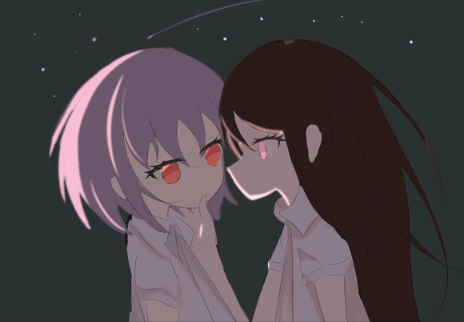

# 如果高松灯怀孕了

## 1

“大家…我要说一件事…”高松灯在练习室内打断了练习，唯唯诺诺地面对大家说道“那个…对不起…”“我好像…怀孕了…”“蛤？”立希猛地叫出声，却又立刻捂住了嘴巴，似乎是意识到自己暴露了什么，不过幸运的是并没有人注意到她。因为此时…素世已经开始一边思考着自己哪里疏忽了一边疯狂地玩弄着手指爱音努力地告诉自己要直面现实但同时大脑已经开始逃避，明明自己每次都有注意的…而猫猫则在一旁露出了不怀好意的微笑。  

## 2

“诶诶…灯…身体还好吗？有没有出什么问题”爱音第一个反应过来，试图把话题引导向灯的身体问题，而不是另一半是谁“那种道德大瓜“嗯嗯…谢谢你…ano酱…我没事的”灯深情地看了爱音一眼，让爱音不禁一激灵“诶～那灯酱（夹）”“一定得好好注意身体了呀～今天赶紧回去休息吧（夹）”“之后我们找个机会再细说吧（夹）”素世也反应了过来，试图结束这场对话“对…对！灯，我…我送你回家吧！”立系也急忙站出来，想带走灯私下交流  

## 3

“嗯…谢谢大家…”“那我先回去了…”立希迅速凑上来，想要扶着灯但又不敢触碰，只能尴尬地站在灯旁边灯也没有抗拒，就这样和立希一起离开了ring  

## 4

回家的列车上“灯…那个…孩子的事”立希扭扭捏捏的问道“rikki”灯认真的说着“虽然我也没有搞明白…但是…我会努力的！”“哦哦！”立希被这突然的负责发言打乱了阵脚“所以rikki，我们一起努力…好吗”“嗯…我也会努力帮助灯的”一如既往送到了天桥“那…我先回去了rikki，明天见”“嗯嗯…明天见”  

## 5

同时间，ring内“诶～怎么会有这种事情”爱音故作震惊地感叹“是呀，灯那么一个好孩子，怎么会这样呢（夹）”素世故作镇定，似乎是为灯感到不解“有趣的…女人们”猫猫偷笑“难道是灯在外面被奇怪的男人给骗了吗”爱音故意猜测“如果是这样的的话…我们一定要好好保护灯了（夹）”“是呀是呀，我一定要把灯背后的男人抓出来！”仍在表演的爱音愈发相信自己，似乎自己就是正义的要挽救灯于水火的英雄。“唉…希望是这这样呢（不夹了）”“但也可能～是被女生给骗了呢（不夹了）””诶！”爱音惊出冷汗“别…别开玩笑了soyorin，女生怎么会怀孕呢？”“但是万一呢～毕竟…如果是跟女生的话，灯的异常不被我们发现就很合理了”“爱音，你有注意在学校灯和什么同学特别亲呢吗”“没…没有吧…（冷汗）好像灯除了跟我在一块也就是一个人待着了”“是～嘛～”素世注视着爱音“呵呵～那这样的话～爱音嫌疑最大了呢（夹）”  

## 6

夜晚，家中。“好可怕好可怕…soyorin…被她注视着真的好恐怖…不知道有没有装过去”爱音一边回忆着下午的对话，一边给灯发着消息“tomorin，你怎么样了？”同时另一边，素世坐在沙发上，手中捏着的茶杯微微颤动“这么看来…爱音也可能是无辜的，立希没来得及观察，这么说来…灯应该是真的只跟我…”一边想着，素世一边发送了消息“灯，身体怎么样了，感觉还好吗”  

## 7

灯看着手机，轻轻按摩着肚子，突然三个私信铃声响起立希、爱音和素世都不约而同的来询问灯的身体状况。灯微微一笑，给每个人认真回复“我很好…没事的，我会努力的，我们要一辈子…不是吗”  

## 8

爱音家中“一辈子…难道灯不打算把孩子打掉吗？！”爱音从床上弹起，差点要把手机甩飞“天啊…难道我要高中没毕业就先有孩子了吗”“但这也是灯的选择，本来就是我的错…家里养着灯和孩子应该没问题吧…”  

## 9

素世家中“灯酱说要努力…也就是说灯要留着孩子吗”素世更加不安地玩弄起了手指“这样下去…是没办法瞒过大家的…乐队也没办法继续”“mygo…又会解散吗…”“不对…立希的话，不管怎样都会原因陪灯一起的。爱音说清楚的话也不会抛下灯不管的，乐奈酱应该是无所谓的。这么说来…mygo还是可以继续下去的！”素世也因此下定了决心，素世家要为灯的养胎生育以及照顾婴儿买单还是轻轻松松的。反而可以让原本冷清的家里多一丝人情味。素世恢复了一些笑容，不仅期待起了和灯一起的未来。  

## 10

前传-1：照亮迷茫孩子的明灯立希她…到底是怎么想的呢灯常常思考，疑惑不解对于自己笨拙但是尽量用心的关照，会因为自己对其他人生气…“好想…问一问她…”偶然翻阅了家里的书柜，一本未曾见过的笔记本出现在灯的视野“跟女生…打好关系的办法？一晚上拿下女高中生”灯被这显眼而直白的标题吸引，翻开以后，看到的是一条条邀请女生约会乃至过夜的技巧“这…这样就能明白她人的内心吗！”灯不解，灯也未曾觉得自己能理解，但是…不去做…就无法前进  

## 11

照亮迷茫孩子的明灯-续像那天一样讨厌的下雨天…临近live，立希又让人有一种不安的氛围…灯不知道…但是灯隐隐嗅到了异常的气味…就像crychic的那天…就像mygo的那天…会让灯害怕，灯受伤的气味…大家还是努力地合练完，爱音一如既往地试图带动气氛，但是立希如同寒冰一样…只是靠近都让人感到刺痛…立希跟灯坐着一辆列车，但立希'这次却似乎不想送灯到楼下，仍然僵坐在座位上。“…那个！”“送我回去吧…立希”立希惊愕，却没有动的打算，或许是失去了行动的意志“这样下去…不可以！”灯抓住立希的胳膊，将立希拉了出来。“立希！”灯大喊着，努力呼喊、拍打着立希的心房“我已经…我果然还是不行…明明已经拼尽全力…明明做到了最好”立希自言自语着…煎熬着…叹息着不断用对比化作割伤自己的钝刀，不断用自我批评化作束缚自己的枷锁，阴影袭来，紧紧蒙住立希的双眼，立希…迷失了。  

## 12

照亮迷茫孩子的明灯-终“立希…”硕大而密集的雨滴无情地洗刷着大地，重刷着众人的内心“雨太大了…我…害怕打雷…”“可以陪我…过夜吗”立希惊讶，不知道说什么，但又完全没有拒绝的理由，也没有拒绝的心意。“好…”立希被半推半就着带回了灯家，跟双方父母说好后，湿漉漉的两人洗完澡，穿着灯的换洗衣服，略带拥挤的躺在灯的床上。“立希…”“我不知道立希了不了解我…但是我不了解立希”“立希的迷茫，立希的无助，我无法察觉，更无法帮到立希…”“怎么会…你可是我的…”立希想要辩解“我不知道！”灯略带颓废地喊着“我不知道…啊…”“我想要成为人类…成为大家…我没有大家的心…理解不了大家的泪水，理解不了大家的笑容，我能做的只有为自己呐喊，为自己哭泣…”“但是立希…你可以接纳我吗…看清真实的我的一切…”“作为交换…我也想要立希的一切…”灯已经脱掉了衣服，蹭到了立希的身上。两人鼻子相触，能感受到对方局促而湿热的吐息“这是做什么…灯…”立希已经失去了思考能力，只能胡乱地顺着本能应对“立希…今晚…成为我吧…我也会…成为立希”二人相拥，二人哭泣，二人呐喊，二人在今晚失去了自己的一切，也得到了对方的一切。仅凭本能行动的立希和灯，努力取悦着对方的身体，在快感的欢愉中，二人一同逃脱，逃离现实，逃离迷失，二人是仅属于对方的迷子。  

## 13

我之后会一边更新主线一边更新灯跟大家的情感线，大家要是更想看哪一部分可以跟我说…及其需要且欢迎各种意见建议。因为还写了好几个假药，可能更新的比较随性，想到了就会更新。  

## 14

前传-2 破碎太阳与微光群星“啊啊啊啊啊啊要碎掉了”合练后的爱音如此抱怨着“rikki新曲子的谱也太难了吧！当我是猫猫吗”“ano酱不是之前也知道了吗…立希问完之后…ano酱自己说着“放马过来”让立希放心写的”“我知道啦…但没想到立希写的这么大胆嘛…虽然确实感觉这次的曲子很厉害”“立希明明前段时间还那么阴沉…怎么哄都哄不好”“自从那天大雨之后，rikki状态就好了很多诶～tomorin那天跟她说了什么吗？”tomorin脸颊微红，羞羞涩涩地回了一句“没…没有…就是鼓励了一下”“这样呀～毕竟rikki很喜欢tomorin呢～”“ano酱…”灯握住了爱音的手，看到了爱音最近为了练习曲子，高强度演奏导致的伤痕爱音也注意到灯的视线，稍微有些迟疑地抽回了手“这…这个呀～毕竟大家都很厉害呢～为了演奏好rikki这么努力学的曲子，我可不能拖后退呢！”爱音微微苦笑道“ano酱…”灯重复着呐喃低语  

## 15

不知不觉，在爱音的细致入微的宠爱下，开心的学校的一天就这么过去了。“现在没有训练了～我来送tomorin回家吧～”“嗯嗯…谢谢ano酱，但是…”话音未落，爱音却突然僵在原地。因为此刻，爱音和灯看到某花咲川黑发少女正和月之森知名棕发美少女在校门口面面相觑。  

## 16

嘿嘿…摸了一张灯希…会有人夸我嘛
  

## 17

“蛤？我说…你在这里做什么”“我才是要问你，花咲川离这里不近吧，为什么要特地过来”素世神情冷漠，似乎是想要一眼洞穿立希的想法“灯怀孕了，我来接她回家…倒是你，为什么突然对灯这么上心”立希反问到素世略带烦躁地盯着立希，似乎是什么重要的秘密被不想看到的人看到了一般。“我…放不下心”“放心不下灯？为此特地跑来羽丘门口，这不像你啊”“还是说…背后有什么不能言说的隐情”或许是因为涉及到了灯，立希变得格外锐利敏感。素世顿感不妙，想要探听虚实却被反将一军，手指的不断地来回拨弄，指甲也愈发残破不堪  

## 18

“那个…两位在…争吵什么呢”爱音打断了素世和立希的质询“大家…不要吵架”灯快步走过来夹在两人中间，楚楚可怜的样子磨灭掉了二人所有的锐气“我是来…接灯放学的，之前也跟灯说好了”“等下～我说，就算要陪灯回家，也应该是我来吧”爱音表示着抗议“你太不靠谱了，让你跟着灯指不定会胡闹出什么事情”“诶诶～rikki也太小看我了吧！我明明一直把tomorin照顾的很好！”粉毛似乎要炸开以表示不满，但又突然露出玩味的笑容“还是说…立希只是在找借口～”“才…才没有…你明明…一直都喜欢乱来…之前还在学校里追着我不放…”  

## 19

“别闹了”“大家，都是想来接灯放学回家的吧”素世看似面无表情地说到“那么既然如此，不让灯感到困扰才是最重要的吧”爱音和立希心虚地点着头，素世随即望向灯“灯，你希望我们谁来陪你回去呢”素世把问题又抛回给了灯，也似乎是相信灯会选择自己“那个…我想…大家一起”“蛤？”立希再次感叹“诶呀呀…灯果然会这么说…”爱音无奈地摇了摇头“既然这是灯的决定，那么大家也没有意见吧”素世看向立希，立希也只能微微低头以表示同意众人围绕着灯，在包含关切与担忧中，将等送到了楼下。在三人的道别声中，灯在众人视线里消失。而公主的消失也意味着战火的重燃  

## 20

“我说，”立希率先发话“以后灯让我来接就行了”“为什么？我跟灯明明一起放学诶～，我可以把她送回家的，rikki你就不要绕路了”“不—行—”“让你接送我实在是不放心”“rikki你又来！”“好了好了～”素世适宜地插进了话题“既然如此，我请一名司机来接送不就好了吗”“月之森禁止专车接送，但是我到羽川门口和灯一起做专车就好了”“诶？”立希和爱音异口同声，面对如此体贴的建议，似乎也找不出了反驳的借口。  

## 21

“话说回来～soyorin为什么突然对灯的事情这么上心～”“之前下雨的时候还不想让我们进soyo家呢～（轮符雨）”“嘁…”“soyorin～”素世还在揉搓着手指“虽然soyorin对灯那么好，我跟立希也很安心就是啦～但是如果soyorin有什么隐情，跟我们说也可以哦”“唔…”“没什么好说的…”“总之怀孕时候的灯一定要尽量保护好，不要出了岔子”“诶～soyorin跟妈咪一样呢～”  

## 22

“才…才没有”“我说，关于灯的孩子的事”立希沉思许久，突然站了出来“其实是…”“不过话说回来～孩子的父亲到底是谁呢～”爱音的话打断立希那半吊子的勇气“不知道…”“不管怎么样，我们能做的只有照顾好灯了”素世答道“诶～大家真的不好奇吗～”（大家好奇的话我会跟灯一起告诉大家的…）“不好奇，这是灯自己的事”（毕竟这是我跟灯的事）“也…也是”（灯的话，不希望我单方面告诉大家吧）“呐～soyorin～专车也可以送送我嘛～”“自己坐电车回去”“呜～soyorin坏心眼”最终，三个人也在电车站散会，各自去各自回家的电车走前，爱音小跑着招呼素世听下“呐～soyorin～soyorin～”“怎么了…如果是想坐专车的话，再怎么争取也是没用的哦”爱音没有在乎素世的冷漠回应，而是偷偷把脸蛋靠到素世的耳朵旁边“我说…灯的孩子…其实是素世的吧～”  

## 23

---------一个月过去---------乐队已经很久没有排练，偶尔排练也只是低强度的练习保持状态。但是大家经常会因为灯聚在一起，关心灯的身体。灯的小腹已经微微隆起，虽然看起来只是胖了一点，但是细细抚摸能感觉到肚子上的触感并非只是脂肪增加的柔软，而是隐隐带有异物感。一次五人出行中，猫猫吵着要吃芭菲，于是立希只能拉着猫去附近的芭菲店。但让立希意外之喜的是，灯主动地拉住了立希的手“立希酱…我也去…”“诶！好啊灯，那我们一起去吧”“…嗯！”-----芭菲店内-----“我要…这个…还有这个”“喂！野猫，别点太多了，会吃不完的”“立希…像是妈妈一样呢”灯感叹，立希听到以后则是瞬间羞红了脸  

## 24

“立希酱…”“那个…灯…”立希再次鼓起勇气，试图表达自己的诉求“自从灯怀孕以后，我们还没做过一次…”“身体已经…每天一见到灯就感觉燥热的不行…这样下去感觉不太妙”“这样吗…对不起…立希酱…”“…没有！不是灯的错”“我没有考虑好立希的困扰”“这样吧…虽然我们现在也不能做…但是…”灯指了指旁边一个没有人的小道“那边…没有人…我们去那里吧”立希看了眼还在等芭菲的乐奈，时间上似乎并不紧迫“嗯…”立希再次宕机，被灯半推半就地拉到小道，直接从脸蛋红到了耳根。“kiss…”灯迎了上去，二人嘴唇紧紧相贴，舌头熟练地来回搅动，翩翩起舞。不知道过了多久，立希只感觉自己浑身酥麻，几乎要失去站立的能力，两腿之间更传来了一丝丝异样的湿热感。两人的嘴终于松开，两抹银丝挂在二人唇边，连接着二人的薄唇。而此时猫猫拿着芭菲，站在一边“有趣的女人”看到两人完事，猫猫也适时宜的站了出来“该回去了”“嗯…嗯…”立希连忙整理好自己略带凌乱的衣装，调整好表情，拉着灯的手回去与爱音素世汇合----------与此同时--------“呐～soyorin”“灯怀孕已经快一个多月了吧～”“soyorin啊～最近感觉经常焦躁的来回踱步呢～是太紧张了吗？”“才…才没有…多管闲事”  

## 25

-------拉回一个月前--------“我说…灯的孩子…其实是素世的吧”“什…”“你…你在说什么…”女生和女生怎么可能“不要狡辩的这么勉强～soyorin～你也搜过的吧，女生和女生之间…并非不可能”“但…不管怎样…跟我没…”“诶～soyorin想说没关系嘛～”“soyorin的行为，太反常了哦，对灯过度的上心了，很多我跟立希能帮到灯的事情soyorin依然要抢着来做，这可不像soyorin哦”  

## 26

“哼哼～不管soyorin怎么说，我去问一下灯，灯都会告诉我的吧”“别！…”“我…我说”“是！孩子是我的！我跟灯做过了！你满意了吧…”“诶…soyorin你不要生气嘛”（爱音内心os：可恶…灯果然也跟别人做过了，可恶的soyorin，竟然欺负可爱无助的灯宝…那么孩子到底是我的还是soyo的…一定不能让soyo知道我也干了）“知道孩子是谁的我也放心了呀～soyo的话，一定能很好的照顾孩子吧”素世脸上泛起红晕“不过呢…素世也不希望乐队的其他人知道吧”“嗯？”“是…你不要告诉其他人…这是我们的…秘密”“这可不像求人态度哦～”“你！…”素世恼羞成怒，被眼前这个气人的粉毛挑衅，已经要忍不住一拳上去了“诶呀诶呀别生气soyorin，这样，soyorin答应我两件事，我一定会保守好秘密的”“你说”“一是…soyorin如果有什么困扰、麻烦，不许瞒着我，一定要告诉我，我会和soyorin一起努力想的，这是为了soyorin，也是为了灯，更是为了孩子”爱音认真的说到，如此温柔的愿望倒是让素世感到惊讶，内心微微触动“第二个愿望…则是…未来如果我向soyo提出一个请求…soyo不许拒绝我哦～”“什么请求…”“我还没想好啦～总之到时候soyo要满足我一个愿望，约好了哦”“嗯…好吧…约好了…你可一定要保守好秘密，不然的话…”素世脸上浮现出“和善的笑容”“我知道啦我知道啦！那…来拉勾”“好幼稚…”“怎么啦！这是为了表示我的决心嘛！”爱音拉起了素世略带抵抗的手二人小指相勾，在月光和星辰的照耀下立下了誓言。  

## 27

碎碎念-4点赞每满100我会再多摸一张插图的，下次可以摸半身涩涩插  

## 28

碎碎念5-把自己很喜欢的前传部分补充细节后单独发出来啦～爱灯和灯素的插画也在画啦  

## 29

---------时间回到怀孕一个月后的现在-------“soyorin最近感觉经常焦躁的来回踱步呢？是太紧张了吗”“才…才没有…多管闲事”“诶～soyorin可是答应我了～有什么都要说出来呢”“呜…”“那让我来猜一猜…soyorin只要点头或者摇头就好了～”“嗯…”“是对灯的身体状况不放心？看起来不是…灯精神状况也挺好的…”“那…难道是…太久没有和灯亲密接触了…觉得心里空落落的～”soyo犹豫了一下…然后缓慢地点点头“啊～看来是这样的～还是说也不只是心里，身体也是…”爱音右手悄摸摸绕过soyo的后背，搂住soyo的腰，却被soyo猛地推开被说中了内心最不可告人的那一抹灰暗的色彩，soyorin感觉自己像是赤身裸体一般不安、不爽、羞耻…“讨厌死了！”“不要生气嘛soyorin…我也是为了你好…担心你嘛～我错了…原谅我好嘛”腹黑的粉毛女生在得了便宜以后直接开始卖乖，装作可怜地让素世狠不下心  

## 30

“我们回来了”立希整理好了衣装，但还没有完全从刚刚的状态中恢复，面部的潮红还未褪去，呼吸也略带沉重，拉着灯和拿着芭菲的猫猫的她，所看到的是莫名和自己一样也面色潮红，穿着粗气的素世，只是相比下来神情多了一分恼怒  

## 31

---------周末---------今天mygo的众人并没有任何活动，各自都在各自的家中休息，外面又稀稀拉拉地下起了小雨，空气中的土腥味和潮湿感让人不适素世一个人窝在床上，大口地、厚重地吐息着，整个屋子里相比外面更加的湿热“灯…灯…要…要不行了…唔…”这是素世用来战胜自己的邪念，暂时展露自己不堪一面的方式，也只有这样，素世才能释放平时伪装的压力，释放想要灯而没有办法sox的欲求不满  

## 32

预告！灯祥前传！《不应存在的梦》  

## 33

还没有释放彻底，发泄出自己压力素世却被突然响起的铃声打断“那个…soyorin…我和灯出来逛街…突然下雨了…可以去soyorin家里避雨吗”“什么…灯！”素世连忙起身，现在的怀孕的灯，可不能着凉“你们上来吧，已经跟保安说好了”素世赶忙洗脸换衣服，收拾了一下房间，整理好自己的仪容仪表。开门后，看到了那个身上带有一些雨滴的痕迹，头发也稍显潮湿的灯和爱音“谢谢～soyorin最好了～♡”“是看在灯的面子上"素世刻意显得冷漠的回应道“谢谢…素世…"“嗯嗯没关系～灯一定要注意好身体，着凉可是很危险的”“soyorin偏心～太坏了啦！”爱音吃着醋，却被素世丢来了一个毛巾“先擦干净吧，今天妈妈要在公司加班不会回来，你们可以多坐一会”  

## 34

原本的小雨不但没有削减，然而逐渐加重，最后变成电闪雷鸣的暴雨。好在，灯在早些时候坐着素世的专车回去了。但爱音却没有这么好运，等想着打车或者坐车的时候，雨已经大到影响交通，让部分电车停运了。“诶…没有办法了…这下可以在soyorin家过夜嘛”爱音苦笑道“嘁…”“真没办法…那你睡在大厅吧，柜子里有枕头被子”“我是不熬夜主义，要去睡了，晚安”“诶诶诶～soyorin好无情，不来知心好友间的深夜聊天嘛”素世并没有回应，直接关上门钻进了被子里。  

## 35

碎碎谈-6打算攒一点稿子…不然灵感枯竭了就更新不动了…sox写多了感觉大脑的欲望都要消失了，看本子眼神都是清澈的求赞求关注求评论求建议喵  

## 36

碎碎念-7 素世的插画快画好了喵
  

## 37

乌云在天空中翻滚，遮蔽了日与月，让人混淆了昼夜，只有时不时雷电的咆哮让人感受到天空并非死寂一片，而会撕裂试图靠近它的一切。素世在这种情况下也无法安然入睡，过去的一切，那感伤的记忆，如同雷电一般撕开了素世的心房，直直刺痛了素世的内心。“灯…”素世想起了那个帮助她走出阴影，迫使他忘记一切的人，但此时，她并不在身边。素世的内心，再次陷入黑暗，失去了往日那温暖的灯光。  

## 38

灯……灯…”下午那还未曾发泄完的压力再次喷涌而出，素世只得继续下午未尽的自我抚慰，努力压抑着那娇羞的喘息，感受着一阵一阵快感的荡漾。  

## 39

呜呜，吧务删我贴都不告诉我了  

## 40

“咚咚”“soyorin~雷声好大，我睡不着嘛~我知道，你也没睡哦~”“不许！…进来！…”素世用尽所有力气嘶吼道爱音无视了素世的咆哮与抗拒，推开了素世的门，看到了在努力整顿身形，但余韵依旧回荡的素世，素世喘着粗气，浑身无力地趴在床上，身体还在微微颤动。  

## 41

“我知道的哦~soyorin~压力很大的吧”“明明约好了，为什么不跟我说呢？”“可恶，这种事…没有必要…”素世努力调动理性，负隅顽抗“为什么要进来，是不懂隐私吗！”“因为soyorin一旦放着不管，就会自顾自的迷路呢”“才没有……”“素世前段时间突然变温柔了，仿佛原本心里空空的部分被填满了，素世跟我说了之后我才知道，那一定是灯对素世做了什么吧。“  

## 42

“灯就是这样呢，尽管脆弱、敏感，但是又异常坚强，会拼尽全力地传达她的想法，直到让我们可以与她一同哭泣，一同放声大笑。直到用她的全部，把我们内心的缝隙、内心的空洞给填满““……“素世沉默不语“呐…““soyorin““还记得答应我的事情嘛~要满足我一个愿望的““今晚……和我一起兑现吧“  

## 43

————一夜过去————呼啸的风雨之声已然停息，一缕缕清晨的阳光穿透云层，温柔地轻抚着被暴雨鞭打的遍体鳞伤的大地。素世缓缓起身，看到隔壁躺着的精疲力竭，深深睡去的粉毛，心中复杂的情绪交织。自己真的可以这么做吗？灯会原谅自己吗、或是、自己能原谅自己吗。灯说，每一面都是真实的我，都是温柔而纯粹的，但我果然还是………….没办法像灯那样爱上自己。  

## 44

“嗯~~早上好…soyorin，起的好早呀“爱音伸了一个大大的懒腰，看着呆坐在床上的素世，忍不住蹭了过去。“呐~soyorin~昨晚那么开心~为什么一觉起来就闷闷不乐了~是昨晚我做的不好嘛““不是……““我们…做了对不起灯的事情““灯现在还在怀孕…我们却在自顾自的享乐““我说呀soyorin，我不会说我们没有做错，但是想让soyo放下负担，真心面对自己的这份心意，一定是没错的。“  

## 45

猫希篇预告：名为爱的诱惑，是能扭曲现实的诅咒。  

## 46

“这是…诡辩…““不是的哦，灯一定不希望soyorin为了她而勉强自己的，在努力照顾她人之前，请先照顾好自己。““好吧…“素世无力反驳，就像是之前被追到家里一样，面对目标坚定的爱音，素世总是无力应对。那就约好了，以后没有我的允许也不要随意的贴过来，我们之间的事情，更不能告诉任何人，还是要以保护灯作为第一要务。“知道了啦~soyorin真的很温柔呢““啰嗦…““那…要再来一次吗，我现在可是活力满满呢！“素世看着面前洋洋得意的爱音，轻轻地推开“不可以，今天还要做很多事情，不可以在这里浪费太多精力““欸~我会伤心的soyorin~““至少…也得等到晚上…““好欸~我就知道soyorin不会忍心放着我一个人不管的“  

## 47

碎碎念-8大家想看什么题材的插画呢，可以在这里许愿  

## 48

------------------------------------------“无论多么用力地挥动鼓槌，多么用力地敲打鼓面，也无法发泄出心中的不快“Ring内，立希正在拼了命地打鼓，她多么希望就这么打下去，打到鼓面破碎，打到可以击溃着让人无力的现实。“就连灯怀孕了…我也帮不上这么多忙，甚至接送的工作都被素世请的司机包圆了““这么说来…养育孩子的资金还是个问题，要想办法赚钱了…“又是如同狂风暴雨般猛烈的鼓声，更是立希的心声，如同激流一般汹涌澎湃，是名为音乐的，最为温柔的呐喊。强劲的一轮鼓点之后，立希筋疲力尽地瘫倒在座位上。“立希…太拼命了“意想不到的野猫的声音传来，立希抬头望去，发现背着吉他的野猫靠在练习室的门口‘野猫..？你怎么在这““刚刚在…练琴，听到了立希的鼓声”立希翻动着自己的随身包包，果然在里面找到了自己习惯随身携带的抹茶糖。从中拿出两颗，丢给了野猫，野猫也灵敏地接住，笑着说“立希，喜欢“  

## 49

“差不多该走了“立希看了看表，发现预约的时间差不多要到了，准备收拾好东西回家，走出练习室却听到稀稀拉拉的雨声，此时ring的门外已经是大雨倾盆“这个天气…不太适合冒着雨走…等雨小点再走吧”立希作罢，找到了休息室决定休息一会，不久后野猫收拾好了吉他也跟了过来。“立希，抹茶，还要““吃太多可对身体不好，这是今天最后的了，野猫”立希说着，又向野猫丢了两颗抹茶糖“野猫…我要睡一会…过半个小时叫我一下”“嗯”在梦里，立希见到了梦寐以求但是求而不得的她，见到了让自己的快乐、让自己烦恼、与自己共同迷失的“她”“灯…灯…”立希梦呓着  

## 50

“立希！”被野猫叫醒的立希发现自己已经被野猫骑在了身上“呜哇，野猫…你做什么”“因为，立希在梦里很痛苦，一直在叫着灯的名字”“呜，不要对其他人提起这件事”尽管不管怎么样灯都会爱着自己，关心自己，但是立希也并不希望给灯添加凭空的烦恼。“立希，很想灯吗”“…想”立希犹豫许久，最终还是承认了野猫若有所思，突然冲了出去，当立希追出去看的时候野猫已经消失了。没有睡好的立希在困意的包裹下眼皮逐渐沉重，看着外面雨势没有减小，决定再睡一会。可没过几分钟，莫名熟悉的压力感传来，一睁眼看到野猫竟然又骑在了自己身上。而此时的要乐奈，竟然换上了羽丘的夏季制服“我…换上了制服…要拿我，当代餐吗”“你在开什么玩…”立希还没能拒绝，猫就贴了上来。看着灯的校服、灯的发型，甚至跟灯脸型相近的乐奈，立希仿佛产生了幻觉，似乎灯此时真的骑在自己的身上。“灯…”  

## 51

“我也做了““嗯？什么？“和有趣的女人，做了““…？“突如其来的爆炸消息让立希完全无法反映过来“你是说…和灯…““做了“乐奈直白地回答“呜…为什么“立希难过的要哭了出来，原来自己所以为的在灯心中的独特地位…也是不存在的嘛。这样的自己，还沾沾自喜，还自说自话的苦恼，自以为是的要负起责任…呜…好想死意识到自己的言论好像对立希造成了暴击，乐奈补充道“所以我身上，有她的气味““呜~“立希发出了无奈的悲鸣，在乐奈的鼓动下，灯的身影与野猫重合，就连气味都逐渐相似。“立希，要吃抹茶糖吗““要…“立希刚刚回答，嘴边出现陌生而熟悉的触感，抹茶的响起在口腔中弥漫，猫猫的舌头湿润而柔软，但技术却像是野猫一样糟糕，在立希的嘴里横冲直撞，如同野猫在玩弄它的玩具一般。  

## 52

怀孕灯草稿准备画一个全家福插，怀孕灯和mygo四人
  

## 53

修正了乳量太小的bug
  

## 54

我复活了家人们，顺便把插画也贴过来
  

## 55

野猫温润的嘴唇咬在了立希细腻的脖颈上，享受着立希肌肤的触感。立希没有任何抵抗，任由乐奈的牙齿和舌头在自己的身体上舔舐，轻咬，乐奈如野猫撕咬面包一般感受着玩弄食物的探索感与兴奋感。  

## 56

“唔…”第一次被这样压在身上玩弄，立希有些手足无措，只能忍受着乐奈的刺激，身体和声音中流露着微微的颤抖和紧张“野猫…温…温柔一点”乐奈并没有因此而放慢速度，手指的滑动与挑拨更加激烈，仅仅是上半身的进攻就已经让立希接近绝顶  

## 57

立希感受到野猫冰冷的手紧贴着肌肤，在校服内来回舞动  

## 58

时而抚摸揉捏着立希那丰满而娇挺，时而捏住那一抹突出的粉红  

## 59

“立希…好热…脱掉吧”猫猫一边说着一边扒掉立希的校服“喂！这可是livehouse，而且为什么先脱我的…”“没事的…已经…不会有人来了”此时门外，店员凛凛子小姐已经在门口放了“维修中，请勿进入”的立牌  

## 60

立希如同被野猫蚕食的小鸟一般，除了无力地挣扎以外再也没有别的行动。内心的纠葛与矛盾让立希没有办法能对乐奈下手，她欺骗了自己，却无法彻底欺骗自己。赤身的二人紧紧相拥，感受着对方的体温  

## 61

乐奈用自己的牙齿，在立希身上刻下一圈又一圈的印记，牙齿的啃咬与手指粗暴地侵入，让立希体验着快乐与痛苦交织的浪潮  

## 62

乐奈咬住了立希的丰满而圆润，一边吸吮一边用舌头挑逗着那一抹嫣红。“不…不可以…温柔一点野猫”“这里，会湿吗”“才…才不会…我可没有怀孕…”  

## 63

激烈骤雨下平静的ring，在一件休息室内也在发生着如同门外天气般激烈的云雨之事。二人合欢许久，最终野猫用尽了自己的最后一份力气，躺倒在了立希的身上，缓缓睡去。而立希也被乐奈那“吉他手如舞者一般灵活有力的手指”击败，也没有了动的力气，就这么放任着乐奈躺在自己的身上。  

## 64

不知过了多久————“喂，野猫，该起来了，外面雨已经小了。”“唔...不要...”乐奈反抗似的挠了挠立希“不行，再不走会被批评的”立希拿出一颗抹茶糖塞到了乐奈的嘴里“唔...”乐奈有所触动，勉为其难地从立希身上下来，立希扔来了衣服，但乐奈仍然不情不愿。“浑身，黏糊糊...不想，穿衣服“”赶紧回家洗个澡，跑完澡就不会粘了，再不穿衣服的话会着凉的“立希强硬地为乐奈套上衣服，自己迅速地穿好衣服，催着乐奈回家以后也迅速乘上了回家的电车”还好...差点就要赶不上末班车了“  

## 65

立希坐在电车上，脑中还在思考灯和乐奈的事，却突然又一股熟悉的气味涌入鼻子，打断了思路。立希低头看着自己浑身的牙印和红肿。”可恶...这下不是浑身都是抹茶味道了吗““或许我也要喜欢上抹茶的味道了…”抹茶的味道，弥漫进黑发少女的心房。名为的爱的诅咒，让立希欺骗了自己，欺骗了现实，走进了那条扭曲的道路。  

## 66

碎碎谈-9猫希的小章节到此就结束啦～之后大家的人际关系可能会更加复杂呢～下一章灯的剧情比重会增加想，也会引入新角色祥子和睦，虽然睦还没想好要以什么身份出现。但是灯祥是会有明确的前传故事的～最近也一直在思考孩子到底是谁的呢。之后也会用小篇幅来定期描写爱素猫希，以及灯all的亲热小剧场的立希真正接纳猫猫以后就会主动做1的，毕竟猫猫的水平太差劲了hh  

## 67

碎碎谈-10感觉剧情是不是有点太平了…之后是不是应该加入一些危机和修罗场的要素  

## 68

前传 不应存在的梦“祝你幸福”祥子留下这句真心的祝福以后，大步离去，再也没有回头，更没有回头的意愿。因为...自己选择的这条道路”绝不能回头““过去的弱小的我，已经死了”祥子是这么对别人说的，更是对自己说的。要扛起所有，要向他们复仇，那...弱小的自己，是不需要的。坚毅，冷漠，只为了目标而熊熊燃烧，除此之外的一切都可以舍弃。可为什么...那个女人，那个本来如小动物一般柔弱的女人，那个会因网络评论而迷茫的女人，那个在那一天被自己一句话击垮的女人...如今...能对自己穷追不舍。————一个月后————“祥子！！”放学后，灯再一次追了过来。“我...”“你不要说了！”祥子故作不耐烦地直接打断了灯的发言“我是不会听你的任何话的”“呜...”“我们已经没有任何关系了，不是吗”祥子环顾四周，并没有看到千早同学灯..这次特地选择一个人来吗，她到底为什么...“祥子！...我们，和好吧！”“我已经说了...”“不是的祥子！我已经跟祥子没有关系了！我知道...””那为什么...“”所以我要跟祥子重新建立关系！“”告诉我，好吗，祥子，至少告诉我理由...“  

## 69

”啊...仿佛是一个梦“灯的这一幕让祥子陷入闪回那是一个....不该存在的梦，名为crychic的梦...和大家一起，享受快乐，探索着世界的美好，更加接近，未来终将“成为人类””过去的我...已经死了“祥子对自己说道如今的自己，已经没有了做梦的资格。“祥子！”灯的呐喊惊醒了祥子“crychic...已经结束了，我、立希、还有素世，都已经结束了...”“正因如此，我们才有了’重新开始‘的资格！”“为什么...迷失的祥子，不愿意跟我们说一句话呢”“如果真的结束了的话...为什么没有重新开始的机会呢..”“告诉我！祥子！”“吵死了啊！”祥子怒吼“你们根本...什么都不知道，也什么都做不到！”“我只想...一个人走完我的路...不要来阻挠我！”“祥子...忘了crychic时的我吧，现在的我，只想和现在的祥子并肩前行。一起...迷失，然后前进吧！”可恶...明明不该这样的...明明已经斩断过去了...可是这个女人，却跨越了过去的鸿沟，只为牵起现在的自己的手。自己明明也没有这个资格...但就是忍不住，想要接住她的手...  

## 70

接下来继续更新正剧时间线  

## 71

————月之森校园————素世四处寻觅，终于找到了正在给小黄瓜浇水的睦。“睦！…那个…”“嗯？”回想起那天自己的礼物被素世无情的退回，如同自己的真心被抗拒地摔在地上那般。痛苦的感觉涌上心头，忍不住想要避开这个绝情的女人。“对不起！睦！那天…是我的问题…我当时还没能彻底向前看…”“但是现在已经…我对不起睦，睦还可以给我一个机会吗，让我挽回我们的关系”  

## 72

“嗯…素世…你变了…”睦隐隐的有些开心，她也曾真心的希望crychic的大家幸福，希望大家能走出一条光明的路，就算被素世拒绝了，现在的她也依然这样期望。“嗯…是呀…发生了很多…”“大家…怎么样了”“嗯…mygo最近活动比较停滞…因为灯她…怀孕了”“？”  

## 73

“怀孕？”不该出现在女高中生之间的词汇让睦不由得一惊“……谁的？”“不知道……”立希尽管认为是自己的，但是并不打算就这样暴露出来，而是熟练地装起了傻“不管怎么样…我们决定努力保护灯，尽量安稳地帮灯把孩子生下来”（这把是我想的有问题？为什么不打掉…）睦有些懵逼，还是无法接受现状“没关系哦睦，这种事本身也跟你没关系，我只是希望我们之间的裂痕可以修复”  

## 74

“嗯嗯…大家…没事就好”睦似懂非懂地点着头“素世，你能好起来，我就心满意足了我当然愿意…和素世…”话到嘴边，却不知怎么说出口…但二人目光相对，莞尔一笑，一切已经在不言之中不过祥子她…知道吗  

## 75

“这是恶作剧吧跌丝袜”祥子下了如此的论断一想到那个棕发少女，那不好的回忆，那沉甸甸的重力就让人不适“这可是女生和女生！怎么可能！”“但是…有都市传说说…”睦补充着“诶？可恶…真是胡闹呢…用都市传说来恶作剧什么都的，但如果…是真的的话”祥子心乱如麻“果然还是得去问一下”一个粉色头发的身影闪过祥子脑海——————“祥子同学？”在楼道里，爱音罕见地跟祥子擦肩而过“千早同学，我有问题要问你，tomo…就是，你们乐队…最近发生什么事了”  

## 76

“嗯？什么事情的话…”爱音心里盘算着，不知道灯的事情应不应该告诉祥子，这是灯的隐私…本应不泄密给任何人，但祥子也是灯的前队友，更何况这个时间来询问的话…不知是否是她听说了蛛丝马迹“那个…灯这段时间肚子不太舒服…然后…身体除了一些状况…嗯，所以mygo也暂停活动了  

## 77

“暂停活动？而且并没有说灯什么时候会康复…甚至没有说是什么疾病，仅仅是状况…”爱音模棱两可的回答反倒让祥子从中听出了端倪“明明暂停活动是很大的事…但好像理所当然那般，但灯却依旧可以正常上学，不是住院之类的重病”“也就是说…要么是疑难杂症…要么真的是…！”  

## 78

尽管二人都在相互打着谜语，但祥子已经猜到了七七八八“果然…还是得亲自去问灯了跌丝袜”“灯”“诶…？祥…祥子”“跟我过来”祥子强硬地拉住了灯的手，但又意识到自己的行为对可能怀孕的灯来说有些太过粗暴，又连忙松开“那…那个…祥子，要去哪里…”灯虽然有些意外，但也并没有反抗，顺从地跟着祥子的脚步“天台”——————“告诉我，灯，你最近…是怀孕了吗”  

## 79

“诶？祥子…你怎么”“是真的吗！灯！怀孕的事…”“嗯…嗯是真的，祥子，一直…没能跟你说”“从什么时候开始的！”“大…大概是…两个月前…”那不是，就在我和灯…那个之后的时候吗！“没有被奇怪的男人骗到吧！灯”“没…没有，我一直都只跟乐队的大家…还有祥子在一起…”“这么说…真的是因为我吗，灯…”“不…不是的！祥子”“那你告诉我孩子到底是谁的！”“我…我不知道…”灯心虚地撇开视线，更没能注意到祥子因紧张而颤抖的手  

## 80

如果真的是我让灯怀孕的话…我怎么可能能养的起孩子啊！就算是住院的费用…也不是现在的我能担负得起的ave mujica…不知道什么时候才能产生盈利，更何况…真的够吗…而且还有风险问题…“灯…那个孩子，你打算怎么做”  

## 81

“我…我想要生下来！将她养大…”“不要说出这么不负责任的话！灯”“现在的你…真的有办法给她一个好的生长环境吗”“我会努力的！和大家一起！”“你的队友们也有各自的生活！只是依靠是不行的…灯”此时的祥子还不知道，所谓的“队友”们，也正以孩子父母的标准来要求着自己  

## 82

我先把别的坑码一码，今天晚点更这个  

## 83

在破旧的出租屋内，客厅中躺着一位醉酒的大汉，在昏睡大汉的旁边，正坐着一位不安地咬着直接的淡蓝色头发的少女”怎么办怎么办怎么办...虽然是一时被灯诱惑...鬼迷心窍...但是，如果真的跟我有关系的话....“”听她们的意思，孩子的父亲..或者说另一位母亲还没有找到，话说为什么没人说过女生之间也可以怀孕啊！”没错，祥子也跟立希一样，经历了“质疑—搜索—确信”的思索过程，并最终相信，孩子只能是她的。“怕生的灯一定不会和我们不知道的陌生人发生关系，如果是认识的人的话...没有理由不跟灯坦白，这么盘算下来，不就只剩下我了跌斯哇”祥子焦虑地锤击了地板，让拳头有些生疼，还不得不担心是否会吵到楼下的住户”唉...如果是在以前...这种问题可以随便靠钱解决的...“  

## 84

后续预告：为了帮灯赚到宝宝经费，丰川祥子选择的工作竟是…（百***俗娘）  

## 85

祥子黯然神伤，甚至沉迷于那让她痛苦的，过去的回忆。相比于目前现实的重担，连那苦涩的离别、遗忘、失去，都显得有一分轻松。”就算是这样，我也不能...再这样破坏灯的生活了...我，会创造我们的归处的“祥子重新规划起mujica的训练、演出安排，以及兼职打工的排班，一夜无眠。——————”那个....初华，有没有比较赚钱的兼职呀...“训练过后，祥子偷偷地将三角初华拉到身旁，小声地密谋着”嗯..？祥子，你最近很缺钱吗？“从来没见过祥子如此的窘迫，让初华感到困惑”如果你缺钱的话...我可以给...“”不需要“”不要给我...这种施舍，我只是想找一些更有价值的兼职而已“”对呀对呀初子，要注意我们队长的自尊心哦”“啧...”百密一疏，没想到还是让喵梦这个好事精给听到了  

## 86

百密一疏，没想到还是让喵梦这个好事精给听到了“兼职的话...我没什么主意呢，抱歉呀祥子”初华眯了眯眼，稍显颓唐地对着祥子挥了挥手“嗯没事，我也只是随手一问，乐队的事情才是核心事宜”闲聊了几句后，初华与祥子挥手道别，而喵梦此时却阴魂不散，神秘兮兮地凑了过来“队长呀~我这里...正好有一份很不错的赚钱兼职，你有兴趣吗”一边说着，一边将一张神秘的名片塞到了祥子的手中。“我不需要，谢谢”祥子义正言辞地拒绝，并且想要把这张名片给退回，喵梦的行为很难不让祥子心怀戒心，或许...她还有别的目的“别这么说嘛~祥子你去多问一问总没坏处，我晚点还要直播，也先走啦”喵梦一边说着一边跑开，没有留给祥子进一步掰扯的机会，那张名片就这样留在了祥子的手中。众人走后，祥子仔细看去，平面上并没有多做介绍，仅仅是名为“永恒纯洁”的店名与电话（催更交流裙297865137）抱着试探的态度，祥子拨通了电话“喂...您好，听说您这里在招聘兼职，欸....百合风俗娘？抱歉，我不....等等，您说工资有多少...？时薪..？”  

