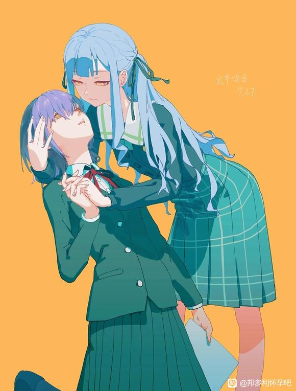

# 【图片】高松灯变成雌小鬼了！！！【邦多利怀孕吧】_百度贴吧

## 1

“哈啊…哈啊……”“可恶……不要把手插进来啊穷鬼祥子。”昏暗的房间内，灰色头发的少女一脸嫌弃的看着面前的人，她的止住并没有任何效果反而加快了对方的功速祥子:“闭嘴，你这个家伙”祥子:“我让你跟踪我”祥子“我让你嘴臭”灯:“哦哦………………”祥子每说一句话就会把手指插的深一些直到整只手都进去了为止。祥子:“你知不知道我每天上班已经够累了，你还来烦，可恶”祥子:“作为补偿，就用你的杂鱼小学来安慰我受伤的心灵吧”灯:“不要……穷鬼祥子的手指什么的……那种恶心的东西，我才不要啊”祥子:“哼，那可就由不得你了。”一会儿后高松灯口吐舌头，瞳孔向上四肢无语的仰躺在丰川祥子的床上。…………————(随便写写，依旧是以灯为主视角写的)
  

## 2

1.某一天灯宅在家里一个人偷偷的看黄色姛漫画，漫画里的女主正是一个嘴很臭雌小鬼。灯很好奇为什么漫画里的女主不过只是简单说了几句“杂鱼，杂鱼”之类的话，就被别人给do。她觉得很不符合现实逻辑，于是便也有样学样的模仿了起来。岂料正是这次模仿，激活了她体内尚未表达出来的“雌小祥基因”。等到第二天上学的时候，深藏于她体内的雌小鬼之魂便彻底的觉醒了。  

## 3

2.最先发现灯的变化的是爱音，她刚见到变化后的灯时便查觉到了一丝奇怪但爱音并未多想。她只当灯今天是心情很好罢了。…………灯一脸嬉笑的走进了教室，不知道为什么灯不笑还好，她一笑起来就有一种特别欠*的感觉。爱音:“Tomorin，早上好”灯:“哦哈哟，ano酱”灯异于平常的语气引起了爱音的疑惑，可她没有多想。灯一屁股坐上了自己的坐位开始了一天的学习。  

## 4

3.下课时间一到灯迫不及待的转身过去，想要和爱音聊聊天。灯:“呐，ano酱我一直很好奇你为什么要转学来我们这呢，可以告诉我吗？”灯突如其来的问题让爱音手足无措更何况灯的问题竟是她转学的理由。爱音:“唉…嗯……那个……”灯:“什么？什么？”爱音:“就是想家了……吧”灯:“什么超无聊的好不好，就是这种理由，该不会你骗我的吧”此时爱音刚松开气灯就立马折穿了她的慌言，这一次让她更加的慌乱了，自己是因为适应不了环境才转学这种理由对于爱面子的她来讲，根本说不出口啊。  

## 5

4.爱音神色慌张的扭捏着，被灯拆穿慌言后她的脸颊通红。灯:“ano酱真正转学的原因是什么呢，好好奇啊，告诉我吧”爱音:“那个……好吧，我只告诉Tomorin你哦，千万不要告诉别人。”灯:“ano酱放心吧，我嘴超严的”爱音调整了一下呼吸，轻声说道爱音:“其实……”爱音:“我是因为根本不会听不懂英语才转学的”噗嗤一道笑声打破了这安静的氛围，发出笑声的正是灯灯:“什么！哈哈哈……真的假的，ano酱你有够搞笑的勒”灯:“明明根本不会英语还去留学，哈哈哈，杂鱼，杂鱼，废物ano酱”  

## 6

5.下午灯和爱音在天文室里进行着社团活动。爱音因为灯在班上大声的把自己的经历笑着说出而十分的生气，她已经一上午没有搭理灯了。灯:“呐呐，ano酱不会生气了吧，我只是和你闹着玩的而已啦，别这么小气啊”爱音坐在沙发没有理她灯:“对不起啦ano酱，我在也不会这么做了，把你根本不会英语却硬要出国留学告诉别人什么的，哈哈哈哈……”爱音:“你……”爱音捏紧了拳头明显已经生气极了灯:“别在意了嘛，那么点小事”灯:“至于吗，啧”灯:“没办法做为补偿今天就由我来让爱音好好的爽一爽怎样？”  

## 7

6.爱音:“啊…啊……真的吗？”爱音本来已经打算要退出乐队再也不理灯的了，没想到灯居然提出来了这么有吸引力的条件。爱音:“这样的话，也不是不能原谅你嘛”噗嗤灯:“哈哈……当然是假的啊，我怎么会和ano酱你这个飞物左爱啊，杂鱼杂鱼，真是容易上当受遍呢，该不会ano酱你还是个处吧，哈哈”爱音:“高松灯，你…你……”灯:“杂鱼杂鱼，只配一个人自卫的废物ano酱呢”爱音:“可恶，老娘忍不了你了，高松灯！给我去死吧”  

## 8

7.爱音冲上去给灯就是一巴掌，将她扇倒至地。刚才还才嘲笑爱音的灯现在捂着红通通的睑蛋惊恐万分的看着爱音。灯:“你你你要干什么你，区区一个杂鱼ano酱居然敢打我”爱音狂暴的扑了上去，扯开灯的校服爱音:“闭嘴老娘打的就是你，不仅如此我今天还要用你来破我的处女之身。”灯:“不要，放开我，我才不想和你这个废物左爱啊”看着挣扎的灯，爱音反手在她的另一边脸上狠狠的也扇了一巴掌。爱音:“老实点，不然有你好受”爱音扬起手作势要再扇灯一嘴巴子，灯下意识抬手抵挡预想中的痛感却没有传来。这下吃痛的灯再也不敢乱动了。  

## 9

8.爱音把刚才的怒火数倍的在灯身上放泄着爱音:“明明刚才这么嚣张，现在却是这个模样，看来你也不过是个杂鱼而已嘛”爱音:“就用你这个杂鱼小学狠狠的去吧”爱音疯狂的搅动着弹吉他的手指，她似乎打算给这个不守信家伙一个狠狠的教训灯:“你等着，我会让你好看区区杂鱼爱音竟敢这么对我”爱音:“到现在还嘴硬，看来你真是不见黄泉不落泪啊”咔嚓一声快门声响，爱音把灯狼狈的样子给拍了下来。灯:“可恶你干什么，快把照片删了”爱音:“你不是要让我好看吗，哼哼”爱音:“如果你以后要是还敢对我做什么不好的事或者在背后说我的坏话的话，我保征，第二天学校里的每个人都会看到这个照片”爱音:“听懂了吗，杂鱼灯”灯:“可恶区区废物爱音居然敢威胁”爱音:“怎么不服，那我现在就把照片发出去”灯:“不…不要停下”灯:“我知道了，我以后不会再嘲笑ano酱所以拜托别把照片发出去”  

## 10

9.叮咚叮咚，放学钤声响。在经过一番打斗后，时间也来到了傍晚爱音和灯也离开了学校，已经如此晚了自然是不用去练习了。灯在回家的路口，突然看见了一个熟悉的蓝色身影。被爱音狠教训一番后她仍是死性不改，出于好奇她跟了上去。  

## 11

10.高松灯千不该万不该去尾随丰川祥子，更不该当着祥子面去嘲讽她的处境。要知道祥子可是一个比爱音更爱面子的人啊  

## 12

杂鱼杂鱼～8U都是杂鱼呢～嘿嘿  

## 13

11.如往尝一般，工作了一天的落魄大小姐丰川祥子带着身体与灵魂上的双重疲惫返回了脏乱不堪的房子里。不知从那个角落，高松灯突然蹦了出来。灯:“呀勒呀勒，这不是小祥吗？”祥子:“灯，你怎么会在这……”灯:“啊勒，我只是很好奇小祥你为什么要退出乐队而已所以我就就偷偷根上了瞧瞧罢了。”祥子:“唉又来了……先是素世，接下来又是你吗？”灯:“soyo酱？”祥子:“我说过了，退出乐队是我自己的事情，你们别再来纠缠我了”灯:“唉~为什么，该不是小祥家里出事了吧，毕竟这可不是像是小祥会住的地方啊”祥子:“你……不你多管闲事！”灯:“生气了，难道我猜对了哈哈”灯:“小祥真是爱面子呢”灯:“呐，我说小祥该不会是在做什么见不得人的工作，所以才退出乐队的吧”灯:“哈哈真是杂音呢，穷鬼小祥，杂鱼杂鱼”灯:“像小祥这种穷鬼杂鱼，确实不配玩乐队呢，”  

## 14

24.刚刚还躺在地上的立希，突然从灯背后扑了上来，像你一头野兽一样。立希:“灯，我们再来做吧”灯:“嗯，什么？”时间来到第二天早上，此时立希终于停了下来。而灯卧躺在床上，四肢使不上一点力，明明还有意识但就是脑袋空空。显然灯已经坏掉了。  

## 15

25.爱音带着满腔的怒火回到家中，此时她鼻血已经止住了。爱音:“可恶，高松灯等着瞧”爱音:“再让我遇到，没你好果汁吃”她拿出手机，准备将灯的裸照上传。突然她犹豫了一下，还是打消了这个念头。算了自己好歹跟灯同学一场，而且如果自己把灯的不雅照发出去的话，不知道立希那个疯子又会做出来什么。爱音洗了个澡，躺在了床上。现在冷静下来的她终于回过了神。为什么灯会变成那个样子呢？很奇怪，灯之前明明不那样的而且更奇怪的是自己待在灯身边时为什么总有一股不知为何想要让她吃瘪的冲动。爱音思来想去也找不到个所以然，即然想不出来她也不想去思考了。  

## 16

26.同样的另一边丰川祥子也回过了味来。她意识到自己做的太过火了居然打了灯，不管如何祥子决定还是去道个歉好。刚好今天自己最近有时间。  

## 17

27.今天是周末，也是祥子难得的不用工作也不用上学的一天。今天本来只有练习乐队这一件事，但她选在了这天在练习前去向灯道歉。这天也刚好正是灯被立希“反杀”后的第二天。  

## 18

28.祥子穿着她再豪宅里带出来的现在的自己根本卖不起的那套衣服。她礼貌的敲了敲门，没人回应过了一会她又敲了一下。这次门终于开了，但是开门的人却是自己曾经乐队里的鼓手——椎名立希。此时立希和灯刚好穿上衣服，立希正准备珍着灯的父母还没回家时赶快离开。她不知道祥子为什么会在门口站着祥子:“立希，你为什么会在这”祥子仔细看了一眼立希，这不看还好看了之后她立马就不爽了。立希现在衣冠不整，满头大汗，两侧脸颊绯红衣领敞开的模样在她看来完全就是刚刚才工口过的样子啊。她内心极度不平衡，祥子无法接受灯居然和自己以外的人做了。开什么玩笑她可是大小姐至少曾经是，就立希这模样不过是个小老百性而已，就她也配和自己比吗？祥子的自尊心太强，她不允许灯和除自己以后的人做过。一定是立希强迫的灯，祥子这样想着。不过仅凭外貌她还不感轻易“抓奸”。就当这时，灯也来到了门口。灯只穿着一件校服外套里面是真空，看着这个模样的灯。祥子已经可以确定了，这一定是工口了呀！  

## 19

先吃个早餐，等下再✍🏻  

## 20

29.祥子:“这是什么情况，麻烦你告诉我？”祥子带着严肃的语气质问着灯，而灯并没有表显的反常，倒不如这才灯本来应该有反应。灯因为立希的高强度劳作，而导致大脑发现和身体都出现了强烈的过缴反应，现在的灯反而短暂的保持了清醒变回了从前的样子。面对这种情况已经失去雌小鬼之力的她连一句完整的话也说不出来。灯:“唔……”立希:“你想怎样，啊！”立希:“你还想让灯怎样？”立希没有给祥子好脸色看，她也不知道祥子发什么癫，居然找了过来。她本不想说什么，但祥子的态度实在让人火大。祥子:“关你什么事”立希:“哈~”祥子:“灯给我说清楚，你和她究竟怎么回事”灯只穿着一件校服外套茫然的站着，双手又像从前一样不知该放那才好。灯:“不是，那个……”立希看不上去了，一把凶恨的抓住祥子昂贵的衣领。立希:“喂！”立希:“你难道还想让灯跟从前一样围着你转吗”立希:“你当初是怎么做的，哈”立希:“现在又反悔”立希:“真是有够自私的”祥子挣脱不了立希的束缚，只能任由于她拽着自己的衣领，这对她来说无疑是一种巨大的羞辱。  

## 21

30.祥子:“你又算什么”祥子:“哼，你不过只是馋灯的身子而已”立希:“你懂什么……”立希抬起手就要教训祥子，祥子见状连忙格挡。立希的挙头被祥子用手臂给挡了下来，同时因剧烈的动作祥子也终于挣脱了束缚。  

## 22

31.一旁的灯亲眼看着自己曾经的好友互相缠斗在一起，而自己只能无助的看着深深的感到了自己的无力。她不明白为什么？为什么自己只能看着美好破碎，只能享受那短暂到可怜的时光。过去的种种回忆涌上她的心头，那记忆染着一层温暖的画面在这一刻清晰浮现在眼前，她努力着伸手抓住那易散的流光。  

## 23

32.不能就这样结束，抱着这样的愿望她虔诚的祈祷。“哦内嘎，把力量借给我吧，另一个我”高松灯知道自己体内住着另一个灵魂，这段时间里她经历了很多全都拜她所赐。但是现在这种局面也只要“她”能解决，也就是另一个“我”。  

## 24

雌灯:“凭什么我要把力量借给你”灯:“凭什么？”灯:“是啊凭什么呢？”灯:“是呀，我这种人跟本不配组什么乐队，只配在阴暗的角落里孤独终老。”雌灯:“你对自己的定位还蛮清晰的吗，杂鱼灯”灯:“但无论如何，我也不想就这样结束啊”灯:“我还没有和大家好好兑现组一辈子乐队的约定”“这样做你就开心了吗？”灯:“什么？”“组一辈子乐队，这样做你就开心了吗？”灯:“……”“这样做是正确的吗？”灯:“……”“看来你满脑子想的都是自己呢？”  

## 25

33.灯:“每个人都有定义何为正确与错误的能力”“……”灯:“因此常常都会被自己蒙蔽双眼”“……”灯:“所以就算看不清前方的道路”灯:“就算迷茫着”灯:“我也想和大家一起在迷茫中前进啊！”“是吗，这样啊”“即使迷茫，即使伤心难过也要前进吗？”“那么我就帮帮你吧”  

## 26

34.没有为立希和祥子的斗欧感到悲哀，立刻赶到战场的是……即使迷茫也有不停前进的全新形态高松灯。  

## 27

35.灯:“你们两个都停下来吧”灯:“我有话要说”灯的话好像有魔力似的，立希和祥子听后立马就停了下来。灯:“立希算了吧，祥子也是有苦忠的”立希:“就算这样，她也不能这么和你说话……”祥子:“你完全是为了自己吧，不要打着的为了灯的名义啊……”灯:“我已经决定好了”灯:“即然你们两个都想和我一起前进的话”灯:“那么两个人一起来，我也没有任何关系”祥子(立希):“什么？”  

## 28

36.灯借助体内另一个自己的力量，提出了3P的要求后。祥子和立希勉为其难的接受了。在经过祥子和立希的双重揉捻后。灯和体内的雌小鬼之魂两者彻底的融为了一体，不分彼此。  

## 29

37.爱音对于自己被灯给爆了这件事也逐逐的释然了。因为班上的同学好像都不怎么在意似的，依旧每天正常的上着学。当然主要是爱音性格本来就好，不容易沮丧是她的天性况且爱音相信只要努力就一定会有好结果，抱着这样的心态她来到了学校。爱音一进教室就看见了灯，灯就坐在自己位子她一直盯着教室门在等着爱音。看见爱音后她立马又把视线移开，灯现在无疑很想向爱音道歉，但爱音肯定很生自己的气不想搭理她。她想到了这一点所以没有直接冲上去像上次一样大声挽留，而是选取了更为稳妥的做法。  

## 30

38.爱音看见自己桌子上面放着一个笔记本，她翻开来看了起来，这正是灯花费一个晚上向爱音写出来的道歉“小作文”爱音翻开笔记本一页一页的看着。“一直以来我都很喜欢爱音你，我不知道自己为什么会做出那种事。明明大家都是很好的朋友，我却再一次伤了你的心。真的很对不起爱音，我为自己的所做所为向你道歉。如果你还愿意和我一起迷茫的话，请在放学后来到天文社。爱音如果不愿意来，我也不会再像上次一样缠着你了，只希望爱音以后不要讨厌我。爱音我每天都会在那等你，等那一天你想原谅我了就可以来。拜托了请再和我组一辈子乐队吧，爱音酱。……如果没有爱音的话，瓦达西……”  

## 31

39.爱音看着这几乎写满了一个笔记本的道歉信，叹了一口气。爱音:“真麻烦啊”灯:“嗯……”爱音:“这个不需要了，还给你”灯:“爱音，我……”明明已经好好道歉了为什么还是……爱音:“我原谅你了，Tomorin”灯:“唉，真的吗！”灯的心情激动万分灯:“爱音你原谅我了吗”爱音:“原谅了哦，毕竟我也对灯做了很过分的事嘛”灯:“真的太好了”爱音:“对了，那张照片我已经删了Tomorin就不用担心了……”灯转身把嘴凑近爱音耳朵，害羞的说到灯:“没关系，只有是爱音想要的话”灯:“拍多少都没问题”爱音:“嗯唔，什么Tomorin……”灯微微解开衣领露出内衣的一角诱惑着爱音灯:“ano酱，对我做什么都没问题哦”爱音老脸一红，眼睛紧紧盯着灯的欧派简直望眼欲穿  

## 32

40.RiNG内素世带着猫猫在练习室内等待着，她还不愿离开。几天前大家明明都约好了要来练习结果灯和爱音没来，之后立希也不知道那去。只剩下她带着乐奈。  

## 33

41.终于素世决定不再等待了，于是她准备拉上乐奈找大家问个清楚是什么原因才不来RiNG练习。现在她一肚子怨言。乐奈正拿着素世给她买的大杯抹茶芭菲在尽情的嗦着。素世:“乐奈，走吧”乐奈:“嗯……要去哪？”素世也不知道该去哪素世:“总之先去灯家里看看吧”两人背上乐器走出了RiNG  

## 34

42.今天刚好是Ave mujica的第二次live，祥子再一次凭借自己的中二设定和过硬键盘技术圈了一波粉。演出结束后她在更衣室换掉一身的中二蕾丝，准备去灯家好好放松放松。  

## 35

43.初华看着祥子在角落换衣时，不经意露出的猥琐笑容感觉很奇怪。祥子是在想待会该和灯玩些什么想入非非的她没有注意到初华正一脸严肃的盯着自己。同时聚精会神看着祥子的初华也没有注意到也是一脸严肃的盯着祥子的睦。看见祥子要走初华立马追上。初华:“祥子我根你一起回去吧”祥子:“不用了，我一个人回去就好”  

## 36

44.初华很听祥子的话，她没有再要求和祥子一起。她另有打算  

## 37

45.祥子前脚刚刚出门，初华便立马偷偷跟了上去。看见这一幕的睦担心祥子被开盒也跟上去。乐队里唯一的乐 子人喵梦见到这种场景还以为要开什么音趴也跟了上去。剩下一个雇佣兵海铃觉得气氛都到这了，自己如果不跟上去的话就显得也太不合群了。就这样祥子在不知情的状况下带着Ave mujica全员玩了一把尾随play。  

## 38

46.第一批到达高松灯家是乐奈和素世。素世礼貌的敲了敲了门素世:“请问”素世:“有人在吗？”素世:“我是来找高松灯的”…………“来了”房内传来一道温柔的声音，接着门便打了开来。“是灯的朋友吗，我是灯的母亲哦”素世(乐奈):“伯母好”灯妈:“唔……”灯妈:“如果要找灯的话，她去了朋友家哦”灯妈:“是叫椎名……”灯妈:“对了，椎名立希”灯妈:“还有一个粉色头发的小女孩也在她们身旁哦”灯妈:“你们也是朋友吗”素世:“谢谢伯母，那我先走了”得到自己想要的答案后，素世没有多停留立马走了。素世现在只想立马知道她们三个抛下自己是想干姬毛啊？之后祥子也得到了同样但她并不知道立希家在那，看来下次得提前和灯说一声才好。岂料她准备离开时蹲在暗处的海铃突然蹦了出来。海铃本来躲的好好的但当她听到那个高松灯在立希家后她立马就不淡定了。她蹦了出来立马就朝立希家跑去。祥子:“海铃？”祥子:“你怎么在这”海铃只顾着跑完全没有听到祥子在说什么。祥子:“喂，等等”祥子也追了上去祥子:“对了海铃，你和立希认识对吧”祥子:“能告诉我立希住在那吗”海铃一直跑此刻她只希望一切还来的及。祥子也一直跑想追上海铃。祥子后面的初华也在跑，初华后面的睦，睦后的喵梦统统在跑。就这样海铃带着Ave mujica全员来了一场健康的有氧运动。  

## 39

47.与此同时另一边爱音立希和灯正玩的起劲。爱音不知从哪里拿出一套女仆装给灯换了上想玩玩csplayer。这是一件常见的黑白色搭配的女仆装，发卡和黑丝看起来很普通，不普通的地上则是那作为主体的裙子上。与其说那是裙子倒不说更像是一个围裙还合理一些灯白白的大腿就这样毫无遮掩的暴露在空气中，围裙不长刚好能挡住那隐私部位让人浮想连篇。如果从后面看的话更加诱人，因为后面跟本没有任何遮掩物灯光溜溜的大定看起软乎乎的一拍就红。围裙的上面在欧派中间还开了一个爱心形状的洞。从侧面看，灯的西半球和东半球也露出来了一点。明明关建部位挡住了，但就是很涩。爱音(立希):“嘿嘿~嘿嘿~”  

## 40

48.灯站在房间中央不停的摆着姿势，时而抱头半蹲，时而卧躺在地。爱音拿着手机不停拍照。咔嚓——咔嚓——终于拍照环节结束该进入正篇了，爱音放下手机。一旁立希擦干嘴角的口水赢笑着对爱音说到立希:“你给灯穿的什么破衣服，还是我来选吧”立希一头扎进衣柜从里面拿出了自己最喜欢的衣服，给灯又换了上去。  

## 41

49.有时候爱音总会觉得立希的脑袋有点问题，毕竟立希总是喜欢压力别人，可能就是因为脑子有病吧。又是一件黑白套装穿在了灯身，这次不是爱音拍照而是立希拍照了。立希喜欢灯，同时她也有其它喜欢的东西，比如说熊猫。立希给灯穿上的正是一件黑白色的熊猫睡衣。她激动的上窜乱跳，抱着灯狠狠的吸了一口。立希:“果然灯穿这个很可爱呢”看见这场景爱音第一次知道原来那个总是压力队友的人也会这样一面啊。立希脸上洋溢着至福的表情，显然这比刚才的女仆装对她更有冲击力。  

## 42

50.那么前戏也终于结束了，接下也该进入正篇了。叮咚——叮咚——门铃声在关建时刻响起，但是立希并不打算去开门。正当她准备继续时，突然只听见一声巨响。啪————仿佛是有人打碎玻璃翻了进来。立希停了下来。————时间回到几秒前，那时刚好一脸怨气的素世带着乐奈到了立希家。素世在立希家几百米处看见一个跑的极快的女人先一步走进了立希家院子里。海铃猛按门铃没有反应，着急的她抄起地上的石头对准玻璃就砸了下去。  

## 43

51.立希烦恼的走出房间发现打碎自家窗户的竟是自己的同班同学海铃，没等立希发怒海铃率先抱住了立希。海铃:“太好了，我赶上了”立希:“喂，你干什么突然跑到我家还打碎玻璃，你想干嘛啊哈”此时面对立希一如即往的态度，海铃没有再隐藏自己的心意，她高声说到海铃:“立希我喜欢你啊！”少女告白心上人总是美好的，前题是没有被拒绝。立希脸红了一下，她不知道海铃发什么神经，她现在只想让她松手。立希挣扎了一下嗯怎么回事这家伙力气怎么这么大，立希明明力气也很大但她就挣脱不了海铃的怀抱。此时还穿着熊猫睡衣的灯走了出来。  

## 44

好晕啊我居然写到了1点了想睡了  

## 45

52.海铃和灯互相对视着，海铃视线紧紧的盯着灯环抱立希的力气又大了点。海铃:“我是不会把立希交给你的，高松灯”立希:“停下你别说了，海铃”海铃没有管立希她只是对着灯说海铃:“我一直以来都是把立希当作我的星怒”海铃:“啊不是，当作恋人看待的”海铃:“我为立希作的事比你要多一万倍”海铃:“我为了能扣立希”海铃:“不是，为了保护立希给她安全感我才在30多乐队里的雇拥兵段练自己的耐力和技术”海铃:“还有为了将来有米包养立希，我才加入了祥子的乐队”海铃:“而且我才是先来的那一个”海铃:“只有我才能扣立希，不是只有我才配当立希主人，呸呸……立希恋人”一旁刚出来的爱音听见海铃的发言只有一个感受爱音:“你这听起来完全是为了自己吧”  

## 46

53.此时立希家的房租突然哐当一声巨响，脱离了门框倒在了地上。原来刚刚在门外的大家一直贴着大门窃听着屋内的声音，结果大门顶不住6个的压力最终崩坏了。窃听的众人也摔了个狗啃泥。  

## 47

54.素世起身责备的对着灯、爱音和立希说到素世:“大过分了”素世:“你们三个就这样把我给抛光了，你们知道我有多难过吗？”素世:“我可是一直在等着你们啊，呜呜呜~”说着说着素世就激动的流出了眼泪素世:“我们不是约好了要组一辈子乐队吗”素世:“结果到头来，又只剩下了我自己”乐奈:“呼唔~，麻烦的女人受不鸟”  

## 48

55.看见素世哭了，爱音立马上前安慰到爱音:“soyo，抱歉啦”爱音:“是我忽略了你的感觉”爱音抱着素世素世:“ano酱，我讨厌你，呜呜呜”爱音:“好了好了，我错了你别哭了行吧。”…………睦见素世这样下意识关切的问到睦:“素世，你没事吧”睦说的很小声小到素世根本没有听到，因为她还记得素世说过“我唯独不想听到小睦你这么说”若叶睦很听素世的话，因为睦觉得素世是她的朋友。而作为事事先为朋友考虑的她自然不会做朋友不喜欢的事。  

## 49

56.灯站在角落看着这一切，她显目的衣着立马吸引到了很多人的注意。这其中就包括初华。结合之前祥子的怪异举动和站在那边的高松灯，她心中不免的得出了一个答案也许祥子就是来找她的，这可不行对于初华来说祥子只能是自己的。但此刻她也不知道有什么办法能巧妙的规避她所不希望的事发生。……喵梦注视这一切，心想自己果然没有白费功夫。如果加上自己的话，这可就是史无前例的十人大淫趴啊，她满足的点了点头笑了笑。喵梦:“嘿嘿~”  

## 50

57.混乱的局面中，一切事情的起源高松灯。她闭上眼又睁开了眼，然后她的气质不再隐藏瞬间发散开来。众人像感受到了什么纷纷转过头盯着身穿制服的灯。灯从海铃进来的那一刻起就一直在想又什么能完美解决一切问题的办法。终于她悟到了，所谓的少女乐队不就是由一个个不安于现状，寻求自我，向往自由的人组成的吗，这是一个充满爱的集体啊。灯深吸一口气她想到了可以解决所有问题的答案。灯:“听我说大家”灯:“我们一起来开音趴吧”喵梦:“好好好，字词”……  

## 51

58.乐奈作为一个还在读初中的小女孩自然对炼姛之事一窃不通。所以当大家都开始寻找各自的玩伴时，她也只是在吃着芭菲。然而接下来的场景彻底让纯洁的要乐奈打开了新世界的大门。只见高松灯一声令下后，海铃迅速的趴光了立希，梦寐以求的大欧派就这样爆露在海铃眼前，她一把将头埋进里面狂嗦一顿。立希:“混蛋，你……你……”立希:“嗯～”立希:“不要”立希越是抗拒海铃越兴奋，见无法挣脱束缚立希也放弃了抵抗。海铃:“兄弟，你好香～”  

## 52

60.素世的眼泪还在不停掉着，但却不是因为伤心难过而流泪。而是被睦和爱音两人两面夹击而性奋的流着眼泪。起初看着素世被爱音do她也起了反应，她想自己对素世的感情可能比自己想的还有沉重，于是她打起勇气问出了那个问题。睦:“素世……”睦:“我们还是朋友吗？”素世:“你干嘛还问这个问题”她没有直接把那个答案说出来素世:“你觉得呢，我们难道还是朋友吗？”……是啊，自己怎么可能还会被素世当朋友呢。从那天素世就再也没有理过自己，自己怎么还不明白，她已经不被素世当作朋友了。睦悲伤的流出了眼，但她没有走反而彻底放下了心。她不能做对不起朋友的事，但素世已经不是她朋友了。睦:“那就让我忘记一切吧”她可以为了别人而做什么，她可以不去在乎自己的感受。但她今天只想为了自己而活着。睦将过往一切积压在心底的感情在这一刻化为动力全部灌住给了她最爱的人。其实素世怎么又会真正讨厌睦，她只是在耍小脾气罢了。……真是的为什么就不能好好说话呢，这下子估计素世明天起床都走不动道了吧。爱音这样想着无奈的叹了囗气，接着开始把＊玩起了素世的另一个＊洞。素世:“哈啊……哈啊……”素世:“雅咩碟……”素世:“依库……”  

## 53

61.猫猫看着这淫乱的场也起了反应，她来到立希旁岂料海铃一脚将她赶了开来。乐奈:“喵～自私的女人！”乐奈如此评价到此时喵梦也正好看上了乐奈，在喵梦看来祥子固然美味但小小的女孩子也是不错的选择。不知道为什么喵梦刚接近乐奈，她就像猫一样窜走了。乐奈:“喵～恶心的大人”乐奈如此评价到，看来她不太喜欢喵梦。喵梦:“什么？”喵梦:“你站住，今天我非得逮住你不可”喵梦跟乐奈扛上了。乐奈很灵活喵梦跟本抓不住她，本该如此的。可惜怎料由于地上的银水太多，乐奈一个脚滑哐当一下摔倒在地。等她再次起身，喵梦已经跟上了。喵梦对于乐奈来说感觉比立希还有高大似的，也许这就是成年人吧。她像提小猫一样轻松把乐奈抱起脱离地面。喵梦:“嘿嘿嘿～”喵梦:“你再跑啊”喵梦:“今天就让我来教教你大人的好处吧，小猫咪。”喵梦单手锁住乐奈的上身，另一只手伸进乐奈＊裙＊底腿去其衣物。她揉搓着乐奈还在发育中的胸＊部，变着法子的挑＊逗着乐奈，性＊经验为零的乐奈跟本没有反抗时间一下子就沦陷了。于是喵梦抱着乐奈狠狠的教培了一番。…………  

## 54

62.整个房子里没有一人不在教培，她们在房子各个地方狠狠的教培。场面太过于混乱，导致众人脑子没一个清醒。…………起初人们以为这只是一场普通的十人大概音趴，可在不久后所有人都发生了可怕的变化。灯的银水里混含着大量“雌小鬼”基因，她本人已经不受影响甚至能从中得到一些好处。但其她人可就不一样，由于灯在举行音趴时银“水喷的到处是导致其余正常的人也受到了影响。“雌小鬼”基因在她们体逐逐的也表达了出来，无人幸免。迎接众人的将是杂鱼的未来，不对不对是可怕的未来。…………  

## 55

PS:下一季堂堂登场变成雌小鬼的众人该如何面对未来……唉真的假的我打雌小鬼？唯一不受影响的高松灯该怎么办请敬请期待高松灯VS九大雌小鬼  

## 56

63.大音趴过后，众人的关系都有了一定程度的改善。睦和素世破镜重圆相比以前关系有了一些微妙的不同至少现在她们在月之森整天都待在一起不知道在干嘛。海铃依旧每天都会在立希的头上堆饮料，立希也还是对海铃没有什么好脸色于其说是没有好脸色到不如说是只剩下满脸害羞的红色，让人看不见真它颜色，连立希自己都不知道为什么会这样。其她人貌似没有什么太大变化。直到有一天刚刚排练结束的祥子不知为什么性情大变，突然对着自己乐队的主唱三角初华大放厥词……  

## 57

64.由于最先和灯左爱的是祥子和爱音所以最先变成雌小鬼的就是她们二人。祥子此时性格已经完全转变了，但初华并不知道。她从那次音趴过后每天都会来找祥子今天也不例外。  

## 58

65.初华温柔的从祥子后面抱住她，她用下巴抵在祥子肩头手环住她的腰。撩开祥子的秀发，初华闭上眼睛在其后脖子上轻轻的咬了一口。初华满足的笑了笑初华:“祥子”初华:“我喜欢你”  

## 59

66.初华说完刚正准备更进一步时，祥子却把初华搂住她的手拨开了。祥子转头，脸上带着微笑看着初华祥子:“初华你啊”祥子:“是真的喜欢我吗？”初华:“当然喜欢了，祥子”初华:“为什么要这么问我呢……”祥子:“因为，初华你啊，真的很没有自知之明呢”初华:“为什么要这么说，我不明白祥子的意思啦，祥子你怎么了吗？……”初华:“是我有什么地方做的不好吗……”初华:“我不懂祥子的话是什么意思……”祥子:“唉～真麻烦”祥子:“你可以不要这么缠着我吗，因为啊像初华这种人……不过是我家从前度假岛上的一个平民罢了。”祥子:“换句话来说你跟本配不上我啊，我只不是陪你玩玩而已，你可别把游戏当真了”祥子:“居然还说喜欢我”初华:“祥子……为什么……我……”初华:“我…我也一直在努力的追赶着你啊，求你不要这么说……”初华:“我真的很喜欢祥子啊”祥子:“你还真是有够搞笑的，身为大小姐的我怎么会和你用真心”祥子:“那么该说的我都说了”祥子:“再见喽，杂鱼初华，带着你的单相思在此坠落吧”祥子说完扭头就走了看都没看一眼初华，接下来她将要去找自己最喜欢的“玩具”高松灯玩。  

## 60

67.初华万念俱灰的跪着，她一直以来所有的努力，至今为止取得的一切在这一刻全都失去了意义。不过好在不久之后，她也将不在意了。因为所有人都逃不掉变成雌小鬼的命运。  

## 61

68.祥子来到高松灯家，灯开心的迎接着祥子。这种行为让祥子有一种高高在上感觉，她很享受。灯:“祥子，今天也要做吗？”祥子冷哼一声点了点头表示意图，接着以命令的囗气对灯说到祥子:“去给我倒杯水，灯”是错觉吗总感觉祥子今天有点不太正常，灯疑惑的给祥子端来了一杯水。接着祥子端起杯子二活不说朝灯倒了过去，瞬间灯的衣服被水浸湿透了。祥子没有任何解释蛮横的扯开了灯的衣服。灯:“祥子，你做什么”祥子:“闭嘴女人，你只要好好扭腰就可以了”灯:“什么？”灯:“祥子你今天怎么回事？”祥子说着像一个恶劣的霸道总裁一样的台词，这让她觉得很爽。祥子:“女人，能和我左爱是你的荣幸”祥子撕烂了灯的丝袜，腿去其胖次，自己也脱掉“裤子”准备开始磨豆腐。祥子抓住灯的大腿方便行事，校对角度然后精准粘合。灯虽然觉得奇怪，但也没有反抗。祥子:“居然一下子，就洪水泛滥了”祥子:“看来灯，你的小学真的很杂鱼啊”祥子:“杂鱼杂鱼，怪备就这样去吧”听到祥子说出“杂鱼”时，灯愣了一下结合自己的经历她隐约猜到了祥子为什么这么奇怪的真相。  

## 62

69.第二天，祥子从床上醒了看着灯。祥子:“女人以后你就是我的人了”祥子拿出手机祥子:“这些钱你拿着去消费吧，毕竟是我的人，我当然得给你一点好处……”祥子点开手机钱包，瞬间她呆住了。手机显示着余额为零，她又拿出钱包结果还是空空如也。在那一刻她认识到了一个非常严重的问题————自己昨天没有去上班直接来找灯了。祥子瞳孔涣散，眼角泛起泪花看来她今天是没米吃了。仅仅一天在现实的巨大打击中，她从雌小鬼状态又变回了正常状态。她也意识到了自己早就不是什么千金大小姐，现在的她只是一个吃了上顿没下顿的可怜客服小妹。  

## 63

70.见到一旁不停落泪的祥子，灯善解人意的抱住了祥子的头让她依偎在自己怀里。祥子:“呜呜呜，灯~这个世界太痛苦了！”灯:“嗯，没事的祥子”灯轻轻拍打着祥子安慰到灯:“没有关系，即使你偏离整个世界我也仍然爱你”祥子:“呜呜呜……”看来祥子已经恢复正常了，不过为什么又变回来了？灯思考了一下，结合自己的经历她又得出一个结论。难道是因为受到了很大的刺激吗？现在只是祥子一个人变得和之前的自己一样，高松灯想到的最坏的情况可能就是参加了那场音趴的人都有这样的情况。如果真的是这样又该怎么办呢？  

## 64

71.聚光灯把舞台照的明亮，舞台四周昏暗无比。经过和祥子的商议过后，两人提出来了一个可以解决所有人问题的答案。那就是唱歌啊没有什么比内心的呐喊更有冲激力了。灯站在舞台上手拿话筒，祥子则弹着琴。台下是被两人召集来的Ave mujica和mygo的其她人员，她们此时已经都变成了雌小鬼。这一次灯和祥子强强联手，两人仿佛又回到了从前。没有烦恼没有顾虑只管纵情歌唱灯唱的很拼命，已致于情到深处眼泪都不自觉的流了下来。台下的众人也一样泪流满面看来内心的呐喊确实很有效。第二天众人也都恢复了正常，少女们又回到了从前的生活状态，偶尔开开音趴，举办live，直到永远…………  

