# MYGO，但是在大家都在洛圣都

## 1

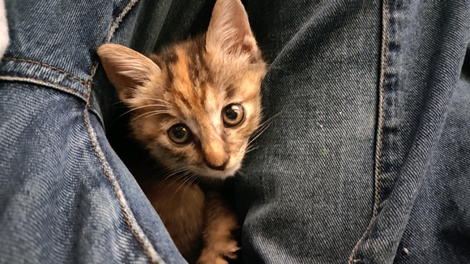

## 2

高松灯是一位土生土长的洛圣都市民。虽然生来性格内向不擅社交，但在这座居民精神状态普遍接近哥谭，青少年犯罪率远超升学率的城市里，她会成为一个帮派成员也不是什么稀奇的事情。在前任帮主丰川祥子的英明领导下，这个名不见经传的小帮派只用了不到一年的时间就从众强林立的城区脱颖而出，搬到了风景宜人的佩里托湾。佩里托湾在哪？开车进城大概也就要两个小时吧（笑尽管丰川祥子在建立帮会时信誓旦旦的说要带她们赚大钱，但事实上作为帮二代她压根不懂怎么白手起家，哪怕背后有家族的支持依然在帮派斗争中屡屡受挫——在被一次次的失败彻底消磨了耐心后，家族的话事人收没了她爹的面粉场作为惩罚，丰川祥子和她可怜的老爹也被丢出了家族，这个她『苦心经营』的小帮派就此烟消云散。啊…真是段滑稽又美好的日子。高松灯这样想着。她坐在海岸沙滩的营火边，呆呆的看着眼前波涛汹涌的海面，远处闪烁着灯光的浮漂随着波浪一起一伏，飘忽不定的像是像是自己投资那支股票的k线。祥子总和她说股市能让钱生钱，不过她还是觉得拿这些钱去买把砰砰再造访几家便利店来的更实在——哪怕失败了她至少还能剩下一把砰砰呢。想到这她忍不住偷偷笑了起来，抬起头看向了天上的星星，伸出手去，想要像从保险柜里拿出钻石那样摘下一颗攥在手心:“是不是……只要有钱大家就都会回来了呢？”“是的哦～只要有钱什么愿望都可以实现的！”“噫？！”灯像只受惊的小动物一样猛的一颤，她慌张的看向身边，一个西装革履的粉毛正笑盈盈蹲在一旁，眼神热切的看着她:“怎么样，姐妹？有没有兴趣和我赚点小钱？”“……”灯抗拒的扭过头去，脸上似乎还带着些许羞赧的绯红，身体往远离那个奇怪粉毛的方向靠了靠，一言不发的表现出了明确拒绝的意向。“哎呀～不要这么冷淡嘛。自我介绍一下，我叫千早爱音，是个做过海外大生意的名人哦！”“不信……”“我有证据的！来来来我给你看～”脸上依旧维持着亲切的笑容，名为千早爱音的粉毛心里已经乐开了花，没想到在外面随便走走就能碰上这么个涉世未深的可爱小姑娘，作为一个兼收并蓄的下头女同，她并不介意在赚走灯钱财的同时顺便再拿走点别的东西。只要把我手机里那几张和名人们的合影给她一看，她还不是马上乖乖就范？千早爱音内心银笑着，一边拿出手机一边揽住了灯的肩膀，顺势就把身体贴了过去:“你看啊这是我和……”嘟。事实上并没有什么声响，但千早爱音觉得这里应该是有这么一声，因为她感觉有什么硬邦邦的东西从灯的运动外套里支了出来，顶住了她的肋骨。千早爱音的笑容凝固了。“那个……把钱包，交出来。”那个灰色头发的女孩的脸上还带着些许不知是兴奋还是羞涩的红晕，明亮又水润的大眼睛忽闪忽闪，看起来依旧那么可爱。“我知道了！钱包在我外套左口袋里！千万别动手！我知道规矩！我会老老实实的！”aieeeeee！同行！同行为何！？欲哭无泪的千早爱音乖乖举起了手，任由灯取走了她的战利品。“手机也要。”“我放在地上了！密码是200498！”“嗯……还有手表…啊，那个项链也要。”“都给你都给你！”“西装…好像也很值钱……”“行行好吧我不能光着回家啊！”“好吧。”灯失望的叹了口气，用手里的砰砰指了指地，示意千早爱音趴在地上，在确定她趴好后打开了钱包——里面对灯有价值的东西是一张皱巴巴的百元钞票和一张铛铛钟快餐的优惠券，剩下的就只有几张信用卡和千早爱音的身份证了。“好穷…怪不得当骗子。”灯的失望溢于言表。“我才不穷好吗！我很有钱的！”即使是趴在地上，千早爱音依旧不允许别人如此侮辱她的经济实力，她梗着脖子，抬起她高贵的头颅，骄傲的大声反驳道“我只是没带那么多现金而已！”“那…果然还是骗子吗？”“呃…我怎么会是骗子呢，哈哈～我超诚实的。”打了个哈哈，千早爱音尴尬的把头重新埋进了沙子里:“我真的有生意啦……”“什么生意？”“哼哼，我只能告诉我的生意伙伴……我说我说我说！”可爱的小企鹅一言不发的蹲了下来，用手里的收藏品戳了戳了爱音的脑袋，说服判定大成功。“我打算拜访一下环岛高速边上的那家littlebank！地方小离得远人少容易得手！白天！白天我们就能动手！”“大概…能赚多少？”“十万……哦不不不二十，二十万！你拿大头！你拿大头！”二十万。灯歪着头，在心里默默的算了算，二十万，虽然不够买下什么固定资产，但也能买不少装备和大号砰砰了，剩下的钱还可以买好几套海洋生物创可贴（第五弹），听起来还算有诱惑力。

## 3

“那…你准备了多少？”“据点，车，装备，逃跑路线，我都准备好了！就差合伙人！”“计划多少人？”“呃…算上我的话应该是四个人，两个行动组，一个黑客，一个直升机手。”“你找到几个人了？”“暂时还没……”“嗯，最后一个问题。”灯眨了眨眼，犹豫了一下，像是下定了某种决心。她鼓起勇气，看向了趴在地上垂头丧气的千早爱音:“你……愿意和我组一辈子帮派吗？”“啊…？哈哈，你这人怪搞笑…愿意！愿意愿意！一辈子！一定会组一辈子的！”看着眼角逐渐含泪的灯和她手里打开了保险的小砰砰，千早爱音毫不犹豫的选择了答应，毕竟让女孩落泪可不是她这样的淑女所为，就算是为了照顾灯的情绪，此刻她也一定会选择说谎。“那以后也要……永远在一起！”“我保证！永远在一起！”“嗯！”灯收起了手中的砰砰，握住了爱音的双手，把爱音从地上拉了起来。她可爱的小脸因为兴奋而显得红扑扑的，那清澈而明亮的眼神看的爱音一阵恍惚，甚至感觉自己今晚好像也不是那么倒霉了。“我叫高松灯！我…我会努力和爱音一起发财的！”“……我是千早爱音！我也会和灯一起发财的！”夜空下，两位少女笑着拥抱在了一起，共同许下了一起发财的诺言，真是可喜可贺。

## 4

“那么，Tomorin，我们还需要两个人。”爱音从容的拍了拍身上的沙土，脸上重新挂上了自信的笑容，仿佛刚才的一切都从未发生过。只要她不首先使用枪灯形态，千早爱音自信有一万种办法把这只单纯可爱又痴情的小企鹅哄到自己卧室里好好交流，到那时候钱分多分少不还都是她千早爱音说了算？“嗯！我会帮忙找人的！”灯在胸前攥紧了小拳头，眼神坚定的像是要加入FIB:“现在…现在就可以去找黑客！我认识一个！”“嗯……你认识的这个黑客，她厉害吗？”“我…我觉得她很厉害…”“灯，我们现在可不是要去黑大学的服务器，不能随便找个修电脑的来哦？”“她帮我们黑进过○○基地的……”○○基地？有点耳熟啊？千早爱音歪着头寻思了一会儿……“……抱歉，灯，她恐怕不行。”“唉？为什么？”爱音脸上尽量维持着尴尬而不失礼貌的笑容，她总不能说自己剩下的准备资金最多只够雇个聪明药嗑多了的信息系大学生吧？这种能黑进军○基地的硬核狠人哪是她雇得起的啊？“那个…如果佣金不够的话，可以从我的份里出！”好像看出了爱音的顾虑，灯一把抓住了她的手，毫不犹豫的坚定表达了对她的支持:“说好了，一起发财！我会帮助爱音的！”“To…Tomorin～love～！”她难道是天使吗？千早爱音感动的几乎要哭出来了，她仿佛看到了有圣光在灯的背后闪耀着，身边还有两个带翅膀的圣婴在不停的挥洒着绿油油的钞票。啊，灯门，我千早爱音为自己对灯的不敬忏悔，愿灯原谅我的僭越，继续赐我财富吧！灯门！“灯，和我组一辈子帮会吧！”“一…一辈子！”听到了关键词的灯像是突然喝下了一杯很烈的酒，脸上浮现出了兴奋的酡红，她被突如其来幸福感砸的晕乎乎的，眼前的爱音似乎也圣洁了起来——“爱音酱！”“Tomorin！”两位少女含情脉脉的对视着，全然忘记了方才那段不愉快的小小的插曲，她们手牵着手走过海岸，坐上爱音租来的二手皮卡车，满载希望的向着明亮又繁华的市区驶去。———————两小时的车程后————————“Tomorin，你确定是这里吗？”看着眼前高大奢华的巨型建筑，爱音陷入了沉思——洛圣都明钻，这座城市最大的吞金兽。这地方她以前有钱的时候偶尔会来玩玩，但显然不是现在的她能消费的起的。“嗯……她晚上一般在这里上班，啊，停在这边就好。”爱音按照灯的指挥把车停到了建筑北侧，在泊车员鄙夷的眼神中，她大大方方的把那辆破车的钥匙丢了过去，还非常厚脸皮的没有给一分钱小费。她现在可没那闲钱。“在这边排队入场就好。”灯带着爱音走到了一处侧门，门口有个带墨镜的黑人保安正拿着金属探测器在检查入场顾客，一身鼓鼓囊囊的腱子肉看着像是要把身上的西服撑爆。爱音抬起头看了一眼门上浅蓝色的霓虹灯招牌:音乐天堂酒吧。她上次来这边还没有这地方呢。“爱音酱……来过这里吗？”注意到对着招牌出神的爱音，灯有些好奇的拉了拉爱音的袖子，试图吸引爱音的注意。“嗯…上次来这边还没有这个吧。”爱音摇了摇头，她也记不清自己上次有钱来这玩是什么时候了“Tomorin会经常来玩吗？”“之前…来的不多…”灯歪着小脑袋，像是在回忆什么“这边的金库戒备很森严呢…摄像头很多，准备工作很也麻烦……”意识到自己捅了大篓子的爱音赶紧捂住了灯的小嘴，在周围人惊疑不定的目光中，哂笑着打了个哈哈:“她说的是游戏，是游戏啦……”“呜呜……”“啊！抱歉Tomorin！”

## 5

队伍排的很快，两人很快就来到了门前。“抱歉，高松灯小姐，我们恐怕不能让您带着这个入场。”健硕的黑人保安严肃的摇了摇头，用探测器轻轻碰了碰灯运动外套下快拔套的位置，措辞礼貌但不容拒绝“请您把它放回车上，或者我们可以暂时替您保管。”“非常…非常抱歉……我又忘记收起来了……”灯像是偷偷上课吃零食被老实发现的学生一样，红着脸慌慌张张地向保安鞠躬道歉，保安则摆摆手示意不必在意，显然他不是第一次遇见这种情况了。“那个…爱音酱先进去吧，我先去把砰砰放到车上。”看着被吓得冷汗直流的爱音，灯腼腆的笑了笑，小跑着朝停车场跑了过去。“下次光临还请记得提醒一下您朋友。”黑人保安倒是一副见怪不怪的表情:“在公共场合隐蔽携带小砰砰是很危险的。”“哈哈…一定一定……”爱音擦了擦脑门上的冷汗，笑的有点僵硬，感觉自己刚才离被毙只有一步之遥，她刚才分明看见那个保安已经把另一只手摸到腰后面去了，只要灯有一点异动她俩今天估计就要小命不保。“嗯，请上前吧。”爱音配合的上前，保安熟练而快速的完成了检查，侧身为她让开了道路:“欢迎光临天堂音乐酒吧，临时票单次入场费100，请在进入后在左侧窗口缴费，新客赠送吧台免费畅饮一小时，祝您玩得愉快。”“……”爱音面无表情拿出钱包，用颤抖的手指夹出了那张皱巴巴的百元钞，走到收费窗口前，把身上最后一张钞票送进了这只吞金兽的口中。在钞票离手的那一瞬间她仿佛被抽离了所有的力气，只能感觉到自己的心在滴血——在逃离了小企鹅的魔爪后，这张陪了她半年多的张钞票终归还是离开了她，现在她是字面意义上的身无分文了。要是找不到那个黑客的话，瓦达西——听着耳边逐渐清晰的动感音乐，千早爱音感觉自己快要哭出来了，人的悲欢并不相通，刚刚失去挚爱的爱音只觉得舞池里那些狂喜乱舞的男女们是如此吵闹，让她现在迫切的需要一点免费的饮料来麻痹一下自己。吧台……吧台在哪……爱音左右寻望了一下，很快就锁定了吧台的位置，就在半潜式舞池的旁边。和旁边座无虚席的卡座相比，吧台边上的客人出乎意料的少。半开放式吧台里留着黑长直的女服务生正在百无聊赖的擦着杯子，有一搭没一搭的和面前那个穿着朋克风格皮衣的女客人聊天。嗯……千早爱音微微眯起眼睛，尽管舞池旁昏暗的环境让她看不太清那个服务生的相貌，但作为一个兼收并蓄的下头女同，她有九成的把握保证那个服务生是个难得一见的美女，而且很有可能还有隐藏的巨大宝箱。看来这免费饮料值得一喝啊。爱音忍不住舔了舔嘴唇，开始向着吧台移动。和灯闹腾了这么久，她已经有点渴了。趁着现在灯不在的功夫，她打算再施展一下自己的三寸不烂之舌，看看能不能从那个女服务生身上捞点好处。幸运之神这次似乎眷顾了爱音，就在爱音到达吧台的时候，那个穿着皮衣的酷姐女顾客恰好准备离开了:爱音看到她把三张钞票按在桌上，又绕到吧台后边，在那个女服务生腰部以下大腿以上虽然不可描述但是懂得都懂的美好部位上偷偷爽摸了一把，引得那女服务生发出一阵羞恼不满的嗔怒斥责，而作为始作俑者的酷姐只是翘起嘴角微微一笑，在她耳边落下轻轻一吻便转身潇洒离去，帅的像是刚用一把左轮砰砰一次毙了六个甚至五个人的牛仔。开什么玩笑，要吐了！这女人怎么又帅又油啊……说实话千早爱音看的鸡皮疙瘩都起来了，偏偏那个女服务生貌似还很吃这一套，满脸羞红一副意犹未尽的样子。虽然玩这么油腻实在有违千早爱音人设，但现在毕竟情况特殊，为了能拿点好处她也不介意展示一下什么叫骗徒的自我修养。千早爱音，变身！借着人群的掩护，千早爱音动手解下了自己的领带和外套，随意一裹就丢到了一边的空座上，只留下了件白色的衬衣。寻思片刻，又把衬衣从裤子里抽出半边，领口的口子解开了两颗，刻意露出了锁骨，又遮住了半边的腰线——刚刚还是西装革履的成功精英，摇身一变就成了忘情买醉的忧郁帅美人，连她自己都不得不佩服这自己这杰出的演绎水平。嘿嘿，小样，看我不迷死你。爱音信心满满的出发了。

## 6

“晚上好，亲爱的。”“……您好，欢迎光临。”看着面前这个故作烟嗓还冲着自己抛媚眼的粉毛，椎名立希只感觉胃里一阵翻江倒海，但作为一名服务业从事者她还是选择了坚持自己的职业操守，强忍着恶心皱着眉头继续接待:“需要点什么？”“我需要……忘记一切。”“抱歉我们没有这款产品。”“开个玩笑，别介意～”“我还有其他工作，请您尽快点单。”哎，傲娇。千早爱音心中自信一笑，现在一切都在她的掌控之中。千早老师何许人也，她身经百战，见得多了。这种傲娇女孩就是看似冷淡，实则内心比谁都要热情，只要稍加引导建立共情，再找准机会补上一击，打乱她的心理防线，这女孩就能半推半就的顺利拿下，就像吃一个沙威玛一样轻松又简单。看我操作！千早爱音把她刚才收到的畅饮券轻轻推到了那位女服务生的面前，微笑着看向她:“抱歉，我其实是第一次来这里，不知道我能用它换点什么？”“…………”不是，姐们？椎名立希沉默了，她还是第一次见到有拿畅饮券来装○的奇葩。这种喜剧镜头一样的表演搞的她连生气的欲望提不起来，只剩下一种淡淡的无力感缠绕在心间——这个b班她是一秒也上不下去了。“……我帮您选择几款吧。”“麻烦你咯～”立希，想想车贷，想想房贷，再想想猫。椎名立希努力平复了一下自己的心情，努力挤出一个笑脸，转过身去准备找几瓶花哨点的工业香精勾兑甜水来对付一下这个显然有什么大病的粉毛——“不过，我果然还是最想要你呢～”“哈↗！？”立希难以置信的转身看向这个粉毛，握住玻璃瓶的手蠢蠢欲动，就差那么一点她就要克制不住把这瓶东西拍到眼前这个神经病的脑袋上了。“我说，我现在不需要那些饮料。”千早爱音依旧保持着从容，她十指交叉，轻轻支起了下巴，露出了她自认为最迷人的微笑:“我需要你哦。”需要我？看着眼前从容无比的爱音，立希愣了一下——她突然意识到了另一种可能性:这粉毛莫不是来找她谈『生意』的？那之前的话……立希微微皱眉，开始逐字逐句的分析起之前的对话来。『我需要……忘记一切。』——我们需要一个什么都不会说出去的人。『我是第一次来这里，我能用它换点什么？』——我们是新来的帮派，已经准备好入场券了，就差拿它们换钱。『我果然还是最想要你呢。』——我们评估过了，你是最合适的合伙人。啧……弯弯绕绕的家伙，真不干脆。看着眼前笑意盈盈的粉毛，立希暗暗啧了一声，她一直很讨厌这种莫名其妙的黑话，在以前的队伍里还有那只精于此道的棕色的狐狸给她当翻译，现在她只能靠自己一点点猜了。好在这次她猜出来了，而且她现在也确实需要这笔生意。“开价吧。”立希干脆地把手里的饮料推到了爱音的面前，瓶中金色的液体在吧台暖色灯光的照耀下折射出迷人的光彩:“事先说好，太低我是不会接的，你也别指望能逼我接。”啊嘞，搞这么直接吗？立希的直白让饶是身经百战的爱音都忍不住一愣，这女孩看起来也不像是那种只认钱的烂人啊？难不成刚才她和那个酷姐互动全是演的？不过如果她真是大烂人……那就别怪我不客气啦！爱音忍不住阴恻恻的坏笑起来，虽然烂人更难诈，但她诈烂人可不会什么心理负担。之前那个酷姐给了她三张……那我就先开五张诱惑她一下。脸上保持着微笑，爱音伸出一只手，五指张开:“这个价格怎么样？”5％？立希皱起眉头，这个价格几乎已经是给黑客的最低分红了，基本上只能雇个聪明药氪多了的大学生。要是放在以前她肯定当场就要甩脸子走人，但现在生活的压力切实地摆在面前，让她不得不放下身段来和这些贪婪无度的家伙们讨价还价一番。最好……要争取到8％。立希思索片刻，从架子上取下了一瓶世○黑八，打开后推到了爱音面前，随后便转过身去不在言语——她实在是羞于开口讲价，但又不知道该怎么表达，只好选择用这种比较拙劣的暗语来进行报价了。8张，还真不少要啊？爱音暗暗咋舌，八张这个价格已经高于市场价非常多了，但看着立希那紫水晶似的眼眸和乌黑秀丽的长发，爱音也不得不承认这个价格确实是物有所值——虽然她压根没打算付钱就是了。不急，先和她耍耍，得让她确信这饵是她自己凭本事赚来的才行。爱音一边观察着立希的表情，一边暗搓搓的想着下一步的计划。可恶……要价太高了吗？立希尽量让自己不去注意爱音那审视一样的目光，那种像是要把她看光一样的眼神让她感到焦虑不安。她害怕自己只要对上视线就会率先服软，所以只好一遍又一遍的擦拭着手里的早就一尘不染的杯子，把沉默当成自己最后的城墙。“……好吧，你赢了。”就在立希忍不住想要主动降价的前一刻，爱音终于松口了。她故作无奈的摆摆手，偷偷看着明显长舒了一口气的立希，心中暗笑自己离得手又进一步。

## 7

速度写点把这段圆完赶紧进主线

## 8

爱音把面前的世○黑八一饮而尽，表示自己正式接受了立希的报价。“高出市场价这么多，希望你不要让我失望哦～”“哼。”立希轻哼一声，懒得和她解释什么“你只需要负责乖乖付钱就行。”付钱是不可能付钱的，这辈子都不可能付钱的。爱音脸上依旧保持着微笑，心里已经开始盘算该怎么从立希身上捞油水了——只要把她忽悠上车，再让灯把砰砰往她头上一顶，这钱不就来了吗？“你怎么突然笑的那么恶心…”看着笑容灿烂的爱音，立希没由来的感到一阵恶寒“不管了，你们那边几个人？”啥？还能加人？爱音愣住了，怪不得敢要她八张票子，原来还支持这种玩法。不过这倒也正中她下怀，现在可以名正言顺的把灯拉上车了。“暂时只有两个人。”爱音一边不紧不慢的回复，一边偷偷拿出手机开始给灯发消息。（『ANNO保健品批发』:有鱼！谈完生意带到车上收网！我在吧台！）（『想要成为人类』:收到，小心尾巴，我到了。）“只有两人吗……”立希并没有察觉到异常。“车里比较小，挤不下那么多人呢。”精英主义的小队伍……还真是眼熟。立希低头看向吧台的桌面，不由得想起了那支早已死去的队伍，偶尔她也会怀念还在那支队伍里打工的日子:玩玩音乐，泡泡吧，做点生意，听灯唱唱歌——而且那时候她真的很有钱，祥子掏钱可比眼前这个粉毛爽快多了。不知道灯过得好不好？生意还有没有在做？如果在做的话要不要把这单生意介绍给她？她会不会很高兴？会不会说要和我组一辈子帮派？会不会会不会会不会……“那个，taki酱？好久不见……”？我幻听了？立希不可思议的抬头看去，发现自己朝思暮想的那个女孩正怯生生的站在那个粉毛旁边，害羞的朝自己挥了挥手。“好…好久不见 。”椎名立希感觉自己喉咙被什么东西堵住了，一时间说不出话来，千言万语最后只化作了一句:“最近……还好吗？”“嗯，现在在和anno酱一起做生意…”“是吗…所以她说的第二个人是灯啊。”“唉？anno酱你们已经谈好了吗？但anno酱是怎么认出taki……”“啊……啊！谈好了谈好了！taki桑要价确实不低呢哈哈哈哈……”大脑飞速运转中的爱音猛的回过神来，赶紧随口糊弄了过去，震惊之余她只感觉到劫后余生的庆幸:刚才自己差点反向仙人跳了生意对象，两人刚才说了那么多驴唇不对马嘴的玩意居然还能跨服对话成功，简直是语言学奇迹。她决定要把这件事一辈子烂在肚子里。“taki酱很厉害的，在之前的队伍里也拿的多…”“如果是灯的话，我可以免费的！”“啊？！果真吗姐妹？！”“anno酱！不要这样…taki酱很辛苦的……”“灯……！”“欸——那好吧。”看来这人是真喜欢舔灯……可恶，怎么没人这么舔我呢？心中的爱音嫉妒的咬牙切齿。“taki酱，今晚有时间吗？”灯转头看向立希，眼神里充满期待:“我想和大家…多聊一点……”“我去请假。”立希毫不犹豫的扭头向着经理室走去。两人目送着立希离开，不约而同的片刻沉默后，却是灯先开口了:“anno酱……不可以欺负taki酱哦？”“欸，我哪有——”“anno酱刚刚把taki酱当成鱼了吧？”小企鹅歪着脑袋，用平静的语气戳穿了爱音的谎言“我明明没有和anno酱说过taki酱的事情呢。”“……对不起嘛～哎嘿～”“我不会告诉taki酱的，但anno酱…下次不可以欺骗自己的队友哦？”“欸，一次都不可以吗？”“不可以。”“那……如果我骗了呢？”“那我…就要毙掉anno酱了…我不想这样……”“我千早爱音发誓绝对不会欺骗队友！如有违反我当一辈子穷光蛋！”“嘿嘿…谢谢anno酱。”

## 9

开车前往爱音家的路上——“喂，野猫，我今晚不回去了。”“不是海铃，有生意要谈。”“吃完了？知道了，你老实在家待着，谈完生意会给你买的。”“嗯，内衣放进洗衣机就行，冰箱里有三明治，你明早自己热着吃。还有不许逃学，听到没？喂？喂！？”“啧，挂的真快。”立希啧了一声，收起手机，发现一双水汪汪的眼睛正直勾勾的盯着她。“taki酱……在和人同居吗？”灯一副好奇宝宝的样子，她现在非常想知道什么人能让立希动心“我…我会支持taki酱的！”“而且还是包养女○生唉～”爱音从驾驶室探出头来，一副我懂你哦的滑稽表情。没想到立希这浓眉大眼的居然比她还下头，自己果然没看错她！“滚！少给灯灌输这些东西！”立希恼怒的拍了一下主驾驶的靠头枕，引得爱音一阵惊叫:“嘿！这是租来的！”“灯，你听我解释。”没有理会嚷嚷着要她赔钱的爱音，立希硬着头皮开始跟灯解释自己刚刚打电话的对象只是职场同事家的孩子，只是在自己家寄宿一段时间，俩人之间关系绝对纯洁只是单纯住在一起——灯似懂非懂的点了点头，还是在心里偷偷的给立希加了油。三人一路驱车向市中心驶去……“嘿嘿，到啦～”“……你没走错吧？”立希难以置信的看着眼前高大的豪华公寓楼，这里一套房的价格差不多要她在名钻不吃不喝干上三十年:“你不会其实是住在街对面的工地打灰吧？”“好厉害……”灯满脸憧憬的看向了鼻子已经翘上天的爱音“爱音酱…居然真的是有钱人！”“没错！我可是超厉害的有钱人哦！”甩着公寓的钥匙圈，看着两人或怀疑或憧憬的眼神，千早爱音笑的像个唐氏，只感觉自己此刻爽的像是在溜冰。这套公寓可是她回国前花光了最后的积蓄拿下的，不得不说那个叫ob什么的客服真没骗她，这套公寓绝对物有所值。“来来来，里面还有更厉害的呢～”三人走进公寓，经过监控严密的走廊，在专职保安的欢迎中进入电梯，一路坐上了二十层。咔哒——爱音打开了房门。“欢迎来到我家～”“好…好漂亮……”“里面居然是两层……”“哈哈，别急别急～回头再带你们看，先来这边。”爱音尬笑两声，推着两人走进了玄关尽头的计划室，这公寓下半层她压根没添什么生活设施，要是让她俩看见怕不是要露馅。和风格简洁的公寓相比，这间计划室里的空间利用率显然要高得多：房间左侧的墙上挂着写满行动计划的巨大白板，右侧是武器挂板和堆放的装备物资收纳箱，中间的大号电脑桌上也摆放了各种监控设备和纸质档案，无处不透出专业的气息，哪怕是LSPD的行动策划室也不会比这间房间里的装备更好了。爱音进门便当仁不让的一屁股坐到了房间里唯一一把椅子上——房间里只有一把椅子的时候谁坐着谁就是老大，此事在古事记中亦有记载。“来来来～先给咱们的新小队起个名字吧～”爱音舒服的翘起二郎腿，准备享受一下“别人站着我站坐着”的领导快乐——只可惜屋子里另外两人的注意力显然都没在她身上:灯像个隔着橱窗看玩具的孩子一样，呆呆的对着挂在墙上的砰砰看的出神；立希则紧盯着写满行动计划的白板，眉头微皱，一副若有所思的样子。你们这样显得我很呆哎？爱音笑的有点尴尬，不着声色的重新站了起来，假装无事发生。“……千早爱音。”从进门就开始盯着计划表的立希终于开口了，她紧皱着眉头，双臂环抱，仔细审视着眼前的粉毛。“怎…怎样了？”“你给我说实话，这计划真是你写的？”“不然呢？”“那这个中二到爆的直升机吊电磁铁吸车撤离的路线也是你想出来的？”“…没错，是我想的！中二点怎么了！”“…………”立希沉默不语，但依旧死死地盯着爱音的脸，爱音则毫不露怯的选择对视，不大的房间里突然间充满了火药味。不对，好像真的有火药味。“那个……大家不可以吵架……”灯终于鼓起勇气打断了两人的对视——她身边的武器架上已经空出了两个位置，消失的两把小砰砰现在分别指对准了爱音和立希的脑袋。“大家都…冷静一下……”小企鹅使用了说服。“我冷静了！冷静了！”一向能屈能伸的爱音果断选择了举手投降“我们握手言和！”“taki酱呢…”“啧……我知道了，我不会再问了。”立希啧了一声，也伸出了手。soyo酱教的说服法很有用呢。灯开心的想。

## 10

长崎素世家的后院。“大家不用客气哟～”素世微笑着邀请众人落座。古典的木质茶桌上，精致的三层茶点盘里摆放着五彩缤纷的马卡龙，瓷杯中的红茶氤氲出令人心醉的酽香，眼前的下午茶正散发着诱人的气息，等待着女主人和她的贵客们随意享用。但是千早爱音没有把哪怕一丝的注意投注到这些上面。她从进屋前就开始暗暗观察着眼前这位亚麻色头发的美人:温柔优雅的举止，略带忧郁的气质，成熟得体的打扮……已知是漂亮小寡妇中的极品了，再加上这丰厚的家财，若能得她一次垂怜，她千早爱音便是死也值回票价了呀！只可惜，正当千早爱音自信的打算展示一下自己的人格魅力时，队里那个最不解风情的家伙率先开口了:“素世，我们是来谈生意的。”立希单刀直入的表明了自己的来意。她微皱着眉头，语气略显急促，似乎并不想在这里久待。“这么久不联系，一见面就是谈生意呀。”素世抿了一口茶，轻轻摇了摇头:“taki酱还是那么不解风情呢。”“你这家伙……”好骂好骂！看着脸顿时黑下来的立希，爱音内心一阵暗爽，看她吃瘪比自己扫弦都开心。“Tomori酱，能帮我介绍一下这位朋友吗？”似乎察觉了爱音的视线，素世微笑着看向了她，和煦而温柔的笑容看的爱音一阵心神恍惚。“那个……Anno酱是这次差事的发起人，她很厉害，人也很好，还答应了和我组一辈子帮派……”灯像是突然被家长要求介绍自己好朋友的孩子一样，紧张又害羞的说了一大堆带着自己个人评价的介绍。“组一辈子帮派……”素世微微眯起了眼睛，笑容里似乎多了一丝难以言说的感情“Tomori酱还是想组一辈子帮派吗。”“这次……一定会一起走到最后的！”灯鼓起勇气，坚定的看向素世:“素世…也来一起发财！”“嗯……我现在对钱没什么兴趣呢。”看着表情失落的灯和面露不悦的立希，素世只是摇了摇头，把一颗方糖放入茶杯中，用茶匙轻轻搅动着，让深棕色的茶液卷起了一个小小的漩涡——“那……也许我有什么别的东西能让您动心呢？”叮铛。茶匙与杯壁相碰，发出了清脆的响声。看着突然停下了手中动作的素世，千早爱音露出了满意的笑容:她知道自己的机会来了。这把靠我来c！“……anno酱，很聪明呢。”“没有啦，我只是比较擅长和女孩子聊天而已～”“呵呵，我知道灯为什么喜欢你了。”素世捂嘴轻笑，一对巨大的宝箱也随之微微颤动，看的爱音一阵心神荡漾，感觉自己那不存在的小爱音都要拔起来了。“那…说说看你的价码吧。”“嘿嘿，我的价码就是——它!”“……噗呲。”看着满脸真挚的爱音和她手中不知道从哪变出来的玫瑰，素世忍不住笑出了声，她开始觉得这家伙确实有那么点可爱了。可爱的让人想养呢。“魔术很棒，anno酱今晚就留下来吃个饭吧。”“真的吗？Soyorin～love～！”看着眼前带着温柔微笑邀请自己的素世，爱音感觉自己好像要被幸福感融化了，被年轻漂亮小寡妇包养的美好日子似乎正在向着自己招手——“你要是想被当成狗一辈子养在地下室里就答应她。”立希冷冷的打断了两人的对话，用无情的话语杀死了爱音的美好幻想。她警告似的瞪了一眼素世，作为前队友她太清楚长崎素世正在打什么算盘了:“想干什么都给我等到这次差事结束再说。”“soyo酱…anno酱不可以养……”灯也紧紧地抓住了爱音的袖子，像是害怕爱音被抢走一样警惕的盯着依旧面带微笑的素世。“…………真是的。”良久的沉默后，素世叹了口气，终于不再维持那副微笑的假面，一种冷淡而傲慢的气息从她的身上流溢而出。素世端坐在椅子上，漠然的审视着在场的三人，如同一只正巡视自己领地的雌狮:“如果连一条狗都要怜惜的话，还是请回吧。”“没人怜惜她，但现在让她当给你狗还太早了。”随手推开被突如其来的残酷现实打击到呆滞的爱音，立希毫不退让的坐到了素世的面前，在素世疑惑的眼神中从运动包里拿出了那份计划文件，随手丢到了她面前。“你先看看这个。”素世狐疑的打开了文件，一页一页的翻看着，每当她翻过一页，表情便凝重一分——气氛很快就陷入了一种如火山爆发前般恐怖又危险的沉默，尽管素世并没有抬头，但感觉敏锐的灯还是能感受到一种可怕的压力正从她的身上压向她面前的立希。终于，素世翻阅完了文件的最后一页，她缓缓的抬起头来，迎着立希冷漠的眼神，用一种愤怒而低沉的声音质问道:“椎名，你在耍我吗？”“我没有那个闲心。”“她联系你们了？”“没有。”“那这计划是谁写的？”“不知道，但她说是她写的。”素世尖厉的目光顺着立希的手指刺向了正坐在一边装死的爱音，眼神中毫不掩饰的凌然杀意吓得爱音一阵汗毛倒竖，毫不犹豫的赶紧缩回了灯的背后。“……唉，我知道了。”看着单手死死护住爱音，态度异常坚决的灯，素世终于无奈的长叹了一声。“我加入你们。”

## 11

## 12

时间是素世入伙后的第七天。今天就是她们的发薪日。爱音呆呆的坐在驾驶室里，看着四周厚重的装甲板，突然有一种不真实的感觉:她马上就要和三个一星期前还不认识的陌生人一起去干大事了。人生真是奇妙。看着自己微微发颤的双手，爱音也不知道自己是在紧张还是在兴奋——又或者兼而有之。“时间到了。”后座上已经剪成了短发的立希打开了手中的电脑，她拍了拍驾驶室的座位，示意爱音可以出发:“开车吧。”“我要不要穿个……防弹衣啥的？”“不用，车子是防弹的，只要你坐老实在驾驶室里，子弹就不会找到你——被路上的监控拍到你穿着防弹衣坐在驾驶室才是麻烦事。”立希难得的耐心了一回，她不希望任何人带着什么疑问参加行动:“开车吧，灯在路上会帮你回忆一遍行动细节的。”“anno酱……出问题的话，我会帮你的！”灯也从另一边探过身子，眼神坚定的向爱音保证道:“我一定不会让anno酱被抓的！就算进橘子也要在一起！”“Tomorin～love～”就在爱音感动的想要抱着灯亲上一口的时候，耳麦里突然传来了素世冷淡的声音:“鹈鹕对全体，我已出发。”“企鹅收到。”“郊狼收到。”“啊！……那个…狐狸收到！”“……唉。”麦克风那边的素世叹了口气:“有个好消息，我从LSPD的电台里监听到有人在城东某个帮派的植物种植场放了把火，烧起来的黑烟我在天上都能看见。黑皮狗们现在正在往那边集合，现在出发，你们的行动应该会顺利一些。”——————————————————城东，工厂区。遍地的哀嚎声，火焰的燃烧声，凄厉的警笛声……种种的声音组成了一支可怕的交响乐。带着防毒面具的八幡海铃随性的掸了掸身上沾染的灰烬，淡定的像是在自家的客厅。“你到底在想什么desuwa！我在单位都能看见你那边的黑烟了！现在黑皮狗们全冲你去了！”耳麦里传来了某个客服崩溃而恼怒的喊叫，背景音里噼里啪啦的键盘声显示她此刻正焦头烂额。“抱歉，下手重了点。”“这是个潜入，潜入任务！你的任务是把除草剂倒进灌溉系统里！不是他＊的在里面放火！你想让整个东城区陪你一起溜冰吗！”选择性的无视了气急败坏的祥子，海铃默默摘下了耳麦，拿出手机随手把自己刚刚到账的佣金转到了祥子的账户上。一会儿问问她认不认识接发水平好的发廊吧。————————————————————“行动！”在远程启动了金库大门的同时，椎名立希毫不犹豫的下达了行动开始的信号。收到信号的千早爱音紧咬着牙关，强忍着心中的恐惧狠狠踩下了倒挡油门——碰！！！！巨大的碰撞声响起，装甲轿车的后半段如攻城锤般撞破了那扇通往财富的玻璃大门！突如其来的变故吓坏了这座littlebank里仅有的几位顾客，他们惊慌失措的想要逃离，可唯一的出口却被那辆黑色的轿车彻底堵死；与此同时两个手拿消音砰砰的蒙面人从车里迅速钻出，眨眼间就点掉了周围所有的摄像头。“都趴在地上！不许按警报！我不希望有人做傻事让大家受伤！”身形较为瘦小的蒙面人朝着天花板扣动了砰砰，如同舞台上的主唱般站在房间的正中心大声发出了警告，吓退了打算按下警报的职员并强逼着所有人趴在了地上；另一人则趁机抱着一台看着就颇具分量的钻孔机冲进了门户大开的金库，在一阵令人牙酸的刺耳摩擦声和几声清脆的金属断裂声后，又提着一整盒的不记名债券冲了出来。“到手了！撤！”提着债券的蒙面人的声音难掩喜悦，收到消息的瘦小蒙面人点了点头，又向着墙角的花盆扣动了扳机，在花盆的破碎声和人群的尖叫声中掩护着队友上了车。“轰——！”黑色轿车的发动机爆发出猛烈的轰鸣，排气管猛的喷出了一团黑烟，下一秒便如猛牛出栏般冲出了大门。看着冲出门外的轿车，刚刚经历了自己人生最漫长的三分钟的银行职员终于慌张的拍下了警铃——现在他只能把保住自己工作的希望寄托于LSPD了。尽管眼下可用力量的捉襟见肘，LSPD还是迅速做出了该有的反应。他们出动了仅剩的力量，选择了利用子弹和车辆进行多路驱赶，并在桑库多桥实施重点拦截的计划:桑库多桥是座高架桥，只要堵住桥头，这伙人就绝对无路可逃——计划方案堪称完美，只可惜他们没算到这群人还有一架拖曳着巨型电磁铁的直升机。在螺旋桨的轰鸣声中和某人肆意的狂笑声中，亲自带队赶来抓捕的八潮瑠唯愤怒的将自己手中的对讲机丢在地上摔了个粉碎。半晌，才终于恨恨的从牙缝里挤出了两个字:“……收队！”

## 13

终于把全福写完了，感谢大家的支持说实话第一次写mygo同人居然能写这么多我自己都挺惊讶的。另外虽然前面写了那么多，结果行动内容就半章的量，哭死，这剧情安排的也太不合理了，以后一定注意。最后写同人太开心了，下次还写

## 14

一天后，某家KTV包厢内……“昨日～一去不复回～🎶哦吼吼～开心～比什么都贵～🎶”已经喝的酩酊大醉的千早爱音一只脚踩在桌上，正借着酒劲对着麦克风尽情宣泄着自己的兴奋和得意；灯则乖巧的站在她的身边，手里握着一对沙锤，正在努力地为爱音应援。还真是……令人怀念的一幕。素世平静的看着眼前正在庆祝行动胜利的两人，伸手轻轻抚摸过膝上白猫毛茸茸的小脑袋；感受到抚摸的乐奈很是享受的眯起了眼睛，也主动回蹭了一下素世的大腿，痒痒的感觉引得素世一阵轻笑。作为不熬夜主义者，她本来是不想参与这次派对的，但奈何那个粉毛给她找了个非常非常有趣的乐子——“我回来了。”穿着上班工服的椎名立希黑着脸走进了包厢，手里还提着一整提的Piβwasser。她进门后便忿忿地的把那提啤酒丢在桌上，随手从里面捡起一瓶，双指用力掰开瓶盖，单手叉腰脖子一仰，赌气似的咕噜咕噜喝下了半瓶。“噗哈……”一口气喝下半瓶的立希忍不住长出了一口气。“哦，Rikki，欢迎回来～钱记你账上了～哈哈～嗝儿～”“taki酱辛苦了……”“辛苦了，服务生小姐～我还要一杯热伯爵。”“没有，自己去买。”“Rikki，抹茶芭菲。”“为什么你也在叫那个名字啊？”“抹茶巴菲。”“啧……钱给你，自己下楼买，然后再随便带瓶什么红茶饮料上来。”“知道了。”乐奈点点头，站起身拿着钱离开了，立希则顺势坐到了她空出来的位置上，继续啜饮着手中残余的酒液。“你会来这种派对还真是稀奇。”“毕竟anno酱都重新鼓起勇气邀请我了，我也不好拒绝——何况还有这么一位可爱的服务生在呢，呵呵～”“…你最好给我把这件事烂在肚子里。”“啊啦，taki酱觉得我会和谁说呢？”“哼。”立希冷哼一声，抬头把剩余的液体一饮而尽“这么着急可不像你。”“毕竟大家都拿到自己想要的东西了，可我还没有呢。”素世笑眯眯的看着立希:“你该付账了，taki酱。”“……”立希瞥了一眼依然沉浸在狂欢中的爱音，勾勾手示意素世靠过来些。素世则微微侧身，把头轻轻靠在了立希的肩上，闭上眼睛像是要依靠着立希小憩片刻。“……我查了她近来半年的联系人和交易记录，有个房地产客服嫌疑最大，一会儿我把那个客服的联系方式发给你，剩下的你自己看着办。”“这么久不见，你不想和她聊聊吗？”“呵，我和她聊完你俩就没的聊了。”“……我希望的未来里有你的位置。”“但没有那个粉毛，对吧？”“她重要吗？”“对我不重要，但对灯很重要，我劝你别想着做蠢事。”“她对灯没有好处。”“我尊重灯的选择。”“那…只要灯也同意就可以吧？”“……”注意到立希的沉默，依旧闭着眼睛的素世露出了甜蜜而迷人的笑容:“taki酱今晚带着灯和乐奈回家就好，anno酱就交给我吧，我会温柔的说服她的。”“你想怎么做。”“只要让她没有继续组帮派的动力就好了～”“…………今晚的事我什么都不知道。”立希撇过头去，算是默认了素世的计划。“谢谢，taki酱。”素世轻轻的挽住了立希的手臂，笑容渐渐变的安详而平和:“稍微再多让我依靠一下吧。”

## 15

今晚疑似有双更一会儿先发一章

## 16

次日早晨。“哎呦…给我干哪来了这是……？”强忍着昨夜宿醉带来的头痛感，千早爱音挣扎着从床上坐了起来，扶着额头惺忪而茫然的看向了四周:此刻的她正一丝不挂的躺在一张能睡下大象的巨大席梦思上，云朵般轻柔温暖的高级羽绒被温和的包裹着她的身体，洁白松软的海绵枕头上残留着她刚刚压出的痕迹；一旁的床头柜上，不知名的香薰正散发着安人心神的高雅香气，香薰的旁边还贴心的摆放了一杯温水，杯子上粘贴着一张粉色的便签。……算了，先喝口水吧。顾不上深究自己为什么一丝不挂的睡在这间看着就异常奢侈的卧室里，口渴难耐的爱音抓起水杯一饮而尽，滋润了一下自己干涸的喉咙，也让宿醉带来的头痛缓解了些许。舒缓过来的爱音好奇的扯下了那张已经浸染了香气的便签，上面写着一行娟秀而优雅的小字:醒了先去卫生间洗漱干净，我在楼上等你。啊这。冷汗顿时打湿了后背，一种说不清是美好还是可怕的猜想在爱音心中浮现。她用颤抖的手摸向了被子的另一边，毫无疑问的触摸到了自己昨晚那位床伴残留的余温和些许的潮湿。不不不，千早爱音你冷静一下，万一这其实是Tomorin家呢？对吧？怀揣着某种侥幸心理的爱音朝着阳光射入的方向看去——透过那扇巨大的落地窗，晨间洛圣都熙熙攘攘的繁忙景象在她眼中一览无余，这种美丽的景色只有在好麦坞山上的住户们才有权利享受。顺便她还看到了窗边小沙发上随意散落的几件衣服，其中那件胸衣的大小怎么看也不是灯能用的上的级别。对不起，妈妈，我作为人类的一生好像就要结束了……扑通一声，千早爱音眼神空洞地躺倒回了床上。————————————————————经过一番激烈的心理斗争后，千早爱音还是选择了接受现实。冷静下来的她稍微分析了一下自己现在的情况:自己从素世的卧室而非地下室醒来，身上也没有任何拘束器具，说明素世应该还没有把她变成人形宠物的想法；但她的手机衣服和车钥匙都被素世收走了，显然也不打算放任她擅自离开或者和外界进行联系。至少她现在不用担心人身安全问题了。穿上了素世在卫生间给她准备好的睡袍，看着镜子里锁骨和脖颈上满是吻痕的自己，千早爱音尴尬又害羞的骚了***:虽然已经没什么记忆了，但看的出来昨天晚上她应该给素世伺候的挺舒服。哎嘿～这么看我还蛮厉害的嘛～爱音忍不住有点小骄傲的摸了摸自己的鼻子，在脑海里意淫妄想了一下那个吃人不吐骨头的母狮子在自己身下面红娇喘，嘤咛哀求的模样，只感觉自己那不存在的小爱音都要站起来了。仔细想想，这可是难得的超级艳遇哎。放下了恐惧的爱音开始大胆寻思了起自己可能的操作空间——既然素世给了自己这个机会，那可就怪不得她贼心不死了。她那么喜欢养狗，我不妨就当一回狗吧。看着镜子里自己那张白净可爱的脸蛋，千早爱音斗志昂扬的舔了舔嘴唇。

## 17

不行，写不完，感情戏好难写明天再发

## 18

明亮而宽敞的厨房里散发出了烘烤面包的焦香气息。素世静静的站在正在嗡嗡工作的烤面包机前，神情复杂的盯着自己手中的手机:屏幕上面显示着她给那位疑似小祥的客服发去的无数条信息，但却没有一条得到过回复。小祥……为什么不愿意回复我呢？素世失落的垂下了头，不复平日里那副雍容雌狮的模样，现在的她更像是只被遗弃的猫，只能徘徊在曾经的家门前无助的呼唤着，试图唤开那扇紧闭的门扉。如果小祥不愿回头，那她的这些努力又有什么意义？她不敢再去想那种可怕的结果，只能用虚假的希望姑且麻痹着自我，继续小心翼翼的斟酌着词汇，准备着给祥子发去下一条信息。但耳边传来的声音打断了她的思绪。“soyorin～早上好～”爱音不知何时走到了素世的身后，笑嘻嘻地从背后环抱住了她略显僵硬的腰，温柔的把侧脸搭在了她的肩上磨蹭，散发着清新香气的粉色发丝轻轻地摩挲着素世的脸颊，像是要安抚她不安的心:“昨天晚上睡的好嘛？”“……托某只笨狗的福，基本一晚没睡。”“可soyorin昨晚明明也很热情嘛。”摇了摇头，素世伸手轻轻推开了爱音的脸，恢复了平时的模样。她不太想承认自己刚才居然有那么一瞬间从这个粉毛身上感觉到了些许安慰:“我给你准备的衣服呢？”“哎嘿，浴袍穿不太习惯啦，就借了件soyorin的衬衫～soyorin喜欢吗？”爱音不好意思的嘿嘿一笑，她此刻只穿了一件薄薄的白色衬衫，明晃晃的露出了修长匀称的双腿，粉色的长发在后系成了一个简单干练的马尾，显示着符合她年龄的青春气息。喜欢吧？心动吧？想要吧？嘿嘿嘿！看着依旧沉默但却没有推开自己怀抱的素世，爱音的眼中露出一丝狡黠，演个犬系女友对她来说简直是本色出演:热情主动的肢体接触，清纯风格的外观管理，再配上她千早爱音的语言艺术，素世这种爱狗人士怎么可能把持的住？“嗯，还不错吧。”素世随口答应了一声，她能看出千早爱音是在刻意讨她欢心，而背后所图的无非就是她的金钱和身体；不过她也不讨厌这种感觉，既然有人愿意给自己表演还演的不错，素世也就没有点明出来的必要。像她这样贪婪的人才更容易被利益所引诱，自己的计划也越容易达成。叮——烤面包机里准时弹出了两片烤的焦香金黄的面包。素世轻轻挣开了爱音的环抱，用夹子把它们分别放进了旁边的两张已经装满了丰盛早餐的盘子里。“先来吃饭吧。”——————————————————抿了一口杯中的红茶，看着桌子正对面狼吞虎咽丝毫不似作伪的爱音，素世无奈的叹了口气。她放下手中的报纸，伸手把自己的那一份也推到了爱音的面前。“唉……慢慢吃，你有那么饿吗？”“嘿嘿，因为soyorin做的真的很好吃嘛～”爱音不好意思的挠了挠脸颊，她接过盘子，用叉子三两下就把里面的食物全部刮进了自己的盘里。刚刚的话差不多是一分奉承九分真心——因为她已经在立希家吃了一星期的水煮餐了。爱音的很真后悔自己当时没有附加个可以选菜谱的条款，鬼知道椎名立希作为一个黑客业余爱好居然是撸铁，每天的饮食就是水煮鸡胸水煮菜花水煮燕麦……那只猫倒是天天换着花样点外卖吃，但无论是手里的外卖还是冰箱里的冰激凌她都绝对不会分给自己一口。不忍心放弃这短期饭票的爱音只好硬着头皮吃完了七天的水煮菜，直到行动开始前她已经瘦下去了四磅多。现在眼前这分重磅而奢侈的经典美式早餐对爱音来说无疑是天国的恩赐，她现在恨不得一顿就把之前一星期丢掉的油水全补回来。“……油嘴滑舌。”素世摇了摇头，重新拿起了报纸，不过微微翘起的嘴角显示她现在其实心情还算不错。毕竟哪有女孩子不喜欢被人称赞一下厨艺呢。在爱音真的一个人吃下了两份美食全早餐之后，素世也终于放下了手中的报纸。看着眼前吃的油光满面心满意足的爱音，素世很有耐心的询问道:“吃饱了？”“嗯嗯！”“那就帮我做件事吧。”在爱音惊讶的眼神中，素世把一串车钥匙推到了她的面前，语气里带着不容拒绝的意味:“开车，带我去个地方。”

## 19

西城区的某幢大楼前驾驶座上，西装打扮的爱音正小心翼翼的驾驶着身下这台宽大气派的SUV，缓缓驶向眼前大楼旁的停车场——原因无他，素世的这台吉博力差不多能顶上两辆她的宝贝桑托劳了。“你第一天开车吗？”素世无奈的看向正在谨小慎微的调整着方向盘的爱音“还是说我的车很难开？”“我怕弄坏soyorin的车嘛……”爱音尴尬的挠了挠脸颊“所以我就想温柔点开……”“哎…希望你能把这种温柔分给它的车主一点。”“我什么时候对soyorin不温柔了嘛！”“昨晚。”看着车后座上面无表情地看向窗外的素世，无言以对的爱音羞愧的低下了头。几分钟后，规规矩矩的把车停在了车位上，试图弥补错误的爱音积极的下车帮素世打开了车门:一身蓝色商务裙装的素世从车中走出，淡然的瞥了一眼像期待飞盘的小狗一样站在一边的爱音，留下一句“跟我来”便头也不回的走进了大楼。“啊！soyorin等等我！”爱音慌忙迈步跟上，在周围路人惊奇的眼神中一路跟着素世走进了电梯。随着液晶屏上的数字一阵闪烁，电梯最终停留在了19层。走出电梯的爱音好奇的打量着四周，从已经完成的装修上看这里应该是一间颇为高档的个人办公室，只不过还没有正式挂牌运营。“过来吧。”先一步走进了办公室的素世示意爱音去她那边坐下“我想和你聊点事情。”“来咯～”模仿着灯平时的样子，爱音听话的在素世对面的沙发上乖乖坐好，用期待的眼神看着眼前神情恬淡的素世。“首先，请允许我重新自我介绍一下。”素世双手自然交叠在腿上，语气严肃但不失温和:“我是长崎素世，我在家族中经营的主要业务是高端汽车营销——或者说，私营。”嘶，豪车私营……乖乖，怪不得丫这么有钱。爱音忍不住暗嘶了一声，那些昂贵的高端汽车进口税动辄高达五成以上，私营交易的暴利程度可想而知；但想要加入这行就需要巨大的资金杠杆，否则根本支撑不起那天文数字般的进货价格——至少她千早爱音哪怕是在最有钱的时候也绝对干不起这行。注意到爱音细微的表情变化，素世的脸上露出了一丝满意的微笑:既然爱音能认识到这一行背后的价值，那么她接下来的价码就会显得有充足的分量。“最近我计划扩大一下生意的规模，所以我买下了这间办公室。”素世继续补充道:“这里在将来会负责半个西洛圣都的货物进出口业务，因此需要有一位我能信赖的人来担任我的代理人。”“呃…所以soyorin的意思是……？”“我希望，”素世言简意赅的表明了自己的态度“anon酱能成为这位代理人。”“我？”爱音简直难以相信自己的耳朵，尽管她天天都在做着被暴富的美梦，但当这块馅饼真的砸到自己脑袋上时，她反而不敢去吃了:“soyorin信任我我是很开心啦…但是……为什么是我？”“我稍微托人调查了一下你的背景，你曾经靠着私营保健品发过家，还开了家叫Anon Tokyo的皮包公司当掩护，虽然后面海外经商失败，但在这一行你应该有不错的专业基础，上手会很快。”素世拿起旁边的一次性纸杯，轻抿了一口水:“另外你也确实挺会讨人喜欢，所以我愿意给你这个机会，就这么简单。”

## 20

“经商失败那段是多余的啦……”爱音尴尬的偏过了头，这段经历对她来说不是什么美好回忆:她以前太张扬，也有太多人等着看她笑话，所以回国后她才特意选择了来到洛圣都这来开始一段新生活。不过……干私营这行我确实熟啊。爱音热切的舔了舔嘴唇，眼睛里闪烁着兴奋的光:她本来以为自己最多也就是傍上富婆吃点白饭，没想到富婆转手就送了她一套量身定做的大机遇，而且听素世的意思，要是干得好她这个小白脸直接转正貌似也不是不可能。白天给老板干，晚上能干老板的好日子似乎就在她眼前了。“那么，愿意把你的人生交给我吗？”素世微笑的看着难掩兴奋的爱音，她的计划正在有条不紊的推进着:“anon酱～”“当然愿意！soyorin～love！”“很好，那下周一就来上班吧，平时坐坐办公室就好，以后你就可以告别前天那种危险的差事了。”“好耶！………唉？”千早爱音突然意识到自己好像忽略了什么。“也就是说…我以后不能去『现场』了？”“对，你只要负责坐在电脑前管理货物出入库就可以了，剩下的事情会有人帮你做的。”“那……那如果别人或者Tomorin有其他差事找我的话……”“不可以哦，你明面上的身份必须是干净的，哪怕只是作为帮派的一员都不可以。”素世坚决的摇了摇头:“你的身份被查出问题的话，连带着这间办公室都会被查封的。上一次我们完成的不错，可谁又能保证下一次呢？”“…………”爱音沉默了，她也不太清楚自己为什么会沉默，明明只要答应下素世的条件，她就能获得一份安稳又赚钱的工作，也许还能和自己的美女老板发展一段美妙而不可告人的关系，可现在她就是说不出一个答应的字来。为什么？就因为对灯那句玩笑一样的『组一辈子帮派』的承诺吗？别逗了，她可是职业骗子，出尔反尔对她来说是家常便饭，口头的一句诺言还不如厕所里的一张纸值钱。但她为什么就是无法下定决心抛弃这个没有名字的帮派呢。爱音仿佛又回到了那个海滩边的夜晚，她狼狈的趴在沙地上，抬起头看向了那个眼中含泪的灰发少女和她手中的砰砰。『你……愿意和我组一辈子帮派吗？』『说好了……一辈子都要在一起！』『我会努力和爱音一起发财的！』『我会帮助爱音的！』『不可以撒谎哦？』『谢谢Anon酱！』……可恶，记忆里的Tomorin可爱过头了吧。记忆的子弹一发发向她射来，爱音紧紧地抿着嘴唇，双手握紧又张开，在那天行动中紧握方向盘的触感仿佛还烙印在她的手心，那种和信任自己的伙伴一起纵情豪劫的快乐是她骗徒人生中从未体验过的——哪怕最后自己拿到的钱甚至还买不起这间办公室的厕所，但那一日她却比以往人生中的任何一天都要活的尽情自在。是选择背叛，从此安逸的享受素世提供的优渥生活？还是选择坚持，继续和灯一起去赚取那份危险的不义之财？千早爱音已经有了答案。

## 21

“……抱歉，soyorin，如果我就这样退出的话，Tomorin大概会哭着毙了我的。”抬起头看向眼前的素世，爱音露出了一个潇洒的笑脸:“soyorin能这样照顾我我很高兴啦，但我果然还是想作为帮派的一员里站在大家身边呢～”“………是我的报价还不够吗？还是说anon酱不喜欢这间办公室？”“不是啦，是…”“呐，anon酱要不要休息一下？喝杯水？这里面还有卧室哦？anon酱想要做点什么放松一下也可以的。”“so…soyorin？你还好吗？”看着眼前已经解开了裙装领结，主动跨坐到自己身上，居高临下展示着傲人事业线的素世，意识到什么的爱音紧张的吞了吞口水“那个……我……”“anon酱为什么就是不愿意接受我给你安排好的角色呢。”素世温柔地用双手捧起爱音的脸，像恋人一般和爱音对视着，可她的眼神中却隐含着压抑的愤怒与不甘，宛如一只被野狗挑衅的雌狮，下一秒就要残忍的把眼前这只不知死活的畜生撕成碎片。完蛋啦！Tomorin！救我呀！！千早爱音此刻已经吓得要哭出来了，她怎么就脑子一热当场把真心话全说出来了？昨晚刚占了人家身子今天就想拍屁股切割走人，自己现在能活着恐怕都是因为灯还不想她死了。感受着素世已经嵌进自己肉里的指甲，爱音惊恐而绝望的闭上了双眼。嗡嗡——嗡嗡——嗡嗡——微妙的震动声从爱音的胸口处传来，素世皱着眉停下了手中的动作，伸手抽出了那个正在震动的东西——是爱音的手机，有人给她拨来了一通电话，来电人显示是……Oblivionis素世沉默的看着眼前的手机，握住手机的手指因用力而泛白，方才身边那种森然的杀意骤然消失不见，只剩下了一种略显悲哀的沉默。纠结再三，素世最终还是把手机交还给了爱音。她站起身，俯视着手足无措的爱音，冷声命令道:“接吧，开免提。”“好…好的。”如蒙大赦的爱音赶紧按下了接听，那个一个彬彬有礼的女声立刻从听筒中传来:“贵安，千早小姐，请问您现在方便吗？”熟悉的声音让素世忍不住喉头一紧，一种难以言说的酸涩感涌上心头。但她还是强逼着自己冷静了下来，示意爱音把对话继续下去。“呃，我……方便。”“周围没有其他人吗？”“没有没有！绝对没有！”“呃…好的。首先请允许我向您祝贺，恭喜您顺利完成了上次的差事。我在新闻里看到了相关的消息，行动过程非常专业漂亮，不得不说您有一支优秀的团队呢。”“是呀，我的队员们都很厉害呢…哈哈哈…”“呵呵，那还请一定要珍惜您的队员哦。”“一定一定，我和我的队员们亲如一家！”“那太好了，不知道您和您的队员们最近有没有兴趣再接一单差事呢？”“那个抱歉我们最近其实有点队内不和所以……啊啊啊接接接我们接我们接！”“呃……您还好吗？”“刚刚接热水不小心被烫到手了，没问题，没问题。”“好的，明天我会安排专人把行动计划送到府上，如果有兴趣的话还请再联系我，贵安。”“一定一定，再见……”挂断电话，爱音像是丧失了全身的力气一样瘫倒在了沙发上，素世也淡然的收起了手中那支袖珍的女士砰砰。“你可以走了，回去以后想办法约她出来面谈。”看着软成一滩的爱音，素世冷漠的下达了逐客令，随即便转身走进了一旁的休息室，没有再看爱音一眼。收到命令的爱音赶紧连滚带爬的跑进了电梯，在众人惊愕的眼神里逃命似的逃离了大楼。气喘吁吁的站在大楼前的广场上，她发誓自己这辈子都不会再踏进这里一步了。今天这种情况，该说是死里逃生……还是乐极生悲呢？站在街边，看着眼前洛圣都澄澈明亮的天空，爱音突然忍不住笑出了声，自己明明才失去了一份安稳又赚钱的好工作，还差点在里面丢了性命，可她却意外的感觉自己一身轻松，畅快的像是刚刚扫完了弦，整个世界都显得真而实清晰了起来。不，今天应该是个值得庆祝的好日子。于是她开心的拨通了灯的电话。“Tomorin～有没有想我呀？叫上Rikki和乐奈酱，我们中午去吃这家披萨吧，今天我请客哦！啊，记得让Rikki开自己的车来，我没开车，得让她负责给我送回去～就这样，爱你，挂了！”听到了电话那边立希不满的『哈↗』声，爱音满意的按下了挂断。她自在的哼着小曲，沿着街道漫步走向了前方车水马龙的十字路口——“昨日一去不复回～🎶哦吼吼～🎶～开心比什么都贵～🎶”

## 22

今日吧吧空间:写着写着单更变双更了，这段剧情出乎意料的难写不过好在是把爱素这个超级大章完成了，足足五章的絮絮叨叨，我第一次感觉我这么嗑这俩，大家估计也看的腻了。剧情上算是给爱音了一个小高光，也把本来该之前行动章写完的心态变化补上了，现在的爱音才算有了成为go团太阳的潜力。素世的反应刻画好像有点用力过猛了，但好在没吃瘪到底，b格算是保住了，接下来最重要的剧情就是和祥子见面了。感谢大家的耐心求吐槽求回复。

## 23

## 24

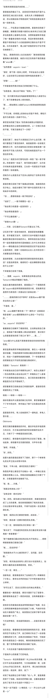

## 25

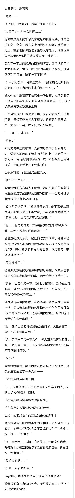

## 26

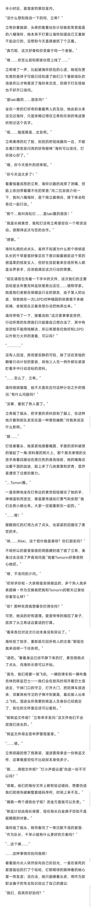

## 27

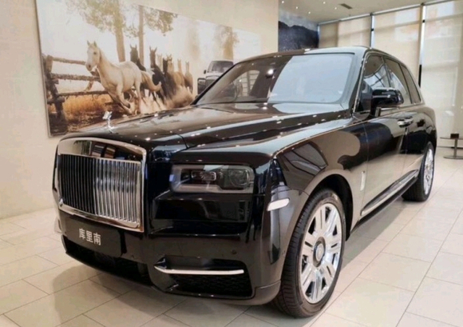

## 28

## 29

今日无双更，个人档案出了点问题

## 30

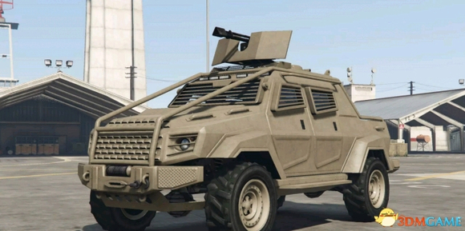

## 31

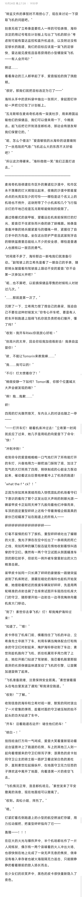

## 32

@紫毛拍手  宝子你怎么不说话了

## 33

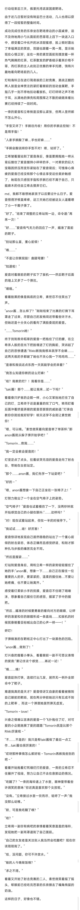

## 34

今日可能无更😭去外地处理档案

## 35

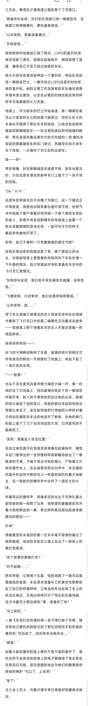

## 36

删了重写的一章时间上有点来不及了，结尾比较仓促

## 37

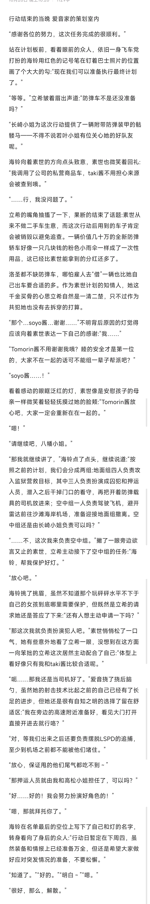

## 38

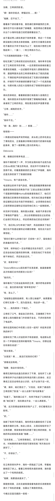

## 39

昨天没更主要是考虑到剧情连贯性，这一章不太好拆成两节迫不得已了

## 40

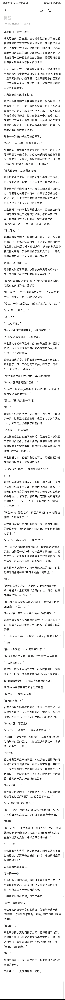

## 41

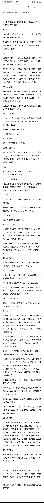

## 42

最近写东西的质量有点低可能更新会不太稳定

## 43

好麦坞山，素世的家中。蒸汽缭绕的大浴室里，裹着浴巾的灯犹豫不安地看着眼前铺满了玫瑰花瓣的人造温泉，感觉自己像是站在了魔女的大锅前。她捂住胸口的浴巾，小心翼翼地用白嫩敏感的脚趾尖反复试探了几次水温，这才鼓起勇气迈开腿尝试着坐了进去，慢慢地把自己浸泡在人造温泉温暖怡人的热水里。这个『浴缸』大的让她有些无所适从，她还是更喜欢自己家里那个朴素又狭窄的小浴缸:她喜欢坐在那个温暖又狭窄的小空间里，闭上眼睛想象自己正被大家的怀抱所包围，放松的让自己沉浸在幸福感和安全感的美梦中。大家都更喜欢这种浴缸吗？灯默默地抱着膝盖坐在温泉的角落，像西瓜虫一样蜷缩成了一团，空旷宁静的浴室里只剩下了淅淅漱漱的水声。温泉的水温十分怡人，水流按摩冲刷身体的感觉也很舒适，但灯却总觉一个人坐这个巨大的浴缸里有种说不出的恐慌感。只是她也不知道这种感觉从何而来，只好把半张小脸埋进了水里，沉默地咕嘟咕嘟吐起了泡泡。刷啦——浴室的推拉门被打开了。“抱歉，Tomori酱～让你久等了。”灯抬起头，看到素世微笑着走进了浴室，她的身上同样只裹着一条浴巾，棕色的长发随意地盘在了脑后，扎成了一个丸子，看起来比平时多了一份日常的温婉感:“感觉怎么样？用的还习惯吗？”“感觉很舒服……谢谢soyo酱。”灯乖巧的点了点头，素世的到来让她放松了不少，这么大的浴池只有她一个人用果然还是太奇怪了。伴随着一阵哗啦啦的水声，素世主动坐到了灯的旁边，她惬意的长舒了一口气，倚靠着温泉的边缘半躺了下来，让水流充分的按摩过丰腴婀娜的身体，带走了今天『工作』带来的的疲惫。完全舒缓下来的素世微微偏过头来，看着身边的灯一副好奇又不敢尝试的可爱样子，忍不住笑出了声。她温柔地握住了灯的手，微笑着建议道:“Tomori酱，放松一点，躺下来试一试吧？”“好…好的！”灯学着素世的样子，略显拘谨地躺了下来。有了素世的陪伴，她也能试着感受一下这个人造温泉的美好之处了:温热的水流冲刷过身体，萦绕的蒸汽里带着安神的花香，手中素世的手温暖又柔软……平时那种泡澡的舒适感又回到了自己的身边。哈啊……好舒服……灯幸福的眯起了眼睛，小脸被热气熏蒸的红扑扑的，感觉自己身体放松的像好像要融化了 。“Tomori酱喜欢这个温泉吗？”素世轻轻阖上眼睛，用柔和的声线询问灯的感想 。“嗯…喜欢……”灯迷迷糊糊的回答:“一个人会有点奇怪，但和soyo酱一起就会很放松……”“哈哈…一个人用的话，可能确实有点太大了呢。”“soyo酱……那个……”“怎么了？”“……对不起。”“Tomori酱没有做错什么，不用道歉哦。”“可是soyo酱看起来……很寂寞。”素世的笑容明明很温暖，但灯却从她的眼中看到了落寞。她忍不住说出了自己内心的想法:“soyo酱…平时一个人会寂寞吗？”看着眼前像做错了事情的孩子一样紧张不安的灯，素世楞了一下，又微微摇了摇头，轻叹了一口气:“……灯还是那么敏感呢。”“soyo酱会寂寞的话，我可以每天都来的！”“Tomori酱不用勉强自己的 。”“不会的！因为soyo酱平时照顾我很多…所以我也想为soyo酱做点什么！”“那……可以陪我聊一下吗？”“嗯！”看着眼神纯洁而坚定的灯，素世的内心忍不住刺痛了一瞬，她紧紧地抿着嘴唇，像是下定了某种决心一样，伸手用力拥抱住了眼前的灯。“对不起……Tomori酱………”突然被抱住的灯有些不知所措，但她还是下意识回应了素世的拥抱；手臂上传来的触感让她感觉到素世的身体正在微微颤抖，像是在忍耐着某种强烈的情绪:“soyo酱…怎么了？”素世低垂着头，轻轻趴在灯的耳边，用低微而沙哑的声音缓缓的说出了残酷的话语:“这次行动结束后……我就要退出帮派了。”！！！灯惊恐而难以置信的睁大了眼睛，那个冰冷雨天的回忆如闪电般击中了她。她猛的挣脱开了怀抱，抓住素世的手拼命的想要说些什么，但喉咙里却像是被像是被什么堵住了，最后只能用颤抖的声音哀求似的道:“为……为什么？是…是我做错了什么吗？soyo酱为什么……”“不是Tomori酱的错哦，只是我不能和anon酱继续待在一个帮派里了。”素世像是没有注意到灯的惊慌一样，低着头自顾自的继续说着:“Tomori酱还不知道吧？我和anon酱做过了呢。”“soyo酱…和anon酱……做过了？”“嗯，第一次行动结束那天晚上，我带着anon酱回了家。也许是一时冲动，也许是不甘于寂寞……我答应了她。那天晚上她还和我说了好多的情话，从小祥离开之后我还是第一次感觉那么温暖。”素世抬起头浅浅一笑，可看着她泛红的眼眶，灯却觉得她更像是在哭:“只可惜她是个骗子呢。”“什么……”“比起留在我的身边，她更想和Tomori酱在一起哦，还说『如果我离开灯会哭的』……呵呵，她真的很喜欢Tomori酱呢。”

## 44

“Tomori酱，有时候太温柔也是一种伤害哦。”看着眼前笑容苦涩而释然的素世，灯沉默的低下了头，垂落下的刘海形成了一片阴影，遮挡住了她的表情:“……和anon酱在一个帮派，会让soyo酱痛苦吗？”“…嗯。”“有什么办法能让soyo酱原谅她吗？”“我已经原谅她了哦，毕竟灯也很喜欢anon酱吧？”“……我知道了。”灯哗啦一声从水中站了起来，她紧咬着嘴唇，深深地吸了一口气，像是要把勇气和决心吸入身体里。我和anon酱说过，不可以欺骗自己的队友。既然anon酱不能遵守那个约定的话……“我要去……杀掉anon酱。”“Tomorin酱！？”看着杀意凛然起身欲走的灯，素世一下慌了神，她没想到灯居然会反应的如此剧烈；她顾不上浴池的湿滑，赶忙一把抓住了灯的手腕，急切地阻止道:“Tomori酱！不要走！”“soyo酱……我要去……弥补我的错误。”“求求你了Tomori酱…这样就好……我不能让你因为我杀掉自己的朋友……睦也还没有救出来…求求你…不要去……呜……”“soyo酱………”看着逐渐泣不成声的素世，本就濒临心理极限的灯也终于无法再假装坚强，强忍住的苦涩泪水夺眶而出，大颗大颗的泪珠顺着脸颊滚落。她像是个迷了路的孩子，无助地跪坐在了地上，哽咽地小声啼哭着，徒劳的一次次抹去眼前的泪水。“Tomori酱……”素世趁机轻轻的抱住了哭成泪人的灯，安慰似的轻抚着她的脑后:“不要哭……我会留下来的。”“soyo酱不可以勉强自己…”“嗯，不会哟，我也不希望Tomori酱勉强自己。所以等这次行动之后……我们就和anon酱告别吧？”“告别？”“嗯，告别……虽然不能组一辈子帮派，但灯还可以继续和anon酱做朋友，我也可以当anon酱从来没有进入过我的人生，这样会不会好一些？”“………嗯。”虽然依旧有些失落，但灯还是用力的点头答应了素世的提议。想要不伤害任何人的话，这应该就是最好的选择了吧？只是爱音她会不会……叮铃铃——🎶铃声打断了灯的思绪，她惊讶是看着墙壁上的一块小屏幕突然亮起，看起来似乎是链接了素世的手机，屏幕上正显示着立希的来电。一旁的素世微微皱眉，按下了接听:“素世，有紧急情况。”电话那头的立希声音有些沙哑，但语气十分严肃:“现在带上灯去粉毛家集合，要快，到了再和你说具体情况。”“我知道了。”素世干练而认真的回复了立希，随即挂断了电话，仿佛那个刚刚还在哭泣的女孩不是她本人一样。她站起身来，微笑着向着跪坐在地上的灯伸出了手:“走吧，Tomori酱。”“嗯！”灯用力点点头，握住素世的手，脸上露出了单纯而幸福的笑容。

## 45

补发一下138楼的内容有宝子说看不见

## 46

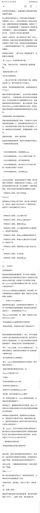

## 47

坐在轿车的驾驶座上，爱音烦躁又无聊地用手指划动着手机屏幕。Rikki那家伙居然说什么『目标在堵在早高峰里了，还要再等一会儿』，完全没有考虑过人家这边的状况嘛。满腹牢骚的爱音不满地撇撇嘴，悄悄放下了手机，从后视镜里偷看了一眼后排座位上的乘客:素世倚靠着车门，表情冷淡的看着窗外，嘴唇紧闭一言不发，一副生情人闷气的小寡妇模样。自那次一叶情之后，两人间就形成了某种『坏主人和笨狗狗』的微妙关系:素世明明想要弄死她，但却还是默许了她留下当狗，而她居然还真就稀里糊涂——或者说死皮赖脸的留了下来，试图等待机会逆风翻盘。难得有机会独处……要不试试？爱音鼓起勇气，试探着开口撩拨道:“呐，soyorin，你觉得我们像不像……”“不像。”素世头也不回，冷漠的驳回了爱音的提案。“我都还没说像什么哎！”“我不在乎狗的看法。”……那么生气你干脆一砰砰打死我好了嘛。爱音沮丧的低下头，赌气似的趴在了方向盘上。说实话，有时候真挺佩服立希的，这舔狗她是快当不下去了。要是只有素世冷漠也就罢了，自从昨天晚上跟着素世回家之后，一向害羞但黏人的灯突然也开始躲着自己。会议前后爱音几次试着想要和灯谈谈，却都被她笨拙但抗拒的回避掉了，像只企鹅幼崽一样缩在Rikki和Soyorin后面不愿意和自己讲话。现在回想起灯那种嫌弃又抵触的眼神她都觉得自己心在滴血。这就是所谓的一颗心两面受伤吗……爱音失意地把脸埋进臂了弯里，不知道为什么突然想吃根黄瓜缓解一下。她知道素世绝对和灯说了什么，但自知理亏的她又没那个胆子去质问素世。只好一遍遍的给灯发信息轰炸，祈祷着能得到一点回应。闲着也是闲着……再发一遍问问吧。爱音百无聊赖的爬起身，拿起手机准备给灯再发几个可爱的表情包卖卖萌。……『ANON保健品批发』:流泪猫猫头.jpg『ANON保健品批发』:Tomorin酱对不起嘛（哭『ANON保健品批发』:我不是故意的啦。『ANON保健品批发』:我之前买了天文台的门票哦，救出睦以后咱们一起去吧『ANON保健品批发』:哭泣青蛙.jpg……见半天没有回应，爱音失望的熄灭了屏幕，像只被掏空了的钱袋子一样瘫软地趴回了方向盘上。正当她开始考虑要不要小睡一会儿来缓解一下通宵的疲惫时，原本已经熄灭的屏幕却突然重新亮了起来:『好想成为人类啊』发来了新消息。Tomorin！爱音猛地从方向盘上弹了起来，她兴奋一把抓起手机，强忍住一脚油门冲过去给灯一个亲亲的欲望，赶紧打开了聊天看看灯发了些什么:……『好想成为人类啊』:anon酱对不起『好想成为人类啊』:我和soyo酱误会你了『好想成为人类啊』:鞠躬企鹅.jpg『好想成为人类啊』:anon酱是坚强努力又真诚的人，是忠诚可靠的朋友『好想成为人类啊』:我和soyo酱都是迷路的孩子『好想成为人类啊』:希望anon酱以后也可以和我们一起迷失下去『好想成为人类啊』:很期待和anon酱一起去天文台『好想成为人类啊』:行动加油！『好想成为人类啊』:加油企鹅.jpg……

## 48

这……这对吗？这说的是我吗？爱音迷惑且震惊的看着屏幕，忍不住揉了揉眼睛，她怀疑自己是不是熬夜熬出幻觉来了:坚强努力又真诚还tmd忠诚可靠？这是哪个平行世界的千早爱音？Tomorin这滤镜未免叠的也太厚了吧？自己怎么就走到对岸了？不过Tomorin原来是这么看我的呀～有点爽哦，要不要截屏发给Rikki看看呢？嘻嘻～爱音忍不住对着屏幕一阵银笑。“……你给灯下什么迷魂汤了？”爱音闻声扭头看去，发现素世居然也拿着手机，正用一种异常复杂的眼神看着她:“她给我发消息说我误会你了……你刚刚跟她说了什么？”“呃soyorin你先听我狡…呸，解释！我真的什么都没和Tomorin说过！”“你知道我能让taki酱查你聊天记录的吧？”“我是无所谓啦，但我怕Rikki看了可能会受不了。”“……”素世盯着满脸坦荡的爱音看了一会儿，终于还是摇头放弃了请立希提供技术支持的打算。她不想节外生枝让立希掺和进来，万一被立希知道自己拿退团的事威胁灯，那被赶出去的人恐怕就要变成她了。“那个～soyorin你看，Tomorim她都这么说了。”见素世态度软化，爱音当即决定借坡下驴:“你就给我个解释机会呗～”“我不觉得你有什么好解释的。”“骗人，soyorin明明很希望我说对不起然后一辈子陪在你身边吧。”“我现在更希望你离我的生活远一点。”“soyorin不喜欢我了吗？”“不喜欢。”“可我还是很喜欢soyorin哦。”“你喜欢的只是钱和女人。”“那我为什么当时要拒绝soyorin呢？”“谁知道，也许你更喜欢Tomori酱吧。”“哦～原来是吃醋了呀，soyorin果然喜欢我呢～这样我们就是两情相悦了！”素世噎住了，看着眼前得意洋洋的爱音，她头一次觉得立希才是真正的辩论大师:这种时候物理说服确实比语言有用。明明最初只是想养条狗，顺便把她从队伍里摘出去，结果这狗不仅极其不听话，偏偏还麻烦又黏人。搞的现在就连她本人都说不好自己是不是对这只粉毛大狗有好感了。“呐，soyorin，这次行动结束之后咱们就和好吧？”意识到自己已经成功给素世忽悠瘸了的爱音赶紧趁热打铁:“我以后都会好好陪在你身边的啦！这次就当是为了不让Tomorin担心好不好？”“…等把睦救出来再谈吧。”“意思是把睦救出来我们就和好吗？”“……”素世沉默，她对灯的利用莫名其妙就变成了一步坏棋，非但没有拉开爱音和灯的距离，反倒是把自己逼进了死角。现在她答应或是不答应都是坏手了。该怎么办呢……看着满脸期待的爱音，素世无奈的闭上了眼睛。咔滋————两人的对讲机里突然发出了一阵刺耳的电流声，立希的命令声也紧跟着传了出来:“郊狼对全体，目标靠近，还有三个路口，做好准备！”“呃，狐狸二收到！”看着手忙脚乱回复立希消息的爱音，素世庆幸地暗暗松了口气:“……狐狸一收到，我们准备出发。”

## 49

在想要不要搞个千赞特别篇

## 50

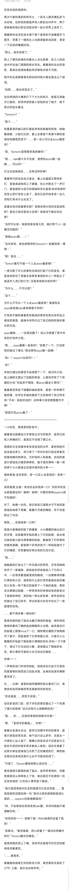

## 51

任务完成的很顺利。两次干脆利落的砰砰开火，一段令人眼花缭乱的飞车好戏，在刺耳的警笛声和人群的尖叫声中，两个背叛者和他们的证词就这样一起从世界上消失了。随着那份证词在排水渠下某个废弃的汽油桶里灰飞烟灭，劳累了一晚的众人也都准备各自回家，享受一下迟来的睡眠时间。“那么，我先告辞了。”跨上了摩托的海铃向着众人点头致意，在三人的目送中拧动油门潇洒的扬长而去。看着海铃远去的背影，爱音总觉得她看起来好像有点急不可耐。她平时去高跟鞋俱乐部玩的时候大概也是这么个感觉。“哈啊……我也该回去了。”站在燃烧的火桶旁打了个大大的哈欠，爱音正准备开口道别，却突然感觉被人轻轻抓住了袖子，她下意识的扭头看去:“Tomorin？”“那个……”抓着爱音的袖口的灯看起来有些害羞和忸怩，她缩着肩膀，小脸红红的，看上去像是个希望今晚和爸爸妈妈睡觉的孩子:“……我一会儿可以去anon酱家吗？”“呃，Tomorin是想要来我家睡吗？”“嗯……taki酱今天不在家，我想和anon酱一起睡……可以吗？”灯主动找我独处……还有这种好事？看着乖巧的站在自己身边，看上去羞赧又期待的灯，爱音虔诚地闭上了眼睛，在心中默念了一声灯门，算是提前为自己的僭越和无礼赎罪:她早就想好该怎么把灯忽悠上床了，现在已经开始考虑一会儿该和灯来点什么玩法了。是塞冰块还是塞果冻呢？润滑该用水性的还是油性的？是洗之前还是洗之后做？或者说干脆边洗边做？“当然可以啦～我家的新床蛮大的，咱们两个人一起睡没问题的！”“谢谢anon酱……！”“没关系啦，我也很期待和Tomorin一起睡觉呢～嘿嘿～”“嗯！我也……”“Tomori酱可不能一个人去anon酱家哦？”一旁沉默了许久的素世无奈的打断了灯的发言，像是老妈抓住了准备去找男友鬼混的女儿一样阻止了她送羊入虎口的行为:“还是来我家比较好吧？”“为什么……不可以呢？”“这个……”为什么不可以一个人去anon酱家呢？难道和去soyo家或者taki家有哪里不同吗？灯有些不解的看着笑容勉强的素世和旁边突然坐立难安的爱音，脑海中突然闪过了自己刚刚和海铃聊过的内容。soyo酱她……一定是吃醋了！自认为想通了其中关系的灯恍然大悟。“那……soyo酱要一起来吗？”犹豫了一下，灯试探性的提出了建议:“我也想和soyo酱一起睡！”“唉！？soyorin也来吗？！”“哎？”听到灯建议的素世不由得楞了一下，她沉吟片刻，脸上随即又露出了狡黠的笑容，心里突然有了个有趣的计划:“听起来不错呢，那anon酱会介意吗？”看着素世笑容下暗藏的威胁意味，爱音一秒钟都不敢犹豫，在求生本能的催促下立刻表明了自己的支持:“不会！我超欢迎的！这种事大家就要整整齐齐嘛！”“那就打扰anon酱了～”

## 52

一小时后，爱音家的卧室中。看看身边抱着自己手臂发出均匀呼吸声，显然已经陷入熟睡的灯，爱音忍不住咽了咽口水。隔壁的卫生间里传来淅淅沥沥的水声，素世刚刚开始洗澡没多久，而只穿了一件衬衫的灯就这样毫无防备地睡在她旁边。天时地利人和皆备，此刻的爱音只感觉自己雌蕊痒痒的，脑子里仿佛有一善一邪的两个小小爱音正在展开激烈的斗争——善良爱音:没关系的，亲一口没人会发现的！就亲一口！邪恶爱音:怂蛋！有这机会你就亲一口？你的手和舌头都是摆设吗？摸啊！舔啊！只要你够快soyorin就不知道的！坏了，她俩一伙的。意识到自己道德水平不佳的爱音尴尬地咂了咂嘴，看着灯可爱的睡脸，终于还是做出了决定:那就……先偷偷亲一口呗？爱音兴奋难耐的舔了舔嘴唇，小心翼翼的抽出自己的手臂，试探着用手指抚摸上了灯的脸颊，指尖滑过她如婴儿般光滑柔嫩的肌肤，触碰到了灯的柔软的樱色唇瓣。爱音像个好奇的孩子一样轻轻拨开了灯的嘴唇，欣赏着她珍珠白色的光洁贝齿。“唔……”被触碰的灯发出了一声无意识的梦呓，牙关间微微张开了一条缝隙，爱音趁机把食指送入了灯的口中，一边享受着温暖湿润的触感，一边撩拨调戏着灯柔软的小舌；感受到什么的灯突然像是吮吸奶嘴的小宝宝一样下意识的舔弄了一下她的食指，柔软舌尖摩擦过指腹，一种奇异的欣快感如电流般穿过了爱音的神经，爽的她一阵头皮发麻，条件反射似的抽出了自己的手，带出的涎水在空中拉出了一条晶莹的丝线。……要不再多看一眼别的？爱音贪婪的舔了舔还沾着灯唾液的食指，用炽热的眼神的看向了睡的迷迷糊糊的小企鹅。她先是在灯的脸蛋上狠狠mua了一口，随即便壮着胆子悄悄掀开了被子，把脸凑到了灯的双腿间，兴奋又小心翼翼的开始脱下眼前那片薄薄的布料:布料一寸寸滑下，滑过了灯光洁的小腹，逐渐露出了稀疏的毛发，那片柔软可爱的小丘已经近在眼前……咔嚓——！一声相机快门声突然响起，刚刚还在沉迷于灯美色的爱音顿时感觉自己如坠冰窟，全身的血液仿佛都要冻结了。丸……丸辣！爱音机械而僵硬的扭头看向门口，表情变的如同某幅世界名画般惊恐到变形。“你还真是……死性不改呢。”站在卧室的门前，放下手机的素世露出了一个充满了魄力的微笑:“这次还有什么想解释的吗？”“我……你……你居然拿我的招数对付我？”“嗯，『老掉牙的套路』，对吧？”看着头发滴水未沾，显然已经蹲守多时的素世，爱音只感觉欲哭无泪，她干这行这么多年，还是头一次被别人仙人眺了，最糟心的是这法子还是自己之前吹牛皮的时候手把手教给人家的。现在任谁看了这照片都会觉得自己水煎了正在睡觉的灯，哪怕她压根还没来得及做什么也不可能洗的清了。“可惜了，Tomori酱明明那么信任你……”素世遗憾又鄙夷的摇了摇头，虽然早有预料，但看到爱音这么简单就上了钩，她还是忍不住感到一丝无名的恼怒:“让你加入果然是个错误。”“我只是觉得我对队友的爱里可以包含⭐爱……”爱音弱弱的试图抗辩一句:“我对大家的感情都是很认真的……soyorin你能理解我吗？”“呵，不如我现在把照发给taki酱，你问问她能不能理解你吧。”“别别别别——！我错了姐！Rikki她真的会鲨了我的！”“安静点。”素世皱眉，担心的看了一眼还在熟睡中的灯:“Tomori酱还在睡觉。”爱音明智的闭上了嘴，但依然还是用可怜巴巴的眼神哀求着素世。“……跟我来。”看着眼前摇尾乞怜的粉毛大狗，素世最终还是叹了口气:“上楼，我们谈谈条件吧。”

## 53

最近几章赞好低我有点黔驴技穷了说是

## 54

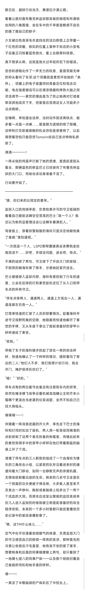

## 55

越狱这章大概还有至少3/4的内容，但后续还有最后一部分没写完，考虑到剧情连续性，我觉得明天统一发比较好所以今天暂时先断在这个位置了，抱歉

## 56

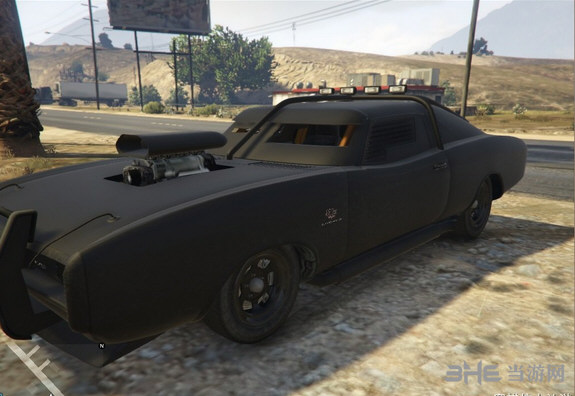

## 57

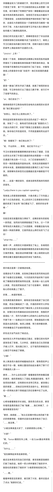

## 58

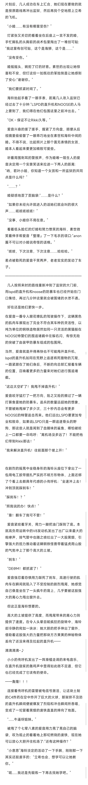

## 59

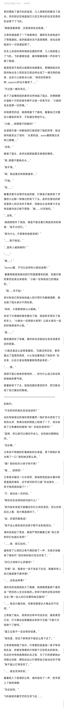

## 60

越狱部分顺利结束，下一章就是祥素终极一战了开盘开盘。首先要感谢一下大家的宽容。越狱这章写的确实很无趣，我想写那种『在冲突和中产生羁绊和情感』的剧情实在是太高估自己了，很多自以为不错的想法写出来简直一坨，实在是污染眼球。其次就是在有些角色的塑造上多少有点力不从心，不想反复强调刻板印象，但又害怕会ooc，结果就是在两边横跳:要么ooc要么刻板印象，尤其是灯被写的过于幼稚和没有主见了，我向全体灯厨切腹谢罪。后面的剧情大概已经有构思了，我会努力弥补现有错误的，请大家放心

## 61

突然发现木头这两章里说的话貌似已经赶上原作了

## 62

有了点新想法，保留惊喜，明天发

## 63

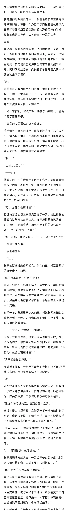

## 64

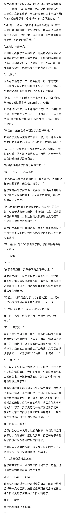

## 65

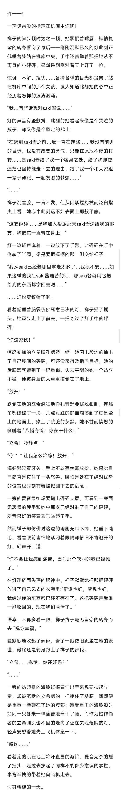

## 66

4k字的更新……燃尽了尽力表达了想法，写的比较爽的一次

## 67

特别章节明天再发吧写的有点累了

## 68

太平洋中某个风景怡人的私人岛屿上，一架小型飞机正向着岛上机场的跑道缓缓降下。在跑道的尽头的机库中，一辆蓝色的轿车正孤零零地停在那里。车旁一个身穿风衣而拄着拐杖的少女正紧盯着那架正沿着跑道向着她滑行而来的飞机，焦急的像是在产房门口等待妻子分娩的丈夫。嘎吱————伴随着一阵刺耳的刹车声，飞机稳稳地在了她的附近。液压杆推动着机舱门缓缓落下，变成了一台简易的楼梯。少女焦急而期待地看着打开的舱门：她看到先一步走出机舱的海铃微笑着向着她招手致意，随即又转过身去，搀扶着那个像陶瓷人偶一样的女孩走下了楼梯。“睦！”看着身着囚服而面色苍白的睦，她急切地撇下拐杖，一瘸一拐地小跑了过去，张开双臂像是要把睦揉进怀里一样紧紧地拥抱住了她，仿佛害怕下一秒那个女孩就要从自己面前消失。“祥...对不起。”睦低下头，垂着手站在原地，像是个犯了错的孩子。“真是的....见面就说这种傻话....”感受着怀中女孩的温度，喜极而泣的祥子几乎说不出一句完整的话来，她再也维持不住平日里那副虚假的强硬模样，用手指轻轻地抚摸过睦的脸颊，小心地像是在为一件易碎的艺术品拭去灰尘：“睦能安全回来就好，别的事情就不要多想了。”“我......”“saki.......酱...？”——！？熟悉又陌生的声音喊出了自己的名字，沉浸在重逢喜悦中的祥子不由得一怔，她难以置信地抬头看去，那个小动物一样的女孩正怯生生的站在舱门口看向自己，因兴奋而泛红的脸上带着难以掩饰的喜悦:“是…是saki酱吗？”“灯.....为什么会在这里？”惊讶与苦涩的复杂表情只留存了一瞬，难以抑制的惶恐和愤怒开始占据上风。祥子压抑着自己的怒火，抓住了睦的胳膊，用尽可能平静的语气询问她：“睦，这是怎么回事？”“我不知道。”睦摇了摇头：“Timoris和她们救了我”“她们？还有谁？”“素世和立希。”“什.....”祥子的话还没来得及说完，剩余的三人就紧跟着灯的脚步走下了舷梯。“真的是小祥呢！好久不见了！”看到了到站在飞机旁的祥子，素世也是一副倍感惊喜的模样，好像是在为见到了久别重逢的朋友而感到高兴；跟在她身后的立希则是紧皱着眉头一言不发，只是死死地盯着祥子的脸，像是要在上面戳出一个洞来。时隔一年，曾经属于CCC的五人就这样阴差阳错的重新凑到了一起。只可惜现在的她们早已不能再如过去那般坦诚相见。“......Timoris，我需要一个解释。”无视了立希的冷眼，也没有回应素世的招呼，祥子紧抿着嘴唇，眼神中闪烁着愤怒的火光。她握紧了拳头，冷冷地看向了抱着胳膊站在一旁的海铃：“她们为什么会出现在这里？”“我不明白你的意思。”海铃摇了摇头，一副无可奉告的模样：“她们也不是我找来的，我只负责联络了千早爱音。”“啥？”正在好奇地四处东瞅西瞧的爱音扭过头来，刚好对上了祥子那仿佛要吃人一样的恐怖眼神，吓得她顿时一阵头皮发麻，下意识地就想往灯后面站站。“跟这个粉毛没关系，查到你的人是我。”还没等爱音有所解释，立希就伸手一把将她扒到了身后，像是只护崽子的母狼一样，毫不回避地和祥子对着瞪起眼来:“有什么想说的就跟我说。”Rikki～love～！爱音简直要感动的落泪了，虽然不知道她们在聊些什么，但她还是头一次觉得这个比自己还矮一截的肌肉派黑客居然这么能给人安全感。“……我和你没什么好讲的。”祥子厌恶地偏过头去，一副公事公办的态度:“钱我会加倍付给你们，以后不要再来纠缠我了。”“钱？你欠的东西拿钱还得清吗！”祥子轻慢的表现彻底激怒了本就在发作边缘的立希，紫水晶般的眼睛因愤怒而变的赤红，她几乎是咆哮着开始怒斥起祥子的罪状:“你口口声声说着把人生交给你，骗灯跟你干了这行，帮派搞黄了又自己夹着尾巴逃走，撇下她一个人不管！你现在有什么资格说不要纠缠你！你对得起她吗！”

## 69

越说越激动的立希怒不可遏地抬起手就要去抓住祥子，一旁的三人赶紧拽住了她。爱音拼命地从腋下固定住了立希的胳膊，急切的在她耳边小声劝解着:“Rikki姐咱忍忍吧！你这样Umirin会很难办的！”“taki酱……不要！”被立希这幅凶恶模样吓到的灯害怕地紧闭着眼睛，像只树袋熊一样用身体紧紧的抱住了立希的小臂，她不想让任何人因为她的原因而受伤:“不是saki酱的错！”“taki酱，冷静一点。”素世用力抓住了立希的手腕，用关切和担忧的眼神安慰着被愤怒冲昏头脑的立希，直到她的眼神恢复了些许清明才轻轻放开了紧握的手:“小祥之前一直都很重视帮派，她突然离开一定有她的理由的。”“……切。”立希忿忿地啐了一口，把头撇向一边，不再言语；一旁警戒了半天的海铃也终于松了一口气，她可不想面对老婆和老板打架自己该帮谁这种问题。“抱歉，小祥。taki酱她有点太激动了，你知道的，毕竟taki酱她最喜欢Tomori酱了，对吧？”见立希冷静下来，素世冲着祥子露出了一个抱歉的微笑，给立希找了个台阶下，试图缓和一下紧张的气氛:“刚才那些话都是taki酱的气话，小祥不用放在心上的。”“事到如今还在装作一副为了我的样子吗。”然而祥子只是冷漠的瞥了素世一眼，用一种令人陌生的口吻淡淡的讥讽道:“你还是那么虚情假意呢。”“哎……？”突如其来的冰冷话语如尖刀般刺入了素世的心脏，她不知所措地站在了原地，甚至连一句自我辩解的话都无法说出。“是你找椎名要了我的联系方式吧。”“我……那个……我只是想……”“椎名她怎么看我是她的自由，我不在乎。但像你这样总咬着不放，未免也太难看了。”祥子转身捡起了掉在地上的拐杖，回过头冷漠地看向了愣在了原地的素世:“那个帮派的事情，你还是趁早忘记了为好。”“但…但我们当时不是很和谐吗，大家开心的在一起，相互帮助着努力赚钱，小祥也说大家以后就是命运的共同体……就这样突然就解散也太奇怪了！小睦也一定是这样想的吧！”素世已经不复往日里的从容，她近乎哀求地看向了一旁一言不发的睦，希望从她那里得到哪怕是一点点的支持。“睦，是这样吗？”祥子看向了睦，眼神平静的像是一片湖水。“……没有。”“小睦？”“在那个帮派里，我从来没有觉得开心过。”睦的声音很小，但在素世的耳中无异于一声炸雷。她绝望而难以置信地看着沉默不语的睦，她不明白明明刚才在飞机上还期待着和大家再次熟络的睦为什么要背叛自己。“明明……明明我是为了CCC才努力至今……我付出了那么多才坐到今天这个位置……为什么……”“不要自作多情了，没有人拜托你那么做。”祥子摇了摇头，语气里不带一丝留恋:“睦，我们走。”“不……不要走！”在众人震惊的目光中，那个一向高贵雍容的长崎素世居然如乞丐般跪倒在了祥子的面前，她紧紧的抓住了祥子的拐杖，近乎哭喊的哀求着怜悯:“小祥！求你了，我真的…真的什么都会做的！我可以出很多很多钱……如果没有CCC的话……我真的……”“……够了！”终于忍无可忍的祥子愤怒地抽出了拐杖，拐杖上个尖锐的部位滑过了素世的手掌，少女白嫩的肌肤上顿时划出了一道长长的血口:“我不会再陪你们玩那些帮派过家家了！”看着跪倒在地茫然流泪而不知所措的素世，怒急攻心的祥子握紧了手中的拐杖，把自己的怒火与不满毫无保留的宣泄到了她的身上:“看到这条腿了吗！这就是我选择了你们付出的代价！就因为你念念不忘的那个帮派，我像只野狗一样打断腿丢了出来！你那些幼稚无知的快乐建立在我的痛苦之上！这些你在乎过吗？没有！你只想着你自己！”祥子的腿……断了？睦以外的CCC众人震惊地看向祥子，刚刚她只是站在原地，自然没有人察觉到异常，但现在祥子拿着拐杖的模样显然不是在说谎的样子。气氛陷入了诡异的沉默，除了祥子以外的每个人都低垂着头，周围安静的像是一场葬礼。“……我要说的就是这些。”祥子结束了沉默，她简洁干脆地留下了一句话，随即便拄着拐杖向着自己的车走去。咔哒——咔哒——咔哒——跪坐在地的素世努力睁开模糊的泪眼，眼睁睁地看着祥子一点点远离，她已经想不到任何方法能再让这个同样受尽了伤害的少女回心转意了。神啊……救救我……素世绝望的闭上了眼睛。

## 70

砰——！一声惊雷般的枪声在机库中炸响！祥子的脚步顿时为之一顿，她紧抿着嘴唇，神情复杂的转身看向了身后——刚刚沉默已久的灯此刻正低垂着头站在机库中央，手中还高举着那把她从不离身的小砰砰，显然是刚刚对着天上开了一枪。惊讶，不解，担忧……各种各样的目光都投向了站在机库中间的那个女孩，没人知道此刻她的心中正经历着怎样的波涛汹涌。“我…有些话想对saki酱说……”灯的声音有些颤抖，此刻的她看起来像是个哭泣的孩子，却又像是个坚定的战士:“在遇到saki酱之前…我一直在迷路……我没有前进的目标，也没有改变的勇气，只能在原地不停的打转……是saki酱给了我一个容身之处，给了我即使迷茫也坚持能走下去的理由，给了我一个和大家组一辈子帮派，一起发财的梦想……”“……”祥子沉着脸，一言不发，但从因紧握拐杖而泛白指尖上看，她心中此刻远不如表面上那般平静。“这支砰砰……是我加入帮派那天saki酱送给我的那支，我把它一直带在身上。”灯一边轻声说着，一边放下了手臂，让砰砰在手中倒转了半周，像是要把握柄的那一侧交给祥子:“我从saki已经酱哪里拿走太多了…我很不安……如果这样的我让saki酱痛苦的话，那saki酱就用它把给我的东西都拿回去吧……”……灯也变狡猾了啊。看着低垂着脑袋仿佛死意已决的灯，祥子摇了摇头。她迈步走上了前去，一把夺过了灯手中的砰砰！“你这家伙！”惊怒交加的立希瞳孔猛然一缩，她闪电般地的抽出了自己腰间的砰砰，可还没来得及指向目标，她的后膝窝就遭到了一记重踢，失去平衡的她一个站立不稳，便被身后的人重重按倒在了地上。“放开！”跌倒在地的立希疯狂地挣扎着想要摆脱钳制，连嘴角都磕破了一块，几点殷红的鲜血滴落到了满是尘土的地面上，染上了肮脏的灰黑。她不甘而愤怒的嘶吼着:“八幡海铃！你在干什么！”“立希！冷静点！”“你＊＊让我怎么冷静！放开！”海铃紧咬着牙关，手上不敢有丝毫放松，她感觉自己简直是按住了一头怒兽，哪怕是处在了绝对优势的位置也时刻有着被掀翻下去的危险。一旁的爱音急忙想要掏出砰砰支援，可看到一旁面无表情的睦手和她中那支已经对准了自己的砰砰，爱音只好哂笑着乖乖举起了手。然而祥子却仿佛对这边的闹剧充耳不闻，她垂下睫毛，看着眼前害怕地紧闭着眼睛却依旧不肯逃开的灯，轻声开口道:“你不会让我感到痛苦，因为那个软弱的我已经死了。”在灯迷茫而失落的眼神中，祥子默默地把那把砰砰放进了自己风衣的衣兜里:“帮派也好，梦想也好，我给过你的东西都已经不存在了。这把砰砰是我唯一能收回的，现在我们两清了。”语毕，不再多看一眼，祥子终于毫无留恋的转身而去:“祝你幸福。”睦默默地收起了砰砰，看了一眼依旧跪坐在地的素世，最终还是转身跟上了祥子的步伐。“立希……抱歉，你还好吗？”“……”一旁的站起身的海铃试探着伸出手来想要扶起立希，却被沉默的立希猛的一把拽住了胳膊，随即便是重重一拳砸在了她的腹部；遭受重击的海铃顿时如同一只虾米一样痛苦地弯下了腰，而作为始作俑者的立希则头也不回的走向了还在失魂落魄的灯，轻声安慰着她先上飞机休息一下。“哎呦……”看着疼的趴在地上冷汗直冒的海铃，爱音无奈的摇了摇头，走过去扶起了同样不剩多少意识的素世，半背半拽的带着她向飞机走去。何其糟糕的一天。

## 71

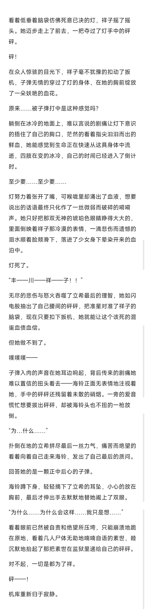

## 72

看着低垂着脑袋仿佛死意已决的灯，祥子摇了摇头。她迈步走上了前去，一把夺过了灯手中的砰砰。啪！祥子关上了保险，抓住握柄，像是挥舞锤子一样砸在了灯的侧颈；毫无防备的灯突遭重击，顿时眼前一黑无力地瘫软了下去。“你这家伙……！”见到祥子居然敢对灯动手的立希顿时怒不可遏，握紧拳头就打算给这死瘸子另一条腿也打断，让她下半辈子只在轮椅上度过；然而还没等她迈出步去就被一旁的海铃用警用电棍捅了腰子，强大的电流令她两腿不听使唤的一阵痉挛，双眼翻白地直挺挺往前倒了下去。好在海铃眼疾手快的扶住了她，顺便给她背手带上了手铐。至于爱音……她刚刚一怒之下怒了一下，被海铃喷了一脸的辣椒水，现在正躺在地上痛苦的扭来扭去。睦从失去意识的灯身上摘下了手铐，丢到了跪坐在地茫然无措的素世面前，面无表情的命令道:“自己带上。”“小睦，你……”“快点。”睦用素世给她的砰砰指了指地上的手铐，威胁意味不言而喻。“……我知道了。”素世咬了咬牙，捡起手铐拷住了自己的手腕，她现在后悔把砰砰交到睦手上了:“这样可以了吗？”睦点了点头，示意素世乖乖跟上，自己则帮行动不便的祥子背起了躺在地上的灯。“谢谢，Mortis。”伸手抚摸过灯像婴儿一样安详可爱的睡脸，祥子露出了满足的微笑，她已经很久没有这么开心过了。如果说她对那个帮派还有什么留恋，那应该就只有这个小动物一样的女孩了，而从今天开始她也将归属于自己:“也辛苦你了，Timoris。”“不用客气，共犯小姐。”海铃微笑着点了点头，像扛起猎物的猎人一样把立希扛在了肩上，丝毫不在意空气中那股若有若无的微妙味道:她刚才貌似把电压开太高了，正戏开始之前得先帮立希好好洗洗:“地上这个怎么办？”“一会儿会有人来处理的，扣下来留给Amoris吧。”“哦，你还真是贴心。”“我认为良好的福利待遇是运营团队的关键。”两人相视一笑，未来的幸福生活已经在向她们招手了。

## 73

先发个序章正戏我得好好想想玩法

## 74

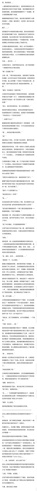

## 75

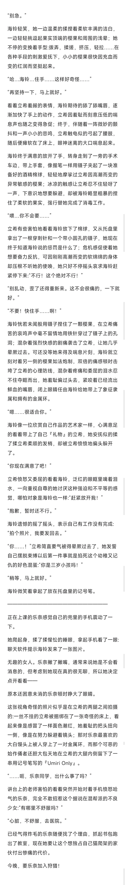

## 76

蛮整蛊的，剧情憋不出来，纯ghs写了两千多多写点当千赞特别章好了

## 77

感觉大家不是很喜欢这种纯ghs的东西还是先搞正戏吧

## 78

去玩守望先锋经典版了，今日无更

## 79

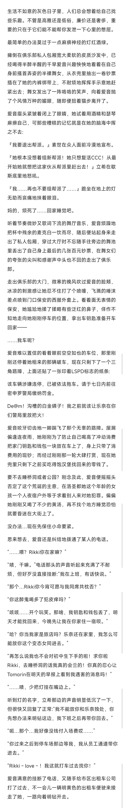

## 80

顶顶求赞求回复点赞提供动力，回复集思广益

## 81

调整剧情，今日小咕一下非常抱歉

## 82

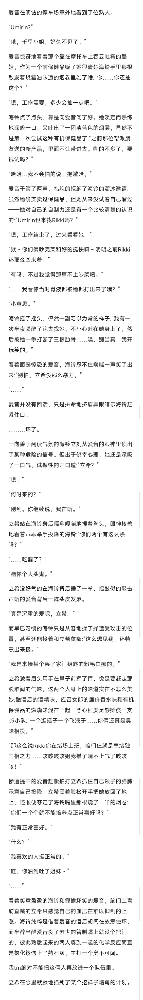

## 83

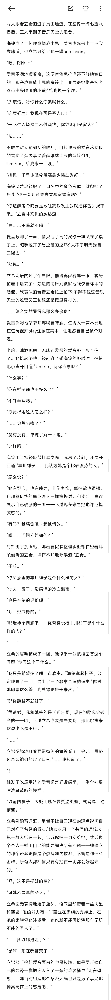

## 84

加班到此为止接下来几天应该能稳定些了

## 85

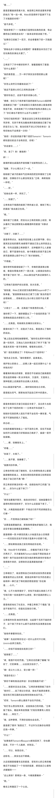

## 86

“嗯……”爱音歪着脑袋思索片刻，她觉得立希的话里有矛盾的地方:“有一说一啊，Rikki你觉得祥子是演不下去了才跑路的对吧？”“差不多吧。”“那就奇怪了——如果她只是想玩玩角色扮演，有必要把自己都搭进去吗？一般来说早就该跑了吧。”“如果你已经输了一百万，你会拿着剩下的一万跑路么？”“那她也多少该做出点调整吧？眼看要血本无归了还在玩角色扮演也太傻了。”“……”立希放下了手中擦好的杯子，皱着眉看向了爱音:“你什么意思？”“我的意思是……万一祥子其实没你想的那么屑呢？”“你怎么突然又向着她说话了？”“我这不是担心你们之间有误会嘛～”“管好你自己，这些不是你该操心的。”“喂喂，你们几个闹矛盾可是把我和Tomorin组的帮派搞都没了哦？”立希顽固又冷漠的态度让爱音感到有些不爽，本来就喝了不少的她开始有点酒劲上头了:“你们谁也不管凭什么还不让我管了？”“你和灯组的帮派？”爱音这话在立希耳朵里真是刺耳异常，无异于黄毛当着老爹的面炫耀自己娶了他的宝贝女儿:“哈，我当初就不该让灯和你来往！没有你她也不会再受一次伤！”“我呸！你这肌肉脑子懂个屁的Tomorin！Tomorin都知道往前走才会有改变，你呢！”“你这家伙……！”“哟，急了？来！揍我啊！”砰！！玻璃杯砸击桌面的声音惊醒了剑拔弩张的二人。“抱歉，不小心用力大了一点。”刚刚砸了桌子的海铃气定神闲的把空杯推到了立希面前，仿佛刚才什么都没有发生:“立希，再帮我倒一杯吧。”“……好。”“给她也来一杯，拜托了。”“……知道了。”立希有些不情愿的接满了两杯威士忌，推到了两人的面前:“我去趟卫生间。”“嗯。”海铃抿了口酒液，把目光从立希的背影上收回，转头看向了身边默默低头看着酒杯的爱音:“冷静点没？”“冷静了，冷静了……”爱音乖乖点头，她虽然现在看上去还算平静，但心里其实后怕的要死:她都想不通自己怎么突然就这么勇，句句话直戳立希肺管子，还伸着脖子让人家揍自己，要不是海铃也在，她今晚要去的就不是立希家而是碉堡山医疗中心了:“刚才谢谢啦。”“不用谢。”海铃举杯和爱音轻碰了一下，辛辣的酒液滑过喉咙，像是在胃里点燃了一团火苗，让爱音后怕的心情平复了些许:“呼……Rikki真生起气来还真怪吓人的。”“立希她只是保护欲比较强，别太在意。”“我知道，Rikki之前还因为我的事和Soyorin吵了一架来着。”爱音默默地给自己灌了口酒:“我当然当然是不会怪她啦……但她老这么当小骑士活的不会太累吗？”“小骑士？……嗯，还真是个有意思的比喻。”海铃愣了一下，随即便露出了一个自信的笑容:“不觉得她就是这点很吸引人吗。”“……还真是。和她做队友确实比较安心。”爱音纠结了一下，还是点了点头，算是承认了海铃的说法。“晚上回去后再和她聊聊吧。”海铃仰头把杯中的残酒一饮而尽，又掏出几张钞票压在了杯子下面:“毕竟是关系到一辈子的事情，慢慢来比较好。”“欸？现在就要走了？不和Rikki打个招呼吗？”“我先去卫生间。”海铃摆摆手，起身离去。保护骑士的骑士……这俩人凑一起应该算什么？伙伴骑兵吗？看着海铃离去的背影，爱音忍不住被自己脑海里的想法逗的噗嗤一笑:伙伴骑兵，又是同，又是骑士，某种程度上还真挺符合这俩人关系的。Rikki真是好福气呀……啥时候给我也分点呢。爱音摇头叹气，默默地消灭起自己杯中的酒水。

## 87

爱音来到音乐天堂已经是后半夜了，没过多久也就到了立希下班的时间——立希该开车回家了。刚刚吵完架的两人现在不得不坐在同一辆车里，气氛不可避免的陷入了尴尬。咋办呀……纠结的看着驾驶座上一言不发的立希，实在不知道如何开口的爱音只好假装自己喝多了，脑袋一歪开始装睡。“……喂，别睡我车上。”“呼噜……”“别装了，太假了。”“……我不管，我睡着了。”“我要问你件事。”立希突然用力踩了脚刹车，巨大的惯性差点让爱音脑袋撞到前座上，本就在闹别扭的爱音立刻用语言表达了自己的不满:“喂！”而立希却好像没听到一样，自顾自地开口问道:“当时……你为什么留下来了？”“什么？”“素世说要离开那天，我告诉你和灯，说她留着你只是想利用你找到祥子，你为什么还是留下来了。”“呃…大概是我脸皮厚？干我这行的不死皮赖脸怎么行嘛～”“你……不觉得自己被她骗了吗？”“这要是能算骗的话，那我倒希望她多骗我几次，我这空手套白狼横竖是都赚啊。”爱音嘿嘿一笑:中素世的美人计她是完全心甘情愿——何况现在还说不好谁才是真中计的那个呢。“……那如果我说我之前在帮她赶你走呢。”“哇，Rikki你今天好婆妈……你看我不爽又不是一天两天了，天天看我和Tomorin贴贴不想赶我走才怪吧？倒不如说你那天因为我的事和素世吵架我才觉得意外来的，没想到你还是满爱我的嘛～”“……”立希噎住了，她没想到自己纠结的这些东西在爱音眼里居然这么无所谓，爱音这种满不在乎的态度让她有种一拳打进了棉花里的憋屈感觉:“你还真是……心大。”“嗨，心不大我早紫砂了，你知不知道从身家几千万亏到只剩一伯块是种什么感觉，那才是真的想让人亖。”爱音俏皮地吐了吐舌头，冲着立希做了个鬼脸:“虽说干架我不行，但是抗压我在行啊。”“……还真是。”立希哑然失笑:她突然觉得，比起那个无所不能的祥子，这个除了开车什么都不会的粉毛没准更适合她们。“我有件事要拜托你。”“啥事？先说好帮你忘记一切什么的可不行啊，Umirin会弄亖我的。”“……你信不信我现在就弄亖你？”“姐我错了……”“啧，敬酒不吃吃罚酒。”立希忿忿的撇了撇嘴:“听好了，灯的事情……以后就交给你了。”“哦！岳父大人在上，受小婿一拜！”“谁是你岳父！”“那你干嘛和我说这种话！你也想跑路不成？”“……我暂时没法去见她。”立希的表情阴暗了些许:“我对灯……说了很过分的话，我也不能原谅素世，现在和灯再见面的话会再伤到她也说不定。”“哎呀，Tomorin那么善良不会在乎的啦。”“和灯怎么想没有关系，这是我自己的问题。”立希摇了摇头，看起来有些落寞:“灯现在需要有人陪在身边……拜托了。”“嗨，这种事情，不用你说我也会去的。”爱音摆了摆手:“我答应了，不过作为交换你也得答应我一件事。”“什么？”“如果我把Tomorin和soyorin都找回来了，你也要回来，不许一个人跑掉，听到没。”“……可以，我答应你。”这粉毛……其实也还不赖嘛。从后视镜里看着车后的爱音，受到关心的立希的嘴角忍不住翘起了一个浅浅的弧度，感觉自己心里有点暖暖的——“这么爽快？那再加一条，今晚我要睡床～”“爬。”椎名立希撤回了一个心动。

## 88

终于要到爱音高光了，不容易今天更新这么晚是因为打了俩小时ow，肥肠抱歉看在2k字大章的份上大家就当做无事发生吧。

## 89

小剧场——关于爱音为什么很会开车“你这家伙为什么只有开车技术那么突出呢？”“欸～Rikki你这是在夸我吗？”“你觉得是就是。”“嘿嘿，说出来吓你一跳，我以前可是职业车手。”“……骗鬼呢？”“真的！我在霜碧待过一个赛季呢！你现在去查还能看到我比赛来的！”“那你后来怎么没继续开了？”“呃……我卖保健品和找小姐姐的事被查出来了……”“……该说不愧是你吗。”

## 90

请个假今晚ow斯德哥尔摩决赛首日

## 91

家人们这周老抢劫双倍哦480w的末日3记得打

## 92

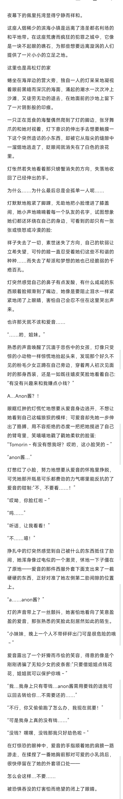

## 93

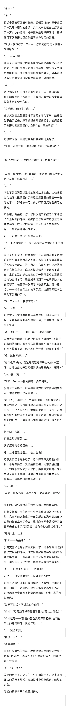

## 94

“我捏～”“呀！”预想中的侮辱并没有到来，反倒是灯的小鼻子遭受了一次恶作剧似的偷袭。突如其来的袭击让灯发出了一声小小的惊叫，她惊慌失措地睁开眼睛，正好看见了躺在旁边正低头捂嘴拼命憋笑的爱音。“噗噗～我不行了…Tomorin你真的好可爱～噗噗～哈哈哈哈！”“……anon酱！”知道自己被戏弄了的灯羞耻的简直想要找块石头钻进去，小脸红的像个熟透了的苹果。她又羞又急地想要阻止躺在地上笑的满地打滚的爱音，可不管她怎么努力爱音还是没有丝毫要停下来的意思。“呜……”阻止无果的灯倍感委屈的坐到了一边，像只鸵鸟一样把脑袋埋进了膝盖里，不想再去看旁边那个喜欢欺负自己的粉毛东西。“哎呦喂…笑的肚子痛……”差点笑到窒息的爱音好不容易才喘匀了气，她捂着肚子坐了起来，擦了擦眼角残留的泪水，试探着戳了戳旁边委屈巴巴的小企鹅:“呐，真生气啦？”“……”灯没有回话，只是默默地把脑袋埋得更深了。“哎呀，别生气嘛，难得我给你带了小礼物哦？”“………”“是小砰砰哦？不要的话我就把它丢海里了哦？”“…………”“哎呀，真可惜，只好丢掉咯～难得我花那么大功夫把它从祥子那拿回来……”“…！”听到了关键词的灯猛地从膝间抬起头来，她惊讶而激动地睁大眼睛看向了旁边笑意盈盈的爱音——在她的手中，那把独一无二的小砰砰正反射着闪闪的银光。不会错，就是它。灯一眼就认出了那把陪伴了她整个帮派生涯的砰砰，那把自己已经保养把玩过无数次的砰砰正在火光的照耀下显示出迷人的金属光泽，一如它离开自己的那天。可……可为什么它会在爱音手上？“咳，来源就别管了，反正不是我从她那求回来的就对了”看出了灯的疑问，爱音有些不好意思的咳嗽了两声:这砰砰可谓是相当来之不易，据某位不愿透露性命的八幡女士所说，祥子自从把它拿回手里之后就天天把它带在身上，晚上就锁进保险柜里谁都不让碰，宝贝的紧；好在在支付了一辆限量款的霜碧联名电动自行车后，爱音成功请到了一位乐于助人的猫猫帮手，在留下一张写着『物归原主，请勿挂念。——椎名立希上』的字条后，这把砰砰就成功来到了爱音的手中。“呐，Tomorin，快拿着吧～”“可，可是……”灯犹豫而不舍地看着爱音手中砰砰，明明近在咫尺，可她伸出去的手却畏缩不前，仿佛那是一块烧红的烙铁。“嗨，害怕什么，干咱们这行的就得抢啊！”爱音大大咧咧地一把将砰砰塞进了灯的手中:“祥子说收回就收回，哪有那么简单的事？抢了她重要的东西再赖着不还，她不就只能一辈子缠着你了嘛～”“这…这样不好……”“有什么不好的，我过几天还打算干soyorin一票呢！给她也抢过来当咱们帮派的压寨夫人，嘻嘻～”“anon酱…我……”“咳咳，Tomorin你先别急，先听我说。”

## 95

爱音清了清嗓子，她直视着灯充满迷茫和畏缩的双眼，难得的露出了认真的一面:“这几天，我明白了一个道理:的确不是什么东西都能用钱买来，但是用钱买不来的东西可以靠自己动手抢！一个人抢不到，那就叫上帮手一起抢！这就是帮派！既然说好了要组一辈子帮派，那只要是灯想要的东西，不管是什么我都愿意陪你一起去抢回来！”组一辈子帮派……只要是灯想要的……我都愿意陪你抢回来……这……这是难道是……告…告白？灯感觉自己像是触电了，身体开始不受控制的颤抖，像是在兴奋，又像是在恐惧，她想要说些什么，却哽咽着迟迟开不了口。她能感觉到自己内心的某个空洞正在被一种强烈的幸福感飞快的填满，甚至马上就要从眼眶中满溢出来——“anon酱！”“哎呦，抱抱抱抱，不哭不哭～哭起来就不可爱咯～”骗你的，灯你哭起来的超可爱的，我超喜欢的。假装安抚着扑倒在自己怀中彻底化身撒娇小哭包的灯，完全不知道发生了什么的爱音心满意足地在小企鹅的鼙鼓上摸了个爽，这才恋恋不舍的松开了自己不安分的小手:“别哭啦，还有个礼物要给你呢。”“还有礼物……？”“铛铛——就是这个！”爱音变魔术似的从怀里又抽出了一把小砰砰:比起那祥子支银色的砰砰，这支黑金配色的砰砰看起来就要高档的多，上面甚至还喷涂了席桑达诺芙的涂装，用品牌证明了它是一件高贵而致命的奢侈品。“好……好厉害！而且……很漂亮！”这个……是定情信物！还是好贵的那种！刚刚还泪眼汪汪的灯顿时就止住了眼泪，她用力的抽了抽鼻子，琥珀色的眼中闪烁着亮晶晶的光芒，兴奋地像是个看到了新奇玩具的孩子:“我…真的可以拿吗？”“当然可以啦～不过我有个条件。”“条件？”灯疑惑而好奇的歪了歪头:“是……什么？”“条件就是——”爱音的脸色突然严肃起来:“它和你手上的那支砰砰，只能二选一。”“……我全都要。”“你说什么？！”“我全都要！”重新鼓起勇气的灯毫不犹豫地把手中的砰砰对准了爱音:“把砰砰，全都交出来！爱音和祥子，我哪个都不要放弃！”“好！你，过关！”皎洁的月光下，少女们开心地相视一笑，这支本该死去的的无名帮派，在灰烬堆中重新燃起了炽热的火苗。她们的故事将从今夜重新开始。

## 96

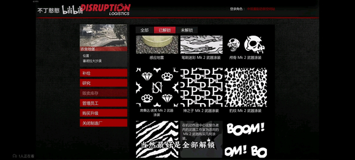

