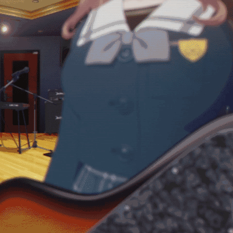
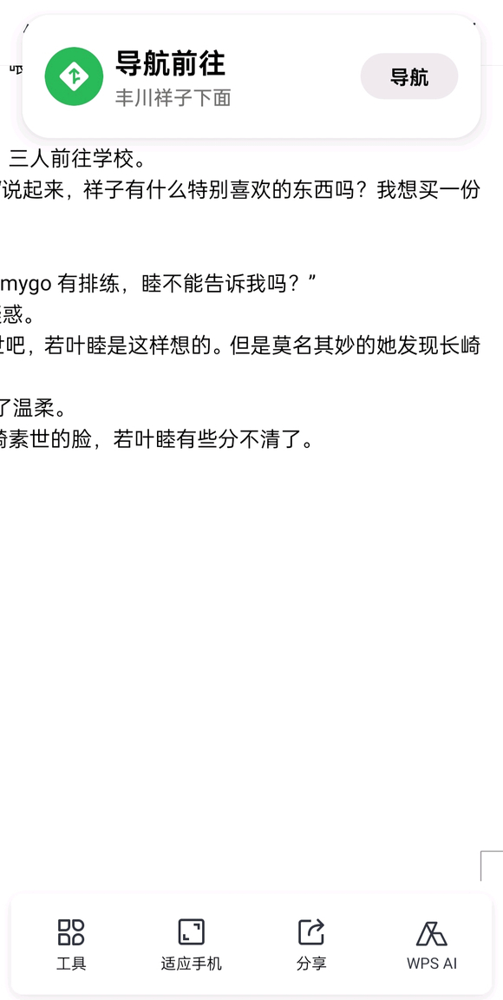

 ---
title:  若叶睦报复千早爱音
tags: 
  - 爱人TV
  - 已完结
date: 2025-02-11 22:12:40 
copyright_author: 钝嘴若叶睦
copyright_url: https://tieba.baidu.com/p/9296676368?see_lz=1
copyright_author_href: https://tieba.baidu.com/home/main?id=tb.1.c6e50408.vv8j5siZCKCMyi1Gf7DeQQ?t=1732281590&fr=pb

---

# 【图片】若叶睦报复千早爱音【邦多利怀孕吧】_百度贴吧

**作者:钝嘴若叶睦**

## 1

第一次在云吧发帖，原因是前几天看唐笑宗唐笑的时候，虎牙咬到嘴，口腔溃疡了
全文省流：若叶睦在看到爱音将素世拐走后彻底黑化，与祥子、素世等人大do特do，攻略完爱音后将她做成活吉他弹奏春日影  

## 2

1若叶睦坐在开往辅导班的黑色轿车上，心里不住又一次回想起那天晚上素世对祥子的跪地哀求，“我什么都会做...”。
素世的心碎，祥子的厌恶，作为半身与友人，若叶睦又是以怎样的心情看待这件事？若叶睦只知道那天晚上以后，她从夹在两人之间的传话筒与受伤者变成了一个似乎不存在的无关者。手中漆黑的手机与久无通讯的line都在提醒她着这个冰冷的事实。
从冰冷的回忆中挣脱，若叶睦看向车窗外，希望熟悉的景色能缓解她心中那自己都无法描述的滋味。她看到了，看到了明亮的街道上，熙攘的人群中，粉色长发与亚麻色长发的少女正动作亲密。
黑色的轿车快速行驶，粉色与亚麻色的靓丽长发在若叶睦眼前掠过,像两团鬼火。  

## 3

2千早爱音,若叶睦并不了解这个人,只知道她是mygo里一个水平很烂的吉他手，明明站在舞台边缘，却爱摆很多奇怪的姿势。
现在在黑色轿车上，若叶睦看到了她与素世的亲密行为，若叶睦清楚的知道,随着轿车的行驶，自己与素世的距离将越来越远，而她们两个人的嘴唇也将越来越近。若叶睦握紧了拳头。之前千早爱音与素世的亲密行为、几天前素世在公园中的跪地祈求、还有更早之前素世对自己的温柔......过往的记忆一幕一幕的在若叶睦心中回放。
“真是满脑子都只有自己呢，素世。”若叶睦决定报复天生邪恶的粉毛小鬼,并且改变这一切。接下来的一天，她在心中暗暗打算,制定计划。  

## 4

3躺在床上,若叶睦面色平静,不知在想些什么。长崎素世，曾经是一位如她妈妈一样的女性，说着苦来兮苦，却转身进入了新的乐队；说着什么都愿意做，却转身去找不知道哪里冒出来的粉毛小鬼。
“我已经失去素世了，不能再让祥子被不知道哪里冒出来的大狗夺走。并且，我也想知道素世是否在欺骗。”抱着这样的想法，若叶睦下定了决心。
首先找父母谈话，拿回了自己的剩余时间。之后用zi ben的一点小小的任性将祥子从客服公司辞退。面无表情的想象着祥子的疲惫、无力、难过，若叶睦在祥子回家的必经之路上等着祥子。  

## 5

接下来剧情开始进入第一个高潮。  

## 6

4昏黄的路灯映照着有些破旧的道路，也映照着若叶睦青色的长发。路灯一下一个蓝色长发的脆弱身影，低着头,慢慢的向若叶睦走来。
当祥子的目光看到若叶睦的脚尖，她终于抬起了头。
出现在若叶睦面前的是一双红肿的眼睛，还带着泪痕。祥子看到面前的人是自己的半身,有些吃惊，急忙整理好自己的有些凌乱的衣服，头发。
“噗嗤”若叶睦忍不住笑了，伸出手擦拭祥子脸上的泪痕与眼眶红肿的部分，“祥子，今天下班，很早呢。”本快要忍不住扑到若叶睦怀中哭泣的软弱祥子听若叶睦的话一下子便si去了。她下意识的挺了挺腰，神色中带着大小姐特有的礼仪与优雅。只是她的半身还将手放在她自己的脸上。于是，若叶睦眼前被昏黄光线所笼罩着的蓝色小章鱼显得有几分可爱。  

## 7

5丰川祥子对若叶睦的话有些生气,但马上便想到若叶睦本身便是如此，也就不再在意了。但是若叶睦是故意的,故意的想要唤起祥子的自尊,配合现实的重担，肉体的疲惫，彻底的将眼前的半身压垮，收入囊中。
“很困难吧，”若叶睦再一次开口了，“我给祥子转了钱。”
如果说对于若叶睦之前的话仅仅是有些在意，那么丰川祥子这一次对若叶睦所说的话便达到了愤怒的地步了。她甩开若叶睦放在自己脸上的手,用眼睛狠狠盯着自己面前始终面无表情的少女。
“祥子的手，很冰...”
“少在那里高高在上了！你懂什么？”丰川祥子能够接受他人无来由的刁难，能够面对曲折残酷的现实，能够忍受肉体无休止的疲惫。但她无法接受自己半身的不理解与怜悯。
若叶睦看到了丰川祥子因在意丢掉礼仪风度的激动表现，由衷的感到高兴。因为她知道自己马上就能走进并且占据面前这位蓝发少女的内心。  

## 8

6丰川祥子激动的话语随着内心的疲倦喷涌而出。而若叶睦始终面无表情的听着,看着，直到丰川祥子因疲惫而停下。若叶睦继续看着她。
丰川祥子的情绪随着话语释放后，看着若叶睦的眼睛，她感到空虚且无所适从，不好意思的转过脸去。
若叶睦伸出双手将丰川祥子的脸重新掰正，并将脸贴了上去，以封住丰川祥子逃跑的视线。欣赏了一会儿祥子美味的表情并感觉祥子快要坏掉之后，她开口了：
“我是姐姐。”
看着若叶睦的眼睛，丰川祥子终于忍不住，趴在若叶睦的怀里哭泣着，长期的身体疲惫与心理压力让她在若叶睦温暖的怀中睡了过去。
若叶睦将丰川祥子抱回自己的轿车内,让司机开回了自己的家。抚摸着怀中的蓝色长发，她想到自己马上就能占有丰川祥子，不由的轻哼起了春日影。  

## 9

写下船戏，为了过审可能会有点抽相  

## 10

7若叶睦将箱子搬到床上，并轻柔的去除其外部装饰。她把头俯下，看向箱子口，用手指一遍遍划过，最终才将它打开。箱子口很小，手指搭在上面能感受到其传来的温度。若叶睦将手指伸入，手指上的茧与箱子内表面上的木刺轻轻摩擦着。箱子因形变发出了微小的声音。
若叶睦感觉到自己的手指出汗了。她将手指抽出，像是箱子中有股力量在推着她。她看了看手指，汗出其意料的多。
看着丰川祥子逐渐红润的脸，她不禁轻轻呢喃道：“素世...”。
如果长崎素世知道自己这根手指探索过什么样的地方，会跪下来亲吻它吗？
若叶睦感到由衷的开心与满足，这是漫长生命中她从所未有体会过的。在内心的想法的驱动下，她伸出了自己圆润紧致的大腿，用足被颠了颠箱子。
丰川祥子还在熟睡。
若叶睦的手指继续深入箱子内部,用春日影的节奏狠狠的敲打着。这首曲子与它的创作者很快一同迎来了高潮。
若叶睦轻呼一口气，气穿过了箱子，也穿过了两座丰川。两座丰川在时间的快进下剧烈的进行地脉演变。看得出来，这个星球的地心一点也不平静，随时都有可能迸发出一轮又一轮的岩浆。若叶睦始终承受容纳享有着这一切，直到这漫长的地理活动终于结束。
轻拭去箱子内外的水汽，丰川祥子与若叶睦两人肌肤贴紧，拥抱入睡。  

## 11

8当上午的阳光将宽大的双人床铺满，丰川祥子睁开了双眼，身下是若叶睦的睡颜，青色与蓝色的长发如它们主人的双腿般交叉在一起。
装睡了好一会儿的若叶睦终于张开了眼，看到丰川祥子正红着脸看着自己。两人都没有说话，或许是在享受昨夜欢愉的余韵，或许是仅仅在欣赏对方熟悉的脸。
随着若叶睦的轻柔抚摸，丰川祥子撑着的身躯又软下去了。她一边享受着对方的抚摸，一边思考着要怎样面对这段关系。
事实上，在昨晚当若叶睦将她送回家时，丰川祥子便已经醒来了。她并非有什么坏心思，只是想在半身的关怀下，继续多逃避一会儿。等到第二天醒来，她还是那个坚强的丰川祥子，继续面对现实的风雨。
但当她感到若叶睦脱下她的衣服时，她因疲惫与困意而本就迟缓的大脑一下子停顿了。回过神来，她已一丝不挂，只能感到若叶睦呼在她脖子上与发间的热气。
并未对若叶睦对自己的感情而感到惊讶，恰相反，因为若叶睦先前在她眼中代表怜悯的行为在此刻变成了表达喜欢与爱意的举动，这让她竟有些高兴。然而，她的高兴似乎早了些。
“素世...”
听到了这个不能说是不熟悉的名字，这下子，丰川祥子真的不知道自己该想些什么了。  

## 12

lz的口腔溃疡好了，所以写这篇帖子最原本的动力已经消失的差不多了。单但都开了，还是写完吧  

## 13

说一下人物和接下来的情节安排。
首先说一下若叶睦，她不只是单纯的木讷，也不是逆来顺受。而是更像是带有一种容易满足的形象。不然她也不会在mygo中当剑姬。所以在不ooc的情况下要她要把爱音做成吉他还是比较不可能的。但是这种人在受到严重刺激后，在把矛盾解决之前，她的行为模式，思想观念会受到很大的转变。这也是为什么我开头要让若叶睦看到长崎素世跟千早爱音有亲密接触的原因。当然这只是对角色的个人理解。  

## 14

所以要让剧情按原本的轨迹进展下去，必须让若叶睦受到比之前更大的刺激。已经得到的祥子被长崎素世夺走，如何呢？但是这样就无法将报复对象局限在千早爱音身上。所以要在若叶睦的视角中，以为是长崎素世做了，千早爱音也做了，但以为主要是千早爱音做的。而这前提是若叶睦与千早爱音双方对彼此有比较高的好感度。  

## 15

但是这样的话大祥老师的戏份会比较少，所以要还引入三角初华。但真要报复的话，那若叶睦也很难想到以活吉他的形式，所以还需要其他人影响。这方面就交给在意一辈子与喜欢收集物品的高松灯还有自由随性的猫猫。（大古队员被排除在外了）至于如何做活吉他，我觉得身为日本贵族大小姐的若叶睦，只要想知道，就一定会知道的。（但是我根本想不出来啊，我只是个普通的cn人）总之，接下来的剧情安排就是这样了。  

## 16

7内心的慌乱、身体的欲望、纠结的情感、被注视把玩又要强装昏睡的窘迫，所有的一切在丰川祥子的大脑中盘旋，让她一下子只能想到拒绝与接受两个选项。正当她想要继续思考。若叶睦灵巧的手指与春日影的致命节奏轻而易举的将这一切打断。于是，丰川祥子选择了接受。
现在，先入为主的丰川祥子打算继续之前的选择，但是她不允许是以这种方式。
“睦”丰川祥子把玩着若叶睦的头发“昨晚我没有睡着哦...喊着我的名字，再来一次吧。”
若叶睦激烈地回应她。
青春期的欲望总是如此频繁且热烈。  

## 17

10收拾完痕迹后，若叶睦与丰川祥子一起用餐。情感的浇灌让风川祥子愉快的享用着眼前的食物，而若叶睦则平静的多，不知道在想些什么。
若叶睦偷偷打量着丰川祥子。她明白自己的身体称不上多好，甚至算得上差。而祥子早年身为优生惯养的大小姐，之后又在为学业与工作劳累。可以说生理机能远非巅峰状态。但即使这样，昨晚与今早在床上她也只能勉强压制祥子。让丰川祥子这样吸收营养，以后自己在床上绝对不是她的对手。但是让小祥禁食则完全不是自己能做到的。算了，不去想了。
此时的丰川祥子眉角带笑，肆意的展现着自我与理想的光辉，若叶睦知道，曾经的白月光祥子已然回来了。
“睦，我很感激你为我做的，有兴趣重新组建一个乐队吗？”丰川祥子补充到，“是商业化乐队，人员我已经选定好了。我来担任键盘，吉他由睦负责，主唱是sumimi的初华......”
sumimi的初华？若叶睦对这个人有些印象，小时候她似乎是祥子的好朋友，对祥子似乎也很在乎的样子。若叶睦小口的吃着东西。
三角初华，我能利用你吗？  

## 18

11条件已经具备，若叶睦决定约素世出来见面。
消息已经发送，然而却迟未有回复。若叶睦有些失望，于是加了一句“祥子让我来见你。”
“真的吗？睦，真是太好了呢。”
“是祥子想要见我吗？”
“抱歉，上次都是我的问题”
“之前让睦夹在中间真是太过分了。”
“睦，拜托了，我一直都很想再见祥子一面。”
“如果能够好好交流的话，一定不会有之前那种事情发生的。”
......
大量的信息淹没了若叶睦的屏幕。手机闪动的光线却照不亮若叶睦沉默的脸。
没有回复，关了屏幕，若叶睦有点疲惫。  

## 19

受不了啦看了母鸡卡PV，木子米怎么砸个书都气喘吁吁的这样怎么大do特do啊这样只能成为❤️💢啊为了剧情发展，拿下素世后给她小开一下  

## 20

12咖啡馆内，长崎素世一个人坐在角落，桌子上摆了两杯红茶和一杯芒果汁。她的表情时而凄怨，时而激动。像是一位还抱有着期待的美妇人儿。
正要进入咖啡馆的若叶睦，看了看长崎素世桌子上摆的饮品不禁勾了勾嘴角。素世，你坐在角落，是在不安吗？提前点好饮品，是想宣誓主场地位吗？点了我喜欢的芒果汁。还有两杯相同的红茶，是想营造祥子对你的认同感？你的智慧......呵呵，恰可以被我利用呢。
停下了来观察长崎素世玩弄手指的频率后，若叶睦心中了然，进入了咖啡厅。
如何才能得到长崎素世？或者说如何处理长崎素世心中对丰川祥子的情感？若叶睦考虑过这个问题。去破坏，去争抢？不，都不是。若叶睦的答案是转移，暂时性的转移。她走进了咖啡馆，坐在了那杯红茶的位置。
在若叶睦的判断中长崎素世现在不安脆弱、神经质，这正是怀疑与胡思乱想的时候。但是如果素世将其情感转变成了激动与极端，若叶睦相信自己绝对招架不住。那么，现在要做的是用最尖锐的信息与话语让素世失去情感转变的能力。
黄瓜剑姬挥出了她的第一刀：
“祥子昨晚，和我表白了。”  

## 21

说一下若叶睦攻击力的问题。
重新看了一遍，感觉若叶睦攻击力确实比mygo中高了不少。但是在mygo中若叶睦说话从来都是无意的，她在说话的时候从来都没想过要攻击谁，但伤害却十分的高。也就是说若叶睦在mygo中从来没有开过技能，只是觉得开团了，应该出力了，所以a了两下。但现在若叶睦完完全全的是想针对素世，所以我觉得现在若叶睦的攻击力完全称不上高，技能才放了第一个。  

## 22

本来不想解释的，但我想到若叶睦之后的攻击力会更高，操作会更强，会从混子变成一v五，所以还是说一下  

## 23

13由于过于震惊，长崎素世的脸上没有出现过多的表情，只是瞳孔在不断的晃动着。而长崎素世快要恢复平静时听到了若叶睦的下一句话。
“祥子现在很幸福。”
若叶睦一边分析着长崎素世的心理活动，一边牢牢注视着素世的脸，不错过接下来任何一个美味的表情。素世绝对不会怪祥子，而她现在的情绪必须要有一个宣泄口。那么怪罪的对象便只有我和她自己。虽然不愿意承认，但若叶睦确确实实的明白长崎素世大概率会以自己作为怪罪的对象。
这样可不行，若叶睦心想，于是开口道：
“我也是库来西库的一员。”长期术士有些疑惑，为什么要突然说这句话。
“素世还有去过苦来兮苦的排练房吗？”长崎素世想到了什么，神情带有几分不可置信。
“那一天结束后的每一个月我都会去。”若叶睦很努力的移动自己的五官，尽力表现出一副失望的样子。
看到了长崎素世快要崩溃坏掉的脸，若叶睦想了想，还是把下一句话“素世，才是放弃苦来兮苦的人。”咽了回去。  

## 24

14完蛋，长崎素世不会这么软弱吧，看着比自己健壮得多的长崎素世，若叶睦顿感不妙，顺走旁边的芒果汁，打算开溜。
长崎素世冲了上来抓住若叶睦的手，膝盖向下弯曲，整个人的重心都快要靠到若叶睦身上，抬头看着若叶睦的脸，眼中满是泪花。
“睦，求你了，让我和祥子见上一面吧，我什么都会做的。”
“我心中一直装着古来西苦啊，祥子一定是误会我了，让我和她解释清楚吧。”
“睦，你一定也知道我为了祥子是有多么努力。”
“祥子，为什么...睦...”
若叶睦感受着素世手的温度、与柔软，心中在笑。
“素世今晚应该还和千早爱音有约吧？”不舍地甩开长崎素世的手，若叶睦回头“可别耽误了。”
若叶睦走了，只留下长崎素世一人失魂落魄地回到家。
喝着长崎素世买给自己的芒果汁，若叶睦走在街道上，“看素世的表情，或许她今晚真的与千早爱音有约。不会被我说对了吧？”若叶睦又重新吸了一口芒果汁，“那可真是太有趣了...”  

## 25

15躺在自家的沙发上，长崎素世双目无神。怎么办？怎么办？不，一定还有补救的办法。长崎素世决定相信自己的智慧。
我和我的两个前女友相互喜欢。一天，其中一个突然离我而去，但另一个还陪在我身边，并且她们两个还保持着联系。因为发现我和我的现女友交往，前女友彻底抛弃了我，和我的另一个前女友表白了。但是被表白的那个前女友还喜欢着我。现在我应该怎样挽回我前女友的心？
长期素食所带来的惊世智慧疯狂运转。
对，只要让睦也出轨就行了！这样祥子一定能原谅我！
长崎素世像是抓住了最后一根稻草。对，睦还喜欢着我，那个不舍的眼神绝对不会说谎。
迅速打开了搜索引擎，长崎素世噼里啪啦的敲着屏幕“姛间怎样迅速拉近关系？”
不断的翻找着，长崎素世的目光最终停在了一个ID名为弦卷心的用户回答上，她的脸一下子红了。不由自主地摩擦着双腿，长崎素世心想，真、真的要这样吗？
不，只要能挽回祥子，我什么都愿意做。长期素质的目光逐渐变得坚定。  

## 26

重新细拟了一份大纲。
先说好消息，剧情从开头到结尾一共只有9天。所以按道理来说应该是很快就能写完的。
再说坏消息，目前只写完了第一天的剧情  

## 27

本来一直在想怎么做活吉他，后来找了本贝多芬笔记看，感觉没什么帮助。之后又去网上找了大概70多张人体结构图。目前学到了第十八张，感觉挺有用，心里已经有点构想了之后还要去找吉他制作教程看真正写文的时间估计不多不过情节都全部构思好了  

## 28

16“哈？”看着屏幕中的信息，千早爱音有些无法理解。都这个时间点了才说有事，这不是单纯在耍她吗？为了这次和长崎素世的约会，千早爱音可是以自己的高端品味狠狠打扮了一番。
算了，都出来了，还是先逛逛吧。
千早爱音感觉有人在碰她的后背，转过身去，看到了一个青色长发，精致的像人偶一样的少女。
唔，好像在哪里见过她，千早爱音回忆。
若叶睦微微的笑了，将手上的纸与笔递到千早爱音的身前，“是mygo的吉他手千早爱音同学吗？”
啊？这是...签名？！迅速地将自己的名字写了上去，千早爱音的内心已经开始唐笑了。
接过纸和笔，若叶睦顺势拉近了与千早爱音的距离。
“哈哈，我是千早爱音，叫我爱音就行了。”
“若叶睦，是素世的朋友。”
若叶睦，千早爱音已经想起来了，长崎素世之前有给她看过苦来兮苦的成员照片，若叶睦正是其中的一员。
发现若叶睦的目光一直盯着自己身上的衣服，千早爱音唐笑起来，露出虎牙，“这是我特意挑选的衣服哦，可是约好的朋友突然没来，也不知道发生了什么。”说到这里，千早爱音的脸上恰到好处的表现出一份失落。
土爆了，糟糕的衣品。
“很引人注目呢，爱音。”若叶睦回应。
“诶，真的吗？”千早爱音脸上的唐笑已经无法控制了。
若叶睦，LOVE!!!
若叶睦与千早爱音就这样一起谈话、行走着。当然大多数时候都是千早爱音在说，若叶睦在听。若叶睦始终面色平淡，有时回以微笑，有时加以肯定。
天色将晚，两人就此分别。
怎么会有这么吵的人，算了，也还算不错。若叶睦打算回家，好好喂饱丰川祥子。
而另一边，千早爱音回到家中，躺在浴缸内，只有手臂与头暴露出水面。回想着今天和木子米酱的相处，双目看着天花板，脸上浮现出大大的唐笑。
试想一下，你是个有些爱慕虚荣的人，精心准备的约会被女朋友推了，转身却见到了一个想要让你给她签名的贵族大小姐，她的颜值完全不输于你女朋友。并且与其他人不同，她会肯定你的品味，认真倾听你的话语，甚至在一起走时都会默默地调整姿态，让你显得更加显眼。
她一定是喜欢我！千早爱音因脸上的唐笑逐渐扩大。  

## 29

17已经入夜很久了。若叶睦看着丰川祥子的睡颜，有些无奈。祥子越来越难以满足了，一开始祥子娇羞、生涩、欲拒还迎，她还会轻柔地推着祥子的屁股，鼓励祥子。到现在祥子反而隐隐占据了上风，一次结束后便马上发起下一次的邀请。人体的机能恢复得这么快吗？听着丰川祥子幸福的梦呻，若叶睦有些为自己的未来担忧。
“呼，”若叶睦拿起手机，搜索“姛如何提高性能力？”没有找到什么让自己满意的回答，若叶睦有些失望。正当她打算放下手机，邮箱中突然发来一封邮件。
“弦卷心？”打开了邮件，里面却是空白。
算了，先睡吧。若叶睦抱紧了身边的丰川祥子。  

## 30

18月之森菜园内，若叶睦惬意的给黄瓜浇着水，静候长崎素世的到来。
此时长崎素世把玩着手指，目光坚定，迈步进入菜园。
祥子，等着我，我将以我的智慧令局面幽而复明。
长崎素世从身后抱住若叶睦，发起了冲锋。
“睦，我喜欢你。”
轻轻晃动着上半身，长崎素世决定诱敌深入。
“睦，能跟我走一趟吗？我有些话想跟你说。”
长崎素世拉着若叶睦的手走进了教学楼，算好距离，将若叶睦拖入卫生间内，转身、关门，一气呵成。
急急急急急，为了挽回丰川祥子，长崎素世诱敌深入，以身为饵，踏（走）入（向）歧（正）途（轨）的她，是否能够美愿成真？在前方等待着她的，究竟是孔明神算无遗策，亦或是周郎妙计天下安？
危危危危危，遭遇长崎素世疯狂进攻，若叶睦是否能继续谱写黄瓜剑姬辉煌战绩。她即将面对的，是16岁jk未亡人，还是下药强建沙人犯？在丰川祥子与长崎素世的夹缝间，若叶睦是否能如愿以偿？
惊世智慧妙计显，黄瓜妖精败势垂。
月森双人斗赤壁，谁胜谁负亦盟归？
下一回，赤壁之战。
﹉﹉﹉﹉﹉﹉
（普通和理所当然是什么呢？......）  

## 31

偶遇突发舟瘾，拼尽全力无法战胜因菜鸡操作暴毙文只写了一点  

## 32

19（私设：为方便起见，月之森厕所马桶为坐式。）
长崎素世将双手搭在若叶睦小臂上，身体重心前压，轻柔的亲吻着若叶睦的嘴唇，顺势将若叶睦按在马桶上。若叶睦顿觉不妙，但身体已领先思维反应。情急之下，若叶睦想利用灵活的手指打出优势。然而长崎素世隐隐发力若叶睦的双手锁于身体两侧。尝试无果后，若叶睦无奈，只好选择顺着惯性将双腿夹在长崎素世腰间。
“啪”若叶睦脚跟碰到门板的声音在空旷的厕所里清晰可闻。
趴在若叶睦的身上，长崎素世的目光如蛇一般阴冷。
“睦，不想和我教培吗？”
长崎素世过于直白的话语让若叶睦感到有些害怕。察觉到若叶睦身体突然有些僵硬，长崎素世迅速抓住机会，双手攀上山峰。
拿下优势后长崎素世一改策略，以平生最温柔的姿态服侍着眼前的少女。舔嘴唇，吸舌头，点鼻尖，长崎素世用看祥子的眼神看着若叶睦，双手在她身上游走着，最终把住了若叶睦的屁股。
若叶睦舒服的发出了轻哼。  

## 33

突然想到一个笑话：若叶睦b be like
  

## 34

20昨日之仇，如芒在背。长崎素世眼中精光大放，却仍不动声色，缓缓俯下身去，派一叶小舟驶向江心，假意献降，实则是要拉开赤壁之战的序幕，以达到动摇若叶睦对丰川祥子长期占有的战略意图。
察觉到长崎素世的暗地动作。若叶睦如梦方醒，急忙用双手制止。
牢牢占据天时地利的长崎素世怎会让若叶睦如愿？先是小舟轻棹，迅速深入，后号令左右，左翼军力攀上敌军旗头，令旗杆摇摇欲坠，以弱敌心；右翼军力从水下探出，掀翻敌军船支，以阻其势。
长崎素世随即发起攻势，一方面兵力迅速进入敌方船体内部，一往无前，是为德；（甲骨文中的解释，不多细说。）另一方面，一手紧托若叶睦船体，掌控敌方重心，是为权。
若叶睦的枕骨紧紧抵在马桶水箱上，上半身在半空中绷成一条射线。随着长崎素世的猛烈进攻，这条射线一起一伏。大腿、小腿、脚掌、指尖，射线不断延伸。
随着船体的颠簸，若叶睦舰体涌入大量液体。见小有斩获，长崎素世起身将若叶睦双腿掰成一字，又俯身而下，惊世智慧在两座山峰之上分别开设法坛，于山顶舌尖轻点，72种咒术轮番施展。108种魔咒一齐进攻。很快，若叶睦浑身上下迎来了一股被东风席卷的畅快感。
江东盟军当即欢呼，“孔明！孔明！孔明！”  

## 35

有点事情，没时间写，不过已经解决了  

## 36

21见江心已经被长崎素世冲杀的落花流水，若叶睦紧咬牙关，一手紧捏马鞍，一手死抓亚麻长鞭，想要奋起厮杀，夺回胜局。
然而，长崎素世又岂是等闲之辈？舌尖从若叶睦肌肤划过，奔向主战场。随即长枪破开水花，分出条条银丝，泛起白沫阵阵，破开层层包围，真是常山赵子龙在世，水浒玉麒麟转生。若叶睦落入败绩，满身狼藉，意识迷离，好似被打入水中，只能随着浪花起伏。
若叶睦没抓紧马桶边缘，好让自己的意识不被流水冲走。
“sa...ki...sa...ki......”
听到若叶睦的呢喃，长崎素世如丧批考，小脸猛地绷长，猛地皱起，又猛地张开。
“为什么！为什么要叫祥子的名字！”
停止了进攻，长崎素世看着那张无辜的脸，内心索然无味。
看着长崎素世将抱起的自己放下，若叶睦才意识到自己好像说错了什么。
“soyo...”
“睦，不是睦的错哦。”长崎素世取出事先准备好的校服给若叶睦与自己换上，然后握住若叶睦的手，“睦，我喜欢你，和我在一起，好吗？”若叶睦点了点头。
“睦，让祥子不要拉黑我，好吗？”
“嗯。”
长崎素世离开了，留着若叶睦一个人坐在马桶上。
啊，人生的意义是什么呢？普通与理所当然......  

## 37

22放学了，离开月之森的路上，若叶睦遇到了一个戴着黑色口罩的黄发斗篷人。斗篷人给了她一个试管，什么都没说，便走了。
若叶睦接过试管，试管中液体透明，贴着的标签上写着姛王试剂，产地：邦多利云吧。若叶睦的手机这时接收到一条好友请求。看看id，正是卷弦心，若叶睦没有犹豫，点击添加，打开试管喝了下去，竟一下就觉得身体强壮了几分。
还抱着几分对人生意义的思考，若叶睦在街上随意走着，不知不觉到了RING。
若叶睦决定进去坐坐。
进去后，若叶睦静静的发着呆，直到一张带着白色短发异色瞳孔的可爱小脸从桌子边缘探了出来。
“好闻的味道，熟悉，抹茶巴菲。”
若叶睦有些疑惑。
“想要。”
原来是那种随心所欲的人，若叶睦明白了。
随心所欲啊......听起来好像不错，暂且试试吧。
若叶睦决定点单。店长有些忙，让椎名立希出来接待。
“要什么？”椎名立希开口。
服务员都不知道要微笑吗？
“两杯抹茶巴菲，一杯正常。一杯杯底要涂上一层0.3cm的抹茶，再倒入杯子1/10高度的纯牛奶，倒入碎冰砂，中间用奶盖隔开，再倒入杯高3/10的浓咖啡，撒上3克薄荷叶碎末，加上7勺芒果汁。最后，不要巴菲。还有，牛奶要热的。”
“哈？”椎名立希很认真的记录着，但听到最后一句，有些绷不住了。
“噗嗤”
“有趣的女孩子。”
“那算了，将那一杯换成热开水吧。”
回味着椎名立希美味的表情，若叶睦发现随心所欲似乎也挺不错。
椎名立希去制作饮品了。要乐奈也离开了桌子，接过店长递过来的吉他，开始即兴演奏。
若叶睦静静听着小猫的演奏。轻轻的鼓起掌，然后拿过要乐奈的吉他，也同样即兴演奏起来。
“有趣。”小猫加以肯定。
“吉他很旧呢。”
“奶奶留给我的。”
“很重要呢，用坏了怎么办呢？”
“不会坏，吉他，一辈子。”
一辈子...吉他...不会坏...若叶睦陷入沉思。
起身抱住了要乐奈，在她脸上亲了一口，若叶睦离开了，没有付钱。
“哈？”远处有声音传来。  

## 38

剧情已进行了两天，若叶睦思想开始转变。  

## 39

23躺在沙发上，长崎素世双眼看着手机屏幕。
“取消拉黑的事，睦跟祥子说了吗？”
“嗯”
长崎素世连忙坐起来，给自己打上马后，将在学校中和若叶睦教培的视频发给了丰川祥子，盯着手机等待祥子的回复。
一个小时过去了，手机毫无反应。
长崎素世好像明白了什么，又慢慢躺下了，身体颤抖着，面露不安，最终将脸埋入沙发。
空旷的屋子内回荡着少女的哭泣。
街道上，若叶睦拿起了手机，是邪恶的粉毛小鬼发来消息。
“呜呜呜，睦，刚刚我约素世出来玩，莫名其妙又被她骂了。”
“睦现在有空吗？一起来逛街怎样？”
“好的。”若叶睦答复。
两人玩的很愉快。
临别时，千早爱音有些脸红，“要一起去我家玩吗？”  

## 40

24看到若叶睦发来的晚上晚点回来的消息，丰川祥子有些生气。
素世还在烦着睦吗？可恶，要不是最近有乐队的事情要忙，不然...
（千早爱音家中）
千早爱音与若叶睦红着脸，一起泡澡。两人侧躺着，脸对着脸。
若叶睦陷入了沉思，千早爱音硬是把她拉过来，后一句话也不说，就在那一个劲的笑，笑完了就在那闭着眼脸红。
想到两人现在正在泡澡，看着一动不动的千早爱音，若叶睦决定帮帮她。
原本闭着眼睛唐笑的千早爱音，睁开眼睛，看着若叶睦的脸，然后继续唐笑。
突然，扑通一声，千早爱音跳了起来，溅起了阵阵水花。
“哇——！”千早爱音逃跑了。
“啪——！”千早爱音摔倒了。
“啊...睦...痛...”千早爱音摆出了大小眼，直勾勾的望若叶睦。
擦好身子后，若叶睦憋着笑，将千早爱音抱到了床上。
“爱音好好休息吧，今晚玩的很开心。”若叶睦准备走了。
若叶睦离开后，千早爱音一边唐笑着，一边在床上打着滚，随即又懊悔自己今晚为什么没和若叶睦表白。
睦一定会同意的！  

## 41

25若叶睦家中，丰川祥子坐在桌子前，桌上摆着两杯芒果汁，祥子在等待睦回来。
轻微的开门声传来，若叶睦回来了。
两人做着，喝着芒果汁，聊着天。
灯光一束接着一束，轻柔的探进玻璃杯内，抚按着内部的汁水，在吮吸的作用下，它们在吸管内缓缓向上攀爬着，最后又一股股无力的落下。感受到汁水的甜美，品尝者在吸管头留下了深浅不一的咬痕，芒果汁被挤按着，从舌尖流向唇，最后又被舌头灵巧的拨了回来。轻盈的笑声溢满了桌面。长勺在杯中旋转着，有时触碰到杯壁，发出沉闷的声响。芒果粒随着被长勺带动的涡流旋转着，叫喊着，高于水面的想沉下去，低于水面的又想浮出来。偶有一两颗果粒从涡流中跳了出来，又立即落了下去，只是使得滴滴果汁洒在壁上，在灯光映照下，它们的表面流露出五彩的光泽。
随着汁水的减少，果粒渐渐触碰到了杯子底部。相互清理好杯子，两人将它们叠在一起，放入柜子中。
关上灯，丰川祥子与若叶睦入睡了。  

## 42

菜就多练，接下来教培浓度较高  

## 43

26第二天，睦又被长崎素世拖到了厕所内，两人的姿势与昨日相同。
“睦...昨天和祥子说了吗？”
“嗯...”
“呲...有在撒谎吗？”
“不...啊！是...”
“到底嘶是是...还是不是呢？”
“是是...”
“那为什么我给祥子发消息她没有回呢？”
“不，知道嗯，我已经和祥子说了...”
“呼——，没关系，噏——，不是睦的错哦——”
......
“对了，祥子是怎么回应你的？”
“她说...让我不要理ni..哼...AaaaAaayiiiiqaa——Yyi！yi！yi!!yi!!y!!！——八嘎，八嘎!!!!——哈，哈，哈...哈...”
“呼，睦，知道错了么...”
......
“...嗯...”
﹉﹉﹉﹉﹉﹉﹉
月之森一天轻松的学业很快就结束了。  

## 44

终于把第三天的写完了。  

## 45

27放学了，若叶睦准备回到家中，却见长崎素世拦住了她。
“睦，我能去你家里吗？”
若叶睦停在原处，沉默着，没有回答。
“睦昨天不是答应了我的表白吗？女朋友间一起住不是很正常吗？”长崎素世看着若叶睦的眼睛，露出笑容。
若叶睦仍然沉默着，只是把头低下了，不知在想些什么。
“睦一定要我说清楚才明白吗？”长崎素世一只手轻柔的挽住若叶睦，另一只手捏了捏自己的裙子，感受到藏在里面的麻绳与刀片，内心渐渐平静下来，注视着若叶睦，脸上露出温柔的微笑。
一路上，两人都没有说话，就这样到了若叶睦家。  

## 46

因为某些原因，暂时停更但应该不会停很久  

## 47

28“睦，家里有人吗？”长崎素世手指把玩着裙下的麻绳，另一只手用手指摩擦着若叶睦的股间，打量着睦的家。表情有些微妙。
见若叶睦点了点头，长崎素世再一次露出温柔的笑，“睦，我们去你房间吧。”
“会被人发现的，xiang...”
“sodayo，睦小声点不就没事了吗？”
“但是...”若叶睦拒绝着，把长崎素世带到了自己房间。
进入房间后，长崎素世把若叶睦扑到床上，将裙底的麻绳，刀片放到一边，用力亲吻着睦。
“祥子，唔，祥子...”长崎素世贪婪地释放自己的欲望。
“不要...”若叶睦挣扎着。
“怎么，睦不想要吗？”长崎素世一只手伸入若叶睦的衣服下，另一只手穿过若叶睦的裙底，极其粗暴的撕开了若叶睦的衣服，也顺便解开了自己的。
“睦不想要的话，随时可以叫哦，我是不会拦着睦的。”
若叶睦闭上了嘴巴。
感受着若叶睦身下的湿润、温暖、张合，长崎素世继续进攻着，然后猛的停下。
看到若叶睦困惑的眼神，长崎素世温柔的笑了，“睦，这两天都很舒服吧。嗯？别着急，这只是一点点小惩罚哦。看到旁边的绳子了吗？我不会用它来捆你，但你如果特别想要，手在身上乱摸被我发现的话...呵呵；看到这个刀片了吗？你如果不满，随时可以拿起它来捅我，我不会躲，更不会防...”长崎素世将一旁的刀片麻绳轻轻放到若叶睦的脖子上。
“素世，坏掉了...”
“闭嘴！”  

## 48

29随着长崎素世的进攻，若叶睦意识逐渐模糊。
“哈，好湿，素世是在流泪吗？”
长崎素世没有回答，只是像西西弗斯一样一遍又一遍的重复。
然而，锁起来的房门被打开了。
蓝色的头发，幸福的微笑，浑身好像散发着白光。门外站着的人分明是丰川祥子。
“睦，你...长崎素世！你在干什么？”
听到了心心念念的声音，长崎素世感到自己的舌头被夹紧了，惊喜，高兴，然后是...恐惧。庞大又复杂的情绪在长崎素世的脑海中冲刷着。
长崎素世没有反应，任由丰川祥子用若叶睦脖子上的麻绳将她绑了起来。  

## 49

30若叶睦彻底忍不住了，将丰川祥子扑倒在地，幸运的是丰川祥子的后脑碰到了长崎素世的脚背，并没有受伤。
此时的若叶睦皮肤通红，原本柔顺的长发杂乱的披散在身上，两只手死死的抓住了丰川祥子的手腕。
“不要啊跌丝哇！”情急之下，丰川祥子伸出两只脚，一只脚掌抵住了若叶睦的腹部，一只脚掌抵住了若叶睦的下巴。
身体感受到了来自腹部的挤压，若叶睦强压下去的欲望随着身体的抽搐而喷发，脸上的潮红褪去了微不可查的一抹，而身体的动作却更加的疯狂了。
若叶睦低下头啃咬着眼前被白色袜子所包裹的脚。嘴巴与袜子接触的部分很快出现了阴影。
丰川祥子死命的把头往后抵着。长崎素世感受到脚背传来的痛感，有些心疼风川祥子的后脑，尽力的把脚尖踮起，好让丰川祥子的脊椎更舒服些。
“不要啊睦，等我把袜子先脱下来啊跌丝哇！”
若叶睦用牙齿把袜子脱下了，随口将它们甩开。口中吐出的热气喷洒在丰川祥子红嫩的五指与饱满的脚掌上，与丰川祥子脚掌上传出的浓郁香气形成对流。空气中传来的些许酸甜让若叶睦忍不住想好好品尝。
此时丰川祥子另一只脚掌竟发力将若叶睦下身抬高，而若叶睦身为芭蕾高手，凭借极强的平衡本能，膝盖前顶，夹住了丰川祥子的脚，重心顺势下压，吞吐着眼前的佳肴。长崎素世不堪承受，踮起的脚尖又放下了。
丰川祥子的脸已经红成一片，一只脚继续发力，让若叶睦不要倒下；另一只脚五指紧缩着，夹住了若叶睦的舌头与嘴唇，脚掌向前抵着，推着若叶睦的下巴，然而动作却异常的轻柔。
被绑着的长崎素世看着眼前的一切，双目逐渐失去高光。
若叶睦继续品尝着丰川祥子的脚，红润的五指像刚出壳的凤凰，扑腾着翅膀，散发着青春与健康的温暖；被仔细打理过的指甲触碰，挤压，摩擦着口腔内壁，又在即将深入时猛的收回，传达出主人内心的羞涩与温柔；舌尖轻柔的划过脚掌因发力而出现的褶皱，调皮的挑逗往往伴随着出乎意料的乐章，连绵的呢喃深邃、神秘、又绝美。
若叶睦贪婪的占有着，突然间她的背弓起来了——丰川祥子的另一只脚伸入了她的密地。
像是彗星如约地划过天际，若叶睦被满足了。  

## 50

看了母鸡卡新op，太美味了，真的是太美味了。我要颠起来了，颠颠颠颠颠！我要写文，我要写文，我迫不及待的要去写文了，哈哈哈哈哈！  

## 51

31“睦，你是说，素世她对你做了那种事...”丰川祥子一只手把玩着肩上的长发，“唔，听起来很有趣呢...要不我们今晚也试试。”
“啊，对了，我现在有事，要来不及了，素世就托你照顾了。”丰川祥子准备回房间换好衣服，去和接下来的母鸡卡主唱见面。
看着丰川祥子离开，若叶睦解开了素世身上的绳子。
长崎素世的双眼依旧无神，只是在不断颤抖着，提醒着若叶睦她还活着。若叶睦将脸凑过去，观察着长崎素世的双眼。眼前这双好看的眼睛好像逐渐恢复了光泽，只是瞳孔好似更加涣散了。
长崎素世的嘴巴突然猛的张大，向若叶睦的脸咬过来，若叶睦躲开了，但是一缕长发被齐根咬下。
长崎素世趁机往床边冲去，拿起床上的刀片，刺向自己的脖子，闭上了眼睛。
动脉被破开的鲜血，神经被切割的疼痛，愧对母亲的迷茫，生物电紊乱的抽搐，气体停止运输的失氧，信念与血液一同流逝的无力，不堪承受，再也无力站起，躯壳破碎，内心向外溢出......
预期的一切...都没有出现，若叶睦抓住了长崎素世的手，静静的看着她。
从未见过的情况，内心牵挂的友人，无法共情的情感，得体优雅的教育......若叶睦想要关心、劝慰长期术士，而过往生命所拥有的一切都在拼了命的于她的脑海里叫嚣着，阻止着。最终，若叶睦露出了笑容，希望能以此帮到长崎素世。
长崎素世跪下了，埋着头，浑身颤抖，抽泣着。
“睦...瓦达西，让我去死吧...”
若叶睦脸上的笑容消失了，不再去看长崎素世，抬起头，无声的狂笑。
若叶睦将长崎素世重新绑起来了，捡起地上的袜子塞到她嘴里，确保不会发出声音，将她放入衣柜，又找来了一面单向镜子，挡住了长崎素世。
不顾长崎素世惊恐的目光，若叶睦打通了千早爱音的电话。
“爱音，来我家一趟好吗？我有些话想跟你说。”随后若叶睦拜托弦卷心送来一些小玩具。回房间快速地洗了个澡，等待千早爱音的到来。  

## 52

32千早爱音屁颠屁颠的跑过来了，蠢萌蠢萌的小脸蛋上还挂着笑。
“爱音，先一起泡澡吧。”若叶睦确保了长崎素世能够通过镜子看到她们两个，两人一起走进了卫生间。
长崎素世的手和脚都被绑起来了，嘴里塞着丰川祥子的袜子。若叶睦的口水，自己的口水，丰川祥子的汗水，还有两人教培所产生的液体，在她的嘴里混合着，发酵后的气味冲击着她的鼻腔。
湿透了，长崎素世这样想着，咽了咽口中混合的液体，看着卫生间的方向。
水流落在浴缸里的声音，冲刷着肉体的声音，还有肉体与肉体之间的碰撞挤压的声音......各种各样的声音从玻璃外的空间传来。刺耳又嘈杂的浪潮一波接着一波，混杂着两人甜美的交谈声与欢笑声。长崎素世只能透过玻璃看到虚掩着的门上，两道身影在交叠，在起伏。门前后晃动着，灯光照映在上面的影子也跟着在摇晃。
不知过了多久，长崎素世看到门被打开。两个没有穿衣服的人走了出来。确切的说是若叶睦一只手挽着千早爱音的腰，另一只手夹住了她的舌头，面无表情的和长崎素世对视着，走了出来。
千早爱音的头向后仰着，舌头却尽力的往前伸，嘴巴张开，露出大大的微笑与小小的虎牙，屁股紧贴着若叶睦的大腿，一左一右地摆动。
长崎素世看着若叶睦将千早爱音摔在床上，像扔一袋散发着恶臭的垃圾。
千早爱音的身体在床上蹦了蹦，幸福的笑声从口中传出，于长崎素世的耳道中回荡着。
若叶睦上了床，将千早爱音抱起，亲吻着她眯着的眼角与唇，又拍了拍她的屁股。
“转过去。”千早爱音听话的躺在了若叶睦身上。
朝着长崎素世的方向，若叶睦将千早爱音的一切展示给了她。
镜子中的长崎素世瞪大了双眼，咬紧了口中的袜子。她看到千早爱音的大腿慢慢的抬起，若叶睦的两只手一前一后不断进出着。
千早爱音发出了娇哼，一股又一股的水流射向了镜子中的长崎素世。
“爱音的声音很好听，还要来吗？”
“嗯，和睦一起，很幸福。”
“那这一次爱音得唱春日影才行。”
“啊？但是...”
“我会告诉爱音节奏的。爱音，要乖哦。”若叶睦停下了手上的动作。
“好、好吧...”千早爱音感受着若叶睦的节奏，唱出了这首她熟悉的歌。
“卡级坎哒，口口裸，抚路诶禄，妈呐咱兮，歇卡咦跌......”
若叶睦同样在她的耳边哼唱着，只是眼睛一直在看着镜中的长崎素世。  

## 53

未成年禁止观看未形成完善伦理观、价值观者禁止观看  

## 54

33千早爱音一次次地唱着春日饮，有些晕过去了。当若叶睦的手指从她的身体中抽出，千早爱音的嘴才缓缓合上。若叶睦拍了拍千早爱音的脸。
“爱音，晚上要留在我家吗？”
“不，不用啦...”千早爱音缓缓的醒过来，明白了自己在说什么后，心中有些后悔。
“行，我让司机送你。”若叶睦马上开口，立即帮千早爱音换好了衣服。
“路上小心。”若叶睦将千早爱音送走了，然后返回了自己的房间。用指关节敲了敲关着长崎素世的玻璃，随后把玻璃拉开，解开了绑着长崎素世的绳子。
长崎素世的身体缓缓滑下，蹲在衣柜的角落，阴影将她的全身上下笼罩着，只露出一小节膝盖，膝盖上是埋着的头，透过双手的缝隙，若叶睦能看到长崎素世眼睛的红肿。
若叶睦静静的看着长崎素世。
“祥子快回来了。”若叶睦观察着长崎素世，补充道，“不想我被祥子发现，让她伤心的话，就出来帮我洗个澡吧。”
没有反应。
“算了，你在里面静静吧。”若叶睦伸手把玻璃重新关上。
关到一半的玻璃停下了，一只手从衣柜里面伸了出来。
“我没说不去。”
长崎素世被若叶睦拉着起来了，停滞许久的血液突然间涌向大脑，这让长崎素世有些头昏眼花，同时房间内味道怪异的气体涌入了她的鼻腔，充斥着她的肺泡，长崎素世有些想哭。
两人进入了浴室。浴缸内，若叶睦与千早爱音先前用过的水还冒着热气。
长崎素世与若叶睦静静的看着。终于，长崎素世忍不住了，“换掉，难闻死了。”
“素世不喜欢爱音的味道吗？”
“我说了换掉！”
“素世，自己来吧。”
长崎素世脱下衣服，弯下腰，把水换掉了，一只脚伸入浴缸，身子慢慢蹲下，屁股、膝盖、背部，最终整个身躯被水流包裹。
等了片刻，长崎素世将头从水下探出，让开了身旁的空间，手在水面上轻轻的拍了拍，溅起了小小的水花。
见此，若叶睦也躺到了浴缸内。
长崎素世忍不住哭了，将头埋入水下。
“睦，吻我。”
若叶睦跟了上去。  

## 55

34“睦，你在吗？”当丰川祥子回来时，若叶睦房间的灯已经关上了，但浴室里面还透着光亮。门没有关，丰川祥子很自然的推开了门。
丰川祥子看到了若叶睦躺在浴缸的一侧，静静的看着她，肩膀旁一团亚麻色的长发浮在水面上，看上去像是一个人把头埋下去了，目光向下，能看到水面上露出的人体凹凸的曲线。
总之，刚推开门的丰川祥子看到了若叶睦搂着长崎素世，两人一起躺在浴缸内。丰川祥子打算离开了，或许她来的不是时候。
“祥子要一起来吗？”话音刚落，若叶睦便感觉自己的腰被素世勒紧了，脖子左侧的水面上不断地冒出水泡，让她的心有些痒痒的。
丰川祥子进入了浴缸内，两只手一左一右分别搂住了若叶睦与长崎素世的脖子。
浴缸内的水缓缓的向外溢出，三个人的澡总是洗的异常漫长与艰难，不过好在浴缸内的三人都对此报以非常宽容的态度。
“素世今晚要留在我家吗？祥子也在。”若叶睦开口，长崎素世很高兴的同意了。
洗完澡后，三人已是饥肠辘辘。不过素世和祥子谢绝了若叶睦的提议，决定自己做饭。天色将晚，精心准备了很长时间的三人才坐在餐桌前享用着丰盛的晚餐。
当晚，不熬夜主义者踏入了她所陌生又熟悉的黑暗，然而，这次面对她的并非一成不变的孤独。睦、素世、祥子三人玩了个通宵，等到精疲力尽，才决定一同上床睡觉。
当长崎素世与丰川祥子恰好入睡，若叶睦的手机响了，弦卷心发来消息。“小玩具已到，出来收。”若叶睦下床，打开门后被吓了一跳。
一个黄发斗篷人站在门口，身后是两辆大卡车，手上还拿着一本大约六七厘米厚的书。“使用说明，请收好。”
接过书，若叶睦随意翻看了一下，感觉这些东西已经在价值上超过自己家的庄园了，“放不下，而且我用不到。”
“这是个问题呢，不过这两天会在你家底下建一个实验室的。用不用得到嘛...你会有需要的。”
“happy...”弦卷心离开了。
若叶睦回到房间，抱着素世与祥子入睡。  

## 56

Ok，非常的顺利啊！本文的第一部分已经大功告成了，剧情的框架已经基本建立，重要人物基本都已入场。目前已经写了15000字了，第一次写文，感觉还行接下来剧情的方向转入温馨又治愈的日常环节最后顺利过渡到千早爱音被做成活吉他
首先，经过这四天的情节发展，人物的性格与思想经历了一定的变化：
1.若叶睦语言表达能力得到一定提高，行动力大幅度提升，道德水准大幅度降低。
2.丰川祥子精神状态大幅度提升，肉体强度大幅度提升，经济实力大幅度加强。
4.长崎素世抗压能力大幅度提升，惊世智慧大幅度加强，偏执倾向大幅度加强。
4.千早爱音幸福感大幅度提升，陷入热恋状态，智商小幅度降低，胸前装甲极小极小极小幅度增强。  

## 57

其次，三角初华即将入场可喜可贺，可喜可贺啊！我非常非常非常喜欢三角初华，三角初华伟大捏
但是，mygo中三角初华人物信息太少了，我也不想去看剧透，所以三角初华在我脑海中动不起来啊硬要写下去，我自己都无法接受
怎么办？怎么办？啊，怎么办啊？三角初华，快帮帮我啊...我最喜欢的三角初华
............
诶！！！！！
让我们把三角初华搞疯吧  

## 58

35丰川祥子早上醒来，发现若叶睦与长崎素世捏着自己的脸，在相互对视，发现自己醒来后，立即转过头，盯着自己看。
“你们两个都别想了，快去吃饭，然后上学。”
三人到了餐厅，长崎素世把提前做好的早饭端出来了。
“saki，我能喂你吃吗？额，当然，睦也会有的。”
听了这句话，若叶睦慢慢把手伸到了丰川祥子下面，丰川祥子开始轻哼起来。
“怎么了，祥子，不合你的胃口吗？”长崎素世发现了丰川祥子的异常。
“啊，没有，只是没想到素世做的这么好。睦，你也试试。”
若叶睦张开嘴，吃下了素世与祥子喂的食物，然后又模仿丰川祥子发出了轻哼。
“睦，不要搞怪。”
“嗯”
悠闲的早餐时光慢悠悠的结束了，三人前往学校。
上学的路上，长崎素世问若叶睦，“说起来，祥子有什么特别喜欢的东西吗？我想买一份礼物送给她。睦的话一定知道吧。”
“我可以陪素世一起去买。”
“但是我想单独去呢，因为放学后mygo有排练，睦不能告诉我吗？”
“素世还信任我吗？”若叶睦有些疑惑。
如果素世还信任她，那就告诉素世吧，若叶睦是这样想的。但是莫名其妙的她发现长崎素世的脸好像黑下来了。
“那就暂且一起吧。”长崎素世恢复了温柔。
自己是不是又说错话了？看着长崎素世的脸，若叶睦有些分不清。  

## 59

逆天
点击展开，查看完整图片
  

## 60

36放学了，长崎素世与若叶睦两人从厕所中出来，准备一起去RING。
在路上，她们遇到了千早爱音。
千早爱音乐乎乎的跟两人打着招呼，若叶睦点头回应，而长崎素世的表情有些不自然。
“素世有些不舒服。”若叶睦解释道。
“诶，那排练的事情...”或许是性格使然，千早爱音并没有疑惑若叶睦为什么要解释长崎素世的事，反而有些担心素世。
“没事的，毕竟要组一辈子乐队。”长崎素世的声音开始夹起来了。
千早爱音想与若叶睦好好温存一番，但看到长崎素世也在，便有些不自在；也想和长崎素世好好温存一番，但看到若叶睦也在，也有些不自在。
于是千早爱音一边苦恼着，一边等待长崎素世向她解释睦为什么要跟着她一起去RING。长崎素世没有理她。
三人间的气氛开始变得有些怪异。
“诶，这个方向，睦也要去RING吗？”看到被自己认为是队友的长崎素世毫无行动，千早爱音开口了。
“嗯。”若叶睦的回答很简短。
“诶，睦擅长什么乐器呢？”
“吉他。”
看着一直默不作声的长崎素世，千早爱音有些担心了，决定开一个小玩笑，“啊？睦不会是来取代我的吧？”
“sodayo”长崎素世察觉到了千早爱音的意图。
“啊？不要啊素世！说好了要go一辈子的！”
“从来没有那种事情。额，我是说取代爱音的事。”
“soyorin，love！”
就这样，三人间的压抑的气氛被千早爱音掰回了正轨，只是处于中间的若叶睦被夹子音轰炸的有些头疼。
终于，三人到达RING了。  

## 61

37若叶睦和长崎素世千早爱音一起进入了排练房。椎名立希与高松灯已经到了。
看着熟悉的人员，若叶睦想起了曾经陪祥子加入的那个乐队。
“野猫怎么还没来？”椎名立希注意到了若叶睦，“素世，这是怎么回事？”
“我知道，我知道，睦是来这里参观的对吧？这里就是mygo中大名鼎鼎的天才吉他手千早爱音的排练室。”
“哈？”椎名立希不敢相信。
“爱音？”高松灯十分困惑。
“唉，真是...”长崎素世很是无奈。
“噗呲”若叶睦有些难绷。
“哼哼，睦可是我的粉丝哦。”千早爱音非常得意的开口，等待着众人的称赞，却发现没有一个人理她，着急的跺脚。
这时，门开了，要乐奈拉着吉他走了进来，乐队开始排练。
若叶睦在一旁静坐着等待，在脑海中默默练习，提升自己的沟通能力。
排练结束了。椎名立希送高松灯回家，要乐奈不知一个人跑哪去了。若叶睦决定跟长崎素世去买礼物，却发现千早爱音已经跟了上来。
“嘿嘿，睦，我能跟着吗？”爱音幻想着即将发生的美妙的今夜，已经唐笑起来。
“爱音很需要练习吧？”若叶睦尽量采用了比较委婉的说法。
“欸”千早爱音一下子没反应过来。
“爱音如果练习有困难，明天可以来我家找我教你。记得把练习视频发给我，我会好好看的。”若叶睦和长崎素世准备离开了。
“啊，好吧。睦，今晚要给我视频通话哦。”千早爱音有些不舍。
“嗯。”  

## 62

38若叶睦和长崎素世走在商业街上，突然间若叶睦接到了封川祥子的电话。
“嗯，好。”等祥子将电话挂掉，若叶睦放下了手机。
“睦，怎么了吗？”长崎素世有些不安。
“祥子有事，让我过去。”
“祥子有事，我能帮上忙吗？”长崎素世拉住了若叶睦的手。
若叶睦沉默着，不知道怎么回应，手被抓的越来越紧。
“祥子不想让你去。”
“睦，我能知道是什么事吗？”来不及愤怒，长崎素世有些着急。
“我不能告诉素世。”
说完，若叶睦有些疑惑，为什么素世的表情这么奇怪，眉毛微微皱起，嘴部的肌肉还在向外张着，皮肤却已经收起。自己又说错话了吗？
没办法，只能撒谎了。若叶睦抓住了长崎素世甩开的手，将自己家的钥匙放在素世手上，后摸着素世的脸，用拇指轻擦着长崎素世的嘴角，让面部与视线保持平稳，注视着长崎素世的双眼。
“素世在家等我回来，我和祥子去给素世买礼物。”
稳住了长崎素世后，若叶睦去陪祥子和母鸡卡乐队主唱见面。  

## 63

天生就缺少情感，这种日常好难写啊，根本不会  

## 64

39若叶睦坐在餐馆内，身旁是丰川祥子，对面是三角初华。
丰川祥子与三角初华很高兴的在聊着，若叶睦静静的吃着食物，低着头，仔细听着两人的对话。
说实话，若叶睦从来不担心长崎素世会将丰川祥子夺走，因为素世从来没有真正的理解过祥子。但是，面对坐在自己对面的这个人，三角初华，若叶睦不得不打起了警惕，哪怕对于她的了解只有从入坐到现在的短短几句话，若叶睦任然可以断定这是一个相当难缠甚至可怕的人。
从在交谈中对主导者与跟随者的身份做出的自然让步与把控，再到倾听时恰到好处所显露的惊喜与看似在提问引出话题实则是在夸赞与表露关心...明明自己故意做出了些不合礼节的行为，而对方的目光却依然死死的锁在丰川祥子身上。害怕，还是恐惧？不，若叶睦的内心只有冷漠。
三角初华......若叶睦低着头，继续静静的吃着食物。
三角初华，我要怎么对付你？不，不需要是我。三角初华，你应该注意到了，由于我刻意表露的沉默，即使在和你说话，祥子的注意力大部分也放在我身上。一直盯着箱子的你不可能没有察觉。那么，刻意忽视我...你是在逃避什么吗？
若叶睦一只手拉住丰川祥子的衣角，身子自然而然的向祥子身边靠去，最终在三四厘米的距离处停下。三角初华的声音明显顿了顿，随即立刻恢复如常，好像什么也没有发生。
保持这个姿势，静静的在心中倒数了2分钟，若叶睦开口，“唔，我去一下洗手间。”
起身时，发现封窗箱子绷紧的身体明显放松，若叶睦有些难受。
抱歉，祥子，伤到你的心了。但我不会让任何人夺走你...
至于你，三角初华，珍惜我给你留的时间，尽可能的获取信息吧，希望你能如我所愿，乖乖上钩...
若叶睦来到洗手间，打通了长崎素世的电话。
“嗯。”
“素世能先回去吗？”
“钥匙？放素世那就行了。”
“嗯，祥子说明天会给素世一个惊喜。”
“这样吗，祥子一定会很开心的。”
若叶睦把电话放下了，看着镜中自己的脸，在内心默数着，最后回到了餐桌。
看到若叶睦回来，桌上的两人开始谈起了乐队的事宜。  

## 65

这两天写8000字的结课报告。写完一个个数自己写了多少字真的很烦，再加上沉迷游戏忘记写文了。突然想起来自己在云吧还有发帖，真是抱歉  

## 66

40若叶睦静静坐到了座位上，继续听着两人交谈。两人沟通的很顺利，然而谈话的进展却有些缓慢。听着两人的闲聊似的谈话，若叶睦感到无趣。所幸用餐很快就结束了。
三人走出餐厅，三角初华面露难色，“乐队的事情还没谈完...”
“初华之后有事吗？”若叶睦感到不耐烦，明明双方都知道对方的目的，却还要用话语小心翼翼一步一步的推进，真让人不解，“要去我家谈吗？”
“诶，可以吗？”三角出华有些出乎意料。
睦和初华能够和睦相处真是太好了，风川祥子看着身边关系融洽的两人，如是想到。
和祥子的进展这么顺利真是太好了，三角初华想着即将鸠占鹊巢的未来，如是想到。
鱼儿这么快就能够上钩真是太好了，若叶睦在心中盘算着如何鱼肉初华，如是想到。
三人来到若叶睦家。
由于各种各样的原因，乐队的事宜讨论了很久。在丰川祥子与若叶睦的提议下，三角初华最终留在在若叶睦家过夜。接过了若叶睦递来的含有致幻药物的饮料，三角初华走进了房间。  

## 67

41感到口渴，三角初华喝下了饮料。
思考着今晚要不要偷偷去箱子房间，三角初华看到了那若叶睦发来了一条消息，是一个链接。
三角初华打开了链接，一片蓝色出现在了手机屏幕上。随着屏幕逐渐清晰，一张三角初华熟悉的脸缓缓出现。
“是祥子...”
镜头快速的向后拉，丰川祥子微笑着，脖子下方出现了大片的洁白与连绵的起伏。
“好漂亮，祥子的身体...”三角初华看的入迷了，红着脸，身体有些躁动。
镜头停顿着，展示着丰川祥子身体的每一个细节，三角初华惊叹不已。随即，镜头重新开始了移动，顺着丰川祥子的视线，两根手指出现在了屏幕上，捏住了丰川祥子伸过来的下巴，轻柔搓捻着。
“祥子舒服吗？”若叶睦的声音从三角初华的手机内传来。
三角初华呆住了，已经发生的事实滑向了她最不愿意设想的可能。她静静的看着。
她看着若叶睦把头埋在丰川祥子的肩膀上，用力吹着气，让蓝色的长发一缕又一缕的飘飞着，直到丰川祥子的气味散溢在周围的空间中，充斥着睦的鼻腔与她的脑海。
她看着祥子红着脸，乖乖的把头伸到项圈中，任由四肢被若叶睦用透明的绳子缠绕，最终轻而易举的挣脱，任由这污秽的绳子一条条的披在自己身上。
她看着，祥子好像在注视着自己，透明的丝线在她身上一缕一缕，红润的双脸，期待的目光，床铺上所不加掩盖的一切风景，看着她，都在看着她，全都在看着她。看着。看着。看着。她好像看见了，好像看见了，好像看见了，看见了一位虔诚的修女在向她祷告。
她会是上帝吗？三角初华扔下手机，想要冲出房间。
门被反锁。
她的思想在渐渐沉没，三角初华拼了命的用手砸着门，一下又一下。
门倒下了。
她的鲜血在缓缓溢出，三角初华冲向了丰川祥子的房间，大口大口地喘着气。  

## 68

42“嗯，发生什么了吗？”两只手抱着若叶睦的腰，听到门外传来的轰鸣声，丰川祥子有些害怕。
“应该是地下室在装修。”
“装修？这也太大声了吧，感觉房间马上就要被炸翻了...”经受着若叶睦一次又一次的寸止，丰川祥子的头脑有些昏晕。
“那就比比祥子和爆炸谁来的更快吧。”明知真相的害怕与欺骗半身的恐惧让若叶睦感到无比的兴奋与危机，她瞪大眼睛，举起拳头对着丰川祥子肚子上子宫的位置不轻不重的来了一拳。
这一刻，好像有强劲的电流充斥她的全身，若叶睦兴奋的浑身颤抖。
“额...”分不清到底是轻微还是剧烈的疼痛刺激着失氧的大脑；肉与肉因挤压而相互摩擦着，如钻木取火般，沉重的欲望将丰川祥子点燃。痛与乐交杂着，在大脑中打下了微妙的印记。
当三角初华用尽全部的体力冲刺着来到了门口，在她耳边的是门中流露出的那属于丰川祥子最后一声带着欢愉的哀鸣。最终，药物的作用让三角初华倒在了门口。
时间来到了第二天。若叶睦看着三角初华，知道她已经陷入了疯狂。但是身为乐队的主唱只要会唱歌就行了，不是吗？作为赔偿，若叶睦允许三角初华留在自己家，这样她每天都能见到祥子了。  

## 69

今天的剧情结束就能看到爱音吉他了可怜的爱音  

## 70

本来想写文的。突然发现自己有呆毛，一直把玩到了现在，肚子饿了才会过神  

## 71

43时间来到夜晚，丰川祥子，若叶睦，长崎素世，千早爱音，三角初华五个人在若叶睦家进行晚餐。
餐前，五个人愉快的交谈着。
长崎素世趁着没人，来到厨房往一些菜里加入药粉，后偷偷离去了。
三角初华趁着没人，来到厨房往一些菜里加入药粉，后偷偷离去了。
千早爱音提议今晚喝些酒，大家都同意了。
吃到一半，长崎素世突然接到妈妈的电话，确认了自己撒过药的和吃的食物，心有不甘的离去了。
“睦，要照顾好祥子。”
“嗯？”本就有些醉的若叶睦听了长崎素世的话，更加摸不着头脑。
长崎素世离开了，晚饭继续进行。
千早爱音给若叶睦灌酒，三角初华给丰川祥子灌酒。
晚餐终于结束，疲惫的若叶睦与丰川祥子各自回自己的房间休息，千早爱音三角初华在客厅聊天。
“差不多可以开始了。”三角初华打断了与千早爱音的话题，起身离去。千早爱音见状也跟了上去。
两人来到若叶睦的房间门口。
看着三角初华，千早爱音有些疑惑。
“这是祥子的房间。别来打扰我，找你的睦去。”三角初华盯着千早爱音，面色有些不善。
啊？自己之前明明就是在这个房间和睦...千早爱音有些不解，但想到三角初华已经住在这了，应该不会弄错。况且这么大的房子自己记错也应该是很正常的。
“那...能问一下睦的房间在哪吗？”
三角初华的手指向了风川祥子房间的方向。
今夜，于药剂与酒精与药物的作用下，三角初华将自己与千早爱音的命运推向了不可知的方向。
今夜，在自己的房子里，长崎素世难以忍受，扑倒了自己的母亲。
今夜，在错乱的房间中，有两份错位的爱在生根发芽。
今夜，在熟悉的空间内，以母女为名的树在抽枝结果。
荒诞的命运揭开了如戏剧般不可测的舞台。人偶们将面临怎样的结局？是否有人能享受欢愉？而又是谁将会为一切的恶果买单？
未完待续，敬请期待。  

## 72

44当千早爱音醒来时眼前一片昏黑，口腔中有明显的异物感。试着动了动，四肢与头部都传来被紧束的感觉。是的，她被绑起来了。并且眼睛与嘴巴都被人用布蒙住。
爱音有些急躁与害怕，她扭动着身子，希望能够挣脱，但丝毫无济于事。
没有光亮，没有声音，连皮肤都无法感受到空气的触感。不知过了多久，在一片空洞与虚无中，千早爱音疲倦了，她借着睡意与这几天的美好回忆打发着时间。
若叶睦与三角初华来到了地下室。推开了实验室的门，一位头部与四肢都被束缚带捆绑着的粉发少女正躺在手术台上等着她们。
两人相互帮忙换上了手术衣。三角初华先行离开，去准备医疗器械的灭菌与空气消毒。若叶睦打开了实验室的空调装置，先后用碘酊乙醇涂抹爱音的皮肤。
冰凉的触感从腹部传来，千早爱音的睡意一下子消散了，左、右、左、右...她静静地感受着腹部的冰凉，棉花与皮肤摩擦的触感在身上攀爬着。丝与丝的按压声，衣物与衣物的触碰声，还有自己的呼吸声在空气中传播着。
“睦，是睦吗？”千早爱音想发问，但嘴巴根本吐不出清晰的话语，只能传出呜呜的声音。但令她感到幸运的是下一刻传来的轻笑声已经告诉了她答案。
现在，爱音的内心中有太多太多的疑问与困惑。她急切的想让身前的人帮忙解答，然而对方只是在用手玩弄着她的头发。发丝在自己的脖子与肩膀上扫动着，千早爱音感觉睦好像有些漫不经心，似乎在等待着什么。
一阵熟悉而又陌生的脚步声传来，紧接着是三角初华的声音，“睦，可以了。”
“嗯，把东西给我吧。你去准备其他东西。”
“不，我更想看看你打算用它来做什么。”
“随便，你那边不出乱子就行。”
“你就这样无所谓...别忘了...”
“行了，好好看着吧。”
沉默取代了说话声。
莫名的，千早爱音感到有些恐惧。怎么了？要做什么？为什么会这样？自己昨天不和睦玩的很愉快吗？为什么？
蓝色。千早爱音莫名想到了这个颜色。蓝色。为什么？蓝色。什么是蓝色？睦的头发，等等，为什么，为什么是蓝色的？
不，不，不！我昨天做了什么？！
灯突然亮起了。光线与一道奇怪的声音在空间内传播着。声音很响亮，千早爱音感到很熟悉，她仔细的分辨着，刺耳，尖锐，不停的反复的重复，这些都是这道声音的特点。
好熟悉，是什么？
想起来了，原，原来是
原来是电钻。  

## 73

2刺耳的轰鸣声越来越逼近，停在了她的脑门前，千早爱音能感受到由钻头旋转而造成的扰动的风在吹拂。
死亡的危机下，爱音的感官前所未有的灵敏，她的眉心中好像有一个种子在发芽。她的身躯绷紧了，细长的发丝蹭着她的额头，让她皮肤痒痒的，有些想笑。
我就要这样死去了吗？
声源渐渐的远去了，当千早爱音放松下来，电钻声突然停止了。随即她的下半身一麻，上半身如发酵后的面团般沉下去。两条腿却又止不住的抽搐着，左腿好像被什么东西定住了，这使得她感到自己的身躯在抽搐中好像有些偏移，随后是腿肉被棍状的异物所排开，又相互挤压，柔滑的血液与细腻的脂肪被逼着外溢的感觉。
不知过了多少个瞬间，名为疼痛的生物电信号才开始被千早爱音的大脑所接受。
呐喊，呐喊，千早爱音奋力的呐喊着。但躺在手术台上，下巴早已被束缚着，爱音除了扰人的呜咽外，发不出一点声音。痛苦从左腿根部漫溢，一点一点地拉紧了身上的每一根神经，好像拧着毛巾般，千早爱音的皮肤上出现了大片的液体。若叶睦伸出手舔了舔，露出了笑容，是汗。  

## 74

写一半写爽了，先让我好好感受一下，剩下的内容之后再说  

## 75

失去一只手维持平衡的电钻理所应当的倾倒了，高速流转的凹槽挤向了大腿内处。机械的动能与血肉的弹性势能不断的转化着，电钻的声响与千早爱音的骨裂声一起一伏的在交错。
若叶睦静静的看着惨叫着的千早爱音，有趣，太有趣了：肢体不断的扭动着，但根本无济于事，巨大的疼痛转化为声音在喉间喷涌，但下巴已被束缚，只可传出细微的声响。恼人的黑布遮住了她的双眼，让人看不清眼眶中眼球的色泽。
有趣，有趣极了！
若叶睦放开了抓住电钻的那一只手，任由电钻在千早爱音的体内自由嬉闹，随后解开了她下巴的束缚带。
喷涌而出的声浪让若叶睦想起了小时候在电视中看到的海啸。静静的看着，等到声音消退，若叶睦用双手轻轻捧起了千早爱音的下巴，向下一按，千早爱音的下巴就这么脱臼了。
重新拿起了电钻，可爱的木子米意犹未尽的欣赏着眼前的美好。
“爱音，实在抱歉哦，第一次用电钻，难以控制呢，嗯，看来我还需要多加练习。”
手中的电钻抽离出千早爱音的身体，从钻身绽放的血浆与碎肉还带着千早爱音的体温。若叶睦松开了手指，随后她将停止运转的钻头直接用蛮力插进了千早爱音的另一条腿。
这一次，没有电动的毫无美感的杂音。也没有爱音被物理束缚的悲鸣。这一次，有的只是从脱臼下巴内传出的天然的声响与若叶睦手中的结结实实的触感。
多么的......多么美的音乐啊！
让一切理智都崩坏吧，让一切道德都滑落吧!神明啊！我的神经在活跃，我的精神在潮涌。天上的与地下的所有的神明啊！哈哈哈哈！来！来吧，为了这出剧目而奏响乐章！
若叶睦不断的使用着手中的电钻，一下又一下，按着开关的指头也随着心情而不断的抽搐着，一下又一下，她的动作越来越精准，也越来越顺畅，她脸上的笑容也越来越开怀。
千早爱音晕过去了。  

## 76

有点难受。关于做吉他，我分成5个部分写，现在写完最简单的导入部分已经花两千字了，还剩4个部分。虽然写的确实挺爽的，但是好累啊。  

## 77

剩下4个部分有很多步骤我不知道能不能发出来，导致在写的时候不能很投入。最近几天灵感一直在喷涌，已经想到两个有意思的新坑了。在构思做吉他的细节的时候，关于新坑的灵感一直会冒出来，打断思考，不知道怎么克服，难受😣  

## 78

大家感觉关于电钻的描写如何，我自我感觉还不够恐怖与传神，没有那种“一闪一闪亮晶晶”的感觉。  

## 79

今天去老师家学书法，一口气学了14小时，顿悟三次，突破两次，燃尽了，今天先不更  

## 80

手术台上一个面色苍白的少女被摆在上面，她有着一头柔顺的粉色长发，苍白的脸蛋上散落着细小的汗珠，紧皱着的眉下是一双半开半闭的眼，从眼皮的缝隙中能看到大片的眼白与涣散的瞳孔。她的下巴脱臼，整张脸上出现了台阶般的落差，在这落差的中间，一截舌头泡在半滩的口水之中。僵直的挺翘着。
她不着片缕，上半身被勒出一道道红印，胸部隐约能看到肋骨的形状，平躺的小腹下是未发育完全的小丘。她的双腿被鲜血铺满了，鲜红的色泽将一左一右一共18个窟窿点缀出圆润的样子。将目光探入这些洞内部，可以看到肉与肉断裂处的形状，就像丝绸被扯碎后的边缘。随着口鼻中的气息进入其中，还可以看到这些洞中的血液在一上一下的起伏。
“嗯，掌握的不错，足以开始下一步了。”若叶睦收起电钻，用目光示意一旁的三角初华。  

## 81

今天帮亲戚孩子补课，喉咙哑了。没办法语音输入，停更一天  

## 82

“这...不止血吗？”三角初华明显有些惊异，“你要做吉他是吗？这不对吧？”
“来不及，直接输血，还有，镇静剂和手术刀。”若叶睦收敛了脸上的笑容，“刚开始呢，这些只是先试手。”
“你要是疯了，我会先送你下去。”
“哈哈。”接过手术刀，若叶睦的注意力集中于眼前。
银色的刀柄在灯光下发出流水般的光泽，怎么用来着？算了，边用边学吧，若叶睦拿着刀对准千早爱音的肚子装模作样的比划几下，直接开始了。
“嗯，这比我想的要重的多。”轻轻试了一下，刀锋便在爱音肚子上划出一道血痕。若叶睦找到了感觉，她将另一只手按在千早爱音的肚子上，直到阻力变大，肚子中传出了内脏与内脏的挤压声。现在爱音的肋骨高高翘起，在手掌与肋骨间的皮肤呈现出凹痕的形状。
维持着手部的力度，若叶睦小心的控制着另一只手的握刀方向，将刀尖垂直肋骨正中间下方的皮肤，缓缓用力，直到刀尖整个没入。抬头确认了输血情况，若叶睦决定继续，转动刀尖，沿着肋骨边缘，将肚皮切开。
“出血量正常，接口正常，可以继续。”接下来，若叶睦用相同的办法，沿着髋骨边缘，用手术刀切开了两侧的皮肤。
做好这些，若叶睦细心的检查，说实话，出血量比预料中的要小的多，只是将手套浸没了，身上的手术服倒还算干净。
“镇静剂好了吗，牙刷。”若叶睦看向三角初华，接过了牙刷。
“你确定不用全麻？”
“对神经不好，血液存储够吗？”
“按这速度，还能用上两百多小时。”
“行，你把她嘴捂上，别影响到我。”一手拿着镊子，一手拿着牙刷，若叶睦俯身继续进行手术。
将镊子的一角探入切口，若叶睦找准方向用力一夹，将这块皮肤抬起，已消毒的牙刷趁机探入伤口内部。
牙刷在千早爱音的体内上下左右的摩擦着，随着牙刷一下又一下的刮动，肉与肉连接处的肉芽也一点一点的断裂。这项工作相当的考验细致与耐心，有点像挤包装快递的泡泡纸，刚上手时还挺有趣，时间长了便有些无聊。
终于肋骨与髋骨处的三道切口中的血肉都被牙刷刮去。将皮肤翻起，若叶睦看到了位于其中的苍白的骨，重新拿起手术刀，在左右两侧的髋骨与肋骨上各自滑下三道间隔相同的划痕。
“这样的话就只能做六弦吉他了。”若叶睦拿起电钻，深吸一口气，对准了骨头上的划痕，“一定要成功，这回可没有试错机会。”  

## 83

“呲”钻头精准的穿过了白森森的肋骨，但由于力度不够精细，还穿过了骨头底下的内脏，所幸影响不大。用牙刷刷去了肋骨上的污血与骨屑之后，若叶睦开始打下一个孔。
终于，上下12个孔洞全部打完了。若叶睦放下了电钻，观察起了自己尚未完成的杰作。
空洞位置、大小均无出现偏差，肋骨、骼骨外形完整，千早爱音生命体征正常。
不错，非常好，接下来要掏空,这两排,孔洞间的脏器，不过先要保证爱音能够活,下去。
“初华，将爱音翻个面，先进行脊柱和内环境改造。”
三角初华抱起千早爱音，看着千早爱音腹部的三,道切口，“就这样放下去吗？”
“还能怎么放？”
“也是，反正死不了。”三角初华将千早爱音背面朝上放了下去。
很好，背面平滑，无起伏，无需另外准备支架，可以直接进行下一步。于是，若叶睦拿起手术刀，轻车熟路的将整条脊骨的两侧皮肤划开。先用蒸馏水将血液冲洗干净，再用刀一遍遍,加深整条划痕，直到切口表面出现了一些黄色,的脂肪，然后再用水冲刷干,净。这一过程不断重复，直到在强光下,能够透过仅存的血肉,看到一节节的脊椎,才算完成。
这时，脊柱上盖着的皮肤已基本脱落，稍稍用手一拨，半米长的肉色皮肤长条便滑下了，若叶睦索性用镊子将它夹起卷好，放入盒子中。
“啪”的一声，所有强光亮起，手术台上，扁平的人背面向上，在她身体的正中间，一条脊柱暴露了出来，一个个脊椎关节整整齐齐的排列着。
手术台旁，一个套着手术服的人正在一个个的数着“六七八九...十七。嗯，胸椎12块，腰椎5块，没错，是这样”
为保险起见，若叶睦在脊柱下又哗啦一下，用手术刀开了一个大口子，观察了下一个关节的形状，是骶骨，看来确实没错。
若叶睦哼着小曲，将布满血污的手套洗净，然后打开了一个印着弦卷集团logo的铅盒，盒中有36个小铅盒和一根长针，小盒上标有编号，长针上标有刻度。
若叶睦拿起长针，小心的围绕着十七个椎间关节扎了36个深孔，按编号顺序打开了第一个小铅盒。里面是一个有金属光泽的白球，白球外包着一层不知什么材质的透明材料。若叶睦将球放于第一个深孔孔口，轻轻一挤，将小球挤了进去。根据说明书，这些小球能让人被掏空内脏时依旧保持生命。
装好了这些小球，若叶睦取出皮肤，将创口两边的血痂撕下，为千早爱音进行创口缝合。  

## 84

写的时候一点情感都没有，写完看一遍反而有点觉得害怕  

## 85

又往下写了一段。m的，这真的是我吗？为什么能写出这种东西？我现在不知道要不要发出来。  

## 86

细长的银针刺过失血已久的皮肉，看着千早爱音背上零散的皮肤被银针轻易的挑破，发出“邦邦”的声音，若叶睦才认识到自己根本不会这种东西。于是，空灵的歌声在手术台上停了下来，若叶睦闭上嘴，有些郁闷。
“啧，初华，看好血液储量。”若叶睦将千早爱音的身体变为了侧躺，看着其肋骨下的创口，若叶睦将双手伸入其中，当她回过神来，千早爱音的侧腹出现了一道大裂口，而自己的双手正放在其中，两个手掌的掌心内是汪洋的血液，恍惚中，好像有一张脸在其中，它温润而光亮，因抖动的手掌而拨动着，变换着表情，其中的五官因上下起伏而不断地交叠。
这是我的脸吗？好脏啊...若叶睦急忙将头埋入其中，双手在脸上戳动着，手指混着血液，淌过脸上的每一个毛孔。
血液之下，若叶睦睁开了眼睛。先前的脸已经消失不见，眼前能看到的只有纯净的鲜红与鲜红中蠕动的脏器。
“洗干净了，哈哈，洗干净了！”
千早爱音的体内，柔顺的内脏顺着它们主人的心脏而舞动，顺着节奏，温暖的表皮一下一下的蹭着睦的脸蛋，像只乖巧的大狗。
“爱音，哈，哈，哈...”被优待的若叶睦感动极了，惭愧感让她迫不及待的想要回应这份好意。她闭上双眼，动容的伸出舌头，细细感受这血与肉的律动。
血液的刺激让口腔过多地分泌出唾液，渐渐，若叶睦恢复了刚刚下意识停下的呼吸，于是，血液一股股的流入了鼻腔。
“呃”若叶睦忍着要咳嗽的冲动，将脸从千早爱音体内抽出，伸着头，让血液从脸上缓缓滑下，深呼吸了几次，这才平复了肉体的冲动。
这时若叶睦才发现自己的嘴似乎是从爱音体内带出了什么，但血液糊住了双眼，让她看不清，可是她特别想要知道自己口中的到底是什么，于是她用力咬了几下，张嘴猛的一吸，全部吃下去了。
好苦！若叶睦深吸一口气，原来是胆囊。
“呕”若叶睦好像明白了自己在做什么，一股巨大的刺激从脚尖传向了头顶。若叶睦又将头埋入千早爱音的体内，大口呕吐起来。  

## 87

吐完后若叶睦觉得自己好受了些。
手术还没完成，睦挣扎着起身，等眼前的白花消失，看到手术台一片狼藉。用手翻开千早爱音的肚皮，大片的血污，横截的创口，杂乱的血痂，散溢的呕吐物，一团团的内脏杂碎...像一盆被蒸干的胡辣汤，黏糊糊的趴在碗内。
若叶睦索性将整个肚皮扯开，将里面的固液混合物挖干净，想了想，不能浪费，于是全倒入了一旁的离心机，按下开关。等待完成后，一盆黄色的黏糊新鲜出炉，若叶睦将它们一勺一勺喂给了千早爱音。
等爱音吃完后，若叶睦用牙刷将千早爱音的腹腔内部刷洗干净。
做完后，将千早爱音翻了个面，若叶睦取出一个长盒，打开，盒中有两条带金属质感的软皮与六根中空合金弦。
软皮是淡绿色的，两片加在一起有一个背大小，它们都带有两条横折，可以进行折叠，并且能感应人指的触感，被按压时能与与弦遥感，从一到六品的范围内控制弦的状态。为了让爱音在成为吉他后能够活着进行大尺度的演奏，若叶睦决定用遥感技术来取代一部分弦的功能。
世上毕竟没有十全十美的事，真可惜呢。
若叶睦取出刀，将千早爱音背上的血痂像去除鱼鳞般刮去，再用剪刀将剩余的皮肤剪下，扯掉。一切都做完后，若叶睦再用刀片将千早爱音背上仔细检察一遍，像刮刮刮乐一样刮个干干净净。最后她小心的将两片软板一左一右贴在爱音的背部，然后等待了十多分钟。
终于，软板与血肉基本融合。
若叶睦将千早爱音又翻了个面，使她腹部朝上，用镊子夹起了一根中空合金线，穿进了肋骨与骼骨上打出的孔洞。若叶睦看到弦开始自动收缩，最后绷紧。
用时不久，六根弦全部装上，吉他初步做成了。
若叶睦没有松懈，继续进行加固工作，她取出钛合金棒，一根根的镶到爱音肋骨上，用电钻打入螺丝最后固定。
终于，吉他完成了。  

## 88

当千早爱音醒来，她感觉自己被抱着。身体很轻，腹部很凉，似乎还有风在向内撞。但头好晕，努力睁眼，却有些困难，放弃了，身子在痛，还在摇晃。她被抱着，有些温暖，继续睁眼，可做不到，只是头动了，手脚都动不了。
带有温度的触感在她身上攀爬，自己头发在飘动，一只手撑在了自己的背部，不知为什么自己背上的皮肤传来了折断的感觉。哦，还有一丝丝的电流。
千早爱音无法动荡，异常的身体变化让她觉得自己变成了一台正***纵的机器。
此时，爱音又感到自己好像变成了一只西瓜虫，因为自己的下半身正被人摆动。不过自己的双腿并没有在动。怎么回事？暂时无法运用视觉的千早爱音感官变得敏锐，她发觉是自己的肋骨在动。奇怪，那里能活动吗？
“嗡”一声轻响，千早爱音感到自己的肋骨与髂骨以同样的频率震动，还有声音发出，哦，有点像吉他声。
振动与声音越来越激烈，千早爱音发现自己能动了。试着小心的睁开了眼，出现在眼前的是若叶睦的笑脸，脸越来越大，最终停在了自己的唇上，亲了一口。
千早爱音的头被若叶睦的手压下，她看到了自己没有血肉的腹部，六根弦驾在了肋骨与髂骨之间，一只白嫩的手正搭在其上。
“爱音，是我做的哦。”
千早爱音害怕极了。她想哭，想逃，想崩溃，想发泄，想质问，但是她根本无法行动。
直到若叶睦的手指在弦上波动，千早爱音的身体才开始在大脑的驱使下活动，然而在爱音的脸上刚浮现出恐惧的神情时，若叶睦的手指便停下了。弦声不在，爱音又动不了了。
若叶睦欣赏着千早爱音的表情，无聊的发着呆，开始演奏春日影。千早爱音发觉自己能动了，便挣扎起来，然而当若叶睦的放在自己的背上的手开始敲击，一股电流袭击全身，随后是连绵的快感。
音乐的旋律下，千早爱音气愤的咬着牙关流泪，眼前是若叶睦一成不变的笑脸。
一曲终了，泪水中，千早爱音看到了一把长刀洞穿了若叶睦的胸口，她口中的血液喷洒在了自己的身上，自己好像又能动了。
............  

## 89

后记
千早爱音以全新的肉体，在世上活动着。继续上学，继续mygo，只是变得有些沉默寡言，没有生机。
若叶睦假死离开，参加了日本的极道，白天手刃黑帮，晚上陪着祥子。有时会骑着摩托，撞开天花板，参加母鸡卡的live，有时会偷偷闯入千早爱音家中，强行为其换上新的维生球。
统一了日本的极道后，无聊的若叶睦化名和易容后用泪水与谎言成为了千早爱音父母的养女，千早爱音也同意了。在若叶睦的关怀下，千早爱音重新开朗起来，走出了曾经的恐惧。
......
“小莫，这朵昙花好漂亮！”
“不会长久的，姐姐。”
“啊啊，但是真的很漂亮嘛...”
月色渐渐暗淡，花园中散步的两人也越走越远......  
