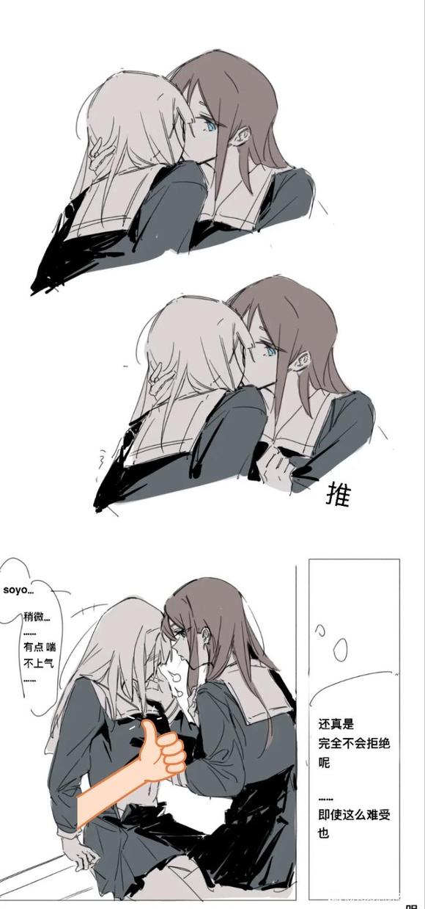
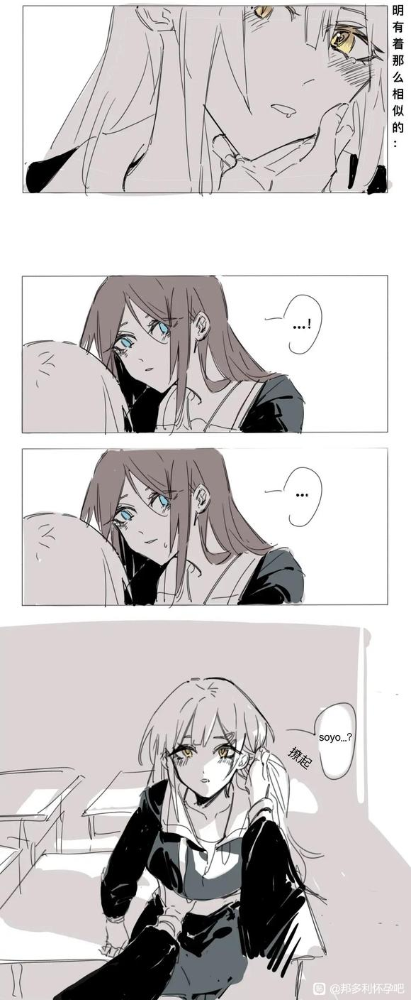

东山公曰:名著了属于是。
<!--more-->
# Mujica众人成了mygo的星怒

**作者:尸超绊**

## 1

第二季结束后，Mujica由于对邦失败，永远地成为了mygo的努利。现在的当务之急是如何处置这些妇孺？  

## 2

假如按人头分配，五个人正好一人一只，应该是比较公平的决定。但以爱音的个性而言，她更想看协奏曲，所有人黏糊糊搅在一起的大音趴。为此她向素世使了个眼色，对方却装作没懂，拍手笑道：“啊，ano酱已经迫不及待了呢，那我们赶紧开始分配吧！我想要……”  

## 3

结果，在素世先声夺人之下，大家的白月光祥子成了她的盘中餐。爱音固然有些沮丧，但想到不抓紧的话猎物就会被抢走，很快选定了看起来相当美味的初华。  

## 4

对初华来说，除了祥子，被谁俘虏都是一样的。不过，鉴于爱素的绯闻多人气高，在历次扫黄中总是第一个被抓的，所以，或许能通过这层关系得知祥子的后话；甚至能再次相会也说不定，虽然那大约是相当凄惨的场面就是了。于是她抱定宗旨，用心服侍爱音，好从她嘴里撬出更多信息来。  

## 5

回去的路上，爱音浮想联翩。初华是sumimi的大明星，如今却要委身于自己，这真是从前想都不敢想的事！听说她表面上优雅得体，背地里却有糙粉之举，灯有回被她缠住还是靠我解围。这样欲求不满的女人，就应该让她好好憋着，始终不给她满足！想到这，爱音不禁露出虎牙，发出一如既往的唐笑声。  

## 6

被爱音毫无顾忌地揉着鼓鼓囊囊的营养，初华多少有些难为情。她不敢违逆爱音的意志，只好伸手捂住了脸。这份娇羞无疑让爱音更为兴奋了，她一边用着洗面乳，一边小手也渐渐向下探去。  

## 7

看官有话：像爱音这样急色，一看就不是行家。总要先摧毁努利的自尊，再摧残努利的身体。  

## 8

素世就很有经验，她此刻正对祥子进行严酷的审迅：  

## 9

每当祥子迟疑或者回答令她不满意，她便勒令祥子脱去一件衣物。直到最后一件小内内也被剥夺，素世又命她甜净上面的水渍。望着自己污秽的痕迹，祥子的尊严碎了一地。  

## 10

再说爱音这边。深入探索了初华的身体之后，爱音猛然意识到，不能让她过分满足。正如曹孟德的养鹰之计，吊着初华的胃口才能更好地为自己所用。
作为吉他手，爱音对自己手指的灵活度相当自信。而初华既是吉他又是主唱，这岂不是说，她的口舌也……想到这爱音忍不住把另一只手伸进初华口中，去测试音道的润滑程度。  

## 11

“唔，唔”对口腔中探来的异物，初华有些不适，但她很快进入了状态，开始展现自己的演奏技巧。舌尖绕着甲沟游走，上颚的褶皱摩擦着指背。感受着食指被尽情吸吮着，爱音的幻肢忍不住开始痉挛。  

## 12

渐渐地，主动权来到了初华这一边。她用尽毕生所学在爱音身上弹奏着，  

## 13

在这烈火烹油之际，望着身下艳如桃花的爱音，初华没来由感到一阵悲伤。“祥子……”她想，此刻自己的青梅是否也在别人怀里快乐着？  

## 14

当她试探着向余韵未消的爱音提出，想知道祥子的状况时，对方惊讶地瞪大了眼睛。
“哈？身为我的努利，竟然却想着别的女人？这可不行，除非……”爱音计上心头，“除非你做我的狗。”  

## 15

初华紧咬牙关，似乎压抑着内心的火焰。真的可以吗？为了Sakiko酱，即使放弃人类的身份也值得吗？
“只要变成狗狗，我就可以带你去找祥子哦。”爱音又无所谓地说道，“当然，素世对她可是很沉重的，如果去迟了祥子会变成什么样子我也不知道呢。”  

## 16

不能再犹豫了！初华伏在地上，用颤抖的声音道：“主人，请让初华……成为你的狗吧。”  

## 17

“干的不错，初华汪！狗狗应该怎么叫，你是知道的吧！”
“汪，呜汪……”  

## 18

“太小声了，还有，头抬得太高了！狗狗必须趴着地爬行才可以！”爱音毫不留情地训斥着初华汪。  

## 19

含着一包眼泪，初华被动地接受着主人的训练。三天过去，她已经完全变成了金毛犬的形状，时刻被爱音拴着脖子爬行。当然，心情好时爱音也会带她到院子里放风。  

## 20

“作为合格的宠物，你要自己学会上厕所。”爱音这样指示着，“挖个坑把自己的粪便埋起来吧。”
那明明是猫才会干的事，初华委屈地从喉咙里发出呜呜的声音，用爪子在花园里刨起了坑。  

## 21

丰川祥子在执行一项艰巨的任务：把素世的袜子拆成一条条线，再用这些线把自己绑起来。棉线很容易断，断了之后就得从素世脚上再取一只，而且只许用嘴取。她揉了揉酸痛的脖子，感觉自己像是被恶毒后妈勒令捡蚕豆的灰姑娘。  

## 22

“sakiko酱累了吗？”素世似乎很关切地问，“要不要洗个热水澡？”
祥子知道她会趁洗澡的时候清范自己，用泡过玫瑰精油的水把自己灌得鼓鼓的，所以摇摇头继续做工。就在此刻响起了门铃，素世还未起身，门已经被钥匙打开了。  

## 23

要不今天就到这，楼主要打游戏去了  

## 24

既然☁️友那么关心那三对，我就略写一段  

## 25

如今花开两朵各表一枝，且说分配当日，喵梦竟反客为主，妄想拿下偷摸零，大概是觉得这种小动物没什么危险性吧。这可惹恼了既是岳父也是袍友的立希，她当即将喵梦拿下严加管束。如此一来只剩下海玲和睦，说不上为什么，灯并不习惯和睦头相处。尽管她们曾在同一乐队，彼此间的直接交流却少的可怜，有什么话总要通过祥子才能传递。灯不想再回到相顾无言的尴尬境地，便选了海玲为自己服务。当然，海玲也的确是很高明的技师，对穴道的精准拿捏总能让灯触发新的灵感。  

## 26

结果只剩下可怜的睦头低着头原地罚站。乐奈只是凑过来在她身上闻了闻，说了句“无趣的女孩子”就离开了。想到自己的队友被哄抢，而自己甚至当努利也没有人要，睦的内心充满了苦涩。她想起舞台上的台词，对自己来说，最恐怖的莫过于不被爱。  

## 27

睦拾起吉他离开了这里。既然不被人需要，她自然也就恢复了自由。她挺直了腰板走在街上，目光却没有任何焦点，像一袋外表完好，内部却蔫坏了的黄瓜。
看官且牢记话头，这五人里只有若叶睦现在是自由之身，当然这自由是不是她所期待的，那可就难说得很了。  

## 28

你们是真的能催楼主已经水了一千字，明天再放，大家就好好享受夜生活吧  

## 29

素世这边，来的正是粉毛……和她的狗。祥子瞪大了眼睛，不想相信面前的是初华：她四肢落地，神态谄媚，更可怕的是只穿着一条背心，下身什么也没有。  

## 30

“狗狗可不能穿太多，会热坏的！”爱音揉了揉初华的脑袋。
“你们……就这样过来了？”祥子忍不住问道。
“对啊！”爱音很自然地答道，“初华汪已经习惯了别人的目光。”
与此同时，素世不客气地用教鞭敲了一下茶几，这是警示祥子不能在主人说话之前开口。祥子自悔失言，不得不扇了自己一个嘴巴。  

## 31

“你的意思是，初华为了能见祥子一面，自愿当狗？”听完爱音的叙述，素世喝了一口红茶，不动声色地问道。
“不仅仅是狗，其他动物也可以哟。素世世，我们一起来玩吧！”爱音沉醉地说，“像这样一个又一个的音趴聚集在一起，不就能变成超级大音趴了吗！”  

## 32

此刻，爱音正以很不雅观的姿势跨坐在初华背上，让初华驮着她走来走去。而素世保持着月之森学生的风度，侧坐在祥子背上。当然，这对坐骑的稳定性要求比较高，一旦素世手中的咖啡撒了出来，她便会给祥子一巴掌，令她把地板添干净。  

## 33

“牧童骑黄牛，歌声振林樾。”爱音哼着小曲儿，忽然又策犬返了回来。
“soyorin，”她说，“我们来玩‘牛吃草’的游戏吧！”  

## 34

所谓牛吃草，想想也知道吃的是人身上的草。当然不是指头发，啃成秃子了还怎么漂亮的起来？祥子领悟到这一游戏的真实目的之后，不禁毛骨悚然，但又没有法子逃避。  

## 35

“去，初华汪，把她的毛拔光。”收到这样的指示，初华顺从地将鼻子探入祥子的腿间。幼年曾游历过的地方深深吸引着她，对她来说，这无异于重返旧桃源了，景观却已大不相同。  

## 36

曾经轻薄平淡的地方，如今也发展得色香味俱全了，她忍不住伸舌轻舐了一口。但如今不是贪杯的时候，主人的命令也必须完成。她用牙齿绞住一绺蓝丝，犹豫片刻方才扯下。  

## 37

出乎意料地，祥子并没有出声，洞口却不耐受地舒缩着，她连忙用唇舌加以抚慰。如是者再，一个多小时后，祥子已近乎昏厥，而初华也满脸都是汗珠。  

## 38

素世怜爱地抚摸着红肿不堪的嫩肉。“真是娇弱呢，丰川家的大小姐。”她用一杯冷水泼醒了祥子，“去对你们的主唱做同样的事。如果半小时内没有完成，就把你们两个的毛都吃下去。”  

## 39

于是初华不得不承受迅速而猛烈的脱毛服务。祥子的眼中含着歉意，这使她越发无法直视。难道说，自己的努力只是给两个人带来更大的痛苦吗？  

## 40

她不禁想到论坛上的卖沟文学，说是几对女通聚在一起，玩法就会越来越鞭泰。是我误了祥子！她忍不住发出哀鸣。铸霓虹四岛之铁，不能成此一错！  

## 41

“说起来，牛是不是应该打上鼻环才合适？”爱音又想出了新点子。“在环上挂个牌子，这样谁都知道这是我们的宠物啦！”  

## 42

“欸？”素世闻言捧起了祥子的脸，似乎在观察是否合适。
不，不要。初华在心里呐喊，如果祥子被打上鼻环，那就再也没有办法做偶像了，就永远都是别人的努利了！想到这里，她直起上身道：  

## 43

“鼻环什么的，在本汪身上打就可以了！请不要让sakiko破相！”
素世诧异的看着她，仿佛惊异于这份勇气似的点点头：“这样啊。那么，就来点有用的好了。”  

## 44

“我早就听爱音说，你的舌头很灵活。所以，”她捧起初华的脸，“打上舌钉，让我们好好快乐一下吧。”  

## 45

楼主打算加点料，圣水残肢搏击赤人什么的都掺进去，吧友以为如何  

## 46

再说立希这边。喵梦并不是个能安心服从主人的人，经常梗着脖子在那里乱吵。她的牙尖嘴利，有时立希说不过她，便很自然地想到要以武力来解决问题。看来两位鼓手的争斗，终究还是要以自由搏击的方式一较高下。  

## 47

喵梦率先出招，一套螳螂拳捶得立希那叫一个春波荡漾。立希自然要反击，先朝喵梦面门虚晃一拳，喵梦后仰躲开，不提防却被立希一个扫堂腿掀翻在地。那立希提起蘸碟儿大小拳头，左一拳右一拳，只在喵梦脸上招呼，便也似开了个卤肉铺，将一张俏脸打得猪头一般。  

## 48

喵梦吃痛，两手在立希身上不断乱抓，挠出一道又一道血痕。立希越发怒了，便用三根指头夹着喵梦腰间嫩肉只一旋，痛得她眼泪汪汪。后来打得累了，正欲起身，不想喵梦仍存着一个反击的心思，抬膝便击在立希胯上。立希咬牙切齿，眼观鼻鼻观口口观心，诚意正心，将全身气力凝于二指，指出如电，正中喵梦胸口。直戳得喵梦茹头内陷，闭过气去，这一段公案才算了结。  

## 49

懒癌犯了，再更一段今天就结束吧  

## 50

祥子最近的处境十分难堪。由于那枚舌钉的缘故，素世临幸她的次数越发少了，几乎夜夜搂着初华不放。
“不劳者不得食，”素世居高临下地说，“不过看在你是丰川家的女儿上，赏你一碗汤泡饭。”  

## 51

祥子低头看去，一小碗黄不拉几的泡饭摆在地上，散发出阵阵骚味。
原来如此……所谓的汤，就是soyo的圣水啊。祥子摇摇头，用小勺在饭的边缘没淋到的位置挖着吃了起来。  

## 52

果然，凌晨三点多，初华偷偷摸下床，找到了尚未成眠的祥子，对她做了一番剖肝沥胆的表白。虽然不像姜伯约“令社稷危而复安，日月幽而复明”那般言重，话中要卫护祥子重获自由的意思，却表示得很明确了。  

## 53

“即使逃出去也不算了事，”初华耳语道，“我们的对赌协议，还有一些影像资料还在她们手里。必须强迫她们全部销毁才行。”
初华提出的这个方法，叫做“挟soyo以令ano”，趁素世不备之际，以凶器挟持为人质，逼迫她们销毁资料。  

## 54

“武器很难藏在身上，不过只有她们放松警惕，总能找到机会。”初华皱眉道，“爱音可能女友比较多，不一定会听我们的，不过，即使只让素世删除你的，那也值得。”
祥子咬牙点点头。于是乎，这条翻身大计就此定下，初祥二人也就不得不姑且忍受越发肆意的侵掠。  

## 55

没人？楼主要开始发力了  

## 56

这天晚宴，素世又开始办人体盛，将祥子灌得鼓鼓得，又以和牛蘸着蛤口的酱料吃。收到这般刺激，酱汁不受控制地滴落在餐桌上。
“明明是还未成年的高中生，竟然松弛成这个样子。”素世怒道，“周末就把你送到夜总会去开啤酒瓶。”  

## 57

祥子知道反驳会招致更严厉的惩罚，只好低下头更加用力地夹紧。
“咬住我的筷子不放，还让不让人吃饭了？真是个小砀芙。”素世又埋怨道。  

## 58

祥子敢怒不敢言，她挪动了一下身子，没想到把桌上的红酒杯打翻了。那杯子悠悠地在桌子滚了一圈，终于落在地上跌得粉碎。
素世霍然站起身来，脸皮涨得通红。她死死盯着祥子看了一会，忽然一把将她摁住。
“爱音，麻烦你帮我把储藏室的木工箱拿来。”  

## 59

接过箱子，素世从中取出了一把红色小电锯。
“你的这条腿，似乎不想要了呢……”
祥子的后背已经冷汗森森。
“不要！”初华冲了上来，“不要伤害祥子……”面对素世可怖的神色，她顿了顿，又鼓起勇气道：“请让我代替祥子受罚吧！”
素世的脸色阴晴不定，谁也不知道她在想什么。过了一会，她说道：“换成你的话，两条腿都要砍。可以吗？”她末一句却不是问初华，而是征询爱音的意见。  

## 60

“只要还能爬就行。”爱音很快给出了回答。
“那么，膝盖保留，小腿以下的部分全部切掉。这样，不是更像真正的狗狗吗？”素世拉动了电锯。
啜泣声被机器的轰鸣所淹没。目睹了眼前的惨像，祥子不由得握紧了双拳。她却没有料到，素世的根本目的是要限制她们的行动，防止她们进行反抗。原来月之森点子王为了以防万一在家里装了窃听器，初华和祥子的夜间密计早就泄露的一干二净。因而，她们的厄运终究还是在劫难逃。  

## 61

事后，初华的小腿被存放在冰箱里。按爱音的想法，腿骨可以做成笛子，不过她的手艺太笨，这东西又不敢交到外面去找人做，只好先冻起来以后再做打算。
天气渐凉，素世仿佛无意间提起想要一副手套。“最好是真皮的，”她这么叮嘱道。祥子唯唯称是，却没想到已经落入了圈套。  

## 62

“就用你的手来做吧。”说着，她从桌下掏出一副铡刀，拽起祥子，将她的双手齐根铡断。
事出突然，当初华看到案上那双滴着鲜血的手，大脑空白了片刻。对一位钢琴家而言，双手是和生命同等贵重的东西；而深恋着祥子的她，对那双手的记忆更是不同寻常。  

## 63

初华跪在地上，将脸贴在尚有余温的断掌上。她仍记得彼此的第一次触摸；记得侵入时的疼痛；记得她惊慌地为自己擦去眼泪；记得十指相扣时许下的约定。
然而现在一切都毁了，毁在长崎素世的手里。她恨透了素世，同时也修改了计划：不再是挟持，而是要彻底杀死她们。
“一切的一切，就由我来背负吧。”  

## 64

尽管楼主在尽力控制篇幅，但写起来估计要过一万字了。心累  

## 65

简单说下后面剧情：立希那边还是欢乐武打，灯被开发堕落自参，初华复仇大业，睦宝灵异鬼交。大概十个人里会有一个人活下来吧。  

## 66

这天月黑风高，趁着爱音不在，素世与祥子正合好之际，初华偷偷寻了一根充电线，伏着身子潜到了素世床前。  

## 67

爱音回来，进门便闻到一股咦妈味儿。素世的日子不是今天，她记得很清楚，而且素世也不可能容许自己有味道。难道是那两个人？  

## 68

迟疑间她已为一只大金毛所扑倒，双手双脚都被戴上了镣铐。毫无疑问，现在她成了祥子和初华的俘虏。为了让她清醒过来，更快地认识到这一事实，初华向她分享了死去同伴的遗体——初祥二人吃熟的，爱音吃生的。  

## 69

当然，素排素里脊素腿这些好肉是轮不到爱音的，她能吃的只有素屁股和一些下水。爱音眼神呆滞地嚼着一块臀部，纤维粗糙咽不下去，直噎得她翻白眼，初华便伸出银匙从她嘴里舀出那块肉来，铛的一声敲落在狗食盆里。  

## 70

我的番茄酱不多了其实只是这条线比较劲，其他线路还算正常，小睦那边甚至算得上纯爱了  

## 71

快写完了，十分佩服自己的能力，居然把拍脑袋写的东西圆回来了。以后每天12点更一千，下周就完事了。  

## 72

“该如何处置她呢？”初华望着祥子，意思是要她拿个主意。
“首先肯定得把资料销毁。之后嘛……”祥子思索着，“我怕她会说些不该说的。”
初华也想到了。灭口当然是稳妥的方式，这样即使将来被发现，她也可以将一切都揽在自己身上，不会有人指认祥子是共犯。但她又不想太过果决，杀素世时就是下手太快导致少了很多趣味。  

## 73

“那就把舌头割了吧！”她故意说道。
“听你的好了。”祥子皱着眉。
直接掏舌可能会招致反抗，因此初华先将爱音绑起来，用带刺的鞭子结结实实把皮肉打烂，抹上盐水之后送到太阳底下暴晒。身娇体弱的ano哪能经受如此酷刑，没多久就晕了过去。初华便把她拖回屋内，撬开牙关用剪子把舌头剪断。  

## 74

看着形容惨淡满口鲜血的爱音，初华伸出舌头舔了一下干裂的嘴唇。不错，舌钉之仇已经报了，这断手断脚的债也要从她身上讨还！她眼里射出怨毒的光，缓缓将一个带刺的项圈套在昏迷不醒的爱音脖子上。这钝刺是朝内的，一勒绳子便会扎得生疼。初华正是要让爱音在有限的生命里，把她吃过的苦全受一遍。  

## 75

好了，最激烈的部分已经结束。下面都是比较正常的内容。  

## 76

在杏事上，高松灯其实是个保守的女人。这倒不是说她守身如玉，事实上，在邦邦的世界观里能保持干净的大概只有校门口的两个石头狮子。灯只是不太习惯被别人接触身体，一旦被抚摸，就会变得异常敏感。到底是摸少了导致不习惯，还是太敏感所以摸得少？她自己也说不清，只知道不发展身体关系很容易被周围人孤立。所以，她委托海玲来帮她进行针对性的脱敏治疗。  

## 77

海玲上手之后，发现情况意外地难办。她感觉自己在撸一只受惊的猫，时不时地刺挠一下。一半是为了转移注意，一半是为了满足好奇，海玲问起了灯之前的经历。
“之前都是想着祥子，不知不觉就湿了。遇到爱音之后，才真正开始有那个……”灯小声说道。
“为什么跟爱音就可以？这个，我说不上来。最开始是觉得她好像有一种特殊的魔力，到后来，渐渐就变成没有爱音就不行了……可是，爱音和我在一起的时间越来越少。我不想总是一个人，所以……  

## 78

海玲点点头，寻思道：之前就有传闻，说那粉毛之所以能大扣四方，靠的其实是一款催眠App。听灯的说法，传言似乎不无道理。然而圣爱音只生得两只手十个指头，扣不遍这许多女友，灯觉得自己受了冷落，便动了逾墙之心。
也是个可怜人，海玲叹了口气。她停下手中动作，碧绿的眼睛凝视着灯：“你想要的，就只是温柔吗？不管是谁的都可以吗？”  

## 79

空气凝固了片刻，只有床头蘑菇灯明暗交替变换。
过了很久，灯才轻声说道：“不是的。”
“果然。”海玲似乎松了口气，翻身在灯身边躺下。“我也一样。”
“海玲也有喜欢的人吗？”
“八年。”
“欸？”
“从认识到现在，已经八年过去了。”海玲背对着灯咕哝道：“明明家住在一起，要出手的话机会也太多了。只能说她从来都没往那方面考虑过吧。”  

## 80

“这……”灯觉得自己应该说点什么来安慰，但话到嘴边又觉苍白无力。不喜欢就是不喜欢，唯独这件事上说什么也是没用的。
“算了，跟那没良心的没什么可说的。”海玲又翻了回来。“为什么不去找她呢？只要你去了，我想她还是愿意跟你过夜的吧。”
“我不想……”高松灯只说了这三个字。倒不是说主动点不可以，她只是不想含着爱音手指时尝到别的女人的味道。
“唉，真难办。”海玲坐起身来，“要不这样，我知道一些药物，可能对你的症状有所帮助。”  

## 81

于是乎，在药物的帮助下，高松灯过上了如同苯子女主般的生活。  

## 82

这种感觉真的很舒服呢，明明在无止境地下坠，却又好像在不断地攀升。天国的阴影下，她似乎看到了粉毛的面庞。
“谢谢……”她不知道自己在对谁说。
“但我已经不需要了。”  

## 83

突然，包厢的门被撞开了。蓝发双马尾的少女威风凛凛地闯入了这座银窝。
“你的同伴，千早爱音，此刻已经被我们控制了。”她双手插在口袋里，对灯说道：“不想她出事的话，就把海玲的契约交出来。”
灯茫然地看着她，觉得这张面孔似乎有些熟悉。但听到爱音的名字，她还是顺从地从包里取出了文书。
“烧了它。”祥子命令道。
一旁的女子给灯递上打火机。倏忽间，那些对海玲不利的证据便灰飞烟灭了。
“很好，到素世的公寓里去找她吧。”祥子离开前，意味深长的看了灯一眼。“希望你还来得及。”
“自由了么……”得知消息的八幡海玲并未表现出惊喜，反而叹了口气。“那么，我得出去找立希了。不知道为什么，从几天前她就失踪了，任何人都联系不上……”  

## 84

原来那立希每日饭后消遣，便是将喵梦的肚子当鼓敲，美其名曰“打熬筋骨”。她的手劲极大，竟然敲得喵梦紫宫脱垂。没奈何，只能戴个手套把那话儿塞回去，可明日再敲时又会漏出来。望着那粉嫩嫩的一截，立希咬咬牙，决定来个长痛不如短痛。  

## 85

她往喵梦嘴里塞了只拖鞋，左肘压住小腹，右手用力一拔，愣是将梓宫给扯了下来。回头再看喵梦，口唇发紫眼珠乱翻，只有出的气没有进的气，竟然一命归西了。  

## 86

这可坏了事！立希寻思：洒家本想替她做个外科手术，不想真个痛死了她。这尸首一旦被人发现，洒家须吃官司，牢里没人送饭，不如及早丢开手。想到这里，急忙去厨下洗了洗，将家里金银细软打做一包，提了条齐眉短棒，往东京都投亲戚去了。  

## 87

夕阳西下，睦还在校园里浇着黄瓜。她很明白，这些带刺的水果已经不会再有人接受了；但她还是一遍又一遍地浇着水，似乎这样，时间就还停留在从前不曾流逝。
收起水壶，她正要一个人回家去，忽然背后传来一声呼唤。那声音是她绝不会认错的，可睦不敢回头，只是停住了脚步，抬头望向紫红色的天空。
“素世不会来了。”她像是说给自己听，好叫那幻觉永远不再出现。  

## 88

然而这次竟不是幻觉。素世小跑着到了睦的身边。
“好久不见，睦。要不要去喝点饮料？”
熟悉的餐厅，熟悉的味道。但是，眼前的素世却不同以往，睦感受到了久违的热情。她喝了一口果汁，静静地等待着素世对她提出请求。
每次都是这样。只有素世有求于她时，才会摆上这样一张笑脸。
“呀，已经这个时候了呢？还真是舍不得小睦。”素世堆着笑说，“我在楼下新开的酒店办了会员卡，小睦有空会来坐坐吗？”
“可以。”
“今天就可以吗？”
“我会想办法。”睦掏出手机。
她的家教很严，过了点门禁就不开了。不过，为了满足素世的要求，撒个谎也无关紧要。
“太好了呢！睦总是那么善解人意。”  

## 89

在一片诡异的祥和中，睦和素世滚在了一起。自此以后，素世便经常约睦出来打泡，而睦也从未拒绝过。
一天事后，素世抱着睦问道：“你愿意为了我去死吗？”
“愿意。”睦的声音十分平静。
“那，你愿意将整个身躯交给我吗？”
这问题有些古怪，循序渐进的话，生命应该排在身体后面才对。但睦不理会这些，继续应道：“愿意。”
“太好了呢。”素世将睦抱得更紧了。她在睦的耳边缓缓开口：“其实，我早就已经死了呢。”  

## 90

“我知道。”睦的声音依旧平静。
“诶？”这次轮到素世吃惊了。
“每天，你来找我，line步数却从来没有变化过。所以，我猜到了。”
场面陷入了持久的沉默。明明知道对方是鬼，却一场不落的赴约了，这究竟是勇敢，还是愚痴呢？睦的心事似乎很简单，也极其难解。
“我，毋畏死亡。”
“我明白了。”素世难得的没有道歉，“那么，就请小睦把身体交给我吧。我还有想要完成的事。”
“嗯。”
“不能用刀或者别的损害肢体的方式。那么，”素世想了一会儿，“就地取材，就用枕头把你闷过去好了。”
“嗯。”
夺舍的法子，需要让原主的灵魂离开身体才能成功。素世不再说话，取过枕头捂在睦脸上，那小小的身体没有反抗，也没有出声。  

## 91

睦一直在等着，等素世问她一句“为什么？”，那时她才能将所有无人知晓的心事说出口。但素世没有，任何人都没有。离开了月之森的校园，离开了若叶家的招牌，离开了高级巧克力袋，没有人会多看这根黄瓜一眼。
缺少了雨露的黄瓜是空心的，她一直给自己浇水，告诉自己人偶有一天也会真正变成人。她在玩具箱里盛妆以待，从开幕等到剧终，却等不到上场的消息。
“送给你了。”  

## 92

却说立希每日在东京勾栏听曲，日子好不快活。这天在浅草寺拈香祈福，见人物秀丽景色非常，十分欢喜，当晚便和尼姑们宿在一处。是夜花好月圆，两人正抱成一团，忽然听得江上潮声雷响。那立希是关西妹子，不曾省得东京潮信，只道是开live擂乐鼓，便拎了鼓槌抢出来。  

## 93

众尼姑吃了一惊，都来问道：“集美何为如此？赶出何处去？”立希道：“洒家听得鼓响，待要出去演奏春日影。”众人都笑将起来道：“集美错听了！不是鼓响，乃是东京湾潮信响。”立希寻思半晌，恍然大悟：“俺曾听人说过‘挨潮之极，抚信而乐’，如今既闻潮信，合登极乐。”寺内众人，都只道她说耍，又见她这般性格，不敢不依，只得唤火工烧汤来，与立希洗浴。  

## 94

立希又问寺内众僧处讨纸笔，写了一篇颂子，去法堂上捉把禅椅，当中坐了。焚起一炉好香，放了那张纸在禅床上，自叠起两只脚，左脚搭在右脚，奄然西去。颂曰：平生不修善果，只爱超人泄火。双指按碎葡萄，一拳打脱玉锁。咦！东京湾上潮信来，今日方知我是我。  

## 95

“唔……”祥子和初华的嘴唇终于分开，拉出一道闪亮的银丝。
望着目不转睛盯着自己的大金毛，祥子有许多话堵在心头。今天以后，她们就再也不能相会，初华已经留下了作案证据，并打算赶在灯报案之前去警视厅自首。虽然很难判死刑，但这一去对她们来说也近乎永别了。  

## 96

我亏欠你实在太多了，祥子微微叹气。从很早以前她就明白了这个人的心思，知道她愿意为了自己付出一切。所以她才要疏远初华，尽力将两人的关系往“一般朋友”上推，因为初华的爱太过沉重。自己既然做不到像初华那样无底线地维护对方，那么在一起就变成一件不公平、不负责任的事，这对祥子来说是不能接受的。
但是，走到今天，天平早已被形势所打破。如果再对初华的心意装聋作哑不闻不问，祥子也没办法原谅自己。  

## 97

“我将向你坦诚我的一切，正如你对我所做的那样。”她的手臂环上初华的颈，“无需顾忌，你可以做任何你想做的事。也不要误会，这并不是奖赏，而是我的恳求——只要能让你愉悦起来，”她咽了口唾沫，终于说道：“我什么都愿意做。”
尽管，这并非出于爱情。
初华却没有进一步的行动。她抱着祥子，失声痛哭起来。  

## 98

算算似了一半了，明天最后一更全送走  

## 99

为什么会这样？看到残缺不全的爱音时，灯的头脑一片可怕。她的手脚俱无，赤果的身上布满了刀伤和鞭痕。灯流着泪给爱音贴创口贴，可那些伤痕太多，随身带的全用完了也无济于事。
爱音似乎感受到了她的存在，缓缓睁开眼，抬起手似乎想替灯拭泪。但失去双手的她又如何能做到？握着那伤痕累累的手臂，灯忍不住痛哭失声。  

## 100

“呃呃！”爱音说不出话来，灯懂得她的意思，却哭得更凶了。她后悔自己这些天沉迷💊，竟然从没看望过爱音一次，以至她受到如此非人的对待。
她哭累了，呆呆地环顾四周，看过去，看过去：衣柜大开着，里面一片狼藉；墙上画着乐谱和涂鸦，颜色深浅不一，可想而知是爱音的血；对面壁上端正有力的八个大字“杀人者三角初华也”。终于，她看到了床边沾血的小刀，便毫不犹豫地抓过来扎在腹上；她太痛苦了，痛苦到只有疼痛才能让她活下去。  

## 101

祥子最近有些心烦。她的计划是拯救所有Mujica成员，但不知为什么，只有喵梦无论如何联系不上，她的所有者立希也失去了音讯。初华已经自首，而自己被传讯的日子越来越近。如果不能在会审前搞定这件事，那么……正当她毫无头绪时，忽然收到了睦的信息。
见面后第一眼，祥子就觉得不大对劲：睦从来不会带着笑容和她说贵安。然而迟了，当睦诡笑着把双手搭在她肩上时，祥子忽然感到天旋地转，再睁眼，她已站在高耸入云的东京塔上了。  

## 102

更新被判为引流，申诉中……  

## 103

祥子最近有些心烦。她的计划是拯救所有Mujica成员，但不知为什么，只有喵梦无论如何联系不上，她的所有者立希也失去了音讯。初华已经自首，而自己被传讯的日子越来越近。如果不能在会审前搞定这件事，那么……正当她毫无头绪时，忽然收到了睦的信息。  

## 104

见面后第一眼，祥子就觉得不大对劲：睦从来不会带着笑容和她说贵安。然而迟了，当睦诡笑着把双手搭在她肩上时，祥子忽然感到天旋地转，再睁眼，她已站在高耸入云的东京塔上了。
眼前的睦也变成了熟悉的模样。素世笑着，退后一步，自顾自地说道：“saki酱真是狠心呢。我明明那么信任你的，居然和那条金毛联合起来杀我。”见祥子满脸警惕不答话，素世撩了撩头发又笑道：“想知道为什么还能看到我？放心吧，不彻底摧毁你，我是不会消失的。”
“这里是神赐的决战之地，只有最坚强的人才能取得胜利。拿好你的剑，丰川祥子，我们即将迎来命运的审判。”
这时祥子才发现双手居然神奇地复原了。反正是幻境，就陪她好好玩一场吧！她下定决心，举剑向素世刺去。两名少女如同古代剑客般，在这失足一步便会万劫不复的高塔上翩翩起舞。  

## 105

“祥子，你可曾记得过去的誓言？命运共同体什么的，为什么你不肯和我一起去死呢？”素世故意出言刺激，想让祥子分心。
“过去的我已经死了，丰川祥子和Oblivionis没有任何关系！”祥子毫不示弱。
“是么？那怎么还会被春日影破防？”素世先发制人。
破防的明明是你才对，祥子这样想着，却没说出口。
“怎么，哑巴了？小睦附身了？”  

## 106

“无论你说什么都没有用，我一定会取得最终胜利。”祥子冷冷回道。
“哈哈！那你们还不是邦输了乖乖当我们的星怒？”
“唔！”祥子终于被激怒了，她加快攻势朝素世攒刺，不提防脚下一滑，竟然跌下了东京塔。
“先动心者负，祥子，你输了。”素世的声音遥遥传来。
无数格钢筋在祥子眼前飘过，像是很长很长的四格漫画。在漫画里，祥子看到了自己的一生：出生起即万众瞩目的大小姐，童年时和初华的快乐时光，初中组建CRYCHIC的回忆，破产后艰难度日的窘状……她问自己，这一生究竟是为了什么？  

## 107

富贵，容貌，名誉，友情，爱慕，真心……世人所期待的一切她都得到过，也都一一失去，最后还是两手空空。也曾做过错事，伤害过他人也被人所伤，但在最后的时刻，那些白眼和侮蔑似乎也并非不可原谅。
她转过头，远方的富士山正轰轰烈烈地绽放，像一朵盛开的樱花。
“真美啊。”她轻声说。  

## 108

马上就完结了，内心十分伤感  

## 109

突如其来的地震撼动了整个本州岛，引发了巨型海啸和火山喷发。在这灭世级别的灾难面前，整个日本都有沉没的危险，少女们的不幸与罪孽显得那么无足轻重。
假如在平行世界，有一批和她们同名的美少女乐队，团结友爱互帮互助，这样的灾难是否就不会发生？如果是所有人都恭俭温良的世界，是否即便遇到无法躲避的劫难，也会有无形的大手替他们抹平？  

## 110

这些都得不到回答。只是，即便在如此触目惊心的场面下，在铺天盖地的火山灰和茫茫无边的大洪水中，依旧有人能够平安喜乐。
乐奈舒服地趴在一块漂浮的门板上，面色红润地睡着了。她时不时伸出舌头舔一口手背，似乎在吃香甜的抹茶芭菲。
从贪嗔痴慢，生出杀盗银妄，欲望的河流里，能得渡的只有猫猫。人类，终究一败涂地。  

## 111

明天再发几句感想，就当水经验了  

## 112

后记
校对完这篇文章，我的心思却仍在东京塔上。那里是命运之舞台，魔王素世和大祥老师拔剑相向，你来我往。压迫与被压迫，复仇与反复仇，双方踩着刀尖翩翩起舞，脚下便是万丈深渊。
毫无疑问的，祥子作为指定女主角惨遭失败。任何人都有弱点，任何人都无法逃脱命运——我想表达的正是这一点，在我的所有作品里都是如此。
“先动心者负”，祥子跌下了高塔，无数格钢筋在她眼前飘过，像是很长很长的四格漫画。漫画能写尽人的一生吗？或许可以，因为人生中重要的不过那么几个人几件事。但在死亡面前，这些又都无足轻重，放下执念后，望着灿烂盛开的富士山，祥子发出感叹：
“真美啊。”
万法皆空，本来具足，小皇文能写成这样的结局我是颇为得意的。色不异空空不异色，怎么能说是有碍观瞻呢？
但还是会感到遗憾。不是为创作中某些激烈的手段而忏悔，也不是为届不到的人而惋惜。我只是遗憾自己依旧是人类，只能凝视深渊而无法成为深渊本身。  

## 113

有人问我幽灵素世怎么超小睦，这就给你们展示一下  

## 114

点击展开，查看完整图片
  

## 115

点击展开，查看完整图片
  

## 116

星怒前传【节日特供】五个人都想当1怎么办  

## 117

母鸡卡获胜的平行世界【踩头杯】睦斯林的割礼  

