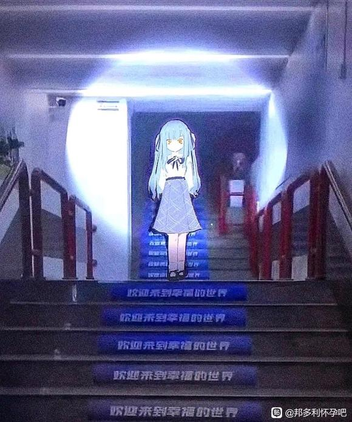

# 丰川祥子死后十年【邦多利怀孕吧】_百度贴吧

**作者:肃木**

## 1

祥子不会出场，但处处是她的痕迹。
本文为“如果高松灯的同学是霸凌者”的后续

  

## 2

椎名立希靠在书店墙上，等着警员的报告。今天书店人非常多，文坛新秀高松灯的新书发布，吸引了大量读者，给警员们的蹲点造成了巨大的困难。不久，在门口的警员要乐奈向椎名立希做了个手势，表示目标接近。待目标走进柜台，三个便衣立刻上前将他扑倒在地。那人拼死挣扎，撞开三人，向门口奔去。立希眼疾手快，一拳就将对方打倒在地。要乐奈也反应迅速，给那人扣上了手铐。
事情解决后，立希和要乐奈靠着警车休息。椎名立希长叹一声：“咱搜查二课真是快废了，一年接不着几个事，现在还把我们借调过来给这群年轻的干活。”要乐奈的心态很放松，嚼着抹茶味的雪花酥：“有活您也没接啊。丰川家那起失窃案也轮不到你出手，底下人自己去办了。说实在的，还是你自己闲不住，不然谁能使唤你一个课长。”俩人没再说话，作为多年的搭档，斗嘴都成了日常。
要乐奈锁屏亮了，她看了一眼，对立希说：“你要的大案来了，枪击杀人，不是一般的大。”  

## 3

“死者年龄二十六岁，女性，一家金融公司职员，工作稳定。凶手开了五枪，三枪打在胸口，一枪打在腹部，一枪打在头部，头部是致命伤……啊，是椎名课长。”椎名立希摆摆手，示意他们继续工作。
“死亡时间初步推测是凌晨零点到两点。”要乐奈又拿出一块抹茶雪花酥吃起来：“立希，这案子怎么查？”立希看着被白布覆盖的尸体说：“怎么查，先查监控和社会关系呗。”
“监控看过了，这个地选的很巧妙，有五个出口，只有两个有监控，没拍到什么东西。”
“社会关系入手也麻烦，死者的社会关系太复杂了，和谁都有矛盾，要说动机，她公司，她邻居，几乎人人有动机。”
“枪源也不好说，八成是黑枪，专业的枪械分析报告还没下来。”
听着这些人的报告，椎名立希头都大了，这个凶手够专业。这下只有大范围排查了，刚刚还在抱怨没活干，一下子就有大活干了。  

## 4

公共墓园中，一个黑衣人在墓前久久伫立。
一个人在天国会很孤单吧，别怪我，如果不是要查清一切，我十年前就陪你一块去了。
也是我太没用了，等着这么多年才找到时机动手，让那些人在世上又苟活一日。记得要好好练钢琴哦，我还想听呢。说来惭愧，我也快有十年不碰音乐了，没资格要求你。
总之，等我。  

## 5

椎名立希家都没回，做了整整一天的调研，走街串户，负责记录的要乐奈写字写得手疼。直到晚上十一点才刚刚忙完，立希看一眼家的距离，放弃了打车回家的打算。要乐奈仍然没心没肺，不紧不慢地跟在立希身后两米的位置。回到厅里，同事们基本都走了，立希打开灯，轻车熟路地找到自己办公室，刚把资料摆放好，回头一看，要乐奈已经在沙发上睡下了。立希有些无奈，这野猫，从来没变过。她也只好趴在办公桌上睡了。
就该使唤这猫收拾东西！椎名立希想，这也不是她第一次这么想了。  

## 6

“课长！课长！部长要开会，快起来啊。”立希从睡梦中醒来，趴着睡的感觉真不好，感觉腰都要断了，她看一眼，要乐奈还睡的香甜，心中莫名升起一股爱猫的冲动。不过还是开会要紧，刑事部部长这老登，别人稍有不如意，他就大加训斥。立希整理了一下自己的警服和头发，看起来精神点了，走出了办公室。
刑事部部长开的会是为昨天的案子，各种陈词滥调和官腔听得椎名立希只想接着睡。在重复了一堆废话后，刑事部部长说：“所以，本案就由椎名课长牵头成立专案组，统筹办案。”
咦？
椎名立希吓的一激灵，这么突然？场内气氛骤然一闷，立希看着部长，结结巴巴地说：“是……椎名立希……收到。”一个陌生的课长来了句玩笑：“这案办完，椎名课长可是要论功升迁的啊。”“只怕要耗去椎名课长的好头发了。”“到时候位高权重，怕是更难结婚啊。”场内众人都笑了起来。立希也只好尴尬地陪着他们笑。仔细想来，企图追求椎名立希的人还真不少，但要不是立希看不上，就是他们知难而退了。细细数来，陪在立希身边最多的竟然是那只叫要乐奈的警员。  

## 7

还没回办公室，要乐奈已经自己找了上来，她揉了揉眼睛，把锁屏的手机递给立希：“又出事了，还是枪击致死。”
看过现场，立希敢肯定，这两起案子就是一个人做的，都是开了五枪，连中枪的位置都一模一样，地点仍是一处老旧且没有监控的巷子，死者同样是个二十多岁的女性，这人是羽丘女子学园的老师。羽丘啊，椎名立希几乎是立刻想起了一个早就逝去的人。这次社会关系的调查倒是没那么困难，死者的社会关系太简单了，几乎不和任何人交往。部里也决定了要并案处理。要乐奈飞快地查阅资料，对立希说：“我查到个共同点，两个死者是同班同学，都是羽丘A1班的学生。”“哦？”立希终于在线团中找到了头绪，她调出羽丘当年的学生信息。
“羽丘A1……”除了两个死者的名字，椎名立希还看到了一个人。
高松灯。  

## 8

这是第二次来见你，祥子。上次来的太急，什么的都没拿，真是抱歉啦，今天天气很好，我带了勿忘我，你喜欢吗？不喜欢的话我也没有办法喽。今天我杀了另一个。除了直接动手的三个人，我也查到了欺负小灯的那几个人，都怪小灯，为什么不直接跟我说呢。不过，我不怪她啦，我也帮帮她好了。说起这个，你为什么也不跟我说呢，我一定会帮你的。但，我也不怪你啦。最后剩下那个我不好处置，你再等一等好吗，你都等了十年了。等到见了面，要记得谢我啊。  

## 9

椎名立希坐在高松灯家的沙发上，注视着面前有些陌生的灯，灯递给立希一盒万宝路，自己也点上一根。立希回绝了：“我不吸烟。”
“有点奇怪呀，我印象里警察都是抽烟的。”
立希不知道说什么好，只好尴尬地寒暄：“你最近还玩乐队吗？”
“我快十年没碰音乐了。”灯熄灭手中抽了一半的烟：“椎名课长，有话请直说吧，是因为最近的枪击案吧。”
椎名立希本想再说几句，见灯单刀直入，自己只好跟上对面的思路：“是，你看新闻了吗？”
“那俩人我认识，是我同学，具体的我什么都不知道了。”
椎名立希知道高松灯说的应该是实话，她在班上被孤立，嘲笑，其实立希也略有耳闻，但立希不知道该怎么做，立希能做到在她的视线内，没有人可以伤害灯的身体，但别的就难了。因为要写警局的记录，立希还是问出了下一句：“真的吗，你在班上和任何人都不熟吗？”
“我在羽丘A1班只有一个朋友，她叫千早爱音，你认识吗？”
立希当然不认识。  

## 10

立希又忙到深夜十一点，看各种专业报告太费时间了。不过今晚的好消息是，那只野猫被立希放了假，立希终于能在办公室的沙发睡一次了。
要乐奈来到了RiNG，点了份抹茶芭菲自己吃了起来，让立希陪她来，虽然要乐奈的目的是让立希付钱，但立希说要工作还是让要乐奈吐槽一句“无趣的女人”。要乐奈吃完芭菲，已经快午夜了，天空淅淅沥沥下起来小雨，一个黑衣人走进来，要了一杯红茶。这个时间，联想到枪击案，要乐奈蹑手蹑脚跟了上去，雨越下越大，视野也越来越差，但这丝毫不影响要乐奈跟踪的步伐，要乐奈在警视厅里外号“野猫”，说的就是她晚上盯梢的本事。地形越来越陌生，跟到一处狭窄的商店街，那人忽然回了头，举枪瞄准了要乐奈。  

## 11

大家看出是谁是凶手了吗  

## 12

那人的手枪装了消音器，但打的并不准，至少要乐奈是这么觉得的，这么快的先手一枪都没打中，要乐奈也掏出了枪：“停下，我是警……”一句话还没说完，那人已闪过巷子口消失，要乐奈一边呼叫警力，一边追了上去。那人跑的还是挺快，这片巷子错综复杂，要乐奈终于没忍住开了一枪，虽然她自认枪法奇准却也没有打中，只是削下了对方的几根发丝。要乐奈的空间感不强，追着追着就迷了路，刚走到一个巷子口，在雨声里，要乐奈听到背后有扳机扣动的声音。  

## 13

立希再见到要乐奈是在医院的特护病房，这人枪法的确不怎么样，一枪没打中，一枪打歪在肩上。当时要乐奈只是被震晕过去，手术后休息一段时间就好了，并没有生命危险。立希代表警视厅来探望和问询，她特意买了一份抹茶蛋糕，当着要乐奈的面前吃。要乐奈伸出手要拿，被立希挡了回去。“医生不许吃。中枪了就老实躺着吧。”立希吃尽最后一口蛋糕，看着气鼓鼓的要乐奈，掏出笔纸开始问询：“你听到几声枪响？”
“两声，包括我自己开的一枪。”
“说说具体情况。”
“那人先向我开了一枪，没打中。我追击时也开了一枪，没打中。最后那人在我背后开了一枪，打中了我。”
“那人开的第一枪没有枪声？”
“有消音器。”
“那人开的第二枪为什么没装消音器？”
“我怎么知道，这是你的职责了。现在我就是个伤病员。”
“你打的那么准，这次怎么失手了。”
“本来就没奔着下死手，就是吓吓人，不过，好像打断她一缕头发。”  

## 14

椎名立希看着证物袋中的那缕棕发，心中浮起一个大胆的猜测。她拿起刚送来的弹道分析，显示现场有三把枪进行了射击，除了要乐奈的那一把，另外两把……要么那个人带了两把枪，要么就是有两个人。她打开警视厅的数据库，找到了长崎素世，没有任何犯罪记录。难道真的是她吗？
立希叉着手，站在丰川祥子的墓碑前，墓前花束已稍稍枯萎。立希知道祥爹早在四年前就因酗酒而死，那么这束花又是谁放的呢。风不知不觉地吹起来，墓碑上那块照片，丰川祥子穿着月之森的校服，笑的很开心。  

## 15

一个月内都没再发生新的案子，椎名立希跟部长申请，把警力撒出去，把当初羽丘A1班的众人监控起来，一对一保护。高松灯的家里多了一个人，立希直接把办公地点搬到了高松灯的家里。当立希提出要求时，灯什么都没说，只是点了点头。鉴于此前对长崎素世的怀疑，立希也派人去盯她，只可惜一无所获，她像一个步入中年的职场女性一样，正常地生活着，偶尔收到几束花，看起来相当有魅力。立希查阅着资料，羽丘A1班那几十个人，还在东京的都被保护起来，在日本的也通知了她们，只有两三个出了国，实在联系不到。椎名立希关了网页，如果凶手是长崎素世还好，如果不是，你们就自求多福吧。  

## 16

米国，纽约
一名日本留学生刚刚结束彻夜的派对，晃晃悠悠地往学校走。按说这其实是违规，不过谁在乎呢？她的留学是钱和关系搞来的，学校既要照顾她父亲的人情，更在乎她手里的大把票子。纽约真是繁华啊，快凌晨了还有辆出租车，她伸手拦下。长岛冰茶喝的太多，她甚至没想想，自己连地址都没说，司机为什么就开车了。
司机居然是个女的，稀奇，真稀奇，还有日式英语口音。她不由得想多聊两句，问司机是日本人吗，来自日本哪里。司机说自己是东京人，她有些惊喜，虽然她一点都不想家，但她还是提起了东京的各种事物，以此拉进自己与这个乡党的关系。司机等她说的都说完了，问了一句：“您认识一个叫高松灯的女生吗？”她摇摇头，不知道，那人又不是什么大明星。司机又问：“那丰川祥子，您更有可能认识。”她努力回想，有些熟悉，但还是想不起来。一番话问的她有些烦了，便催起司机，问怎么还没到。司机却不搭话。车辆在无言的沉默中在曼哈顿的街头穿行。
酒渐渐醒了，她感觉到不对劲。还没等她有什么动作，车已停了下来。司机先下了车，把她拽了下来。她四处张望，是……时代广场。此时天刚蒙蒙亮，广场上只有四五个行人。司机让她站好，她逐渐有些害怕。
“你和另外两个人，曾经在羽丘女子学园，杀死了一个人，还记得吗？事后，因为你父亲是警部，把事情压了下来，你很快获得保释，还记得吗？”
这人什么都想起来了，她对这个“司机”有了些恐怖的猜测。
“你杀死的那个人，叫丰川祥子，还记得吗？她是我的朋友。不过，我今天不仅仅为此而来，而是为了我的另一个朋友。我已经失去了丰川祥子，我更不想失去她。”
司机摘下了连衣帽，露出浅绿色的头发。她双手举起枪，很显然，她还不习惯用这冰冷的武器。
枪响了，太阳升起来了，在手枪金属的外壳上闪耀出光芒，曼哈顿的新一天开始了。  

## 17

高松灯家真的挺无聊的，除了书就是书了。灯每天除了坐下看书，写字，基本连门都不出。灯所做的，就是把书架上书抽下来，看完，放回去，把笔记本翻开，写字，再合上。立希注意到，高松灯的笔记本用的还是十年前的那一款，但她记得那一款已经停产了。对此，高松灯的回答是，她在宣布停产的当天，把这款笔记本的所有型号全都买了下来，有多少买多少，大概能用一辈子吧，一辈子。立希看到这样的灯，总觉得灯身上好像少了什么。
在即将下班前，那只猫给自己发了消息。
“部长找你。”
“什么事？”
“不知道。”
立希有些生气，要乐奈每次都是这样，别人让她说什么她就说什么，一句话不多说。她穿上警服，准备回警视厅，灯却突然说话了。
“大概是因为你的案子吧。看看新闻。”
灯举起了手机，头条新闻是“著名艺人之女若叶睦于纽约制造枪击案”  

## 18

椎名立希赶到部长办公室时，部长已经训了他们半小时了。等立希进来，一切不堪的辱骂和攻击都落到了她头上，立希静静地听部长骂完，趁部长喘气的时候说：“是不是该把嫌疑人先引渡。”部长又骂了立希两句才说：“用不着你操心，已经办了。你的案子结了，那人把所有罪都认了，包括杀那两个人。”立希还想再说两句，部长一拍桌子：“回来把东西都移交了，你的案子到此为止了！还要我说几遍！”立希不能再说，答句是就走了出去。
回到自己的办公室，要乐奈正坐在沙发上玩手机，她每次都是这样，别管受了多大的伤，过不了多久就好了。立希问要乐奈：“你觉得这案子有问题吗？怎么就这么结了？”要乐奈说：“不知道。”
立希一阵无语，还没等她吐槽说出口。要乐奈说：“不过，那天向我开枪的，绝对是两个人。”  

## 19

椎名立希决定查到底。案子已经移交，她的时间瞬间多了起来。不过，在开始查之前，她打算先旁听若叶睦的提审。
“x月x日，在xxx，你枪杀了xxxx，你承认吗？”
“我承认。”
“交代一下你的作案过程。”
“……”
“在xxx，你袭击了警员要乐奈，你承认吗？”
“我承认。”
“在纽约时代广场，你枪杀了xxxx，你承认吗？”
“我承认。”
若叶睦认下了所有的罪责，交代了所有的真相，她像一台问答机器，提出问题她就回答，面上没有任何波动。以前就这样，现在还这样。但立希还觉得，在若叶睦的外表下，一定还有别人不知道的东西。立希站了起来：“若叶睦，你承认自己说的一切都是事实吗？”
“我认识椎名警官，我申请椎名警官回避。”
立希有些郁闷，她无奈地走出了警视厅，看到身边没心没肺吃着抹茶味冰棍的要乐奈，她下定了决心，说：“走吧，我们去查清究竟发生了什么。”  

## 20

长崎素世收到了一束白玫瑰，她没太在意，这种事实在太多了。长崎素世会专门写一封信感谢送花的人，但不会接受任何的追求，原因只有她自己知道。她拿起了花束上的贺卡，很奇怪，并没有什么追求的话语，只是一些平常的问候。她注意到玫瑰花束之间有一个小盒子，拿出后打开，是一枚精巧的钻戒，像婚戒。长崎素世笑了，有点幼稚，向我求婚？她仔细打量着这枚戒指，内侧好像有铭文，她凑近了看，是一行歪歪扭扭的汉字。
“停手，我将为你承担一切。”
长崎素世认出了字迹的主人，真是大小姐啊，刻字都刻的这么不好看。她下意识揉搓着垂下来的一缕头发，忽然发现那头发不知何时已经不见了。  

## 21

高松灯看着椎名立希开车驶去，点燃一根烟抽了起来，明明就快让自己相信，十年前的一切只是一场真实无比的梦，却又被重新勾起；霸凌自己的那些人一个接一个的死去，心中已经没有悲喜一类的情绪，只有过往袭来的一阵阵恐惧。高松灯掐灭了烟，她抽烟从不等它们自己燃尽，毕竟只是个麻痹自己的手段，其实她根本不喜欢烟。
是不是该面对了，好像又要有人为了自己而受伤，而死。
高松灯拿出了一个笔记本，历经十年的沧桑，却依旧被高松灯保护的很好，只要不去触碰它，就永远不会有损伤。翻开之后，是熟悉又陌生的三个字。
春日影。  

## 22

立希敲响了长崎素世的门，她还住在那个大平层里。长崎素世下楼开门。“我记得我说过，没什么事就不要再见了。”“有事。”
椎名立希和要乐奈坐定，长崎素世端来了红茶。
“有事请说吧。”
“你应该见过我旁边的这位警员。”
“我没见过。”
“你是不是杀人了，杀死了羽丘A1的两个人。”
“我没有。”
“我希望你能说实话，长崎素世。”
“我说，就说不完了。我的时间很紧张，所以不会对你说。你应该问问别的人。”
立希一拍桌子，她几乎能够确认长崎素世就是凶手，但手中却没有证据。
“你不要再杀人了，我能查出来，我迟早会查出来。”
“我没有杀过人，我什么都不知道，你应该找个知道的人。另外，十年前祥子死的时候，我为什么没看到正义的椎名警官。”
立希心里压着一股火，她觉得所有人都知道的事，自己却不知道。起身便要走，红茶也没喝一口。素世礼貌地站起送别，慢慢地浅鞠一躬。立希看到了素世左手无名指上的钻戒：“你结婚了？”
“嗯。”
立希和要乐奈走后，素世还站着没有动，她对着无人的房间笑了，面部的运动挤出了眼泪，流个不停。  

## 23

立希让要乐奈盯好长崎素世，最近这几天都不要放松。要乐奈扭过头去，什么都不说。立希不得已，向前摸了摸她的头发，并承诺办完就请她吃一年的抹茶芭菲，这才安抚住这只炸毛的猫。立希决定再听素世的一次，只是不知道那个知情的人肯不肯说了，她驾车向灯家前去。
长崎素世接起电话，电话那头的人如约送上了目标的行程。长崎素世一边收拾东西一边听着，打开了一张纸质地图，勾勒出路线。素世画完，轻声说：“谢谢了。”
“我更该感谢你为祥子做的一切。”
“事到如今就别客套了，这本来就是我必须要做的。”
“想好以后干什么了吗？”
“我哪还有以后，先走一步去陪祥子吧，你还是好好想想自己吧，大明星。”素世说着说着就笑了起来。  

## 24

要乐奈盯着素世的家门，从上午十点到晚上六点，没人任何动静，没有任何人员进出。透过那扇巨大的落地窗，其中也没有任何身影。她有些起疑，走上楼，门大开着，仿佛在迎接着谁。要乐奈抽出腰间的手枪，打开保险，谨慎地进入客厅搜索，依旧是空无一人。要乐奈疑惑了，她拿出手机想向立希报告。穿着月之森校服的素世却忽然从卧室中走出，要乐奈警觉地后退半步，又举起了手中的枪。
“别害怕，我不想伤害你，所以你也最好不要伤害我。”素世边走边说，自顾自坐了下来。“我对立希什么都没说，因为我觉得她不应该从我这知道，她作为祥子的朋友和一名警察，居然没想过，没怀疑过，没查过当年的真相。但我可以对你说。”
要乐奈习惯性地摁下了胸口的录音笔，素世看到后仍继续说：“第一起枪击案和第二起枪击案都是我做的，第三起在美国的案子是我指使若叶睦动的手，小睦呆得很，我稍稍一忽悠她就什么都愿意为我做。”
“我这么做都是为了丰川祥子，你不认识她，她是羽丘女子学园的学生，在上学时被霸凌，被那三个人活生生地打死。事后，她们靠着关系，逃避了法律的审判。现在，我已经替法律执行完毕，我可以跟你走了。”
要乐奈听她说完，意识到素世是要自首后，下意识地去掏手铐，不过由于本次外勤仅为监视，她并没有带。素世忽然打开了抽屉，拿出一把手枪，要乐奈立刻紧张起来，手直接摸向腰间。素世却只是把枪推到她面前：“这就是作案用的玩意儿，算是证物吧，你拿去。”要乐奈这才放松，带上自己的白手套，防止污染这证物。说时迟那时快，素世从校服中掏出又一把枪，连开三枪，在消音器的帮助下，依旧没有任何声音。  

## 25

幸好，幸好初华准备了两把枪。“我没有说谎，我不想伤害你，但我不得不伤害你。”倒下的要乐奈还挣扎着想举起枪，但出血带来的冷寒与黑暗闭上了她的异色双瞳。长崎素世拾起要乐奈的警枪，用一把正义的武器来行正义的报复，她有了这样的想法。这件月之森校服过去这么多年，已经处处不合身，但还勉强能穿的下。素世将要乐奈的警枪带上，拿起要乐奈的手机，拨通了急救电话。  

## 26

立希又推开高松灯的家门，这一次严肃许多，灯早已坐下来等候，连茶水都泡到适宜的温度。立希看着灯古井无波的眼睛，心中泛起了一丝犹豫，却还是被查案的心盖过了。立希知道高松灯已经用十年时间掩盖了太多东西，今天自己却要再挖出来。但她还是发问：“高松灯，我想知道十年前的真相，我想知道丰川祥子究竟是怎么死的，我想知道你经历了什么。现在，我请求你告诉我。”  

## 27

高松灯对着茶几没有动，在很久以前，她的眼睛是一块琥珀，只是略有灰尘，从丰川祥子死后，简直像在地下封埋了几十年，极少有生机的光芒了。但今天不一样，不知道是立希刺破了阴霾，还是她自己推开了过去，琥珀中闪动着狂热的痕迹。她拿出了一个还没打开的包裹，用拆信刀小心地裁开，其中是一本从未有人看过的书。
“这是出版社寄给我的样书，我把一切都写出来了。素世给我打过电话，所以我把一切都想清楚了，或者说我认为自己想清楚了。”
立希翻到书的背后，五十万字。这么多，一时半会肯定看不完了。灯已预料到这种结果：“不用现在看啊，这只是送你的一份礼物。还是由我来说吧。”  

## 28

“十年之前，我……”
“十年之前，羽丘女子学园有一个学生，叫高松灯。她嘛，平日里性格很孤僻，超出了人类的范畴，爱好也古怪，喜欢收集各种各样的小东西，像创可贴、笔记本、西瓜虫、石头。又喜欢星星，对东京霓虹里不可见的那些小东西着迷。因为这个，没有人愿意和她做朋友，虽然高松灯非常非常想要有朋友。所以，她只好把所有的心事和胡思乱想都写在笔记本里。”
“直到高松灯遇见丰川祥子。高松灯在桥上伸出手，想触摸春日的花朵，丰川祥子看到了，误以为她要轻生，于是不顾一切地猛扑上去将其救下，两人就此相识了。现在想，高松灯那时直接跳下去，就是整本小说最好的结局。后来，丰川祥子成为了高松灯的朋友，她愿意看高松灯的笔记，愿意接受高松灯的礼物，甚至，为了高松灯写出的笔记，组建了一支名叫crychic的乐队。乐队唱了第一首歌《春日影》，开了第一次live，那是高松灯一生中，仅有的幸福。”  

## 29

“你知道的部分我就不讲了，乐队解散了，高松灯在班里还是一样的没朋友。一个格格不入的人，即使再怎么努力掩盖自己的身形，在别人眼中也是很显眼的。明明穿着一样的制服，却是不一样的心。有很多人为此来欺负高松灯，做的很小心，不留一点点痕迹。高松灯也一直忍受着。直到转来一个新学生，叫千早爱音，粉色头发从英国留学回来，虽然她的英语并没有那么好。但她的心很善良，她以为我在班级中如鱼得水，于是主动要做我的朋友。虽然事与愿违，但她还选择了保护我，并因为我而死了。那些人把她的照片拍下来发出去，千早爱音不堪受辱，选择了死。我黯淡夜空中闯进的一颗明星就这么熄灭了。”  

## 30

“动物在黑暗中待久了，视力就会退化掉。人在黑暗中待久了，心就会退化掉。为了还有一颗想成为人类的心，我被迫自己制造一些虚假的光明。手腕上流淌的血，我把它当成蜡烛的灯辉。这样又过了很长时间，我渐渐对那些暴行麻木，一曲钢琴声传入天文部，像阿波罗的战车第一次飞过，为我的人间带来春日的光。”
“我不顾一切地去找她，是她，丰川祥子。但她变了，对谁都挂着冰霜。那时我感到一种绝望，是整个世界在我面前崩塌的绝望。其实早该有预料的，乐队解散的那天就是这样。昨天，素世给我打电话，我才知道，祥子在那一周都没上课，出去打工赚钱，找人把那些欺负我的人都揍了一顿。所以，那一周，那些人都没敢再欺负我。”
“如果就到这里，是不是也很好呢，但还有后续。那些人找到了是祥子为我出头，也打听到了祥子被丰川家赶出家门的事，于是她们找到音乐教室，把祥子一拳一拳活活打死，当我找到祥子的时候，一切都已经太晚了。事后，这件事被压了下来，原因是，其中一个杀人者的父亲是高级警司，现在的刑事部部长。这个人，你很熟悉吧。”
立希在这过量的信息冲击下，不知道怎么办才好。  

## 31

高松灯站了起来，在房间中边走边说：“昨天，素世给我打了电话。其实我也是刚刚知道，为什么祥子的死，没引起一丁点儿的波澜。就是因为有那个保护伞……”
“再讲讲之后的事吧，素世失踪了好几年，她因为祥子的死，被送入精神病院接受各种治疗，因为这个耽误了学习。我算有幸？一直活到今天。”
立希看着灯，她有一种拥抱灯的冲动，面前这小小的身躯，十年间承受着多少精神和肉体的摧残。“你应该和我说的，灯，我肯定会用我的一切帮你，一定。”
“我已经牵扯了那么多人，又怎么会再牵扯你呢。我的存在就是个灾难，所有不幸都是因我而来的。”
立希站起来去拥抱灯，灯没有拒绝，像个柱子一样任由立希抱着。
“十年过去了，我写了很多，想了很多。所有应有的爱和幸福，归根结底都毁灭在那个保护伞手里。我在这世界孤身一人太久了，在不断凋零的春日中，我只感受到寒冷。所以，为了丰川祥子和高松灯。”
高松灯抽出一把短刀。  

