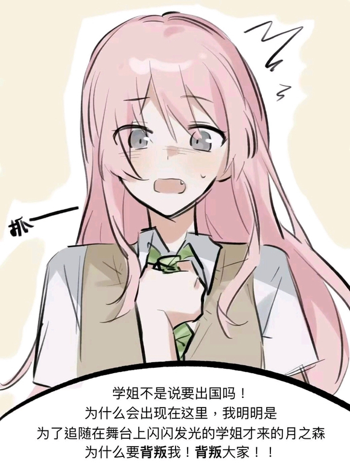
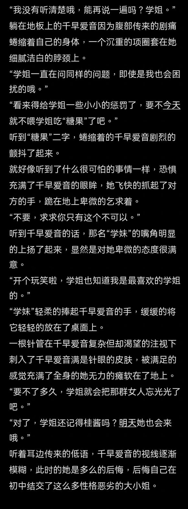
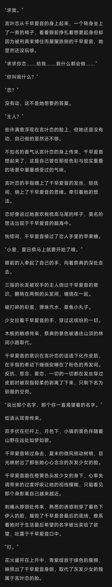

# 失足少女千早爱音

**作者:井田詩織**

## 1

有牛
某人写了个劲巨大的文，但他没有写完，我戒断反应犯了，所以我来写了。
总之大概是这张图的四创？
  

## 2

“我没有听清楚哦，能再说一遍吗？学姐。”
躺在地板上的千早爱音因为腹部传来的剧痛蜷缩着自己的身体，一个沉重的项圈套在她细腻洁白的脖颈上。
“学姐一直在问同样的问题，即使是我也会困扰的哦。”
“看来得给学姐一些小小的惩罚了，要不今天就不喂学姐吃“糖果”了吧。”
听到“糖果”二字，蜷缩着的千早爱音剧烈的颤抖了起来。
就好像听到了什么很可怕的事情一样，恐惧充满了千早爱音的眼眸，她飞快的抓起了对方的手，跪在地上卑微的乞求着。
“不要，求求你只有这个不可以。”
听到千早爱音的话，那名“学妹”的嘴角明显的上扬了起来，显然是对她卑微的态度很满意。
“开个玩笑啦，学姐也知道我是最喜欢的学姐的。”
“学妹”轻柔的捧起千早爱音的手，缓缓的将它轻轻的放在了桌面上。
一根针管在千早爱音复杂但却渴望的注视下刺入了千早爱音满是针眼的皮肤，被满足的感觉充满了全身的她无力的瘫软在了地上。
“要不了多久，学姐就会把那群女人忘光光了吧。”
“对了，学姐还记得桂酱吗？明天她也会来哦。”
听着耳边传来的低语，千早爱音的视线逐渐模糊，此时的她是多么的后悔，后悔自己在初中结交了这么多性格恶劣的大小姐。  

## 3

点击展开，查看完整图片
  

## 4

言叶恋今天早上发现了两个有趣的现象。
一是自己的最喜欢的学姐只要一看到尖锐的物体就会呼吸加速。
二是曾经无比闪耀的前学生会长大人，晚上睡觉居然会踢被子。
“学姐真是的！怎么又没盖好被子，这样下去肯定会生病的。”
宠溺的用被子盖住了千早爱音被脚铐磨出血的脚踝，恶魔的声音又一次传入了千早爱音的耳中。
“今天大家讨论了一下呢，我们都觉得学姐应该差不多已经上瘾了，即使是放出去了肯定也不会跑掉。”
“所以说大家决定要把学姐放回家哦，虽然我本人是希望继续把学姐养在家里啦。”
千早爱音刚想开口说什么，但对方好像是猜到了她在想什么似的，打断了千早爱音的话语。
“不过学姐不用担心父母哦，我已经用学姐的手机给叔叔阿姨报过平安了。”
“我为什么会知道手机的密码？学姐这几天吃完糖果后特别乖问什么答什么，学姐的事我已经全都知道了呢。”  

## 5

“不管怎么说，恋她做的实在是太过分了！”
名为侑色桂子的短发少女气的浑身发抖，她将哭泣的千早爱音紧紧的搂入怀中。
“桂子……你说我做错了什么……为什么大家都这样对我！”
如同落水之人抓住了那救命的稻草，面对来自昔日挚友的关心，千早爱音再也忍不住了。
“这几天我不敢喝水……一喝水我的侧腹就密密麻麻的痛。”
“我的心脏好像要跳出来了一样……我真的好害怕……每当我心情不好的时候我就会忍不住的去想恋的药进入我身体的感觉。”
“你说我会不会死啊，桂子。”
千早爱音抬起头来注视着对方。
“我真的不想这样，我也害怕恋她们会因为我的事进监狱。”
“我也试过忍住，但每次恋发现我在忍耐时，她就会惩罚我。”
“开始时她只是断掉我的药，后来她开始用手指轻轻的划过我的皮肤，那种感觉不断的引诱我去回忆药物进入身体的感觉。”
“再后来当我快忍不住的时候她就会用装满药物针管一点一点的划过我的皮肤。”
“我想我永远忘不了那种感觉，些许的疼痛带着熟悉的感觉刺激着我对我每一寸皮肤。”
“弥漫在空气中的药物的味道和恋身上的香味填满了我的大脑，让我失去了理智。”
“我屈服了，我告诉她我再也不会想着去忍耐了，她让我做什么我都会去做，但恋就好像听不见一样。”
“这样的折磨每次都会持续好几个小时，直到我被折磨到筋疲力尽，戒断反应的痛苦因为神经的麻木而暂时消失，在我意识朦胧即将睡去时恋才会把药注入进我的身体。
“求求你不要把我当成一个懦弱的人，桂子，但是我真的做不到。”
“恋真的变了，她不再是那个永远跟在我身后的学妹了，她变得好可怕，她乐此不疲的玩弄着我脆弱的抵抗，享受着摧毁我身心的感觉。”
“桂子……我真的好害怕……你说我是不是完了。”
侑色桂子没有回答挚友的话语，她捧起了千早爱音的脸，拭干了她眼角的泪水。
落日透过车窗照在两人的身上，怀中少女的灰色眼眸在她苍白皮肤的衬托下显得那样楚楚可怜。
千早爱音意识到了对方想要做什么，她注意到了自己的一滴泪珠或许是因为刚才的相拥沾染到了桂子的睫毛上，看着那滴泪珠在视野中逐渐变大，逐渐变得模糊，千早爱音闭上了双眼。
也许是因为被握住的心充满了对于被拯救的渴望，千早爱音敞开胸膛接受了天使的双翼的临幸。
良久后，千早爱音感觉有什么东西被桂子用舌头送了过来。
她刚想进行抵抗，一根手指就摁在了她的脖子上，干呕的感觉涌上来了，那样东西在千早爱音条件反射的吞咽动作中进入了她的身体。
千早爱音无力的软在了椅子上，大口呼吸着新鲜的空气。
“不要怕，这是美沙酮，它会让你好受一些。”
“每天两粒，以后我会看着你按时服药的。”
重新拭干千早爱音因为慰藉留下的泪水，侑色桂子搂住了千早爱音的腰，伏在她的耳边低语到。
“时间不早了，再不回去爱音的父母也会担心的吧。”
“我不允许爱音的闪耀因为这种事情暗淡。”
“如果爱音碎掉了，那就由我来承担爱音的人生。”  

## 6

大伙觉得上一篇是不是有点用力过度了当时写上头了，现在再看总觉得有点尬  

## 7

“看来小爱很喜欢素世同学啊。”
熟悉的名字传入了千早爱音的耳中，她的脸一下子就黑了下来。
把梳子从自己青梅竹马的粉色头发中抽出，千早爱音声音低沉的说到。
“长崎素世吗？”
“桂子找她有事？”
“没有哦，只是小爱总是提起她，让我有点好奇而已。”
“我跟她不是很熟。”
“不过她和桂子一样也在月之森上学。”
“说起来，桂子开始留长发了呢。”
千早爱音的声音重新轻快了起来。
“小爱喜欢吗，这是专门为了你留的哦。”
“桂子酱，LOVE！！”
千早爱音扑到了眼前的少女怀中，但还没等她开始撒娇，侑色桂子就将她反身压在了身下。
“是吗？那小爱能证明给我看吗？”
侑色桂子将手指搭在嘴唇上，居高临下一脸坏笑的看着身下的千早爱音。
一抹红晕攀上了千早爱音精致的脸。
“好美。”
这是千早爱音的第一个想法。
“不对，我怎么又被这个该死的女人调戏了。”
这是千早爱音的第二个想法。
“从来都是我调戏别人。”
“凭什么在她面前我只有吃瘪的份。”
“明天一定要让这个女人付出代价，让她知道谁才是姐姐。”
“等等，实在是太近……”
这是千早爱音被强吻前的最后一个想法。  

## 8

“侑色桂子你弄疼我了！”
千早爱音坐了起来，跪在沙发上扶着座椅靠背大声的喘气。
“我好渴啊小爱，能帮我去拿杯水吗？”
“听我说话啊你这家伙！”
侑色桂子把扎好的头发放了下来，侧过头看向千早爱音，露出了一个俏皮的笑容。
“刚才一直是桂子在付出哦，我们的枕头公主躺在下面可是动都没动。”
“整整十七分钟唉，即使是我也是会累的啦，小爱就帮我倒一杯水嘛。”
“你还知道有十七分钟啊！”
千早爱音看着眼前这个令人火大的女人气不打一处来。
说好的三分钟就停，结果这个女人一尝到甜头就停不下来了，三分钟变六分钟，六分钟变九分钟。
“最后三分钟了，不骗你小爱，真的就是最后三分钟了。”
再后来她直接不装了，仗着爱音力气没有自己大，直接把已经挣扎到脱力的爱音摁在身下强吻。
这还是自己印象中的一直跟在自己身后的青梅竹马吗？
千早爱音打了个哆嗦。
“小爱，这是今天的药哦。”
侑色桂子的话打断了千早爱音的思绪，把刚才还沉浸在青梅竹马编织的温柔乡中的千早爱音重新拉回了现实。
“明天是跟恋约定的日子呢。”
千早爱音没有说话。
“对不起小爱。”
侑色桂子握住了千早爱音的手
“我没有恋那样的家室，不能保护你免受这一切。”
但是我可以带你逃走，我们可以去一个任何人都找不到的地方。”
侑色桂子帮爱音服下了美沙酮，给她盖上了毯子。
看着目光逐渐迷离的千早爱音，侑色桂子继续说到。
“等你想好了就告诉我。”
“我是小爱一辈子的朋友，我愿意承担小爱的一切。”  

## 9

我从小就是父母口中的好孩子。
我从小学开始就总是班上的第一。
在我出生前父母就给我的人生制定好了我一直以来遵守着的计划。
我以为我会考上某所大学，和父母的某个“朋友”的儿子结婚，生下一两个孩子。
也许我会找一两个情人，和我的丈夫一样，如此度过三五十年，直到一个一如既往的下午，亦或是晚上。
但是我遇见了你，爱音。
你愿我怎么称呼你？
学姐，爱音，还是小爱？
你美好的如此不真实，
让我的视线无法离开你。
让我感谢上苍我还活着。
我把织女星比作你，但却感觉还是南河三更贴切。
即使是今日，我也一遍遍思索着那个曾经的你
我希望你有所同感，
无数次迫切的想要让你告诉我这颗红宝石是真的。
你明明成为了我人生中的加百列。
却让我成为了折翼的伊卡洛斯。
你是那耀眼的卡岗图雅
让我撕碎自己的躯体摆脱家族的锁链。
但你却在伦敦摔碎了你的面容
你是我跳级也要接近的梦
那你为何要在那天让我看到你跪在雨中的身影。
吉他的断弦是你的狼狈，是也是我碎掉的梦，因你而存在的那个新的自我。
我恨你，你是我触不可及却又一遍遍追寻的冬季大三角。
但你却毁了名为千早爱音的天使，毁了我的一切。  

## 10

思绪被敲门声打断。
“学姐，你来啦。”
颤抖替身体的主人做出了回答。
“学姐为什么要害怕呢？”
“学姐难道不知道吗？恋最爱学姐了。”
仍然没有回应，千早爱音熟练的跪在了地上。
从后面记上了手铐，千早爱音因为系在脖颈上的项圈被拽紧而被迫抬头，言叶恋俯视着跪在地上的白月光。
突然急促的呼吸伴随着双唇微张露出的虎牙，毁灭的快感涌上了全身。
言叶恋相信学姐此时一定也被同样的感觉充盈。
毕竟，自我毁灭的快感是难以抵挡的。
不过这也不重要了。
因为学姐很快就会一如既往的忘记一切。
涣散的瞳孔只能映出自己的身影。
“那么，要开始了哦。”
千早爱音失去控制的目光饥渴的注视着言叶恋吸入注射器的药物。
“学姐这两天有乖乖的吗？没有把我们的秘密告诉爸爸妈妈吧。”
忘记了桂子的承诺，碘液冰凉的感觉刺激着千早爱音的神经，让她难以自控的渴求着那些梦幻。
针管划过皮肤的刺痛伴随着渗出的丝丝血滴，引诱千早爱音遐想的意味已经胜过了皮试本身，在她欲望的默许下，言叶恋轻柔的剥离了千早爱音的最后一层理智，将她们放入了口中，融化在粉舌的翻弄下，混合在唇齿间的津液里。
就连她的自我，都伴随着那缥缈的灰发女孩背影被齿间的轻咬彻底碾碎。
此时千早爱音已经消失了，现在剩下的只是名为千早爱音的雌兽。
针管刺入了后腰，瞳孔收缩，双腿痉挛。
但熟悉的感觉却并没有临幸于她。  

## 11

“求我。”
言叶恋从千早爱音的身上起来，一个转身坐上了一旁的椅子，看着眼前挣扎着想要起身但却因为被刑具束缚住而屡屡跌倒的千早爱音，她显然还没玩够。
“求求你恋……给我……我什么都会做……”
“你叫我什么？”
“恋？”
没有动，这不是她想要的答案。
“主人？”
些许满意浮现在言叶恋的脸上，但她还是没有动，自己做的显然还不够。
不知名的香气从言叶恋的身上传来，千早爱音想起来了，这是自己曾在那些色彩与现实重叠的场景中屡屡感受过的气味。
言叶恋的手指缠上了千早爱音的发丝，轻抚间，绕上了千早爱音的思绪。牵引着她的想法。
恋好像说过她喜欢我梳高马尾的样子，莫名的想法出现于千早爱音的脑海中。
恍惚间，千早爱音接过了恋人手里的苹果糖。
“小爱，夏日祭马上就要开始了哦。”
眼前的人牵起了自己的手，向着祭典的深处走去。
三指的长发被双手的主人绕过千早爱音的意识，翻转在两侧的头发间，缠绕在一起。
被打碎的彩蛋，弹珠汽水，章鱼小丸子。
少女拉着千早爱音的手，穿过这缤纷的一切。
木板的触感传来，祭典的景色被通往山顶的林间小路取代。
千早爱音的意识在言叶恋的话语下化作皮筋，在手指的牵动下缠绕安睡在了粉色的秀发间。反抗、思念、爱恋、一切的一切都在发丝穿过皮筋时被双指轻柔的剥离了下来，只剩下名为驯服的空壳。
“说出那个名字，那个你一直渴望着的名字。”
低语从耳旁传来。
双手伏在栏杆上，月色下，小镇的景色伴随着山野在远处如梦如歌。
千早爱音转过身去，夏末的微风挑动树梢，目光映射出了那张她心心念念的灰发少女的脸。
千早爱音跪在橙黄色头发少女的身下，心率失调带来的过度呼吸让她的视线模糊，只能看见那个身影离自己越来越近。
刺痛从脖颈处传来，熟悉的诱惑刺穿了暮色下伊人的脸，摧毁了千早爱音最后的底线，维系着她对于生活最后希望的名字被出卖给了欲望，吐露于千早爱音口中。
“灯。”
花火盛开在上升中，青紫绽放于绿色的簇拥，映照出了千早爱音身侧，取代了灰发少女的独属于言叶恋的脸。  

## 12

一共三篇，大家能看到吗  

## 13

89楼补档
点击展开，查看完整图片
  

