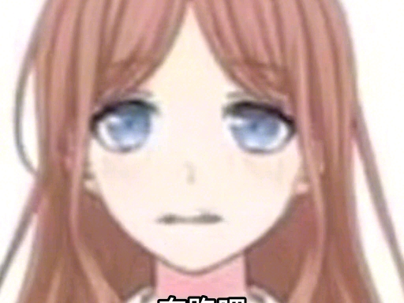

# 恋诗癖长崎素世

**作者:久遠寺缸珠·高冷男神**

## 1

长崎素世，表面上是月之森的一名学生，一位温文尔雅的大小姐，但其实，她有一个非常另类的癖好——恋诗癖。她多年来一直将这个爱好压在心底，直到飞鸟山战役失败，她的心理防线彻底堤溃，这个危险的癖好重新展头露角，素世决定不在压抑自己，彻底释放积压多年的裕望。
  

## 2

羽丘大门外。
“小祥，能去我家一趟吗，我有些事想和你聊聊呢。”素世玩弄着头发，装作害羞少女的眼神。
祥子没看到一样与她擦身而过，高傲地挺起胸膛，继续向前移动。
“等等！”素世一阵小跑追上她。
“这次之后，我就再也不来打扰你的生活了。”
“……走吧。”
池袋•超级大楼•顶层。
会客厅中祥与素世面对面坐着。
“有什么事赶紧说吧，我还有很多事需要处理。”祥子依然高傲的闭着眼。
“如果是关于苦劳西裤的事情，我劝你还是死了这条心。”
“是吗……”素世最后的一丝理智被这句话吞没，接下来，就忠于裕望吧。
发觉素世久久没说话，祥子睁开一只眼，却看见可怖的一幕：眼前的亚麻发色女孩正攥着水果刀朝自己脖颈位置袭来，刚想躲避已来不及。
“噗呲”刀已插进脖子右侧，剧痛袭来，鲜红的液体从伤口流出来。祥子瞳孔紧缩，不敢相信地望着她，这个一直温柔的如同祥子已故母亲的女孩，不断央求自己回去的女孩，怎么会变成这个样子？  

## 3

素世毫无平时的温和，狰狞的笑容印在在脸上，眼珠几乎要凸出来。
祥子痛的说不了话，她双手抓住刀身，试图将其抽离身体，奈何痛楚让她发挥不了全部体力，只能勉强让刀尖不再深入，素世握住刀柄的双手更加用力，祥死死的攥着刀身，手被磨出血，水果刀被双方同时施力微微颤抖。
这样僵持下去不是办法，素世决定略施小计。
“欧内该，没有小祥的话，瓦达西！”
“你这个人，这是满脑子都是自己呢。”祥完全不顾脖子上还插的有把刀。
检测到关键词后需要说出对应语音，此乃丰川祥子的底层代码。素世趁着她说话的间隙猛地使力，将刀身完全插入祥子的脖颈之中。祥的瞳孔再次缩小，完全没了任何反抗的力气，双手无力放下。素世执着水果刀在她的脖子上磨搓，露出当中的血肉，血如喷雾一样，染红了家具与soyo，衣服身体红着一片。
祥子的瞳孔逐渐扩散，失去高光。几分钟后，彻底没了动静。
这是几天前的事，那之后，素世痛快的享用了祥的诗体，与着僵硬的肉体卿卿我我，69，SM，木马，呵袅………凡是她以前意银的事都做了一遍，而现在……
“嗡嗡嗡嗡…………”放置诗体的房间是漫天飞舞的苍蝇。客观事实并不会随着人的意志发生改变，祥子已腐烂的不成人样，完全是一摊烂肉，发出令人难以忍受的恶臭，无数的苍蝇在她身上产卵，她皮肉有许多的凸起，不断向前颤动，那是幼虫在表皮下蠕动，不断摄取生存所需的营养。
soyo已经犯了故意纱人与侮辱诗体两条罪行，就算是在邦多利，这也是非常没有道德的体现，soyo已经无法回头了。
“啪嗒！”
祥的眼珠掉到了地上，眼槽缓缓钻出一条白白胖胖的条状物——一条蛆。它肆意扭动着身体，尽情释放着生命力，与蹲坐在地上的soyo不同，它有着光明的虫身，大好的前程。
“啧”soyo看着它，发出不满的声音。
“去找新的猎物吧。”  

## 4

月之森，正午
黄瓜田，绿发少女照常在其中劳作，白皙的手指提着水壶，清澈细小的水珠温和洒在黄瓜上，渗入泥土中，滋润她心爱的黄瓜苗，翠绿的小黄瓜上布满一颗颗水滴，反射着光线，十分耀眼。琥珀色的眼帘注视这一切，脸上没有任何表情，少女似人偶一般，美丽，却无法操纵自己。
“若叶睦！！！”soyo看见她心里就一团火，在soyo看来，导致crychic解散的罪魁祸首就是她，要是没有那句“我从没觉得玩乐队开心过”，自己定能阻止小祥退团;在飞鸟山战役中，她更是当场背刺，导致自己就算下跪也无力回天。但凡她有一次站在自己这边，自己也不至于沦落到玩诗体的地步。
虽然心中怒意满满，但现在只能硬憋着。
“中午好呀，小睦。”soyo移步到睦身旁，强堆着微笑，发出招牌夹子音。
“soyo。”睦将水壶稍微上抬，停止浇水，望向一旁的soyo。她今天有些奇怪，soyo自从飞鸟山之战后便再没理过自己，今天为什么会主动上门？
“小睦…还在想小祥的事吗？”
“嗯。”几天前，saki无缘由的消失了，任何地方都找不到她。
“别担心，你们肯定很快就能见面的。”soyo的语气很柔和，她将睦搂在怀中。
“这样消沉下去可不行哟，要来我家坐坐吗？”
睦还未反应过来，耳边的热气仍在荡漾。soyo在明显的孤立自己后，竟然突然关心起自己，还邀请自己去她家做客，这在以前都未曾发生过。为何soyo会做出如此古怪的行为？睦用她聪明的小脑瓜思考一会儿，得出结论：
“soyo，坏掉了。”
“？”  

## 5

4
池袋一栋极其霸气大楼的顶层，便是soyo的所在地了。
睦坐在会客厅柔软的沙发上，在其它世界线中，会客厅是神圣的教培场所，soyo会在此使用昏睡红茶将客人迷晕后，与其在沙发上吉列豆蒸。然而这里的soyo是恋诗癖，活人似了才能获得与她的教培权。
桌子上摆着刚沏好的红茶，正往上冒着热气，茶水的醇香钻入鼻腔，清新的味道让人心情变好。眼前热气腾腾的红茶以及笑脸相迎的soyo，一幅温馨的画卷，睦好久没有这么简单的幸福过了。自c团解散后，祥便没给过好脸色，soyo也只是将自己当作传话筒，自己的朋友却也只有这两个，只能两边讨好，结果却不尽人意……现在，自己终于被温柔对待了，不管是不是真心。自己现在，很开心。
“小睦，再不喝的话，茶就要凉喽。”
“哦……”这声提醒把她拉回现实。
睦握住茶杯的把柄，将其移至脸旁，嘴唇动了动：
“谢谢。”
“不用谢哦。”
红茶依旧有些烫，睦用汤匙舀了一小勺，送到嘴边轻轻吹凉，倒入口中。刚进口睦就觉得有些天旋地转，耳边有些嘈杂的声音。但她没多想，紧接着舀了第二勺送入嘴中。眩晕感明显增强，感觉身旁一切都在旋转，耳边“嗡—————”的声音不绝于耳。睦面露难色，放下茶杯，用手按住脑袋。眼前的soyo分裂成好几个模糊的残影。
“小睦！怎么了，不舒服吗？”soyo的声音逐渐远去，沉重的眼皮将一切画面关闭。
见眼前的少女完全昏迷，soyo咧嘴笑起来起来：“ひひひひ，这可是用真白学姐🧦泡的茶。”
真白的袜子具有强烈的致幻性，此事在灯的笔记本中亦有记载。  

## 6

5
睦觉得自已在飞,她飞在大草原上，天气十分阴郁，下方有许多锦羊，机械运动股吃着草，耳鸣也只增不减,耳边槽杂的躁言让她感觉十分混乱。
“肚子…”
自己的肚子不知何时已涨地同运肚般大，表层有许多凸起，正飞速蠕动，像是会移动的疙瘩。
“啪！”肚子突然间诈了，数不尽的翠绿黄瓜倾斜而出，纷纷散落至草地。似乎是为了谴责高空抛物这种不道德的行为，下面的羊一帧一帧转过头，齐刷刷地盯着睦。……那不是羊，它们的脖颈上，挂的是soyo的头。
睦被这骇人的一幕惊醒，耳鸣逐渐离自己远去。她撑开自己疲惫的眼皮，现实的景象重新回到视线当中。自己在一个很黑的屋子，空气中弥漫着令人作呕的恶臭，无数苍蝇盘旋在此地，发出烦躁的“嗡嗡”声。
“小睦，你醒了吗？”
“啪嗒”灯被打开了，亮光刺进瞳孔，睦本能地闭上眼睛，在有些适应后，缓缓睁开。
眼前的人正是soyo，而自己被绑在椅子上，双臂被扶手上的镣铐牢牢锁住。
“soyo…何意味？”睦脑子里满满的疑问，为什么刚刚还在与自己和气地喝茶，现在又把自己栓起来？
“都是小睦的错哟。”
“……”
“要不是小睦，crychic根本不会解散。”
“…crychic，不会长久。”
“为什么？”
“……”
soyo不耐烦的扯下眼皮。
“小睦每次都是这样，小祥的事也好，crychic的事也好，小睦都不愿意告诉我。”她转过身去。“这是对小睦的惩罚。”
“对不起…”
“道歉可没什么用，得好好让小睦长长记性呢。”
soyo走到一大滩烂肉旁，捧起一个圆形物体，转向睦。
“这个就是小睦你心心念念的小祥呢。”那几乎看不出是个脑袋了，皮肤黝黑，满是诗斑，两个空洞的眼槽中，密密麻麻的长满蛆，它们在当中不停扭动，一大片蠕动的白簇与漆黑的眼槽形成强烈色差。
“小祥！soyo…为什么…”
“因为我很喜欢小祥哦。”
“soyo，脑子坏掉了。”
“随你怎么说，如你所见，你的小祥已永远回不来了哦。”soyo故意挑动睦的心理防线。
“…纱掉我。”
“诶，小睦这就认输了？”
睦点点头：“因为，小祥似掉了。”
soyo的愤怒终于绷不住，倾巢而出：
“整天祥子祥子祥子，祥子是你跌啊？为什么每次都要无脑站在祥子那边？为什么一次都不帮我？祥子让你不说你就什么都不说了么？”这句话几乎是吼出来的。
这样点难说，祥在切割丰川家后，因生活压力被迫退出c团，她是最受伤害的，怎样在不违背祥子遗言的情况下，表达出祥是该最优先照顾的呢？睦沉思良久，决定开口：
“因为，小祥比soyo重要。”
soyo震惊的无以复加，随后凶狠地裂开嘴角：
“好哇，若叶睦，你终于承认我在你心中就是一坨💩了啊。好，那么好——”睦在soyo心中也只算一坨💩，但soyo不允许自己在别人心中是坨💩，虽然在saki心中自己也只算坨💩
“不是的，我……”睦见soyo好像误会了什么，连忙解释。
“放心吧，若叶睦，你不会似。因为，你，罪当万死！”  

## 7

6
soyo拿起旁边的小刀，在那滩“祥子”中切出一小块，端到睦嘴边。
“吃下去。”
腐烂好几天天的诗块早已惨不忍睹，这块肉布满诗班，臭气直冲鼻腔，差点把睦熏晕过去，肉块甚至还在颤动。生物本能让睦紧闭嘴口，微微摇头。
“小睦不乖呢。”
soyo放下乘着肉的小刀，右手摸出一根竹签，左手抓住睦的食指。
“soyo…不要……”在意识到面前这个16岁jk寡妇要做什么后，睦惊恐地挤出这几个字。
但毫无作用，对准指缝后，便飞快捅进去。
“吚吚—————！！！”钻心的痛楚顺着指尖传递到大脑，指缝在一次剧烈疼痛后便火烧似的难受。她现在呼吸紊乱，心脏狂跳不止。眼角挤出些许泪珠。
“阿啦阿啦，就只进去了这么点，小睦就受不了啦？大小姐可真是金贵呢。”
确实如soyo所言，透着指甲可以看见，竹签只插进了1/4。
“如果不吃的话……”
soyo用指头弹了弹竹签，进入指甲的那部分也受到这份力的作用，十分微弱的震颤一下。
“噫呜呜……”仅是这轻微的一下，都让睦感到穿心之痛。
“这根竹签会完全进去。”soyo挂着邪魅的笑容。
只是捅进一点都让睦觉着到鬼门关走了一遭，完全进入会多疼？睦无法想象。
“我……会吃的。”这句话，带着哭腔。  

## 8

7
“早这样不就行了，来，啊——”
那块肉又回到自己嘴旁，睦闭着眼，停止呼吸，张开小巧的嘴。有块冰冷的弹性物体掉到舌头上，有些粘腻，臭味则慢一步扩散在嘴中。
“对了，不能吐哦。”
睦努力让自己不去感受那些气味。她慢慢咬下，企图切开肉块，但在这个过程中，牙齿似乎压爆了什么东西，苦腥味在口腔中炸开。自己可能……咬到蛆了。
没等睦回过神，生物本能便将口中的东西及胃里的食物一起清出。
“呕——”她低头呕吐，肉块跟着被染黄的隔夜饭通通被吐到裙子上。
“我应该说过，不能吐的吧——”
这句话如同丧钟，睦霎时瞪大双眼，全身止不住的颤抖，呼吸急促。
“对不起…我以后不会吐了…”
“不行，小睦老是不听话，必须让小睦记得牢些呢。”soyo一只手已拈住竹签中端。
“不要…不要不要不要！”这是睦情绪最激动的一次，心脏狂跳，恐惧写在脸上，眼巴巴望着soyo，期盼她停手。
“哒咩。”
soyo拈着竹签一左一右转起来，并同时向下深入。转动的竹签折磨着每一寸神经，指缝有不少神经末梢，稍微有异物插入就会剧烈疼痛，而这样的转动刺激，很难想象会多痛苦。
“啊啊啊啊啊啊啊啊啊啊啊啊啊啊啊啊啊—————”这大概是睦这辈子说过最长的话了。痛至骨髓，语言无法描述的痛苦，心脏都跟着刺痛，强烈的疼痛使她连呼吸都无法做到。
“哇啊啊啊啊啊啊啊啊啊啊啊啊啊啊—————！！”竹签左右搅动，充分刺激指甲下面丰富的神经组织。指甲中的肉渗出血，染红了一小片。
“啊嘎啊啊啊啊啊啊啊啊啊啊啊啊啊啊啊咔咔。”竹签仍然在不断深入，手指颤抖，然后引起竹签进一步振动，疼痛愈发剧烈。撕心裂肺的惨叫响彻整个房间，但soyo家有概念级的隔音效果，因此毋需担心。
过了许久，竹签插入了最低端。人偶一样的少女连气都喘不上，她瞪着眼睛，张嘴艰难喘息，胸口明显地一起一伏，眼角刻着泪痕，食指不断有血滴出。若叶睦感觉心跳变慢了，呼吸也困难，身体渐渐凉下去。正常人到这已经差不多了，但乐队少女的生命力异于常人，因此暂时还没事。
睦的大脑一片空白，嘴角又有冰冷触感传来。
“吃下去。”  

## 9

8
几日前，灯不见了。那天的排练她没去，手机也联系不上，第二天放学，听爱音说，她没去上课， 去问了她父母，也说昨天没回家。立希意识到，tomorin，失踪了。
这些天立希四处打听，却毫无结果，完全没有任何消息。
“只能是她了。”想到前些天最后一次见到灯的情景，她握起拳头。
月之森，傍晚。
“再见——”
soyo与同学道别，优雅端庄。走出大门，却发现一个熟悉的身影，摆着一幅死沉的面相盯着自己。
“借一步说话。”
一条隐蔽的巷子里，二人对峙。
“灯的事，和你有关系吧。”立希交叉双臂放在胸前，后背倚着潮湿的墙面。
“小灯的事？我完全不知道诶。”
“别装了，灯最后一次出现时就是受邀去你家，从此之后再也没出现过。”
“诶，你怎么知道的？”soyo在短暂震惊后注解：
“我是指我邀请过小灯这件事。”
“我当然知道。”
立希有个特殊癖好——喜欢尾随灯，视奸暗恋之人的刺激感让她欲罢不能。
“看你这样子，是被我猜中了吧。”她步步紧逼。
“真是的，偷窥可不是什么好习惯。我确实邀请过小灯，但到了晚上她就回去了。后面出了什么事我也不知道。”
“真的？”锐利的眼神仿佛要刺穿素世。
“当然，你有证据说是我干的吗？”
立希有些拿不准了，只因灯最后和soyo在一起就断定是她，这样确实有些不妥，但这也确实是可能性最大的推断了。
“我会到你家检查。”立希闭眼抛出这句话，如果真是她做的，家里必定会有些马脚。并且自己有带防狼喷雾，不用担心安全问题，这一步，稳赚不赔。
“是吗，那就去吧。”  

## 10

9
压下刻着45的方形按钮，电梯开始缓慢上升，在不久后，铁门朝两边打开。踩在瓷砖铺就的地板上，立希紧紧跟随这位亚麻发色jk，二人的脸色都不太好，气氛很是凝重，压得人喘不过气。
soyo在一扇门前停下，将手中的钥匙插入锁孔，向右扭动，门开了。
“请进吧。”
踏进房门，身后传来“嘎吱”关门声。房子真是大的惊人，也确实冷清，会客厅还是老样子，依旧是几大坨沙发围着桌子。
背后突然一凉，从关门起，便没察觉到soyo一丝的气息，这不对劲，生物的第六感告诉她危险即将降临。还未来得及发出“转头”的指令，一只钝物便砸到头上。这是一把贝斯，由于贝斯挥动时毫无声响，因此很适合做偷袭武器，这把凶器就挂在门后，由于是视野盲区，立希根本没有发现它的存在。
头很痛。脑子被击中的冲击让她几近昏厥，耳边嗡嗡作响，周边的物体都在旋转。但她还是发出明确的指令：拉开距离。
立希整个人摇摇晃晃，踉跄几步，向前移动不少距离。
后面传来沉重的脚步声，soyo在拉近和自己的距离，她猛然回头，那把贝斯正朝自己的脸横劈过来，立希脑袋后仰，惊险躲过这一击，同时右手掏出防狼喷雾，准备抓住破绽喷她一脸。
背部这时却受到撞击，这一脚劲够足，把她踹出去两米远。立希被踹翻在地，艰难地翻过身，面朝soyo，右手握住掉落的喷雾，左手撑在地上，猛地发力，将整个身体送出去，扑向soyo。
soyo将贝斯挡在眼前，阻挡喷雾。立希见状，握紧左拳，奋力打在soyo毫无防备的小腹上。
“呕——”
受到疼痛的刺激，soyo拿着的贝斯向下移了十多厘米，这给了立希可乘之机，soyo的眼睛完全没有任何防护，暴露在空气中，更要命的是，在出拳时，喷雾的枪口便已对准了贝斯后方的眼睛。  

## 11

10
“就是现在口牙！”大拇指摁下活塞。
“噗———”
大量浓烈的辣椒水冲入眼中，当soyo意识到要闭眼时，早已来不及。双眼像被千根针扎破一样痛，她捂着眼睛在地上打滚，痛苦嚎叫。
看着眼前女人的惨样，立希拍拍身上的灰，走向门口。她这次的目地只是收集证据，胸口伪装成纽扣的微型摄像头已将刚才的全程拍下。接下来，只要将录像送到警视厅，便足以证明soyo的罪行，后面的事交给警察即可，灯不久后就会被找回来的。
立希认为，是soyo拐卖了灯，现在的灯不知在谁的手里。因此过多停留已无意义，后面警察去审问soyo就是了。
很奇怪。头更晕了，身体跟石头一样沉重，每走一步都艰难不已。
“只要能到达那里…只要能到达那里…”
头晕目眩。门的图像裂成几道残影，自己甚至连路都看不清，头痛的像要裂开。最终，无敌的立希倒下了。
“塞牙哭…”
听见阵亡音效后，soyo立刻停止了翻滚，从地上坐起，一脸病态望着倒下的立希。
“呵呵，都在计划之内呢。”
在囚禁了灯后，发现小灯失踪的立希果然急得团团转，最后顺藤摸瓜找到自己，这样就有机会把她带进屋内。
在她们开战的附近，有一台空气加湿器，里面装着特制麻药，无色无味，在路上时，soyo就遥控启动了它。吸入这种雾气后，麻药会顺着血液流过身体的每一个部位，最后瘫软无力，令人宰割。因此，她要做的，就是与立希发生激烈运动加快血液流动，从而让麻药更早生效，考虑到这一点，她早早将贝斯挂在门后，为之后的打斗做伏笔。 而soyo为何无事？早在立希跨进房门时，她便生吞了解药。
“很期待你之后的表情哦，taki酱～”  

## 12

11
勉强睁开眼，头还有些晕。眼前是一间从未见过的黑屋子，只靠几盏西欧烛台照明，附近的环境能够看清更深处就完全是一团漆黑了。
“这是哪儿？”嘴中慢慢吐出几个字。
“是我家哟～”令人心烦的夹子音，soyo从黑暗中缓缓走出。
“长崎素世！”黑发女孩恶狠狠地瞪着她，牙齿咬地咯咯响。刚想冲上去打烂她的那张脸，却发现自己的双手被铐起，粗重的铁链接着背后的墙。
“哎呀，不要那么激动嘛，我来给你见个熟人吧。”
她扯扯手中的锁链，一位短发女生便困难地同虫子般爬至身旁。
“tomorin！”
“taki…”灯望向立希，脸上毫无血色，眼角红肿。“我好害怕…”
“果然是你囚禁的灯吧，虽然不知道你有何目地，但我劝你，放了她。”
“如果我不放呢？”
“你会后悔的。”
“啊——？那就让我看看可活动半径不到一米的你，怎样让我后悔吧～”
“素—世—”立希牙咯的更响了。
“你的心情很不好呢，一直用杀人的眼神盯着我。”soyo拿出一把小刀。
“让我给你消消火。”
刀尖抵在脖子上，冰凉的触感在脖颈处扩散。脑中警铃大作，灯被吓的发抖，冷汗从额头流下，心脏“砰砰砰”跳得飞快。
“你要干什么？放开灯！”立希朝着眼前这个恶妇怒吼。
“我觉得小立希收收脾气比较好哦，因为…”soyo的小刀微微划动。
“小灯随时可能没命哦。”
“你……”立希尝试压抑自己心中的怒火，做了几个深呼吸。
“你要我怎么做你才能放过灯？”
“诶——求我吧。”
立希强行镇定下来，慢慢地吐出字：
“求你放了灯。”
“态度不够，重来！”
“我，椎名立希，求你放过灯。满意了？”
“啊——看在你这么诚恳的份上，那我就—————”soyo注意着立希脸上的表情。
“拒绝。”
“？”
刀光在脖子上划出一道弧线，脖颈随着刀尖被切开一道口子，赤红色液体顺着伤口溢出体外。灯震惊地睁大双瞳。
“呜呜呜呜呜呜呜呜—————”
脖颈处疼，非常疼，痛得她连尖叫的力气都没有。原本被皮肤保护的血肉暴露在空气中，有点凉飕飕的。从未感觉死亡离自己如此近过，身体愈发变冷，灯仿佛看到了祥母在和自己招手。
“长崎素世，我（）你🐴！”立希完全丧失了理智，口无遮拦。
“灯，你不会有事的，你放心，不会有事的……”她疯狂摆动双手，企图拜托着如同诅咒般的东西，然而毫无作用。“哗啦啦”的声响回荡在屋中。
“小灯这个样子不出几个小时就要死了吧，给你个选择，是现在结果了她，给她个痛快；还是遵从你虚伪的感情让她受尽煎熬再死呢？”
立希因愤怒瞪大的眼睛望着灯，好像移开一秒这个少女就会死去一样，现场只剩下急促的呼吸声。  

## 13

12
“立希昏过去了呢，小灯，用你的歌声唤醒她吧。”
soyo的刀深入伤口中，上下胡乱翻动。
“呃，呃呃呃呃呃呃呃呃呃呃————”完全是要死掉的声音。
“tomorin！住手！”
“这不就醒了，小灯的歌声真厉害呢～”soyo笑着放下刀。
“那，杀死她，还是，袖手旁观？”
立希看向灯。
“痛…好痛…我不想活了，求求你，taki，纱了我…”短发少女发出细微的话音。
立希悲痛地闭上双眼，眼角溢出几抹泪。
“纱了她。”
“好——”
“哐当”，小刀掉到了自己手边。
“什么意思？”她恼怒地望向soyo。
“我可没说是亲自动手，你自己去纱了她。”
“蛤？”立希怔在原地。
“不行动吗？”望着被冻住般的立希，soyo撇撇嘴。“啧，又得我出手呢。”
她拿出从立希那边收缴到的防狼喷雾，对准了灯的脖子。
“住手！我会去……”
没有任何和谈的余地，大拇指摁下活塞。
“噗——”
辛烈的辣椒雾气喷进伤口，汹涌撕裂着毫无防备的血肉。
“啊啊啊啊啊啊啊啊啊啊啊啊啊啊啊啊啊啊啊啊啊啊啊啊啊啊啊啊啊啊啊！！！”令人心碎的叫喊。
“痛痛痛痛痛！！！我再也不想成为人类了！谁快来救救（纱掉）我！小祥！小睦！小爱！素世！立希！乐奈！救（纱）我，快救（纱）我！！！”
“停手！快停手不要伤害小灯了，我去，我会去的。”立希几近崩溃，带着哭腔。
“早这样不就好了？真是的。”
立希把手伸向那把刀，却只听soyo大喝一声：
“等等！”
她左手拾起小刀，右手启动才摸到的灭火器。
“呼——”
明亮的火焰将刀身瞬间吞噬，几十秒后，小刀被重新扔给立希。
“好了，这下没问题了。”
刀身被加热得发红，单是握着都能感受到来自刀身的滚烫。
用这把附魔到去取灯之性命，tomorin肯定会受到双倍痛苦，但立希不愿再说什么，她唯恐自己说叨两句又把眼前这位恶妇整急了，继续改新花样折磨灯。立希不愿见到灯，不，是任何朋友在自己面前受到伤害，为此，她化身压力怪不断鞭策伙伴们前进，对自己更是形同高压锅。但此时，灯在她的眼前受尽折磨，自己却无能为力，唯一能做的只有尽早结束她的痛苦。
“小灯，接下来可能会有点痛，别担心，很快会过去的…”泪水汇聚到下巴，滴到灯的衣物上。
立希手持刀柄，尖端向下，对准心脏，争取一击毙命。
“噗！”
尖刀刺穿心脏，灯的瞳孔急剧收缩。认清了眼前这一人，她不想让立希伤心，嘴角努力咧出一个微笑。
“我一直很感谢你，taki。”眼睛逐渐扩散，失去高光。最终，没了气息。  

## 14

唉不是我看了20集的木头你告诉我她的善良无口都是装的？wsd你有病是吧？  

