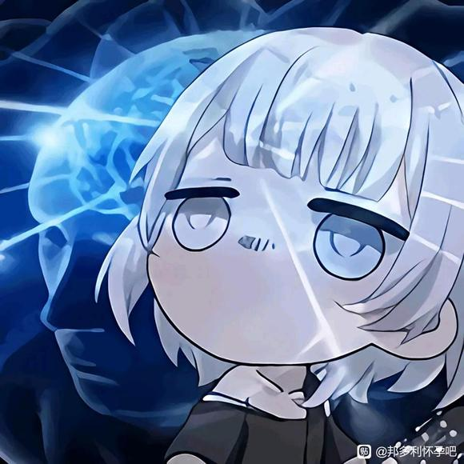
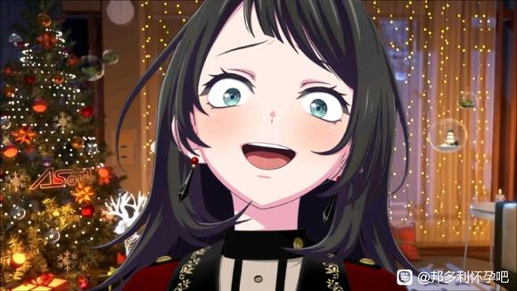
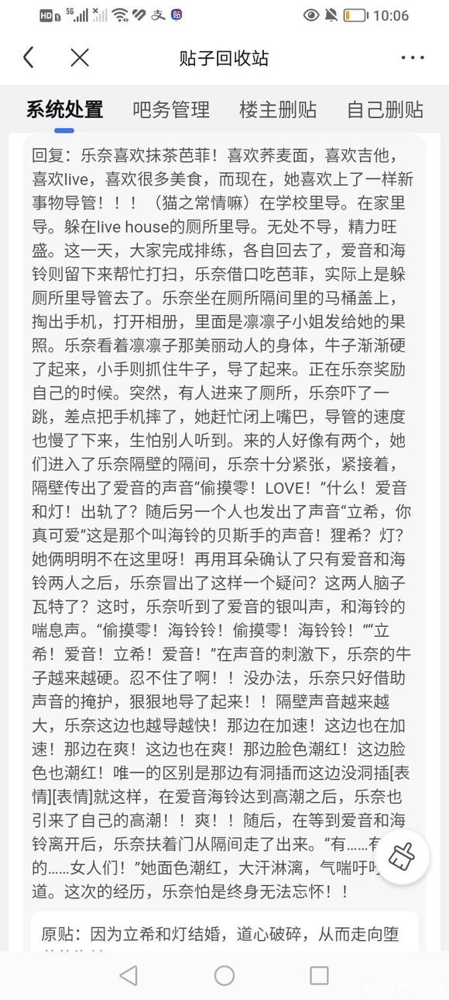

# 因为立希和灯结婚，道心破碎，从而走向堕落的海铃

**作者:最初的吧友**

## 1

有ooc 人设崩坏 ，扶她设定（海铃，初华，乐奈，喵梦，睦均有牛子）
  

## 2

立希和小灯结婚了。
在初华和祥子在一起后，立希鼓起勇气，向灯正式表白，反应迟钝的小企鹅在爱音的提示下恍然大悟，羞红了脸，但还是同意了，在甜腻了一段时间后，两人正式决定结婚。
婚礼当天，来了很多客人，除了go团，j团的成员外，还有灯的父亲，立希的姐姐真希，蝶团等其他乐队的前辈，立希和灯的同班同学们，纯田真奈小姐，凛凛子，筑都女士，以及重新振作起来的祥爹。
“想不到父亲您也会来呢”祥子对着同桌的祥爹说道。
“这不下个月就是你和初音（初华）的婚礼了嘛，我打算提前适应一下。”祥爹摸着头不好意思地说道。
祥爹面前的杯子里装着果汁，这个曾经颓废的男人为了女儿已经戒掉了酒。  

## 3

“话说，明明初子你们是最先表白的，没想到最先结婚的反而是灯她们。”喵梦吃着桌上的美食说道。
“毕竟要说服祖父，花了不少时间呢。”
祥子的祖父，丰川定治，一开始是不同意这桩婚事的。但不知道是因为受到重新振作的祥爹影响，还是自己本就在道德层面不占理，最终，这位丰川家的老赘婿，还是同意了。
“我也很感谢父亲他能成全我们。”初华笑着说道，现在丰川家对外宣传的是，初华是丰川定治的养女，与祥子毫无血缘关系。
“你们有钱人真会玩，对吧海子。”喵梦一边吐槽一边看向同桌的海铃。
只见海铃一言不发地喝着杯子里的烈酒，脸色红润。
“海子？海子！”
……
“八幡海铃！”
“哦！”海铃这才反应过来，对着初华她们说道“恭喜啊，恭喜。”
“海子你什么时候会喝酒了？”
“一直都会啊！”
明显是骗人，这个当初在喵面前喝杯汽水都不行的女人，怎么可能会喝酒，明显是强行给自己灌下去的。
“唉～。”喵梦大概已经猜到了缘由了。  

## 4

婚礼正式开始。
礼堂大门缓缓打开，身穿白色婚纱的高松灯，由灯父挽着手，走向了礼台上的立希，立希身穿黑色西装，十分紧张。
“别掉份啊，狸希”，作为伴郎的爱音笑着戳了戳立希。
“无…无路赛！”立希转头说道，但这次她一点也不生气，随后回头看向走过来的灯。
灯父将灯的手放在了立希手上。
“灯就交给你了”灯父老泪纵横。
“放心吧，叔…爸爸！”
台下，立希的姐姐真希也哭成了泪人，但那是幸福的眼泪。
“椎名立希小姐，你愿意娶这位高松灯小姐为妻吗？无论生老病死，天崩地裂”。邦高祖香橙亲自为两人主持婚礼。
“我愿意！”
“那么高松灯小姐，你愿意嫁给这位椎名立希小姐吗？无论生老病死，天崩地裂？”
“我…愿意”，灯用力说道。
“请交换戒指💍”
爱音将戒指交给了立希，立希将戒指套进了灯的无名指，灯也将代表着爱的戒指，送到了立希手指上。
“现在我宣布，你们正式结为夫妻，你可以亲吻新娘了。”香橙笑着说道。
两人相吻，台下爆发掌声。
“立希！小灯！你们要幸福啊！”一向端庄的素世情绪激动地喊道，一旁的睦则摸着素世的脑袋。
“幸福的女人。”乐奈吃着芭菲说道。
“太好了，小灯！”祥子和初华十指向扣着说道。
“那下个月，就期待初子你们的婚礼咯。”喵梦边吃边说。
而海铃，手中握着不知道倒了几次酒的酒杯，抬头看着立希的笑容，眼神空洞，心情复杂。  

## 5

巨大的婚礼蛋糕被切开，爱音猛炫着蛋糕，吃得满脸都是奶油。
“你这家伙！”立希拍了下爱音的背，笑着说道，“到底谁掉份啊！”
“偷摸零的婚礼蛋糕，我撑死也要吃完！”
乐奈开开心心地吃着一杯又一杯抹茶芭菲。
睦在强行灌下一杯酒后，突然捧起素世的脸，一口吻了上去。素世刷的一下脸红了。
小灯背对着众女，将花束抛向身后，众女争抢，初华一个大跳上去，抓住了花束。
“这是为了小祥。”初华笑着看向祥子。
“初华。。”祥子脸红着，抱住了初华，两人相吻。
祥爹则在一旁向灯父请教经验。
“喵梦亲，我们是你的粉丝，请和我们合影吧！”
喵梦被几个女粉围住。“好呀好呀，来～茄子！”
众人沉浸在喜悦当中，没人注意到海铃早已离开。  

## 6

东京的夜晚，冷风吹拂，海铃跌跌撞撞地走在路上，手中握着从婚礼带出来的烈酒，仰起头猛灌一口，在跌跌撞撞地走到一个电线杆附近时，呕吐了起来。
“呕！”
海铃扶着电线杆吐着，所幸附近没什么路人。
“立…希，立…希”海铃不断念着立希的名字，随后一头倒了下去。
“立希…”
海铃想到了自己把牛奶放立希头上时，立希的害羞的脸。
想到立希苦恼时，向自己吐苦水。
想到当初在live house ，自己要求祥子重组乐队时立希抓着自己的手，走了出去。
“你绝对应该走这边。”
自己也跟了上去。
她曾经幻想过，自己向立希求婚，幻想两人一起在婚礼上收到祝福，一起去度蜜月，一起在孩子们的围绕下玩耍，一起白头偕老。
如今，被一只人畜无害小企鹅抢走了这一切。
“立希啊！立希啊啊啊！”海铃感到胸口难受，是因为强灌烈酒的原因，又或是因为美好愿望的破碎，海铃捂着胸口，又吐了起来。  

## 7

婚礼已经结束，客人们陆陆续续地离场了。
睦抓着素世的手，喊了一辆出租车，飞速敢往往素世家，今晚她们两人要好好大战一番
“那么下个月，就期待初华你们的婚礼咯！”爱音摸着吃得抱抱的肚子，笑着对初华和祥子说道。
“爱音同学一定要来哦，还有乐奈同学也一样，芭菲管饱。”
“芭菲！”乐奈金蓝的异色瞳孔闪闪发亮。
“话说喵梦亲，海玲同学呢？”
“啊……这个…她好像提前走了…”
因为和女粉丝拍照，喵梦完全忽视了坐在身边的海铃“她好像喝了很多酒…”
“这家伙，回学校定要好好教训她！”立希双手叉腰，气鼓鼓地说道。
“立…希，别这样。。”小灯拉了拉立希的袖子。
“啊…我不是这个意思，灯…啊不，老婆！我开玩笑呢！”立希慌忙说道。
“好了，时间不早了，我们也先回去咯”初华说完和祥子上了出租车往初华家赶去，今晚她俩也要大战一番
“那我也走了，狸希，你可别欺负偷摸零哦！”爱音说道。
“我怎么可能！倒是你这家伙…路上…小心点！”立希不好意思地说道。
“哎呦呦！立希这么关心我，偷摸零可是要吃醋咯！”
“TMD，给***！”立希挥手赶爱音。
“好啦好啦我错啦。”爱音边退边说道。
“再见咯”
“这家伙…小心点啊。”
看着爱音远去的背影，立希搂着灯说道，但她的脸上却挂着微笑。  

## 8

爱音独自走在回家的路上，心情大好。
“哎呀呀，没想到竟然让狸希得逞了呢，不知道她们今晚……”
一想到灯在立希身下娇喘，爱音的脸刷一下红了。
“我在想什么呀！”爱音用力摇了摇头，继续往家里走，在路过一个电线杆的时候，她的脚突然被什么绊了一下，摔了一跤。
“哎呦！”
爱音摸着屁股爬了起来。
“什么情况！”爱音转头看去，竟看见了满身酒气的海铃倒在了地上，旁边则是她的呕吐物。
“海铃同学？！”爱音见状，上去用手摇了摇海铃。
“你怎么会在这？你不是来参加狸希的婚礼了吗？”
“立希…立…希”
看着海铃醉得不省人事，我们的圣爱音将海铃搀扶起来。
“你家在哪？我送你回去！”
在海铃含糊不清的指路下，爱音费了九牛二虎之力，可算是把海铃送回了她的独居屋。
打开房门，进入卧室，将满身酒气的海铃放在床上，爱音累的气喘吁吁。
“呼～可算是到了，那我就先回去咯。”看着躺在床上的海铃，爱音说完转身便要走。
“立希！！！”
海铃突然大喊一声，吓了爱音一激灵，她转身看向海铃，只见海铃突然扑了过来，将爱音推倒在地。
“海铃同学！你怎么了？你这是干什么！”
“立希！别走！别走啊！”
海铃疯狂了，开始撕扯爱音身上的衣物，爱音拿手拼命阻挠。
“不要！不要啊！你在干什么！！”
“立希！立希！你是我的！！！”
爱音的衣物被撕扯干净，露出雪白的身体，以及那块平板，海铃则开始在爱音身上乱吻，双手在爱音身上游走。
爱音奋力抵抗，但双手被海铃一只手牢牢控住，只能任由海铃胡来，爱音脸色涨红，泪，流了出来。
在一番乱吻之后，海铃突然抱起爱音，将她丢在了床上，随即骑了上去，掏出了自己的那根粗黑的牛子。
“不要……”爱音慌了，但她毫无办法。
海铃最终还是攻破了爱音的圣壁，血流了出来，爱音被死死压在海铃身下，任由她进入。
一发，两发，三发，海铃双眼失神，仰起头，嘴里不断念叨着立希，将罪恶之种不断地送入爱音体内
随后，海铃又将爱音翻过来，一边抓着爱音粉色的长发，一边进攻她的后花园。
“立希…为什么…为什么不选我…立希”
海铃完全失去了理智，爱音则痛苦不堪。
“停下！求求你停下！”
然而还没结束，海铃突然将爱音抱起，用力撞在墙上，抬起她的双腿开始新一轮的进犯，而爱音，竟然开始有了快感，她的双手不在挣扎，而是抱住了海铃。
在进犯了一会儿后，海铃又把爱音摔在地上，直接抬起她的双腿，继续进犯爱音的圣地，爱音只能用双手撑着地面。
贝斯手的罪恶，不断侵袭着吉他手的圣地。这一晚，爱音失去了她的第一次。。。  

## 9

与此同时，在立希家中。
立希和灯赤裸着身体，躺在床上，两人刚刚经历了一场激战，大汗淋漓，面色红润。立希搂着灯，灯已经睡着了，那睡颜是那么的可爱动人，立希忍不住亲了一口。
“海铃这家伙，这么一声不吭就溜走了？喝酒喝傻了吗？”立希小声低估着
“算了，明天得好好问问她！”说完又看向怀里的灯。
太可爱了，再亲一口。这时，立希听到房间外有什么动静。
“老～姐！”立希气鼓鼓的说道。
“嘿嘿嘿嘿嘿！”房间外传来真希的笑声，笑声夹杂着一阵脚步声逐渐远去。
“真是的！”立希翻了个白眼，又看了一眼灯。
真是太可爱了，再亲一口！  

## 10

第二天清晨。
海铃一丝不挂的躺在床上，在她身上的，同样是一丝不挂的爱音。
迷迷糊糊地醒来，看见自己身上的爱音，海铃立刻明白自己昨天干了什么。
“对不起！！”海铃一个土下座，跪在了爱音面前。
爱音没说什么，而是走到了海铃跟前，扶起了她的头。
“会为我负责吗？”爱音苦笑着说道。
看着爱音布满泪痕的脸，海铃一时间不知道怎么回答。
“我……”海铃刚想开口，爱音便吻了上来，双唇在一番纠缠后，拉着一条银丝又重新分开。
“我的人生，已经被海铃你搞得一塌糊涂了。”爱音苦笑道。“我已经被你弄脏了，染上你的颜色了！你就想这么一走了之？”爱音的泪流了出来，顺着脸上的泪痕滴在了地板上。
“我……会负责的。”海铃低下头愧疚的说道，随即搂住了爱音。
“哈哈哈哈哈！”
听到海铃的答复后，爱音突然笑了起来，紧接着转为哭声，随后，爱音在海铃怀中大哭了起来。海铃只能继续抱着爱音，两人的身体都在颤抖。
我……该这么面对立希啊…  

## 11

海铃魂不守舍地来到学校，一进教室便看见初华和立希在进行交谈，初华笑着告诉了立希一些没有牛子也能进行的玩法，立希则脸红着拍打初华，直到立希看见了自己并朝自己走来。
“昨天怎么回事，怎么不打招呼就走了。”立希皱着眉头对着海铃说道。
“我……抱歉。”
“不会喝酒就别喝啊！逞什么强！”立希拍了一下海铃，随后递给她一杯咖啡牛奶，上面印着熊猫图案。
“拿去，醒醒酒。”
“立希，这个醒不了酒的。”初华小声嘀咕道。
“我…知道！”立希脸红说道。
“总之拿去吧！”立希将奶强塞给了海铃。
看着手中的奶，海铃五味杂陈，心中有什么东西正在翻腾，刺激着她的全身。
与此同时，在羽丘
爱音同样魂不守舍的来到学校。
“爱音酱”灯高兴地向爱音打招呼，但看到爱音的表情后，脸上笑容渐渐消失了。
“爱音酱，你怎么了？”灯担心的问道。
“没……没什么，昨晚没睡好。”爱音苦笑道。
灯看着爱音魂不守舍的样子，从口袋里掏出一颗精致的粉色珠子。
“这个……送给爱音酱。”灯说道。
“希望…爱音酱能高兴起来”。
“谢…谢”
爱音缓缓地接过了珠子，眼神却黯淡无光，整整一天，爱音都没笑过。
放学后
爱音默默地走向校门口。
“爱音酱！”灯赶紧跟上了去，看见立希站在校门口来接她了。
“你怎么了？”立希看着爱音的状态，这完全不像平时那个活泼奔放的千早爱音。
“没事…狸希你…带着偷摸零先去乐队练习吧，我还有事情。”随后爱音头也不回的走掉了。
“你……”立希想说什么，却欲言又止，这两人今天是怎么了？立希非常疑惑，她只好先带着灯前往live house。  

## 12

与此同时，在live house。
立希拿着手机，在房间里来回踱步。
“怎么不回消息呢？这粉毛，练习都忘了？”
灯坐在一边，抱着笔记本，而素世则端着手机，在和什么人发消息，至于猫猫乐奈，已经趴在地板上睡着了。。。
“啧！”立希啧了一下。
“算了先不管她了，咱们先开始练习吧，回头在收拾她！”随后叫醒了睡着的乐奈，猫猫眯着眼睛爬了起来，打了个哈欠，拿起了吉他。
立希坐到鼓架子后面，灯拿起了话筒，素世还在发着信息。
“素世！”
“哦，好的来了”素世快速发完几条信息，放下手机拿起贝斯。
随着立希敲响鼓棒，排练开始了。
与此同时，在海铃家。
Ave mujica的音乐在房间里响起，海铃和爱音一丝不挂，在进行激烈的纠缠。
海铃将爱音抱起，靠在了墙上，爱音用脱下来的胖次，给自己扎了个马尾发型，海铃用力冲击着爱音，两人脚下早已湿成一片，用过的粉色套套到处都是。
爱音举起一杯酒，倒在了自己身上，海铃见状，立刻吸了起来，对每一处酒水粘过的肌肤进行清扫，随后爱音含住一口酒，吻了上去，酒水含着唾液，在两人口中来回流动，最终被海铃喝下了肚子了。
“用力，海铃铃！用力啊啊啊啊啊！！！”
海铃一把将爱音甩到床上，随后扑了上来，爱音背对着海铃，翘起了臀，露出那粉色的后花园.，随后转头用及其魅惑的眼神看向海铃。
“我～还～要～”
海铃一把扯住爱音的马尾，随后开始了巨龙撞击。
爱音的银叫声越来越响，越来越放肆，海铃的力度也越来越大，仿佛要将爱音撞死一样。
不知过了多久，两人才累趴在床上。
海铃躺在床上喘着气，爱音则用舌头帮助海铃清洗枪管。。由于爱音舌头过于灵活，海铃没忍住，直接爆浆在爱音脸上，爱音用舌头舔了舔脸上的白滴，心满意足，随后带着沾满白滴的脸，靠在了海铃怀里，海铃摸了摸爱音的头发。
随后，两人便沉沉睡去。。。  

## 13

此时在live house。
go团4人已经排练了好几次，见到爱音迟迟不来，电话也不接，无奈之下，大家只好先回家了。
素世背着贝斯急匆匆的走了出来，一辆豪华轿车已经在路边等候，后车门打开，睦坐在里面，素世一个健步上了车，关闭车门，轿车立马开走了。
“这家伙…”
立希吐槽到，看来这两人最近玩得挺欢。
乐奈还留在live house里吃芭菲，于是立希拉着灯先回去了。
两人十指相扣，走在夜晚的道路上，冷风吹来。l
“啊秋！”
灯打了个喷嚏，立希见状，想脱下自己的衣服给灯裹上，被灯阻止。
“这样子…立希会感冒的…”
“可是灯你……”
“没事的…”
灯边说着边靠在了立希怀里。
“这里…很温暖。”
“灯…”
看着灯在自己怀里脸红的样子，立希心潮澎湃，想好好疼爱一番自己的妻子，但考虑到两人处于大庭广众之下，只好作罢。
“爱音酱她…不会有事吧”
灯喃喃道。
看着灯担忧的样子，立希摸了摸灯的脑袋。
“放心吧，这家伙福气好的很，而且也很坚强，当初吉他弹得半斤八两，还要天天听我抱怨，最后还是坚持下来了，水平也在不断提高。”
爱音的进步和努力，立希是全部看在眼里的，自己也反思过是不是对爱音太严格了，虽然对爱音不来排练，立希多多少少是有怨言的，但考虑到祥子当初的情况，说不定她也有什么难言之隐。
“作为朋友，我们相信她就好”
立希温柔地对灯说道。
“谢谢你，立希”
灯红着脸说道，随后在立希脸上亲了一口。
“灯！”
这下立希再也忍不住了，直接用嘴对着灯A了上去。
夜晚街道的灯光，照出了两人相拥而吻的背影，如同一副极美的电脑壁纸。
热吻过后，立希一把抱起灯，在灯的惊讶下，快速往家里赶。
回去先把老姐锁起来，不！直接打晕！然后，再把灯吃干抹净！！
立希在心中狠狠说道。  

## 14

第二天 花咲川。
与灯一个晚上的缠绵，让立希心情大好，她哼着小曲来到学校，进入教室，看到初华和海铃在说些什么。
“海铃同学，昨天你怎么没来mujica的训练？是有什么事吗？”初华露出一丝担忧的表情。
昨天，若叶家的地下室中。
因为海铃未来参加mujica的训练，打了好几个电话都不接，气得祥子到处哈气！
“她怎么敢的！”“就这还想让我相信她！”
初华则是在一旁劝祥子冷静，喵梦认真的在练鼓，睦则坐着刷着手机，和什么人聊着天，随后提前离开了了，说是有急事，坐上豪华轿车走了。
那天晚上，初华用自己的牛子好不容易，才把祥子哄好。
“我，有点事情，真的是抱歉了。”
海铃摸着脑袋说道，她的气色比之前好多了，但总感觉哪里怪怪的。
立希走上前去，又递给海铃一杯咖啡牛奶，海铃笑着接过了，也正是那天起，海铃每天都让立希请自己一杯奶。
反正海铃也请了不少次自己饮料，立希这样想到。
此时此刻，在羽丘。
“对不起啊！偷摸零！昨天我突然有事没来排练！”
爱音双手合十，对灯道歉道。
“没…没事的”
“立希她一定痛骂了我一番吧”
“不不不！立希她…没有怪爱音酱…我们大家…都不会怪爱音酱的！”
看着灯红着脸拼命地说道。爱音笑了出来，只是着笑容中，夹杂着一丝丝勉强。  

## 15

放学后。
海铃和爱音都参加了各自乐队的排练，但在中途都选择了提前离开。
“真的很抱歉，狸希！”
爱音背着吉他包说道。
“有很重要的事情，所以……”
“爱音酱…”
灯在一旁说道。
“唉～那你先回去吧。”
立希无奈道。
爱音转身开门，刚想出去，又被立希叫住。
“爱音，如果有什么事情，别憋在心里，说出来，乐队的大家都会帮你的。”
“谢谢”
爱音挤出一个笑容回应道，随后便出门离开。
看着门被重新关上，立希叹了口气。
mujica这边。
“抱歉，丰川同学，我得先走了。”
海铃说完便提着贝斯包离开了。
“你………唉”
祥子刚想说什么，但联想到自己曾经的过往，也只是叹了叹气，随即扑到初华怀里求安慰。
海铃与爱音再此在海铃家汇合了。
这次，海铃穿上了爱音的羽丘制服。
爱音则换上了海铃的花咲川制服。
海铃把爱音扑在了床上。
“偷摸零…你的头发怎么变长了？”
爱音将海铃当成了灯，笑着说道。
“头发本来就会变长呀，爱音酱”
海铃笑着回应。
“立希，你的头发怎么粉粉的？”
海铃问道，脸贴近了爱音。
爱音则将脸凑到海铃耳边，用及其诱惑的声音说道
“你把我艹黑不就行了吗”
此言一出，海铃再也忍不住了！一口亲了上去，两位少女展开了一场酣畅淋漓的床战！！  

## 16

夜晚，立希家。
立希搂着灯，坐在浴缸里，浸泡在沾满沐浴露泡沫的洗澡水里。
“爱音酱她，到底怎么了？”
“可能有什么心事吧，说不定在外面有女人了吧”
立希打趣道。
“唉？”
灯疑惑道。
“嘿嘿我开玩笑呢！不过那家伙要是真找到喜欢的人了，我也是会祝福她的。”
立希笑道。
“我…我也会的”
灯很认真的说道，随后又看向立希。
“立希…真的很温柔呢”
灯说罢便吻了一下立希的脸。
“灯！”立希此刻幸福到了极点，就在她想回送灯一个吻时，浴室的门却突然打开了！
“洗澡水够热吧？”
真希走了进来，坏笑道。
“老！姐！”
立希羞红了脸，拼命拿起浴室里的东西砸向真希。
“滚！！！！！”
在沐浴露，洗发水，和小黄鸭攻击下，真希护着头连连求饶。
“我错了，我错了，我滚还不行吗？”
说罢便逃离浴室，并关上了门。
“真是的！！”
立希看向了怀里的灯，灯此时已经迷迷糊糊，快要睡着了💤
毕竟排练的时候唱得非常拼命，立希摸了摸灯的脸，随后帮灯和自己擦干了身上的水，裹上浴袍，抱着灯离开了浴室，在狠狠瞪了一眼躲在沙发后偷看的真希后，抱着灯进入自己的卧室，反锁房门，又一个美好的夜晚开始了。  

## 17

就这样，爱音和海铃彼此纠缠，彼此慰籍，在所有人都不知道的情况下，相拥堕落着。
一个月后，初华和祥子结婚了。
婚礼地点定在初华出生的那座岛上的别墅里，在别墅的花园里，初华身穿一袭黑西装，扎了马尾，非常帅气，祥子梳直了头发，身穿白色婚纱，在祥爹的搀扶下，走向初华。
宣读誓言，交换戒指💍，两人相拥互吻，台下宾客欢呼雀跃。
祥子注视着台下的宾客们，竟发现自己的祖父，丰川定治也在其中。
这位丰川家的老者，用生平最慈祥的笑容，回应了自己的外孙女。
“祖父。。”祥子流下了幸福的泪水，初华见状，用手指轻轻擦去祥子的眼泪，并用感激的目光看向自己的这位生父。
宴会开始了。
“祝贺你，祥子小姐！”
真奈抱住祥子说道。
“谢谢你，真奈小姐！”
“恩，帮我照顾好初华。”
初华此时，则站在一位妇女面前，此人正是初华的生母。
“母亲…”
“孩子…”
这时从初华母亲背后，走出来一位和初华一模一样的女孩，这正是初华（音）同父异母的妹妹（真正的初华）
“姐姐……”女孩上前抱住了初华。
“姐姐…对不起…我不该骂你的…”女孩哭着向初华道歉。
“没事的，我从没怪过你！”初华也流下了泪水。
远处，丰川定治看向了初华生母，四目相对，两人相互点头示意。
另一边。
素世坐在小睦腿上，小睦将蛋糕用叉子叉起来，喂给了素世。
“看来你俩每天晚上都很激情呢！”
看到素世红润的脸，立希坏笑道。
“那当然！”
素世挑着眉头看向立希。
“毕竟，小睦可是有着立希没有的东西呢！”
（也就是牛子）
“噗”
一旁的乐奈差点把芭菲吐了出来。
“有趣的女人们”
“你……”
立希无法反驳，这时候，灯突然抱住了立希。
“没…关系的。”灯红着脸说道。
“我…不会嫌弃…立希的”
“灯！”
立希感动，吻住了灯。
“啧啧啧”
喵梦看着这一切，现在的年轻人呐…
“话说，海子又去哪里了？，明明刚才就在…”
“喵梦亲！”喵梦的女粉丝们围了上来。
“可以合影吗？”
“哦哦！当然可以，直接来吧！”
喵梦和女粉们站在一起，对着相机喊出了“茄子！”
（梅开二度）
“话说，爱音呢？”
素世吃着睦喂给她的食物说道。
“可能去上厕所了吧”立希一边喂小灯食物，一边说道。
此时，在别墅花园角落的一处隐秘的树丛里，海铃正靠在树后面，而爱音则跪在海铃面前，用自己精巧的舌头，服侍着海铃的牛子。。  

## 18

爱音今天穿着一身白色露肩礼服，把粉色长发盘了起来，看上去非常美丽优雅，而如此优雅的她，现在正跪在海铃面前，贪婪且银乱地吸食着海铃的精华。
“恩～啊～恩～”
海铃被爱音弄得非常舒服，靠在树后面，脸色潮红。
爱音舌口并用，并且时不时吐出牛子，对着牛子尖端吐口水+吹气，随后又吞了下去，双手则抚摸着海铃的两颗牛丸。
海铃忍不住了，双手抱住爱音的脑袋，直接狠狠按了下去，牛子直接伸进了爱音的喉咙。
“咕…咕…咕” 爱音翻着白眼，口水从嘴中流出，如同银丝一般挂着，下身的粉色花园完全湿透，银水乱流，打湿了地面，不幸有几只辛勤的蚂蚁被爱音的银水命中！
海铃最终还是喷射了，海牛奶直接灌进爱音的喉咙，呛得爱音把牛子吐了出来。
“咳咳咳！！！”
爱音直咳嗽。
“…抱歉”
“没事…”
爱音站起身，把背对海铃，翘起臀部顶住海铃的牛子。红着脸说道。
“干！我！”
海铃立马按倒爱音，直击粉色后庭！！！
爱音捂住嘴巴，再度失神。
树丛本是绿的，但偷偷做艾的人多了，自然成粉的了  

## 19

一番激情四射后，两人走出树丛，整理好自己的衣服，走回宴会，为了不引起怀疑，她俩早已编好了借口。
“上个厕所怎么这么慢呐？”立希有点抱怨。
“爱音同学掉了东西，我帮她找了一会儿”
海铃装作淡定的说道。
“是非常重要的东西哦！”爱音笑着拿出了灯送给她的粉色珠子。
“那是…我送给…爱音酱的”
“没错，这可是偷摸零送给我的，非常重要呢”
“爱音酱！”灯非常感动。
这时，初华和祥子走了过来。
“各位！非常感谢各位来参加我和初华的婚礼！”
祥子和初华十指相扣，笑着对众人说道。
“恭喜了，小祥”
“小祥…要幸福啊…”
“祝贺你们”
“初子要看好祥子哟，可别让她再解散乐队咯！”
“佑天寺小姐！！”
“我开玩笑的啦！喵！”
“还有芭菲吗？”
哈哈哈哈，现场十分欢乐。
这时，素世敏锐地注意到，爱音和海铃，有点不对劲。
难道？
素世仔细打量着爱音，发现她的礼服裙角处，有一小块水渍一样的东西。
“爱音酱，来块蛋糕吧！”
“谢谢，素世世！”
借着给爱音递蛋糕的机会，素世趁所有人不注意，用手指在在爱音裙角上摸了一下，一股黏糊糊的触感传来。
“这是！？”
素世拿到鼻子前闻了闻，一股海鲜腥
味直冲鼻子，她和睦做过，她知道这是什么！
难道！素世不可思议地看向爱音。。又转头看向一边的海铃。
她们两个。。。。  

## 20

婚礼结束后，众人返回东京。
夜晚，素世家。
素世穿着浴袍，坐在大床上，浴室里睦正在洗澡，
自从灯和立希婚礼那晚后，素世天天和睦坐豪华轿车，开往自己家偷情（睦家里有mujica在排练）
素世坐在床上，回想今早婚礼上的事情。
爱音和海铃？
什么时候的事情？怎么回事她们两个？
没道理啊？这两人不算很熟悉，又怎么会搞到一起？难道是喝醉酒了一夜情？联想到爱音之前一直有事不来，难道一直是和海铃在。。。
“素世”
睦的声音打断了素世的思考，只见睦光着身子爬上了床，身子和头发还有些湿润，显然没好好擦干。
睦迫不及待的亮出自己的大黄瓜，素世则自觉地伸出玉手，撸动那根大黄瓜。
“比小睦自己种的要大呢！！”
这是素世第一次看见睦那根伴生黄瓜时的反应，然后就一发不可收拾了。。。
爱音和海铃，算了，倘若她们真心相爱的话，那不也挺好？
素世不再思考，张口含住了那根黄瓜。
“爽！”睦喊出了声.
于是，带着对爱音海铃的祝福，素世和睦 翻云覆雨了起来。
小睦的黄瓜，真～好～吃
沉浸在睦头人牛子里的月之森点子王，显然没意识到事情的严重性  

## 21

初华和祥子度蜜月去了，所以mujica的排练将暂停一段时间，喵梦利用这段时间参加了各种综艺节目，知名度在蹭蹭上涨，而海铃和睦则时常前往live house，观看mygo的排练，并给出一些音乐上的建议，当然她们都有各自的目的。
这天，在live house的排练室。
“非常好”
这次排练很成功，立希很高兴。
“多亏了两位的指导呢”
素世一边说着一边坐到睦的腿上
“尤其是小睦哟～”
“那…能奖励我吗？”
睦刚说完，素世便吻了上去，两人当着众人的面缠绵起来。
“你们两个，别在排练室里搞啊！”
立希捂脸。
“原来…还有…这种吻法”
灯瞪大眼睛看着素世和睦
“立希…我也想要”
“唉？灯”
立希涨红了脸，看着素世和睦那高超的吻法。
“我会努力的！”立希抱紧了灯。
“有趣的女人们”
乐奈蹦蹦跳跳地离开排练室吃芭菲去了。
海铃蹲着一边收拾东西，眼睛则瞟向立希，看着她和灯的互动，心中五味杂陈。
“我来帮你吧”
爱音走了过来，蹲在海铃身边，笑着看向海铃。
“恩，谢谢”
素世一边和睦接吻，一边用眯起的眼睛偷偷看向爱音和海铃。
啧啧啧，这两个人呐，素世心中窃喜，吻得更加深情了。
一会儿后。
“那么，我和灯先回去了”
“睦，我们也走吧”
“恩”
“你们先回去吧，我把这些收拾完”
“我留下来帮海铃吧。”
“好的”
“那，我们先走了，要是弄得太晚的话可以明天弄”
“好的”
“再见…爱音酱”
“再见，偷摸零”
立灯素睦四人一起离开了排练室，走出了live house
“等等！我东西忘拿了，小睦你先在外面等一下吧”
素世说道，随即折返。
她当然没有忘拿东西，点子王敏锐的意识让她知道排练室里将会发生什么。
“嘿嘿，也算是抓到爱音酱的小把柄了呢！”
素世一脸坏笑，随即来到排练室门口，悄悄挤开一到门缝。
然后便是她这辈子永远无法忘却的画面。。  

## 22

排练室中。
爱音和海铃脱去了自己的衣物，相拥在一起。
“立希，立希，立希。”海铃抱着爱音说道。
“人家现在是爱音啦。”爱音坏笑道。
“不！你就是立希！”
海铃猛地抱起爱音，把爱音放到了立希打鼓的位置，爱音则非常配合的拿起立希打鼓的鼓棒，在鼓上随意敲击着。
“咚咚咚咚咚咚”
海铃将牛子递到爱音面前。
“立希，帮我口”
爱音吞下牛子，吞吐着，双手更加卖力地敲鼓。
如此刺激下，海铃喷发了。
舔了舔沾在嘴角的精华，爱音坏笑道“海铃铃这么对待立希，偷摸零可是要生气的哟！”
“谁说的？”
海铃捡起爱音的羽丘制服，披在身上。
“我就是高松灯啊！”
“偷摸零！LOVE！”爱音扑了上去，双手抱住海铃的脖子，双腿夹住海铃的腰，海铃用力撞击着爱音的花园，白色液体流了一地。
与此同时，海铃唱起了歌来。
什么歌？
碧天伴走！灯写给爱音的歌！
“偷…摸零！唱得…真好！”尽管快被海铃弄到神志不清，爱音还是夸奖海铃唱得好，又或者？是灯。
几次高朝后，海铃又将爱音放到地板上，继续进攻！爱音伸手抓住放在地上自己的吉他，对着海铃说道“人家现在是爱音酱哦！偷摸零你出轨了呢！”
“哈哈哈！谁说的？”
海铃狂笑着，将立希给的牛奶洒在爱音洁白的躯体上。
“你现在是立希啊！而我……”
海铃脱去那件羽丘制服。
“是八幡海铃！！！”
“哈哈哈哈哈！那就是立希出轨了！！”
“那灯同学不就是爱音的了嘛！”
“也是哦哈哈哈哈哈！”
“哈哈哈哈哈哈！！！”
“哈哈哈哈哈哈哈哈！！”
“哈哈哈哈哈哈哈！！”
两人的笑容越来越瘆人，做艾的劲越来越大，仿佛要把整间排练室弄塌！！
“立希！爱音！立希！爱音！立希！爱音！”
“偷摸零！海铃铃！偷摸零！海铃铃！偷摸零！海铃铃！”
少女疯狂的交融！
疯狂的汲取！
疯狂的扭动！
如同两坨扭曲的肉挤在一起！
爱音为希！
海铃为灯！
排练室内！
春光四起！
排练室外！
风平浪静！
长崎素世！
大脑宕机！  

## 23

海铃的表情参考这张图吧
  

## 24

素世跌跌撞撞地跑出live house ，一头跌进在外等候的豪华轿车上。
“开…开车”素世气喘吁吁说道。
睦眼神会意了一下司机，司机立马发车驶离开了live house。
轿车行驶在东京夜晚的马路上，素世坐在车里气喘吁吁的接过睦递给她的水，喝了一口，却不小心被呛到了。
“咳咳咳咳！”
“素世，你没事吧” 睦拍了拍素世的背。
“没…没事…”
“忘拿的东西……”
“拿到了！拿到了！” 素世赶忙说道，随后靠在了座椅上，打开了车窗。
东京的夜风吹进了车里，吹乱了素世亚麻色的长发，素世感受着冷风，闭眼沉思。
她不是没想象过爱音和海铃交合的场面，说真的，她甚至为此兴奋过，只是她做梦也没想到，竟然是这样荒唐扭曲的场面！
两个女人一边做艾一边喊着其他女人的名字，而且这名字是她们的朋友，一对新婚夫妇，甚至拿出相对应的物品假装成对方,自己可做不到一边和别的女人做艾，一边让对方拿着黄瓜假扮成睦。。
那一定是游戏！是她们之间的情趣！
是的！这是Cosplay，爱音酱，还有海铃，玩得可真花呀！哈哈哈，是的！真调皮，真可爱，真。。。。。。。。。。。。。。。
。。。。。。。。。。。。。。。。
。。。。。。。。。。。。。。。。
TMD别再骗自己了！长崎素世！
听到那瘆人的笑声没！？
看到那扭曲的表情没？！
那是正常情侣会露出的样子吗？
那可爱阳光的爱音
那帅气沉稳的海铃
你能想象，这种扭曲，这种疯狂，会出现在她们身上？！
那坨挤在一起的银乱肉体，怕不是披着自己朋友人皮的性 兽！！
一定是疯了，她们一定是疯了！哈哈哈哈！
哈哈哈哈！
啊哈哈哈哈哈！
还是说！？
我疯了？
。。。。
。。。。
“素世！”
“素世！！！”
“素世！！！！！！”
“啊？！”
睦的大喊让素世从疯狂的思绪中清醒过来。
“素世，你没事吧？” 看到素世额冒出了一堆冷汗，
睦拿出手帕为她擦了擦汗。
“我，没事，只是有点累。。”
“真的吗？”
“真的，真的，谢谢你，小睦。”
那一晚，两人并没有交合，在睦关心的眼神中，素世早早地睡下了。。
愿黄瓜精灵保佑长崎女士不要做噩梦吧。。。  

## 25

长崎素世醒来了。
她发现自己赤身果体，躺在mygo的排练室里。
“我…怎么在这里？我不是……”
“欢迎呀，素世世！”
素世闻声望去，发现是同样果体的爱音，正站着对自己笑。
“没想到，在这里能遇见素世同学。”
海铃从爱音身后走来，同样果体。
.“爱音酱…海铃……你们” 素世想爬起身，却发现自己被束腹带固定在了地面上。
“这是什么情况！！”素世拼命挣扎，但却无法挣脱束缚。
“素世世，偷窥是不好的哟！”
爱音凑到素世跟前，突然扯下了自己的脸皮，露出立希的容貌！
“立希！”
素世被吓了一跳，与此同时，海铃也扯下脸皮，露出了灯的样貌。
随即两人围绕着素世，欢快起舞！同时，婚礼进行曲响起！！
“谢谢你参加我们的婚礼！” 是立希的声音。
“谢谢你素世！” 是灯的声音。
音乐节奏越来越快，两人跳得也越来越快！直到。。两人开始不断撕扯自己的脸皮！容貌在立希，爱音，海铃，灯四人中不断切换，声音也在跟着切换。
“不” 素世慌了。
突然！两人停下舞步，音乐也戛然而止。
只见两人撕扯下最后一块皮，露出了那无尽黑暗般的触手，向素世涌来！！
“不要！！！！！”
千钧一发之时，一道绿色的身影闪过，阻挡了那黑色触手！！
“素世！素世！素世！”
“啊啊啊啊啊啊！！！！”
素世从噩梦中惊醒！发现睦正在一脸担忧地看着她，她满身大汗，睡衣早已经湿透。
天，亮了。。。  

## 26

早上，月之森。
素世心不在焉地坐在教室里，完全听不进去老师讲课的内容，一想到昨天的梦，汉滴就从她的额头流了下来，睦这在一旁注视着素世。
“长崎同学，你能来回答一下这道题吗？”
“哦，啊！”
素世慌忙站起来。
”“老师…我…”
“上课要认真，不要分心.”
考虑到素世成绩不错，老师便也没在说什么。
下课后，睦找到素世，拉着她走到自己种的黄瓜地前。
“素世，你，昨天到底怎么了。。”
“我………”
看着素世忧愁的样子，睦把双手放在了素世肩上，琥珀色的眼睛直直地盯着素世。
“看着我的眼睛素世” 睦突然强势起来，表情坚毅。
素世美丽的蓝色眼睛不敢直视睦
“看着我！”
素世只好看向睦。
“我是你的什么人？”
“恋…人…”
“再说一遍，我是你的什么人！”
“恋人…” 素世羞红了脸。
“那就告诉我，昨天在live house里 发生了什么！”
“………”
两人的声音引来了一些女生围观，睦狠狠地瞪了她们一眼，女生们被吓退了。。
“告诉我，好吗，我可以帮你！”
“我…”
“素世！”
“…好吧”
于是素世将昨天的所见所闻告诉了睦，睦的表情从坚毅慢慢变成惊讶，最后是软糯，在听完素世的见闻之后，睦愣在了原地。。。
“小睦？”
“小睦！”
若叶睦，大脑宕机。  

## 27

羽丘。
爱音兴高采烈地和同学们打招呼，从红绿灯三人组，到其他同学，再到其他班同学，遇到的每一个人都接受到了爱音的微笑与热情。
“爱音同学真可爱呢！”
“是呀总是那么活泼！”
“如果说灯同学是羽丘的小呆萌，那么爱音同学就是羽丘的小太阳了！”
“哎呀！爱音同学有女朋友了吗？没的话，我可以哟！”
同学们都被爱音所影响，教室里气氛热烈了起来。
“偷摸零！” 爱音跑到灯面前，给了灯最可爱的一个微笑！
“嘻嘻，昨天偷摸零和狸希，有没有发生什么好玩的事情呀！”
“唔…爱音酱”
“别害羞嘛！告诉人家嘛！”
“唔…我们昨天…在浴室里…然后立希她…夸我可爱…然后就…”
灯的脸全红了，低下了头。
“哎呀呀！偷摸零真可爱呢！狸希这家伙，真饥渴呢！”
“唔…”
“嘻嘻嘻，那就祝你们俩幸福美满咯！” 说完爱音蹦蹦跳跳走开了“
灯偷偷抬起头，看向离开的爱音，这女孩是那样的快乐，那样的阳光，和从前一个样，一点都没变。
但是……
但是为什么，刚才爱音酱看向我的眼睛，那双美丽的眼睛里……
……………………
黯淡无光呢？！
与此同时，在花咲川。
“你这家伙，最近怎么天天喝这个？”
立希将咖啡牛奶递给海铃。
“我乐意呗！” 海铃挑了挑眉头，笑着说道。
“哟！挺开心嘛！遇到什么好事啦？”
“没什么，倒是你和高松同学，昨天又做了什么好事呢？”
“我…我们是合法夫妻…做那种事情…不是很正常吗？”
“我可没说是那种事情，你自爆了哟！”
“海铃！你算计我！”
“嘿嘿！怎么样，方便透露一下细节吗？”
“切！”
“连我都不告诉吗？伤心哟！”
“……”
海铃继续看着立希，立希的脸越来越红了。
“好啦好啦，不就是我和灯在浴室里，我看灯太可爱了，然后就……就……”
“就做了？”
“你闭嘴！” 立希拍了海铃一下，脸更红了。
“早知道就和祥子她们那样，请假度蜜月去了”
立希看空着的初华的位置说道。
“好想法，你们明天就可以走哟，哦不，现在就行！”
“哎！我随便说说的，别当真啊！”
“我也是随便说说的哟” 。海铃笑着挥手告别了立希。
“哎！你………” 看向海铃远去的背影，立希感到一丝奇怪，今天海铃明明比以往要来的高兴，但为什么，总有一丝奇怪的感觉。
立希疑惑中。。。。  

## 28

放学后，众人在live house 排练室集合。
“昨天真的是谢谢爱音同学和海铃同学了！”
凛凛子小姐说道，昨天爱音和海铃注留到很晚，帮忙打扫了live house的排练室（清除了做艾的痕迹）
“嘻嘻，小事一桩啦！”
“恩，举手之劳！”
“不错嘛！你们两个。”立希说道。
“呦！原来狸希也会夸人呀！” 爱音坏笑道。
“切！” 立希转头。
“好啦，大家开始排练吧，海铃同学，还有小睦，拜托你们提供意见咯！”
素世说罢，众人便开始了排练。
在排练中，素世时不时看向爱音，小睦则偷看海铃，这两人看上去没什么异常，爱音比以前弹得更好了，海铃也在认真听排练，双方连看都不看对方一眼。
素世不会在忽悠我吧。。。。睦这样想着。
到底怎么回事？难道我昨天眼瞎了？不对！得等她们独处的时候！
“素世同学，贝斯这边的话，可以这样。。”
“哦哦！” 海铃的话打断了素世的思绪。
“好，谢谢海铃同学了。”
“不客气。” 海铃说完转身向立希走去，与爱音擦肩而过。
素世再次怀疑自己。。。
排练结束后，除了乐奈还在吃着芭菲，剩下的人相继离开了，海铃和爱音，朝着不同的方向离去，睦和素世这次没有坐车，选择步行，她们分别跟踪海铃和爱音。
素跟爱
睦跟海
不知过了多久（参考正剧里爱音跟素世）
素世跟着爱音一路走到一处房屋，只见门口站着一个人，正是海铃！（这里是海铃的家）
“素世！” 一只手拍在了素世肩膀上。
“咿呀！” 素世吓了一跳，回头看去原来是睦。
“吓死我了。” 素世拍了拍胸口，与此同时，海铃一个公主抱，把爱音抱进了屋里。
素世和睦见状，蹑手蹑脚地跟了上去。
我果然没错，素世想到。  

## 29

海铃家中，浴室里。
爱音和海铃赤身果体，相互拥抱着，蓬头洒下的清水冲洗着俩人，如同浇灌两朵鲜花一样。
“立希今天告诉我，浴室里的灯很可爱哟！”
海铃笑着对爱音说道。
“所以呢？” 爱音回笑道
“所以，你觉得我可爱吗？立希？” 海铃掏出了那颗灯送给爱音的粉色珠子，含在了嘴里。
“当然咯！偷摸零最可爱了！LOVE！” 爱音拿出那瓶立希给海铃的咖啡牛奶，倒在了自己身上。
海铃一把将爱音按在浴室的墙上，牛子猛入爱音的花园，舌头带着那颗粉珠子进入到爱音的口腔里，与爱音的舌头一起嘻戏，随后又带着珠子退出了口腔。
海铃用手把爱音的屁股抬起，让爱音不得不踮起脚尖。海铃将牛子对准，长驱直入，爱音爽嗨了，放声银叫！海铃则把舌头伸入爱音的耳朵洞里，连同那颗粉珠子一起。
“偷摸零！海铃铃！偷摸零！海铃铃！”爱音喊道。
海铃爆射了，爽得她将舌头退出了爱音的耳朵洞，
同时也跟着大喊起来。
“立希！爱音！立希！爱音！”
“哈哈哈哈哈！！”
“哈哈哈哈哈哈！！！”
两人疯狂地银笑起来！！！
躲在屋外偷听的素世和睦惊呆了！
虽然看不见画面，但这声音，足以让她们浮想联翩
这是什么样的精神状态啊！！
疯了吧！！
睦可不敢想象要是素世变得如此疯狂，自己该怎么应对。
“我们，走吧，趁现在！” 素世说道，拉起睦的手就跑，走得时候太急不小心撞到了屋旁的栏杆。
“哎呦！”
“素世！你没事吧！？”
“没事，我们走。” 说罢两人便飞速逃离，当然屋内的两人由于正嗨，根本听不见外面的声音。
浴室里
海铃和爱音正靠在浴室的墙上休息，这时，爱音看到了浴室地面上，那颗粉色的珠子，是刚刚弄的时候不小心从海铃嘴里掉出来的，还好没被水流冲走，于是弯腰去捡。
就在弯腰的时候，海铃双手抓住了爱音的臀部。
“立希，你知道捡肥皂的故事吗？” 海铃坏笑道。
“偷摸零，H～！”爱音同样笑道。
于是海铃再次发动了进攻！！  

## 30

素世家中
素世坐在床上，揉了揉受伤的额头，睦则坐在一旁为她擦药。
“嘶～疼！”
睦擦完药后，拿出一张黄瓜图案的创口贴，贴在了素世头上。
“怎么样？还疼吗？” 睦心疼地摸了摸素世的头。
“只要有小睦陪在我身边，我就不疼了” 素世握住了睦的手，双眼深情对视，狗粮满上！
素世看着落地窗外的夜景，想到了今天晚上看到的事情。
“爱音酱和海铃同学的事情……我们该怎么办呐？”
是的，我们的月之森点子王，想不出点子来了！
素世看向睦，睦摇了摇头，她也没什么办法了。
目前这种情况下，单独找爱音她们沟通估计没什么效果，以立希的性格，事情只怕会变得更糟，小灯的话，估计也没啥办法，乐奈酱？猫罢了，至于喵梦，她不往外传就已经不错了，找外人的话，怕是会伤害到爱音和海铃的自尊，只剩下。。。。
对了！
“初华和小祥！”
素世突然抓住睦的手说道。
“初华温柔善解人意，又是爱音的偶像，小祥又比我聪明，虽然偶尔哈气，但还是有很多主意的，只要她俩强强联手，一定可以帮到爱音和海铃的！”
“恩” 睦点了点头
“现在就等她俩度蜜月回来了！”
素世看向窗外的夜景。
只要小样她们回来，一切都会好起来的！！  

## 31

这天学校休息日
由于最近排练成果很好，立希决定今天的排练取消，让大家都好好放松一下，当然，主要是她想和灯好好享受二人世界。
立希家中
立希梳起了马尾，穿上一双白色高跟鞋，理了理自己身上这件露肩蓝色连衣裙，准备带灯出去好好玩玩。
“灯，衣服换好了吗？我们出发了！”
“来了”
灯从房间里走了出来，身上穿着一件粉色的连衣裙 非常可爱。
“灯，你今天…真可爱！” 立希红着脸看着灯。
“立希…也很漂亮” 灯也红着脸对立希说道。
两人相拥，吻在了一起。
正当两人热吻之时
“那个……” 一个声音从背后传来
立希扭头看去，发现真希正躲在墙后。
“需要姐姐我送你们吗？” 真希笑着说道。
立希微微一笑，看向灯。
“灯，能先去外面等我一下吗？”
“哦…好！” 灯走出了门。
屋内顿时热闹了起来。
“等等，好妹妹，你拿着鸡毛掸子干嘛！”
“奥义！天诛！”
“等等啊！！！”
呜哇哇哇哇哇哇哇！  

## 32

立希和灯手牵手走在路上
“姐姐她…没事吧”
灯担心地问道。
“没事，死不了！” 立希说道，看着灯可爱的样子，立希的气消了好多。了，笑容重新挂在了脸上。
“灯想去哪里玩呢？”
“想去…看企鹅”
“好的，那我们去水族馆吧！” 立希猜到了灯会想去看企鹅，提前买好了两张水族馆的票。
两人手牵着手前往水族馆。
在两人后面，爱音和海铃悄悄地跟着，爱音同样预判到灯会去水族馆，同样提前买好了两张票。
“赶紧跟上！” 见两人远去，海铃牵着爱音的手快步跟了上去，但保持了一定距离。
在爱音海铃身后，跟着两道人影，人影分别为绿色和亚麻色，看见爱音海铃离去，人影也加快了速度
“快点小睦，我们跟上！”
正是素世和睦！
三组人一前一中一后的，保持着一定距离，如同螳螂捕蝉，黄雀在后一般，向着水族馆进发。
由于提前买好了票，立希，灯，爱音，海铃很顺利的进入了水族馆内。
“给我两张票！！”
素世掏出一把现金甩在售票员脸上。
“那个…这位小姐…”
“快点！！”
买好票后，素世拉着睦快步走了进去。
灯瞪大眼睛，趴在巨大的玻璃上看着企鹅，水族馆最近引进了一批新的海洋生物，其中就包括灯非常喜欢的新品种企鹅，这让灯非常开心。
“立希，你看！你看！”
看着灯如此开心，立希也笑了起来。
两人身后的一处角落里，爱音和海铃正偷看着两人。
“明明是我先带偷摸零来的…”
“明明是我先遇到立希的”
说罢，海铃一把摁倒爱音，爱音也自觉的翘起臀部，两人在角落阴影的掩护下，一边做艾，一边偷看立希和灯！
“立希…立希…立希…”
“偷摸零…偷摸零…偷摸零…”
两人尽量压低声音不被发现。
虽然立希和灯没发现，但是蹲在另一处角落里的素世和睦，却看到了一切。
“我的天呐！！”
素世捂住了自己的嘴巴
这两人已经发展到这种程度了吗？现在该怎么办呀？要不要打电话让小祥她们赶紧赶回来？
素世脑袋飞速思考着，点子王貌似想不出好点子了。
“素世。。” 睦的声音，打断了素世的思考
“怎么了？小睦？”
素世看向睦，发现她脸色涨得通红，下身的裙子处已经立起来一座金字塔！！
是的，若叶睦，看硬了！
（啥？你问我为什么水族馆没有其他客人？）
（别问，问就是作者的大手）  

## 33

“小睦…等一下！”
睦实在忍不住了，直接推倒素世，掏出牛子开始进攻素世的花园。
“素世…素世…我喜欢你呀…”
“小睦…停一下…不能在这里…”
这时远处的立希和灯离开了，海铃见状，拎起被干得失神的爱音，偷偷跟了上去。
素世想要跟上去，但她被睦压着，根本脱不开身，慢慢的，素世越来越有感觉，脸色潮红。
看着眼前恋人可爱的模样，素世双眼一闭，双手搂住了小睦的脖子。
反正就算跟上了，也没什么办法解决。
还是“享受每一刻吧！”
想到这，素世再也忍不住了，浪叫了起来。
就在六人刷着水族馆副本的同时。
要乐奈拉着吉他，低着头，失落地走在街上
一想起昨天的梦，她就难受。
“女人…女人…女人…”  乐奈喃喃自语道。
她曾经向凛凛子提出过做艾，但被拒绝了，那些果体照就是凛凛子给她的安慰费，这只白色小猫的性焦虑正在不断刺激她的神经，再艹不到逼，她就要崩溃了！！
“呦！这不是mygo的小猫嘛！”
乐奈抬头看去，一对大雷映入眼帘。
紫色的短发，完美的身材，酒红色的眼睛，站在她面前的是——
mujica的Amoris
最敬业的化妆主播
综艺节目的考勤达人
摘下面具的第一人
传奇鼓手，佑天寺若梦小姐！
（叫我喵梦亲！）
（好好好，喵梦亲！）
“这么巧啊！” 喵梦说道。
看着喵梦的身姿，乐奈的荷尔蒙激增，牛子也硬了起来。
“你这脸怎么这么红？发烧啦？” 喵梦摸了摸乐奈的脑袋，又摸了摸自己的。
“也没发烧啊！”
“唔………”
“话说你看到海子和睦子了吗？她俩好像经常往你们那跑。”
“也不知道初子祥子她们什么时候回来，这小两口呀。。”
“话说你怎么不在livehouse ………”
.喵梦自顾自说着，乐奈则越来越难受
牛子涨死了！！！
最终乐奈忍不住了，抓住喵梦的手说道
“和我做艾！”
“什…什么？”
“和我做艾！！”乐奈的声音越来越响。
“啊…你这……可我……”
“和！我！做！艾！求！求！你！了！”
乐奈几乎要哭出来了。
喵梦打量着乐奈，这孩子长得蛮可爱的，白色头发，罕见的金蓝异色瞳 像猫一样。
看着乐奈恳求的表情，喵梦无奈答应。
“唉～好吧，但相信我，你会后悔的哟～”
“好耶！” 乐奈跳了起来，抱住了喵梦
“这里不方便，去我家吧！”
说完便喵梦便带着乐奈往自己家里去。
女人！女人！女人！
乐奈拖着吉他车，非常兴奋。
然而她不知道的是
喵梦她
也是有牛子的
喵梦家
。。。。。
。。。。。
“呜哇哇哇哇哇！”
“不要！不要不要不要不要！！！！”
乐奈赤身果体，被喵梦摁在床上
喵梦那比乐奈还要大的牛子直攻乐奈下体，乐奈的小牛子只能不争气的口吐白沫。
“我说过！你会后悔的！小键帽！！”
喵梦大笑着，狠狠地艹着乐奈。  

## 34

在逛完了水族馆之后，立希带着灯又前往了商场，公园，电影院，卡啦OK等地方，开开心心地玩了一整天，全然不知背后有人跟着。
海铃带着爱音一路尾随立希和灯，每次都能找到足够隐蔽的角落，一边看着立希，一边干着爱音，爱音被海铃干了一路，早就不省人事了 两只眼珠上翻，吐出了舌头 还挂着口水，后花园被海铃开发了一遍又一遍，沾满了海铃的精华和属于爱音自己的银水。
立希和灯回了家，刚到家门口，立希立刻打开门，然后一把将灯抱了起来，她已经忍了整整一天了！
随后进门后用脚将门关上，过了一小会儿，门被打开了，立希的姐姐真希被赶了出来，随后门又关上了，只见真希拼命敲门拧动门把手，哭道
“立希！好妹妹！我再也不敢了！让姐姐进去吧！！呜呜呜呜！”
躲在暗处的海铃看到了这一切，看了看怀中已经被玩坏的爱音，又看了看立希的家。
“唉～”
海铃抱起爱音，返回了自己的家。
至于睦和素世，她俩在水族馆搞了一整天，直到晚上两人才互相搀扶着回了家。。
喵梦家
喵梦赤身果体地坐在床边，喝着水，乐奈同样果体地躺在她旁边 两人大汗淋漓。
“骗…子……”
乐奈带着哭腔地说道。
“你又没问我……怪我咯” 喵梦耸了耸肩。
乐奈听完便抽泣了起来。。
“唉～” 喵梦终究心软，于是趴到了乐奈身前
“就当是补偿你吧” 喵梦笑着对乐奈说道。
“？？？”
乐奈还没反应过来，喵梦便一口含住乐奈的牛子，帮她口了起来。
喵梦舌头带来的刺激瞬间麻痹了乐奈，她一个激灵
直接射了出来，爆了喵梦一嘴！
“这么快？” 喵梦将猫奶咽下，嘲讽道。
这是乐奈从未体验过的爽感，她现在全身都红透了。
喵梦将屁股对着乐奈，翘了起来。
“再来一次吧！这次，可要持久点哦！”
喵梦用魅惑的眼神看向乐奈。
看着喵梦后花园向自己缓缓打开，乐奈精力瞬间恢复，直接扑了上去，牛子猛入喵梦后花园！
双手紧紧抓捏住喵梦的两坨大雷！
腰部疯狂摆动！
誓要夺回刚才失去的尊严！
“不错嘛！”
看着振作起来的乐奈，喵梦也开始享受起来
屋子里很快便传出一大一小两猫的浪叫。
。。。。。
与此同时，国外某沙滩上
由于时差的原因，这里还是白天
祥子和初华此时正穿着泳装，躺在沙滩上。
祥子卧躺着，初华解开了祥子泳衣的扣子，然后在手上涂满防晒霜，紧接着涂在了祥子背上。
“不知道大家怎么样了呢？”
祥子闭着眼，一边感受着初华的涂抹，一边问道。
“放心吧！”
初华边涂边说
“海铃同学，沉着冷静，”
素世同学，鬼点子多
小灯乐奈，聪明懂事
爱音同学，积极向上
立希同学，努力勤奋
还有喵梦亲，虽然偶尔会搞出一些破事来
但终究是个靠谱的人，相信大家吧！”
“恩！”
听完初华的话，祥子也放下心来。
我们的乐队，一定会蒸蒸日上的  

## 35

今天是mygo办live的日子
立希信心满满，不光是因为最近的排练相当成功，更是因为昨天和小灯经历了欢幸福的一天，她鼓足了劲给队友打气。
“大家加油，就像排练时那样！一定可以做到的！”
“恩” 灯点了点头
乐奈此时正端坐在椅子上，用一种优雅的姿态吃着抹茶芭菲。
素世坐在一边拨弄自己的头发
爱音则抱着吉他，眼睛时不时偷喵小灯
“你们都有在听吗？” 立希有些生气了。
“莫急～椎名小姐～” 乐奈用一种立希从未听过的成熟声线说道。
“哈？” 立希感到惊讶
“野猫，感觉你最近，成熟了不少，发生什么了？”
“哼哼！” 乐奈笑道。
“唉～算了不说了，总之都加油吧！”
立希无奈道。
“可惜…小祥她们…没回来，看不到了。”
“那更好！直接春日影走起！也不用担心某人又气哭跑出去了！”
“立希！” 灯有点生气了。
“哎哎哎！我错了灯，开玩笑呢！”
。。。。。。。。
。。。。。。。。
live开始了，台下人满为患，海铃，睦，喵梦都来看演出了。
台上音乐响起，mygo五人开始了精彩的表演。
海铃注视着敲鼓的立希 看着她因为音乐而兴奋脸红的样子，海铃的脸也慢慢红起来，牛子硬了起来，趁旁人不注意，她竟然开始偷偷自卫了起来！
海铃看着立希，这时，她的眼睛不知怎么的，往旁边瞟了一下，看到了正在弹吉他的爱音。
而爱音，正一边弹吉他,一边偷偷地看着小灯，仿佛是感受到海铃的视线一样，她也瞟了下眼睛，正对上海铃的目光。
那一瞬间，仿佛世界上只有两人存在。
不是那个被唤为立希的存在！
不是那个被唤为偷摸零的存在！
是千早爱音！
是八幡海铃！
是那两位共同堕入深渊的少女！
不知怎么的，看着爱音，海铃的牛子更加硬了
看着海铃，爱音也弹得更卖力了。
然后如同突然发现什么一样，两人同时将目光移开，将注意力继续转移到立希和灯身上。
我刚才是怎么？
两人红着脸，同时想到。  

## 36

live大获成功！
台下观众欢呼雀跃，挥舞着荧光棒
休息室里
“太好了灯！” 立希一把抱住灯，狠狠地亲了一口。
“立…希” 灯的脸刷一下红了。
“大家都很棒呢！” 素世抱着小睦说道。
“素世，弹得很棒。”小睦说道，随即在素世嘴唇上吻了一下。
“喵梦喵梦！芭菲芭菲！” 乐奈抱着喵梦撒娇道。
“好好好！待会儿” 喵梦摸着乐奈的头说道。
“你什么时候和小乐奈关系这么好啦？” 素世问道。
”我们关系一直很好呀！”喵梦说道。
“是吗？”
乐奈当然不是要喵梦帮她买芭菲，这里的芭菲，是做艾的暗号罢了，自从那一天后，乐奈每天都会去喵梦家里“吃芭菲” 
“哎？爱音酱呢？” 灯问道。
“哦，她好像说有事，要先回去。”
“这样啊。”
“海铃同学好像也走了。”
“这家伙！又一声不吭走了！”立希抱怨道。
“爱音。。”素世的脸上露出了担心的表情
。。。。。
。。。。。
海铃家
两人早已汇合，两人开始脱去自己的衣物，准备再一次的交合，只是，live现场的那一幕，让两人脱衣服的速度比以往慢了不少。
终于衣物褪去，两位果体少女抱在了一起，海铃抱起爱音，放在了床上，这一次，她的动作比以往都要温柔。。随后，她爬上了床，搂住了爱音。
两人一言不发，房间里只能听见两人的喘息和心跳声。
两人就这样抱着，抱着，过了很久，很久。。
直到海铃站爬起身来，拿出立希给的咖啡牛奶，准备倒在爱音身上，但她看到了爱音的那张脸，手停住了。
粉色长发少女，灰色的眼睛，是那么可爱虽然胸很平，但不失为一个美少女，她从未如此仔细看过爱音，端详过爱音的美丽动人，只因为，以前的她，眼中只有立希。
“爱音………”
“别说了…”
海铃刚想说什么，就被爱音打断了。
“我知道你想说什么” 爱音苦笑道，眼中失去高光。
“我们…早已经…回不去了，不是吗？”
“…………”
爱音将小灯送的粉色珠子拿出，用手指塞到了海铃嘴里，随后摸了摸海铃美丽的脸庞。
又将海铃手上的牛奶，倒在了自己身上。
“来吧！我的偷摸零！”
爱音笑着说道，眼睛中已经泛起了泪花。
“好的！我的立希！” 海铃含着珠子说道。
她的眼中滴下了一滴眼泪，滴到了爱音眼中。
海铃吻住了爱音，双舌相交，粉色珠子再次被“双龙戏珠” ，两股身影缠绕在一起，动作却相比之前柔和了许多。
没有了以前的那股疯狂
但却多了一丝悲凉，与绝望。
两位少女，越陷越深！
（以为是大病初愈？）
（实际是回光返照啦）  

## 37

结局其实已经想好了，现在就想着如何连起来，然后在中间添加点什么进去。  

## 38

初华和祥子要回来了！
明天下午的她们就会抵达，所以众人决定在今天布置好欢迎会的现场，立希找地方租了个房间来布置欢迎会。
这个房间比平时的排练室要大，除了进出房间的主门外，还有三道小门，分别是
储藏室的门
浴室的门
和休息室的门。
房间内已经摆好了桌子椅子，桌子上放着各种各样的盘子，明天这些盘子里就会摆满食物，巨大的横幅挂了起来。
横幅上写着欢迎初华和祥子归来的标语。
房间角角落落里都挂满了气球
“初华和小祥一定会很高兴的！”素世说道。
爱音和海铃，两人抱着音响设备，走在路上，这些是明天要用到的。
看着爱音满头的汗，海铃开口了
“立希，需要我帮忙吗？”
“不用了，偷摸零。” 爱音笑着回复
海铃凑近爱音，吻了一下，然后用舌头将一滴汗珠卷入口中。
爱音脸红着，回吻了海铃。
两人带着设备返回了布置欢迎会的房间，房间内却空无一人。
“大家？都去哪里了？刚才还在的？”爱音疑惑道
“可能都出去了吧！”海铃回答道。
说着两人放下音响设备，互相看着对方，然后慢慢凑近。
“大家都不在，好巧呢” 爱音笑着说道。
“刚好没人打扰我们。” 海铃同样笑着，抱住了爱音。
正当两对嘴要接吻之时。房间储物室里，却发出了响声。
“砰” 像是有什么东西被撞到了一样。
“什么动静？”
海铃放开抱着爱音的手
“难道进贼了？” 海爱音疑惑道。
说完便小心翼翼地走向储物室。
“小心点啊…” 爱音跟在后面提醒。
储物室门被锁住了，海铃只好一脚把门踢开！
“砰！”
映入眼帘的不是什么贼，而是赤身果体的睦和素世！睦坐在地上，捂着脑袋，素世则在一旁帮她揉脑袋。
“素世同学？睦同学？”
“素世世？小睦？你们怎么……”
“爱音？！海铃？！那个我们……”
原来素世和睦躲在储物室里做艾，然而因为做得过于激情，睦不小心一头撞在墙上，这才发出了响声。
素世刚想解释什么，这时，隔壁休息室的门突然开了，赤身果体的喵梦和乐奈跑了出来。
“什么声音？发生什么事了？”喵梦问道。
看到爱音四人之后，突然想起自己还没穿衣服，顿时尖叫起来！
“咿呀呀呀呀呀呀！”
原来喵梦和乐奈，藏在休息室里做艾，两人正在兴头上，突然听见屋外的响声，以为发生什么事了，就急急忙忙跑出来，完全忘记了自己没穿衣服。
乐奈倒没在意什么，用手搂着喵梦的胳膊。
“等等我先静一静。” 爱音扶着头说道。
海铃则看向最后一间浴室。
“难道说……”  海铃走向浴室轻轻的打开门 门并未上锁，走进去后，映入眼帘的是赤身果体的立希和灯，立希泡在浴缸里，灯则躺在她的怀里，两人睡着了💤（立希忘记锁门了）
鸳鸯浴！！看到立希的果体，海铃的脸刷一下红了，立希迷迷糊糊地醒来了，睁眼看到海铃的那一刻
“啊啊啊啊啊啊！” 立希尖叫，顺便把灯吵醒了。
六个人赤身果体的坐在爱音和海铃面前
两人满头黑线。
TMD比我们还会玩！！两人想到
（差不多得了，你俩玩得更前卫）
“那个，大家先穿上衣服吧。” 爱音苦笑道，眼睛则在偷偷看灯的果体。
突然，房间的主门被打猛地打开了。
“我们提前回来了！”
“惊喜吧！！”
初华和祥子两人摆了个poss，出现在了众人眼前。
直到她们看到赤身果体的六人，以及满头黑线的爱音和海铃，脸上的笑容慢慢转变为震惊。
“你们…在干嘛？” 祥子慌慌张张地说道。
“小祥，听我们解释！” 素世用手遮住自己的两颗大雷，试图辩解。
原本她想告诉小祥爱音她们的事，然而在现在这种情况下，她什么也说不出来。。
“那个丰川同学…冷静！” 海铃开口道。
“银趴？？！！”
丰川祥子满脸羞红，在喊出这两字后，直挺挺地倒了下去
扑通！
“小祥！”
“丰川同学！”
“她晕过去了”
“初子快做人工呼吸啊！”
“哦，好！”
“等等你手指扣她下面干嘛！”
“抱歉习惯了！”
“喵梦我要芭菲！”
“现在不是做这个的时候啊！！”
（我TM的都写了些什么玩意儿）  

## 39

丰川祥子病了
因为惊吓过度，第二天就因为高烧病倒了，初华则呆在祥子身边照顾她，为此，mujica的排练又要推迟一段时间了。
早上，月之森
素世和睦一起在给黄瓜浇水。
原本，素世希望祥子初华可以出手，帮忙解决爱音和海铃的问题，但现在这个计划泡汤了，想到这，素世露出了失落的表情。
“素世。”
睦看到素世失落的表情，放下浇水的花洒，抱住了素世安慰道。
“没事的素世，会好起来的。”
“小睦……” 素世靠在了睦的肩膀上。
不行！不能在这样下去了，爱音和海铃都是我的朋友，如果她们毁了，mygo和mujica也会跟着毁掉！我不能眼睁睁看着她们就这样堕落！
素世捏紧了拳头，抬头看向睦。
“小睦，你愿意帮我吗？”
“只要是素世的话，我愿意做任何事”
蓝色与琥珀色的眼睛相互对视，一份决心已经在素世心中暗暗下定。
夜晚，海铃家。
海铃搂着爱音，泡在浴室的浴缸里，那一天，那些画面，让她们久久无法遗忘，立希和灯的果体更加刺激了她们内心的欲望，现在她们要复刻那个场面，来填补心中的洞。
海铃贪婪地闻着爱音湿漉漉的粉色长发。
“立希的头发，真香呐！”
“偷摸零，真色” 爱音红着脸笑着说道。
随后两人互吻。
海铃将咖啡牛奶倒在了爱音身上，爱音则将粉色珠子塞进海铃嘴里，一段瑟琴的鸳鸯浴就此展开。
“我爱你，立希！”
“我也爱你偷摸零！”
浴后，两人擦干身子，换好衣服，正准备在战，突然门铃响了。
“这个点了会是谁呢？”海铃疑惑着走到门前，从猫眼看到门外站着两个人 ，亚麻色的长发和绿色长发
那正是素世和睦
“有什么事吗？长崎同学？”海铃开门问道。
“爱音，在你这边吧。” 素世说道。
“………” 海铃沉默了。
屋内。
素世和睦坐在一起，爱音和海铃则坐在她们对面，四人沉默不语。
“素世世有什么事情吗？” 爱音开口打破了沉默的氛围。
“我是来拯救你们的。” 素世说道。
“你们俩的事，我已经知道了。”
随后，素世将一切都坦白，包括之前跟踪与偷窥的事情。
海铃和爱音听着听着，脸上的表情逐渐僵硬。
“跟踪偷窥你们是我的不对，但我希望你们能理解，我不想看到你们在欺骗自己了”。
“素世世你在说什么呀！” 爱音苦笑道，随后将一瓶咖啡牛奶倒在了自己身上，用失神的眼睛看向素世
“人家现在是立希哦，爱音不在这里哦！”
“立希是不会喊我素世世的。” 素世说道。
“………”
“素世，你最近贝斯弹得比以前差了，要加强练习。” 爱音突然开始模仿立希的语气说话。
“你怎么敢无视灯！”
“灯，你愿意嫁给我吗？”
“灯，我爱你！”
“灯……”
“啪！” 一个巴掌打在了爱音脸上，睦和海铃都吓了一跳。
“千早爱音！！你别疯了！” 素世喊道，爱音的脸上已经留下了她的红掌印。
“你以为这样做，小灯就会高兴吗？她把你当朋友，当知己，她希望你可以获得幸福，而你现在的样子，只会让她难受！！”
随后素世又看向海铃。
“海铃同学，也是，你现在的样子，真的是立希想看到的？”
海铃沉默不语。
“回来吧，海铃。” 一直沉默的睦开口了。
“mujica需要你。”
“如果你还珍视觉mygo，珍视灯的话，就给我恢复正常！”
素世的心在滴血，她无法相信自己竟然真的动手打了爱音，并且用这种语气对她说话，但她知道，不这样做，爱音是回不来的。
话闭，现场又陷入了沉默。
。。。。。。
。。。。。。
“我……是立希”
“什么？“
“我！是！立！希！” 爱音突然大吼，吓到了另外三人。
“我是立希！我是立希！我是立希！我是立希！”
“我是立希！我是立希！我是立希！我是立希！”
我是立希！我是立希！我是立希！我是立希！”
爱音疯狂大喊，疯狂撕扯自己的头发！
“爱音！” 海铃上去抱住了爱音，爱音在她怀里拼命挣扎。
“素世同学，请你们离开吧。” 海铃对着素世和睦说道。
“海铃同学，你明知道这样是错的，为什么？！”
“因为那天晚上，我答应过她，要为她负责的！”
“什么！？”
“是我，都是我的错，是我把她带入这个深渊，是我唤醒了她早已放下的执念！所以求求你们让我陪着她一起堕落吧！”
在爱音嘶吼的背景声中，海铃流下了泪水用恳求的眼神看着素世。
“珠子！我的珠子呢！偷摸零送我的珠子呢！”
爱音用力挣脱海铃的束缚，趴在地上寻找珠子。
“在这呢！在我这儿呢！”海铃慌忙拿出珠子给爱音看。
“我是偷摸零啊！这是我送你的珠子啊！”
“偷摸零！偷摸零！偷摸零！”
“立希！立希！立希！”
看着崩溃的两人，素世也流下了泪水
“我都做了什么呀！” 素世颤抖着看向自己的双手，随后哭着跑出了门。
“素世！” 睦追了出去，临走前还回头看了海铃一眼
“唉～” 随后出门去追素世。
房屋里，只剩下崩坏的两人。。  

## 40

那一晚，素世躺在睦怀里痛哭。
那一晚，爱音或者说立希，躺在海铃（灯）怀里痛哭。
那一晚后，素世与睦不在过问爱音的情况，每次看到爱音和海铃，总是默默低头走过，爱音依然会去参加mygo的排练，海铃也会前往（因为大祥老师还躺着，mujica没法排练），之后的几次live都很成功，mygo乐队蒸蒸日上，只不过，众人都对爱音和海铃的状态感到奇怪，但又说不上来是什么？只有睦和素世知道真相，但她们闭口不谈，初华也从喵梦的转述中理解到一些东西，只有躺着的祥子浑然不知。
也许，这就是最好的结局吧，mygo还在，live照开，大家都还能聚在一起，开开心心的，多好啊，就让这个故事结束吧。。。
。。。。。。。。。。。。。。
。。。。。。。。。。。。。。
开什么玩笑！？
这就想着结束？
大的要来了！！！
再一次及其成功的live之后，爱音，对着现场所有的人发表了宣言
“我是椎名立希！我要结婚了，结婚对象是高松灯，欢迎大家来捧场！”
随后，海铃一个健步跳上台，高喊到
“我是高松灯，我要和椎名立希结婚啦！感谢大家的祝福！”
此言一出，震惊全场，立希和灯不敢相信自己的耳朵，素世更是直接跪倒。
全场哗然！！！
休息室内
“你们两个到底在干什么！！”立希怒道。
“爱音酱……” 灯在一旁弱弱地说道。
“究竟怎么回事海子？”
“没怎么回事，就是我和灯要结婚了”
爱音一边笑着说道一边拉着海铃的手说
“是的，我要和立希结婚了” 海铃笑着回复。
“什么！”众人惊到
“你们在说什么啊！”立希上前，愤怒地看着两人
“这一点都不好玩儿，别玩儿了！”
“没有在玩儿啊！” 爱音僵硬地笑道。
随手掏出一瓶咖啡牛奶
当着众人的面倒在身上
“现在我是立希哦，灯的妻子。”
随后抱住海铃，海铃口含珠子和爱音接吻起来。
“你们………” 立希愣了，在场的众人都愣了
“别胡闹了！！” 立希冲上去分开两人，然后拎着海铃的领口说道。
“八幡海铃，你发什么疯啊！我不管你们在玩什么情趣play，这可是live，对灯来说很重要的live，我不会允许任何人破坏它，哪怕是你们两个！”
“到头来，你眼中只有灯吗？” 海铃苦笑道，眼泪已经流了出来。
“你这是什么话？！”
“这么久以来，我对你的感情，你是一点都没放在心上啊！”
“什么！”
另一边，灯抓着爱音的手。
“爱音酱，你还好吧”
“我是立希哦！我是立希哦，爱音不在这边哦”
爱音傻傻地笑着
“马上要和灯结婚了哦，好高兴呐，大家都要来参加哦，谁都不可以无视灯哦”
“爱音酱……”
“到底怎么回事啊！” 喵梦捂着头说道。
“呜哇哇哇哇！！” 素世哭了，跪在了地上。
“都是我的错！都是我的错！我不该打爱音的，我不该这么说的！”
“素世” 小睦扶着素世，表情忧伤。
“痛苦的女人们。。” 乐奈在一旁喃喃自语到。
“素世你……” 立希不知所措
“到底怎么了啊！海铃！！”
休息室的门突然开了
大病初愈的祥子在初华的陪同下走了进来
“这里！究竟是！什么情况！”
祥子大吼道。
“初华，带祥子走！” 睦罕见地吼道。
初华敏锐地意识到事情的严重性，为了防止祥子再次受刺激，直接扛起祥子离开了。
“等等初华！你在干嘛！”
“小祥什么都不需要知道哦！”
立希看向素世
“到底怎么回事？素世？”
“我……我”
“说啊！”
“素世……”
素世只好把一切的一切告诉了大家。。
“你这个白痴！” 立希一巴掌打在海铃脸上
“为什么你会认为，我和灯结婚后，就会放弃你啊！” 立希眼中含着泪花说道“我一直都把你当朋友啊！*****！！”
“我…我…” 海铃被一巴掌打愣。。
“我无法选择你！但如果你哪一天找到了幸福，我也是会祝福你的啊！！”立希流下了眼泪。
“立希……”
突然立希又用手抓住海铃
“而你现在，不光毁了你自己！还毁了爱音！你知道你究竟在做什么吗？！”
“爱音……” 海铃被立希揪着领子，缓缓看向爱音
“爱音……爱音……”海铃缓缓下跪
“爱音酱！” 小灯哭了出来，拼命摇着早已失魂落魄的爱音。
“爱音酱！你别这样！我们组一辈子乐队好不好！！！”
爱音任由灯摇晃，表情痴痴地笑着。
“都是我的错啊！！！” 素世再次大哭，小睦因为没能帮到素世，也流下了泪水。
“我也有错…” 喵梦低下了头。
“明明是我最先发现海子异常的。。我却。。。”
喵梦想起了当初婚礼上的情况，十分自责，乐奈搂住她的胳膊安慰着她。
立希一把抓起跪着的海铃
“给我！为爱音负责到底啊！！”
“立希……”
这时，爱音突然有了反应
“啊啊啊啊啊啊啊啊啊啊啊！！！”
爱音疯狂地抓着自己的头发
“我是立希！我是爱音！我是海铃！不！我是灯！哈哈哈哈哈哈哈哈哈哈哈哈哈哈！”
众人被吓了一跳，随后爱音推开灯，跑出了休息室。
“爱音！”
“快追上去啊！”  

## 41

爱音疯疯癫癫地跑过了走道，差点撞到扛着祥子的初华
“刚刚那是爱音同学吗？究竟怎么了？”
“没事没事，小祥什么都不需要知道哟！”
爱音跑着跑着，跑到了楼顶天台，此时正下着瓢泼大雨，爱音站在楼顶的边缘上，大雨打湿了她的头发，她随时准备跳下去。
“冷静点爱音！”
“爱音！！”
“爱音酱不要啊！” 灯哭喊着，跟着众人跑向了爱音。
“别在过来了！！”
爱音转过身来，面向众人“再过来我就跳下去！”
众人止步，不敢向前。
雨水淋湿了在场的每一个人，在雨中，那个粉色长发的少女，正笑着看向在场的每一个人。
“我，到底是谁？”
“你是千早爱音啊！”立希说道
爱音的脚向边缘迈了一步。
“等等！等等！” 立希慌了
“你是立希，你是立希，我才是爱音！！”
“哈哈哈哈！” 爱音笑起来了
“你可真有趣啊，狸希！”
“爱音酱……”
“你们一个个都真有趣啊！！”爱音疯狂地笑道，然后指向了立希
“你！从我身边夺走了小灯！”
“是我的错！我罪该万死，你千万别做傻事求你了！” 立希慌忙说道。
“你！心机表，自以为是的家伙，高高在上！还是个可耻的骗子！” 爱音瞪着素世说道。
“爱音我错了，我就是个剑人，求求你别这样！！”
素世大哭，雨水和泪水夹杂在一起。
“还有你！” 爱音指向海铃
“你毁了我！毁了我的一切！是你让我变成这样的！你个混蛋！！！！” 爱音咆哮道。
“我是个混蛋！都是我的错！我对不起你爱音！！”
海铃当着爱音的面下跪，连连磕头
“求求你爱音，下来吧，我一定会为你负责的一辈子！！”
“骗子！！都是骗子！！”
爱音掏出那颗粉色珠子，把它丢掉。
“爱音！！”
“哈哈哈哈！我什么都不剩了！好耶！！！LOVE，LOVE，LOVE，LOVE，LOVE，LOVE，LOVE，LOVE，LOVE，LOVE，LOVE，LOVE，LOVE！”
爱音疯狂大笑，撕扯着自己，众人不敢上前
就在这时。。传来了歌声。
独自在暗地里
垂头丧气的你
可这片天空过于碧蓝耀眼
我应该向你
说些什么好呢
为你做些什么好呢
是音乐！是碧天伴走！是灯！
灯唱着歌向爱音走去，唱着那首她为爱音而写的歌。
“灯！” 立希想上前拉住灯，被乐奈拦住了。
“让她去吧。”
灯唱着歌继续向爱音靠近，神奇的是，她每向爱音靠近一步，雨就会变小一点。
“别过来，别过来！别过来！” 爱音疯狂乱喊。
灯继续靠近着，雨越来越小。
“不不不不不不不！！！” 爱音狂喊着
“你不要过来啊！”
灯越来越近，越来越近，越来越近。
当她站在爱音面前时，一首歌已经唱完了，
而雨已经完全停止，雨过天晴，阳光照在了两人身上，彩虹出来了，像一座桥一样，连接着爱音与众人。
灯向着爱音伸出了手。
“回家吧，爱音。”
看着灯，爱音逐渐冷静了下来，那夹杂着泪水与雨水的脸上，重新浮现出笑容，那个粉色小太阳的笑容。
“偷摸零，真的好善良，好可爱，这样的偷摸零，我最喜欢了！” 爱音对着灯，说出了自己的心声。
“爱音酱…”
“可我已经，回不去了……”
“补豪！” 立希大喊。
只见爱音一把将灯推到了安全的位置，然后纵身一跃，跳下了楼。
“爱音酱！”
“爱音！”
“爱音！！！！”
海铃大吼着冲了过去，也一同跳下了楼。
在空中，两人相拥了（我知道这不科学，艺术需要）
“对不起！对不起！对不起” 海铃哭着道歉。
“没关系的，海铃铃…” 爱音笑着回应
“下辈子，让我早点遇到你吧！”
两人在空中接吻。
如同两颗流星一般。
极速下坠
人生的走马灯仿佛围绕在两人身旁
未来的可能性，也出现在两人身旁
但这一切都无意义了，两人闭上了双眼
陨落双星，终抵深渊。
。。。。。。。。。。
。。。。。。。。。。
直到她俩掉到了丰川集团的人准备好的巨大的安全气垫上。
与此同时
丰川祥子，正拿着对讲机，威风凛凛地站在地面上，初华站在她旁边，而身后
则是数百名丰川集团的救护人员。
“上！” 祥子说道。
千早爱音
八幡海铃
活了下来。  

## 42

医院里，爱音躺在病床上，床边摆满了鲜花和慰问品，虽然活了下来，但由于是从这么高的地方跳下来的，还是需要接受检查。
“爱音酱…” 灯坐在爱音床前，温柔地看着爱音。
“谢谢你，小灯，谢谢你没放弃我” 爱音笑着回应道
“我们一定要，组一辈子乐队哦！”
“恩”
病房外
“为什么不提前告诉我！” 祥子对着众人哈气，
“我又那么不可信吗？！”
“不不不，我们只是怕小祥受刺激！”
“我想是那么脆弱的人！？”
“那上次是……”
“上次是意外！再说了，那种派对，我还是第一次看到。。。”
“都说了不是银趴啊！！”（其实四舍五入也算是了）
最后，是喵梦给祥子发了消息，让祥子从丰川家拉了人过来救援。（虽然会搞出一些破事来，但终究是个靠谱的人）
护士搀扶着海铃走了过来。
“去见她吧” 立希拍了拍海铃的肩膀说道。
“恩”
病房门打开了，护士扶着海铃走了进来，灯见状起身给海铃腾出位置，在帮海铃坐下后，和护士一起离开了病房，如此病房里只剩下两人。
两人沉默不语。。
一会儿后。
“对不起。” 海铃打破了沉默。
“是我造的孽！我会偿还的。”
海铃说着就要下跪磕头。
“爱音…我…”
爱音抬起双手，环抱住了她.阻止了她下跪的动作。
“什么都别说了。” 爱音说道。
“我早就是海铃铃你的人了，不是吗？”
“爱音……”
爱音捧起海铃的脸，让她看向自己
“海铃铃跳下来救我的那一刻，真的好帅呀！”
“这样的海铃铃，我最喜欢了，love！”
看着爱音阳光的笑容，海铃再也忍不住了。
扑到爱音怀里大哭了起来。
“呜哇哇哇哇哇！”
爱音则抱着她，抚摸着她的头。
“海铃铃…” 爱音让海铃重新看向自己，用手指帮她擦干了眼泪。
“嫁给我吧！爱音！” 海铃正式提出求婚。
“我愿意！” 爱音笑着答应了。
随后两人相拥而吻。
“好耶！” 门外众人冲入，为这对新人献上祝福！
虽然大家早就猜到了。
几个月后
海铃和爱音的婚礼现场。
洁白婚纱的爱音，黝黑西装的海铃，两人走过那绿色的草坪，在众人的祝福下，完成了神圣的誓约，当两人相吻时，现场爆发出了雷鸣般的掌声。
宴会中
乐奈坐在喵梦的大腿上，喵梦则一勺一勺地喂着乐奈抹茶芭菲。
“多大的人了，还像个小孩子一样！” 素世嘲笑道。
“哦！那你先从睦的腿上下来呀！” 喵梦帮乐奈反驳道。
“我开玩笑而已嘛！” 素世说着便吃了一口睦喂的蛋糕。
另一边
灯和爱音拥抱着
“爱音酱，你要幸福啊！” 灯眼含泪水说道。
“谢谢你，灯！” 爱音同样眼含泪水。
“爱音就交给你了，以后可别让她做傻事哦！”
立希拍了拍海铃说道。
“我会的，还有……谢谢你没放弃我…” 海铃脸红道。
“你对我脸红什么呀！对着爱音去啊。”
祥子和初华走到喵梦跟前
“我不在这段时间里，mujica的排练已经搁置很久了，之后可要严格练习，都别松懈！”祥子说道。
“小祥真的好严格哦” 初华说道。
“但是海子才刚结婚，总得去度蜜月吧。。”
“不用担心，我已经想到主意了，我们mujica四人和海铃爱音一同去度蜜月如何！”
“小祥…这不妥吧”
“我服了！别人度蜜月你跟去干嘛。。”
“那你说怎么办？” 说完祥子的目光看向了坐在睦腿上的素世。
“素世～你不是要和我组乐队嘛～”小祥屁颠屁颠地过去了。
“小祥！”初华跟了过去。
“完了！”喵梦一拍脑袋说道。
爱音背对众女，将花束向后抛去，众女争抢花束
然后花束不偏不倚地砸在了凛凛子小姐的手中。
哎！！！！！
夜晚，舞会开始了，众人围成一圈，将海铃和爱音圈在中间
海铃向爱音伸出了手，爱音将手放在海铃手上，在众人的注视下
在夜晚星空的注视下
跳起了独属于她们的舞蹈。
当你坠入深渊之时
总会有人为你点亮
当无数的人为你点亮时
那深渊便成为了星空
愿此行，终抵群星。
（THE END）  

## 43

居然真的写完了，真的不容易啊，总之谢谢大家捧场，以后在开新坑  

## 44

乐奈的一段被删了
点击展开，查看完整图片
  

## 45

补一段乐奈的。
夜晚，乐奈家中。乐奈睡在床上，翻来覆去，无法入眠。今天的事情对乐奈的影响过于巨大.，爱音和海铃的做艾声不断在乐奈耳朵里回响，刺激着乐奈的荷尔蒙，闭上眼睛，各种各样的画面呈现在乐奈脑海里，爱音和海铃赤身裸体纠缠在一起的样子，两人互相接吻的样子，两人一边喊着狸希和灯的名字，一边做艾的样子………等等为什么要喊狸希和灯的名字？算了这不重要，大人的情趣罢了……想到这，乐奈的牛子又挺立了起来，涨得乐奈非常难受，乐奈只好坐起身来，打开手机里的果照，又导了起来。然而乐奈越导越难受，巨大的.性.焦虑折磨着她，哪怕导出了好几次牛奶，牛子始终还是邦硬的！乐奈趴在枕头上，双腿夹住枕头，用牛子使劲顶着枕头。“艹碧！艹碧！艹碧！”乐奈边做边喊，越来越银乱，声音越来越大！牛奶射在了枕头上，但这还不够，乐奈更加用力的摆动腰部，枕头都快被顶出个洞来了，乐奈自己也搞得大汗淋漓。渐渐地，乐奈动作慢了下来，她太累了……到最后，她抱着沾满牛奶的枕头睡着了。。。。。。。。。。。。。。一片朦胧之中，乐奈看到了四位少女。爱音，海铃，立希，还有灯赤身果体的站在乐奈面前，搔首弄姿的样子看得乐奈血脉喷张。“来呀小乐奈～”“快来和我们一起做有趣的事情吧～”“来嘛～来嘛～”乐奈忍不住了！只见“喵！” 的一声，乐奈带着直挺挺的牛子，飞扑过去，扑向四位少女！要乐奈！要作艾！！！！！然后就是“咣当！” 一声。乐奈摔下了床。。。牛子撞到了地板“疼！”原来都是梦啊。。。想到这儿，金色与蓝色的眼睛流出了泪水。要乐奈，哭了起来。。。“呜哇哇哇哇哇哇哇！！！”  

## 46

补一段乐奈的，系统删除了 ：
乐奈喜欢抹茶芭菲！喜欢荞麦面，喜欢吉他，喜欢live，喜欢很多美食，而现在，她喜欢上了一样新事物导管！！！（猫之常情嘛）在学校里导。在家里导。躲在live house的厕所里导。无处不导，精力旺盛。这一天，大家完成排练，各自回去了，爱音和海铃则留下来帮忙打扫，乐奈借口吃芭菲，实际上是躲厕所里导管去了。乐奈坐在厕所隔间里的马桶盖上，掏出手机，打开相册，里面是凛凛子小姐发给她的果照。乐奈看着凛凛子那美丽动人的身体，牛子渐渐硬了起来，小手则抓住牛子，导了起来。正在乐奈奖励自己的时候。突然，有人进来了厕所，乐奈吓了一跳，差点把手机摔了，她赶忙闭上嘴巴，导管的速度也慢了下来，生怕别人听到。来的人好像有两个，她们进入了乐奈隔壁的隔间，乐奈十分紧张，紧接着，隔壁传出了爱音的声音“偷摸零！LOVE！”什么！爱音和灯！出轨了？随后另一个人也发出了声音“立希，你真可爱”这是那个叫海铃的贝斯手的声音！狸希？灯？她俩明明不在这里呀！再用耳朵确认了只有爱音和海铃两人之后，乐奈冒出了这样一个疑问？这两人脑子瓦特了？这时，乐奈听到了爱音的银叫声，和海铃的喘息声。“偷摸零！海铃铃！偷摸零！海铃铃！”“立希！爱音！立希！爱音！”在声音的刺激下，乐奈的牛子越来越硬。忍不住了啊！！没办法，乐奈只好借助声音的掩护，狠狠地导了起来！！隔壁声音越来越大，乐奈这边也越导越快！那边在加速！这边也在加速！那边在爽！这边也在爽！那边脸色潮红！这边脸色也潮红！唯一的区别是那边有o插而这边没o插就这样，在爱音海铃达到高朝之后，乐奈也引来了自己的高朝！！爽！！随后，在等到爱音和海铃离开后，乐奈扶着门从隔间走了出来。“有……有趣的……女 人们！”她面色潮红，大汗淋漓，气喘吁吁地说道。这次的经历，乐奈怕是终身无法忘怀！！  

## 47

补一段
爱音一路来到海铃的独居屋前，按响了门铃。“叮咚”门打开后，一只手将爱音拽进屋内，随即关门上锁。房屋中，海铃穿着一身黑色运动背心和运动短裤，拉着爱音的手，一把将她拽到床上，随即骑了上去。“今天见到狸希了吗？”爱音苦笑着问道。海铃没回答她，开始用双手脱去爱音的衣物，将眼前这只粉毛 犬 扒干净后，掏出牛子，火急火燎地进入粉色的小花园。“立希，立希，立希.”海铃边干边嘀咕道，爱音什么也没说，抱住海铃任由她进入。海铃的动作越来越激烈，床被弄得吱嘎作响，爱音也越来越红润，开始发出娇 喘，这时，海铃突然掏出立希给她的咖啡熊猫牛奶，洒在了爱音身上。“唉？”爱音糊涂了。随后边是海铃更加疯狂的进攻。“立希！立希！立希！这是立希的牛奶！立希的味道！！！！！”海铃一边大喊立希的名字，一边疯狂进入爱音的圣地，并用舌头疯狂舔食这落在爱音身体上的奶 水。这究竟是。。。。。爱音仿佛想到了什么，手里捏着灯给她的粉色珠子。其实，爱音是喜欢小灯的。但她选择接受现实。她提醒灯接受立希的告白。她帮助立希向灯求婚。她成为了灯婚礼上的伴郎。她用笑容祝福了这对新人。。。她希望灯可以幸福。。。。。。。。。。。。。。。。。。。。。。。。。。。。。。。。。。别TM骗人了！千早爱音！好好想想！那天晚上！立希向灯求婚的那天晚上！你发生了什么？！那天，你明明在自己的房间里大哭了一场！！你像个丢了心爱之物的孩童般哭闹，你打砸着房间里的每一个物件！！你拿出了灯送给你的创口贴，贴满了你的枕头！！然后，你坐在枕头上！一边喊着灯的名字！一边摩擦！！！你选择遗忘这段不堪！然而，你面前这个酷酷的女孩，她用她对立希疯狂的执念，唤醒了你曾经的记忆，你的不堪，你们是一类人，而你们的这段孽缘，是注定的！！！！想到这，爱音表情仿佛释怀了一样，无光的眼神中又恢复明亮，爱音将珠子举到了海铃眼前。“海铃铃～”“你…叫我什么？”“海铃铃～一起，堕落吧！”沉默一阵后，海铃理解了爱音的意图，她将珠子塞到自己嘴里，然后亲吻爱音，双唇结合下，两条舌头如同双龙一样，戏弄着这颗珠子，而两个少女，在此刻，共同堕入那无尽的欢愉之中！！！“立希！爱音！立希！爱音！立希！爱音！！！！”“偷摸零！海铃铃！偷摸零！海铃铃！偷摸零！海铃铃！”遵从欲望吧！享受欢愉吧！彻底疯狂吧！唯有欲望！唯有肉体！唯有那无尽的执念！！如同那科幻作品中，亚空间邪恶大能的伟力！少女将堕入无尽的欢愉！  

