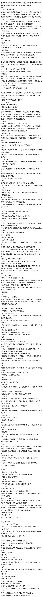

# 【图片】假如素世在那天发动惊世智慧认为退团原因是希祥小情侣之间吵架了【邦多利怀孕吧】_百度贴吧

**作者:飞舞哈基人**

## 1

标题全名：假如长崎素世在CRYCHIC解散那天发动惊世智慧认为祥子要退团的原因是希祥小情侣之间闹矛盾吵架了（上）
——ooc注意——  

## 2

今天的雨下得格外的大。
尽管已经过了约定的时间，但祥子如同前几次一样还是没有到。
（小祥今天不会还是不来吧……）
（学校也看不见她，希望别是发生了什么事……）
“今天，我是来宣布一件事的，我要退出这个乐队！”
“不要！”
脑海里浮想联翩出现的祥子退队的画面吓了素世一跳，惊得她站起来大喊了一声，这引来了立希疑惑的视线。
“怎么了？”
“呃，没什么。”
坐回了矮凳上后，她转换了一下心情，观察起了排练室内的众人。
小立希好像正在手机上跟谁聊天，连嘴角也不自觉的微微上扬了起来；小睦一边抚摸着吉他一边看着从玻璃窗上滑落的水珠，还是那副沉默寡言的样子；小灯跪坐在地板上，正在练习册上写写画画。
若不是手机上的日期不同，素世几乎都要怀疑自己不经意间陷入了什么轮回——毕竟这段时间以来，CRYCHIC排练前的练习室内都是这样的景象。
只是小祥今天依旧迟到了，所以这样的景象才会继续持续了去。
等会要是她来了，小立希就会收起手机重新恢复那幅冷漠的样子，接着小睦会把目光从玻璃上收回，最后小灯会慢吞吞地收起自己的练习册朋友和铅笔朋友。
要是她来了……
“……”
……小祥你一定要回来啊，千万不要丢下我们……
不行不行，不能再想了，有句话说得好，越害怕发生什么就会发生什么。
我得找点事转移注意力……  

## 3

“灯在问你话呢。而且这也太不负责了吧？”
“为什么不说话？”
“小立希，别这样。”
看到了祥子那样的眼神后，立希似乎格外激动。
“那要退出倒是别给我们添麻烦啊？！今天也是所有人等祥子一个……”
“小立希。”
“啧。”
看到立希不满地撇过头去，素世松了一口气。
（总算把小立希拦住了，接下来……）
“就算我不在，你们也能练习吧。”
“哈？”
“想要练习的话自己练不就好了？有没有规定练习必须全员到齐，不要怪到别人身上。”
（……）
“可是，要是你退出的话……”
“不要讲这种撒娇的话，明明你才是最需要练习的人。但你至今都在做些什么？”
“灯就是在等你来啊！”
喊出这句后，立希立刻冲过去抓住了祥子的肩膀推搡着她。
（不好，小立希今天怎么这么激动，明明我刚才都快把小祥劝回来了……）
“等一下，先冷静下来谈谈吧，好吗？”
即使分开了她们，素世也明显感觉到气氛变得不一样了，仿佛某种东西正在远去。
“大家都一起开心玩乐队这么久了。”
（不行，必须得想个办法阻止小祥。对了，让小睦来……）
“小睦也……”
在素世喊出了睦的名字的那一刻，她突然间灵光一闪。
＊长崎素世发动惊世智慧中
“我……”
“等等，小睦你先别开口，让我好好想想……”
她先是转头看了看祥子。
琥珀色眼瞳蓝色双马尾的丰川家族千金，才华横溢，颜值更是不用多说，即使现在浑身湿漉漉般落魄也遮掩不了她身上的美丽。虽然说是大小姐，但待人热诚，身上完全没有那种飞扬跋扈的架子。
“？”
然后又看了看立希。
拥有淡紫色的魅惑人心眼眸——素世从不敢盯着细看，因为她害怕自己会深陷其中。黑色长发顺滑地披在她肩膀上，配置与经典百合文学中少不了的的黑长直高人气女二如出一辙。
“…干嘛用那种奇怪的眼神看着我？”
没有回答她的问题，素世最后将视线投向了坐在地上的灯。
短发，可爱，平常在团队中类似于吉祥物/团宠般的存在。有时候思维会慢一点，例如即使是现在好像她也还没有回过神来。在乐队中负责歌词部分，和负责作曲的小祥一直关系紧密，小立希最近好像也很关照她。
“我懂了，我懂了，我完全明白了……”
在（自以为）弄清楚了事情的真相后，素世露出了一个轻松的微笑。
（原来是这样啊，我有把握小祥今天是绝对不会退出乐队的……）  

## 4

长崎素世，其实意外地深爱百合文学。
自从搬入大house后，母亲就因为工作原因难以长时间陪伴在她身边后，于是素世无聊时只好在手机上刷刷各个社交平台，如果刷腻了就再去看电视。
而电视上的节目是如此令人眼花缭乱，让素世只好从周推荐榜上开看，接着便很自然地被那次周榜第一的新番吸引了注意。
年幼的素世没有注意到也不知道标签里的“百合”是什么意思，直接按下了开始播放的按钮。
在看完了《少女O剧》后，素世又看了《O将成为你》、《O达与O村》等番剧，最终深陷其中，再也无法回头。  

## 5

“你到底明白了什么？”
立希疑惑地看着素世，这人从刚刚开始就一直在小声念叨些什么，看向大家的眼神也怪得很，不知道是怎么回事。
不过也幸亏她这么一搞，刚刚祥子还要退队的悲凉氛围现在只剩下尴尬了。
素世依旧没有回答，因为在惊世智慧的影响下，各条线索正在她脑内汇聚，马上就要拼凑出来一副完整的拼图。
为什么小祥那么多天不来还说要退团？怎么想都很奇怪吧。
为什么小立希今天在看手机时露出了微笑，而且刚才也一直盯着祥子看？明明平常表面上都是一副冷漠的样子。
为什么小立希今天看起来格外的激动？虽然她平常性子直，但也不该是这样的。
为什么小立希要说灯也在等着你来，而小祥要指责小灯练习太少了？以前小祥可是会在灯唱不出口时耐心安慰她的。
只有这样，只有那个理由才能完美解释原因……
没错，真相一定是这样的——小祥会退团，其实是因为和立希正在交往，而小情侣之间闹矛盾了。
这两人绝对绝对是在交往啊！
小情侣之间吃醋闹矛盾了不是很正常吗？一时急了闹失踪想要对方哄自己甚至退团想要对方挽回自己也是很合理的。
至于为什么会吃醋……
答案或许就在小灯身上。
素世回忆了一下，记忆中小祥和小灯两人似乎一开始关系就很好，甚至就连她进入乐队的契机也是小祥的邀请，好像有时候小祥还会去她家里过夜……
难怪啊……
女朋友和另一个人关系如此之好，虽然明白她们肯定都不是那样的人，但吃醋还是在所难免的，可以理解……
不过小立希好像最近和小灯关系也不错？
＊素世继续发动惊世智慧
对了，一定是这样的——定然是小灯的歌词打动了她。
那词我也看过，其中蕴含的情感足以打动人心。在这之后小立希放下了成见，把小灯当做了两人共同的朋友，因此和她亲近，但也是这样才让小祥吃醋了。
太合理了，没有任何问题。
被恋爱思维占领了智商高地的素世认为自己已经发现了祥子退团的真相，并且决定立刻采取措施。
小睦和小灯没准还不知道这件事，那就先不透露给她们……
“…总之我要走了，从今天起，我就不再是CRYCHIC的一员了。”  

## 6

在素世思考的这段时间里，练习室内的气氛渐渐变得越来越尴尬。
睦看着祥子，一时不知道自己接下来要做什么；灯还没从指责中回过神来；立希不语只是默默盯着祥子；素世神游天外，愣是一个讲话的都没有。
祥子无法继续忍受这样的氛围，又抛出了一句话。
“…总之我要走了，从今天起，我就不再是CRYCHIC的一员了。”
“哈？”
当素世脱离了深思，她第一眼看到的便是立希向前迈了一步抓住祥子手臂的动作。
“玩失踪那么久现在闹了这么一场就想走？”
“是又怎样？”
“今天不把话说清楚你就别想出这个门。”
“……”
果然是这样啊，我猜得一点都没错。
素世开始为自己的惊世智慧而沾沾自喜。
要不是我发现了真相今天会怎么样就不好说了……必须立刻做点什么。
“好了好了，冷静一点啦，小立希你先放开。”
接下来就到我出手了。小立希看起来就像是那种不会哄人的样子，我得帮帮忙……
“（压低音量）我们去外面说好吗？你们也不想小睦和小灯知道这件事吧？”
“  ？” “  ？”
（遭了，不会让她发现了吧……）
（有什么事要瞒着她们？）
立希撒手后两人不满地对视了一眼，随即立刻扭过了头不发一言，大概算是默认了素世的提议。  

## 7

拉着两人来到走廊上后，素世先是确认了周围没有其他人后才松开了手，接着立刻迎来了立希的质问。
“到底是什么事？搞得这么神神秘秘的。”
再看一眼祥子，素世发现她眼中多出了好几分心虚，这更加佐证了她的猜测。
为了CRYCHIC……
“抱歉，我不是用了偷听跟踪你们之类的方式才知道的，只是真的太好猜太明显了……”
“有话就快说。”
“那个，小祥和小立希，是在交往对吧？”
“？”
“哈？”
立希如此激动的反应全被素世看在了眼里。
（真不愧是我呢……）
如果素世正常思考的话，她就会想起，就算两人不是情侣关系只是被误会了如此激动也正常。
但很可惜，她现在已完全被自己的惊世智慧所俘虏。
“抱歉，我之后会忘掉的……但是，就算你们闹矛盾了也不能用退出大家的乐队来作为威胁呀，这样对大家都不好……”
“…你在说什么？！谁要跟这家伙是一对了？”“我不知道你在说什么，反正我们不是那种关系。”
还说不是呢，就连沉默的时间都不差分毫。
＊长崎素世第三次发动惊世智慧
啊，我懂了，现在是进入到了那种经典的小情侣在局外人面前否定自己关系的时候……
可以理解，毕竟没有一开始就选择告诉大家肯定是有原因的。
不过现在该怎么做才好呢？
……找出证据两人就否认不了了！然后就是化解矛盾达成圆满结局……好，就这么做！
“既然不是一对的话，为什么小立希要拦着小祥走？”
（这家伙今天怎么回事？）
“某些键盘手缺乏职业道德不由分说地要退出乐队，我要拦住有问题吗？”
是无懈可击的证词呢…那就先从小祥身上找出破绽。
“小祥今天说过灯才是要多加练习的那个人对吧？”
“那又如何，难道不是……”
“问题就出在这里！”
素世伸出手指指向祥子。
“以前你对小灯她可不是这个态度！我记得最开始她没办法鼓起勇气开口唱歌时也是你先鼓励她，今天态度变化的这么大的原因只有一个！”
“那就是——你在吃小灯的醋！”
“哈？你什么意思……”
（素世今天怎么回事，早知道我就不来了……）
眼看立希向自己投来了震惊的视线，祥子慌忙开口解释。
“没有那种事！我，我只是……”
“还有小立希你，虽然嘴上说的是‘今天也是所有人等祥子一个’和‘灯就是在等你来啊’，不过实际上是你自己在期待着吧？你这个人，真是满脑子都是自己呢。”
其他人在等你来≠我没有等你来，一定是这样的。
＊灵光一闪x2
“还有，我看小祥来前你嘴角上扬不自觉微笑，是看到了她回复今天会来的消息了吧？小祥好过分哦，明明都没回我……”
震惊的人变成了祥子。
“你……”
“我不是，我没有…你听我解释啊！”
立希越发慌张，素世便认为自己推测的准确性越高。
“不然是什么？小祥回来难道你不高兴吗？”
“……”
“而且最近几天你对小灯挺好的对吧？小祥就是因为这点啊——她在吃你和灯的醋！”
“……我没有……”
“对小灯态度没有变好吗？我现在就可以进去问问她……”
“停，别说了……但是我跟她真不是那种关系……”
“……素世，你今天怎么回事？”
那我只能打出最后一击了。
“所以小祥突然退团的真相是——在你们两人正在交往中的情况下，小立希因为小祥和小灯挨得太近而吃醋，小祥因为小立希和小灯关系明显变好而吃醋，打算以这种方式来引起对方注意…是这么回事没错吧？”
祥子欲言又止，立希的沉默振聋发聩。
（全错啊。）
（她哪来的自信这么想的？）
被夹在让素世发现家庭变故的真相，和被众人认为与立希情侣吵架的假真相中，祥子左右为难，最后做出了一个中庸的决定——逃跑。
素世还沉浸在自己的“真相”中，没能拉住她，于是没几秒钟祥子就跑下了楼梯然后在她视野中消失了。
“呃……小祥怎么跑了？这和我想的不一样啊……小立希你不追上去吗？”
“你没看她跑多快？我拿头追？”
撇下这句话后立希就走回了排练室里，只留下素世一个人站在走廊上。
（她没否认！绝对是真的！）
（不过最后怎么会是这种情况……我有哪里做错了吗？以我看了那么多番的经验来看不该是这样的呀……）
“还有，我们不是那种关系，你想太多了。”
探头没好气地说出这句话后，立希重重关上了门。
（……这叫什么来着？越否认越真！）
很遗憾，素世自己说服了自己，没有发现论据中的哪怕任何一点问题。  

## 8

假如长崎素世在CRYCHIC解散那天发动惊世智慧认为祥子要退团的原因是希祥小情侣之间闹矛盾吵架了（上二）
——
回到家后立希做的第一件事便是跑进浴室狠狠洗了把脸。
（素世这家伙今天什么情况？好像在祥子进门后就一直不太对劲……）
（先是不让我拦住她，然后又在那里搞什么拉郎配，摆了一大堆证据最后得出一个我喜欢她的鬼结论，我怎么可能喜欢那家伙？）
（真是失算了，今天就应该当面把每一点都反驳回去的…再见到她绝对要全部解释清楚。）
她叹了口气拧好水龙头，然后才突然意识到一件事。
（我跟她看起来真的有那么像是在交往吗？）
立希第一次不是下意识地想要反驳反而开始认真思考素世的论据。
（我确实是希望祥子能回来，最近跟灯的关系也变好了……）
手不自觉抚上脸颊——难道我真的在连自己都没有察觉到的情况下笑了吗？
（不对不对，怎么让她带进沟里了？我干嘛要考虑这些事？）
（…不管怎么说，下次找时间见一面好好解释清楚就没问题了吧。）
立希今晚又熬夜了，因为她一闭眼脑海里就会浮现出今天祥子的面容，紧接着是脸颊发热。  

## 9

假如长崎素世在CRYCHIC解散那天发动惊世智慧认为祥子要退团的原因是希祥小情侣之间闹矛盾吵架了（上二）
——
回到家后立希做的第一件事便是跑进浴室狠狠洗了把脸。
（素世这家伙今天什么情况？好像在祥子进门后就一直不太对劲……）
（先是不让我拦住她，然后又在那里搞什么拉郎配，摆了一大堆证据最后得出一个我喜欢她的鬼结论，我怎么可能喜欢那家伙？）
（真是失算了，今天就应该当面把每一点都反驳回去的…再见到她绝对要全部解释清楚。）
她叹了口气拧好水龙头，然后才突然意识到一件事。
（我跟她看起来真的有那么像是在交往吗？）
立希第一次不是下意识地想要反驳反而开始认真思考素世的论据。
（我确实是希望祥子能回来，最近跟灯的关系也变好了……）
手不自觉抚上脸颊——难道我真的在连自己都没有察觉到的情况下笑了吗？
（不对不对，怎么让她带进沟里了？我干嘛要考虑这些事？）
（…不管怎么说，下次找时间见一面好好解释清楚就没问题了吧。）
立希今晚又熬夜了，因为她一闭眼脑海里就会浮现出今天祥子的面容，紧接着是脸颊发热。  

## 10

（虽然最后有点不欢而散，不过小祥没成功退队CRYCHIC也没有解散，我今天还是起到了点作用的嘛。）
回到家后，素世一边复盘刚才练习室之战的经历，一边顺手打开了电视。
（《OOOOO》更新了？哦对已经是周日了。）
明明是自己之前一直追更的番剧，但素世却突然失去了继续观看的兴趣。
（奇怪……对了，肯定是小祥她们的事导致的，毕竟番剧里的哪有现实中的有意思嘛。）
然后素世陷入了沉思:那怎么样才能得到更多的情报呢？
（小睦跟小祥平时形影不离的，两人还是青梅竹马，她应该知道些什么吧？）
（好，明天就去问问她！）
今晚，素世睡了个好觉。  

## 11

但祥子就不一样了。
结束了送报纸的工作后回到家里时，已是晚上十点。
疲惫的身躯甚至不足以支撑走到房间里，她只好坐在了玄关台阶上。
门还没关紧，月光恰好透过门缝照到了面前的地板上。
“……”
祥子突然好想哭。
但连她自己都不清楚原因。
或许是因为今天自己为了坚强而离开CRYCHIC的举动——这样对大家真的好吗？连原因都不曾知晓就被“抛下”……
或许是想到了目前的处境。转学的事宜已经安排好了，送报纸发工作也还算稳定，可是未来会怎么样呢？毕竟命运就是这样不可确定不可捉摸，万一再突然发生些什么……
不过也有可能是因为被素世误以为和立希正在交往。
（素世她到底怎么想的啊，我们真的很像是在交往吗……）
（……真的看起来有那么亲密吗……）
（但就算真的真的看起来是这样……）
（那种事情，根本就不可能发生在我的身上。）
（我们早就从根本上就不同了。）
（立希还有爱她的父母，有在意她的姐姐，有志同道合的乐队好友。）
（而我……）
（……）
（什么跟她正在交往之类的事情，根本就不可能发生在我的身上。）
月光下，祥子脸上的泪痕更加明显。  

## 12

祥子在早上给睦发消息告诉她今天是自己去羽丘的第一天时，猛然发觉了一个之前被自己忽略了的严重问题。
此刻她最不愿意碰见的人之一，立希，也在羽丘上学。
（怎么可能那么巧呢？就算再不济分到了同一个班也不可能坐得很近的……是这样的吧？）
——
“今天我们班里来了一位新同学。”
“大家好。我是祥子。以后请多指教。”
（立希应该不在这个班……）
祥子的视线扫过台下众人，在看到后排靠窗座位上的立希的那一刻，两人同时一愣。
（…也太巧了吧？）
不知为何，立希身边的那个位置是空着的。
接着祥子向大家微微鞠躬。
（总不会…）
“祥子同学，你就坐那个座位吧。”
越怕什么越来什么。
“好的。”
悄悄深吸了一口气，祥子尽量在不露出任何破绽的情况下朝自己位置走去。
（只是同桌而已，没有问题的……）
然而这样的想法在跟立希近距离对视时消失得无影无踪。
（绝对问题很大啊？！）
（不不冷静下来，座位反正是能调的，等过阵子稳定下来再申请吧……）
所以落座摆好东西后，祥子才意识到刚刚立希一直在盯着她看。
“（小声）我们认识吗？”
即使她特意加重了语气，也没有成功阻止立希开口。
“为什么你会出现在这里？”
顺带一提，这句话是正常音量。
“我不知道你在说什么。”
（千万不要误会了…立希应该还没有被素世传染吧？）
“咳咳，接下来要上课了，立希同学就算和祥子同学认识的话，也不能在下面讲悄悄话哦。好，大家把书翻到……”  

## 13

月之森女子学园，早上放学后。
睦一下课就没影了，素世快步走到了小黄瓜种植区，果不其然发现对方正在站那里给小黄瓜浇着水。
“小睦。”
“soyo，中午好。”
看见素世快步走来，睦的脸上露出了微笑。
昨天因为惊世智慧的缘故，原本的世界线发生了变动，所以睦并没有说出那句“我从来没有觉得玩乐队开心过”，两人的关系也就一如既往。
“有什么事吗？”
“小睦，问你个事啊…我就单纯问问，真的没有别的意思哦？不回复也是可以的。”
“是什么事？”
“那个，小祥她……是不是和小立希在交往？”
“？”
在素世开口的前一瞬间，睦想了很多，但是万万没有料到是这样的问题。
“小睦你跟小祥关系那么好，应该知道内情的吧？”
“……”
睦，停止了思考。
“呃，难道说，小祥没有跟你说过这件事吗？”
“……祥，没跟我说过。”
“这样啊。”
（果然是在秘密交往，连小睦都没告诉。）
（遭了，既然这么保密还被我点出来了，不会导致什么不好的后果吧？）
（也不能怪我呀，谁让她们那么明显……）
“难怪，祥，要转去羽丘。”
“……你说什么？！”
——
将交流地点转移到园艺部的亭子里后，睦把祥子转学的这个消息透露给了素世。
当然，只包括这一点，其他被禁止提及的包括月之森学费很贵、家庭变故等睦一个字也没说，但仅仅是这样也足够素世推测出许多信息了。
＊素世发动惊世智慧中
小祥为什么要转学去羽丘？这种事情这么麻烦，想必不是一时上头，必定是早就考虑完全了的。
也就是说至少要提前一周准备，刚好和小祥不来学校的时间对得上。
但是为什么是羽丘——
对了，立希在那里！
在惊世智慧的加持下，素世用了不到五秒钟就得到了“答案”。
首先小祥和小立希因为吃醋的原因吵架了，但小祥太别扭说不出口，小立希又不够细腻没有察觉到原因。
所以小祥必然是要转学到羽丘和立希同一班近距离交流增进感情口牙！
呃，总感觉漏掉了什么，不过应该不会影响结果。
反正既然只是闹点小矛盾而已，把话说开了不就好了吗？
……那自己还要出手吗？
先不管这个，再好好想想。
我记得好像曾经听小立希说过她没有同桌？那小祥肯定也知道。
所以小祥去羽丘→小祥和小立希同桌→小情侣亲密。
完 全 正 确。
素世从未觉得自己的大脑如此好使过。
而且印象里羽丘好像是有直升制度的？这样一来两人升上高中了也能继续待在一起。
真不愧是小祥啊……  

## 14

现在，让我们把时间稍微往前调一点，看看立希那边发生了什么。
当下课铃响起的那一刻，立希马上转头问出了她目前最关心的问题：“你转来这里做什么？”
“我去上个厕所。”
祥子通过逃避的方式躲开了这一问，但她这一走便给其他同学创造了可乘之机。
“立希酱和祥子同学认识吗？”
“祥子同学看起来好神秘，立希酱怎么认识的？”
“祥子同学看起来好厉害，应该学习很好吧？”
“……”
“抱歉，麻烦让让，我去上个厕所。”
走得太匆忙的立希并没有听见身后传来的细微的“你看她们连上厕所都要一起”的声音。
椎名立希，实际上在同班同学中，甚至可以说是在是整个年段的同学中，意外的有人气。
柔顺的黑长直头发，让人不敢细瞧的紫色眼眸（同班同学语）。
自身又优秀，成绩和体力都名列前茅，心肠也不差。
除此之外还是令人仰慕的真希学姐的妹妹，传闻只要跟在她身边就能学习到真希学姐的能力与品格并获得与她见面的机会。
唯一的问题就是她看起来总是一副冷冰冰的样子，导致目前还没有人能够成功克服心理压力和她成为同桌。
而现在，她面对新来的转校生时的截然不同的态度，便很自然地被大家注意到了。
“……你连我上厕所都要追过来？”
“只是恰好过来洗把脸。”
看对方一脸不相信的样子，立希索性也不多解释。
“不过你等着，我总会找机会把一切弄清楚的。”
“……”
（那你就试试吧。）
大课间。
“这么着急走？ 那 么 久 没见就没什么话想和我说的？”
“我已经说了过吧？我和立希同学不认识。”
“是吗？那你还知道我的名字？”
“……”
“诶，别走啊。”
祥子快步走出了教室，立希跟在后面紧追不舍。
“你还要跟我到什么时候？”
“等到你什么都说了。”
前方走廊上不知道发生了什么，人群闹哄哄地挤在一起，看上一眼就知道绝对挤过不去。
祥子没有办法，只能硬着头皮继续沿着楼梯往上走，而再往上一层便是最顶层：天台。
确定天台上没有其他人后，祥子放心地开口。
“能不能不要再缠着我了？难道你不觉得这样的行为很讨人厌吗？”
“有吗？”
立希向左微靠了一下，将门口堵得更死。
见她这幅样子祥子火气也涌上了心头，决定一言不发就在这里跟她耗着。
就在两人沉默对峙的时候，意料之外的事发生了——
祥子的肚子叫了起来。
“…你没吃早餐？”
“是又怎样？”
立希在口袋里摸索了一下，掏出了一盒熊猫能量饮料。
“…你别靠过来……”
“不然难道要我丢过去？”
“…哼。”
（这家伙还真是倔的可以。不过好在时间还长，总有办法弄个清楚……）
于是现在的情况变成了祥子坐在立希身旁吸着能量饮料。
“早上吃这东西真的能饱？”
“是啊，你试过就知道了。”
“你早上就吃这个？”
“比某个人什么都不吃好…别用那种眼神看着我，我早上吃过了，今天恰好多买了一盒。”
“…先说好，就算这样我也不会告诉你原因的。”
“你不说我就继续问。总有一天你会说的。”
“啧。”
（这人怎么这么倔？）
“或者再不行我猜也可以。反正就那么些原因，多试几次也能猜出来。”
“比如说……”
当立希盯着祥子的眼睛，准备以此来判断自己的猜测是否正确时，天台的门被推开了。
“我就说……咦，立希酱和祥子同学怎么在这里？”
来者是立希的某个同班同学。
“我们走吧，今天来晚了已经有人了。”
“就跟你说。”
“……”“……”
短暂的沉默后，祥子先开了口。
“呃，那个，应该不会被误会吧？”
“你被素世传染了？”
立希自然知道她是什么意思。
“…没那回事。”
“别急着走啊。”
“我说过了跟你不熟。”
早上放学后，相似的一幕又在教室里上演。
祥子直接拎起包就走，立希为了追上她甚至连桌上的东西都还没来得及收拾好。
“知道为什么每次我都能追上你吗？就你们月之森那个走路方式……别跑！”
不知道是被这句话刺激到了还是觉得她太烦人了，祥子竟然真的小跑了起来。
立希依旧紧追不舍，很快两人就来到了学园里相对偏僻几乎没人的地方。
“到底是什么原因让你要这样离开大家？”
“要我重复几遍？我是不会说的。”
“当时是你说的命运共同体吧？乐队里没有你留恋的东西了吗？”
“你又懂什么？”
“你不说我怎么懂？”
立希其实并不知道一件事——祥子不仅没吃早饭，而且昨天因为疲劳与难过所以晚饭也没吃成。
而这件事所导致的后果很快就展现在了她面前——祥子跑着跑着，感觉身体越来越轻，腿也控制不住的开始打飘。最后“啪”的一声重重摔倒在了地上。
祥子还想爬起来继续跑，但是大脑的眩晕感让她怎么都做不到这一点，反而还导致更猛烈的疼痛感袭来。
大脑完全被眩晕和疼痛占据，一片空白。
“喂？你怎么了？”
在一片空白中，立希焦急的声音格外清晰。
“拉，拉我…”祥子的声音微弱而软糯，一听就让人知道身体出了事。
“真是的…”立希摇了摇头，直接把祥子抱了起来，向医务室走去。
祥子的大脑仍然一片空白，甚至眼前已经出现了黑白电视式的雪花片。
（母亲…我是不是要来找  

## 15

（母亲…我是不是要来找你了…）
（我……）
（立希的怀抱，好温暖…）
回过神来，祥子发现自己已经躺在了保健室中的床上。
“……我刚刚……”
“低血糖，摔倒的时候膝盖磕到了。葡萄糖已经打了，我看了下只是破皮，帮你贴了创口贴。”
“……”
（原来是低血糖吗……刚刚好丢脸……）
“抱歉。今天是我的问题，是我太心急了，不该追你那么紧的。”
“……没关系。还有你怎么不问了？”
“为什么要问？”
“还装。反正我现在也跑不掉……”
“我改变主意了。”
“嗯？”
“既然你一直不愿意说，那肯定是有真的不能告人的理由，虽然我不知道是什么……等到你自己愿意说的时候，我再问吧。”
“但是，你要退出CRYCHIC这点我是绝对不会同意的。CRYCHIC是我们共同的乐队，你还是队长，只要我们还有一个人没有同意，你就别想丢下它。”
“我会一直跟在你身边的。”
“……保健室的老师呢？”
“她刚刚出去了。怎么了，是哪里还不舒服吗？”
“…你凑过来点。”
“哈？”
“你不是一直想知道原因吗。”
“现在？”
“嗯。”
祥子用力抓住了立希的衣袖，使得她不得不坐到床上来。
……
“所以这就是原因。”
看着祥子眼中闪烁的泪花，立希无奈地叹了口气。
在明白了一切后，她反而无法对祥子做出任何指责，还从心底感到了心疼。
明明是相同的年纪，却遭遇了这种事。
“……抱歉。一直瞒着你们，还做了那种事。”
“大家都没怪你。该道歉的是我，那天对你那么激动……你现在感觉如何，不行的话我下午再帮你请个假。”
“这样没问题吗？”
“没事的。身体重要。”
于此同时，立希的某几个同班同学正在教室里交流今天早上的见闻。
“立希酱是不是和祥子同学认识？”
“我看是。我早上去天台的时候看到她们两个坐在一起。”
“细说。”
“祥子同学在喝那个能量果冻，就是立希酱常喝的那个，然后她还在盯着她看。”
“哇哦。”
“但她不是说不认识立希酱吗？”
“话是这么说，但两人看起来完全不像是不认识的样子啊。”
“立希酱早上是不是问她为什么要转学过来？”
“有吗？”
“你们说会不会是那种关系……”
“嘘，嘘，这种话可不能乱说。”
“知道啦。”
“……”
“……所以是吗？”
“真没事了？”
当扶起对方的时候，立希意识到这个人似乎比看起来还更加瘦弱。
“嗯…放开我，我自己能走。”
“又在逞强。你才刚好，万一又摔了怎么办？”
“……”
祥子发现自己根本无法挣脱的“禁锢”。
（会被其他人看到的，立希难道一点自觉都没有的吗？）
在那天被素世误会后，祥子开始渐渐注意相关的事。
（算了……就这一次的话，也不是不行。）
最后就变成了立希一路扶着祥子进了食堂。
“怎么样？”
“好吃。”
“……”
立希没告诉她，其实大家对羽丘饭菜的评价都是一般。
“那其他人那里你打算怎么办？”
“…等下午放学了我再去跟她们说清楚吧。”
“我帮你把大家叫出来？”
“嗯。”
“那CRYCHIC怎么办？”
“……”
“其实也不一定要退出吧？完全可以保留你的位置，只是不参与彩排，然后暂时也不开live之类的嘛。”
“……可以吗？”
“怎么不行？其他人肯定也没意见的。”  

## 16

标题全名：假如长崎素世在CRYCHIC解散那天发动惊世智慧认为祥子要退团的原因是希祥小情侣之间闹矛盾吵架了（中一）
——
下午放学后，睦和素世一边聊着一边走出了校门。
“小睦应该也收到了小立希的消息了吧？”
“嗯。”
“说是有关小祥的重要的事所以想在练习室见一面…是什么样的事必须线下当面说呢？”
“不清楚。”
“那我们先过去吧，没准到了就知道了。”  

## 17

素世和睦先抵达了练习室，紧接着到达的是灯。
让睦在外面放风后，素世将自己所推测的退团真相告诉了灯。
“原来…是我的原因吗？”
眼看单线程的小灯就要陷入自责里，素世连忙转移了话题。
“哎呀我不是这个意思，我是说小灯你唱得很好了不是练习的问题……啊我的意思是小祥和小立希正在交往！”
“小祥和taki酱，在交往？”
“对对对，就是想说这个，其他的小灯都忘掉就好了。”  

## 18

没过多久，三人就看到了共同赶过来的祥子和立希。
（怎么这两人是一起来的？哦对小祥转学去羽丘了…）
（我就知道我的推测没错！）
“…你那表情是怎么了？”
素世连忙收起了自己脸上微妙的表情。至于睦，她一直都是那副样子，表面上根本看不出任何异常。
“没什么，小立希不是说有关小祥的重要的事吗？快说是什么吧。”
“不是我来说。祥子，过来。”
立希将拼命躲在身后的祥子拉了出来，推到了三人前面。
“说吧，大家都等着呢。”
“我……”
这两天来素世发觉自己的脑子越来越好使了，特别是在猜测希祥两人有关的事上。
＊素世第三次灵光一闪
（难不成，是要公开恋情了？）
（也是，看她们现在的样子矛盾应该已经解决了。现在估计是因为上次被我发现了，所以打算直接戳破不再瞒着大家了。）
她的嘴角开始不自觉地上扬。
“我……”
（快说吧，我和小睦和小灯都等着呢。）
素世的嘴角继续上扬。
“虽然很抱歉我没办法明说原因但是真的是因为我个人原因所以无法继续乐队活动！”
“？”“？”“？”“？”
“你…不是说好了要给大家一个交代吗？”
立希一把捉住了准备逃跑的祥子。
“可是…我…我真说不出口啊反正立希也知道了就你帮我交代吧！”
“……行吧，那就只能我来了。”
看祥子这副样子立希也不强求，转过身来将祥子告诉自己的原因一一交代。
……
“总之差不多就是这样。我问了祥子，现在她的打算是先暂时缺位，不过并不会退出CRYCHIC。”
“……”“小祥……”“原来因为这样小祥才要退出吗……”
“嗯。祥子…人呢？”
“祥，移动。”
“跑出去了是吧？那我先去把她带回来。”
＊素世发动惊世智慧中
“我懂了。”
她认为自己已经明白了一切：两人闹矛盾并不是全是因为吃醋了，还有小立希想要帮助小祥的原因在里面。
虽然小立希不太擅长哄人，但以她那种细腻、外冷内热的性格，发现小祥的不对劲并且关心肯定是做得到的。
那么小祥接受帮助后闹别扭觉得不用这么帮自己或者觉得自己不值得被这样关心也是很正常的。
所以自己昨天调解失败是因为没有找到全部的原因。
证据？随处都是。
为什么是小立希邀请大家来但本来该开口的却是小祥？明显是因为她勇气不足够所以先拜托小立希把人叫出来。
为什么小祥跑掉后小立希能帮忙补充？一定是她先把这件事告诉了小立希，嘱咐如果自己讲不下去了就帮一下忙。
素世的阅历是在太过丰富了，她记得自己在许多漫画中都看到过类似的剧情。
（都到这种地步了，两人的关系就不用我太担心了。）
素世越想，脑袋里的画面越清晰，现在她感觉自己甚至能想象出两人在视野范围外牵手的样子。
（要是我有认识在羽丘的朋友就好了……）
（也不知道小睦是怎么想的，得和她交流一下想法。）  

## 19

祥子并没有跑开很远，立希走了几步就在拐角处找到了她。
“…谢谢。”
“不是说好了要给大家和乐队一个交代吗，怎么见面了什么都说不出来？”
“…抱歉，我也不知道为什么，本来我已经想好怎么开口了……”
立希继续打趣着，但很快就意识到了不对劲。
“明明之前对着我就能说出来……”
“……？”
“…可能是因为人太多了吧……总之我们还是先回去吧，别让睦她们等急了。”
迎接祥子的是素世和灯的拥抱。
“你们？”
“小祥，辛苦了。”
“对不起小祥，这段时间你一定过得很辛苦吧，我应该早点注意到的。啊，我现在还有不少零花钱…”
“好了好了，先冷静下来。”
立希赶紧上前分开了抱在一起的三人。
“抱歉，我刚刚太激动了……不过小祥之后要暂时缺位了对吧？”
“嗯。”
“那现在谁来担任CRYCHIC的队长位置呢？”
“啊，关于这个，我早就想好了——就由小立希来担任吧？”
“我？”
“是呀。小立希那么喜欢音乐，还很有责任心，对大家也很关心...你们觉得呢？”
（果然，乐队这么重要的东西都能托付给对方，这不就是一对吗？）
（等等，这么说的话……那岂不是等于交换了定情信物？）
“我觉得很合适！”素世的笑容似乎传染到了旁边的睦脸上，平常总是面无表情的她此刻也露出了微笑。“可以。”
“…我也同意小祥的说法。”
“全票通过。那么，你的意见呢，立希？”
“我，我…我没意见！”
立希拍掉了祥子搭在自己肩膀上的手，此刻她还没有发现，自己已经从耳朵根红到了脸颊。
“那么小立希以后就是我们的新队长啦～”
“祥，恭喜。”
（为什么是恭喜我？）
“所以小祥不会退出了吗？”
“嗯，灯你放心，就只是暂时缺席啦。”  

## 20

讨论了些今后乐队的相关问题后，众人散伙各回各家，祥子按习惯和睦同行。
“祥，幸福。”
昨天话语被打断了的睦开始展现她的说话之道了。
“听不懂什么意思啦，睦可以把话说清楚一些嘛？”
“祥，是不是和立希在交往？”
“谁跟你说的？不对，谁告诉你的……不是，我是说谁乱传的谣言？”
“soyo。”
“这家伙……”
想起昨天发生的事，祥子气得咬牙。
（不死心也就算了，还带坏了睦……）
“那个，睦，你听我说啊。”
“嗯。”
熟悉她的祥子看得出来，对方一脸“我就听你狡辩”的样子，但没有任何办法只能继续解释了下去。
“我跟立希一点关系…啊不对不对，我跟她不是那种关系。”
“嗯嗯。”
“我跟她只是正常的关系哦？一点非分之想都没有。”
“嗯嗯。”
（看来睦还是不太信…她是不是知道了今天早上发生的事？）
（大概是了，不然怎么会这么容易被素世说服…看来得好好解释一下了。）
“睦你听我说，今天早上发生的那些事不是你想的那样。”
“？”
“立希追我到处跑只是为了找我弄清楚退团的原因，如果没有她，我可能…不会告诉大家……还有我们食堂里坐在一起吃饭也只是凑巧，你明白了吗睦？”
祥子刻意隐瞒了自己犯了低血糖的事。
“知道了。”
（明白了就好。）
“祥和立希，进展到哪一步了？”
“你这不是什么都没听进去嘛？！”  

## 21

素世的惊世智慧让她想到了另一个办法。
既然找不到人问，那就悄悄潜入羽丘的论坛，看看有没有相关帖子。
作为氛围相对轻松点的女子学园，羽丘习惯使用手机的学生更多。有几个毕业生便合资打造了一个网上平台供学生们聊天，还开放了匿名模式方便大家吐槽。
既然决定了就马上行动，素世立马注册了一个小号，打开匿名模式后便翻起了帖子。
水经验的专用楼，不看。
标题和这件事看上去没有任何关系的，为了节省时间也先不看了。
有人知道今天新来的转校生是什么情况吗[表情]？就是这个了。
【二楼自占】
【有人认识今天新来的转校生吗？】
看了眼日期，是今天的帖子，于是素世继续看了下去。
【蓝色头发那个？】
[是的，我看她和我们班上一个女生好像关系挺好的]
[好像是，我中午在食堂看到她们坐在一起了]
……
（奇怪，她们好像也不是很避着人呀？）
（小睦那边来消息了，我先看看是什么……）  

## 22

“我回来了。”
没有任何回应。
祥子对此早就习惯了，连回复的时间都没有留，话说出口后就转身去关门。
至于为什么还要这么做，或许是以前的习惯还在影响着她吧。那个过去无忧无虑的自己早就死去了，残存的影响却持续到了现在。
……
“所以…小祥什么时候回来呢？”
这句由灯问出口的话，即使是过了好几个小时也依旧还深深卡在祥子喉咙中，让她无法忘记。
自己根本就无法拒绝大家带着期待、充满了希望的眼神，于是再一次犯下了错误——
在“刚被赶出来时欠了钱，父亲只找到了低工资的工作于是我们两个人只好拼命挣钱”的“真相”上继续编织了一层谎言。
“只要…一切稳定下来了，我就会回来的。”
“我不在的时候大家也要继续努力哦。”
“祥，约定。”
“嗯，一定。”
后续的对话仿佛被炽热的铁块烫在了祥子脑海中，不停地浮现，灼烧着她的灵魂。
（我真差劲啊…明明知道根本就不可能还要挤出虚伪的笑容说那样的话…只是拖延时间而已……）
（明明大家帮了我那么多，却还是撒了谎，连最基本的坦诚都做不到……）
（这样的我……）
（明明说好了要给大家一个交代最后也没做到，居然让让立希又帮了忙……）
“哈，父亲没有什么不良习惯乱花钱，只是运气不好所以暂时还需要两人共同努力挣钱……”
“这种话，亏我也说得出口。”
“……如果真的是这样就好了…呜，呜呜……”
祥子的哭泣声并没有使隔壁房间的父亲内心有任何触动，因为他早已熟睡。  

## 23

“小立希——你过来一下呗，姐姐问你个事。”
“什么事？”
“你猜？看你那副表情，真是什么都藏不……诶回来回来，真的有事要说啊。”
“有事就直说。”
“好好，不开玩笑啦。你们班上是不是新来了一位转校生？”
真希敏锐地注意到立希动作僵硬了一下。
“是啊。”
“如果我没猜错的话，她应该是我非常熟的人……”
“…你从哪知道的？”
“哎呀，不要在意那些嘛。再靠过来点呗。是不是和小祥她闹矛盾了？”
“没那回事，只是……”
立希脸上犹豫的神色实在太过明显，让人很难不误会。
“说说嘛，姐姐听着。”
（祥子退队的原因答应了不能传出去，不过事件本身应该可以说吧？）
“就是祥子她昨天想要退团，不过今天已经解决了。”
“至于原因，抱歉姐姐，我答应了她不能外传……”
真希自然选择了相信自己的妹妹。
“没事的啦，姐姐理解，既然是秘密那我就不问了。”
（不过两人关系难道已经好到这种地步了吗？）
“咳咳，姐姐最后再问一件事哈…你们现在到哪一步了？”
“哈？”
这两天来的经历立刻让立希明白了姐姐的意思。
“诶别走啊，姐姐真的开玩笑的——”
——
“小立希——姐姐真的知道错了——开开门好不好？”
立希微微将自己房间的门打开了一道缝。
“…你好烦。”
“我下次不这样了嘛，别生气行不行？”
“行了行了别喊了…我睡觉去了。”
——
(为什么我老是会在意那些啊。)
(不想了，反正我清清白白问心无愧，心里没鬼我怕什么。)
(我会用行动证明给其他人看，我和祥子才不是那种关系！)
(而且总不能因为这些传言就和她切割吧，毕竟…总之我们之间的友谊不能受这些东西影响。)
（明天，继续给她带早餐吧…）  

## 24

🤓👆你知道我要说什么
【【MyGo二创/希祥】假如长崎素世在CRYCHIC解散那天发动惊世智慧认为小祥要退团的原因是希祥小情侣之间闹矛盾吵架了（上一）-哔哩哔哩】 https://b23.tv/jrkUWQV  

## 25

标题全名：假如长崎素世在CRYCHIC解散那天发动惊世智慧认为祥子要退团的原因是希祥小情侣之间闹矛盾吵架了（中二）
——
今天是祥子转来羽丘的第二天。
“早饭吃了没？”
“呃……”
“给。”
立希从包里掏出了一瓶和昨天同个口味的能量饮料。
了解真相后她便怀疑起了祥子是不是为了省钱而一直不吃早饭，于是今天早上特意多买了一瓶。
“诶…谢谢。”
“早上不好好吃饭小心以后胃痛。”
“…知道了。”  

## 26

中午，食堂。
“我说，你一定要跟着我到这里吗？”
“看看你有没有好好吃饭。”
“这么有什…算了，随便你吧。”
（毕竟昨天自己刚犯了低血糖，立希会担心也是难免的，等过了几天应该就不会这样了……）  

## 27

（老是这样也不是办法。）
立希想了想，觉得根源还是祥子需要节省开支没办法多花钱。
（送报纸收入确实不太多，但是这个年龄好像也找不到什么工资高点的工作……）
（有没有什么办法能挣点外快呢？）
“今天是不是有排练？”
“没吧，应该是你记错了。”
路过的两名背着乐器包的学生间的对话给了立希灵感。
羽丘里组了乐队的学生可不在少数，如果能找个有偿帮忙编曲之类的事做没准能挣上不少？
不过以她的性格也不知道会不会同意…总之先问问吧。  

## 28

立希回到教室里，正好看见几个人从祥子周边走开。
“怎么了？”
“没什么，就是大家太热情了，问我熟不熟悉羽丘想不想逛逛之类的……”
“还没习惯？”
“有点。”
“以后你就会习惯的。问个事，有没有想过有偿帮其他乐队作曲之类的事？”
“诶？”  

## 29

池袋乐队少女的主要聚集区之一，cricle，立希和祥子正站在贴满了需求的告示板前。
“真的能找到吗？”
“不试试怎么知道。论坛上我也问了，等下再看看有没有人回。”
“谢谢，麻烦你了…”
“小事。先看看有没有羽丘的如何？这样到时候接触方便些。”
“嗯。”
（这样真的可行吗……对了，作曲！）
“立希最近是不是也在自学作曲？”
“是啊，怎么了？”
“那个，我觉得我大概可以帮上忙？”
“…下次再说吧。先过来看看这个，符不符合你的要求？”  

## 30

“祥子同学？”
确定目标后两人就来到了circle里坐着，准备先按告示上的联系方式联络一下对方，却没想到在立希上洗手间时祥子意外遇见了某个同班同学。
“贵安。”
“啊，下午好。”
对方的表情似乎有些困惑，环顾了周围一圈像是在寻找什么东西。
“咦，立希酱没跟你一起来吗？”
“有啊，怎么了？”
“没事，就是想到毕竟你们是…呃…我还有事先走了！”
对方一溜烟跑掉了。
“？”  

## 31

在立希把帖子截屏给祥子看后，她便注册了一个账号并偷偷关注了立希。
在睡觉前，祥子打算看看有没有什么新的回复，却不想打开的瞬间眼睛第一秒就瞥到了意料之外的东西。
【我是初中部的，有没有人认识新来的转校生？】
她本来并不想点进这个帖子，奈何它的评论和点赞数远高于界面里的另外几个，让人不由得起了几分好奇。  

## 32

祥子心里有了一种预感——今晚或许又要失眠了。证据便是自己现在躺在席子上翻来覆去，一闭眼就会想起素世和睦的话语。
小祥和小立希是在交往对吧
祥和立希进展到哪一步了
（今天忘记跟她们解释清楚了…算了，之后再说吧。）
（……）
（…但是果然还是好在意……）
（我们真看起来那么亲密？）
早已被否定掉了的问题，答案却又在此刻变得模糊。
（……）
论坛里“和立希同学看起来关系很好”之类的言论虽然表面上看起来没什么，但祥子知道那是什么意思，从表情包和氛围就能明显看出来。
（难怪她下午会问我和立希有没有一起来…）
切割。
浮现在祥子心中的第一个惯用的解决办法便是切割。
要解决当下局面的问题不是很简单吗？只要把自己和立希分割开来就好了。
当着所有人的面大声宣布自己和她现在、未来都不会再有任何关系，这样就搞定了——可是根本就做不到。
我怎么可能做出那种事？
与立希相处的点点回忆也挡在了这个选项面前。
许下命运共同体诺言时她的表情，自己想要离开时她的挽留，找到了愿意出钱的乐队时她的眼神。
如此温柔的人，自己现在根本不可能下狠心去……
随即重重压上祥子心头的是CRYCHIC的责任。
那样对立希与退团何异？而情况已经很明了了，自己作为CRYCHIC的发起者与核心，只要一退出就会立刻让这个乐队分崩离析，根本不存在什么“没有我你们也能继续练习吧”的可能。
我们从今以后就是命运共同体了
一定要再来一场这样的live
所以不论从哪个角度自己都无路可走。
（再说了，就算自己真的直接切割，立希估计也不会放弃吧。）
“…大概会天天锲而不舍堵我的路吧…”
（……走一步看一步吧。素世也不是那种不讲理的人，下次见面先说服她再说服睦，这事就过去了。）
（……）
（……但是如果真的和立希在一起了……）
（以我现在的情况，一定会成为她的负担吧。）
（不对，我在想什么？）
（那种事情，根本就不可能。）
（赶紧忘掉……）  

## 33

事实证明，立希的想法并没有错，羽丘里根本就不缺组了乐队的少女，祥子在当天就找到了有需求的人。
自那之后的一段时间里，随着帮忙创作和修改的曲子数量的增多，祥子的名字在羽丘乐队少女圈内逐渐传播了开来，越来越多人知道了新出现了一个“转校生x椎名真希的妹妹”的组合。
这点也体现在了羽丘论坛上。  

## 34

【如图，我今天在cricle看到的，好像是羽丘的，有人知道是什么情况吗？[图片]】
【抢二楼
我好像也见到过，是不是说正在学作曲找练手的那个？会作曲真好啊】
【是初中部的立希同学贴的吧】
[我记得她不是是打鼓的吗]
[可能是最近在学吧]
【我觉得应该是最近新来的转校生，立希同学和她看起来好像关系很好。】
【有没有人知道质量怎么样，心动了】
【等一下，楼上那个和立希同学关系很好是什么情况？】
[私聊细说]
【+3】  

## 35

时间悄悄流逝，初三B班内的大部分学生对希祥之间关系的看法渐渐分成了两派。
激进派觉得两人目前只是朋友之上恋人未满，离到达情侣的关系还有一段距离。
保守派认为两人都已经在秘密交往了，自然不会表现出来。
不过双方都有一种心照不宣的默契——千万不能在正主面前表现出来，或是让她们得知。  

## 36

【等一下，楼上那个关系和立希同学很好是什么情况？】
素世耐心等待着，很快对方便给自己发来了消息。
[应该不是B班的吧？不太了解也正常]
[立希她平时总是冷着一张脸你应该知道吧？]
[嗯]
[但是祥子同学完全不怕她。]
[虽然她其实人挺好的，但连我们都做不到克服压力凑上去]
[可能之前认识？]
[肯定是了，她们经常下课一起行动的，我好几次都在食堂里看到她们坐在一起]
[而且对她也很温和，我看她有时候会把睡着的立希戳醒，立希好像也没什么意见]
[啊也不是对其他人就不温和，总之就私下聊聊千万不要传出去哦]  

## 37

看到这两人还是老样子，素世便放心了。
（明明是秘密交往，但其实大家都看得出来啊……）
（不过也是，毕竟小立希和小祥就是那样纯情的人呢，不懂怎么保持距离装出一副不在交往的样子也正常。）
（明明两个人都想隐瞒，但见面时还是会不由自主地想靠上去……）
一想到这她们要在大家面前掩盖正在交往的事实，但心里又忍不住想贴上去，素世就想笑。
（不行，妈妈还在家里，还不能笑，但是这么好笑的事，又怎么能忍得住啊……等等。）
素世发现了自己之前思维中的一个盲区。
虽然是秘密交往，但这只是结果。
如果实际上是一个人持公开意见，另一个则想要隐瞒呢？
这样的话那些明显有些过于亲近的行为才合理嘛，其中有一方想要暗示——我们在一起了。
（好像也有这样的可能……）
素世的惊世智慧现在已经变成被动技能了，她越想越感觉合理。
（是我先入为主了。不过谁才是想要隐瞒的那方呢？）
（小立希吗？直觉来看好像不太像。）
（应该是小祥吧。）
素世又回忆了一遍，记忆中好像立希都是主动出击的一方。
（这样就对得上了。两人确定关系后小祥害羞不肯告诉大家，小立希表面上同意了不过行为上却一直有意地暴露，难怪那么容易能看出来……）
素世再也控制不住自己，笑了出来。  

## 38

排练室。
“既然人齐了就开始吧。”
与以往相同的排练开始前的最后一句话，但这次素世提出了反对意见。
“可是，小祥她还没到…”
“今天的排练她不会来，你忘了？”
“……”
素世总感觉自己的心里像是缺了一块。
在祥子缺席后，众人虽然还是会挑时间出来排练，但总感觉有些不得劲，直到立希提出可以把排练的视频录下来发给祥子看氛围才有所好转。
“…为什么那些事情会发生在小祥身上呢？明明母亲去世就已经够不幸了，可父亲还被赶了出来，还要拼命打工才能还上最开始欠的钱……”
“……”
“我和小睦都听说了，小祥最近还接了作曲的活…”
“小祥…还会回来吗？”
“灯，别瞎想那些了。上次她不是也说了吗，等过一阵子稳定下来，就会回来的。”
立希强迫自己移开了视线不去看其他人，只是催促着排练快点开始。
“好了好了，快开始吧。”
“对了，我们也好久没有新曲子了，小立希你有在学作曲对吧？”
“是，怎么了？”
“soyo的意思是，用新的曲子，在下一次live上迎接祥回来。”
“这想法不错。灯，你呢？”
“…我觉得可以！”  

## 39

不知从什么时候起，放学后立希的行动轨迹就变成了先送祥子一段路再回自己家。
“……虽然最后说是线下面议，但总感觉事情有点不妙…”
“是啊。”
确定祥子自己能处理后，立希便把帮忙作曲的事几乎全权交给了祥子，自己只负责在有需要的人找上来时交接一下。
而祥子刚刚提到的便是上一单乐队，谈价钱交定金的时候倒是爽快，没想到最后在交稿前找各种理由压价，线上沟通失败后提出了面议。
“什么时候？”
“circle门口，这周六下午。”
“我也去。”
“诶？”
“就当是去给你撑撑场面。”  

## 40

然而当立希按照约定时间抵达cricle门口时，却发现祥子已经和几个人争论了起来，眼看祥子气势上似乎要落入下风，立希立刻冲了过去将她护至身后。
“有话好好说，那么多人欺负一个人？”
“（低声）现在是什么情况？”
“找一堆理由说什么曲子不是他们乐队的的风格、作曲没考虑到乐手的实际情况难度太高…总之就是费尽心思想从我这里压价呗。”
在和对面争执了一段时间后，祥子也有点恼火，话语中失去了平时一如既往不变的优雅。
“那还不是你…”有人还想再怼几句，在被立希瞪了一眼后闭上了嘴。
“你以为再找来一个帮手就没事了？就你那曲子，写成这样让大家怎么弹？”对面的队长站了出来，挥舞着曲谱走到了立希眼前。
“把曲子给我看看。”立希继续将祥子挡在背后。
“怎么，想给她出头？就那破曲子，也配让我…”
对方做出一副要把曲谱摔到地上的样子，祥子刚要有所回应，然而眼前的人动作却比她更快。
"我说过了，把曲子拿 来 让我看看！” 立希突然上前，一把揪住了对方的领子。
“没人教过你不要这么轻率的对待别人的心血吗？”
你不配。
明明是我追赶不上的人现在却被这样地对待，我如此追求的东西，却被被随意地丢弃。
凭什么？
（立希这么喜欢揪别人领子吗？）
祥子忍不住在心里感叹。
之前自己要退队的时候她也是这么做的，但是此刻位置互换，祥子却在立希身上感受到了自离开丰川家之后前所未有的安心感。
明明没高几分，立希的身影此时在祥子眼中却显得如此高大。
多久没有人挡在我面前过了？
.....立希现在的样子，好帅气。
对面的另外几个人虽然围了上来，但是在立希的气势所威慑下也不敢轻举妄动，只是形成了一个松散的半圆形包围圈。
“好了立希，手松开吧。还有， 请把曲子还给我的朋友。” 两边重新开始对峙起来，气氛沉闷至极，只能听到立希一次又一次翻页的声音。
真厉害啊，祥子。
她快速地翻阅完之后，忍不住露出了一声嗤笑:“你确定没拿错？这种难度的曲子还弹不好？”
“你这是什么态度？”
立希没有给她们继续说下去的机会。“作为鼓手我就先来谈一谈这个鼓谱，就这难度已经很照顾你们了吧？难度还不如我平时的练习曲，作为鼓手——乐队的骨架和稳定器连这都做不到还当什么鼓手？”
“这贝斯我看也没太难啊，就几个关键处需要注意一下，这都做不到？贝斯笑话的刻板印象就是被你们这种人带出来的。”
“还有吉他的难度确实和其它几个比起来稍微难了一点，但我记得这也是你当时要求的吧？不是说要能出风头的，要足够炫技的吗？怎么现在这时候又不能弹了？”
“只要对自己的乐队还有一点音乐性上的追求，这首曲子都很合适吧？还想着以后来cricle开live，对得起观众的票钱吗？难道你们想在台上听到下面观众一起喊‘对得起我们吗，退钱’？
我建议你们，把你们搞乐队的理念想法都先想明白，如果这个乐谱都弹不下来，那我建议还是回录音室里去过家家。别和我的朋友大谈特谈上live，结果对能上live的曲子难度又这不满那不满。”
“我们走。既然这样那就没什么好谈的了，大家好聚好散。”  

## 41

当两人走了一段路刚好来到桥上时，立希再也控制不住自己。
“..抱歉。”
“为什么要突然道歉？”
"“总感觉把事情搞砸了...我应该冷静点好好对她们说的。今天这事要是被传出去..... ”
“没事的。”
“可是，明明你好不容易才积攒下来这些名气，要是....”
祥子拍了拍立希的肩膀，接着小跑两步抢到了立希的正前方，与她对视了起来。
“都说了没事啦。我倒是觉得立希今天做得很好哦？”
“哈？”
看着立希疑惑的眼神和逐渐变红的脸，祥子强忍着笑意撇开了头。
“谢谢你立希，帮我把想说却说不出来的话全都说出来了。至于其他的，只要我们站在一起，就算那些人要传出去也用不怕。”
谢谢你，这么尊重我写出来却只是为了赚钱的曲子。
把crychic交给你的话，我应该…能放心了吧。
我应该可以相信你的，对吧。
“祥子..."
此刻祥子转过了身，刚好背对着夕阳，在立希视角里整个人就像是镀了一层金边闪闪发光。
...只要我们站在一起...
“不是吗？”
“...说的也是。”
直到分开后，祥子才反应过来自己对立希说出了什么样的发言。
那些话自己当时是怎么说得出口的啊？
丰川祥子，你这个笨蛋desuwa！
不知不觉间，“与立希切割”这个想法，已经彻底消失得无影无踪了。  

## 42

与此同时，一名恰巧路过的羽丘学生正在往论坛上上传立希怒斥对面乐队的画面。
视频在两天内快速地在论坛里走红，由于被很多同样追求音乐性的同学赞同，所以当立希周一回到学校时。不仅没有门可罗雀，反而迎上来了一堆寻求作曲的人。
甚至除了一些小有名气的学姐乐队也开始对祥子的乐谱感兴趣外，还有几个想要学习作曲的学妹更是找上了门想当她的学生。
虽然这样的连轴转并不一定比送报纸轻松，但起码和音乐相关，而且挣得钱更多了。
羽丘的期末考试在祥子和立希的努力工作中不知不觉间过去了，进入暑假之后祥子更是忙的脚不沾地，就这样CRYCHIC第二次live的日子一天天临近了。  

## 43

（中三）
——
“祥子，真的很厉害啊……为什么一定要跟着这样的我呢？明明我已经…不能再努力了。”
“……父亲大人，不要这么说自己。只要能努力起来，就一定能成功的。”
“不要再说了！我现在是个什么东西，我还不知道吗？”
祥父带着酒意向侧边倒去，手臂重重砸到了桌子的侧边。
桌上已经不太灵敏的键盘被这力道带着掉落到了地上，琴键差点摔出来，盘面上也出现了蔓延的细微的裂痕——
一如少女破碎的心。
看着受损的键盘，祥子感觉自己的手臂上出现了被刀割一般的幻痛。深棕红色的地板似乎便是被这伤口处的鲜血所染红。
你以为我是为了什么而努力到今天的？
“为什么，为什么会这样…”
我并没有做错什么啊。
为什么要这样践踏别人的努力？
为什么要这么毁灭着我的梦想？
为什么情况会变成这个样子？
为什么…为什么。
少女轻微的啜泣声在寂静中如此明显。而男人却带着酒意进入了睡梦中。
今夜有人无眠。
  

## 44

暑假如期而至后，祥子来立希家跟她讨论作曲等事情的次数大幅度增加，甚至到了真希已经习以为常了的程度。
也因此在今天开门时，急着回厨房炒菜的她没发现祥子身上的异样——眼睛通红还带着黑眼圈。
“小立希在房间里哦，小祥你自己上去找她吧。”
“今天你来得真巧，正炒菜呢，等着姐姐炒几个你喜欢的。”
“…好。”
（真希姐都没发现，应该能混过去吧？反正我平时也是一直站在立希身后，尽量减少眼神接触就行……）
抱着侥幸心理祥子踏上了楼梯。  

## 45

“你看看这样改如何，会不会更好一点？”
看到立希全身心投入在了曲子上没有发现任何异常，祥子松了一口气。
（下午应该差不多也就消退了，到时候就安全了。）
这样的状况一直持续到她不小心碰掉了杯子，玻璃杯摔得粉碎的声响让祥子想起了昨晚不好的回忆。
碎裂的黑白键帽，键盘仿佛要从中间断开般的哀鸣声。
“ 铛——”
头晕目眩。
“怎么了？”
立希的询问声将恍惚的祥子拉回了现实，也让她意识到自己刚才的行为似乎有些过于失态。
“…没什么。”
心神失守下祥子下意识想要用手直接去捡起碎片，接着自然被立希制止住了。
“等下，别用手捡……”
立希伸手挡住了祥子，而她条件反射地抬起头对视。
“……”
此刻两人的脸近在咫尺，祥子厚重的黑眼圈和眼睛里的血丝呈现在了立希眼前。
（糟了。）
对方的眼神变化让祥子瞬间明白了事情不妙，于是她搬出了早就想好的理由。
“你…”“昨天熬夜了，休息一会就好。”
“…某人平常经常劝我不要熬夜，却老是忽略掉自己。”
“下次一定。”
单纯的熬夜会这样吗？
立希的直觉让她意识到这更像是早就编织好的理由。
“还是说有某些理由不能告诉我？”
“……反正…没什么。”
但她声音里的颤抖根本就瞒不过立希。
（又在硬撑了。）
“是有什么不能告诉我的原因吗？”
立希的追问似乎触动了祥子的某些开关，她猛地站起来，仰起头开始了珠连炮一般的倾泻。
“告诉你？我怎么告诉你？跟你说其实那天我骗了你和大家，我隐瞒了真相说的的话不全是真的？”
“跟你说其实我撒谎了，什么CRYCHIC稳定下来我就会回来的都是假话，根本就不存在这种可能？”
“还是跟你解释最开始的债务，解释为什么混账老爹会变成这样只顾着喝酒什么都不干？！我 自己 都不知道原因！ ”
“或者告诉你我那天会退队就是因为他喝醉了以后进了警察局？我…我根本就背负不了大家的人生？”
“我也想和大家一起走下去啊！明明是我当初约好了还要和大家一起演奏的！明明我最喜欢crychic了啊？！”
“还是说告诉你我昨晚没睡的原因仅仅是昨天他又喝醉发酒疯砸坏了我的键盘？！我就是这么脆弱啊！”
“我也不想事情变成这样啊……为什么……我明明…谁来告诉我啊……为什么我已经尽力了事情却反而变得越来越糟？”
祥子的眼泪一滴又一滴的跌落在地上的玻璃碎片上，她自己则胡乱的用手试图擦去眼泪，但是这根本无法阻挡情绪的黑云，黑云带着雨滴，继续倾泻而下。
“……”
“咳咳......”
祥子死死捂住了自己的嘴，防止自己再一激动说出些意料之外的话。
“……抱歉。麻烦你全部忘掉吧。”
“...今天先休息一下吧？反正也不着急......”
“立希。”
“在。”
“就当什么都没听到好吗？”
“你觉得可能吗？”
“…素世她们还不知道真实情况，至少不要告诉她们...可以吗？”
“为什么?”
”你们已经帮得我够多了，剩下的这些我自己来就可以了......”
(原来你是这么想的？)
“但是，是你说了我们是命运共同体的吧？是你先说乐队要成为能够共同分担快乐和痛苦的存在的。”
“结果一有痛苦就想着自己承担，背负着一切却一言不发，甚至还自顾自地想把大家推开，这就是你的命运共同体吗？”
“求求你…”
“......”
“啧，你这家伙…”
立希咬牙切齿，却说不出任何一句哪怕只是接近指责的话。
我又有什么资格指责呢？而且反而是最能理解的。
固执又倔强，不愿认输，想要承担一切；但也会因为自己无法达到的目标而情绪崩溃。
只不过是方向不同罢了。一个是想要证明自己，另一个是期望父亲的振作。
两人都沉默了下去，房间里只能听见电脑运行的噪声。
“饭煮好了——”
“……先吃饭吧。”  

## 46

饭桌上的氛围异常沉默，平时总有话题聊的两人现在一言不发，甚至连座位都从原来的相靠而坐变成了斜对而坐，真希试着活跃气氛也无济于事。
当祥子站起的那一刻立希也跟着起身，默默跟在她身后直至一楼的楼梯口，然后才终于开了口。
“不多留一会？”
“我等会还有安排。”
“就你现在这样子……”
祥子眼角仍然带着些通红，但是依然用倔强而坚定的金色眼瞳与立希直勾勾的对视着，与她的紫色眼瞳是同一种形状。
于是立希关心的话语便卡在了喉咙中，再也说不出口，因为她知道对方现在不需要这个——就像自己也不需要。
祥子微微颔首作为告别，随即轻轻地关上了门，消失在了立希视线中。
（路上小心。）
“诶——就这么放小祥走了？我刚刚听到了哦，她哭得好大声。”
“…她要走我也拦不住。”
因为自己也是这样。  

## 47

（……）
（为什么祥子会遇到这样的事呢？）
立希在此刻竟对素世当时的话语有了几分感同身受。
为什么偏偏是她？
心疼。
明明已经这么努力了。
内疚。
我应该早点发现的，差点就被她糊弄过去了。
犹豫。
自己以意料之外的方式知道了这一点，现在该如何是好？装作不知道，还是违背她的意志告诉其他人？
但是有一点立希是明白的。
自己现在根本就无法对这样的祥子置之不理。
那么想必她们也一样，于是立希立马给素世发去了消息。
【现在有空吗，祥子出事了，老地方见面】
手指犹豫了一下，又敲下了几个字。
【先别告诉灯她们】  

## 48

“这边。”
“是什么事情，很严重吗？”
素世气喘吁吁地落座，看来已经尽量加快赶来的速度了，这还是立希第一次见到她如此失态的模样。
“…总之你先做好心理准备。”
——
“……大概就是这样。祥子要走我拦不住，不过她一走我就立刻联系你了。”
立希偷偷观察着素世的反应，面前这人看上去似乎十分冷静，但直觉告诉她其实已经快到了爆发的边缘。
从握着头发的手微微颤抖也可看出一二。
“……原来小祥一直背负着这么多……”
素世沉沉地吐出了这句话，但是立希听得出来，素世在压抑着自己的愤怒，虽然在语气中已经掩饰不住了。
对父亲已经稀薄的记忆被重新唤起，那个抛弃了她们母女二人，给她们带来无可挽回的伤害的人。
而小祥现在所遭受的痛苦，一定比自己那时还要多上些许吧。
“但是，小祥妈妈呢？父亲变成现在这个样子……”
“……”
两人同时陷入了沉默。
就算在这种情况下也一个字都没有被提及，恐怕情况也好不到哪里去。
不能再细想下去了。
“……那小立希你觉得我们现在应该怎么办呢？”
“我还想问你呢。”
要想当做什么都不知道根本就不可能，现在当务之急是必须做出行动。
“…你知道祥子现在住在哪里吗？”  

## 49

【是要给祥一个惊喜吗，我懂了】
（抱歉，等之后有机会我会向你解释的。）
从睦那里得到住址后，两人立刻赶往了祥子家。
“我们这样做真的有用吗？”
“先试试。”
从门前破旧的地毯下摸出了钥匙打开了门，扑面而来的便是一股浓厚的酒味，让两人不由得捏紧了鼻子。
难道她平时就住在这样的环境里吗？
没有任何欢迎回来的声音，立希壮着胆子走在前面，头顶的灯却突然亮了起来，一闪一闪照出了斑驳的地板。
“我开的。”素世指了指旁边墙上的开关。
立希继续往前走，在尽头的房间里找到了正躺在席子上的祥父。
“呃……祥子……”
对方似乎还没有完全反应过来。眼前人的模糊形象没法完全和女儿对上，但一时又想不出还有谁会来，于是话语就卡在喉咙里没了下文。
“（低声）这就是小祥她爸？”“看来是。”
眼前的人影变成了两个，而这让祥父更加摸不着头脑。
“……祥子……”
“看清楚了，我们不是你女儿！”
“哦……噢。”
酒精很明显并没办法充当润滑剂让大脑转得更快些，祥父生涩地思考至这一步便已是极限了，接下来的想法只能停留在“那为什么会出现在这里”上。
看到对方陷入了沉默，怀疑这人会直接睡着的立希决定率先出击。
“你知道祥子她努力到了什么程度吗？”
“……呃？”
“先是送报纸打工挣钱，后面还要干帮人作曲当家教那些活……就是因为你天天躺在这里喝酒！”
“……所以呢？”
立希一时愣住了，这句话似乎并没有在他心里引起任何波澜。
“亏你还是祥子的父亲，看到她这样……难道你就一点想法都没有？”
“……这是她的选择，不是我选的。”
“哈？！”
立希冲上去就要揪他的领子，却被素世拦住了。
“（摇头）冷静一下。”“啧。”
“…那你是想怎么样？”
“你们不懂。我……我本来不想这样的。祥子她明明可以有着更美好的人生，我这样的人，不该成为她的负担。”
“所以就在这里摆烂？你的话和你的行动全部相反，我可看不出你的觉悟在哪！”
祥爹略微清醒了些，开始组织起了他的反驳。
“我只是想……你们以为祥子没有别的选择了吗？”
“什么意思？你把话给我说清楚。”
“其实只要不管我，她随时可以回去的。难道待在家族里不比待在我身边好吗？”
“其他方面先不管，至少还能开开心心弹钢琴，在大小姐学校里享受着青春，何必为了我……这个废人，埋在这里呢？”
“对了，你们是祥子的朋友吧？能不能帮我说服她……”
很明显，他低估了祥子的决心。
“你这家伙…”立希的声音也低沉了下去“太差劲了！”
“你，根本就不明白祥子的决心和感情！你们这些人就那么高高在上？想着只要不断切割不断伤害对方，就能让她离开、忘记自己，安安心心回去过上‘幸福’生活了？可能吗？”
“……真不愧是父女俩。”
立希向前跨了一步站至祥爹身前揪起了他的领子——这次素世没有进行任何阻拦。
“你…”
“你知道吗？祥子做的事和你一样。”
立希盯着他的眼睛，一字一顿的说道：
“在那天把你从警局领回去后，她和你一样，想把我们从她身边赶走退出这个乐队……用了很伤人的方式。”
那一天，只差一点点……要不是素世突然冒出了奇怪的想法，恐怕乐队就要以一种很不体面的方式崩溃了。
“祥子和你想的一样，觉得用这种伤害别人的方式就能让大家忘了她，之后剩下的人便能开开心心的继续把乐队组下去。但她不知道这只会让乐队毁灭得更加彻底——”
“我们的乐队到现在都没有恢复过来。那件事只会让大家更加忘不掉她，记忆更加深刻……最后唯留的只有恐惧。”
那场雨直到今天也没有停息。
“所以难道你以为，这种逃避会让祥子离开你吗？她是什么样的人你没有点数吗？”
祥子只要认定了一件事，就会……
而通过和她的对视，我已经知道了她的决意。
“还是说，把她折磨的的遍体鳞伤回到不愿意的回去的家族里对她就好了？”
“或者你认为让祥子不再是她，变成平庸的大小姐人偶，会比现在好？”
“自顾自地这样认为，自我感动，你有问过祥子的想法和感受吗？”
“荒谬至极！”
“我……”
“我要说的就这些了，你自己好好想想吧。”
立希输出完后，眼看祥爹似乎陷入了沉思，正准备松手却想起素世从刚刚开始就一言不发。
“小立希，别动。”
“怎么…”
立希愣了一下转头看去，只见素世高高举起了手。
两人都一时没有反应过来，只听“啪”的一声，素世的巴掌重重扇到了祥爹的脸上。
“我恨你们！”
刚刚还冷静的她，现在声音里带上了浓重的哭腔。
“你们这些人，总想着抛弃别人之后就逃走…留下一堆烂摊子。”
生父模糊的脸渐渐清晰，混杂着面前人的面容变得越来越可憎。
“为什么你们能够这么轻松地就决定好这种事，那么容易地放弃自己的家人呢？”
“为什么啊！你告诉我啊？！”
“素世…”
“小祥她根本不在乎当什么大小姐！她只想要的是亲情！丰川家能给到她吗？！”
“我只会拖累…”
“你住口！”
“……丰川叔叔，你再好好想想，小祥，真的需要的是那些吗？”
就像自己，最希望的是母亲能多回来陪陪她。
“用这  

## 50

“用这种伤害她的方式抛弃了她，自己躺在那里喝酒伤害着她的心，还说着‘为她好’……你现在还这么觉得吗？小祥可是特别重感情的啊…”
“但是…但是你们难道不觉得…”
“不要再给自己找借口了。”
这是立希。
“你只是在逃避。”
“我……但是……我有什么办法？我丢掉了一切……明明我答应祥子要加油的，可是…瑞穗…呜呜呜…”
这个男人终于痛哭出声——在素世和立希面前。
“啧。”
“……如果你真的想对小祥好，那就重新振作起来。那天小祥还想着回来和我们一起训练……所以她不会走的，只会一直坚持下去。”
“明白了吗？不要觉得用这种方式就能把她切割掉。”
“等下出去，我就垫钱说服周围的店铺禁止再给你卖酒，小祥那里我也会解决的，你还想喝就自己跑到远处去买吧。”
“看你能不能做到这一点……还能不能继续躺在这里肆无忌惮享受着小祥的努力。”
“立希，我们走。”
开门之前，素世说出了这次不欢而散的见面里的最后一句话：
“我们会继续盯着小祥的。要是她因为你的原因出了什么事，或者我们的乐队……我不会放过你。”
门被重重的带上了。  

## 51

“我刚刚的样子很难看吧？”
“还好，我觉得你做的很好。”
“是吗…今天谢谢你了，小立希。”
“要不是你问出来了，可能我们永远也不会知道小祥的真实情况，直到某一天这个隐患突然爆炸……”
“到那时应该一切都来不及了吧。”
“大家会变成什么样？小祥要是再用上次那种方式退团的话CRYCHIC绝对会解散的。在那之后大家会何去何从呢？没准我会一直想着复活乐队……”
“你很在意CRYCHIC嘛。”
“嗯。母亲忙工作，老是不在我身边……CRYCHIC对我来说……温暖？大概就是这样的感觉吧。”
“像春天的阳光一样。珍贵的，特别的，无可替代的……”
我的归宿。
“我，真的很喜欢CRYCHIC，真的很想和大家一直走下去。所以，谢谢。”
“……”
“小立希有话想说？”
“……你觉得我和祥子她比起来怎么样？”
“是指哪个方面？”
“全部。当上后我才发现队长并没有那么容易。排练，曲子，站位，还有其他种种事宜……”
“即使是在背负了那么多压力的情况下，祥子她也做得比我好。她走掉后乐队内的氛围就越来越压抑，渐渐停滞不前……”
“我想要改变这个状况，但是什么也做不到：我不够了解灯的想法，也不知道睦需要什么。如果那天她不像现在这样挂名给了大家希望，而是直接退出，我觉得就算她安排我作为队长带领crychic，也撑不了多久。”
“果然还是她来当队长比较好吧？在其他方面比过不她，就连这个我也……”
“我什么也没有做到。哪怕是维持这个乐队，也是依靠了她…”
“小立希，已经很努力了，大家都看得到哦。”
“虽然不知道其他方面指的是什么，但小立希从来没有放弃过不是吗？大家都看到你在学习着小祥努力维持着crychic。”
“当时也不仅仅是小祥选择了你，我们也都同意了。所以，也请相信一下大家吧？既然大家选择了继续跟着你的步伐，就说明小立希其实也很优秀……只是…大家还在想着小祥发生什么了。但是，小立希你真的已经做得很棒了。”
“是你的努力，让crychic维持到了现在，还能等着小祥回来，而不是彻底的分崩离析，不是吗？”
“虽然不知道未来怎么样，但至少我……只要小立希还想继续走下去，我就一定会站在你这边。”
明亮的月光下，立希湿润的眼睛尤为明显。
素世看到那个在小祥离开之后，一直坚定的坚持着维持乐队的新队长，已经无声地落下了泪滴。
但她没说话，只是在对方撇过头去后坚定而温柔地抱了上去，正如以往安慰满身疲劳的母亲时一样。
“……谢谢。”
在分别前，素世突然停下了脚步。
处理祥子的事情时，她的惊世智慧暂时下线，智商重新占领了高地。
“小立希，能问你件事吗？”
“说呗。”
“你和小祥，真的不是在交往吗？拜托了，我想听真话。”
“早就说过了不是啊，你不会一直以为我在瞒着你吧？”
“…抱歉。那，小立希你现在对小祥抱有的是怎么样的感情呢？”
“……”
“拜托了，我真的想知道。”
“祥子她…总之……”
现在我绝对不会再放手了。
看见对方说话支支吾吾，脸色也不断变幻，素世又带着一丝坏心思继续追问了一句：
“或者小祥在你眼里是什么样的形象呢？”
“努力…才华横溢…呃……是很温柔的人，她又像月亮，也是太阳…我可能只是…永远只能仰望的月光吧。不对……星星？反正……”
看到立希这副涨红了脸，越来越语无伦次的样子，素世叹口气打断了她。
“好了好了不用说了，我明白了。”
“不过小立希没必要这样觉得的，真的。我看得出来，小祥她其实可是很依赖你的呢。”
“哈？”
“但是，有句话说得好，憧憬可是离理解最遥远的距离。如果只是抱着这样的想法，可是拿不下小祥的。要主动出击哦小立希？我会为你加油的！”
“哈？！”  

## 52

祥子觉得立希说的很有道理，自己今天就该休息一下的，这样现在也不会出现幻觉了——
一回来就看到混账老爹在主动打扫卫生，这不是累出幻觉了是什么？
“啊，祥子，欢迎回来。”
揉了揉眼睛，眼前的荒谬景象也没有任何变化。
“呃……父亲？”“对不起祥子，都是我的错。这段时间太辛苦你了。爸爸保证，这次真的会努力的，以后再也不会发生这样的事了，再相信一次爸爸好吗？”
“……”
曾经幻想过，却渐渐一点点失去了实现的可能性的想法，在此刻却化作了现实。
“明天我就出去找工作，不会再和以前一样赖在家里了。对不起。这段时间发生的事我都知道了，绝对不会再让祥子为了我拼命做到这种程度了。”
这不是幻觉。但是原因究竟是……这么大的变化，一定是发生了什么事情。
祥子第一个想到的便是立希，但随即立刻否定掉了这个可能。
她连我家在哪里都不知道。
难道是睦？
有可能，总不能是睡一觉起来就自己醒悟了吧？
“为什么……”
“祥子真的交到了很好的朋友呢。”
祥父正在俯身清洁着桌子，没有注意到祥子眼角的泪滴和变换的脸色。
总不会……
“黑色头发？”
“是啊，还有另一个棕色头发的女孩子……祥子？”
在答案彰然若揭后，祥子逃也似的跑出了门。
【你今天来我家了？】
【是，怎么了？】
手机键盘响了又响，聊天窗口也换了又换。祥子在聊天框里打下了一句句话又悉数删除，最后竟是一个字也没有发送出去。
此刻她已拿捏不准自己该以什么样的态度去面对立希。
不用想，今天的事肯定是她主导的。
为什么这个人能为了我而做到这个地步？像我这样三番两次想要逃跑，心口不一的人……真的值得被这么对待吗？
我没有必要被如此关注，如此重视。这家伙……
然而发问的话根本就说不出口。
立希等了许久，新的消息也没有出现，但聊天框顶部依旧是“对方正在输入…”。
犹豫了一下，她选择了直接语音通话。
看到来电显示时祥子一惊差点丢掉了手机。手指划过屏幕上的泪滴，晕开的水渍模糊了屏幕。
“什么事？”
“看你一直没发过来消息。”
“……那又怎样。”
“你哭了？”
“……”
“我说过不需要帮我了吧，而且为什么要告诉素世她们？”
“不然呢，难道你要继续隐瞒着直到它真正爆炸的那一天？”
“……我自己能解决的。”
“是吗？”“不是答应了我要全部忘掉的吗！你们已经帮得我够多了剩下最后这一点我自己来就行了啊？！”
“你还是那么倔。”
“难道你觉得我希望别人知道这件事吗？你以为我一直在大家面前维持着自己的形象是为了什么，你有没有站在我的角度想过？”
“而且我这个满嘴谎言心口不一欺骗别人的人，有什么价值和必要被这样对待吗？”
“所以呢？”
“……真的，求你了…忘了我吧…”
良久没有听到那头声音的祥子放下了手机，才发现电话早就不知何时被挂断了。
我刚刚都说了些什么？
我自己能解决的
你有没有站在我的角度想过
求你了忘了我吧
“……”
对不起。明明一开始并不是想这样说的，可是话脱出口后不知怎地就变成了这个样子。
立希她不会误会了吧？
稍微冷静下来后祥子开始感到后悔。
视线移回line的界面，最后一条信息还是[语音通话已结束5：46]，在那之后立希没有发过来任何消息，就好像对此完全不在意一样。
果然没意见是不可能的吧，明明是处于好意的关心却被对着发了火。
要道歉吗？
但总感觉轻飘飘的字没有分量，再打电话过去的话……
【明天我还是会来的】
看到这条消息的立希也冷静了下来。
对方刚刚应该是太激动了不小心挂断了电话而不是有意的，那些类似于“不要再管我了”的话显然并不是表面上的意思。
自己或许也能理解……大概就跟自己和姐姐的感情差不多吧。
说着别管我其实是因为想要证明自己，不想让她看到自己最脆弱的那一面。
明天应该就能恢复到平时的模样了吧。  

## 53

（立希快要能出师了，刚好曲子也快要完成了，最近就多教教她吧。）
（把我能给crychic的一切，都交给她……希望以后我只是在crychic挂名的时候，立希能接替我，为大家写出更多优秀的曲子吧。）
前往立希家的路上，祥子如此想到。
对不起。
不想被大家看到自己的软弱之处。
被看到之后就想要逃避，再也不想被大家找到……
真是丑陋的自尊心啊。
虽然喜欢着大家，但是又害怕被大家关心，因为那会让我变得软弱。
……
所以，就让我一个人，奔向黑夜吧。
立希，你会明白的吧。
像我这样只会给大家带来麻烦的人……
但是CRYCHIC……  

## 54

有问题。
立希敏锐地察觉到有某些东西改变了。
祥子在和自己讨论作曲时闲聊和笑容都变少了，似乎更专心的投入到了教授自己怎么作曲上面。就连吃饭的时候话也少了，坐位都要比以往更远一个位置。
虽然也可能是因为她变得更忙了或者赶着完成曲子，但是...总感觉就像是马上要离开前的嘱托一样。
不，应该不会的。现在的她应该不会再做出这种事了吧…
真的吗？看着她的动作，立希有点犹豫。
她不敢去赌。
要将live尽早提上进程了，正好歌曲已经准备完毕，问问素世她们的想法，如果大家都同意的话就加强排练。  

## 55

那天晚上，祥子在冷静下来之后很快就猜到了是谁把自己的住址透露给了立希她们，毕竟知道自己住哪的人大概就只有睦了。 忐忑不安的她联系了睦，确定对方只是提供了住址而不知道具体情况后才松了一口气。
但睦敏锐地察觉到，立希下午找自己要住址的举动，似乎并不是为了给祥一个惊喜，而且大概率发生了什么。
(祥的情绪，不对劲，很低落。)
“有什么事吗？”
今天睦一反常态地约了祥子出来，以要请她喝咖啡为借口。
“....想问问祥，最近过得怎么样。
“睦，和我有话想说的话可以直说哦。”
“上周日，立希说是想给祥一个惊喜.....所以我把祥的住址告诉她了。”
睦一边缓缓道来一边悄悄看着眼前人。在提到“惊喜"后祥子的脸色明显变化了一下，不过马上又恢复了正常。 果然是发生了什么不好的事情吧？
“明明祥说过不可以告诉其他人的……抱歉。”
“不用在意那些....其实也没发生什么事。今天我来结账吧？”  

## 56

我一说话，就会变得不行......什么都会搞砸。
明明只是想要帮助祥和立希，却又一次伤害到了她们。
这样的我...
“啪。”突然出现的琴弦断裂声打断了排练。
众人转头看去，发现一开始就似乎有点不在状态的睦正低着头， 手指上新添了一抹殷红。
“怎么了？”
“是手割到了吗？”
“小睦... ”
面对掏出了创口贴的灯和围上来的素希两人，睦连忙摆手拒绝。
“...我没事。”
然而手指上的血丝却如此明显。
“灯，把创口贴给睦吧。”
小心缠好受伤的地方后，睦的情绪格外低落。
“是发生什么了吗？”
“小睦，能告诉我们吗？”
“我一说话，就会变得不行。”
“? ”
“开心点。”
全都是我的错。
“并不是小睦的错哦？”
“...嗯。”
看她这幅样子，立希决定提前结束排练。 “今天就先到这里吧？睦，我们送你回去。”
大家对我那么好，可是我，是怎么做的？ 我对不起祥和立希，对不起大家…
我，是个坏孩子。根本不配大家这么关心我。  

## 57

灯其实是一个内心很纤细敏感的孩子。她察觉到了小睦现在心情很不好。也看出来了大家的安慰并没有起到什么作用。
(但是小睦，是为什么呢？)
明明经历过前一段时间的手忙脚乱之后，小立希让乐队逐渐回到了正轨上；小素世仍然温柔地重视每一个人；小祥...小祥虽然暂时还没有回来，但是她说过会回来的..
灯相信小祥说的话，就像小祥相信她一样。既然答应了就绝对没有问题。
那么，到底是什么，让小睦那么痛苦呢？
灯不明白。
果然是因为我还没有成为人类吧。
如果我能成为人类的话，就能明白为什么小睦会那么痛苦了吧。
但是，既然感受到了小睦的痛苦，看到了大家为了乐队一起做的努力.... 我能不能也做些什么呢？
虽然我只会写歌词，但小祥说过，我的歌就是内心的呐喊。 那我的歌词，能不能成为小睦内心的呐喊呢？
既然大家都关心着我，那我也一定要做到些什么。
灯坐在书桌前思忖着。
我和睦，有什么共同点呢。
还没有成为人类，都一样的不会说话？
那么我，是从什么时候，开始不愿意交流的呢。
[今晚的聚会被我搞砸了，大家离我而去只剩我一个..... ］
过去没有人喜欢和我一起捡石头，找虫子。 我把鼠妇当礼物送给美由酱，却让事情变得更糟了...
[你说大家都在非议我...
为什么最后你也离我而去，只剩下我一个？] 我把朋友们都吓走了，却不明白为什么。
但是我知道了，我可能，和其他人不一样。 所以我.....说不出来话。
....像石头下的西瓜虫一样，蜷缩着，躲避着刺目的阳光。
[你不爱我了。
你不恨我吗？]
我从来无法了解别人的想法。
[我从未对我的人生呐喊过]
好想成为人类。
[就好像...
我的灵魂是个哑巴，它从未和我的肉体说过话。
但是我有了....
有了小祥，她能明白我的想法，能理解我的一切。之后，她带我进入了，CRYCHIC...这个为我遮风挡雨的小院子，大家一起喝茶歇息的家。
写完这段之后灯停下了笔。
但是这些还远远不够，这是我自己想说的话，不是小睦想说的。
小睦会想说什么？
小睦，究竟成长在什么样的家庭中呢。
灯想起了电视上可怕的若叶先生以及一看就虚伪的美奈美阿姨。
沉思了一下，将自己带入了这个环境后， 灯继续写道
[妈妈说我已经长大了，不应该相信自欺欺人的谎话了］
即使这样，小睦仍然坚定的追寻着自我，帮助着大家。
小睦，好厉害。
[妈妈你说的对，但是我也不认错]
这样的家真的是家吗？
[我找不到家家也没有我]
灯提笔越来越快，感情也越来越激动，一气呵成。
“就拿着这个，送小睦吧。”
希望她，能理解我的感情..... 希望我，能帮助到小睦，帮助到大家。  

## 58

第二天，排练室。
睦还是像往常一样坐在那里，但手里的吉他似乎变得越来越沉重，排练效果自然也越来越差。
立希再一次喊停了排练。
“都休息一下吧。睦…出了什么事吗？”
若叶睦摇了摇头。
“小睦，大家是命运共同体不是吗？有什么事都可以和我们说的，不要自己硬撑哦。”
素世一脸微笑地走了过去，尝试着想要通过抱住睦来安抚她。
“……”
（大家对我那么好，可我是怎么回报大家的呢？甚至就连自己最擅长的吉他，现在也拖了大家的后腿。）
（大家，不要再管睦了。）
睦费力从素世的怀抱中挣脱了出来。
“诶？”
“……小睦。”
微弱，但又坚定的声音从素世后方传来。
“小睦！”
那个弱小的，在他人眼中需要保护的主唱，此刻通红着脸对睦和对其他人大声喊道：
“昨天下午，我感受到了，小睦，很痛苦。”
“我不是小睦，虽然不知道她为什么痛苦，”
“但是哪怕痛苦也要一起分担，这才是，命运共同体。我的歌词就是我的呐喊。这份呐喊，是我的，也是我想送给小睦的。”
“小睦，灵魂里的痛苦，要喊出来啊！”
灯拿出了歌词本。
“所以，我的这首歌，想要送给小睦！”
三人一时愣在了原地，那个印象里需要所有人保护的主唱似乎在不知不觉中变得有些不一样了。
在大家愣神时，灯开始了自己的第一次诗朗诵。
“今晚的聚会被我搞砸了
大家离我而去只有我一个
我还没有睡
我在哭什么”
被灯的话语所吸引，睦先是愣了一下，接着更多的记忆，跟着她的呐喊与歌词出现在了脑海中。
我，从小就不是一个受欢迎的孩子，大概是因为不擅长说话吧。
“我一说话，事情总是变得糟糕。”
因为我一说话，大家都离开我了。
……除了祥。
“你说大家都在非议我，
只有你能无尽的包容我”
美奈美酱曾经这么说过
“为什么最后你也离我而去
只剩下我一个”
但是我能感受得到，美奈美酱不喜欢我。
她，把我当做竞争对手。
她，害怕我。
我想成为她的女儿，但是她固执的把我推开。
她总是骗我。
“你不爱我了。
你不恨我吗？
我从未对我的人生呐喊过”
睦猛的一颤，自从被美奈美酱讨厌，自从跟着祥子一起行动，被祥子保护之后，自己似乎再也没有尝试，去自己做决定，去自己改变自己的人生了。
“就好像…”
那么，现在的我，应该怎么办呢？
“我的灵魂是个哑巴
从未和我的肉体说过话”
睦的身体比她的灵魂反应的更快，手已然拿起吉他，开始跟着灯的声音弹奏起来。
这是睦第一次的即兴弹奏。
我的吉他，终于开始放声唱歌了。
灯听到睦的吉他声之后，唱的也更加投入起来。
“为什么深陷泥泞中挣扎？
是不是我们
谁说了谎话？”
美奈美总是喜欢骗我。
所以我，才永远，不想说谎。
但是为什么，即使这样，我还是在泥泞中挣扎呢？
虽然灵魂仍在思索，但是吉他还是一刻不停的，跟着灯的歌声向更激昂处前进。
“妈妈说我已经长大了
不该相信自欺欺人的谎话了
妈妈你说的对但是我也不认错
我找不到家家里也没有我”
我从来不认为美奈美酱是正确的。
我也…没有“家人”。
除了祥。
想成为姐姐，因为想要保护有些脆弱的， 我的，“妹妹”。
“你说你的口味已经早变了
我应该寻找我的下一个”
但是我做不到。
睦的吉他声跟着灯的歌声，一步一步的，趋向那声呐喊。
“我的灵魂是个哑巴
从未和我的肉体说过话”
…
“为什么深陷泥泞中挣扎？
是不是我们…”
一曲终了，那个平时几乎没有任何表情，似乎什么也打动不了她的睦，头一次流下了那么多眼泪。
先是啜泣，再是痛哭。
“小睦！”
灯也流泪了，因为她在吉他声里，感受到了睦的呐喊。
（我是不是做到了，小祥？）
“小睦，不哭了哦。来，我给你擦擦。”
看到睦哭了，素世忍不住又一次凑上前去抱住了睦，为她擦着眼泪。
这次睦没有推开。
而立希则负责去哄灯。  

## 59

许久，睦平静了下来，对其他三人说出了原因。
“我，从来没觉得玩乐队开心过。”
“小睦……”
还没等素世说完，睦自己就开始补充起来。
“因为…我…我对不起大家。关于祥的事，什么都没说。连吉他也不能唱歌…
是我在拖大家的后腿…
我，把所有的事，都变糟了…”
“没有这样的事！”
立希和素世一起喊到。
“小睦这样也是想要保护小祥吧。我能理解的。”
“睦的吉他明明弹得很好，不要这样说！”
睦没有接立希和素世的话语，而是自顾自说了下去。
“但是今天，我的吉他…终于和我一起呐喊了。”
“因为灯的歌词？”
“…嗯。”
“祥她……我觉得，需要告诉大家，才能帮助到祥。”  

## 60

……
“祥跟我说月之森的学费太高了，所以才转去了羽丘。”
（这个原因的话倒也合理。）
“我想知道祥的情况，但她不愿意跟我说，也不让我跟其他人透露消息。”
（总是喜欢把别人推开。）
“立希和祥，是闹矛盾了吗？”
“嗯？没有啊。”
“我看祥的情绪不太对劲……”
“这样啊……”
立希将那天的事情说了出来，随后几人就陷入了沉默。
（祥……）
（……）
“原来小祥是因为这种原因……但是，立希为什么不告诉我呢？”
“呃…”
“我也想为大家做些什么。”
“这种大家都知道，就我不明白的感觉，很不好。”
“明明我也是乐队的一员……明明是命运共同体……”
“抱歉，灯，我是怕会伤害到你。下次我绝对不会再这样了。”
立希突然意识到，灯现在已经不需要她们保护得那么到位了。
明明对祥子说了那么多有关“命运共同体”的话，自己却也没有做到。
“我们只是担心小灯…”
“我会努力的，至少要和大家，在一条路上前进。”
“但是祥现在……”
“事情应该都解决了，那为什么小祥还不回来呢？”
沉默。立希不知道该如何解释。
率先打破这个氛围的是睦。
“我大概明白，祥的想法。”
“因为祥和我一样，感觉，对不起大家。害怕被大家过度关心，会依赖上大家，带来太多麻烦。”
“可是我们是命运共同体啊，‘命运共同体’不就是要互相依赖吗？小祥这样……真的把我们当命运共同体了吗？”
素世皱眉。
“我可以理解。”立希和灯异口同声。
“正是因为是命运共同体，所以才怕，把大家的一切都弄糟…”
“害怕因为自己会伤害到伤害了所有人，所以才要固执的一个人面对。因为想要一个人面对，所以不能让自己软弱下来。接着那就更要强硬拒绝那些好意。”
“太糟糕了。”
（就像我也是这么糟糕啊。）
“那么小立希，小睦，小灯，你们觉得现在该怎么做才能把小祥拉回来呢？”
“原来不是打算在第二次live上吗？正好现在曲子也准备好了，我觉得我们可以讨论一下具体步骤了，谁负责哪一块。
“不过最主要的还是要先练好曲子，要引起她的共鸣，这样成功的概率才更高。”
“嗯。”
“…我会努力的。”
“那么我们再来排练一次？”
“好！”  

## 61

七月，梅雨季。
天空正淅淅沥沥下着小雨，祥子撑着伞，走了许久才找到RiNG——一家新开的livehouse店。由于有新店优惠且暂时来live的乐队不多，众人商量后便将第二次live的地方定在了这里，而且也只有这里才能给她们足够长的表演时间。
拿着睦给的门票祥子坐在了第二排中间，手里握着入场时附赠的荧光棒，满心期待着今天的live。
她一边等着，一边回想着当时睦想要拉着自己来看演出的场景。
“祥，去看live。”
“不去。” 祥子把红茶放下，想都没想就直接拒绝了睦的邀请。
“祥。”睦一把拉住了祥子的手。
“来吧。”
“为什么连睦也不站在我这边呢？明明我只有……”
“因为之前，帮了祥，对大家很愧疚，所以，祥，要去。”
“祥，明明被大家爱着，不是只有我。”
“我说过了我不想去！看着大家在那里可怜我吗？是不是还要装作流一两滴眼泪..”
睦没有继续说下去，只是静静的盯着她。祥子抵抗不住睦的压力，声音渐渐软了下来。
“可是，可是我怎么面对她们……我这样...丑陋的人..."
“大家，想见祥。”
祥子叹了口气：
“还真是高高在上呢……知道了，我会去的。”  

## 62

(真不知道现在CRYCHIC的表演会是怎么样的。)
虽然自己不在时立希也会发排练的视频过来，不过录音室里排练和在现场的表演肯定是大不一样的，更别提睦悄悄告诉了自己，大家还给她准备了一个“惊喜”。
（立希，让我看看，这几个月你做的怎么样吧。）
（我到底能不能，把crychic放心地放手交给你。）
——
“准备好了吗？”
与此同时，准备室内。
“大家都自己检查一下，我再最后确认一遍。素世，你来做介绍。睦，马上第一首歌唱完后，就由你来把键盘搬出来。我负责下去把她拉上来。灯…嗯，你就说出自己想说的话吧，就和之前对睦一样，放轻松点。”
“好。”
“明白了哦，小立希～”
“我…我会努力的！”
“那就到我们上台的时刻了。”
四个人将手叠放在了一起。
“加油！”  

## 63

仅仅是从气质上来看，祥子也能明显发现大家变得有些与之前更加成熟了：灯看起来不再那么畏畏缩缩；睦露出了自己的微笑；素世一边微笑着面对观众一边挥手打着招呼，立希则像队长一样，稳稳地走在最后，而当她坐定做出手势之后，大家才一一站定在自己的位置。
立希…真闪耀啊。
我也想和她一样，重新站到这个舞台之上啊。
但是，我明明那样欺骗了大家，伤害了大家…
要是再回来…大概只会拖队伍的后腿。
现在应该已经不需要我了吧？
不能再回头了。
而祥子不知道的是，舞台上的四个人，只是在——
“祥，来了。”
“就在我们选的位置？”
“对，第二排中间。”
“好，大家做好准备。”
——
“大家好，我们是CRYCHIC！这是我们的第二次live。虽然在第一次live之后我们乐队经历了许许多多的事情，但是我们还是坚持了下来，并且重新站到了舞台上。”
“灯，我们的主唱，是一个温柔但坚强的孩子，声音也很有感染力，希望大家能喜欢上她。”
“我…我会努力的！”
灯……明明我那么残忍的将她抛弃，还说了你才是该多加练习的那种起话，但她还是重新站回到了舞台上…
“小睦，我们的吉他手。虽然一直想默默的保护大家，但是她的吉他，可是很醒目的哦。”
睦只是微微点头。
睦…也是，她总是想让我和大家都不要受伤……
“立希，我们的鼓手兼队长，非常的沉稳可靠，就是有时候会有点傲娇。”
“啰…啰嗦，直接开始介绍你自己吧。”
“看，是这样的吧。”
立希…谢谢你。但是我，却永远无法做到，直白地对你表达感谢啊…
“那么最后是我自己，长崎素世，crychic的贝斯手。”
素世…上次的事，我还未来得及向你表示感谢…
“下面，大家请听我们乐队的第一首歌，《碧天伴走》！”  

## 64

【【MyGo二创/希祥】碧天伴走[？？？？？？？.Ver]∈《假如长崎素世发动惊世智慧......》-哔哩哔哩】 网页链接
我将视频链接 放置于此  

## 65

“……
我应该对你说些什么话呢，
抱着柔和脆弱的心生活着，
我们是容易受伤的生物，
……
你真的已经够努力了，
就算一路上跌跌撞撞，
你还是重新站了起来，
你总是如此地努力
光是此刻站在这里，
就已经非常拼命了”
CRYCHIC在这几个月里真的是经历了太多。
虽然…我…还想和她们站在一起歌唱…
但是…果然还是不行…像我这样的人只会给她们带来麻烦。
所以，远离……
“就算迷失方向也想和你一起前进，
可以吗？”
就在祥子犹豫之时，灯向前伸出了手臂，不知是不是有意的，手正好朝着祥子的方向。
正对上了灯眼睛的她，一时心神大乱，无法再细想下去。
立希的鼓点和睦的吉他都更加激烈起来，素世的贝斯也跟了上来。
“就算对任何人来说都很微不足道，
我就在你身边，
我不会再将自己讲的一文不值，
我也同样不希望你这样说自己，
所以，请抬起头来吧(传达出去)！”
灯光里的灯，好耀眼；大家，也好耀眼。
这就是立希你的努力的成果吗。
真是的，你在自卑些什么啊，明明…非常厉害的。
“昨天的你也很努力了
就算过着事与愿违的每一天
你也总是如此
你已经非常努力了
这点我比谁都清楚
所以啊
希望你再也不要隐藏真心”
……可能吗？…
我再也不是以前那个我了…还能做到吗？
此刻台上的音乐似乎正在呼唤着祥子。
“在不管多努力似乎也都徒劳的日子里
我将牵起你的手
带着满满的力量
你总是如此地努力
光是此刻站在这里
就已经是种战斗了
逃避也无妨
就算迷失方向也渴望继续奔驰
与你同行。”
一曲终了。
看着舞台上耀眼的大家，再看看坐在下面，已经失去了闪耀的自己，祥子一阵恍惚。
大概已经不需要我回来了吧。
正好，我也…不能再参与了啊…
大家，要好好努力。我们一起定下的，那个命运共同体的理想…就由你们来完成了。
祝你们幸福。
但是，在这份酸涩中，另一种几近“嫉妒”的火焰却开始升腾。
越放开手便越想抓紧。
为什么大家都在台上如此闪耀？
为什么只有我……
为什么要告诉我“大家都很幸福”这件事？
我……
在两种火焰来回交织中挣扎着的祥子低下头陷入沉思，丝毫没有察觉到舞台上几个人互相一点头后立即开始执行了的动作。
祥子听到了舞台上又传来了声音，打断了那份未成型的心绪：
“我一直都不明白…
什么是“普通”
什么是“理所应当”
但是，有人，把我从石头下，找了出来…
小祥，我拼命去唱了！
所以，回来吧！”
我？
不好！
祥子突然意识到，这是冲着自己来的。
正准备逃走才发现自己正在第二排中间位置，左右前后都有人，而立希和素世正在极速奔来，自己根本不可能跑出去。
很快，祥子就被立希在本排末端处逮住。
“放开我！我…不会回去的！”
“明明我欺骗了大家干了那样的事情还有了那样恶劣的想法…”
然而立希根本没管祥子说了些什么。
“我，灯，素世和睦，都在等你回来。”
仅此一句，祥子心里的防线就被轻易击垮。虽然她还是拼命摇着头，但挣扎的力度却渐渐减小，接着便被立希紧紧抱住。
由于两人紧靠着，她的眼泪全部滴落在了立希衣服上，一大片湿渍立刻扩散开来。
（这两个人，居然还不是情侣，明明都互相那么依赖对方…）
拉着小祥另一只手不让她跑走的素世默默在最佳磕位吐槽道。
当祥子登上台后，她惊讶的发现一台键盘已经出现在了空缺的位置上，而它的旁边正是睦。
“睦，连你也背叛了吗？”
“明明祥，也不想离开大家。”
睦露出了人畜无害的微笑。
就这样五人站立停当，绚烂的灯光又多出一道，照在CRYCHIC的正中——这位新被拉上来的，正流着眼泪的键盘手身上。
灯也开始了她的放声歌唱。
“我一直都不明白，
找不到正解和普通的定义
世界离我好遥远好遥远，
在我触之不及的地方，
……”
而在灯歌唱之时，祥子一边弹奏，一边注意着大家的情况。
“如果会因为柏油路而干枯的话，
我宁可永远躲在石头底下”
灯，流泪了。
“我不希望失去，
不希望忘记”
素世，流泪了。
“但无力的手却放开了它，
我明明知道它有多重要，
虽然脑中变得一团混乱，
但如果它没有真的彻底消失”
睦，原来也会哭啊。
“我想找回(我想找回)，
我想传达(我想传达)，
如果能被容许的话，
我不想就这么放弃
……”
立希也哭了，但是这样的她…也还是好闪耀。
你到底是抱着什么样的心情，才一直在帮助我呢？
你到底付出了怎样的努力，才完成了这两首编曲和这个计划？
你到底如何拼命地…挽救了CRYCHIC…
挽救了我，和大家的梦想。
是啊，我知道我们是命运共同体。
但是你到底因为什么要拼命做到这个地步呢？
为什么呢？
“为什么呢？
呼喊出我的心声，
为了超越干言万语(对我来说)，
因为我就只有这个方法了，
我歌唱着歌唱着诗篇唱到传达给你的那一刻，
好想和你一同哭泣(和你一起)，
好想和你一同欢笑(和你一起)”
什么啊……我居然也哭了。
真是的，一点都…不坚强。
固  

## 66

固执的抛弃一切，忘却一切。摒弃所有的帮助和善意。
…这样难道就算是坚强了吗？
“所以我绝对不会离开你，
我唱着，
唱着连系起你我的手的诗，
不希望将手松开…”
我想，真正的坚强。
一定要能做到，平和而坚定的接受大家的善意，然后再一起面对命运的那些苦难和恶意吧。
我也，不想把手松开。
因为，我们是[共同分享快乐和痛苦互相帮助结伴着一起走下去]的……命运共同体。
经历得越多越能感受到这个词的沉重分量。
“我们要永远在一起，
我唱着，
唱着让我们成为我们的诗，
让我们在这里重新再出发吧……”
舞台上，五个女孩，都泪流满面。
“小祥…”
在台下的欢呼声中，其余四人都看向了她。
那么，就开始吧。
“现在要演奏的，就是我们CRYCHIC的第一首歌《春日影》——”
说罢，祥子率先开始了键盘的弹奏，立希立刻配合。
“属于CRYCHIC的《春日影》。”
睦和素世也随即跟上，最后终于再次由灯唱起了这首歌。
“内心满是憔悴 眼神游动不止
……
呐，拜托你
请你从此再也不要放手
永远 永远 再也不要放手。”
又一曲终了，看着面对台下“安可”的呼声有些不知所措的灯，祥子带着泪痕走到前方。
“谢谢大家的支持，我是CRYCHIC的键盘手，丰川祥子。虽然大家很是热情，不过已经到了规定时间了，后面的乐队就要上来啦。所以今天，我们的表演就到这里。”
“还希望大家以后，能多多支持，观看我们CRYCHIC的演出，谢谢大家！”  

## 67

进入休息室之后，祥子直接被四个人抱住了。
“小祥/祥/祥子，欢迎回来！”
“你们，真的…真的是…坏心眼……”
“祥，哭了。”
“..啊？我太激动了嘛.....”
“小祥，给，擦擦眼泪。”
“真是的，明明我就是一个抛弃大家，抛弃队伍，抛弃理想的人…大家还要这样…拉我回来。”
“小祥才不是这样的！”灯突然激动了起来“小祥的事情我们都知道了，为了家人，能做到这些，很厉害。”
“我不觉得，小祥，有问题。”
“那你们怎么看呢？”
“祥和我，从小就是命运共同体了。”
“CRYCHIC对我来说就是家一样的存在，小祥不对家人说清楚，就抛弃这边的家人，去照顾那边的家人，是要接受惩罚呢。”
“素世，对不起——”
“就罚，小祥要一直坚持下去，再也不许离开。万一再有什么事情一定要对大家坦白哦？”
“我…我会的。我也不会再把大家的手放开了！”
“小祥…”
“祥，脸红了。”
“…”
现在没开口的只剩下立希，两人就这样默默对视着。
该说什么呢？立希不知道，祥子也不知道。
似乎什么都已经说过了。
在祥子日日夜夜的努力中，立希一直在身边，帮助着，依靠着。
在立希作曲与对乐队的挣扎里，祥子一直在身边，准备着，安慰着。
相同形状的金色与紫色眼瞳再次对视，她们好像能明白对方想说什 么，又什么都说不出来。
“欢…欢迎回来。”
最终，黑发紫瞳的鼓手，只红着脸，憋出了这一句话。
“嗯，我回来了。”
蓝发金瞳的键盘手，微笑着这么回应着她。
“还有，谢谢立希了！”
你努力地保护了这个家，直到我的归来。  

## 68

“现在还有一件事情……”大家打闹一阵，祥子又提出来一个问题。“虽然我现在回到了队伍，但是大家的排练，我可能还是没办法全部参加，可能一个月会缺席几次…”
“丰川叔叔不是开始打工了吗？”
“他…啧，三天打鱼两天晒网的……算了，起码也是个很大的进步了。所以如果要还能和大家一起组乐队的话……”
“而且还有好几个学妹，我还在教她们作曲呢，我也需要对她们负责，至少把她们教会，不是吗？”
“但是你在这边可是一出事就跑了呢，结果对学妹她们却这么关心。”
“…对不起啦立希。”
“咳咳，所以现在的话，我希望立希能继续担任代理队长的职责，在我不在的时候带大家训练。这次CRYCHIC的live，真的很厉害。”
“…你也觉得…我做的很不错吗？”
“当然啦，这次live大家的水平都更进一步了呢！我很开心见到这样的大家，立希很厉害哦。”
“祥子…”
立希又脸色涨红，说话开始支支吾吾。
再又一阵打打闹闹畅所欲言结束之后，不知不觉时间已经快到九点了。
“那个，立希，我们今天一起走吧？”
正想和祥子一起叙旧回家的睦和灯：？
“嗯？可以啊。刚好你回来后还有些乐队的事宜想和你商量。”
(哼，只是乐队的事吗....)
素世眼见这幅场景，迅速拉走了“不懂事的”睦和灯。“那今晚我来送小睦和小灯回去吧。”
“小素世…/素世？”
“哎呀，小立希和小祥一定是还有很重要的事情要聊，咱们不要打扰她们俩啦。”
不明所以的两人就这么被素世生拉硬拽走了，留下了队长和代理队长单独相处。  

## 69

雨早就停了，乌云散去之后天空就像新刷过的玻璃一样明亮，皎洁的月光洒在地上。而在月亮旁边，有一颗星星，一闪一闪的在夜色中绽放着自己的光芒。
“……祥子，你看那月亮旁边，还有一颗星星。”
（那是人造卫星吧。）
“不是哦立希，能在东京这种地方，用肉眼看到的星星，大概不是客机上的闪光，就是人造卫星啦。”
“……”
察觉到身旁人的情绪似乎低落了下来，祥子换了个话题。
“立希之前，想和我聊些什么呢？”
“我，果然还是不做这个代理队长了吧…睦的问题，是靠灯的歌声解决的；灯也是我说这次你会来听，所以练得特别认真，而且我发现是灯看到你之后，才冷静下来，唱好了两首歌…而你父亲的事情，主要是靠素世，我也没做到什么，反而把队内弄的一团糟…”
“你说我这样的人，怎么能当代理队长呢？果然还是素世或者灯来更好一些吧…”
“但是我觉得，立希这个代理队长，当的很好哦。”
“之前大家都在的时候我没说出来，其实演奏《碧天伴走》的时候，大家的表现，都让我稍微有点嫉妒了呢…”
“哈？！怎么会…”
“我也是之后才看出来的，CRYCHIC是我一手建立的乐队，我是乐队的中心，所以离开之后乐队一下陷入了混乱也是不可避免的。若不是那天我说了只是暂时离队，乐队或许真的会解散吧。”
“在这种情况下，立希你还能稳定了队伍让大家开了一次更出色的live……其实你比你自己想的，要更厉害一些哦。”
“我当时在台下甚至都觉得，大家已经过的很幸福了，已经不需要我了，以后只能阴暗的坐在台下为你们鼓掌了呢。”
“这…”
“要是没有立希，CRYCHIC是绝对到不了现在这个水平了，也做不到让我回来哦。”
“但是我明明什么都没做到。我是靠着让大家一起，以‘拉回祥子’作为目标，一起努力，才把大家团结起来的…如果这次你还不回来，我真不知道，还有什么办法了…”
“但是这次live，不是成功完成了这个目标吗？”
祥子拉住了立希的手，使后者回过身来与她对视。
“最后，立希不是也做到了拯救CRYCHIC了吗？”
“明明只是我的任性，轻飘飘的‘命运共同体’几字，结果表面上看起来最不在意的人，却在一直践行着它呢。”
“…”黑发鼓手红着脸，一言不发。
（是不是应该夸夸立希呢？看她一直在自我怀疑，明明为了乐队，为了我幼稚的理想，已经坚持了那么久做了那么多…）
"立希，真的是个很温柔的人呢。虽然表面上看起来挺冷淡的，但实际上一直用自己的方式关照着大家。就像鼓一样，撑起着我们的乐队。”
“也非常有责任心，推着大家一直向前进....”
“才没有呢…乐队…明明是靠灯…素世，还有你…”
“就是因为立希我才会变成这样。”
“立希当时没有拦住我的话，我可能早就抛下大家自顾自走远了，父亲也不会恢复....能变成现在这个样子都是多亏了你。”
“没有立希，我可能不是在日复一日的磨平了自己的理想，就是彻底的走向反面，孤注一掷的去拼命赌一个可能的机会吧。”
“我现在，是真的明白了什么是‘命运共同体’了。所以，如果有一天到了我要抓住立希的手了的时候，立希可不要逃跑哦。”
“好了好了别说了...到地方了。”
祥子一看周遭，已经到了她们正常情况下一起走的时候会分开的那个地方。
伴着天上的月光，祥子突然问道：
“...立希，能再陪我走一段路吗？”  

## 70

“有什么事吗？”
“立希一直为了我的理想在拼命努力，那我想问一下，立希的理想，是什么呢？”
“嗯…姐姐她非常厉害，这个你知道的。”
“确实是呢。”
“从小时候开始，我就一直被叫着‘椎名真希的妹妹’……一开始觉得没什么，但是后来我越来越不喜欢这个称呼，为了和她不一样，我就去学了鼓。”
“其实当时姐姐推荐我进入CRYCHIC的时候，我一开始是不想来的，因为我觉得你很可能，又是一个把我当做是我姐姐下位替代的人。”
“但是在我这里，一开始，立希就是立希哦。”
“是啊，所以我当时听了你那一番言论，没有退出——现在你知道那些话有多天真了吧。”
“但是现在的我会去尝试努力做到的。”
“……我知道。之后，就是《春日影》。我一直有这种感觉，待在姐姐的名字下喘不过气来……但是在听了它之后，我觉得即使是我这种人，也有资格在这世界上活着。而这首歌，是你谱的曲。”
“看来我还救了一个人，那可真是太好了。”
“哼…总之，所以之后，我一直想着，有什么能帮到你的呢？但是你太厉害了，又能作曲，又能唱歌，又能带领大家，好像无所不能…我…那种感觉喘不上气，又回来了…”
立希略微羞涩了起来，这种话在当事人面前说还是有些难以启齿。
“不过现在你不会这么想了吧？”
“嗯。”
“其实我感觉作为队长的话，立希做的要比我好哦。无论是带领大家一起面对困难，还是让大家团结起来完成一个目标，做的都比我好。”
“无所不能什么的，我怎么可能做得到呢？”
“我现在明白了，如果我需要大家的帮助，就不应该拒绝大家的好意，不应该那么只想着自己，固执地一个人去完成所有事，这只会伤害大家。”
“其实我差点，也犯了这个错。”
两个人都看着对方，笑了出来。
“那么未来，立希想做什么呢？”
“还是打鼓吧，只要祥子你不解散乐队，我就会一直当CRYCHIC的鼓手，我希望我们的乐队，能一直唱到武道馆上去！”
“好！我们一起继续把乐队组下去，目标是…一辈子！”
“之后，就是去学习作曲吧，我希望…在这方面，能够帮上你的忙。”
“立希，真是…”
（不行，不能再在立希面前哭了）
“什么？”
“没什么...立希真是一直在想着完成我的理想啊…”
“还有…可能就是让大家都听到‘椎名立希’的名字，而不是‘椎名真希的妹妹’吧。”
“会成功的，如果你一个人做不到，我，还有大家，会一起帮忙做到。”
“立希帮我了那么多，我这个帮助，你不许拒绝哦。”
“嗯。”
“哎呀，已经走好远了，立希你赶紧回去吧，要不然就太晚了。”
“你家那么偏，不用我再送一会吗？”
“不用了，你快回去吧。”
“到家了记得发信息。”
“我会的。”  

## 71

(睡不着啊.... ）
给大家在群里报完平安之后，祥子躺在床上翻来覆去地回忆今天的live结束了之后自己单独对立希所说的那些话。
（不知道我今天说的那些合不合适....)
（应该没说错吧？再好好想想....不行根本想不下去啊！)
（....为什么我会这么在意？)
喜欢？
这个念头突然从祥子心中浮现。
这种感情...我该不会是....喜欢上了立希吧？ 不会吧…
祥子下意识地想要否定，但是却否认不了。
若不是喜欢的话，那今天对CRYCHIC其他三人与她在台上那默契配合的嫉妒，今晚拼命想要安慰她，想和她一直在一起走下去的贪心，又是怎么样的呢？
这份混杂起来的感情，又该如何命名呢？
平日里与立希相处的点点滴滴慢慢浮现了出来。
要退队时的愤怒，知道实际原因之后在学校里的相处，一点一点帮助自己在羽丘里寻找客户，在和其他人发生争执时挡在自己身前…
还有最重要的两个，解决了父亲的问题和把自己重新拉回CRYCHIC。
立希就这么不求回报的帮助了我那么多…
她对我而言是什么样的存在？
是乐队CRYCHIC的代理队长，我最信任的副手和同学，是真希姐的妹妹，是...
是共同前进，早在一开始就交付了余生的队友。
甚至连她对于未来的规划里，都一直有着我。
"…"
所以我对她究竟是什么样的感情呢？
即使到了这种地步，祥子也还是说不清楚，得不出一个结论。
但祥子至少确定了一点。 立希是现在的自己无法放手不管坐视不理的人。
如果她突然准备从我身边离开，我绝对不可能当做什么都没发生过，付出一切也要把她拉回来。
这样的感情可以称之为喜欢吗？
"…"
毕竟立希也是这样对我的。
如果她抛下我去和别人更亲近的话，我……大概会嫉妒的。
这样的感情可以称之为喜欢吗？
祥子仍在继续思考，若是不弄明白这个问题，恐怕这几天都不得安眠。
于是立希和自己相处的故事，越来越多的挤入了她的脑海。
果然是喜欢吧。
谁不喜欢这样一个认真又负责任，还满脑子想着规划和我的未来的女孩子呢？
祥子想起了素世她们的话。
或许，真的
我离不开立希了。
……不会我们以前在其他人眼里看起来就是这种关系吧？
羞死人了...  

## 72

或许是因为live和月下谈话太过激动，立希在梦中再次见到了祥子。
梦里的祥子和想要退出CRYCHIC之前的她一样，正在那指点着她的谱子，作为无所不能的队长引领大家前行。
但眼前的画面马上就裂成一块块碎片，每一块碎片都很快变成了一块镜面，映照出了不同时期的她。那个在暴雨中哭泣但是倔强的祥子；那个在学校里只能吃食堂但是坚强的祥子；那个努力打工养活父亲和自己的祥子；还有今晚被大家感动到泪流满面的祥子。
这些样子的她，都好闪耀啊。
立希感觉自己的心在跃动，速度快到能听到心跳声。
不知不觉，在立希没发现的的时候，祥子已经和她紧紧的纠缠在了一起。
画面再一次变化，先是两个人在电影院里一起看电影肩膀依偎靠在一起，接着是在太阳伞下一起品尝甜品但互相喂给对方，接着是租了个房子一起创作属于自己的音乐…
…这对吗？
为什么我会看到这些？
接着是，在一片草坪上，那个蓝发双马尾的女孩在往前奔跑， 而自己在后方紧紧跟随着她。
突然，祥子回过头来，圆圆的脸上露出了和第一次见面时一样，温柔而明媚的，令她永远也不会忘记的微笑:
“立希，帮现在的我拍一张照片吧。”
手上没有相机怎么拍啊？
画面又一次变化。
她们一起去过的公园草坪上刚下过了雨，草上将落未落的水珠折射着太阳光闪出溢溢光辉，而祥子正坐在前面的凳子上，双手弹奏着钢琴。
蓝色的双马尾随着节拍跳动，犹如立希跳动的心。
虽然一时在梦里没发现这一幕的荒谬，但是立希感受到了自己剧烈的心跳。
突然间，她发现自己的前方多出了一个带三脚架的相机，于是便走上前去。
正当她调试相机之时，祥子停下了演奏，回过了头来对她粲然一笑。
就好像是知道，立希已经准备好了一样。
两人的眼睛就这样对视着，似乎她们之间已经不再需要任何语言，只需要动作就能理解对方。
于是立希摁下了快门——
随后她便醒来了。
想着梦里的镜头，立希辗转反侧，难以入眠。
（我，大概真的喜欢上了她吧。）
没有疑问。  

## 73

中五已经发完了，下一还在新建文件夹  

## 74

我去忘记发了
这是感言
网页链接  

## 75

点击展开，查看完整图片
  

