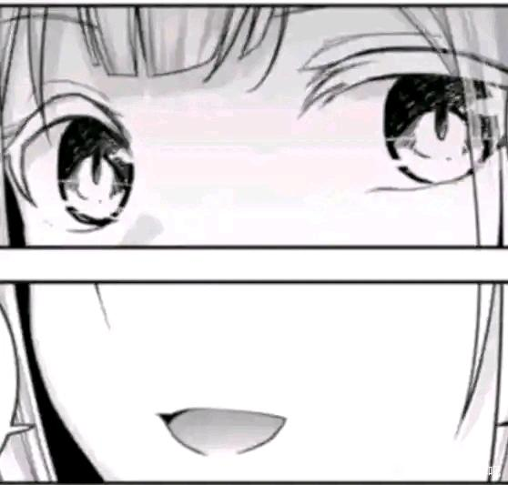

# 1·14 复式高楼碎石案

## 1

（略睦警告，G向，不过会尽量用借代手法来写，ooc致歉）天高云淡，万里晴空，感受着清新而凉爽的风儿，丰川警员站在阴影中向上仰望，很难想象，这栋如此华丽的高楼竟然是住宅楼，这颠覆了她以往对高档住宅区的刻板印象。带着几个人，在住户们异样的眼神中走入大厅，扑面而来的是淡淡的香水味，和丰川警员自家用的似乎是同一牌子的香薰，虽然她家的是抹茶香。自从离开家，离开乐队，当上警员后，她就没闻过这么清新的味道了，熟悉的香气让她想起了一些往事，她不由得眯起了眼，那些她以为自己已经忘掉的回忆，也不由自主的从故纸堆中跳了出来，这股香气好像一道桥，把她的现在和过去短暂的连接在一起了。当然，她最终还是得向未来走去，所以她快步跟上另外几人的脚步，走进了电梯。“如果我没记错，是……顶层吧？”她咽了口口水，一边把帽子扶正一边说道。“是的，复式高层，望海临江，也不知道这种地方能出什么案子，值得这么兴师动众。”“别这么说，群众报案说闻到了腐臭味，肯定是命案跌速哇。”“安保这么严的地方，应该出不来命案吧。”“别乱猜，待会看看就知道了。”随着叮咚一声，电梯门缓缓打开，丰川警员走下电梯，然后马上被电梯间侧的巨大落地窗吸引了注意，这个窗户像画框一样，将整个目光所及的世界收录其中，不加一点改动，无论是熙攘的城市，还是蔚蓝的天空。“无论要办啥案子，来这逛一趟都算值了啊。”“确实很美呢跌速哇。”“没想到丰川警员也会对这里感兴趣。”晴天好心情，但丰川警员却莫名感到未知与恐惧。这一层的香水换了个品种，似乎是植物香。好熟悉的味道，可丰川警员却死活想不起来。“就是这里了。”“好像是呢……没有什么味道啊？”“哦，原来是有的，因为其他住户反应，所以我们在走廊放了更多更好的香薰……不多说了，我马上给诸位警官开门。”物业一边说着，一边打开了门。扑面而来的，是令人恶心、窒息的腐臭味。和被血红色涂满的房间。

## 2

2“哇，这是什么，好恶心……”丰川警员安慰了下快要吐出来的同伴，强忍着恶心，走入了房间，这里的腐臭味格外浓烈，血被喷溅的到处都是，地上也都是拖拽的血迹，虫子在空中乱舞着，划出野蛮而恶心的轨迹，伴随着令人喘不上气的气息。绝对是命案。“这股味道……好像是……从那边传来的。”丰川警员戴上了口罩，连口癖都不带了，“八幡法医，请跟上来，哇，好像踩到了什么东西……”她忍着恶心与晕眩，径直走着到了门前，推开门，她看见了可能，不，绝对是她此生最难忘的一幕。这里是厨房，她看到了台上的锅，锅里的油，和油里的……肉。以及被放在砧板上的一条像烤鸭般被片的已经不止一处露出骨头的腿，很纤细，很漂亮，连脂肪的厚度与肌肉的纹理都漂亮极了，通过它，丰川警员不难推断出它的主人一定是一个很苗条很可爱的少女。“根据残块形态，这应该是先切的肉，再砍的腿。”法医冷静，或者说麻木地说道，像这样的惨状她见过不少，虽然如此残忍的手段并不多见，但她还是充分体现了自己作为先辈的心理素质，真正让她诧异的，反而是另一件事情，“现场竟然……这么干净？”“血都被接在这个盆里了。”丰川警员指着地上的一个血红的盆说道，法医愣了愣，上前几步，拿了副长筷子搅了搅，接着，极其小心的从里面夹出一段细长而弯曲的东西。“这是……肠子。”她皱着眉头说道，“已经熟了，并且你看这两个断口，都是被人咬断的……这边有个清水锅，里面是肝脏和胰脏，胰脏被吃掉了一半。”“不要再说了，不要再说了……”丰川警员揉着太阳穴，有气无力地喃喃自语。而此时，不远处又传来了极其尖锐的爆鸣声。“啊啊啊啊！！”“那边又怎么了？”听到同伴的惨叫声后，两人立刻赶过去，这里是卧室，而她们的同伴已经被几乎吓傻了，毫无力气与手段的退出了房间。而房间里，更是惨不忍睹的景象。已经分不出是肉还是骨头还是骨肉相连的英雄碎片被丢的到处都是，从它们上能看出几种不同的刀法，只能说……恐怖如斯。钟表在一秒一秒的行止，像血滴的声音。“这是……把人当牲口宰啊……”哪怕平静如八幡法医，此时眼中也燃起了无法抑制的愤怒，她平时总是跟诗体呆在一起，但没有人比她更尊重逝者，尊重生命，像这样无限制的侮辱死者，是她最恨最恨最恨的事。血迹和腐臭味一同于这个恐怖的房间中无限制的蔓延，目光所及的整个世界，唯有令人窒息的血红色，还有绝望中的一抹白，和……几缕绿……？“这应该是死者的头发。”法医俯下身，捡起一根与现场格格不入的在灯光下璀璨生辉的绿发，皱起了眉，“跟它连着的，应该是一部分头皮吧。”“被子里……好像有什么东西。”“停，你转过头去，我来掀。”“嗯……”丰川警员自觉转过头，闭上了眼，开始在脑中想象伟大的正义使者蜘蛛女士的形象来使自己平静下来，当上警员一年多，那位能人不止一次帮了她大忙，并且每次都超帅登场超酷离去，她都快迷上她了……不行，得对初华（音？）忠心才行。“怎么样？”“还好，不是我想象中的最坏情况，如果你不怕做噩梦，可以看一眼。”绝望的好奇心推动祥子睁开眼睛，转过了头，当然，即便她立刻后悔了但那副恐怖的样子，还是深深映入了她的脑海之中，像照片般恐怖而清晰的留存一样，每个细节，都记得莫名清楚。虽然是二次元，但直接描述出来肯定会令人反胃，总之是类似抽纸的结构，说来奇怪，哪怕被糟蹋成这样了，也能看出来这具身体原先的主人是一个超级美少女，虽然……稍微平了一点。“转过来吧，我把被子盖上了。”“不、不用，我刚刚发现，这里……还有一扇门……”“慢着，你转过去，我来开——”话还没说完，手腕便控制丰川警员把门给推开了。

## 3

3此生最难忘画面榜top1刷新了！丰川警员的立刻向后退了几步，她的眼睛不由自主的睁地死大，陌生与痛苦其中凝聚，她的嘴巴也张的大大的，不过没什么，毕竟她此刻已经忘记了呼吸。她看到，一个亚麻色的少女，正蜷缩在狭小的房间中，她紧闭着双眼，浑身上下沾满了血迹，连那身一看就不便宜的白色连衣裙都被血染红了。一眼可知，她是素世。她的怀中抱着什么东西，三分之一红，三分之一绿，三分之一白。那是……一个头，似乎已经被开瓢了，像个被弄坏的露出棉花和内层布料的洋娃娃，配上绿色的头发，像个西瓜。她的一部分脸皮被弄了下来，而另一部分上，挂着一只金色的眼睛。“……！”丰川警员两腿一软，向后倒去，法医连忙扶住了她。“睦，是你吗……”她喃喃自语道，稍稍站稳了脚步后，她也不再在意什么保护现场，在冲动的支配下大向前一步，试图把素世怀里抱着的那个东西给提起来，但却突然，感受到了一股极其强大的阻力。“请不要，把小睦把我身边抢走。”素世睁开了毫无高光且已经被血染红的眼睛，一边死死地抱住小睦，或者说曾经被称为小睦的骨头和肉，一边直勾勾地盯着丰川警员，张合着嘴巴，带着那经典但却显得额外瘆人的微笑。“哦，是你呀，saki酱。”“这是……怎么了？”丰川警员一边颤颤巍巍地拿出枪指着素世的脑袋一边连话都说不清楚的说道，“请告诉我，凶手……另有其人，好吗？”“saki酱，应该不会把自己做出来的曲子署上别人的名字吧。”素世轻轻笑了笑，“同理，我不会把处理掉它的功劳，让给别人。”“素世，你……还清醒吗？”和丰川警员相比，素世显得无比从容，好像她是警察，而丰川警员才是那个变态碎石砂人犯。她一边更紧地抱住小睦，一边笑着回答：“清醒着呢。”“……”身处血色噩梦中的丰川警员，突然知道自己为何会对刚才走廊中的香气感到熟悉了。那是睦的味道。当然，现在的血腥味与腐臭味也是。

## 4

4法医病例鉴定意见书。一、基本情况委托人：（略）检验时间：（略）检验地点：（略）检验机关：（略）被鉴定人：若叶睦 性别：女生日：200×年1月14日 鉴定材料：（略）二、基本案情202X年1月14日，若叶睦被诱骗至犯罪嫌疑人长崎素世家中后，被虐待、粉饰并砂害，犯罪嫌疑人对犯罪事实供认不菲。三、鉴定过程（一）唯一性标识（略）（二）检验标准及检验方法（略）（三）仪器设备（略）（四）衣着描述及痕迹检验全身赤裸，躯体呈碎片化，有大量血污。（五）诗表检查1、一般检查体表特征：（原文略，此为丰川警官和谐转述版）整体呈碎开的草莓夹心饼干状，夹心被剖开，饼干渣散落于厨房、卧室，草莓酱满房间都是，饼干渣处理方式、大小有三种种类，分别为大块、小块和带酱块。2、各部位检验内脏检查（略），骨骼检查（略），肢体检查（略），概论：夹心酱缺失，硬榔梆部分在初级拼凑后勉强复原饼干形态，主体部分皮肤完好。（六）诗体解剖检查无必要也无法进行进一步解剖。（七）死因判断初步推测为大量创口导致的流血致死，但也存在被直接后路易十六死亡的可能。四、分析说明（原文略，依然转述版)一起确凿的虐砂粉饰案，无需更多描述，建议死刑立刻执行。签字：八幡海玲时间：202X年×月×日印章

## 5

5以下为犯罪嫌疑人笔录。那天，是1月13号，晚上。因为那一天是周末，我在乐队排练到很晚才回家，在回家的路上，我遇到了刚从酒吧里出来的小睦，哦，应该是“受害人”呢。（注：此处的乐队，应该是嫌疑人在受到严重精神打击后，为心理安慰而所创造出的“幻想乐队”，根据周边地区监控，当天晚上她在路边一边自言自语一边弹了一整晚贝斯，很可惜，由于她说话声音与贝斯声一样小，我们无法从中得知其他重要信息。）她有些不知所措的站在那里，看上去很累，很憔悴，很可怜，但也很可爱，如果我没记错，小睦当时应该也是刚刚结束工作，到酒吧里喝几杯，结果一喝就喝到了半夜，不好回家了，所以在那里犹豫着。然后我就走了过去，邀请她来我家住，她没有其他地方可去，也可以以“去朋友家”为理由解释今晚的事情，所以很愉快的答应了，正好第二天是她的生日，回家的路上，我买了些食物，准备好好料理来庆祝。一路我们都没讲话，直到到了我家，我给她泡上红茶（注：根据药理学检测，该红茶中下了VE65，一种能强化身体素质的兴奋剂）后，我才开始和她说话。“小睦，最近怎么样呢？”“……很好。”“对我就不用撒谎啦，你的状态已经把你出卖了呢。”“……对不起，我，没有其他状态。”“确实呢，咱们都已经是大人了，自然会社畜一些……还记得咱们当时一块组乐队吗？那时真的很青春很激情很热血呢，虽然后来解散了，但记忆是不会消失的。”“……”“小睦你知道吗，我又组了只乐队，吉他主唱是从英国进修回来的音乐鬼才，另外一把吉他是东京第一吉他手兼编作曲领域大神，鼓手是留学高材生，键盘手得过全国金奖呢……小睦为什么这么看着我，……不为我……高兴吗？”“soyo,不要沉溺于幻想了。”“……？”“crychic，死的那天，你切掉了一根手指，并发誓从那之后再不组乐队。”“小睦，你在说什么呀，我怎么会干……这种极端的事情呢？”“我在，履行约定。”（注：据其同学说，约定的内容是“如果以后素世忘掉了自己的誓言，睦有以一切手段提醒并保障其正常履行的责任”）小睦当时突然开始胡言乱语，为了让她清醒起来，我拍了拍她的脑袋，但她不但没清醒过来，反而突然动了一下，把红茶都给弄洒了。“soyo,请不要，继续这样……”她莫名其妙地开始摸着脑袋上不知何时蹭上去的石榴汁，然后开始哭，小睦的哭声很好听，但听久了多少会有些烦，所以我打算给她喝点东西，哄哄她，毕竟人家是客人嘛。我轻轻摸了摸她的额头，然后，从桌子上拿起一杯红茶，想要递给她，但她却一脸惊恐地看着我，同时还不住往后退，好奇怪，虽然我泡的红茶不能说是很好，但也不至于……让小睦嫌弃吧。“小睦，你是不是……生病了？”“有病的，是soyo。”“小睦的话，有些过分呢，我明明是在关心小睦。”“我不需要。”我当时情绪也有一点点激动，所以跟她拌起了嘴，当时说了什么话我忘掉了，我只记得在接近零点的时候，她突然抱着脑袋，带着哭腔喊了一句：“soyo，你疯了，求求你，快醒过来……”“快醒过来吗……”这一段我记得相当清楚，零点报时的声音，正好接着我落下的话音响起。而就在一瞬间，我眼中的世界变了颜色。

## 6

6我看到，小睦的脑袋上有一道不小的疤，正不住往外流着血，染红了她的脸颊，她的头发乱乱的，好像刚被谁揪过，她正无助地拿手捂着头，试图按住流出的血，但鲜血还是不停从指缝中流逝，顺带将她的五指乃至手臂、身体染红，她的手臂，红的更是不一般，不，那是另一道伤口，一道很深的刀伤。“小睦，你怎——”话还没说完，我便看到了我手中的红茶，那好像并不是红茶，而是……血呢，应该是小睦的。好奇怪，但我好像……想起来了。“soyo,你醒了吗？”小睦虽然很痛苦，但好像还是一脸关切地看着我，表情很可爱，但还缺点什么，不过没关系，很快就不缺了。“我应该是醒了吧，并且，前因后果什么的，我已经想起来了呢。”我轻轻笑了笑，然后，朝她走去。我把她邀请到家里，不是偶遇，不是庆生，而是为了……砂掉她，砂死这个得到她不配拥有的幸福的木头人。并且，是略砂哦。“太好——”她的话还没说完，我便一脚踹上前去，诧异不已的她重心不稳，一个踉跄跌倒在地，但她很快便调整姿态试图爬起，但这不过是徒劳，我照着她的脸踩下去，接着，狠狠地碾在了她的脖子上，一套连招行云流水，毕竟为了这一刻，我已经拿人偶排练了三十多次了，幻想还不止。小睦被踩在脚下的样子可爱极了，她碍事的四肢不断抽动着，直到我给她的肚子来了一脚，才渐渐平息，她血红色的面孔被野心勃勃的痛苦，窒息，绝望淹没，但又透出一丝该死的期待与安详，一头绿发散落在红色的血中，好像坠落的天使，又好像，被处刑的恶魔。她很适合被踩在脚下，她就应被踩在脚下——但这，还不够呢。她毁掉了我的过去（c团），毁掉了我的现在（幻想团），毁掉了我的未来（把她搞成这样，留下案底，就业前途大抵是完蛋了）。稍稍回报些，应该……不算不合理吧。“soyo，你……”“闭嘴。”我笑着轻轻回答，接着把她的血，倒在了她的脸上和她的身上。“哦对了，小睦，生日快乐。”“……谢、谢谢。”“闭嘴！好吗？”

## 7

7当时好像是……半点多一点，我给她带上脚镣，再绑好，接着开始思考怎么招待她，说是思考其实不太合适，应该用“回忆”更为合适，很快便想起来了。“说起虐待吉他手，最经典的果然是……”我一边笑着，一边拿出早早准备好的吉他，和一个老虎钳。“来，小睦，来弹吉他吧，这把吉他就是你当初用的那把呢。你想弹free bird还是The wall？”（注：两首歌都有很难的吉他solo）“……the wall……”“the wall不是只弹Another Brick in the Wall,而是弹整轨专哦？我可没闲工夫去印那么多谱子。”“那就，自由鸟。”“行，小睦，拿着，弦距已经帮你调好了，效果器需要我调尽管说哦。”“嗯，谢谢soyo。”“哦对了，还有一件事……”我轻轻牵起小睦已经拿起吉他的右手，接着，拿老虎钳夹断，或者说夹碎了她的食指。“咕哇！”“行啦，只弹尾奏，计时四分十秒，弹错一处，或者慢一秒，断一根手指，弹错是立即执行哦。”“soyo，为什么这样对我……”“因为这样会让我很开心呢，赶紧弹吧，哭，也算时间哦。”小睦呆呆的看了我一眼，然后拿起了吉他，开始演奏起来，不得不说，小睦的吉他果然惊为天人，虽然断掉了一根重要的指头，但她用的是拨片，所以影响不算特别大……应该夹掉她左手的，那样她就按不了和弦了。但天无绝人之路，机会说来就来，不只是疼痛还是恍惚的缘故，她弹错了一个八分音符，然后，很自觉的停下了。我轻轻笑了笑，夹掉了她右手的食指，此后的事情就很顺利了，两根手指断掉后，她演奏的漏洞越来越大，问题越来越多，陷入了绝望而深沉的恶性循环。大厦崩塌如同多比诺骨牌一般，刚刚起始，便已终结，尾奏还未进行到一般，她的手就变成了哆啦（）梦的样式，连吉他都抱不起来了。这样的小睦，也很可爱呢。“对不起，我……弹不了了。”“用牙。”我轻轻地说道，“慢一秒，拔一颗牙。”“……”小睦当时的反应，完全出乎了我的意料，她没有顺从的啃起吉他，也没有愤怒的抡起吉他，而是，把吉他轻轻放在了地上，沉默地闭上了眼睛。“soyo，现在砂了我吧。”“你说……什么？”“……”小睦沉默着，似乎不想重复那句她认为我绝对听清楚的话。话说两位还在听吗？哦，少些形容词？对不起做不到，我想留下一份传奇的案宗，辛苦警官和这位法医小姐了。言归正传。“像这种恩赐，小睦为什么觉得我会赠与你呢？”我扶着脑袋，一边喝着红茶一边轻轻地说道。

## 8

8小睦低下了头，不只为何而沉默，良久她才重新昂起首来，用那一成不变中隐藏着悲伤与恳求的语气说道：“……那无论如何，最终请把我砂掉。”“小睦不说我也会实现的，不过……小睦怎么突然变得……这么主动？”“我这副样子，活下去的必要，没有了。”“哦对了，看来对于小睦来说，吉他，是比你的生命更重要的东西呢。”“嗯。”一个无比邪恶的想法，于我脑中诞生，我站起身来，再次一脚把小睦踢翻，但这次我无暇欣赏她的惊愕与痛苦，毕竟，我还有更需完成的事情。“可是，吉他，一种金属或木头制成的工业品或艺术品，为什么会比生命更重要呢？”我找茬般的说道，同时，拿起了吉他。“不许对生命无礼。”紧接着，我用重重的朝她的左手砸去，吉他碎裂开来，一部分成了碎片，与她血肉模糊的皮肤与肌肉交杂在一起，循环几次后，我把琴颈插到她的嘴里，接着，狠狠朝她那支离破碎的胳臂踩去，一脚、两脚、三脚，再次循环，直到吉他，或者说曾经是吉他的碎片，与她的胳膊，或者说曾经是胳膊的肉彻底融为一体。（注：我们在受害人左臂遗骸中确实找到了些金属残片，嫌疑人竟能徒手砸碎电吉他？！恐怖如斯。）“咕哇！”小睦如同被千刀万剐，事实证明因果律音效是不以她的嘴是否被堵住而转移的。当然，仅凭我的体重和脚力，肯定是不够的，幸好我还准备了其他秘密武器，一把石锤，本来是打算碎小睦的胸口的，但我突然对她的躯体有了新的兴趣，所以这东西，就用在这里吧。“跟你的左胳膊，说再见吧。”重重一锤，我能清晰的听到骨骼断裂的声音，清脆，干练，好像钟表的行止，又好像水滴的跳跃，此刻被石头砸到的骨头和落在石头上的水滴有一个共同点，那就是都粉碎了，它们都不再是原来的形状。像卷毛巾般，我将由于骨头碎掉而变得相对较软的手臂卷起（由于骨头并没有碎成骨渣而仅碎为骨块，卷起来时那种软中带硬的感觉很让我舒服，这里是备注），然后踩住她的肚子，拿解腕尖刀在关节处划一下，接着重重一拉，像撕卷纸一样，她的这条手臂就脱落掉了。而小睦，也疼晕了过去，正好我也有些累了，休息一会吧……请问有水吗？最好要红茶，谢谢。

## 9

9如果我没记错的话，小睦第一次醒过来的时候，我正在做饭，毕竟折腾了很久，体力消耗比较快，我和小睦都累了，想要挺到最后必须适当补充能量才行，幸好在路上买了些蔬菜呢，否则只有肉，多少有些不健康。“soyo，我好像，做了个噩梦。”“哦，小睦，你醒啦，别害怕，这不是梦。”我一边把青菜装盘一边转过头来，笑着对她说道，她被我绑在了厨房的凳子上，额头上的伤口已经基本愈合了，但她手上的伤口依然在流着血，坏了，做完消毒后好像没有包扎呢，这下不能撕绷带了。“无论如何，先吃饭吧，这是油煎青菜，你先填填肚子，我去把炖肉收个尾。”我把青菜摆在睦面前的桌子上，抽去盘子下的木板，朝她笑了笑，接着便打算继续去忙，可她却没有丝毫想要开动的意思，反而不解而由于地盯着我，同时问道：“可是，soyo，我拿不起筷子。”“你可以拿嘴刨着吃，想狗狗一样。”我做出一个鼓励的微笑，接着停了下来，欣赏她接下来的行动。迟疑了一会，下定决心的小睦开始按我说的进行操作，那副不甘、犹豫而又无奈的样子可爱极了，但又混入了一点点涩气，连头发落到了菜中，她都无法顾及，只能把自己的青丝与青菜一起衔起，前提是，她能咬的住青菜的话。“咕哇！”嘴巴刚刚接触到盘子的那一瞬间，她就如同触了电一般猛烈的向后仰去，以至于不慎让椅子向后倒了过去，甚至还踢动了她面前的那张小桌子，让盘子做了个斜上抛运动，最终稳稳落在了她的胸口上。“好疼、好烫……啊啊啊啊啊啊啊啊啊！”我快步走上前去，拿着筷子，用力按在了那个盘子上，不错，这个盘子是个石盘，里面的油自然也是滚烫的，但由于我不想给小睦毁容所以没烧到最高温度，不过既然它扣到了胸口上，那当时的顾虑就没有必要了。所以，让她尽管痛苦地挣扎吧，让冷汗与热泪爬满她的脸，痛苦与仇恨凝聚她的心，这才是她最涩琪的时候。我先去把炖肉弄一下，我做的炖肉，味道还是不错的呢。揭开锅盖，转大火。小睦好像在翻来覆去，试图把石盘子弄下身去。加入调料，提味，搅拌搅拌。小睦好像成功了，可恶，应该一直守在她身旁的。最后，加入葱花与柠檬汁，提鲜，去腥。小睦突然被动静了，安静点好呢。关火，出锅。弄得相当好，没有白费我这三四个小时的努力呢。“来，小睦，开饭了，我扶你起来，咱们一块吃吧。”我端着炖肉，对一动不动的小睦说道。“soyo……”“嗯？”“我的……左腿呢？”她呆呆的看着那儿的空间，她那双细长、灵活、美丽的腿曾经在那里。“哦，你的左腿啊。”我稍微晃了晃手中的瓷锅。“在这里哦。”一锅鲜美、香艳、唯一美中不足的是过于有嚼劲的肉，现在在这里。

## 10

10“怎么了小睦，为什么不吃，是因为没吃过自己的肉吗？”我把她扶起来，帮她打理好乱七八糟的脏兮兮的头发，接着指了指给她盛的那碗炖肉，“虽然小睦你的味道确实不太好，但也没有难吃到无法接受的程度哦，你应该偶尔尝试下新新鲜事物。”“soyo，为什么要这么对我。”“我已经说过了。”“……soyo，满脑子都是自己。”“我承认，不过既然小睦一直没有反抗，那我就默认你接受我的行为咯。”我笑了笑，说出了连自己都觉得可笑的话，如果不喜欢就要反抗、就能反抗，那我们也不会成为现在这样呢，至少c团，不会那么可笑的解散。（突然感觉一阵寒意跌速哇……）小睦依旧沉默着，我突然有些期待她爆发一下，不求突然挣脱束缚向我扑来，至少……骂几句，那样才像个人类，我操作起来才会有罪恶感。但作为人偶的她不会这么做，听说小睦是患有抒情障碍的焦虑型依恋人格，表达情感她做不到，泯灭情感她成不了，这对矛盾把这孩子的命运定好了：她只能于沉默中灭亡。“对于小睦来说，以现在这副样子或者，是极其煎熬的事情吧？”小睦愣了愣，然后点了点头。“俗话说的好，长痛不如短痛，与其像这样活到最后，还不如让我砂掉你比较好呢。”“我可以逃出去，然后自砂……”“做到的就试试看啊，小睦。”我很巧妙的玩了个梗，小睦似乎get到了，愣了几秒后顺利地接了下来：“我做不到，soyo，没有那么脆弱。”“这样才对嘛。”我收起了严肃的脸，再次换上了笑容，“事已至此，先吃饭吧，小睦，啊——”“……”“味道怎么样呢？”“好吃，不咸不淡，味道也很鲜美，但……太硬了。”“谁叫小睦练芭蕾练的那么好呢？肌肉是用进废退的，再来一口，啊——等等，这好像是……我的勺子……”“……谢谢soyo。”“……小睦，我给你个建议，少说话，多微笑，这种人机一些的话，可能会有点恶心哦。”“（嘴角上扬一个像素点的微笑）。”“……行吧。”我和她开始她一口我一口的品鉴了起来，喂她吃肉简单，喂她喝汤有些不太容易，刚开始试着拿碗，在把小睦呛到后她喷了我一身，无可奈何的我只好把她下面的牙拔掉了三颗，然后从缺口拿勺子给她喂……我当时怎么没想起来用吸管呢？吃饱喝足后，中场休息结束了。“小睦，你刚刚抱怨我为什么趁你昏迷偷偷砍掉了你的腿，对吗？”“（嘴角上扬一个像素点的微笑。）”“你现在醒了，趁你醒的时候把另一只腿处理掉，怎么样？”“（嘴角调整零个像素点的微笑。）”“并且，由你自己动手怎么样？小睦资参什么的，一直都是……很能让我那什么的点呢……”这一段能不记下来吗？我的形象……还是稍微正常的好。（注：当然不能。）“（嘴角下调两个像素点的微笑。）”“啊，我还是喜欢你之前桀骜不驯的样子……”“可以。”“是吗？那真是太好了呢。”“还有，soyo的xp真怪。”（还真是，幸好我身边那位很正常。）真的吗？

## 11

写了两个纯良章节（大嘘），马上就能回归正轨了。还有soyo写的好ooc啊，全都是素世哪怕疯了也不可能说出来的话（悲）

## 12

11我给小睦打了一点药，毕竟人类是无法在忍受这种疼痛的同时对自己动手的，不给她上麻药，她可能最多割三刀就下不去手了吧。“拿着，就是这把刀，先改改花刀，然后从这里进，这样，这样，然后从这里出来，就能把腓骨整节挖出了，之后怎么做我再指导你，请吧小睦，累了、渴了，随时跟我说哦。”我说完，就坐在了一旁的凳子上，端起一杯红茶开始欣赏鱼肉自我切割的大戏，只用手掌，果然无法很好的操控刀子，现在的小睦看起来笨拙极了，像刚学会写字的孩子一样在自己的腿上歪歪扭扭地刻着。她很认真，但我想看的不是这个口牙。“小睦，连这种事情都做不好吗？”我开始给她上压力。“吉他弹不好了，连资参都做不到了吗？”“……”“别愣着，请继续吧。”“可是，我做不好。”“那你……”话音未落，小睦却突然举起了刀子，我还未反应过来之际，她便朝着自己的脖子刺去。“不要——！”可是，已经晚了。刀，切切实实地刺在了她的脖子上。但却什么也没有发生，别说路易十六，她连伤口都没留下，这似乎让她很吃惊，刀于恍惚间掉在了地上，她忽地开始抽动，开始蜷缩成一团，颤颤发抖，似乎是在害怕什么东西，应该不是在害怕我……吧，我哪会比魔鬼还令人害怕呢？（嫌疑人你讲就行了，没必要微笑，很……恐怖。）哦好的，当时小睦的表情跟你有些像呢。“小睦，你竟然没注意到吗？这把刀，本来就是生了锈的钝刀子，我本来也没想着让你自己动手，只是想看你改改花刀啦。”我走上前去，轻轻摸着睦的脑袋，但她的身子却颤抖地更剧烈了。我看着她这副样子，无奈地叹了口气。“看来，还是得我自己来。”“……soyo，对不起。”“不过如果是我来，那就没必要用麻药了，有点难办呢，幸好，我从一开始就没用。”我抚摸着她那win-win的腿，笑着对她说道，我可是很熟悉小睦的，她能干什么，想干什么，会干什么，我知道的还算清楚，“刚刚给你打的，是痛觉增强剂哦。”“不要，不要……”小睦突然猛地开始挣扎，吓了我一条，当然，她的挣扎如同到了岸上的鱼，只不过是想在注定的死亡到来之前让自己有点存在感的可怜行径，当时小睦叫的真的很可怜呢，搞得跟我要干坏事一样。“求求你，给我个……痛快吧。”她抬起头来，眼泪汪汪地看着我，含着泪水与群星的眼睛闪动着，好像把全世界的悲伤与痛苦都涵盖在里头了，她的嘴微微张着，刚刚被拔掉牙的地方还在流着血，在嘴角与泪水会和，我从未见过小睦露出如此生动的表情，都有些ooc了呢（笑）。我当然没有回答她，而是用实践来解释。精神的攻击无法替代攻击的精神，物质上的事情，不用物质力量是解决不了的呢。“这种时候，应该放点歌吧，电影里面不都是这么演的吗？”我一边擦拭着刀一边戴上一只耳机，接着，把另一只递给小睦，顺带一提，我的另一只耳朵带上了耳塞，“想听什么歌？”“……红王一专。”“前摇小子收收味，听黑安吧。”我放了首Lron Man，接着将那把更细长、更锋利的刀，插入了她的膝关节中。“我要把这条腿，一块骨、一块骨的拆开，怎么样，小睦？”已经成为痛苦之王的小睦当然没有回答，不过没关系，有些答案注定的问题，不需要答话。

## 13

12刺入她的膝关节，只是令她无法踢腿妨碍我，真正的[节目]是从趾骨开始的，小睦的腿和脚都很好看，不过把它们碎成快快，平铺在一张白布上，应该会更美吧。（……“歌云？”）首先是趾骨，大趾两节，其余四趾三节，一只脚合起来是14节，但我当然不是临床医生，这些肤浅的资料也是昨天现查现记的，为了执行，我得把小睦脚上的皮肤先给切下来才行。但精巧地切下脚趾上的皮肤所需要的技术，似乎并不比直接分割骨头少多少，在仅让小睦多叫了几声后，我最终还是选择摸着关节拆睦，脚趾上的关节虽然平时很难感觉到，但也是相当重要的，像bass一样呢。（我同意。）很快，在美妙的音乐与小睦哀鸣的双重伴奏下，我成功在保存皮肤与肌肉组织的前提下完成了十四块趾骨的分离，接下来，只需要将这次的经验活用于下一次，便可以很轻松的完成任务了吧。我当时是这么想的呢。只可惜，当我试图通过寻找小睦脚底板的骨骼连接处时，才发现这一块的bass没插电。（并非如此，部分连接处还是很明显的，我们专业人士能很轻松的辨别，虽然对普通人来说跟没有一样……）（哈哈，绝佳的bass笑话跌速哇……对不起。）但这里的皮肤好分割。割开皮肤，划开肌肉，跖骨和跗骨的一部分呈现在了我的眼前，我开始对应医学参考图片来进行辨认与切割，这一块过程很繁琐，我的手脚也相当笨，我只记得一开始血流的很快，但往后，她脚上的血都流干净了，只剩失去了血色的肉、皮与骨，而这三样也在缓慢而持续地从她身上离开，说来可笑，仅仅十多块骨头，我花了整整一个多小时才连汤带水勉强切割干净，请法医小姐不要笑话我。（没关系，我们法医不会做活人生意，哪怕解剖尸体也是没这么详细的。）我当时最庆幸的事情，便是提前把她的另一只脚以正常方式切掉了，否则如此繁琐的工作重复两次，哪怕想一想都令人无比汗颜呢。喝一口红茶，观察一下小睦，她的汗与泪都几乎要流尽了，我尽管只是摸摸她的后背，都能抹上一手汗水。她的嗓子已经喊哑了，只能发出奇怪的声音，所以我没去管她，等到她向我要水喝的时候再跟她说话吧。小腿的骨头相对大一些，我得换把更快、更硬、更强的刀才行，这样效率才会更高。顺便换了首歌，折磨小睦折磨了这么久，我也想着给她听听她喜欢的歌，由于药的原因，她的精神是无比清醒的，所以切歌她应该能听到，她肯定会很感动呢。……“为什么要听103遍春日影？！！”

## 14

13没时间休息了，再这么下去，等不到我完成整套流程，小睦就要流血流死了，我打开手机，照着人体腿部的骨骼结构图，开始小心翼翼的继续切割。小睦的叫喊声已经基本停息，取而代之的，是窒息而绝望的抽泣，可惜我没时间去欣赏她此时的表情，呵，想必……那一定是相当美好的光景。胫骨和腓骨分别位于小腿的内测和外侧，作为直接支撑体重的骨头，它们自然紧密而坚硬。（错了，腓骨并不直接参与乘重。）啊，抱歉……我也记不太清了，我只记得我当时全神贯注地让刀在小睦的腿上顺着其筋脉骨骼与肌肉纤维束游走，以她的鲜血将银白锻造为红，由于当时不再厨房，没有能用来接血的盆子，地板被弄得好脏，我不想脏了自己的鞋子和衣服，所以就直接坐在了小睦身上，她真的很瘦，感觉凌迟都砍不够三百刀……糟糕，刚才剐她另外一条腿的时候她好像处于昏迷状态呢，损失大了……（注：凌迟标准到底是三千刀、一千刀、三百刀还是十八刀咱也不知道，此处取三百刀的标准。）“soyo，好重……啊啊！”“是你太轻了。”我皱了皱眉，轻描淡写地回答道，哪怕我如此提防，血依旧沾到了衣服上……都是小睦的错，她不仅瘦，身子还单薄，如果有下次先稍微养一养再宰吧。用力一扯，伴随着夹杂着泪水的撕心裂肺的嚎叫，腓骨连带着一大块肉被我成功取了下，接下来就是你了呢，胫骨小姐~先倒上些红茶作为润滑吧，一，二，三，挑，筋成功被挑断了，然后，我把膝关节给撬开，胫骨便自动脱落了下来。（……错误太多，不想多说。）（能理解你跌速哇。）大腿部分就好处理的多，毕竟是一根大骨头，先把膝盖骨给掰下来，然后拿小刀把她大腿根部的肉割下来一部分，然后我拿起剁骨刀，朝着股骨的上端剁去，我当然不会那么好心的从关节处动手，这种心理……类似掰巧克力吧，不按格子掰出来的，总会比一丝不苟掰出来的块要好看不是吗？（巧克力……是要掰的吗？）（……吃不胖的人请不要说这种坏心眼的话跌速哇。）但巧克力绝不是个很好的比喻，木头显然更好，那骨头真的特别特别硬，三五刀下来，感觉发疼的反而是我自己的手，真是上好的木材，可惜我没有斧子，不能轻易令其折断。幸好，我有电锯，虽然是很小的那种手持款式。像这种时候，不放点碾死核，怎么行呢？“小睦，我要锯下来咯。”“不要，不要，不要不要不要咕哇啊啊啊啊啊啊！”音乐声、电锯声、尖叫声，于此刻完成了近乎完美的三位一体，只可惜我没有录像，不能让你们欣赏当时的天籁之音，真的是相当正宗高级的碾死核呢，发出去没准能得奖。锯到一半，我却突然停了下来，欣赏小睦大汗淋漓的躯体和扭曲痛苦的面容，她正大口大口喘着气，胸口快速而不均匀的上下浮动着……哪怕这种时候，小睦还是显得有些平呢。当然这不是重点啦。

## 15

14“疼，大腿疼……”她正口齿不清地说着话，一副虚脱的样子，可爱极了。“腿在地上呢，很快就不疼了。”我一边帮她擦去脸上和身上的汗水一边笑着说道，电锯被暂时的放在了一边。但就此结束了吗？当然没有。我怎能让那令人陶醉的美妙的声音轻易停息呢？掉转锯头，竖着切！电锯伴随着轰鸣缓慢地推进着，如同命运与灾厄般无法动摇地行走在既定的轨迹上，伴随着溅出的鲜血，将她那纤细的大腿一分为二，大腿的横截面美极了，无论是骨骼、肌肉还是脂肪都很美，形体得当，色彩分明，好像一副现代艺术的图画——可能是野兽派或者立体派？毕竟这是小睦的腿嘛，不美是没道理的事情呢。我本来想改个十字刀的，但这样做不但技术难度高还有可能伤到自己，所以最终放弃了，这是我最后的良心了，收下吧小睦。（……恕我直言，像你这种人渣，不配玩那么高尚的梗。）……是的，我是人渣，毫无疑问。可能另外一个世界线的我真的组了第二支乐队，真的能和其他迷路的孩子们一起于迷茫中向前进，能有正常的生活，正常的关系，正常的欢笑，正常的感情。但现在啊不当时的我，已经无药可救，无法回头了。最后砍下一刀，将她的腿，彻底与身子分离。接下来，终于到了事前最期待的倒数第二步。

## 16

15“小睦，你在此地不要走动，我去厨房收拾一下，哦，你好像已经走不了呢。”说着，我把小睦大腿的其中一半放好，另一半丢到她身上，她看了看我，但什么也没说，她的眼神也呆呆的，连恐惧之类的东西也没有了，除了似乎还在呼吸，她这副样子跟私人没什么两样，不对，还惨些，毕竟现在她的四肢，只剩一只手了。不如说，幸好还剩一只手啊。简单的收拾了一下我就回来了，接着拉着她剩下的那只手，把她拖到了厨房，全程她一点反应也没有，即不反抗，也不说话，一副燃尽了的样子，连一根手指都懒得动弹。“小睦怎么不说话？没关系，待会你肯定会说的。”我把小睦立在墙边，然后用一只手把她的手带着身子给提了起来，把她放在了高凳子上，这很简单，提这么个东西，不比提把bass要重多少呢。“稍等，小睦不要乱动哦，否则待会再把你提起来，很麻烦的。”小睦一言不发。我也不在意，而是转过头，到隔壁的工具间拿来了一根长铁钉，和那把石锤。“小睦，自己把手抬起来，抬到最高，手背贴墙上，麻烦了~”小睦真的自己动了，像只被驯化完成的宠物，又像个忠诚呆板的机器人，这不是我想要的，让小睦以这样无聊的姿态死去，一点意思都没有。但暂时利用下她现在的状态，享受一下她现在这被玩坏的表情也不错呢。“来，用手掌夹住这根钉子，夹紧一点哦，我不想让小睦受更多的哭。”此为真话……可能算一半吧。她愣了愣，死掉的眼睛突然亮了一下，在犹豫了几秒之后，还是照我说的去做了。“嗯，好孩子，坚持几秒，要来了。”我拿起锤子，重重地朝钉子砸去。“咕哇！”终于，小睦再次发出的有音节的声音，很好，很好，再来！“咕哇！”两锤下去，钉子便穿透小睦的手掌，死死地钉入墙中，将她牢牢地钉在了墙上，像被钉上十字架一样，只不过如果她的遗体能成为圣人遗体，那大总统的活可未免太难办了呢。确认钉牢后，我一脚把凳子踹开，小睦像块腊肉一般被挂在了墙上。“结、结束了吗……”在喘息基本平息后，她有气无力地问道。“嗯，结束了，你会像这样流血流到死——”“太、太好了，谢谢，soyo……”小睦愣了愣，近几年来第一次在我面前露出笑颜，小睦笑起来真的很可爱，尤其与满脸的血污搭配起来更是打出了神奇的反应，我不由得看的有些迷了。但还是小睦痛苦的样子，更让我入迷呢。“才怪。”“……请便吧。”她低下了头。“希望下辈子的我，下辈子的soyo，能成为正常的人。”“嗯，谢谢小睦。”我帮她捋好头发，接着，提起了剪刀。

## 17

16警官小姐，接下来，方便能回避一下吗？接下来的内容，多少会令人不适呢，我甚至无法保证法医小姐听了会不会犯恶心……（没关系，我已经……看过现场了跌速哇，应该能承受。）请不要高估自己的承受能力哦。当然，也请法医小姐忍一下我接下来极其不专业的表述和可笑的错误。（……）咔嚓，咔嚓，我小心翼翼的剪开小睦的肚子，把她的畅子扯出来，然后投入旁边的锅里。那个锅已经沸腾，至于锅里是什么？当然是，之前收集的小睦的血啊。“啊啊啊啊啊——”小睦再次叫了起来，毕竟对外伤的容忍能力提高了，不代表内伤也一样——话说回来把内脏扯到外面受的伤，应该算内伤还是外伤呢？无论如何，她的意志正在经历磨难，毕竟平时一直被藏在肚子里的东西现在被扯了出来，还在仍与自己的身体相连的情况下忍受着百度高温，已经，不能用痛不欲生来形容了。“啊啊啊——”锅中的畅子，正在如被打中的蛇般痛苦的蠕动着，逐着沸腾掀起的水波，它的主人，似乎也有扭动的意思，只可惜……她现在已经完全失去了进行这一行为的能力。“诶呀，忘切开了呢。”我慢慢把她那抽动的畅子从锅中捞出，然后选了一块好的位置，拿刀划开，将内外化为了正反，接着再投了回去。“咕哇——”“不熟，吃了可是会闹肚子的呢。”“soyo，求求你，砂了我，不要这样，求求你，给我痛快，拜托你了……”“什么？给你痛苦？这种事，不用说我也会做到哦。”“……soyo，我……恨你。”“……”“我，和你在一起的回忆……开心的……一次都没有。”“宁愿说假话，也想激怒我砂私你？”“……但我，真的恨你。”“我也恨你哦，小睦。”“……”“……”沉默再次降临，我们相对无言，唯有水沸腾的声音，血滴落的声音，表走动的声音，和我们的呼吸与心跳证明着时间的流逝，世界的真实。三分钟过后，我把火关掉了。“来，小睦，尝尝血肠，可能会有些淡。”“……”虽然沉默，但她还是吃掉了还连着自己身体的肠子。“不淡……”“因为，你在哭呢。”（……TM是什么支撑我听到现在的？无需继续了，像你这种人渣中的人渣，除了死刑立刻执行外，没有任何可能的下场。）（等等，让她……说完吧……）

## 18

17其实，没什么好说的了。后来，我又煮了她的肝脏、胰脏，烤了她的肝脏，然后切开了她的胃，最终把她剩下那条手臂也给砍掉了。咣当一声，她掉在了地上。抱着棍睦，我回到了我的房间。“这回，是真的结束了。”我把她放在床上。“还有什么想说的吗？我会帮你……记住的。”“soyo，我不会原谅你，我希望，你能得到法律制裁。”“我知道哦。”“……”“还有吗？”“但，与你相遇，我不后悔，我知道，现在的你疯了，痴了，成了十足的人渣、变态、罪犯，但之前那个温柔的你，不是假的，那些温暖，存在着，在我的心中，在我的回忆。”（注：受害人说完这一串用了五分多钟。）“我知道哦。”“我，可怜你，可怜你被扭曲成了这样。”“……”“希望下辈子，能与正常的你，再次相遇。”“……我也一样。”“撒由那拉。”“加纳。”最后，我朝她笑了笑，砍下了她的头。再往后，就是被你们发现的时的样子了。我愿意承担一切责任，我愿意接受法律制裁。还有什么要交代的吗？我好困，让我先睡一会，可以吗？（这受害人也是个人物……抖M？还是被虐待的精神出问题了死前跟施暴者表白。）（……不要这么说跌速哇……嫌疑人，你说什么？）没什么，请……给我口水喝吧。（完）

## 19

后日谈“我市警方通报，近日轰动全国的[1·14 重大室内杀人案]于今日结案，犯罪嫌疑人长崎某某已归案，并对犯罪事实供认不菲，目前，案件正在进一步审理之中。”“此案性质极其恶劣，手段极其残忍，我市将在加强常规警备的同时，开展青少年心理健康教育，防止此等恶劣事件再次发生跌……咳咳。”主办此案的丰川警官如是说道。“我没什么好说的，杀了人，就应该偿命，犯了罪，就应该受到法律制裁，这是在动手的那一刻就已做好的觉悟。”犯罪嫌疑人长崎女士如是说。“但我不会忏悔。”这一句被剪掉了。“我市警方通报，[1·14重大室内杀人案]于今日判决，犯人长崎素世以故意杀人罪、故意伤害罪、侮辱尸体罪、限制他人自由罪等九项罪名，数罪并罚，被判处死刑立刻执行。”两条新闻，一条一分钟，一条三十秒，为这个扭曲的案子画上了句号，被吸引的目光、被聚集的人群，也在谴责与震惊过后散去。随后，世间如常。

