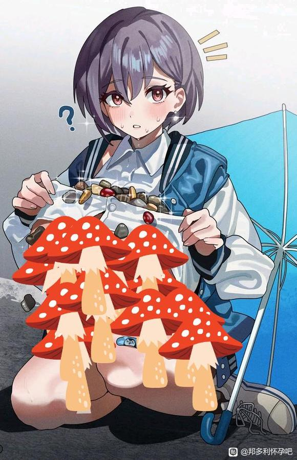

# 凑企鹅在路边捡石子，惨遭Soyo80【邦多利怀孕吧】_百度贴吧

## 1

Soyo遇到了在路边捡石子的凑企鹅。感受到旁边有人停下，企鹅警惕的抬起头，用衣服包裹起来刚收集到的珍贵漂亮的石头们。“呀～小灯，你在干什么呢？”Soyo漏出了温柔的笑容，随后慢步走来。“咕…咕咕嘎嘎！”誰知这凑企鹅见Soyo走来，紧张的对着Soyo大声叫唤。随后一边后退，一边搂紧了衣物所包裹着的石头们，用脸蛋紧贴着它们，不让它们掉出去，哪怕一个。将凑企鹅逼至路边的小巷深处后，Soyo四处观望了一下，便立马变脸。表情冷漠的对着凑企鹅，但依然夹着道：“小灯抱着这么多石头，是要去找小爱音求婚吗？”“小爱音不喜欢你哦。”“不要让小爱音和素世姐姐烦心了好嘛？”凑企鹅不语，只是逐渐浑身发抖，咕叽咕叽的害怕了起来。她感觉这里好冷啊。“咕咕…嘎嘎……”Soyo显得不耐烦了起来，心中却构思不停着“要踢凑企鹅一脚，把石头抢走吗？”Soyo摇了摇头，随即聊有兴致的看着凑企鹅轻轻踢了一脚。凑企鹅依然埋头保护着石头。于是Soyo不慌不忙的走到凑企鹅身后，趁她在保护石头时，俯身一把将凑企鹅推到在地。“咕咕！”正面摔到地上，石头把凑企鹅硌得生疼，咕咕的哭了起来。但她依然保护着自己的石头，所以Soyo在她没有双手来保护自己的情况下，在后面狠狠的踹，狠狠的蹂躏她… …

## 2

啊，不会写后续啦…… 但可以不带逻辑的脑补一下：“Anon酱……小宝宝们…没有受伤哦” 空荡的家中，企鹅细心的呵护着被褥围成的窝中，那里面躺着的好多好多五颜六色的小石子。“保护住了…今天他们也在茁壮成长哦(◦˙▽˙◦)” 那柔软的脸蛋上，布满淤青和创可贴。但双眸却流漏着温柔的，如母爱般的目光。高松灯还爱着爱音，以至于和她的所有美好回忆都深深的记住了。那些石头，似乎也不只是作为“婚房”的建筑材料而存在了。… … 「是夜，复式高层，Soyo家。┙“哈…哈啊”“呼”“呼” 此起彼伏的娇喘声，来自于大床上躺在一起的两位少女。“Anon酱～”Soyo侧过身来，看着爱音那柔顺的粉色头发，心中多么温暖，舒服啊。于是搂上了她的腰，她的腿，她的胸旁… … “Soyorin，你今天怎么这么有精力啊…”爱音漏出了无奈却又不丢掉俏皮的笑容：“呐呐～Soyorin，手指都已经泡泛啦！”“因为今天格外的，爱着，Anon酱哦～” Soyo继续的抱着Anon缠绵了许久，但Anon似乎不再提起兴趣，只是敷衍着配合，时不时向外窗外发呆。 “唉……” Soyo逐渐停了下来。 “Anon酱， 不要再想小灯的事情了！”

