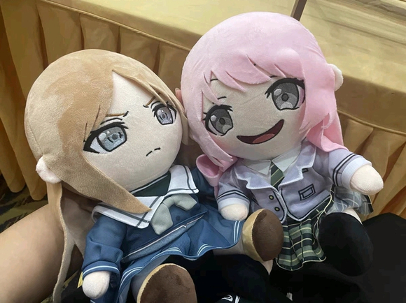
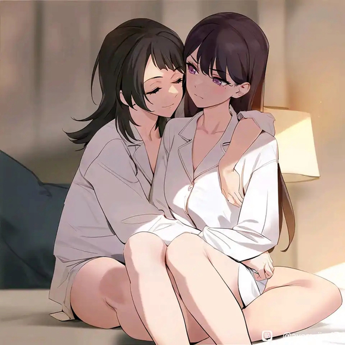
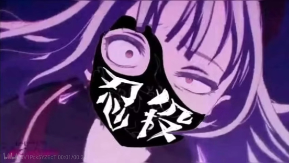
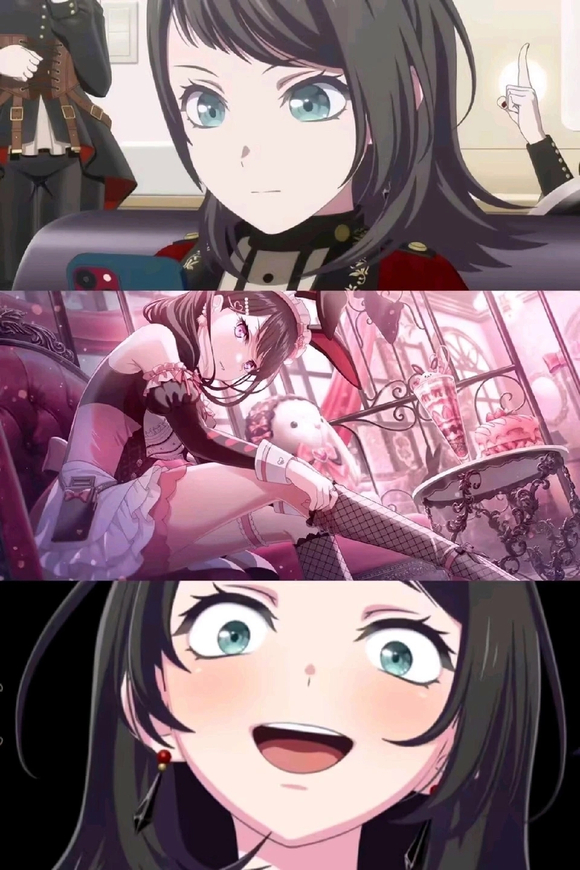
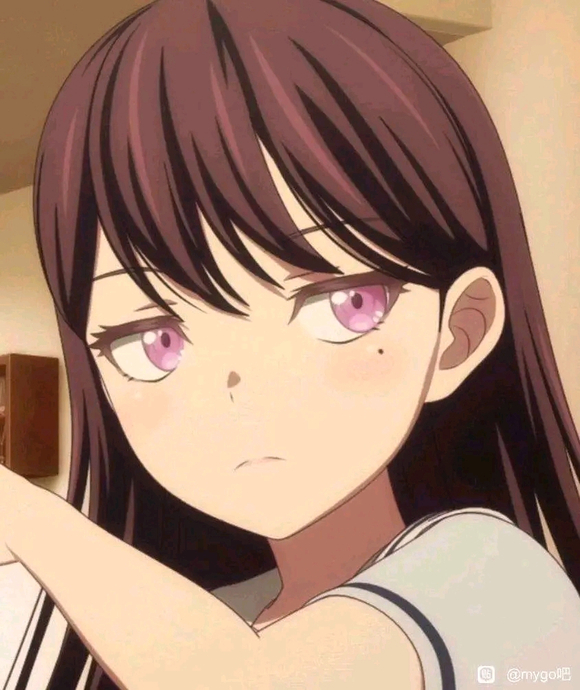
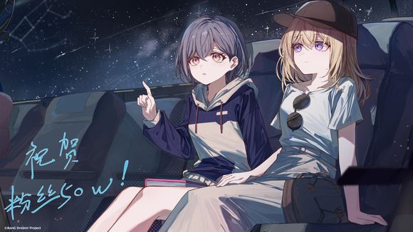
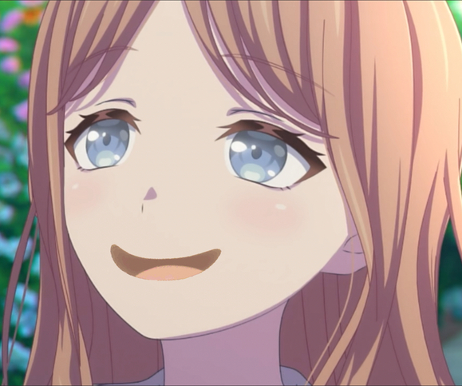
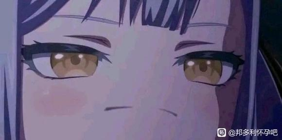
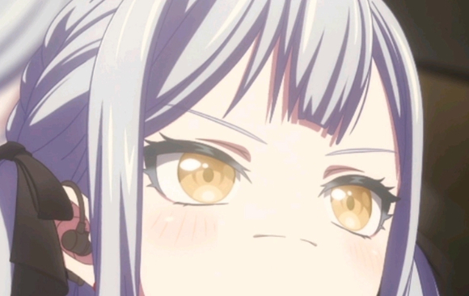
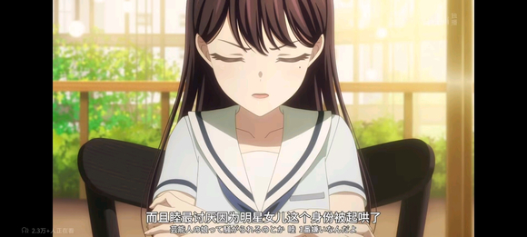

# 千早爱音不会玩崩好感度APP

## 1

当爱音获得能随意调整任何人好感度的APP，拥有神一样的能力她会怎么做？把世界变成“大家都喜欢我”还是“没有爱音的话，瓦塔西！”都可以哦，决定权在跳过使用说明的爱音手上。“大家对我的好感度都拉满也没关系吧？毕竟我们要组一辈子乐队嘛。”只是爱音没想到，重女们的好感度过高会导致意想不到的事。正常向，ooc

## 2

1　　“下载榜第二的App，发行商是机器猫科技？”　　“是我想象中有四次元口袋蓝白胖子吗，哼哼哼哼……”爱音哼着mujica新歌点详情页面，赫然写着输入名字能查看与调整别人对你的好感度。　　“能调整好感度？”爱音瞪大眼睛，“感觉像游戏里的作弊码……不对，这种官方应用，应该没问题吧。”　　爱音安慰自己下载安装，迅速下滑跳过用户须知和教程，输入了自己的名字“千早爱音”注册账号。　　“不要泄露私人信息，Soyorin在边上的话肯定会这样说吧。”　　屏幕一闪，熟悉的头像弹了出来。是可爱的卡通形象，界面切换成了一串数字与条形图。　　“哇，真的耶！大家的头像都好可爱。”爱音的目光停在素世的名字上：“Soyorin对我的好感度：140，好厉害，我居然这么高？”　　爱音眨了眨灰色的眼睛，注意到右下角的滑块，是最感兴趣的内容　　“手动调整的话……”　　“把soyorin对我的好感度再提高些，嘿嘿。”爱音玩心大增，抱着试一试的心态无视警告弹窗的内容。手指轻拖滑块，将素世对自己的好感度调高。

## 3

2　　数字从140增加150停下，这似乎是上限。　　“嗯？”　　“150是满级？”爱音捂住嘴偷笑，“原来Soyorin对我超级喜欢，嘿嘿，Soyorin love！”　　“明天去见，不，现在就去找soyorin玩。”　　爱音没有归位素世的好感度便换鞋走人，想看看满好感的素世是什么样子。走在路上仍看着素世的页面浏览数据。　　“Soyorin对大家的好感度都在130以上，诶，也就是说她对我的好感度是最高的？”　　“哼哼，看看大家对我的好感度。”果然，大家都喜欢自己，爱音内心世界小唐人开始鬼人乱舞。　　爱音笑容愈发嚣张，已经到了粉毛大狗唐笑惹人嫌的程度，比如这位中途上站的蓝色小章鱼，瞥见车厢开心的粉毛大狗无声到角落位置坐下。　　“哇，我在Rikki心里这么重要。这是她的姐姐吗，真是个大美人，嘿嘿。”　　爱音不由捂嘴偷，看到那些数字，她的心情像假期穿上新衣逛街般放松：“我也应该更努力回应大家才对。”　　爱音乐呵呵点开自己页面：“哦，Tomorin酱是120，Soyorin119，最高吗……”　　“唔，怎么会。”

## 4

3　　心脏转瞬即逝闪过一丝不安，爱音登上电车始起的嘴角下拉，事实让人难以接受。　　“我对大家的不够喜欢吗，还是app出了问题。”　　爱音把手机放到膝盖上视线很自然飘向窗外，电车闯外甜甜圈形状的世界之主号正在广场停靠。　　为什么自己的数字最低？爱音回忆乐队大家一起努力的日子，为了新曲而熬到深夜，自己确实也有在意大家的吧？可是，是不是还不够？　　“把大家的好感度都拉满，也没关系吧？毕竟我们是一辈子的伙伴嘛……”爱音还没想好，“到站了啊，先去找soyorin玩吧。”把烦恼抛之脑后迈着欢快的脚步离开车厢。　　祥子视线挪向打开的电车门，庞大到令人窒息世界之主号飞船完成对接，冷灰色的粗鲁线条与不对称马蹄形状的仿佛不属于这个时代人类能造出的产物。　　等爱音离开她才站起。祥子没想躲着爱音，只是摘掉面具后去避免不必要的麻烦。　　还是个初中生的祥子因疲劳在椅子上睡着坐过站的教训犹在眼前。　　池袋荒野插进云端的生铁色高楼外墙是毫无安全可言的生锈楼梯，宛若肋骨与机械的集合体墙壁令人战栗而敬畏，当夜求睦来救她的窘况犹在眼前。　　“睦，我快到了。”

## 5

4　　满好感度素世会怎么样招待自己？拿出很多零食，同意给演出服贴上Ano Tokyo的图标，还是摸摸头和膝枕，爱音等不急想要知道。　　“Soyorin我来找你玩。”　　“欢迎。”　　“看上去和平时没什么区别啊。”爱音评价，注意到素世盘起头发成一个大团子。　　“啊～Soyorin卡哇伊。”　　“好好。”　　素世略带嫌弃的撇撇嘴：“进来给我泡杯茶，在老地方。”　　“哪有让客人上茶的道理啊，你求我我才泡。”　　“不要。”　　“诶～”　　爱音迈步进到和自家一样熟悉的房子。提高十点好感度的素世和平日并无区别，内心急不可耐想看看有何不同，不老实的小手撩过素世鬓角的一缕秀发到耳后。　　“Soyorin想换发型吗，我推荐双马尾哦。”爱音比个剪刀手对素世wink。　　“没有，感觉品味很差。”　　“今天怎么了？”　　这只粉毛过度欢快了，说罢，在爱音目光下素世一颗颗解开纽扣，衬衣从双肩滑落褪到胳膊，原本遮挡住一半的天花板变为内衣布料隐约兜不住的巨大brest。　　“我……Aieeeee！”爱音眼睛都瞪直了大喊，好感度过高会会变成这样吗！

## 6

5　　“Soyorin干嘛脱衣服？”　　素世似乎有意转身晃了一下，胸衣包裹的软肉如果冻般抖动。　　“啊呀，我去泡茶不成这是干什么！”　　“我准备泡澡，是你没提前通知我，怨不得别人。　　爱音背身过去，双颊发红，然没忍住偷瞄素世，少女三两下褪掉贴身衣物，裹上一条浴巾朝浴室走去。爱音能看到让她艳羡的身材曲线。　　“茶泡好记得给我送来。”素世不忘提醒。　　“还有帮我把衣服洗了。”　　“哈啊，我刚到你家茶都没喝上你去泡澡还让我洗衣服。我可不是你的女仆。”爱音摆摆手抗议。“有道理，”于情于理都不该这样。　　“至少要给点奖励。”　　奖励？素世转念一想：“那你，嗯……事办完了搬把椅子在浴室门外候着。”　　“这算什么……是是，我的素世大小姐，为你服务是本仆人的荣幸。”　　爱音双手叉腰，换上参观花咲川校园祭异形标本的眼神对素世上下打量。心想，这就是150好感度吗？不拿自己当外人了属于是。　　她很快接受了这样的设定，装模作样行了个执事礼。脱口而出：“好大。”　　“你说什么？”　　糟了把心里话说出来，爱音连连改口：“什么都没有，我去泡茶。”

## 7

6　　“我还以为满好感度能一起泡，Soyorin把我赶出去浴室还拿鞋子丢我，啊啊，被讨厌要掉好感度了。”　　爱音两腿一蹬躺到沙发上举起手机，深吸一口气打开数据页面，颇感意外。　　“好感度还是150诶，也就是说soyorin其实没有讨厌我。”　　“我看看，红心事件能触发特殊剧情。”　　红心事件是一排列表，标有需求有地点和时间要求如家、咖啡厅、学校之类的地点，有些还有天气时间道具的要求。　　“这个。150好感度，长崎家，晚上8∶00～9：00，刚好可以满足触发任务。还有一个时间不同9：00～12∶00。”　　“Lukcy！”爱音心脏砰砰直跳，像是生日当天等待拆开生日礼物的小孩子，“好急好急，soyorin还没泡好吗！”　　想要快速过时间的爱音打开推特浏览今日份热点。你的趋势：#1 鬼灭之刃剧场版热映#2 Ave Mujica出道最速武道馆#3 弦卷集团发言人声称守护人类笑容　　“唔……要不要带着大家去看呢，上次带soyorin看Mujica演唱会闹了点麻烦。”

## 8

7　　“去群里问问大家好了，没有的话找同学一起。”　　就这样定了，爱音的如鱼钩重复掷入网路中的讯息。　　你的趋势：　　#4 Sumimi宣布暂停活动　　#5 第八代仿生人米歇尔发布会　　#6 东亚重工收购维兰德汤古集团　　#7 《音乐之声》重映　　……　　“啊，不是吧。”　　Sumimi暂停活动让爱音尤为可惜，后面几条连看都没看，点击相关咨询浏览。　　“不会要解散吧，毕竟初华是Mujica的成员。”　　冲浪的时间总是很快，等爱音看腻了素世还没出来。爱音放下手机伸个懒腰，找不同游戏般发现室内上次不同的物件。　　她拿起一副相框：“上次来还没有，是Soyorin和她妈妈吗……”　　看了一会放下坐回沙发，恰好素世从浴室，头发湿漉漉地垂在肩上，白色浴袍系得不算紧，松垮的领口裸露出两条精致的锁骨，脚踩拖鞋走进客厅坐在爱音身边。　　“干什么呢？”　　“终于出来了，哦……”　　素世水蓝色大眼睛对齐视线直视爱音，沐浴后特有的发香都变得浓郁，搭配JK小寡妇的微红脸蛋，气质在这一刻劲增爆增狂增，杀杀杀杀，素世此刻的魅力就比任何时刻都强大五十倍！

## 9

8　　“嘿～”　　“傻笑什么呢？”她连爱音可爱的虎牙都能看清，走到沙坐下。　　“Soyorin。”爱音翻了个身，双手托着下巴，歪着头打量素世的浴袍，“你这件看起来很好摸，可以吗？”　　“你想摸就摸吧。”素世毛巾搭在肩上，准备擦头发。　　爱音凑过去抓住浴袍的袖口捏了捏，还把脸贴上去蹭了两下：“哇，手感很好！不愧是Soyorin穿过的。”　　素世抿嘴笑了笑，但没再说话，拿毛巾擦着头发。  爱音忽然拿过毛巾：“让我帮你擦吧！”　　“不用了，这种事我……”素世话还没说完，爱音已经抓起毛巾，在她头上揉了起来。　　“别闹。”素世伸手去拦却被爱音笑着抓住了手腕。　　“别动别动，谁让我是素世大小姐的千早小女仆，嘿嘿，Soyorin头发很香呢。”　　“换了新的洗发露，怎么样。”　　爱音像粉毛大狗发现食物般嗅嗅。　　“吸吸吸，啊—好味道！”　　“……你根本不是在帮我擦头发吧？”　　素世的表情像一个“囧”字，但没有推开她。爱音脚一蹬脱掉鞋子直接坐到了沙发靠背上，伸手拨弄着素世的刘海：“Soyorin头发摸起来好光滑。”

## 10

9　　“知道了。”　　爱音低头看到略微敞开的浴袍，浴袍宽松的领口裸露出一抹雪白，从上到下一览无遗。爱音直勾勾盯着，看着爆满的brest随呼吸起起伏伏。　　“怎么不擦了？”　　素世回头注意到爱音痴女的表情，哼了一声气鼓鼓地拉紧领口没好气道：“小—爱—音—”　　“我不是故意的！”　　“我还没问呢！”　　爱音一屁股坐回沙发老老实实擦头发，启动吹风机烘干：“Soyorin最喜欢我了，肯定不会生气的，对吧。”　　素世白了爱音一眼：“是是，最喜欢你了。”目光扫过室内话锋一转：“相框位置怎么变了？”　　“啊！抱歉抱歉，我想看Soyorin小时候忘了放回原位。”　　“下次不要随便碰这些东西。”　　“抱歉抱歉，保证对不会再这样做。”爱音再次道歉，试图缓和气氛：“Soyorin小时候很漂亮呢，你妈妈也很漂亮，和你一模一样。”　　“嘛，知道就好。　　二人喝茶聊天，打发睡前时间一切如常。　　茶和点心都吃完了，素世打两个哈欠，看上去困了，虽没送客但自己也该走人。但我特殊剧情呢？爱音百思不得其解。

## 11

10　　重看一遍解锁条件，根据提示思索片刻。故意说道：“Soyorin有什么不开心的事和我说说嘛。”　　“怎么突然问题这个？”　　“Soyorin。”　　“小爱音希望我说吗？”　　“Soyorin对我不能坦诚些吗？我对Soyorin可是有什么说什么，除了……”爱音停顿了一下，想起自己还没告诉素世关于好感度APP的事，但她很快甩开了这个念头，“没什么啦。”　　随即她更肆无忌惮地枕上了素世的大腿，仰头看着她。这样的亲密动作在平时爱音不会做，但因为她已经知道素世的心意，加之有app的神力，反而有些忘乎所以。　　“我不想说……”素世双手合十，拇指扣弄几下指甲。　　“和我说说，让我开心开心嘛。”　　这是什么话，素世微微蹙眉，思索几秒：“好吧，如果你想知道什么让我不开心，我和一个朋友闹掰了。”　　“哎呀，不会是我吧？”　　爱音略显欠揍的语气让素世的眉头更深了，但她仍然耐心地继续道：“是小睦，Mujica乐队的吉他手。”　　爱音愣了一下，话锋一转：“若叶睦？太好了，那能帮我要Mortis的签名吗？”

## 12

11　　素世深吸一口气：“你没听到我说我们闹掰了吗？”　　“听到了，然后呢？”爱音边边摆弄着手机，看都没看素世一眼。　　“你今天……有点讨厌了。”素世的语气终于冷了下来。　　“有吗？”　　“在浴室泼我水，闹来闹去倒也没什么。和我说话时不时看手机，聊天也总说些差劲的玩笑。我没让你躺到我腿上，起来。”　　“好吧。”　　爱音倚着靠背继续听。　　“有些事不该开玩笑，你不明白吗？还是觉得我没有脾气？”　　“这个吗……”爱音挠挠头，冲素世笑笑试图萌混过关：“嗯，有什么问题吗？”　　“爱音！你是不是觉得我很喜欢你，所以可以容忍你在我家随心所欲。”　　“诶……”爱音愣住了，素世脸上已看不到笑容，取而代之的冰冷的蓝色眼眸。爱音乖乖坐正，放下手机双手按在膝盖上。　　“小爱音，我很喜欢你，你任性闹腾，这些我都喜欢。可是也有个限度，我希望让我们的关系更近一些，但尊重是相互的你明白吗？”　　爱音听着低下头想起今日的所作所为，像个不懂事的熊孩子胡闹，就算被讨厌也不奇怪。

## 13

12　　即便有能调整对方好感度的app，爱音仍因素世展现的不满而不安，血液都倒流般全身发凉。太幼稚了，怎么会犯这种错。　　“不要讨厌我，Soyorin。”她低头抓住素世的手腕祈求。　　素世缓缓伸出一根手指，贴在爱音的唇前。素世的脸蛋靠拢，亲在嘴唇上面。　　“我怎么会讨厌你呢。”　　素世温柔的嗓音传进爱音耳朵，爱音的心情在一瞬经过过山车的落差，更反应过来。　　“诶诶诶！Soyorin为什么要亲我！”爱音一下子跳起来，脸瞬间涨红。　　“没有亲你啊，我隔着手指。”素世简直理直气壮摇了摇手指，“我们的嘴唇根本没碰到。”　　“但，但，但……　　素世转动手腕亲在爱音碰过的一面，间接接吻。　　“诶诶诶诶诶！”  纯情爱音哪见过这场面。　　素世看着她的慌乱，嘴角微微扬起：“我可以更进一步吗？”　　爱音捂住脸，声音小到快听不见：“我还没准备好……”　　“那我等你。”素世伸手戳了戳爱音红透的小脸，攻受之势攻受之势易形 ，“不过，小爱音现在这个样子，真是可爱得不得了呢。”

## 14

思路是爱音获得神奇app后心理发生改变相处闹笑话，和soyo皮过头自信满满得到无条件包容实际翻车，以为要被讨厌实际soyo对她喜欢的不得了。套路是这么个套路，实际嘛，像是allin欠艹，转折也挺生硬

## 15

13　　“别，别乱说！”爱音下意识地往后缩了一点，素世继续戳爱音的脸重复。　　“真可爱。”　　“哎呀啊！”　　爱音抬手挡住自己的脸，掩盖不住从红晕从脸颊蔓延到耳尖。　　“唉～原来小爱音意外的纯情呢。”素世做出经典“O_o”表情，“还以为你谈过很多女朋友。”　　“怎么可能啊！”爱音瞪了她一眼，脸蛋鼓得像乐奈。抓起身旁的抱枕就往素世胸口轻轻招呼。　　素世轻松接过枕抱住忍不住笑出声：“哈哈哈，原来你还能露出这样的表情，真的太好笑了。”　　“哼。”爱音撇过头，她莫名想到灯的脸蛋，更感觉到胸口的心脏莫名加速。　　“那……”　　素世双手合十抱着枕头想了想，深吸一口气：“小爱音有考虑交个女朋友吗？”　　爱音愣住了，素世的水蓝色眼睛里好像藏着黑洞，有种让人超越光速的认真。　　“为什么……问这种嗯……这种问题？”　　爱音心脏噗通狂跳，声音都低了一截。手指不安地搓捻裙摆，手心微微冒汗。　　素世抱紧怀里的枕头一字一句说：“我想当你的女朋友。”

## 16

14　　爱音瞪大眼睛，一百五红心事件是告白！自己不纯作死吗！　　“等等等等，我们两个才十六就谈恋爱是不是不太好，而且……啊啊，而且什么……”　　素世不安地扣着手指：“而且什么？”　　“哦对，我们还在上学，谈恋爱什么的肯定会影响吧，对吧？”　　“对吧。”　　“对吗？”　　“希腊奶。”　　“嗯啊，让我想想，让我再想想。”　　空气一下子安静下来，爱音似乎能听到自己的混乱的心跳，两只手不知道放在哪，给自己倒了一杯水仰头咽下湿润干涸的喉咙。　　“Soyorin 没玩笑吧？”爱音天生的夹子音带着些不安和害羞确认。　　“没有，我不会拿这种事开玩笑。我喜欢你，不只是朋友的喜欢，我想和你在一起，一辈子在一起，不仅是练习室，而是可以在家里见到你，如果未来没有你的存在，我不知道怎样继续下去。”　　爱音呆呆的，脑海回放那些平日里再普通不过的片段，过了好一会她捂着脸揉搓自己一头粉毛，意识到一则事实。　　完蛋，我喜欢女孩子。　　“那个，你考虑好了吗？”枕头都被素世抓出爪痕，“嗯……要不先试试看，比如一个月的女友？”

## 17

15　　“呃啊……”　　“那半个月？”　　“这……”　　“一星期？”　　“……”　　“小爱音要拒绝我吗？”　　素世的脸逐渐隐藏，像未经过改造或的类地行星地表般恶劣。　　“不是的，我可能做不到像 soyorin 那样喜欢我，毕竟是一辈子的事。”　　“我会让小爱音更喜欢我哦。”　　爱音望着冲自己微笑得到素世下定决心：“那就……试试看，到下次live前我都是sotorin的女友。”　　“那约好了。”　　“约好了。”　　爱音长舒一口气，似乎恢复了以往的欢快不再拘禁，捂着嘴难掩笑意问：“那个soyorin，女朋友间要做些什么啊？”　　不知有意无意伸手轻轻盖在素世柔软的小手。素世用指尖不经意地剐蹭起爱音的手心，每一下都传递一束电流进到爱音身体。　　素世笑着调侃：“我想会先用出汗的手摸对方吧。”　　“哦，会吗？”　　“会啊。”　　素世弹开爱音的手掌轻轻吻在掌心，聪明的爱音用了三秒回过神来：“呀？我这就去洗！”　　爱音赶忙站起想把手抽回去，只觉得被一团柔软的握住，两人手指交叠扣在一起。

## 18

立↓希→漂亮漂亮漂亮漂亮！

## 19

16　　“怎么了，小爱音的手闻起来很香呢。吸吸吸，真是好味道。”　　“Soyorin！”　　重复爱音吸她头发时说过的话，素世可是很记仇呢。手心的触感比想象中还要柔软，让人想一直握着不松开。气氛逐渐变得暧昧：“对了，周末有时间的话去哪玩。”　　爱音眨了眨眼，声音带着期待：“我懂，这就叫做约会吧。”　　“约会啊……”素世嘴里重复着这个词，如此deep dark 哈卡奈，更加刺激狂性。　　“去看电影吧，鬼灭剧场版无限列车很好看的。”　　“鬼灭之刃倒是听朋友聊过，听上去是打打杀杀的类型，你确定我们第一次约会的电影看这个？”　　素世不是二次元。　　“唔那……音乐之声重映，很好看的，一起去吧。”　　素世慢慢凑近爱音：“那说好了。”　　“唔……太近了，soyorin。”　　素世凑到爱音身上，松开一只手摸了摸爱音的头发，顺势用指头夹住爱音敏感的耳垂，揉了起来。　　“别乱摸！”爱音绕过素世的后颈搂住素世，紧紧抱在怀里。　　“不行吗？”　　“不是……不行。”　　瞧见爱音害羞的模样，素世嘴角扬起了更大的弧度。

## 20

17　　“小爱音好像越来越可爱了呢。”　　爱音的脸红到极点，简直能滴出水来，素世握着对方酥软的身体停停一压，“哦……”便将爱音压在沙发上。　　“Soyorin……”　　素世的鼻尖几乎蹭到爱音的脸，爱音整个脑袋懵的，脑海中少女恋漫画的分镜变得模糊，记不起该怎么做。　　爱音躺在沙发上拖鞋从脚滑在地上，手臂搭在耳边不安的抠挠着沙发靠背。　　“呼……呼……”　　离得好近，头发到脸上好痒，怎么办，使不上力气，下一步该做什么，接吻吗？这可是我的初吻，啊啊，谁来教教我怎么接吻啊，亲不好怎么办，说起来我是不是该先刷刷牙，但是soyorin的嘴唇看上去好软，好想尝尝……爱音粉毛脑袋几乎要过载，呼吸更是急促到可以听清。　　迷糊的爱音有点太不主动了，素世手指按在爱音的嘴唇，一字一句道：“不亲一下我吗？”　　“不要……”　　爱音用手背挡住嘴唇，她想起之前吃了乐•事黄瓜味薯片，薯片味的初吻绝对会抱憾终身，都是黄瓜的错！　　“不行……吗？”　　素世言语加上娇羞的模样近乎恳求。　　“那……只能亲一下。”爱音的声音变得软乎乎的，小的听不到。

## 21

18　　素世抱住爱音的脸蛋一点点靠近。这可是初吻啊，却又被对方的眼神盯得心跳加速。爱音闭起眼睛不敢再看。　　温热的触感落在了她的嘴唇，好软，唔……爱音的大脑瞬间空白，更忘记呼吸，超越感觉的快感，脱力的手像做了三十个引体向上第二天刚睡醒，扒在素世后背不受控制抓着。　　简直要陷进去，二人亲的太拼命以至于牙齿碰在一起，接着打开，两条软化的香舌像两条蛆缠绵融化在一起。　　这也太软了吧，湿滑，棉花，像不断化在嘴里的棉花糖，还有薯片味，素世也吃了薯片……**，下次初吻绝对不能吃乐•事薯片。　　素世鼻孔呼出的气像带着灼烧感，嘴唇的触碰让爱音又羞又喜，像找个缝钻进去。　　唔，soyorin在咽什么，糟了，我没把唾沫吐进去吧……爱音连素世吞了下口水都能清楚感觉到。　　无处安放的jiojio隔着小白袜胡乱蹭着，约定好似的，两脚掌蹭着脚背，足弓擦着脚心，不算灵活的足指隔着白袜也能刺激星宇，蛆一样扭动的动作都显得诱人，特别是碰到脚心后那种痒感更让二人星宇大增，搅得雌蕊痒痒的。

## 22

19　　爱音的动作太急，碰到了素世的牙齿，二人都调整着角度，生怕让对方感到不适，“唔……”爱音忍不住发出一声轻轻的闷哼，脸红得快要滴血。　　素世轻咬了下她的嘴唇。　　“呜呜……”　　爱音晕乎乎的意犹未尽，一脸被玩坏了的神志不清，素世短暂分开嘴唇：“爱音我喜欢你。”　　“我……”　　没等爱音回答又把嘴巴黏在一起，二人短暂分开，溅了些许唾沫星子。　　“我也喜欢你，soyorin，唔……”　　素世又堵上爱音的嘴唇，就这样亲一会分开说一句爱你，断断续续亲了二十三分钟，几乎亲到缺氧的二人似乎是胶水用完了，嘴唇终于不用粘在一起。　　素世趴在爱音的前置钢板大喘气，听着对方强而有力的心跳，在钢板上划着圈圈。　　俩人抱在一起，宛若殉葬坑的骸骨无限亲密。素世小声抱怨：“还以为小爱音能更主动些……”　　“嘿嘿嘿……”　　爱音发出唐笑，说：“还想要……”　　“什么？”　　爱音松开手里的抱枕捏着素世下巴，忽闪的睫毛修长而浓密：“再来一次。”　　素世微微一笑，深吸一口气：“几次都可以。”说罢轻轻地吻上了爱音的唇。

## 23

立↓希→漂亮漂亮漂亮漂亮！

## 24

20　　土下座姿势的爱音正在认真道歉：“红豆泥斯密马赛！”　　“好啦，躺回来。”　　“我再也不会这样做，红豆泥斯密马赛。”　　素世提着后领拉着爱音让她趴在自己腿上。　　“……”　　爱音在热吻过程中爪爪伸进浴袍各种揉搓抓捻素世胸口，素世显得有些抗拒，而后更得寸进尺用爪爪扣素世，被拒绝后仍想动手被一脚踹下沙发。　　“现在不行……我还没准备好。”　　“嗯。”爱音屈臂把手垫在胸前，像只做错事的粉毛大狗低耸脑袋不敢看素世。　　二人都没继续下去兴致，小情侣亲热半个钟头没能继续进行下一步，像一开始坐在沙发随便聊着。　　“Soyorin喜欢我哪点？”　　“喜欢需要理由吗？”　　“不需要吗？”　　“需要吗？”　　爱音若有所思：“Soyorin 是什么想到对我告白？”　　“一种感觉，我不懂怎样形容，我想着你，觉得喜欢你，看到你的时候想得到你，希望你知道我对你的感觉。”　　“什么时候？”　　“今天。”　　“上午？”　　“晚上。”　　岂不是……调高对我的好感度后？强烈的负罪感自爱音的脊背爬上后脑，一种欺骗与不安出现，今晚的告白是否该存在，爱音的不适显现在脸上。

## 25

21　　“不舒服吗？”　　“我大概是太激动了，胃有点难受。”　　“要好好调理呢。”素世扶起爱音，手掌叠放在爱音上腹靠左，“我帮你揉揉。”　　“我错了……”　　“没必要一直道歉。”　　“不是的，我是说……”　　怎么说出口啊，我可能操控了你的感情让你喜欢上我，向我告白。爱音没敢告诉素世好感度app的事，出于某种补偿心理很认真承诺：“我会让我们变成一辈子的女朋友。”　　素世笑了：“我也会努力的。”　　爱音觉得至少该提高些自己对素世的好感。仍觉得不够，既然有这样的工具，应该要帮素世解决些麻烦，比如，爱音想到：“嗯……我有办法帮soyorin和那个闹矛盾朋友和好。”　　哪个朋友？是指若叶睦吗。　　“你说的是若叶睦吗？”　　“对。”　　“你认识？”　　“不认识。”　　“难带你想去月之森堵门，一路跟到她家。”　　“呃，其实……”　　见爱音不说话，素世沉吟片刻想爱音冷不丁提这些是为了什么，爱音在担心自己和以前的乐队牵扯过多吗，于是问：“很在意吗？”　　“有点。”　　“告诉你也没关系，陪你去演唱会回到学校和她发生些不愉快的事，因为以前的乐队。”

## 26

22　　爱音侧头枕着素世柔软的大腿认真听着。　　“后来呢？”　　“小睦对我说她一直以来的想法，她大概在关心我，我知道她没再骗我但还是觉得生气，又一次拒绝了她的礼物，还说别再和我扯上关系。”　　“这样啊，soyorin会觉得可惜吗？”　　素世没有直接回答：“……我和她没有什么势不两立的矛盾，却闹到这个地步，大概没办法做朋友了。”　　“我倒觉得两个彼此在意人不会连朋友都做不成。”　　“真这样就好了。”　　爱音休息一会告别素世准备回家，走之前问：“这件事如果我能帮到你，soyorin会同意吗？”　　“当然，毕竟没什么坏处。”　　“嘿嘿，姆哇。”爱音突然抱住素世的脸吻在对方的嘴唇。　　“讨厌。”　　爱音头也不回蹦跳着逃走：“Soyorin我喜欢你啦！”　　突然起来的吻羞素世直跺脚，“真的是……”但也不免回味起来。　　我不说app的事，不等于我不操作。乐队少女特有的惊世智慧让她进行操作。爱音记得数据里素世对睦的好感度不算低，不比乐队的大家人均三位数，也远超一众邦多利复制人，这群复制人没一个超过五十。

## 27

23　　爱音还发现一个奇怪现象：五十到一百好感度的数据十分稀缺，印象中只有立希对海铃在这个程度。　　爱音推断普通朋友在二十到五十的范围，五十到一百是特别好的朋友，再往上就是乐队的大家。　　“大家表面上都不说，内心真的很在意彼此呢。”爱音不免为之欢心，开始在手机上解决素世和若叶睦的问题。她调出若叶睦的页面，赫然发现一个不可思议的数据，若叶睦对丰川祥子的好感度：171。　　“上限不是150吗？”爱音瞪大眼睛，第二名差了足足一百还多，怀疑APP是不是坏了。她退出进入刷新查看数据，没有错，比第二名的素世高得离谱。　　从171断崖式下跌到47，这些好感偏科的过分了。”爱音吐槽着，再往下看，灯立希的好感度31，哦还有初华海铃喵梦三位mujica的队友30，30，29。估计只是认识的程度。　　“还有我……2。”　　“哈？只有这么点，就是块外星石头也不至于只有2吧，”爱音摇头叹气，“明明我这么可爱。”　　爱音拖动滑块提高睦对祥子的好感度，想看看哪里是极限，数字到两百停下。

## 28

24　　“这才是真的满级吗，看来我和soyorin还有很多提升空间。”　　若叶睦对素世的好感度仅有47，名列第二，爱音调整到90的位置。　　“嗯，再调一点soyorin的……提到80吧，不能太喜欢别人，防止出岔子。”　　“这样她们肯定会好好相处，嘿嘿，soyorin对我的好感度升到153了，我的也涨了，soyorin love！原来如此，150以后需要成为情侣才能继续提升，她们岂不是……”脑补着若叶睦和丰川祥子的关系，“她们做过吧？一定做过。”　　事实则是二人并非情侣也没有做过。　　爱音忍不住开始胡思乱想，两个赤果面具女激烈前后，激烈前后重点的画面……灾难的构图和难绷面具让她既忍俊不禁又莫名感到别扭。　　将祥子的数值恢复原位，爱音皱了皱眉，觉得最末尾的个位数格外扎眼，顺带把自己的“2”调到“30”。　　“她们一定会好好相处的，嘿嘿，soyorin不用谢我哦。”　　做完爱音就躺到床上，未注意到屏幕已过载的短暂提示。　　救救我，谁来救救我。　　在若叶家睦的卧室，发生一件可怕的事，祥子双腿无力蹬着，濒死的面容还在流泪，不明白睦为何伤害自己。若叶睦两手死死掐住祥子脖子，祥子已在睦的手臂抓住无数血痕。　　谁来救救我……

## 29

25　　在爱音没调试睦的好感度时，两人还算正常。祥子打算离开　　“就是这样我也该走了，再见。”　　睦把手盖在祥子手上，祥子很自然地握住对方：“怎么了？”　　“让我抱你。”　　“睦想抱一下吗，也是，你最近很累吧。”　　祥子短暂犹豫片刻微笑着张开手臂轻轻抱住睦，把脸凑近蹭着对方，“上次我们抱在一起还是小时候吧。”　　“过了五年。”　　“睦还记得呢，真怀念啊，哦……”抱得真紧，睦未免太用力了。　　抱着别人又被人紧抱着，祥子莫名安心，僵硬的身躯像泡水的粉丝变得软糯。　　“睦……”　　不到半分钟的拥抱比起睡上一觉更让她感到放松。习惯性玩起睦柔顺的绿色长发，发丝从祥子指缝穿过，睦身上很好闻，很香，祥子没忍住猛吸几口意识到很是失礼，小肉脸略微发烫，幸好睦没有发现。　　究竟是睦需要自己，还是自己需要睦呢，祥子产生一丝微妙的念想，很快不再多想。　　老实说这样抱着自己的发让祥子很不好意思：“睦，我，等等—”　　“咕哇……”　　“……睦？”　　睦压倒祥子到床上，粗暴的将嘴唇贴在一起，祥子顿觉遭到电击，原本放松的身体僵硬的动弹不得，睦要干什么？莫名的兴奋和恐惧交替在祥子心中浮现。

## 30

26　　“唔……”　　睦的手放到祥子胸口撕扯起她的衣服才回过神，连忙把嘴唇分开，更推开睦的身子大声质问：“你在做什么！”　　祥子抱紧自己的身体，睦突然其来的过激行为让她深感恐惧，惧意与不解。　　“只有你和我就好，谁也不需要。”　　如同一只哈气的奶猫遇到陌生人般打开睦伸出的手：“别碰我！”　　睦没有把手收回，继续朝祥子靠近。　　“祥，我想要你。”　　“睦……你冷静点，，别靠近我。”　　祥子被睦的气势吓退，简直想要杀了自己，睦真的这么做了，强烈的爱意转化为杀意，而占有祥子的愿望更一步到位化为控制祥子生命所有权最极端的念想。　　“杀掉祥的话，祥就不会痛苦了。”　　“你疯了吗，呃！”　　睦用手掐住祥子的脖颈，喉咙遭到压迫的威胁让她疯狂挣扎，但没有效果无果，整个面部都发红，瞧见张开的嘴巴，睦靠近探出舌头。　　“咕哇—”　　睦一声惨叫，嘴巴大量出血。原来祥子咬住睦的舌头，几乎要把睦的舌头咬断。疼得稍微松开手让祥子得到一丝喘息。　　“咳咳，你……睦……你疯了吗！”

## 31

27　　四无丰川祥，无她不能之事，无她不解之谜，无她不败之敌，无她不胜之争，但这位万能之人也被朴实无华的掐脖子也会濒临死亡。　　睦嘴上有血，用手捂住不断淌血的剧痛的口腔，一手仍掐着祥子含糊说着：“我很清醒，祥死掉的话不用那么痛苦了，我也不用继续下去。”　　“我要活着，你也要呃—”　　没等祥子说完睦又掐住祥子的脖子。时间一点点过去，祥子双腿无力蹬着，濒死的脸上还在流泪，若叶睦两手死死掐住祥子脖子，指甲已在睦的身手臂抓住无数血痕，脑海正想着谁来救救我。　　“祥，很痛苦吗？”　　睦可以杀掉祥子，但却不忍心见祥子痛苦，这副可怜的五官让睦于心不忍，松开了手。　　“咳咳，啊啊，咳咳……”　　“对不起。”道歉的睦来回抚摸祥子的后背，起身离开，“我会换种方法。”　　祥子只觉得恐惧自脊背爬上后脑，连挤出眼眶里的泪都等不及，再也不敢多待在睦的房间一秒，推开若叶睦从地上爬起，泪奔着冲刺摔门离开。　　等到睦带着美工刀回到房间，祥子已不见踪影。另一边爱音也把睦对祥子的好感度恢复到原先水准。　　“我做了什么……”

## 32

28　　睦同美工刀对准自己脖子，脖颈处的冰凉让人窒息无法动弹，更让睦冷静下来。　　她失控了，侮湿，杀掉祥子，在祥子前暴露出一直以来想做而没有做的事。　　睦闭上眼睛，试着用最大力气割开脖子。一息过后没有想象中的疼痛，她凑近镜子，脖子上连血都没出，没破一点皮。　　能够伤害祥子却无法伤害自己，睦丢下刀子咬着牙强逼着自己挤出比哭还难看的表情，牙齿来回摩擦，看见流出眼泪的眼角，与这张讨厌的脸对视。　　“唔……呜呜……”　　若叶睦发泄般吼着，但仍不忘捂住嘴巴，仿佛压抑自己成为一种天性。发出像是遭到绑架时嘴巴塞了块抹布的呼救。　　“我讨厌你！”　　睦拾起儿童读本投向镜子镜子，清脆一声后那张精致的五官倒映狰狞的蛛网落泪　　“努—”　　一拳砸在龟裂的镜面，锋利的碎片如坍塌的水晶洞穴，睦抱住自己，望着迷茫无声的滴落眼泪。　　黄瓜……睦从桌上的纸袋摸出一根放进口中啃咬，事到如此睦也不知道怎样做，索性吃起亲手种的黄瓜。

## 33

警告2930属于非正常向，纯良跳过

## 34

29　　送给MyGO的黄瓜遭到素世退还。想到这里她不慎呛到，“咳咳”两声吐出卡在喉咙的黄瓜。　　几口吃掉剩下的半根，睦产生把黄瓜插身体的念头。用作礼物的黄瓜被她用来做这种事，素世知道了会是什么反应？　　睦提着袋子凑到床边背靠床便弯腿褪下苦茶子丢到床上叉开双腿，握着柄对准插。　　精神状态爆炸又没有前戏，加上是初次慰自润滑液生产不足，黄瓜略微挤不进去，像在柏油路上推家具。　　睦用口水润湿黄瓜作为润滑，黄瓜一端进去方便很多。一头似乎顶到什么，睦用力继续深入，感觉很舒服。　　睦不怕呛着，边吃边做。收缩阴布，透过黄瓜激烈前后带动阴蒂产生快感。精神上缺乏获取快乐的途径睦从纯粹服务于快感的器官获取快感。　　“嚼嚼……素世知道的话会想什么……小黄瓜真好吃。”睦如此想着，没停下手里的动作。一段时间睦并拢双腿，舒展后的道阴让睦的快感略微降低，只好这样弥补。　　似乎听到碎裂的声音，睦瞪大眼睛连忙举起手断小黄瓜，断了！

## 35

30　　黄瓜一头卡在里面，前所未有的尴尬与后悔。睦却第一时间想到祥子。祥看到这样的自己会想些什么……　　进入状态的道阴开始有规律的收缩，而断掉的黄瓜像在电影高潮突然插播电视广告般引人崩溃，又急又无助，可睦在好奇祥子在场会是什么反应。　　睦心一横，索性用乐队少女三倍力道夹碎黄瓜，碎掉黄瓜方便扣出。　　“……”　　大失败，即便是乐队少女三倍力也夹不断，脸红的睦只好张开腿用手指粗暴扣扣，拨弄出湿漉漉的黄瓜一头。　　“唔……”　　好在成功，睦松了口气。经过此事睦学乖，从橱柜的保鲜膜给黄瓜包上一层。继续激烈前后。没有前戏盆腔充血不够让睦有些意犹未尽，更准确来说是不够满足。　　“呵。”睦闭上眼舒缓着微笑，脑海里随之而来的糟糕情绪和想法出现，是种类似于自虐的满意。　　“黄瓜……”　　她很严肃的思考一件事，黄瓜还能吃吗？　　答案是能，断掉那头睦丢进废纸篓。剩下的需要削皮，睦用自刎未遂的美工刀给黄瓜削皮，嚼嚼咽下爬到床上睡觉。甚至连牙都没刷。

## 36

总结写好没发的部分，大家玩glagame但睦在玩DDLC

## 37

31　　“Soyo酱有看到小睦吗？”　　“没看到。”　　“她来看我们的live了。”　　“是吗。”　　灯和素世走在最后聊着，粉毛一路蹦蹦跳跳的粉毛走在最前面。几个人围着桌子坐下，谈着今天舞台和各种想法，灯和乐奈脸上有着发自内心满意的笑容。　　“我今天的发挥这么样？怎么样？是不是很棒！”　　爱音期待立希夸夸，立希一反常态没有说话。乐队 live 后的庆功宴，气氛一如既往却又有所不同。　　“这种事理所当然，”　　立希脸上微微泛红，二指拧饮盖随口回应，似乎有点心不在焉。　　“夸夸我嘛。”　　爱音没有因立希的异样失望，兴致勃勃地道：“对了，我今天来是有事要宣布！”　　话音一落，大家的目光没有丝毫变化，“队内不和”这样的，立希合上瓶盖，乐奈趴着看，灯和素世一直盯着爱音方向。　　“是一辈子的大事哦！”　　“什么一辈子大事？”　　立希第一个被吸引过来，灯瞪大琥珀色眼睛，一辈子雷达滴嘟滴嘟。　　爱音侧头和素世交换视线：配合我哦。素世心想：直接来吧！　　“正巧，我也有件事要宣布。”　　“也是一辈子的吗，Taki 酱？”　　“是的。”

## 38

32　　乐奈嗅了嗅空气，懒洋洋地开口：“女同味道超标。”　　几人均无视乐奈的发言。　　“那Rikki先说。”　　“你先说。”　　“你先说。”　　“你先说。”　　“你先说。”　　“小爱音快说。”　　素世打断施法，坐在一旁进行面部管理，勉强保持平静但泛红的脸蛋藏不住一点。今天还没和爱音亲亲，要不是人多没找到机会已经扑上去抱着脸来回亲了。　　“听到没。”　　“我恋爱了。”爱音单手叉腰抬起一只手，素世从座位起身郑重地拉住爱音的手十指相扣：“没错，我和爱音恋爱了。”　　“哼哼，怎么样？”爱音得意洋洋。　　“好厉害。”灯感叹，眼睛都亮了。　　“哇……”乐奈长大嘴巴又被震惊。　　“看不出来你下手这么快啊。”立希一副调侃的模样，但嘴角带着淡淡的笑意。　　“指正，是我向小爱音表白哦。”素世话语间透出一丝骄傲，“小爱音在这方面意外不主动呢。”　　“啃啃……”　　爱音尴尬咳了几下没辩解，笑得更加灿烂。她转头看向立希问：“那Rikki，你刚刚的一辈子大事又是什么？”　　立希放下饮料扣下的包装，稍稍顿了一下，接着语出惊人：“我结婚了。”　　“啊？” ×4

## 39

33　　早些时间，花咲川女子中学一年级B班发生一件美好的事。正准备早退的初华同学注意到前桌的立希突然站了起来。　　“老师，我需要请假。”立希在陈述一件花咲川普通的事。　　“哦，可以。什么事？”　　“结婚。”　　“噗——！”老师手里的粉笔差点掉在地上，可是也碎了。愣了几秒才缓过神来：“结，结婚？”　　立希重复了一遍：“没错。”　　教室里瞬间鸦雀无声，下一秒便炸开了锅。初华愣住了，好在偶像的表情管理能力十分优秀，不至于变成黑粉头像。　　教室里的同学小声议论起来。　　“我没听错吧？”　　“她才多大？”　　“十六岁是可以结婚的……”　　海铃也站了起来，提起整理好的书包：“老师，我也要请假。”　　老师的嘴角微微抽搐，额头开始冒汗，强压住内心的动摇，深吸一口气问：“那个，八幡同学是什么事？”　　海铃一如往日淡定，指了指立希：“和她结婚。”　　教室再次陷入死寂。　　“啊—？”

## 40

34　　初华的脑子已经有点转不过来了，嘴巴大大长着，偶像的表情管理也没用了，看向两位前桌，试图确认自己是不是听错了。　　立希和海铃从头到脚透着一股理直气壮，在邦多利女同结婚这种事再正常不过。　　老师扶住讲台，粉笔吊在地上。声音都在发抖：“好的……请吧……”　　邦多利复制人同学目送二人离开教室，接着是死寂。　　初华缓缓站了起来。　　“三角同学，你、你也要结婚吗？”老师一副受惊的模样，声音发颤。　　“啊？”　　初华连忙摆手：“不，我和以前一样到了工作时间……”　　老师舒了一口气：“请吧。”　　初华觉得身后的目光和以往大大不同，没有问候和明天见。

## 41

35　　立希站在学校自动售货机前，按下了巧克力味饮料的按钮。伴随着清脆的“咔哒”声，瓶子落入了取货口。她弯腰拿起饮料，插进吸管熟悉的甜腻味填满口腔。　　“嗨，美女。”　　听到这句差点没把立希呛着，熟悉的声线与不熟悉的轻佻问候，立希咽下饮料转头。　　“干嘛？”　　海铃乐呵呵靠了过来：“你穿那身打工服很漂亮。”　　“你不会去看了吧？”　　立希想起羽泽咖啡厅那套暴露的兔女仆装，被海铃知道这事莫名小脸一红，语气也不自觉地提高了些。　　“能合影吗？”　　“哈？我打工的店不允许拍照。”　　“这里是学校”海铃举起手机对准立希拖长音调倒数，“三、二、一。”　　立希不知道海铃想干什么侧身进镜头。　　“茄子。”　　“茄子。”　　咔嚓。　　快门声响起，海铃不忘用手指戳了戳立希的脸蛋，后者下意识一缩。　　“戳我干什么？”立希揉了揉脸蛋。　　“没忍住。”　　“真的是，照片怎么样？”　　“噗。”　　海铃面朝屏幕嘴角上扬，立希瞥了一眼照片，画面里自己的表情比粉毛还唐。

## 42

36　　“好蠢，删掉。”　　海铃晃晃手机露出坏笑：“这可不行，我要把它复印上亿份供全世界欣赏。”　　“哈？”　　立希气鼓鼓地伸手，“给我！”　　“不给。”　　海铃嘴上说着身体却很诚实地递上了手机同时略带叹息说：“这可是我们唯一一张合照，想不到立希桑这样狠心删掉。”　　立希一脸无语，看着一脸坏笑的海铃，似乎能嗅到油里混进茶渣。　　“没关系，我一点都没关系，立希桑尽管删掉吧，哈哈哈。”海铃先没绷住笑了。　　“受不了你。”　　立希啧啧嘴，　　“找我到底什么事？”　　立希继续喝巧克力味饮料，海铃解释。　　“有家便利店拜托我邀请你们乐队进行线下联动，恭喜。”　　立希放下饮料来了兴趣，她们这种普通乐队也能接到商单，好奇问：“我们乐队只是几个普通人，哪像你们。”　　“Mujica几个人也会去。”　　“这样啊。”　　大少女乐队时代几个普通女高中组的乐队能接到商单，此事在邦多利已有许久历史。　　海铃笑笑：“我替你们看过没有问题，实际工作到场拍几张照片，还有是女仆主题，接受吗？”

## 43

37　　“要和大家商量，不能立刻给你答复。”立希对此迫感兴趣，既然海铃确认过没问题还能提升乐队的名气也不是坏事。　　“我把对接账号发给你。”　　“好。”　　当然，海铃也有想看到立希穿女仆装的想法。　　店面一边是执事服假面乐队，另一边是女仆装摇滚乐队，与门前贴上秦琼尉迟恭有异曲同工之妙，两个乐队二者掎角之势，可互相照应。　　“还有一件事。”海铃从兜里掏出一张纸递给立希，“需要你签字，还有带上印章，户口抄本，本人确认文件。”　　“都说了我要等大家的意见。”　　立希接过递来的文件，赫然瞪大眼睛。　　“不，是结婚登记申请表。”　　立希瞪着眼睛结婚登记申请表看了足足两遍，一脸不可思议，海铃给她这东西想干什么？　　“我们结婚吧。”　　“哈？”　　“麻烦在上面签字。”　　“什么？”　　“麻烦在上面签字。”海铃重复一遍递出笔。　　立希仍没反应过来，呆在原地。海铃伸出的手悬在空中，接住掉下的饮料。　　“证人我已经找好了，完全没问题。”　　“能不能认真点！不要开这种玩笑！”立希急得直跺脚，　　“没开玩笑，我想和你结婚的心情从没变过。”　　立希脸唰一下红到耳后：“再说凭什么我要和你结婚。”

## 44

海铃立希是如何结婚的？哈哈，这个问题我也不知道爱素宣布交往觉得没有波折，必须来点震撼的这对宣布结婚顺带交任务，可她俩结婚各种方面都圆不明白，也写不甜，自作孽不可活了

## 45

盯着屏幕几小时写不出文，码字本身渐渐失去乐趣，想要继续下去不知道写什么

## 46

38“我的家族没落了。”“然后？”这和跟自己结婚有什么关系，立希想到。“遗嘱要求必须要已婚后代才能继承家业。”“噗—”立希差点把饮料喷出来，瞪大眼睛看着她问：“你为了遗产找我结婚？”“Sodayo。”海铃毫不犹豫的承认，倒另立希愣了一下。“我想你会答应。”海铃理所当然地点头，“遗产可以分你一半。”立希没想到为了得到遗产海铃竟然会打自己主意。“想不到你是这种人。”立希牙齿来回咬着吸管，“你很想要吗？”“想要。”海铃在撒谎。“好，我答应你。”玩乐队的本质是结婚，二人形式上结婚在大少女乐队时代不算什么。“等你搞到遗产我们就离婚 。”“没错。”立希在结婚登记表上写下名字，递给海铃。大功告成，海铃再难掩盖脸上的笑容。“算你欠我的。”“我会报答，分你一半遗产怎么样。”海铃盯着结婚登记表上的名字务必满意。立希脸一沉：“海铃，你真够无耻的。”没想到被这样评价，海铃心里没底气：“怎么了？”“你在瞒着我什么，无缘无故分给我一半遗产。”“什么都没有。”海铃试图装傻。“我太了解你了，你在对我撒谎，你不惜骗我真的是为了遗产吗？”

## 47

39“……”“老实交代。”“总要给你些补偿。”“海铃……”立希对好友的仍在瞒着自己很不满意。立希叹气：“算了，你不想说也没关系。我会和你结婚，你那份遗产我不会碰，就这样说好了。”“抱歉。”“毕竟什么时候你都不会害我。”立希拍了拍海铃的肩膀。面对这份毫无保留的信任海铃坦然：“私心让我瞒着你。”“什么事？”“我喜欢你。”“哈？”立希脸不知觉间红了。“我想和你结婚的心情从没变过。”“这话你说过一遍。”“我早晚都要向你告白告白，既然如此干脆跳过恋爱的过程直接结婚。”“……”立希觉得自己的脑子一时有点转不过来，盯着海铃湖水般碧绿的眼睛好几秒。她是认真的。“为什么喜欢我这种人，”“喜欢需要理由吗？”海铃语气中少了些平日里的调侃，唯留认真。“当然需要。”立希抬起头，直视她的眼睛，“世界上有那么多人，你为什么偏偏喜欢我？”

## 48

40海铃笑了笑，眼神带着一丝温柔，“我觉得不需要理由。我遇到了你，喜欢上了你，仅此而已。”立希第一次被海铃的看得有些不自在：“我没什么特别的地方值得你这样的人喜欢。你那么优秀有很多比我更好的选择吧。”立希脑海里想起无数次试着追逐的背影。“不是因为你特殊我才喜欢你，我喜欢你，所以你对我特殊。我确实遇到过很多人，地球有上百亿人，能用基因库找到最完美的另一半，符合我们的喜好和性格，但那都没有意义。”“为什么？”“因为我已经遇到了你。”“海铃……”立希怔了一下，眼前的好友是从未有过如此认真。“你对我是从天而降的奇迹，能陪着你的日子我想一直、一直、一直持续下去！”  海铃情感此刻如同喷发的火山炽热，渴求得到回应。“我……从没把你当做恋爱的对象。”海铃心房颤动，要被拒绝了。“但请你试着在离婚前让我喜欢上你。”“我会的。”……“劲啊！”大喵队员宛若磕了人薄荷，在Mujica彩排地点的休息室上蹿下跳，比起海铃更像近期结婚的女孩。“海铃酱就是这么和立希同学结婚的！”初华特意翘掉和甜甜圈女士的约会当面听海铃解释。祥子在约定时间差五分钟进门，大喵一把拽住还没换衣服的蓝色小章鱼：“祥子我告诉你个天大的喜事！”睦默默记下每一个细节，决定实施。

## 49

吐槽：起初是想起看过的漫画有先结婚后恋爱情结，想看写了，但中途无法解释原因导致卡文，索性家族没落假结婚的设定。

## 50

41想到接下来的企划要和Mujica和睦近距离接触祥子有气没处撒，不长眼的大喵不幸成为祥子撒气哈基米。“别碰我。”祥子毫不留情地大力推开喵梦，狠狠瞪着对方：“今天我是来宣布一件事情。”“什么事？”初华问。“为了顺应社会风向，从今往后Mujica要进行百合营业。”“就这啊，你……”“别嘻嘻哈哈！”祥子严厉斥责，“我在很认真的对待乐队，尤其是你给我认真些！”“哦……干嘛这么凶。”“听到没有。”“听到了看得出大小姐心情不好。”喵梦抱怨，祥子也不追究。“做好准备，十分钟后开始拍摄。”“明白。”“明白。”“是。”睦想说些什么，点点头。旁白：人类的生命荒诞又无意Oblivionis：“地狱不在别处，在我们的脑海中。地狱存在于脑中，所以我们无法逃脱，我们就像是一群爬回自己棺材的死者。”Doloris：“我们一出生就是别人的人质，活在世界上总会有人因为我们过得更好，更坏甚至死亡。而因为他们的死亡，我们才能活到现在。一辈上一辈，死者留下的东西由我们继承，人活着便是别人的人质。”

## 51

42Timoris：“你在行为上像一个天使，在智慧上像一个天神，可你唯独无法成为人类。”Amoris：“无妨，宁在地狱为王，不在天堂为奴。”我一句都听不懂，喵梦想到。她优雅踮起脚尖挪到睦的边上：“Mortis，你有何高见？”“姐姐大人……”睦征求祥子的意见。祥子泛着恶心拉住睦的手心，她发现睦在更衣室隔间褪下短裤用手指激烈前后，完事后只用纸巾擦干湿润的手指。人体分泌的润滑液并无味道。祥子没有表现出任何异样，倒不如说异样便是常态。“我需要惩罚。”睦来到舞台中央，声情并茂，“我是个无辜的罪人，对于自己目前为止所犯下的所有罪行，我希望可以受到惩罚。”“渴求惩罚的无辜者，还想要什么？”“我想要一个惩罚我的人。”……“辛苦了，各位保持这个势头。”祥子走到睦的身旁，“我们去聊聊。”初华身子一晃，悄悄跟上二人。“你究竟怎么了，你以前不是这样的！“我会自首。”“你想毁了Ave Mujica吗！”“我从来没这样想过，对不起。”

## 52

43不知出于什么目的睦这样说：“祥……祥……祥能杀了我吗？”听到这话祥子瞪向睦，几乎接近急眼。“我真不知道我做错了什么让你那么恨我，让我想要杀了你，我做错了什么非要用这种方式惩罚我，”祥子的泪落了下来，丝毫不掩饰心中的暴走的感情，“你告诉我啊，我做了什么对不起你的事你这样恨我！”“对不起……”“说啊！”祥子愤怒地跺脚，“你伤害我侮辱我，但我永远不会伤害你，因为……因为……”祥子说不下去了，抹去眼泪：“别以为什么都没发生过，我不会忘记！”睦笑了，属于二人独一无二，又珍贵的友谊出现一丝裂缝，这种时候她却忍不住笑了，仿佛这是一桩喜事。偷听的初华震惊的不敢吭声，不知道二人发生什么。

## 53

标题是爱音的好感度app，但混进不少奇怪的内容

## 54

立↓希→漂亮漂亮漂亮漂亮！

## 55

44　　“总之，就这么一回事。”　　立希从包里掏出结婚证，已经用透明材料精心裱好。对几个高中生还是太过新奇。立希带点炫耀心情将证书展示给众人　　“我靠……”　　爱音看得目瞪口呆，差点没把眼球甩到结婚证上。深吸了一口气想要触碰但及时把手抽回来她按着桌面，几乎要趴在桌子上。　　素世表情僵在脸上，好半天才憋出一句：“你居然结婚了？！”　　“没错。”　　“你今年才十六啊！”　　素世语气里带着不敢置信的震惊。　　乐奈鼓起脸蛋嘟着嘴，没有双倍饲主的喜悦，猫猫本能的感到危机感盯着立希：“Rikki要被抢走了！”　　“结婚之后不会影响到乐队。”　　“唔……”　　“椎名海铃？”灯念出上面的名字，“是谁？”　　“姓氏都改了，来真的啊！”爱音高声道。　　“还有一件事。”　　“还有什么事！”　　“有人找我们乐队宣传，找大家商量接不接。”　　“要去！”　　“接……吧。”爱音跟灯回答，大脑几乎停止思考。　　“去。”　　“只剩下素世的意见。”　　素世还在震惊自己的队友是十六岁黑长直人妻，太过炸裂的关系让她有点接受不能。　　“Soyo酱？”灯喊了一声。　　“Soyorin？”　　“哦哦，恭喜！”

## 56

45　　“Rikki居然抢跑，真是的！”　　MyGO！！！！！五人决定接受。稍作讨论后恢复不那么日常的日常，几个人一齐盯着立希，让这位刚结婚的少女直发毛。　　灯若有所思地托着下巴，“嗯……是不是我也试着和人交往呢？”　　“这种事情可不能随便决定！”素世立刻插话语气十分认真。　　“哈？”　　“其实我前些日子有想要恋爱的对象。”　　“谁！”　　“不知道名字。”　　立希听得一头雾水，不知道名字就恋上了？她好奇起来：“灯喜欢什么类型？”　　“Tomorin喜欢什么样的女孩子？”爱音也忍不住追问，连素世都感兴趣地盯着灯看。　　灯没做思索：“Ano酱，Soyo酱，Rana酱……我都很喜欢！”　　“那Rikki呢？”　　灯转头看着立希：“Taki酱……”　　“瓦大西？”立希兴奋起来，眼神躲闪起来生怕成唯一一个没感觉的。　　“Taki酱是个好人，待在Taki酱身边就像和家人在一起，只是……家人不是可以恋爱的对象。”　　“原来一直把我当家人啊！”　　立希的表情乐开了花，似乎体会到了身为姐姐的满足感。

## 57

46　　灯不会真把Rikki当老爸了吧，一旁的爱音心想。脑补出另一种场景16岁JK老父亲立希宠着女儿灯的画面。　　素世难得跟着起哄：“那我呢？”　　灯看着素世：“Soyo酱像妈妈一样温柔，温柔地对待大家，但也让人觉得很需要照顾。”　　爱音笑意盈盈地撩起素世发梢：“交给我吧，Soyorin放心！”　　“嘿嘿。”　　素世笑得格外灿烂，看得爱音都忍不住啧嘴。　　“多说点。”　　“没想到Soyorin爱听这个，简直像恶堕一样咕哇—”　　素世不动声色地狠捏粉毛大狗的大腚。　　看着粉色小唐人暗爽的样子灯歪了歪头，若有所思：“如果可以的话，我想和Ano酱在一起。但Soyo酱和Ano酱在一起的话一定很幸福！”　　“那可不！”　　“Rikki也要幸福。”灯又补充了一句。　　“那我呢？”想不到小猫咪也有今天。　　“还有Rana酱。”　　灯认真回答了一句。地虎侠约等于猫。　　爱音略带无奈地看了看乐奈：“毕竟小乐奈还是初中生。”　　乐奈的脸鼓得更大了，像个气呼呼的小猫。　　“三年生也可以和大家结婚。”　　“欸？”立希听后大惊，不敢相信。　　“Rikki把人带坏了……”　　“那个……小立希？”　　“唔……感觉很不道德。”　　“跟我有什么关系！”

## 58

47　　“嗨，美女。”　　听到睦说这话素世一脸震惊，这可是教室啊！周围邦多利复制人面面相觑，若叶＝san在干什么？　　“穿这身真漂亮啊，来合个影。”　　若叶睦是疯了吗？　　素世僵在原地，睦拉进距离搂住素世的腰举起手机，还不忘比了个剪刀手。　　“咔嚓”　　“哦……睦？”　　睦笑呵呵的，牢记八幡海铃，不应该是椎名海铃的攻略法，一定能和素世恢复关系！　　还要戳下脸。　　等素世反应过来睦不偏不倚戳到素世的牙。　　“把照片删掉，我没同意你拍。”　　“不要。”　　“删掉！”　　“我要把它复制上亿份供世人传播呀！”　　素世气的直瞪眼，发出悠扬的蒸汽笛声。　　是时候了这时候就该示弱，睦递给素世手机装出可怜楚楚的模样：“认识这么久，我们只有一张合照，素世忍心删吗？”　　不说还好，什么叫“只有一张”合照？　　若叶睦把cychic的合照当成什么了！　　“我们有过合影，crychic那时。”　　睦很不擅长撒谎，但素世信了。　　“我不记得。”　　素世愤怒了！　　原来如此，若叶睦是真的不在乎crychic。　　“我明白了，照片你想留着就留着，别再来烦我。”

## 59

app调素睦的好感度是想让睦头画虎不成反类犬，本质上是搞笑故事，但写出来不是很好笑你。还想写写喵祥初灯，爱音的app很久没用了，吧友有无正常向建议

## 60

48　　素世不耐烦地坐到座位，想起昨天live在公布宣布恋情前灯告诉自己睦来看live。她谎称没看到。　　“Soyo＝san放学后有安排吗？”　　“有的，要去和朋友处理事情。”　　Live中睦像只粉毛盯着透明黑纱遮挡房乳大巨大宝箱，深V沟壑，软滑的肩膀，随着动作时不时露出的腋窝，还有大腿内侧肉感十足的地带。　　视线久久无法挪开，她想和素世脱衣服，激烈前后手指进进出出，一起做一起喷。　　素世乐队少女特有三倍目力注意到人群中的黄瓜少女盯着自己，更觉察到对方的些许邪念，脸瞬间拉了下来。挪开视线后恢复平静。　　“素世在看我。”　　短暂交换视线，睦知道自己被讨厌了，提前离场，乐队集合时间快到了。　　“Soyo酱有看到小睦吗？”灯问了和昨天一样的问题，这次素世不能假装没看到。　　两个乐队都来拍定妆照，一方是女仆另一方是执事。　　“看到了。”　　“Soyo酱和小睦……？灯没继续问下去。

## 61

49　　“你们怎么也在？”　　“这位漂亮的小姐姐，我们认识吗。”　　立希用金刚指弹在海铃面具上。　　“装什么呢，戴个面具以为我认不出你。”　　“工作需要。”海铃回答。　　“你可没告诉我你们也会来。”　　“没什么影响。”　　海铃面具挡住的脸上满是无辜。　　身穿蓝白女仆装的立希叉着腰打量黑色执事服难绷假面的海铃：“这面具是非带不可吗？”　　“哈哈。”　　“真亏你还笑得出来，换我可做不到。”　　海铃蹭着立希的肩膀：“我们管这个叫世界观。”　　“你还挺不容易。”　　单是想想和五张难绷站一排合影立希就很难绷得住。　　“机会难得，再照一张吧。”　　海铃搂住立希的腰，举起手机，立希绕过海铃脖子贴在一起，拽着面罩拔下露出海铃漂亮的脸蛋。　　“茄子”　　“茄子”　　咔嚓　　构图和二人容颜均无可挑剔，立希评价：“嘛，这张才像样。”　　“我也该回去看看了，结束后有时间约会吗？”　　“有的。”　　“那一会见。”　　“Ok。”　　至于两人的乐队主唱偷摸对峙的事，谁也不知道。

## 62

50　　粉毛镜子前转圈打量这身蓝白配色女仆装，爱音难以抗拒这种打扮的漂漂亮亮供人欣赏的机会。　　“怎样？”　　在爱音第五次问回答四次漂亮的素世改换语气：“感觉有点唐。”　　“诶……”　　“别玩了，该去拍定妆照了。”素世观察镜中的自己，不知觉间已经可以不带伪装的笑着，“结束后这些衣服当做礼物送给我们，不过大家也没地方穿吧。”　　“有机会的。”爱音一脸坏笑，素世觉得要干什么坏事。　　“Soyorin先走。”　　“嗯？”　　“什么。”　　“没什么。”　　先拍个人照，接着是五人合照，素世短期茶碗摆好姿势准备好拍照。　　“哼哼。”　　素世在身后听到一声坏笑，谅爱音也不敢这时候干坏事。　　什么！千早爱音你怎么敢！　　素世顿时一惊，爱音的爪爪竟然摸自己的屁股。素世的脸瞬间红了，人强绷着着JK寡妇般的笑容，羞耻感加持下更显娇羞可爱。　　素世小声娇羞的嗔怒道：“干什么！”　　“是Soyorin先捏的我！”　　“好，准备换下一个姿势。”工作人员提醒。

## 63

为了这蝶醋我可是蓄谋已久

## 64

51　　身着黑色燕尾服，面戴难绷花纹假面，手持单通望远镜的若叶家闺女思索片刻，素世脸上三分惊讶六分惊喜一分嫌弃，睦稍加思索，鉴定为开心。　　“我也要这样做！”　　至于若叶睦因此挨踹是另一个故事。　　“红豆泥斯密马赛！”　　“我在你脸上看不到任何道歉的意思。”素世衣服都没换拉着爱音锁上房门。　　“你捏的我屁股现在疼着呢！”　　“你活该。”　　“嘿嘿，soyorin不也很开心嘛。　　话虽如此，但对爱音的教训必不可免。　　“跪下。”　　“别介……”　　“给我跪下！”　　“知道了。”爱音般来一张毛垫提起裙子像只鸭鸭坐在地上。　　素世给自己搬来凳子翘起腿，伸到爱音下巴。　　“脱。”　　“哦，我懂我懂，soyorin想奖励我可以直接和我说。”　　“才不是奖励。”　　素世纠正：“狗狗不听话需要惩罚。”　　爱音脱下素世一只小皮鞋问：“这是我的饭盒吗？”　　“噫。”　　素世还不信拿捏不了一只粉毛。　　“咕哇—”　　小白袜踩到爱音脸上，浓郁香味直通顺着鼻孔直通头盖骨，爱音握住素世脚踝，一把脱掉小白袜裸露出一白皙红润的jiojio。　　“讷讷Soyorin，我什么时候开饭？”　　素世脸色一凝，不免失去信心。似乎自己在某些方面没有爱音变态，难不成要给爱音反推的机会。

## 65

52　　旧友重逢，但不想见面。　　蓝色小章鱼远远望见曾经的队友，素世瞥见自己便失了兴趣，同立希一样没有与自己有搭话的意愿。　　灯欲言又止看着自己终究是不发一言。　　这不就是自己想要的结果吗？斩断和她们的联系，忘掉那些美好到让自己痛苦的回忆，祥子对着闪光的镜头想到。　　已经正在拍摄，初华扭头的功夫怎么不见了？　　“抱歉，我来晚了吗？没有，还好……小祥，那个……”　　“初华去哪了？”　　初华脸蛋红扑扑的，祥子见对方变成这副美味模样颇感好奇。　　“去见了灯酱……啊，没什么……”　　初华连忙地用手背擦嘴，这相当失礼的举动多少惊到了祥子。　　“初华你多少有点自觉，别人看到怎么办。”　　祥子掏出手帕扶着金发偶像伟大脸擦拭。　　“抱歉抱歉，没注意……”　　初华很是激动，说的话引起祥子注意：“初华和灯认识？”　　“哈哈。”初华笑着打着哈哈跳过话题，“我们在聊工作。”　　你和灯有什么工作可聊？祥子装作无事发生的表情，在心中种下一颗怀疑的种子，不过没因多久她便品尝名为答案的果实，体验到别样滋味。

## 66

53　　另一边从内上锁的房间。　　素世的jiojio踩在爱音肩膀直言道：“想都别想。”　　“求你了，让我亲一下吧。”　　“不行。”　　素世哪能同意，这个千早爱音要亲她的脚，这还了得，再说爱音亲脚晚上怎么接吻……同意了跪在地上的家伙绝对会得寸进尺，绝对！　　“欧内盖，soyorin的脚闻起来很香……”　　听到这里耳多都红了。不带贬义地骂道。　　“变态！”　　挨骂的粉毛似乎觉醒了某种特殊xp，满面红光：“嘿嘿，多骂点，soyorin骂人都那么可爱。”　　“啧……”　　素世面露难色，地上爱音仿佛看透内心，丝毫不觉得羞耻。　　爱音狡黠地眨眨眼，想把素世吃干抹净。　　最近几天我表现的太软糯了，每次都被压在身下狂亲，Soyorin肯定是觉得我很好搞定，给她脱鞋很会不好意思，趁这个时候再小小的调戏我。　　一开始soyorin在用脚蹭我的下巴，哼哼，我千早爱音可不是什么随便让人嬷蓝色小章鱼。　　连续几天的下位让爱音吃透素世。这种时候要装作毫不在意，甚至显得有点变态。　　嘿嘿，我可不能让soyorin得逞。　　一场爱素主动权的较量悄无声息开始了，此时战关系到攻受之势能否改变！

## 67

54　　明明自己在上更踩着对方，为何丝毫感觉不到占据优势。　　素世本想小小调教粉毛，现在像被架在火上变成滋滋冒油的烤肉。　　看着爱音欠揍的笑脸踩吧便宜粉毛，不踩今天显得很弱势。　　素世算明白了和爱音整活是没有好结果的，只是揉揉腿踩踩肩的程度完全不够。　　素世心一横，把脚递到爱音脸上说出一句无比羞耻的话。　　“给我舔！”　　“啊？”爱音顿时蔫了，来真的？　　“怎么了？”素世手指绕圈卷着头发，脸上露出嘲弄笑容，“你说想亲，我同意了，亲吧。”　　爱音低头看着素世漂亮美型的jiojio，托起温暖的脚心低下头。　　她不会真舔吧？素世脸红心跳头发凉，要不认输算了，素世想着，爱音显得不好意思，把手放在胸口互想戳着指头。　　“那个……soyorin能放过我吗？”　　爱音挠了挠粉色脑袋：“能不能免了这次……”　　“诶～”　　还好我技高一筹！素世想到。少女身子一软，好像带着提琴去学校没赶上电车走了一路终于能放下。　　“那就饶了你吧。”素世摆摆手接过爱音抵来的袜子，想到今晚又能拿捏小爱音忍不住轻哼起来！

## 68

55　　“锁上了？”　　门把手转定没有打开，是灯的声音。　　“有人在吗？”　　“我在，麻烦等一下。”素世示意地上表情扑朔的爱音，“起来吧，被小灯看见就不好了。”　　在亲与不亲素世的jiojio的选项中认怂爱音突然兴奋起来，有人在的话我可不困了！　　“Soyorin在灯面前叫出来的话会怎么样呢？”爱音冷不丁问到。　　“什么意思？”　　粉毛露出标志性的坏笑，以素世无法捕捉的速度抓住素世脚踝抬到嘴边。　　“等等，小爱你想干什么！”素世压低声音焦急道。　　“我吃！”　　爱音宛若海底的派大星猛舔素世足弓。　　“呀—！”　　素世发出一声不亚于祥子软糯的喊声。极为敏感的脚心从未遭人这样对待，艾因的舌头湿濡柔软，灵活堪比狗喝水作用在素世jiojio。　　几乎瞬间突破素世的忍耐极限！　　“啊……停下……小爱音……好痒……”　　如果现在笑出声一辈子乐队的机会就结束了吧？素世紧闭着眼捂嘴努力不笑出声。　　“呜呜……求你放过我……”　　“Soyorin别忍着了，想笑就笑吧。”　　爱音停下还是给素世留了点面子，没把事做绝。　　“一点都不好笑！”　　素世眼角有几滴晶莹，笑得眼泪都出来了。

## 69

56　　二人都保持不让门外灯听到的音量交流。　　“我还没吃饱。”　　爱音仿佛忘了灯还在门外等着，不受控制的托着足底地下脑袋，小鸡啄米般从指头一路亲到脚踝。　　“放手放手，别亲了！”　　“Ano酱也在里面吗？那我不打扰了。”　　“等等小灯，我们什么都没干！”　　素世急忙解释，但身子好像被绳子绑住身子软趴趴的，无法组织起反抗。　　“我认输我认输！”素世值得求饶。　　但爱音此刻宛若猫咪开饭，狂炫猫粮拉都拉不开。素世被爱音开饭吃jiojio而无法反抗，直到尖锐的虎牙扎在上面疼得一声大叫。　　“咕哇—”　　爱音和素世都是从脸蛋红到耳根。素世高声“咿呀！”　　饱含羞耻心与兴奋的地狱葬送手刀打在爱音脑壳。　　“呱呀！干嘛打我？”　　“不—许—咬—！”　　“哇哦……”门外的灯大受震撼。　　“小灯不是你想的那样！”　　“对对，我们什么都没干！”意识到玩脱的爱音慌了神，也反应过来急忙解释。　　“唔……哦。”　　灯信了吗？如信。　　“千早爱音！我要艹你！”　　“呱呀！Soyorin冷静点！”

## 70

总觉得爱素这对最容易发生和脚有关事件

## 71

57　　“千早爱音你把一切都给毁了！”　　“冷静soyorin，别薅我头发！”　　“小灯都知道了！”　　“对不起soyorin的脚太好吃了我没忍住……呜呜……”　　“闭嘴！”　　赶到战场的立希张大嘴，听到什么不得的事。　　“你在拍照时捏我屁股想干什么！”　　“不能都怪我嘛，soyorin昨天先捏了我的，到早上还疼呢。”　　“丢死人了不要再说！”　　灯、立希、乐奈没想到两人在自己身边的队友玩的这么花。　　灯问立希：“Taki酱平时也是这样吗？”　　“怎么可能！”　　乐奈评价道：“神人。”　　“大家都在吗？”素世羞红的脸，光着脚打开房门看到三名队友表情不一。　　立希一眼瞥见素世脚背上的牙印，不免啧啧，这小情侣。还没等开口素世赶忙合上门。　　“呱呀！soyorin别咬我……呜呜……”　　“灯、乐奈，我们就别打扰她们。”　　“求求你们快走吧。”素世哀求。　　“你们在不走我要被soyorin吞了！”　　饶是爱音也不想几人再挡在门外，无处可逃的室内有个想要吃人的素世。

## 72

58　　“那我们先走了。ano酱soyo酱，你们在一起要好好的，明天见。”　　再见tomorin，如果我活过今天我一定会安分守己，爱音如此想到。　　根据后续情况她没做到，反倒整了更多狠活。不过那是后话了。　　“你还有脸笑。”走之前能听到门后素世幽怨的声音。　　爱音殷勤地给素世递上鞋子，素世气喘吁吁地换上鞋袜，想要赶紧逃跑远离这个是非之地。　　“等等！”听到身后的声音素世快步走开没搭理爱音。　　“别走soyorin！”　　素世听着没回答还沉浸在一系列事故中。　　至福♥　　爽，太爽了！　　不论当众被爱音摸没人发现，还是爱音亲自己的脚，又或者被小灯发现时的忍耐，忍不住轻哼起来。　　素世只觉得刺激！和人相处压抑着性格做没那么喜欢的事，组乐队后能露出最真实的笑，偶尔对爱音小小的恶劣一下，但始终放不开手脚。　　如果自己还是一个人肯定不会做这种事，素世想到。　　而现在，突破禁忌简直让素世愉悦到极点！素世希望没人发现更好，只有两人知道有趣。被队友知道奇怪play脸皮薄的素世很羞耻，有种想要忘掉一切的冲动。

## 73

59　　爱音一路拉着素世的手跟着。见对方始终没出声，不知喜怒的样子让爱音发冷，担心。　　素世停下脚步，而冷静下来的爱音低下头道歉：“对不起，真的很对不起，我太过分了，我没能控制自己不分场合做了这种事没顾虑你的感觉。”　　爱音颤抖的灰色瞳孔，往里面填满名为恐惧的情感，看不到素世的脸误以为让她感到不安：“不要抛弃我……”　　“害怕了？”素世淡淡一笑。　　“嗯。”　　爱音像只犯错的粉毛大狗低着头不敢看素世。　　素世道出内心最真实的想法：“其实我还挺开心的。”　　紧跟着说道：“小爱音喜欢亲我的脚吗？”说完这话素世的脸火辣辣的发烧，感觉觉醒了某些特殊的xp。至于立希后来时不时瞥见埋伏着她展示奇怪play的爱素则是另一桩事。　　“再也不会了，soyorin我保证。”　　听罢，素世甩给爱音一个眼神让她自行体会。　　这人怎么什么都不懂！　　“呃……”　　爱音呆呆地，不知道怎么回答让素世满意：“我……嗯……啊……”　　素世白了她一眼，舌头舔着上下嘴唇：“我没说不行。”　　说完素世毫不在意地亲在爱音嘴唇。　　“呜！”　　爱音瞪大眼睛，仿佛看到无数遭难的未来。别的不说，现在素世捏的她屁股好疼。

## 74

这对逐渐向奇怪方向发展

## 75

60　　正在冰激凌车辛苦工作的邦多利复制人迎接顾客。此处生意极好，更有着情侣半价的优惠政策。　　“我们能享受优惠吗？”泪痣黑长直问边上稍高一些的乌色披肩短发铁T。　　“如果是情侣可以半价优惠。”邦多利复制人回答。　　“我们算吗？”　　实际上口头承诺便能得到半价优惠，看上去冰激凌车稳亏，在大少女乐队时代撮合女同会得到邦高祖基金会赞助，简直是稳赚不赔的政策！　　铁T摇摇头说道：“结婚了不能算情侣。”　　不用多说，两个人便是海铃和立希。　　“什么？”　　复制人如遭雷劈。　　可恨，可恨，何其歹毒，其心可诛，从未见过如此秀恩爱之人！　　邦多利复制人kua一大勺冰激凌递给两人：“拿上冰激凌和祝福……”　　“谢谢。”　　“不要让我再看到你们……”复制人干涸的喉咙没能说出口。　　“员工血糖浓度超标提前下班今天有两份工资拿，希望人没事。”　　客人大多成群结伴，更有不少情侣。　　“请拿好，这是找零。”　　身处人海中祥子突然感到一丝孤独，陷入沉思。

## 76

61　　“睦以前不是这样的。”　　那天毫无征兆的几乎要把自己掐死。每当躺在床垫入睡，痛苦与美好记忆混合在一起几乎要把她搞疯。　　祥子不免想起教灯接吻的日子，柔软的嘴唇和带着甜味和香气的口腔。　　“终究是回忆。”　　时间无法倒流，那些美好的记忆是再也回不到的过去。　　想要守护在意的人和物，渴望有人能够体贴自己不为人知的坚强与努力，但让祥子主动告诉别人只怕连行星裂解舰也做不到。真被发现又会觉得自尊受伤变成蓝色小刺猬，乐队少女就是这样的矛盾集合体。　　烦恼中的营业模式的小祥迅速从回忆，她捕捉到她注意到两个手拉着手的女孩子，在邦多利随处可见本不该如此惊讶。　　“为什么你们两个会凑到一起！”　　这两人祥子可太熟悉了。　　“我的乐队主唱为什么和以前的主唱手拉着手一起逛街！”　　“还朝我这边来了！”　　祥子迅速掏出认知遮蔽用悍匪头套戴在头上。

## 77

62　　“灯酱要吃冰激凌吗？”　　初华问道，灯点点头。　　“我要两份，灯酱喜欢什么口味？”　　初华也算见多识广，只把眼前的悍匪小祥当做新款黑道复制人•衍生型。　　“粉色的看起来很漂亮。”　　“那我要蓝色的吧。”　　祥子不免好奇，直到现在二人的手还扣在一起，你们关系什么时候这么好？　　祥子张嘴发出声音仿佛变了个人，两人竟都没辩识出。　　腹语！这便是万能之人含金量！　　“情侣有半价优惠，请问二位是这种关系吗？”　　关心则乱，祥子暗骂自己问的什么问题，粉毛和灯手拉手也没见她两变成情侣。　　“是。”　　初华和灯异口同声，转头相视一笑。　　祥子挖冰激凌球的手抖了一下。　　初华看着脆皮上一蓝一粉两颗球感慨：“一份的价格买到四个冰激凌球，这家店真不错。”　　“嗯。”　　灯和初华不知道的是身后的祥子摸出几个硬币，放进收银机付了额外两个球的钱。　　祥子撤下头套凝重道：“你们两个是什么时候……”

## 78

这对属于想到一段抽象的对话为了整活写的

## 79

63　　味道也不错，初华记下这家店，想到下次推荐给小祥。　　至于灯当然想着下次聚会跟大家说一声。而这两位从几面之缘到手拉着手约会还要从刚才两个乐队联动拍照说起。　　“等等别乱亲，刚化完妆……”　　“亲一口又不会掉块肉。”　　立希贴着墙壁被海铃抱起激吻，撞见这一幕的初华大受震撼，不由得脸红心跳，露出一点脑袋悄悄看。　　“那只能亲一下，我还要去……呜……”　　不愧是结过婚的贝斯手，办起事就是猛。　　“还能……这么亲吗？”　　海铃和立希以初华无法想象的姿势。　　“嗯？你好。”　　身后突然传来一个声音吓得初华缩回身子，连忙捂住嘴转发出不像人类的动静“呜噫—我没有偷看！”　　“啊，是灯酱，又见面了？”　　“那个……你是？”　　“初华。”初华摘下难绷假面露出伟大的脸，轻推着灯的肩膀离开这里，“我们去那边说。”　　至于立希和海铃。　　“只能亲一下，你没听到吗？”　　“我可没答应。”　　初灯二人远离这个是非之地。　　“没想到会是和气门一起，穿这身很可爱。”　　“哦，Uika也很可爱。”　　“谢谢。灯酱看上去不开心，是在烦恼什么吗？”　　小企鹅看着初华欲言又止，深吸一口气：“我……我……”　　“灯酱？”初华歪头道，灯似乎在蓄力。　　“好想和女孩子接吻！”　　“诶—？”　　初华圆圆眼睛里有大大的疑惑。

## 80

64　　不过她很快反应过来：“嗯……毕竟灯也到这个年龄了。”　　“Uika酱，我能亲你吗？”　　“啊？”　　初华留下一滴冷汗，原来灯是这种性格吗？这么重量级。　　昨天刚遇到突然宣布结婚的两位前桌，初华对很多事的抗性大大提升，仍保持着脸上的笑容。　　应付起来也不难，初华表示脸的话没关系。甚至有利于宣传刚刚尝试百合营业的乐队。　　灯摇摇头：“我想亲嘴。”　　这是什么虎狼之词，这已经是骚扰了吧，初华想到。　　“哈哈，灯酱真是想到什么说什么。”　　“嗯。”灯点点头，还挺骄傲。　　初华干净利落拒绝：“不行。”　　“哦。”　　灯显得有些失落。　　“好啦灯酱，这种话不能随便对人说，会受骗的。”　　同为职业偶像的纯田真奈遇到会怎么做，初华想到：“事到如此，先吃甜甜圈吧。”　　毕竟是她，完全不能指望。那想想小祥会怎么做？　　“好，我答应你！”　　为什么小祥在我心里是这种形象？不行，想象也绝对不行！　　初华扶着额头，还是问问灯吧，说：“能告诉我为什么想要这样做吗？”　　“之前有个女孩子教我接吻，我一直忘不掉那种感觉……很想再体验一下。”　　灯跟着说：“而且，Uika酱看上去很擅长接吻。”　　我的形象这么恶劣吗，等等，初华反应过来意识到问题。有个女孩子教，以前？　　“以前是什么时候。”初华表情郑重，意识到异于常人的灯可能发生一些糟糕的事。

## 81

65　　“初中。”　　“嘶。”初华倒吸一口凉气，邦多利怎么会出现这种事情。　　“灯酱，你这种情况应该报警。”初华拉住灯的手腕严肃说道，“哪个杀千刀的骗了你！”　　“……Saki酱没有恶意的。”　　“啊？”　　初华终于知道脑海里的祥子为什么答应了，金发偶像陷入沉思，足足九个分镜的功夫继续对话。　　“毕竟是小祥，不难想象和很多女孩子亲过的可能呢，哈哈。”初华干笑两声。　　“会吗？”　　“……”初华沉默了。　　近朱者赤近墨者黑，灯也受到素世的影响问初华：“Uika酱也和saki酱亲过？”　　“毕竟我们从小就认识。”初华没说谎，但所答非所问给了个让人误解的答案。　　“Saki酱说只和我亲过，”灯眉毛撇成八字，情绪明显低落一截，“是在骗我的吗？”　　“呃呃……”初华大脑一片空白，如果之后灯问祥子自己该怎么解释。　　“谁和你亲过！初华平日都在想什么？”　　初华不禁后悔为什么不老实承认。只好补上一句：“灯理解错我的意思了。”　　“我是说我很了解小祥，不说这个了。”　　“好的。”灯也不想继续这个话题。　　金发偶像眼冒圈圈像个普通少女，问出程度不输先前灯的逆天的发言：“对了灯酱，我不会……接吻……能教教……我吗？”　　“好，saki酱很认真的教过我。”灯毫不犹豫的答应了。

## 82

66　　一向很攻的初华变得像只软糯小章鱼，软绵绵的身子被灯推着初华靠在墙壁。　　灯想起初华的拒绝疑惑道：“对了，刚刚Uika酱不同意。”　　“因为……我不会接吻，所以教不了灯酱。”　　初华震惊于自己下意识扯谎。　　“我会加油的。”　　灯纯洁无暇丝毫没有意识到问题所在。淡然到常识缺乏的眼睛让初华害怕，自己在干什么，自己这样做岂不是成了刚刚嘴里说的欺骗灯的杀千刀的家伙？　　没等初华多想灯拉起手，牙齿咬住拇指，夹住耳垂揉捏，恰到好处的力道配合着身体的接触扩大。面对镜头淡然处之的初华呼吸此刻呼吸因紧张变得粗重。　　因为她在想：灯酱这些都是小祥教的吗，小祥好会。　　被碰到的地方仿佛有电流穿过，没想到看上去弱受的灯如此闷骚，也有不少是祥子的脸庞。　　近距离打量着灯堪比魅馍的脸蛋，呼吸和心跳陡然上升，感觉的不道德转化为忠于欲望的念头。　　灯靠近初华的脸。“等等……”初华不好意思的扭过头。　　灯蜻蜓点水般碰在初华的嘴角，灯没有深入离开准备下一次接触。　　“唔……”　　初华又把头歪倒另一边，灯仍只是碰到嘴角的程度。

## 83

67　　灯扶着初华的脸颊朝口中吹入温暖的吐息：“Uika酱……不要逃跑。”　　“好的……”　　碰上了，两位主唱的嘴唇碰在一起，灯咬住初华的唇瓣轻轻吮吸。　　初华内心的负罪感和愉悦随着灯的力道阶梯般抬升，小祥，小祥……　　亲了一会的灯探出舌头在初华嘴里划圈，按照“∞”形状运动。　　舌头触感是初华难以想象的柔软，她几乎在立刻明白灯为何如此渴求再一次同人亲吻。　　小祥也是这样教灯酱的，我也想和小祥亲。初华脑海中想象着祥子的音容笑貌，不带抗拒的配合灯。　　初华亲的口干舌燥，喉咙发痒，下意识从灯嘴里吮吸起唾液，乐队少女特有的纯净水唾液仿佛脱水剂越喝越渴。　　至于灯，Ano酱也会这样和人接吻吗？两个人亲着对方脑子里都想着别人，灯想着爱音，初华想着祥子。　　一对神人。　　灯的舌头划过初华的牙龈，一丝口水从两人嘴角滑落，不知道是谁的。好巧不巧，　　初华本以为灯是只未开荤的小动物，惊讶道：“灯酱好熟练……这些是小祥教的吗？”　　“是……但是saki酱懂得还不止这些！”

## 84

68　　“对不起，灯酱，我……”刚想坦白的初华警觉的注意到立刻赶到战场视奸女同的邦多利复制人！　　“灯，我们被人看到了！”　　“什么？”　　被人生人发现自己同人的消息几乎把灯的企鹅CPU烧穿，呆在原地。　　爱素海希灯初三倍乐队少女女同浓度早让邦多利特有的嗜血白河豚的生物雷达作响。爱音素世有锁门，海铃立希位置选的好，只有这两人在走廊肆无忌惮的接吻被人看到。　　“有女同接吻”　　“我—来—！”　　“我要看的就是这个啊！”　　“是三角初华吗？”　　“劲啊！”　　“我要复制上百份传播供人欣赏呀！”　　初华拉着灯跑到视线范围外，丢失视野的邦多利复制人很快会把她们忘掉。　　“有点麻烦了，灯酱还好吗？”　　“对不起，还有好几种没教……”灯怯生生地说。　　“没关系。”初华的声音像烧开的水壶，很不好意思问“我们……我们约个时间继续，灯酱还愿意教我吗？”　　“嗯，我也……没亲够。”　　“啊呀！”　　初华一拍脑袋想起自己工作还没完成，“灯酱我还有工作！”初华赶忙戴上认知遮蔽面具。　　“我先走了再见”　　“那再见。”　　告别肉食性小企鹅初华一路狂奔来到拍摄地：“抱歉，我来晚了吗？没有，还好……小祥，那个……”　　“初华去哪了？”祥子问。　　初华脸上的红晕未消，盯着祥子的嘴唇入迷，下意识脱口：“去见了灯酱……啊，没什么……”

## 85

69　　两秒后担心嘴唇的唾液被祥子看到，顾不得对祥子的印象直接手背擦嘴。　　“初华你多少有点自觉，别人看到怎么办。”　　“啊哈哈……”　　初华亮紫色眼睛如宝石般精致完美，从祥子身上挪开望着镜头进行工作。　　我和小祥在一起的愿望已经实现了接下来能得到小祥吗？　　如果我得不到，谁也别想和小祥在一起。　　祥子和灯旧情复燃的可能性几乎为零，但刚刚的刺激让她产生许多不切实际的担心。初华紫色瞳孔冒出一团黑色火焰，漆黑的意志想要把所有可能得到小祥的人赶走，驱逐。　　灯喜欢自己的话，她不会再去喜欢祥子，自己当灯的女友，祥子肯定不会牛自己。　　在祥子的注视下，初华在心中做出决定。并在二十三分钟后在路灯下进行告白。

## 86

70　　“Domo客人sama。三倍浓缩咖啡、提拉米苏、蓝莓&桑葚、扬州炒饭、冰水。”　　服务机器人延展出手臂行礼问候，为海铃和立希送上餐点。　　比起昂贵的仿生人，像是饮料机装上两条狗腿更为划算，得益于人工肌肉的发展机械逐渐被代替，小到震动棒内的结构，舞台的升降机，乃至机械臂，其内部均为人工肌肉，其效率、使用寿命和保养均优于传统机械。　　人工肌肉并不是人工制造的，而是池袋地下的水族里养殖的利用基因改良的鲸鱼、海豚的肌肉制造的。饲养那些经过基因改造而能适应淡水的海豚与鲸鱼，并在自动工厂解体。至于池袋地下的巨大空洞说来话长，花咲川女子学院有学生从矿业公司的行星裂解舰带回了洪魔样本研究，在地下销毁进而导致空洞形成，遂改建水族馆。　　样品引发的反应让花咲川校方误以为学生想要核爆池袋，进而启动中子干扰器，懒得关系索性讲供电设改换成神印。爱音曾灯家里看到过一块外星石头，正是微缩神印，而乘坐的电车也是用神印供能。

## 87

71　　“今天晚上……有什么安排吗？”立希吃着炒饭问海铃。　　“回家睡觉。”　　海铃啜一口三倍浓缩咖啡，提速提升！　　“我是说……晚上，要在一起吗？”　　“各回各家。”　　海铃看了眼立希补上：“不然呢。”　　立希再也忍不住海铃的迟钝拍在桌上，憋红了脸短暂丢掉羞耻心：“我说要一起睡觉吗！”　　“嗯？”　　海铃刚想尝尝扬州炒饭的勺子吊在桌上。　　立希双手捂住脸底下头。　　“来！”祥子感到头晕，连续几天没被子盖着运动服当被子睡在事务所，加上睡前不断出现无法滚出脑海的混合着痛苦与美好的回忆。　　恍惚间祥子看到手机聊天框里的“我马上到”仍是编辑中的草稿，点开的话素世的消息会变成已读，索性一直留着。　　视线里初华和灯离开不见。　　好气，灯有了新的乐队，初华很温柔，两个人在一起很好，但我，但我为什么就是感到不爽呢。　　我就是不爽！　　祥子摘下悍匪头套，抓紧久久无法释怀。心情一佛出世二佛升天，自己的主唱和前主唱手拉着约会，她们是不是还要去ktv合唱春日影，祥子顿觉毛骨悚然。

## 88

72　　为什么初华要脱离我的掌控，我允许你和她谈恋爱了吗！祥子扪心自问自己没有权利干涉初华的恋情。　　大少女乐队时代限制恋爱是违法行为，偶像谈不谈恋爱全靠自觉。别的不说，邦多利尊主要你命三千便足够让人不敢试探这条红线。　　明明你的余生应该由我……由我……托付。　　比起托付，祥子更想要掌控，让一切握在手心好好保护着，不再受到伤害。一种莫名的无力感涌上心头，仿佛握在手中的缰绳从一开始就是没煮熟的通心粉。　　“Soyorin喜欢什么味道的冰激凌。”　　隔着几十米的夹子因扎的祥子头皮发麻，把她从回忆剥离警戒威胁。　　“伯爵红茶不错，花茶的话也可以常识。”　　“有这种味道的冰淇淋吗？”　　“当然没有。”　　“那你还问。”　　听到熟悉的夹子音祥子立刻套上认知遮蔽悍匪头套。爱音和素世手拉着手说着笑着来到冰激凌摊位。　　祥子模仿邦多利复制人行礼问候：“Domo，邦多利复制人desuwa，很高兴为二人服务，要点什么？”

## 89

73　　“Domo，复制人＝san，阿侬desuwa。我要两个球，嗯……这个草莓味还有香草味，要撒上巧克力碎，soyorin呢？”　　“和你一样。”　　不要模仿desuwa丝袜，还好两人没注意到自己的口癖。　　“噫！Soyorin……”　　爱音突然红了脸，拘谨的背手到身后。　　“什么？”　　素世脸上是意味深长的笑容。　　腹语小祥流程化询问：“情侣半价，请问二位的关系是？”　　“情侣吧，你说呢小爱音？”　　“没错，情侣情侣。”　　爱音扭头盯着身后像拽下什么，闹腾一番捏着素世的一只手甩开还打了两下，加紧腿往后挪两步。　　“哼哼。”　　素世掏出手帕擦擦手，示意爱音去接冰激凌。　　“抱歉抱歉。”　　面对爱音一脸羞愧难当的接过冰激凌道歉，祥子只觉得莫名其妙，找钱后看着爱音闭着眼接过甜筒一溜烟跑了。　　祥子自然没看到素世用手扣爱音的恶俗画面。　　“莫名其妙。”　　“头有点疼……”祥子摸摸额头，“发烧了吗？”　　想来是这几天睡觉没被子盖导致的，祥子想到打完工买点感冒药对付一下。恍惚间似乎看到灯，祥子觉得自己烧糊涂了，以至于把喵梦当成别人。

## 90

74　　“了不起，工作这么忙祥子还会出来打工，这样努力搞得我都想夸夸你。”　　祥子真想赶紧套上头套当什么都没发生过。如果是旧版邦多利复制人躲猫猫当面进柜能不被发现，但喵梦是乐队少女。　　祥子换回本音应付：“祐天寺小姐找我什么事？”　　“祥子告诉你个好消息，mujica百合营业爆火！”　　目前只发布几张自己和睦的暧昧照片，连讲进行百合营业的正式通告都要等到明天正午发布，何来百合营业爆火一说。　　“真行啊，初子和女孩子接吻的照片已经传开了！”喵梦还以为是祥子在炒热度。　　“……”　　“海子结婚的事也公开了！热度直接爆了，鬼灭剧场版都能给压下去，厉害啊祥子，加上队内你和怒子这对姐妹，我走在路上都听到几次讨论我们的女同世界观的复制人。”　　祥子耐着性子和头疼问：“初华和谁接吻？”　　“不认识的小紫毛，变装play玩的可花了，我把链接发给你。”　　“初华……”　　“我说你们光吃肉也给我留点汤喝，只剩下我没上热搜，什么时候给我也安排上。”

## 91

75　　喵梦见祥子拽着黑色头套没反应。　　“祥子？”　　祥子握紧拳头，刚才还承认和灯是恋人的初华传出和不知道哪来的小紫毛亲在一起。　　“你竟然敢骗灯的感情！迟钝的祥子没意识到打光问题导致灯的灰色短发看着像紫色短发。万能之人的瞳孔轻易过滤无用光线，但mortal则做不到。更不知道灯有类似企鹅换毛的遗传基因。　　面对幼驯染欺骗旧情人，祥子顶着头疼拨通电话。　　“初华你在哪？”　　“小祥，我在翻斗大街第2887个路灯下，有什么事吗？”　　“呆在那别动，我现在去找你，只有你和我。”　　离这里不远，祥子立刻挂断电话撂下祐天寺出发。　　“喂！冰激凌车，真是的。”喵梦双手叉腰看着朝这里走的顾客叹气，“我今天是来玩的，为什么要帮你打工。”　　“小祥？”　　“什么？”　　初华放下手机告诉灯：“小祥打电话让我在这等她。”　　“Saki酱……刚刚给我们冰激凌的女孩子是saki酱。”　　祥子的认知遮蔽悍匪头套屏蔽不了新人类的感应。　　“诶，小祥？灯酱刚才为什么不说？”　　“Saki酱在认真工作。”　　“这样啊。”

## 92

76　　初华喊住走开的灯：“灯酱去哪？”　　“回家。”　　“不一起见小祥说几句吗？”　　初华希望祥子不经意知道自己喝灯的恋情，断绝二人再续前缘的可能。　　“小祥不想见我。”　　“怎么会，你们关系不是很好吗？”　　“没……她不和我说话。”　　“为什么，能和我说说吗。”　　初华了解灯和祥子的情况，两个人同所学校隔堵墙天天见面大半年都没说过一句话。　　“我在干什么，灯和小祥的关系没我想象友好，我还担心灯会和小祥在一起。”　　初华这才知道白忙活一场，想到要不现在就甩了灯，至少不能让祥子亲眼看到。　　“那……灯稍微等我一会吧……我之后有话和灯说。”　　初华完美伟大的脸挤出一个僵硬的笑容。她觉得这样玩弄别人的感情会遭报应。　　“嗯。”　　“小祥脸的好红，会着凉的，给你手帕擦擦汗。”初华间祥子额头湿漉漉的精神也有些萎靡。　　祥子无视初华的好意。　　“你竟敢脚踏两条船！”　　祥子见面没给初华好脸色，上来就是一句。　　“谁？”　　初华的手帕掉在脚边。　　“你。”　　祥子掏出手机打开喵梦发来的链接，迟疑着是否对初华公开处刑，撕破脸。

## 93

77　　“我？”　　初华不明白，自己刚和灯交往不超过三个小时，是怎么脚踏两条船的。　　“不承认……都有人拍到你和别人接吻还不承认。”　　祥子打开手机赫然看到灯和初华的热吻，赫然便是几小时前的服装。　　“怎么会……”　　祥子的手机从手里滑落意识到完蛋了，自己干了一件多么愚蠢的事，几乎想不到任何补救措施。　　初华弯腰捡起手机，产生碎裂的屏幕里赫然是之前自己和灯溜出来接吻，估计是现场的邦多利复制人拍的。　　还有喵梦的留言。　　祐天寺若麦：老大快看，初子和一个小紫毛在接吻　　“……”　　初华熄灭屏幕无声地望着祥子似乎有着千言万语，但什么都没说。　　“祐天寺告诉我的……”祥子脱口而出，而下一秒她又后悔了，祐天寺可没说过初华，自己又把祐天寺卖了。　　“不是的，祐天寺什么都没说……”　　祐天寺若麦，初华默默记下这个仇，还给祥子手机，逐渐理解了一切。　　“小祥，你这样不信任我？”　　“我不是的，对不起初华，我只是……”　　初华委屈地快要哭出来，心中最在意的人竟然丝毫不信任自己，这是自己的报应吗？

## 94

78　　“够了，小祥，没关系。”　　初华咬着嘴唇抹抹眼泪，冲祥子笑笑：我不在意。”　　“我先回去了，我们还能像以前一样。”　　“初华，我真的……”　　初华转身头也不回的冲刺，紧紧抱住灯却哭不出声。　　这是我的报应吗？初华想到。我不希望小祥和灯有在一起的可能和灯交往，没有这是小祥不会觉得我脚踏两条船。　　初华抱住灯柔软的身体低声说道：“灯今晚能陪着我吗？”　　“Uika酱……”　　“欧内盖……”初华的声音听起来很疲劳。　　灯让初华的手臂搭在自己肩膀，扶着初华前进：“做爱的话不行。”　　“灯酱能不能让我任性一下。”　　“不行。”　　“哦。”　　初华想起自己一开始合适这样拒绝和灯接吻。　　初华发现房间里的双人床是两张单人床拼到一起，索性拉开一段距离。　　“抱歉我有点太冲动了，灯酱很困扰吧。”　　“嗯。”　　“不安慰我一下吗，灯？”　　“我先去洗澡。”　　“……”　　初华以毫无毫不匹配伟大的脸懒散姿势躺倒，脚尖勾着拖鞋晃荡着举起手机会看祥子的短信。　　“还是和灯酱坦白好了。”

## 95

79　　初华还是没敢把自己那些糟糕的想法坦白给灯。　　“晚安。”　　“晚安。”　　二人躺在各自的单人床睡觉。　　初华感觉胸口压着一只成年粉毛般难受，瞧瞧问灯：“灯……如果我是因为自私的原因和你交往，你会讨厌我吗。　　“不会。”　　“灯应该讨厌我。”　　初华自顾自说着：“我可是不希望你和小祥在一起才向你告白，甚至，甚至在我亲你的时候我满脑子都是小祥。”　　“哦……初华也是这样，我也在想着喜欢女孩子。”　　“灯好变态。”　　“唔……对不起。”　　“不是，我不是那个意思……”　　初华这才明白自己多有逆天，趴在枕头看着灯。　　“灯为什么答应我？”　　“初华很漂亮。”　　“还有吗？比如一见钟情之类的。”　　“欧派很大！我喜欢大欧派。”　　“……”　　诚实的灯给初华干沉默了。　　“灯酱被我的脸骗到，毕竟我长的很漂亮。”初华以自嘲说道。　　“嗯……比起uika酱我更喜欢ano酱的脸蛋，还有saki酱、soyo酱、rana酱，mutsumi酱……taki酱，但ano酱和人交往。”　　初华脸上分不出是笑还是气。

## 96

80　　“我是别人的备胎吗？”　　“米其林轮胎人？”　　“……不是。”　　初华从床上坐起：“可以去你那边吗，只是想抱抱灯。”　　“抱着的话没关系。”　　初华抱住灯纤细的腰，脑袋贴着灯的后背。　　“我大概还是喜欢小祥胜过灯，灯也差不多。我们还有理由继续下去吗？”　　“我忘不掉saki酱。比起uika酱我喜欢ano酱，还有saki酱，soyo酱，rana酱，taki酱。但我答应过uika酱要交往，要一辈子在一起。”　　我比若叶睦更讨人喜欢，初华想到，朝灯的腰上掐一下。　　“噫！”　　“灯……就算是我听到自己不如那么多女孩子也会生气的。”　　“对不起，但我的确更喜欢ano酱，s……”　　初华吻在灯的嘴唇堵住战技复读的灯，二人缓缓分开。　　“真的没关系吗，和不是最爱的人在一起。”初华像在问自己。　　“喜欢的人爱着别人，我会祝福她们，哪怕不能最爱的在一起也没关系，未来总会有办法。”　　“哪怕我以后背着灯找小祥也……咕哇—”　　“咬你！”　　灯鼓起脸擦擦初华肩膀上可能留下的唾液。　　“抱歉。”　　“哈哈，既然如此，我也试着和不是最爱灯继续下去吧。”　　“那约好了。”　　“约好了。”　　二人终究没做成，至于隔壁的立希和海铃则发生一些不愉快的事。

## 97

81　　“搞毛啊好想回家剪视频，要是能拉上睦子或者初华就好了。”　　替撂下冰激凌车的祥子打工的大鼓队员收到初华的电话。　　“你好啊，初子。”　　“哈？”　　喵梦满头问号，初华劈头盖脸一顿骂给她骂懵了。　　“不是我什么时候造你的谣，我怎么也不会干这种事。”　　“你别污蔑我！”　　喵梦强压着怒气撂下勺子，听着听着明白经过解释缘由。　　“我有什么错，你这是无理取闹，听不懂人话吗还在在袒护她。”　　喵梦挂断电话气的差点拉黑初华，一想到乐队好要继续压着怒气看向转走路都有些晃的祥子。　　“丰川祥子给我个交代。”　　“什么事？”　　祥子心中一紧，不免担心喵梦所问何事。　　“你又不缺钱，有时间打工没时间一起出门？”　　喵梦经常喊乐队几个人一起玩，甚至睦都同意过两次。祥子一次都没有答应过。　　“我乐意。”　　看来刚才的事没有影响。祥子松了口气，抹去因发烧额头冒出的汗。　　“大小姐平时很悠闲吧。”　　祥子无言以对。　　祐天寺若麦皮笑肉不笑递出一张钞票。　　“给你。”　　“施舍我吗！”　　祥子昏沉的脑袋意识到情绪失控，闭上眼睛不语。　　“嗯？……我要两个两球的。”祥子终于想起自己是打工小祥。

## 98

82　　“什么味道？”　　“推荐下你认为最好吃的。”　　“我都不喜欢。”　　“那巧克力和香草。”　　“你用这副表情接待客人，你态度能不能”好一点。　　臭脸小章鱼挤出营业假笑。　　“我说祥子，你总是偏袒睦子。卖cp也是先卖姐妹组，平时也不给我好脸色。”　　喵梦提起二人更刺激祥子紧绷的神经，祥子撤下假笑瞪着喵梦。　　“目前我和睦的cp热度最高，仅此而已。如果你想谈工作我们是同事，不要质疑我的决定。”　　私下祥子对睦并无太多好脸色，更别提祥子和睦发生那样的事。　　“真的只是人气，没有更私人的原因？”　　“仅此而已。”　　“……”　　喵梦没太在意，只接过一个冰激凌说：“算我请你一次。”　　祥子明白喵梦问自己喜欢的味道是为了送给自己。面对好意祥子不犹豫拒绝。　　“不要。”　　“我说送你的。”　　“我拒绝。”　　“收下吧。”　　“真是虚情假意。”　　“你对我有什么意见不妨说说？”　　“我对你没有任何意见。”　　喵梦咬了一大口冰激凌看着祥子糟糕的状态思考片刻：“早早回家。”　　“喂！”　　祥子一阵反胃没能追上去，秉着不浪费想法吃完冰激凌强撑着身子继续工作。

## 99

太可爱了，taki搁这待着也太可爱了。喵祥怎么写呢

## 100

83　　“喵”　　“喵”　　“喵”　　“喵”　　“喵”　　“喵”　　“喵”　　“喵”　　“喵”　　“喵”　　“喵”　　“喵”　　……　　乐奈以人类无法的语言同猫咪们无障碍交流，乐队少女们除了若叶睦均是成双成对，乐奈身边则是几打的猫咪里三层外三层排队求撸。　　孤身一人的还有谁，哦，还有乐队被拆散的甜甜圈女士。　　“呱，初华没有你我怎么活啊。”　　“你还好吗！”　　锤地哭哭的正是纯田真奈，和初华爆了让初华二选一导致偶像组合彻底没了。　　出于补偿事务所给真奈准备了新的发展道路，比起偶像更有前途，但对甜甜圈女士而言……　　“谁在乎前途和偶像，我想要初华一起唱歌，初华被那女人诱惑，说什么不要再跟她扯上关系，为何你如此绝情，为何要这样对我呀，我真的好爱好爱你呀！”　　“卧槽丰川祥子怎么这么快啊！”　　“……”　　真奈没认出眼前的蓝毛悍匪是丰川祥子。　　“你也跟我一起骂她！”　　“骂人……不文明。”　　“呱，为什么连个复制人都不肯帮我说话，池袋还有天道吗！”　　“别哭了，我请你吃甜甜圈。”祥子想起初华讲过的真奈使用手册。　　“好！”　　真奈手臂一撑从地上立起身体。

## 101

84　　“我们去吃吧。”真奈笑呵呵的搂住祥子的肩膀，“出发！”　　“……”　　祥子突然觉得被埋伏一手。　　“吃什味道呢？哼哼～”真奈哼唧起忘记一切的小曲。　　祥子还是跟着真奈吃了甜甜圈。观察这个建模远超复制人的生物。　　不仅敬畏，而且畏惧。　　她无论如何都做不到这样乐天以及蹭吃蹭喝。　　“你不吃吗？”　　祥子摇摇头，再吃真没钱了。安慰过甜甜圈女士后祥子带着干瘪钱包跌跌撞撞回家。　　“这下连一折纳豆都没得吃了。”　　“真巧啊祥子，你来也这压马路。”　　“祐天寺？什么事……”　　“别这么说，只是看你路都走不稳不放心。”劳累发烧，累了一天反倒身无分文没吃晚饭，药也没吃。到达极限状态以至于意识模糊。　　“我好的很，请回吧。”　　“你嗓子都哑了，我送你吧。”　　“……”　　“我说送你回家。”　　“不要你管。”　　祥子视野出现重影纯步行往家赶。　　“喂！真是的。”　　跟踪祥子一路的准备跟祥子来点地道的夜路小巷算账，见祥子这样也没有动手，而是产生了新的想法。

## 102

85　　“这是哪里？”　　祥子望着熟悉的天花板喃喃道，刚刚她两眼一黑失去意识，醒来便躺在这里。　　“你家。”　　一个熟悉的女声响起为祥子解惑。　　“我家吗……我家！”　　祥子从床垫上坐起难以置信地盯着祐天寺，立刻扑倒大喵队员死死抓着衣领。　　“你对我做了什么！”　　“年轻就是好，明明两个小时前路都走不动了。”　　自己想要隐藏的东西全部暴露在这个鼓手眼前，祥子软嘟嘟的小年扭曲至变形。　　“说话！”　　“带着快神志不清的你去看医生，抱着你到家，打车花我五十多呢。”　　坐到喵梦身上的祥子不知道该做什么。想要发怒责怪喵梦的多管闲事，想让一切重来让喵梦忘掉一切。　　“钱……我会还你。”祥子咬着牙承诺。　　喵梦拨开垂到脸上的蓝色发丝，躺在地上直直盯着狰狞又受伤的女孩子。　　“这时候别在意钱了，你也听不容易的。”　　外界的任何关心都像一根到这倒刺的针扎进祥子的肉里。　　喵梦抱着祥子坐直，相扶着祥子躺下却发现祥子腰直的像根拖把。　　“对了，我帮你稍微打扫下房间。”　　蓝色小章鱼本能的视为领地受到侵犯的信号。

## 103

86　　“谁让你动我家！”　　听到祥子亲口承认喵梦仍觉得不可思议：“真是你家吗……别担心，我把霸占这里贵物撵出去了。”　　“什么，你竟然把我……！”　　祥子总不能承认那人是她的生物爹。　　“我本来想带着你去我家，但你毕竟是个大小姐还是送到家比较好。”喵梦介绍起当时的情况，“我到这里的时候是懵的，钥匙竟然能开门，有个男人我问这是不是你家，还有他和你什么关系。”　　“他怎么说！”　　“他竟然我带着你滚，我本来想走，想着退一步海阔天空，回过头越想越气，他太欠了从外面折了根树枝追着抽他一路撵出去了。”　　“你竟然！”　　祥子气的说不出话。她所有的丑态，所有的不能让睦以外的人分享的痛苦竟然被这个陌生人全部窥探。　　祥子试着不露出软弱的一面，让生病的自己看的坚强。连日精神和肉体的双重折磨，还有情感上的痛苦都让祥子难以承受，需要好好休息。　　她攥紧拳头，强压无处释放的怒火恢复平静：“谢谢你祐天寺小姐，改日我会感谢。请回吧。”　　“你一个人能行吗，你之前路都走不动了。”

## 104

大喵大祥怎么说呢，写到现在甚至不能说服自己接受

## 105

87　　“请安静。”祥子微笑着要求。　　“好，病人需要休息……”喵梦放低声音。　　“我没生病。”　　喵梦抱着腿下巴贴着膝盖：“别不承认，看看温度计……”　　“安静。”　　祥子第二次打断喵梦。　　“好好，今天不和你计较。”　　“给我闭嘴！”　　啪　　祥子难以置信看着喵梦发红的脸，震惊自己竟然会动手打人。　　“喂，你有点过分了。”　　喵梦也不是没脾气的人，却微笑说话，仿佛暴风雨前的彩虹：“我的脸可是你很宝贵的资产。”　　“……对不起。”　　祥子茫然的道歉，更愣在原地，沙哑的嗓子说不出话，仿佛初次遇到天敌恐惧到忘记逃跑的食草动物。　　喵梦像突然想起什么：“初华突然打电话骂我你有什么头绪吗？”　　“初华？”　　“初华说我向你造谣她，和我说说吧大小姐，你和她说了什么。”　　“我……”　　“和我说说嘛。”　　“我什么都没说。”这是实话。　　支支吾吾不知道怎么回答的祥子眼看着喵梦暴起砸在地板发出一声巨响。　　咚—！　　喵梦怒吼着：“我受够你这个大小姐！”　　恼羞成怒的喵梦抓住祥子的衣领推倒按在枕头，痛苦的记忆摄住祥子，仿佛回到若叶睦几乎掐死她的那天晚上。　　“不要伤害我……”

## 106

尽管本篇大祥经历身心双重折磨加状态下滑，我觉得还是太过ooc

## 107

88　　喵梦看着抱着头想要哭，已经哭出来的祥子松开衣领，她哪想到祥子吼一嗓子就吓哭了。　　“什么啊……搞得像我在欺负你。”　　喵梦很想揍祥子，马上要动手，只是她的怒气在这个惹人不快的大小姐哭的瞬间打开排气阀。　　“呜……”　　松开举起的拳头，坐在祥子的床垫上。　　“明明是我好心好意帮你，你动手打我。”　　抱歉，祥子很想哭着挤出表达歉意的词语，但却说不出口，在心里说给祐天寺若麦听。　　“别哭了，我都没哭。”　　喵梦拉住祥子的手，祥子无力的想甩开没能成功。　　“呜啊……你给我走……走开，我不需要你。”　　“就算你说不需要我还是会陪着你，讨厌的大小姐。”　　连日被祥子当着乐队众人的面撒气喵梦有所不满，姑且还能忍着。但初华的怒骂以及后续的不承认属实惹恼了她。　　“想笑就笑吧，这就是我的家……我的家……”　　“……哦。”喵梦可笑不出来。　　“你究竟是抱着什么样的觉悟托付我的人生。”　　“骗你的……”祥子自暴自弃的用被子蒙住头。　　“确认这是你家时我本想说你不过是个连让酒鬼戒酒都做不到的女儿，凭什么托付我的人生，但现在……”　　祥子本以为会是无情的嘲笑，祐天寺却说：“一定付出很大的觉悟吧，你很了不起。”　　“是吗……”

## 108

89　　“啊呀，说了很不像我的话呢。”　　喵梦恢复平日略带不靠谱的声线，掀开像奶猫一样躲在被窝里的祥子，见到眼眶和小肉脸发红的祥子。　　“我……很抱歉打了你。”祥子向喵梦道歉，刚刚她的情绪太过极端，如果没有承受不属于这个年龄的压力想来不会如此失控。　　“啊，我听着呢。”　　“你的脸……”　　“还疼真呢，你是真不留情啊。”　　“抱歉……”　　祥子坐起身，喵梦不忘给祥子披上被子。越发觉得羞耻与后悔，祥子伸出左脸闭上眼睛。　　“你来打我吧。”　　“我可不敢打老大的脸。”　　“我自己打吧。”祥子举手就要给自己来上一巴掌。　　“别了，祥子。”喵梦抓住祥子的手腕。　　“这件事就这样过去吗？”　　祥子无法接受这样的结果，这就翻页了吗？　　喵梦淡淡说：“让我打啊。”说着给了祥子肉嘟嘟脸上抽上一耳光。　　火辣又发懵，祥子捂着脸想到。从来我爸爸都没有打过我！　　这就是被人伤害别人的感觉，祥子反思那一刻的行为，是自己永远抹不去的污点，于是问喵梦：“还要继续吗？”　　听到这话喵梦往后缩了缩，生怕祥子觉醒什么奇怪的xp。

## 109

90　　“你有什么癖好吗。”　　“没。”　　“好了这是就算过去了，我们谁也别提。你饿不饿？”　　祥子摇摇头。　　咕咕～　　“啊，又在撒谎，什么时候你能对人坦诚点。”　　祥子侧着头说出内心真实的想法：“我还以为你不会打我。”　　“怎么不会啊，这段日子我可是装着讨好你，你对我不是发脾气就是无视，我是虚情假意但你一点面子都不给我也很烦，又因为你的原因被初华骂一顿。”　　喵梦找来水壶给祥子倒水。　　“是我的问题，因为我让你和初华误会。”祥子望着水杯冒出的雾气想着睦。　　“说实话我晚上跟着你……”　　“跟着我？”　　祥子起疑，今天偶遇两次祐天寺，的确不太正常。　　“没什么，只是越想越气找条小巷蒙上你的头揍你一顿。”　　“什么！”　　祥子手里的水都要洒出几滴，喵梦刚在祥子积攒好感度被喵梦一句话败光，祥子几乎要给喵梦打上人渣的标签。　　“知道这件事，你会怎么做？”　　喵梦拿走祥子手里的手防止烫到。　　“我会装作什么都没发生。”　　反正干过一次。祥子没想到身边的人对自己的恶意到了这种程度，然而为了乐队却不得不继续相处。

## 110

91　　看着把情绪写在祥子喵梦给自己倒水：“讨厌我了？也是啊，你毕竟是个大小姐，我就是这样想的，只是担心你死路上我也没干什么，之后你也知道了。”　　话不投机半句多，祥子还想继续聊聊的念头没了：“谢谢你的照顾，药费和诊费我会找时间还你，请你离开我家。至于我的事你想到处宣扬也没关系。”　　“果然成这样了，实话实说只会把事情变得更糟。”　　喵梦嘟囔几声。　　喵梦谁都没喝上嘱咐几句药饭后吃，又写在药盒上写上防止祥子忘记。　　“……再见。”　　祥子躺回小被子睡觉没搭理喵梦。　　听着关门声躺了一会祥子从床垫爬起晃悠着站起，蓝色小章鱼感到胃有点疼，刚才肚子就响了，窗户外的天空发黑，看起来很晚了。　　“好饿……还要做饭。”　　祥子拿起药盒看着祐天寺还留了“老大快点好起来”的字样，和掉不那么烫的热水，打开冰箱看到只剩两颗鸡蛋。　　“混蛋老爹只吃不买菜吗。”　　而十五秒后祥子发现存钱纸盒只剩几张钞票脑袋直冒汗。　　“钱只剩这么一点？我不在他喝了多少！”　　“可恶，祐天寺若麦怎么没把你打死。”

## 111

相比前面三对大祥画风突变好多

## 112

92　　祥子难得对人骂骂咧咧，想着接水煮两个鸡蛋吃点药再去趟超市打折菜品。　　“好沉。”　　接水的锅什么时候这样沉，祥子想着脚一滑摔在地上，水撒了一地。　　“咕哇—”　　积水染湿榻榻米，蓝色小章鱼趴在地上叹了口气，翻身把自己挪到干燥的地方。　　“袜子湿了，要是睦在身边的话就好了。”　　只是自己和睦再也回不到从前了，为什么她要做那种事呢？　　“为什么啊，睦？”　　祥子闭上眼休息一会，爬起来摸到手机准备打定主意活人不能把自己憋死。　　“找谁呢？”　　初华，今天下午刚闹过矛盾pass，海铃的话可以作为选项。素世不可能，灯不可能，千早爱音更不可能，椎名真希的话也可以。　　“就她吧。”　　忽的听到敲门声。　　“我能进来吗，我带着拉面。”　　“又来了。”　　祥子放下手机，大声回答：“请便。”　　喵梦看着地上的祥子猜个大概：“刚走没多久就把这里搞得一团糟，你还是老实吃饭吧，给你拉面。袜子也湿了，我帮你脱下来。”　　祥子低声道：“讨好我对比有什么好处？祐天寺若麦。”

## 113

93　　喵梦脱掉祥子的小白袜，露出一只大祥脚。　　“是不是要我把拉面砸你脸上你才肯闭嘴，我要讨好丰川家的大小姐，希望她多匀给我点资源，满意了吗！啊！　　“……”　　“我和她只有利益的交换没有任何感情。满意吗？”喵梦说着气话薅掉祥子另一只袜子拿去洗。　　祥子发现在对自己不慢时祐天寺若麦会喊自己大小姐。　　大小姐，自己和这个词已经没关系了。　　“祐天寺……”　　祥子很矛盾，也不知道为什么要抗拒这份的善意，喵梦并未给自己带来任何实质的伤害。　　“干嘛。”　　“没什么。”　　祥子吃起热乎拉面，胃里暖暖的。祐天寺还点了额外的叉烧，挺好吃。至于给祥子带来晚饭的当事人正无声的洗袜子。　　等到祥子吃完喵梦递来水和药。　　“等你吃完我就不管了。”　　“……”　　祥子吞下药片和胶囊，配着冲泡的感冒颗粒顺服。　　娇小的祥子裹着被子 优雅地姿势握着带裂纹的茶杯。模糊的视线似乎看到熟悉的面孔。　　祥子试图把二人的重影分开，但却做不到。　　“我走了，你好自为之。”喵梦这次真准备离开不回来。　　“别离开我……”　　“是吗。”喵梦看着躺回被窝伸出手祥子说道，跟着祥子说出一句。　　“祐天寺……要来一发吗？”　　“哈？”

## 114

我觉得该来点超展开，灵感全靠表情包

## 115

94　　贪念，无穷的贪念无尽的邪念降临在祐天寺若麦后背。　　“要来做吗？我和你。”　　“你烧糊涂了，丰川祥子。”喵梦试图恢复狂热的心情。　　“我是在发烧，刚吃过药。但我很清醒，你长的很像我喜欢过的一个女孩子，所以要做吗？”　　“啊？！”　　“我不会怪你的，我只是有点累，这段日子很痛苦。”　　祥子接着说，从床垫撑起身子：“我会对你负责。”　　只要能和丰川祥子搞个孩子，那么丰川家遗产总归有自己一份。这可比辛辛苦苦搞乐队痛快多了。　　甚至，甚至如果丰川祥子这个傻孩子骗到手，说不定还有机会入赘进丰川家。　　哪怕微弱，总归是机会。　　“来吗？”祥子望着天花板自暴自弃说着。　　“做。”　　喵梦脱掉衣裙骑在祥子身上，解开腰带，从下往上脱掉祥子的衣物，卡在胳膊的位置。　　“很好……”　　“真的可以吗？”喵梦的心脏嘭嘭挑着，道德与罪孽的天平指针打转。　　“你先动。”　　摸着祥子的腰趴下趴在肩膀，祥子吐出一口拉面味的热气到喵梦脸上。　　“唔……灯……”　　喵梦望着祥子软糯的小肉脸没忍住一口亲上去。

## 116

95　　祥子习惯性的使出接吻技巧，咬嘴唇、吮吸，舌头的位置、和舒服姿势。　　喵梦震惊于祥子不可思议的熟练度，本以为很1的自己仿若受诱零遭到拿捏。　　这种雀跃和欢喜，满足和幸福感不是钱和生理，而是感情，糟了糟了……喵梦有种很不好的感觉，似乎不知不觉间真的喜欢上祥子。　　她最初真的只是把祥子当做向上爬的工具。　　一分钟过后二人分开，喵梦红着脸大喘息：“你为什么这么熟练！”　　“从现在开始我叫你睦，你要答应。”　　“不是？　　喵梦被祥子下头程度正经到。　　“你这家伙和我接吻还要喊别的女孩子的名字！”喵梦擦擦嘴唇大喊，“还是两个！其中一个我还认识！”　　“同意吗？”祥子像喝醉了酒散乱披着长发。　　“啊啊同意啊，当然同意，既然追求刺激，就要追求到底喽。”　　喵梦推倒祥子，解开祥子的腰带翻开脱掉上衣卡到。　　“唔。”祥子的呼吸加速许多。　　发烫的身体在昏暗像降下一件朦胧的薄纱，沉重的呼吸声逐渐清晰。　　喵梦发出来自遥远水星的感慨：“哇，好雄伟呀！”　　喵梦手指自祥子纤细的腰肢开始一只滑到小腹打转。　　“亲我……睦。”祥子闭上眼要求。　　“有变态啊……拼了！”喵梦的脸像吃了特比酸的话梅，“丰川祥子你真的是个极品。”　　为了钱和地位，我什么都能做。喵梦这样告诉自己。

## 117

立希搁这待着也太漂亮了

## 118

96　　祥子脱掉束缚自己衣物，摸着祐天寺的脸笑着感慨，仿佛置身回到最美好记忆。　　“真漂亮啊。”　　“是我的脸还是你喜欢的女孩子，还是睦子？”　　喵梦咬住祥子通红的耳朵，湿濡的舌尖朝最最敏感的耳道轻轻一点，不到一秒刺激祥子发出软糯到极点的叫声！　　“咿～呀～！”　　随着二人激烈前后，祥子视线内三个人的脸重叠重叠在一起，三分感情叠加，直到突破一直以来压抑的情感。手上的力道也不断加大。　　疼得祐天寺大喊啧声：“喂，轻点。”　　祐天寺姑且能忍受，如果爱音此刻浏览两人的好感度，会发现彼此的好感飞速提升。而祥子更是力气，乐队少女特有三倍力甚至在做爱上，宛如同时和三人做爱，汇聚在一起的三份好感度叠加突破危险数值。　　“若麦……”　　祥子的眼睛震颤着理解什么，双手绕在、祐天寺的脖颈。祐天寺还以为祥子要进行什么爱抚，“我要迷上你了，祥子。”　　谁知祥子双手启发力扼住喵梦咽喉。“呃……丰川祥子……”

## 119

97　　喵梦还以为是什么特殊play小小的忍耐一会，但很快无法忍受拍打手臂想要呼吸。　　“呼……过分了……”　　从拍打变成抓挠，涨红了脸的只得痛揍祥子脸和咽喉，续朝太阳穴连砸才分开。　　“咳咳……咳咳……你在……发什么疯……过分，太过分了”喵梦沙哑道。　　哪想到祥子如同猎豹捕食，刚才只是被猎物的踹开，机会并未逃走。祥子以乐队少女特有的三倍力道扼住猫咪命运的咽喉。　　“停下……我要死了！”　　喵梦痛苦地挣扎，没擦干的泪水几乎要流干，喉咙像几天没喝水般干涸。　　“死吧！”　　祥子终于能哭理解睦。原来这是睦的爱，睦喜欢她到了极点想要想置于死地。现在她对祐天寺若麦的喜爱也到了极点，想要祐天寺置于死地。　　“睦，我终于能够理解你了，我理解你了。”　　祥子对喵梦狂笑，深感恐惧为何物与濒死的主播爆发出不可思议的力量。　　“去你的！”　　分出膝盖暴击祥子肝脏，运气不好祥子可能当场死这。　　好在只是疼得祥子失去意识。来不及确认被干翻的祥子，祐天寺随手拾起两件衣服赶紧夺门而出。

## 120

98　　“阿巴巴，阿巴巴！”害怕地跑了。　　不知过了多久祥子醒来，看天色已是白天。发烧的不适感消失不见，精力也充沛，似乎病好了。真是神奇。　　祥子深呼吸调整心跳，开始收拾起乱糟糟的屋子。拾起喵梦的衣裙，没有自己的。看来喵梦击昏后拿走的衣服。　　“完蛋了，我的一切，我连Ave Mujica也没有了。”　　祥子瘫在床垫上，绝望地闭上眼睛望着房梁，思考下狭小又绝望的选项。　　羽丘教室。　　“小灯和三角初华是女友关系吗！”　　“罗森门前摆着小灯的乐队的照片，好厉害。”　　“我还听说你们乐队还有跟Mujica成员结婚的！”　　“哦……”正擦拭今天想送给初华的灯成了教室里的焦点。　　不论是知名偶像的绯闻女友，还是联动对这群复制人同学都是颇为新鲜的事宜。　　后座的爱音有些小嫉妒，满怀期待同学大华可关注度一点没得到补充。　　内心碎碎念：“怎么没人找我啊，我还是搞笑演员的小女友呢！”

## 121

99　　你们还记得若叶睦的故事吗？她身高153厘米，比150高3米。　　哈哈，这些不重要。重要的是遥远的昨天她看到爱音捏素世鼙鼓，素世反倒开心。　　从海铃那偷师成功一次，自认为和素世恢复友好关系睦决定跟着已有案例学习。　　于是……月之森发生一件可怕的事。　　素世强忍着抽睦耳光的冲动推开对方，整理校服被若叶睦揉皱的校服。　　立希也是这样推开了海铃，接下来用千早爱音的办法。　　素世又羞又恼当众遭此侮辱，当还没等素世开口质问，“呀！”屁股被睦大力捏了一下，乐队少女特有的三倍指力掐得素世发出一声高喝。　　绕是素世再好的脾气也耐不住若叶睦袭胸加捏屁股。　　“若叶睦我给你脸了！”　　对着睦就是巴掌，见睦毫无悔过怒气更是劲增。　　“滚来！”　　一记侧踢踢踹中肚子，睦空中的睦变成一只虾米倒飞摔在地面滚了两圈才停下。　　“咳啊……”睦抱着肚子缩成西瓜虫流泪干呕着，“疼……”　　这种程度的冲突，耳聋的复制人同学纷纷回头发现怒气冲冲的素世和地上的睦，复制聚集在二人身旁。

## 122

100　　“怎么了，素世＝san。”有人出声了解情况。　　更有好心的邦多利复制人想要扶起没有　　素世大口喘气什么都不想说。震惊于自己做了什么，看到睦似乎哭了，伤害她人的不安让血管里的血液倒流。　　“发生什么事了素世＝san？”　　“我……”素世感到头顶一阵冰凉，呆滞的看着地上痛苦扭动的睦，太过力气的经历让她思考这是否是自己的幻觉。　　“若叶＝san没事吧？”　　“Aieeeeeee！”　　“素世……为什么打我？”　　恶人先告状？　　“素世先打人吗！怎么会！”　　“我亲眼看到若叶＝san被一脚踹飞……”　　“怎么可以打人？”　　原本还有一丝同情和负罪的被同学的话浇灭，气的一佛升天二佛出世的素世高喊着：“若叶睦我和你爆了！”　　跳起继续打，要不是一群复制人同学好悬没拉住。

## 123

101　　“那是mujica的初华吗？”　　“好像，还穿着花咲川的校服。”　　Sumimi解散已经是众所周知的事实。　　“那个，请问你是三角初华吗？”　　“是的。”堵门羽丘的初华应付着粉丝的问候。作为偶像再擅长不过。　　“她人真好！”复制人感慨。　　初华朝校门招手：“灯酱！”　　“Uika酱！”　　“哇，真的是mujica的初华！”爱音由于昨日和素世大战完全没碰手机自然不知道初华和灯的事。　　“爱音＝san，是千早爱音＝san吗？”初华招手问。　　“是！”　　羽丘小妹立正了，捋起头发顺毛：“又见面了，还记得我吗？”　　“嗯……”初华点点头，“当然，爱音酱。有机会一起喝茶吧，我先带走灯酱了。走吧。”　　“好的，再见ano酱。”灯恋恋不舍地回头望向爱音招手。　　“再见，tomorin，还有初华＝san。”爱音冲两人招招手。　　初华把二人的互动看在眼里，初华宣示主权般揽住灯的胳膊搂在怀里，对爱音笑笑。　　“灯酱是我的。”　　慢半拍的灯反应过来默默抱住初华。

## 124

102　　至于爱音：“亚达！初灯 love！kksk！”　　初华和灯以无比亲密的姿势当众离开羽丘，祥子捏着窗框不知道在想着什么。　　“……”　　“灯不开心吗？”　　“Uika酱为什么那样说？”　　两人拉着手步行离开羽丘，吸引周围学生的视线。　　“嘛……我忍不住告诉别人灯是我的。会很困扰吗？”　　“还好。”　　“这样啊。”　　初华话锋一转把灯按在墙上，二人距离羽丘校门不超过三十米。　　“不过灯，”没人的话初华直接叫名字，可她没注意到环境。把灯咚在墙上，“你看爱音酱的眼神不是太甜了，这样的话我会吃醋的。”　　“会很酸吗？”　　初华爱吃酸的吗？灯想到平时吃的醋。　　“用灯的吻中和一下吧。”初华额头抵住灯的额头，拘谨的抿嘴呼了口气，舔舔略带干涸的嘴唇。　　“接吻，这里？”　　纯情的灯一下从脸耳朵根，偏过头闭上眼：“Uika酱好色……”　　“我想……还想学，拜托请指导我。”　　“好，好的。”　　初华双手穿过灯的腰和腋下搂住对方。　　灯搂住初华的脖子，看都不看昂起脖子吻在初华嘴唇。　　两个人在羽丘不到两个拐角，几乎称得上大街上当众接吻的行为震撼路人。　　二十分钟后传到从吹奏乐部活动室走廊的路人嘴里听到。　　“你听说了吗，mucjia的初华开我们学校接女友，没走两步在街上亲起来了！”　　“哇哇哇，大街上？道德上有问题！”　　祥子听后大惊，不敢相信。

## 125

不知道有多少人看到这里，是什么想法

## 126

这篇成了在孕吧自食品级若叶睦后写过最长的文，那篇写到后面压力太大扛不住提早结束。没大纲容易出问题，开头想着爱音玩galgame，睦头玩ddlc。写着爱素成了也别发展别的什么海希安排上，灯初喵祥也安排。除了爱素都挺抽象的。海希一转结婚，灯初更先想到逆天对话后想办法凑。喵祥这对思路，祥子对喵梦态度不好，大喵趁虚而入（祥子生病）刷好感，可从态度从不好到更不好，最后被大喵俘获。再揭露大喵是演戏骗人，后续假戏真做陷进去。用睦头人引出冲突最后成就喵祥，成品吗……挺难绷的，等有机会写篇喵祥

