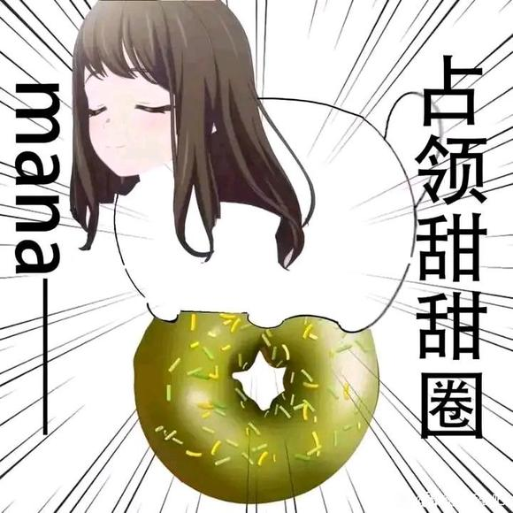

# Mygo!!!!!众人长出兽耳的故事

## 1

八幡海铃一来到学校就看到自己的好友趴在桌上睡觉。
八成是昨晚又熬夜了吧，海铃心想，最近Mygo!!!!!成员受邀去其他地方演出，立希下定决心要为这次演出写出一首新曲子，于是自从上周拿到高松灯的词后黑眼圈就没消过，疲惫的样子让海铃都打不起去逗她的兴趣。
刚准备从包里抽出一支橘子牛奶准备放在立希的头上顺带提醒她马上就要上课了，海铃却发现立希的头顶似乎多了什么东西。一对与发色同色的……毛绒熊耳?

## 2

那个椎名立希……还有这样的爱好吗?戴兽耳发卡?
要是平时，八幡海铃怎样都无法想象出那副有趣的场面——顶着熊耳一脸生人勿近气息的椎名立希走到座位上，等待海铃对此发表意见或是直接夸她可爱……不不不，这未免也太荒谬了。
然而事情就是这样发生了。海铃轻手轻脚地把牛奶放在两只小熊耳朵之间，坐回了座位上——然后四处看看有没有人注意到这边，确定无人关注后又悄悄伸直手臂……
啊，软软的，还有热度。
这下事情有点复杂了，八幡海铃心想。前面的椎名立希随之醒了过来，一只手揉着眼睛，一只手熟练地取下头顶的牛奶，“怎么了吗?”
“不，没什么。”八幡海铃说道，“就是在思考你什么时候参加了科学怪人的实验而已。”
“什么意……”话音未落，触摸到头顶熊耳的椎名立希就顿住了。八幡海铃能清晰地看到那对耳朵也随之颤了一下。
“我会替你向老师请假的。”在海铃善解人意的话语下，椎名立希满脸通红，三秒钟后背着书包夺门而出。

## 3

把书包顶在头上一路狂奔到了家中，随意应付了姐姐真希的询问后，立希一头钻进了被子里。
(是真的……)
蜷缩在被子里的立希伸手揉了揉头顶的耳朵，莫名的敏感让她立刻缩回了手。稍微调动一下不存在的肌肉，似乎还能让它盖在头发上——当然并不能隐藏起来，反而因此看上去更可爱了。
“到底是怎么回事?!”
立希开始回忆近几日来有没有什么奇怪的事情发生，答案自然是没有——就算有，一直沉迷作曲的立希也很可能注意不到。但思来想去，她还是想起了一件事。大约是昨天的练习结束后，乐队里的粉毛吉他手掏出了一盒饼干说要跟大家分享。
“吃着还不错，你自己做的吗?”
“诶?不是啦，是一位前辈送给我们乐队的哦!说是看了我们的表演后很受感动，表达支持就送了这个。”
“嗯……”
现在想起来果然很奇怪啊!明明是前辈送的却没说是哪位前辈，还非要等大家都吃完后才说明来历，果然今天的事和那家伙脱不了干系!
立希从床上跳起来，看看时间，不知不觉已经快到乐队训练的时候了，曲子昨晚已经昨晚，她收拾了东西，又从衣柜里翻出个鸭舌帽便出了门。
“路上小心——”真希探头看向突然离家的妹妹，又挠了挠头。
“今天明明是阴天啊……”

## 4

还没进排练室的门，椎名立希就已经听到了千早爱音和长崎素世的聊天声，一想到这一路跑过来忍受的来自路人的怪异目光(其实并没有)，椎名立希就感到无名火起，必须狠狠地逼问粉毛到底是怎么回事!这样想着，她举起带来的鼓棒敲了敲排练室的门。
排练室里的对话立刻停止了，然而等了半天也没有人来开门，只听到一阵慌乱的脚步声。立希更疑惑了，贴着门开口喊道:“是我，椎名。”
排练室里的脚步声更乱了。立希等的不耐烦，算了算时间，这两人无论在里头闯了什么祸现在也应该拾掇完了，她便直接推门而入，“失礼了。”
她第一眼看到的是站在角落阴影里的长崎素世和背对着她的千早爱音，见着了可能的罪魁祸首，立希即刻上前，“爱音，你昨天给我们吃的饼干是不是有问题?”
“啊哈哈……果然Rikki也这么觉得……”
“也?什么意思?还有，你这人和别人说话能不能不要背对着对方?”然而千早爱音死活都不肯转过来。见此情形，椎名立希也不含糊，直接趁爱音走到了她的面前。
“呀!”
尽管转头的速度很快，立希还是看到了爱音刚才试图遮掩的东西——垂到脸颊两侧的粉色狗狗耳朵，在爱音转头的过程中也随之被甩动。实际上，爱音的发型在耳边垂下的部分本就很像垂下的兽耳，灯也曾提起过这点。如果不是自己今天的遭遇，恐怕立希也很难第一时间发现爱音的兽耳。
“噗。”
立希的怒火烟消云散了——因为看到了罪魁祸首千早爱音自己也因为这对耳朵羞耻到不行的表情。爱音还不肯面对立希，一旁的素世倒是先叹了口气，“爱音，立希已经发现了，就不用伪装了吧。”
立希转头看去，只见长崎素世从阴影中走出，头顶是一对大大的狐狸尖耳——亚麻色的外绒以及白色的内绒。

## 5

🥺可以去跑几张图当配图吗

## 6

好好好，速更，夜不能寝

## 7

四个小时了，生产队的驴都不敢这么歇

## 8

人呢？人呢？人呢？人呢？人呢*

## 9

沟槽的，还不更新?想吃鞭子了?

## 10

人呢人呢人呢？生产队的驴都不敢这么歇

## 11

“噗哈哈哈哈Rikki你的样子哈哈哈——”
“你这家伙……适可而止!”
终于愿意转过头来的爱音本应会一脸羞耻地为立希说明情况，然而在她看到立希头顶的两只熊耳时——刚刚立希进门时就脱了帽子——却没忍住哈哈大笑起来，连带着两只小狗耳朵都在小幅度地扇着。立希刚皱起眉头想要说她几句，目光却被爱音身后飞速甩动的某样粉色物体吸引过去。
啪嗒。
“哎呀!!!”
粉色物体被抓在了立希的手里，入手处传来的是温暖顺滑的触感，这是一条毛茸茸的小狗尾巴。原来除了耳朵还会还会长出这个吗?椎名立希想，或许是因为熊猫的尾巴本就只有小小一团，所以自己才没有发现。肩上传来的碰触感打断了立希的思考，抬头，抿着嘴唇满脸通红的爱音正看向她。“Rikki……放开啦……咕呜……”
“啊，抱歉。”立希立刻回想起了自己碰触头顶熊耳时传来的奇妙触感，急忙放开了爱音的尾巴。脸色仍然潮红的爱音已经没了之前那股兴奋劲，只是安静地抱着胳膊，让尾巴绕到身前。
“唉……我们刚刚简单的测试了一下，这些新长出来的兽耳与尾巴对于他人的接触都很敏感。”长崎素世垂着眼皮在一旁说道。“刚刚我已经让爱音把尾巴藏进上衣里了，结果一兴奋起来又甩出来了。”立希看看素世的身后，空无一物，只是长裙后端明显膨起了一个团子。
狐狸尾巴啊……如果只是耳朵都那样大的话，尾巴会不会是像松鼠一样毛茸茸的一大团呢?立希甩甩头把莫名其妙的想法扔出脑袋，“说起来，野猫呢?她应该也吃了那个饼干吧?”
“乐奈的话我们刚刚看到了，在外头被服务生小姐投喂抹茶芭菲呢。”长崎素世答道。
“其实我们一开始还没发现她长出了猫耳朵和猫尾巴……太契合了以至于察觉不到违和感。”爱音在立希背后小声说道。
“等等!”立希突然想到一件很重要的事。
“灯呢?”

## 12

太纯良了，以至于我感觉进错了地方

## 13

企鹅耳只是一个孔啊，灯要长什么？喙？蹼？鳍？感觉都不是很可爱……不会是嘴里长了好几排企鹅牙吧

## 14

已经12哥小时了，生产队的驴都不敢这么歇

## 15

好好好，纯良文
会纯良的……吧？

## 16

“要我说，让乐奈去给我们找帽子就是个错误的决定……”千早爱音拐进个没人的巷子，把鸭舌帽脱下，两只被压在头顶没处透气的耳朵随之垂下，轻轻扇动着。
“那也是没有办法的事情，毕竟要出去找小灯的话，首先得把我们自己的伪装做好。”长崎素世看看一脸难受的爱音，又补充了一句。“要不要把我的这顶草帽换给你戴?”
“哎哎?Soyorin这么关心我的吗?”刚刚还被闷的半死不活爱音立刻换上了一脸坏笑，“嘛，换过来的话Soyorin的大狐耳被压着只会更难受吧，我就委屈一下啦。”
“唉……”看着千早爱音这态度，知道她没事的长崎素世叹了口气，又转向正在一旁正在低头思考的立希。“关于灯的去向，立希想到什么了吗?”
“……灯昨天也吃了那盒饼干吧?”
“是啊，这么一说Tomorin现在应该也长出动物耳朵和尾巴了。唔……要是Tomorin的话，大概会是企鹅?”
“企鹅没有耳朵，只有羽毛下的耳孔。”素世说道。
“这样吗?那我想想……”
“水豚。”乐奈冷不丁地说。
“诶?那是什么?”
“别管她，最近她来我家时总是在看动物纪录片。你们看看乐队群，灯发消息来了。”立希把手机屏幕转向众人。
「大家，一起来水族馆吧。(位置定位）」

## 17

于是十几分钟后，水族馆内出现了两个戴着帽子气喘吁吁的少女，一只站住不动专心看企鹅游动的猫，以及趴在玻璃上试图和疑似Tomorin的鱼类对话的爱音。
“Tomorin?是你吗?”爱音对着玻璃后的小鲸鱼低声说着，鲸鱼停在她面前低头看着的，轻轻眨着眼睛。
“你们看!Tomorin在这里!”
“你这家伙别犯傻了。”立希拿着手机噼里啪啦地打字，嘴上丝毫不停，“灯要是变成鱼类该怎么给我们发这条消息?有空在那里和鱼说话不如来看看这定位到底指向哪里。”
“这个方向我知道!”爱音探头过来看了看定位，突然叫道，“是水族馆里养南极企鹅的冰雪区!有时我看腻了游泳的企鹅，Tomorin就会带我去那里。”
几人又是一顿忙乱，情急之下爱音还带错了路——事实上现在所有人都认为灯正被饼干的效果困扰着而急需她们的帮助——最后当她们找到地方时，才发现乐奈不知何时已经在那里等了有一会了。
“怎么把尾巴露出来了!”立希上去就把白色猫尾往乐奈的校服裙里塞。
乐奈也没在意，只是闭嘴眼睛在空气中轻轻嗅着，然后突然看向某处，“有趣的女人。”
众人随之看去，只见穿着私服的灯正提着个小红桶，从工作人员通道里走出来。
分楼
“那个……我看taki和队里的大家为了演唱会都在很努力地准备，特别是taki，看上去一直很疲惫的样子……所以今天想让大家来水族馆放松一下，暂时不用排练了……”被众人围住的高松灯从头讲起了事情的原委。放在地上的红桶里，几条鱼正在打着挺。
“所以说，Tomorin没有长出兽耳?那个消息也不是求救?”爱音问道。
“……兽耳?”灯愣了愣，“消息的话，我本来是想让小爱和大家说一声的，毕竟这种事情都是小爱在群里宣布，可是小爱今天一天都没来学校……我就只好在中午发了……诶?”
爱音脱下了帽子，不安分的尾巴也从衣服里跑了出来，灯的话语随着戛然而止。望着一脸期待的爱音，好不容易才理解眼前状况的灯终究没说出话来，只是慢慢的伸出手去，轻握爱音的一侧耳朵，用拇指指腹梳理粉色的绒毛。
“唉……”望着眯起眼睛一脸舒适的爱音以及完全没意识到问题的高松灯，确认周围没有外人的长崎素世也不再刻意为二人挡住目光。“小灯说是中午发的消息，可我们是下午才收到的。”
“这个时间……”灯凑近看了看，“是我出来换桶的时间……啊，今天水族馆有活动，经过筛选的顾客也可以体验喂养照顾企鹅的工作，我想着到时候能给大家更好的介绍它们，就报名了。”
“果然，是冰雪区内部信号不好的缘故，灯的消息本该在中午发出，结果在出来换桶的时候才成功发了出去。”举着手机在员工通道处走来走去的立希说道，突然脸色一变，冲向一旁的摆在地上红桶。“野猫!别玩鱼!”
“所以说，灯没有长出兽耳吗?”爱音轻轻撩起灯的短发，结果发现灯的耳朵后长出了一小撮灰色的耳羽。“企鹅……有灰色耳羽吗?”
“啊，其实有一些企鹅是有的。另外对于帝企鹅的幼崽而言，覆盖在耳朵上的灰色绒毛也可以算是灰色耳羽。我的话……如果不是小爱告诉我我都注意不到这些羽毛……”
“果然，是企鹅呢。其实在刚刚注意到灯去冰雪区工作还穿着短裤时，我就有一点猜测了。”长崎素世在一旁说道，灯的目光随之被吸引过去。
“那个，小爱说大家都长出了兽耳和尾巴，素世桑果然也……?”
“唔!”素世顿时红了脸。“这种场合还是不要露出来……”
“灯!”在旁边看得着急的立希也凑了过来，把帽子摘下，“那个，其实我也……”
“喵。”夹杂在背景音中的猫叫。
“真是够了!你们，不要在这种地方露出耳朵!这么想欣赏的话去我家里随便欣赏到什么时候都可以!”长崎素世终于忍无可忍，胳膊却被戴回帽子的爱音抱上了。
“哼哼~这可是Soyorin自己说的哦。”
“素世桑的家，确实是有段时间没有……”
“可以，都忙活一天了歇息一下也好。”
“点心!”
“唉……”素世又叹了口气。

## 18

楼主已经一整天没有更新了

## 19

是不是要我跪下才肯更新

## 20

“诶嘿嘿……”
演出结束后，爱音在休息室的角落里划拉着手机，灯和乐奈在闭目养神，头一低一低地像小鸡啄米，立希在笔记本上看演出事务的消息，半天后眉头终于长出一口气，长崎素世捧着水杯，在听了三十秒的爱音傻笑后终于忍不住问:“在看什么呢?”
“在看我们那天团建的照片啊。”
爱音把手机屏幕转向素世，画面里，还在熟睡中的长崎素世把狐狸耳朵盖起，大尾巴被爱音和灯一起枕着，灯把爱音和她的粉色尾巴抱在一起，乐奈则靠着立希，用白色的猫尾把她的手臂缠上许多圈。朝日初升，小动物们都在睡着，只有爱音睡眼惺忪地把手机高高举起，拍下这珍贵的一幕。
“要永远保存起来♬”
“爱音酱，你要是把它发到乐队的官方账号上，我会生气的哦。”
莫名恢复了温柔语气的素世把爱音吓得缩起脖子来，半天才小声回了一句:“刚才大家不是都看到了嘛……”
是的，Mygo!!!!!众人直到演出开始前都没能找到恢复的方法，爱音只好给大家重新设计了一套演出服，宣传方面也加上了相关的要素，靠着MC环节的各种基于动物类型的互动，演出反倒取得了惊人的反响，一度登上了趋势榜单。
“唉……这种模样还是早点结束的好。”
“Soyorin是担心被月之森的朋友们摸到耳朵吗?”爱音坏笑着说。
“……爱音就这么喜欢这种状态吗?”
“当然啦，倒不如说，有谁不喜欢毛茸茸又温暖的可爱大耳朵呢?”爱音边说边往素世头顶瞟去，素世却没有像往常一样回击，而是掏出了一盒包装精致的……饼干?
“场间时送来的礼物，本来想演出结束后就告诉大家的，看小灯和乐奈这么累就决定晚点再说了。”素世取下饼干盒上的贴纸，念起了上面的留言。“谢谢你们的演出，顶着兽耳的样子真的太可爱了!这是与上次的赠礼对应的复原饼干，本应在上次一起送达，现补上。”落款是弦卷集团千金弦卷心。
在爱音的“啊我认识她她就是那个Hello,Happy World的——”吵吵嚷嚷中，众人都聚到了礼盒前，打开后只有五块颜色各异的曲奇饼干。立希第一个拿起放进嘴里，乐奈探头看了一会，取走了绿色的曲奇。素世优雅地品尝了自己的那块，灯则拿在手里犹豫不决了大半天，最后在爱音的一句“无论有没有长出耳羽Tomorin都很可爱哦”之后才下定决心吃了下去。爱音看着大家的兽耳和尾巴都突然变成了细微的光点消散在空气中，手也伸进饼干盒想取走自己的那块——结果发现里面已经一块也不剩了。
“诶诶诶?我的那一份呢?”
“爱音不是很喜欢这种状态吗?留着也没什么不好。”
长崎素世用纸巾把藏在手心的曲奇包起，偷偷塞进了包里。
——原本只是想逗弄下这只粉毛大狗，谁知她宣布“饼干一定还在附近”后就开始到处嗅着饼干的气味，从休息室到接送车，从餐馆到素世的家里……其实到最后一个地方时爱音已经开始用哀怨的眼神看着长崎素世了，但长崎素世还是决定视而不见，直到爱音作势要开始翻她的私人物品，她才终于把饼干交了出来。
“SO-YO-RIN-坏-心-眼-”
“嗯哼。”长崎素世看着背起耳朵的千早爱音久违的心情轻快起来，“那么，接住你的饼干哦。”
“呜!”
饼干被轻抛至空中，爱音登时从座位上跳起，一口把它咬碎吞了下去，并在耳朵和尾巴化光消失后终于回过味来，生气地质问素世:
“Soyorin这是把我当成什么了!”
粉毛大狗啊。
长崎素世没说出来，一旁的灯、立希与乐奈也没说出来，大家都只是笑，直到爱音欲哭无泪地说:
“长出兽耳这种事真是太坏了!”
END

## 21

好可爱好可爱好可爱！！！

## 22

lz回来点了个赞又消失了

## 23

番外
“哎哎——AveMujica今天的人气也是一如既往的高呢——”
在沙发上躺了半天终于缓过劲来的鼓手又恢复了日常的活跃状态，叽叽喳喳地开始向默默补水的贝斯和正在卸妆的主唱聊起蒸蒸日上的乐队。键盘手把她今天的努力都看在眼里，并不开口去斥责她。倒是闭目养神的吉他手在她聊到热搜榜时冷不丁的说了一句:“AveMujica不是热搜第一。”
“诶?”鼓手一愣，随机掏出手机熟练地点开社交软件，然后惊讶地叫起来:“我们是第二?!第一是那个MyGO?可是她们的演出不是前天的事情吗?”
“如果喵梦子看了她们的演出视频的话，应该能马上理解原因。”贝斯手放下水瓶开口说道。某位友人头上的熊耳触感并未被她遗忘，反倒是在看到顶着兽耳的MyGO众人活跃于舞台时愈发清晰起来，要是能再多摸一下就好了，贝斯手不无遗憾地想道，又或者那天她不该告诉立希此事，而是让她顶着熊耳上一周的课……不，果然还是算了。
“是喵梦亲——”若麦不厌其烦地纠正海铃的叫法，又转过头去和睦说话，“原来睦子也关注热搜榜吗?我还以为睦子是完全不看这些的呢……”结果睦半天也没回若麦的话，一如既往自讨没趣的若麦顺手点开MyGO的演出录像，这时睦的回应才慢悠悠地传来:
“关注的并不是热搜。”
若麦还没来得及思考睦这话到底什么意思，目光就被珍奇的场面吸引了过去——顶着粉色小狗耳朵的节奏吉他手随着音乐欢快地摇着尾巴，贝斯手则反常地在舞台上冷着一张脸，然而配上头顶大大的亚麻色狐耳反倒显得格外可爱。鼓手在一堆乐器组件后面看不清状态(若麦不由得也为自己在演出时的曝光率感到悲哀)，但偶尔的特写镜头也能看出她头顶的圆形耳朵，至于主音吉他……若麦看了半天才想起来，原来那女孩之前没有猫耳猫尾来着。
“主唱呢?”若麦嘟囔了一句。
“……耳后有耳羽，这次她的耳饰是夹在大片羽毛上的。位置有变化。”
“呜啊啊啊队长!”
不知何时坐到了若麦旁边的丰川祥子冷静地指出了MyGO主唱的特征，被吓得不轻的若麦在回过神来后又一脸揶揄地凑到队长旁边:“队长原来这么关注她们吗?难道说……”
丰川祥子脸色不变，一旁的若叶睦和三角初华用余光盯着这边的状况。
“……队长也喜欢这样的饰品?”
八幡海铃咳嗽了一声，若叶睦又开始闭目养神，放下卸妆棉的初华笑着打圆场:“她们的这些装饰确实很可爱啦……但是如果AveMujica也照搬的话，不会有破坏世界观的风险吗?”
“正是这样。”丰川祥子冷静地接过话头。“而且模仿很容易让观众将我们和MyGO联系起来，在两只乐队没有实质联系的前提下，讨论若被有心人引导，可能出现粉丝间的争端。”
若麦看了看队长的表情，知道是没希望了，于是方才消散的疲惫又回到了身子里，侧着斜躺在沙发上——正好把头枕在一旁的丰川祥子腿上。
“祐天寺——”
“哎哎，工作人员发来消息说有粉丝送来礼物诶!”若麦故意大声喊着转移话题，算是小小报复一下自己的提议被祥子拒绝的事。“我看看……好像说是一盒饼干?”
“食品之类的礼物我想还是不要真的吃下为好。”
“staff那边说已经检查过啦——是包装完整的大牌子哦，弦卷出品的!”
祥子还想说什么，一旁的初华就先一步表示收下这些也无妨，于是祥子低头看了看满脸期待的紫色大猫，终于叹了口气，让若麦联系工作人员把礼物送来。
——
第二天。
“为什么你也有这个?”椎名立希一脸古怪地盯着自己的好友。
“可能是被你的审美风格所感染了把，上周你不也戴了熊耳耳饰吗。”八幡海铃一脸平淡地回答道。
“所以，是什么?”
“豹子吧，我想，虽然很难看出特征什么的。”
“唉……说起来，三角同学怎么请假了?你清楚吗?”
“是流感吧，最近蔓延的挺严重，就连许多大型活动都停止了呢。那个最近很火的，叫AveMujica的乐队不就宣布暂缓演出了吗?”
“哦。”
“所以你的小熊耳朵呢?我看你在live上顶着它们还挺开心的。”
“可别提了!”
end.

## 24

居然还有！好可爱好可爱好可爱

## 25

难得一见，能将清水文写的这么有韵味的，发自真心地有一种又看了一集的感觉。
与其说是原著的续集，倒不如说是在人设契合原著的同时，还能保持着属于网文本身的特色与味道。
在孕吧这条充斥着黑暗料理的美食街里，您的作品宛如街角小馆的家常菜，味虽看似平淡，初尝不觉新奇，但是细细品味之后，总能在某个不经意的傍晚，勾起迷失在黑暗料理中老饕的初心——究竟是怎样的作品才能填补内心的妄图大啖一切的空洞？
有道是
雪沫乳花浮午盏，蓼茸蒿笋试春盘。
人间有味是清欢。

## 26

好，日常卖萌文也是人们生存的原动力！好看！

## 27

太纯良了，简直就像在被一群丧尸追杀的时候突然钻进了安全屋，总之太感谢了

## 28

这是我能在怀孕吧看到的？

## 29

感谢你，让我在疯狂的☁吧里可以休息一会

