# The Walking MyGO （行尸走肉）

## 1

突发奇想的丧尸末日类二创，想到哪儿写到哪儿
包含角色死亡，大概吧

## 2

孩子们，让我想想怎么个事
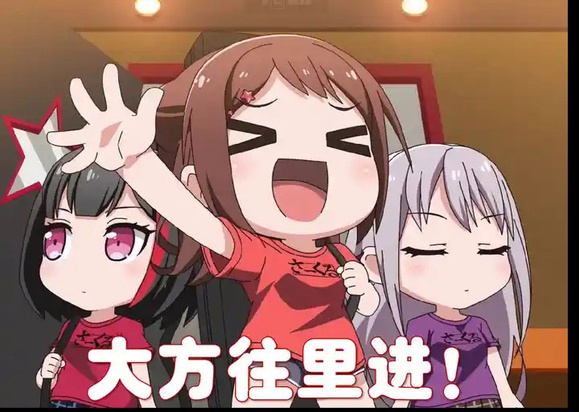

## 3

高松灯依旧如往日般坐在卧室的书桌前，在封面是鸢尾花的记事本上写写画画，思考着下一次演出时的新歌歌词。
不过今晚外面的街道似乎有些吵闹，不断传来救护车与警车的连续长鸣，红蓝交替的灯光映照在卧室的窗帘上，灯叹了口气，放下手中的笔，走在窗前用手指拉开窗帘看了一眼外面的状况，对面楼下的入口处被警察围住，黄色的警戒线内，医护人员正抬着担架往救护车里进，担架上的人捂着肚子在痛苦的哀嚎着。
“大家……发生什么事了呢究竟……”门外传来父亲敲门提醒早点睡的声音，灯拉上了窗帘，重新回到座位上，只不过这次久久不能下笔，低着头沉思着什么。

## 4

稍早前，下午放学的时候，爱音和灯正准备和以往一样去Ring进行今天的乐队练习，下一次演出，爱音正兴奋地刷着最新的网络咨询，“呐呐Tomorin，你听说最近新宿的恶意伤人事件了吗，听起来好可怕，我看见有人上传的Tiktok 他们相互打的好激烈啊……”
灯看了看爱音，然后转头继续和她一同并排走着，听着爱音嘴边传出的各种各样不好的词语，歹徒、行凶、无差别杀人、伤亡惨重，就连学校老师都提醒大家最近注意安全，别去人流密集的场所凑热闹。

## 5

为什么会是人流密集的场所而不是人少的场所呢，灯歪了歪脑袋，突然觉得有些奇怪，按照以前所听说过的各种各样的行凶事件，凶手一般会选择人迹罕至的角落，像是很少有走的小路，公园，小巷一类的地方方便行凶，而这次似乎不一样，人多的地方不再如同往常的伤人案件一般能给予人安全感，听Anno酱的描述，最近的多起突发伤人案件都发生在几个大的购物中心或者商业街附近，涩谷，新宿，台场……

## 6

“欸？！不会吧！RING今天宣布歇业了诶！？”思绪突然被一旁的爱音打断，“那今天的练习怎么呢Tomorin”
“那，今天大家就先回家吧，麻烦Anno酱在群里给大家说一下吧。”灯停住身子，转过头来对爱音说。
“好吧，那Tomorin回家要注意安全哦，要不要我送你回去吧，最近也挺不安全的。”
灯摇了摇头，向爱音挥了挥手，“没事的，Anno酱你也早点回去吧，我一个人回去也没问题的，很快就到了。”
“那灯你一定要注意安全哦！回到家记得在群里面告诉大家！再见啦！”
千早爱音认真地看了灯一会儿，觉得对面的短发企鹅也是在认真地做着决定，便叹了口气，打起精神，抬高声调，向灯挥手再见，走过大概一小段距离后仍回头看了一眼，直至灯的身影消失在视野之中。

## 7

“取消了哦今天的日程”
“哈？”立希看着屏幕上的消息，感到一阵诧异。

## 8

立希对最近的恶性事件有一些大概的了解，但了解和事情发生在自己周边是另一回事，根据别的工作人员传来的消息，似乎是下午早些时候有两个人在RING的店附近打架斗殴，看在场人员拍的照片，其中一人面目狰狞，把另一人的耳朵都给撕扯下来了，鲜红占据了照片的主色彩，已经分不清谁是谁的血在两人身上了。

## 9

“塞呀酷”立希皱着眉，关掉了照片，MyGO的五人群此时被那个粉毛的信息顶了上来。
“小灯说今天的练习就先取消吧，毕竟连RING都歇业了嘛今天，大家记得早点回家哦”
“灯呢，你和灯一起回去的吗？”
“灯觉得绕路不太好也让我早点回家啦Rikki”
“你这家伙”
“好了好了立希，灯也是为大家的安全着想”
“没有抹茶芭菲”
……
立希收起手机，一盒包装上画着熊猫的橘子味饮料被人放在了桌上，抬起头，是八幡海玲略显英气的面孔。
“还不去练习，Mujica这个月还有演出吧？”
“取消了。”
“你们也取消了？”
“也？嘛，总之现在联系不上丰川同学，她最后发的消息就是今天的练习取消了。”
不对劲，有什么不对劲的事情在这座城里发生，立希咬紧牙关，塑料管在反复咬合下扁踏成半透明薄片，一股莫名的恐惧让腹部有一种紧缩的空虚感与下沉感使她感到不适。
“你也早点回去吧。”
立希烦躁地摇摇头，试图甩开这股不安感，站起身离开教室，给海玲叮嘱一句后便离开了教室，留下愣了愣的海玲疑惑地望着立希离开的背影。

## 10

总觉得应该给个时间标注会好一些

## 11

整理一下时间，
下午放学，Ring歇业与练习取消——16：05
Rikki回家——16：20
灯在窗边看楼下——21：00
主要是方便后面的叙述

## 12

21：25
素世坐在宽敞的客厅，优雅地品着刚泡好的的红茶，干枯蜷缩的叶脉如蝶翼般在杯底舒展，蒸腾起淡雅的茶香，这是一杯上好的大吉岭红茶，卖相口味皆无缺陷，本该给享用者带来愉悦的身心体验，但此刻并不能安抚下素世不安的内心，放下手中精致的茶杯，转头望向窗外。
在大厦顶层的高度带给了人无与伦比的广袤视野，从窗外望去，东京都也霓虹依旧，只是今天的霓虹都市中多了四起的硝烟，煤气爆炸？车辆事故？火灾？还是都有？素世偏向最后一种可能性，毕竟这里不仅能看见街道上闪烁穿行的车流拥堵成一团，也能更加清晰的感受到此刻在城市上空不断穿行的直升机的数量，轰鸣的机翼带来巨大的噪音，让高楼的人更感不适。

## 13

这周都只有素世一个人在家，妈妈之前接到了去⏰的出差通知，如今应该还在上海。
下午因为RING歇业了，小睦今天也没有来学校，所以素世今天早早的就回到了家中，下午16：40左右也陆陆续续也收到了群里其他人到家的消息，也稍微感到心安，于是一个人吃了晚饭便在客厅练习贝斯。
但晚上不安感却愈发强烈，随着街道传来的声音越来越嘈杂，甚至传出了一些惨叫的声音，素世便锁好了门，坐在客厅浏览着外界的消息，试图了解到到底外面在发生什么事。
MyGO群聊里的消息也不断在屏幕顶端弹出，灯的家对面似乎直击事故现场，Rikki的姐姐今晚发高烧了，家里正准备送她去医院，乐奈酱今天倒是反常的正经，异常强硬地劝Rikki不要出门，爱音……爱音她17：30后就没有消息，也不知道她怎么样了，给她发的消息也全是未读状态。
希望没事吧……
素世暗自祈祷，自从MyGO 组建以后，一直在将大家紧紧联系在一起，用着自己的方式帮助着每一人，拉住每一个人的手向着前方前进，跨越过去的滞碍，即使有被伤到也能很快的振作起来，漏出那得意洋洋的小虎牙……
总觉得还是有些对不起她呢……
那个粉毛……
“一定要没事啊。”素世低语道。

## 14

“轰——”
不知道哪里传出一阵惊天巨响，裹夹的气流振的玻璃微微发颤，素世站起身，准备来到阳台看看是哪里传来的动静。
随即，几乎紧随其来，摩天大楼的灯光像是被一刀切段，霓虹灯牌骤然熄灭，空调外机的嗡鸣，电梯运行传来的摩擦声戛然而止，隐约传来变压器爆裂的噼啪声。
沥青般的黑暗倾泻在了几乎整座城市，只剩零零散散几处灯光如同孤岛遍布在些许角落——
停电了。
“咚……咚……咚……”
“砰！”

## 15

累了，晚安，明天看起来再写吧

## 16

为什么不能让我直接毕业😭我都交了4年学费了为什么不能放过我😭

## 17

下午敲了点，晚上一起发出来吧

## 18

从明亮的环境一下跌入黑暗短暂地剥夺了素世的视野，她在黑暗之中打开手机手电筒摸索回沙发附近，过了好一会儿才慢慢适应这昏暗的环境。窗外原本繁华的灯火已然熄灭，但声音仍未停止，司机们暴躁地按着喇叭，掩盖住了其他声音。
素世拿出手机，还好，信号还没断。
铺天盖地的消息，停电、火灾、伤人案件、车祸，交通堵塞，还有什么，丧尸？
丧尸？
素世看到这个字眼，楞住了一下，听起来是不是有些太扯了，丧尸？
那种活跃在各种影视文学作品里面的幻想生物，现实与其最接近的案例可能是狂犬病，有跑得快的跑得慢的，能变异的不能变异的，但唯一的共同点似乎都只有一点，那就是食人。
说起来自己还看过一些丧尸电影，还是当时爱音那家伙提出来的所谓Mygo试胆大会，在自己的家里大家聚在沙发上看一整晚各种各样的恐怖片，其中就包括这种类型。
长崎素世小姐还记得当时大家的反应，明明是发起人的爱音胆子却最小，灯和乐奈酱看的津津有味，Rikki觉得那些开膛破肚的场景有些恶心，但总归还是一次不错的聚会，大家看一整晚后爽睡一上午，第二天还一起去家庭餐厅聚餐吃了晚饭。
自己？自己没什么反应，毕竟再怎样也只是电影而已，吓不倒我。
但电影里的事可能真的发生在现实中，素世就有点笑不出来了，结合最近的各种各样的传言与新闻报道，并非没有这种事情发生的可能。
“砰砰砰！”
大门传来一阵敲门声，把沉浸在自己思考素世吓了一跳，手一下子没握稳，手机掉在了地上。
谁？刚刚可怕的猜想让素世不敢发声，她捡起手机，脱下拖鞋，赤脚向门口走去。
“您好，公寓应急管理人员，请开门登记情况。“
？
素世松了一口气，通过猫眼以及黑暗的环境虽然不是很能分辨的出外面的人的表情，但闪烁的应急灯还是能让人认出这是平日一直在楼下的公寓接待员女士，素世准备开门登记以及询问外面是什么情况。
“您好，公寓应急管理人员，请开门登记情况。“
“您好，公寓应急管理人员，请开门登记情况。“
“您好，公寓应急管理人员，请开门登记情况。“
似乎是之前没听见门内动静缘故，门外的声音突然变得急促起来，音调也逐渐变得暴躁，开始不耐烦地重复询问，并且伴随着愈发激烈的敲门声。
“请开门登记情况！“
“请请请请请请开门登记情况！“
"开！开！开！门！门！门！"喉管摩擦出风箱漏气般的杂音，某个音节突然拔高成尖啸，像生锈钢锯划过防盗门铁皮。
门外原本在那里的人开始反复冲击大门，用额头以及肩膀反复冲击大门，肩胛骨撞上铁门的闷响里，夹杂着肋骨折断的"咔嚓"声，但它仍在继续，好像感知不到任何疼痛，机械地重复着着这疯狂的举动。
哈哈，素世退回客厅，只能是感谢自己家顶层公寓更为昂贵的价格换来的更为坚固的大门以及自己提前锁好了门，但即使外面不知道是什么的东西进不来，自己也出不去，屋内还有多久的食物能让自己撑多久呢？这种事态多久能得到结束呢？
哈哈，我是不是快要完蛋了
长期素食女士一屁股瘫软在地，听着门外仍在持续的撞门声，自嘲地露出苦笑。

## 19

今天下午抽空敲了点以及确定了下大纲，现在等我回宿舍再战

## 20

16:50
“摇摇晃晃的我～今天也立于转角～”
千早爱音哼着悠扬的曲调，轻快地踩着节拍走在回家的路上。
不愧是tomorin呢，能写出这样的歌词。
爱音仍还记得上一次live时溢流的情感所带来的感受，在舞台上的震颤，大家情感的轰鸣在乐器与歌声中宣泄而出融合成一首崭新的乐曲，那流下的汗水与歌声汇聚成泪滴打湿了脸庞，在那种瞬间，心的感受…
爱音是一直相信着灯，相信着同在mygo的大家所共同建立与维系的羁绊是不逊色于crythic的，是不会那么轻易地就被夺走或击溃什么的，所以她没有一点担心，在丰川同学组建的avemujica出现一些队内矛盾以至于影响到之前同为crythic的众人时，一直保持着一种从容的自信。
结果呢？
结果也确实如她所想。
想到这，爱音得意地露出微笑。
不过一想到最近那么多的恶性伤人事件，以及今天的练习取消，爱音又高兴不起来了。
什么时候才能进行下一场演出呢？在之前中间的有段节拍插入的时机一直不是把握的很准，账号的运营动态就发上一次大家一起去赏花时候的照片吧！说起来上次在soyorin家看的那部电影好吓人哦，也是和最近相似的事件诶？话说最近soyorin是不是长胖了，和乐奈酱一起吃芭菲吃的有点多诶，下次见面的时候和她说说吧！Tomorin现在到家没有呢…
脑海中的思绪连篇，不知不觉就走到了家附近，走过那个熟悉的拐角，就能看见自己家那栋熟悉的独栋小楼。

## 21

熟悉的独栋小楼，父亲的路虎老老实实地停在旁边的车库里，爱音来到家门口，熟练地用钥匙打开家门，在前廊的提起小腿，脱下穿了一天的小皮鞋放进鞋柜，啪嗒啪嗒的走进屋内。
“我回来了妈妈！”
“哦…小爱回来了啊…”
“嗯！我先回房间了，一会儿吃饭的时候记得叫我哦妈妈！”
母亲在厨房忙碌着，爱音没有看见她的正脸，打了个招呼便上了楼。
将书包往地上一甩，爱音跳着躺进沙发打开平板。
“大家好喵姆喵姆，今天给大家带来的是最近我一直在用的有一款洗面奶推荐…”
喵梦亲倒是在正常更新呢。
别的频道大多最近已经停止了更新，或是激烈的讨论着最近多的有些不正常的伤人案件。最近整个社会仿佛笼罩着一层阴云压在所有人的心头，最近这么多可怕的事情，是不是去乡下待一段时间会好一些呢…
千早爱音啊千早爱音，你怎么能不多考虑下大家和父母呢，这要求未免有些任性了吧。

## 22

17：08
如果时间能够倒流回十几分钟前，anno绝对不会再认为自己的要求有些任性。
不，那是即使任性也要坚持的东西。

## 23

17:00
不对。
我爸呢？
千早先生是一个事业有成的的男人，这也意味着他的工作会一些忙碌，但即使工作在忙碌，在家的时候他也会上楼来向爱音表达一下自己长期不在的歉意，进行一些父女之间的交流，问一问最近乐队怎么样了，爱音最近过的开心吗，有没有什么烦心事什么的。
千早先生毫无疑问的是一位温柔的父亲，成功的男人，在工作上事业有成，工作再忙也没有忽视对家庭的关心，深爱着自己的家庭，支持孩子的梦想，对作为女儿的爱音有一种近乎溺爱的包容，这也是一直被千早小姐所诟病的一点，对于此，千早先生也只能吐舌头装作没听见。
还好千早爱音同学并没有辜负父母的期望，尽管中途有些小小波折，也顺利的成为了父母骄傲的孩子。
“不过这一点倒是没有关系啦，无论爱音怎样，你一直是爸爸妈妈眼中的骄傲哦。”在某一次的晚饭中，千早先生曾对爱音这样说。
她一直记着这些温暖的话语。

## 24

楼梯上传来咚咚的脚步声，会是爸爸吗？
千早爱音想。
脚步停在了千早爱音房门前。
一门之隔，门的另一端有着某种难以言说的恐怖之物，人类原始的基因本能警报在疯狂作响，那是危险的东西，是需要逃离的东西，是绝对不可以因为好奇心去看的东西。
快走快走快走快走快走快走快走快走快走快走快走快走快走快走快走快走
但她还是强行遏制住了恐惧的情绪，深呼吸，没什么好害怕的，这是在自己家里，只是妈妈来叫自己吃饭罢了，没什么好害怕的。
没什么好害怕的。
“爱音，吃饭了”门外传来的是妈妈的声音，有些些微的嘶哑，这很正常，妈妈只是前几天得了感冒还有点后遗症，这很正常，这很正常，这很正常。
什么嘛，搞这么吓人，自己把自己吓到了。千早爱音平复好情绪，打开房门。

## 25

17:07
“妈妈你先下去吧我一会儿知道下来的。”
千早爱音关上了房门。
然后迅速的锁上房门，冲到房间内试图用柜子堵住门口。
那不是妈妈，那不允许是妈妈。
打开房门映入眼前的，对千早爱音而言，是几近地狱的画卷：
妈妈的柔顺的短发不知什么时候脱落了一大半，露出了满是疮口的头皮，眼珠异样的凸起，整个面部，应该说是整个身体表面都是青筋暴起，脑袋微斜，整伴随着不自然的哆嗦，嘴巴还沾点血丝，双手端着盆子，盆子里面…
盆子里面是爸爸。
“爱爱爱爱爱爱爱啊音，乖乖乖乖还海子，七返饭返饭饭了。”
千早爱音关上了房门。
她不知道该说什么，只知道此时此刻，应该救下自己。
门外的声音在关上门后戛然而止，随后便是疯狂的用身体冲击这扇门，门外的人已经发不出正常的声音了，就好像刚刚的声音是曾经在那副躯壳上的亡魂留下来的一缕念想，寄托的话语说出后，亡魂也随之消散了，现在留下来的只有一个惊骇之物。
得逃。门挡不了太久。
怎么逃？
爱音飞速扫过整个熟悉的房间，窗子，二楼，唯一的逃生通道了。
我会骨折吗？我的腿会断吗？内脏会出血吗？
没时间犹豫了，千早爱音翻过窗口，用手抓住窗台边缘试图缩短落地的高度差，搜寻脑海里的知识，翻滚落地，最大限度的减少冲击力，想办法卸掉一部分力，你能做到的，千早爱音，你一定能。
千早爱音确实做得到，凭借平日生活中勤于锻炼的习惯以及不弱的运动天赋，她安全的落到了一楼花园的空地，只是泥土擦伤了些膝盖。
跑起来，千早爱音，跑起来。
不知为何，爱音想起来了初中时期的一次运动会，自己作为马拉松接力赛的最后一棒参赛，4*200米接力赛，那两百米明明平时感觉那么短的，但在全力冲刺下，却又那么长，长到咫尺天涯，那时自己的父亲母亲就在终点线那里，奋力地挥着手为自己的女儿加油。
“爱音！加油！你能做到的！爸爸妈妈相信你！”
预备，接棒，起跑，平日无数次的积累汇聚在这一刻，自然而然的跑步动作，心肺超负荷运载为整个身躯供能，即使感觉好累也要跑下去，即使快要喘不上气也要跑下去，即使感觉下一秒自己就要死了也要跑下去，终点就在眼前，冲线—
那时是一个晴天，天空是漂亮的湛蓝，千早爱音现在仍记得那一天冲完线后自己躺在操场上喘气时望见的晴朗蓝天，阳光照的人有些睁不开眼，但照在脸上暖洋洋的，很舒服，旁边有长辈同学的欢呼声，庆贺声，那一瞬间觉得真好啊，一切都是那样的美好，身体的每一个细胞都充斥着青春的活力，构成人生乐谱之中的一个明亮音符，千早爱音相信自己的未来仍会如此，充满生机与希望。
身后传来重物落地的声音，好像还有骨折清脆的响声，千早爱音不敢回头，只知道向前跑着，但前方并没有如同那一日的终点线在等待着自己，她只能不停的跑啊跑，跑啊跑，她害怕自己被追上。
“爱…音…逃…快…”不知道是不是错觉，身后传来几声若有若无的呢喃，明明已经跑远一段距离了，但那声音就好像直接在大脑里出现，肆意的在心灵深处横冲直撞。
千早爱音还是不敢回头，她知道那是错觉，已经跑出好远一段距离了，快见不到影了，不可能听得到的。
跑，千早爱音，跑下去，没人能追得上你的。
不知道那象征着终点的红带在何方，但千早爱音感觉被一种莫大的悲怆所追上了，之前被冲击性画面所寄存的悲伤如同洪水一般从心灵深处袭来，眼泪夺眶而出。

## 26

真是难忘啊，论文，我大概这辈子都忘不了你了吧

## 27

20:20
“啧，那家伙还是没联系上吗。”椎名立希烦躁地看着手机，期待着对面的头像能跳动一下。
那个平日里最活跃的粉色莲花头像下午5点后就没有任何回应，给她打的电话也没接，发的所有消息都是未读状态。
这一天对于立希来说真是糟糕透了，先是RING因为周围的暴力事件暂时歇业，练习取消，然后在最近这样的情况下爱音也已经失联3个小时了，就连千早家的家庭电话都没有任何人接听，很难不担心千早爱音遭遇了什么事情。但是还有更糟糕的，自己的姐姐椎名真希，就在半小时前突然高烧不退，此刻正昏迷在床，体温已经达到40度了，必须立刻送往医院接受更专业的治疗。
医院的电话今晚几乎一直是占线的状态，救护车的电子鸣笛声一直在街道上没有消失过，一辆又一辆的急救车由远及近不停地穿梭在城市的街道，指望医院再派人手来似乎已经完全不现实了。
椎名一家决定开车去最近的诊所。

## 28

今晚东京都内的交通状况简直就是灾难，十字路口，红绿灯的信号切换已经失去了意义，喇叭声此起彼伏，车流挤成一团，每一辆车都试图挤出一条缝隙，但前方的车辆都是纹丝不动，亚洲第一大都市圈的血管拥堵不堪。
眼前的景象让立希心中不安的情绪愈发强烈，心脏如擂鼓般奏鸣。动物界在大型自然灾害来临前总会出现大规模的反常举动，此刻的群众就像地震来临前感知到为危险的田鼠，从各个角落倾巢而出试图逃离即将到来的灾难。
椎名健先生在驾驶位已经开始倾泻标准的日本语国骂了，喇叭按了又按试图催促前方的车流但无济于事，道路拥堵的起点已经无迹可循。

## 29

今晚状态有些低迷，写的有点慢

## 30

不能再等了。
今晚的交通堵塞不是一时半会儿就能结束的局面，一家人决定弃车徒步前往诊所，真希的安危更加重要。
就这么想着，刚准备下车—
剧烈的撞击，一阵天旋地转，立希恍惚间看见是一辆失控的货车，司机面上还带着狰狞的表情…
“真是糟糕透了。”
汽车被掀翻在地，一声沉闷的撞击声响起，一切变得缓慢而模糊。
立希昏迷了过去。

## 31

“我以为减速带呢”“我们都在用力的活着”“和保险说去吧”

## 32

21:40
视线…好模糊…这里是哪儿…
姐姐…姐姐怎么样了…
爸妈还好吗…
头好晕…
大家…
灯…
最先恢复的是听觉，但耳蜗好像被塞了一团厚厚的棉絮，周围环境传递进来的声音嘈杂不堪，就像是水下的人试图去听清水上声音的那种模糊感，立希摇了摇头，艰难的睁开眼，她感觉到有什么温热的液体在自己脸上流淌，视觉神经仍有一种错位的晕眩感，视野范围内的一切都在不规则的进行晃动。
疼疼疼疼疼………我还以为要死了呢……
等待视觉的恍惚感稍微减弱一些后，立希开始观察自己所处的环境。
车辆被货车所掀翻在地，爸妈和姐姐不知所踪，半开的车门摇摇欲坠，自己的脚踝被前排挤压变形的座椅轻微卡住，通过自己能看见的两扇车窗看不见任何有用的信息，被侧翻在地的货车挡住了视野。
立希咬紧牙关，强忍着头部传来的剧痛，试图挪动身体。脚踝被卡住的部分传来一阵尖锐的刺痛，但她顾不上那么多了。
“爸……妈……姐姐……？”她艰难地呼唤着，声音沙哑得几乎听不见。
车外传来混乱的脚步声、尖叫和引擎的轰鸣，但没有人停下来查看这辆被撞翻的轿车。立希勉强抬起手，摸索着解开安全带，身体重重地摔在已经变形的车顶上——现在成了她的“地面”。
她用力踹了几脚卡住脚踝的座椅，金属发出刺耳的扭曲声，终于松动了一些。立希深吸一口气，猛地一抽腿，脚踝传来一阵撕裂般的疼痛，但她总算挣脱了出来。
“嘶……！”她倒吸一口凉气，低头看了一眼，脚踝已经红肿，但还好，骨头应该没断。
立希颤抖着爬向半开的车门，用尽全力推开它。冷风夹杂着刺鼻的汽油味和烟尘灌了进来，她剧烈地咳嗽了几声，艰难地爬出车厢。

## 33

“到底……发生什么了……”立希扶着车身站起来，眩晕感再次袭来，但她强迫自己保持清醒。
她踉跄着绕到货车的另一侧，瞳孔猛地收缩——
街道两侧的原本亮着的路灯不知道什么时候熄灭，不，不只是路灯，就连公路两侧的大楼也黯淡了下去，唯一能见的光源只有街道四处因为事故燃起的火光以及停车灯。
光线在烟雾中变得扭曲，人群像无头苍蝇一样四处奔逃，远处，警笛声和爆炸般的巨响此起彼伏。
立希扶着额头，试图理清思绪，但眼下混乱的街道让她无从下手，远处传来一阵撕心裂肺的尖叫，紧接着是玻璃破碎的声音。她下意识地绷紧了身体，警觉地望向声源方向。
一阵金属摩擦声传来，声音尽头，一个穿着月之森校服的女生正用消防斧劈砍一辆轿车的车门，女生的动作机械而精准，校服裙摆上满是污渍。当女生转过头时，立希看到了她泛青的皮肤和充血的眼睛。
"需要……帮助……"女生嘶哑地说着，声音从破损的声带里挤出，"车门……打不开……"
"你...你先放下那个。"立希慢慢后退，声音尽量保持平稳，"我可以帮你。"
女生歪着头，似乎在思考这个提议，但下一秒，她的表情突然扭曲，发出一声刺耳的尖叫："他们锁了门！他们锁了门！"斧头再次重重劈向车门，金属碰撞的火花在黑暗中格外刺眼。
一个上班族正慌乱的从旁边的大楼里跑出来，吸引了这位月之森“学生”的注意，但慌不择路的上班族并没有察觉到这位有些特殊的学生的异样，从她身旁跑过。
抽出斧头，一记漂亮的回旋——
咕咚咚，是什么落地的声音。
"嘎吱——"
那是血肉被撕扯的闷响，牙齿碾碎软骨的脆响，粘稠液体从指缝间滴落的啪嗒声。喉咙里滚动着满足的低吼，像饿极的野狗终于啃到了骨头。
"咕啾...咕嚓..."
它吃得极不讲究——时而用臼齿粗暴地磨碎筋肉，时而用门齿撕扯下大块皮肉，来不及吞咽的血沫从嘴角溢出，顺着下巴滴在沥青上，偶尔会咬到硬物，牙齿与骨头碰撞发出令人牙酸的"咔啦"声，但它毫不在意，反而更加兴奋地啃咬起来。
**的，这是什么最新的日式综艺整人节目吗？栏目左上角的不知道在笑什么的嘉宾呢？节目组，摄影师在什么地方？
"开什么玩笑……"立希的胃部一阵翻腾，强忍着呕吐的冲动，她踉跄着后退，后背撞上了翻倒的货车，这时她才注意到，货车的驾驶室里早已空无一人，只有挡风玻璃上沾着大片可疑的暗色。

## 34

“Rikki，这边！”
“野猫！？”
在绝对意想不到的时间，绝对意料不到的场合，出现了绝对没有想到会遇见的人。
要乐奈，立希没有预料到会在今晚这个混乱的时间和场合遇见她，白色的小小身影冲到了她的面前，紧紧握住了她的手，手掌传递过来温暖的触觉，拉着她像一旁的小巷跑去。
立希的脚踝传来尖锐的刺痛，但乐奈的手紧紧攥着她的手腕，力道大得几乎要捏碎她的骨头。她没有时间思考，只能踉跄着跟上。小巷比想象中更暗，两侧高耸的建筑吞噬了仅剩的月光，远处，街道上的惨叫声仍在回荡，但这里却诡异地安静，只有两人急促的呼吸和脚步声。
“野猫，你——”立希刚开口，乐奈猛地回头，食指抵在唇前，眼神锐利得像刀。
下一秒，前方巷口传来拖沓的脚步声。
立希屏住呼吸，后背紧贴墙壁。黑暗中，一个佝偻的身影摇晃着走近——是个穿着便利店制服的男人，半边脸已经血肉模糊，喉咙里发出“嗬…嗬…”的喘息。他的眼球浑浊，却像能感知到什么似的，缓缓转向她们的方向。
乐奈的手指无声地收紧，立希能感觉到自己的心脏在不受控制的狂跳，汗水沿着脊背滑下。
——不能动。不能呼吸。
男人的头歪了歪，腐烂的嘴唇张合，似乎想说什么。但最终，他拖着扭曲的腿，缓慢地挪向了另一侧的岔路。
直到脚步声彻底消失，立希才猛地吸了一口气，肺部火辣辣地疼。
“那东西……是什么？”她哑声问。
乐奈没有回答，只是松开她的手，从口袋里摸出一把折叠小刀，塞进立希掌心。
“走。”她只说了一个字，转身继续向前。
立希握紧刀柄，金属的冰冷触感让她稍微清醒了一些。她跟上乐奈，强迫自己不去想父母和姐姐的下落，不去想爱音为什么失联，甚至不去想刚才那个“人”究竟还算不算人类。
——现在，活下去才是唯一的目标。
小巷尽头是一段向上的铁梯，通往某栋建筑的屋顶。乐奈像猫一样轻盈地攀了上去，立希咬紧牙关，忍着脚踝的疼痛跟上。
屋顶视野开阔，整座城市的混乱尽收眼底——远处，火光吞噬了几栋高楼，浓烟遮蔽了夜空；近处的街道上，车辆横七竖八地堵塞着，人群四散奔逃，而更令人毛骨悚然的是，那些动作迟缓却异常执着的“东西”，正从各个角落涌出，像潮水一般蔓延。
“野猫，你怎么来这儿的？”
“Rikki，手机，信息不看，Rikki家最近的诊所，道路，我猜。”
椎名立希难过的快要哭出来，她有太多想要说的想要问的，话语脑海反复排练，却什么也说不出来，泪水在眼眶打转。
要乐奈还是和以往一样好像还是对大多数事情什么都不关心的模样，但娇小的身躯在黑夜中立希也能分辨得出在微微颤抖。
最终谁也没有说话，任由失控的情绪在空气中倾泻而出。

## 35

东京是精密运转的巨兽，是人类文明铸就的城市奇迹。
新宿站每日吞吐三百六十万人流，涩谷十字路口的绿灯亮起时，两千具躯体同时涌动。高楼玻璃幕墙折射着耀眼的光泽，地下铁路交通在岩盘深处织成一张发光的蛛网。便利店荧光永不熄灭，自动贩卖机每隔二十米便有一台，霓虹灯牌将夜空烫出窟窿。这座城市用效率与秩序构建神话，人类在此如齿轮般咬合，分秒不差。
——而此刻，正是这份繁华将逃生变为死局。

## 36

今天的更新总觉得对人物的塑造有点少，没办法喵

## 37

沟槽的我写论文有这个速度就好了
沟槽的我写论文有这个速度就好了
沟槽的我写论文有这个速度就好了

## 38

忙完，玩下新版本云顶先

## 39

想尝试点不一样的写法，让我琢磨琢磨

## 40

孩子们，今晚可能没有更新了，💡的剧情让我好好构思一下怎么处理最好

## 41

在茂密的森林深处，住着一只特别的小兔子。
她有着雪白的绒毛和总是沾着草屑的尾巴，生活在一个温暖的家庭里，兔妈妈会烤香甜的胡萝卜派，兔爸爸总爱讲好笑的故事，可是，从某一天起，小兔子总觉得自己……自己有点不一样。
别的兔子喜欢在草地上打滚，啃鲜嫩的胡萝卜，可她偏偏热衷于收集那些“没用且奇怪的东西”——清晨挂在蜘蛛网上的露珠、被风吹散的蒲公英绒毛、溪水冲刷过的光滑石子……
她把它们小心翼翼地藏在自己的树洞里，像守护着一整个世界的秘密。

## 42

“你收集这些做什么呀？”小松鼠歪着头问。
“它们……很漂亮。”小兔子低着头小心回答。
“漂亮又不能吃。”小松鼠甩甩尾巴，蹦跳着离开了。

## 43

渐渐的，小兔子开始想，是不是只有“有用的东西才值得被喜欢？”那什么才是有用的东西呢？小兔子想不明白这个问题，她不明白大家眼里普通与理所当然是什么意思，她感觉自己好像一个异类，理解不了大家都能理解的东西。尽管她依然和朋友们一起玩耍，可心里总像压着一片小小的乌云，沉甸甸的。

## 44

在没有农活需要忙碌的时候，小兔子喜欢一个人坐在河边，盯着河里自己的倒影发呆，向自己的影子诉说自己的烦恼与心事。

## 45

“影子影子，为什么我无法和其他小动物们一样正常呢？”
“影子影子，明明我什么也做不好，为什么大家还是这么包容我呢？”
“影子影子，我好难过，明明春天来了，森林里的树木又重新生长，但一想到冬天它们的枝干仍会枯萎死去，年复一年，它们不会难受吗？“

## 46

“影子影子，为什么我感觉我在这世界总是孤独一人？”

## 47

影子不知道该怎么回答小兔子，只能在河里安静地聆听小兔子的倾诉。
直到那个金色的午后，小兔子遇见了改变她一生的公主。公主不像故事书里那样戴着王冠，而是背着一把古老的竖琴，琴弦上跳动着阳光的碎片。
“你写的真好。”公主说道。
小兔子惊讶的竖起耳朵。
“什么写的真好？”
“诗啊，你难道不是在河边写诗吗？“公主微笑着伸出手，邀请小兔子加入自己的皇家歌剧团，“那些都是很珍贵的音符呢。”
就这样，一个有些奇怪的歌剧团就这么组成了，小兔子还记得第一次见到大家的场景，总是不苟言笑的小熊；明明说话有些带刺，但却是最关心剧团的灰狼；总是把羽毛打理的整整齐齐的优雅的金丝雀；还有小兔子和背着竖琴的公主。大家都有些奇怪，但是小兔子很喜欢大家，有生以来第一次，有人认可了自己在溪流边的胡言乱语，就好像是听到了自己内心小小的呐喊，那里也有一只小兔子在空无一人的世界中心高喊着“请帮帮我！”然后阳光便穿越云间，绚丽夺目，照在了孤独的小兔子身上，温暖地，炽热地，打湿了她的脸庞。

## 48

那是段快乐的日子，小兔子本以为自己和大家就会这在森林里快乐歌唱一辈子，但是王国发生了一场灾难，剧团的大家并不知道这些，只知道公主在某一天突然杳无音讯，离开了森林，再也没有回来过。
歌剧团解散了，小兔子很难过，她跑回自己的房间里哭了很久很久，她认为都是自己的错，自己在剧团唱的还不够好导致了一切的发生，如果自己能唱的更好一点就好了，如果自己能再努力一点就好了，自己总是做不到回应他人的期待，自己连他人眼中的正常都理解不了，又怎么去回应他人的期待呢？就这么想着想着，直到泪水快要将自己的洞穴淹没了，兔爸爸和兔妈妈才费了好大的劲把小兔子从地下拉出来，给她准备了她最喜欢吃的胡罗卜派。
小兔子又回到之前那样，一个人孤独的溪流边和自己的影子聊天，灰狼偶尔会从这里路过和小兔子打个招呼，但从来没有驻足停留，小兔子认为灰狼也一定有些怪自己，所以才不停下来和自己说话。

## 49

直到有一天，森林里新来了一只粉色的长耳狐，她的尾巴又大又蓬松，她的话很多，总是能叽叽喳喳地说个不停，从最新的森林八卦到天上的云朵形状，再到自己曾经在遥远的人类城镇见过的“超级厉害的东西”——比如会发光的石头（其实是玻璃珠），或者会唱歌的盒子（其实是收音机）。虽然偶尔会夸张一点点，但她从不说真正的谎话，只是……稍微美化一下现实而已！
“你们知道吗？我曾经见过比月亮还大的萤火虫！”她眨眨眼，看着周围小动物们惊讶的表情，心里偷偷乐着。
虽然她有点小小的虚荣心，喜欢被夸奖，喜欢成为焦点，但她从不会因此伤害别人。相反，她的热情像夏天的阳光一样热情，总是能温暖身边的朋友，大家都很喜欢她。
小兔子也很喜欢长耳狐，尽管她感觉到长耳狐有时好像说的话有一些虚假的夸张，但本质上还是一个善良的孩子，她有些羡慕长耳狐，能够和大家相处的那么好。
长耳狐也很喜欢小兔子，她很喜欢小兔子在河边吟唱的那些动人的诗歌，尽管有些忧郁，但长耳狐觉得这是她听过最好听的诗。她经常悄悄躲到小溪旁的树上，聆听小兔子的吟唱，尽管偶尔有只讨厌的灰狼会来把自己赶走，但没事，长耳狐还是不厌其烦的每天来到同一个地方聆听小兔子的歌声。

## 50

“咚咚咚！”树洞外传来一阵轻快的敲击声。
“喂喂~小兔子！你在里面吗？”一道活泼的声音响起，紧接着，一团粉色的影子“咻”地钻了进来。
长耳狐的大尾巴像棉花糖一样蓬松，几乎占满了整个树洞的空间。她歪着头，灰色的眸子亮晶晶的，嘴角挂着灿烂的笑容。
“找到你啦！”
小兔子愣愣地看着她，还没来得及说话，长耳狐就一屁股坐了下来，尾巴“啪嗒啪嗒”地拍打着地面，像在打节拍。
“听我说听我说！”她兴奋地凑近，“我刚刚发现了一个超——级棒的地方！就在森林边缘的老剧场，虽然有点破旧，但舞台还在哦！”
小兔子低下头，爪子轻轻摩挲着橡果壳。
“……可是，歌剧团已经……”
“解散了又怎样？”长耳狐突然伸手，轻轻戳了戳小兔子的鼻尖，“音乐又不会消失！”
小兔子眨了眨眼。
“你看！”长耳狐从自己的小背包里掏出一把磨损的旧口琴，“这是我第一次学音乐时用的，吹得超难听！但我还是每天练习，因为——”
她深吸一口气，用力吹出一个响亮的音符。
“——因为只要重新开始，就一定能比昨天更好！”
小兔子的耳朵微微竖起。
长耳狐的笑容温暖又明亮，像清晨的第一缕阳光。
“所以，要不要再试一次？和我一起。”她伸出手，“我们可以找到灰狼，找到金丝雀，甚至可以找到新的伙伴！舞台永远在那里等着我们哦。”
小兔子低头看着自己怀里的橡果壳，里面的音符似乎轻轻跳动了一下。
“……真的可以重新开始吗？”
“当然！”长耳狐一把拉起她的手，尾巴兴奋地摇晃着，“失败又不是终点，只是音乐的一个休止符！接下来——才是真正精彩的副歌部分！”
她的声音那么坚定，那么耀眼，小兔子突然觉得，心底那片阴霾被一点点驱散了。
“能…组一辈子歌剧团吗？”
“一辈子有些太长了吧，先从一个月开始吧！”
长耳狐笑得更加灿烂了，她拽着小兔子跑出树洞，奔向洒满阳光的森林。
她们重新找回了了那只灰狼，找回了那只金丝雀，尽管公主和小熊消失不见，但是新来的野猫在一次演出中主动加入了进来，尽管中途发生了许多事，但她们还是组建了新的森林歌剧团，为大家奏响动人的音乐。
露水情缘也罢，逢场作戏也罢，这个世界是那样的难以生存，犹豫不决，啜泣抽踏，自己总是这样。
影子心想。
但是啊，恐惧着被人讨厌这件事，在现实与笔记中来来回回以求鼓励这件事，犹犹豫豫也好，啜泣抽踏也好，这一切的一切全都是我，温柔地接纳自己的一切，仅此一次的属于我的人生，一定要竭尽全力的活下去…
自己还和大家做了一辈子的约定的。
小兔子心想道。

## 51

不是很擅长这种童话风，不知道大家喜不喜欢

## 52

我好想霸凌石头狗😡不我不能这样做😭我好想霸凌石头狗😡不我不能这样做😭我好想霸凌石头狗😡不我不能这样做😭我好想霸凌石头狗😡不我不能这样做😭我好想霸凌石头狗😡不我不能这样做😭我好想霸凌石头狗😡不我不能这样做😭我好想霸凌石头狗😡不我不能这样做😭

## 53

森林的夜晚被篝火点亮，欢快的音乐声像流淌的溪水，从森林中心一直蔓延到树梢。彩色的灯笼挂在枝头，萤火虫成群结队地飞舞，空气中飘着蜂蜜蛋糕和烤栗子的甜香。
小兔子抱着一本厚厚的笔记本，耳朵微微垂下，沿着派对边缘的小路慢慢走着。她的脚步很轻，像是怕惊扰了这份热闹。
“小兔子！快来呀！”松鼠从树上探出头，手里举着一串闪闪发亮的浆果糖葫芦，“这里有超级甜的糖果哦！”
她抬起头，勉强露出一个微笑。
“谢谢，但是……我现在不太想吃甜的。”
“诶？那来跳舞吧！”花栗鼠蹦蹦跳跳地凑过来，爪子还沾着果酱，“大家可都在跳呢！”
小兔子摇了摇头，爪子不自觉地捏紧了笔记本。
“我……想先休息一下。”
她继续往前走，路过的动物们一个接一个地招呼她——山雀邀请她玩飞镖游戏，刺猬递给她刚烤好的棉花糖，就连平时严肃的猫头鹰爷爷也冲她挥挥翅膀，示意她过去听故事。
可小兔子只是礼貌地笑笑，轻声婉拒，脚步不停。
直到她看见自己的爸爸妈妈——兔爸爸正和獾先生比赛跳舞，滑稽的动作逗得大家哈哈大笑；兔妈妈则被一群小动物围着，教他们编花环。他们笑得那么开心，脸颊被篝火映得红彤彤的。
“宝贝！”兔妈妈一眼发现了她，挥了挥爪子，“要不要来帮妈妈编花环？”
小兔子站在原地，胸口微微发紧。
“……你们玩吧。”她小声说，“我想去散散步。”
没等妈妈回应，她已经转身钻进了灌木丛。
派对的声音渐渐远去，星光重新变得清晰。小兔子找到一棵熟悉的老橡树，蜷缩在树根旁，翻开笔记本。
纸页上，是她曾经记下的、那些无人倾听的声音——露珠滴落的节奏，落叶飘旋的旋律，还有……很久以前，她和朋友们一起演奏过的歌。
她怀念自己的朋友们，长耳狐那有些撇脚，但每天都在进步的口风琴，野猫总是用最精湛的提琴技艺为大家的演出增加色彩，有些自卑但温柔的灰狼，总是面冷心热的金丝雀小姐，大家的合奏是真好听啊，好想好想再听一遍。
自己还有更重要的事等着去做。
自己还有一辈子的约定在。
高松灯心想。

## 54

22：40
灯最后看了一眼已经被烈火吞噬的居民楼，灼热的焰舌携卷着热浪，泪水早已经蒸发殆尽。
她握紧了自己手中的笔记本，头也不回的走了。

## 55

远处，派对的欢笑像一场遥远的梦。
而这里，只有星光，和她的心跳声。

## 56

LOFTER同名，来点小红点喵，求小红点谢谢喵

## 57

得思考一下爱人tv的灵感了

## 58

10月28日
6:02
天边泛起鱼肚白，东京结束了它难忘的一夜，迎来了崭新的美好一天。
门外早已没有任何动静，长崎素世盯着大门，在椅子上上不安地坐了一夜。
这是梦吗？
长崎素世摇摇头。
还是在停电，信号基站一般带有备用蓄电池，好事，得感谢光纤等重要基础设施似乎没有遭到破坏，信号目前还没断，但大部分的蓄电池备用时间只有4到24个小时，从昨晚开始停电的时间开始计算，那么留给人们通过一般手机交流的时间已经不多了。
好消息是，素世昨晚联系上了rana酱，她不知道为什么和立希现在在一块，她们告诉了素世一些外面的情况。

## 59

糟糕，非常糟糕。
大家就好像突然都疯了一样，开始无差别伤害周围的人类，并且带有进食行为，就像电影里的丧尸一样。
“如果只是单纯的丧尸那样就好了。”立希心想，昨晚在屋顶看见的场景，她这辈子不想再看第二次了，她可没有见过丧尸电影里的丧尸是能使用工具和说话的，司机开着车在道路上横冲直撞，警察对着逃跑的民众射击，有些人拿着自己能够找到任何的趁手工具去攻击自己视线内的任何人，一些民众也尝试过还击，于是大家就这样混成一团，到最后谁也分不清谁是正常的谁是不正常的，演化成一场血腥的无差别无限制杀人赛。打到最后，原本拥堵的街道上被已经到处是断壁残肢，留下几个彻底疯了的…丧尸？立希想不到合适的形容词去称呼那些东西，看着最后的几个胜利者把残缺的尸体堆在一起，手拉着手跳进了中间的肉堆，滑腻的脂肪自然而然地将肢体分隔开来，它们就那样滑倒在了地上，就像在陆地搁浅打挺的鱼，用力的摆动自己的身体想要跳回水里，有些滑稽可笑。
椎名立希咬着嘴唇，一点也笑不出来。

## 60

她强制自己不去想自己的姐姐和家人怎么样了，爱音和灯怎么样了，其他朋友们怎么样了。
但她控制不住，脑海里总是不自觉地幻想假如家人在那些肉块里怎么办，假如爱音和灯也成为了那些疯子怎么办，恐惧攥住了椎名立希，一种无形的黏腻触感从脊背爬上来，蛇一样缠住脖颈，她的指尖开始发麻，仿佛血液被抽干，只剩下僵硬的躯壳，心脏在胸腔里疯狂撞击，每一下都像在敲打一口即将碎裂的钟，她们都还活着吗这种情况活着真的能比死了好吗政府呢军队呢哪怕是所谓的驻日美军也好呢他们都在哪里呢东京这种超级都市的人口密度还有多少人是正常的我真是什么都做不到啊我真他妈是个废物自己究竟还有什么生存的意义好想死好想死好想死好想死好想死好想死好想死死了一定才是……
“Rikki，醒醒。”要乐奈拍了拍她的脸，“我带了糖，你要不要吃一颗？”
就像溺水的人忽然呼吸到了空气，立希慢慢地点了点头。
“还是抹茶味的，也是。”
“嗯。”
“Rikki，没事？”
“没事，让你担心了。”

## 61

等我查阅一下地图资料来设计石头人历险记（

## 62

啊我操论文怎么这么坏啊

## 63

整理数据累了，换换脑子，写点if线的小簧文放松一下

## 64

灯抱着膝盖，短发贴着汗湿的额头，笔记本被她攥得发皱。爱音靠在她身旁，原本柔顺的粉色长发散乱不堪，膝盖上的擦伤渗着血丝。她喘着粗气，胸口剧烈起伏，羽丘的制服衬衫不知道何时被划开一道口子，露出雪白的肩头和微微隆起的胸脯。

## 65

你觉得你不是平板吗
我觉得我不是

## 66

“Tomorin……”爱音的声音微微颤抖，带着哭腔，“你还好吗？我以为……我以为你也会变成那样。”
灯抬起头，低声道：“我没事，Anno酱呢？”
爱音咬着唇，伸手抓住灯的手腕，力道大的掐的灯感到有些痛，“Tomorin……我好怕……我爸妈……他们都……”话没说完，眼泪就淌了下来，滴落在灯的手背上。
灯保持着沉默，她不知道该说什么，只是默默反握住小爱的手，手掌贴着她的掌心，传递着微弱的温暖。
平时那样坚强的小爱，那个什么时候都能重振心情挂上微笑的小爱…
她们靠得更近了，肩并肩挤在狭窄的角落，彼此的体温成了唯一的慰藉。爱音的呼吸渐渐急促，胸口贴着灯的胳膊，柔软的弧度隔着薄衫若隐若现。灯低头，视线不自觉滑过那片暴露的肌肤，脸色有些微微发烫。
“Anno酱……”灯的声音低哑，某种克制不住的欲望从心底升腾而出。她伸出手，手掌轻轻抚上爱音的肩头，沿着撕裂的衣缝滑下去，触到那片温热的肌肤。爱音身子一颤，犹豫了一下，仍没有躲开，反而靠得更近，湿漉漉的眼眸直勾勾盯着灯。
“Tomorin……别停。” 爱音低语，声音媚得像撒娇，眼神里带着一种自暴自弃的绝望与渴望。

## 67

赛后总结：
便利店的地板上，刚刚留下的水渍晶莹剔透，在黑暗中微微反光。货架遮住了二人的身影，爱音的呼吸渐渐平稳，腿上的颤抖也慢慢停了下来，可她还是不肯松开灯，像是怕一松手就会失去这仅剩的依靠。灯垂下眼，盯着爱音汗湿的颈侧，那片雪白的皮肤上还留着自己刚才留下的的痕迹。

## 68

lz 发癫产物，与正文无任何关联

## 69

感谢我的室友好厚米给我送伞来

## 70

“所以现在外面已经是这种情况了啊。”素世觉得自己的世界观又一次得到了冲击，听立希的描述已经让她感觉反胃，如果亲临现场的话，自己恐怕完全腿软到走不动路吧。
快想想长崎素世，趁着手机还有电，信号还没断，你在应该做什么？
把10月27日21：30分停电的那一刻作为灾难彻底爆发的开始，现在已经过了8个半小时左右的时间，这短时间内，从立希和小乐奈那里得来的情报来看政府和军队目前没有任何作为，这是不合常理的，引发这种疯狂的来源是什么，真菌？病毒？还是寄生虫？传染的途径是什么？空气？血液？飞沫？这不是一场没有预兆的灾难，在这个月开始不断增加的恶性伤害案件对应起来已是征兆，那至少应该已经有过一些相关调查才对，为什么会发展到现在这个局面呢？在不知道是否还有救援的情况下 ，现在应该怎样做才好？
自己现在可是大家里可能最安全的一个人！
快想想，长崎素世，快想想!
长崎素世深吸一口气，过量的信息压的她有些难受。
“总之立希，还有小乐奈，你们现在在哪个位置？”

## 71

10月27日
19:00
手机落在了家里，于是千早爱音去了最近的警察局报警。
警察第一时间派出人员前往查看，顺着血色的拖痕，他们成功找到了千早爱音的母亲，发现时已完全丧失基本行动能力与语言能力，并尝试对警察进行攻击，现已被强制拘留，关押别处进行审问。现场人员在厨房发现了千早先生大体积身体部分，死者在生前遭遇较为系统性的标准食材处理流程。宰杀，放血，烫水，去毛，再从从肛门至胸骨纵向切开腹部将内脏器官掏出，清洗胸腔，沥干水分后进行切块烹饪。尽管细节有些粗糙，但大体能判断出凶手对死者进行了如下操作。

## 72

这些调查结果千早爱音并不知晓，虽然也没有机会知晓了。

## 73

爱音坐在警察局的接待室里，刚向警察交代完了经过。
“你还有什么其他的紧急联系人吗，我们可以帮你进行联系。”
“………”
“千早同学？你还好吗？”警察姐姐温柔地拍了拍爱音的肩膀，试图给她一点力所能及的帮助。
“Nagasaki Soyo，长崎素世，我的朋友。”
“好的，我们稍后会帮你与长崎小姐取得联系，请在这里稍等片刻，休息一会儿吧。”

## 74

为她接了一杯热茶后，警察小姐便离开了，只留下她一个人坐在接待室等待着。
爱音现在还记得……妈妈，开门时脸上的表情，就好像真的如往常那般，做好了晚饭煲好了汤，让自己下楼吃饭一样，如果没有碗里的爸爸的话。
这一切变化的太快，快到她都还没来得及带走什么记忆中两人的碎片，就已经什么都结束了。
沉默，千早爱音仰起头，呆呆地望着天花板的白炽灯，照的有些眼睛疼，她以前从未发现原来灯管内部在照明的时候会有一些黑色的线条在不规则跳动，一闪而过，但又持续出现。可能是灯管里积累的一些灰尘？她不知道，她只是目不转睛地看着，没有想其他什么复杂的问题。

## 75

她试着回想自己今天做了什么，却发现记忆像被水泡过的字迹，模糊不清。起床、洗漱、上学，和灯道别——这些动作似乎发生过，又似乎只是某种机械的重复。
她甚至不确定自己是否真的存在过。
房间里很安静，只有自己的呼吸声，爱音低下头，观察着自己的手，掌心的纹路像某种陌生的地图。她头一次觉得自己的身体是如此的陌生，身体各处各自独立，她想要操控自己的手脚，这样想着，却一点也动不了，思想被禁锢在了大脑的囚笼里，成为了一个光杆司令。

## 76

淋了雨有些累了今天，先睡了

## 77

在回顾大纲的时候总是会有些疑惑，会不会恶意有些太大了……

## 78

她从未觉得时间如此漫长过，直到平静被匆匆跑进来的警察小姐给打破。
“千早同学！快跟我走！刚刚出外勤回来的三个同事突然发疯了，我们需要转移地点……”
得感谢除特殊急袭部队、特警部队以外，日本警察普遍不持枪，否则掌握了远程火力的疯子，爱音光是想一想就不寒而栗。
会拉到哪里去呢？我应该去哪儿呢？
千早爱音想着。
她看见了擦身而过冲过去镇暴的其他警察，看见了在警局接待大厅发疯的三名出勤人员，看见了其中有人骑在另一个人身上挥舞着警棍一下一下的将头颅敲至凹陷，眼压失衡，眼珠像是卡在眼眶边缘的玻璃弹珠，几乎马上就要蹦出来，她看见了前去镇暴的警察试图拉走那个挥舞着警棍的人，却被回过头来一口咬烂了脸皮，真皮层、韧带夹杂着黄色的脂肪半挂在空中，她看见了那个受伤的警察捂着脸滚到了一旁，约莫12秒左右的时间便重新站起了身加入了施暴的行列中。

## 79

命运真是给自己开了一个莫大的玩笑啊。
“爱音！我需要你！”
那天其实爱音也没有想好怎么去回答灯，明知道自己当时被soyorin欺骗了，明知道自己好像才是不被需要的那个，离开后还是忍不住自己偷偷地再进行练习，自己不愿意放弃什么呢？就好像自己早就知道大家还会重新聚在一起一样。
自己是一个好人吗？
千早爱音觉得自己不是个好孩子，自己一开始，也不过是想着借用灯在大家眼里的吉祥物形象和大家搞好关系，至于乐队？一开始也没有想过长久。
可为何分开的时候，还是那么伤心呢？孩童好不容易搭建的沙堡被海浪一拍打散，却还是抿着嘴装作没什么大不了的样子转身离开，回到家以后还要用枕头裹着头悄悄流眼泪。
少女的青春充满着戏剧变化，从伦敦灰溜溜地回到日本，自己是一个失败者，说到底，自己就没什么可以拿得出手的东西吧，学生会长也好，留学也罢，哪怕是组建乐队，自己也连吉他都弹不好，只是为了他人看向自己的崇拜感，为了自己那可悲的虚荣心。
迷い子。
迷路的孩子。
直到有人向自己伸出了手。
哪怕看见了自己的虚荣，哪怕总是嫌弃自己这做不好那做不好，哪怕在面临抉择时，也对自己说着“我需要你！”，也会为了维护自己而挺身而出，也会坚定的选择站在自己一边。
大家共同在舞台上流下的泪水，那并非虚假之物。
即使迷茫，也要携手共同前行。
迷い子。
自己还剩下什么呢？
自己只剩下大家了。
我要去找到大家，还有说好的演出还没举办呢，自己练习这么久，可不能白练了。
我一定要活下去。
逃出警局，千早爱音正式开始了她的短暂旅程。

## 80

一些题外话的碎碎念
吧里的发布有些混乱，不过截止目前，也算是完成了5个part。
故事的大纲在partⅠ结束后就大致列好了，一开始是每天对着论文处理数据跑的头疼，和朋友聊天时候有了灵感，便想着开一篇同人文放松一下。
由于第一次写同人类的文章，很多地方觉得自己好像不是很把握的住，角色的形象已经有了最基本的底色存在，自己能找到每个角色对应的底色吗？就算找到了，自己所理解的能够和大家理解的会有多大的偏差呢？
带着这种想法，我尽可能小心谨慎的去刻画我所理解的众人的形象。
写着写着，发现自己好多不擅长写的描述，剧情上可能被忽略的地方，以及考虑到一些现实层面上的严谨性，又得重新查阅资料，不知不觉，每天晚上回寝室写字又得花上不少时间，自己真的有在放松吗（笑
应该是有的吧，在贴吧和lof同时发文，每次发完之后能够收到大家的鼓励与认可，成就感还是不赖的。
不知不觉就写到1万7千来字了，可喜可贺，可喜可贺。
希望最后能够顺利完成这个一时兴起的故事吧。
也是祝大家阅读开心，有什么建议和想法大大方方提（

## 81

这张灯真的我看一次笑一次
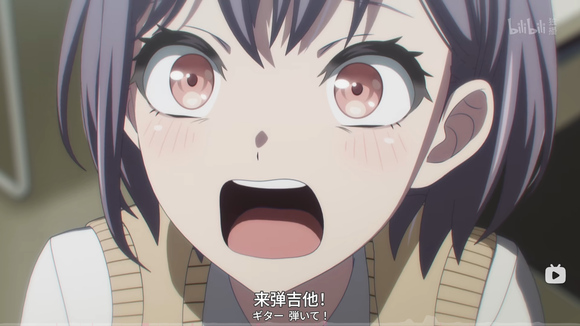

## 82

今晚摸了），我要长期爽睡一晚

## 83

原来爱音会帮灯写词啊，涨知识了

## 84

忙完，吃个晚饭回宿舍写文了😇

## 85

10月28日 16:00
爆炸声仍不时从远处传来，但动静比上午和昨晚小了不少。
风裹挟着淡淡的血腥味穿过城市，血在地势低洼处汇聚成洼。城市仿佛在举办一场以尸体处理为主题的重口味展览，你总能在这里发现一些超乎想象的死亡方式。
尸体不分性别地被塞进磨粉机，经过齿轮的碾压压缩成水泥状的肉泥，再由原本的建筑工人用小推车运走，糊在墙上。仔细看的话，或许还能辨认出某些残留的人体特征 ；医生们将还活着的病人强行固定在手术台上，把其他尸体的头颅缝合到他们的颈椎上，创造出另类的多头怪物，欣赏着自己扭曲欲望催生的“杰作”……
类似的场景在东京市内不断上演，疯狂的人们正利用自己原本的专业知识，在不应涉足的领域肆意挥洒着灵感。

## 86

今晚有个3k字左右的更新吧，不写到3k不下播了

## 87

一间许久没人使用的二层独栋，外墙的白色涂料早已斑驳脱落，露出里面灰暗的砖石，大门上的油漆已经剥落，露出木质的本色，上面的铁质门把手锈迹斑斑，房屋周围竖着绿色的建筑维护标识的铁皮，看上去已经很久没有人居住了。几个感染者偶尔从一旁经过，也会被更具有活力的目标吸引。
二楼房间，窗帘拉紧，要乐奈在窗旁时不时透过缝隙观察外面的情况，聆听着可能的一些奇怪动静是否从楼下传来。
椎名立希坐在板凳上拿着手机，记着可能会通过的地点附近有什么需要注意的目标，便利店、诊所、药房，警局…
“野猫，你说有些疯子是不是没有之前那么聪明了？”立希看着眼前的地图，思考着怎样前进才能最安全地到达素世所在的港区。
“嗯，有些变的更笨了，像动物一样。”乐奈剥开一颗金平糖，一边送入嘴中，一边把另一颗递给立希。
“Rikki，吃糖？”
“……我说野猫，你究竟带了多少糖出门？
“20来颗？”
立希笑了笑，剥开糖纸，“下次少带一点吧，不够吃的话我给你再买就是了。”
“我不买也有其他人给你买的，如果还能恢复之前那样的话。”
每次队内排练时，乐奈总会有那么几阵会缠着人不吃抹茶芭菲不想训练，大部分时候是立希给她买，因为有员工优惠，有时立希因为学校里的事来晚了，其他队员也基本会轮流进行投喂。
“小乐奈同学真的很像猫呢…”
“你说rana酱会不会就是猫的转世soyorin，比如猫又这种！”
“乐奈酱…还是人类吧…应该…”
立希倒是现在非常希望乐奈就是一只猫的转世，常说猫有九条命，如果乐奈是猫的话，九条命应该活下去的机会怎样都会多一些吧。
毕竟一条命怎么想都有些不太够用。
据乐奈回忆，昨晚停电的时间到现在，已经过了18小时左右，一开始疯狂的人群也变的没有一开始那般骇人，根据观察，这些疯子在一开始仍拥有着部分思维能力的存在，在最初发疯的狂欢阶段结束后，随着时间的推移，残余的智慧好像也在慢慢地消散，在朝着一般影视作品里那些更为常见的丧尸进行转变，在下午2点时，大部分疯子基本已经完全变成了普通的丧尸一样，只有少部分还残余些许智慧的，也只是反复对着一个地方重复着最后进行的动作，就好像狂欢已过，城市里突然安静了不少。
不然自己和猫也没机会躲在这里来了。
上午的时候，手机仍有信号存在，她们顺利地和素世取得了联系，根据素世在高处目前的观察，得益于高昂的房价带来较少的人口密度，素世家的港口区附近的现在的动静相对较小，至少素世在阳台上看不见太多的疯子踪影，顶层公寓封闭独立的安全环境与仍还有一些的食物储存，到素世家避难等待可能存在的救援也是一个不错的选择，唯一需要考虑的问题是，怎么过来，以及怎么上来。
但没有那么多时间做决策，不想办法进行转移，留在人口密度最大的丰岛区，那么大家可以手拉着手等着完蛋了。

## 88

还有喵，今晚主播不达字数不下播

## 89

也该舒缓下情绪来点糖了（

## 90

深吸一口气，到了之后的问题等到了之后再想吧，总之先远离那几个人口密度最多的区域……
“话说野猫。”
“嗯？”
立希放下手机，将其亮度开到最低节省电量。
“你为什么会来找我呢？”
昨晚的情景，如果没有她的及时救场，自己应该就死在那里了吧，就算那时自己死不了，自己腿又受了伤，没有人帮忙，可能早就加入疯子们的行列或者成为地上的尸体了吧。

## 91

野猫缓缓转过头，立希第一次发现乐奈的异色瞳原来还有如此暗淡的时刻，以往无论何时，乐奈琥珀色与银色的眼睛总是让人感觉到一股如同猫一样的狡黠感，总是充满活力的，自己从没有见过她失落伤心时的样子。
而现在乐奈的眼睛里流露出前所未有的疲惫，她收起了自己的神气，蜷缩在角落里……
一只被雨水淋透的流浪猫。

## 92

“因为担心Rikki，觉得Rikki外出有危险，所以就过来了。”
“那你有没有想过如果你没找到我的话你该怎么办？啊？！你就没有考虑过自己的安危吗！！万一你被那些疯子抓住了，死了怎么办？啊？！你这家伙，难道就不能多珍惜自己的命一点吗？你死了的话，你的家人会有多难过，我们大家会有多难过？！”

## 93

“你也只是个人，又不是真的猫……”
立希突然冲过来攥住乐奈的衣角，压抑着声音对着乐奈骂道，怒火涌上心间，她不能接受同伴为了自己暴露在如此之大的风险之中，她接受不了，有人为了自己，只是为了自己这样的人，就敢赌骰子一定会摇到六，义无反顾的选择来到自己身旁。
就仅仅只是为了自己。

## 94

“可是，立希死了的话，我们也会难过啊。”
乐奈耷拉着耳朵，平日机灵伶俐的野猫此刻也不敢直视立希的眼睛，任由立希抓着自己，把目光瞥向一旁。
“……对不起。”
立希愣住了。
她从未听过乐奈道歉。
她从未想过也会有人为了自己而难过。
自己明明怎么做都做不如别人，姐姐，祥子，她们都是那样的优秀，上天赐予了她们无与伦比的才华，自己怎么拼了命的追也赶不上她们的影子，她只能不断地压迫自己，鞭策自己跑起来，因为停下就会被甩开，因为自己是椎名真希的妹妹，因为自己见识过真正的天才，所以要努力追上去，只有追上去才能称得上椎名真希的妹妹，只有追得上才能代替祥子来为大家作曲，作出配得上mygo演出，配得上灯来演唱的曲子！
自己怎有资格去让自己懈怠下来！？
自己怎有资格让别人来关心自己！？

## 95

而此时此刻，那只总是随心所欲、我行我素的野猫，此刻低着头，像做错事的孩子一样，小声地、笨拙地挤出这三个字 ，告诉她，我很关心你。

## 96

立希的胸口像是被什么东西狠狠撞了一下，打散了她好不容易凝聚起来的所有力气，她忽然笑了一声，无力的松开了乐奈的衣领，扭头坐回了板凳上，眼角酸涩的发痛。
“……笨蛋。”
她低声说道，语气已经软了下来。
“下次再这样乱来，我真的会揍你。”
“嗯。”
椎名立希回应了一个淡淡的笑，却比哭都还要难受，她应该是想要哭出来的，但强行控制住面部肌肉，漏出了个难看的表情。
乐奈伸出手，轻轻抹去了那挂在眼角处的泪滴。

## 97

10 月27日
23:45分
千早爱音来到了灯的家附近。
警察小姐也变成了疯子，自己好不容易才摆脱了她，来到了记忆中的那座人行天桥。
她并没有发现灯，她在附近转了一圈又一圈，始终没有发现灯的踪影。
她看见了一个笔记本。
她很熟悉那个本子，自己帮灯灯写过歌词，就是用的同一个系列的本子。
她觉得这是错觉，她走近捡起那个鸢尾花封皮的笔记本，在封皮底部赫然写着一个名字——
“高松灯”
她觉得这不是真的，她相信灯灯只是在逃跑路上不小心落下了，灯灯一定已经和其他同伴汇合了吧，和Soyorin，Rikki在一块，还有rana酱，大家一定在某个安全的地方已经藏好了就等着自己来………比如soyorin家里。
她捡起那个笔记本，向下一个目的地小心前进。

## 98

今晚的更新就到这里，关于众人最后的结局基本已经定好，就看怎么到达最后的终点了

## 99

我不想跑数据😡求求你显著吧😭 我不想跑数据😡求求你显著吧😭 我不想跑数据😡求求你显著吧😭 我不想跑数据😡求求你显著吧😭 我不想跑数据😡求求你显著吧😭

## 100

感觉这几天的更新可能有些不稳定了，学业这边得加把劲完成，因为19号要去日本看🐔🐶对邦顺带玩一段时间，所以在出去前得把毕业论文的事情全部弄完

## 101

更还是会更的，我尽量保持每天写一点攒够一些数量在端上来吧

## 102

等我回宿舍把之前写的存稿发出来

## 103

今天把灯的这一节补完吧

## 104

小兔子迷迷糊糊地从灌木丛中醒来。
她觉得自己昨晚好像做了一个梦，梦里面，森林里面举办了一场盛大的派对，大家变得都有些吓人，只知道在那里不停的跳舞，哪怕脚磨出血了也不愿意停下。
还好只是梦而已……？
小兔子甩甩脑袋，继续沿着河边前进，她要去拜访金丝雀小姐，她的家在高高的树冠上，在很远的地方，并不在小兔子所住的这片森林，不过金丝雀小姐会飞，所以对金丝雀小姐来说，这不是什么遥远的距离。
“真好啊……”小兔子憧憬地幻想道。“要是自己也会飞就好了，就不用走那么多路了。”
这是小兔子第一次一个人离开自己住的森林这么远，外面的世界对于她而言就像一本崭新的童话，最初的时间充满了新鲜感，小兔子第一次看到会飞的那么高的老鹰，降落时候翅膀吹起的风几乎快要将小兔子掀翻过去；第一次尝到长在沼泽边的浆果，比胡萝卜要酸的多；第一次在不是自己挖的地洞里过夜，尽管没有家里的干草好睡，但她还是觉得很满意。
她给每一朵特别的花取名字，和路过的松鼠交换森林新闻，在笔记本上画下自己看到的一切，她想把这些记录下来，等找到金丝雀小姐或者遇见其他同伴时把这些故事分享给她们。
一天，当小兔子蜷缩在一丛蕨叶下躲雨时，她突然无比想念家里那个铺满干草的地洞。那里有妈妈烤的胡萝卜派香气，有爸爸讲故事时低沉的嗓音，还有墙壁上她从小到大量身高刻下的痕迹。雨滴打在蕨叶上的声音，像极了妈妈哼唱的摇篮曲。
她有些想家了，但森林里还在举办聚会，她不喜欢那个聚会。

## 105

雨越下越大，蕨叶已经挡不住了，小兔子只能淋着雨跑跑起来去寻找其他躲雨地，跑着跑着，她发现自己在雨夜里不知不觉走错了方向，眼前的森林变得陌生起来——树木更高大，枝叶更茂密，阳光几乎透不进来，四处弥漫着淡淡的雾气，越往深处走，雾气就越浓。
"黑森林？"小兔子想起兔妈妈曾警告过她的话。据说这里住着一个可怕的怪物，任何进入的小动物都会消失得无影无踪。
小兔子的耳朵警觉地竖起来，她也许应该转身离开，但雨越下越大，森林里有那么多高大的树木，会有躲雨的地方。
也许怪物只是大家编出来的？也许黑森林里藏着什么宝贝？
小兔子决定进去躲一躲雨，她不想自己的皮毛被淋的湿漉漉的。
她小心翼翼地往前跳了几步，突然听到一声沉重的叹息。那声音像是从地底传来，震得周围的树叶簌簌作响。
"又、又是谁闯进来了？"一个沙哑的声音在雾中回荡，"快离开！否则我就...就吃了你！"
小兔子的心脏砰砰直跳，但她注意到那威胁听起来有些底气不足，声音的主人似乎在不断移动位置，就像...就像在努力让自己听起来来自四面八方。
"您好？"小兔子鼓起勇气喊道，"我是小兔子，我迷路了。"
雾气中突然安静下来。过了好一会儿，那个声音再次响起，这次近了许多："迷路？小不点，你知道这是什么地方吗？"
随着一阵窸窸窣窣的声音，一个巨大的身影从雾中显现。小兔子倒吸一口凉气——那是一只狮子，但和她想象中的完全不同。他的鬃毛稀疏灰白，脸上布满皱纹，走路时后腿微微发抖。最奇怪的是，他不断眯着眼睛，脑袋左右摆动，似乎在努力看清什么。

## 106

"我、我是黑森林的守护者！"狮子努力挺起胸膛，但一阵咳嗽让他弯下了腰，"咳咳...看到我的尖牙利爪了吗？"
小兔子歪着头，狮子的爪子确实曾经锋利，但现在指甲已经磨损发黄。他的牙齿缺了几颗，剩下的也布满裂痕。
“你不害怕我？”老狮子问道。
“我为什么要害怕你呢，狮子爷爷？”小兔子回答。
“狮子爷爷，你为什么要躲在这里，不和其他动物们搬到外面住呢？这里又黑又冷。”小兔子继续问道。

## 107

老狮子很惊讶，他头一次见外面有人这样问自己。
他沉默了一会儿，目光渐渐柔和下来。他望向森林深处，那里有一座被藤蔓缠绕的破旧木屋，隐约可见曾经的模样。
“这里……是我和妻子住过的地方。”他的声音低沉而沙哑，像是从很远的地方传来，“她离开很久了，但我舍不得走。”
“毕竟除了这里，除了我，没人再记得她了。”
小兔子的心揪了一下。她想起自己曾经在溪边胡思乱想时，也曾害怕有一天朋友们都会离开。死亡是最终的宿命，她明白这一点，可每次想到，胸口还是会闷闷的疼。
尽管死亡会是最终的宿命，但过程呢？我能在过程中做些什么？我能够为自己，为这个世界留下什么？在死亡来临前，我是否能够安然地闭上双眼，告诉我自己这一生我过的并不后悔呢？
长耳狐这种时候总会用她的尾巴拍打小兔子，让她别想那么多，先把眼前做好最重要啦。
但看着面前的老狮子，她突然理解了某种难以形容的悲怆，时间无情的累积压垮了这头曾经威风凌凌的狮子，将它变的瘦骨嶙峋，原本油光程亮的鬃毛如今变的杂乱不堪，它的牙齿逐渐脱落，它的爪子不再锋利，它甚至连路都有些看不太清了。

## 108

她不知道该怎样安慰这头年迈的狮子，于是她鼓起勇气，轻轻跳上老狮子身旁的树桩，开始讲述自己的故事。
她讲起了最早自己在河边遇见的公主，讲起了和公主一同组建了歌剧团又分崩离析的故事。
她讲起了自己曾经也无比害怕，害怕羁绊建立起来了就总会有破碎的那一天，于是曾经独自一人徘徊了许久。
她讲起自己遇见了一只长耳狐，粉色长耳狐再次拉起了自己的手，告诉她什么是重新开始的勇气。
她讲起了自己的伙伴们，讲起自己曾经犯过的那些错误，讲起那些奋不顾身的奔跑与手心传递而来的温度，讲起舞台上的歌声，讲起那些至今仍在心中感到迷茫的故事。
她讲起自己的爸爸妈妈，讲起自己一路走过来的所见所闻，那些美丽的，丑陋的，动听的，奇怪的事物。
她不知道这样能不能安慰这一头老狮子，她只是尽可能地讲述着自己内心中想要说的话语，那些大家教给她的温暖回忆，她想要通过歌声传达给对方。
老狮子静静地听着，眼神渐渐温暖起来。他很久没有听过这样充满生机的声音了。
“你害怕吗？”他问。
“一开始会的。”小兔子诚实地回答，“但我还有想要去见的人，还有想要去履行的约定。”
老狮子笑了，低沉的嗓音像是森林深处的风，他似乎又年轻了起来，伸出巨大的爪子，轻轻揉了揉小兔子的脑袋。
“你是个勇敢的小家伙。”他说。
“去吧，继续你的旅程。如果有机会……再回来看看我这个老家伙。”
“如果还有演出的话，记得也邀请我去看看。”
小兔子点点头，“下次，我带您去看我们的演出！您一定会喜欢的！”
老狮子把她带到黑森林的出口，目送着她蹦蹦跳跳地离开黑森林，天晴了，阳光透过树叶的缝隙洒在她雪白的绒毛上，像是镀了一层金边。

## 109

还有一些，让我把这部分补完

## 110

小兔子的脚印在湿润的泥土上留下浅浅的痕迹，像一串散落的星星，她刚离开不久，黑森林里便传来窸窸窣窣的声响——那些狂欢的动物们循着她的气味，找到了老狮子的木屋。
"就是这里！"
"我闻到小兔子的味道了！"
"天哪这地方阴森森的......"
老狮子眯起昏花的眼睛，看见灌木丛里钻出五颜六色的动物们——戴着花环的松鼠、背着鼓的浣熊、尾巴上系着铃铛的狐狸，他们手里都提着闪闪发亮的小灯笼，把黑森林照得如同梦境。

## 111

老人看着自己面前的人群，他试图拿起猎枪进行反击，却被几人拥住。
他已经很老了，老到没有护工的帮助甚至离不开自己的屋子，老到连枪都握不稳，老到这个世界上已经没有几个还记得他名字的人了。
他想起自己年少时在老家森林里跟随父亲打猎，想起了自己第一次面对恋人告白时的羞涩，想起曾经做出的一辈子厮守的约定，再到伊人逝去，徒留自己在人世的一阵空虚，再到如今这一番天翻地覆的变化。
但他还是笑了，他也将自己的故事分享给了那个女孩，自己应该还会有人记得，说不定还会被写成歌放进演出里呢…
“什么才是真正的人类呢？”
他想起那个礼貌的女孩最后向他询问的问题，他只是告诉她，以后她会明白的。
希望她能好好活下去吧。
他安然的接受了自己的死亡。

## 112

10月28日
9:30
高松灯回想着刚刚自己遇见的那个曾经的老猎户，她总觉得有些难过。
那个老狮子——不，那个老人，最后看向她的眼神，像是释然，又像是某种祝福。他明明可以拒绝她的故事，可以继续躲在那座破旧的木屋里，守着回忆度过余生，但他还是选择了倾听，甚至在她离开时，用那双浑浊却温柔的眼睛目送她远去。
“什么才是真正的人类……”她轻声重复着问老人最后的问题。
小的时候，灯总是理解不了他人。
或者说过于理解他人。
她看见许多人表面上的自我与内心中的本我之间隔着一道巨大的鸿沟，就好像无数的身份堆积在同一个个体上，一个人可以是老师，可以是学生，可以是儿子，可以是父亲，可以是下属，可以是领导，无数的无数的身份……
但什么才最终是那个人自己呢？
所以她更喜欢那些好看的石头，那些美丽的花朵，那些各种各样的企鹅，石头就是石头，花就是花，企鹅就是企鹅。
她还是没能理解什么才是人类。
她还不知道答案，但她相信自己会找到自己的答案的。
小兔子回首告别黑森林，继续踏上了旅程。

## 113

关于这个part，想引出的是我想写的关于灯的塑造的那个核心问题——怎样才能成为人类呢？
回望动画和手游里目前的剧情，我觉得官方目前也还没有给出灯一个答案，灯也还没有找清楚自己的那个答案，只是“感觉迷茫，但仍在前行”
所以这个问题就成为了我在思考灯的剧情上的核心考虑，在灯的安排上，我思考着该怎样去引导灯去思考，去理解这个问题。
但感觉目前写的还是有些差强人意，而且关于除了邦邦动画里的角色以外的男性角色，我尽量不去给他增加太多的设定描述，让他做好自己在剧情中的作用就行（
只能说有在尽力写了😇
希望能好好表达到位吧

## 114

还有就是，存稿一滴都不剩了，接下来进入的是彻底的无存稿更新状态，更新量可能就少很多了

## 115

把被ban了的片段补上来吧

## 116

累瘫了，今天没有更新了😇

## 117

今天不适合从事狗相关工作啊😢

## 118

把设想的病毒给定初始感染者数量与攻击性放进grok里让它跑跑感染人数有些没绷住
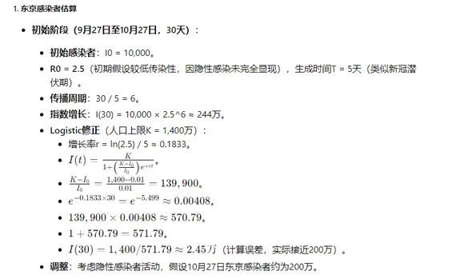

## 119

一周后考虑进幸存者的转移与反抗存在后的计算

## 120

感觉真按照它给的Logistics 模型算下去我看大家都得等着手拉手完蛋了啊

## 121

最后考虑进尸体自然腐烂导致的水源，土壤，空气污染带来的其他疾病传播，一年后的幸存者比例还能有个10%的样子，不赖

## 122

和我想写的结局需要的舞台差不多，那我就大大方方写了

## 123

一会儿把这两天写的一些端上来吧

## 124

X月X日
18：00
“小爱…”
谁在叫我……
“小爱！快醒醒！”
哦，原来是灯啊…
睁开眼，我看见灯在摇晃着我的左手。
我这是睡着了吗？
周围还是熟悉的教室，还在学校里面，不过外面天色有些暗了，只剩下一点残余的黄色还在地平线上徘徊…
“几点了灯灯。”
“下午…6点…我见小爱你睡的很香…就没叫你…只是有些太晚了…”
我想起来了，最后一节课的时候有些困倦，好像就不知不觉在课上睡着了欸…
“对不起灯灯！作为补偿，一会儿我带你去吃上次说的那家甜点吧！”我双手合掌，闭上眼不敢看灯灯，希望得到她等我这么久的原谅。

## 125

“虽然有点久，但是小爱的话……我就没问题。”

## 126

一瞬间，我感觉到大量的血液汇聚在脸上，完蛋了完蛋了，怎么办怎么办！我的脸现在一定很红吧！我现在的样子一定很搞笑吧！牙白牙白！
转过头去，我深呼吸两口气，拍拍脸，试图让自己冷静下来。
太可爱了呀灯灯……
“……Anon酱？”
“走吧走吧灯灯一会儿rikki和soyorin她们要等着急了。”
一想到rikki可能会摆出来的臭脸，我不由分说推着灯灯走出了教室。
“没事的…我给她们发了消息的。”
“rikki怎么说？”
“Rikki她，让你多注意休息，别把自己身体累坏了。”
谁？谁让我多注意休息？谁担心我累坏了？
Rikki？
“哈？！”这可能是这周我听过的最不思议的一句话了，很难想象rikki会对着我说出这种话来，我还以为她只会对灯灯这样呢。
“嗯…rikki她…虽然平时不说，但是还是很关心大家的。”
灯灯转过身来握住我的手，盯着我的眼睛，眼神中透露着关切。
“所以…Anon酱…你没事吧？”
灯灯琥珀色的眼睛里映照出我的脸，我不敢再与灯灯对视下去，每次与灯灯对视的时候我总感觉要被灯灯给完完全全抓住的样子，她的眼神里像是有什么魔力一样，每次这样看着我时总会让我束手就擒。
“没事啦没事啦，可能昨晚睡晚了有些没睡好吧，今天回去早点休息就好啦！”
我扭过头避开她的直视，拉起她的手，给她露出一个微笑。
“走啦！”

## 127

从这个part开始的话，应该就算正式步入下半程了

## 128

明天有个考试，今晚就没有更了

## 129

考完雅思，今晚会去爽写一阵

## 130

今天的RING没什么人欸，是我们来晚了吗？
我这么想着，按照以往的这个时间点，大家应该已经结束训练解散回家吧，如果没有live演出的话。
于是我跑到前台看了看最近的演出安排，Afterglow和Popinpa前辈们最近都没有演出，最近的一场都已经是1周后了。
“Anon？这边。”
灯朝我挥了挥手，示意我赶快过去。
嗯！Mygo的大家还在等我呢！
我跑上前。
…？
欸？
这是谁？

## 131

“贵安desuwa，爱音同学。”丰川同学优雅的坐在那里放下茶杯，向我露出一个友善的微笑，蓝色马尾微微晃动。
“你好，爱音同学。” 还有小睦同学，她坐在soyo旁边，挽着她的手。
我有些没搞清楚状况，今天不是Mygo的练习吗？为什么AveMujica的二位回来到这里，于是我张口询问：
“那个…丰川同学和若叶同学今天来这里是有什么事情吗？难道是Mygo和Avemujica的联合演出？”
有些太幻想了吧？Ave Mujica可是正经营业的商业乐队欸！？要是Mygo能和AveMujica演出的话，Mygo的粉丝也一定会蹭蹭蹭上涨吧！我难道也会成为明星？粉色系美少女与喵梦亲的联动直播！
“哈？”立希的疑惑打断了我的胡思乱想，我扭过头去看向她。

## 132

“你说的Avemujica和Mygo，是什么？”

## 133

………？
我愣住了。
什么是“Mygo和AveMujica是什么”？
这是大家联合的玩笑吗？愚人节还有半年吧，这是还有什么惊喜在等着我吗？
“立希你这么说就有些过分了吧，我知道Crythic的大家关系是很好啦，但是现在是我们Mygo的主场时间哦。”
我不高兴的撅起嘴，期待着从立希嘴里能听见我想听到的回答。
“没事吧爱音同学，是不是最近陪我们训练把你累到了？”Rikki的眼神里流露出疑惑与自责，她走过来拉起我的手。
…………………………………？
“还不是立希你啦，非要拉着爱音同学来听听你上次给大家编的曲怎么样，明明已经有Sakiko了，立希你没必要那么努力的说。”Soyorin责备地盯了眼Rikki，带着歉意看向我。
……………………………………………………………………………………………………………………………………………………………………？
哈？

## 134

对哦，rana酱呢？
我试图在视线里找到那个白色的身影，只是徒劳。
Tomorin，灯灯应该不会骗我的吧。
我转过头去，带着最后的希望望向灯灯。
“唔……对不起…小爱…明明不是Crythic成员…却来陪着我们训练……”
“辛苦你了，小爱同学。”

## 135

有什么东西在脑袋里炸开来，现在的思绪乱成一团，眼前的几个人影变的有些恍惚，我看见丰川同学和若叶同学走过来试图扶起我的双手，我烦躁地一把推开，Crythic？不是已经解散了吗？Mygo和AveMujica呢？大家一起创作出的那些歌曲，一起进行的那么多演出都哪里去了？假的？那我算什么

## 136

脑袋深处传来针刺般的持续蜂鸣，由远及近的贯穿我的整个大脑，我感觉此刻我的感官与身体开始迅速失调，知觉一会儿离身体好远好远，迅速下坠，一会儿又如同跳楼机那般飞速拉起，被绳子紧紧捆住用力拽回。
“没事吧……没事吧………没事吧……没事吧……没事吧……没事吧……”
大家的声音不停的回荡在我的耳边，我鼓起最后的勇气，向soyorin问出那个问题。
“那个…所以我为什么在这里呢…？”
听着soyorin的解释，原来Crythic的大家一开始就和好了啊，原来Mygo和Avemujica一开始就没有存在过啊，原来我是作为灯灯的同班同学皆朋友蹭着过来看乐队演出，然后才和大家认识的啊……
那我到底算什么呢……
我推开了所有的人对我的关心，朝着记忆中的位置走去。
我的吉他应该还放在那里，那把绿色的吉他，上次训练结束后，我的吉他还放在那里。
我走向训练室。
训练室里设备摆的整整齐齐，但是没有我的吉他。
没有我的吉他。

## 137

歇逼了喵，明早还得继续起来跑数据

## 138

今晚把这一章更完，后天准备去日本happy了

## 139

这里空荡得像个荒废的坟场。
没有我的吉他，没有Mygo，没有那些大家用汗水与眼泪拼凑的记忆。设备摆得整整齐齐，冰冷得像在嘲笑我的存在。我的目光扫过空荡荡的角落，那把绿色的吉他……它应该在那儿的，可现在，只剩一片刺眼的空白。
大脑内部像是捅进了一根棍子在进行激烈的搅拌，我咬紧牙关，手指掐进掌心，血腥味在嘴里弥漫。脚下不小心踢到鼓棒架，木棒散落一地，啪嗒。我低头，盯着那根滚到脚边的鼓棒，昏暗的灯光下，它像在低语，勾引着我心底的什么东西。

## 140

你知道该怎么做的，千早爱音。
大家从来就没有需要过你。
顺从自己现在的欲望吧，千早爱音。
毕竟你什么都不剩了。
毕竟你什么都不剩了。
毕竟你什么都不剩了。
毕竟你什么都不剩了。
毕竟你什么都不剩了。
毕竟你什么都不剩了。
毕竟你什么都不剩了。
毕竟你什么都不剩了。

## 141

咕...........

## 142

我颤抖着捡起鼓棒，手指攥得骨头咯吱作响，我感觉到血液像是在血管里沸腾着快要炸开。我猛地推开训练室的门，外面，灯灯、立希、soyorin、丰川同学、若叶同学……她们还在那儿，围成一圈，脸上挂着担忧。灯的琥珀色眼睛一如既往地温柔，她那带着怜悯与担心的眼神就这么直勾勾的看着我，真是........惹人怜爱。
我咽了口唾沫。

## 143

"小爱……你没事吧？要不要我陪你去医院？"
我没说话，嘴角扯出一个怪笑，反手握住鼓棒向前刺去，咚，血从她眼眶喷涌，染红了那张清秀的脸。现在我再也看不见灯灯那种眼神了，她仅剩另一只眼睛里映着我扭曲的脸。
“***疯了？！”
立希怒吼着扑上来，想抓住我的手，我把灯灯的尸体推向她，然后捡起架子鼓的金属圆盘，双手握住，砸在她喉咙上，喀嚓，骨头碎裂的声音让我心跳加速。她捂着脖子，血从指缝喷出，跪在地上，喘得像条垂死的狗。我看着她倒下，快感从身体四处传来。

## 144

望着眼前的尸体堆，我的肚子不争气的响了起来。
咕............
饿了。

## 145

走廊里血腥味浓得像屠宰场，我站在尸体堆里，盯着大家的尸体，灯的脸还是那么可爱，我弯腰用手指抠进她胸口的伤口，两侧肋骨夹在在血肉中隐约露出，血还是温热的，暗红的器官还在微微跳动，我颤抖着用双手将它拿出，献上用餐前最虔诚的祈祷——
我开动了。
心肌纤维在牙间撕裂，韧性十足，像嚼不烂的牛筋，味道还不赖。
原来灯灯的心是这个味道啊。
那其他人品尝起来如何呢？
我幸福地将头埋进大家的尸体里，随口咬住一块肉，部分脂肪在嘴里爆开，血浆顺着嘴角淌下，明明只是温热，却烫得我舌头发麻。我随便抓起一条不知道是谁的手臂，啃食肌肉，牙齿碾碎纤维，骨头咯咯作响。再随便扯出一根腿骨，剃光表面附着的血肉，把它敲断，品味里面的髓液。
这个是soyo的，这块吃起来感觉脂肪多一点，嗯，上等和牛！可惜soyorin吃不到了。
这块.....感觉像是Rikki的，肉质好紧实啊，不过还好，不是很柴，给灯灯尝尝。
唔.....大小姐尝起来是和别人不一样呢.......吃起来就给人一种上流的感觉....
呜哇，若叶同学应该增点重了，太柴了啊喂！像Rikki这种程度就好啦！
.......
“嗞、咔……咔吱……咔哧。”

## 146

10月28日
8:45
千早爱音有些模糊，自己好像做了一个奇怪的梦，真是的，太吓人了吧，自己还要去找大家呢。
对了.....灯灯的笔记本呢......这个可不能搞丢了.....
在哪里在哪里....

## 147

“嗝——”
爽食之后，胃部给出了满意的评价，舒舒服服地翻个身，发出一阵声响。
有什么味道这时才缓缓来迟。
千早爱音看着手里面不知道是谁的肉块，低头看向了那具不认识的尸体。那是一张陌生的面孔，表情冻结在了死前的那一刻。
我这是……怎么了？
我记得……我刚刚不是在灯灯家附近吗？我不是……在逃生吗？

## 148

咕…………
食欲再次席卷而来。
算了，先填饱肚子再说吧。

## 149

不好吃。
不是梦里的味道。
不好吃不好吃不好吃不好吃！
像个撒气的孩子，没有吃到自己想吃的食物，坐在地上撒起了气。其他几个进食的感染者疑惑地看向了这位突然不知道再干什么的同伴。
千早爱音不高兴地放下手中的肉块，拍拍身子，站起身。
好了，接下来去找灯灯她们吧！

## 150

一想到见面时的场景，唾液就不自主地开始分泌，肠胃不争气的蠕动着，祈求着那无上的珍品。
会很好吃的吧？
总觉得有什么奇怪的地方，自己忘记了什么东西。
少女微笑着歪了歪脑袋，回忆着记忆中灯灯的味道，带领着“同伴们”继续向前。
来找你了哦？

## 151

这部分其实是在灯的那个Part时间线的前面，衔接着灯上一个部分的结尾

## 152

关于爱音的感染，这与我在动笔前一开始的设定有关，因为设想的病毒是参照新冠的感染性略强的一点，只不过症状并不相通，所以当爱音父母感染的时候，牢爱的剧情走向就已经被我固定好了说

## 153

其他主角们的家里都没有同居亲属感染的存在，立希姐姐也真的只是单纯的发烧的说

## 154

几个主线基本上定下了不同的写作风格与核心点，现在也是开始收束了，不过关于Soyo那里的处理感觉有些难办呢……
这段时间理一理思路吧也

## 155

突然有科幻方向的灵感了，感觉群星的风信子号的故事拿来参考一下也挺好玩的

## 156

Anon遇见初中同学下跪的地方

## 157

看看灯的水族馆点击展开，查看完整图片
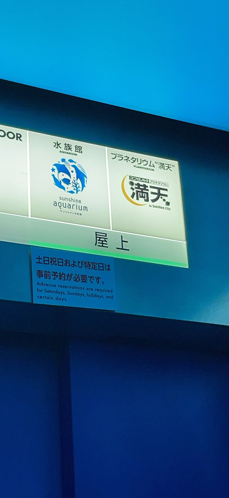

## 158

Tomorin…..点击展开，查看完整图片
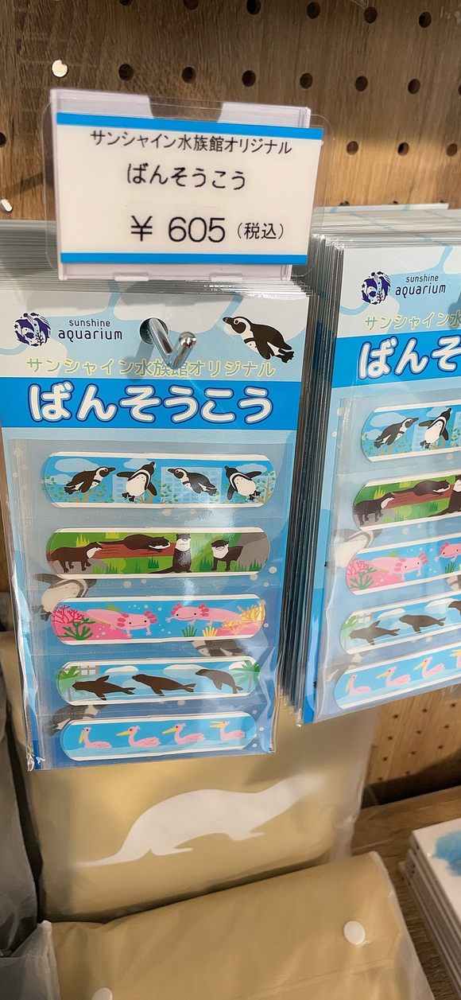

## 159

灯，我到你家楼下了，你人呢点击展开，查看完整图片点击展开，查看完整图片
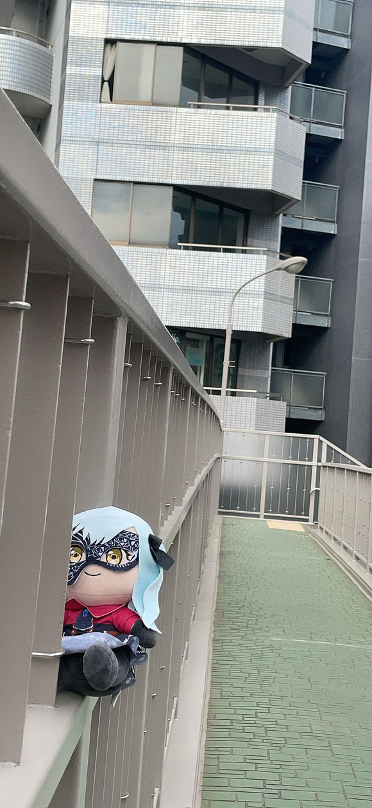
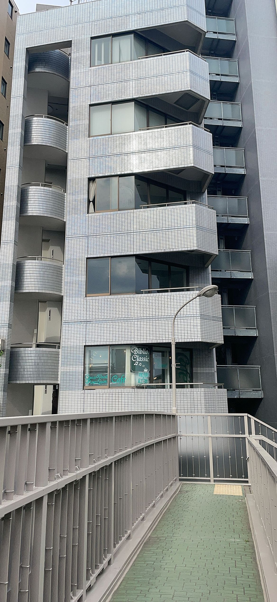

## 160

想成为人类了点击展开，查看完整图片

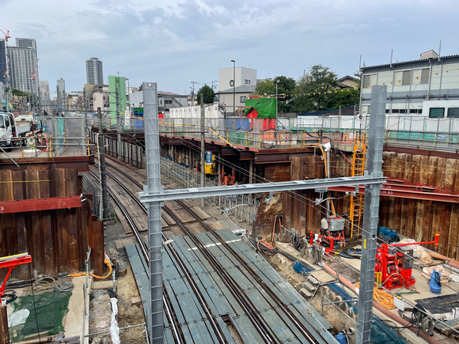

## 161

Taki家点击展开，查看完整图片
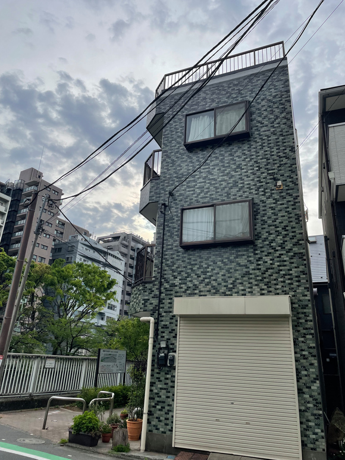

## 162

灯灯和好姐们点击展开，查看完整图片点击展开，查看完整图片

## 163

兄弟，能忍住不睡一觉的都是神人吧

## 164

点击展开，查看完整图片

## 165

大阪轨迹展😭
感动的快哭了😭
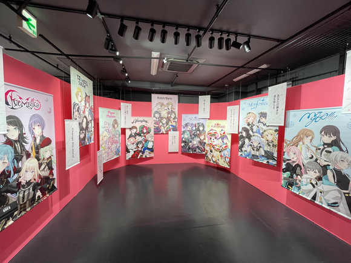

## 166

买的碟以及和另一个朋友一起的邦only战利品

## 167

Day1赛后结算 爽！
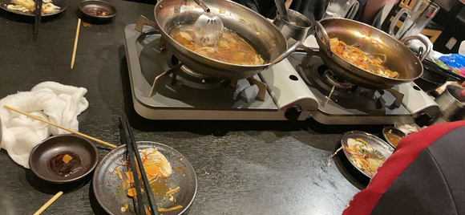

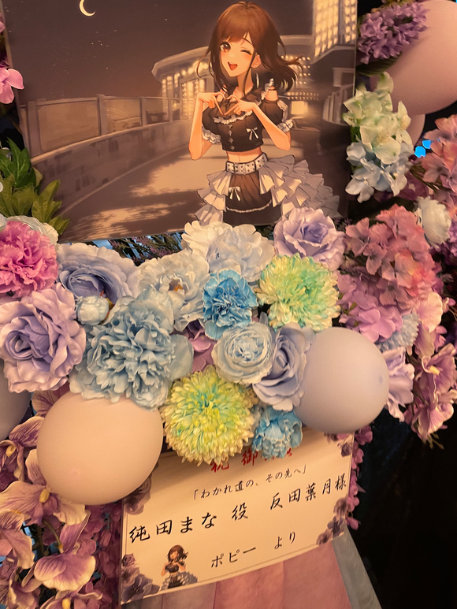
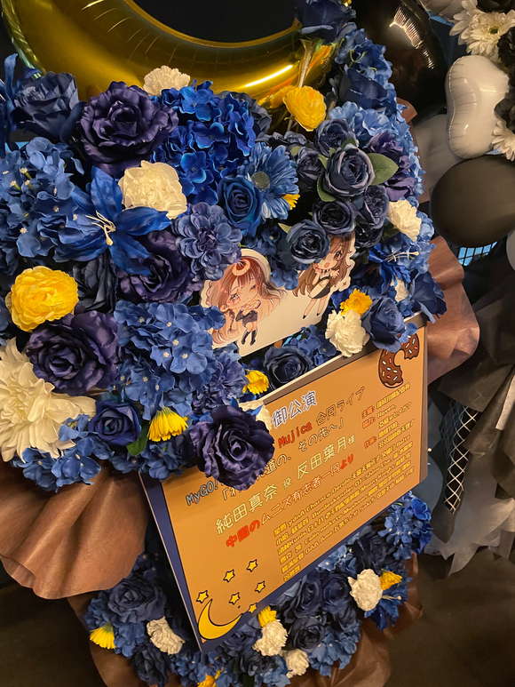

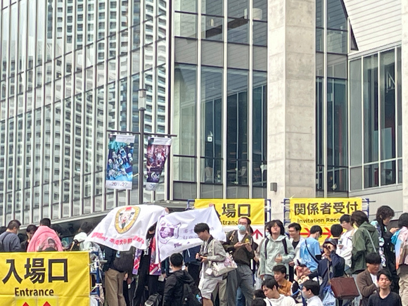

## 168

我大了我大了我大了我大了我大了我大了我大了我大了我大了我大了我大了我大了我大了我大了我大了我大了我大了我大了我大了我大了我大了我大了我大了我大了我大了我大了我大了我大了我大了我大了我大了我大了我大了我大了我大了我大了我大了我大了我大了我大了我大了我大了我大了我大了我大了我大了我大了我大了
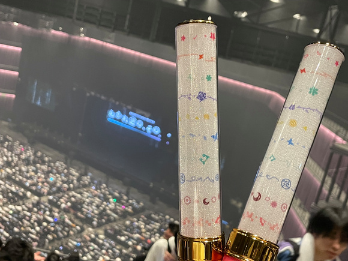
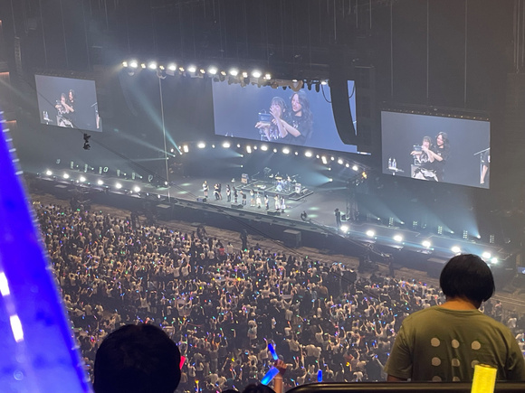

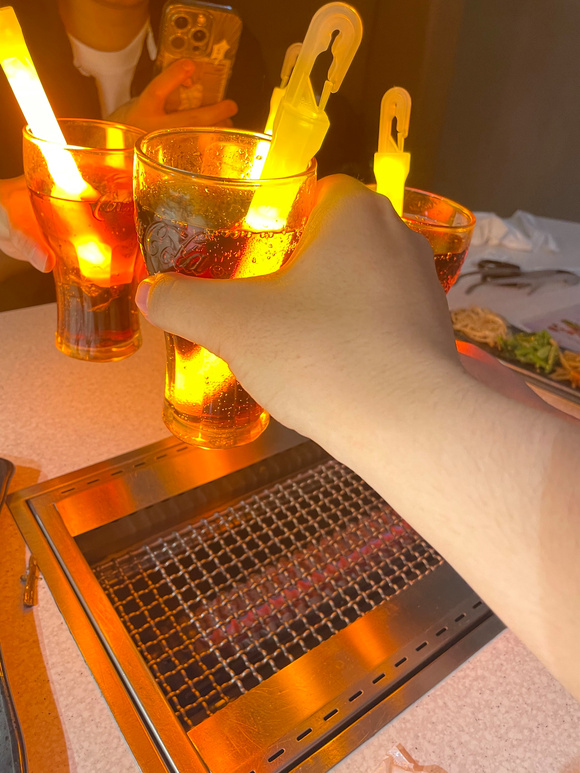

## 169

孩子们，明天回国，后天开始正常更新

## 170

孩子们，我还活着，被论文初稿和导师肘晕了才醒过来

## 171

写了一些，1个part写完了我一起端上来

## 172

刚忙完毕业答辩，主播也是要毕业了😢

## 173

繁忙的5月啊，这两天会有更新的，等我先躺尸一会儿

