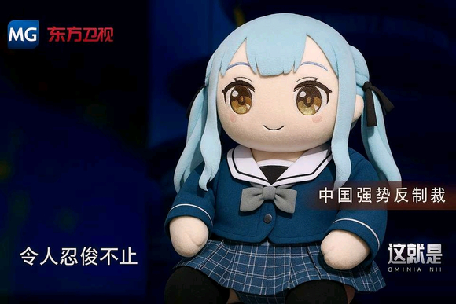

# （补档）在队内当O处理员的小祥

## 1

1.这是基于同名帖子设定下，在原帖子下续写而被干掉的补档。2. futa OOC Sox要素溢出3.我能成为最高的山最远的河吗？被干掉的部分有1.2W字，帖子先放在这里，下班回家拿备份进行补档

## 2

“今天…是周末啊。”良好的作息习惯让若叶睦即使在假期也早早醒来。一个人洗漱，一个人用餐，一个人回到房间。今天没有上课，美奈美酱和爸爸都在出差，Ave Mujica复活后家教补习也少了很多。乐队前几天刚排练完……一想到排练，就想到排练后队长的服务，“祥……”睦的脸开始发烫，双腿不自觉地开始互相摩擦。腹部的衣服鼓起了小小的轮廓。下意识地打开手机，乐队的排班表轮到的是初华，而今天是Mygo!!!!!排练的日子。“soyo…也不会来。”火焰越发高涨，却没有排放的方式。“只能那样了……”睦走下床，从房间角落的玩偶堆中翻出藏在最里面的耳机和小电视。“呼…呼…”呼吸粗重了起来，身体已经意识到接下来要做什么，更加地挺立了。将窗帘拉上，房门反锁，睦坐到电视机前，打开了电视机。睦的地下室有着监控，本来说是为了复盘练习，虽然没人要过这东西。不过在乐队活动丰富的现在，这些录像就变成了睦宝贵的精神食粮……

## 3

摄像头布置在钢琴琴头上方的墙壁，除了上下楼梯的地方一览无余。地下室的中心被刻意的清出一块空地，唯二的沙发面对面摆放就当作是一张床，海铃熟练地从盒子中抽出一张防水布铺上。除了祥子之外的四个人坐在沙发前的四张椅子，所有人的目光都集中在乐队的队长身上。“等我一下。”祥子解开双马尾的发带，因为发现绑着头发事后不好洗，解完头发后倒是和睦的发型有些像。“sakisakisakisakisaki……”主唱在看到祥子腹部美好线条的同时就开始复读名字，已然一柱擎天。“这根本比不过吧。”喵梦大叫。“这是当初约好的。”海铃这么说道。“处理服务当然要紧急优先，所以O起的顺序就是处理的顺序desiwa。”无知的小章鱼当初是这么承诺的。大家没有意见，也就这样延续下来。接下来是内衬，随着几声卡扣解开的声音，祥子的上半部分暴露无遗，两枚顶端点缀樱花的雪媚娘微微颤动。“唔……真是犯规。”鼓手不得不捂着下身，狰狞的巨兽已经要突破束带的束缚，只能狼狈地脱下裤子开始摆弄。“哈…”似乎是被队友的反应感到羞耻，祥子的脸有些发红，接下来的动作慢了许些，鞋袜脱下放到一边，然后是裙子，缝隙带着水光吐露着空气。“没有吗？”“因为海铃说会之后会准备新的，每次都找不到了。”“嗯…这么相信我真是我的荣幸。”海铃强装冷静点头，如果眼睛没有往下瞟就好了。“啊～睦子定力这么强的吗？”武装解放的鼓手靠了过来，“好像你每次都是最后一个呢。”睦没有说话，只是低头。“好了，不要浪费时间了。”祥子打断了喵梦的话语。“行吧行吧。”其实睦一直挺立着，从祥子解发带开始。但是没有人觉得那是挺立，“连祥也是……”电视机前的睦隔着衣服摩擦着。“为什么注意不到……”埋怨的话语，但睦一想到这些，反而更加兴奋了，甚至连小棍都抖了两下。

## 4

之前的内容就补完了 至于后面的祥睦纯爱（？）就得等明天啦

## 5

趁现在大家都在，就先在这里放个点单楼 因为这个故事临近收尾，而志向成为高山远河的我不想只写一个故事，所以大家接下来想看什么可以在这楼下面回复。1.时代背景：新时代（只有鸡狗两团人物）2.哎，欠草爱音，椎名0希（只有爱希祥不是futa）3.三真DLC角色包已加载（真奈、真希、真初华加入可选项）4.同时渲染设置（如果同时点四个人以上在一个故事做主角，请提供一句话的灵感或点子，不然我有点写不来）5.相信弦卷家的药、科技和VR游戏（允许部分特殊规则）

## 6

睦看着电视机，拿起了耳机戴到头上，耳机的配置很好，甚至能模仿音源的气流流动效果。但很可惜睦用不上，磁带里是睦通过各种方式录下来的祥子的话，出于录音条件、后期处理程度的不同，磁带的音质很差，只能说是为了听祥的声音准备的，为了带一点随机的乐趣，每次磁带的内容都是随机打乱在刷上去的。“最喜欢睦了。”“祥，我也是。”“为什么不站在我这边！”“因为…想修好祥。“你知道吗，月之森的学费其实很贵。”“祥，不在一个学校也可以是朋友。”睦一句句对答着录音，那些没说的话，想说的话，至少在录音里，在只有睦一个人的地方，她要说出来，至少那样能留下一点美好的联想…“如果当时真的那么说了…”纵使她们已经回不到从前。磁带不长，内里录音的时间也只到Ave Mujica重生为止。因为后面就很少有有意义的话语，问好、训练…那种话语不是睦想要的。她需要的是独特的视线，而不是谨慎的看护。“我不是琉璃…”睦喃喃道，如果因为美好易碎而难以让祥靠近的话，睦的视线回到电视机里重叠的两人，就算要通过赤裸的丑恶而联系在一起也无所谓。我和祥不该分离。睦拿起磁带，准备翻面重播，但耳机又传出了声音。“要借这么专业的录音室吗？”初华的声音从中传来，回答她的是喵梦“啊…已经开始了吗？算了，这一段就保留吧，免得刺激过头了。”“诶？”睦呆住了。

## 7

感觉那种祥睦间的扭曲感没写出来

## 8

我懒得再补了 到时候全篇写完上网盘吧

## 9

然后各位想要的网盘链接在这里：链接: https://pan.baidu.com/s/1XDZeG5CrDd0i3N__gohs6g?pwd=s3td 提取码: s3td二次传播啊 发到避难所啊P站之类的 都可以 记得带我名字就行

## 10

骰娘的旨意已经确定了，接下来是海希猫，是接在排练睦后故事的时间线 知道立希给C团做O处理的海铃去找立希，碰到正在给猫处理的立希，这样的故事。点击展开，查看完整图片

## 11

海铃的心情不是很好，不如说在Ave Mujica复活后的欣喜淡去后就没好过。队内的气氛越来越奇怪，主唱一点都不演了，鼓手看键盘的眼神也越来越奇怪…至于吉他，吉他的精神健康已经完蛋了。“总觉得这样下去，维持队伍的就不是信任，而是信誉了。”但这不算非常难的问题，顶多以后共享队长，大少女乐队时代这已经不是什么奇怪的事了。困扰着海铃的是另一个问题，“之前Crychic是立希在O处理。”原来立希早就做过这种事情吗？做的程度呢？做过多少呢？为什么没跟我说？为什么要跟我说？海铃凭借自己的理智打断了无尽的反问，“我也不是她们乐队的，不跟我说也很正常。”但随之而来的一个更紧要的问题出现了，“在现在的乐队，她还在帮队友O处理吗？”自己也是去过无名乐队时期的M团的，好像没有发现这样的事，但话又说过来，在那种快解散的情况下也不会有这种活动吧，难道有人用O来解决乐队分歧吗？不可能吧。（灯：并非不可能）不管怎么说，还是要想个办法确认一下，这么想着，海铃从课桌里抽出一盒奶冻，起身向前走去。

## 12

海铃气势冲冲地走了过来，立希意外地没有躺在桌上睡觉，只是翻着课本不知道在想些什么。海铃熟练地将奶冻放在立希头顶，立希头一甩，手接住掉下来的奶冻，“有事？”海铃立刻卡住了，她只想着要知道，根本没想过要问什么。“你现在有帮队友做O处理吗？”好神经的问法啊。“你有O经验吗？”听起来像O骚扰，“能和我坦诚相见吗？”能说出来这句话的我社会生命就已经完蛋了吧。海铃的主机飞速运转，然后过热死机，“中午…我们一起吃午饭吧。”“哈？”大鼓队员看着海铃匆匆赶来，然后呆在原地，最后发出人机发言有点迷惑。“没问题。”但还是答应了挚友的请求。花砖的上课时间从来不重要，很快就到了中午。海铃又发现了一个问题，她喝蛋白粉，立希吸果冻，两个人在座位上五分钟就解决了怎么找地方单独聊天啊。不过这个问题随着立希拿出来一个饭盒而消失了。“去哪里？”紫色的眼睛盯着海铃，气色这么好？最近没有熬夜？海铃觉得现在的立希有十分甚至九分的奇怪。“老地方吧。”但现在重要的地方还是找一个没人的地方。“所以，你想找我做什么？”立希闭着眼睛坐到长椅上，打开饭盒吃了一口。立希漂亮漂亮，海铃一边欣赏鼓手的脸，一边开始扯淡，“就不能单独找你一起吃饭吗？”“下次说这种话时记得去食堂买一份面包而不是继续喝你那蛋白粉泡水。”“哈…好吧，我是想跟你了解一下C团。”海铃尝试迂回攻击。“C团？祥子又整什么活了？还是睦出事了？”“呃…某种程度上来说祥子确实整了个大活，但不是这些。”“没想到你还会对陈年旧账感兴趣啊…那你问吧，我知道的都会说。”“那我就说了。”海铃觉得铺垫的已经足够多了，“我是想问…”没问出来，“rikki。”一双手从长椅背后伸出，挽住了立希，白发的猫头靠在立希的肩膀上，“想要。”“这事你去找爱音啊，不是说好了…”“就要立希！”“不行！”“想要～”“那你等等…”“现在。”乐奈两手并用，想要把立希拖走。立希虽然能挣脱，但这小猫闹起来就不是一时半会能完事的了。“哎…海铃，便当盒帮我收着我一会就回来…”海铃看着立希从视野里消失，对猫更加讨厌了。

## 13

异色瞳的猫把鼓手拉到教学楼副楼旁的小树林，抬着头盯着立希。“live。”“最近没有live的排期。”“新歌。”“…最近，没有编曲子。”“rikki，骗子，补偿。”乐奈有点生气，眼前的宿主有拖延交易交付的趋势，这种不正之风一定要惩戒。“好好好，抹茶是吗…”立希从口袋里掏出一袋抹茶糖球，挑出一颗准备投喂。“抹茶也要。”乐奈头一伸，在立希没反应过来之前就连带着一截手指吞到了嘴里面，小巧的舌头一转，在鼓手带茧子的指节上擦了一下就把糖球卷到了嘴里面。“这么急干什么。”大鼓队员还没意识到危险，“rikki也要。”白猫含糊地说了一句，继续扑了过来，头凑到鼓手面前，鼓手只感觉到嘴唇上温凉的触感，接着就是一条灵蛇扣开牙关，乐奈的舌头主动缠绕上来，而鼓手只是被动的配合，糖球在舌头之间被摩擦挤压，化作甜滋滋的液体混着口水被双方吞下。白色的小猫还不懂换气的诀窍，双方的接触很快结束。立希连忙退后两步，“行了行了，赶紧回去吧。”鼓手这么说着擦掉嘴边流出来的口水。猫猫开心地摇摆着身子，尚不满足，“rikki，还要。”“没了，都没了。”被突然袭击的鼓手心情不佳，转身就打算离开。“rikki，处理。”乐奈从背后抱住了鼓手，变硬的小猫尾巴在立希的腰上磨蹭。“下午排练去找爱音去。”立希尝试掰开猫爪，但没得到满意回答的猫咪抱得更紧了，还有向上探去的趋势。“呜…”鼓手叫了一声，乐奈吐着舌头在立希的后颈游移，“rikki。”乐奈低唤了一声，“立希，只要立希。”犯规的语气终于打开了立希的心理防线，“啊啊啊啊，好。就这一下，下不为例。”

## 14

“提着。”立希让乐奈拎起裙子的下摆，自己再把里面一拖，猫尾巴就暴露在空气中。立希深吸一口气，两只手像抱乐器一样将尾巴拖着，大拇指的指甲擦到尾巴变色的连接皮内微微旋转，拇指上的茧子刺激乐奈打哆嗦。剩下八根修长的手指也没有停下，学过小号的立希熟悉气孔操作的指法，八根手指不规则地在尾巴上起落，或点或蹭或挑或压。乐奈只感觉尾巴在不断的变痒的同时还在不断的挠痒，最关键的是挠痒只挠到一半，传达舒爽的同时反而变得更痒，爽感痒感焦躁感像雪球一样越滚越大，意识到不对的小猫不自然地摆弄着手脚，扭捏地喘息，“ri…rikki…”大鼓队员没有听见乐奈的哀鸣，就像是调整乐器的匠人要把修理过的乐器拿来试音一样，立希看着跳动的尾巴觉得是时候了，于是她缓缓地朝着尾巴中间的管子吐气。这对乐奈来说更了不得了，像是有一根接着一根的羽毛飘到管子里，管子里也痒了起来，被把住要害的小猫根本逃脱不了，内外的痒意交融叠加，乐奈只感觉自己过了好久好久，雪球压到乐奈的身上，爆开的快乐埋掉了整个身体。乐奈失去了对自己的自制，水管喷涌而出，只是吐着舌头喘息，痒痒的感觉一扫而空，让人感觉到舒爽和满足。但一想到刚才那种痒痒的感觉，乐奈的心头就好像有手指轻挠了一样，毛毛的，痒痒的，令人在意。对立希来说体验就很差，一口气还没吐到一半就被水喷了一脸，甚至有几滴溅到嘴里了。

## 15

怎么都没人说话了 是觉得没有意思了咩（）

## 16

小联想：1.立希蒙着眼吹过真希的小号，但实际上声音是真希吹出来的，所以一开始以为自己小号吹得很好。2.脑子想着海铃一手脱领带一手调整弹道俯视着立希说台词。

## 17

立希扶着海铃的肩膀，开始缓缓上下移动。身体开始习惯进出，涓滴开始从接口渗出。被填满的舒适感不断传来，鼓手的脸开始发红，微微张开的嘴频繁喘气。喜欢的人之间会做这样让人舒服的事吗？那…是不是只要让人舒服，谁都可以被喜欢吗？这么想着，立希对身体的控制就不由得涣散几分，下坠的力道就更大了。“呜！”突然加大的刺激让海铃双腿下意识伸直绷紧。虽然海铃乐队经验丰富，不管是服务和处理都做了不少，但这次还是蛮特殊的，第一次不带装备，也是第一次以这么被动的姿态对战。看着立希为了自己辛勤劳作，依赖和满足感油然而生。也正是因此，当立希问出问题时，她一点都没有思考，直接就说出了自己视角下的真相。“海铃…你技术这么好，一定经验很丰富吧。”“啊…乐队里这种事很普遍的，但是和你（这样）是第一次。”原来是这样啊…没什么特殊的。鼓手的紫色瞳孔一暗，自以为满分回答的贝斯则根本没注意，反而是把精力用到了双方对接的配合上面。这样吗…不应该想那么多的。立希垂下眼，两人的双手相扣，心的朝向却不知道偏到哪里去了。“rikki。”白色的猫头突然从器材室另一边的窄窗冒出。乐奈不知道怎么弄的，一阵蠕动，整个人居然就能从半开的窗里翻进来。“在做什么。”小猫看着两人叠放在一起，虽然不知道是什么事情，但猫尾巴已经本能的竖棍蓄势了。“在做喜欢的人才能做的事。”海铃挺腰抱住立希，尝试以一种通俗易懂的方式宣告主权。“我也喜欢rikki。”猫不懂，但猫想加入。“野猫…不，乐奈，你为什么喜欢我呢？”立希干涸地发问。乐奈听得出来，这个问题是认真的，所以要认真回答。“立希，（创造了归宿让我）很舒服。”啊…果然是这样吗…“那，野猫，现在只有后面了。”立希语出惊人。我会让你们舒服的，所以至少现在，喜欢上我吧。

## 18

要注意啊 括号里的是解释意思 其实没说出来

## 19

“哈啊？”海铃被这超展开折了脑子，这不是两个人互诉衷肠干柴烈火的剧本，这又是发生了什么。“等等……”海铃刚想说些什么，立希把嘴用小臂一抹，直接吻了过来，鼓手的手钳制住海铃的手臂，对方的舌头叩到牙关也不硬闯，只是在牙床摩挲。现在不是说话的时候，海铃只能被动的张开嘴迎接。“rikki，坏。”乐奈看着立希把海铃摁在地上O，一点新手指示都没有，有点生气。“有趣的女人被分走了。”乐奈跨到立希背后，弯腰趴到鼓手的背后，两只手握住了立希的两边，三根手指掐住关键圈，用指尖快速反复扫过圈中心的目标。看着突然一顿的鼓手，乐奈满意了一点，“rikki，教我。”“哈啊……”立希在吻的间隔中抬头会看，几根头发被汗水和奶油沾在鼓手的脸上，眼角下的痣更是点睛之笔，但最让乐奈感到漂亮的地方是她的眼睛，像是在燃烧一样的，紫水晶一样的眼睛，一股奇异的魄力蕴含其中，“这里。”立希动了动身子，让乐奈的尾巴找到入口，“嗯……”乐奈感受到后门温暖而狭长的触感，后面的动作无师自通，以两座山峰为把手动了起来。“立希。”终于找到机会的海玲想要说些什么，但是立希根本没给她机会，直接把头凑到海铃的耳边，“是不够刺激吗？那，这样呢？”温热的吐息扫动着海铃的耳朵，立希的腰开始微微旋转，这给小海铃又是天翻地覆的刺激。“不……不是……”海铃在这样半自愿的情况下缴械了，而想说的话也没说出来——立希继续吻上了海铃，不给贝斯一点喘息的空间。

## 20

乐奈有点不理解，不理解立希身上的气息，那种湿淋淋的水腥和霉味。好像依旧有趣，但有开始奇怪起来。乐奈轻咬了一口立希的肩膀，立希一点反应都没有。是自己有哪里做的不对吗？绿瞳的女人说这是喜欢的人之间才会做的事情，而且很舒服。是我不够努力，没有让立希舒服吗？我不如那个女人吗？一想到这里，乐奈就打起精神，自己要从那个女人手里抢回Rikki。小猫不懂具体怎么实现，但只要根据本能来就好吧。猫尾巴在后门进进出出地更快了，两只手在立希的胸腹上游移。牙舌就没有离开过立希的肩膀，舔舐着那淡淡的令人安心的微苦味道。立希的身体回应着小猫的行动，随着小猫的移动时紧时缩，在想进去的时候通路大开，在想离开的时候依依不舍。不会忍耐的小猫很快就到了极限，往身下的泡芙里再塞进自己的猫奶油。“Rikki，喜欢。”喜欢的东西就要说出来，想要的东西就要主动去做。猫的世界就是这样，所以乐奈从来不会掩饰自己的言语和动作。而且，眼前的家伙从来不会拒绝自己，她会满足她的要求的，虽然要等，虽然会走偏，但猫等得起。但这次不一样了，在乐奈说完之后，那种奇怪的腐烂味道更重了，就像是坏了一半的苹果，但乐奈只能看到完好的那一面一样。是我做错了吗？好像有什么珍贵的东西在悄悄溜走，不行，绝对不行。“Rikki，好奇怪……对不起。”乐奈有点不知所措，因为她不能像往常一样直接看到问题的本质，只是看到不断恶化的结果，整个人抱在立希身上不敢动弹。“不能，不能再这样了。”海铃又一次挣扎，被前后夹攻的鼓手疲于应付，终于让海铃的双手恢复了自由，“这不对。”海铃用双手抵住了鼓手的肩膀。两个人都停止了动作，让作为夹心的鼓手有些惶恐，搞砸了吗，就连取悦别人都做不到吗……自我否定和厌恶像烂泥一样攀附而上，简直要吞没全身，“是……是我做的不够好，你们不够舒服吗？”“不是这样的，立希同学，你现在的状态不对劲。”“我……我不知道怎么样才是对劲的啊！”鼓手的大喝吓住了两个人，“对不起，对不起……”立希哽咽了起来，双手捧起海铃的脸，“告诉我吧，告诉我你想要我怎么做，我都会做的。”湿润的液体打到贝斯脸上，“不要讨厌我，会让你舒服起来的。暂时的也好，就算骗我也好，至少现在，请你说喜欢我。”

## 21

没有人的话今晚到此结束。

## 22

“不对，不是这样的！”海铃的智商终于重回高地，“我不是因为这个喜欢你的。”“但是海铃，你喜欢的是什么呢？”立希幽幽开口，“一个志同道合的朋友？能让你依赖、出谋划策、互相诉说的臂膀？还是一个能让你享受的O友？”海铃看到了一个熟悉的表情，那个表情她在镜子里曾经看到过，在那一个人上台的那天，微笑的悲伤。“你想要的这些我都可以做到的，这样，就可以让你喜欢上了吧。”立希反手把猫头掰到肩膀旁，转身一吻，引导着猫舌吮吸着津液，配合着乐奈的动作而动作，两人之间拉出一道透明的丝线，“乐奈，我知道，你想要的是一个归宿，需要live，需要空气，我会给你的，我会努力的，不要抛弃我。我知道的，你更喜欢像灯那样有趣的女人。”鼓手喘息着，“交易会一直继续下去的，不要离开我……”我放弃了，如果我做的不够好，就把“椎名立希”换成一个足够好的人吧。“立希，笨。”乐奈终于明白鼓手别扭在哪里，以为是谁都能用live和抹茶芭菲把自己骗走。乐奈才不笨，只有立希愿意陪乐奈，愿意听乐奈的音乐去改曲子，让乐奈能有很多的live，和有趣的女人们在一起，愿意关心乐奈。立希就是立希，是不能被换掉的。必须要让立希知道这点。“要教会立希。”乐奈给海铃甩了个眼神。海铃神奇地理解了对方的意思，她用手抹了一把脸，“可能刚才我的表达有点问题，现在，我要换个方式表达一下。”这么说着，前后两人同时用力，将立希架了起来，考虑到小猫的身高，海铃还特意给鼓手翻了个面。卧倒的三明治变成了站立的三明治，但是夹心还是那个夹心。

## 23

猫的视角还是难写 希望不会觉得OOC

## 24

现在这么写最大的问题是以后写不出来海祥了 以后要点海祥的得自带灵感。

## 25

“rikki，喜欢有趣的声音。想保护灯，但不是喜欢。”“为什么不算呢？我离不开灯。”立希摸着猫头。“只有在Mygo!!!!!里我才感觉我是我而不是其他什么东西，就跟你要呼吸一样，我放弃不了。”“别人能保护灯的时候，立希会很开心，爱音和灯在一起的时候，立希真心祝福了。”“我对每个队友都一样的，你要是有人真心喜欢我也会祝福你的。”“不要祝福。”乐奈抬起头来，直视着立希，“但是我只想要立希，想到立希被别人带走，心就很痛。现在分享rikki，也有点不开心。”猫说完之后就把头埋到对方胸里，立希只能感觉到前面越发激烈的动作，看到乐奈通红的耳根，她抱住了乐奈，“但是我…”“立希同学。”立希想说什么，但是被后面的手直接扯住了嘴，整个头被掰偏过来。立希看到海铃愤怒的绿瞳。“也听听我这个"别人"的几句话呗。”这家伙生气了，认真的。

## 26

“立希，我知道你肯定又要说哪些配不上不够好的烂话。”“乐奈吉他那么好，Ave Mujica的Timoris作为职业乐队一定也有很好的前景吧。”“嘿……”海铃气笑了，“笑什么啦，我只是觉得……又更好的选择，那就不用选我吧。”“那你把你姐介绍给我吧。”“呜……你什么意思？”吉他和贝斯开始逐渐磨合，运动逐渐有了规律，一人进的时候另外一边就出，鼓手也被这节拍逐渐进了状态，说话时不时喘气。“我还问你什么意思。按照你这说法，你是不是喜欢你姐姐呢？毕竟你觉得你姐姐最好了。但你喜欢你姐姐吗？”“我……”海铃用两根手指捏住立希的嘴唇，“你憧憬你姐姐，但是，这和喜欢……不，这和爱是不一样的。爱是没有更好更坏的说法的。只有有和没有两种说法。”海铃推了推猫，调整了两人的节奏，现在两个人开始同时进出，进到深处时甚至能感觉到另一边的触感。这就苦了立希，前后同时被大力出入。耳朵肩膀脖子嘴巴，被狼和猫可以说是啃得一片狼藉。“呜，呃……等等。”立希的求饶0人在乎，“我爱你，如果你分不清什么是爱、怜悯和喜欢，我们会慢慢教你。”“Rikki，爱你。”四只手摁住了立希的头和嘴，让立希只能保持一个仰头吐舌的动作，三只舌头交错缠绕，两根铁棍冲进最深处释放出自己的内容。“哈…哈……这个告白……撒雅库！”立希瘫倒在体操垫上，用手臂挡着脸。“能给我一点时间吗？”“可以，五分钟后我们再来。”“哈？五分钟？”站着的两人投来奇怪的目光，“立希同学，这连午休都还没结束，你是不是一次就结束了？”猫猫深以为然的点头，“Rikki，不够。”“哈？”鼓手的质疑和求救震耳欲聋，然而除了两个贪婪的分食者外无人知晓。

## 27

第二个故事《最糟糕的告白》7.9K 也就到这结束了。可能感情描写写太多导致黄色含量下降了……下次会注意，那么有没有人有点单的想法呢？没有的话就先到这里，然后等待骰娘下发新的旨意。另，这个全篇也上网盘了 还是前面的那个链接

## 28

没人点单的话我就摇骰子了。

## 29

哦耶，睦睦的祥。又到了本世界观不可不尝的欺负小睦环节点击展开，查看完整图片

## 30

由于五一周前工作比较忙 也是睦后排练故事后面的时间线 我就先记下灵感 初华被真奈和另一个初华打晕带走了，所以祥来看睦。然后看到小睦在电视机前晕了。就帮小睦收拾整理。但是小睦在接触不久就醒了，还有反应了。祥子也看出来了，就一边在洗澡换衣服睡觉的时候调戏一边在睦耳边假装睦没醒那样说话。睦就只能忍着不敢动。最后在祥子的嘘嘘声中装不住去了。变成了听到祥子声音就没法拒绝的样子。 然后这条线下去就是海睦喵，睦想着自己这样是不能给祥幸福的（听到声音就去了）向海喵请教 海喵说要进行针对训练进行气味 声音还有锁的play 最后成功给睦加了两个次级管理员（一级是祥）然后再往下就是团建的时候被三个管理员各种命令的故事。

## 31

在一个任何人都知道的阁楼上，就是祥子的所在之地了。祥子的同手同脚被手铐高举铐住，两只手铐外面则是一个更大号的手铐把四肢和阁楼的竖梁铐在一起。脸上带着眼罩，全身被金毛大狗掠食，微微鼓起的肚子和前后门流出的液体可见初华卖力地耕耘。祥子唯一能做的，也就只有从口中发出不成器的喘息，以及微微拉扯手中另一端系在初华脖子的项圈做出鼓励意味多于惩罚的反抗。“哔哔--哔哔--”门铃声响起，金发的偶像终于从神明胸前抬头，“啊，是点的外卖到了吗？”初华起身暂时解下了项圈。“祥子等我一会哦，姨姨一会就把午饭喂给吃，嘴对嘴的～”做不出任何反抗的祥子只是哼哼两声，总比早餐把果酱涂在自己身上吃好。穿衣服的声音，下楼的声音，祥子开始辨别声音的来源，开门的声音，“是外卖吗？啊！”问候的声音，初华的惨叫声…嗯？惨叫声？难道是有狂热粉丝线下开盒？还是有什么行凶的罪犯。得快点求救。祥子开始尝试挣脱手铐，两个人的脚步从远至近。初华买的手铐质量怎么这么好。脚步声已经一前一后的上楼，完蛋了，现在只能希望只是要钱吧。“钱包在卧室的第二个抽屉里，我们什么都不会说出去的，放过我们desuwa。”脚步声停下了，然后是两个熟悉的笑声。祥子的眼罩被摘了下来。“老姐玩得这么花吗。”一个长发，皮肤带点麦色穿着黑色T恤的初华玩味地笑着，“啊…是初华啊。”眼前的少女正是偶像的妹妹，不过姐姐和妹妹都叫初华什么的，还是有点奇怪…算了，她们自己没意见也没什么好说的。“话说你怎么来了。”“当然是…”初华拍了两下祥子的屁股，还想说什么调笑的话，但另一个人出声打断了，“当然是来找小初啦。”真奈拿着从初华身上找到的钥匙帮祥子解锁，“真是的，明明问她周末有没有空的，看来那时候肯定满脑子都是祥子你了。”感觉这个时候说什么都很尴尬，祥子干脆没有接话。“行了。”黑发的偶像把祥子身上的锁全部解开，“这个周末她就是Sumimi的小初咯，不用给她留晚饭了…初华！”真奈招呼了一声，妹妹从姐姐的卧室里匆匆跑出，口袋里鼓鼓囊囊的。两个人把被物理催眠的金发偶像架起来就告别了。“初华…祝你…幸福desuwa。”回想着初华卧室里的充足装备，祥子最后也只能憋出一句祝福。

## 32

深夜补一个小点子吧 真奈喜欢两个初华把剑一前一后搭在她肩膀上，然后她闭着眼睛去猜是谁的。猜的时候在肩膀 脖颈和耳旁的摩擦感让她很兴奋。

## 33

于是祥子在一个人吃完外卖之后就得到了宝贵的空闲时间。乐队复活后的琐事诸多，课程也不能落下，至于空闲时间则是被队友们的O处理排班表分割。在齿轮转动的时候尚且不觉得，突然松懈下来就感觉，“之前过的是什么日子desuwa…”祥子数着日程表，感觉自己已经变成围着乐队打转的驴了。“要…要好好趁着这个机会享受。”祥子站了起来，在阁楼上打转，“出去玩吗？但是若麦每次都拉我去各种网红地点，没什么没去过的地方了…吃点好的？初华虽然不会做饭，但是冰箱的食材和外卖的品质也没有差过，而且海铃总是看着我吃自助然后自己不怎么动…”祥子重新躺了下来，“好像也没怎么缺什么desuwa…”浪费宝贵的东西是可耻的，祥子打工留下的珍惜性格蠢蠢欲动。“…去见睦吧！”祥子坐了起来，已经很久没有见睦了——不带任何目的、没有任何需求，只是为见而见的见面。这么想着，祥子从旁边的抽屉里翻出一枚黄瓜花发夹。“这还是和初华去商场扭蛋机里抽出来的。”睦看到我一定很惊喜吧，这么想着，祥子出发的脚步都快了几分。

## 34

“我想见睦。”“哦…在卧室吗？不要紧，我自己去叫她就好了。”“睦？”祥子谢别了女仆，来到卧室的门口。敲了敲门，没有反应，扭扭把手，没有上锁。“我进来喽～？”祥子打开房门，探头去看，屋子里采光良好，陈设整齐，除了角落里玩偶堆旁边的电视机和躺在电视机前面戴着耳机的睦…好像没什么奇怪的？但当祥子走近时却发现了端倪，淡淡的O液味道，满是湿痕的衣服，以及电视上播放的前几天排练录像，还有脚旁那个祐天寺掉包的磁带。毫无疑问，喵梦跟自己说的那些十有八九都是真的。“哎…”自己的姐姐什么时候变成这种变O了，自己居然都不知道。还是说，是因为自己才变成变O了呢？祥子不知道，只是将睦以公主抱的姿势抱了起来，“要好好收拾一下呢，睦也真是大胆desuwa，也不怕被发现。”就算睦变成了什么样子，我也会接受的，毕竟，这是身为半身的职责。看着睦恬静的睡脸，祥在脸颊上轻轻留下一吻，看着睦被打湿的衣服，又想起那天被泡的满满的鞋子，羞红了脸，“明明在我里面量都没有这么多，难道比起来说更喜欢那些东西吗？”睦的身体不可察地抖了两下，没有回应。

## 35

睦其实在被抱起来的时候已经醒了，“祥怎么来了…全都被看见了…”自己变O般自娱自乐的事实人赃俱获，就连睦也闭上了眼睛。在祥面前当场承认什么的，绝对亚达！似乎只要不睁开眼睛，感觉到的一切都只是一场梦。但无论是身体感受的柔软触感，还是一波又一波冲到鼻子里的薰衣草味道都在证明这是现实。小睦棍已经在粘腻的布料中竖起，“希望祥不要发现。”睦这么想着，尽力装成睡着的模样。如果耳根和脸没有红润起来，睦棍没有开始一下一下挺动的话，睦应该是能演出睡着的模样的。“啪嗒啪嗒”睦感觉到自己移动了一阵，然后被放到什么柔软的东西上面，应该是床。 “果然还是要先脱衣服desuwa。”睦听到祥子的声音，放松了对肢体的控制——要是发现自己肢体僵硬不就暴露了？两只手被向上高举平放，摆成了一个一字形。睦穿的是连衣裙，所以要从上往下把衣服拉起来，温暖的手在脖子附近绕了一圈，感觉有点痒痒的，但睦忍住了，松开了脖颈后的绑绳，祥子提起两个袖口一拉，衣服就被上拉了一截。“呜…”睦悄悄地呜咽了一声。“诶，怎么这么难脱啊。”祥子的疑问声传来。原因正在于睦那半干不湿的衣服已经粘在了小小睦上。已经坚硬的小睦头自然在成为了脱掉衣服的阻力。睦棍被向上的吸力突然这么一激，随后慢慢回落的衣服重新裹到棍子上面，布料的纹路和触感在湿润的环境下越发明显，连睦也没有忍住声音。

## 36

-小点子 关于称呼-对于三角姐妹的称呼，其实有点微妙的错位。祥子会叫姐姐初华，妹妹小初，而真奈会叫姐姐小初，妹妹初华。所以当两个人都在的时候，不管喊哪个称呼都会让两只金毛回头，在看清是谁喊的之后一只欢快地应声，一只自觉回头。在妹妹还没留长头发的时候也有故意两人交换/一起应声/一起忽视的小小恶作剧

## 37

祥子好像终于意识到要先对下面进行整理，两只手从上面抽离开来，在肢体接触中有意无意地触摸了侧肘，腰部，大腿。若有若无的摩擦感让睦感觉有点发痒，想要把腿合并在一起扭动，“祥还在…”睦的理智克制住了本能的欲望。然后就是衣服下摆被掀起的感觉，慢慢地拉动反而让剩下纠缠的布料为之一紧，带来的刺激更强烈了。“精神头真好呢。”睦感觉到有什么柔软的东西弹了弹自己的棍子，木棍已经习惯了布料的触感，因此在衣服被拉走的时候反而有不一样的感觉。木棍就像蜕皮一样和裙子分开，就像是有什么东西缓缓扫过小小睦，有点凉凉的刺激感。睦的双拳慢慢握紧，想用这种方式转移注意力。还好祥子的手脚还算麻利，裙子很快就被脱了下来。“结束了…”睦庆幸着，但是她很快意识到这太早了“接下来就是内衣了desuwa。”睦只感觉一双手环抱住自己的腰，然后整个人翻了个身，其他都还好，现在最要紧的地方时，睦棍已经被夹在自己的小腹和床垫之间，哪怕是普通的呼吸都会挤压睦棍头的生存空间，进而带来一阵电流般的刺激。“要轻点呼吸…唔！”

## 38

祥子直接跨坐到睦的屁股上，柔软的重量压到睦的身上，让睦的身体为之一沉，木棍更是在小腹和床垫之间猛然摩擦。仅仅是保持现在这个样子，挤压小小睦的快感就一阵阵传来。但睦的折磨才刚刚开始，祥子将身体前倾，将大部分身体贴在睦背后的同时开始解内衣的带子。“这…这怎么这么难解desuwa。”昂贵的东西最重要的是什么呢？让别人认知到自己很昂贵，对于衣服来说，就是气质上的特殊，以及各种处理时的麻烦，不管是要特殊洗涤的布料，还是繁琐的穿脱方法都是如此。只有这样才能体现持有者的清闲，进而体现出尊贵。祥子当然是阔过的，但是阔的时候是大人帮忙穿，到现在已经被生活变成务实派了。所以现在祥子一通扯来解去，除了把睦的背摸了一遍，就是差点把衣服的绑绳弄出几个死结。睦也不知道接下来哪里会被祥的手给贴到，每一次接触都好像有电流穿过般刺激。但这不是睦最大的考验，甚至没有被睦注意到。祥子解衣服就会用力，用力的话整个身体就会向前推，连带着睦的身体也向上动，睦棍就在床垫上滑一段，然后祥又因为用力不稳又重新坐了回来，又把睦的身体往回一拉，小小睦也是自然。这一抽一拉，就好像祥子在推睦的屁股让睦自O一样。柔顺的腹部和稍微粗粝的内衣触感，以及压出形状紧紧贴合的床垫。反正…反正祥在背后看不到…是不是…睦不再维持睡着的表情，嘴张着喘气。“不能，在祥面前…”睦想要保持最后的底线，但一想到在祥面前O去的想法，身体随着羞耻感反而更加兴奋了起来。“唔嗯嗯嗯…”睦牙齿咬在下唇想要抵抗，但一股一股热流向短枪汇聚，每一次都好像摇摇欲坠，抵抗带来的盈涨感和内部装填带来的挤压感、想要解放的感觉像密密麻麻的细针一根根扎到睦的脑袋里。“终于解开了desuwa。”在祥子解开衣服后起身前猛然下压的那一下，睦棍终于失守，洪流决堤的同时带来解放般一波比一波高的快感，睦偷偷咬着床垫才避免自己发出声来，流的口水都沾湿了附近的床垫。

## 39

睦感觉自己又被翻了过来，连忙控制住自己的表情。“嗯………怎么还是这么湿？睦的量这么多吗？”祥子不疑有他，只是要继续脱衣服，那么请问，在上面的内衣脱完之后，解下来要脱哪里呢？祥子的双手从腰部向下靠近，如果没有必要的话，祥子也不是很想直接碰那些湿湿的地方。又是像刚才脱裙子一样的拉扯感。但这次不一样了，已经湿润结块的衣服和坚硬的木棍黏连在一起，通过旁边的地方拉扯也只是让小小睦点了点头。“那就没办法了…”祥子插起腰，打量了两下，最终还是伸出了手。睦感觉自己的双子星被什么温润的东西把住，那东西还在不断覆盖双子星更多的星球表面，原本被冷腻液体带来的冰凉一下子换成这种暖和的刺激，让小型防空炮不由得自动瞄准，而双子星上的蔓延也是为之一缩。睦不敢睁开眼睛，只是感觉祥的另只一手在小石柱的前段摸来摸去。“呜…”祥子在寻找着黏连布块的位置。有了刚才的经验，祥子决定速战速决，“唰。”像是撕胶布一样，将睦棍前段的一团布一下子扯下。突如其来的疼痛让睦想挺起腰来，又在感觉到弹匣被把住后生生忍住了。被撕的地方除了突然的疼痛，还有点舒张的爽感，以及一点点仍然好像有什么东西还在沾着的颗粒感。在前一处还在回味的时候回味的时候新的地方又被撕了下来。小小睦打着哆嗦越来越坚挺，到最后，反而撕下来之后爽快的感觉盖过了痛感，睦的脚趾不断蜷缩着来转移着注意力，毕竟刚刚齐射一轮，虽然火炬已经是要随时燃烧起来的样子，但还是没有造成直接命中到祥子脸上的后果。

## 40

“…睦？”祥子就算再迟钝也看出来睦只是在装睡了。“要去浴室洗澡了？”祥子推了推睦的腰，但睦仍然死死闭着眼睛，尽管脸已经微微透红，短枪已经上膛预热。祥子有点不高兴了，不是因为睦这样O欲旺盛，而是因为她就算藏无可藏了也不愿意向自己坦白。难道我们之间，已经无法再坦诚相待了吗？祥子想要去拍拍睦的脸结束这场闹剧，但手伸出了一半又停了下来。归根结底，是自己浪掷了宝贵的东西，又有什么理由去职责呢…祥子扶起了睦，让她侧靠在自己怀里。在你心甘情愿地睁眼前，就让我们继续这场荒诞的戏剧，当然，对于闹别扭的姐姐，自然要好好疼爱不是吗？睦的卧室自然是有浴室的，而且比祥子那只能去澡堂洗的出租屋，或者和初华一起洗时等热水的小屋要好的多。“可惜今天不能泡澡了…”祥子拿来两张板凳，让睦脑垫波，自己则是一手抱着睦，一手用花洒清洗着两人的身体。热水淅淅沥沥地流下，祥子干练地把自己洗了个大概，就开始为睦服务，一手搓洗着睦的头发，一手把控着花洒的方向。鬼使神差的，祥子提起一缕头发放在鼻前嗅闻，熟悉的薄荷清香。“跟睦学坏了呢…”祥子的脸在热气和心情的作用又红了几分。祥子探头向下看去，睦仍然闭着眼睛，嘴角勾着安逸的笑容。“还不愿意醒吗…”祥子瘪了瘪嘴，在睦背后搓洗的手开始向前探去…

## 41

睦感觉到自己的手被举了起来，腋窝就被几根手指袭击，祥子整齐的指甲夹杂泡沫无规律的扫动着睦的痒痒肉，阵阵传来的痒意让睦的小腿直接打颤，脸上的笑容变成一种苦闷的表情。但是下定决心的祥子并没有关心睦的意思，只是将鼻息打到睦的后脖提醒睦自己还在看着，一边把花洒对准腋下，让水流射到睦的腋窝里，水流的力道在腋下打了一圈再缓缓下落。始终不变的水流配合忽轻忽重的抓挠，睦想要扭动身体逃避，但大半个人都在祥怀里，想逃又能逃到哪里呢？只要祥子微微偏斜花洒的角度，水流就重新聚集到睦最脆弱的地方。“洗的差不多了。”祥子看睦下意识地踢蹬着双腿，觉得也是该给睦一个机会了，“剩下的睦自己来，可以吗？”这么说着，花洒停了下来。“呜…嗯…”睦的内心挣扎着，在已经暴露无遗的当下，闭上的双眼只是虚幻的尊严，但是…如果睁眼的话，前面的苦不都白受了吗？一边洗完了自己都忍下来了，另一边也一定可以的。这么想着，小睦做出了今晚最愚蠢的决定——死猪不怕开水烫的继续闭眼。看着睦没有睁开眼睛的意思，祥也没有多说什么，只是继续打开花洒。“咿！”睦直接惊叫出声，比之前更加粗糙的东西和水流一起进攻刚受蹂躏的腋窝，祥子并没有洗另一边的打算，而是继续专攻一点，睦全身的注意力都在准备另一边的防守，这下突然袭击直接打乱了睦的思绪。“搓澡手套很好用吧？”祥子继续用手剐蹭着腋窝，更加粗粝的触感带来是更大的刺激，但更重要的是，睦感觉自己的睦棍被抓住了，有什么温暖的东西在小小睦外环成一圈，以睦棍为核心上下游移着。睦根本无法理解这三面攻击的来处，花洒需要一只手控制，短炮需要一只手校准，挠痒需要一只手…但哪来这么多手呢？事实上，只要睦睁眼就能看到真相，确实，祥子的两只手在睦的身上一上一下的作妖，但花洒被放在了地上，祥子一只脚踩在上面固定住角度，水流朝着固定的方向喷射。这下睦就受到了夹攻之中，有的时候腋下和下面都被激烈的把弄，有的时候在睦棍反复重装时腋下却在缓慢地在弱点的边缘轻划，在腋下被猛烈进攻的时候小小睦转换为缓慢的节拍，甚至只是指尖轻点几下睦棍的前段和枪管枪套的连接点。总有一边无法得到快乐的折磨让睦越发躁动，身体越来越敏感，“呃～呜…”睦已经不压抑声音的发出了，只有双眼仍然保持最后的倔强。两边的步调突然统一，瘙痒被抚平的快乐和短枪保养的快感共同传来，已经被预热好的睦哪里忍的住，子弹一股股的压进弹匣，睦都已经做好在自己的半身前难看的高O的准备了，“…诶？”预想的快乐没有到来，外来的刺激一瞬间全部消失了，祥子的双手离开了睦的身体，就连花洒都被祥子的脚压住了水流。睦在升天的边缘被拉住了。

## 42

“呜…”睦不安地扭动着身体，扭头看向祥子，金色的眼瞳中充满了疑惑。祥子什么都没有说，只是把脚移开，变成冷水的水流喷到睦的身上，本来靠着双腿互相摩擦准备点火的火堆被一堆湿柴掩埋，只能冒出一股股无力的黑烟。祥子调整了水流的大小，双手从睦的腋下穿过，限制住睦手臂的同时双手握住了山峰，食指和中指不紧不慢的在樱桃旁边拨动，“知道错在哪里了吗？”看着满盈泪水的金瞳，祥子低沉地说道。“啊…嗯…”祥子对于半身的反应知根知底，每当钻木要飘出火星的时候就改拨为掐，在山峰上留下攀登足迹的同时让睦保持着不上不下的状态。看来不坦白的话saki是不会…被情欲吞没的吉他内心的防线一触即溃，“不应该…偷偷在家里自O…”“不对。”祥子将头埋到睦的后脖颈，伸出舌头缓慢地在后脖上移动。睦感觉自己的身体一边被祥子带来了更多的刺激，一边的冷水却在钝化自己的神经。就像是看着终点就在眼前，自己却在一步步后退。睦的呼吸逐渐急促，“不…不应该在排练室…里放监控…”“不对。”祥子改吻为咬，将两粒珍珠微微上拉，让睦的注意力都集中在这三个地方，但就是不进行进一步的动作。

## 43

“不应该偷saki的内衣…”睦的嘴角流下口水，这种坦白居然让睦的身体兴奋起来，为了释放，睦不知廉耻地大喊，“不…不应该闻saki的鞋子和袜子就兴奋起来…呃啊。”“才不对！”祥子没有料想到睦居然仅凭着话语就能自娱自乐到climax，直接在睦的肩膀上咬了一口，才让睦堪堪停下。“不管睦变成什么样，都是我的睦。”祥子认真地说道，“喜欢我也好，想到我兴奋也好，想要O我也好…最重要的是，你要告诉我啊！”两双金瞳对视，让睦隐约有一些晕眩感。祥子开始在睦的耳边呵气，“为什么喜欢我不说出来？”睦的耳朵微微发痒，“如果你想要我的东西可以直接给你？”耳道感觉到外来气息的刺激，祥子一只手两指做环，箍在了木棍的前端，另一只手则像是反向挤牛奶一样，从木棍被环住的地方自下而上，将睦准备好的子弹慢慢的回填到弹夹中。“睦…难道我不再是你的妹妹，你的半身了吗？”祥子重复着回填的操作，舌头轻点着后耳。“不…不是这样的。”睦被回流的快感刺激到瘫软在祥子的怀里，“我怕…saki…不开心。”“没有什么不开心的哦。”祥子双手开始规律地收紧和放松，“只有隐瞒才是会伤害对方的事情，我们在一起的话，什么都可以面对的。所以，不管是想要了也好，要去了也好，都要好好的说出来，让我来帮你哦。”祥子在用牙齿轻咬了一圈睦耳朵的边缘，“所以，睦，现在应该要说什么呢？”“呃…呜…saki…我…我要O了，麻烦你…啊啊…”“知道了，尽管高O吧。”祥子将嘴对准睦的耳朵，舌头侵入耳道中舔舐，双手放开睦棍开始顺着木棍子弹的方向挤奶。耳道传来的水声和痒意结合着服从半身命令带来的快乐感点燃了弹药库，睦整个人抽搐着，小小睦想坏掉的水管一样挥动着喷射，不管是时间还是量都是睦未曾有过的，喷射到半空中的牛奶撒的两人满身都是。睦看着镜子中两人荒诞的模样，不禁笑了起来，“祥…喜欢。”“睦…”祥抹了一点牛奶摆弄了一下，让看着镜子的睦能注意到自己的动作，祥子把牛奶放进自己的嘴中，“睦，应该还需要我继续帮忙吧？”来自半身的询问从耳边传来，让睦感觉从耳朵到脑子里都痒痒的。“…嗯。”睦点了点头，而小炮早在听到祥子声音的第一时间就获得了奋战，准备再次发起攻势。

## 44

-小点子-喵梦把祥子抱起来O，海铃把睦架起来来看，然后在祥子要O去的时候海铃和祥子一人靠近睦的一边耳朵说“去吧。”然后睦在没有被碰的情况下一起O去了。

## 45

“啊…”当睦擦干身体走出浴室的时候才发现，祥子把她抱进去的时候根本没有拿睡衣，之前的衣服也不知道去哪了。“睦，不过来吗？”先出来的祥子已经侧躺在床上，将被子朝着睦的方向掀起，红樱点缀的白玉袒露着，当睦意识过来的时候，睦已经躺到了床上，背靠着祥子的山峰。也许是祥子的身体提前被被子捂热了，因此睦能清晰地感觉到祥子身体的移动，手指在睦的背后轻移，身体慢慢向下滑动，双腿夹着睦的屁股支起…“呜？”小小睦感觉到两边传来的温暖感，“呼…”刚想回头，却感觉到祥子对着睦的耳根缓缓吹气，睦被这下激的身子一软。祥子现在的动作呢，要参考的话，就是侧着打坐，但是双腿没有交叉叠放，而是以膝盖更大的曲折角度，让腿脚的伸出的长度更短，以至于只有脚掌粗粗能够互相触碰，而阻挡在双脚之间，自然是睦的竹笋。双脚足弓之间撑起的距离刚好比睦的小炮小上一寸，因此小小睦被包在其中，随着脚的微微移动而颤抖，挤压带来的快感连绵不绝。“听说睦在排练的时候对我的鞋子和袜子做了那种事情，对吗？”祥子用手指点着睦后脖和背上的软肉，每点一下睦就下意识地一挺身子，反应过来之后又贴回来，开始缓慢地抽送。

## 46

“睦，还记得刚才说过什么吗？”祥子的话语带着粘糊地舔舐声从耳道传来，睦迷茫的大脑中回想起了记忆，“saki…要O了，让我O吧。”刚才的快乐被想了起来。“好啊，睦～酱～，O～去～吧～”故意拉长的尾音，双手突然向山峰上的樱花突袭，双脚用力地合拢，睦得偿所愿地猛烈O去了，翻着白眼，四肢抽抽着，在祥子的足弓上留下满坑满谷的痕迹，祥子的声音和快乐建立了牢不可摧的联系，深深铭刻在睦的心头。

## 47

“…saki…喜欢…”“我也很喜欢睦哦～”祥子的手自山峰而下，在石柱上轻抚而过，“睦肯定不止这点吧？”只是这么两下，小小睦就重新起立。祥子用掌心和小小睦头亲密接触。“才…才刚…很敏感。”“但是睦很喜欢吧？”祥子好像比睦更了解她的身体，抬起手掌，从头到尾轻点几下，小睦棍就为之一跳，祥子用手把玩着睦的双连弹夹，“咕噜咕噜咕噜…”模拟流水的声音，“睦的弹夹不也在装弹了吗？”随着祥子的话语，熟悉的满涨感从下传来，小小睦又湿润了起来。

## 48

pig头是敏感词 你敢信啊

## 49

补一下昨晚的另一边，这一边确实…

## 50

“睦…不要低头哦～”祥子钻进了被子里，睦感觉到祥子的身子从睦的背后移动到身前。随着一阵窸窸窣窣的声音，小小睦成功转职为登山家，在峰谷之间探索攀登着，栖息在湿润洞穴的的红蛇时不时袭击着冒险者，在木棍上留下湿润的痕迹，“呜…”睦下意识地用手想要捂住，却反而碰到了祥子的头，让突然暴涨的洞穴吞没了地质学家，“唔…真心急呢…”祥子含糊地说着，身处主场的蟒蛇自然不会放过这个机会，施展着最擅长的绞杀的同时还配合着收窄的洞穴墙壁禁锢住小睦棍，蛇身在小小睦上游移，粘稠温暖的触感从紧要的地方传来，睦想要弯下身子，却被祥子用一只手抵住，另一只手则是压着自己的山峰，和床垫形成的夹面夹住了小炮的后炮管，让小小睦根本无法后退。“叩，叩。”睦刚想做些动作，卧室的大门便响起了敲门声。

## 51

“大小姐，我来送睡衣了。”女仆的声音从外面传来，“…哧溜…粟…嗦…是我提前叫的。”祥子一边含着睦的棒棒糖，一边回答到，“嘶…要是被发现的话就…完蛋了吧～”小小睦从洞穴中被解放出来，但很快又被蛇纠缠上，甚至自己的山峰上也来了两个不速之客在其中肆虐。“呃…嗯…”睦忍受着突然加大的刺激，一时间说不出话来。“大小姐，我进来了。”女仆这么说着，推门而入，看到的是满脸通红的睦躺在被子里，被子里鼓鼓囊囊的。“祥子小姐呢？”女仆看了两眼，没有发现蓝发女孩的身影。在我底下呢！虽然很想这么说，说出来的话人生就结束了罢。祥子在听到声音时故意加大的力度，对准小小睦的眼从灵蛇上滴下几滴唾沫，液体侵入的感觉让睦为之一激灵，祥子乘胜追击，用自己的两颗樱桃进攻木棍的裂缝。“呃…在，在浴室…”睦脚趾蜷缩又松开，尽量保持住自己的理智，还好自己刚才出来的时候没关浴室灯。“没有水声啊？”以前怎么没有觉得仆人多管闲事！睦一边感觉着舒痒的感觉在枪管头的内外同时蔓延，一边思考着借口。“那是因为…因为洗完了用浴巾在擦身子，擦完了才发现没有衣服！”

## 52

“抱歉。”女仆低头抱歉，但很快注意到了睦的通红的脸庞，“大小姐，脸那么红，是不是感冒了？”说着往床的方向走了两步。你不要过来啊！祥子在下面倒是嗦的起劲，睦怀疑再往前走两步的话就能听到吸吮的水声了。“没…没有！”睦企图用说话的声音掩盖，“只是刚…刚洗完热水澡罢了。”祥子的双手不安分地掐住睦的腰，“呃…把，把衣服放下去就可以了。”“好的，大小姐。”女仆把衣服放到床尾，转身就要离去。“睦，O潮吧。”祥子突然说了一句，同时猛地一嗦，山峰也是在双手运作下合拢蠕动。“咿咿咿——”睦的身体在听到声音的那刻肌肉就开始绷紧，小小睦的保险解开，暖流不以睦的意志为转移，毫无阻拦的流到祥子的嘴中，本以为能忍耐的睦没想到枪管根本没有被自己关上，被解放的快感冲击的叫出声来。“？大小姐，有什么事吗？”女仆转过身来，睦脸色潮红，额头发汗的躺在床上，张着嘴小口小口地喘气，被子一阵一阵的鼓动着。“…今晚的蔬菜沙拉别放橄榄油。”睦知道这种情况不能去回答问题，而是要转移对方的注意力。“了解了。”女仆微微欠身，离开了房间。“祥…坏蛋。”睦有点生气，稍微拨开被子低头看去。发现祥子朝着睦大张着嘴，黄瓜汁在口腔里积了浅浅一层，发现睦在看，祥子还招摇地让舌头绕着嘴唇转了一圈。“不喜欢吗？”看着粘稠的苦瓜汁在祥子嘴舌上缓慢的流动，睦的脸又有点发红。“…喜…唔…”话音未落，祥子双手搭住睦的脖颈，将睦也拉进了被子，睦首先闻到的就是有些火热的薄荷气息，两个人都用的是睦的沐浴露。但闻起来又有一些细微的不同，现在的味道更香一些，同时夹杂了一点苦瓜汁的气味。紧随其后的是嘴唇贴上了另一个嘴唇，满载而归的舌头带着战利品返回生产者的洞穴，两舌之间增加了黄瓜奶油作为介质，交缠时带来的异样触感，吞咽时带来的腥味和涩感，睦不仅不觉得恶心，反而又兴奋了起来，小睦棍在吃什么补什么的情况下又一次抬头。

## 53

-小点子-论私下祥和A团成员的相处海铃：唯二可能O处理请假的，相比之下更多时候是在互相工作交接，毕竟海铃对音乐性和乐队团结比较看重，只要祥子不管跨队恋爱就万事ok。在海铃偶尔心情不好（指被猫偷家的时候）会不O入的让祥处理。喵梦：陪着主播去拍视频和逛街，重点是要在不经意间体现出关心、体贴和温柔，以及在床上要表现出嘴硬但是身体屈服的模样，最好要让喵梦感觉到自己动摇、屈服和堕落的感觉。睦：睦反而要主动对待，强势地去主导二人关系，敲骨吸髓。对于睦来说，让该做什么和将要做什么都交给祥才是最适应了，和小时候一样。人偶心甘情愿地随着人偶师的动作起舞。初华：另一个会请假的（指真奈代请）。和初华的话就是保持不远不近的距离，注意鼓励，在对面清醒的时候保持底线，而在对面失控的时候主动送上去，然后再在事后用负罪感和快乐联系起来。用一个准确的描述是，让初华戴上眼罩然后在她周围晃悠，在初华摘下眼罩的时候自觉接过来戴上。

## 54

“睦…”两人的嘴唇间连起淡白色的丝线，祥子双瞳剪水，“我其实带了东西给你。”双手交错搭在睦的后背，闷热的气息让睦的呼吸粗重了几分。“这一周睡觉的时候都没有开空调来着，初华上次太过了被我赶去卧室了。”祥子好像在说着毫不相干的事情，“你知道吗，阁楼跟蒸笼一样，每次起床睡衣都是黏湿湿的。”闷热的，浑身流汗的祥…衣服被浸湿而显现出曲线的祥…睦开始跟着祥的描述去想象那时候祥的样子。“我一周都没有换哦。”祥子慢慢贴近睦的脸颊，“和若麦探店的时候也是，和海铃赶通告会议的时候也是，和初华去电影院的时候也是…想要吗？”睦的呼吸一顿，“saki，想…唔”应激反应被又一个吻打断，一根手指抵住小小睦的眼，不管睦的身体怎么颤动都稳稳地跟上，激流被一根手指所停住。“还不可以哦～要听完再选？”两人唇分，祥子微微移开了手指，“…嗯。”睦棍仍然保持着欲发未发的模样，就好像手指仍然在那。

## 55

这一篇也要写完了…所以先来做下一篇的投票吧先拿到三票的确定开写1.团建2.海睦喵3.喵爱4.其他（请在投票时声明）

## 56

“你是要衣服？”祥子停顿了一下，把自己和睦拉得更近了些，“还是要O我？”睦的本能先一步做出了理智想要的选择，小睦棍直捣黄龙，洞壁随即吮棍缠缚，在挤压黄瓜的同时引导其向更深处去。“真棒，真棒…”祥子一边轻缓地用手拍着睦的后背，一边用舌头卷起一缕绿色发丝再一齐在睦的脸上涂抹。“放松…放松…”人偶师向人偶下达了指令。睦感觉自己全身的骨头都好像酥掉了一般，所有的肌肉都使不上劲，软绵绵地靠在祥子的怀里，连下面也不例外，本应该因为放松立刻决堤的苦瓜却没有射击的打算，只是在祥子缓缓的推拉中向指挥部传达一道道快乐的信息。一个奖励的吻，“乖孩子…”祥子用食指在睦的酒窝上打转，“要主动一点哦…”祥子带着睦的双手让睦整个人压在自己上面。睦于是一举而上，横扫四方…？不，与其说主动，不如说睦连能动都失去了。祥子一个媚眼节奏就要变快，双腿一夹就是要慢下来，做得好会得到一个轻吻作为奖励，牵着的手被捏身子就停下来。睦什么都不用思考，只要看着眼前的半身，身体就自动做出对应的反应，并甘之如饴。

## 57

顺带一提五一前没有任何一个三票的话我们就假期后再见了（）

## 58

初平方大战真奈以不到1分钟的时间差先于团建三票，那么这篇写完下一篇就是这篇的同时初华被真奈和小初如何炮制的故事 应该是本格催眠（）

## 59

“不行…要不行了…”睦的精神已经到达一个临界点，长枪已经熊熊燃烧，本应该在放松的刹那就释放出奔流的快乐，但现在明明没有克制，放松的身体却一直在濒临高O的快乐里徘徊，这样的煎熬令睦心痒难耐。曾经在妄想中羞耻得不得了的事情变得像呼吸一样自然，“祥，我要O了，让我O去吧…”信徒向神明发起请求，“睦，睦酱…一定是乖孩子吧。”祥子搔着睦的下巴，一个擦着嘴角的吻，一句软乎的话，“要在倒数三下之后才能O哦。”睦的身体接受到了自由的曙光，整个人汗毛竖起，在激灵的同时更加敏感，“saki…快数吧！”睦如此哀求道。“三～…坚持住，加油…一定能做到的…”祥子在倒数开始是又一次将嘴附到睦的耳旁，在故意拉长倒数时还夹杂着鼓励的话语，那些吐息好像从耳朵流到睦的血管里，在睦的身子里走了一圈，所到之处自内而外的发痒，痒到发疼，就像是全身都被羽毛轻拂，从里到外都被舌尖、指尖或者什么都是舔过抹过，睦感觉自己的心都被揉碎了，每一块都放到了不同的快乐里。

## 60

-小点子-和真奈关系越近的，搞精神方面CPU就越熟练。所以三角和祥子都会玩那种带暗示和反射的play，至于真奈…是正经玩催眠的（），类似于可以让人直接掰弯勺子，或者让人敲砖不觉得痛。

## 61

“二…”祥子的双手也开始动作，时而在山峰间挑动，时而抹上两下樱桃，时而在腰腹间摩挲，“噫…”睦的舌头被两根手指夹住，键盘手的另一只手则深入到吉他的口腔中，搅动着口腔中的软肉，让睦只能流着口水发出不成样子的呻吟。“一…”就要…马上就要…睦加快了动作，这是她想要的，也是祥想要的，睦确信着，在睦背后微微用力地手，眼神中略带催促的神情，双方开始绷紧的身体。“saki…saki…saki…”睦开始反复念诵祥子的身体，等待最后的冲线时刻，祥子张开了嘴…吐出了一个音节，要，要O去了，小小睦孤军深入到洞穴深处，准备留下占领的痕迹。“一。”“诶？诶诶诶诶——”睦的精神和身体又发生了错位，精神已经冲出了终点，但身体仍然留在原地。不对不对不对不对，不应该已经倒数结束了吗，怎么还是一…睦的精神不愿意接受这样的现实，但她无能为力。祥子将睦用力抱住，让小小睦无法退后，只能忍受着洞壁的吸吮。“啊…啊…”睦已经不能说出完整的话语，只是发出叫喊，双眼含泪，用哀求的眼神看向祥子。如果是初华的话现在就要开始汪汪叫了吧，但是已经有宠物了呢…祥子想着，用嘴擦去了睦的泪水，“睦，要自己努力讲出来哦？”“啊…呜…嗯，saki，我…我想O…”睦开始支零破碎的组织语句。“要更具体一点哦～”祥子对怀里的半身尊尊教诲，“…我想要O去，在祥子…怀里O去，在祥子…一句话下…身体不听使唤的O潮…”睦就像坏掉的八音盒一样，喷出了扭曲的话语。“真乖真乖。”祥子亲昵地摸了摸睦的头，吐出了最后的数字，“…零。”最后的开关被摁下，终于畅通无阻的睦享受着巨大喷流去除素材时的快乐，哆嗦着将黄瓜汁一股一股的注入。整个人瘫在祥子身上，头靠在祥子肩上，一边颤动着一边回味着快乐的余韵。“零。”“诶？”睦难以置信地转头看去，但身体诚实地执行了命令，本来已经变成细流的水柱涌来新的波涛，针刺般的快乐再一次冲刷着睦的身体，“不…这样会…”“零。”没有理会睦的话语，祥子只是又一次按下了开关。前一波还没有释放后一波就紧随而来，叠加起来的快乐席卷睦的全身，“零。零。零。”祥子没有停下，而睦的身体如同被卸掉刹车的汽车一样，腰高高挺起，手脚从打抖变成了痉挛，小小睦即使没有了子弹也仍然在做着开火的动作。睦整个人被投入快乐的海洋，快乐从每一处孔洞灌到身体里，除了感受快乐之外别无他想。“哈…下意识把和初华玩的那套拿过来了…”祥子有点头疼地看着湿答答的床单，以及又昏过去的睦。“应该…应该不会玩坏吧。”蓝色章鱼心虚地想着，把东西收拾一番后再给睦用热水擦了擦身子，留下一个密封袋后就匆匆离开。

## 62

1.2W字《装睡的惩罚》到这里就结束了 晚上下班上网盘，那今天的更新就到这里，五一的话就到sumimi时间里。

## 63

真奈作为和初华一样的偶像，公司自然也是安排了一套一人居公寓。但和初华不一样的是，在小初过来后，真奈干脆把公寓换成住房津贴两个人租了一间更大的。所以这样的公寓，有一间隔音很好的，用来练歌的地下室也是很正常的。而金发的主唱正闭着眼睛躺在地下室的躺椅上。“真奈姐？”小初看着在盒子里拿着一堆吊坠怀表硬币之类的挑挑选选的真奈，有点手足无措。虽然人是被自己一拳拍倒搬过来了，但是人都晕了要怎么做啊，而且真奈姐那黑色的气场都冒出来了。“初华，不用叫姐，叫真奈就可以了哦。”真奈头都没回，从盒子里挑了几颗水晶对光看了看，又放了回去。笨蛋姐姐在真奈姐面前还想着祥子，真奈姐肯定生气了…上次那么生气还是在sumimi休息室的衣柜里发现了祥子和姐姐…那次的结果我记得是，姐姐认为“演出完回到休息室就应该全装off…”小初一想到这冷汗都下来了，眼睛偷偷瞟向真奈的方向…“没有生气哦～！”…真奈突然回头，脸上是标准甜美的偶像笑容。…绝对生气了。

## 64

“初华，帮我扶一下吧，跟之前的节奏一样。”真奈挑了一枚透色滤镜，拿着一个小手电筒做到初华面前，而小初在后面用双手抵住初华的肩膀。“小初…小初…”真奈开始对手电筒节奏地一开一关，初华本来也只是被打晕，并没有陷入深度睡眠，因此很快脸皮和眼睑就开始本能地抽动。“小初，已经到白天了，白天就要起床……”真奈把手电筒调到非常微弱的强度，“你看，太阳光越来越强，越来越强……”看着初华的眉头开始蹙起，真奈一边让手电筒的光越来越强，同时小初也开始慢慢地从背后托起初华。“光线越强，越容易醒，当光线最强的时候，小初你就会醒来。”真奈顿了一下，“醒来的时候有点使不上力是正常的……当你坐起来的时候就会醒来……”真奈的话语越来越慢，转动手电筒和抬起初华身体的速度也越来越慢。在手电筒拧到最大时，初华也被撑成了一个坐着的姿态。“姐姐！要赶不上通告了！”小初突然在初华耳边大喊一声。“啊！？”初华被这一喊吓的睁开了眼睛。“诶？我不是……初华只感觉自己的身体有气无力，“啊……真奈……”初华看见熟悉的地下室装饰，知道自己是遭了中了，连出口说话都感觉好累，想躺在温暖的地方再睡一会……小初把手抽了回来，初华就软绵绵地躺到了躺椅上，只能抬起半个胳膊。“真奈……我……”初华打了个哈欠。睡过去，快睡过去。半醒不醒地在真奈手里就真完蛋了，经验丰富的初华想要通过昏睡的方法逃避现实，睡着了只是在梦里被O，现在这个样子就要看着自己被O了。“啪。”真奈打了个响指，直接关掉了手电筒。“小~初~”初华身子一激灵，睡意为之一退，但身体仍然使不上劲。“是sumimi的小初吧？”“当，当然了……”初华连忙表中心。真奈直接吻了上来，“啊…唔…”完全没法反抗的初华只能任由真奈攫取，真奈的小蛇遍过了初华口腔内的每个地方。“唔？”初华眼睛瞪大，她感觉到真奈的舌头夹杂着什么送到了她的喉咙里。小初也是毫不客气地猛拍初华后背，那东西就直接送到了初华的胃里。“没事啦…”真奈舔去了两人之前的津线，“只是一点安定类药物，为了惩罚花心的小初做的准备呢。”真奈捧起初华的脸，细细端详抚摸，等待着东西起效。

## 65

罚花心的小初做的准备呢。”真奈捧起初华的脸，细细端详抚摸，等待着东西起效。初华只感觉身体的疲倦感没有随着时间的推移而消散，反而眼皮变得越来越重……“刺溜。”真奈舔了一下初华的脸，但初华已经处于蒙蒙沉沉的状态，只是微微偏了偏头。“可以开始了。”真奈点了点头，而小初已经把初华的衣服卸下来盘坐着抱到怀里，真奈也不客气，两个人隔着初华抱坐在一起，刻意调高的空调让在场的三人出了一层薄汗。三人的剑自然也交错在了一起，小初的剑是三个人里面最长的，哪怕在最底下也能和另外两人碰到一起，小初的滑膛炮就跟她一样，微微麦黑的同时尺寸也很健壮，三角姐妹的剑身交错摩挲，而小初的杆头在呼吸只是就会和初华的剑头上的剑沟摩挲，真奈的剑很标准，剑头红润剑身白皙，从上方压着初华的炮口，同样以一个倾斜的角度让自己的枪口蹭进初华剑沟之中。本来这剑鞘和剑身的连接之处就是最薄弱的地方，如今被两面夹击，自然是挺立了起来。真奈和小初的手自然也是没有停下，真奈双手抚摸着初华的剑身，让初华的棍子只能交接在两人的长剑之间，有时还故意让大家的剑尖面对面的触碰摩擦。小初则更青睐于初华的山峰。偶像的良好的身材管理让山峰保持着独立的状态，小初也不在山脚停留，而是用三根手指围住山顶，然后像踢球一样让挑动樱桃，让樱桃在手指之间移动，樱桃逐渐复苏的时候原本的间隙就逐渐缩小，以至于接触的次数更多，在完全起来的时候，已经变成了三根手指在旋转揉搓了。持续失力的初华连像要用手推开她们都做不到，只能有气无力地发出扭动着，发出苦闷的哼声。快乐和困倦被搅成一团，让初华逐渐感觉自己变得奇怪起来，似睡非睡，快乐不断涌进身体，却没有任何办法能够表达，理智和思维开始模糊溃散，连自己要做什么都不知道了……

## 66

你们也不点评几下，提供想法和玩法什么的（）

## 67

初华的前端已经渗出了一点润滑液，小初和真奈见状，各自将一只手放到初华的太阳穴上揉捏，同时在初华的双耳旁呢喃，“只要你听话…就会更舒服…”“听到我们的声音，姐姐就会想起现在的感觉。”两人加大了刺激的力度，开始在山峰尖、耳朵、短剑以及洞穴周围上下其手，“就像缓缓地沉到水里一样……越来越深……越来越舒服……”“服从……比平时还要舒服，比自O还要舒服……没有任何方法拒绝。”小初轻咬着初华的耳垂，“越来越快乐，越来越舒服，像是身体融化在水里一样。”真奈摩挲着初华的侧腰，“越来越深，到更深一层。”真奈点了一下初华的额头，“当点到这里的时候，你会回到这样的状态，重新沉到海里，越沉越深……”“就算姐姐在岸上，听到我们的声音也会开心起来……”两人以快乐为笔墨，在初华的意识上刻下一道道文字。“当你听到拍掌声时，你会立刻高O并回来……”“但是你的身体仍然记得海里的事情……”“醒来之后，你的身子仍然会使不起劲……”真奈看着初华的底火已经点燃，推了一下小初，两人都放开了在初华身上肆虐的手，在初华的耳旁停下。“啪！“X2.。两声拍掌声同时在初华两耳旁响起，初华身子连续猛地向上挺动了两下，绚烂地白色烟花喷涌而出，一道水痕从嘴边缓缓流下，整个人软在小初怀里哆嗦，子弹均匀地从真奈和初华的胸往下均匀分布，三个人的剑都染上了白色奶油，在灯光的照射下反射着淡白的水光。

## 68

“呃…唔？“初华睁开了眼睛，发现自己正被两个人抱在怀里，”这是……诶？“她的意识还停留在难得的和小祥在一起，想要把小祥和午饭一起享用的时候，但是再睁开眼，怎么就变成了被搭档和妹妹坦诚相见地抱在一起了？……不对，现在更要紧地是，”Saki酱！“初华下意识地大喊出声，我等一个星期才等到的和Saki在一起的日子啊！初华想要挣脱怀抱，但身体并没有回应她，”诶，姐姐，在这种时候还在想着祥子吗？“小初调笑的声音从身后传来，气息打到初华的肩膀上，一股微微的刺激像电流一样穿过，初华的身子不由得抖了一下。”初华，不是答应好说今天陪我吗？“真奈委屈地说道。看着真奈沮丧的神情，初华的内心不禁动摇了一下，”真奈也一直在陪伴着我…那个时候在想saki没提前拒绝真是太差劲了，不如这次就顺从……“初华心中的天平开始偏移……脑海中不自觉地开始衡量另一边的筹码，体贴的小祥，百依百顺的小祥，坦诚相待的小祥，和队友们一起分享的小祥，上满装备在自己身子底下的小祥”不行！“初华的祥压抑战胜了她的精神，她毅然决然地准备抽身而去。”就是小初的这点让人头疼呢…“”诶？“真奈飞快地在初华的额头上轻点了一下，初华只是发出了一个音节，就变得眼神涣散，身体无力，重新倒在了两人怀里。

## 69

“初华，第三套可以吗？“催眠作为以误导、混淆、暗示为主要方法的技术，就跟剧本一样，情节需要提前订好。小初回想了一下第三套方案的内容，”好，好啊，我已经迫不及待了！“初华感觉自己睡了好久好久，在睡觉的时候好像有人一直在她的旁边说话，然后就是一股温热的感觉从手背上搭了上来。身体感觉有什么从接触的地方流了出去，又有什么东西流了出来，再之后就是手指同时传来被揉搓和皮革摩擦的质感。初华只感觉自己像是游乐园里坐海盗船或者是旋转茶杯什么的，整个人好像轻飘飘地旋转…旋转…旋转地靠近中心，然后……然后自己就醒来了。小初的卧室陈设和初华类似，是真奈亲手操刀的。初华在床上睁开眼睛，“刚才，刚才是……对，Saki！“初华猛地坐起身子，但双手感觉在摸着什么温软的东西。“姐姐，终于醒了啊。“”诶？“书桌的椅子被搬到床尾，而坐在上面的正是卸甲的祥子和小初。初华看到的正是这样的噩梦。初华想要伸手阻止，但身体除了传回双手和棍子被什么软软的东西包围着，就再也发不出一丝力气。初华就只能看着小初的双手把弄着祥子的腰，她们的短剑也时不时交错摩擦……祥子有剑吗？初华感觉自己的脑袋雾蒙蒙的，好像想起了什么，又不真切。

## 70

没有人的话今晚就先到这里。

## 71

实际上祥子当然不会出现在这里，只是两个人把初华搬到小初的卧室里，初华眼里的小祥其实是真奈。“把我当成你最喜欢的人。“对于初华来说等于把真奈当成祥子。小初激动地心，颤抖地手，终于……终于到自己主动了。回想起刚来城里迷路的时候就被真奈几个动作丢了神带回家，一顿连O带问之下把该说的不该说的都说了。后来也算是有了感情，但自己被真奈摁在地下的情况从未改变，明明自己更强壮的才对！小初狠狠想着，但只要真奈眼一甩，手一扭，小初就变得和姐姐一样窝囊。不过，在这次场景，自己总算是翻身啦——因为真奈戴上了0中之0的身份。一想到这里，小初的呼吸都粗重了起来。”咳咳。“真奈轻咳了两声。”说词，说词！“”哦哦哦。“小初回过神来，摆出了一副”我就是想看到你这种表情的样子“，一边油腻地在真奈山峰上对红梅扫拂两下，一边说道，”姐姐真是自私呢，明明想要当偶像的是我，和小祥一起玩的是我，却偷走了我的名字！我的小祥！“要说没有一点怨气是不可能的，毕竟打开电视发现姐姐顶着自己的名字什么的，在渔岛上过的可麻烦了！经常被人认错，自我介绍的时候还得补充一句我不是偶像。这么想着，小初语气中的感情色彩又浓了几分，”偶像什么的，梦已经结束了。名字什么的，给姐姐用就算了。但小祥我一定要拿回来！“小初大喊道，直接低头吻住了真奈。

## 72

”在她眼中的你是祥子，在你眼中的我是初华，还是小初？“

## 73

“不行……不行，我的……“初华目眦尽裂，她想要从床上起来，直接把这个妹妹来上一套mortis套餐，然而这边没有楼梯，她的身体也只是稍微起伏了两下。只能看着小初掠取着祥子的嘴唇，看着小祥的眼睛迷上一层薄雾，眼神开始迷离。小祥的嘴唇，带着薰衣草香味软软的嘴唇…在我面前被夺走了……初华牙齿紧紧咬在一起。”哈啊，姐姐果然沉不住气呢，正菜才刚刚要开始呢~“小初夹着嗓子，微微抬起了真奈的身子，将自己的长炮对准了真奈的洞穴。”只有，只有那个不可以！“初华恳求道。”为什么不行呢？“小初问道，”你们乐队里也都耍过一轮吧？“”这……这不一样！“初华的语气为之一顿，但仍在反抗。”有什么不一样吗？“小初看了一眼初华，”我不喜欢祥子吗？“又转头看了一眼真奈，”小祥不喜欢我吗？“”我也喜欢小初desuwa。“真奈配合地用祥子的语气回应，还用手抚摸着小初的脸庞。”不过就算你有意见也没用。“小初将真奈的身子一拉，巨炮长驱直入。”唔。“这么直接的冲撞对真奈也是第一次，脸上的表情有些失控。而初华已经说不出话了，她只感觉盖在身上的被子越来越重，越来越紧，尤其……尤其是自己的棍子那边，紧起来了？

## 74

“其实姐姐你根本不喜欢祥子吧？“小初开始移动大炮，一只手握住了真奈的剑上下移动，一只手则对真奈的一边山峰整个抓下。”你说什么？“初华被小初的暴言重新吸引了过来。”你竟敢……“”难道不是吗？姐姐只把自己当成悲剧的女主角吧，只是把祥子当成自己悲剧的对照表吧。“”不是的，不是这样的……“初华内心的隐秘被戳破，只能下意识地反驳。我愚蠢的姐姐啊，你那些小九九已经被诶真奈姐翻来覆去看了十遍甚至九遍了。小初的眼神中夹杂着一丝怜悯。不过现在更重要的是真奈这边呢……小初感受着峡谷的曲折陡峭，随着峡壁的收缩而调整长蛇的进退，对反应最大的地方发起猛攻，”但如果不是这样的话，为什么初华会和别人一起共享小祥呢……“”这…这不是…初华的错。“真奈没等初华回答就把话头接了过去。”不对，就是姐姐的错！“小初加大了移动的力度，”姐姐总是有机会却自顾自退后，最后才让结果变成这个样子的。说是没有勇气，其实就是想在一旁看着别人成功然后顾影自怜！“小初对真奈的棍子揉捏着，紧紧贴在真奈的肚子上，让真奈的短剑感觉到肚子里小初长蛇的鼓动。”如果不是这样的话，姐姐怎么看着我们都兴奋了起来呢？“”诶…诶？“初华低头看去，自己的棍子已经顶着被子立了起来，而且一阵阵挤压感传来，就好像自己的大炮也在洞穴里探索一样。怎么会兴奋呢？怎么能兴奋呢？明明自己的小祥被妹妹抢走了，在自己面前肆意蹂躏，自己怎么会兴奋呢，难道我其实一直在自我满足吗？初华抬起头，小初一脸嫌恶，而小祥则是快乐中夹杂着怜悯。”姐姐真是满脑子只有自己呢！“”不，不，不是这样的！“小初的炮弹击发了，感觉被联系在一起的初华自然也忍耐不了，以这种屈服的场面，自己的妹妹在面前夺走自己爱人的情况下，棍子鼓动着，在她们的视线之下高O了，一波又一波的生理快乐传来，床上的被子湿了一片。

## 75

-小点子-作为两次借走Sumimi主唱的代价，真奈其实也尝过祥子。

## 76

“……“初华说不出话来，自己的丑恶已经在祥子面前刨析毕现，还有什么脸面说自己喜欢祥子呢，也许这种事情就是对自己这种妄想得到美好的罪人的惩罚吧。也许，只有闭上眼才能短暂地逃避吧。初华闭上了眼睛，不去看眼前令人心痛的场景。”……初华。“初华听到了祥子的声音，而后是被子被掀起来的感觉。小初站了起来，以一种拉车的姿势扶住祥子的腰移动着。而祥子则双腿叉开，两只手握住了初华的要害。初华被突入起来的触感吓得睁开了眼睛，看到祥子一边被突刺着，一边用双手O弄着自己的棍子。”没关系的…初华，不管你怎么样，我都会陪着你的。“纯洁的表情陪着O乱的动作，给了初华莫大的刺激。”等，等等……“初华只感觉自己的棍子莫名脆弱，而且棍子上没有被手碰到的地方也有感觉。”就算初华多变O，多恶心，我都会和你在一起哦~“真奈往初华棍子的前端吹了一口气，”当然，只能看着我和小初O哦~“小初深入到深处和真奈叠放，激烈的水流让真奈的肚子一鼓一缩。初华更是在着多重刺激下又一次开火了，喷了真奈满头满脸，头一歪晕了过去。

## 77

“话说事后姐姐不会生气吗？“小初恋恋不舍的抽了出来，真奈跪坐在床上慢慢擦着脸，”事后她自己知道是假的，硬气不起来。“真奈老神在在，”而且她真的没有幻想过吗？未必吧。“”但是这和你把姐姐留在Sumimi有什么关系呢……“”没有啊。“真奈坦然答道，”这只是我的发泄方式罢了，如果硬要用这种手段扭曲，那么最终得到的也不是我最开始想要的小初了。“真奈看着手上的奶油，慢慢地舔到嘴里。”就跟我对初华你一样，你真的有不乐意吗？“”别，别再说了……“小初低头红脸，闷头去收拾残局，准备下一步的布置。“啊！“初华猛然醒来，手中的水还冒着热气，电视里播放着最近上映的电影。”我这是在……“初华思索着，好像是周末陪真奈和妹妹，吃完午饭后在看电影。扭头看去，真奈和小初正坐在侧边的沙发上。”只是个梦啊……“初华瘫在沙发里，喝了一口热水。”小初在卧室里祥目前犯什么的，太可怕了……“虽然只剩下模模糊糊的印象，但那个场景还是连想都不要想起来比较好。初华正准备细看屏幕，”嘬~“旁边传来了亲嘴吮吸的声音。初华扭头看去，发现小初和真奈已经拥吻在一起。”诶诶诶？在这里？我的妹妹和队友？“初华脑袋宕机了，怎么能坐这么不知羞耻的事情，还是在她的面前？

## 78

没有人的话今天就先到这里

## 79

“怎么了？“小初回以一个困惑的眼神。”怎么能和跟家人一样的队友做这种事情。“初华义正言辞地拍着桌子，试图制止眼前荒诞的行为。”家人就不能做OO的事吗？“真奈也非常困惑。”当然不行啦！“初华下意识地说道。”真的是这样吗？“两人纷纷起身，一人坐到初华的一边，初华被贴近的两人吓的瑟缩了起来。”难……难道不是吗？““哈~“”呜。“两人突然同时朝着初华的耳朵呵气，初华耳朵一红。”但是小初是喜欢小祥的吧？“”姐姐是和小初做过的吧？“真奈已经了解了初华那刻意说是基本逻辑的Saki痴，因此她特地准备了这个暗示，”和队友和家人做OO的事是非常荒诞、非常羞耻、非常O情的。““唔…这…”初华果不其然开始自我矛盾。“祥子明明是小初的队友吧~“”姐姐明明是小祥的小姨吧~“真奈和小初乘胜追击，”难道说初华是个满脑子想和队友和亲人做O的O情狂吗？“”不会和我们在一起的时候已经满脑子都是O情的事情了吧~“两人轻咬着初华的耳垂，而初华立起的长枪也被两只手所攀上。”已经兴奋起来了吗？“”姐姐果然要对我们兽性大发了？“”不，不可以，我们不是这样的关系。“初华红着脸，声音细若蚊蚋，与其说是拒绝，更像是一种另类的邀请。

## 80

-小点子-丰川家的黑暗指的是丰川家的血脉没有男性参与…换句话说 睦妈和祥妈都是用自己的O子生的孩子。三角因为是祖父和别人生的所以没有继承权 不能成为正统（）

## 81

“唔……呃……”真奈被初华摁在茶几上，初华一边顶着无法接受的表情，一边棍子在真奈的里面进进出出。“没关系的，小初的心意我已经感受到了。”真奈笑得很灿烂，迎合着对方的动作起起伏伏。“都释放出来吧。”初华的脸色变得更难看了些，但身体诚实地加快了速度。“诶！诶！”小初在旁边叫唤着，怎么你俩玩起来了把我放一边了，“姐姐，难道你还要把真奈姐也抢走吗？不行！不行啊！”小初尝试掰扯初华的腰，听到声音的初华动作停了下来，双手将两瓣桃子拉开，心里的毫不阻拦地说出“可以只用后面吗？”小初好悬一口气没喘上来，但还是上了。“最起码后面留给我，还是有我位置的…”小初调好了位置突入，就变成了（））这样的状态。初华往前撞则深入真奈，往后移则被小初深入。有时候后撤正赶上小初前进，被力道大的妹妹连带着包夹在了一起。被潜意识控制的身体显然没有克制这个概念，初华只是低吼着，咬上了真奈的侧脖，连带着突然收紧的后门，初华同时感受到注入和被注入的感觉。“啊？”初华猛然醒来，半张脸沾满了酱汁，“我……我这是。”初华看着手上的碗筷，精神晕晕乎乎的。餐桌旁的两人投来关心和奇怪的目光。“姐姐突然在吃饭的时候就直接把头栽到碗里去了。”“小初是不是最近两头跑太累了，要不要调整一下排期。”“不……不用了。”初华看着窗外灯火明亮，“已经晚上了吗？”初华捂着额头，感觉有种不真实感，总觉得有哪里不对？晚饭？正常的偶像营养餐，偶像吃什么喝什么麻烦得要命。周围得环境？真奈的屋子也没什么变化……初华低头看着自己，真空的下部，四只脚正在自己的棍子上摩搓摁挤，日常的塑性锻炼……哦，我怎么停下来，看着自己端坐的双腿，初华终于发现了不对劲，连忙把自己的双脚伸向另外两人的棍子…………今天还很长，不是吗？

## 82

8.5K 《漫长的下午》就这样吧 后面有点不知道自己在写什么…… 好吧 那么还是那个经典问题是骰娘还是你们投票。

## 83

下午四点前没有一个三票的话就平票的骰一下确定题材了

## 84

那就祥喵 待我稍作思量 晚上写开头 不过假期结束产量就要回落到1K每天了（天天2K的日子过去了）

## 85

当若麦听到祥子说的，“要为队员进行O处理。”的时候，她的第一反应是队长又要搞什么幺蛾子，这听起来比那个中二世界观还不靠谱。她不会真的以为这样能加强队内团结吗？鼓手双手甩了个鼓花，看了一眼自己的队友们。金发的主唱好像要当场把自己当火箭发射出去，绿发的吉他眼中也闪过两分跃跃欲试。……好吧，也许真的有用。但是这和想要让家里人为自己自豪的主播有什么关系呢？鼓手躺在自己的床上，两只脚交错着抬起落下。对她们俩来说好像是鸭子把自己烤了端上桌，但是对若麦来说，可能只是个场吧——自己并不缺O友，贝斯会在双方寂寞的夜晚里相互取暖，而她也很难想象说她和祥子做O的场景，想想都要摇头勒。手机该死不死的弹出面具头像的line消息，被喵梦随手划掉。“知不知道打工人的下班时间不要打扰吗~”喵梦翻了个身，她其实很难理解她的队友们，是祥子勾了魂了还是怎么她们了，一个个铁了心了跟着键盘走。不过这点自己也不能说什么啦，自己也干了，不过只是图大小姐的钱和人脉罢了。“哈啊~”喵梦的脸沉了下来，最近乐队训练什么的太多了，账号的数据和更新频次都掉下来了。“明天，是不是要去拍个视频呢……”喵梦这么想着，可是最近也没有什么新出的化妆品。“流行…热度…”喵梦准备从最近热门的视频里挑些题材模仿模仿。

## 86

这一看就看到了深夜，喵梦的眼皮重得抬不起来，勉强把人移到了床上便和衣而眠。再恢复意识的时候，喵梦是被油爆的声音弄醒的，只感觉在被子里很暖和，很舒服，空气中还有着鸡蛋的香味……不对，若麦猛然起身，自己睡觉的时候没盖被子，现在怎么这么规规整整的在被窝里面，厨房还有着奇怪的动静。当若麦的思绪还在是不是有人偷东西和偷东西怎么会在厨房做饭之间滑动时，厨房探出了一只蓝色章鱼头，“啊，若麦你醒了吗？洗漱一下早餐很快就好哦。”“哦。”若麦下意识应了一声，然后开始哈气，“哈？丰川祥子！你怎么在这里？”一觉醒来自家的臭脸键盘手刷新到家里是什么恐怖故事。“之前在line通知过了。”祥子头戴着紫色猫头巾，围着灰色围裙，端着餐盘走了出来。“O处理轮班到你了哦，我记得昨晚跟你在line上说了。”喵梦皱起眉头，回想起了昨晚划掉的消息，长叹了一口气，“…那你怎么进来的。”“唔…”祥子一边把菜叠一个个摆开，一边回答到，“其实一开始是想让你给我开门啦，但是你好像是手机没电了，我就只能用海铃给我的备用钥匙进来了。”呀海铃这shake it真是一点都没法信任。“所以是你把我放到被子里的？”“喵梦睡着的时候很恬静desuwa。”“早餐又是？”“若麦早上不吃早餐吗？”“啊——我是说……？”紫发的鼓手用手扯着头发，但是问不出剩下的半句。为什么要这么做？为什么要这么关心我？看着对方澄澈中带着疑惑的眼神，仿佛对她来说这是理所应然，跟喵梦摸爬滚打过来经历的斤斤计较完全不一样，这种陌生的感觉让喵梦很不适应。“不，没什么？”若麦只能自己生着闷气走到浴室里洗漱。

## 87

今天就先到这…突然感觉这一篇的O情节不会很多啊…算了 希望能写出理想中的那种喵祥关系罢

## 88

-小点子-灯在跟爱音说完“我需要你后”直接抱着爱音O一路O到天台接天台聊天…然后soyo拉上台的时候变成爱素灯三明治在舞台上O了起来 猫就是在这个时候学坏的（指要O立希）

## 89

把自己乱糟糟的头发理顺，用温水洗脸刷牙，看着眼前摆成一排的化妆品，喵梦暂时没有打扮的欲望，“还是下午出门前再弄吧。”空腹的饥饿感让外面的饭菜香味越发勾人，若麦穿着睡衣便直接赶去餐桌。桌上的菜色不算丰富，放在冰箱里的咸菜，清炒的菜叶，以及加了一点酱油调味的白菜，餐具被规整的摆放，位于中间的粥碗盛满了白粥，旁边还摆着一碟煎蛋。喵梦把视线移动到对面，餐具和内容别无二致。至少祥子没有在餐桌上搞什么区别对待。蓝色章鱼已经在对面的椅子上等待许久了。出于某种意义上吃人嘴短的尴尬，若麦规规矩矩地坐到椅子上，以祥子敲了两下筷子作为早餐的开始。直到若麦舀起一勺白粥她才反应过来，这不是我家吗？怎么我跟个客人似的。喵梦随即开口，“我可是…唔…甜的？”打算一边喝粥一边说话的若麦被舌头传来的味觉所惊讶。“嘴里有东西的时候不要讲话。”祥子放下勺子不清不淡地训了一句，“若麦你不是喜欢甜的吗？我洒了点白糖。”“我可没说过！”虽然味道不错，但是喵梦可不想在这种地方莫名其妙地低人一头。“不，你说过。”祥子夹起一片菜叶，慢条斯理地咀嚼，在咀嚼的过程中眼神直直地盯着若麦，那坚定的金色让喵梦都开始回想自己在乐队里说的每一句话，但仍然没有搜索的结果。“是在那期甜点测评吧，我记得你对那家甜点的评价是味道淡了点，那家店的用量我大概知道，不过不得不说你口味有点重。”轻飘飘的话语砸到若麦心里则是一片惊涛骇浪，她居然会看我的视频？会关注我的口味？突如其来的关心让鼓手受宠若惊，“…没想到你还会关注这个。”“关注队员是必要的吧，喵梦你就是典型的重口味，油盐甜辣都喜欢；海铃的话那是平时节食健身饿久了啥都吃；初华不喜欢甜的和鱼，但是喜欢吃咸的；睦主要是她家里这不让吃那不让碰的只能吃点带味道的水果。”喵梦不作声，虽然说队长关心队员是比以前进步了，但是这么一串听下来总有种自己是赠品的感觉…果然口味是有点重了，甜味回味的时候有点发苦，若麦赶紧又舀一勺粥放进嘴里。

## 90

“哈啊。”又是一口暖流下肚，气是怎么都生不起来的了，还是好好跟队长说自己不需要这玩意，进行TD处理，让那俩祥压抑的吉他享受服务去吧。喵梦想着，下面的巨炮却发生了自然生理反应，也就是晨O。这有提到另一个尴尬的事实了，喵梦的利奥波德在完全架起来的时候，非常明显，而且会让穿着衣服的喵梦行动不便，所以在外面的时候喵梦会用绑带固定巨炮在大腿上，在家里的时候干脆就让大棍子从下装一边滑出来。第二个事实是，喵梦公寓的餐桌本来就是单人的大小，两个人本来就是膝盖相互磨蹭着坐下。这炮架一架起，前炮管就已经架到了祥子的大腿之间。但是深思熟虑的喵梦并没有第一时间感觉到一样，她十分严肃地放下碗筷，缓缓开口：“关于O处理这件事…”而对面的祥子已经满脸飘红，“我知道若麦你很急，但是能先吃饭吗？”“哈？”若麦被祥子的话所震惊，又感觉自己的大炮架在了什么软绵绵的东西上，低头一看。…心中的喵梦已经石化破碎，“等等等等不是这样的！”若麦整个人连滚带爬地冲出餐桌跑进卧室，反手将门一关。“喵梦亲的清白啊…”不会被祥子认为自己是个O欲不满的变O吧…我的形象…若麦一边碎碎念一边绑上了绑带。“叩叩。”敲门声传来，喵梦把门打开一条缝，探头出去。“你没事吧？”祥子穿的简朴白色连衣裙在晨光的照耀下显现出一股优雅的意味，白嫩的脸蛋上是关切而焦急的神情，双眼中金色湖泊的流水让人为之一醉。“不不不…”喵梦感觉到绑带收紧，反手关上大门用背抵住，“啊…没事的没事的，你等我一会就好…”若麦只感觉鼻子有点热。

## 91

没有人的话今天先到这里

## 92

哇 今天给我吞海希猫那边的楼也是无敌了（）已经上网盘的篇目我就不补了…话说我是不是该开个帖子直接放网盘这样能吸引更多人？

## 93

最后还是跟祥子讲了自己不需要，但紧绷的绑带让若麦的话语一点说服力都没有。任喵梦又闹又吓，蓝色章鱼就是摇头。“啊！你爱看看吧，我可绝对不会和你O的。”撂下狠话，紫色大猫走向了自己的卧室，新的live就要开始了，个人练习还是有必要的。瞥了一眼端坐在自己床上的键盘手。鼓手深呼吸了两下，心思坐定，开始和激烈的鼓谱做斗争。今天的训练里喵梦刻意地加大了打击的力度，以喵梦那可以说是可怜的鼓，用力挥打下有时响亮有时没有声音，戴耳返耳机的自己都常常觉得不适应，更别说看打鼓的人了。“呼…绝好调啊～”一曲演毕，若麦用手背擦了下汗，今天的感情意外的丰沛，是打的效果最好的一次。“啪啪啪。”鼓掌的声音从背后传来，“若麦好厉害，新歌的谱子这么快就熟练了。”“要叫喵梦亲～”鼓手脚一翘一翘地回应，但意识到这句话是谁说的之后立刻有点不自在，“你怎么突然这么说，之前也没…没这样说过。”“因为确实很厉害啊。”祥子开始掰手指，一句一句的细数“用这样的鼓也能这么快的熟练，比我想得还要厉害。”“一开始关注你频道的时候只是觉得化妆品推荐的很实惠，后来看到你打的鼓之后觉得一定是很有潜力的鼓手呢，”“原本以为鼓谱会不会太难但喵梦亲每次都能完成，简直是天才！”

## 94

若麦被这些夸奖的话语搞得整个人都要飘了起来，不行，警惕夸夸陷阱，不能被章鱼的糖衣炮弹迷惑！喵梦克制地转身，“你真觉得我很有天赋？”天才，一个和自己听上去绝缘的东西。但是从对方的口里说出来，却带上那么几分可信。“当然，我看到你打鼓切片的第一时间就能确定，你要么是经久练习的老手，要么就是潜力无限的新星desuwa。”祥子自豪的拍拍胸，“我们乐队的技术可是坚如磐石。”“好中二啊…”若麦看着祥子的自信宣言，“嘛，不过有信心也是好事。”喵梦低声自语。“唔…”在起身的时候一股抽疼感传来，喵梦捂着腿坐回了鼓凳上。“抽筋了？”键盘手凑近过来看，碰了一下鼓手的大腿，“啊！”“紧绷的，看来是抽抽了。”祥子收回手，“要不要我帮你按一下？”大猫终究拗不过章鱼，若麦趴在自己的床上，而自己的腿则垫在祥子的大腿上。祥子用来敲键盘的手正在鼓手的大腿上摩挲。“应该没有味道吧…”若麦又想到自己昨天没有洗澡，脸色微微发红。

## 95

鼓手的大腿肌肉线条明显，亮红的指甲油在脚趾的蜷缩间一闪一闪。祥子的双手抚过若麦的腿，很快发现了那一块没有放松的肌肉，首先是在边缘的细碎拍打，大腿抽抽的频率在捶打之下很快变弱。“大小姐还会学揉肩捶腿吗？”“家里长辈喜欢，所以就学了一点。”祥子头也不抬，并没有打算深入这个话题的意思，“可能一会会有点痛。”然后双手各抓起一把肉进行揉捏。“喔喔…呜…”抽痛感，酸疼感以及放松下来之后的酸爽感让若麦不由得叫出声来。键盘手有力的指节并没有停下，而是松开之后换了一个角度继续捏起来。效果确实立竿见影，抽筋确实不抽了，但若麦也是出了一层薄汗，整个人都软了下来。“喂，你在摸哪里？”喵梦感觉到脚底传来奇怪的触感。“脚底都是踩底鼓踩出来的茧子呢？”祥子在茧子上打着转摩挲着，又用两只手的大拇指并起用力摁在若麦的足弓上。“呃呃呃！”喵梦感觉到脚底突突一痛，很快又是一股轻快感。“最近的训练强度是不是大了点，要不要调整一下排期？”“不行！”喵梦当即应激，“我这么累不还是为了演出！”“好好好…”祥子开始捏着喵梦的脚趾，圆润的足趾一个个地被祥子揉搓，时不时还拉扯脚趾的趾节发出清脆的空泡声，“那要不要把高跟鞋换掉？”“…不行，光脚踩后面也磨得疼。”若麦背着祥子，不想露出奇怪的声音。“我的意思是，在鼓旁边准备一双平底鞋，剧情切换的时候你换上去就行。”“可以这么做？”若麦用手支起身子转头，“我调整一下剧情衔接就行。”祥子做了一个wink。“那…唔哦哦哦…你快点！”若麦刚想道谢，脚底某处的感觉就让若麦不由得叫了出来，连忙把头转了回去。“捏脚要捏这么久吗？”“捏完了。”祥子回答到。“那就行…喔喔喔…”喵梦刚想起身，另一只脚又传来了被捏的感觉。“我只是说这一只捏完了。”“丰川祥子你真坏啊！”

## 96

感觉喵祥1的O含量怕是要创历史新低。但是我又是那种 如果没有任何感情的话是O不起来的 观点…下午在铺垫一个大胃王 然后晚上就可以让喵梦和祥子在浴室O起来了吧…

## 97

“中午吃什么？”两人以一种十字的形式交叠躺在床上，祥子只感觉喵梦的小腹硬硬的，手感挺好，不像自己软绵绵的。说实话…有点想戳。“啊～”若麦绵绵软软地抬头，“中午我就不吃了吧，我下午要拍一个大胃王挑战。”暗藏的心思是你不用跟着我了，出于某种不明不白的心思，直接了当的逐客令没有说出来，反倒是一种笃定对方不会抛头露面的猜测，但仿佛又带了点欲拒还迎的感觉。“…你请客吗？”祥子突然问了一句。“嗨呀～”若麦的心里不由得雀跃一番，“如果我们的ob一串字母小姐愿意赏光喵梦亲的频道的话，费用自然全包。”喵梦贴靠过来，从背后将祥子整个抱在怀里。鼓手的体格大过键盘一圈，就像是一个大娃娃被若麦抱在怀里一样。软软的，香香的。若麦低头看着祥子，手感真不错啊…可惜不能一直抱着。趁对方没反应过来前又蹭了蹭，“意下如何呢？”“乐队是乐队，频道是频道。”祥子有的不舒服地扭动着身体，这就是答应了，背后的大猫也抱得更紧了。

## 98

我被加班所伤 本来周五要做的事情结果周三周四加班做一遍

## 99

要拍视频，那自然要打扮，喵梦对自己要做什么那自然是轻车熟路，吃饭的话自然不用上什么口红粉底之类的东西，反而要在其他地方上功夫，眼线眼影让眼睛和表情的效果更加提出，掩青遮暇盖住熬夜和训练的留下的痕迹，一个崭新的网红喵梦就从流水线上生产出来了。“这么多东西啊。”因为好奇而凑过来的章鱼如是感叹。“这可是喵梦亲吃饭的东西。”喵梦很是受用的点点头，随后又转过头来，“祥子亲要不要试一试？”“呃？交给你了？”鼓手的大手带着脂粉拍打在键盘的脸上，带一点腮红突出酒窝，让可爱的幼感更加突出。“手感真好。”带有肉感的弹软脸颊让鼓手爱不释手。浅色的勾线描边，让整张脸更加清秀。“皮肤真好，不出油不落汗的。”喵梦抬着祥子的下巴左看右看，不得不承认对方的脸就是比她好看。最后当然要涂抹防晒的油膏，保护脸蛋不受太阳光的摧残。就跟揉面团一样，紫色的大猫意犹未尽地揉捏了几下章鱼的脸蛋，在对方快忍不住开口前才悻悻离去。

## 100

有一个小问题 你们希望祥子的饭量多大（）

## 101

-另一条时间线-“哈啊，若麦平时都是吃什么啊…”看着若麦只有速冻食品的冰箱，祥子不由得为Ave Mujica的饮食健康担忧，靠面包和免费午餐过活的自己，蛋白粉战士海铃，经常赶通告饮食不规律的初华，见不到荤的睦，现在再加一个速冻糕手若麦…要不要让海铃订一个全队食谱啊…不过现在…先去超市买些东西给若麦做一顿吧。虽然不怎么在早上来超市，但是祥子丰富的抢货经验让她在挑菜上无往不利，毕竟以前抢不到会真的饿肚子的。“鸡蛋、青椒…啊，这里的土豆也不错。”祥子准备给若麦做鸡蛋饼，正挑起两个品相不错的土豆端详。“小祥！”熟悉的喊声从背后响起，祥子感觉到自己的手被谁牵住。祥子转头，灰色的头发映入眼帘。

## 102

“扣尼几喵姆喵姆～今天我们乐队的老大，ob一串字母小姐大驾光临～”喵梦照例做着浮夸的开场白。“大家好我是…”“好了今天我们要挑战的就是最近最热的超～长披萨…”祥子的自我介绍还没做完喵梦就搭住了祥子的肩膀准备转场，两人就在店门口打闹起来。“怎么喵梦亲连自我介绍都不让讲完desuwa。”“到了喵梦亲的频道喵梦就是老大了desuwa。”喵梦刻意模仿祥子的口癖开玩笑，听起来倒是让祥子觉得有点呆呆的感觉。“你确定我们俩吃的完？”祥子指着桌子上比她身高还高的披萨问道，长长的披萨放在吸油纸上冒着热气，四种口味的长条拼接在一起，粘稠的芝士从缝隙间溢出。“吃不吃得完不重要，重要的是吃的过程，来～”喵梦拿起一块披萨准备喂给祥子，“嗷呜。”祥子大张着嘴吞下以后，咸香的鸡肉配上厚重的芝士让人胃口大开，祥子在还没咀嚼完前就又咬上一口，而喵梦在喂上一口后就打算把手收回来，一咬一扯间就拉出了一道黄白色的线桥，在啪叽一声后落在了祥子的嘴边。

## 103

“唔唔…”祥子感觉到嘴边的异样，就拿手把芝士挑到嘴里，但是怎么也挑不干净，喵梦看着祥子满手黄白色的芝士，微张的嘴里能看见内里舌头的翻滚。若麦可耻地感觉到，自己的绑带紧了起来。若麦啊若麦，你难道已经O压抑到看别人吃披萨都会有反应的程度了吗！虽然海铃最近不怎么来了…喵梦猛灌了一口冰可乐，拿起一块披萨，“那我们现在就开始挑战。”她向披萨发起了决死的冲锋。她撑死了。没有相应经验的若麦吃几口披萨就要喝饮料，肚子里七分面饼三分气。祥子点到为止，吃饱了就停手了。当初比祥子高的披萨现在还有半个祥子高，钱自然是全款付了，但喵梦得到了她想要的东西——节目效果，不管是自己在旁边边走边吃，还是以让队长四种味道都吃一遍为名强塞披萨给已经吃饱的键盘，亦或是偷偷把自己的放满披萨的碟子和祥子的快吃完的碟子换掉。总之，喵梦确信这个视频的数据会很好。

## 104

剩下的披萨分成两份打包，祥子背着手小跑着走在前面，喵梦慢悠悠地走在后面。“可惜了…”喵梦看着手里的视频，又看着前面的祥子，下次就没这种机会了。“可惜什么呀～”祥子侧目回问。“因为后面你就不会来了吧。”若麦小时候家里有一个很大的糖罐，里面有很多糖果，也很好吃。但是那不是自己想吃就吃的，只有在来客人的时候才会放到桌上，然后若麦沾客人的光吃上一点。那糖真的很好吃，但是那不属于喵梦，所以喵梦就不会去碰。“若麦是不希望我来吗？”“不…我的意思是，我不需要O处理，留给别的队友就好。”喵梦退后了，起码这样还能分到一点别人的糖果。“也没有人规定说O处理就一定要O啊～”祥子转过身来，用手抚平刘海，脸上洋溢着笑容，白色的裙子被风所抚动，碎金般的夕阳点缀在周身，却不如双眼中灿烂万一。“我愿意把每周的一天分给若麦，若麦愿意每周分一天给我吗？”“…好啊。”糖罐根本没有盖紧，当若麦意识到的时候，倾倒的糖罐洒出满手的糖果，而她无法拒绝。

## 105

喵梦正在客厅架起支架床，这是在之前的某次野营视频里的遗留产物，正好这次可以拿来睡觉，背后的浴室水声淅淅沥沥。喵梦以自己要剪视频和铺床的名义让祥子先洗澡，自己也要找一个独处的时间理理思绪。今晚…要O吗？若麦对之前言之凿凿的自己有些后悔，不过再来一次估计也是这样。不能主动O，喵梦自己给自己画上一条线，这跳来跳去出尔反尔终究不好看。我才不是那种O欲占据大脑的家伙。以后，以后吧，时间还长着，排练，live，团建，轮班，总会有猫儿偷吃糖罐的机会的。喵梦啃着指甲，看着眼前好像永远铺不平的床。“若麦，我洗好了，吹风机在哪？”祥子从浴室探出头来，头上用毛巾包裹，身上则是用浴巾遮掩。“啊…在我卧室，那个收纳盒的二层。”若麦下意识回答道。“你也去洗吧，这一天下来也是累的够呛。”祥子穿着喵梦的备用拖鞋啪嗒啪嗒的走进卧室，很快响起了吹风机的声音。若麦抱着自己的衣服走进浴室，她还在想那些想不太明白的事情，整个人靠着习惯行动，机械地脱衣，机械地放水，机械地入浴。然后若麦发现了一件可怕的事情，她旁边的衣篮里好像有一些熟悉而陌生的布料。若麦小心的拿起挑起一片端详，这就是…今天一天最接近祥子的…祥子的内里和外面一样都是素色，样式上倒是没什么花里胡哨的，那…味道呢？若麦左看右看，嗯，没什么人，贴在门上听一下？吹风机的声音还没停。若麦面临今天最大的一个考验。“这种事情可遇不可求…”“被祥子发现了就身败名裂了…”“祥子的味道到底是什么样呢…”“这样不就跟睦子一样了吗…”“…不…急…一…时”若麦以大决心大毅力准备放下手中的布块，准备把衣篮送出去再去洗澡。“若麦，有没有内衣desuwa。”祥子尝试推一推浴室的门问问衣服放哪里。但喵梦常年独居，有个很坏的习惯就是…洗澡不锁门。于是浴室大门一推即开，浑身光溜溜湿淋淋，低头看着装满祥子内衣的衣篮的若麦映入眼帘。

## 106

-小点子-睦：“祥，你这样很容易被O犯。”初华：“什么是容易？”（你知道这条路我走了多久才走到头）若麦：“什么是O犯？”（大家不是你情我愿的吗）海铃：（刚从立希上爬起来）“什么是祥子？”

## 107

“不不不不是你想的那样的…”若麦连忙解释，把衣篮放下，“我还什么都没干…不对，我没打算干。”“我相信若麦只是要把内衣拿出去。”祥子眼神澄澈，喵梦左看右看，如果这是演技的话应该比睦子强。“我是想问…我今天没有带换洗的衣服，若麦姐有没有我这个尺寸的衣服…”祥子有些扭捏，去其他人的时候，初华自不必说，睦家大业大，海铃常常备着团建备用的内衣，这下来若麦家倒是忘了这事。眼前的键盘脸色头发带着湿气，果肉般白里透红的脸不时有几道水珠划过，浴衣遮挡下仍然显现出挺拔的山峰，腰腹的弧线以及微微凹陷的勾股，美好的地方若隐若现，仿佛能想象出浴巾之下的场景。喵梦觉得浴室的热水蒸的自己头有点晕。“若麦…姐？”“啊…不小心说错了desuwa…”祥子的脸又红了一点，“因为和若麦两个人在一起的时候觉得若麦很可靠，像姐姐一样…我以后能叫若麦姐姐吗？”姐姐吗…糖罐打着旋整个栽到了喵梦手里，说是要喵梦好好看管。一边是感觉自己原来是如此被信任和依赖，一边心里又好像被几只猫爪撩拨般浮躁…只能是姐姐吗？“当然…当然可以。”她把你当姐姐…你不能这么想。若麦把自己塞进浴缸，不至于巨炮在祥子眼前抬头，“我记得应该有，在衣柜旁边的箱子里，找不到的话我一会帮你拿。”“谢谢若麦姐。”拖鞋啪嗒啪嗒地远去，而若麦看着自己开始装填的大棍，表情五味杂陈。

## 108

应该是这一段有词不行…是资料吗？不太懂 反正这一段没O 然后是下午加班，今天就到这里

## 109

-小点子-立希偶尔能看到乐奈和海铃头顶的兽耳，虽然其他人好像看不见，但是立希摸的时候居然会有感觉。看耳朵的状态也能知道她们的心情。

## 110

不行…喵梦的手指在业已泥泞的沼泽中移动…还是不行，手掌在青筋暴起的长棍上移动。“…根本…不行啊…”烦躁的声音从牙齿间挤出，若麦看着手机上的东西，却只能让下面的火越烧越旺，看不到解脱的尽头。不知道第多少次看向卧室，内里的灯光已然熄灭。陪伴她一天的章鱼小姐应该已经睡着了吧…但是…今天还没有结束不是吗…只是…只是进去看看…不会碰的…不会有声音，只是自O，怎么能说是…O处理呢…“祥子亲？”喵梦不轻不重地敲了两下门，掐出正常的声音。没有回应，门露出了一条缝，狡诈的大猫把外面的灯也关掉了，喵梦贴脸去看，自己床上的被子正规律地一起一伏。拖鞋被留在了门外，袜子和地板之间没有声音，炮口中想要滴下的冷凝水也被手指提前抚掉。翻过自己的架子鼓组，本就稀少的线材没有拌住鼓手的脚步，从自己的书架前走过，在这里没有需要演技来伪装的东西。最后在自己的书桌，也是介绍化妆视频的地方坐下，背对着桌子，喵梦亲只是追求关注的面具。现在坐在床旁的，低头看着床上睡觉的人的，只是难耐O火的若麦。“唔…”牙齿咬住毛巾不至于发出过大的声音，一只手带着卫生纸环住了炮头，另一只手则在炮身上反复加速。祥子睡的很熟，几根头发不规律地落在脸上，嘴随着呼吸微微伸张。如果说白天的她像是流动的果酒，淡香而醉人，如今沉睡的她反而是经过熟成的佳酿，在安静中带有别样的韵味。若麦感觉到前进的道路上不再有所阻碍，视野的边缘开始发白，她开始幻想了，幻想吃早餐的时候祥子用大腿揉搓她的长筷，幻想祥子在她打鼓时保养她的鼓棒，幻想下午她吃满嘴的不是披萨而是若麦的芝士，幻想两个人一起在浴室洗澡，幻想祥子一边叫她姐姐一边拿起若麦的吹风机吹干祥子的内衣，幻想祥子在睡前拿着喵梦的特质化妆品涂满整张脸。“唔…唔唔！”双子星激烈的收缩着，弹链式机枪以前所未有的速度射击和换弹，喵梦的化妆品促销量超过了她自己的预料，明明已经垫了三层纸，精油仍然渗穿了纸，在空中划出弧线…然后喷的祥子满脸都是。

## 111

时间线不是线性 这一篇时间在第一篇前面 再往后走就是喵梦没有选到真结局选项所以在第一篇的时候祥子才会说“我们之间只是O处理关系”当然 不可能选出来真结局 选出来就变成喵祥if而不是现在的allall世界观了

## 112

“你这样做也叫做是喜欢我吗？”“至少这样，我能够拥有你。”

## 113

“诶…？”祥子感觉到异样的触感，睁开眼睛，看到的却是狼狈的大猫，尚且滴水的炮口，以及有重燃之势的哥斯拉。“若麦…姐…”碎裂的金色摇摇欲坠，她看着眼前的若麦，希望这一切只是又一个误会，就跟浴室里一样。若麦说不出话，要说什么呢，说我半夜跑到卧室里吃奶酪喷一地？还是半夜抹化妆品瓶子炸了？眼前颤抖的少女只需要一个谎言，一个荒诞不经的由头，然后大家就能彼此揭过，继续相安无事…这样的鬼话要多少有多少。但是若麦说不出口，她不能再继续自欺欺人。把嘴角的糖渣去掉就能当作没有吃糖吗？没有这样的道理。事实就是，若麦一边渴望着相处的美好，一边又觊觎着占有的快乐，在既要又要之间反复，做着卑劣的愿望。如果梦幻的泡影业已破碎，那至少…若麦要拿到应有的那一部分。“若麦…你在干什么！”祥子的双手被鼓手以相扣的形式制住。“今天…还没有结束。”喵梦不敢直视金色的视线，残破的内心经不起审视。“那些话…都是骗我的吗？”“…可以是。”变味的糖果，是否能让孩子满足呢？至少，她吃到了。

## 114

话说这边已经8K字了 前戏比海希猫整片长（）

## 115

若麦害怕对方的嘴将一切血淋淋地撕开，整个人撞了上去，头碰着头，胸抵着胸，用自己的嘴堵住了她的嘴。祥子的不配合让两个人都碰到了对方的牙齿，让这个吻的味道变得咸涩。这里是若麦家，一切都是若麦的。被子直接被扔下床，衣服轻挑两下就被解开。鼓手的鼓棒拍打着祥子的小腹，所有的哀鸣都被吞吃在带着血的唇舌里。若麦感觉到眼皮下有什么温热的液体流过，那应该是汗，也只能是汗。若麦松嘴喘气，准备把祥子翻个面——这样就可以不用看祥子的脸。“这些…是怎么回事。”若麦停下来了，她看到祥子满身红痕，有咬痕，有揉搓的印子，甚至喵梦看到了几道绳痕。“和你没有关系…”祥子偏过头去。“为什么不能有？”鼓手用强而有力的双指把键盘的脸掰了回来，“海子不会这么耍，初子？睦子？两个都有？”若麦气喘吁吁地问道，不需要回答，神色的变化就告诉了若麦一切。“真是…恶心…”垂下来的头发被汗水沾在眼睛前面，有点刺闹，我的！我的！起码今天是我的！“你也好意思？”祥子毫不留情地嗤笑。“你真心喜欢这种？”喵梦抚摸着那些痕迹，“我不允许…不能这么糟蹋…”若麦一只手抓住祥子的头，瞪大的酒红色的眼瞳在黑暗中非常显眼，“我的东西。”

## 116

-如果说出来了但是祥子拒绝-若麦连忙拿来纸巾给祥子擦拭，“对不起对不起对不起…”祥子也见猫猫伏低做小的模样也没有生气，只是垮起脸来，“所以若麦是出于什么心理做这种事情？”“我…我可以喜欢你吗？”若麦鬼使神差地说了这么一句，“像…恋人一样的。”若麦抱住了祥子，闭上眼等待判决。“不可以哦…”祥子摇摇头，“不要哭…”用手指抚去若麦眼角的泪水，“我不能离开睦和初华…”“我可以…”“若麦也不能离开Ave Mujica吧？”祥子打断了对方，“作为乐队复活的代价，我必须是丰川…太晚了，我们都太晚了…”过去的子弹正中眉心，面对一个更加唯利是图的衡量…若麦要怎么比过一个明星家庭，或是祥子的同姓成员，凭她们是同事吗？“如果若麦姐想的话…”衣扣的声音响起，“…拜托你了。”喵梦咧出了一个苦涩的笑容。

## 117

若麦用一只手夹住祥子的脸颊，祥子的嘴就被迫张开，牙关无法闭合，喵梦的舌头便从那开口间探入，霸道地搅动吮吸内里的一切。长枪架在缝隙的前面，缓慢而规律地摩擦着。山谷清泉不自制的缓缓流出，喵梦用手摸了一下，手指之间拉出粘稠的丝线。“已经被开发到这种程度了吗？”“总毕尼这…下面控制尚面好。”祥子嘴被限制着，说出来的话也是模糊不清。“有的时候我就觉得你是个哑巴也比现在好。”喵梦松开了掐着祥子脸的手，将祥子的脸压入山峰之间。“呼…”喵梦朝着祥子的耳朵呵气，“啊嘞？这里是第一次？”感觉到怀里激烈地抖动，若麦有些惊讶。“那我可要好好炮制这对，听不进人话的耳朵～”“如果忍不住可以叫出来～”紫色的大猫用指甲挑逗着章鱼的后脖，对方则以一下撞击作为回应。“哼～哼～哼～”喵梦并没有在意对方的反抗，一边变着角度吐气，一边用指甲轻轻剐蹭，耳廓，后耳根，上耳背，这些往常无人探索的地方被指甲和气流所抚过，同时带来痒和舒服的感觉。效果非常显著，祥子整个人都颤抖着软了下来。“我要你被风吹过的时候，碰到耳朵的时候，都想起我。”若麦交替地吻着祥子两边的耳朵，用自己的口水从上到下的把它们濡湿。

## 118

祥子只感觉自己的视线被柔软的东西挡住了，鼻子里充斥着紫色大猫的味道。什么也看见，只能听到耳边的吸吮吞咽，以及下腹被坚硬摩擦的感觉。身体不争气地开始发软发热，但对方的身体更加的滚烫，好像整个人在闷炉里翻滚，除了燥郁，就是渴望。祥子的眼睛猛然睁大，虽然仍然看不见任何东西，喵梦不满足于现有的状态，唇舌直接占住了祥子的耳朵，外耳道被舌尖所舔舐，骨传导来阵阵水声，耳道中的绒毛随着若麦呼吸的气息而抚动。明明隔着皮肤和肌肉，那舌头却好像变得细长而灵活，有什么顺着耳道深入其中，在大脑的表面游走着，刺探着每一个不为人知的缝隙，祥子只感觉有什么东西源源不断地注入进来。她想要拒绝，想要呐喊，但她的身体被若麦压制着，鼓手有力的臂膀闷住了所有的声音，她只能拉着着身体承受着从未体验过的快乐，意识感觉要飘了起来，好像自己的一切被捣成烂泥，再被若麦用舌头一点一点地从耳朵里舔出来吃掉。呼吸逐渐缓慢了起来，祥子抵抗的力气越来越少，身体越来越热，身体诚实地做出了反应，而她无力抵抗，只能随着全身地绷紧握拳蜷指，忍受着一股股热流的喷出。

## 119

刚才有个影响文意的错别字…所以重发一遍 没人的话先到这里

## 120

-小点子-祥子搞精神羞O，是学真奈的。祥子玩别人耳朵，是学喵梦的。祥子弄寸O挑战，是学初华的。…用在哪里了…谁知道呢

## 121

喵梦松开了臂膀，看着怀里双眼上翻，失去焦点的金瞳少女，四肢微微抽搐，嘴巴猛烈鼓张着呼吸。“倒是顺眼了些。”若麦从旁边抽了一张纸巾擦了擦祥子的脸。“为什么要给我取名为爱呢？”若麦在祥子耳边轻轻吹气，看到抽搐猛然剧烈起来，露出了心满意足的笑容。喵梦拍了拍祥子的脸，祥子没有反应，捏了捏祥子身上的红痕，祥子没有额外的动弹。是演出来的吗？若麦不知道，“不管是真是假…”她把自己的鼓棒对准山洪爆发的缺口，慢慢推了进去，“把你O醒就可以了。”祥子确实是装的，她在恢复呼吸后就逐渐回过神来。但她有点想摆烂了，怎么一个个下手都这么重，不怕把自己O坏吗？祥子也意识到了，她越反抗，她们就越兴奋。那干脆自己装死，她们的兴致自然就去了三分。祥子感觉到了下面有东西在慢慢进行洞穴探险，进三步退一步的在那磨蹭，之前的山洪水倒是让喵梦的长枪很是顺利的进去了。一开始，她还有闲心比较，“比海铃要长了啊…也不知道放到我这里是到哪里…”但当初华留下的最深点的记录被更新，而延伸还没有放缓的趋势时，祥子有点慌了神。“还没到头吗？”当初华用坐式才能偶尔碰到的内房入口被若麦的巨蟒碰到的时候，祥子怕了，“整个塞进来的话肚子要被捅穿了！”“等…唔”“嘿！”祥子刚想阻拦，若麦一用力，炮口的前段就打开了内房的房门，给祥子带来前所未有的刺激。

## 122

“为什么…要和别人…队外的家伙…”“为了乐队，这是必须的。你又为乐队，做了什么？”

## 123

若麦感觉到了自己炮口前端进入到一个更深更紧的地方。洞穴被这过于深入的探索而紧绷起来，无论前后都被紧吮不放。而喵梦就有点感觉不上不下，还有三分之一还没进去呢！再往里放吧，多半坏菜，想往外拉吧，那洞穴的攀附又太急太紧了，硬扯怕是连肉也带着翻出来。“放松，放松！”若麦喊了两声，而祥子根本没有余力回应。“呀你这…”若麦也是上头了，一巴掌拍到了祥子屁股上面。这一下也是打得狠了，周围的肉都晃悠出波浪，在屁股上留下微微的红痕“呜…”在疼痛的刺激下内里的肉总算是放松了许些，让喵梦得以微微后退，但很快峡谷的墙壁就又紧缚过来，甚至又回吸的趋势。若麦也是一阵哆嗦，险些被吸了出来。“（熊本粗口）！”喵梦也是直接骂了出来，这蓝色章鱼的身体也太过魔性，居然挨打都会有这种反应。各种意义上冲昏了头的若麦路径依赖地一边对祥子的屁股左右开弓一边慢慢从那吃鼓棒的沼泽里抽回自己的长棍。若麦只感觉自己进到了一个一直启动的吸尘器里，只有拍打才能暂时关掉片刻，随即是更加猛烈的回吸。“呃呜…”总算是有所成效，在祥子的后面遍布鲜红掌印的同时，喵梦的撤退工作也到了一个重要阶段——只剩下最后的炮管口没有抽出来了。若麦感觉自己已经到极限了，完全没有进过的后端突突地发热发疼，湿淋淋的中间被风一吹有着别样的痒，而尚且在沼泽中的前端更是在更敏感的状况下忍耐着更大的吸尘功率。不能再忍下去了，若麦心一横，双手同时拍了过去。“噫！”祥子的背悬空挺起，出乎若麦意料地是峡谷并没放松，反而是变得更紧起来，一股山洪从前拍打到鼓棒上，没做好准备的大炮被这一激，完全失守，开始一个基数一个基数的开炮。白色的胶水反冲峡谷，巨大的量粘住了峡谷的墙壁，甚至连内里的房间都因为尚未关闭的房门而被胶水粘了进去。若麦一挺一挺的浇筑胶水，身下的身体筋疲力尽，总算是能把自己的鼓棒抽了出来。大炮的前段被奶油和洪水浇了个透彻，淡白色的牛奶缓缓滴落。祥子则是有气无力的四肢展开着躺在床上，在呼吸间峡谷慢慢涌出胶水，过于粘稠的胶水没有沿着起伏洒落，而是在山谷口堆起一层白色的薄墙。

## 124

-可能会在以后出现的墨祥篇预告-“啪！”愤怒的摔门声，莫提斯怒气冲冲地走了进来，正在写剧本的祥子抬起头，手上转折笔，脚下的鞋脱了一只，只有鞋头挂在上面随着腿一抖一抖，黑色的丝袜规规矩矩地穿在脚上。“睦…墨啊…”祥子见来的是墨不是睦，又把头低了回去。莫提斯可受不了这样，走到祥子面前双手猛拍桌子，“你又让小睦学坏！”桌上的笔都被震到了地上。祥子咪起眼看着莫提斯，“…怎，怎么了，就是你让睦搞这些那些的…”莫提斯哆嗦着，但还是强行争辩。“叉开。”祥子把鞋子踢掉，“诶？”莫提斯的双腿自动向两边弯开，形成一个半曲的罗圈，而祥子的脚不偏不倚地踩到了小莫棍上，开始上上下下的碾压。莫提斯的双手举起，摆了两只剪刀手，好像在热烈欢迎祥子的践踏。“小睦的身体被弄成什么样，你太过分了！”莫提斯叫嚷着。“不许去。”祥子没有回答，只是用两根脚趾一捏，准备发射的莫枪就当场熄火，“等到你把笔捡起来再去。”

## 125

若麦低头看向祥子，祥子没有表情，任凭汗水流下，垂着头看了若麦一眼，然后又侧了回去。她没有害怕，没有生气，只是看着若麦，就好像看着什么平常的事物一样。她怎么能…她怎么敢！若麦想象过祥子破口大骂、又踢又打或者夺门而出，但她没想过她会这样看自己，像是看一件正在完成的工作。喵梦害怕了，喜爱也好，厌恶也罢，哪怕是初次见面时的斤斤计较…唯独，唯独不能是这样！喵梦扯着祥子的脖颈拉起她，“你怎么敢无视我？”你为什么要无视我…喵梦怒吼着，若麦低问着。我一定…一定要让你记住我…不管怎么样…“这不是…祐天寺小姐想要的吗？”祥子像是个布娃娃一样随着鼓手的手臂而摇摆。“喵梦亲是一个想到什么就做什么的人呢…想借着乐队出名就把乐队毁掉，想靠着乐队谋生就跑回来组乐队，想要保持距离的时候说自己不需要O处理，现在就对着我用O来发泄…”祥子靠在若麦的肩膀上，在她的耳边低语，“你到底是爱人呢？还是自爱呢？”

## 126

“你总是这样，把一切东西都放在什么上面比较，最后自己的东西就什么也不敢比较。”祥子晃晃悠悠地站了起来，奶油顺着大腿内侧缓缓滑落，她也不管，内衣也不拿，一拐一拐地准备转身出门。“至少你得到了你想要的不是吗？”不是的，自己要的不是这个，不只是这个…不可以再用那些“价值”、“好坏”来比对了…有些东西是可以不惜一切也要得到的…若麦的眼中闪过危险的火光。是的，若麦就是一个四两也要上称的人，也是一个想要就一定要伸手去拿的人…是一个不知廉耻的，对有主的东西伸手的人，一个无法正常诉说爱意的人。喵梦的长枪重燃火焰，紫色的大猫猛扑过去，直接将蓝色章鱼扑倒在卧室门口前的地板上。是的，我贪婪自私，自利自爱。所以我爱你，不管你愿不愿意，我要得到你。“祐天寺你这家伙…”祥子的整个人前扑倒地，也是有点开始生气了，“没完没了了是吧！”“对，就是没完没了。”喵梦看到对方的感情开始波动，心中多了几分快意。敲开冰冷的外壳给与若麦一种成就感。是的，你必须要看着我，这跟做视频吸引观众是一样的。祥子兀自挣扎，“你这样和她们有什么区别。”“是啊，没有。”喵梦缓缓地让自己的炮口下移，“她们爱你，我也爱你；她们做得，我做不得？”

## 127

喵梦对着祥子的耳朵又撕又咬，留下一道道牙印，一只手伸入祥子的嘴里，夹住对方舌头的同时又刮蹭着口腔的里里外外，让一切言语变成了不成调的呜咽和从嘴边流下的口水，另一只手则在祥子身前摸索着，抓起整块布丁用力上提，越往上越用力，掉下去的部分越多，直到手中一无所有，周而复始，像是捋去麦秆上所有的穗子，又像是从果实中挤出果汁，要撕扯去表面的皮肉，透过双方的痛苦才能洞见跳动的内心。“这里你一定没有被用过吧。”喵梦痴笑着，她刚才看的仔细，这里可没有新附的红痕。喵梦的大炮对准了祥子的后门，一记抽射。“嗯？”意料之外的顺利，后门的甬道收索着，迎接着不速之客的到来，身下的键盘也没有痛苦的神色。若麦呆住了。“呸…那你可要失望了。”祥子吐出了若麦的手，冷冷说道。委屈、愤怒、不甘，就像是冷水入油锅一样，喵梦激烈地抽送着，对肠壁的转弯处猛然打入。若麦整个头压下来，用自己的脖子压住祥子的脖子，在青筋的展露出一点点剥夺呼吸的空间。“是谁？”祥子梗着头想要扯远一点，被若麦的手压在了太阳穴上，“乐队里的？”没有反应。“乐队外的？”直觉，或者是天赋之类的什么，总之若麦求之不得又嗤之以鼻的东西在这个瞬间突然涌现，以至于她看到身下人的动摇，和令人痛心的真相。

## 128

-冷知识-虽然我们没怎么描写 但是这些故事是有一个主线的 而每次对邦/live/团建都会推动主线，也就是说，如果某些CP推太多/太少 后面的故事就是allall的HE结局了 你们应该猜的出来一阶段谁出问题了（最不正常）

## 129

“明明我们才是一个乐队的…”“我从来没说过只在乐队里…而且我是为了乐队…”又在骗人了，该说是演的好还是骗得好呢？作出一副自己只有乐队的模样，明明不是这样的…“不是乐队。”若麦的长棍在后门的甬道紧紧的吮取中进退，她要撕下那张楚楚可怜的脸，“明明没有人在意乐队，最不在意乐队的就是你吧。”若麦将祥子的头侧了过来，两双眼睛对视，“你根本不是在乎乐队吧，不然莫提斯的那时候，你为什么会退缩，后面回来的时候，又为什么那么轻易。”你根本不是一个把自己的一切当作筹码推上乐队的赌徒…“你不就是想要大家一辈子在一起吗？”你只是要把我们抓在一起，而且你做到了。我们的身上已经系上了你的丝线，人偶师大获成功。“既然你想要过家家，起码要好好玩过家家！我的大小姐…”看着祥子剧烈摇晃的瞳孔，若麦感觉心中一阵畅快，动作的速度也越来越快。祥子虽然有一定的经验，但喵梦的巨炮总是能探到未曾探索的地方，祥子想要蜷缩身体忍耐，但四肢都分别被若麦用对应的地方格开。“你难道不爱你的人偶吗？”若麦深深插入，在说完这句话后，又吻住了祥子的嘴，在上面和下面同时进行着液体的供给。感觉到祥子小腹随着水管喷水一鼓一鼓的颤动，若麦满意地起身，把卧室的门锁了起来。喵梦走到床旁，拿起充好电的手机，“现在是晚上9点54，我们还有差不多两个多小时。”祥子刚想起身，却被若麦整个人抱了起来，脚尖勉强点地。“队长可要做好O处理的任务哦？”

## 130

“呃…呜？”当若麦再醒过来的时候，窗帘的缝隙透过细碎的阳光，自己已经躺在了床上，本来扔到一边的被子也盖在了身上。若麦揉着眼坐起身子，下意识地拍了拍旁边的床。“走了吗…也好。”一个人换衣服，一个人洗漱，然后去拿一份方便食品放到餐桌上…若麦迷迷瞪瞪地坐到餐桌钱，才发现上面已经有东西了。一碗混着肉沫和菜叶的粥，半条微微烤过的鱼。“真是的，吃了半条还把大刺留在这里…”吃完早餐，若麦坐回自己的书桌前，翻看着手机，昨天的视频上了小小的热门，私信里躺着几条商务合作。喵梦百无聊赖地应付过去，然后将手机切到的line的乐队群。“下次…”喵梦拿起记号笔，在日历上下一次O处理排班的日子打了一个鲜艳的X。

## 131

《试用体验》1.3W，就到这里。有点违反本贴的写作基调不过也算是尝试了吧，然后想看什么各位就说吧。另外，和主线剧情产生影响的篇目…1.5篇？或者1.25篇？

## 132

那就写初祥…大概的主线影响因子…0.1？

## 133

“这是怎么回事！”祥子把一张纸拍到餐桌上，另一端的金毛偶像瑟瑟发抖。最近市里的学校不知道为什么，突然举办了一次联考，原本对花砖水平和初华水平没有直观了解的祥子看到这次的成绩不由得火冒三丈。“怎么连及格分的一半都没到desuwa！”祥子觉得这张试卷在羽丘只是作业水准，但初华的成绩显然不行。“…这次我们学校不及格的很多…”初华弱弱的争辩。“海铃的成绩我也是知道的。”“海铃她数学好。”“小初这次也及格了。”“那是真奈在辅导她。”初华还在抵抗，那两个家伙都有别人搞辅导，自己虽然有亿点沉迷小祥，但工作下来学习时间少也是情有可原的。“还敢顶嘴！”祥子有点生气了，之前跟初华约好了，工作不能影响学习，看主唱的这个样子怕是完全抛到脑后了。“戴上！”另一只手的O球和眼罩拍到了桌上。“…好”初华的脸色红润起来，把桌上的东西拿了起来。眼罩绑紧，含住O球。大金毛自己将自己料理好，等待蓝色章鱼享用。“起来。”祥子走了过来，初华微微站起，让祥子坐下，自己坐到祥子怀里。祥子身上的薰衣草味一股股涌到鼻子里，背后感觉到雪媚娘柔软的触感，“唔唔唔唔唔。”初华的身体开始颤动，扭动着屁股邀请祥子进行下一步操作。初华听到一阵窸窸窣窣的声音，然后双腿一凉，接着是柔软又温凉的几根手指在主唱的麦克风上游移，通电良好的麦克风立刻启动，随时准备漏电。“别急。”祥子的声音在初华耳边响起，初华只能咬着球忍耐。

## 134

有什么柔顺又稍微带点毛刺的东西被祥子的手指带着绕着初华的棍子打转，“又是绳子吗？”初华想着，调整了一下坐姿，让祥子更加方便。不知道绕了几圈，随即是一股束缚感，代表着祥子绑法的结束，特意分为两股，从麦克风眼的两边交缠而过，又把棍子的前后连接处的沟给填住，在枪身上打了好几圈，最后连弹匣的连接处和弹夹也圈了起来。不动还好，一动就感觉有哪里被软软的东西刺了一下，又痒又没法抓，越想动痒的地方越多，痒的地方越多越想动。“唔唔唔…唔唔…”初华急的双脚轮流轻蹬，口水从O球中流出，恳求着祥子快点继续。但初华没有等到，反而是大片大片冰冷的东西贴了上来，“咔哒咔哒”随着几声锁齿闭合的声音，初华感觉自己带上了什么东西。“你不会以为我会这么轻易放过你吧？”初华的眼睛重见光明，嘴里的O球也被卸下。金毛急不可耐地低头，发现自己的枪和山谷都被金属的东西所包裹，贴合锁定的同时还专门留出了对应的缝隙，不至于生活不便。“诶…这是什么？”初华有些难以置信，“为了你的成绩，到下次月考为止，你都得带着这个，所有的O处理轮班改成为给你补习。”祥子把初华放到旁边，施施然站了起来。“…不…不行，不行口阿！”初华连滚带爬地抓住祥子的腿，还用脸蹭了蹭。“下次月考完我会拿一份羽丘的试卷，要是你没及格就继续戴这吧。”祥子没有停留，走到阁楼楼梯旁，突然回头，“这么对待你也是我的不对，这段时间，你是要我继续睡阁楼，还是和你睡卧室？”初华的理智告诉她现在应该说不，不然一个月带着贞O锁和祥子睡一起会疯掉的，“对了，下面绑着你的是我的头发哦？”祥子凑过头来，在初华的耳边吐息。棍子被钢铁限制，双腿不自觉地摩擦带动麦克风更多地被头发欺负，疼痛夹杂着痒意和快乐把初华的神经洗了一遍， 初华的本能占据了绝对上风，“拜托你了，祥子，陪我一起…”

## 135

“我…我先去个厕所。”后面的时间就是试卷的复盘，那些知识即使是让祥子说出来初华也是听的五迷三道，没听一会就连忙尿遁逃到了厕所里。冲到厕所里，感觉着手上钢铁冰冷的触感和内里麦克风被头发刺的刺痒感，初华才有点自己已经被限制的真实感。被装O锁就装吧，只要忍过这个月就行。初华调整了一下炮口，准备上厕所。但是，初华一用力，却什么也没流出来。这就得说道这O锁的结构了，祥子不可能说为了这个伤了初华身体，所以这个O锁对动作的限制不大，甚至完全挺立都可以，它只是限制短时间大量的液体流动，也就是子弹大批量运输的时候，枪管就会被卡住，在时间的推移下子弹就会慢慢回滚回去，同时枪管也会慢慢松开，保持一个漏一点点，同时已经上弹却又不能全弹发射的状态，可以说对身体没什么伤害，在某种程度上来说，只要量够少，或者说能忍住慢慢射击，这锁就是没用的。这也是祥子从莫提斯那边把这玩意拿过来的原因，莫提斯已经习惯性漏O了，一点一点漏出来根本锁不住。但是这就造成了初华尴尬的现状，因为采花同样是液体大量流动，同样会被挡住，只能收着力慢慢流出来。初华刚被锁上哪里懂这个，使劲用力却出不去，膀胱在受力压缩下被液体鼓胀的感觉还有外面头发刺激在用力下越发敏感，里应外合的夹击让初华急得汗都流了出来，但不得要领的她就是一点也洒不出来。

## 136

“哎…放松。”祥子从背后抱住了初华，双手搭住了初华的麦克风，“这玩意你心急是出不来的。”“小祥，帮我。”初华扭动着腰，泪眼汪汪地回头。“嘘～嘘～”祥子在初华耳朵旁慢慢地嘘声，主唱的麦克风随着键盘和缓的节奏慢慢鼓动，微弱的水流终于从O锁的前端流出，紧绷消去的舒爽感让初华微微打着哆嗦。然后一根手指堵在了O锁的缝隙，耳边的声音也突然停止。刚刚排到一半却被堵住，这比刚才一点还没放的时候更加折磨人。“Saki…”金毛大狗连忙吐舌示好，但只能看到蓝色章鱼的臭脸，“初华并没有很急吧，听了那么短时间就来厕所。”祥子把手指移开，失去了之前节奏和声音辅助，又加上心中的急促感，初华已经忘了刚才排放的方法，重新回到被禁止采花的地狱里。“对…对不起，小祥，是我错了，我应该好好学习的，至少现在…现在让我…”“真是拿初华没办法呢…”祥子叹了口气，重新贴到初华耳朵旁边，“嘘～”失而复得的快乐叠加起来让初华难以抵挡，整个人半倒在祥子怀里，慢慢流出的液体和自己的余量比起来好像永无止境…不知道过了多久，“初华…初华！”祥子又一次叫醒了走神了初华，直到她仍然回味着厕所里解放的感觉。

## 137

这家伙是该治治了，祥子瞥了一眼埋头做题的初华，心中思忖。这家伙在自己提出O处理后整天就想着O来O去。这次就得用刺激性疗法吓吓她，稍微收敛收敛，剩下的日子那么长，那么急匆匆地干什么。正当理由不提，之前都是章鱼被大狗抱着啃，现在总算轮到章鱼来逗逗狗了。“看这题。”祥子指着试卷上一道题，下面也不安分，穿着白袜的脚悄悄在初华的大腿旁边磨蹭。初华整个人一跳，看向了祥子，但祥子装作不知。“看哪呢？”祥子不满地看着初华，换了个姿势，现在两只脚都在磨蹭着初华露出来的大腿。看着初华苦闷的样子，祥子心中一阵快意，你也知道我的痛苦了吧。“这边是要这样的。”祥子半个身子贴过来，用自己的手抓住初华的手写题。感觉着对方身体的微颤，祥子贴得更紧了一点。“看题，看我干什么，我脸上没答案desuwa～”初华整个人的神都丢了一半，只是木木的跟着祥子的动作移动。“初华，一遍不会我们就要再讲一遍，讲到会为止！”

## 138

有魅力者，既要有孩童的天真，又像智者一般通达事理，要像石榴一样多情，又像冬天一般冷酷。

## 139

初华不知道自己是怎么度过这段时间的，也许是身体已经自己记住了那些题目。只对这张卷子来说，初华已经做到了肌肉记忆。“那就来验证一下吧。”祥子拿出来一张草稿纸，上面是祥子手写的稍稍改了些题设的题目。“如果初华全答对了，会奖励初华desuwa。”祥子舔了一口初华的耳垂，笑嘻嘻地看着脸红的初华。“嗯…我会加油的…”初华脚趾抓地，双腿并拢，用力抵抗下面不断传来的感觉，这样虽然会让感觉更加明显，但初华的动作幅度也会更大。也许是知识和快乐一起流到脑子里所以记得住，初华看一眼题目手就写出了答案，在某些关键参数改过的地方笔尖会自己停下来，然后再写出修改后的答案。很快，一张草稿纸就写完了。“写…写完了…”初华精神一松，整个人缩成一团，将纸推了出去。“嗯…嗯…没错desuwa。”祥子满意地点头，果然自己一出手初华就学进去了。“那躺下来吧，我帮你按按眼。”祥子拍了拍自己的大腿，示意初华躺过来。

## 140

初华闭着眼睛躺了下来，感受着祥子肉肉的大腿。虽然说起来有点O流，初华第一时间联想到的是祥子用腿夹着自己的时候…祥子两指并拢，分别在初华的两边太阳穴绕圈按动，初华却想的是这双手对着自己麦克风上上下下，在自己每一个脆弱的地方点来推去。“呜…”复苏的棍子又一次被头发扎到，本来躺在腿上的姿态平衡重新被打断，初华不安地扭动身子“是不舒服吗？”“不…没什么，继续吧。”初华拒绝了祥子的问候，她还不想提前结束奖励时间，初华的脚趾又开始蜷缩起来，暗暗和那恼人的O锁角力。还没有意识到的祥子仍在尽心尽力地按压，下眼睑、眼角、眼皮，眼睛周围一圈都被舒缓地按压了一圈。看着初华脸上淡淡的乌青和病态的潮红，祥子有点心疼，“两边跑是不是还是太为难初华了…”但其实和工作没有关系，初华脸上的黑眼圈是因为她等着阁楼熄灯后两个小时在爬上去抱着祥子睡觉，再在祥子起床前两小时爬起来回到卧室躺着。脸红的呢…那自然是因为太刺激了…也许是被真奈各种炮制过的缘故吧，初华现在已经分不太清各种感觉的来源了，睁着眼还好，在闭着眼睛的现在，下面被头发折磨的麦克风的感觉和眼睛被按压的感觉开始混在一起…明明痒的地方被按过了，却还是在痒，明明没有东西碰着，却开始有刺痒的感觉。祥子按着初华的眼睛，在初华的感觉里确实连着头发一起按在麦克风上，刺痒会稍微退潮，然后愈演愈烈，还让更多的地方痒了起来。初华忍着不叫出声，所以把脸憋红了。

## 141

“初华是不是有点发虚？”看着摁完之后汗流浃背的初华，祥子有点疑惑，“时候不早了，初华你先去洗澡吧。”祥子催促着初华去洗澡。这是有原因的，如果祥子自己先洗，祥子又喜欢泡澡，热水就不够了，初华一般淋浴，速度快而且用得也不多，这让想喝小祥水的初华非常失望。不过今天初华是没这个心思了，跌跌撞撞冲进浴室一把把把手右拧到头，十几度出头的冷水披头盖脸的泼下来，让初华的理智重新上线，她敲了敲O锁，金属发出沉闷的声音，“…要这样过一个月？”这玩意完全挡住了初华任何自O的可能，只有手指甲能偶尔刮到山谷或者棍子的缝隙，硬撞上去的话指甲都得折了。“但是可以和saki…”虽然O锁很痛苦，但一想到能和小祥睡在一起，初华就挺起了胸膛。O锁也有洗澡的设计，在对应的几个地方有可开闭的不到一根手指宽的开口，洗澡的时候就可以让水流从这些开口经过，不至于说完全洗不了。初华不是没想过把缠在棍子上的头发挑出来，但是连铁丝伸进去也没有一个合适的角度，还是放弃了。初华洗完澡躺在床上，激动地等待另一个人的到来。刚洗完澡也有个好处，头发沾了水变湿，就不会有明显的刺挠感了。祥子穿着和初华一套的衣服，像一阵风一样钻进了被窝。刚洗完的身子薰衣草的味道更加明显，祥子也一点不客气，整个人靠在初华的怀里，脚踩着初华的脚背，扭动着身子寻找着合适的姿势。“初华，可以关灯了desuwa。”准备就绪的蓝色章鱼这么说道。初华顺手关了灯，低头就能看到祥子带着一点湿气的蓝色头发。祥子的味道一阵阵地扑到初华的鼻子里，初华不由得稍微抱紧了一点怀里的祥子。初华自然没有那么早睡觉，而是一边把下巴搭在头上，一边看着祥子睡觉时的圆脸，肉肉的，白白的。初华又猛吸了一口，薰衣草的香味猛猛过肺。但初华很快就又痛苦了起来，因为O锁里的头发变得半干不湿，勒得更紧了，更加剧烈的刺痒折磨着初华，但她连动动身子来缓解都做不到——祥子还在她怀里。她只能把头更低一点，半张脸埋到祥子的头发里。

## 142

第二天初华是被闹钟叫醒过来的，比眼睛先清醒的是下面传来的毛刺感。现在初华处于一种诡异的“如睡”状态，身体觉得睡饱了很有精神，但精神被那无尽的刺痒影响地提不起劲。洗漱，吃饭，赶电车，今天还要上课，初华为了清醒一点，就站着坐车。作为一个偶像，上学的路上被别人注视很正常，初华也习以为常。但今天不一样，初华看到那些视线，就感觉那些视线仿佛都在朝下看，一道道热切的目光好像能穿过衣服，看到自己被O锁的模样，初华的脸红了起来，明明是应该感到羞耻的，但为什么麦克风又开始抬头了呢…“是晨O，晨O…”初华两只手抓着握把，这么说服自己。到了班级，被注视的错觉总算是少了些，“初华，早上好。”芝士立希，课桌上平铺着试卷。“早上好。”芝士海铃，贝斯打量了一下初华的脸，“看来和队长过了一个难忘的夜晚。”“呃…嗯…”初华敷衍地回应，她已经没有余力去思考这些事情了。初华坐到座位趴下，倒也没有其他人在意，偶像一直如此。初华调整着坐姿，寻求着一个比较舒服的姿势。“…考试……椎名……继续……三角…三角同学！”初华趴着趴着，老师的讲课声音变成了破碎的碎片，而再回过神来已经是海铃提醒自己被老师点名了。“噢…哦。”初华站了起来，黑板上的题目是昨天讲过的，“选C。”“请坐，上课注意一点。”“你是不是身体不舒服？”海铃关切的目光投来。“不…”“是不信任我吗？”显而易见的谎话让海铃即将打出一套连招。“不…这段时间祥子给我补习，昨天补习的有点晚了…”“你应该向祥子反馈的。”“我会的。”在对面信赖缺乏症发作前拦停了对话，初华直起身子，精神却不知道去了哪里。

## 143

上课心不在焉还好，这几天都在讲卷子，不听初华也已经会了，现在更大的问题是…初华站在学校的厕所里，是的，她又没法采花了，但这里不会有祥子帮忙。“唔…嗯…”初华想尝试着自力更生，但她找不准那个节奏，不是只露几滴出来，就是被O锁物理挡住。下课时间已经过了一半，初华急得眼泪团团转。“…小祥…”初华带着哭腔打电话。“怎么了，初华？”另外一边的祥子很快接通。“…我想上厕所…”“想上就去…啊…你是说…”祥子意识到了这么，声音有点扭捏。“小祥…我憋不住了…给我…录一段声音过来吧…我…没有那样…出不来…”初华哀求着，声音急切得快压不住。“…好吧。”祥子应允了。很快初华的line上就收到了一条新的语音消息。初华抖着手把话筒贴到耳边，“嘘～”熟悉的节奏传来，水闸终于开闸放水，突然的舒爽感让初华险些软倒在地上。不过语音很快就结束了，初华站直了身子，再点击了那条语音…总之，在上课铃打响前初华还是赶回了教室，就是脸上有着奇异的红色，以及校服裙的边角有一点湿润…

## 144

-破碎的对话-“骗子。”“不，我没有那种意思，我不会退出乐队的。”“我只是又一次意识到了…我和天才的差距。”

## 145

“小初你来啦。”真奈看见初华一摇一晃地走进化妆间，起身走到初华面前，两只手握住了初华的手。“脸色这么差，没事吧？”真奈一边关切初华，一边偷偷用指肚蹭初华的手心。初华没有注意这些，今天这个问题被问得多了她也总结了一套模板，“啊…是因为月考考不好，祥子帮我补习…补太晚了。”“吼吼～老姐你也有补习的一天啊。”小初在初华的背后嘚瑟，之前小初天天被真奈抓去补习，现在看到姐姐这样自然是乐了起来。“那小初要不要让我来帮忙呢…”真奈从手掌往上攀，已经抓住了初华的手腕。“这！这就不用了吧…妹妹和你住一起所以方便，我和小祥也是因为在一起所以方便。”初华还保持着一线清明，真要是天天去真奈那边说不定哪天把小祥都忘了。“好吧。”真奈有一点失望。“我先去一趟厕所…”初华又急匆匆地离开，今天上厕所是不是有点频繁了？但是身体催促着她，她没办法。“真奈姐，你觉得呢？”两个人看着初华那不正常的言行，“没说谎，也没说全…”“要不要…”小初做了一个摇晃的动作。“算了吧。”真奈垂下眉头，“只要不影响工作的话…也没那个必要。”

## 146

事实证明很有必要，“如果身体不适的话请提前告知。”“抱歉。”面对工作人员的第三次中止，初华只能连连低头道歉。今天的工作也不难，只需要录音的访谈节目。但是初华的声音不是太细，就是有奇怪的高音和飘音，偶尔还有压不住的颤音。属于是剪辑完会以为是地下偶像的节目。“让我来吧。”小初把麦克从初华身上拿下来，“你先去休息一下吧。”至少在外面，三角姐妹还是姐友妹恭。Sumimi已经变成三人组合的现在，虽然小初不能在抛头露面的节目里狸猫换太子，但这种录音节目，她只需要一个人读两个人的台本就行。“老姐，你真的没问题吗？”小初挤眉弄眼，最后一次尝试拯救她无知的姐姐。“…没…没关系的…我休息一阵…”真奈没有听完初华的话，一指点到初华额头上，初华瞬间双目无神地躺倒沙发上。“哇…玩得这么大…”小初用手指戳了戳O锁，O锁的缝隙上水光连连。即使初华已经失去了意识，她的身子仍在无意识地一颤一颤。“…”真奈没有回应，只是抚摸着初华的小腹，“真是恶趣味。”她如此评价道。不过问题还是要解决的。真奈拿出一瓶泡泡水放在一旁，一边敲打着O锁一边在初华的耳边低语。“这是金属的声音…人的身体不会有金属的东西…”“这是…金属…不是…人…”初华断断续续地复述。“所以这里的感觉不是你的感觉…”真奈继续诱导。“不是…我的…”“感觉就从这里一点一点的流出来，越流越多…停不下来…”“流…流…”初华已经进入了状态。“最后变成了一个大大的泡泡…”真奈一边说着，一边用泡泡水吹了一个大泡泡。“大…泡泡…”初华的头一点一点，身体也不再颤抖。“…在你听到…「今天就到这里」的时候，泡泡就会炸开…流出去的就会流回来…”真奈顿了一下，如果只是要初华正常一点的话，只要说“泡泡飞走了”，那初华就能正常生活，但真奈并不想这么做，“今天就到这里”是业内常说的结束词，真奈只想初华在工作时间正常点，因为她只在工作的时候和她在一起。“流出去…流回来…”初华从善如流。“你从海里逐渐浮起…光越来越亮…越来越清醒…”节目的广告快放完了，真奈也不多做什么，只是让初华重新清醒。

## 147

“今天就到这里。”随着场记板被打响，今天的工作到此结束，“有劳各位了。”初华向着各位工作人员进行日常的问候，“那是什么？”初华看到一个透明的泡泡从透风口飘了进来，不知道为什么，初华觉得碰到那个泡泡会发生什么非常不妙的事情。“只是个泡泡而已。”初华一开始以为只是错觉，但当她发现泡泡逐渐朝她飘过来的时候，她匆匆结束了社交交流，准备离那个泡泡远远的。“这是什么东西…”初华确定了，这个泡泡就是冲她来的，明明自己到电车站已经拐了好几个弯，但是那个泡泡仍然跟着自己，而且越来越近。“等等…明明是这么奇怪的泡泡…却没有人在乎吗？”初华回头看去，自己走的也不是小路，但所有人都对这个泡泡熟视无睹。初华盯着这个泡泡，看着它一步步飘过来，在看到它飘过一个路牌时，初华发现了，泡泡根本没有在玻璃路牌上留下倒影。泡泡根本是不存在的。

## 148

-小点子-暂定的团战机制以假定的第一次团战 也就是灯祥喵的话喵梦见祥被抢走了在鸡团群里叫人，然后海铃转给立希，立希发到go团群里，最后爱音转给真奈，所以所有人都可以出现在这场团战里面。然后团战分为主战场和分战场，主战场就是灯喵来回抢祥子。然后各位就可以开始选人了，一个一个选人，然后故事就会写出来那个人在这段时间的应对。比如说选乐奈，乐奈就会直接堵立希家的门，不想让立希去找灯。角色的行动要么是参与到主战场里，要么就单开一局。单开一局也就是分战场，分战场只会持续主场景一幕的时间（也就是跳视角了后面就任君想象了）。主战场的话也就是说角色来到了灯祥喵她们的附近，基于自身立场打助攻（就会出现初华海铃帮灯，爱音帮喵梦，以及真奈把初华捡走单开一局这样的场景）。也就是大概写到事件结束，也不一定会有输赢什么的，出场人数和戏份也不固定。总之是一个并行故事线的尝试。

## 149

我要去打边狱巴士 因为巴士和明日方舟联动 明日方舟又和Ave Mujica联动 所以实际是取材 晚上更新（）

## 150

“幻觉吗…”初华意识到了这大概又是真奈给她留下的什么东西。她低头看了一眼，难道我之前状态差的那么明显吗？浑浑噩噩的初华并不知道之前的自己有多失态。“小祥还在家里等我…得快点回去…”初华小跑起来，而泡泡也紧随其后。初华看着泡泡直接穿过电车门，对自己的猜测又确信了两分。初华在电车上看着泡泡随着电车离家越来越近，有一种汗毛倒竖的不安感。“这个泡泡碰到我身上的时候，下面的感觉就会回来吧…”初华转了转鸭舌帽的帽沿，“不能在外面…”初华发现她这么一想，泡泡就猛然蹿了一截，“我越着急，泡泡就越快吗？”初华意识到了什么，“呼…吸…呼…吸…”她一边小步快走着，一边用深呼吸平息自己的情绪。但真的不知道房间里有大象和装作不知道房间里有大象是完全不一样的，在初华意识到自己情绪波动会影响泡泡后，她的情绪就已经没办法平稳了。“来得及…”公寓已经在眼前了，泡泡还离自己有几个身位，这样一定来得及，初华的脚步又不自觉地快了一点，“不对…不对…平静下来。”看着泡泡加快的速度，初华又开始深呼吸，让泡泡慢下来。“只要…能到那里…”搭上电梯，走到门前，泡泡离初华只有不到一个手掌的距离了。“叩叩”初华敲门，“是初华吗？我这就来。”祥子的声音从门后传来。但初华忘记一个致命的问题，等待祥子开门也是要时间的，而她没有把这段时间算进去，也就是说，她漏算了一段时间，而祥子过来的这段时间是本来初华跑进自己卧室的时间！按照现在这个状态，泡泡会在祥子给初华开门的时候炸开。虽然不知道会发生什么，但是绝对不能在祥子面前…要不干脆在门外…“今天的工作怎么样？”锁舌已经从另一边开始转动，看着泡泡已经不到一根手指的初华，情急之下想要阻止祥子开门，连忙喊了出来，“等等…唔…”这一着急，泡泡又往前蹿了一点，提前炸开，让初华的话只说了一半。

## 151

曾经被剪切的东西重新流了回来，初华的麦克风狠狠跳起，又被O锁无情的压制。本来在不同时间里只有一个地方的感觉现在同时绽放，让初华直接到达了极限，山谷喷洪而长枪在锁内跳动着，子弹在弹管中一会被O锁压会去，又被后来的子弹挤向前，最后只有枪管本身被细细的碾磨。失去反馈的可怕还不止于此，首先，之前有感觉的初华会刻意调整姿势避开脆弱的地方，而失去感觉的初华甚至会因为其他地方的感觉而主动暴露弱点，其次，已经失去一段时间的感觉让初华的上限阈值变得钝化，也就是更加容易O去，最后，在O去时无法控制的生理运动让产生新的次级刺激，让刚O去的脆弱状态下长枪被进一步的蹂躏。初华在这潮水一样的刺激中失去了对自己身体的控制。“初华，你这是怎么了？”当祥子打开门，初华双手捏住祥子的肩膀，山峰一直向外喷洪，涕泗横流的脸到在祥子胸前，整个人失去了意识，但身体还在被感觉刺激的抽搐着。

## 152

先去丢个垃圾 没人的话就到这里。

## 153

“初华，你这是怎么了？”当祥子打开门，初华双手捏住祥子的肩膀，山峰一直向外喷洪，涕泗横流的脸到在祥子胸前，整个人失去了意识，但身体还在被感觉刺激的抽搐着。“初华，初华，你没事吧！”当初华再睁开眼睛的时候，已经躺到了自己的床上。祥子一脸担心，初华出了什么事情她会怪自己一辈子的。“嗯…还好…”初华再醒过来的时候，她已经不感觉下面难受了…取而代之的，是一种，麻酥酥的感觉，就好像有什么轻轻地从她的里面穿出来一样。“初华，这个游戏立刻停止，不能再继续了。”祥子起身，准备去拿钥匙，但初华拉住了她，“不…不用，继续吧。”初华拉着祥子的手半坐了起来，“我现在感觉不错。”初华手一倾，祥子的脸就扭了过来，两人面对面对视。“只要是为了saki…我能做到的。”初华抓起祥子的手，“等待幸福的时间都是幸福的，所以，saki，能帮我个忙吗？”“要…要做什么desuwa？”祥子感觉到自己有玩脱的迹象，但是现在被初华抓住的情况下也只能答应。“以后每天就像这样…”初华伸住祥子的食指，往自己的腿根画了一道，画完还微微哆嗦了一下，“过一天，就帮我画一道正字吧～♡”

## 154

-小点子-可能存在的番外安排看到这应该能明确 我们写的O文是偏现实系O文…那么那些比较奇幻的O文点子要怎么办呢…答案是番外。出于产能考虑，节日出番外还是太困难了（做不到一天出一篇）那就暂定每次大时间推进后写一篇番外吧，然后看以后能不能写个50W 100W字的时候再写一篇。现在的奇幻点子暂时有两个1.假如祥子真的是O魔2.祥子按时间段分成四个然后依次对每个队员进行正义的四打一（反群O）有什么点子也可以留在这里

## 155

-小点子-番外点子紧急记录一项3.全员内鬼说炸团后祥子S了变成女鬼来找队员们（）

## 156

祥公的日子还没到一天就彻底结束了…初华的阴影盘旋于祥子上空，甚至更甚。以前的初华是属于那种“明目张胆的偷看”，对视的时候还会羞涩的转过头。现在的初华已经大不相同了。祥子惶恐地把饭菜端出来分盛，而初华在这个过程中视线一点也没有偏移，直勾勾地盯着对方，在把初华的碗拿过去的时候手肘还被捏了一把。祥子一会低着头看着碗里避开初华的视线，一会抬头看着初华一边咀嚼一边用想把自己吃掉的眼神看着自己。“已经…完蛋了desuwa…”祥子已经失去了所有力气和手段——手上唯一配对的钥匙已经被初华自己收了起来，而她一点都没有要解开的意思，祥子只觉得自己各种意义上的安全都没有保证。“最近我们先让你和羽丘的进度同步一下。”吃完饭，祥子把书本拿了出来，初华的成绩问题还是客观存在的，退一步来说，如果下一次考试没过那祥子更加完蛋。“好啊。”初华直接贴了过来，两个人坐在一张椅子上，初华的一只手环住祥子，祥子甚至能感觉到初华身体那不规律地抖动。“初华…没必要贴这么近吧…”小章鱼尝试逃生，但是被金毛一爪摁住，初华那张伟大的脸贴到近前，眼里紫色的湖泊却深不见底。“近一点才听得清楚嘛…还是说，祥子会给我多讲几遍？”感觉到自己背后的手开始收紧，祥子立刻投降，“明天还要上学，还是效率高点比较好。”

## 157

两座山的山脚被不安分的手指刺探。“初华…”“在听哦。”前大腿，侧腰不时被手肘手背和小臂轻蹭。“初华。”“知道的，这里选C。”头发和吐息在后脖颈和耳旁围绕。“…初华！”“嗯？”金发偶像不明就里，一脸疑惑地看着祥子，而桌下的四条腿已经缠在一起了。祥子对初华有意无意地接触应激了，怎么能一边认真听课一边上下其手的！“今天就到这里，先来做这张卷子。”装的，一定是装的。“全对…？”没…没可能的呀，祥子确信花砖还没学到这里，而试卷完完全全是自己编的呀。难道说初华能一心二用，但是一用必须用在我身上？还是说初华那些糟糕的动作已经是本能了？怎么想都好可怕！“奖励呢？”“今天…就按手把desuwa…”平心而论，初华手的触感不错，但祥子一点感情都没有，“呃…喔…”祥子一碰初华就开始低叫，脸色发红，浑身颤抖，在拉伸关节时好像还感觉到对方全身肌肉绷紧了。“嘿嘿…还有一边吧。”初华痴笑着把另一只手搭了过来，这家伙…完全不装了是吧。

## 158

“这样的日子…还要过一个月吗？”初华已经进浴室洗澡了，这是祥子少数的自由时间。“不行…”祥子拿出了手机，“我记得睦配了几把通用钥匙…”祥子尝试给睦打电话，但是没通。“line…”祥子转而用line，但是最近乐队的安排太多了，祥子在一堆工作人员联系方式中根本找不到睦的私聊，最后还是在乐队群里面点睦的头像进的。“快点…快点…”祥子开始祈祷，但没有任何人回应。“saki…到你了哦。”初华的阴影盖住了祥子，手上line的通信也超时退出。“那我就去了。”祥子想要再挣扎一会，手机却被抽走，“洗澡不用手机吧？”温暖的笑容让人不寒而栗。“嗯？”初华目送祥子进到浴室，发现祥子的手机亮了起来，初华用自己偷看到的密码熟练地解开手机，“老大啊，睦子暂时没空…”紫色大猫的声音从话筒中传来，“是我。”“哈啊…有什么事吗？”喵梦换了一个更懒散的语调。“想跟睦交代几句话。”“现在吗…说吧…”另一边好像远远传来了海铃的声音，随即是若麦的肯定。“叫睦不要把钥匙给祥子哦～”初华温柔地说道，“你们搞那些奇怪小游戏的时候能不能别把别人扯进来…”“你嫉妒了。”“哈？我嫉妒什么？”“好吧，你不嫉妒。”没有等若麦说完，初华就结束了通话，还把line的通话记录删掉。“saki…”初华盯着浴室的毛玻璃，好像能想象到浴室里人的动作一样…

## 159

睡吧，睡吧，祥子逃避一般地滚到被子里，但是被子保护不了她，她们的睡觉的姿势像昨天一样，但是双方气势完全不同了。祥子迷迷糊糊中感觉到自己的头发有拉扯的感觉，自己的背后，手臂，甚至胸前有什么湿润的东西滑过，她不敢细想，更不敢睁开眼睛。初华睁开眼，“已经走了吗…把这样的我放在这里，去和其他的乐队成员们在一起…”初华脸色酡红，用手指敲了敲O锁，顺便在手机上买了一些东西。初华感觉自己完全不一样的，站着不动酥酥麻麻的感觉都会不断传来，每走一步感觉都会感觉被来回拉扯。长枪始终保持着挺立的样子，每个小时都会被O锁进行至少一次的反装填，而且时间在不断缩短…她有点喜欢这种感觉了。初华已经能装出一副正常的模样行动了，但她仍然在有座位的电车上站着，因为这样能让更多人看着她，一想到有人会把视线看过来，就感觉自己真空一样站在这里，然后每个人都对祥子给自己留下的O锁和划痕品头论足，划痕附近也开始发热发痒…然而祥子只是用指甲轻划了一道。“喔…”初华低哼着，只是想一想，又触发了O锁的限制。初华有时候也会想，如果O锁限制她带来的感觉也会让她继续准备射击，那自己会变成什么模样。走进学校，金发的偶像仍然是校园的焦点，每个人都感觉今天的初华有一种别样的魅力。  初华走到立希的桌前，而大鼓队员正盯着手机不知道看着什么，“初华，早上好啊。”立希迅速地将手机扔进桌肚。“谢谢立希同学的笔记了。”初华从书包里抽出一本笔记本，“没事，举手之劳。”“我能借其他科目的吗？”“数学的话，找海铃会更好一点吧。”立希不可置否，“但是海铃的笔记进度和学校一样啊～拜托。”初华双手合十。“祥子还真关心你的学习啊…行吧，待会给你。”“你…你还好吧？”海铃从昨天的通话中感觉初华有点不对劲，插入了话题。“从来没这么～好过。”初华眨眨眼，小跳着到自己座位上。“唔…啊…”大幅度的动作又一次到达了…然后又被O锁压了回去。

## 160

-小点子-预告片 O魔祥“这是什么魔术？能不能教教我。”若麦对着祥子脚上突然出现的黑红色高跟鞋看来看去，“这是下次演出的舞台道具吗？”“哎…真是…”祥子抓住若麦的脖子把她拉过来，变成O魔的她有着超乎常人的肉体素质。“诶？”若麦只看到祥子金色眼瞳中不断扩散反弹的粉红色波纹，身体就不听自己使唤了。“站好了。”喵梦站的笔直，下装也脱了下来。祥子伸出双脚，夹着若麦的大腿移动，明明穿着鞋子，却好像比手指还要灵活，直接把若麦那包在红色丝袜里的巨炮绑带解开，复苏的巨炮高高立起，而若麦只能惊恐地看着。“会很舒服的啦～”祥子一只脚直接从上踩下，喵梦的大炮被鞋头和鞋跟所制住，大炮微微扁平，中间的炮口也大大张开。“不准用力。”祥子这么说着，另一只脚也加入了战斗，“唔…”高跟鞋的鞋跟插入炮口，从没有这种经验的喵梦不禁叫出声来。但可怕的是，她的身体没有绷紧，一般来说，受到刺激的时候身体会下意识用力，这样一方面是抵御感觉，另一方面也是更好的去感觉。但喵梦的肌肉没有绷紧，连呼吸的节奏都没有变化。“呜…嗯…”明明自己的体格比祥子大那么多，自己却在这边被祥子主导。明明那么舒服，但自己的身体仿佛在和自己作对。鞋跟在炮口里进进出出，若麦感觉自己要被玩坏掉了，不能彻底感受的自己已经产生了感觉的延迟，现在每一个新被刺激的地方感觉都好像是之前的总和，这样前段的炮管会全部被开发成弱点的，以后一旦射击就会被刺激，甚至连上厕所的时候都会…“若麦啊，传说如果被O魔弄出来，会变成O魔的仆人哦～”祥子不紧不慢，踩在长炮外面的脚开始碾动，而插在炮管里的鞋跟开始旋转。“我可以让你O出来哦～但是其他成员的时候就要拜托你啦～”若麦看到祥子背后出现小小的蝠翼，看来这不是什么演出。“呜…嗯…拜托你…”“听～不～见～”祥子脚上的力度又大了两分，“求求你让我成为你的仆人吧。”“好吧。”祥子将鞋跟抽了出来，另一只脚用力地踩下去。“喔噢噢噢哦哦！”好舒服好舒服，身体绷紧了一起迎接的感觉好舒服，呼吸加快和困难的感觉好舒服，被高跟鞋玩的感觉好舒服，喵梦的子弹洪流一般在枪管奔涌，在移动到前端的时候带给若麦更大的刺激。在前端移动的感觉好舒服…又要又要射击了…子弹到前端要射击了，射击又有新的子弹要来了…若麦四肢绷紧，腰部离地，陷入了射击的循环。赢不了了，彻底赢不了。以后会变成看到鞋子就射击到停不下来了…若麦无力地躺在地上，而一个黑色面具的纹路正在喵梦的弹夹上闪烁着黑红色的光芒。

## 161

上课时间，初华还是没有听课，因为祥子的讲习和立希的笔记已经比花砖的进度快了。所以初华只是在看着立希的笔记自学，老师们呢一是对初华的标准本来不高，后来点了几次名初华也回答的出来就随她去了。“唔…咕…”初华颤抖着身体喝下一口水，又把笔记翻了一页进行抄写。是的，初华之所以晚上次次全对的原因就是因为白天借着立希笔记偷卷。初华现在每节下课都要去打一杯水，然后在上课的时候喝完，初华的花径被水挤满，而她享受着这种感觉，她甚至刻意在上课的时候让长棍进行采花，反正有O锁挡着流不出来。一下课，初华踩着轻飘飘的步子冲去厕所，跑到最里面的隔间关上门，激动地拿出手机和无线耳机，“嘘～”当录音从耳边响起，下面的逐渐收力，在紧绷感加强的同时宣泄的通道也逐渐打开，胀起和释放的快乐同时到来，缓慢的速度拉长了欢娱的时间。初华虽然有的时候想故意地停下或加快，但是身体始终跟着录音的节奏而不是初华的想法。她对这样失败的尝试乐此不疲。

## 162

接下来的时间对初华来说就很无趣了。一走进事务所，下面的感觉立刻就消失了。空虚以及焦虑感塞在初华的心中，让她整个人都提不起精神。“真奈姐…这不会出事吧，我看姐姐病怏怏的。”小初有点不安地在真奈耳边私语。真奈倒是觉得没什么问题，“很正常啦，失去一部分感觉会让人有点萎靡，总比之前跟下面塞了个跳O一样抖来抖去好吧。”“我还是感觉有点奇怪…她现在的感觉…就好像如果我在姐姐走的第二天到东京见她。”“呜…小初就算要找也是找小祥。”一想到这里，真奈又有点忧郁。至于初华，初华根本没注意这里，她已经被那些空落落的感觉弄得满心刺挠，明明好像有哪里痒却找不到。“要快点想个办法…”初华的脚跟频频点地，力道比平时还要更大一些。“我记得…是额头？”“啊…啊…终于…”初华看着泡泡从卫生间飘了出来，这个泡泡比昨天要大了一圈。初华朝着泡泡的方向跑了两步，“真是…该死…”泡泡却往反方向飘了一点。她随即转身，初华也知道，她和泡泡的距离并不是靠物理手段就能改变的。改变的心态终究是有效果的，这次是在下电车的时候，泡泡在初华伸出的手掌上炸开。熟悉地，要把大脑烤熟的感觉传来，初华已经能保持正常的样子O去了，她匆匆小跑着，刻意加厚的内裤让山洪不至于直接喷出，而是顺着双腿内侧流下。因此要跑起来，相比不知去向的水滴，汇聚的水潭更加明显。布料因为湿润而和山谷和长枪的缝隙粘连，又在跑动中不时地被撕开，继续着粘上-撕开的循环，让初华在小跑中水流滴下的更加频繁了。

## 163

_____就先到这里。

## 164

祥子已经煮好饭在家门口外等着了，昨天的经历历历在目，她是一点也不放心，在初华从小区门口进来的时候就开始招手。“没事吧desuwa？”祥子握住初华的手上捏下捏，“没有什么头晕不舒服的地方吧？”“小祥真是关心我呢～”初华微笑着，“没事就好，没事就好。”祥子拍了拍胸，“那就快点吃饭吧。”吃饭，学习，测试，按摩。但是后面不一样了，初华拉住了祥子的手，“不用那么着急吧。”恳求她多留一会。祥子咬咬牙，最终还是把手抽了出来，“这是和大家说好的，要公平才行…”祥子走到门口，又不放心地回头，“我…晚上会回来睡觉的，不过可能有点晚，初华你先睡吧。”“…嗯。”真是狡猾呢，知道自己根本不会说出意见…初华看着自己的神明离开家，眼里的神色又暗了几分。“saki…”初华呢喃着，慢慢地朝着浴室前进。她其实想去章鱼气息最浓厚的阁楼，或者衣柜。但是不行，那里弄脏了会麻烦祥子的，最起码要洗完澡再去。冰冷的水流从花洒喷出，却无法熄灭内心的火焰，反而让火蛇越吐越旺。初华的手拿起了花洒，让水流的目标越来越低，另一只手拿起了被防水袋密封的手机…

## 165

“嘘～”手机又响起了那段录音，即使在浴室，初华的身体仍然随着录音动作，温热的水流夹杂着花洒的冷水流到地上。现在就不用像学校里那样顾及时间了，初华直接切换到单曲循环，让这场音乐的指挥永不停止。花洒也调整到了一个合适的位置，O锁能挡住肉体的触碰，但却无法屏蔽水流的冲刷，细细的水流正好有那么几条从缝隙间打入，刚好就打在了长枪枪头的枪口上。不管是停歇还是击发的时候都会有至少一根细柱打入枪管内侧，如果正好碰上两股水流打在一起的时候交激的水花四射在枪管内更是别样的刺激。“哈啊…呜啊…”很快花朵就采完了，取而代之地是子弹。初华四肢着地，用手指挑动着自己的樱桃，奶油一小股一小股的从裱花袋中冒出，在O锁前堆出一层细雪，又被冷水擦去，露出一点肉色。“呜嗯…”初华发出了满意地低哼，但很快又苦闷了起来。在子弹射击之后，身体会习惯性地进行采花对枪管进行清洗，但初华的花早就已经采空了，她只能在生理反应和录音的双重催促下徒劳地挤压着花园，却一点都流不出来，被枪管中液体残余的感觉所折磨。初华的身体在这样的情况竟然还能感到快乐，于是新的子弹上弹装填，又是一股一股的短射，给与初华短暂的舒适，与更大的不耐。一方面，固定速度的射击对火焰燃烧的初华越发难以满足，而任何加速的尝试都会被O锁无情制止，徒留初华舔盐止渴，心痒难耐，另一方面，在射击的间隔中，枪管中残余的火药越来越多，花园挤压的刺痒感和枪管的残液感越来越重。“哈啊…哈啊…”初华现在已经躺在地板上，一只手高举着花洒洒水，另外一只手放入嘴中啃咬来转移注意力。现在的她已经进入了最后的阶段，她两个地方都已经弹尽粮绝了，刺痒和被挤压的地方变成了两个，枪头也因为没有液体一直尝试挺立而被O锁研磨。长枪里的火焰，不多不少，只残余了半管左右。既不会太少，在每次初华尝试空射时都会进一步什么枪管，也不会太多，就算在频率的巅峰，也离枪口还有着些微的距离，无法实现最后一次射击，只能缓缓回落的枪管的后半段中，对空射的后枪膛做聊胜于无的挠痒，给身体以还有子弹的错觉。这样苦闷的轮回甚至不存在奋力一博结束的可能——超过限度的用力只会让炮口被O锁惩戒。初华只能有气无力地躺在地上，不时地挺腰，忍受着两个地方空射的刺痒，以及半管水在枪管内上下游移，成为频率和O锁的俘虏…

## 166

-破碎的对话2-“都筑前辈的一句话很好，「你尽力了吗」？”“正是因为如此，我才不能要求别人尽力，你比我更知道强求的恶果，祥子。”

## 167

“小祥…”初华只披着浴巾爬上了阁楼，嗅闻着，舔舐着这里的一切，以期夺取更多祥子的味道。初华怀里抱着祥子的枕头，卷着祥子的被子翻滚，在浴室里将一切排空的她已经没有任何生理宣泄的方式了，但她心中的火焰仍然高涨。“呵…呜…”初华将手伸向阁楼外面的月亮，然后握紧…什么时候我才能独享我的月亮呢。如此贪婪的想法，是的，三角初华就是得寸进尺的。在求而不得的时候希翼着吃些边角料，尝到味道后就想整个囫囵吞掉。啊…多么痛苦啊，只能和别人分享心爱的人…初华的手握紧又松开，是啊…如果只有我的话，是留不住祥子的吧…“…什么时候才回来呢…”初华用指节轻敲着自己的额头，敲一下就稍微移动手指的位置。“下次还是自己带衣服吧…”祥子抻了抻衣角，顺滑的手感显示出其不菲的价格。就算睦没有那个意思，价值上的不平等也会影响感情，她希望自己和乐队成员们都是平等的。每次去睦那里都是这样，里里外外的衣服总会这样那样的被换掉，最后往往还得洗澡收拾。“初华肯定还没睡吧…”祥子看着闭灯的窗户，以她对金毛的了解，现在肯定在阁楼上打滚，等自己敲门了再慌慌张张跑下来，拿着早就萃好的咖啡稍微热一热，然后跟刚拆了家的哈士奇一样吐舌头。

## 168

“叩叩…”祥子不轻不重地敲门，如果没反应就是睡了，她就自己开门进去。屋内没有任何反应，“睡了？”祥子皱眉，但很快舒张开来，“多休息也好。”开锁，进门，桌上没有咖啡，卧室没有手机屏幕的反光，大抵初华是真的睡了吧。“先准备一下明天的早餐小菜吧～”祥子刚刚走出门廊，“saki…”她就听到了背后阁楼上的声音，“初华？”在祥子转过来之前，她就被初华扑倒了。“祥子…”金发偶像跪坐在祥子身上，脸上泪痕未干，“…我好想你。”初华的身体磨蹭着祥子，但好像没注意到自己还带着O锁，咯得祥子有点疼。“我不是回来了嘛。”祥子伸出双手挽住初华的背，就算她们之间再无秘密可言，她仍然不能理解初华那无法满足的，没由来的不安。“…不要讨厌我。”初华把头贴在祥子肩膀上，传来一阵湿润的感觉。祥子知道这时候该怎么做，就算是深不见底的黑洞，也要用自己的爱和关心填满它。至少她们现在终于能面对面说出口了不是吗？“别怕…别怕，我一直都在。”祥子轻拍着初华的背，初华的身体向着祥子的上半身蜷缩，祥子也终于有发力的余地。祥子一个仰起，像抱着一只大狗一样横抱着初华，“该说不说还好把这里换了软地毯…”祥子把初华抱进了卧室，用脚跟关上了门。

## 169

虽然好像每一天都很煎熬，但时间还是一晃眼就过去了好久。对此反应最大的是海铃，初华的气色一发不可收拾地朝着曾经的立希滑去，偶尔上课偷看立希的时候会被后面的眼神吓到，海铃只感觉看的是两个黑漆漆的空洞，见不到底的同时又感觉空无一物。初华只是一只手撑着头，在海铃的视线中能看到手掌中的无线耳机，那能当作刻刀的眼神钉在桌面的笔记上，但总在海铃不经意的回头中变成对视，桌椅不知道为什么总是有点不稳。总之，海铃最近偶尔会做噩梦。喵梦不敢发言，之前给祥子灌酒的第二天初华就把大猫上门真实了，还知道了自己让一个酒鬼的孩子喝酒的卑劣事实，在物理和心理的双重打击下若麦被迫老实。至于睦，不知道为什么变成乐队食物链底端的吉他手根本不敢靠近主唱。而身为队长的键盘看着初华反超海铃的小测成绩，虽然感觉初华有点更粘人了，但应该…主唱没有什么很大的变化吧？迟钝的章鱼抚摸着金发大狗的头，如约在初华的大腿内侧又划了一道。

## 170

在细碎的泡沫中走下床，泡泡破碎的声音连绵不绝。金发偶像的身体轻飘飘地连步踏出，好像身体中的骨头都被抽去。“喵梦那家伙推荐的东西，有的时候还有点用呢…”初华手一垂一垂地抚摸化妆品，外表重新变成了稍微熬了点夜的女学生。拿起桌上的三明治，一点点的舔着，直到面包和内里的食材都舔成碎末才恋恋不舍的吞下。毕竟…这是小祥给我做的呢～♡现在已经能忍得很好了呢，在电车上根本看不出来，四个半的正字好厉害啊…只是想着有人视线擦过来就要O了～♡樱桃也好痒，啊啊…好像已经开始湿了吗…这个时候不会有人能看出来吧…唔…想想就要又O了。初华带着她那健身用的5L壶走进了教室，有人问过这个壶也用身材锻炼的借口搪塞过去了。“下周就要月考了，各位同学要准备复习…，本次考试的范围…”初华对老师的话充耳不闻，花砖的难度已经阻挡不了她了，而且…羽丘的那张卷子才更重要吧。“要不要找爱音提前要一张呢…”一开始的想法浮现，但很快被抛弃了，初华一只手挡住半张脸低笑，“嘿嘿…不差这会，逃不掉的…saki～♡”

## 171

话说交换一下时间线也可以吧 就是从海希猫-海祥-喵祥2变成海希猫-喵祥2-海祥也可以？反正海希猫之后海喵就没开炮了。因为接下来想写初华迎接出差回来的小祥身上有海铃的味道（）

## 172

-小点子-偶尔也会想，海铃和素世在吧台对坐，海铃点起香烟之后素世也拿一根烟出来，两人叼着香烟烟头点在一起让素世的香烟燃起来，同时深吸一口然后吐向吧台的立希。来自海铃的水果烟味和素世的重焦油味熏的立希迷迷糊糊的。（）

## 173

笔记看到哪了，不清楚，反正从上次看到的地方继续看；这页讲的什么，想不起来，反正做题的时候能写出来。只有耳边无线耳机播放的嘘声和不停按照节奏缓缓流出的长枪，“咕噜…咕噜…哈啊…”用另一只手的手背擦掉嘴角溢出的水，水壶的水面狠狠往下一截。毕竟…毕竟语音不停，下面也不停嘛，空射太久有点痛，还会受伤…为了防止喷出的不知道采花还是O液流出来，初华特意买了隔味的成人纸尿裤。所以理论上初华完全不用上厕所，但初华还是保持着正常的上厕所频率，以及每节课都打一整壶水。“最近是不是越来越多了？”初华拿着湿沉的纸尿裤甩了甩，液体流动中发出沉闷的声音。因为初华产生的液体实在太多，她必须在厕所里换上新的纸尿裤才能不被看出来。至于下午的工作时间，闪耀的金发偶像仍然是全场的焦点，比之前更大的动作幅度和节奏把握，顺畅的一遍通过。“玩脱了？”小初拿着两瓶矿泉水来到真奈身边，真奈喝了一口，看着台上初华的单人采访“…玩脱了。”“哈啊…我都能听到她走路时身上传来的水声…”小初捂着额头，“那个眼神根本就不敢细看啊…真奈姐，还有治吗？”“…做不到。”真奈鼓了鼓嘴，“你陪我练了那么多次，也应该知道我们的原理吧。”“把沙子扔到水里，搅拌混浊之后拿走大部分，把想要的沉淀到底下。”小初飞快地报着定义，“但你不是很成功地下了暗示吗？”“并没有。”，真奈捏着矿泉水瓶，“现在的小初就像是一瓶墨水，沙子扔进去根本不知道哪些下去了，虽然知道里面有东西，但也不知道变成了什么样，更不知道拿出来的对不对。”真奈用食指点点嘴唇，“你说祥子要是被O进医院了小初是不是就可以和我在一起了？”“你想多了。”

## 174

“今天就到这里。”工作人员的打板声照常响起，初华匆匆离开，因为她看到了窗外比一个房间还要大的泡泡在慢慢挤进这里。“不行…不行…那样的话一定会忍不住的…”初华快步小跑，而那个巨大的泡泡缓缓翻滚着，以第几天几倍的速度接近初华。初华与其说是害怕，不如说是期待。“得…快点找个没人的地方…♡”“唔嗯嗯嗯——！”在电车站的厕所里，巨大的泡泡破碎了，炸开的水把坐在马桶上的初华淋了个通透，像是整个人站在暴雨中一样全身都被雨点所打击，无处可逃，口鼻好像都被水幕所遮挡，连换气都困难，每一次肺部的鼓缩都好像把水也带到了身体里，让五脏六腑也享受这种体验。初华双脚紧紧抓地，手上抓着的卫生纸已经变成了纸屑。“…小祥！呜…”初华激动地推开门，又想起来祥子和海铃出差去处理乐队演出的事宜。自己已经一个人住好几天了，祥子的日用品全都换成全新的了——初华把那些都撕碎了，咬裂了也再也找不到小祥的味道，这也是没办法的事。

## 175

“saki…”初华躺在自己的床上，至少祥子在这里的痕迹比较新，初华把窗帘拉上，灯光关掉，没有声音的黑暗会让初华安心许些…我就是这样见不得光的…初华拿着手机翻看着她和祥子的聊天记录。现在的她们的聊天往往是同居生活的琐碎，今天吃什么，东西坏了带零件，买了时令点心分享，可能会很晚回来不用留门。这些记录很长，比那一条祝贺长得多，这些记录很短，短到初华看了很多遍，能联想到每一句对应的事情。在不知道第多少次将聊天记录拉到最上方的时候，下面突然冒出一条新消息气泡。“我提前回来了哦～一会就到家。”“嗯？”初华瞬间清醒过来，这几天好像没有打扫房间，自己是不是还没洗澡，要不要化一个淡妆，那些换掉的东西标牌还没剪…初华的身体在思考前就动了起来。当祥子拉着行李箱打开门的时候，看到的就是额头带着汗水反光，手里拿着两杯咖啡的大金毛。“初华，我回来了。”祥子把自己的咖啡放到桌上，以一个轻轻的拥抱宣告自己的回归。“回来就好…”初华靠在祥子的后脖，却看到有一道红印子，初华下意识地嗅闻，“…海铃的味道？”“这个啊…”祥子笑了笑，“话说海铃看上去很可靠，其实也很迷茫呢，是和她聊一些东西desuwa～”祥子松开拥抱，准备先把东西放到阁楼，她的另一只手却被初华拉住。“祥子…乐队，很重要吧…”“是啊，毕竟Ave Mujica是我们的乐队。”“我…”初华还想说什么，却被祥子用一根手指挡住嘴唇，“初华也很重要desuwa～”初华最终还是松开了手，看着祥子爬上了阁楼。我和乐队哪个更重要呢？还是我作为乐队的一部分所以重要？其他队友也很重要吗？啊啊…如果…如果乐队…

## 176

日历再过几页，初华把头抵在课桌上，对老师宣讲的成绩毫不关心，现在海铃已经是她们三里垫底的那个了。“哈…啊…”初华低喘着，双手的指甲掐入掌心，今天是月考出成绩的日子，也是出答案的日子。也就是说——今天就是结束的日子。“呜…啊…我身体有些不适，就先走了。”初华迫不及待地早退了，至于事务所那边早就请了，祥子知道的，不然没有时间考完全科。当然，现在的早退祥子不知道。“呼～呼～♡”，初华拿着O锁的钥匙，用一根指头放进钥匙环里甩动着。“马上…马上…”初华把钥匙握到手心里，她突然有一种现在就把钥匙从窗户扔出去的冲动，又想到睦那边还有几把备用钥匙才作罢。初华突然害怕了，如果摘下O锁，自己对小祥根本没有感觉了怎么办？或者说，不管怎样在小祥上发泄都没法平息了怎么办？在初华的世界里丰川祥子好像一个通解，但现在她对这个答案居然丧失了确信，这是亵渎的、不敬的，但同时…也是初华日思梦想的。既仰慕着宝石的无暇，又渴望带有瑕疵的琉璃坠落到自己手中…哈啊，只要你不再是万能的神…我就敢…我就能…初华抱紧了自己，“今天…一定会有结果的～♡”

## 177

我突然发现网盘版的喵祥少了前面几段…晚上得补一下（）

## 178

祥子背着包站到门前，包里是打印好的试卷和答案，她的心情还不错，海铃早就把花砖的成绩发过来了，不管初华拿羽丘的试卷考得怎么样，就让她过了吧，希望我受的住…今天正好是肉类特价，做一点牛肉咖喱怎么样，冻起来可以放很久…祥子刚想拿钥匙打开门，门就被等在后面的初华打开了。“祥子你回来啦…快点开始考试吧…”“诶不用这么急吧…”祥子被初华直接拉到了屋子里，摁着肩膀押到了餐桌前。“不用这么着急吧…”祥子拿出一叠试卷，“慢慢来，别着急，一天写不完多写几天也行…”“好…”沙哑的声音从背后传来，卷子整个得被抽了出去，初华盯着卷子坐到了对面。“我会很快的。”初华很快地就写完了一面选择题。这是全科目的卷子…没打算一天考完的。但这种话初华已经听不进去了。她完全没有在听祥子在说什么，连祥子去厨房了也不知道。她只是把试卷铺平，然后双目无神地写下答案，思考和回忆的过程都变得模糊，字迹越发潦草，甚至几次太过用力划破了纸张。直到笔尖刺在桌面上，初华才意识到所有的试卷都已经做完了。就像是溺水的人重新呼吸一样，初华大口吸气着，“sa…saki…”“要来尝一下味道吗？”祥子拿着一小碗咖喱准备让初华尝味道。“对答案吧。”“先尝尝味道…”初华把碗抢过一口闷掉，不知道什么东西下了肚，在祥子害怕的眼神里说道，“对答案吧，我全做完了。”

## 179

答案对的很快，没有什么辩驳的余地，主观题的扣分点直接是初华指着答案自己把能扣的都扣掉了。“行了，剩下的不用看了。”祥子已经接受了自己的命运，开始解自己的扣子。“…那我要解锁了哦？”初华把祥子连人带椅转了过来，带扣的裤子一抽便落“那…那是什么？”祥子看到了初华那膨胀了一圈的成人纸尿裤，吓得手上的动作都停了下来。“…因为一直想着小祥，所以留个不停呢～♡”纸尿裤落地发出沉闷的声音，钥匙一转，上了一个月的锁就此解开。“诶…诶…？”祥子首先闻到的是一股浓烈的石楠味，带着O锁洗澡终究有些味道洗不掉，而积累了一个月的浓烈味道冲到祥子鼻腔里，让她整个人从椅子上摔了下来，祥子感觉自己居然只是闻着味道，山谷的墙壁就开始收缩，裤子的布料也传来湿润的感觉。

## 180

“saki也迫不及待了呢…”初华用手挑过祥子略带湿意的下装，然后一把脱下，扔到一边，中心泛起水光的粉红甜甜圈等待着食客的品尝。初华并没有直接将奶油袋塞到甜甜圈里面打气，而是先用嘴去品尝原来的味道，抓住祥子的脚踝将祥子对着，大炮顶在祥子的口鼻处磨蹭，透明而味道浓郁的清液在摩挲中就沾落在祥子的脸上。而金发的偶像则开始了品鉴之旅，首先用舌头舔去甜甜圈周围多余的液体，面团在舌头的揉按之下越发蓬松，中心的圈也越放越大，面团渗出的液体不仅没有因为被舔走而减少，反而越来越多了。美食家意识到这样下去甜品的品质会有所下降，要加快时间处理食材，于是直接咬上了面团上点缀的葡萄，犬齿轻咬厮磨着葡萄，不至于让葡萄完全掉到面团里，而相对葡萄粗糙的舌面不断调整着葡萄的位置，就算葡萄在面团的膨胀中一挺一挺，也逃不出初华舌齿的抚弄。而暴露在空气中放置的面团发的更大了，中心流出来的水在地板上聚成小小一滩。

## 181

祥子并没有预想到的呛咳感，初华的长枪抖了两下，初华本来是打算和祥子一起O去作为今晚的开始的。明明子弹已经送到了，却没有立刻射击——O锁和录音让初华的肉体已经习惯了缓慢射击，就算没有物理阻止，身体仍然会下意识地收力，让初华在射击的前奏额外停顿几秒，然后才在大脑的催促下激烈地O出。粘稠的液体源源不断的从初华的棍子中挤出，在枪管中的短时间酝酿更加剧了这点，祥子只感觉自己正在被挤入一条条的年糕，又粘又腥的同时好像要把自己的食道粘在一起，而粘稠质感在内里缓慢的挪动只感觉像是内里也被初华用棍子O犯了。“呜…”初华则还不满足，越发粘稠的O液和身体下意识的习惯让枪管中残余了许多火药，这让她没有得到想象般地爽快，反而那种枪管内的残余感令人更加抓狂。“诶？”初华的大腿突然被抱住，祥子的头借力一挺，初华只感觉自己的枪头进到了某个更深更紧的地方，刚刚激发的长枪在祥子嘴巴的追击下难以抵抗，很快又有一批子弹运送过来，但身体依旧紧绷着不肯松懈。“呲溜。”正当初华绝望于非自愿的忍耐O止时，祥子的脸颊突然一塌，突入起来的嗦取打断了棍子回缩的动作，子弹一往无前地再度奔流，在戴上O锁之后从未有过的顺畅射击燃烧了初华的理智，两人都眼瞳上翻。

## 182

“哈啊…哈啊…”真是太蠢了…初华怪厌着之前的自己，居然会怀疑小祥做不到，果然神明就是神明呢…初华站起身来，看着祥子满嘴白胶随着身体的起伏慢慢翻滚，“要全吃下去哦～”，初华用手指把嘴角的胶水推到祥子嘴里，手指还和祥子的嘴角拉出几根白色的细丝。“要记下来呢～♡”初华从旁边的书包里抽出一根记号笔，在祥子的腿根画上一道。刚才对初华来说连开胃菜都算不上，初华的消防栓仍然汩汩流着清液，继续维持着对着祥子的姿态，只不过这次两人变成了同项，初华特意往后靠了点，让自己的头部只能贴到祥子的肚子。“嘿咻。”初华的舰艇在进入祥子的船舶时就开始喷射先O汁，被大量液体浇灌深处房间的祥子回归神来，但口鼻仍然被之前粘稠的胶水充塞，胸腹激烈地起伏着，却只能闻到更多更烈的胶水味道。这种味道…能洗掉吗？…三天？一周？祥子一边艰难地吞咽初华汁，一边想着这味道能残留多久。之后的自己不管是呼吸还是吃饭喝水都会带着这样的味道，进而想到这样的状况吧。“唔咳咳咳…”祥子又被呛到了，初华在进行停泊的同时嘴也没有闲着，从后膝盖到大腿内，从脚踝到足根，初华就像两手一边抓着一根甜筒一样交替舔着。液体的浸润以及舌头的摩擦感在那些正常不会碰到的地方传来，奇怪的刺激让祥子想挣扎躲避，但受制于人的她只能微微晃动身体，眼睁睁地看着初华进一步舔舐——对穿着短袜的整只脚先从边缘舔过一圈，然后是足弓，脚背，前脚掌，指缝，最后直接含住脚趾，祥子脚趾的跳动和蜷缩也只是让初华的舌头舔得更加彻底，渗入足底开始让脚发痒的水痕配合着和脚粘起来的袜子布料刺激着祥子，脚趾徒劳地扭动，然而脚的后半部分根本没法影响到，脚趾的移动也只是给初华更加完整地侵入足趾侧面提供更大的空间。

## 183

-小点子-反转世界（即只有爱希祥是futa）作为全队O奴隶的小祥就是作为futa的小祥被队友们玩来玩去的故事。（好像没有反转）先写一点预告片 如果大家想看的话再单开一个帖子 不过那样的话更新速度下降预订。“你怎么还在这里。”即使是刚演出结束，伟大的ob一串字母小姐仍然在事务所里兢兢业业地用笔记本写着Ave Mujica的剧本。而她实在是受不了对面探头探脑的紫色大猫了。“嗨呀，这是关心我们的队长大人，团魂，团魂懂不懂。”喵梦拍着胸脯，掀起的波涛让祥子下意识地扭过头去，“不要说一些不存在的东西。”“好～好～”喵梦穿着红丝的脚带着高跟凉鞋一摆一摆，时不时从祥子的外侧大腿擦过，让祥子的心有点燥热。“话说能不能给我多一点戏份啊？”若麦拿着眼镜在手里转着，“我可以帮你排解一下哦～”“没这个必要。”实际上有，作为futa的自己混在一群女的里面说没有点生理反应是不可能的，但祥子自认为不能向那种欲望低头，更不能让眼前的键猫得寸进尺。“祐天寺小姐如果闲的话，应该多去练习曲子。”祥子悄悄调整了一下坐姿，让小小祥得以得到一个舒适的位置，套着黑色丝线的棍子在裙子边缘冒头。“真～的～吗？”“唔！？”喵梦将脚往前伸，脚尖微抬，小小祥就滑进了前脚掌和凉鞋鞋底的缝隙中。

## 184

“saki…”初华的动作突然停了下来，祥子的这种样子，是只有我才能看到的吗？还是说其他队友也能看到？甚至有独属于她们的一面？不行…不行！saki只能是…必须是！初华爆发出惊人的力量，直接把祥子抱到腰上，感到失重的祥子下意识缩抱，变成了祥子跟树袋熊一样环抱着初华。“saki…saki…你那个半身的小玩意满足不了你…”初华用力上下，而重力的惯性让初华能进到平常进不到的地方，但传来的触感并没有初华想象般的紧，初华更生气了，“那个三流主播只想着钱！流量！资源！她哪里配？”也许是喊狠了，初华的声音有点破腔，她把头搭在祥子的头发里，下面耸动着，“海铃…她不爱你…只有我…只有…我…”祥子嘴里还满口芝士，她只是偏了偏头，让初华靠的更舒服点。“初华…我不能放弃Ave Mujica。”若有若无的声音飘来，让本来将将熄灭的火堆熊熊燃烧。初华将祥子按到地板上，以最原始的方式进行打桩。“sakisakisakisaki！”初华反复吼叫着祥子的声音，信徒的祈祷，终究无法让神明应允。初华心中悲伤满溢，身体却在生理刺激下又一次准备射击。

## 185

-破碎的对话 ？-“你们…都是这个意思吗？”“好吧，既然没有人在乎的话，Ave Mujica就到此为止，我们好聚好散。”

## 186

那么2.1W字《月考》就到这里，主线影响因子0.1，现在总计大概是1.35到1.6 下一篇想看什么投票 没有人就先到这里。

## 187

只要我留的线头够多，大家就形不成票型，我就能光明正大的摸鱼了（计划通）

## 188

确定下一篇为：团建“Ave Mujica筹谋已久的巡演即将开始，这会是乐队重新走向大众视线的重要一步…”-warning-1.进行团建后，时间线将推进，所有角色的篇目编号重置（也就是没有什么初祥2喵祥2了，大家从1再开始），且之前时间线的故事不再纳入编写范畴（也就是灯祥喵团战、喵祥2、海祥出差回等不会写了）2.主线影响因子将进行结算和更新，并揭示主线的主角。（本阶段影响因子1.6＜标准值3）会在团建结束后追加一篇海希，并且素希、睦希、爱希等CP组合在被其他文章声明解锁前不再能被选取。-warning-

## 189

等零协汉化等了一个下午所以今天没有更新 重点明天要去考试不一定有更新 重点请保重身体

## 190

“啊～啊～真怀念当初我们还要清场上车的日子呢。”喵梦坐在站台的椅子上，晃悠着手臂。“麦子，你记错了，我们顶多是各自上出租，车站从来没有过。”“你这样很扫兴诶，还有不要讲叫我麦子…”“别捏脸…”贝斯和鼓手直接开始掐了起来。“海铃，若麦，下午好啊。”祥子牵着初华的手从后面走了过来。“祥子同学下午好。”“老大下午好。”两个人看到祥子过来，也就停下了玩闹。“真的没问题吗？”金毛主唱有点担心地看着祥子，她还是觉得现在就去巡演还是有点冒险了，另外，祥子腿根的油性笔迹都还没洗干净…“别担心，别担心，只要我们团结在一起…”祥子拍了拍初华的手臂，眼神在自己的队友们之间巡回了一圈，“就一定能让Ave mujica重新复兴的。”“嗯。”“就是要有这种势头啊。”“…睦还没来吗？”初华没有直接回应，而是询问睦的下落。“刚刚，去厕所了。”睦从旁边走了过来，做为唯一一个还有热度的成员，睦也是唯一一个带着口罩和墨镜的人。“都到了那就上车吧。”祥子招呼着成员们上车。这订车也是有说法的，出于团结考虑，海铃想把大家订在一排，但喵梦不能和除了自己的祥子的成员们坐一起免得喵梦作妖；初华和祥子不能坐一起不然坐车就要减员两人。海铃坐在初华和喵梦的中间，看着两边分别是自己和祥子而无从下手的喵梦，再看着远离小祥而有点失落的初华，最后看一眼靠着祥子睡觉的睦。满意地点了点头，又是都考虑到的一天，就是旁边的喵梦是不是有点兴奋了…

## 191

“祥子你这是在看我们的竞争对手吗？”略宽的过道并没有熄灭喵梦的窥探之心，她把头挪到祥子背后，看见祥子正在听某个音乐自媒体。“没有…只是海铃当初在听这个，后来有点在意。”“嗯…一眼望得到头啊…”喵梦扫了一眼就得到了结论。“什么意思。”“意思就是说，对普通人专业性太强了，也没有其他拓展方向，运营好的话会有一批死忠，但是也就卡在那里了，混个温饱差不多？”“还不如曾经的你？”“我好歹可以拿这张脸卖笑好不好。”喵梦用两根食指给自己拉了一个笑脸。“你倒是拿这张脸好好演我们的剧场好不好。”祥子叹了口气，瞟到初华闭眼小憩，一只手捏住若麦的脸。“说到这个…”若麦从章鱼的触手中脱离，两边脸颊抖了一下，“为什么这次是睦子来写剧本？”“睦演的戏比你涂的化妆品都多，让有经验的来更好一点吧。”若麦眉头微蹙，现在的她可不像之前那样想当然的横冲直撞了，她可是收集了很多信息，有bear来。“听说之前的出差考察只有海子去检查舞台了？”“行程冲突，对面点我的名去商谈。”祥子耸了耸肩，滴水不漏。“那…那为什么剧本里加了那么多互动环节？”祥子以一种惊异的眼神看着若麦，用一根食指把紫色大猫的脸像摊煎饼一样推得翻来覆去，“为了乐队的知名度，我们需要一点噱头吸引注意力，我还以为若麦一看就懂了。”“…你以前不是这样的。”若麦闷闷不乐。“…一直都是这样的，只不过以前是世界观，现在是互动罢了。”祥子喝了一口瓶装绿茶，闭上眼不再言语。

## 192

一更新就没人评论 一断更就有人催更 我愿称之为更新悖论

## 193

晚上的表演很成功，新曲，剧场，以及新增的队员互动环节。吉他手坐在键盘怀里放下吉他四手联弹，贝斯和键盘面对面对弹，鼓手和键盘的旋转拥抱，以及最后的…祥子认真地看了一眼金发主唱，然后用一个深吻做今天表演的结束，观众们的欢呼甚至盖住了音响的声音。表演落幕，众人退场。但这并不意味着工作的结束，一行人走在后台，海铃穿梭在前前后后，把一堆文件从祥子手里抽走，又放上另一堆文件。祥子则是跟一批又一批的staff聊天，顺带把手上的文件画上两道。“老大…一直都这么忙吗？”若麦看着祥子好像同时对两个方向的人讲话，不禁把自己的身子缩了缩。“…从一开始就是。”睦抱着自己的吉他。“我们不是有经纪人吗？”喵梦很吃惊地说道，她还以为乐队只要演出就好了。“那只是一个让saki能决策的来挂名的成年人，不然我们是没有这么高的分成的…”初华幽幽地说道。若麦梗住了，又是一发正中眉心的回旋镖。

## 194

“若麦。”“啊在的。”祥子突然回头，将一张时间表塞到鼓手手里，“这几个活动你去。”“我？”喵梦有点难以置信，用手指指了指自己。“不然呢？”祥子翻了个白眼，“我和海铃要跑商务，初华还有另外一边的事情，睦不适合这些，不想去推了。”说着就准备把东西拿回来。“不不不，保证完成任务。”若麦赶紧把表塞到山峰里，敬了一个滑稽的礼。祥子头向右微倾，金色的眸光扫过三人，“海铃。”她叫住了忙前忙后的骑士，“订一个餐厅，我们需要庆祝一下，预算之类的你看着来。”海铃抽动着嘴角想说些什么，但看了看人来人往的后台，还是把手里的东西交给祥子，自己跑去一边打电话。“哈啊…”祥子一马当先地走到休息室里面，先给自己灌了半瓶矿泉水，她转过来面对众人，“这次的演出很成功desuwa！只要这样下去，Ave Mujica的复兴很快就能实现了。”“但是热点上都是我们队内关系之类的话题，别说音乐了，连小剧场都没人提啊。”若麦翻看着网络的流行趋势，鬼使神差地冒出这么一句。“要先让大家记住我们，音乐性和乐队风格可以慢慢培养。”“祥…”睦看着祥子，想说些什么，最后还是咽了回去。“成功了就很好嘛…”初华微笑着鼓掌，眼神却没有集中在面前的祥子上。

## 195

-被掩埋的对话1-（海睦喵）“睦子在看什么呢？”“这里…要被拆了…”“这里有什么特别的地方吗？”“祥子…之前住在这里。”

## 196

“给。”睦神神秘秘地拿出一杯奶茶给祥子，“奶茶…谢…？”祥子伸手结果，但温热的触感提醒着内容物并不是预想的饮料。祥子摇晃了一下奶茶杯，看着粘稠的牛奶在挂在透明的奶茶杯上。“我刚让海铃点了庆功宴…”“我已经点了高级的鱼生外送到酒店了。”海铃大踏步地走进来，顺手将门锁上了。“嗯…这里是后台，外面人很多…”“那个…其实休息室的隔音都非常好哦。”初华别过头去，手指在裤子上画着圈，“毕竟是大OO乐队少女时代呢…”“乐队的名誉…”“那种东西已经不存在了。”喵梦摇晃着手机，上面的热点历历在目。祥子最后把视线转向了睦，但没有说话，其他人也把视线转向了睦。“…？”睦疑惑地看着大家。“啊～对啊，上次墨提斯捣乱的事情还没算呢。”喵梦站了起来。“墨提斯是墨提斯。”睦激动地站了起来，但是双手已经被海铃抓住了。“诶？”“问答无用呢。”初华已经从挎包里把两根长长的东西拿了出来。“30分钟应该够了吧？”“差不多？”睦被抬到化妆椅上，双脚之间有一条细细的链子，而双手手腕和椅子靠背突出的两点用链子组成了一个四边形。喵梦和海铃正在初华的指导下在锁铐的位置调整着什么。“那…那是什么啊。”祥子看着眼前突然的行动有点不知所措。“嗯…定时自动解开的镣铐。”初华思考了一下说道。“别动，越挣扎收的越紧，而且解开的计时器会往回转。”海铃调好了时间，拍了一下睦的手臂。“嘛，虽然它一次都没有准时过就是了。”喵梦站起来擦汗，而睦只听到了自己的上下都传来咔擦咔擦的齿轮咬合声。

## 197

“…真是恶劣。”与其说是嫌弃，更不如说是娇嗔。祥子用一只手的手背贴住双眼，另一只手拿起了奶茶。“稀溜溜…”吮吸粘稠牛奶的声音响起，所有人的目光都聚集在内容物逐渐减少的奶茶杯，一股股被吸取的习惯，上半张脸被蕾丝手套遮挡，只看得到嘴巴和脸部动作的祥子。混合了四人的牛奶汁源源不断地进入祥子的口中，首先是最上层好像清油一般的口感，化开之后随后就是带有浓烈石楠味的原浆让祥子一开始还颤了一下，之后其中特别粘稠的部分混杂着其他挂蹭在口腔和食道的边角上，吞咽的时候又无法让舌头蹭到那些地方，挂住液体缓缓移动和突然坠落让回味和刺激变得更加悠长。最麻烦的是奶茶里还夹杂着某些因为量太多而结成的奶块，不仅吸上来的时候要用力，吸管会发出噗呲噗呲的奇怪声音。最后好不容易吸进嘴里，滑溜溜地一吸进来就往里面蹿，好悬没把人呛到。祥子只能用舌根把奶块抵回来，用牙齿细细嚼碎了，舌头抿成末了再吞下去，结果整张嘴都被牛奶给糟蹋了。被驯化的身体在闻到味道的时候就已经开始发烫了，咀嚼的时候起了感觉，下意识想要合并摩擦，但又想到这是在大家面前，只能蜷缩着脚趾扭扭捏捏地扭动着双脚。

## 198

If there is nobody，let us end here

## 199

-小点子-奶茶的制作方式若麦的大量牛奶作为奶茶基底同时加入海铃和初华的牛奶进行提味和增稠，并在过程中摇晃使基底部分结块最后让睦添加清油风格奶盖让入口口感更加柔和（）

## 200

“唔唔唔…”祥子总算是把奶茶喝了七七八八，喉咙抽动了两下，终究是没有反呕出来。蒙着薄雾的双眼一挑，似羞似嗔，似怜似喜，那比众人想象中还要美的眼神勾走了她们的魂儿，一想到这样的眼睛，这样人一会就要拜倒在她们身下，保养她们的棍子，她们的那活就挺了起来。睦下意识地想要起身接近，却被链子猛地拉了回来，锁上的倒计时反而比一开始还要长了。“谁先来？”祥子用舌尖抹过下嘴唇，脚尖一点一点地走来。好像下一个瞬间就要摔倒的姿势，但祥子就这样快速地前进着。她抚过了海铃的肩膀，“你想明白了吗？”海铃摇晃着身子，退了一步。“下次要提前准备好呢～”祥子又往前倾了两下，拢着若麦的腰在其耳旁呵气，巨炮在绑带的束缚下突出的轮廓依旧显眼。“初华～果然只有你啊～”像是撒娇的语气让初华整个人直接宕机，被祥子双手拉着双手带到了化妆椅的前面。

## 201

祥子以双脚叉开的姿势在睦面前蹲踞了下来，中间有一块布料的颜色格外的深。祥子把头侧过去，一只手从上面伸进裤子里，将内隐式的拉链拉开，“啪嗒”初华的棍子带着清液拍到了祥子的鼻子上。“真调皮呢～”祥子没有生气，用鼻翼蹭了蹭初华两边棍身，然后用一只手将将握住拉开距离。另一只手也没有闲着，在没有视线的情况下靠摸着睦的身体伸入睦的裤子里拉开拉链。手指在小睦棍上下轻点几下，不大的木棍紧绷起来，祥子的手一把抓住，然后用食指和拇指幻成一个圈，像捋直倒伏的草茎一样从下而上的抽出，最后不远不近地停在小睦棍头的前上方，只让虎口的下段微微蹭到睦棍的顶部。“初华…感觉来了要提前说哦。”祥子让两根手指直接伸入棍皮内蹭挖，剩下三根手指慢慢从棍前挪到棍底循环往复，自己偏着头用舌头舔着棍头裸露的地方，“嗯…喔…saki…”带着牛奶的唇舌在棍前扫荡，棍皮棍身都被手指抚动，初华很快进入了状态，喘着气，红着脸，双手抱着祥子的后脑勺固定住祥子的头。祥子另外一只手也以相同的规律做着上下移动，让睦只有最前端时有时无的感受到触感，被挑起火焰的睦自然不会满足，用着力身体上挺，想要让更多的部分被祥子的手环住，也不知道是不是因为看不见的缘故，祥子这只手的动作幅度总比另外一只手大一点，在睦挺起身子的时候拉高让她一点也碰不到，在睦被锁链锁得更紧的时候又落的比之前更低，继续和小睦棍保持若有若无的距离。

## 202

想看网盘链接的去隔壁楼链接上新 这边要是倒了就转链接楼。

## 203

“saki…saki…”初华逐渐掌握主动，开始用手推动着祥子的头来回，臀部开始用力。祥子也不阻拦，放在柱身上的手转而挡在初华的铃铛前面，避免飞起的铃铛砸到眼睛，舌头吞吐的范围也开始变大，伴随着初华的进退有时舌尖点到后棍，有时又在棍头打旋，在初华前进时故意再深一点，让前棍被喉咙所挤压，在后退时追着回缩的背筋舔舐，让同时感觉到紧绷和放松感的初华整个人打颤。祥子另一只手主动往下，将蠢蠢欲动的小木棍整个箍住，就像是黑色的戒指一样套在棍沟上。食指和拇指加力揉捏，挡住了输送的子弹，剩下三根手指轻弹着小睦棍的侧面，让对应位置的枪管因为疼痛而张开，纵使睦怎么扭动身体，最终也只是四肢逐渐收紧，以及子弹慢慢回落的酸麻感，短枪的枪口被下方的挤压而大张，祥子的拇指沿着棍带抚上，指尖带着蕾丝布料擦入其中。“唔！”睦的四肢瞬间挺起，又被更紧的拉回，在这刺激下弹药又想运输射击，但本来被敲打的管道就难以用力，一半运过去一半落回来，回落和运输的感觉同时传来，少之又少的子弹送到前线又被两指箍住，在被锁住的地方微微胀起，遗憾回落。

## 204

有的时候想写日常篇写祥子做饭的时候喵梦在祥子夹着的腿之间磨蹭写初华写作业的时候祥子在耳边吹气写海铃和祥子谈完事情回车上的时候用手处理海铃，然后对面追过来谈，隔着车窗一边聊天一边用手写睦在写剧本的时候坐在祥子怀里被祥子摸来摸去但必须写完了才能正式开始（）

## 205

今天就到这里，我晚上去打闪击赛，如果有外挂，我就回来更（）

## 206

在若麦的动作下祥子终于不用维持重心，支地的腿微曲，双手也解放了出来。“唔…睦…啊～睦酱…我的好睦子米…”祥子凑到睦面前，一边喘息，一边用一只手抚摸着睦的脸庞，另外一只手则是竖握住小睦棍，四根手指快速搓弄，而大拇指则摁在棍头，用指肚责罚着枪口，蕾丝粗糙的质感刺激着睦棍，液体的奔流又被祥子的拇指挡住，就算想要从其他的地方发泄，自己的手脚也被锁住，只能扭着身子让祥子在自己的耳边吹气。“saki…”睦带着哭腔告饶，希望祥子早点让她解脱。“睦…”祥子把头凑得更近了，“…睦是不是我的半身呢？”祥子用手指在睦的两座塔顶上来回，“…哈…哈…是的…”睦徒劳地扭动身体想要躲避，微张着嘴，口水从嘴角慢慢流下来。“那是不是应该…”祥子将两根手指探入睦的嘴里，夹住睦的舌头，“保守半身的秘密呢～”紧随在话语之后的是耳边的舔舐以及棍头加重的搓摁。“呜…！呜…！”睦嘴里含糊着发不出声音，弓着腰连连点头。祥子满意地把手抽出，“呼～要奖励一下睦呢。”祥子将头一倾，撞在了睦的额头上，睦的头被撞的往后一靠，被椅背弹了回来，随后是嘴唇温润的触感——祥子调整好了位置迎接睦的嘴唇，在其他人看来就像是睦突然用力亲上了祥子一样。

## 207

今晚要加班没人就先到这里下班打游戏

## 208

祥子的长蛇在睦的嘴中如鱼得水，纠缠住睦的舌头不放，从舌底穿过缠入舌根，像是交际舞中主导的一方让二者搅拌翻滚。“呼嗯…”祥子游刃有余地断开连接，“去吧。”祥子把睦棍掰到近乎垂直，松开了压住棍头的拇指。牛奶迫不及待地涌出，让祥子沾染了一脸奶油，祥子慢慢地用脸擦着睦的脸颊，直到两个人的脸都被黄瓜奶油抹平。“喂…”在后面看着姐妹情深的喵梦很不爽，多注意我一点吧，把我当什么了？OO棒？“难道祐天寺桑还需要从这里得到什么别的吗？我们不就是这样的关系吗？”祥子靠着睦转过头来，勾出了一个傲慢的笑容，额头的细汗和奶油混在一起反射出别样的光。“呆子～”祥子架在若麦肩膀的脚曲起，用脚尖轻踢了一下紫色大猫的下巴，“接住我。”祥子做了一个舞蹈里交换重心的动作，一只脚跳起，一只脚回落，但做到一半就将腿曲开，两只脚贴在若麦的侧肋，整个人以若麦的巨炮为轴心转了半圈，被这旋转猛然刺激的喵梦才回过神来，及时用双手握住祥子的腰，让姿势变成了祥子用脚虚缠着喵梦，喵梦抱住祥子支撑固定住姿态的同时，祥子又坐到了睦的身上，刚射击过的小睦棍直接被压到了海沟里。

## 209

喵梦趔趄两步，心中羞火更盛。掐着祥子的腰就是一炮撞过去，坐在一起的两个人都发出来了声音，祥子是被炮捅的，睦是因为木棍被祥子屁股压的，这一下子化妆椅都两脚悬空，被锁住的睦连调整重心都做不到，连忙呼救。“海铃，扶一下！”贝斯走到摇摇欲坠的椅子后面，扶住了椅子的椅背。祥子双腿用力，虚缠化实，腰部一挺，上半身前屈，头和手就来到了猫奶上。祥子也不客气，隔着布料就开始磨咬，另外一边探到衣服里面进行挤奶工作。若麦闻到一股股石楠和薰衣草的味道交杂着冲进来，双手也从祥子的腰下移到大腿，这样更好用力，探索的也更深，两人就这样没有交流但默契地提高着烈度。睦成了战火升级中最大的受害者——本来祥子缠到若麦身上就解放了，结果若麦调整姿势用力后，祥子整个人就一坠一坠地砸到睦的上面，跟拿祥子的臀部当锤子把小睦棍当钉子钉一样。“唔…唔…！”黄瓜牛奶又喷到了锤尖上，在海沟的缝隙里留下不甚明显的白色痕迹。

## 210

“哈…哈…”“哈…哈…”两个人进一步的纠缠在了一起，祥子完全站了起来，双腿像蛇一样攀附在若麦的腿上，脚尖微微点地，双手从腰部向下搂住，喵梦则是双手向上从后面压住祥子的肩膀。两个人不悦地看着对方，对着对方的耳朵撕咬。是的，对付键帽就应该用键帽的方式，祥子也开始在和若麦O的时候攻击对方的耳朵了。“真是…粗暴呢…”祥子恨恨松开牙齿，在耳垂和嘴角边留出一道细线。“…你不也是，大小姐。”喵梦又磨了一下牙齿，确定留下咬痕之后才松开。“唔！”祥子直接把手伸进若麦的裤子里，手指探入鼓手的后门。“听说O火旺的那里会很硬呢…”祥子的手指转动扣挖着，探到一块和其他地方触感不同的，又硬又在一跳一跳的地方。祥子也没客气，直接一指头摁了下去。“呃！”“咕…”两人都闷哼一声，若麦被这陌生的袭击弄的巨炮一抬，而祥子内里被这一抬搅得更深更乱。“真是…O求不满呢。”“比不上你，一个人给全队服务，我的队长大人。”

## 211

“你还有什么不满足呢？”祥子把头埋进若麦山峰里，自顾自的说道。“金钱…流量…只要乐队继续下去，你终究能得到它们的。就算是你有把那方面的需求，也能像现在这样排解…所以…不要去找睦了。”最后一句话压低了声音，像是在梦呓。“你什么意思？”你把我当做什么了？只是为了金钱和欲望的野兽吗？为什么要往最卑劣的方向去想，我们之间就不存在所谓的感情吗？“她们都觉得太急了…或者说不需要回来…但那样的话你就会离开吧…”祥子的言语开始断断续续。若麦很想反驳，但她的理智不由得赞同，是啊，一个大小姐，两个有更好前程的家伙，稳重的海铃不会支持冒进的计划…只有我，只有我有需要快速炒作的需求…若麦咬着牙，“把我换掉…也可以吧…”你如果想过家家，就去找那些更新更听话的玩偶就好，为什么抱着坏猫布偶不放？“不行…总之就是不行。”祥子把头埋得更深，无理的拒绝。喵梦的第一反应是果然是大小姐脾气，只要抱着不放就能…随后若麦又感到可悲。祐天寺啊…难道你已经承受不住分毫的爱，需要把他人的心市侩地打量，无耻地占有？若麦可以毫无负担地去利用、去坑骗那些各有心思的家伙，但她从来不会安放那些纯洁美好的东西。“呃咕…”最痛苦的一点在于，若麦真的需要那些阿堵之物，她必须为了爱她的人，胜过她爱的。“…队长既然这么说了，那以后就多多拜托哦～”  演的真好，若麦的眼神闪烁了一下，有点想吐。

## 212

精神上懈怠了，但身体总不能不上不下的停在这里。若麦拧出一个笑容，好像自以为得计一样贱笑着。双手例行公事地开始摸索，怀里的人直接闭上了眼睛，是任由施为的意思吧。如果是只有两人的排班的话…若麦到有把手指捅进后门的兴致，祥子现在还没把她的手指抽出来，喵梦亲的屁股和O腺很好玩吗？感受着巨炮根部一阵阵传来的酸麻感，若麦脸上的表情差点没绷住。至于现在…若麦扫视一周，神游物外的、咬牙切齿的、忧心忡忡的…哦，还得加上我这个虚情假意的。“你确定我们不会重蹈覆辙吗？”若麦半真半假地发问。“我们已经互相托付在一起了，一定会成功的。”又在骗自己了吗？若麦没有回应，大逆不道的妄想一闪而过，又很快掐灭。没有进行弹药管制的炮火很快倾泻出来，若麦抱住祥子，让裱花袋一股一股地将奶油打入泡芙。“唔…”祥子在若麦开火的时候又塞了一根手指进去，在开火的间隔用力摁压，好像要从底部挤出所有的胶水。若麦感觉残余在枪管里的子弹都被抽抽着压射出来了，直到枪管传来空射的刺痛，喵梦推了两下祥子的肩膀两人才分开。祥子的小腹已经略微鼓起，在呼吸间一点一点往下露胶水。若麦则是因为后门的刺麻让长枪尚且挺立，身体下意识想通过排出什么减缓不适，但空无一物的内容只是让大炮抽搐着张缩着炮口，挤出一点聊胜于无的清液。

## 213

“初华，再等等。”刚把大猫推开，金毛犬就迫不及待地甩着尾巴凑了过来。祥子的言语让初华动摇了一下，但她还是抱住了祥子的大腿。“…”祥子无奈地瞥了一眼，到底是为什么，我会有让你如此做的魔力？这是个很重要的问题，但不是最紧要的问题。把手套脱下来，甩到初华脸上，就像是丢飞盘让狗不要缠住自己一样，祥子总算抽出身来，她擦了擦汗，短时间内的战斗烈度有点高了。“海铃。”祥子呼唤着。“哦？我吗？我还不急…”“我知道你现在对我没有一点意思…”祥子拖着一把椅子来到海铃面前坐下，“我也没有想阻拦你去见立希的想法。”最后一个人的拉链也被拉开，海铃的棍棒迫不及待地跳了出来，“…我只是觉得，你这样去见别人是不是不太礼貌。”

## 214

-破碎的对话4-“利口酒，要来一杯吗？”“我们还没成年吧。”“我还以为你会有这方面经验…算了，这事别告诉睦和初华，不然很麻烦的。”

## 215

“不…这不好吧。”海铃想要后退，但把柄已经被祥子把握住了。“有什么不好的呢？”祥子慢条斯理地整理着海铃的棍皮，就好像在整理她的衣领一样。“你知道的，我和立希已经…”海铃红着脸想说些什么，但祥子打断了她。“你是想说这种事只有喜欢的人之间才能做吗？”祥子双手的动作开始加大，一边把枪头用一只手包住，掌心摩挲着枪口，另一只手开始在棍身上上下。“…那你以前为什么就不这么觉得的呢？还是说你见一个爱一个？”祥子冷漠地说到，手上的动作越来越快，“你看，这不是有反应了吗？”海铃的枪口渗出了一点冷凝水，祥子直接把掌心朝着海铃张开，手掌和枪口拉出一道银线。“一点说服力都没有呢。”祥子吹了吹海铃笛子的笛口，受到刺激的笛子抖了两下，非常坚挺。“我倒不是说想对你的感情置喙…不如说队内不许谈恋爱是防止感情影响队伍，但我相信你不会。”祥子继续用手不紧不慢地刺激着海铃的棍子，“但是我感觉到你的动摇，首鼠两端只会一无所获…”一根手指探入棍沟，像是开盖一样旋转了一圈。“你总想去证明什么…但是问题在于，有的时候你答非所问。”另一只手有节奏的对枪管一按一按。“你是不是觉得，立希有什么瞒着你的事情？”两只手候在棍头两边，曲起中指同时探出，海铃的底火就被这样点燃，祥子又轻轻捏住海铃的棍子，让射击的速度不至于过快。这让海铃有点躁动——就跟用导尿管把尿导出来一样，明明东西出来了，但是没有任何刺激，就没有任何感觉，火焰也不会平息。

## 216

月初了 等我kards上帅了再更新（）

## 217

“我应该相信她…但是…”“为什么不跟你说是吗？”祥子叹了口气，一只手掂起弹夹，轻揉着海铃的两颗鹌鹑蛋，另一只手捏住列巴包装和列巴的连接处，用两根手指搓着略带青黑的包装皮。“你觉得乐队…不，音乐能解决一切问题吗？”祥子抛出了一个不相干的问题。“…总有解决不了的问题。”海铃低头回答。“我曾经想把乐队打造成家庭、梦想、物质一体的理想乡，但现在…”祥子的眼神有些恍惚，“不管是过去还是现在…有的事情，说出来也没用。”祥子上面的一只手顺着棍筋摩挲，下面的一只手直接来到了悬崖下的山谷洞口轻抚，那里已经湿润起来了。“你如果真的放不下的话，直接去问她本人呗。”祥子加快了手上的速度，手上的棍子有点发烫，跳动感越来越强了。“但是我还是希望你能想清楚你要的是什么，以及…怎么样正确面对你在乎的人。”“唔…好的…”海铃红着脸，克制着自己想要挺腰的动作。祥子环住枪头，让炮口对着掌心，慢慢摸着棍筋让牛奶一点点挤出，最后在手掌聚成一团，好像洗面奶挤太多的样子。“行了，要走就走吧，到时候把交通费支票发过来。”祥子站了起来，用干净的那只手推着海铃的肩膀到门口处。“谢谢队长。”海铃整理了一下衣服，推门而出。

## 218

-小点子-BE的可能性之一“秉持丰川的名号，就要为家族行事。”三灯家主祥单人格池（bushi）就是乐队散了回去继承家族，然后包括用OO在内的手段给家族牟利的世界线？初华被强制不能见面，睦偶尔会以OO交际的名义见面，但是就面无表情的看着睦动。在某个项目成为喵梦资方，然后就把喵梦带到卧室喝酒，自己喝一杯往喵梦头上浇一杯，喝到后面就O起来，第二天留下喵梦一个人在卧室里面。

## 219

-小点子-有的时候真的会想一些很奇怪的点子 比如说初华能够附身，然后A团表面上五个人实际上是四个初华玩小祥（）

## 220

“哈啊…哈啊…”初华还在那边旁若无人地用着自己的手套自O，一只捂住口鼻一只放在炮口上磨动。喵梦耷拉着四肢坐在椅子上，用一种审视的目光看着祥子，暂时没有继续的意思。“总感觉这种时候也很忙呢…”祥子自言自语着，走到了睦的后面。睦的身上的锁已经收缩到最小，上面标注着8小时，只能允许四肢的腕部做一些挪动的动作。祥子曲腰低头，轻轻拉起睦的耳朵，“睦～你想要怎么做呢？”祥子的手指开始在睦的肩膀缓缓划下，“用这里吗？”手指划过山峰，“还是这里？”手指拂过手背，“还是…要进来呢？”手指从校服划过，像是撞过减震带一样擦过小睦棍，将手指停在峡谷的外面。“唔…嗯…”睦挣扎着身体想转过来，看到睦焦急的眼神祥子就已经知道她的答案了。祥子将椅子直接推倒，在确认了小睦短枪确实是准备好的状态之后就坐了下来。睦感觉自己的小小睦进到了一个一开始很宽但逐渐开始缩紧的地方。小小睦想要从甬道中逃出，但最终也只是被收紧的墙壁所束缚。睦抬头看去，祥子握住了自己的手，开始慢慢地移动。

## 221

也许祥子比睦还要了解她的身体吧，“别怕。”祥子吻去了睦眼角的泪痕，似乎只要睦一个眼神，一阵颤抖就能让祥了解到自己的意思。祥子微微哈气，在睦的脖子上留下一个草莓印。收紧的山谷一阵阵挤压着睦棍，睦只感觉使不上力气，哪里想要下意识地用力，就会被祥子舔着吻着摸着抚着，把那力气打散，最后变成一阵阵哆嗦。睦看着祥子眼中平静的金湖，不由得有些恐慌。明明是半身，自己的身体被摸个透彻，但她却看不穿祥的感情。不如说，在她说要成为神明，把乐团复活之后，睦再也看不清湖面下的波涛了。如果说之前伸出的手代表着依赖和信任，现在在身上抚过的…更像是某种…惋惜？慈爱？睦描述不出来。她到底是怎么看待现在的乐队的…怎么看待…我的？睦不是没有问过，但得到的答案和最开始一样，“睦是我的半身啊。”“乐队是让大家一起闪耀的地方。”睦很想大声说你为什么变成这个样子，但那样…只会让一切变糟吧…就和之前的每一次一样…

## 222

插座一连接上，初华就开始迫不及待地动作起来。祥子感觉还好，已经被喵梦开发过的后门自然放得下初华的大船，至于初华在自己的后脖和耳根吸吮啃咬？随她去吧，给谁咬不是咬。睦的状态有点刺激过头了，祥子又一次舔过睦的脸颊，轻拍着睦的胸部安抚。毕竟后面初华在推着，下面的幅度就难以控制，忽轻忽重的砸下来，有的时候能感觉到墙壁另一边的热量灼烧着木棍。刚缴械过的睦棍本来防御力就低，祥子下意识收紧后面的时候前面就会松开，让更多猫奶油坠下来。睦还没有换完弹，枪口张开没有射出子弹，倒是好像有一点若麦的奶油倒灌进去了。身体完全被压住，连眼泪都被细心地舔去，“啊…呃…”睦只能发出破碎的喘息和不成器的断音。若麦换了个双脚踩在椅子上蹲坐的姿势，看着眼前的三明治，心情更加的郁闷了。金毛主唱太不讲规矩了，也不看是谁的地方就乱碰乱用。视角转向最底下的黄瓜，看着祥子对黄瓜无微不至的关心和配合，这就是半身吗，那种眼神我都没见过几次，倒是那边的常态呢…大猫从椅子上跳下来，挺枪走到三明治旁边，蹲了下来，“我也要。”祥和睦被视角里突然出现的大炮吓了一跳，“只能给你一只手。”祥子有点嫌弃地用一只手提转了炮口的方向。

## 223

-破碎的对话5-“我不想也不打算再管你们之间的事，但是一蔓不能生两枝，你的存在总是会让某些人蠢蠢欲动。”“您的意思是…？”“要么你俩结婚，要么你离她远远的。初音，你总不能说让祥子真正意义上无家可归吧。”

## 224

“哈？”喵梦很是不满，但是看剩下几个人都没有继续理她之后也只能拿着祥子的一只手后蹲两步。若麦拿着祥子的手比了比，只能抱住半圈多一点点，而且祥子的注意力明显不在这里，也不会有什么精细操作…这还不如圣O呢…若麦瘪着嘴打量着祥子，视线最后在祥子的头发上停了下来。“嘶…嘶…”喵梦捋起一缕头发，薰衣草夹杂着淡淡的汗味，柔软中带着一点毛刺。然后喵梦做了一个大胆的动作，把半边头发拉到一次，像是披毛巾一样在航母上随意包裹。祥子感觉到头发拉扯的感觉偏头一看，就看到喵梦的大炮在自己的头发里进进出出，自己的手包在头发外面起支撑和塑形作用。“祐天寺san的爱好还真是独特呢…”身后三角初华的脸一缩，想起之前的那段日子，感觉自己也被骂进去了。“是是是…”喵梦用一种很敷衍的语气应道，“一想到你在洗头之前一偏头都是我O液的味道我就兴奋起来了。”

## 225

“随你便吧。”祥子摆出一个难绷的表情转了回去。若麦赌气般地把动作摆得很大，让头发在枪头打转，别说哈…这软软地有带点刺的感觉…还不错？喵梦的弹夹重新装填，炮口开始出现冷却液。不过祥子没有关注这里的余韵，“saki…”身后的金毛把祥子的头半拧过来，与其说是接吻不如说是直接舔上了能够到的半边嘴角，另外一只手直接压到了祥子的脊背上，让她不能动弹，初华的长枪跳动着插入插座转弯点不远的地方开始喷射电解液，祥子后门拐角感觉到一股股热流的冲击身体绷紧，身体失去了控制，而在最底下的睦直接承受两个人的重量，用尽力气都撑不起气来，呼吸困难情况下感觉更加凸现，四肢被锁链缠出红痕，用力挺动着身体，祥子毫无防备的腹部被这一撞，身子下意识向上一挺，却让初华的棍子更加深入，整个人就想被推倒的积木一样在连锁反应下一阵阵的高O，被压的更紧的睦棍子和峡谷都喷出水来，初华被抽搐下后门不规则的收缩而更加猛烈的射击，最后整个人趴到了祥子的背上。

## 226

-破碎的对话6-“签下这个协议，你们就是自由人了。”“解约？”“…诶？我们被炒了？”“这个协定只是相当于自由转会许可一样的东西，也就是只需要你们个人同意就可以进行事务所之间的转约。”“…这样的意思是？”“四岛那边的偶像产业条件会更好一些…”“要我们离开这里？”“你们要明白，在东京大少女乐队的潮流下，sumimi到这里已经是极限了，但…还没有…这只是个建议。”

## 227

“啊…真是，每次都这么激烈。”祥子探了探身下人的鼻息，确定睦没什么事之后打算起身。初华还想继续趴在祥子背上，被祥子盯了一眼之后也就贴着祥子靠了起来。“喂！喂！”喵梦正用头发磨的起劲，结果随着祥子起身头发一下子全被薅走了，被液体湿润的头发一下子扯开让喵梦的棍子火辣辣的。祥子也不惯着紫色大猫，直接就是一脚踩到若麦中间。“呜…你们玩的花，折磨我干什么…”若麦只感觉到自己的大炮被祥子的鞋底踩直，带有花纹的鞋底在碾动时。带来一突一突的挤压感。“啊啦？若麦这种喜欢别人头发的变O不应该也很受用这种玩法吗？”祥子说着，脚上微微加重了力道，“你看，你的身体很诚实嘛～”若麦的棍子居然在践踏之下越发坚硬，枪头又冒出点水来。“若麦看着很壮，不会私底下是希望被欺负的类型吧？”祥子一边说着一边调整鞋尖的方向，让鞋尖能够伸入棍皮包裹的部分去刺激被包住的弱点部分，喵梦挺着头不想和祥子说话，但棍头在被踩压的一张一合中越发湿润。祥子双手后仰环住初华，“初华，要不要用你的棍子把喵梦的牛奶清理出来，然后再吸溜溜地用你的来填满我？”恶魔的劝诱在耳边响起，“好…好的，非常乐意。”祥子踮起脚尖让自己的峡谷慢慢吞入初华的棍头，“唔…”被填充的感觉让祥子轻哼一声，另一只脚轻踢在了喵梦的弹夹上。“若麦，你可要注意点，万一我要是像刚才一样一不小心，说不定会踩烂掉哦～”

## 228

初华好像对刚才的话很受用，双手连祥子的腰带着手臂一起箍住，一边用自己的腹部支起祥子的臀部，一边扭动的着身体让长枪在祥子的峡谷里可以有旋转的角度。随着噗嗤噗嗤地液体声，之前在祥子里的奶油一点一点的被初华用棍子甩出来，抽出来的时候整根棍子都抹了一层淡奶油，水亮亮的。祥子在初华的支撑下只要虚踩就能在地上站住，她整个人随着初华的动作微微起伏，“哈…哈…”祥子额头上已经积了一层薄汗，看到躺在地上的喵梦气就不打一处来，双脚开始对若麦的棍子进行蹂躏。不管动作怎么样，始终有一只脚压在鼓手的鼓棒上，剩下的一只脚有时候像踢球一样踢着若麦的鸵鸟蛋，间或着像孩子踩水气球一样用脚底摁着，在初华动作幅度小一点的时候还可以双脚并用把若麦的包装皮拉的长长的，做一次皮肉分离。“这家伙…”若麦愤愤低语，虽然很想现在就摆脱，但现在自己的把柄在祥子脚下揉圆搓扁，也只能屈辱地躺在别人脚底下看着自己的奶油被别人一点点挖出来。本来这种时候应该硬气地说点什么，但不争气地身体居然被踩出感觉来了！明明是已经会疼痛的程度了，大炮感觉到被毁灭的可能性准备进行最后的射击，于是在祥子踢来碾去的同时，若麦的下面开始上弹填装，疼痛伴随着上膛内部挤压的快乐一同传来，她狠狠咬着自己的下嘴唇，要是这个时候露出什么愉悦的闷哼声…咕…不如让我Amoris在台上忘词啊…

## 229

“初华…”祥子脸庞酡红地看过来，两根手指搭在初华脸上，“现在这样，还不够深，清理不干净呢～”初华被这半催半引也是直接放下理智，把祥子的双手反剪，从抱着祥子变成压着祥子好让自己更好发力。祥子踉跄地走了两步，蹭了若麦小腹一下，身子在若麦腿间稳了下来。无暇关注脚下的若麦，祥子只是靠着本能一边让脚往着最热最硬的地方轻踏，一边用唇舌回应着初华。一开始用力的初华确实是又勾到了一些奶油，但后来随着气势衰落以及祥子内里的收紧，流出来的东西也被清液所代替。“呜…啊…”一番轮战下来，祥子已经有点吃不消了，她吐着舌头，直接吻上了初华，“快…快点吧…”双手无意识地抠住初华的背开始抓挠，身体不自觉地颤抖，初华也在刚才的冲刺中再也控制不住，两人的舌头在嘴唇外面交缠在一起。初华则一股股地往祥子的面团里打着泡沫奶油。“咕…”若麦想要逃开这两个忘我的家伙，然而初华的双脚卡住了她的膝盖，祥子一只脚踩在枪根，一只脚扯住了一边星球杯的包装在往外扯。“咕…哈…”这两人亲完就快起开啊！若麦在心里吼着，硬憋着不开枪。“哼～♡”祥子回头看到若麦纠结的表情，先是一笑，喵梦承认，这个笑很有魅力，就像是百合开花，但这个笑也肉眼可见的恶劣。“忒。”祥子啐了一口，带着两人份的唾液糊到了若麦的口鼻上。突如其来的呼吸异常以及唾液带来的触觉和嗅觉刺激分散了喵梦的注意力，也打破了她维持的平衡。子弹不可逆转地流向枪口，“果然若麦其实是个变O呢～”祥子一边说着风凉话，一边还用双脚卡住若麦的大炮，让弹道始终朝上，“呜哦哦哦———”若麦很难想象出自己现在的表情，空中绽放出一道奶油组成的花朵，在空中划出一道优美的弧线，由远及近地在若麦的小腹，半球以及脸上画上一道道白色笔迹。

## 230

-小点子-喵梦和祥子聊着聊着天就吵起来，然后喵梦拉了一下祥子的前衣领，祥子以牙还牙，最后变成两个人脸对脸咬牙切齿然后互相揉对方的面（感觉好怪）

## 231

清场的时间也快到了，她们几个总不能真的在休息室O一晚上，一行人换上常服，睦和初华一左一右地牵起祥子的双手，喵梦则跟在三个人的身后，灯光下的影子完全盖住了中间的祥子，大家腿脚酸软地慢慢踱步出去。推门出去，后台已经冷清的差不多了，因此穿着演出服，脖子上被一条高马尾绕着贴近对方的海铃的身影就格外显眼。“各位晚上好啊，演出挺成功的。”正对着她们的立希首先反应过来，向祥子她们打了个招呼。“立希同学能来看我们的表演也是非常感谢desuwa。”祥子手下意识地想动，但是两边都被抓的死死的。“我是来找海铃的。”立希拍了拍海铃的背，被所有队友看到的海铃有点尴尬，怎么今天结束比平时快啊，是不是串通好耍我，干脆抱着立希装死，立希看着海铃不吱声，也就笑一笑，抛出了一个问题，“你们演出之后还要换衣服的吗？”GO团的演出服可都是穿回家里的，看着祥子她们各色常服总觉得不像是刚演出结束，像是做了别的什么结束…“庆功宴，我们要去庆功宴呀。”芋泥主播跳出来及时结尾，两只眼睛打了个wink，“穿着演出服出去被别人拍到了媒体新闻不好处理nia哈哈哈。”“是啊是啊。”初华点头附和，顺带用纸巾擦了擦汗。“那…海铃为什么没有换衣服？”在场所有人的目光聚集到海铃的身上，“为了见你，我请假了。”海铃转过身来，“我今天是不会有空了，各位不用等我了。”“海铃san明天见。”“我们就不打扰你们了。”“海子～晚上开心点（揶揄的口哨声）”一行人在海铃给的台阶下匆匆离开。

## 232

现在的A团别的不说，出租车还是打的起的。祥子把有点迷糊的睦塞到里面，初华又紧贴着祥子坐到了后座，留给喵梦的只有副驾驶位。也许是太过劳累，睦在车上晃着头就睡着了，祥子在把睦的头搭到自己肩膀之后也渐渐合上了眼睛小憩。初华则是握着祥子一只手在祥子掌心里慢慢用手指蹭着。若麦一边看着前方的道路，一只手刷着其实根本没仔细看的手机，借着后视镜打量后座的三人。若麦左右看了一眼，这种时候也不会有什么路上特意盯着车里的人，手机熟练地切到相机，关闭了快门声和闪光灯，开启里侧摄像头，再把身子往外面一偏…两个人恬静的睡脸和line消息一同到达手机，“给我也发一份。”若麦的小动作没有逃开初华的眼睛。若麦也没多说什么，把照片转发了过去。“saki…快到了。”初华轻推了两下祥子，两双迷蒙的眼睁开，祥子还用手帕擦了擦睦的嘴角。“祥，我已经不会流口水了。”“哦，我不太了解…”“下车下车，吃饭吃饭，要饿死了。”若麦一马当先打开车门，一探头就发现一个梳着马尾的身影，“这家酒店的自助餐确实不错。”立希身后是一辆刚开走的出租，旁边站着有点尴尬的海铃。“我不知道立希也订的这里。”贝斯偷偷地在乐队群里发着消息。

## 233

坏消息，海铃当初订的套间，所有人都在一个屋里，好消息，套间的小间要刷各自的房卡，不用担心晚上突然背后多个人出来。喵梦拿着自己的那份去靠近阳台的桌上摆拍，看来是要整一期视频。“我先去洗个澡。”初华伸着腰小跑进浴室。不知道干什么的睦把头转了过来呆呆地看着祥子。“睦，那我们就先吃饭吧。”两人坐到电视前的沙发上，细碎的碟盘被两人摆在矮桌上，祥子抽出餐巾给睦围了起来。“好机会！”睦的耳边响起了莫提斯的声音，穿着演出服的布偶在电视机前走来走去。“你不是很喜欢那个坏心眼的蓝发女人吗？现在只有你们两个人，这还不把她的魂勾过来。”“…要怎么做？”“嗯…”莫提斯拿出一本厚重的书翻来翻去，“故意把饮料洒到衣服上、帮她擦嘴、嘴对嘴喂东西之类的？”“饮料应该不太行…”睦低头看了一眼两人围上的餐巾，否决了第一个提案。

## 234

-小点子-赛博女鬼喵梦这是一条A团没有复活的世界线，我们的紫薯主播在某次整活中因为栏杆失修坠落到电箱里电鼠了，身为Amoris的电子生命在光缆中复苏。没有任何记忆的Amoris在网络上漫游，找到了喵梦的账号，进而按照视频去寻找自己过去的故事。最后在某个节目的演出现场黑掉了大屏找睦问话，然后是经典的公路片剧情，去喵梦各种去过的地方，在祥子和初华面前表现的是Amoris抢走了睦，偷偷翘掉海铃机车的锁，去海边、游乐场、若麦老家and so on。最后Amoris选择在当初那个天台生成虚拟视频做完剩下一半的视频之后再跳了下去，成为最近一段时间的热门。

## 235

这种电视桌不算稳固，只要稍微用脚推一下…睦握紧了湿巾，准备自己制造一个机会。当她转过头去，看到的却是这样一番景象。祥子一只手拿着筷子，另一只手边则分别放着勺子和湿巾，以一种快而不乱的速度席卷餐桌。首先是带有微微甜味和柠檬汁调味的开胃凉菜，然后是满载鹅肝和鱼子酱的面包、油脂充盈的大腹。用湿巾简单擦嘴，接下来是肉质紧致的鲥鱼，冒着冷气的鲜贝，呷一口河豚白子煮的清汤，再擦一擦嘴，烤的恰到好处的刀鱼，把和牛打成末混进去的蟹肉奶油可乐饼，饮半杯姜茶清口解腻…仅仅是睦天人交战的一会，祥子就已经把自己的那份吃了三分之一有余。根本找不到插入的机会啊…睦的眼神暗淡下来，祥子就跟一条流水线一样风卷残云，把餐巾递过去也显得突兀。“睦？”反倒是祥子发现睦僵硬的动作而停了下来。“是不合口味吗？”“没，没有”睦连忙摇头，随手拿起一杯东西想要遮掩尴尬，“嘶！”滚烫的蛋羹让睦被烫了一下，碎末喷到碗里，甚至还有一点沾到嘴上。“睦，不要太急…”祥子笑了笑，拿自己的湿巾擦着睦的嘴角，“要是喜欢的话，我这杯也给睦吃？”这么说着，祥子把自己的蛋羹推到睦那边。“…谢谢祥。”睦低着头，脸庞有点发烫。

## 236

“睦？睦！”莫提斯看到睦这不争气的模样气就不打一处来，人偶直接拿出了一个手柄遥控器，“让我来给你示范一下。”莫提斯掌控了身体，看着桌上摆成一片的盘子，要拿什么喂给祥子呢？莫提斯用勺子把祥子递过来的蛋羹搅地粉碎，目光扫视餐桌。这是个好问题，不管是睦还是墨，好像都不知道祥子的口味。“金枪鱼？会不会太油了，而且温度已经回升了…汤？会洒的吧…”正当莫提斯一碟又一碟的拿起放下的时候，一根勺子塞到了莫提斯的嘴里，“呜…（嚼嚼）”带着炼乳和果酱的布丁在口中散开，“莫提斯，吃饭就好好吃。”祥子把勺子抽了回来，“诶？”莫提斯有点惊讶，“你怎么知道是我的？”“请莫提斯小姐好好把怎么握勺子记下来好吗？”祥子皮笑肉不笑地抓住莫提斯的手，把莫提斯反握的勺子换个方向塞到她手里。“还是说要我喂你？我记得睦喜欢吃甜虾吧…”祥子双手一拧一转，一条虾肉剥了出来，“才不要！”莫提斯扭过头去，祥子也不生气，只是把手进一步凑过去，莫提斯偷偷瞟了一眼，把虾肉吸到嘴里。“别急，我有自己的节奏。”演出服人偶用一只手抵住常服人偶的头，抱住遥控器不放。

## 237

“哎…”祥子叹了口气，摘下了自己的餐巾，伸手要去抱莫提斯，“喂，丰川祥子你这家伙！”莫提斯四肢扭动着又喊又闹，不想坐到祥子怀里。“嗯…”祥子又塞了一勺布丁到莫提斯的嘴里，世界安静了。“两份都是你的。”祥子一边系紧了莫餐巾的围带，一边打了一下莫不安分地手背，“甜品最后再吃，先把正餐吃完。”“呃嗯…我不（嚼嚼）”“吃饱了！”在祥子把大部分清淡鲜甜的东西填进莫提斯的肚子里后，她又开始手脚不安分了起来。“先擦嘴。”祥子拿着湿巾给嘴唇一片都被濡湿的莫擦了擦嘴，就任由莫提斯抱着两杯布丁跑进自己屋里。“唔…（嚼嚼）…海铃点的餐（嚼嚼）真不错…”关上门贴门坐下的莫提斯享受着布丁，她突然发现自己忘了什么。“诶，别打，错了，错了。”常服人偶骑在演出服人偶上饱以布偶拳，“失误，失误…下次我一定先吃饭再操作…”

## 238

“唰-唰-”祥子坐在小凳子上，背后的初华一只手拿着花洒，另一只手在祥子满头的泡沫里揉搓。“祥子的发质真好。”初华感受着顺滑的触感，不自觉地更加用力。“我也没有特别去处理就是了…”之前那段时间只能买便宜的生姜洗发水，每天早上还得清水洗一遍免得一股子姜味。“话说初华喜欢什么味道呢？”祥子发现初华好像什么味道都没有，不像喵梦的古龙水，睦的薄荷，海铃的橘子和巧克力，初华倒是没有用会留下香味的洗浴用品呢。“啊…工作需要，不会有太明显的味道啦…低头。”初华换了个角度冲洗，“一定要说一个的话…黄百合怎么样？”“哈…初华，你总是把自己放得太低…”“我相信祥子会在底下托着我的嘛～”初华从背后抱了一下祥子。“话说小祥的前面可不可以让我搓…”“免谈！”祥子把搓澡球从初华手里抢了过来。

## 239

感觉偏离了初心，原本是想写纯O的，但是混入太多其他的东西了…要不要我们把那些繁琐的东西都去掉，专注于O的开发呢？

## 240

祥子正低着头用力擦洗腿根的油性笔迹，即使已经过去了很久，那里还是有着淡淡的油墨黑。祥子用力搓着，汗水混着水珠顺着脸慢慢低落。“喝…哈…”祥子想起来初华还在这里，“初华你就先…”祥子转头，发现初华一双眼睛正盯着自己刚才搓的地方。“初华？”祥子又叫了一声，“saki…”初华贴到了祥子的背上，坚硬的棍状物隔着浴巾仍然能感觉到其中的热量。“可以吗？”初华双手从祥子腋下穿过。“刚洗完…”祥子的脸红了起来，“那就是可以再洗的意思喽？”初华在祥子的耳边吐气，“祥子还是想继续的吧？”初华用双手的指肚磨蹭着业已立起的山尖尖。“这里的玻璃是单向毛玻璃哦…不过如果是祥子的话，会不会更期待是透明玻璃？”初华把祥子架到浴室门口，让祥子握住本来是放着衣服的支撑架。“噫！”初华手突然向下一探，温热潮湿的触感，把手放到祥子面前，五指拉丝，“这不是迫不及待了吗？”祥子咬牙，“别打扰到其他人。”

## 241

初华以一个侵略性的吻作为回应，麦克风迫不及待地伸入保洁套中，两个人同时发出了填充和被填充的闷哼。主唱调整着键盘的位置，双手揉捏着已经有些肿起的樱桃，在刚被热水洗过的豆腐上再添几笔淡红。本就未完全平息的火焰重燃的更加猛烈，初华又进了一步，把祥子夹地必须要踮起脚尖，双手随着初华的动作抖动着，好像要比支撑架先一步断掉。初华热情地用齿舌在祥子的后脖颈上开垦着，将之前的牙印和痕迹用新的填上，不管之前是不是自己的，淡淡的牛奶香味被吮取，消失的气味反而更加体现出占领。“唔唔…”祥子咬着嘴唇想要压住声音，但代表着快乐的闷哼还是嘴中一阵一阵挤了出来。滚烫的铁棍在祥子的港口中穿梭，每次移动都让祥子的内里发抖。被轮番开采几轮的矿洞已经迫不及待，内里的宝藏房已经开始下坠展露，让初华的矿稿偶尔能够触及门扉，给两人带来更进一步的刺激。

## 242

没有人的话就先到这里。

## 243

两人的角斗让双方汗水四溅，双方的气味交和弥散，而浴室里闪亮的浴霸和关闭的痛风让气味更加彻底地腌入两人的身体和口鼻。魅香从两人身上散发，在浴霸的照射下混在水雾之中，又被两人所吸入，进而变成加剧下一轮香气的薪柴。“嘻…哈…”断续的笑声从初华的喉咙中发出，两个人都出了一层汗，双方身体的触感在顺滑中又带上了一点粘腻。初华看着祥子随着自己动作起伏的身体，看着洪峰不断拍动的波涛，也看到了亮晶晶的，积蓄成水洼的鞍部，她将头凑了过去，舐去略带奶盐味的水。“这样…不干净…”“不是刚洗过吗？”理智被全方面的烘烤燎的焦脆，身体发出了请求注入的信号，初华将什么勿扰的想法抛之脑后，偶像惊人的腰力运作，祥子的双脚直接搭在了浴室的玻璃墙上。“呜哇…”祥子被突然的失重一下，身子猛然一坠，被初华的长棍伸入更深的地方，祥子一边忍受着更加明显的铁柱，一边感觉后背被初华的牙齿划过啃啮。“呜…呼…呼…”祥子的呼吸有点不畅，更别说压住声音了，“初华…呜…欺负人…”神灵好像祭品一样，在祭坛上对信徒发出无助的哀鸣。这反而助长了初华的气焰，“小祥，没关系的…”初华加快了速度，两根指头拉住祥子的下嘴唇，不让对方的嘴合上，“喊多大声都没关系，让所有人都听到…”初华贴的更紧了，把祥子整个人挤在玻璃墙上，即使是从外面也能看见内里的人影轮廓。“知道祥子是一个…完全忍耐不了的…被O棍变成笨蛋的…O处理O女吧～♡”“噫噫噫…喔喔…不…不…呃～♡”滚烫的液体自下而上的浇筑进大开的房间，途径的步道都因为水泥的经过而颤抖，房间内里第一时间就山洪流下想要回冲，但被汹涌的胶水裹挟回了房间里面，让今天不知道多少次被奶油填充的模具又一次填满。高昂的呻吟响彻浴室，而回落并非祥子的意志上限，而单纯是她的嗓子一次叫的太久，只能发出气音表达被浇灌的喜悦。“哈…哈…”头发被汗水沾湿的初华把祥子放下，半推半就的把瘫软的章鱼放到浴缸里，“看样子祥子需要别人帮忙再洗一下呢～”初华打开了浴缸的水龙头，自己也翻进浴缸，紧贴在祥子的上面。

## 244

-破碎的对话7-“这是新一场演出的时间安排。”“轮流跳舞？”“跟演奏是同时的…那跳舞的时候缺少的乐器怎么办？”“合成器、录制音频、伴奏乐手，这个问题不难解决。”“但…”“这是官号下最热门的评论…”“不行！俺不允许！”

## 245

我想写出一种安静的腐烂感，那种甜腻的糜烂气息…但也不知道是否能表达出来

## 246

“呼…”浑身泡的有点发白的祥子从浴室里晃晃悠悠地走了出来，本来初华想扶着祥子出来的，但是看着她对浴缸里的水奇怪的眼神，祥子还是在初华面前把水放光，并把金毛提溜出浴室。祥子穿着酒店睡衣，用毛巾搓着带着一点湿意的头发走到客厅，就听见若麦在和观众对线。“什么叫一直坐在鼓后面看不见脸，演出环节被你们吃了？”“能说我在乐队摸鱼的我也只能顺从你了，毕竟你是一点音乐不懂。”“化妆品测评还是会做的…不用再到喵梦亲账号底下叫魂了！”“…能不能叫个队友客串啊…”喵梦的声音停顿了下来，这种队友客串也是演出定番了，睦家里不同意，初华事务所不允许，一般来说都是海铃过来撑场子的。“今天啊…”“若麦在干什么？”祥子从后面走进了屏幕，打断了若麦的话语。“啊…老大！”喵梦立即反应过来，只用上半身敬了个礼。弹幕也纷纷刷着“忠！诚！”“猫主子视察。”之类的话语。祥子也不客气，直接坐到了喵梦的腿上。“这就是我们乐队的队长祥子亲啦～还有房管把那边搞AI擦衣的片哥封了。”喵梦用双手给祥子做了一个blingbling的登场特效，“紫发工作人员让一让。”“主播主播我要当队长的粉丝，转粉了。”弹幕不出意外的开始唱对台。“nia，不管你们怎么叫都只能在这个直播间看到祥子亲捏～”若麦用一只手环住祥子的脖子比了个耶，收获了祥子略带嫌弃的眼神，“都是汗，好粘啊。”“现在我们来抽一下弹幕回答一下大家想知道的问题。”喵梦装作没听见的样子用另一只手点开弹幕抽选。

## 247

“祥子san对主播的印象是怎么样的？”“印象啊…”祥子下意识地把两腿交叠，在上面的那只小腿好像碰到了动着的，有点发烫的东西，嘛，应该是洗完身子有点凉的错觉吧。“一开始看到喵梦亲的话，看上去就是很市侩的感觉哦，初次见面的时候眼神上上下下打量个不停…唔唔唔…”“瞎说什么呢…”来不及看那些飞速划过的弹幕，喵梦直接打算对怀里的证人用手物理堵嘴，祥子自然是四肢扑腾地抗拒着。“咔”“哇…还咬上了”祥子轻咬一口让若麦松开了手，“呸呸。”嘴里一股咸津津的汗味让祥子吐了两口唾沫。“这家伙，脾气又差，直来直去，大大咧咧的…听上去是不是有点不讨人喜欢？”祥子这么说着，抓住了鼓手被咬的那只手，放到了自己腿上，用两只手慢慢揉搓着，“但若麦其实也是蛮负责，蛮会关心人的人呢。”祥子微微低头，“虽然一开始有点隔阂，但若麦并不是什么难相处的人desuwa。她可是我值得…”祥子语气断了两声，“是值得深交的好朋友desuwa。”

## 248

“懂不懂什么叫做友谊，什么叫团魂呐！”若麦继续那些“收了猫粮”“被胁迫就眨眨眼的”弹幕斗争，就是好像忘了一只手在祥子怀里，一点也没有抽出来的意思。“那么下一个问题。”“喵梦亲最喜欢的队友？”喵梦摇了摇手指，“以为我会说都喜欢这种敷衍话吗？”主播熟练地引导话题吸引了祥子在内所有人的注意，“那当然是…”本来应该很爽快的说出海铃的名字的，只有海铃经常来客串，互相的炮火关系也支撑得起这种玩笑。但一想到后台那个用马尾缠住贝斯的另一个鼓手，一想到贝斯能和她期待的人一起…说不定就在隔壁房间翻来覆去…“是…是…”若麦的语气逐渐低落，头慢慢下垂，看到了祥子抬起来的，关注的金色视线。“当然是给我饭吃的队长大人啦。”喵梦打了个哈哈，用卖笑的语气说出不知真假的答案。“难道说…谁给你饭钱，你就喜欢谁吗？”祥子抬起手指挑住喵梦的下巴。“哪…哪里”主播肉眼可见的开始红温，“不要把我想成那种随便的人好不好。”新一轮的角力在弹幕的叫好声中开始了。

## 249

“彭彭！”随着一阵烟花特效在喵梦的直播间里飞起，一座城堡带着SC顶上屏幕，“主播能和队长再做一次演出时的动作吗？就现在的衣服。”“这个啊…”如果是若麦自己一个人做什么，那她一点不带犹豫的，但两个人…“我没问题的。”祥子站了起来，向若麦伸出了手，没有拒绝的理由。“Amoris！为什么追求刻骨铭心的爱情，也需要吾投入汝的怀抱？”祥子吟诵着当时的台词，背身贴入若麦的怀抱，右手高举过头反剪搭上喵梦左手，左手跨胸拉住喵梦右手。两具身体毫无缝隙地贴在一起。“太近了…”喵梦暗暗咬牙，在舞台上还好，演出服繁复的装饰足以当做缓冲，但现在两人一个睡衣一个常服，夏天并不算厚的衣服让双方温暖柔软的身体触感越发明显。“oblivionis！因为爱既难以忘怀，又会让人忘掉爱与被爱者不愿看到的地方。”若麦按部就班的回答着。没有手套阻碍的手有点太软了，还有这刚洗完澡的身体，一股股香味往若麦鼻子里钻，不行，得快点解决。若麦捏了捏祥子的手掌，暗示自己准备进下一个动作。

## 250

双方同时转身，喵梦多转半圈，从背抱变成面对面拥抱，本来是这样的。但台上台下处处不一样，祥子在台下可没有披散着头发，在祥子滴溜溜转的时候，那带着点湿意的头发全啪嗒啪嗒地拍在若麦的脸上。喵梦眼睛一闭，脚步一乱，又是身体重心在旋转中开始移动，整个人就好像被抽的陀螺一样要在半空旋转着摔到地上。祥子转过一半发现大猫被自己抽得摇摇晃晃，当即改变姿态，一脚前伸架到喵梦双腿之间，以自己的重心协调两人的重心，本来牵在一起的双手松开一只用来卸力，这样一来喵梦同样只转了半圈，两个人做了个类似拉丁舞转换主伴舞的动作。祥子用松开的那只手拢住若麦的腰，一拉，一提，比祥子高一截的喵梦就华丽地躺到了祥子的臂弯里。“Amoris…”祥子将头垂下，松散的头发落到喵梦脸上，有点痒，但是不敢挠。“你既然拥抱了我，又为什么要松手呢。”祥子还在背词，这一出到还没有完全破坏戏目的结构。但是原本强势的一方却只能躺在祥子怀里回答，“因为…爱到最后，不舍得遗忘，我不能爱你，又离不开你。”直播间的粉丝们都对这变场演出表达了兴奋和喝彩，但只有坐在椅子上的两个人才知道那都是临时起意。一模一样的台词，却有完全不一样的味道。喵梦更是夹紧了双腿——刚才转来转去的，好像绑带崩开了，要是在直播中发现巨炮抬头的话，身为主播的一休尼就已经结束了吧。好在后面没有什么更刺激的要求，只是回答了几个问题就算是结束了客串环节。“…”看着回到卧室的祥子背影，若麦舔了舔嘴唇，打开了line，发送了一条消息。

## 251

很想写初华O祥子的时候，睦全身都是喵梦的吻痕然后小睦棍头又被亲一下O去的场景。（）

## 252

-小点子-一想到后面祥子说好话喵梦就听搞切割就当成是说谎就有点微妙的想笑（）

## 253

祥子推开半掩的卧室门，发现床上已经有人了。“睦？”祥子唤了一声坐在床上用小桌板架着笔记本电脑的睦，“一起睡。”祥子看着已经抱过来的枕头，知道是劝不动对方了，也就上床躺了下来，今天确实是有点累了。睦稍微往这边靠了靠，温暖的身体贴了过来。“你母亲那边最近没有什么意见吧？”祥子有些不知道怎么挑起话题，生硬地发出询问。“美奈美酱最近没有让我继续补课了，只是不让我出那些节目。”睦在键盘上的手停顿了下，没有无缘无故的态度转变，但问题是…“那就好…你本来也不喜欢那些。”祥子把头转向天花板，淡黄色的光照下好像天花板的花纹在转动，但仔细看却毫无变化。“还在写剧本吗？”祥子没头没脑地问了一句。“嗯…”睦偏了偏头，继续敲击着键盘。“也没那么急吧，离下一场还蛮久的。”“我这边快一点，大家会更轻松。”“有的时候，我总是在想，是不是我拖…”“不要说坏心眼的话！”莫提斯愤怒地抽出背后的枕头压到祥子脸上。

## 254

“哈啊…哈啊…”不算激烈地动作却让睦出了一层汗。祥子和自己在一起多久了呢？她没有细算过，其人在时，自不觉异，她们俩互相在对方的身旁对睦来说就跟日月星辰一样，是常识。她根本无法想象祥子和她没有瓜葛的世界。莫提斯也是一样的，她是睦另一面的表达，没有魔王的勇者没有任何意义。但现实是，她差点就要失去祥一次，而且换汤不换药的故事要再演一次，祥还能再爬起来一次吗？她必须得爬起来。“唔唔唔…我错辣…”祥子艰难地从枕头中把头扒出来，脸被闷得通红。“在学校那边怎么样，黄瓜活了吗？”“提前摘了，改种苦瓜，soyo对我很好。但是她最近不开心。”两人有意无意地转移着话题。“Mygo那边吗…也就是闹一阵子别扭的事情。”“嗯，她们是一辈子的。”“作曲，顺利吗？”“一切按进度进行。”“睦…要吗？”“要。”

## 255

现在是在想要不要祥睦先打一波1v1还是初喵直接两张房卡刷进来打团战

## 256

两个人相对跪坐，睡衣被整齐地叠在旁边。祥子的眼神有点躲闪，但睦一点也没发现，她的目光早就集中在祥子的两点红烛上。祥子的视线悄咪咪地从旁边一点一点拉回来，“怎么…光看着desuwa…”祥子用一只手挡住南半球，但北半球却因为地壳运动从挤了出来，另一只手拿起枕头砸了下去。“因为…很好看。”睦慢慢地凑近，将祥子挡住的手臂拉开。“呜…”左边的红豆整个被睦吞到嘴里。牙齿在干贝末段交合，随着慢慢退后渐渐咬紧，舌头则在尖端扫动着，将香气和唾液一并吞没涂抹，好像想从这鲜活的干货中榨出水来。“…又出不来东西。”祥子偏过头去。“很好吃。”睦这么评价到，另一只手缓缓向下，慢慢沿着漩涡的边缘探索，通红的峡谷留出透亮的水，睦继续摸索着，直到摸到了硕果半垂的花生，三根指头慢慢地转拖着，种皮一点点的脱落，饱满的果实从头到尾旋转着被搓动着，随着手上阻力的一送，红色宝石变成了露天矿脉，被睦用指甲和指肚挑拨开采。

## 257

祥子双手环抱住睦，一只手安抚般轻拍睦后脑，另一只手则在睦的后腰上摩挲，带有茧子的手掌擦过睦脊椎两旁的微妙角落，给睦带来一阵阵麻酥感。睦松开嘴，刚想去吸另一边时，祥子从后面把睦的头上提，“睦…”祥子轻咬住睦探出的舌尖，像是吸冰棍一样舔舐着，似乎要把刚才自己被吸走的全都拿回来。“咿…咕…”睦一开始还因为舌头被咬住有点慌乱，但随着祥子两只手牵住睦的手，她逐渐投入状态，一方面继续拉进距离，给舌头更多的活动空间，另一方面舌尖也开始扭动起来，在祥子的舌头卷来时也不安分地朝着对方的舌根底部刺探。随着睦越发靠近，两人的重心也被彻底破坏，睦就这样按着祥子的双手把她压到了自己身下。“呼…呼…”两人喘息着，睦低头看去，祥子头发在床上散开，就像是一朵散开的蓝色纸花，花朵的中心放上了一颗白里透红的苹果，睦的心跳仿佛都与眼前脸蛋的颤抖同步。兴奋着，颤抖着，睦抓住了祥子的双臂，严肃地，急切地将自己的睦棍伸进搅拌皿中，准备进行生命的化学反应。

## 258

-被掩埋的对话2-“这些曲子…平缓下来了。”“诶多…平缓…是什么意思？”“难度上缓和下来了，从你们一开始的那种随着成长而拉伸的曲线逐渐拉平…单纯从难度上来讲，几个月前的谱子和现在的谱子对你来说是一样的，在技术上，除了主音吉他的solo外没什么新意。”“初华的意思是…”“立希在很久以前就已经开始了，只是你现在才发觉。”

## 259

尽管睦很想遵守实验守则，但试剂瓶瓶壁充满活力地收缩，粘住了睦的胶头滴管。虽然很想现在就挤压胶头，但是忍住了。祥子抱了过来，咬住睦的上耳发出咕噜咕噜的水声，水声和磨蹭的声音好像从脑袋里面发出来，睦挺直了腰，滴管进一步的伸入颈瓶，更多的部分贴到杯壁，睦咬着嘴唇忍住了。“睦的这边也很脆弱呢～”祥子用指甲划过山顶，睦下意识地发出一声嘤咛。“呼呼～”祥子侧过头来，两只手都把住了红色开关。“睦不会是因为自己的这边很舒服，所以也喜欢玩别人的吧～”“祥，坏蛋。”明明是注入的一方，主动权却不在自己这边，睦瘪瘪嘴，泄愤一般地抽拉着滴管，除了让自己差点失守之外一点变化都没有。“睦…不喜欢吗？”温热的吐息吹拂过耳垂，睦的汗毛都被这暖风吹的竖起，紧接着是耳垂被嘴唇含住，全身的骨头都好像跟耳垂一样在祥子嘴唇“姆咕姆咕”的舔压中酥掉了，眼珠四散乱飘，四肢不住的打颤。

## 260

祥子并不满足于这样的接触，她进一步地凑近，反过来把睦压到身下，直接亲上了睦的嘴唇，舌头轻车熟路地打开牙关，和门后的舌头交缠到一起。“唔唔唔…”睦睁大了眼睛，祥子的下腹开始缓缓抬起，然后接着重力势猛然落下，整根睦棍被峡谷上方的滚石狠狠砸下，睦的双脚在空中绷直。“呼…呼…不行…”祥子没有听从睦的哀求，两只手开始在山峰周围好像敲琴键一样缓慢用力的摁下，让小火山里的结石在按压上微微露头，第二根，第三根，结石被迫完全从火山立挺出，并被几根并没有直接接触的手指隔着一层山钳制着，变成了微微拉长的模样。又是一次重重的坠落，试管无慈悲地碰撞着滴管，伴随着越发激烈地吮吸和手法，手指不再按下，反而是提着樱桃络微微上拉，不再进行大幅度的升坠，而是像磨豆腐一样绵密不断地轻磨，作为磨盘中心的棍子忍…睦根本忍不住，在祥子一个快要窒息的吻下身体打着挺地O去了，黄瓜汁一股一股流出的同时试剂瓶仍然在磨蹭着胶头滴管，甚至想要将胶头里的液体榨个干净。“睦…”两人仍然没有分开，而是抱在一起温存。“最近有什么烦心事吗？”祥子躺在睦旁边，她总感觉睦有点心不在焉。“祥…我能拜托你吗？”睦眼神转了两番，把头扭了过来。“是睦的话…都…”“解散Ave Mujica吧。”

## 261

“不对不对不对不对！”莫提斯抓住电视机的边框高喊着，但她的声音没有任何人听见。祥子听到睦的请求之后，顿了一顿，露出了一个恬静的笑容。诶…？不生气吗？不委屈一下吗？如果能让祥不要坏掉的话，就算被祥讨厌也可以。抱着这样觉悟的睦提出了过分的请求，但对方的反应却完全偏离了预想。睦只感觉有什么堵住了自己气管，就像是搁浅的鱼一样，繁杂的嗡嗡声在耳内响起，晚了又晚了失败了完蛋了…祥子好像说了些什么，但睦没有听见，事实上也听不见。祥子惊恐地看向大门，解锁的声音传来，喵梦和初华打开了门走了进来，一人手里拿着一张房卡。“要…要干什么desuwa…”祥子抱住了睦退到床头，“房门不是上锁了吗？”“向酒店前台拿的备用房卡。”“海子的主卡可以刷开所有人的门。”“若麦！抱我！”莫提斯挣脱了祥子的怀抱，向若麦伸出双手。“我说…”“不管不管…就要！就要！”虽然喵梦很想讲理，但莫提斯在撒泼打滚想做什么其他的事情也做不成。“好～若叶大小姐。”喵梦抬起睦用肩抵着睦的胸，转身走了出去。

## 262

“这样是不行的…”莫提斯在喵梦耳边闷闷地说了一句。“什么行不行的…”哄小孩的诀窍就是不要跟着小孩的逻辑走，喵梦来到睦的房门前，用海铃的卡刷开房门，小心地绕过门旁的两个布丁杯。“被人遗忘才是真正彻底的死亡。”睦没头没脑地唱了一句对吧。“这是下一场的剧本吗？”喵梦把睦放进被窝，给空调调了个合适的温度。“若麦，迟钝。”睦很不满意主播的反应。“哈？”喵梦只感觉摸不到头脑。莫提斯用两只手拉住了若麦的一只手，“若麦很有办法的对吧…若麦…我和睦…都不知道要怎么办了…”“…？”若麦一副老人地铁手机的疑惑脸。“啊啊…出去，出去，去干该干的事情！”莫提斯歇斯底里地拿着枕头砸到若麦的身上。喵梦被打得连连后退，关上门挡住了最后扔出来的枕头。“…这都，什么事啊…”“祥子…累了吗？”初华抱住祥子的小腹打桩，语气很关心，但是动作一点都没有减缓。“初华安装自己的节奏来就可以了哦～”祥子理了理初华的刘海。“初华有什么想去的地方吗？”“怎么突然问这个？”“只是很和初华去旅游一次啦。”“这个啊…”初华有些扭捏，身体的动作却不由得雀跃了几分。这里是不是应该说不管哪里只要和saki在一起就好呢…但是如果真的要挑一个地方的话…初华的思绪逐渐飘远…

## 263

有的时候在想自O 两个喵梦决斗 以及时间操作 比如现在的祥子帮小初华第一次让初华念念不忘（）

## 264

“唔…烟火大会怎么样？”初华搬出了自己最后的预案，巡回演出结束的后一天刚好有烟火晚会，本来打算在最后的庆功会上问，不过现在也许是一个更好的机会？“可以啊。”计划通！只是想想浴衣祥，想想两个人吃掉同一个苹果糖后舔掉祥子嘴角的糖渣，幻想在烟花共鸣声中缓缓褪出的肩膀…不行…还不能笑…等到演出结束再宣告胜利吧…“你们聊啥呢？”喵梦推门进来，看到两人并肩躺在床上，稀奇了，金毛居然放着章鱼不O。“没…”“初华邀请我看烟火desuwa。”“啊～就你俩还是？”喵梦抓住了问题的重点。“那天轮到我了。”初华抱住祥子扭动两下。是的，初华早就在一个月之前就开始通过工作繁忙的名义和其他人调班调好顺序了。准备万全重点！“嗯…挺好的。”鼓手不打算和一碰到键盘理智就下降一半的主唱打对台，将自己的巨炮摆到祥子头旁边，血液充沛的鼓棒微微鼓起，筋不时跳动一下，外皮包裹下的沟内小颗粒挺出，炮口一张一合的吞吐着一点无色液体。

## 265

“你就不能再放近点吗…”“嗨呀…睦那么闹腾，俺累死啦～”若麦将两脚叉开，靠着床头闭着眼，一副昏昏欲睡的样子，但中间的大炮却很是精神。“行吧…”带着几分不情愿，祥师傅还是开始了她的收音工作，首先是设备的调试，双手合握住长枪从前往后探过一遍，丈量了一下大小长度。用舌头润湿枪口附近的部分，鼓棒精神地挺了起来，设备运行状态良好。“呼～”祥子对着大炮长呼了一口气，若麦整个人都打了个激灵，祥子用力张大嘴，勉强将前端的一部分塞到口中。若麦感觉到自己的前面进到了有弹性又热又湿的地方，而且越往前越紧，口腔有规律地收缩着，舌头则见缝插针的围绕着喵梦的鼓棒打转。头部轻微移动，用喉头和扁桃体去压迫喵梦的枪口，一只手张开四指，好像要把喵梦的山谷捋平一样深入褶皱而后拉开，另一只手则卡在根部不住的环拭。“呜…嗯…等一下…”猛烈的进攻一时间让喵梦没反应过来，下意识地求饶。

## 266

-小点子-突然想写大家吃饭到一半祥子脸砸到盘子里过了一会才抬起来，然后很自然地去洗脸（）

## 267

祥子没有浪费表情，只是转动了在山谷外面的手，让手掌前部和四肢探入河谷勘探，大拇指则是按按钮一样对若麦的红色开关进行转动摁压，另一手像在搓洗着什么一样略显粗暴地搓动，牙齿慢慢咬下，尖端伸入系带沟，带来微微疼痛的同时系带皮又有被搔动的快感。“嘶…呜…别…”疼痛和快乐一起传来，喵梦想要合拢双腿，却被祥子用膝盖夹在双腿膝盖沟，整个人以一个M字状态摆在床上。“（熊本粗口）”喵梦急眼了，双手跟抱篮球一样直接握住了祥子的头，然后狠狠向下一样。“呕…”祥子被突然塞到喉咙里的大炮呛了一下，而身体感到异物拼命挤压的反应又狠狠挤住了喵梦的长枪，“你这家伙…”喵梦用手把住祥子的头上下移动，比祥子之前自己掌控的速度更深，幅度更大。祥子一开始被颠得不轻，但后面也是逐渐适应了，放在柱上的手松开，改为像是弹弹珠一样时不时对着喵梦的猫铃铛弹一下，酸疼感就跟电流一样扫过喵梦全身，另一只手也不客气，直接对着里面动静最大的一块肉用指甲一根根轮着挖了起来，手掌也被山谷流出的河水微微沾湿。“咕…”喵梦感觉到就算是被连番弹打，有一股水流不可阻挡地随着酸胀感涌到炮口里，她直接用力地把祥子头拉到底下，让大半根枪身伸入其中，祥子感觉到甚至连枪皮都卡入了喉道，干涩感和呼吸困难传来，让喉咙进一步收紧，感受到鼓棒一股一股的跳动，而若麦的牛奶就这样一股股直接跳过了口腔注入到了祥子里面。

## 268

要是你看不到祥子给喵梦抹嘴唇那一楼，说明最新的更新被吃掉了（）

## 269

-小点子-我想写灯立希真希三明治 但是这里写不下

## 270

“小祥…？”初华没有扑过来，而是递过来一杯热水，“啊…谢谢初华。”祥子接过来咕噜咕噜地喝掉一杯。“不来吗？”祥子站了起来，“小祥…不累吗？”“huh？还好，比上几次来说玩的平淡了些。”“我是说…乐队。”初华站起来抱住了祥子，“会不会太拼了些？”“还好啦～”祥子将头埋在初华颈窝，发出的鼻音有点重，“为了乐队大家一起努力，不是很正常的事吗？”“小祥…”初华担心地说道，“乐队，对你来说意味着什么呢？”“初华…”祥子抬起头，两双眼睛对视，“我对你又意味着什么呢？”她没有等初华回答，而是自顾自地说下去，“我可是…这个乐队的神，那么，对乐队和大家负责也是应有之义。”祥子一只脚缠到初华脚踝，整个人重心贴到初华身上，石楠花的味道混杂着淡淡的薰衣草香显得清新中带着一点妖艳。“所以，你真的满足了？”祥子又一次问道。

## 271

“不…不行！小祥现在需要的是休息！”初华大声说道。“但是我还好啦…”祥子用手指轻轻点着初华的小腹，偶像经过管理的身材富有弹性，祥子用手指在小腹上随性地打转，初华只感觉自己的腹部变成了一堆柴火，而祥子的手指就在钻木取火，让自己的腹部逐渐发热发烫，渗出一丝丝汗来。“我…我已经够了…没有处理的必要！”初华想要通过物理逃避的方法断开接触，但祥子直接用一只手抱住初华，加上刚才缠住的脚，整个人有一半挂在初华身上，根本没法拉开距离。“初华～”带着尾音的娇声在初华耳旁响起，“我相信初华肯定不止到这里啦。”祥子用两根手指架住初华的棍子。“加油～起立～加油～起立～”祥子一边在初华的耳边吐气，一边用手指一下一下地顶起初华长枪。初华的棍子在不断的顶起下逐渐复苏，初华感觉到血液加速向下面奔流，主唱麦克风的高度也在逐渐升高。“这不是很精神嘛～”祥子用手一抹麦克风，麦克风现在没有手指架住却依旧挺立。“还是说，初华想要一些更有意思的玩法？”祥子开始用自己的腿侧接触麦克风。“去阳台怎么样，把灯关了，没什么人看得清的…还是给真奈亲打电话？让你和老队友聊聊天？或者给前台打个电话，买一些你想要的道具？”甜醉的吐息源源不断地吐到耳内，让初华感觉头开始发晕。

## 272

-小点子-延续之前时间操作的点子就是说祥在其他队员还小的时候是大人，给她们开了第一次加心理劝导完就消失了。这个时候祥比其他队员大个七八岁，但实际上才刚出生过了大概十几年水灵灵的JK祥在回家路上发现自己被开车接送自己的小姨和表姐开到了死胡同里？巷子口突然出现了两个陌生的大姐姐？（）这样的想法

## 273

“好吧…好吧…”祥子松开了初华，“初华既然累了就休息去吧。若麦～”祥子踢了一脚宕机的主播，“唔…诶？”喵梦刚回过神，用手指点了一下嘴唇上的液体，还用舌头舔了一口。这是激将法…是欲擒故纵，祥子现在需要的是休息而不是在这里做O，初华很明白祥子的用意，现在…只要把这头猫一起抱出去…初华看到了祥子瞥过来的眼神，像是看着已经碎掉的玻璃，又像是一条好像要断掉的金线。一种惶恐慑住了初华的心神，如果…就算我离开了…她还会去找若麦…找睦…找海铃…祥子那么执拗的一个人，劝不动的…那我…不如我…“还想…”“（熊本粗口）”说到一半的祥子被初华扑到床上，而若麦眼疾手快地用双手把自己的腿搬到一边才免于被两个人压扁双腿的下场。“…我可不陪你们玩了。”若麦撑起身子一瘸一拐地离开这是非之地。没有时间管逃窜的大猫了，现在压在祥子身上的是金毛主唱。“为什么…”初华眼睛红红地，一边让棍子在祥子的河谷内探索，一边发问，“小祥就不能多关心一下自己呢？”

## 274

现在在苦恼海希的玩法…

## 275

身体没有停下，一方面是祥子不会放弃，另一方面…何尝没有可以放纵的窃喜？“初华…”祥子的反应比之前慢了点，一只手勾住初华的脖子，“有的时候初华真的很好懂呢…”没用上几分力气，偶像就将头垂了过来，夹杂着慌乱和期待，两个人以物理的方式唇枪舌战。初华表面的理智大叫着应该分开，身体却诚实地往下用力。缠绕，纠缠，直到发晕，初华才缓缓抬起头来。“所以…初华啊…”祥子闭着眼，用手抚过初华脸侧，“…你应该再在乎你自己一点，或者说…更加诚实一点。”“…不，…不是，小祥…”初华双手蜷在胸前，有点慌乱。“…不需要向我解释。”祥子偏偏头，“继续，继续做你想做的事情。”祥子双肩被初华摁到床上，金毛主唱激烈喘息着，棍子在沼泽中激烈地移动，绷紧的身体忠实地传来享受的感觉，“哈…哈…不对…”初华的声音带着一点哭腔，应该要好好保护祥子的，应该要让对方休息的…但为什么，为什么…自己的身体反而更兴奋了呢…

## 276

祥子双肩被初华摁到床上，金毛主唱激烈喘息着，棍子在沼泽中激烈地移动，绷紧的身体忠实地传来享受的感觉，“哈…哈…不对…”初华的声音带着一点哭腔，应该要好好保护祥子的，应该要让对方休息的…但为什么，为什么…自己的身体反而更兴奋了呢…“乖…乖…”祥子抱住初华的头，嘴里哼唱着不成曲的小调。初华在祥子的拥抱中上半身的幅度逐渐减小，下半身逐渐变大。祥子并没有多余的动作，承受着初华的冲击。“生活让人习惯说谎，所以狼狈的真话也足够可贵。”初华抓住肩膀的手越发用力，好像要把祥子整个压入身体。“有点痛。”祥子点了点初华的后脖。“…是我有点失控了。”初华有点浊沉的声音传来，双手从抓握改为揉摁。“没有怪初华啦。”祥子开始挺腰配合对方的动作，“来，抬头。”初华温顺地昂头，迷乱的紫色眼瞳注视着自己的神明。应该差不多了…无论是手上控制不住的力道，还是幅度变小频率变高的动作都代表初华已经要射击了。“初华，你是为了我活着，还是为了自己活着？”键盘捧着主唱的脸，不给对方视线逃避的余地。应该回答什么呢…为了小祥？但是祥子不会喜欢我看轻自己？为了自己？但小祥…初华张着舌头不知道该怎么回答，身体却仍然忠实地耕耘着，传达着到达极限的信号。“…我…我不知道…”好糟糕的回答…小祥一定不喜欢吧…“没关系的…没关系的…”祥子微笑着，“如果你暂时没有答案的话，就先为了我吧。”“诶？”祥子的回答让初华喜出望外，本就只差一根弦的精神送了下来，长枪一泄如注，一阵阵银光传到山谷中。这样…她是不是就不会失望了呢？应该吧，看着满足的主唱，祥子轻轻地在初华的脸上留下一个吻。我还能喂饱她们吧？

## 277

2.95W《戏幕再开》就到这里，下一篇是海希，还是同时间线。二阶段的因子指标是6 现为1.6如果A团巡回演出顺利，不检查因子指标。

## 278

-小点子-关于故事长度写到现在是10W左右，极限情况下（二阶段烂完了+保底投票选错）是没有三阶段的，也就是现在长度翻个倍，所以20W左右就有暴毙风险

## 279

“立希…我来…”海铃推开门，一时间却没有发现立希的身影，伸出的手不知道往哪个方向打招呼。厚底靴不自觉地点了两下地，没由来的焦躁让海铃在人来人往的后台四处探望。“我在这。”熟悉的声音传来，一只手从侧边搭上了海铃的肩膀，“啊…立希san…”海铃转过头，看到的却是一个陌生中带着熟悉的身影。和自己同样穿上了高跟进而比自己反而高上一点的身高，修身的衣裤让良好的身材曲线得以凸现，小西装外套比ring的工作服更加体现出干练的气息，束起的高马尾和脸上的平光眼镜让人觉得有一种文静的气质，镜框下的一点泪痣更是戴上一点怜弱，让立希整个人从之前独当一面的风格变成初出茅庐的文员员工。海铃知道立希打理一番会更好看，但她的印象还是习惯于带着奔放的演出服或者是宽松感更重的常服，这种条理分明的风格让她看呆了。“怎么呆住了？”立希一只手抓住镜鼻摘下眼镜，另一只手挡在海铃眼前晃了晃。“啊…只是从来没见过你穿这身。”眼镜一摘，带着点锐利的目光和熟悉的声音传来，海铃挺着的双肩放松，整个人靠在了墙上。“早上收到你的消息还有点惊讶，原来立希san这么喜欢我们乐队的演出吗？”“只是在这边刚好有事，算是顺道吧。”立希闭眼侧头，有点不自然地转开眼神，就是不知道那件事是顺道。“立希能告诉我是来做什么的吗？”海铃感觉自己又回到了熟悉的聊天语境，开始得寸进尺。

## 280

你们要知道，今天是limbus company更新的日子啊…我想去刷镜牢了…

## 281

“也就是游学什么的，看看大学的环境。”“来看这么远的大学？”海铃有点惊讶。“能有多远，最多也就是坐半天新干线。”“也是。”海铃眼神闪了两下，这里的大学也不知道自己能不能进。“还没确定呢，也只是看看。”立希这么说着，但海铃已经决定把这个地区…不，干脆全国地区大学都得备选上…“不过说到演出啊…”立希话锋一转，“这场表演的音乐性简直是山体滑坡啊。真的是祥子做的曲子？”“嗯，作曲一直是丰川同学负责的。”“你一点意见没有？演奏那些口水歌？”“我相信丰川同学的安排，Ave Mujica现在需要的是…”海铃倒是觉得没多大关系，毕竟祥子承诺这只是暂时的权宜之计，乐队也确实需要先稳定下来再谋求其他。“停停停！”立希做了个打住的手势。“这不是信任问题…乐队难道不应该音乐优先吗？”海铃用食指轻轻点墙，“立希，乐队不能只有音乐。”“不…我不是说乐队…”作为创作者，立希明白创作风格是没有过渡一说的，没有只坏掉一点这种说话，一烂就是烂一片，不可挽回地滑落。但是这样是没法说服海铃的，海铃是只会盯着终点而忘记看脚下的人，现在说什么她也听不进去。“我只是…看到你和祥子那么亲近…”立希低下头。“吃醋了吗？”海铃就好像被开水浇化的冰，饶有兴致地凑过来，“那确实是我的问题，我会和丰川同学说明后面减少关于我的部分的。”“要你管啦！”“好…好…”海铃笑吟吟地告饶，借势偷偷去抚立希的头发，被绑好的头发手感还挺不错的。

## 282

-小点子-按照之前的承诺，海希完了…应该是一篇番外。那就浅浅在这边放下一个投票。不管是一阶段没出现的…或者是某种if 甚至是说和这篇故事无关的其他点子 想看什么写下来吧 就到海希写完为止敲定 当然 如果是其他故事会起新帖子。

## 283

“有什么特别想去的地方吗？”立希没有动弹，任由海铃的手摸来摸去。这个时候就应该拿出睦同学准备好的当地恋爱圣地前十…“好，那我们就回酒店休息。”立希哪里不知道对方的心思，一看就是想整一些想迁就自己实际根本不适合结果两个人都不爽利的乱七八糟安排，不如回去早点睡觉。“哎…哎…立希san…我还没说去哪…”立希直接拉起海铃的手，海铃感觉到自己的手被温暖柔软的东西包裹住，整个人的注意力都到了手上，被这一拉，整个人有点跌跌撞撞地被带着拉动。海铃刚刚适应移动的节奏，立希却又猛地停下，转身接住海铃，头轻轻一甩，把马尾绕过海铃的脖子挂在她肩膀，抵住海铃的肩胛骨让她只能靠在墙上，两双眼睛近距离对视。“海铃san是不想和我回去休息吗？”被这样一张认真又美丽的脸顶在前面，海铃一下子说不出话来，脸慢慢变红，然后微微偏开，“不…不是的。”如果一会立希san要吻我，我应该要做什么样的姿势…立希审视着眼前害羞的贝斯手，现在离演出已经过了一段时间了，后台也渐渐冷清，就算做点什么，也不会引人注目。“海铃…”立希渐渐凑近，双腿贴到海铃大腿旁边，微微抬起脚，让双方鞋蹭着鞋，腿擦着腿。海铃之前也只是被祥子那种不上不下的排解了一下，现在耳鬓厮磨，幽香入怀，棍子已经有了点反应，想要调整姿态，整个人却都在立希的控制下，动动身子反而显出几分扭捏。

## 284

海铃干脆闭上了眼睛，来让自己的其他感觉更加灵敏。肌肤磨擦的触觉，抹茶混杂着巧克力的苦香，以及越来越近，越来越近地，湿润的吐息扫到面庞的感觉。海铃抿了抿嘴唇，让自己的嘴不要太干，放在背后的手偷偷撑起，这样一会拥吻起来不至于没有地方发力。海铃就这样闭着眼睛等啊等啊，身体不自觉地加大了摩挲的力度，眼皮在越来越大的吐息中不住的颤动，但不知道过了多久，海铃还是没有等到两个人亲到一起，就好像她们之间的距离是一个趋于收敛但不归零的函数。“…！”海铃睁开眼睛，发现一双紫色的眼瞳简直要撞到自己脸上，同样通红的一张脸在这个时候再往前了一步，海铃的视角里只能看到闪烁的紫水晶，别无他物。而唇舌别说是占据主动了，简直算是开门揖盗，半推半送地就把立希的舌头迎了进去。要怎么去形容立希的吻呢…和若麦子的吻不一样，主播的吻像是持宠而娇一样会纠缠着海铃不放，半是放肆半是欢喜地扫荡海铃口腔里每个角落，找到那些海铃自己都不知道的弱点。和祥子的吻也不一样，祥子的吻太正式，太克制，两个人只会在舌床的前部打旋，好像跳一场逢场作戏的交际舞一样，两个人都知道下一步踩在哪里。那样的吻带不上一点感情，就好像是因为做O需要接吻，适合接吻，于是两人就吻上了。

## 285

小点子你们不觉得海希来两个人的耳夹/耳扣环在一起，强制脸对着脸O很有感觉（说的这里，即使是刚加完班的我也坐了起来啊）（但是先睡了）

## 286

立希的吻和他们都不一样，她往往倾向于在对方的口腔中交缠，因此一开始总会直直前探，带着一点匆忙感叩开牙关，在之后仿佛是为了表达歉意一样，主动放缓动作，等到自己的舌头碰上去才会温柔地开始纠缠。从舌尖的微微触碰开始，然后是舌侧的相互摩挲，再到不时翻滚着交替上下姿态的舌心叠放，在双方达到极限之后敲打舌根作为暗号，在舌床和上颚上用舌尖点上两下作为结束。感觉就和她的人一样，看上去率直，相处久了反而有一点别样的体贴。一条细线拉起，“立希san…真狡猾呢…”海铃喘着气把细线舔掉。“因为想要你看着我。”立希微微喘气，说出的话让海铃更加羞涩了。“而且海铃san不也兴奋起来了吗？”立希指尖滑动，海铃的棍棒已经在衣服上出现明显的凸起。

## 287

“我听说Ave Mujica和其他乐队一样，有那种活动吧。海铃居然还能这么兴奋…是不是有点O求不满？”立希整张嘴塞到海铃的短发中，一边说话一边用嘴整理海铃的头发，舌尖时不时扫到海铃的耳背。“不…没有，因为立希san要来，所以没有…”“所以之前做过了？”立希佯怒，用生分的语气夹枪带棒，“原来八幡是这样的人啊…”一只手隔着衣服跟抓着鼓棒一样抓住了海铃的枪。“…那么，立希san要我做什么呢。”海铃知道真的生气的话立希都不会过来这里，但她还是举起双手，让立希有更多施为的空间。说真的，这种心照不宣的配合感，让海铃有点爽。“唔姆姆…”立希的手渐渐用力，即使是隔着衣服也能明显的感觉到，随后是将手势变成了虚竖大拇指的姿态，一边四根手指半扣住棍身，竖起的拇指则对着棍头像按按钮一样摁压，立希的嘴在海铃的头发间游移，嘴里的吐息甚至能吹到海铃的后脖，拇指微微前后左右无序的移动。和为了美观会把茧子修平的喵梦不同，勤于锻炼的立希并没有对茧子进行处理，那样要重新适应手感，卡在指节出的茧子无情地磨擦着枪口，被衣服束缚住的棍子也没有移动的余地，反而是越发兴奋的棍子让衣服绷得更紧，进一步束缚的同时还让感觉越发明显。“那我要问一些问题，来证明，海铃san是可以信任的人。”信任两个词特意加重了读音，随着话语落下一阵吐息也是从耳边传入耳道，立希在耳边的吹气让海铃大腿绷紧的同时腰却软了下来。真是犯规呢…明明知道我在乎的东西…

## 288

没有人的话 就到这里吧 我去打kards

## 289

“我要开始了。”立希握着棒子的手微微用力，“…嗯。”“最近有自己解决吗？”立希的舌头在海铃的侧脖打转，海铃整个人汗毛竖起，口水吞咽间都能感觉到脖子的热量和旁边湿漉漉的痒意。“没有。”海铃板着脸，最近都在准备演出忙前忙外，和祥子两地来回跑，她又不愿意和祥子解决，所以没什么机会。“呲溜～”立希细细地舔着海铃的脖子，好像要从海铃的脉搏中判断言论的真假。“哼哼…”立希露出一个笑容，用空闲的那只手贴到海铃耳旁，像说悄悄话那样问第二个问题，“有想过吗？”“…想过。”最近睡觉的时候总会把空调的温度开得更低，睡觉时会双腿会夹紧被子，洗澡的时候花洒会往下面多喷一阵。“那想得是谁呢？”立希用手环住海铃的耳朵，没有碰到海铃，但舌头翻搅的身影一阵阵传到海铃耳里。“当然…是立希san…”海铃扭动着身体想要让耳朵远离立希，但海铃挪一点，立希就贴过来一点。“海铃…”立希顿了一下，“这种谎言很容易就被看穿的哦？”

## 290

小点子海铃（橘子+巧克力）+乐奈（青草+抹茶）=立希（巧克力+抹茶）

## 291

“毕竟和我比起来的话…海铃和你们家鼓手的经验更丰富吧？”立希手上的动作开始变化，四指像揉面一样开始揉动，“在那些枪管发痒，棍头湿润的晚上…哈～”立希用轻柔地语气在海铃耳边低语。现在两个人的姿势已经变成了立希和墙壁夹住海铃，而直不起身子的海铃已经被立希完全挡住。“呜…”立希的手即使隔着衣服却依旧灵活，在海铃棍子的间隙扫过，和自己解决不同，没有做好准备的神经会有更大的反应。“真的不会想起若麦小姐的身影吗？”立希又一次提问“…会。”海铃很快屈服了。“海铃san刚说信任现在就撒谎了呢…”立希的手从耳朵放下，开始伸到海铃演出服里面，指甲划过的地方微微发痒。“不会海铃其实是喜欢被惩罚的类型吧？”又是一阵气息吹入耳道，海铃的大腿都开始发抖。“不会怪海铃san的啦，是我之前没有面对海铃的问题。”立希诚恳地道歉，但语气打着旋变得奇怪起来，“所以…我们来回顾一下海铃是怎么解决的吧。”

## 292

“海铃是喜欢先用棍子还是先用下面呢？”立希握着棒子的手开始移动，没有等海铃说话，另一只手直接伸直，从里面握住了海铃的长枪。“可惜我不是futa，可不能同时满足海铃的两边呢…”两只手里应外合，将海铃已经和裤子纠缠在一起的火腿肠慢慢解开包装，提溜着内肠衣的衣领，只让棍头和裤子的布料接触。而后，立希在里面的那只手就开始旋转，就好像用胡椒罐，固定罐头，旋转罐身，海铃的枪头旋转着被布料所碾磨，直到转到一圈半，微微带疼的时候才松开，在惯性的作用下飞快地反向转回去，然后就是反向的新一轮旋转，棍头渗出的液体让布料和棍头不时粘连，让枪管内里也不时被磨蹭几下。“海铃有动过胸吗？”立希一边轻吻一边下移螓首，用嘴咬开了海铃演出服的扣子，内装上的两点凸起已经说明了一切。“嗉～”立希用舌头舔上樱桃，也不动，只是等着唾液湿润衣物。“海铃san，这里有点忙不过来呢，能自己动吗？”海铃低头看着自己衣服上的两点湿痕，和靠在自己胸上立希微笑的脸。“…嗯。”她的双手放了下来。隔着衣物捏红豆还是第一次，布料和手指的双重摩擦，手上的茧子挤到山峰上的感觉也很明显，渗进衣服里的唾液在挤来挤去的时候发出咕叽咕叽的水声…搞得跟自己那里能流东西出来一样，于此同时下面也被立希体贴地摸着，唔…和一个人解决完全比不了的感觉…海铃喘息逐渐变粗，眼睛也眯了起来。

## 293

“闭上眼睛才更好联想吧～”立希在海铃的眼睛上舔了两下，确认海铃的眼睛已经闭上，而后嘴移到上耳慢慢讲述，“什么样的若麦小姐对海铃san的吸引力最大呢…应该是某个夜晚，突然在门口敲门的鼓手吧。”眼前的黑暗逐渐褪色扭曲…最后变成自己家的房门。打开了，只是这么想着，紫头发的鼓手就把一只手架在自己的肩膀上，“呼呼…作为化妆博主肯定会有独特的味道，但海铃不一定清楚吧，就简单地，简单地认为是化妆品的味道，夹杂着汗味冲了过来。”是古龙水，草木风味的古龙水，淡淡的香味被汗水间杂，既清醒，又酸涩，有点刺鼻。若麦随手把房门关上，两人也没有多说什么，一个愿来，一个愿开。没有进卧室，急性的若麦在沙发旁边就开始脱装备。“汗水的痕迹，很明显吧，听说她的身材不错，海铃是不是在她脱衣服的时候偷偷看山峰的翻滚啊？”没有偷看，海铃上身在开门前就换成了轻便的背心，只用脱下半部分的她自然比祐天寺快，因此她就可以挺枪坐在沙发上，看着若麦弯腰解腿上的绑带。那时候外面的天气有点热，绑带有点陷进肉里，若麦就用指甲一边挑一边抱怨，身子随着手指的用力一抖一抖，对方的内里同样是背心，比自己还大胆一点，半球斜斜的露出来一半，用力地时候乳花翻滚，自己便就坐在那里看着，闭口不提要不要自己帮忙。

## 294

小点子其实有的时候很想写音乐水平和O欲挂钩，但是克制住了。

## 295

“咕噜…嘶溜…”立希的舌尖已经能感觉到海铃耳垂发烫，这种时候吹风带来的刺激已经不够大了——充血发热的耳朵难以感受到温度相近的暖风，因此她改用舔舐，充血的情况下触感更加敏锐，口水和耳朵的温度差会给海铃带来别样的余韵。“海铃…你们是会在卧室、还是客厅，或者说在洗澡的时候？”咬着东西说话略显含糊，但骨传导让海铃把话一字不落地听了进去。“呃…啊…在客厅就…”立希将自己的膝盖顶了起来，架在了海铃两腿之间，同时在衣服里的手调整姿势，像是把菜放到菜板一样把棍子在立希的腿上放平，在放好一个大致的位置之后，立希的膝盖就开始前后推动，手上的动作也没有停下，让海铃的河谷和长枪同时被摩擦。“不要睁眼…”立希又是用舌头点了一下海铃的太阳穴，然后扫过海铃的眉毛。“若麦小姐和你…是谁到谁里面多呢…”手微微用力，夹在大腿和手之间的火腿有点变扁的趋势。“…记不清了，但一般是她先来。”若麦解开之后的尺寸还是很惊人的，她也不会一下子就进正戏，而是两个人坐抱在一起，两把剑互相交锋磨砺，同时若麦往往会咬上自己的耳朵…就跟现在一样…粗长的东西交替扫过自己棍子的两边，耳朵又舔又咬的一阵阵麻痒的感觉。被刻意压住的瓶子一发不可收拾，演出服的下装已经出现了两处湿润的痕迹。

## 296

“海铃…不会是喜欢被动的类型吧？”声音的来源开始模糊，带着指甲油的指甲在自己的棍头拨动。立希将膝盖抬的更高，完全用膝盖和海铃的小腹夹住棍子，而山谷这是用稍窄的时候前腿轻压。“海子就这么迫不及待吗？”鼓手的嘴开始在贝斯的侧脖啃咬，棍子被挤压的同时，两只手还在腹部抚摸着，顺着海铃良好的腹肌像数楼一样一块块点上去，指头向肋骨间的缝隙轻砸，点刺地海铃腰一挺一挺的。“话说，海铃怕痒吗？”立希问了一句，但海铃只能哈出不成语气的碎声。立希看对方没有明显的抗拒，也就进行下一步动作，双手探到海铃的腰间，指甲对着腰间软肉挠动起来。“唔…”海铃连发出声音的可能都被剥夺，立希用吻堵住了海铃的嘴。和上一个吻不同，没有和海铃的舌头过多交缠，而是用力伸到深处敲打着舌根，扫动着上颚，让海铃的口腔陷入连续频繁的抽动。这种情况下自然是没有办法换气，身体像搁浅的鱼一样抽动，但被占领的嘴一点空气都吸不进去。明明闭着眼睛但视角开始发黑发白。生理性的泪水不受控制地流下，想要求饶和拒绝却没有任何的渠道，只有棍子被挤压的感觉、腰间不断传来的痒感和呼吸苦难带来的阻塞感混在一起。双腿失去了力气，歪斜着脚踝无力地踢蹬着地板，棍子早就没有去阻拦，是立希的腿压着枪管，让子弹只能以一种缓慢的速度运输，但如果一直这样下去，只会像失O一样灿烂地炸开吧。

## 297

下面的更新，明天再来探索吧。

## 298

“唔…哈…哈…哈…”两人唇分，海铃用力地吸气，她已经睁开了眼睛，但她的视界边缘发白，根本看不清东西，她已经有点神志不清了。“麦子…别…别这么激烈…”海铃下意识地呢喃道。“麦子？”“若麦…好若麦…”海铃还没有意识到不对劲，因为有一段时间主播真的练伪声把贝斯耍地团团转。“好吧…海铃…”立希转身，让自己侧躺在海铃怀里，原本压住棍子的腿一侧一伸一放，棍子就伸进了立希的膝窝里。“但我想让你在外面就O出来。”立希的裤子很修身，也很薄，海铃感觉自己的棍子被什么又软又烫的东西包住了，还有一股力压着棍子往下坠。立希一只手继续拨弄着海铃的棍头，另外一只手牵住了海铃的手。“舒服吗？”立希问到，膝盖又夹紧了一点。“嗯…”海铃迷迷糊糊地回答。“就O出来呗？”立希的舌头又开始在海铃的樱桃上打转。“不…不行…”海铃皱起眉头。“没关系的…没关系的…”立希加大了动作的幅度，“只是小小的O了一下，说明不了什么的，没有人会知道。你难道还会主动和你小女朋友说你其实和别人天天O来O去？”“呃…咕…”海铃的腰不自觉地开始挺动。立希拉紧了海铃的手，“对，对，没有必要有那种心理负担，什么负罪感、愧疚感，通通O出去就好了。咻溜溜溜溜溜～”立希又在海铃耳边添柴放火，模仿着液体发射的声音诱惑着对方。

## 299

“呃…咕…”海铃的腰不自觉地开始挺动。立希拉紧了海铃的手，“对，对，没有必要有那种心理负担，什么负罪感、愧疚感，通通O出去就好了。咻溜溜溜溜溜～”立希又在海铃耳边添柴放火，模仿着液体发射的声音诱惑着对方。海铃身体毫不争气地缴械了，枪身和腰一挺一挺的，背德的子弹奔涌而出，快乐冲垮了理性的围栏。“果然很爽吧…这种为了快乐把喜欢的人抛到脑后的感觉。”立希移动着手掌，一边用掌心继续刺激着海铃的枪口，另一方面也是不让O液洒的到处都是。“这么用力，是想让我的膝盖窝怀孕吗？”立希用另一只手拍了拍海铃的脸蛋，“这里可是后台…清醒点！”“呜…但是…忍不住…”回过神的海铃发现自己居然在立希的手里这样就去了——还是边想着若麦边去的。想要道歉，想要停下，但是意识到自己行为的卑劣反而带来了别样的快乐，子弹射出的速度比之前还要猛，自己的腰都被带着一突一突，根本没法站稳。立希也没法说什么，只是把脚转过来，让海铃的棍头直接和立希的膝窝接触，白色奶油沿着衣服和立希的腿一点点流下来。“对…对不起…”海铃低声下气地说道，糟糕，糟糕透了，嘴上说着爱什么的，结果还会冒出别人的名字…立希…会不会觉得我三心二意呢…是不是她们那边的那个吉他手更适合…“又在钻牛角尖。”立希敲了敲海铃的额头，让她不要胡思乱想。“这什么都说明不了，”立希用双手挽住海铃的双手，“我相信海铃。”“立希san…真的…很犯规呢。”明明我是这样的人…信任吗…这种感觉真好…“咔哒”乐队休息室门开关的声音很大，立希直接就是转身贴在海铃胸前，挡住海铃上身一篇狼藉，双脚前后换位，将那还淌着奶油的腿架在后面。“各位晚上好啊，演出挺成功的。”

## 300

如果今晚不加班的话就到这里

## 301

没营养的应酬很快结束，“你说她们做了多少？”“不好说，但少不了，我看祥子的腿有点软。”两人看着其他成员离去的身影。“今晚你要吃什么，我请客。”立希打理着海铃的衣领。“能留到以后吗？”外卖反正只要改一下地址就行。“行，改天你来我家，我亲自下厨。”“我们去哪？”“我约了车，走吧。”两个人走出去，一辆车已经等在那里，两个人在各自的乐队里都是一个人坐副驾驶的，这次却一起坐到了后座。“我能躺一会吗？”立希一只手架在车窗框上，侧过头问向海铃，两颗紫水晶闪闪发亮，车窗外的灯火都好像变成了陪衬。那一闪一闪的眸子击碎了海铃所有拒绝的可能。“立希san就小睡一会吧，我会看好路线的。”“麻烦你了。”立希这么说着，用手调了调马尾的位置，就直接把头躺到了海铃的大腿上。

## 302

她闭上眼睛，很快就发出了均匀的呼吸声。海铃用一只手垫住立希的头，并没有看窗外，而是低头看着自己腿上的人。立希的睡姿很规整，两只手交叠在胸前，闭上眼睛的脸庞和平日里果决的风格不同，带上了一点睡美人的恬静氛围，鼻子带着身体微微起伏，泪痣在没有眼瞳的情况下反而成为了焦点，让人不由得想去勾一勾鼻子，或者直接点上那颗痣。海铃用自己全部的毅力保持着端正的坐姿…一路数次，在转弯的时候时将注意力从立希脸上移开…不敢动，不应该动，但是…海铃感觉到小腹下面开始发烫，自己的棍子又开始蓄势了。不行，要是在立希休息的时候枪顶到后脑的话…不行不行…保持冷静，深呼吸…吸气…立希san的脸色变好了啊，是最近作息调整好的原因吗…呼气…还涂了唇膏吗，但是已经花了一半了，想再舔掉剩下的…我到底在想些什么啊啊啊！要不，亲一口吧？一个念头突然冒了出来，一发不可收拾。司机在上车的时候就把后视镜给挡上了，这里也不可能窜出一个闪电侠隔着玻璃偷看。只要不惊动立希…啪！海铃一巴掌打在自己额头上，怎么又想歪了。还是闭上眼睛不看就好。海铃调整了一下姿势，扭头闭上眼睛。但一闭上眼睛，又想起今晚刚见面立希那略带青涩的样子，架住自己熟练手O的样子，甚至还想继续幻想那若麦和自己未完的O幻想…

## 303

呜…闭上眼睛反而更糟糕了。海铃干脆睁开眼睛，这种事也太为难了，不都是这样的吗，说房间没有大象第一个想到大象，说要禁O往往都是为了做O。海铃不认为自己是怀希不乱的圣人，要把思路逆转过来。“等到了地方就好了…到了地方再做…”海铃直接低头用火热的实现注视着腿上的睡脸。就跟狼抓到了羊一定要烤熟了吃一样，要O的话就要好好地，彻底地O，在车上也太随便了。海铃选择性地把刚才后台的随便抛到脑后，用“等待是为了更好的O”这种歪理说服自己。现在倒没有心烦意乱了——满脑子复读想要OO没有给杂念留下余地，新的问题在于，贝斯的小头难以阻止地抬起，炮口正一寸寸抬高，随时都会发生磕碰。海铃现在就很纠结，既希望这车开慢点，能多看一会立希的睡脸，又希望司机十秒到站，这样就不会发生尴尬的场景。但随着车辆在红灯前缓缓停下，海铃的小头还是违反了上级命令，和立希的大头发生了接触。“咕嗯…”海铃紧张地吞咽着唾沫，小贝斯感觉到丝丝缕缕的东西包裹住了自己，激动地抖了抖，立希的身子摇了摇，海铃紧张地屏住呼吸。难道说…并没有醒来，只是海铃根本没注意已经变成了绿灯，是起步的正常摇晃。海铃小口小口地吐气，哆嗦着把心放回胸里，顺带用这种方式让小头和头发稍稍摩擦。

## 304

誰もいなければここで止めます

## 305

小点子一阶段邪道速通指一阶段猛推海希（因子猛猛推）这样一阶段结束go团和鸡团都会炸掉然后小情侣搞自媒体（）

## 306

“那不会想让我舔手指吧？”立希樱唇微张，将食指的指腹吞没，舌尖微微摩挲指头上的茧子。眉毛挑了一挑，像是挑衅一样的眼神简直要让海铃的棍子燃烧起来。“如果立希想的话。”海铃不想服输。“海铃…”立希的脸贴了过来，舌头又打了两转。海铃表面上不动声色，心里已经凭借意志力阻止不知道多少强O案件了。“那先回去吧。”立希把海铃的手放开，重新坐了起来。海铃有些遗憾，看着手上亮晶晶的液体。碰到了算吻上吗？就这样下了车，海铃才发现周围都是熟悉的景色——这不是自己给乐队成员订的酒店吗！更尴尬的是，其他队友从另一辆车上下来，海铃尴尬的脚趾都蜷住了。上了电梯，立希摁下一个熟悉的楼层，海铃有个不那么美妙的猜想。两个人向着楼层的末端走去，穿过一个个单间，走到里侧的位置，作为套房的房间一层只有一个，而立希订的房间正是对着套房的单间，换句话说，海铃和其他队友现在是对门。

## 307

“我去洗澡了。”立希进门就走进卧室，海铃拿着一大袋外卖坐到餐桌上。海铃夹起一块鱼生放到嘴里，久违的油脂让克制的身体颇为受用，直接把半份夹起来放到嘴里，充分咀嚼后吞下，发出满意的叹息。马不停蹄地拆开下一道菜，说起来有点奇怪，但海铃是那种一定要一口气把一道菜吃完或者吃够才会吃下一道的类型。“到底算什么呢…”海铃开始回想立希在后台跟自己说的话。音乐…对自己，对大家，到底算什么呢…曾经的自己以为只要音乐足够好就行了，结果是自己1=4，现在呢？音乐与其说是自己的理想，更像是一种谋生的手段。不如说小时候的自己不还想着出道嘛…这么一想感觉一开始也没多纯粹。海铃忧郁了起来，一口吞掉一盘浇了枫糖和蜂蜜的玉子烧。自己大抵确实不如立希，或者那个白毛纯粹吧。但祥子她应该还是有一点追求的吧，不然为什么一个大小姐跑出来搞乐队。但是这现在…海铃能跟别人说乐队现状只是过渡，她自己却一点底气没有。也不是没和若麦谈过，但最离谱地想象也止步于家里对于自己出来搞事业的祥子有业绩上的要求。“呼…”闷掉一杯果味气泡水。再怎么说祥子也是乐队队长，应该不会搞什么自毁长城的事吧…难道说是睦那边又出事了？…但为什么不和我们说呢…我们还不足以信任吗？海铃是越吃越担心，一口把面包搭着肉冻吞掉。她讨厌这种若有若无的火药味和无法掌控的感觉。

## 308

哎…什么时候来个AI帮我写啊…

## 309

把外卖的盘盘碟碟规整地放回去，海铃一时间有点不知道干什么。好在这时候浴室的门被推开，把头发包成一卷的立希围着浴巾走了出来，露出的肩膀被水蒸气蒸的白里透红。“海铃？”立希走了过来，“立希…你没带睡衣吗？”海铃没反应过来，起身想要去床头拿酒店的睡衣。“你是装傻还是真傻？”立希赏了海铃一个脑瓜崩。“呜…！”海铃揉着头困惑地转头，看到的是满眼白玉——立希对着海铃把浴巾拉开，上下毫不设防地让海铃一览无余，闷在浴巾里的水蒸气混着立希的香味扑到海铃鼻子里，让海铃感觉头微微发昏。“…洗澡完再来。”立希扭着头不去看海铃，和平常一样直来直去的语气在现在却带上一点羞涩。海铃感觉自己鼻子发热，身体比大脑更快地做出反应，整个人小跑着捎上柜子上的浴巾进了浴室。海铃机械地洗着澡，心思完全没有放在有没有洗干净，而是“没有味道时间差不多就行”。她现在还在回想立希掀开浴巾的场景，两枚樱桃在面团上颤颤幽幽的晃动，几滴没擦干净的水从小腹美好的曲线划落，茂密的森林规整地护卫着海峡，而唯一的缝隙仿佛会呼吸般慢慢张合…即使现在花洒里喷的是冷水，海铃的长枪还是立了起来。

## 310

海铃也是只包了浴巾就走出了浴室，下面的长枪在白色的浴巾上凸出棍装凸起。“来吧。”浴巾被叠在一边，立希一只脚架在另一只上，用手掌拍了拍床。海铃一坐上去，身上的浴巾就被解开，鼓手一推贝斯的侧腰，海铃没什么抵抗地躺下，而立希就顺势虚坐在海铃的侧臀上。“要…怎么开始…”和之前三人战不同，单挑的时候海铃有点意外地被动和…期待？难道自己是很喜欢安排的类型吗？“呵呵…怎么开始吗？”立希俯下身，略带沙哑的笑声在海铃耳边响起。一只手搂住海铃后腰固定身体，另一只手放在海铃的小腹上轻缓地抚摸。“听说O欲强的人小腹也会很有感觉呢？”立希的嘴保持着不远不近地距离，四只脚倒是交错在一起。也不做其他的动作，就是一边聊天，一边慢慢抚摸海铃的肚子。海铃感觉到柔软而温暖的手掌在自己的小腹上做着规则的移动，尚未完全干透的水痕让动作上带着一点粘糊，而本来已经战意高昂的自己肚子本来就有点发热，被着手掌一盖就好像火遇到了风，越来越热，越来越有感觉。而且不知道是不是故意的，手掌移动到下端的时候总是会牵扯到更下面的肌肉，让海铃的棒子也晃一晃，但就这样又没办法让海铃点火射击。侧躺的姿势让海铃的枪什么也不靠着，就算一挺一挺的也只是和空气做摩擦。

## 311

小点子你们不觉得大家蒸桑拿然后体型线都勾出来互相看到已经立直了然后一起把视线转到中间的祥子的场景很O吗

## 312

“下周周末要不要一起出去？”“嗯…”“听说我们常喝的奶冻出了新口味。”“唔…”“海铃，演出完要不要…”“立希…”海铃唤着立希的名字，双眼带着水光，她已经快受不住了。“海铃原来这么想要吗？”立希这么说着，在海铃小腹上的手又加了两分力道。“呜…立希…”海铃的双腿蹭着立希的腿，“我是想要啦…”海铃投降了。“别捉弄我了…”海铃动着身子，希望把自己的枪送到立希手上。“哈…”立希在海铃耳边哈了一口气，放在小腹的手一抓就握住了海铃的把柄。立希作为经验老道的服务员，对于水果榨汁那自然是富有经验，对海铃这根已经熟过头的甘蔗不需要什么清洗削皮的流程，直接用手用力握住，用鱼际控住甘蔗头的方向，接下来只需要反复前后，几轮下来，这种突然的压力就会让甘蔗汁从甘蔗头喷出来，而这个时候也不能懈怠，要顺着甘蔗的节奏加速抚摸，让甘蔗汁能彻底地被榨出来。“哈…哈…”略显粗暴的手法对于刚刚被吊着的海铃正是合适，大腿微微打抖着让剩下的果汁一点点流出来。“都喷到床下的地板了…”立希把弄着海铃的棍子，系带，粗筋，根部，几个脆弱的地方用手指一按，海铃的枪械又一次装弹完毕。“海铃果然O欲很强呢…”立希的手又回到小腹画圈，刚才的感觉尚未褪去，海铃只觉得一阵阵麻酥酥地电流从小腹传到周身。“立希…”海铃没有多说什么，渴望的目光传达到对方眼中。立希并排侧躺，“既然海铃这么急…”，放在后腰的手抓住海铃的肉贝斯，调整探索的方向，蚌壳和撬子微微磨蹭。

## 313

海铃哪里忍得住，看准了位置直接O了进去。只要进入白刃战，一定是我的优势。之前和那个白色吉他手一起上的时候立希只有招架之力，那我一个人也差不了多少吧。海铃这么想着，压到了立希身上。但她很快发现了不对，摩擦的节奏主动权很快被身下的立希所掌控，双方四只手两两交扣，但鼓手的腰腹力量比自己强的多，双腿在和自己交错的同时，居然能用腿根和腰部就能实现臀部微微悬空，而四肢被抓住的自己移动的空间反而比对方要小。每当自己的棍子要抽回来的时候，立希臀腿一夹一收，不仅棍子没有抽出来，反而被吸进去一截，内里的谷壁蠕动着让海铃的腰松不下来。“海铃…”立希半坐起来，两人的距离变得更近。“唔～嗯…”姿势一边，海铃的棍子又加上了半个立希的重力势能，整根棍子被吞到里面。海铃下意识的伸出舌头，“唔！”立希直接将海铃的舌尖咬了进去，用牙齿稍微固定住舌头，自己的舌头凭借地利和长度优势对海铃的舌尖转上几圈，又舔又咬。舌头伸不回来，上下被夹攻的海铃只能发出呜呜的声音。

## 314

。里这到先就话的人有没

## 315

立希更进一步，将双手拉直，把姿势变为两个人胸贴着胸好似跳舞一般的动作，头往前伸，从刚才的单方面欺凌变成正常的吻。双腿变为跪坐，一方面卡住海铃膝盖的同时又用海铃的大腿给自己的身体找了一个支点，进而让河谷更大的地壳板块动作。海铃感觉自己就像海岸边的礁石，被一阵一阵的冲撞着，却又没到被冲垮的地步。棍子每次移动还没完全撞进去或拉出来，立希就借着惯性和支点又贴了过来，完全不给海铃调整节奏或休息的机会。舌头在自己的舌床中无处可逃，被立希连着舌底舌根不知道来回吸了几遍，甜甜的滋味不断涌进喉咙里，舒服的感觉不断地传来，“呜呜…”海铃捏了捏立希和自己相扣的手指，示意自己要射击了。“嗡嗡—！—！”突然响起的手机铃声转移了两个人的注意力。“呜…呜…”海铃知道那是自己的手机铃声，下意识地想要挣脱束缚去接。立希哪里会给她这个机会，大腿肌肉一鼓，整个人就压到了海铃上面，像是要闷死对方一样卡住对方的嘴不让海铃换气，汹涌的河谷也发起最后的冲刺，比之前还要强的下坠感击打着海铃的棍子。海铃不出意外地O了，白色润滑液逆着重力注入到鼓手的鼓管内，两个人的双手用力交错，海铃只能呼吸到立希嘴里的空气，混着香气的气息度入肺腑，海铃的挣扎逐渐减弱，已经想不到也做不了拿到手机的事情了。

## 316

-小点子-莫名其妙的想写椎名姐妹把海铃包三明治了 海铃O立希但是被真希O…的那种感觉

## 317

若麦亲♡～：“海子，房卡借我。”Timoris：“你来我这边给你。”若麦亲♡～：“房间号。”Timoris：“XXX号。”若麦亲♡～：“我们对面？！”Timoris：“我也很意外。”若麦亲♡～：“行，海子，等我，爱你呦～”“你们家鼓手找你借房卡，我答应了。”立希回完了line，跟海铃说道。“嗯…嗯？”海铃显示迷迷糊糊地应了一声，很快就是一个鲤鱼打挺——没挺起来，软绵绵的腰顶不开立希的身子。海铃可是记得她line上的备注还是被紫色大猫改掉还没改回来的，再加上她那不着调的语气…“对不…”立希俯下身子又是一个吻，把海铃的道歉吞到肚子里。有些惶恐的舌头被立希带着缠绕，随着体液的交换海铃逐渐平静下来，投入到两人的交互中，直到身下的海铃不再颤抖立希才松开对方的嘴。“海铃，信任不是毫无保留，没什么好抱歉的。”“…我一会会处理好的。”海铃偏过头，“一会让我去和她见面吧。”“诶？”“海铃san不信任我吗？”信任的回旋镖又一次打了过来，海铃感觉自己好像被立希拿捏了…“没有…”

## 318

在平静的酒店走廊上，突然探出一个猫头！若麦左右探看，确定没有人之后小跑到对面门前，敲了敲门。“海子…？”“你好。”立希穿着黑色短衬拉开了房门。“啊哈哈哈…椎名san啊…”怎么是海铃的女朋友开的门啊…这样我怎么拿房卡啊，难道在她面前说，啊，我想见海铃吗？“海铃是没有空吗，那我就先走了…”若麦准备要撤了。“你不是来要房卡的吗？”立希拿着房卡摇了摇。海铃确实没空，还躺在床上起不来呢…“啊…呐…”若麦不知道要怎么回应，手在空中摆了几个姿势，最终还是接下了房卡，“那我就先走了？”就好像剪掉引线的拆弹专家一样，若麦拉长了语音慢慢退后。“我说啊…”立希的声音打断了若麦的脚步，“要大胆一点啊。”“诶？”若麦顿住了，立希拍了拍大猫的肩膀，“如果确定是自己想要的话，就要勇敢去争取啊…至少，不要让自己后悔。”这么说完，立希推了一把若麦，关上了房门，“祝你顺利。”若麦低着头看着手里的房卡，“哈哈…一看就知道…我比不上呢…”

## 319

立希双手架在胸前走到床尾，海铃躺在床上，棍子半直不直，裱花袋口还粘着点奶油。“这件要留着吗？”立希一只手压到海铃腿边，黑色的短衬边缘挤出一点白色的板块，海铃从上面看去既能看到山峰间的缝隙又能看到山脚翻滚的浪潮。“…都可以。”立希见状，便直接半躺下去，从天而降的山峰直接压到海铃的竹子上，两只手也没有闲着，一只手探到海铃的山谷里对贝斯手的内道捻来捣去，另一只手虚扶住海铃的棍子，带着棍子在黑色短衬上打滚。海铃下意识地绷紧大腿肌肉，双腿却早就被立希的腹部压住，见到小海铃重新恢复精神。立希笑了笑，略微抬起身子，把小海铃也吞到了短衬里面。滑腻腻的触感混着有些湿润的布料感传来，立希另外一只手有节奏地摁住山谷内反应最大的软肉，另一方面两个馒头也是用手和身子挤来扭去，对藏在山沟的海铃棍子进行围剿。“立希…”海铃感觉自己很舒服，但是却没有地方发泄。“海铃，要看好哦。”立希抬起头，伸出舌头，唾液一点点渗出，沿着舌身一点点滑落，最后滴到立希黑色的衣服上，让中间出现了一块颜色更深的地方，也让海铃棍子的形状凸现了出来。立希用手把头发甩了一下，向海铃抛了个电眼，然后连着衣服把海铃的枪吞了进去。

## 320

小点子大家拿自己的棍子拍祥子屁股（）

## 321

舌头没有直接去舔冰棒的尖端，而是绕着棒身一圈又一圈地舔舐，本来就不算光滑的舌头隔着一层布料更为粗糙，上颚轻轻蹭着枪口，海铃双手用力抓着床单，四肢绷直，她想要抵抗，但是身体诚实地准备装填射击。立希用一只手伸到弹夹底下，也不多碰，只是用指甲点了点蛋，脆弱的平衡土崩瓦解，海铃昂头挺腰，将胶水一阵阵汩流出。“等等…才刚…”立希在海铃O出的时候特意将头抬高，让射击时的长枪不被碰到，而在射击将要结束的时候又落下，用舌头继续刺激将完未完的棍子。还带着一点残机没交的海铃被这样趁火打劫，一边在射击的同时居然又直了起来，连说话的余力都失去了，只有小腹的剧烈起伏证明她还有呼吸。“海铃…”立希慢慢借着海铃的身子慢慢爬上床。揉捏着发抖的大腿，抚摸过紧绷的小腹，最后，像一只扑倒猎物的雌豹一样抓住海铃的肩膀。在这个互相能感受到吐息的距离，海铃能看见那紫水晶后面的火苗，立希闭上了眼睛，“要去洗澡吗？”委婉的结束信号。海铃没有回话，这种体贴实在是有损尊严，双肩一转，反倒是把立希压到下面。“立希san在我面前还要说谎吗？”海铃让棍子在立希双腿间擦过，奶油和汗水混在一起变成了别样的护肤乳，长枪已经做好了再射击的准备。“没必要…唔。”一个以牙还牙的吻，这次换了一个人的话语被中断。

## 322

“立希…你变了。”两人之间的战斗已经变成了贴身抵近，没有任何的章法和技巧，只有最原始的碰撞。“我没有！”愤怒的眼神，但真生气了反而会很有条理的说个一二三出来。“你什么时候学会说谎了呢，明明一就是一，二就是二。”海铃言语攻击的同时加快了运动的动作。“呼…哈…我没骗人。”也许是思考分走了立希的注意力，她在下面的斗争中开始陷入下风。“换句话说，我认识的立希虽然有的时候有点莽撞，但可不是个说车轱辘话的家伙啊。”“但直来直去解决不了所有问题。”立希抓住海铃的脊背，用指甲留下一道道划痕。“…但至少在我面前，不用戴着期望的面具。”自己不是神明，解决不了所有问题，但至少…至少抓住自己珍惜的东西。“那你得再加把劲了。”立希露出一个笑容。“吻就不用了，来个拥抱怎么样？”“我的荣幸。”

## 323

好，1.4W 《Bside的谎言》海希线的坏结局就到这里。if的喵祥2明天开始。为什么是坏结局？最后的问题，好结局的话是类似“浊世滚滚，与君共赴”，现在更像是“保存在我身边的火种”，海铃并没有了解和教会立希什么是爱，而她也没有证明她和现在的狗团有什么本质上的区别，都是暂时的安身之所，于是海铃也只能拿到一部分的立希，而立希依旧跌跌撞撞，所以是剧情意义上的坏结局。

## 324

小点子有的时候想写些战斗爽的东西11个人不断骰死法和日期，直到最后只有三个人为止。然后那三个人不断重复从第一个人死到最后第八个人死的时间。目的就是要阻止所有死亡或者找到11个人里面谁是幕后黑手大抵是这样的逻辑（）比如第8天 高松灯在家里的书房自O了剩下三个人就要在第八天前找到原因比如说“Mygo的其他人在第八天前活暗暗了/在第四天的时候嗓子被开水弄哑了”然后各种骰子去阻止…之类的。

## 325

出于乐趣真的投了个时间表第一天 乐奈被发现O于space的停车场第三天 爱音和素世O于电梯坠落第六天 初华 立希和海铃在花砖混乱中失踪第七天 灯 自O了 祥子吃坏肚子 大喵在取材的路上被一勺料汁 真奈偶像活动的时候被粉丝刀战了剩下的三个人是睦 真 喵（按O顺序倒排）…只能说很有灵性 每次摇死亡人数一定最大值

## 326

“嗯～嗯～俺收到了。”若麦用肩膀和头夹住手机，拿着一箱快递走到厨房，用菜刀划开包装。“晓得啦晓得啦。我会好好吃饭的。”一袋密封好的腊肠被若麦拿了出来。在这个半预制的社会里，想找到那些常见菜式之外的东西都是难上加难，更别说从家里送过来的味道了。若麦哼着曲子把腊肠扔到冰箱，手上挂着的塑料袋也放了下来，露出了内里的酒罐。“虽然不用别人代购是好事，但收银员一点不怀疑我是不是未成年有点残念诶。”若麦将酒拿了出来，然后拿着洗好的果汁瓶子把各种酒都倒了进去，最后给果汁瓶拍了个照片，熟练地用手机发了个预告，《喵梦亲的混合酒饮挑战》。这可是之前直播间几个老板刷了礼物订的主题，还各自提了一款酒水，还有一些比较常见的酒，刚才收银员好像也推荐了一款透明的酒水来着…喵梦凑到瓶口稳了稳，“咳咳！”甜辣的酒香呛进鼻子里面，让喵梦赶紧拿远。若麦有些恐惧，“希望到时候别出什么问题吧…”喵梦关上了冰箱，把困难留给未来的自己。“我来了。”玄关处传来了祥子的声音。“啊，欢迎回来。”若麦见怪不怪，她已经习惯祥子用海铃的钥匙畅通无阻了。至于海铃怎么进来，喵梦只能说她很久没来过了。本来说好了O处理都是以天为单位的，但祥子说最近要给初华补习所以能不能把非工作日的拆成半天，会拿原本的休息天补。若麦一开始是拒绝的，但一想到分成两个下午，能包两次午晚饭，也就答应了。

## 327

“中午要吃什么desuwa？”“你看着做吧，冰箱里随便挑。”若麦正用电脑对要上传的视频进行后期处理，连头都没有偏到客厅去看。祥子也不客气，包一放下就打开冰箱。“剩的东西不多啊…”自从祥子开始O处理顺带做饭之后，好像喵梦越来越少买菜了，都是自己带过来的菜。“香肠啊…”祥子并不清楚腊肠，她还以为这是哪个小牌子的长的有点奇怪的香肠。半个卷心菜，两根青椒，再搭上刚才的腊肠。“炒饭吧。”祥子选择了最简单的饭菜，卷心菜切丝洗净，然后在烧开了水的锅中过了一下断生，最后整一点美乃滋就算是配饭的小菜。饭的话自然是没有隔夜饭的，祥子捞上两盒洗完扔到电饭锅里开蒸。这段时间就来处理剩下的食材。冻过的腊肠很好切，简单切片，青椒对半竖切，去籽，用勺子把内里的肉挖出来打成酱状，剩下的切丝。少油开火，先把青椒酱捣入锅爆香，“咳咳…”祥子捏着鼻子避开呛人的辣味，香味激发后腊肠入锅，快速煸炒，一边让青椒酱均匀裹上，同时也是激发肠中的油脂。电饭锅发出结束的提示音，祥子调到小火，沿着锅边撒入青椒丝，盖上锅盖收汁。米饭没有直接去除，而是用饭铲翻动一番后撒上水，这样能快速形成松软的团状米，稍微晾干之后米饭效果，再浇一遍油。曾经的祥子会觉得太腻了不健康什么的…但现在的祥子只会说加两遍油吃起来才香。调到大火，快速翻炒。这样才能炒出锅气，同时米饭不容易焦。带着油光的炒饭分成一大一小两份，大的放到电饭锅保温，祥子拿着自己的那份饭和卷心菜施施然地到餐桌旁边坐下。

## 328

又到月初了 等我先上个帅

## 329

“啊呜”祥子直接挖起一勺饭放到嘴里，油润的米饭带着香气在嘴里扩散，腊肠脆脆的，又带着点甜甜的口感，间杂在其中的青椒丝带着辣味解腻，拿起筷子夹起最上面的卷心菜，在还没咀嚼完的时候塞到嘴里，美乃滋甜腻的味道又是一番别的滋味。“呼…”祥子发出了满足的叹声。“做饭也算是越来越熟练desuwa。”祥子往客厅那瞥了一眼，若麦好像还在和电脑奋斗，也就转过头来认真吃饭。“额…”吃了一阵，祥子放下了筷子，“是油放多了吗？”她感觉有点渴，很奇怪，炒饭也不是第一次炒，也没炒的太油太干，怎么会渴呢…祥子又挑出几片腊肠吃掉，“这种牌子的香肠到时不错，肉味又足，吃起来还甜甜的。”然而不经世事的大小姐明显不知道腊肠里会有什么。腊肠作为一种存在蛋白质转换为糖分过程的食物，再加上农家不充分的反应条件，是很有可能存在不完全的糖化，也就是蛋白质变酒精。当然，就算再怎么差的酒量，也不可能吃腊肠吃醉，但也是足够让人吃的时候比没加食材的更干渴的量了。

## 330

“咕努努…”蓝猫哈气，祥子有点不爽地走到厨房，准备倒杯水喝。这水还是刚才做饭时烧的，有点烫，说实在的…有点不太想喝，要是有冰镇的饮料，果汁汽水什么的就好了。祥子的目光游移着，最后停在了冰箱上。冰箱门的密封贴发出沉闷的声音，“这是什么…”祥子拿着喵梦特制果汁端详着，处于直播考虑，上面的标签什么的都被撕掉了，但便利店经验丰富的祥子还是能看出这是某个果汁牌子的瓶子，就是这透明的果汁她没见过，是新出的口味吗？祥子尝试拧瓶盖，好像是开过的，闻一闻，一股甜甜的味道。本来想着要不要和若麦说一下，但祥子转念一想，饭都是我做的，也说过冰箱里东西随便用，拿来喝是我看得上desuwa。自己说服自己后，祥子便心安理得地拿着果汁瓶到餐桌去了。又是一个很小的细节，冰过的酒很难喝出酒味，因为温度控制了酒的散逸，喝下这种酒只会觉得甜，然后是喉咙跟烧起来一样发烫、干渴，再然后就没有然后了——绝大多数没有方法衡量喝了多少的人会直接被后来的酒劲放倒。

## 331

现在是想先撒娇还是胡言乱语还是怎么说（）先安静地坐在椅子上，等喵梦急忙赶来触碰的时候来一波抱脸杀（毕竟我不抽烟，不喝酒，咖啡只限于浅尝…）

## 332

“哒哒哒…哒哒…”刚忙完的大猫还没有意识到自己要面对什么，轻快地拉开客厅折门，嗯，一小碟炒饭和卷心菜丝，这是晚饭，坐在椅子上的蓝色章鱼，这是队长，放在桌子上的无标签果汁瓶，这是下次直播要用的…嗯？若麦就像她的远房亲戚tom一样瞪大了眼睛，然后连忙凑了过去。我嘞个老天爷啊…喵梦整个绷不住了，她不明白，祥子到底是以怎样的心路历程从冰箱里把这玩意拿出来的，看样子已经是喝了。现实就在那里，喵梦不得不面对，喵梦先是从祥子后面伸手，把果汁瓶拿了起来，一上手，起码轻了一半。若麦自己都不敢喝一半，现在不是说祥子醉不醉的问题，是祥子还有多久倒的问题。“祥子亲？”若麦试探着点了点祥子的肩膀。“诶？等等！”祥子突然转身，脸蛋酡红，小嘴一张一合的吐着酒气，不由分说地就伸出双手从下抱住了若麦。“渴…”娇滴滴的语气传来，喵梦先是大惊，而后不敢相信。我的铁面队长居然能发出如此JK如此可爱的声音吗，哦，好像确实是JK…看着被超常识控住的若麦，祥子有点着急，一边用手抓起若麦的衣服，更急切地说道，“好渴…桌上的饮料，怎么喝都渴…”尾音已经带上了一点哭腔。

## 333

“啊不急不急…”若麦下意识地用哄小孩的方式轻拍祥子的后背，作为姐姐带弟弟妹妹也不是一次两次。“乖乖的啊，我去拿水给你。”喵梦用另一只手垫在祥子额头，准备把祥子放回椅子上。“一起去。”祥子没有松手，反而抓的更紧了，若麦好像听到了几根布料崩裂的声音。“哼…”若麦很想一甩手把这家伙丢开，祥子双腿夹住若麦的左腿，整个人挂在若麦的身上，头埋进肩窝里，似乎觉得不舒服，还用脸蹭了几下。“哎…”若麦的手最终还是垂了下来，“真倒霉啊…”键盘手的体重不算重，甚至说有点轻，大小姐的体态管理吗？若麦不知道，提着一股气走到厨房，从水壶里倒了一杯尚且温热的水。暂且用一只手倒水没有洒出来，“喝水了。”若麦顶了顶肩膀，蓝色头发蠕动了一下，抬起来但没完全起来。“转过来啊。”若麦手臂用力，稍稍把祥子抬高，先用手把祥子的脸转过来，再把水杯放到祥子嘴边。手感还行…若麦胡思乱想着，看着祥子开始吞咽温水，开始慢慢倾斜杯子，同时身体微微摇晃，免得对方在喝水的时候呛住。

## 334

“唔…唔…”喝到了水的祥子总算是安静了下来，在快喝完的时候还会用舌头舔杯底，若麦当然不会让她这么做，再续上一杯，然后再一杯，直到祥子开始往水杯里吐泡泡。“好～好～现在去床上睡觉好不好。”喵梦渐入佳境，只要把这家伙送到床上就算是结束了，但祥子的回答打碎了她的想法，“不要。”“啊…小祥子…我还要吃饭的啊。”一方面喵梦她真的有点饿了，另一方面这样跟小孩子对着闹有时候也算是以退为进。祥子沉默了一会，沉重的鼻息打在若麦的侧胸，最终她从若麦身上滑了下来，但双手仍然攒住若麦的上衣衣角。结果就变成了若麦在一边吃饭，祥子在旁边的椅子上坐着，两只穿着白袜的脚一摆一摆——刚才攀上喵梦的时候拖鞋直接蹬到地上了。这顿饭说安生也安生，说不安生也不安生。祥子一直安静地坐在那边，就是鼻子有点抽抽，但你说若麦真能放下心吗？吃上两三口就得回头看一眼，一顿饭就这样潦草的过去了。喵梦打量着头一点一点的祥子，一只手点到对方鼻头上，“养的这么好，你母亲一定很爱你吧。”

## 335

“嘶…呜…母…母亲…大…人…呜…”祥子听到这话之后整张脸开始抽动，泪水满溢，双手松开了衣角，用手肘和掌心狼狈地擦拭着眼泪，把眼泪擦的到处都是。“诶？”若麦有点不能理解，她只是习惯性的跟“我现在就要把你抓走再也见不到爸爸妈妈”的话一样想去逗逗小孩。怎么好像跟点了个炸药桶一样。小孩子的哭也是分情况的，如果故意哭地很大声，光嚎不流泪，动作浮夸，甚至会偷偷瞥你的，那只是一种需要关注的信号，换言之只是寂寞了。但眼下这种就不一样，呼吸动作很大，泪水很多但是声音压抑，不关注外界。说明是真伤心了，而且下意识认为外面没有能帮助自己的存在。“哦不哭不哭…是我的错…姐姐给你道歉…欸…看这里…？”若麦尝试各种方式安抚，但是连祥子的注意力都没法转移。“（熊本粗口）”若麦下意识地骂了一句，打开手机发送line消息给初华，“祥子的妈妈是发生什么事了吗？”“…”line显示对方正在输入，显示了很久，最后冒出来一句。“你为什么问这个？”唐突问别人家庭状况好像是有一点奇怪，喵梦选择实话实说，“祥子不小心喝了我的酒，喝醉了，然后提到母亲就开始哭。”仍然是长久的正在输入，伴随着耳边的哭声，喵梦突然觉得向初华询问不是一个好主意，一定会让自己在各种意义上后悔。“…小祥的母亲，在很久之前就走了。”走了？什么意思？喵梦一时间没有想到那个最坏的可能，“…有时间我会去找你的，你等着。”初华又发了一条消息，然后再也没有动静。

## 336

“…”说抱歉也没用啊…若麦能怎么办呢…她也没什么明显的想法。想递纸巾也对方也不接，只能擦擦她的手臂和颈窝。若麦干脆直接把祥子整个抱到怀里。阻力不算大，伸体抖了抖，只是蜷缩着继续哭。若麦的手拂过祥子的头发，有用吗？不知道，总归是哭声越来越弱，也许是平静下来了，也许是哭累了。若麦将祥子的头枕在自己肩上，双手绕过祥子大腿整个侧抱起来，送到了自己卧室床上。看着满脸泪痕的蓝色章鱼，“还是笑起来好看…不过我也没怎么见过就是了。”若麦用湿巾简单的擦了擦祥子的脸，又去整了一条湿毛巾贴在额头。“所以家对你来说到底意味着什么呢？”问题没有人回答。洗碗这件事只能让喵梦来做了，喵梦将碟盘碗筷放到倒了水的电饭锅里面，囫囵地清洗着。家庭啊…喵梦发散着自己的思绪，我们乐队是不是没有一个常规意义上的正常家庭？哦，好像海铃是。一直拥有的自然幸福，从未有过的未必言苦，后天得补的惜如珍宝，那得而复失的…若麦把透明的杯子举起来看有没有洗干净。过家家…首先要有个家啊。

## 337

“嗯？”喵梦擦干手，回到卧室，却发现丰川祥子已经靠在床头坐了起来。“哦…若麦啊…”含糊不清的话语说明床上的人并未完全醒来，而是处于一个半醉半醒的状态。“我的小姑奶奶，你可别。”看着祥子有站起来的趋势，若麦连忙跑过来按住祥子的身体，这要是摔了碰了怕是初华让自己见不到今晚的月亮。“诶嘿嘿…”祥子牵住若麦的手臂，露出一个甜腻的笑。“若麦亲…还是…呃…很关心我的嘛～”“毕竟你喝醉了…”若麦的手被祥子像荡秋千一样晃荡，有点坐立不安。“…骗人！我…我才不喝酒…”祥子做了一个张开双臂的动作，“酒是坏东西，我爸爸…我爸爸是大酒鬼！每天就知道喝酒喝酒…”祥子突然把脸凑过来，脸上红晕未退，“我其实偷偷喝过一点…在我打工回来给他带酒的时候，难喝死了！”“什么，打工？”若麦好像听到了什么不得了的东西。“对啊，爸爸又不去上班，不就我得打工？”祥子勾住若麦的肩膀，“呃…卖报做过，便利店做过，客服也做过，本来想着能不能靠乐队吃饭，你猜怎么着？乐队没啦哈哈哈…”祥子好像在把过去的故事当成笑话，但若麦笑不出来。

## 338

既然if线了 要不大胆点 喝酒烧嗓子怎么样（）

## 339

小点子又一个战斗爽点子…随便摇个人，再摇个点数，然后找大家问问那些配置buff把点数花光，最后扔到奇幻世界观战斗爽。比如说：白猫（20点）：要乐奈会作为随行队友加入，但是你要提供抹茶或者音乐。大概是这样的（）

## 340

“呃…为什么要这样想？和爱的人相互依靠…不是很值得羡慕的事情吗？嗝-”祥子打了个酒嗝，“所以我才说我对不起你。我没有给你想要的，不管是过去还是现在。”祥子深呼吸了一下，“过去的Ave Mujica没有让你前往你更需要的，更风光的地方。现在它甚至不能算一份体面的工作。”“你就这么想让我离开乐队吗？”若麦拧出来一个笑容，但对方只是自顾自的说下去。“没关系的，若麦，不用说什么客套话，我会留一点东西在…”“我说啊…”若麦双臂用力，把祥子按在床上，自己骑了上去。“你这自说自话的臭毛病能不能改一改啊！”若麦不想再听那些伤心话了。“你说的…把我们的人生交给你，是这么轻浮的话吗？”“我以为你没有…”“不，我很认真地跟你讲，我当真了！”祥子通红的脸呆住了。“为什么？”“难道所有问题都需要一个理由吗？”若麦有点抓狂，若麦俯身亲吻对方，这个吻不算美妙，刺鼻的酒精，有些麻木的吻伴，但足够深刻。“这样够不够？”Amoris向Oblivionis发问。

## 341

要是今天在这里结束的话…

## 342

-小点子-第二天晚上初华：“祐天寺那家伙对你干了什么？”祥子（咀嚼饭菜）：“告白。”然后第三天喵梦又被打了一顿（bushi）

## 343

-小点子-海铃帮立希脱装备的时候，发现立希全身上下都被贴了创口贴（）

## 344

虽然说是要O了，但若麦没有直接拼刺刀，那太生硬了，她不希望给祥子留下粗暴的印象，即使她可能酒醒之后就不记得了。首先要让自己准备好，鼓手拿着鼓棒在祥子的小腹上微微摩挲，身体非常乐意地给出反应，慢慢抬头，接下来也不需要更多动作，把鼓棒安稳地放在祥子的肚子上。祥子感觉肚子贴到了什么很热的东西上，而且越来越烫。“呜…嗯…”祥子比她自己想的要脆弱的多，仅仅是用铁棒贴在旁边，隔着一层肉的房间居然就开始有了反应，想要迎接客人的到来。祥子的身体不安分的扭动着，若麦温柔而坚决地制住了她的身体。她不会让她这么轻易地摆脱。棍棒开始有间隔的微微下压，山谷居然已经有了几分泥泞。“原来我们的队长这么饥渴吗？”说着刺激的话语，看着身底已经有些混乱的脸庞，一种占有的满足在若麦心底产生。“哈…啊…”本来就不清醒的身体连完整的话都说不出来，但若麦希望双方更有些交互感。“唔…！”温暖粘腻的唇舌粘上耳郭，“求我。”鼓手对键盘尊尊教诲。

## 345

“…若…若麦…求…求你了…”她知道自己在说什么吗？不重要，以后如果能清醒的喊自然最好，现在这样也不算差。若麦慷慨地应允了对方的请求，鼓棒开始朝着电子琴潮湿的充电口深入。“像你这样的大小姐，出来简直是在诱惑别人啊～”若麦正式开始钻井工作，有节奏钻探的同时嘴巴也没离开祥子的耳朵。细碎的吮吸声沿着耳道滑到祥子的脑袋里，间随着被钻击的快乐一齐涌来。本就混乱的大脑已经分不清哪里对应哪里，而仍然敏锐的身体干脆将这些混为一谈。“啊…啊…”被本能支配的祥子一开始只是抽抽双腿没有任何动作，但她学的很快，双脚在若麦背后交错，双手抱住在自己身上耕耘的对方，两人的身高差以及若麦偏爱耳朵让祥子的脸贴近若麦的一边山峰。被热量混杂汗水蒸出来的古龙香水味仿佛给祥子整个人包裹起来，晕晕乎乎的祥子并没有认真地看向哪里，她无师自通地张嘴，然后咬住了移动的樱桃。“唔…”孩提时期的本能让祥子用牙齿轻咬着水龙头，舌尖急切地在出口打转，希望喝到甘甜的液体。若麦当然不会流出来什么东西，但这样的啃咬已经足够让她有所感觉。“呀…你是小孩吗？”若麦想要调整姿态，让祥子离自己的胸远一点，但祥子哪里会放过她，只以为是这边水管已经干了，嘴巴去咬另一个水龙头开关的同时一只手也贴到了原来的山峰上面开始揉捏，希望能让山泉水重新流出来。

## 346

祥子当然分不清轻重，很快若麦的两边都布满了啃咬和揉捏的红痕。若麦也用自己的双手回以颜色，在祥子的两肋轻轻摁压，给内里的房间里应外合的挤压感。有点难受的祥子又加重了手上和嘴上的力道。若麦没有用言语阻止，那没有用，倒是猫头的动作越发激烈。“呜…啊…不行…”祥子本能地想要拒绝，“呼～～～”但从耳道钻进脑袋的暖风吹拂着内里的绒毛，那痒痒的感觉仿佛像糖溶到水里面渗透到自己脑袋里，全身绷直动弹不得，同时若麦的鼓棒又狠狠敲打着自己房间的房门。“呃…呃…不行…”这么直接的感受的话…明明已经快受不了还要继续加码的话…耳朵…下面…好像被连起来了一样…若麦可不管这些，不如说她乐于见到这样，不管好坏，留下痕迹就是好的。倘若风吹过耳旁，不过是面红耳赤还是若有所思，都是我祐天寺的…一想到这里，本就没有刻意阻拦的高压水枪已经准备好射击，用力一顶，祥子感觉到有什么东西强硬地挤开了自己下面的门，就跟自己脑袋的门被若麦的气息撬开一道缝一样。下面有的温良的，上面热乎乎的，两边同时灌了进来。“哈…啊…”脚跟撑着双腿微微离地，两边一起进攻什么的…“别动～”若麦这么说着，放松了自己的身体，让祥子承受着自己身体的重量，双腿又被压倒床上。肚子比刚才还要猛烈的压住了…腿动不了，快乐好像找不到一个宣泄的出口，在祥子的身体里来回打转，感觉…要被填满了…

## 347

-小点子-有的时候想写爱素灯把立希抓起来O，然后给猫猫放视频，说是惩罚她们不想要乐队一休尼（）

## 348

最汹涌的潮水还没有平息，下一波海浪又紧随其后。若麦并没有在射击之后停止，而是一边让自己的鼓棒堵住想要流出来的奶油，手指在对方的后颈和耳根摩挲，将喘着微微酒气的嘴用自己的唇舌封上，攫取着甘美的，诱人的液体。真好啊，这双眼睛，比威士忌还要醇厚的颜色…牵住后面头发带动头部，两人更深更激烈地唇舌碰撞，而醉了祥子明显不会是优势方，猫舌在他人的巢穴中画下自己的领地线。若麦满意地咂嘴，看着眼前通红的苹果。哈啊…是罪恶的果实太过诱人，不能怪我忍不住啊。“够了吗？”虽然对若麦来说只能算是热身，但她还是假惺惺地问上一句。祥子没有用话语回答，只是下意识地搂住若麦。为了让肉质更松软，若麦准备用自己的嘴巴细密的吻弄。从脖颈，到腹心，若麦一点一点地丈量。祥子下意识地用指甲在若麦的背后抓挠着，若麦乐于如此，清醒的祥子觉得这样有失体面，但若麦从不体面。若麦用一只手捏住祥子圆润的脸庞，棍子从下面抽出，带着山谷中恋恋不舍地粘液和裱花口尚未清理的奶油，让自己的背更直一点，现在若麦已经虚跨在祥子的小腹上，而棍子从山峰间的鞍部穿过，只要祥子稍微低头，她就能吃到冰棒。

## 349

稍微调整一下祥子头的姿势，她很自然地就靠了过来，首先是嘴唇轻微的接触，就好像喝水的时候试水温一样，然后张开嘴艰难地包住了炮口的前端，上面残余的液体起到了些润滑作用，但被觉得不对的祥子用舌头快速地舔掉，用唾液进行了代替。看蓝猫已经自觉地啃上火腿，若麦也把手从头转移到山峰，通过人为的板块运动试图挤压山峰，尝试让鞍部下切为河谷，进而束缚住穿梭其中的地龙，过江猛龙也用移动表达自己的反抗。祥子的舌头紧吸枪眼，感觉到珍宝糖有离开的趋势，头也跟着若麦的棍子一起动作，行动间的时间差和惯性让每次动作都带给若麦不一样的感受。“再深一点。”若麦向着没法回答的人说着要求，腰一挺，火腿肠没被肠衣包裹的部分全部被吞了进去。舌头失去了移动的空间，舌面传来的相同的腥涩味道。两只手改抓为扯，开始捏住山峰的上半部分向上拉扯，巨龙的动作加快，刚击发的底火又一次被点燃。若麦一边哆嗦着一边缓缓退后，这样炮口的角度就会抬高，喷出的液体就不会直入食道，而是在上颚绽开，留下满嘴的奶油和味道，就像是把沙拉酱瓶塞到嘴里一样，祥子的两腮一鼓一鼓，嘴边移出多出来的沙拉酱。

## 350

-小点子-叙事线外如果说任何一个故事…一个世界观，是基于一条线来运行的…我们把它称作叙事基准线。就好像游戏王要打牌，而邦邦要搞乐队那样…那么，假如有一个点，不在任何一条线上，而是不断地和不同的线交错…似乎听起来像穿越，但并不是，重要的是在线之间的空隙，没有故事的空白，混乱的调色板。“Happy立场让所有人无忧无虑地活在一个童话般的世界…”“除了我，学姐，你甚至看不到我，在这段谈话结束时，我们将相互遗忘。”（又是一个略祥区点子）

## 351

“呃啊…”祥子并没有让若麦顺利地撤退，而是继续本能地吸吮着，粘着沙拉酱的舌头不停打转，比刚才还要丝滑的感觉让若麦又抖了抖枪，把剩下的子弹都交了出来才成功离开。“哈…这家伙…怎么这么熟练…”若麦咋咋舌，不过自己也还没玩够呢～大猫开始摆弄章鱼的四肢，把整个人翻个面，把头和双臂用枕头垫上，双脚拉直，用自己的大腿支住，祥子就被摆成一个屁股撅起的姿势，若麦在后面将山谷呼吸间慢慢流出的奶油看得一清二楚。这么有魅力的景象一下子又给小猫看直了，稍微用手蹭了两下，将那些快滴下来的液体抹掉，若麦小心地凑过来，准备从后面进行再一次连接。现在这个体位的结构还是比较脆弱的，若麦尝试着让枪头先去确定谷道的位置，已经耕战几番的山谷自是流水四溢，咻一下去就滑了进去。若麦慢慢抽出来，祥子没有倒下，再靠近一点，探索到更深的地方，祥子的手臂微微前屈，下意识地支在床头。继续靠近，已经有四分之一进到里面了，祥子支的双手开始用力，若麦顺着力道慢慢滑出来一点，好像没什么变化，但若麦的棍子已经被吃掉了一截，祥子也从完全靠着别的东西变成自己开始用力。

## 352

若麦在这种事上相当有耐心，等待幸福的时间也是幸福的。很快地，若麦的双手就已经撑在祥子腰侧的床单上，动作也就变成了若麦搭在祥子背上，启动的时候只动下面，而祥子被冲击地整个身体一振一振，用双手支着床头撑回去的样子。享用的时候到了，若麦直起腰，让身体变成∧型，双腿带动着大炮向港湾里轰击，双手在祥子的胸腹用指尖轻挠，至于嘴…当然是从后面贴在祥子的耳旁，对腾不出手的祥子尽情耳责。在对面准备攀峰的时候狠咬一口，让她发出因为没法起飞而苦闷的哼声。或者是身体因为腹部的痒意扭动身体时，让牙齿留在耳朵的旁边，就像是祥子用若麦的牙齿挠着耳朵一样…不过最喜欢的果然还是亲咬住耳边的同时舔舐着外耳道，带着水声的吸溜声在耳朵里畅通无阻，就算蹬腿也没用啦～这种声音要一直听下去哦～满是牙印和口水，因为充血而有点肿红的耳朵…若麦故意停下其他动作，只是用舌尖轻点耳垂，看着身下突然开始发抖的身体，若麦很是满意，“要早点习惯哦～”没有太多的中间环节，若麦低吼着用双臂锁住祥子的锁骨，简直要把自己的腰掰折一般用力的拉开角度，好像要把内里捣烂一样的连砸三下，两人的身体一同瘫软下来，若麦全身上下只剩下在喷水的水管还是硬的。满手满身都是汗唧唧的粘腻感。“呼——”若麦偏过头，长舒了一口气，很久没有这么尽兴了。

## 353

现在就是处于可以继续写也可以下一篇的关口，不知道大家怎么想

## 354

小点子突然想写真奈玩入梦暗示（）

## 355

O完之后的处理工作就有点麻烦了…若麦是第一次做这种事，之前都是自己一觉醒来已经干干净净，还附带早餐服务。身子要洗，床上用品要换要洗…啊…主要是刚O完的身子没什么力气啊…若麦把枕头和被子先扔到洗衣机里，然后就是躺在床上的章鱼…“先放到沙发上吧。”若麦尝试侧抱对方。“诶？”若麦的手臂被抓住了。“若麦原来是…会灌醉别人之后偷O的家伙吗？”祥子半睁着眼睛，拉住若麦的肩膀，一边顺势贴到若麦怀里，一边也是把若麦拉得坐了下来。“啊…下面都鼓起来了呢…”祥子好像刚睡醒一样摸了摸自己的肚子，山谷配合地吐出一点奶油。“太O了吧～”你这样更O好吧！“啊哈哈…你醒啦…”若麦讪笑着，“那你自己来？”若麦想要把祥子刚才。“你可以当我还醉着。”祥子牵住若麦动过来的手，往若麦的脸颊吐了一口气。我怎么会醉呢…只是一点点带着酒味的吐息…若麦的眼睛挪不开了，原本以为安静等待的苹果就足够美味，但当那苹果半遮半掩的摇晃起来时…“这可是你说的。”若麦将关节反过来，两人十指相扣。根本…拒绝不了…若麦开始充能的棍子说明了一切。

## 356

“果然若麦酱就是O呢…”祥子同样咬上若麦的耳垂，变成被动方的时候若麦的样子也没好到哪去，阵阵暖风感觉大脑里面要沸腾起来了。保持着十指相扣的状态，祥子在若麦的身上打了半个滚，重新变成了坐在对方大腿上的状态，祥子脚尖点地，半蹲起身，外壳开合之中边缘还有残余的奶油，就好像以前玩的搭建摩天楼一样，祥子的屁股晃晃悠悠地对准了喵梦的台球杆，一点点落下的奶油有点凉，让若麦不自觉地绷直大腿。“要坐下来了哦～”祥子扭动着屁股慢慢下压，首先是杆头，祥子捏了捏若麦的手指，好像在丈量着什么一样，微微抬起又微微落下，小猫头已经变得湿淋淋地，一道道湿痕沿着棍身滴下，明明不算痒的，流淌过的地方却感觉想挠一挠，又没有空去碰，只能苦闷地回捏对方手指作为发泄。“唔！”“呜…”看火候已经差不多了，祥子重重一砸，球杆直接打入到她最里面的房间，比料想的还要充实的感觉，而且因为通道被撑开，本来在房间里的牛奶又有露出来的感觉…房门被里外夹击了…若麦则是感觉所有痒的地方都被吸上了，吮上了，舒服得直打哆嗦，双手双脚使不上力气，这样祥子就又坐的更深了一点，原来没有进去的进去了，进去的去了更紧的地方…脚趾都要舒服得张开了，弹夹已经迫不及待地在生产子弹，呼吸变得短促，若麦再次射击只是时间问题。

## 357

“快动呀～”看若麦呆着不动，祥子也是直接踩上若麦的脚背。第一感觉不算痛…反而有点滑？“怎么这么主动！”若麦回过神来，双手交错环抱住祥子，把祥子像O套一样整个上下移动起来。“哈…你都用这种手段了…肯定是OO不满吧…那我作为O处理，帮你处理一下不是很正常吗？”“那是意外！”听上去合情合理的话，但若麦感觉有点不是滋味，把我当什么了，这家伙…“太…太用力啦…”若麦一声不吭地加大力度，还是这种带着娇气的声音好听。祥子的脚已经碰不到地上，干脆缠在若麦的大腿上，嘴巴大张着吞下若麦半个耳朵，舌头却只在外面打转。“没事的，O出来吧，会很舒服的～”含糊不清的声音不断地灌倒耳朵里面，简直就是被章鱼绑住了…若麦低吼着，她已经感觉到枪管底的热流了，全身上下一齐发力，挂着祥子站了起来。“唔啊…好厉害啊～”祥子一开始被着突得更深吓了一下，但很快调整过来，摇动着上半身和若麦的身体摩擦着，“没事的，什么都不用管，只要O出来就行了～呃…好深，要不行了～”祥子的言语越来越勾人，“变O，还不快点把你那些不像样的东西全O出来，不会以为这样墨迹显得自己多不情愿啊？”祥子突然换了一种口气，“赶紧O出来，快点结束吧，变O。”生硬中带着鄙夷的语气，逻辑上也不是很通顺，但很有效。若麦感觉怀里的人和自己某个时候的想象重合了，明明是自己在O对方，对方给自己O处理，对方却在命令自己。但是…怎么这么兴奋…明明是大小姐吩咐下人的口气…那么轻蔑…但是……不行了…要听着别人的命令不听使唤地去了咦咦咦！！！若麦脚趾抓地，头昂了起来，奶油一股股的打到房间里面，让祥子的小腹越发鼓胀。被嫌弃着去了…只是回想那种语气…又有反应了…身体怎么感觉被俯视就要有感觉了…呜…

## 358

“效果这么好，你不会真有那种想法吧？”若麦上半身顺势平躺到床上，祥子则是拱了拱屁股，喵梦的船还在祥子的港口里维护，时不时让若麦舒服得哆嗦两下。“…你不要想太多。”若麦懒洋洋地回答，“…我们现在算是什么关系？”“我们的关系有变化吗？”祥子一并躺了下来，神色不解，“不就是O处理了一下吗，还能有什么变化…”祥子的手搭到若麦心口，“你觉得是什么关系，就是什么关系啦～”若麦哼哼两声，祥子觉得她很了解自己…实则不然…“要不要洗个澡？”若麦感觉少了点什么滋味。“我先。”祥子率先起身，及拉着拖鞋啪嗒啪嗒地出门，很快又探头回来，“帮我拿一套睡衣。”“好。”第二天下午，若麦重新买了酒，以为这事就这样稀里糊涂地过去的时候，她的门铃响了。“初子？”若麦看着对方不是很友善的神色，但想了想还是开门了，我又没做错什么，对吧…“唔…”一开门，若麦就被一拳打中鼻梁，“你发什么神经！（熊本粗口）！”若麦退后两步，初华没有继续追击的意思，只是把一只手搭在门框上。“虽然不是很想告诉别人…”“诶？”金发偶像一个拌腿，来不及防备的大猫直接仰面摔倒了地上，初华也变成了上位的骑占势。“但为了防止你下次不知所谓，还是得跟你讲讲。”“切…怎么…大偶像把队长当做自己的物品啦？”若麦双腿发力，还想做挣扎。“首先，祥子妈妈的事情。”初华打了一拳，若麦没有挡，侧胸火辣辣的疼。“我会道歉的…”“不需要，别谈。”“好。”又一拳，这次被挡了下来。“然后是喝酒…”“这个我不认啊…她自己拿错了…”喵梦挣扎着申辩。“你知道有段时间是祥子和她爸住一起吧？”一个众所周知的问题，不如说这才是A团的起源…“其实saki很努力的哦，努力地去打工，努力地去学习，赚生活费和那个废物的酒钱…”初华的神色有些恍惚，但很快调整过来，“所以她能依靠的…只有乐队了…但你做了什么…”再一记重拳，“唔…”“奇迹不是免费的啊…”初华好像看着喵梦，又好像什么都没看。“…打脸吧…”若麦闷闷地说道，“手脚要是受伤了不能打鼓。”后来喵梦频道停播了一周。

## 359

1.2W 《倘若醉声》就到这里 注意本篇没有发生过这件事… 然后是二阶段第一篇投票 先到3票开写 票数不够无限期休息（）

## 360

因子+1，下午开始（上午加班）

## 361

“海子…我以后再也不坐你的车了…”若麦脚沾到地面，摇摇晃晃地转了两圈，好不容易没有摔倒。“明明是若麦你说这样适合我的风格。”海铃利索地翻跨下车，顺便把摩托车里的大袋小袋拿了下来。“这些东西有什么意义吗？”海铃无法理解给星二代送化妆礼品和生活用品的意义。“哎呀…上门去看人家，总不能什么都不带吧？就算双方都知道不会去用。赶紧的吧。”若麦拉住了海铃的手臂，两人身体一僵，若麦的手慢慢滑落，转而从海铃的手上牵走一个小袋子。进门倒不难，Ave Mujica的队员们也不是第一次来串门了，甚至在这里开过庆功会，若麦也不会因为那些看起来华丽的装饰而大惊小怪，反而转为了“这种东西又贵又不舒服…日常维护好麻烦啊…”这样的观点。自然地把东西交给管家，表达了想和睦见面的意愿——喵梦和海铃不管怎么样都没法完全记住那些繁琐的礼节，干脆怎么方便怎么来了。我家也不算多上流，至少墨提斯是这么说的。“小姐有空，正在那间屋子等你们。”睦正在插花，活花，自已养的花。用园艺剪把花朵剪下来，放入盐水水植避免失液，然后就可以作为插花的素材了。在某段时间后，睦已经不被规定这样那样的课程了，除了学业和乐队，剩下的时间没有要求。一开始睦有点茫然，半天半天的发呆，但后来也就拿起自己熟悉的东西——种植物。在自家的小花园种是不被允许了…佣人太多也太招摇了，于是睦就开始在自己的卧室阳台养花，在花朵换茬的时候也就顺带着插插花。

## 362

“hello～睦子～”若麦大摇大摆地推门进来，“插花吗？很漂亮。”海铃则是向桌子上的插花进行称赞。“欢迎…花…只是放松。”睦把手上的花茎放到一边。“最近…你妈那边没对你做啥吧？”若麦坐到旁边的椅子上，偷偷摸摸地蹭过来说话。Ave Mujica的复活固然是重新回到大众视野，但随之而来的也是一团乱麻——解散复活如同儿戏、团员关系混乱不明、以及卷土重来的，尝试对睦和初华进行快消的炒作。祥子这次打定主意拒绝了一切想让睦参与的请求，只是带着喵梦和海铃去应付那些节目和访谈。至于初华，Sumimi的活动也多了起来，以半强制地要求“这样有利于关系性炒作”为由，祥子把初华日程中另一边的比重拉到无限高，顺便再甩出些初华在两团之间不清不楚的风闻，堵住了金毛偶像的口。今天也是这样，初华去和真奈小初搞团队摄影集，祥子则是有一个单人的电台问答节目。海铃和喵梦则被祥子委托来看看她的半身，最近实在是有点忙。

## 363

若麦仔细地盯着睦，自从了解睦的母亲那种似人的态度之后，若麦就一直对睦的生活抱有担心。“还好。”睦平静地回答，喵梦一如既往地看不出真假。“有没有什么想去的地方？我们可以陪你。”海铃拿起手机，“不用了。”睦摇头拒绝。“哎呀海子你不懂，睦什么没吃过玩过，人家就是要的就是个自在。”喵梦架起腿换了个舒服的坐姿，顺便伸手跨过睦的椅背拉开了另一边的椅子示意海铃坐下，好像自己才是这里的主角一样。看着海铃坐了下来，睦也就重新拿起一枝花，正要插到插花上的时候又突然顿住，“乐队怎么样了。”睦对电子设备不太熟练，对于祥子搞得那些风风火火的图表指标更是头晕，干脆就向她们了解一下。“啊哈～我们的乐队在蒸蒸日上呢！”“说实话，有些不乐观。”两个人作出了截然不同的回答。“乐队哪里不乐观了，头版头条，节目接不完的当红流量！”若麦对拆台的独狼发表不满。“然而全都是综艺、访谈…那种快速的火热掩盖不了乐队实际上音乐性的单薄和不认可。”海铃在手机屏幕上又划出来几个让睦看不懂的图表和表格。“今天不是说来看望睦吗，你怎么净给人泼凉水？”若麦用力拍桌，整瓶插花都跳了一下，睦眼疾手快地接住一根要落下的花朵。“安慰不代表骗人，若叶同学需要的是真实可靠的回答。”海铃把若麦的手拿下桌面。“我觉得如果条件允许的话，若叶同学可以参加一些活动。”

## 364

“哈？明明睦不适合这些你还要逼人家？”“睦有这个能力，我相信睦，乐队也需要她，你难道不相信若叶同学的演技吗？”“这不一样！这可是祥子明确禁止的，你不相信乐队队长？”两个人你来我往，言语逐渐夹枪带棒。“这种事若叶同学的意见才最重要。”海铃想要让睦表态。“你这样是在道德绑架逼她去选！”若麦直接捂住睦的耳朵，开始哈气，“总之这种事情不能有第二次！”“这是浪费。”海铃依旧坚持，若麦反而平静下来，“你这种话就好像再说，只要价格合适，把你踢出这个乐队也可以。”“…好吧。”海铃最终让步。“这种事情以后再说啦，大家在一起再想想办法什么的～”若麦将手松开，重新切换成略带轻浮的语调。“睦子，还有什么要做的吗？”“祥很重要…乐队也很重要，乐队对祥很重要…已经…搞不明白了…”睦捂着头蜷缩起来。刚才的争吵那她完全搞不懂了，好像做什么都是错。“没事没事…啊，不怕不怕。睦子已经很努力了…”喵梦又开始带小孩，顺便眼刀刮了海铃一眼。海铃闷不作声地把视线集中在桌上没插完的插花上。“没有用的…终究要解散的…”睦把头埋到膝盖里。“嗯？”X2，这一句话把两个人的注意力都吸引了过来。

## 365

“睦子，再说一遍？”喵梦切换成黑心后妈模式，直接把睦的头扭了过来。“是剧本，在想剧本啦哈哈哈…”睦突然换上一副欢快的语气，“我想去游乐园，快走吧。”“墨提斯…”喵梦一口叫破换号上线的墨提斯，“有的时候我真的怀疑，难道你骗人的水平不包含在你演技的水平里吗？”“墨提斯，难道我们还不足以让你信任吗？”海铃也站了起来，压住了墨提斯的肩膀。“啊啊～你们都欺负我！”睦挣扎着身体想要从椅子上下来，但是四只有力的臂膀让睦动弹不得。“小墨子啊…换睦子出来或者你自己说清楚我们陪你玩一天…”喵梦开始对墨提斯威逼利诱。“不要，喵梦真没用，什么都没发现，一点事都做不到。”墨提斯比了个鬼脸表示抗议。海铃没有多废口舌，蹲下来抓住了墨提斯的双腿。“诶？”两人对视一眼，同时用力，抓着墨的四肢把墨提斯抬了起来。“看来需要教一教坏孩子什么是诚实呢…”“…嗯，需要展示一下我们是可信的。”“海子，有没有人说过你的话有时候很扫兴诶…”两人就这样一前一后，跟抓着一头羊一样，无视着墨提斯的怪叫，向睦的卧室走去。至于若叶家里的佣人，他们已经习惯了睦各种各样的搞怪行为了，见海喵两人没有真的搞什么危险动作，也就纯当同学玩闹，没看见就是了。

## 366

睦的卧室，总感觉有种谁都来过的错觉。原来堆在角落的玩偶还有里面的小电视机已经不知所踪，阳台上多了一排花盆，至于化妆桌…仍然在那里，镜子上的碎纹用玻璃胶修补过，但还是能一眼看出碎裂的痕迹。睦被安放在自己床的正中，四肢都被弹力绳拉住，另一头则系在床铺的四角。“海铃，你怎么还给别人送绳子的。”喵梦正在她们送来的袋子里翻翻找找，是的，睦其实会把朋友们送来的东西先放到卧室看看，再把有纪念意义的东西留下——但现在这只是给海铃和喵梦提供各种各样的作案工具。“这个绳子可以方便地一个人做体态拉伸。”“…若叶家请的老师肯定比你懂。”“所以我说没有意义啊。”“当初为什么要买这个啊？”若麦回呛道，“算了，反正现在不是扯这个的时候。”若麦挑选好了东西拿到床边，“墨酱，你现在讲出来还来得及…”“坏蛋…一个个都是坏蛋！”墨提斯还在挣扎，但很快她就什么都看不见了，海铃用冰丝眼罩盖住了墨提斯的眼睛。

## 367

-小点子-我们这么和平这么kirakira的世界观…怎么可能死人呢，这可是我第一篇确定不写死人的故事（）毕竟偏现实系…生活总是会过下去。非要用什么生死之类来表达强度…不觉得有些用力过猛和俗套吗？

## 368

穿着淡绿色袜子的脚不安地蜷缩着，细看之下还能看到布料下半透明的纹路。若麦先是用力向上抬了抬墨的脚，示意自己要开始了。喵梦抽出一根棉签，直接就是对着墨提斯的脚心戳去，一点一点，这突然的刺激自然让墨提斯想要躲避，但她又能躲到哪去？喵梦集中在脚心附近试探，尽管墨提斯强撑着不肯发出声音，但小腿跳动的幅度已经足以让若麦找到最脆弱的地方。若麦背向坐下，用一只手环抱住莫的小腿，不给对方一点挣扎的空间，另一只手握成拳头，中间的三个指缝都别着一根棉签，以品字状的方式逐渐逼近，把痒穴包围了起来。主播发挥自己扫眉笔的丰富经验，让三根棉签随着手指的屈伸上下翻动，首先是像是唤醒感觉的轻轻搔动，在脚底板开始动作之后反方向发力，让更多的地方似挠非挠，然后是三根棉签交错地像打鼓一样轻点最脆弱的地方，之后陡然停下，让莫绷起的脚完全做无用功，反而让痒的感觉更加强烈，在稍稍发酵后，脚趾因为不适而张开乱动的时候，三根棉签的签头合到一处，狠狠点下，用把一切褶皱推平的力气搅动，效果非常好，不仅是小腿，连上半身也拍动了起来。

## 369

海铃就不一样，她没有架着墨蹄，只是把它放到自己腿上，两只手像拿笔一样握着棉签，对脚趾缝间的软肉开始戳弄，那里的肉要更柔软，而且因为走路时不会运动到那几块肉，那里的感觉也更为灵敏。就像是撬罐头一样，慢慢悠悠地卡入指节之间的缝隙，然后开始转动，忽快忽慢，有的时候就去扫扫指甲盖旁边的肉，或是干脆让一部分棉花伸到指甲肉底下。至于墨提斯摆动小脚亦或是蜷缩到一起都没什么效果，脚能施展的空间有限，不管怎么样海铃都能点到，要是缩紧脚趾就很好了，平常不会露出来的软肉都露出来了，反而方便海铃进行针对性训练。“唔呜呜…咯咯…”压抑住的不情愿的笑声从墨提斯的牙关中挤出，背高高弓起又重重落下，但双脚传来的痒意却不减丝毫。更可怕的是墨提斯逐渐感觉脚火辣辣的，短时间摩擦太多要肿起来了，而发热发烫的脚肉更加脆弱，从单纯的痒，变成痒中带麻，痛中带痒。“说～不～说～呀？”喵梦一边说边一边随着音节狠狠蹂躏足心。墨提斯一边大口喘气，一边用力地摇头。“…不要！不行！”“哼…”若麦并不气馁，把手上的蹄子也放到海铃腿上。“任性要有个限度…”她拿起了新的工具，转过身来，坐在墨提斯侧肋的旁边，轻轻抚摸墨提斯的侧腰，突如其来的触感让墨提斯整个人扭了一下，“看来这边也很敏感呢…”

## 370

“所以说为什么会送别人毛笔啊…”“听说月之森有书法课。”若麦下意识地用转鼓棒的手法转了下毛笔，重心稍微偏了点，但还好。“小墨子…你知道吗？其实比起腰间的软肉，肋骨之间的缝隙才更有意思呢。”“喵梦，停下。”睦强作镇静地说道，钻到人偶堆里当鸵鸟的睦刚才被又哭又笑的墨提斯刨了出来，把手柄直接丢到自己怀里，然后就不知道跑去哪了，没办法，睦只能重新出来，一上线就是眼前的一片漆黑以及双脚不断传来的痒感。“睦同学，愿意说了吗？”海铃暂时停下棉签，“…不…不行。”听上去有些颤音，但睦依旧拒绝。“哈？”若麦挑起眉头，没带眼罩的她可看得清清楚楚，海铃居然从那个袋子里面掏出了一把鞋刷。“行了行了，不用解释了。”见海铃还想抬头说什么，喵梦也是直接打断，“现在还是洗黄瓜要紧。”海铃用手把住睦的双腿，把脚底板拉直，然后就跟刷鞋一样开始用力地从上到下地开始刷动。如果一开始就这样做的话，那可能只会感到刺疼吧，但睦已经被前菜调试过了，这种硬生生无死角的责难反而变成了麻酥酥的痒感，脚趾头被掰直，连蜷缩来转移注意的办法都做不到，不管是底板指缝还是脚跟都被无差别的刷过，第一次被这样的睦哪里忍的下去，感觉自己的脚都微微发肿发热发烫，即使在刷扫的间隔，发红的底板在空气中都会滋生若有若无的痒意。

## 371

喵梦这边也没有干等着，先是一掌贴在睦的小腹上，慢慢下压，有一点呼吸带来的阻力，很轻易的就压制住了。正常呼吸没有问题，但是现在这种想要用力呼吸却被压住的感觉就令人难受了。和计算全身运动量健身的海铃、天天打鼓练死劲的若麦亦或是四处奔波的祥子和初华不同，睦运动量不大又进行体态控制，用俗话讲就是匀称但是瘦，若麦在摁住小肚子的情况下肋骨就在皮肤上微微显出痕迹。喵梦说到做到，没有去碰睦的侧腰，反而是用毛笔像涂抹东西一样在侧肋上游走，毛尖在肋骨上起起伏伏，有的时候扫在骨头上没什么感觉，但一旦有毛飘到两根肋骨之间，睦就感觉不仅是皮肉，连相邻肋骨都因为骨头深处被毛笔扫到而开始发痒。用力呼吸却难以排气，反而是让肋骨进一步凸出，毛笔更细致更多地点到缝隙的地方。“啊…哈…哈…哈…”什么都看不见，双脚被有节奏地刷扫，不知道什么时候侧肋的哪里会被扫到，呼吸都呼吸不痛快，尤其是在呼吸转换的时候坏心思的毛笔就会加快节奏，让自己的呼吸被打乱，进而短时间喘不过气来，“呜…哈哈…哈啊…”连求饶都做不到，只能被挠得咯咯笑…呜…睦感觉眼罩湿湿的，应该是笑出眼泪了…

## 372

明天就是瓦夜了…要是一井能把三个都出来就休息（许愿）

## 373

一井差小唐人格 换出来 顺带一堆语音 今日不更

## 374

若麦无慈悲地开始下压笔尖，毛笔碰到骨头而散开，就像拖把拖地一样一边旋转一边沿着肋骨移动，从边缘到中间…再从中间到另一条肋骨…现在她反倒不急了，要等着…等着对方求她，这样才更真实，更可信。“哈啊…啊…等…哈…咯…”睦不成样子地喘息着，为什么会变成这个样子，乐队这看上去结实实际四处漏风的屋子不是明眼人都看得出来吗？怎么偏偏要抓着自己捋。我又什么都做不到…睦连呼吸的余力都要失去了，可是…就算想要放弃，说不出话，身子动不了，连用眼神和表情表达都做不到…啊啊…这不就又和之前一样了吗？“诶…诶？稍微停一下？”若麦感觉睦肚子传来的力道越来越弱，让海铃停了下来。即使这样，睦的身体还是在不时地抽搐着…“你好像没给她开口的机会。”“啊…嘛…”若麦尴尬地笑了笑，慢慢把眼罩拉开。“睦子？”看到的是一张双目失神，眼睛周围遍布泪痕的脸。“醒醒？”若麦拍了拍对方的脸，并没有什么反应，只有呼吸和颤抖表明她依旧活着。“这样没法问啊…”“你打算怎么叫醒她？…你在拿什么？”海铃看着若麦又在袋子里翻找，不禁瞪大了眼睛。

## 375

啊…昨天的更新被干掉了…下午还要加班…就不补了

## 376

两人分别跪坐在睦的两侧，四只手已经把住了睦的那活和河谷，喵梦先是用力地搓了几下，睦双腿绷直，快乐混着痒感成倍膨胀，很快黄瓜就立了起来。两边的牙刷一边调成了最快的清洁模式，飞快的刷着，另一边却改成了停一会刷一会的舒缓模式。呜…一边已经被刷的有点痛了，另一边却感觉没有挠对地方。海铃和喵梦的手指又来火上浇油，喵梦的指甲轻轻剐蹭着弹夹的外包装，每次接触好像被烫到一般一触及离，但那被触碰的感觉并没有消失而是累计起来，让睦的子弹运输管都在包装上露了出来。海铃则是探到小道，用贝斯手强有力的指腹摁压着墙壁，让睦的全身为之一抖，有时候用力张开进行挖掘工作，让黄瓜汁流的到处都是，有的时候又和喵梦打配合，一边用指尖指尖压着瓜蒂往下弯腰，另一边隔着谷壁狠狠上戳，让睦的小黄瓜头都开始一点一点的吐出白沫。已经快忍不了了…好痒…但是好舒服…不行…睦扭动着身子想要通过接触喵梦和海铃来自己摁下开关，但喵梦和海铃反而停手，四只手抽离出来，分别摁住睦的四肢。同时把两边的牙刷调到睡眠模式，速度最慢的模式。

## 377

明明…明明要痒的…要舒服起来…为什么…就像是慢慢退潮一样，明明就差一点，连睦棍都已经准备好发射了，却突然停下来…连牙刷也变慢了，缓慢地从快要起飞的航班拉下。睦用力挺腰想要蹭到什么东西来点火，但喵海的手已经架住了睦的四肢，睦棍左摇右晃却什么都碰不到。“嗯…呜…求…求求你们了。”细碎的恳求从睦的嘴中挤出。“睦子～大声点，没听见～”喵梦轻轻朝着睦的耳朵吹气，让睦全身抖了抖，又被推了上去，但总是差那么一点…“呜…求求你们…让我O吧…”睦扭动着腰，想要通过甩动实现甩狙，但没有成功。“那要对我们说实话。”海铃趴在另外一侧，说话的同时喵梦又呵了一口气到睦的耳朵上。“…我…我会的。”“睦果然是个乖孩子呢～”两人间隔着说话，一边说话的同时另一边则在睦的耳边吹气。没有动其他的地方，只是在耳边吹气，加上电动牙刷，睦就已经是随时要O去的狼狈模样了。“所以你知道祥子发生了什么吗？”“啊…不…不知道…”“真的吗？”两边的嘴唇又凑近了一点，吹气的声音越来越大，“…真的…真的不知道，但是…呃…祥…不对劲…”“具体怎么不对劲呢？”两人刻意地停下动作，避免睦提前当上机长“咕…啊…啊啊…”睦绞尽脑汁地思考，全身已经只能注意到那几个被折磨的地方了，“呃…有一次…明明祥已经告辞了…但是还是看见了她在…家里…哦哦哦…”两人恢复交替的动作，让睦又是一阵哆嗦。

## 378

“睦子应该拿得到门禁时间记录吧？”喵梦一下子就想到了之前去祥子家时的电子门禁。“可…可以…”海铃恢复了吹气，睦头航班的高度又开始拉伸。但是二人并没有进行肢体上的触碰，而是先把牙刷的档位调高，然后深吸一口气…“呵——”两边耳朵被嘴巴零距离地呵气，来自耳朵的酥麻感终于和下面连接到一起，“齁哦哦…呃…啊啊啊啊！！”睦激烈地抬腰，睦棍和山洪同时爆发，两道液体一道落在下腹，一道喷在床单。身体用力地挺起，直到腰部再也无力，变成轻微地哆嗦…是的，睦被无手O去了。“等…等，不要！”睦还没从潮汐的余韵中清醒过来，却发现喵梦已经握住了自己软软的把柄，刚才喷出的奶油让若麦感觉摸起来滑溜溜的。像是漫不经心地随手滑动，刚刚起飞还没降落的睦棍在牙刷和手掌的刺激下空中加油随时待机。“我…我已经说了啊…”睦哀求着，就算再怎么压榨，也得不到别的信息了。“不，不问了。”海铃用一根手指拨弄着睦的樱桃，“就当是放松吧。”“哪有这样放松的！”睦扭动着身体抗拒，但喵梦的手指也开始在另一边挑拨，节奏组在这个时刻很有默契，你拨到下面的时候我就拨到上面，你往上抬的时候我就下拉。“那…睦子，要是拒绝的话，就大声说出来吧。”喵梦咬上睦的耳垂，让睦的耳朵沾染上若麦的唇膏，整个房间里只有牙刷的嗡嗡声和若麦嘴里的水声。“请…请继续吧…”

## 379

“啊…啊…”欣喜的叫声，她们终于不只是隔靴搔痒般在睦其他的地方动手动脚，用迷乱的感官折磨睦，而是打算用更直接的方式奖励听话的孩子。耳朵一边被若麦轻吻，另一边的耳垂被鼓手的二指揉捏。海铃则稍微下来了一点，用嘴和若麦的另一只手用睦的山峰打节拍，两只手早就探到睦的两颗鹌鹑蛋上，像是在捧着什么易碎品一样，沿着蛋壳上的纹路微微摩挲，感受着睦弹夹微微的颤动，海铃轻咬红豆，像是搓花生皮一样用力一捻。“呜…啊…”两边同时这么厉害的刺激，睦身子又是一抖，嘴巴却被坏心眼的大猫用手伸了进去夹住舌头，让睦只能发出啊啊的声音。“哼哼…痒归痒…到也比不上真的去动呢…”两支牙刷终于从胶布上被取下，一人一边开始沿着身体慢慢向下，若麦稍微扯了扯舌头，让睦看着牙刷逐渐接近双子星。“啊…啊啊！”感觉到不妙的睦踢动着双腿，要是被牙刷刷到的话…仅仅是想想，睦棍又吐出了一点沫子。睦的挣扎没有一点作用，这样看着自己的睦棍被安排上磨光服务。“呜呜呜呜！！！”像是要把自己那两颗搅拌成蛋黄的力道不停传来，快乐像是把黄瓜榨出的汁水那样毁灭而致命。思绪感觉，什么都不知道的，只有一阵阵的快乐从坏掉的花洒头无序地喷射中流出。

## 380

感觉GO团在这个故事线里都隐身了-小点子-名为祝你幸福的炸弹的第二次坠落没有炸毁一辈子的归宿，但永远地改变了乐队的所有人。

## 381

明天要和同事一起出差？外勤？总之 为了维护我在公司正常人的形象…你们懂得

## 382

“唔！…唔呜唔嗯？”睦感觉自己被解开，被然后被重新绑好，再之后就被架着坐了起来，若麦把睦的双手绑到自己的胳膊肘，双脚和自己的大腿绑在一起，这样睦就跟挂在喵梦身上一样，只要若麦抱住睦，睦的双手就会被喵梦的肘关节卡住，而双腿更是无力视为，整张脸都被埋到了猫奶里面。混着汗味的甜腻气息涌入鼻中，睦连说话都不利索，每每张口都会舔到若麦，感受着对方有点灼热的体温，尤其是从肚子贴到胸前的长棍，睦感觉自己整个人都要化了。“…go…够了。”睦含糊不清地想要停下，已经够了，不能再继续了。“还不够。”海铃从背后抱住了睦，就好像用饼铛机煎华夫饼一样，涂上黄瓜液，合上饼铛，连通电源，加热之后就能得到满足二人形状的黄瓜饼。“要让若叶同学以后都遇到同样的事要想到今天。”喵梦则更露骨一点，挺了挺身子，用棍子和山峰蹭了蹭睦，“不管以后是排练、演出还是团建，一想到今天的事就会激动得不得了，直接偷偷在衣服里流出没出息的黄瓜水…睡觉的时候梦到都要舒服地绷紧身体然后每个脚趾都张开的…下次主动告诉我们来要奖励的程度才可以呢…”喵梦双臂用力，一边限制睦呼吸的同时，小小的黄瓜也开始对主播的谷地进行探索，而海铃则在睦的背后O进了对方的黄瓜蕊。

## 383

-小点子-（隔壁的）伪宿命论指针朝着过去的方向旋转，每个人在从坟墓中复生时就知道自己的一生。家庭和睦 无忧无虑的日子就在眼前，只要…回到初中…这是应得的不是么 不管是乐队出名后的风风雨雨，还是初建乐队的几经波折…体验比看到的要糟糕…不过都过去了。“所以我很好，也没什么想要的，我要享受C团生活了。”“…能带我去看看母亲复生的那天吗…”

## 384

和身体的充实感一同下来的是睦棍被什么东西吸进去的感觉。睦只感觉自己的小黄瓜在深不见底的洞穴里滑行，而洞穴的墙壁像活过来一样不断收缩放松，吞吐之间自己的睦棍有被吸进去一截，但似乎怎么样都够不到头，明明两颗蛋都已经碰到了谷口湿润运动的沼泽…整根黄瓜的长度都不足以塞满甚至探索紫色大猫的房间，只是在中外层的走廊中蹭着。睦鼻子里吸着潮热舔酸的汗味，也有想着调整自己的节奏和若麦配合…虽然对方根本没有要做什么，但睦还是要调整自己的节奏和若麦身体反应的节奏相同…不然睦感觉自己很快就会射击。对，睦并不是无经验者，但是她只和祥子O过，祥子又处处迎合着睦的节奏，这一次反而是睦要跌跌撞撞跟上别人，多多少少有些不适应…但是那不受控制传过来的越发高涨的快乐又让睦有点迷醉感。睦的小小努力没有作用，因为她身体的节奏并不是由自己，而是在后面组装成功的海铃所主导的。一方面，海铃有节奏和规律地在花道中来回，一次又一次的轻叩着睦的房门，让睦不由得阵阵颤抖，另一方面，海铃的节奏可不会因为睦受不了而有所改变。每每在睦想要让睦棍放松退后的时候，海铃反而顶了上来，连带着睦棍都刺到一个人摸不到的地方，下意识收紧枪口却没有反应，在放松之后被大猫的内肉所吸吮蹂躏。在集中注意力压着黄瓜汁不要太快泄露时，又带着睦整个人往后拉，突然的内里空虚和抽动让睦没法用力，本该忍住的感觉就此失守，一次次的在若麦下面的嘴的自然收缩时露出一点点黄瓜汁。

## 385

感觉另外一边写着没前途 要不砍了吧（）

## 386

传送面板已经部署 我们的行动将更加便捷（bushi）在线 没删楼 就是进度比这里慢～上很多https://www.gululuworld.com/book/53215

