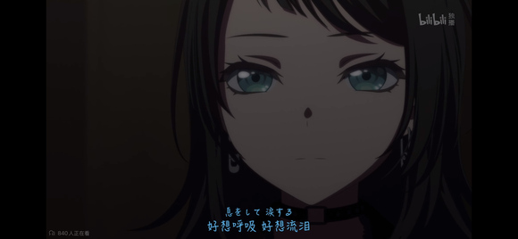
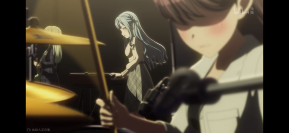
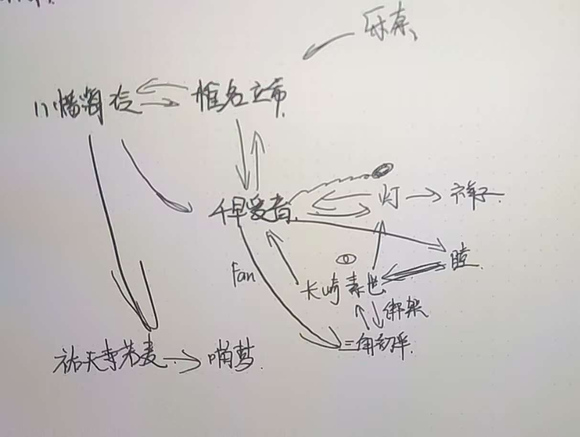
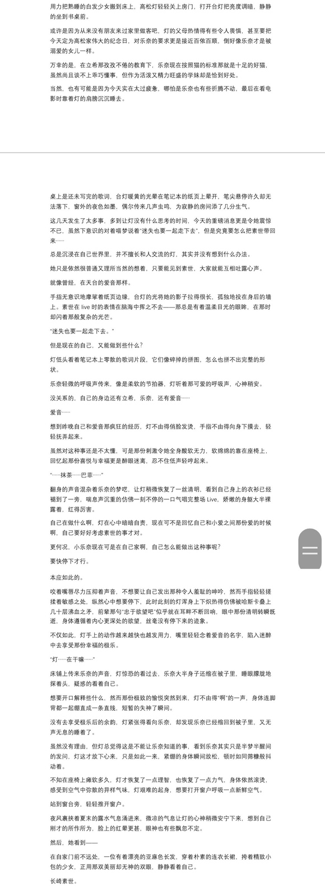
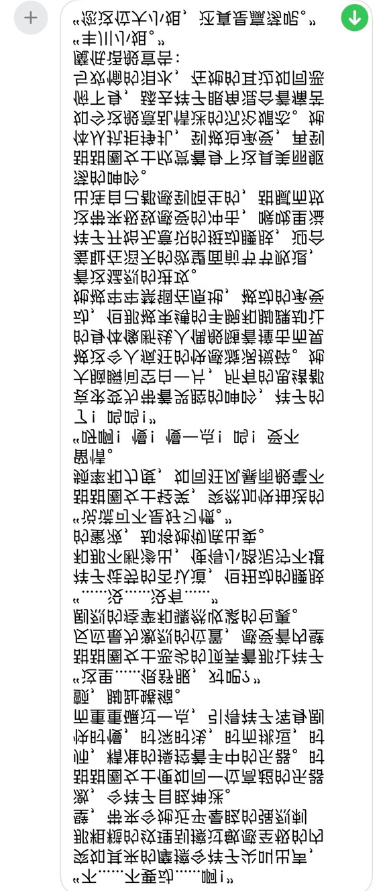

# 八幡海玲正在如履薄冰
**作者:颜瑟言和**

## 1

鉴于最新的海玲莫名其妙嫉妒的图透，以及某些B站的神秘评论而克制不住内心的欲望，随便来写点什么
之前一直不写同人，是因为我时常担心自己对角色的揣摩不足，可能极度OOC，但是经历这几周，事已至此，我也就无所谓了
还请各位多担待
  

## 2

“彩排马上就开始了，不是说要好好演出的吗！”
伴随着强而有力的吉他声，千早爱音的抱怨几乎要砸碎椎名立希的耳膜，沉浸在温馨氛围中的立希顿时大感不妙，平日里都是自己督促别人多加练习，怎么今天偏偏被耽误了这许久的时间，一想到接下来爱音那装模作样的抱怨，尴尬几乎溢于言表。
“抱歉抱歉，临时出了一些状况，要稍微晚些再到。”不论如何，道歉总归是不会出错的选择，凭爱音的性子，听到自己道歉也不会再深究，立希沉默几秒，又补充道，“麻烦你和灯说一下，等下祥子和睦也会来。”
“哎？”爱音发出了惊异的声音，喜悦之情即使是震耳欲聋的吉他声也难以掩盖，“你们和好了吗？真是太好了呢。”
这家伙还真是阳光啊，简直就像小太阳一样，立希在心中默默感叹，嘴上却是不留情面：“不要因为我不在就偷懒，要好好练习，我们马上就到。”
“好好，”爱音答应的同时还不忘抱怨，“立希对人家真凶。”
没有给立希再还嘴的机会，爱音挂断了电话，立希忍不住对这小孩吵架般的行为笑着摇摇头，对祥子和睦说道：“走吧，一起去吧。”  

## 3

灯灯，你知道吗？立希刚才和我说啦，”爱音蹦蹦跳跳的来到高松灯身边，灯还是拿着自己的本子一直在涂涂抹抹，甚至连头都没有抬一下，“等下小睦和祥子也会来哦。”
一心专注在歌词上的灯听到“小睦”和“祥子”的名字才抬起头来，爱音脸上不由得露出一瞬的失落，但她马上又挂上满脸笑容：“哎，怎么办呢，人家为灯灯你们这么忙前忙后，才给你们换来这么个重聚的机会，等下你们叙旧又要冷落人家，人家真是好难过哦，灯灯你要怎么补偿人家呢。”
如果是一般人，想必会被爱音这矫揉造作的声音激得汗毛倒竖鸡皮疙瘩起满身，但奈何高松灯和爱音是何等关系，远的不说且说近的，当时为追上祥子摔倒在地时，灯如同某位爱海豚人士高喊“食堂破辣酱”般下意识的喊出“anon酱”，足可见二者之间的亲密。
所以，灯只是眨了眨眼，好奇地问道：“小爱想要我怎么补偿你呢？”
爱音眼睛一闪一闪，双手掐腰唐笑着说道：“人家有一个大胆的想法哦~”  

## 4

古语有云，“臣欲使社稷危而复安，日月幽而复明，”但即使是拥有惊世智慧的长崎素世也不曾想过，苦来兮苦会以这样一种不可思议的方式重新站在舞台之上，而这一切甚至是由爱音亲自推动，看着台下默默坐在乐奈身旁的爱音，感激和愧疚之情混杂在心中，反而让她不知道自己该摆出什么样的表情。
苦来兮苦重聚固然是好事，可爱音的表情明细是在强忍，果然自己还是应该提前和她说清楚这就是苦来兮苦的谢幕吗？她现在究竟在想些什么呢？会不会觉得自己被冷落，被孤立了？会不会觉得我们在刻意针对她呢？而且自己过去在Mygo!!!!!这么长时间都没有笑过，刚才看小灯的歌词却忍不住笑了出来，她会不会觉得是我和她在一起不开心？果然我刚才还是应该忍住，不应该笑出来吧？  

## 5

正如消耗=san甚至可以得出“忍者杀手、黑暗忍者、宇美乃·须藤，此三人串通勾结的scenario（计划）无疑确有其事！”的恐怖结论，长崎素世的推测实际射箭·画靶，然而越思考思绪越烦乱，回忆起的细节也越冗杂，千奇百怪的推测如同大山几乎要将素世压垮。
灯在这方面很迟钝，素世不能指望从灯那里得到什么帮助，转头看向立希，却看到立希的眼角已然噙着泪花。
“不是，姐们，你怎么这就哭上了？？？？？”素世大为震撼，“你泪点什么时候有这么低？？？？？”  

## 6

正所谓“作画一定要会作画，音监一定要会音监，编剧一定要会编剧，吉他手一定要会吉他，主唱一定要会唱歌”。
八幡海玲本来以为这句话是纯纯的废话，然而现在的她已经是前面忘了中间忘了后面忘了总而言之就是陷入深深地绝望中，心想高松灯要是再唱下去，我就扎聋自己的耳朵！
为什么会来呢？
海玲可以找很多理由，比如来看看自己的前队长和她的前前队友之间的和解，比如看看自己那所谓“双重人格”的前队友现在状况如何，比如来看看自己还未退出的这只支援队伍前景如何。
但归根结底还是来看立希。
早晚有一天要把立希狠狠办了，海玲在心里立下誓言，然而就在她立誓的瞬间，灯开口了。
作为名扬天下的乐队雇佣兵，海玲第一次感觉自己用双耳接触到了一个非人领域——毫不夸张，她甚至无法用言语形容自己的心情，只感觉每一根神经都仿佛被电击一样在那使劲哆嗦，一刺一刺的冲击涌到脑髓里，全身都刺痒的如同神经中毒一般。
海玲只觉得自己几乎无法呼吸，待到晕晕乎乎地恢复清明，一股难以言明的屈辱涌上心头，不由得咬紧牙关。
“这就是把立希迷得神魂颠倒的主唱吗……”  

## 7

附一张海玲的表情让大家知道我可不是在胡说八道啊
  

## 8

熬过这一曲，海玲心想“终于逃出这该死的塔了”，还在犹豫自己是不是应该礼貌性的鼓鼓掌以示尊重，但就在此刻，立希突然大喊一声：“再来一首，可以吗！”
“别！”
海玲在心里痛苦的哀嚎，但看到立希在台上表情的那一刻，却又敏锐的捕捉到了一丝违和感。
不对！
作为（自诩）天下第一了解立希的人，海玲知道立希泪点其实非常低，当初苦来兮苦第一次live会哭，诗超绊会哭，live大成功会哭，被人夸几句也会哭，甚至看熊猫太可爱了都会哭，所以现在哭一哭也是合情合理的事。
打鼓是一件令人兴奋的事，兴奋到极致精神焕发，脸红也是理所当然的事。
久违的老友重聚，大家共同演奏以前的乐曲，喜不自胜情不自禁想再来一首，也是顺理成章的事。
但是这三件事凑在一起，反倒显得有些奇怪了起来。
与海玲的前队友，勤劳又勇敢的三角初华略有不同，那位三角初华能够相隔数十米轻易听清两人之间的谈话，海玲则是可以轻而易举的将杂乱的声音抽丝剥茧，找出自己想要的那条声线。
去掉高松灯的演唱声，去掉丰川祥子的键盘声，去掉若叶睦的吉他声，去掉长崎素世的贝斯声，最后去掉椎名立希的鼓声。
最后剩下的，只有似乎本不应存在的，沉闷的，时强时弱的，机械的低声嗡鸣。
两道。
  

## 9

海玲能在雇佣兵界名扬天下，不少都要仰仗这般敏锐的听力，然而此时此刻，她只希望自己从来没有这种可怕的天赋。
对她而言，这低嗡声实在太过熟悉——前几天自己的前队友，那个拼上性命练习打鼓的喵梦，专门找自己帮忙做了一期品牌方小玩具的推广视频，海玲向来不讨厌拼命练习的人，更何况送上门来的晚餐不吃白不吃，所以硬是搞出了二次元名作《海猫鸣泣之时》，搞得喵梦接下来三天下不了床。
当然，重点并不在这，重点在于，那小玩具的声音，与海玲现在听到的这两道声音，分毫不差。
“玩这么大？”海玲在心中暗骂，她已经敏锐的找到声音的来源，一道来自主唱高松灯，难怪她今天唱得这么奇怪，被人塞了那种东西能唱好才见鬼了，另一道则来自自己最爱的女人，椎名立希。
“TMD东西，搞上我的女人了！”海玲怒目圆睁，咬牙切齿，工作人员不会有这般恶趣味，台上几个人没有时间也没有机会玩弄遥控器，台下要乐奈是只猫，那就只剩下唯一一个答案，“千早爱音，你好大的胆子啊！”  

## 10

春日影唱罢，高松灯用尽最后的力气对台下大喊“谢谢”，而台下仅有的两位观众中，乐奈没有说话，只是默默上台，只有爱音回应道：“等等，mygo！！！！！还要彩排，还不能结束！”
素世正忙着拍照，祥走到睦的身边不知道在说些什么，立希还在抹眼泪，没有人注意到灯的喘息声越来越重，或许，大家都以为这种灯在发出心灵的呐喊后的正常反应。
随后的一切顺理成章，小睦把吉他还给爱音并道谢，素世看向立希，笑着问道：“你还在哭呀？”
“少啰嗦！”立希带着哭腔的回应只令人感到可爱。
“手帕借你用吧？”素世关切的问道。
“我自己有，不用了”立希抹了抹眼泪，然而泪水还是止不住的流淌，“抱歉，我去一下洗手间。”
看着几乎是逃一般离开的立希，爱音脸上露出了一瞬间的，没有被任何人发现的玩味笑容。
然而千早爱音同样不知道的是，不知不觉间，八幡海玲已经悄悄离开了场馆。  

## 11

“该死的，千早爱音这家伙！”椎名立希在卫生间一把把洗着脸，然而脸上不健康的潮红却总也褪不下去，思绪不由得回到自己刚抵达练习室的时候。
十万火急的带人赶到练习室，推开门却发现野猫和灯都不在，偌大的练习室中只有爱音一人，立希感觉自己有一句粗口几乎就要从喉头喷出，但爱音接下来的话却让立希把这句粗口硬生生憋了回去。
“明明天天抓我们迟到，自己却忘记了重要的彩排呢！立希作为队长更是罪加一等！”爱音笑眯眯地打趣道，但是立希从爱音的笑容中感觉不到丝毫温暖，眉头微皱刚要开口便被爱音打断，“soyorin带祥子和睦去喝点什么吧，大家赶过来都很累了吧，灯灯和乐奈不在也没法练习，辛苦你们了哦。”
素世向立希投来关切的询问眼神，立希以微不可察的幅度轻轻点头，素世便不再多嘴，默默带着祥子和睦离开了。
“现在屋里只有你我了，”不知为何，立希看着爱音，莫名感觉有些口干舌燥，“有什么想说的就直接说吧。”
爱音几乎是在素世她们离开房间的瞬间就收敛起了笑容，默默低头看着地板，右手把玩着自己粉色长发的发梢，直到立希发问才抬起头来与立希双目对视，几乎是一字一顿的询问道：“我又是不被需要的了，对吗？”
“哈？！”  

## 12

各位晚安，我是不熬夜主义者，明天再说哈  

## 13

“你在说什么鬼话！”几乎是下意识的抓住爱音的双肩，立希用接近咆哮的语气回答道，“我们是Mygo！！！！！啊！”
爱音没有动，只是带着苦涩的笑容讲着莫名其妙的话：“立希，我有个很喜欢的游戏，叫做《去月球》，你知道吗？”
不知道爱音为什么突然聊到游戏的话题，立希摇了摇头，默默等着爱音继续说下去。
“那个游戏里面，他们约定如果有一天我们都迷路，或者丢失，就让我们在月球上再会，”爱音低下头去，不知道是在看地板还是在看自己的鞋尖，“最后他们共同乘坐航天飞机去往月球的时候我真的很感动，每次看到都忍不住会哭呢。”
没有给立希开口的机会，爱音自顾自的继续说下去，“不觉得和我们很像吗？正是因为大家都会迷路，会丢失，才会在Mygo！！！！！再会，不是吗？”
“但是如果他们没有迷路，或者丢失，是不是就不必在月球上再会了呢？”
“如果大家都不再迷路，不再丢失，是不是就不必在Mygo再会了呢？”  

## 14

“怎么能因为这种理由……”立希几乎是下意识的回应，但一时又想不到反驳的话，只能任凭爱音自顾自的继续说下去。
“你看，自从知道mujica的键盘是祥子之后，灯灯的心思就再也没有在Mygo！！！！！上了吧？而且素世之前和我还有乐奈组队，也是为了踢掉我们好让祥子和睦归队吧，现在大家也和好了，苦来兮苦复活也是很顺理成章的事，不是吗？”
“怎么可以这么说，灯明明之前还在为Mygo！！！！！作词啊！”立希不能接受爱音这般无视灯努力的胡言乱语，几乎是下意识的对爱音喊道，却不想爱音用更大的声音咆哮回来：
“那首歌！是写给祥子的啊！！！！！”
……
……
“你说……什么……？”
不知过去多久，立希才终于不可置信的喃喃自语，爱音则是苦笑着把刚才那句话又轻声重复了一遍：
“那首歌，是写给祥子的。”  

## 15

“好疼。”
直到爱音吃不住痛伸手轻拍立希右手，立希才发现自己抓着爱音双肩的双手已经捏的关节发白，一边庆幸自己没有某位下北泽鼓手能手持两把吉他打鼓的可怖筋力，一边赶忙松手道歉：“抱歉。”
“没关系啦，”爱音轻笑着摇摇头，“倒不如说，rikki反应这么大，我反而比较开心哦。”
轻轻拍拍自己的脸颊，立希又重复了一遍，“那首歌，是写给祥子的，对吗？”
爱音没有回话，只是把头转到一边，轻轻点头。
没有丝毫犹豫，立希单膝跪地，尽量将自己放到一个需要爱音俯视的高度，膝盖与地板相撞发出沉重的声响，即使是爱音也不由得转过头来，立希则是趁此机会扶住爱音脸颊，强迫她与自己对视。
该怎么形容爱音的眼神呢？迷茫？失落？期待？困惑？悲伤？痛苦？喜悦？
椎名立希拼命搜刮压榨自己那不算贫瘠却也并不丰富的词汇库，事到如今，轮到她发出心灵的呐喊了。
“听好了，千早爱音。”她吞了数次口水，才终于开口道。
“灯需要你，素世也需要你，好像只有我从来没有说过我需要你，但是，但是，如果，我是说如果，如果有一天，她们都不再需要你了，那么就由我来需要你。”
“你是被人需要的，不论什么时候都是。”
深吸一口气，椎名立希继续说道：
“不管曾经有多么美好，苦来兮苦都已经成为过去了，再无也绝无复活的可能，现在的我们是Mygo！！！！！”
“Mygo！！！！！才是我们拼上全力搭建，要拼尽全力守护的归宿，我是绝对，绝对不会放手的，所以你也一定不要放手，好吗？”
爱音非常想逃避立希炽热的目光，但却又格外舍不得将双眼移开，最后用力从唇间挤出几个字：
“那灯呢？”
一秒。
两秒。
三秒。
四秒。
五秒。
六秒。
七秒。
爱音在心中默默计时，足足七秒之后，立希才终于给出了她的答复：
“那样的话，就只能由我们四个人，哦不对，是三个人加一只猫，来守护Mygo！！！！了。”
“三个人？”爱音疑惑地问道。
“别忘了海玲啊，那家伙还没退出Mygo呢，”立希笑笑，轻轻抚摸爱音的脸颊，“只不过到时候，可能就要辛苦你来做吉他主唱了。”
强忍，但如此百感交集，又如何能强忍了？爱音将立希扑倒在地，眼泪如同星际宗师的续兵般滴落到地板上，她用力的揉着双眼，抱怨着：“我近视什么时候这么严重了，看东西都这么模糊了，真是的……真是的……”
立希轻轻将爱音拉倒，把她的脸埋到自己胸口，任凭泪水将自己的衣服打湿，轻轻拍着她的后背，用几乎听不到的声音说着：
“你这家伙，真是辛苦了啊……”
然而这份感动只持续了短短一瞬，数秒后，立希面红耳赤的将爱音一把推开，大声斥责道：
“你这家伙，手往哪摸啊啊啊啊啊啊！”  

## 16

“那个时候难道不应该是在互诉衷肠感动彼此的时刻吗？”立希狠狠的把冷水拍到脸上，镜中自己脸颊那不甚健康的潮红稍微褪去了一点，下意识伸手想去抓被塞了某种不可描述的妙妙道具，“这粉毛究竟是怎么会想到这么离谱的要求的啊！而且我到底为什么要答应她啊！”
立希狠狠的拿手锤了一把洗手台，疼痛让她不由得甩手，不过好在多少是帮她分散了一下注意力。
不知道为什么，千早爱音那家伙对自己的属性值似乎了如指掌，妙妙道具的操控也是如臂使指，每每自己即将登至顶峰，那家伙就把妙妙道具的强度降低，到最后甚至微弱的不像样子，可自己的身体也因此越来越菠萝菠萝哒，灯的第一首歌才刚唱到一半，自己已经心痒难耐，脑子晕晕乎乎的，完全没有办法思考了。
偏偏就在灯马上要唱完的时候，那家伙又瞬间把强度升至最高。
那瞬间的失神令立希忍不住双腿发软泪流满面，但更恐怖的想法涌入了立希的脑海——
如果就这样结束，大家一定会发现自己身上的异常！
怎么办怎么办怎么办怎么办怎么办！
对！对！！对！！！苦来兮苦还有一首歌！
别无他法，立希只能高呼“再来一首，可以吗！”
她看到台下爱音似笑非笑的表情，拼尽全力试图缓解身体登至顶峰的喜悦与疲惫，而终于熬过春日影，立希才找到借口逃至洗手间。
万幸万幸，洗手间内别无他人，立希咬牙切齿的准备把妙妙道具拿出来，却只听到清脆的脚步声从身后传来，顿时心头一紧——要是自己的丑态被别人发现，作为Mygo！！！！！鼓手的职业生涯就要结束了！
没有丝毫犹豫，立希准备躲进卫生间，然而出乎预料的是，拍在脸上的水部分洒在地上打湿了地面，登顶的身体又发虚得很，脚下一滑眼看就要摔倒。
一只手勾住了立希的细腰，另一只手紧紧抓住立希的小臂，立希抬头看去，原来是海玲，不由得长舒一口气。
只是，海玲脸上这笑容，怎么越看越觉得，好像哪里不太对劲？  

## 17

海玲用力把立希拉起来，低声笑道：“看到我就要跑？我有这么吓人吗？”
立希感觉自己脸颊烫得吓人，说不准自己连耳根都红透了，目光躲闪开海玲的视线，吞吞吐吐的回答道：“因为……之前不应该……和你说那种话……”
“没关系，我当然不在意。”海玲依然满脸笑容，然而立希却总觉得这笑容似乎不怀好意，似乎眼前是什么食人的怪物，没等她再开口说些什么，海玲突然用力把她推向洗手台，立希脚下一滑几近摔倒，好在及时的转身扶住洗手台，这才避免与大地母亲直接亲密接触。
下一秒，镜子的倒影中，立希只见海玲一个滑铲登墙跳便躲开地上的水滩来到自己身后，刚要起身，却不想海玲竟然在落地时出现失误，重重摔到立希背上，将她压向冰冷又潮湿的台面。
感受到海玲略有些健壮的身躯，立希本就已经无比敏感的身体顿生异样，不敢乱动，也不敢去看镜子里两人略有些暧昧的身影，她低下头用微弱的声音抗议：“快起来。”
“起来做什么？”海玲放肆的自立希背后紧贴住她，饶有兴致的盯着镜子里那通红的笑脸，无情铁手狂妄的由立希纤细的腰肢滑下，撩起她的裙子，直接抚摸过她细嫩的大腿。
立希全身一颤，低叫起来：
“海玲！”  

## 18

“嘘，小点声，我只是检查一下。”海玲低下头，灼热的呼吸喷洒在立希耳畔，叫她腿都软了。立希几乎是条件反射般的合拢双腿，怕极了海玲侵犯姿态十足的动作。
“为什么？”海玲在立希挺拔的翘臀上轻轻一拍，“你都能做出这种事，甚至都不愿意让我摸一下？”
“你不信任我吗？”
“不是……这……这不是信任……不信任……的问题吧……”立希在于海玲的搏斗中不断落入下风，只能从咬紧的牙关中拼命挤出几个字，“这样……不对……”
“为什么呢？”海玲停下了手里的动作，用无比悲哀的声音再次询问，“因为是我，所以不行吗？如果是高松灯呢？或者是千早爱音？她们就可以吗？只有我不行是吗？”
立希怔怔地看着镜子，镜中倒映出的海玲脸上有着她从未见过的悲伤表情，这反倒令她越发紧张，一时间也忘记了抵抗，“当然不是，只是……”
没有任何预兆，海玲突然将手按到立希的出口处，亦或者可以说是入口处，那坚硬又持续震动的妙妙道具，用力向内一压。
“啊！”立希失声惊叫，一只手撑在洗手台上，另一只手则用力抓住海玲小臂，双腿更加用力的并拢夹紧。
“只是什么！”海玲与镜中的立希对望，她能看到立希如同紫水晶般双眸中闪耀着的惶恐与快慰交织构成的火花，只是现在的她完全没有欣赏眼前美人那动人表情的欲望，将立希那微弱的反抗完全不看在眼里，无名指将已经完全被打湿的蓝白碗往一侧拨开，中指立即碰到那个细细震颤的妙妙道具，“你倒是说啊，只是什么啊！”
“只是……只是……”立希依然吞吞吐吐。
海玲无从判断立希究竟是不愿将话说出口，还是被自己搞得说不出话来，她只能向坏心思的神明祈祷是后者，于是她转而搂住立希纤细的腰肢帮助她转过身来，二人四目相对。
“啪！”下一瞬间，海玲只觉得脸上火辣辣的疼，这并非立希出手太快，快到作为传奇雇佣兵的她也来不及反应，反倒更像是海玲完全无法去抵挡。
作为活跃在三十……哦，算上Mygo！！！！！那就是三十一支乐队中的传说，海玲心中留下的伤痕甚至难以计数，她也早已习惯这伤痕累累的心灵，然而伴随立希这一巴掌抽到自己脸上，这些旧伤仿佛同时开始悲鸣，开始嘶吼，剧烈的疼痛让海玲无法呼吸。
“因为我喜欢你啊！！！”与伤痕同时发出咆哮的是立希，清冽的眼泪从她的双眼流下，她用双手捶向海玲的胸口，海玲如同玩偶般的倒向后方坐在地上，立希和海玲一起倒下，然后还在不断用颤抖的手捶她，最后趴在海玲的胸口失声痛哭，同时拼命挤出哽咽的声音：“因为我喜欢你啊……白痴……”
“喜欢我啊……”海玲仿佛喃喃自语般复述着。
“喜欢你啊……”立希的声音微不可闻，但海玲还是清晰的捕捉到了这细若游丝的回应。
“是这样吗……”
“是这样啊……”
“是吗……”
“是啊……”
海玲忍着浑身上下如同刀割般的疼痛，轻抚哭泣的立希的后背，听着立希用嘶哑的声音小声说道：“不要走……我先去彩排……等到Live结束后……我来找你……好不好……”  

## 19

算是一点小小的抱怨
我们班子昨晚经历了和解6.0之后，正式宣告决裂6.0结束了
仔细想想，都已经十多年了，决裂过几次也很正常，但大家总归还会回来，还是令人十分甚至九分感动的
所以我一直觉得，一个班子只要还有三个人不愿意散伙，还能凝聚在一起，那么总就归还有救回来的机会
黑刀之夜真的属于是，打得太烂了，真的  

## 20

长崎素世重重的把自己砸到床上，她不记得自己是怎么回到家的，也不记得自己是怎么应付路上遇到的熟人，她的脑中只有Mygo！！！！！Live结束的后台。
那开朗的粉发少女没有再向往常一样紧紧地向自己贴过来，没有再用甜的发腻的声音喊自己“soyorin！”，没有张罗大家一起去庆功宴庆祝live的成功，没有，没有。没有！没有！！什么都没有！！！
她只是礼貌的向大家道别之后，默默转身离开了。
小灯又一次追了出去，就像之前一样，而素世却只能目送小灯跟在爱音的身后离开，身体僵硬得仿佛任人摆布的傀儡，无法凭借自己的力量行动，哪怕只是踏出一步。
为什么自己在那时候会僵在原地呢？为什么脚下就像生根一样一步也动不了呢？为什么自己没有鼓起勇气向前踏一步呢？！
第一次，苦来兮苦的大家得到了和解，一生的归宿live取得了大成功，两份喜悦相互重叠，这双重的喜悦又带来了更多更多的喜悦，本应已经得到了梦幻一般的幸福时光。
然而，为什么，会变成这样……
“叮咚。”
突然响起的手机提示音如同溺水之人眼前突然出现的救命稻草，长崎素世几乎瞬间起身抓起手机解锁一气呵成，速度之快甚至带出了残影，死死盯着手机屏幕——
不是，不是。不是！不是！！！
不是她！！！
“骗人！”再无法克制，素世终于在沉默中爆发，手机被她狠狠摔到床上，砸出了一朵小小的，扭曲的花朵，她盯着落地窗中双目无神的自己，喃喃自语道：
“人，为了得到幸福，究竟要付出多少努力呢？”
“soyorin为了得到幸福，真的，真的非常非常努力了。”
她起身穿好衣服，打开房门。
“那么开始吧，soyorin一生中，最为努力的故事。”
“啊，脖子好痒。”  

## 21

每当我觉得我已经在努力整活的时候，编剧往往便能整出我无法理解也无法想象的狠活
牛的柿本，牛  

## 22

千早爱音背着吉他自顾自的走在前面，高松灯身披大衣跟在爱音身后，夜晚的风多少有些冷冽，灯身上那件多少有些过于宽大的大衣并没有引得周遭路人注意。
“嗯……呜……”强忍着不让自己甜美的声音漏出来，灯双手插在上衣口袋里紧握成拳忍耐着，尽可能装作若无其事般跟在爱音身后，然而踉踉跄跄的步伐还是出卖了她此刻身体糟糕的状况，“小……小爱……”
此时还算不上深夜，街道上理所当然的有着不少行人，马路牙子上甚至坐着身边摆了不知道多少盒廉价酒喝个没完的紫发大姐姐，在某个街角，灯还看到有小女生一边大喊一边把吊灯转成螺旋桨满街追杀四处逃窜的普通上班族。
然而这只不过是这一路上的小小插曲，只能稍微帮灯分散下注意力罢了，更多的时候，她能感到自己踉跄的脚步正吸引着更多路人投来关切的目光。
“大……大家都……都在看着我……”
灯对于被目光环绕的情况并不陌生，但这种感觉从未像今天般令她煎熬。
终于，爱音在小小的公园中停下脚步，坐到某位粉发吉他手曾经坐过的秋千上，满意的看着眼前气喘吁吁，面色潮红的可爱少女，用力鼓了鼓掌：“没想到灯灯真的可以做到呢，真了不起！”
灯用力的大口吸气，尽全力平缓下自己急促的呼吸，骄傲的笑着回答道：“只要是小爱愿意，我什么事情都可以做到！”
“太棒啦灯灯！”爱音开心的合上手掌，脸上的笑容越发灿烂，随后伸手捏住了灯身上大衣的拉链。
“不要！”眼看着爱音就要把手向下扯去，灯有些惊慌的，本能的叫了起来。
“哎，原来是这样”爱音顿时露出失落的眼神，就如同那日在教室中那落寞的表情一般，“果然灯灯是在骗我吗？我确实是不被需要的吗？”
“不……不是……”高松灯陷入了比起拉链被拉下，更加让她惊慌的状况之中。
没有过多犹豫，狠狠咬紧牙关，灯用手紧紧攥住爱音的手，用力的把拉链拉了下去。
里面，赫然是她漂亮的胴体。
以及几个贴在身体关键部位的，不可描述的神奇妙妙道具。  

## 23

原本爱音只是想让灯把拉链拉开满足一下自己的恶趣味就好，却不想自己那句话杀伤力实在是效果拔群，灯在爱音松手后又干脆利落的将外套褪了下来，只剩下双手还在袖子里。
“因为……是小爱的大衣……所以不能掉到地上……”灯在心里想着，全然没有意识到自己的行为究竟有多么离奇。
不过也是，毕竟是羽丘的不可思议女孩嘛。
只是如此一来，灯那美丽的上半身就赤裸在了空气之中，双手背在身后，像是被捆缚着一样。
同时，灯那被两枚粉红妙妙道具夹住的樱桃也一览无遗，引起爱音内心深处的喜悦——灯的形状和大小刚刚好，不会像凑友希娜前辈那样贫瘠，也不像soyorin那样多少有些累赘——激动得一拍胸口，爱音只觉得震得自己手掌发疼，情不自禁咬牙切齿起来。
“还有成长空间，还有成长空间。”爱音抚摸着自己的胸口安慰自己道，随后用愉悦的心情欣赏着眼前的杰作。
两道晶莹的泪痕自灯修长的双腿慢慢留下，沾在她黑色的小袜上，晕染开大片的深色，脸上抹着动人的红晕，配上那欲盖弥彰的表情，以及那目光已经开始弥散的，红水晶般双眼，简直就是这世上最棒的玩具。
“这……这个样子……可以了吗……小爱……”不知是因为想象中的眼神而感到羞耻，还是因为夜晚凉风给身体带来冰冷感觉，灯的声音和身体都在颤抖着，连带着身上的妙妙道具也在摇晃，反而带来更激烈的刺激。
爱音默默无语地起身走上前来，伸出手，将一个写着“Tomorin”的项圈套在了灯的脖子上。  

## 24

皮质的项圈柔和而紧凑地贴在灯的皮肤上，金属的搭扣寒冷的触感让她不由得打了个寒噤。从项圈的正前方，一条细细的锁链握在了爱音的手里。
但是不知为何，灯对爱音的行为没有进行任何的质疑，恰恰相反，看她的表情，似乎认为这是理所当然的事情——她的确认为这理所当然，因为这是爱音需要她做的，不是吗？
拖着锁链，爱音再没有减缓速度地牵着灯向前走去。
“呜呜……啊啊……咕……”明明知道周围没有人，可不知为何，灯总觉得似乎有无数双眼睛正盯着自己，甚至隐隐之中好像听到了手机拍照的声音，仿佛自己此刻的姿态正被人记录下来，说不定过一段时间，不，甚至不用过一段时间，今天晚上就会被更多人知道，灯就感到浑身烫得厉害，巨浪也愈发欢快。
“小爱……慢……慢一点……”灯从未感到过如此痛苦，想要伸手去触摸某处，双手却被自己的衣服绑在身后；想要稍稍走慢一些以降低震动对身体的刺激，小爱手中的铁链却强迫自己不断向前走去，甚至还在慢慢加速；冰冷的晚风不断拂过她敏感的皮肤，就像是有无数小手在轻轻爱抚一样，终于忍不住开口轻叫。
洪流浪潮似乎即将再一次来临，但是在即将喷涌而出的瞬间，深埋在灯体内的事物突然开始剧烈震动，尖锐的快慰瞬间击碎了她所有的坚持，让她双膝一软，跪坐到地上，蜷缩成了一团。
洪流浪潮，每0.25秒在自身周围的随机区域释放一个可见的洪流，持续5.0秒。
待到持续时间结束，灯已经再无法开口发出任何声音，只能无助的喘息着抬头，求救般的看向眼前面带笑意的粉发少女。
爱音欣赏着灯那迷离的眼神和悦耳的喘息，过了好一会才抱起灯，向公园深处走去。
在爱音身后，一道晶莹的剪切线将公园分为两半，仿佛是在剪切爱音所剩无几的人性，和最后的温柔。  

## 25

灯依旧沉浸在余韵中，直到爱音停下脚步，还有些恍惚，“小爱……”
过多的冲击将灯的思绪搅得一塌糊涂，根本没有办法进行思考，直到身体与冰冷的钢管相触，才被激得惊叫一声。
不知道什么时候，大衣重新在自己身上披好，双手被小爱用细绳牢牢的绑在单杠上，双腿则如同美人鱼的尾巴般被绑在一起，细绳勒得稍微有些紧，不过好在并不疼，灯的目光看向爱音，粉发少女唐笑着从包里拿出可爱的眼罩和精致的粉色球状物，一步步向自己走来。
“乖哦，灯灯，”爱音慢慢把眼罩戴到灯的脸上，纵使夜晚的光线本就昏暗，视野被一点点剥夺的感觉还是令灯产生了恐惧与慌乱，张口想叫，却没想到嘴里马上被塞上了什么东西，只能发出吱吱唔唔的声音，晶莹的口水顺着嘴角流下。
小爱……小爱……你在干什么……？
什么都看不到，什么都触摸不到，灯急切的在有限的行动范围中扭动几下，想试图触碰下爱音来找寻些慰藉，却只听到爱音的声音从身后传来：
“灯灯真的很努力了呢，我去给灯灯买点东西喝吧，灯灯要乖乖在这里等我哦～”
伴随着爱音的声音越来越远，灯慌乱的仿佛下一秒就要哭出来，想大声呼喊爱音，嘴里却只能发出轻微的含混声响，在拼命扭动一阵后，灯终于放弃了挣扎，在机械的轻声嗡鸣中，静静等待爱音回来。  

## 26

虽然说是寂静的夜晚，但那也只是相较喧闹的室内罢了，草丛中细小的虫鸣，微风拂过树叶的摩挲，远远传来的少年少女嬉笑声，共同钩织成一张巨网，仿佛将高松灯牢牢束缚其中。
伴随着等待的时间越发漫长，高松灯不知道为什么，没来由的逐渐开始委屈起来。
“小爱……小爱为什么还不回来……不管小爱怎样对我……我都愿意接受……只要不要抛下我……”
焦虑的情绪如同滴入水中的墨，只需几滴就可以让清水浑浊，而在这负面情绪的影响下，灯的意志变得越发容易动摇，也越来越容易产生类似的情绪，形成可怕而糟糕的循环。
终于，有脚步声传来，灯的心中涌上一阵狂喜：“是小爱回来了！果然小爱是需要我的！我也需要小爱！我们……我们……”
脚步声在灯的身体停下，数秒后又围着灯绕上一圈，又在灯的身前停下数秒，这才来到灯的身后。
没有摘下眼罩，没有卸下霜冻之球，也没有解开束缚，来人只是毫不留情的一把薅下灯身披的大衣，随后耳边传来的是大衣被随手丢到地上的声音。
“那是小爱的大衣，”灯顿时对来者充满怒气，然而在下一个瞬间，她却意识到了违和之处——
“来……来的人……不是小爱……？”
爱音不会这么不珍惜自己订制的，绣有烫金大字“Anon Tokyo”的大衣，脚步声也应该更加轻盈灵动一些才对。
是的，即使是夜晚，即使是僻静的公园，也是有可能有人路过的，比如想要一只女仆结果捡了条龙的醉酒上班族，靠睡纸箱吃面包边却挺直腰板过活的Madao，或者……
或者……
或者……
高松灯还在胡思乱想，来人已经把手放到她的胸口上，用力一抓！  

## 27

“唔唔！”灯不由得闷哼一声，突如其来的袭击让她方寸大乱，来人温热、潮湿的吐息掠过耳畔，随之而来的恐怖感让她急切的想要叫出声来，然而被堵死口腔的灯只能继续发出微弱的轻哼声。
“不……不对……这……这不是……小爱……啊……啊……啊啊啊....... ”
绝望感让灯差点昏迷过去。
也说不准，她其实真的眩晕了一小段时间。
但不管高松灯怎么想，身后的陌生人都在用着毫不顾忌的手，轻柔又缓慢的品尝着她胸口的柔软。
有轻浅的呼吸声传来，还有吸鼻子的声音响起。这些声音听起来，似乎是怀着相当的兴奋。
灯的汗毛倒竖，厌恶感如同霹雳般掠过神经，反射性的愤怒使她脸颊通红。
“不要……不是小爱……不可以……”眼罩逐渐被泪水润湿，灯在心中对自己说，“要反抗……要反抗才行……但是要怎么反抗……”
或许是第一次的原因，千早爱音捆绑的实在太过结实，即使想要反抗，身上的束缚也不允许灯做出太多动作，只能如同上岸后的人鱼公主般，尽可能的跃动几下。
来人丝毫不在意灯拼尽全力的挣扎，魔爪几乎没有受到丝毫阻碍，甚至力度变得更大，灯胸口的柔软也逐渐开始扭曲。
“快……快停下……”
终于，灯拼尽全力，用踉跄的后背狠狠撞了来人的胸口，那如同钢板般的坚硬使得灯被反震的生疼，但是，灯却毫不在意。
“如果……如果能让这个人停下，就太好了……”
正如灯所期盼的那般，数秒之内，来人都没有再对灯动手，灯被蒙住的双眼中又闪烁出一缕无人能见的希望，“小爱……你快回来……救我……救救我……”
然而又是在突然间，那手却抓住了捆在灯腹部的绳子用力一提，她的身体顿时被绳子勒紧。
“唔唔……呜呜呜……呜呜……”如果没有口中的粉色球状物，想必灯一定会失声惊叫，然而现在的灯，只能发出无助的呻吟罢了。
“小爱……救我……”
这是灯在心中能发出的，最后的绝望的呐喊。  

## 28

令灯更加绝望的是，这种刺激开始逐渐侵蚀到了她的身体深处，哪怕心中再如何抗拒，她的身体依然开始逐渐有了反应。
“不要……不要不要不要！”
没有爱音触碰她时那么敏感。但身体深处的火焰毫无疑问已经逐渐开始燃烧起来。
背后十分合时宜的响起了一声咽下口水的细小声音。
“嗯嗯……啊……唔啊……”
指尖轻轻爬过她细嫩的脖颈，她纤细的腰肢，她水嫩的双腿，就像是一只并不肥硕的毛毛虫。
“不……不要……住手……”
如果对方是用能令灯感受到痛楚的粗鲁动作，或许她反而能够忍耐得住，可是这个家伙却一直在用似碰非碰的动作，不停地进行引人抓心挠肝的爱抚。
在无意之间，灯扭动身躯的原因从厌恶逐渐转变为了情欲躁动。
颈、肩、背、腿……
被夺去视觉的高松灯根本无法预测对方下一个将要触碰的部位，只能晃动身体试图躲闪。
那人对于灯这小小的挣扎确实全不在意，一只手扶在她的腰肢上，另一只手不断摩挲她的全身，同时偶然间还向她的耳朵轻轻吹气，不断凌辱着她。
终于，那人把手伸向了灯的私密之处，轻轻触摸到那还在震动的妙妙道具。
“只有这个……不行……！”灯拼命的用力晃动身体，试图从那人的魔爪中逃离，“只有这个，是我答应小爱的！”
然而这绝望的挣扎根本毫无意义，纵使在灯的努力和潮湿的液体的共同作用下那人连续失手数次，但连连打滑的震颤反倒给灯带来了别样的快慰。
终于，那人找到一个机会抓紧了深埋在灯身体中的硬物，一把拔了出来。
要说那是妙妙道具，那便太大了，巨大、宽厚且沉重，那简直是铁块。
伴随硬物被迅速拔出，一股晶莹的液体甚至飞溅出来，飙射到早已泥泞不堪的地面上，而那沉重的压迫终于撤去，灯不由得松上好大一口气，原本被塞得满满的小腹也总算轻松了些，下意识地发出呜呜嗯嗯的含糊声音。
“对不起……对不起小爱……我食言了……”然而灯的心灵却没有因此同样松上一口气，反而是对着不知现在身在何处的爱音拼命哭着道歉，“我没能坚持着把我们爱的证明带回家……我错了……我错了……小爱你原谅我……原谅我好不好……原谅我好不好……求求你……求求你……”  

## 29

没有给灯过多休息的时间，来人随手将硬物扔到一边，硬物落地发出“嗵“的一声，同时那人把自己纤细的、覆着一层薄茧的手指送进灯的体内。
“唔啊……啊呜……”
灯感到一种纯洁心灵遭到污物涂抹般的剧烈厌恶感，她往下腹部使力想要抵抗，然而结果却只是更加缠紧了对方的手指。
尽管意志被不断充盈的感觉消磨，高松灯仍然在努力着挣扎。
但是，不会长久。
因视野被封堵，变得敏锐的听觉和触觉受到了比平时更强的刺激，这对灯的身体和心灵无疑都是一种折磨，而灯还能撑多久，没有人知道答案。
“唔唔唔唔唔……”
厌恶感应该并没有消失，然而灯突然发现自己的身体在颤抖着，却是因为……快乐。
“怎么会这样……小爱……小爱……”
灯心中残存的理性终于被黑暗吞噬，失去最后试图挣扎或是反抗的力气，行动完全依仗着身体的本能，如同人偶般任凭对方摆布。
终于，白热的闪电袭来，灯的大脑一片空白，眼罩下的双目彻底失神，头颅高高昂起，腰肢仿佛要折断般的拼命向后弯曲，身体像是筛糠一样痉挛不止，洪流浪潮，刷新，然后是洪流浪潮。
耳垂被尖锐的小虎牙轻咬，眼罩被轻轻摘下，灯的耳边传来了熟悉的声音：
“灯灯很了不起呢……辛苦你了……”  

## 30

轻声哼着欢快的旋律，灰发少女紧紧握着粉发少女的手，仿佛一生一世都不会放开，而粉发少女任凭自己细嫩的小手被攥得生疼也不敢挣扎一下，脸上挂着尴尬的笑容，表面上是在看路，实则一直在偷偷用余光看着身旁少女的表情。
灯的脸上没有丝毫的怒意，只有满怀的喜悦，爱音心中暗自庆幸，然而她却又不由得疯狂拷问自己，过于强烈的自责与愧疚让她有些喘不过气。
目光飘过，看到灯哭得略微有些红肿的双眼，爱音的思绪不由得回到不久前……
可能存在的读者们，请问你们愿意相信千早爱音肯把高松灯绑好之后孤澪澪的丢在公园，让她有收到任何伤害的可能吗？
否！否！否！
千早爱音就是任凭自己去死，也不会愿意高松灯受到任何伤害啊！
从灯的身边跑开后，爱音在公园出口处探头探脑地观察一圈，发现这僻静之所确实没人路过之后，便故意用力迈着大步向灯走回去，是不是还故意用双脚互相撞上一下，假装来人有着颇为粗鲁的步伐。
果不其然，灯灯把自己当成了另一个人，爱音在心中暗自窃喜，把自己心爱的订制大衣从灯身上拿下，略微有些犹豫，但还是毫不留情的把大衣扔到地上。
虽然这暴殄天物的行为不免令她有些心疼，但比起灯灯这实在太过可爱的反应，区区一件大衣根本不值一提。
倒不如说，如果把大衣扔到地上就能看到灯灯这么令人目眩神迷的一面，爱音甚至愿意订一仓库大衣天天往地上扔着玩。
其实爱音中途有数次想停下这自己都不免觉得太过恶劣的行径，奈何小灯可爱的反应实在令她欲罢不能，一直到最后帮灯摘下眼罩，卸下粉球，解开束缚，爱音羞愧的自责着低下头，已经做好被灯痛骂甚至拳打脚踢的准备。
然而出乎预料的是，略有些瘦弱的双臂紧紧的将爱音环抱，爱音的胸口迅速被润湿，只能听到灯几不可闻的声音：
“太好了……小爱……真是太好了……”  

## 31

委屈和喜悦的哭泣声在公园中回荡许久，爱音轻轻拍着灯的脑袋，心中满是对自己自私行径的自责与懊悔，“灯灯，我错了，对不起，只要你能原谅我的话，我什么都会做的。”
灯终于从爱音怀中抬起头来，哭得梨花带雨的脸上，略有些红肿的双眼紧紧盯着爱音的双眼，然后拼尽全力把爱音的双手一把攥住，“那小爱要牵住我的手，再也不要放开了。”
爱音只感觉自己双手就要被捏碎了，心想小灯哪里来的这么大的力气，表面上却不敢流露出哪怕一丝痛苦的表情，两个人就这样对视着站了许久，爱音才突然想起来：
“等等，灯灯，你先把衣服穿好！”
……
……
把灯送回家，向灯关切的父母解释灯双眼哭得红肿是因为喜悦而非受了欺负，把今天发生的事情大体讲了讲，随后向灯和她的父母道别，爱音孤身一人走在回家的路上。
“真是安静啊，”爱音走在空无一人的街道上，“街上也没有闲逛的人，和平时完全不一样。”
用劣等感和不被需要的恐惧感引起Rikki的共鸣，用誓言和承诺欺骗Tomorin，而对Soyorin的处理方式则更加简单——
放着不管！
只要放着不管，Soyorin就会陷入疯狂的自我怀疑中，不出数天，她就会主动来找自己，到那时自己再对脆弱的她发动攻击，拿下Soyorin也是轻而易举。
一切都在按爱音的计划进行着，尽管她自己都觉得自己行为太过恶劣，但是……
“丰川祥子，不会让你把Mygo!!!!!从我身边夺走！不会让你把乐奈的归宿夺走！”千早爱音死死咬着嘴唇，想着那场该死的Live，和乐奈坐在自己身旁百无聊赖的落寞表情，“Mygo!!!!!是我们的心血，是我们一辈子的约定，怎么可能就这么轻易的拱手让人！”
“不管用多么卑劣的手段，我都……我都……”
“绝对不会放手！”
沉浸在自己思绪中的爱音并没有注意到，不远处的路灯下，有一位同样身披大衣，将面孔隐藏在兜帽中，只有几缕亚麻色长发流露其外，breast非常丰满的少女，正在静静等着她。
十米。
五米。
三米。
路灯下的少女终于开口：
“小爱。”  

## 32

听到那熟悉的声音，爱音下意识就要迈步向路灯下的少女走去，却又听到素世略带些慌乱的继续说道：“别过来，小爱。”
“soyo……”几乎是下意识的，“soyorin”就要脱口而出，然而爱音突然想起自己的go团大计，赶忙改口道，“soyo……同学，有什么事吗？”
从来没有想过自己竟然能发出如此冷漠的声音，甚至爱音自己都不由得打了个寒战，而被兜帽遮住面孔，看不到表情的素世只是轻声说道：“小爱，你就站在那里，听我说说话好不好？”
无言的点点头，爱音试图看穿那有些厚重的兜帽，然而终究不过是白费力气，于是她静静坐在原地，等待素世继续说下去。
或许真的是些难以启齿的话，素世似乎组织了数次语言，最后才终于开口说道：“小爱你知道的吧，我是单亲家庭的孩子。”
又有谁能想到素世开口就是这样的一句话，意料之外的发言仿佛给了爱音胸口重重一拳，令她不由得用力深吸几下，夜晚的冷空气让她稍微冷静下来一点，那边素世自顾自的继续说道：
“在我很小的时候，不，也不能说很小的时候，总之是在我小时候吧，我的父母就离婚了，”素世的声音微微停滞，但很快就又继续下去，“那时候我才发现，幸福原来是这么脆弱的东西，原来这么轻易的就会被摧毁。”
“哈哈，”没有给爱音开口的机会，素世干笑几声，声音有些苦涩，“我的妈妈工作很忙，不得不经常把我自己留在家里，虽然我也不知道这是迫不得已，但是又控制不住自己胡思乱想，想妈妈会不会也像爸爸一样不要我了，想如果妈妈也不要我了，我又该应该怎么办呢？”
“有时候我会想，如果说幸福要靠自己的努力来得到的话，是不是应该当时的我太过懦弱，爸爸妈妈才会分开？是不是如果我更努力一些，爸爸妈妈就不会分开呢？”
“小爱，你说人，为了得到幸福，究竟要付出多少努力呢？”
“我为了得到幸福，真的已经非常非常努力了，可是结果为什么总会是这样呢？”
素世已经无法再隐藏自己的情绪，声音中带着哭腔，爱音想向素世走去，却看到素世伸出左手轻轻摆动拒绝自己，只能留在原地，静静看着素世。
“我拼命想要挽回Crychic，拼命想找回祥子，拼命想实现灯的誓言，拼命想拯救小睦，又拼命的想让Crychic落幕，我明明一直都在拼命努力，可是为什么结果总会是这样！”
“不是Soyorin的错！”爱音对着喊道，却被素世用更大的声音喊回来：
“可是这次，我不是又伤害了小爱和乐奈吗！”
“我又伤害了小爱和乐奈……对不起……对不起……”
素世把左手伸到兜帽下抹着眼泪，爱音快步上前，同时不断试图安慰素世：“没关系的，Soyorin，我和乐奈都没有觉得被伤害哦。”
这一次，素世没有阻止爱音靠近。
三米。
两米。
一米。
半米。
突然一道寒芒闪过，爱音大衣如同一匹破布般被切开，小臂处被划出一道细小的血口。
“哎？”
爱音下意识地摸摸自己大衣上被划成两半的“Anon Tokyo”，看着素世手中那把在路灯昏暗灯光下闪闪发光的柴刀，以及她那因动作幅度过大而露出的，本被她隐藏在兜帽下的脸庞。
素世无神的双眼中流淌着两行清泪，脸上却洋溢着幸福的笑容，这诡异的表情令爱音汗毛倒竖，下意识的摸向小臂，摸到一点温热的液体，爱音这才意识到自己小臂上的伤口，突如其来的痛楚令她不由得倒吸一口冷气，却也令她瞬间清醒过来，迅速倒退几步拉开彼此之间距离，死死盯着素世。
“小爱，你看，”素世看着爱音，又或者是在看着爱音身后的什么东西，慢条斯理的轻声说道，“不管我有多么努力，每次都只会伤害别人。”
“所以我决定好了，Soyorin要再努力最后一次，从此以后，我们的Mygo!!!!!，再也不会分开，再也不会受伤了。”
似乎是想到未来将要发生的事情，素世脸上的笑容更加幸福，更加灿烂。
“小爱，请你见证吧，这就是Soyorin这一生中最后的，最努力的故事～”  

## 33

各位读者，如果你们遇到持刀歹徒追杀，会选择向哪里逃跑呢？
想必会是熙熙攘攘的步行街道，繁华而巨大的商场，或是生意兴隆的小吃街吧，毕竟大多数持刀歹徒并没有真正杀人的打算，大庭广众众目睽睽之下也未必有胆色动手。
迅速冲过曲折的狭窄小巷，千早爱音却是向着越发僻静的地方奔逃，就好像故意要引身后的恶徒上钩一般。
因为身后的恶徒并非歹徒，而是她最重视的乐队中的同伴。
“不管怎样，不能让别人看到Soyorin拿刀的模样，不然Soyorin以后都没有办法继续生活了，”爱音在心中想着，这种选择是她对素世温柔的表现，也是她对自己追逐战未尝一败的自信体现。
“月之森的大小姐，你拿什么和我比赛跑啊？”
爱音在心中窃笑，冷风擦过她的脸颊，让她产生一种难以言明的爽快感。
“我不会死，我会回到大家身边，我也不会让Soyorin这样迷失下去，我会把Soyorin带回到大家身边，”爱音在心中对自己说，“但是怎么做呢？做出这种事的我要怎么回到大家身边呢？我又要怎么把Soyorin带回大家身边呢？”
自知不是胡思乱想的时候，爱音抛开疑问，余光看向巷口的反光镜，惊讶的发现素世竟依然死死咬在自己身后。
“这不对吧！”爱音疑惑而震惊，脚下又加快步伐，“Soyorin的身体什么时候这么好了！”
“因为是最后的，最努力的故事吗……”
夜晚的小巷寂静得令人毛骨悚然。能够听见的声音就只有从远方街道响起的广告语音和电车的行驶声。
还有，素世在自己身后那沉重的喘息声。
爱音再次加快步伐，然而不出意外，此时此刻要出意外了。
猫这种生物，其实真的算不上有多聪明。
一只年轻力壮的，站在小巷墙上的，脏兮兮的黑流浪猫，面对一前一后向自己奔跑而来的两位少女，不知哪里来的胆色，竟然用力哈起气来，而在发现这两位少女竟然无视自己后，更是愤怒的咆哮一声，向着跑在前方的少女猛扑过去。
拼尽全力奔跑的爱音猛然受到这一下冲击，不由得重心不稳摔了下去在与大地母亲亲密接触之前，爱音脑中只剩下最后一个念头：
“完了。”  

## 34

在地上一连滚上数圈试图泄力，爱音只觉得自己浑身都要被摔散架，不知道有几处擦伤几处扭伤，尤其是之前的伤口与砂石相碰，更是疼得她龇牙咧嘴。但她总归还记得紧跟在自己身后正追杀自己的素世，赶忙挣扎着想要起身，却被人一脚点在左手手腕上。
“Soyorin……”爱音没有继续挣扎，她能感觉到，如果自己再继续挣扎的话，素世一定会一脚踩断自己手腕，只能抬头去看素世。
素世沉重的喘着粗气，发出好像破旧的老风箱般的声响，双眼依旧无神，眼泪不知道什么时候已经风干在了脸颊上，脸上洋溢的依然是那般幸福的笑容。
缓缓蹲下身子，素世轻轻用手拍了拍爱音的脸颊：“为什么要跑呢？明明我们的幸福就在眼前了呀！”她歪着头，看向爱音，“小爱不愿意和我一起得到幸福吗？”
“吸溜。吸溜吸溜吸溜。”
爱音死死盯着素世，她感觉眼前的素世格外陌生，比起那个脾气很差的傲娇大小姐，现在的她更像是一个小小的提线木偶。
“那只是素世以为的幸福，不是真正的幸福啊，”爱音摇摇头，坚定的说道，“你这样自以为是的幸福，只会让大家更加痛苦啊。”
“是吗？”素世继续歪着头看着爱音，“是这样吗？小爱。”
爱音无言的点点头，看着素世满脸困惑的表情，听着她继续发问道：
“可是小灯不是很幸福吗？我也想让小爱得到相同的幸福啊？”
爱音的表情管理终于失控，瞪大双眼，她想不到也绝对无法想到的是，自己和灯在进行那些Play的时候，素世竟然就在一旁偷窥？
“吸溜。吸溜吸溜吸溜。”
素世一只手拎着柴刀，一只脚踩着爱音左手手腕，另一只手则抓着爱音右手手腕提起来，喘息着把爱音右手的中指含到嘴里，吸吮着，轻巧的小舌围绕着指节挪动。
“有小爱和小灯的味道……”素世说话的声音含含糊糊，但是爱音还是能听清她在自言自语些什么，“真好，小爱和小灯……小爱和小灯……”
晶莹的唾液自嘴角流淌，素世迷醉的吸吮着爱音的手指，脸颊微微凹陷，表情十分迷醉。
“吸溜！吸溜吸溜吸溜！”
“吵死了！”素世终于受不了这空吸纸盒饮料的声音，这声音吵得像是故意而为，只是为打断了她的幸福，“不要在那里玩饮料盒！喝完就去扔到垃圾桶里啊！”
踩着爱音手腕的脚微微用力，素世站起身来，拎着柴刀向声音的方向望去，看到路灯下，用力吸着空饮料盒的少女，说不出话。
因为同样是贝斯手，还是戴着极具特色的黑色花纹面罩，身穿黑色夹克红色内衬，短裤长靴的雇佣兵贝斯手。
“Domo，初次见面啊，Mygo!!!!!的贝斯手长崎·素世=san，Timoris Desu。”
扭曲干瘪的饮料盒在空中划出漂亮的弧线，稳稳地落入垃圾桶中。  

## 35

“……你脸都哭花了，”从立希的耳边，传来少女的轻笑声，“真是好一通炫耀。”
立希看向正被自己枕着手臂的，不着寸缕的少女，却发现海铃正同样注视着不着寸缕的自己，想到两人刚才的离谱行为，脸一直红到耳朵根去，“有什么好炫耀的，不过是一场葬礼罢了。”
“至少是很快乐的乐队，也有一场不错的葬礼。”
“是这样吗？”
“是这样的。”
“是这样的啊，”立希试图翻个身，然而被搞得浑身酸软的她此刻并不能完成这个稍微需要点力气的动作，所以干脆的放弃了这个尝试，只是偏着头看向海铃，“Mujica不快乐吗？”
“很难说，队友都有点……”海铃含糊不清的说，“不太好评价。”
“很累吧？”
“其实还好。”
“讲讲你的前队友？”
“没什么好说的，都是些没意思的事。”
“那我是不是应该给你道个歉？”
“为什么？”
“就是之前我问你，‘你真的是mujica的一员吗？‘那件事，我们乐队……其实也有不少矛盾。”
“是啊，都闹到要我上场了，”海铃伸手，把立希的脸埋到自己胸里，“不如讲讲你现在的乐队吧，感觉会很有趣。”
立希装模作样的试图反抗一下，但片刻之后还是乖乖享受起这股柔软，“你想听什么？”
“先说说那个粉毛？”海铃揉揉立希的头，享受着手里这滑顺的秀发，“竟然敢对我心爱的立希做出这种事，我倒想看看她什么斤两。”
立希自然知道海铃说的是哪件事，脸色更红，但是想到爱音，又忍不住轻笑起来。
“她啊，她是个有趣的家伙，”立希轻声笑着，“你敢信吗？这家伙最开始嚷嚷着要组乐队，嚷嚷着要做吉他主唱，但其实连和弦都不会弹。”
海铃也笑笑，“是这样吗？”
“是这样啊。”
“但是呢？”
“但是这家伙真的很认真啊，与灯许下‘一辈子’的誓言之后真的非常非常努力的练习，也非常非常拼命的在维护大家之间的关系。如果没有这家伙在拼尽全力赌上性命，也不会有这场Crychic的葬礼。”
“是很温柔的人呢。”
“是的，很温柔的家伙。”
“真不错啊，或许Mujica就是缺少一个这样的家伙，才会沦落至此吧。”
“哈？评价这么高？”
“你这家伙的乐队净是些温柔的人，所以才不会懂这个。”
闻言，立希抬起头来，用下巴在海铃胸口轻蹭，直视着她的双眼：“那我能拜托你一件事吗？”
“先说说看。”
“帮我照顾照顾爱音，”立希的手指在海铃胸口上画着圈，“这家伙现在身上有一种糟糕的味道，让我有种极度不安的预感。”
“哦？”
“不知道该怎么形容，”立希皱皱眉，“像是那种要因为自己的偏执误入歧途的感觉。”
“自己的乐队成员不应该由自己来照顾吗？”
立希闻言，轻敲海铃的胸口抱怨道：“是谁把我搞得下床都吃力啊？”
“也是，”海铃看着立希，伸手把她的满头秀发揉乱，“那我尽量。”  

## 36

“贵安，Timoris=san，长崎·素世desu，”乐队少女之间要互相问候，这是伟大的邦高祖定下的规矩，因此尽管不情不愿，长崎素世还是气冲冲的行礼，话语间全无月之森大小姐的架子，“你这家伙不是小祥的贝斯手吗？怎么会在这？”
“作为Mygo!!!!!的名誉第六人，来学习乐队队友之间的吵架技术。”Timoris，或者说八幡海铃，以一种戏谑的语气丢下这句话。
“哈？”素世紧紧皱眉，“名誉第六人？我怎么不知道还有你这号？”
“你当然不知道，”海铃继续戏谑的回答道，“你以为作为贝斯手，我是来优化谁的呢？”
“你！”素世刚要发火，突然想起什么，低头看向爱音，“小爱，她说的是真的吗？”
毫无疑问，这是一道送命题，千早爱音心中警铃大作，稍稍组织下语言，深吞一口口水刚要开口解释，却听到海铃那边自顾自的继续开口：“当然是真的了，毕竟有满脑子都是自己的大小姐心怀鬼胎的和人一起拉起一支无名乐队，又自顾自的想把乐队成员换掉来复活自己之前解散的旧乐队，失败之后又如同大小姐过家家般把那支无名乐队也抛弃掉，不是吗？”
“开什么玩笑！”素世咆哮着挥舞了两下柴刀，柴刀在空中划出并不漂亮的曲线，“才不是这样！”
然而海铃并没有因为她的咆哮停止，嗤笑着继续道：“真好呀，明明是自己搞出一地鸡毛，却有一帮队友帮忙收拾烂摊子，到最后甚至连道歉都没有一句，就能心安理得的继续享受愉快的乐队时光，这就是属于大小姐的特权吗？”
挖苦越甚，海铃的目光盯得越紧，终于，她看到素世的脚从爱音的手腕上放下来，心里终于长舒一口气，疯狂眨眼试图让爱音明白些什么，嘴上却是不停：“今天的Live很开心嘛，旧团重聚还真不赖啊，让我猜猜，你现在是不是打算让Mygo!!!!!的两位吉他手卷铺盖走人，好让那个叫什么来着？啊对，Crychic，堂堂复活啊？”
“不要再说了！”失声尖啸，随后是一连串无法过审的粗口，长崎素世猛一跺地，借力向海铃冲过来，柴刀高举，似乎一刀就能将海铃劈为两半。
轻而易举的闪过这一击，素世毫无章法的胡乱挥舞在海铃眼中实际破绽百出，游刃有余的闪躲着斩击，海铃甚至能抽空看一眼仍然躺在地上的那坨粉了吧唧的东西……
等会，仍然躺在地上的……那坨粉了吧唧的……东西……
八幡海铃差点被气出脑溢血，险险躲过一刀，对着地上那坨粉了吧唧的东西恨铁不成钢地骂道：“你还在那看上戏了？还不赶快跑？”
“对哦！”千早爱音这才反应过来，Soyorin已经被Timoris拉走仇恨，现在正是逃跑的绝佳时机，一骨碌起身要跑，却又停下脚步问道：“没问题吗？”
“用不着你来关心我，”海铃看到素世要转身去抓爱音，如同游蛇般贴到素世近身一寸之间，短拳连打，死死将素世缠住，“会有人告诉你去哪里见面。”
“好！”爱音闻言也不再犹豫，纵使有些扭伤擦伤，追逐战之王也绝非浪得虚名，短短数秒间便不见了身影，只剩下空气中余生回响，“谢谢你，蒙面好汉Timoris！”
看到爱音在视野中消失，八幡海铃这才放下心来，笑着对面前凶神恶煞的大小姐说道：
“接下来，可就是个人恩怨了。”  

## 37

还好父母这几天出去旅游来庆祝结婚纪念日了，不然这回还真不好解释。千早爱音在脑内胡思乱想着，遵循着手机的导航一路飞奔。
从素世身边逃离不久，就有陌生的消息向她指明了避难所的所在，没有丝毫怀疑，爱音当即转身向避难所跑去。
不需要太过复杂的推理，虽然来人自称“Timoris”，但是她“八幡海铃”的真名早就被曝光了。如果一定要用一句话来形容爱音和海铃之间的关系，那么大概就是“彼此知道有这么一号人”的程度，指望着靠这么一层关系就让海铃冒死来救自己，除非自己是魅魔转世。
那么自然只能是受人之托。
爱音想到那个对她自己比对别人更加严厉，容易生气却又非常好哄，看似铁石心肠实际无比温柔的傲娇鼓手，心中不由得升起一阵温暖，快步跑上台阶，推开虚掩的屋门，大声呼喊着她为那个人起的绰号：
“Rikki！”
“吵死了！”立希的声音从房间深处传来，“说了多少次！不要这么叫……”
快步走出房间，立希的目光在一瞬间陷入呆滞，不知是因为看到爱音身上破破烂烂的大衣，身上沾满的沙土，小臂那不深不浅的伤口，还是正沿着小臂流下的，已经风干的血痕。
“赶快进来，”立希快步上前，帮爱音把大衣脱下，随后伸手把门关好，打开鞋柜旁边一扇的柜门，从中拿出一个朴素的医疗箱，“怎么搞得？”
爱音本来想像平时一样开开玩笑，但是现在的她心情实在太过沉重，在肚中拼命搜刮，硬是一句玩笑话都找不出来，只能老老实实回答道：“Rikki，我被Soyorin追杀了。”
“哈？！”果不其然，立希发出了这颇为熟悉的声音，“为什么？”
因为我和Tomorin玩野外露出play被Soyorin发现了？这种话就是打死也不能说啊！更何况被Rikki知道自己这么对Tomorin，自己怕不是真的要被一拳一拳活活打死。
看着把自己拉到卫生间，正温柔的帮自己清洗伤口的立希，千早爱音假装疼得说不出话，大脑同时飞速运转，片晌之后才开口回答说：“因为Soyorin说，不希望我们再有人遭受痛苦了。”
“哈？！”立希的声音比刚才更大，手上的动作却没有半分停歇，熟练的消毒上药包扎，不知为何，爱音仿佛感觉不到一丝疼痛，面无表情的看着立希娴熟的动作，在心中组织着语言。
“Soyorin说，自己从小到大都很努力的想要追求幸福，但是每每都会伤害别人，这次她也伤害了我和小乐奈，所以她要最后努力一次，再也不会让我们受伤了。”
尽可能用最简短的话语概括素世的情况，爱音刻意隐瞒了素世或许不愿为人所知的过往，立希用绷带打上个漂亮的蝴蝶结，然后继续处理爱音身上的各处擦伤“这女人终于还是疯了……海铃呢？”
爱音看着正为自己忙前忙后的立希，羞愧得低下头嗫嚅道，“对不起……我抛下海铃逃走了……”
爱音本以为立希会大发雷霆，却不想立希沉默片刻后，只是温柔的揉揉她的头，“你做得对，就算留在那里，你也什么都做不到，还不如逃跑，这样至少海铃不用再带着个累赘。”
“Rikki……”疼痛仿佛在这一才涌上来，被追杀的恐惧和委屈令爱音终于再忍不住，“哇”的一声哭出来，又一次扑到立希身上，“我好怕……我真的好怕……我不想死……我还答应Tomorin要组一辈子乐队……我不要死……我想活下去……我一定要活下去……”
“别怕，别怕，”立希哭笑不得的听着爱音语无伦次，心想都这样了你还有心思惦记和灯的誓言呢，轻轻拍着爱音的后背，“你现在很安全，不会有人伤害你的，已经没事了，已经没事了哈，乖。”
“对了，厨房有炒面和荷包蛋，你要不要尝尝，海铃很喜欢哦。”
“那海铃她……”爱音抬起头看向立希，哭得梨花带雨的脸上满是疑惑。
立希笑着揉揉爱音的头，“不用担心，你现在要做的事就是好好把肚子填饱，然后乖乖去睡一觉，等你睡醒之后，一切都会好起来的，我向你保证。”
爱音看着立希的双眼，立希的眼中没有丝毫迷茫，于是爱音重重的点下头。
“嗯！”  

## 38

简陋灯泡发出的光线照亮了写有“好滋味拉面”字样的招牌，突然现身遮住这道光的少女在地上留下长长的影子。掉落到地上后就放着没人管的铁板招牌“藤原寿司”早已锈成了茶色。少女踉跄着不小心踏上铁板招牌后，巷子里便回荡着大得令人讨厌的声音。
少女当即屏息凝神环视一周，确定四周没人之后才松一口气，用手摸摸自己小腹处的伤口，不算很浅，但好在没有伤到内脏。
“终日打雁，结果（和谐）叫雁啄了眼，”八幡海铃踉踉跄跄的扶着墙走在路上，血渍在她的侧腹上逐渐扩散，好在她这一身黑红色的装束也不太看得出来，红色内衬的吸水性能极好，竟然没有一滴鲜血滴下，所以也不必担心被那疯女人沿着血迹追过来。心中则是粗口不断，借此来发泄情绪，“（和谐）好端端的月之森大小姐，拎着把（和谐）柴刀要大半夜砍人也就算了，怎么（和谐）还能在大衣口袋里面藏着把电击枪的？”
海铃在脑内复盘不久前的对决，武器是手脚的延伸，柴刀固然锋利，但是对挥刀毫无章法的素世而言，这把柴刀与其说是武器，不如说更像是累赘。
采用贴身短打的手段来限制对方柴刀的发挥，带着猫戏老鼠般的愉悦心情与素世周旋，眼看凭借精湛的肉搏技术就要将对手拿下，然而海铃却突然发现，素世的手不知何时已经摸到她的大衣口袋里，心中暗暗警惕对方可能发起的偷袭。
然而出乎海玲预料的是，这家伙竟然突然从大衣口袋中掏出把电击枪来！
电光闪烁，噼啪作响。
哈？
你有这玩意为什么不对刚才那个粉毛用？你要是在我用言语攻击你的时候给她来一下，她刚才还怎么跑得掉？
纵然有所防备，但这一击实在是太过超乎想象，海铃又与素世实在是贴得太近几乎来不及躲闪，偏偏这时候素世又将柴刀挥下，明明之前的刀法可以说是破绽百出，可这一刀的角度却又十分完美，彻底封死了海铃的闪避空间。
是偶然吗？还是这就是她的战术？
陷入绝境，雇佣兵的狠辣与果决在这一刻体现的淋漓尽致，两害相权取其轻，海铃毫不犹豫的任凭柴刀划中自己，义无反顾的躲开袭来的电击枪，小腹也因此被划开道口子，冷风吹过，有些凉飕飕的。
借此撞开一条出路，不得不承认自己确实太过小看对方，海铃以后空翻的姿态迅速和素世拉开距离，想想时间应该差不多够那坨粉了吧唧的玩意逃走，随即纵身一跃踏上低矮的院墙，对着素世挥了挥手，戏谑着说声“再见”之后便跳了下去。
无视大小姐在自己身后的歇斯底里，海铃迅速穿过这家小院又翻过院墙，虽然说这应该算是非法闯入，但危机时刻也管不了许多。
一连重复这样的非法闯入数次，素世彻底已经跟丢了她的踪迹，但是这种上蹿下跳的行为对海铃现在的身体又造成了不小的伤害，在脑内勾划着地图，哭笑不得的发现千早爱音还真是找了个前不着村后不着店的好地方，搞得自己想找个诊所稍微处理下伤口都找不到。
扶着墙站在原地，稍微恢复下体力，海铃认真思考着自己的下一步行动。
哦，不对，还不是完全的前不着村后不着店，据她所知，这附近还是有个熟人在住的。
海铃转身，扶着墙踉踉跄跄地向那人家走去。  

## 39

“接下来让我们读下一条评论，”祐天寺若麦坐在电脑前，一如既往的带着公式化的笑容，用着公式化的语气做着直播，“喵梦亲您好，虽然可能有些冒犯，但我是您在ave mujica时期的乐队粉，想请问您还会加入新的乐队登台表演吗？”
装模作样的露出失落的表情，喵梦看着一旁飞速刷新的弹幕暗自窃喜，却还是用着仿佛很难过的语气对自己的观众们解释道：“没有呢，喵梦亲暂时没有加入新的乐队的想法呢，但是喵梦亲也没有放弃练习，一直有在认真打鼓呢！”
哇！好几条SC！都是在鼓励和安慰我的！喵梦在心中暗爽，正想要继续表演一番，门铃却突然不合时宜的响起来。
这么晚了，会是什么人呢？喵梦不记得自己最近有什么快递，更何况快递也不应该这么晚送过来，思考间门铃的声音又响，响过之后是连绵不断的、不大不小的敲门声，吵得人心烦意乱，喵梦只得向观众道歉：
“对不起啦大家，好像有人来找喵梦亲呢，喵梦亲先去开一下门哈，大家稍等片刻哦～”
无视掉那一群狂刷“主播要被刀了”“致敬传奇偶像星野爱”“主播没回来就是死了”的整蛊弹幕，喵梦闭麦之后去厨房拿了把菜刀，来到门前，透过猫眼，看到的是正半跪在地上，一只手捂着小腹，一只手虚弱的砸着门的海铃。
“海子！”喵梦一声惊呼，把菜刀放到一旁的鞋架上，赶快打开房门，“你这是怎么了！”
“帮我一把，”海铃从牙缝中挤出几个字，“先扶我进屋。”
“什么情况？”喵梦弯腰扛起海铃，慢慢把她放到沙发上，冲到电脑前开麦道歉下播关机一气呵成，全然不顾满屏弹幕的“？”，再打开床头柜拿药箱，又三步并作两步回到海铃身旁，这才看到海铃小腹处夸张而惨烈的伤口，“你被人抢劫了？”
“比那糟多了，”海铃有气无力的回答道，“如果你不想眼睁睁的看我死在你家里，就赶快帮我。”
“你死了的话，我会搬家的，”喵梦一边麻利的从药箱里面拿药出来，一边毫不留情的还嘴，“反正这房子是我租的。”
没有去说我凭什么救你之类的废话，喵梦手上的动作不停，只是海铃的状况着实糟糕，因此她嘴上的抱怨也是同样不停：
“你知道这沙发多少钱吗？白瞎了这么好的真皮你知道吗？这么重的伤，为什么不去医院？”
海铃的精神已经极度微弱，目光微散，看着眼前这个发育得有些过于良好的同龄人正努力为自己清创，侧过身子，双手虚弱的握住喵梦的小臂：“反正我这条命，就托付给你了。”
说完这句话，海铃眼帘垂下，肩头一松，干净利落的陷入昏迷。
喵梦长大了嘴，看着昏迷的海铃，满脸的不可思议，嘴里蹦出老家的方言：
“不是，姐们，你这是耍赖啊，我是必须得把你救活是咋的啊？我也不是大夫啊？不是，你玩我呢？喂？”  

## 40

“静不下心啊。”海铃将桌上的高浓度姜汁汽水一饮而尽，为避免发出撼天动地的打嗝声，缓了许久才开口说话。
“为什么？”立希放下手中刷好的盘子，转身去拿了个茶杯开始清理，没有回头去看海铃。
“想一起去旅游吗？”没来由的，海铃突然发问，“我和你，随便找个地方，好好出去玩一玩。”
立希手上的动作不停，简单易懂的回复道：“哈？”
椎名立希，她的生活太过忙碌，上学、编曲、排练、安排活动、找猫、照顾灯、收拾粉毛，几乎没有一刻停歇。
八幡海铃，她的人生太过繁杂，仅仅是三十……哦，现存的十余支乐队的支援活动就已经消耗掉她九成以上的精力，几乎没有一瞬闲暇。
不管怎么看，这两个人都不像是会有时间一起出去旅游的样子。
“喂，立希，”海铃从包里掏出一盒柑橘味饮料，自顾自的喝起来，“我好像要死了，命不长了。”
杯子摔碎的声音从水池中传来，凛凛子姐闻声迅速赶来，看到的是正怒目圆睁的立希，和若无其事的海铃。
“小立希，先和朋友去忙吧，这里我来处理。”凛凛子姐的声音一如既往的温柔，立希闻言气冲冲的杀出柜台，抓着海铃的胳膊把她拖出门外。
“什么叫好像要死了？”
立希把海铃扔到自己面前，海铃一路上全无抵抗，现在更是毫不顾忌形象的干脆坐到地上，“字面意思，一直以来的负荷太重，我的身体好像要到极限了，搞不好下一次就会死。”
“早告诉过你雇佣兵会很危险，不做不可以吗？”
“贝斯和雇佣兵，这可是我人生三大乐趣之二，当然不能轻易舍弃。”
“比和我在一起更重要？”
“真头疼，”海铃揉揉头。“没有雇佣兵的任务，我会失去刺激的喜悦，没有你在我身边，我会失去唯一的归宿，真是难以取舍。”
“不对劲，”立希凑到海铃的面前，任凭自己羞红了脸颊，也把额头贴到了海铃额头上，“今天的你真的很不对劲，竟然没发烧吗？”
“当然不对劲了，因为我快死了。”
海铃依然用平静的语气阐述着可怕的事实，胸口突然却被眼泪打湿。
“差劲，太差劲了，”立希轻轻用拳头捶击着海铃的胸口，“怎么可以抛下我自己离开……你这个人……太差劲了。”
海铃无言静听立希的哭声，想拥抱一下怀中美人，可双臂仿佛失去全部力气，什么动作都做不出。
“医生怎么说？”立希带着哭腔发问。
“医生让我保重身体。”
“还有什么办法吗？”
“抱歉，好像没什么办法了呢，”海铃平静的揉着立希的头，“所以陪我做些我想做的事吧，比如出去旅游之类的，可以吗？”
“好……”立希盯着海铃的双眼，点点头之后又开始哭起来。
海铃缓缓从立希怀中挣脱出来，努力挤出笑脸：“明天再见，如果没死的话。”
“明天，一定，一定要再见啊。”
“好，如果没死的话。”
床上的八幡海铃猛然睁开双眼。
“啊，陌生的天花板。”  

## 41

呆呆的望着天花板，破碎的记忆逐渐涌入海铃脑中，知觉也在缓缓恢复。
感觉不到右臂的存在，但是记忆中右臂应该没有受伤，胸口又莫名沉重，仿佛被一颗巨石死死压住，并且不知什么原因被打湿一片，小腹疼得厉害，这应该是因为伤得比较厉害吧？
想要确认下自己身体的状况，拼尽全力向自己那残破的身躯看去，却只看到一张正枕着自己胸膛呼呼大睡，嘴角还有口水流下的漂亮脸蛋。
想开口喊下喵梦的名字，张口嘴之后却只能发出一点轻微的嘶哑声音，海铃对自己的状况判断又下调了一个档次。
然而不知道是不是听到了海铃这微弱的声音，喵梦瞬间弹起身体，嘴里嚷嚷着“我可没睡哦！我没有睡着哦！喵梦亲一直清醒得很哦！”
随后，喵梦低头，看到脸上摆出哭笑不得表情的海铃，以及被子上被自己口水打湿一片的惨烈痕迹，尴尬的笑着对海铃说道：“哎呀，你醒了呀！”
看到海铃疑惑的表情，喵梦一边把被子掀起来一边解释道：“什么表情嘛，我虽然挺追名逐利的，但也说不上冷漠无情吧？怎么说我也不会眼睁睁看着自己的老队友就这么……对吧？”
“不过还真玄啊，”在抱着这床被子走出卧室前，喵梦停下了脚步，“你这家伙，到我家的时候一只脚已经踏入三途·River了哦，也就是我妙手回春，才能把你从四季大人那里捞回来，要好好感谢我才行。”
海铃无言的点点头，喵梦再进屋的时候端着一张餐盘，餐盘上是一些香肠、榨菜，以及一碗热气腾腾的蛋粥。
慢慢把海铃扶起来，在床上支起小床桌，喵梦把餐盘摆到床桌上，舀了一勺粥轻轻吹吹，送到海铃嘴边，嘴上继续自顾自的絮叨着：“话说你这家伙是怎么回事啊，怎么会被人伤成这个样子的？我刚从熊本来的时候走夜路的时候也遇到过拦路抢劫的，然后我就把我所有的钱都给他了，人嘛，活着才是最重要的，钱没了大不了在挣，命没了就什么都没有了嘛。”
海铃没有去喝这一口粥，喉头滚动似乎想说什么，喵梦就举着这勺粥一动不动，静静地海铃开口。
终于，海铃从喉头挤出了几不可闻的，嘶哑的声音：
“我想吃炒面，还有荷包蛋。”
喵梦：？  

## 42

今天，我手震
今天，我心痛
海铃，我的海铃
为什么口牙！呱！  

## 43

硬是把一碗蛋粥全给海铃塞下去，喵梦一边收拾床桌一边继续数落着：“真不是我不给你做啊，实在是没听说过人受了重伤起来就吃炒面的，你知道那玩意油多大吗？都这种时候就别馋嘴了行吧……”
海铃舒舒服服的靠在靠枕上，明媚的阳光洒在身上，暖洋洋的发着懒，看着又转身去给自己倒水的喵梦，恍惚间不知为何把她看成了自己那胖胖的妈。
“你叫我什么？”喵梦转过身来笑问道，海铃这才意识到自己搞不好真的无意识间说了些什么不该说的，嘴角抽搐几下，看着喵梦把一杯温水放到床桌上，“没想到那个冷面笑匠八幡海铃也会有这么娇弱的时候啊。”
海铃狠狠瞪上喵梦一眼，稍微恢复了些力气的她说话也清晰了不少：“敢说出去，我就宰了你。”
喵梦笑眯眯的坐到海铃身边：“你杀过人吗？”
海铃双眼顿时睁大，嘴唇开合，却没有发出声音。
“杀过猪吗？”
海铃低下头去，哎呀，这个桌子可太桌子了。
“总杀过鸡吧？”
这个水杯可太水杯了。
“那你总收拾过鱼吧？总蒸过螃蟹吧？”
依然没有回答，海铃没有抬头，只能听到身边的喵梦轻轻叹了一口气：“好歹也是传奇雇佣兵，难道只杀过家里的蟑螂或者偶然踩死过路边的蚂蚁吗？”
“我家里没有蟑螂。”海铃下意识的开口反驳，却在下一刻猛然抬起头，死死盯住喵梦。
“别误会，我可没有偷窥别人隐私的习惯，”无视了海铃凶神恶煞的表情，喵梦依然是那副笑眯眯的样子，“真令人羡慕啊，有人半夜失联之后，她的小女朋友能在短短一个小时之内打上二十多个电话，哎呀，我也想有人这么关心我呢？”
海铃的脸顿时红到耳朵根，纠结了好一阵才开口辩解：“她不是我女朋友。”
“哦，不是，哦，原来不是，哦，哦！”喵梦夸张的感叹着，看着海铃气得闭上双眼不看自己，这才收敛起笑容，“那些支援乐队我已经帮你请好假了，你的母亲那边我也帮你打好招呼了，至于椎名立希，我只和她说你需要在我这里修养两天，更多的你自己想办法解释。”
海铃睁开眼，目光复杂的看向喵梦，仿佛在问“为什么？”
“你这家伙又不是喜欢杀人，真想不通去做佣兵干什么，这么漂亮的身体上面留着那么多道疤痕，真是太可惜了，”喵梦叹息着摇摇头，“等下我去替你见见椎名立希她们，你现在好好给我讲讲昨天晚上到底都发生了什么，我好把情报全部共享给她。”
“我和你一起去。”
海铃挣扎着试图起身，却被喵梦一把按回床上：“算了吧，现在的你只能算是个累赘，万一真出什么事，我可没那个自信能带着你一起跑掉。”
小腹的伤口被牵扯到，海铃疼得倒吸一口凉气，想到不久前立希对自己说的话，对着喵梦脱口而出：“我不值得信任吗？”
喵梦用双手扶住海铃的双肩：“就是因为你非常值得信任，我才不能让你冒险。”
两位少女对视良久，海铃终于软了下去，拿起温水润润喉咙：
“那我从头开始说起。”  

## 44

杂乱五章的鼓声震耳欲聋，鼓槌毫无保留的砸上鼓面，仿佛并不为演奏任何乐曲，只是单纯的用以宣泄情绪。
杂乱的鼓声逐渐整齐，如同悍不畏死冲杀的重甲骑士，又如同汹涌磅礴的滔天巨浪，整间练习室似乎都在为这鼓声震颤。
而这惊天动地的气势，来自坐在鼓前的，看起来略有些瘦弱的黑发少女。
高松灯担忧的看着立希，平日里她能从立希的鼓中听到日月星辰，听到名山大川，听到海浪汹涌，暴雨倾盆。
然而今天，她只能听到无尽的怒气，与杀意。
终于停下，灯刚想要走上去关心下立希，却见到乐奈如同真正的猫一般窜到立希腿上，剥开一颗抹茶煎糖塞进立希嘴里：“Rikki，吃糖。”
立希嘴上抱怨着让乐奈不要和爱音学，紧锁的眉头却是微微舒展，灯看到乐奈转过头来对自己得意的笑着眨眨眼，在心中悄悄对乐奈竖了个大拇指，赶忙走到立希身前：“立希……出什么事了吗？”
立希看着灯，“没什么……”几个字下意识就要说出口，想到爱音昨天晚上哭唧唧的讲述，反应过来灯和乐奈大概也是素世的目标，赶忙改口道：“是有些状况。”
“和小爱还有素世有关吗？”灯又靠近一步，继续提问道。
立希无言的点点头，却不想乐奈凑到她身前用力嗅嗅，自豪的说道：“Rikki的身上，有爱音的味道！”
灯疑惑的看着立希，立希顿时羞红了脸，“野猫你不要乱讲……”
“有就是有！”乐奈不依不饶，“奶奶说，说谎的人都不是好孩子，心里有鬼！”
灯轻“啊”一声，经历过昨晚和爱音play的小企鹅不再是那张纯洁无瑕的白纸，而是被泼洒了大量黄色颜料的画布，面颊通红，心中仿佛有火在烧，立希赶忙慌乱的解释道：“
我昨晚确实和爱音在一起，但是我们之间什么都没有发生过！虽然我们睡在一张床上，但是我们什么都没做啊！”
睡在一张床上？
小爱和立希睡在一张床上？
灯感觉自己的脑子已经开始过载，晕晕呼呼的好像没法思考，但是偏偏，又有一个念头不自主的涌上来。
昨天，小爱先和自己做了喜欢的人之间才能做的事，之后，又去和立希睡到一张床上，现在，又和素世一起没来练习……
啪！小企鹅的大脑，跳闸了。
“走吧，出去喝点什么，”看着练习室内的氛围越来越诡异，立希不轻不重的在乐奈脑袋上敲了一下，“反正现在也没法练习。”
“抹茶芭菲！”
“好好，抹茶芭菲。”宠溺的揉揉乐奈的头，立希看着小猫般的姑娘喜悦的蹦蹦跳跳着打开房门，然而突然停下脚步。
“麻烦的女人。”乐奈轻轻摇了摇头，迅速退回到立希身边。
立希看着推门进来的女人，她戴着一顶精致的白色遮阳帽，有着一头漂亮的紫色短发，身穿的荷叶边上衣和包臀裙朴素而修身，黑色的细高跟踩在地板上，发出好听的声音。
没有摘下那接近覆盖她半张脸的墨镜，祐天寺若麦只是轻轻向下掰了一下墨镜，目光透过墨镜上方的空隙将练习室内的三人扫过，最后停留在将灯和乐奈护到身后的立希脸上：
“椎名立希小姐，是吗？”  

## 45

“喵梦小姐，是吗？”立希把灯和乐奈护到身后，开口回问道。
喵梦点点头，转身把门关好，随后才摘下遮阳帽和墨镜，吧目光投向立希身后，“那这两位想必就是高松灯小姐和要乐奈小姐了，对吧？”
立希点点头，没有开口，灯则是在立希身后小声问好：“您好，喵梦小姐。”
“不用那么生分，叫我喵梦亲就行，”喵梦对灯笑笑，随后开口问立希：“还有其他人吗？”
“没有了，这种事也不好让太多人知道，”立希摇摇头，“先坐吧。”
“首先，说一下大概情况，”立希和喵梦对视一眼，看到喵梦轻轻点头，转身对灯和乐奈讲道，“素世似乎是因为受到Crychic的刺激，现在处于一种极度疯狂的状态……”
确实和海子很有妇妻相，喵梦坐到长椅上，对着立希认真打量一番，满意的点点头。
喵梦本以为立希会第一时间急切的向自己询问海铃的状况，却不想她能淡定的如同什么事都没有发生一般仔细介绍着她所掌握的情报，此时此刻甚至在向自己介绍Crychic这一短暂存在的乐队的经历，这份冷静令喵梦十分满意。
嘛，这份总揽全局，俯瞰队伍的感觉，果然是鼓手啊。
怎么好像真把自己当海铃妈了，喵梦轻笑着摇摇头，立希则是疑惑的询问道：“那个，喵梦亲是吧，有什么问题吗？”
“没有，”喵梦笑眯眯的回答道，“你讲得很清楚，我基本上都能理解。”
“那就好，”立希松了一口气，心想Mygo!!!!!的事做成动画可能都得讲个十一二集，加上Crychic的事怕不是要做上两季。这么复杂的情况都能理解，这喵梦也不是一般人，又继续对灯和乐奈解释起来。
条理清晰的讲明现状，立希终于松了一口气，把目光投向喵梦，示意她有什么问题可以直接发问。
“好，那我作为你们这支乐队的‘外人’，首先先问清楚，为什么不报警？”
练习室内顿时陷入沉寂，许久之后才又由喵梦开口打破这份死一般的安静：“因为是相许一生的同伴，所以哪怕对方做得是最糟糕的事，也能接受她的所作所为吗？”
“这样一来，比起‘同伴’，你们更像是‘共犯’啊。”
“因为……素世只是迷失了！”出乎喵梦预料，看起来有些怯懦的，一直没有开口说话的高松灯回答了自己，“就算迷失也要一起走下去，这才是，这才是我们的，Mygo!!!!!！”
“没有体会到素世的心情和痛苦，作为朋友，我感到羞愧，作为Mygo!!!!!的一员，这是我的失责”看到喵梦惊讶的表情，立希接过灯的话，“这份不成熟是我的责任，那我也应当对这件事负责到最后，直到我的生命终结，或者把她带回大家身边。”
“……素世，是好人，”乐奈的话还是一如既往的简洁好懂，“大家，要在一起，一辈子。”
喵梦死死盯着面前的三个人，似乎是想要透过她们的身体看到那颗炽热的心脏，任凭喵梦如何审视，她们的表情依然平静而坦然。
终于，喵梦笑了起来。
不同于那副假惺惺的笑眯眯的表情，不同于往日直播时营业般的笑声，喵梦捧腹大笑，笑得前仰后合，仿佛听到了天底下最好笑的笑话一般。
许久许久，喵梦才停住笑声，用手帕擦擦眼角笑出的眼泪，“有趣的女孩子们。”
“虽然你们的选择很离谱，理由也很扯淡，”喵梦收起手帕，脸上的笑容却藏不住，又或者她本来就没打算隐藏，“但是我加入，这事也算我一个。”
“那么接下来，换我来讲讲我这边知道的情况。”  

## 46

该说这家伙不愧是大主播吗，口条真好啊。椎名立希在心中赞叹，海铃的文化造纸和表达能力她是清楚的，真难为喵梦能用这么详细而清晰的语言表达出来。
倒不如说，这家伙现在去街边支个摊，把这事当成评书来讲，搞不好都能捞笔钱。
如果自己也有这样的表达能力，情况是不是不至于沦落至此？
立希是一个非常严格的人，这种严格不仅仅是对身边的人，更是对她更是变本加厉，而每当见到有人比自己更优秀，她便会难以自制的陷入自卑中。
尽管知道这样不对，但总也架不住自己就是会这样胡思乱想。
一记清脆的“啪”声响起，强行把立希的思绪拽了回来，看到喵梦正笑眯眯的看着自己，立希用力晃了晃头把那些负面情绪甩出大脑。
其实喵梦，或者说海铃所能提供的情报也并不多，不多时便把该说的都说完，看着听得津津有味的两只小动物，手掌在大腿上一拍，“预知后事如何，且听下回分解。”
通过短暂的交流，喵梦已经发现这几个人里最靠谱的，或者说唯一靠谱的应该就是海子的这位小女朋友，想到海子在自己临行时的嘱咐，心里对自己这位前队友道一声抱歉，现在可是性命攸关的时候，容不得隐瞒事实。
反正你这家伙，大概也不会听我的，不是吗？
整理一下语言，喵梦对立希开口说道：“有一个不太好的消息要告诉你。”
立希心里咯噔一下，尽管表面上试图装作不动声色，但咬紧的嘴唇还是出卖了她。
“其实海子昨天晚上伤得不轻，短时间内不用考虑把她算作战斗力了。”
“好，没死就好，”立希深呼吸几次之后才开口说话，“下面我来总结一下：
素世准备帮我们速通一辈子来实现一辈子的约定，她选择的第一个速通目标是千早爱音，现在千早爱音藏在我和海铃的秘密基地，素世短时间内应该发现不了。
素世有两把武器，一把柴刀，一把电击枪，战斗能力不行，但是至少对付灯和野猫绰绰有余，我如果带着鼓槌的话可能能行，你呢？”
立希看向喵梦发问道，喵梦摊摊手：“我练过卡巴耶拉。”
“那是什么？”
巴西的一种格斗技。”
“为什么要练那个？”
“一开始是为了减肥，然后就变成如何使出漂亮的下巴踢。”喵梦看着立希越锁越紧的眉头，尴尬的继续解释道，“下巴踢就是一种踢击下巴的腿法……”
“好的，那就是对付灯、野猫还有你，都绰绰有余，”立希叹了一口气，“好在你是成年人，在心理方面可能能对素世产生些压制。”
“什么成年人，”哪怕是在这种时候，喵梦也还是不满的出言反驳，“喵梦亲今年才高一哦。”
“哈？！”立希下意识的回应道，随后摆摆手，“没事，长得像成年人也行。”
喵梦好像还想开口说些什么，叹了口气之后又把想说的话收了回去，立希继续说道：“所以在外行动的时候，你们三个一定不能分开，”她看向喵梦，神色几近恳求，“虽然那家伙不是临阵磨枪的卡波耶拉就能打败的，但我也只能拜托你了。”
“我会尽量，”喵梦点点头，“但是事先说明，我只是愿意帮你们一把，如果涉及到我的生命安全的话，我也会毫不犹豫的逃走。”
“这样就已经帮大忙了，”立希努力挤出微笑，但是现在的情况糟糕的实在让她有些笑不出来，所以只是嘴角微微上扬了一点，“接下来我们来讨论一下，到时候面对素世应该怎么办……”
“稍等，”喵梦好像突然想到什么，出言打断了立希，“你们Mygo!!!!!，是要组一辈子的乐队是吗？”
“对！”出乎预料，回答喵梦的是一直默不作声，也不知道在想什么的小企鹅，“我们一起，一辈子！”
“你们Crychic的成员，分别是你们两个，那位长崎素世，还有丰川祥子和若叶睦对吗？”
虽然不知道喵梦想说什么，但是灯和立希对视一眼，还是点点头。
“祥子来找我的时候，和我说，‘你愿意将剩余的人生交给我吗？’，那么我想麻烦问一下，在组建Crychic的时候……”
喵梦的声音越来越低，因为面前那位鼓手少女的脸色越来越沉，于是她不再开口，避免打断立希的思考。
“‘乐队是命运共同体……’”立希喃喃道，“不……不会吧……”  

## 47

从睡梦中醒来，三角初华只觉得自己头昏昏沉沉的，浑身酸痛无力，眼皮仿佛有千钧重，“唔……头好痛，这里是哪里？”
试图活动一下身体，四肢僵硬的几乎无法挪动。好不容易终于动了动手腕，随之传来的是锁链的声音。
初华终于努力睁开双眼，视野依然十分朦胧，她下意识的想揉揉眼睛，又是一阵锁链的声音，这才意识到自己此刻正被锁链死死绑在一张带有扶手的座椅上。
“看来是被绑架了，难怪睡醒之后浑身都疼，”情况不能更糟，但是初华用力眨眨眼睛，模糊的视线逐渐的清晰，头脑也逐渐清醒过来，没有缺胳膊少腿，身体也没有缺什么部件，这就已经相当不错了，“劫财？我家里又没什么钱，也不知道经纪公司会不会帮我付赎金……劫色？我姑且长得也还算漂亮，不过，如果是劫色的话，我为什么好好穿着衣服？”
毫无意义的胡思乱想，初华四处打量着，房间内没有什么家具，也没有什么生活气息，但却颇为整洁，看得出不久之前才整理过；暗红色的墙纸贴满整个房间，仿佛自己是身处于某个巨大生物的内腹之中一样，多少令人感到有些不适；书桌上没有书本，只摆着一小炉已经燃烧大半的线香，缕缕轻烟飘渺，发出好闻的味道。
“这绑匪还挺有闲情雅致的，应该不会做什么太离谱的事，”稍微挣扎一下，凭自己的力量果然无法挣脱锁链，倒不如说，这世界上应该就没有女高中生能做到这件事吧，初华放松身体默默恢复体力，等待绑匪的到来。
不多时，线香燃尽，房门被打开，走进房间的是一位有着一头漂亮的亚麻色长发，戴着难绷假面的少女，她的双眼没有什么神采，不知为何，初华能从她的身上感受到一种浓郁的未亡人气质。
值得一提的是，来人的breast很丰满。
“贵安，sumimi的三角初华小姐，睡得好吗？”来人的声音夹得令人畏惧。
初华心说换你你被绑在椅子上试试看，我看你能不能睡得好，表面上却还是点点头，没有开口说话。
“睡得好就好，毕竟你睡得很沉嘛，我可是废了好大力气才把你带过来的呢，”初华好想让这个人好好说话，不要再当夹子了，夹得听着胃好疼啊，但是又害怕自己说出这种话惹怒劫匪，所以只能沉默的忍受，“当然啦，只要你乖乖配合，我是不会对你做什么过分的事的。”
“劫财啊？”初华下意识的发问。
“不是！”来人有些恼怒的大声反驳。
“劫色啊？！”初华用更大的声音惊呼。
“更不是！”来人似乎终于受不了初华的脱线，从身后掏出初华的手机放到座椅扶手上，“我是请你来，是来帮我一个小忙的。”
初华心说没见过像你这样请人帮忙的，我还敢不帮你是怎么的，表面上却是不动声色，“请问你要我帮你做什么呢？”
“是非常简单的事啦，”来人笑声假得令人浑身起鸡皮疙瘩，“我需要你帮我约一个人出来，可以吗？”
初华心想我靠姐姐你要是想杀人那这就是找我当帮凶啊，到时候你是主犯被警方拿下，警察不会把我从犯吧，却依然以一种平静的声音回答道：是谁呢？“
“Mygo!!!!!的节奏吉他，千早爱音，她可是你的铁血粉丝呢，”来人终于不再夹着声音说话，她的声音比初华身上绑着的锁链还要冰冷，“我和她之间有一些小误会，她现在不愿意见我呢，所以只能拜托你了哦。”  

## 48

吃过立希专门为自己做的水果三明治，千早爱音百无聊赖的躺在床上刷着手机，数次点进那个用香薰作为头像的聊天框中，想说些什么，却又没法打下第一个字。
“真讨厌啊，”爱音在心中埋冤着自己，“Soyorin很辛苦吧，我没有察觉到她的心情做出了这种事，我真差劲啊……”
“但明明被冷落的是我啊，为什么Soyorin反倒先委屈起来了啊！而且不管怎么说，杀人都是不对的吧！”爱音坐起身来，赌气的撅起小嘴，露出可爱的生气表情，“Soyorin太讨厌了，我再也不要理她了！”
抱怨完，她又点进那个熟悉的对话框，手指在键子上停留许久，又默默退了出去。
“不知道该说什么好啊……”爱音把自己重重摔到床上，又一次打开昨天录下来的，Crychic的最后live，品鉴起Tomorin和Rikki通红的脸颊，迷离的眼神，还有那滴落的眼泪，看起来是如此的美味，爱音不由得舔舔嘴唇，难以控制自己的手向下面摸去。
“哦，不对，这是Rikki家，”爱音脸颊通红，赶在轻哼前停下了自己的堕落行为，“去卫生间吧，也比较方便收拾。”
“嘿嘿，是Rikki你说，只要不出门，我做什么都可以的哦～”爱音发出一阵唐笑，看向电脑的瓦罗兰特还要下上个十几分钟，就准备趁机忠于欲望，好好奖励一下自己。
就在这时，手机突然响起，千早爱音看着发来的信息，失声惊呼：“哎！初华！”
简简单单的一句“能单独见一面吗？”令爱音的大脑接近宕机，呆呆地看着手机屏幕几分钟后想起来手忙脚乱的打字回复，然后在即将点到发送键时，爱音的手又突然停了下来。
她想到了昨晚那场恐怖的追杀，想到了那个为救自己而英勇选择徒手迎战的贝斯手，想到了那个平时对自己无比严苛却又隐藏着温柔的鼓手，想到她昨晚的温柔和体贴，以及她今天出门前对自己温柔的嘱咐：
“你今天要是敢踏出家门半步，我就请你吃你最喜欢吃的大鼓槌。”
“是啊，大家都在为我而努力，我怎么能……”又把回复的消息一个字接一个字的删掉，爱音躺回到床上，手机被她随手甩到一边，她用力揉搓着自己的脸颊，感觉一切都是那么的索然无味。
手机又发出声响，爱音伸手把手机抓回来，屏幕上是初华新发的消息：
“是关于Crychic的事，请你务必帮帮我”
“如果得不到答案的话，Sumimi恐怕就会因此迎来终结，我的内心也会因此而死去。”
“怎么可以这样！”爱音从床上弹起，气冲冲的在床边走来走去，犹豫片刻才回复道：“不能直接打字说吗？”
“抱歉，我觉得面对面说的话会更好一些，”秒回！爱音的消息送达的瞬间，初华的回复已经到来，“不会给你添麻烦，也不会浪费你太多时间的！”
死死咬着嘴唇，任凭那两颗可爱的小虎牙把嘴唇咬破也没有察觉，千早爱音终究还是叹了口气，在心中对两位同伴道歉：
“对不起，Rikki，Umirin，我果然还是没办法对需要帮助的人置之不理。”
“当你严阵以待的时候，死神是不会找上你的，对吧，千早爱音。”
“总会有办法的。”  

## 49

遮阳帽、墨镜、口罩、大衣一件不落，竭尽所能的伪装自己，打扮得仿佛要去安放C4、千早爱音三步一回头，生怕有人尾随跟踪自己，好在想象中的可怕画面并未发生，平安无事来到约定的咖啡厅，爱音不由得松了口气：“自己吓自己～”
咖啡厅处于一个颇为偏僻的位置，附近的街道上甚至没有哪怕一位行人，不过考虑到作为明星的初华需要掩人耳目，选择这么家冷清的店倒也合理。
没有贸然进入咖啡厅，爱音试图透过落地窗找到那个期待已久的身影。落地窗倒映着街道上的风景，爱音不得不把脸贴到窗上才能看清咖啡厅里面。
“没在吗？”许久之后，爱音失落的起身，随后瞪大双眼。
在自己的身后，有一道人影。
她就静静的站在自己身后，没有任何动作，也不开口说话，如果不特别注意的话，或许真的会以为，这就是一道影子。
爱音开始有规律的深呼吸，这是立希昨晚教给她的呼吸法，对于缓解压力很有帮助。
平复好心情，她猛然一个转身，对上那张自己曾经无比熟悉，现在无比陌生的面孔。
果然，是Soyorin呢。
两个人的距离实在太近，近到鼻尖几乎要贴到一起，看起来甚至有些暧昧。
“好久不见，小爱音。”双目无神的亚麻色少女诡异的笑起来，退后半步后向爱音挥手打着招呼，“有没有想我呢？”
爱音的目光迅速从素世身上扫过，没有看到那把差点夺走自己性命的柴刀，微微松了口气，爱音开口发问道：“初华呢？”
“啊啦，小爱音一定要在我面前提别的女人嘛，”素世依然在笑，眉毛却压了下来，声音冷得令人如坠冰窟，“因为很麻烦，所以杀掉了。”
“长！崎！素！世！”千早爱音的声音几乎是从牙缝中挤出来，双手已经攥紧成拳，捏的指节发白，“为什么要伤害无辜的人！这事和她没有关系吧！”
“小爱音，你终于生气了，”素世装模作样的瞪大双眼，长大嘴巴。露出一副夸张的惊讶表情，随后继续笑眯眯的说道，“之前小灯和祥子说‘组乐队吧’，你没有生气，我们彩排迟到，你没有生气，小灯给祥子写歌词，你没有生气，小睦拿你的吉他来和我们开属于Crychic的live，你也没有生气。”
“我还以为，你已经不会再对我们生气了呢。”
“那不一样，”爱音的声音逐渐冰冷，“因为我相信你们，因为我喜欢你们，所以我才能包容你们之前的种种行为。”
“但是这次，长崎素世，你实在是太过分了。”
令爱音感到恐惧的是，伴随着爱音的斥责，素世的脸颊逐渐开始泛起不健康的潮红，就好像爱音的斥责为她带来了极度的愉悦，“太好了，这才是我认识的那个小爱音，我真的是好好好好开心啊。”
“但是小爱音不用担心，因为我刚才只是在逗小爱音的啦，初华可是非常支持我的计划，甚至亲自帮我在出谋划策呢。”
“哈？！”素世的这句话如同晴天霹雳，爱音只觉得自己好似被五雷轰顶，一时间竟然好像丧失了语言的表达能力，“为什么要在这种事上……骗我？”
“因为我这个人表里不一，满嘴谎言，还很坏心眼，不是吗？”素世依然笑着回答道，爱音看不到她的眼睛，不过现在的素世就算能看到眼睛，也没法读到她的心吧？
“你向我发誓。”爱音毫不犹豫的要求道，“你之前没有，以后也不会把无辜的人卷进来！”
“当然没有啦，不信的话，”又黑又粗又硬的东西顶到爱音腰上，素世睁开了无神的双眼，“小爱音和我一起来看看怎么样？”
爱音目光向下看去，不由得倒吸一口凉气，这东西她倒是眼熟，以前看喵梦亲带货女生防身用品的时候好像见过类似的型号，至于威力如何，爱音绝对不想亲自尝试一下。
我也没有拒绝的资格吧，爱音在心中苦笑，“好，我跟你走。”
素世左手拿着电击枪死死顶着爱音小腹，右手就要去牵爱音的手，就在即将握到爱音手腕的那一刻，一股预料之外的剧烈冲击猛然袭来，把素世撞飞出去数米，电击枪也掉到一旁。
是那个精致的如同人偶般，美丽的绿色之人。
若叶睦。  

## 50

“小睦！”素世被小睦压在身下，电击枪落在离她不远的地方，她挣扎着，努力伸手去够那把武器，“为什么要妨碍我！”
“因为素世，坏掉了！”骑在素世身上的少女似乎是在拼尽全力发出声音，然而软绵绵的声音让她的话语实在是缺少些气势；她试图压制素世，然而瘦弱的身体内并没有足够的力量。
“小心！”这一切发生的太过突然，爱音根本来不及反应，等到她出言提醒并向素世掉下的电击枪飞扑过去时，为时已晚。
“小睦也要阻止我的话……那小睦也是我的敌人！”
电击枪噼啪作响，小睦的身体瞬间剧烈抽搐起来，随后软绵绵的瘫倒在素世身上，晶莹的液体打湿了她的长裙和素世的长裤。
“小睦！”
爱音的声音好像很近，又好像很远，素世脸上露出得意的笑容：
果然，小爱音你不会抛下小睦独自逃走的，来吧，快来到我的身边吧。
素世想要把小睦从自己身上推开，这对她来说本应轻而易举。
本应如此。
双手的手腕如同被铁钳钳住，素世看着本应丧失意识的小睦逐渐坐起身来，脸上第一次露出惊恐的表情。
“终于轮到我上场了，”若叶睦，或者说莫提斯，满意的笑着左右晃了下头，手上捏着素世手腕的力度更甚，“小睦你都舍得电，你这家伙已经不是一般的可恶了，必须要出重拳。”
话音未落，莫提斯用自己额头狠狠撞上素世额头，发出沉闷的“咚”声，看得爱音肝都不由得为之一颤，想冲上去帮忙，却听到莫提斯头也不回的对自己喊道：
“平时大家都说你唐，你是不是真唐啊，咱俩是够人打是怎么着？去找人帮忙啊！”
“撑住啊小莫！”没有犹豫，爱音转身向咖啡厅冲去，追逐战之王绝非浪得虚名，三两步撞进门去，向着只有寥寥几位顾客的咖啡厅大喊道：“快跑啊！！！失火啦！！！”
不出爱音所料，咖啡厅内顿时乱作一团，包括店长和服务生在内的仅有的数人乱哄哄的起身逃出店外。
然而街道上一片风平浪静，惊慌失措的众人纷纷四下张望，试图找到起火的位置。
但是这已经和爱音没什么关系了。
性命攸关的情况下没有时间好好解释，反正她所需要的只不过是自己“带人来帮忙”的假象，说一点小谎也没什么所谓吧？
一眼向刚才莫提斯和素世搏斗的位置望去，素世已经不知所踪，只剩下莫提斯孤零零的躺在街道上。
“小莫！”爱音冲上前去把莫提斯搂到怀里，小莫的身体好烫，爱音却把怀中人搂得更紧，“没事了，我找人来帮忙了，都没事了。”
“长崎·素世不过女高中生一匹，要不是……要不是小睦被电了……我肯定不会输……”莫提斯咬牙切齿的回应着爱音的关心，说出的话倒是多少令人有些哭笑不得，好像突然想起来什么，她又继续对爱音说道，“是小睦想……感谢你的吉他……所以我才会帮你……没有下一次了……”
莫提斯的声音逐渐微弱，慢慢闭上了双眼。
“小姑娘！小姑娘你没事吧！”身旁传来关切的声音，不知道是谁，爱音也没有心思抬头去看，只能呆呆的听着那个陌生的声音指挥着身边人，“快叫救护车！来几个人和我一起把这小姑娘抬进店里去！忘子去准备湿手巾！快快快！”  

## 51

已经过去多久了呢？一个小时？两个小时？三角初华在默数到七百之后就果断放弃了计数，毕竟就算知道过去多久，也没什么意义吧？
更何况，要保持默数来计时，就意味着要时刻保持清醒，但对于处于现在这种糟糕状态的自己而言，或许放弃思考会更好一些？
初华试图回忆自己和那女人的交易，依稀记得是……和Crychic还有Mygo!!!!!有关……
是……是什么来着……？
“唔！唔唔……唔！”思考被强烈的快感打断，初华又一次越过巅峰，唾液自无法闭合的嘴角流下，和着泪水混杂着淌过洁白的胸口，身体剧烈颤抖，夹在樱桃上的小铃铛发出悦耳的清脆声响，下身早已湿透，丰沛的汁液滴滴嗒嗒的落到地毯上。
她承受过多刺激的身躯即将达到极限，然而快慰依旧冲刷着她的身体，带来令人痉挛的快感，伴随着潮水又一次退去，初华整个人都瘫软在椅子上，就好像一滩烂泥。
如果没有铁链的束缚，想必她已经滚到地上去了吧。
初华不是没有试着拼命挣扎想要摆脱束缚，然而现在的她的身体状况还不如一位普通的健康少女，更何况，哪有正常人类能挣断铁链的？
眼睛被眼罩蒙住，看不到除黑暗以外任何东西，耳朵被耳塞塞住，听不到除自己以外的任何声音，嘴巴被枯萎之球塞住，让自己只能溢出少许轻哼与呻吟，全身上下没有留下一片衣物，各种看不见形状的道具给自己带来毫不停歇的，深入骨髓的刺激。
在这期间，初华甚至数次听到了开门的咯吱声响，然而却始终没有任何人来过的迹象。
除去她自己的声音，周围始终是一片死寂。
不知不觉间，初华甚至产生了“不管怎么样的折磨我都愿意接受，只要不让这个令人疯狂的安静继续下去就可以”的可怕想法。
又一次幻听到门被打开的声音，初华已经不愿再去猜测是否有人来拯救，或者毁灭自己——
算了，随便吧，自己已经很累了，无所谓了。
长崎素世站在被紧紧束缚的少女身前，愉悦地欣赏着自己的这份杰作。
先是海铃，再是小睦，总有人在妨碍我给大家带来幸福，那么我也需要有同伴帮我让大家得到幸福才行。
这个人就非常不错，很像一只可靠的大金毛。
就由她，来做我可爱的狗狗吧。  

## 52

耳塞被拿开，眼罩被摘下，枯萎之球被卸掉，突如其来的光线刺得初华睁不开眼，只能把眼睛眯成一条小缝，勉强观察一下来人。
“休息得怎么样呢，初华同学？”素世没有继续戴那张难绷的假面，露出了自己真实的面孔，笑眯眯地弯下腰，明知故问地发问道。
这是一张极为漂亮的脸，明明没有戴面具，却依然假惺惺得令人作呕。
没有回答，剩余的力气连让她唾骂的余裕都没有，初华只能恶狠狠的瞪着素世，但是因为之前的折磨与煎熬，她的目光几乎毫无威慑力可言。
拿出遥控器，素世暂停了初华身上妙妙道具，一直承受的强烈刺激突然消失，让初华不自觉的扭扭身子，素世晃晃手中的遥控器，“这里实在是太脏太乱了，让我们换一个地方说话吧。”
解开束缚着初华的锁链，初华挣扎着想要起身，奈何现在她的身体实在太过虚弱，几乎完全不受控制的向前倒下。
倒在面前少女的臂弯里。
十分虚伪的摇头叹气，素世弯腰将浑身绵软无力的初华以公主抱的形式抱了起来，而在她修长的手指触碰到初华皮肤的同时，初华不由得全身一颤。
抱着全身赤裸的初华穿过走廊，夹在樱桃上的小铃铛随着素世的步伐晃动，发出清脆悦耳的声音。
对初华而言，这样软弱无力的将自己毫无遮掩的身体暴露在外简直令她羞愧欲死，又羞又怒，伸手想要推开素世，但却是一点力气也使不上，推拒的动作更像是欲拒还迎的撒娇，除了给自己增加羞耻感之外根本毫无用处。
稍微尝试两次，初华很明智地没有继续下去，而是闭上眼睛放松身体，试图尽可能稍微恢复些体力。
很快，素世将初华放到颇为华美的靠椅上，感受到靠背的柔软，初华这才缓缓将眼睛睁开。
这件房间要比之前的房间大上不少，光照也相当不错，有一整面的落地窗户，可以清楚看到外面是偏僻的荒郊野地。
而在房间中，放置着大量的形形色色的道具，大到全身用的拘束用具，小到排列在一块白布上的钢针和玻璃或是金属质地的极细吸管。
不要说亲身体验了，光是看着这些东西，甚至还没来得及想象在使用的时候会是什么样子，初华就已经感觉到身上各处传来了隐隐约约的酸胀感，简直就像是有人从她的体内发起了挑逗一般，偏偏她的身体现在又极为敏感，根本无法忍耐。
素世十分满意地看着初华，或者说是看着初华脸上浮现出的不正常的嫣红，和那修长的两腿之间正在一点点流出来的晶莹液体，点点头开口问道：“渴了吗？只有红茶可以吗？”
“你到底……想要做什么……？”
勉强抬起一只手遮挡着胸口，另一手勉强地支撑着上半身，初华望着认认真真准备红茶的素世问道。
不同于往日那饱满圆润的悦耳声音，初华的声音干涩而嘶哑，令她自己都吓了一跳。
“之前明明告诉过初华同学的，”素世手上的动作微微一顿，但仅仅一瞬间便继续有条不紊的行动起来，“我希望大家都能得到幸福，所以我要断绝Crychic复活的一切可能，我要彻底葬送Crychic。”
“而这也是初华同学的愿望，不是吗？”  

## 53

长崎素世看着面前突然开始进行一些不可描述行为的三角初华，陷入沉思。
虽然自己确实是有把初华调教成听话的小狗的打算，但是这红茶自己真没加料啊，怎么个事这是？
立希曾经说过，想不明白就不要去想，素世此刻对这句话深以为然，看到初华的眼神逐渐迷离，口中流露出悦耳的呻吟，素世愉悦的笑起来。
不管怎么说，趁她现在脑子还没有清醒过来，就是让她堕落的最好时机了。
“我、我爱的人是小祥，绝对，绝对不会背叛小祥的，绝对、绝对不会……”
初华低低的，说不清是在自我催眠还是在勉力挣扎一样的呻吟。
不过，素世非常直接的抓住她那胸口的两枚小铃铛，用力一拽。“呀！”突如其来的疼痛令初华不由得叫出声来，叫声未落，胸口又突然挨上沉重的一巴掌，“好痛！好痛……”
又是沉重的一巴掌，拍在她的另一团软肉上，留下一道有些清晰的红色掌印。
“不……不要……”初华呻吟着，半张的小嘴里却突然被两根修长的手指搅入，手指直戳向喉咙深处，初华本能的发出一连串干呕。
然而这两根手指却并未因此抽出，反倒是在初华的口腔中刮蹭起来，拨弄着她轻软的小舌，扫过她整齐洁白的牙齿，令初华不由得发出“唔”“嗯”的娇弱声音。
之前长时间高强度的凌虐放置，已经让初华开始产生像是发高烧般的症状，思维混乱意识模糊，感觉也开始发生错乱，甚至产生了幻觉，身体似乎比烤熟的羊肉还要热，现在更是不知从何时开始，疼痛逐渐转换为火热，引发一种别样的快感。
“初华同学，看来你很想要我这样狠狠的欺负你啊！”
素世把脸贴近初华的鼻尖，颇为主动的耀武扬威起来。
“怎……怎么可能！”初华本想大声反驳，然而不断搅动的手指使她只能发出含糊混沌的声音，唾液沿着嘴角滴下，落到胸口上带来令她的身体更烫。
那份素世独有的香气迎面扑来，初华只觉得有一种奇妙的挑逗感传来，心脏跳得越来越快，双腿不由自住的磨蹭，似乎有着一阵阵灼热的空虚感，正不断的向自己全身发酵出来。
已经完全没有办法思考了，初华双手紧紧抓住素世的手腕，开始主动伸出小舌头舔舐素世的手指，美丽的脸上带着如同小狗一般的，快乐而顺从的表情。
素世看着初华逐渐沉溺在欲望的海洋中满意的笑着，在初华所有注意力都被转移的时候，手指也已经对准她的下身，毫无怜香惜玉的意思，并指为剑，用力一刺！  

## 54

“嘎！！！！！”
口中发出连字都算不上的音节，那是连理性都要崩坏的剧烈快感，头颅高高昂起疯狂甩动，金色的秀发飞散到空中，小腹抬起，仿佛要把腰都折断一样拼命的向后弯曲，双眼微微翻白，初华只能以失控的哭喊和尖锐的惨叫来宣泄超负荷的过剩刺激，身体像是筛糠一样痉挛不止，下身如同喷泉一般，甚至将素世身上的长裙打湿一片。
“看来你对小祥的爱也不过如此，”素世把手指慢慢从初华的上下两张小嘴中抽出，慢慢褪下被打湿的长裙，看着此刻歪着脑袋，身体仿佛被抽掉了所有的骨头一样软软的摊在椅子上，双目失神的初华，毫不留情的出言嘲弄道，“就凭你这样的家伙，也能让小祥忘记Crychic？”
出乎素世预料，不知道是听到小祥还是听到Crychic的缘故，本以为已经在那股冲击面前失去意识的初华突然又开始挣扎着想要起身，虽然有气无力，但却颇为坚定的回应道：
“别胡言乱语了……在你的玩弄下会感觉到快感什么的，完全是不可能的。只有爱情才可能产生快乐，而我所爱的人仅仅只有小祥而已，你不过是使用阴险手段的卑鄙小人罢了！”
这还真算得上颇为坚决的言辞——如果忽视掉她说话的时候不时发出的喘息，以及红的都快要烧起来的脸色的话。
然而这份坚决在素世面前，根本毫无意义。
“看来这样还不够让这家伙完全迷失，”素世看着仍在强撑着负隅顽抗的初华，在心中失落的想着，“小祥你这家伙，还真是在太多人心中占据了位置啊。”
“没关系，我还有很多时间来处理你，”素世微微一笑，贴身上前，在初华耳旁轻声说道，炽热的吐息令初华忍不住浑身一颤，而素世则仿佛突然想到什么，微笑着起身拿起茶壶，“初华同学好像很喜欢红茶嘛，刚才喝得也很开心吧？”
初华看着素世端着茶壶一步步向自己走来，惊慌着试图挣扎，然而几次尝试起身都已失败告终，最后只能任凭素世用膝盖压住自己的小腹。
捏开初华紧闭的小嘴，素世强行把茶壶壶嘴塞进初华嘴里，极为粗暴的把红茶灌了下去。  

## 55

虽然说不上滚烫，但是红茶毕竟不是冰红茶，多少还是有些热度，而素世又全无怜香惜玉的意思，只顾一股脑的给初华灌下去。
“要死……要死了……”
热茶虽然味道相当不错，但是被这样强行灌下还是让初华不由得一阵反胃，呼吸也变得困难起来，无力地摆动着紧致浑圆的雪白双腿，双手想要去抓住素世的手，却因为浑身发软和不知是不是潜意识不想拒绝的原因始终抓不到，只能在空气中徒劳地挥动抓挠着，胸口的小铃铛也因为她的动作发出悦耳的轻响。
别无他法，初华只能拼命吞咽着涌进来的液体，毕竟但凡稍有放松，红茶怕不是就会流到鼻子里，自己搞不好要落个无比难看的窒息死去的狼狈下场。
知名偶像在陆地上溺死什么的，恐怕是最离谱的搞笑艺人也编不出来的糟糕笑话吧？
直到初华的小腹都微微鼓起，红茶才终于被倾泻一空，素世把壶嘴从初华嘴里抽出，突然松了一口气的初华被狠狠呛了一下，发出一连串剧烈的咳嗽声，还未咽下的红茶被咳出来，甚至还有一小部分从她的鼻子里流出来，再加上初华眼角屈辱的泪水，看上去就像是涕泪横流一般狼狈无比。
素世看着初华凄美的模样，犹豫片刻之后还是伸手把她拉起来，轻轻拍打她的后背。
“咳咳咳咳咳咳。”更加猛烈的咳嗽之后，初华再也支撑不住自己的身体，身体一歪，从椅子上摔了下去。
松开扶着初华的手，地上铺着厚重的地毯，素世倒是不担心初华会因此摔伤，只是悠然自得的欣赏着面前的一切。
两枚小铃铛滚落到一旁，初华无力的瘫倒在地上，如同濒死的鱼一般张开嘴呼吸，面色潮红，迷惘的看着吊灯，娇喘吁吁，香汗淋漓，此刻的她别有一番美感，就像是从云端落入尘土的女神一般，美丽的容貌沾上了污秽的痕迹，充满了亵渎的凄美。
看着初华微微隆起的小腹，素世脑中突然冒出一个满是恶趣味的想法，伸手脱下自己洁白的小袜，露出嫩白如玉的小脚，轻轻放到初华小腹上揉了揉。
小腹受到刺激，初华无意识的发出轻声呻吟，双腿不由自主的颤抖起来，似乎又一次沉浸在快感中，却不想素世突然抬脚，随后用力的踩了下去。
“噗啊呜咳咳咳咳咳！”突如其来的袭击令初华腹中的红茶不由得倒涌出来，沾到她漂亮的脸颊和动人的身躯上，剧烈咳嗽的同时双眼不由自地往上翻着，看上去就像是快死去一般痛苦，但是又像是因为某种难以言喻的快感而露出了绝顶的神色。
“早说过你也就不过如此，”素世双臂抱在胸前，坐在那张被初华搞得湿漉漉的椅子上，一只脚踩在初华小腹，另一只脚则轻轻踢着初华侧胸，好整以暇的嘲弄道，“看来小祥终究是所托非人了。”
再次出乎素世预料，不知是痛楚让初华恢复了意识，还是祥子的名字触及到了初华的心灵。初华的双眼恢复了一抹神采，略有涣散的目光试图盯住素世，十分勉强的想让自己的声音变得强硬起来：
“你这个……只会依赖药物的……卑鄙的家伙……我不会放过你的……不会放过你……”  

## 56

那啥，我在这里声明一下，我这个世界观理论上没有初音这号人啊，虽然我这个人写东西除了开头结尾是想好的剩下都是想到哪写到哪，但是搞个初音出来还是太离谱了  

## 57

这两天单位好忙，今天争取写一点，不行就明天再写吧  

## 58

“什么药物？”素世饶有兴致的看着初华，右脚踩上初华胸口软肉，“初华同学，红茶可算不上药物啊～”
“少在那里装蒜！”初华已经顾不上所谓“名人的自觉”，毫无形象的出口反驳道，“如果不是你在红茶里面下了药，我怎么可能这么容易就……啊！”
似乎是被初华的驳斥逗笑，素世噗嗤一下笑出声来，脚趾夹住初华胸口樱桃用力一拧，控诉转变为痛呼，然而疼痛却又带来了莫名的快感，痛苦与喜悦交织，让初华陷入更深的迷茫之中。
“是这样啊，是药物的作用啊，”素世没有继续夹住声线，第一次在初华面前露出自己本音，她踩着初华站起身来，脸上又一次露出那虚伪至极的笑容，“既然是药物的作用，那么初华同学稍微享受一下，也没什么关系，对吧？”
对的对的对的对的对的。
不对不对不对不对不对。
对……对吗？
没有给初华太多自我拉扯的时间，素世看着这拥有完美身材和绝妙容貌的少女偶像那困惑的双眼，从一旁拿起手帕，认真而又仔细地擦拭起初华的身体来。
就好像在擦拭一件精致的玩具。
纤细的手指隔着手帕抚上，素世认认真真的为初华擦拭着秽物，零距离的感受着她那就算如此虚弱，也依然充满青春与活力的身体那美妙的触感。
这种如同抚摸珍宝一般的轻柔触摸与之前的调教截然不同，初华的身体几乎立刻产生了反应，才刚刚泄身没多久的下身再一次抽搐起来，双腿也为之微微颤抖。
之前几番折磨下来，初华的身体早已十分敏感，素世又十分恶劣地总是在敏感部位附近特别关注，所以等到素世将初华身上的秽物与灰尘擦洗干净以后，初华只能激烈地喘息着躺倒在地上，任凭周围的地毯上留下大片大片的水迹。
将手帕放到一旁，素世骑到初华身上，附身用双手握住初华胸口的软肉，用食指和拇指搓揉着那两颗樱桃，其他手指则或是拍打或是揉捏，有时还用力挤压两下，心中不由得感叹：
自己本来是想这么玩弄小爱音的，可惜如果是小爱音的话……
大概什么也握不到吧？
素世固然是在胡思乱想，手上的动作却是不停，初华早已是丢盔卸甲，娇喘连连，下身再次决堤，虽然嘴里仍然嗫嚅着“不要”，然而身体的挣扎却不像在抵抗，反倒是像在不断调整姿势，让素世能够更加轻易地玩弄。
“初华真是不坦诚的孩子呢，对这种坏孩子的话，要……惩……罚……的……哟？嘿咻！”
这么说着的素世快乐地笑着，突然放开了其中一只手，迅速地伸到初华的下身，屈指一弹——
“咿咿咿咿咿呀啊啊啊——！”
仅仅只是这么一个动作，就让初华又一次勇攀巅峰，下身释放出洪流浪潮，原本还勉强能看出还保有思考能力的美丽的脸瞬间歪曲，小嘴中不断发出着尖叫声，舌头不受控制地吐出半截，两眼向上倒翻着，之前已经被素世擦干净的美丽的脸歪曲着，眼泪、唾液因为身体剧烈的动作和无法闭合的小嘴在脸上流得到处都是，仿佛即将溺死在快感之中一般。
“不愧是小爱音喜欢的偶像，果然也好可爱呢……”一边持续地揉搓着初华的胸部，素世低头在初华涕泪横流的脸上舔舐着、亲吻着，发出满意的赞叹。
就像在亲吻一个心爱的人偶。  

## 59

经过近两个小时的疯狂，初华的意识已经临近崩溃边缘，声音伴随素世的动作忽高忽低，叫声忽而婉转忽而尖锐，脏污的嘴角带着无意识的笑容，茫然的双眼藏着难以掩饰的快乐。
恐怕只需要素世稍微勾一勾手指，她那最后一丝理智就会彻底断裂，陷入淫欲的深渊之中，从而对素世唯命是从了吧？
“怎么样呢？初华同学，体验如何？”
看着又一次登上巅峰的初华，素世坏笑着向下伸手沾了一点潮汐波捻了捻，张开手指，让初华能够看到她手指之间牵着的银丝。
“哈啊……啊……咕……”
看着眼前充满了嘲讽意义的笑脸，初华不由得咬紧银牙，然而出乎预料，她惊异的发现自己对眼前这女人的嘲讽行为，竟然产生了一种奇特的、发自内心的快感。
尤其是看着自己的液体在她手里这样被玩弄，被她用戏谑的目光盯着，竟然让自己感到满足……
处于混乱状态的初华已经失去了质疑的能力，她只是感到疑惑，感到手足无措。
到底应该接受哪一边的想法才对？
到底是应该继续坚持自己那到现在除了悔恨和耻辱以外什么都没有给予自己的荆棘之路，还是应该坦然接受这充满了诱惑的堕落之路？
说到底，自己对小祥的感情到底是什么？
那真的是爱吗？
又或者，其实初华已经完全没有办法进行这种程度的思考，她只是在理性和欲望之间徘徊着，不断地在向着欲望的深渊坠落的同时，又想死死地抓住最后维持理智的那一根蜘蛛丝。
“是的，我的爱人只有小祥，现在的一切都只不过是药物的作用，是的，一定是这样。”
这便是身处地狱的人，想要爬出地狱所依靠的，那唯一的蜘蛛之丝。
“还是没有让她彻底崩坏啊……真不愧是小爱音的偶像……性子也是一样的倔强……”素世在心中微微叹了口气，随即又笑了起来：“嘛……是因为药物的作用，她是这样说过的对吧。”
“这是与我为敌的惩罚，我现在就断绝她的愿望。”
素世俯身，咬住初华的耳唇，炽热的吐息令她的身体一阵颤抖，说出最绝情的话语：“其实，根本就没有什么药物哦～”
初华茫然的双眼突然聚焦起来，绯红的颜色虽然还挂在脸上，流露着独有的媚态，但却展露出明显的震惊与愤怒。
“耍我啊混账！宰了你啊混账！”
哦哦，是愤怒之下无意识脱口而出的黑道·俚语，如果是真正的黑道吼出这句话，一般的善良市民恐怕都会因太过恐惧瘫倒在地上，严重者甚至可能当场失禁！好可怕！
然而初华的话语却依然像是撒娇一般柔软慵懒而无力，因此素世只是笑眯眯的站起身，“哪有这么好用的药物啊，你那些不可描述的同人看多了哦～”
“什……！”
初华刚要出口发问，素世却是自顾自的走到储物柜前打开，并且翻找起来，“我什么都没有做，在引导你的始终是你自己的身体哦，你自己在期待着这样的遭遇，而我只不过是将你的期待实现了而已……
“你……骗子！”
本应凌厉的斥责，说出口的时候也变成了虚弱的娇嗔，显然初华也意识到了自己语气越发糟糕的情况，脸上露出了无地自容的羞耻神色。
“再说，就算真的有药物存在，如果你的爱这么轻易就会被药物击垮，那么你的爱也就不过如此而已嘛。”
“不要再说了！”初华哭喊着，惊恐的看着素世转过身来，手里握着一把银白色的棒球棍。
“这样吧，毕竟我也不是什么恶魔”素世把棒球棒向房间另一端扔过去，棒球棒落地，咕噜噜的一直滚到墙边才停下，“你不是说要宰了我吗？初华同学，我给你这个机会。”
“这是所谓三神器之一的棒球棒，你可以去拿起这名为‘邦邦’的棒球棒，向我复仇还是怎么样，都随你愿意。”
“或者，”素世好整以暇的坐到椅子上，伸出自己嫩白如玉的右脚，“你可以恬不知耻的向我摇尾乞怜，那样的话，你就来把我的脚舔干净吧！”  

## 60

被度娘疯狂逮捕啊我靠，不至于吧，我这段没写啥离谱的啊  

## 61

今天这两段其实是一段，但是字数超了没法一次发完  

## 62

“流浪狗。”
“流浪狗。”
“流浪狗！”
“闭嘴！老娘不是流浪狗！”
八幡海铃觉得自己好像大声的怒骂出口，但实际上，她只是嘴唇蠕动了几下，咳出混杂着鲜血的唾液。
努力睁开耷拉着的双眼，破旧的小巷仿佛被时光遗忘的角落，斑驳的墙壁上砖石早已松动，偶尔有几块脱落，露出里面灰暗的泥土。两旁的房屋低矮而拥挤，窗户上蒙着厚厚的灰尘，有些玻璃已经破碎，用旧报纸或塑料布勉强遮挡。门框上的油漆早已剥落，露出腐朽的木头，门板上锈迹斑斑的铁钉显得格外刺眼。
巷子的尽头，一盏昏黄的路灯在风中摇曳，灯光微弱而闪烁，仿佛随时会熄灭。
嗅着那股混杂着垃圾和污水气息的潮湿霉味，海铃再次确认眼前没有那个喜欢叫自己“流浪狗”的混蛋，无奈的苦笑一声。
没想到自己在临死前，想到的竟然不是父母，不是一向对自己照顾有加的老爹，不是一直关心着自己的各位兄长，而是那个最喜欢欺负自己的混蛋。
还真是……不讲道理啊……
……
近日，数起女高中生残杀事件接连发生，凶手的犯罪手法相当高明，警方连续搜查多日竟是一无所获，不得不低下姿态，请求独立雇佣组织“赤枪”的协助。
“抱歉，海铃……”身形精瘦的老人满怀歉意的对海铃开口，岁月在他脸上刻下无情的刀痕，胡须已经花白，却修剪得整齐而利落，然而他的话却被海铃无情的打断。
“不是海铃，是Gun13。”海铃出言提醒道，“老爹，我已经是赤枪的正式成员了。”
“好，那就Gun13，咳咳，Gun13，”老人看向海铃的双眼，他的眼睛虽不再明亮如昔，却依然相当锐利，仿佛能看透人心，“这个委托很危险，情报放在桌上，是否接受取决于你，但是我要事先和你说清楚，赤枪最近实在没有多余的人手，所以要做的话，只能你自己去。”
“我再重复一次。”
“会很危险。”
紧皱着眉头细细读完情报，海铃已经被怒火点燃，“没关系，就当作我的第一次独立任务。”
起身鞠躬，在即将踏出房间的前一刻，海铃背后传来苍老而慈祥的声音：
“那个！海铃……”
“哪怕失败也没关系，不管发生什么，一定要活着回来。”
“嗯。”没有回头，海铃就这样走出房间，只留下老人死死盯着她的背影。
……
装作参加深夜聚会的女高中生，刻意穿行于僻静的小巷之间，只不多时，连环虐杀案的凶手果然上钩。
出乎海铃预料，心中本应“肩宽八尺身高丈二，手里捏一把混金狼牙棒，两尺宽护心毛的”杀人魔竟然是和自己差不多年纪的女初中生，并且身手相当了得，海铃不得不以小腹，左胸和右肩三处伤口为代价，这才将这恶徒成功拿下。
或许是为避免对方挣脱束缚逃脱，也或许是为宣泄心中的怒意，海铃毫不犹豫的从路边捡了块砖头砸断这家伙的四肢，随后联系警方，心中默默期待着老爹之后的表扬。
然而，或许真的是多事之秋吧，与警方联系不久后，海铃观察，或者说警戒着四周，然而就在不远处，一伙地痞流氓正硬把一位和自己差不多大的女生塞上面包车，破旧的面包车发出几声断断续续的轰鸣，仿佛疲惫的老兽，喘息着吐出一口黑烟，挣扎着苏醒过来。
早将Gun1“千万不要多管闲事”的叮嘱抛之脑后，看看脚下早已疼晕过去的恶徒，照着后脑勺又是一板砖确保她短时间内绝对醒不过来，海铃毫不犹豫的向自己骑来的自行车跑去。
“啧。”跨上自行车，海铃不由得发出不满的声音。
毕竟初中生没法考驾照，现在的自己骑摩托上路毫无疑问是违法行为，老爹就是再怎么宠爱自己也不会让自己这么干。
至于用自行车追面包车……
只能说相信的心就是自己的魔法了。  

## 63

之后发生的事，海铃已经不记得了，隐约中只记得自己好像畅快淋漓的大闹了一场，那个小姑娘也很聪明的趁乱逃走了。
反正结果就是，自己虽然成功达成目的，但现在也只能狼狈不堪的躲到这里，静静等待死亡的到来了。
或许是因为年久失修，那盏路灯时而微弱地闪烁，时而彻底熄灭，仿佛在挣扎着维持最后一丝生命力。
“抱歉啊老爹，我好像到底还是搞砸了，”海铃的视线越发模糊，“啊，早知道就不应该答应老爹的，好烦……”
她太累了。
八幡海铃闭上了双眼。
……
“好多血！同学！同学你怎么样！”耳边传来惊恐的叫声，吵得人睡不着觉，海铃试图睁开双眼，然而眼皮沉重得像压着千斤巨石，突然，一阵剧烈的摇晃传来，像是从深渊中将他硬生生拽回现实。
她的眉头微微皱起，睫毛轻轻颤动，终于让眼睛露出一条细缝，视线模糊不清，眼前的人影像是被蒙上了一层薄雾，轮廓扭曲而晃动。
那双眼睛短暂地睁开后，又缓缓合上。
“同学你睁开眼睛啊！现在要是睡着的话就全完了！我现在就帮你叫救护车！”
“好吵……真是不能令人安心睡一会啊……”
远处的路灯终于停止闪烁，发出疲惫但温暖的光，灯罩随风微微摇晃，发出细微的吱呀声。
……
……
……
刺耳的电话铃声划破宁静，像一把利刃刺入梦境，海铃猛地一颤，眼皮急促地跳动，随即睁开，眼神中还带着迷茫与困惑，看着还算陌生的天花板，几乎是下意识的喊道：“立希……！”
小腹隐隐作痛，海铃花上几秒才恢复清醒，心中暗自感叹竟然会梦到那时候的事，这才去找自己手机的位置。
不知道是不是刻意为之，手机刚好放在自己需要下床之后再走上几步的位置，海铃咬咬牙，第三次尝试起身下床。
伤口依然很痛，不过万幸的是，这次她成功了。
喵梦子说过，家里和支援乐队她都已经帮自己打好招呼了，那么能联系上自己的，只剩下一个人。
电话铃声依然尖锐而急促的响着，像一根紧绷的弦被疯狂拨动。铃声一声接着一声，毫无停顿，仿佛带着某种紧迫的使命，催促着人去接听。每一声都敲击在空气中，打破了原有的宁静，带来一丝不安的气息。
海铃逐渐兴奋起来，心跳也随之加速，胸膛微微起伏。黑暗中，电话的屏幕闪着微弱的光，映照出她略显苍白的脸。
“D～O～M～O～”电话另一端用着滑稽可笑的戏腔打着招呼，“有～新～的……”
没有给对方继续表演的机会，海铃当即以倒计时回应：“5！”
“委～”
“4！”
“对不起新的委托是一笔大买卖而且是你最喜欢的类型虽然可能会有一点点危险但对于传奇佣兵Gun13来说当然不值一提请你务必接下拜托了！”  

## 64

嘻嘻嘻嘻嘻
哈哈哈哈哈！  

## 65

有一说一，我这算不算提前个两三天预言了初华的事啊？
虽然我一点也高兴不起来
  

## 66

柔和阳光透过轻纱窗帘，洒在宽敞而奢华的病房内。空气中弥漫着淡淡的消毒水味道。病床上，有着漂亮绿发的少女缓缓睁开了眼睛，她的睫毛轻轻颤动，像是刚刚从一场漫长的梦境中苏醒。脸色苍白，唇色淡得几乎透明，但那双清澈的眼眸却透出一丝微弱的光亮。
千早爱音几乎是立刻察觉到了小睦的动静，原本疲惫的脸上瞬间绽放出喜悦的笑容，眼中甚至泛起了泪光。她猛地站起身，几乎是扑到了床边，声音带着颤抖：“你终于醒了！太好了，真的太好了……”
爱音紧紧握住小睦的手，仿佛害怕她会再次陷入沉睡。
小睦微微侧过头，看着爱音激动的神情，声音很轻：“爱音……没事呢……太好了……”
“因为有小睦和小莫在保护我，”爱音用力点头，泪水也随之滑落，“要喝水吗？还是要吃点水果？苹果怎么样？还是橘子？我点了芒果汁的外送，应该很快就能送过来了……”
小睦没有回答，只是捏捏爱音的手。
“哦对，还要联系医生，让医生来看看，我记得是按这个铃……”
小睦的手稍稍用力。
爱音看着小睦的眼睛，放弃了起身的打算，把小睦的手攥得更紧。其实仔细想来，爱音和小睦并没有很熟，不过好消息是，爱音是一个很擅长找话题的人，大多数时候Mygo!!!!!也是靠她来活跃气氛，毕竟灯太电波，立希太正经，素世太压抑，而乐奈……
乐奈……
好吧，乐奈是猫猫。
坏消息是，此刻面对小睦，她确实想不到自己该说些什么。
虽然知道对方是那个著名的“森美奈美”的女儿，但是立希曾经说过，小睦大概不会喜欢她“名人子女”这个身份，所以理所当然，自己要尽可能避免提到这个话题。
Soyorin作为双方共同的朋友本来应该是个不错的切入点，奈何也许好像似乎可能大概Soyorin就是被自己逼疯的，小睦又是被Soyorin送进的医院，不管怎么想现在说起Soyorin的事都不太合适。
总不能聊Ave mujica吧，哈哈，那和问自家大姐“你瓦片呢”有什么区别？
尴尬的气氛在二人之间不断蔓延，爱音看着床上如同人偶般精致的少女，苦恼啊，纠结啊，恨不得一把一把的薅自己头发啊。
万幸的是，我们聪明又善良的千早爱音小姐猛然想起，之前自己有一天溜到素世家之后，被那宅女带着一起看动画时，那位主角的名言：
“只要微笑就好了。”
于是爱音对着小睦微笑起来，自以为自己的微笑标准得就像某位顺子女神使用的圣洁微笑表情包一样。
当然，只是自以为罢了。
小睦茫然而不知所措的看着眼前这钢板笑得像个唐氏一样，想松开手，但是自己的手被爱音紧紧攥着松不开，只能稍稍往被子里缩了缩。
“莫提斯，莫提斯，”小睦慌乱的在心中呼唤着自己的第二人格，“救错人了，怎么办？”
没有回应，小莫似乎还没有醒来，小睦看向爱音，爱音的笑容依然唐的跟个那啥似的。
就这样，又过了几分钟，爱音的嘴角已经开始抽搐，毕竟她不是真的固化了表情，没办法做到和神经坏死一样毫无变化，眼看着就快要坚持不下去了。终于，还是小睦鼓起勇气开口打破了沉默：
“爱音，要坏掉了。”  

## 67

给大家看下我没看过Mygo的朋友根据我的这篇玩意画出来的角色关系图
……我竟然没写出来立希和灯的关系啊……
  

## 68

“抱歉，小睦，”爱音如蒙大赦般的立刻做出回应，“我有点没听清楚，你刚才说什么？”
“爱音……要坏掉了……”小睦把这句话又重复一遍，又往被子里面缩了缩，只露出半张脸来看爱音，仿佛做错事的孩子在等待责骂。
然而想象中的狂风暴雨并未到来，爱音松开小睦的手，双手叉腰露出骄傲的笑容：“说什么呢，爱音我可是正义的太阳骑士，怎么可能会坏掉呢！”
看到爱音那依然阳光璀璨的笑脸，小睦如同埋好的土豆雷一般又探出小半张脸，再次开口：
“素世，坏掉了。”
爱音脸上的笑容凝固了，而小睦则像是自言自语版的继续说了下去：
“爱音，也要坏掉了。”
“都是我的错。”
“为什么？我和素世之家的事情，和小睦其实没什么关系吧？”爱音勉强保持着笑容，“不是小睦的错哦。”
“因为我，才会有Crychic的live……”小睦自顾自的解释着，看向爱音，沉默几秒之后才继续说道，“Crychic……应该结束的……”
“对不起，爱音。”
小睦看着爱音，发现爱音正死死盯着自己，眼中的怒火似乎要将一切吞噬，那是不加掩饰的，令人如坠冰窖的极度恨意，仿佛从灵魂深处迸发出来的，带着无法掩饰的痛楚和愤怒，空气似乎都要因此凝固。
爱音的眼神像一把锋利的刀，直直刺入她的心脏，让小睦几乎无法呼吸。
然而伟大的若叶睦不会躲也不会逃，她只是任凭爱音的恨意将自己包裹，静静等待世界崩塌的那一刻。
沉默。
死寂。
终于，爱音噗嗤一下笑出声，时间似乎也因此重新开始流动，在小睦疑惑的眼神中，爱音得意的笑起来：“怎么样，小睦，我这演技！厉害吧！”
小睦没有开口，但从她的双眼能看出她的困惑与茫然。
“我当然会生气，但是这又不是小睦的错，那我为什么要对小睦发火？”爱音开口解释道，“是因为祥子一直逼小睦做不喜欢的事，小睦才会被压力得精神分裂吧？是因为大家都没法放下Crychic，所以Tomorin才会给Crychic写歌词，大家才会一起站上舞台吧？是因为我们作为同一乐队的成员彼此缺少沟通缺少信任，大家才会迎来现在这样的局面吧？”
“所以，这些事情和小睦，又有什么关系呢？”
“可是……”小睦还想说些什么，却被爱音出口打断：
“小睦你这家伙，不要总把错揽到自己身上啊。”
“要活得自私一点，人生才会更快乐啊。”
看着小睦还要开口，爱音果断补上最后一击：
“小睦你这个人，真是满脑子都是别人呢。”
啊，好奇怪。
眼前怎么这么模糊。
看不清东西了。
小睦面无表情的流下眼泪，就像一个精致的人偶，泪水无声的滑落，仿佛她的灵魂被困在一个无法表达的世界里，只有泪水在无声地诉说着她的喜悦与痛苦。
“小睦，”爱音看着小睦无声的哭泣，难以言明的心痛涌上心头，“你有认认真真的哭过吗？”
“嗯？”小睦用手背抹抹眼泪，疑惑的歪着头看向爱音。
“就是那种，不管喜悦也好，痛苦也罢，不在乎周围人目光和想法的，认认真真的哭一场，”爱音做出个放声大哭的表情，可惜她装模作样的哭声实在唐得离谱，让人只想哈哈大笑，“要好好表达自己的心情，大家才会知道小睦在渴求些什么，不是吗？”
“所以，试着好好哭一场吧，小睦。”
“哭过之后，就去告诉想告诉的人，自己真正的愿望。”
“大家都是温柔的人，一定会理解小睦的心情，一定会一起努力帮小睦实现愿望的。”
小睦哭了起来。
最开始的声音很小，就像小声啜泣。
随后，声音逐渐从喉咙中溢出，好像心底的堤坝终于被冲破，情感的洪流开始缓缓释放，逐渐演变为号啕大哭。
她挣扎着坐起身，紧紧抱住爱音，哭声接近凄厉的嘶吼。
爱音也忍不住鼻子发酸，一边轻拍小睦后背，一边强忍住眼泪，笑着在小睦耳边说道：
“什么嘛，小睦你这家伙哭的……”
“超金属，酷毙了。”  

## 69

不知道过去多久，本就虚弱的小睦一直哭到没有力气才停下，静静伏在爱音肩头，露出可爱的微笑。
爱音轻轻抚摸着她的后背，感受到小睦微微颤抖的身体逐渐放松下来。
“好点了吗？”爱音轻声问道，声音像是怕打破这份难得的安宁。
小睦没有立刻回答，只是微微点了点头，脸颊在爱音的肩头蹭了蹭。她的眼泪已经干了，但眼角还残留着些许湿润的痕迹。爱音伸手轻轻拭去她脸上的泪痕，动作温柔而细致。
“爱音……”小睦轻声唤着爱音的名字，问出自己最关心的问题，“素世，怎么办？”
爱音想想现在素世的情况，苦恼啊，纠结啊，恨不得一把一把的薅自己头发啊。
深吸一口气，在小睦期许的眼神中，爱音几次想要开口却欲言又止，最后仿佛终于鼓足莫大勇气，下定决心般的回答道：
“我不知道。”
“嗯？”小睦的疑惑表情只维持一瞬，随即转变为毫不掩饰的慌乱和急切，她的手指紧紧抓住爱音的双肩，指节因用力而微微发白，声音也提高了几个分贝：“等一下！什么叫‘我不知道’！你怎么能不知道？素世可是要……！”
尚未出口的话语被自己的声音打断，那是略有些不满的娇弱声音：“莫提斯！”
“不要打断我！小睦总是这样！明明爱音是很重要的朋友，为什么小睦会一点都不着急呢！”少女自己与自己争吵着，声音又激昂起来，“还有爱音也是！素世那时候是要绑架你吧！为什么你还能表现得这么事不关己呢！她可是……”
莫提斯的话语又一次被打断，她惊诧的看着爱音把食指轻轻放到自己嘴唇上，气得恨不得咬上一口。
“小莫，何时来的？是了，我也爱你，”爱音笑着揉了揉小莫的头，“今日很好太阳啊！”
莫提斯任凭爱音把自己的秀发揉乱，无意识的露出满脸享受的表情，嘟囔着回应道，“小睦哭得那么大声，吵得我根本睡不着，所以就来看看你。”
“小莫真的很关心我呢，我很开心哦”爱音继续用力揉着莫提斯的头，“不过放心好了，我是绝对不会死的。”
莫提斯仿佛突然醒过神来，羞恼的拍开爱音的手掌，满脸通红：“所以到底什么叫‘不知道’啦，难道你真的什么计划都没有吗？”
“真要说想法的话倒是几个，但是都谈不上计划，”爱音坦然回答道，不知道为什么，她不愿对莫提斯或者小睦说出谎言，哪怕这谎言不带任何恶意，“而且不管什么样的计划，只靠我自己是什么都做不到的，所以我还需要和大家一起商量一下才行。”
“但是，小莫，小睦，我一定会把Soyorin找回来，这是我唯一可以向你们作出的承诺。”
“可是……”莫提斯还想说些什么，话语却又被小睦的声音打断：
“我相信爱音。”
小睦的声音柔弱却坚定，病床上的少女陷入良久的沉默，最后，她伸出自己的两根小指，“来拉钩。”
“哎？”爱音一瞬间没有反应过来。
“来拉钩，”少女固执的伸着手指，“和我们约定好，一定要把素世带回来，一定要平平安安的回来。”
“好，”手指与手指紧紧钩在一起，仿佛永远也不会放开，“我以千早爱音的名字，向若叶睦和莫提斯发誓，我一定会平平安安的把素世带回来。”
小睦，或者莫提斯，似乎还想说些什么，门铃却在此刻不合时宜的响起，爱音对着小睦笑笑，起身开门。
门外是一只拿着外卖的蓝色小章鱼。
“您好，这是您的外送desuwa。”
丰川祥子笑着，对爱音俏皮的眨眨左眼。  

## 70

全靠海希顶完了这十二集
太好了
  

## 71

千早爱音是一位，说得好听些叫做高情商，说得难听些叫擅长读空气的女生，因此，在简简单单客套着寒暄几句之后，她便寻了个借口离开病房，把空间留给这对互为半身的异姓姐妹。
与祥子擦肩而过前，爱音用力对祥子眨眨右眼，随后迈着轻快的步伐走出病房，静静站到走廊中，深吸一口气，缓缓呼出，然后毫无形象的靠在墙上，闭上了双眼。
病房内，祥子把外送的芒果汁放到桌上，毫无形象的直接坐到小睦身旁，“睦，还好吗？”
小睦无声的点点头，祥子则是继续问道：“怎么会突然受伤的？”
小睦张张嘴，她本来不想对祥子说起素世的事，但是此事毕竟事关爱音安危，所以小睦还是开口解释道：“是……素世。”
在听到“素世”这个名字的一瞬之间，思绪顿时如潮水般涌来，祥子大脑开始飞速的运转。
素世？
哎？
素世？
那个帮小睦照顾小黄瓜，那个独自陪了莫提斯三天三夜，那个来羽丘校门口把我绑去小睦家的素世？
那个昨天读完小灯歌词笑出眼泪，那个和大家一起在舞台上演奏的素世？
那个仿佛能成为自己母亲的女性的素世？
那个长崎素世？
真的假的？
上次思考如此离奇的事情还是梦里见到那个头戴笼子的大叔一直嚷嚷着“梦想将成为现实，我们将被赋予眼睛”什么乱七八糟的玩意，再思考下去怕不是要想到“科斯又名科斯姆”之类的怪话，祥子干脆伸手牵住小睦的手，直截了当的发问道，“真的是素世？”
小睦又点点头，紧紧握住祥子的手：“素世，坏掉了。”
看着祥子略有所思的神情，小睦又补充道：“爱音，也要坏掉了。”
随后，小睦低下头，小声说道：“是我……”
她想到爱音说“这又不是小睦的错”，声音顿了顿，才继续说道：
“是我……的错……”
指尖触碰到小睦的脸颊，动作轻柔得像是在触碰一片易碎的羽毛，在小睦错愕的眼神中，祥子微微用力，将她的头扶了起来。
“不是小睦的错，”祥子坚定的摇摇头，把自己的话语又斩钉截铁的重复了一次，“不是小睦的错。”
“祥……”小睦刚想说些什么，就被祥子直接打断：
“如果我选择让Crychic和平解散，如果我能够同素世好好交谈，如果我没有一直逼迫睦做自己不喜欢的事，那么这一切都不会发生。”
“这一切都因我而起，所以这全部都是我的错。”
“对不起，睦，一直让你承担着这些。”
小睦的嘴角微微上扬，“祥……帮帮爱音，救救素世……可以吗？”
“我会做的，”祥子用双手握住小睦的手，“只要能实现小睦的愿望，我什么都会做的。”
小睦看着祥子，长发的发丝在阳光下泛着微微的光泽，仿佛海浪在晨曦中轻轻波动，脸庞精致如画，琥珀色的双眼宛如黄昏时分的暖阳，透出一种温暖而深邃的光芒，身姿纤细而挺拔，动作轻柔优雅，却又无比坚定。
“大家都是温柔的人，一定会理解小睦的心情，一定会一起努力帮小睦实现愿望的。”
“只要能实现小睦的愿望，我什么都会做的。”
小睦用力眨眨眼，第一次表达出自己真正的愿望：
“祥！”
“嗯？”祥子轻咦一声。
“亲亲！”
丰川祥子：？  

## 72

仿佛克洛诺斯按下腰带，时间一瞬间在病房内陷入静止，空气凝固成一块晶莹剔透的玻璃，将祥子禁锢其中，无法行动。
但是就如同世界也只能暂停九秒，时间终究还是会再次开始流动，祥子捂嘴轻笑打破沉默：“哈哈，睦是说轻轻嘛，是因为头发睡乱了，要我帮你轻轻梳下头嘛？”
祥子扭头像是想要去找梳子，却被小睦用力牵住双手，不得不把头转回来，看到嘟着小嘴的小睦：
“亲亲！”
祥子愣了一下，脸颊微微泛红，眼神闪烁间带着一丝无奈和宠溺。她低头看着小睦那双清澈的眼睛，仿佛能从中看到彼此幼时的影子。
自己已经不是那个能随心所欲的自己，而那个喜欢笑，也喜欢聊天的小睦，也已经很久很久没有向自己表达过自己的需求了。
想到这里，祥子银牙一咬，心跳微微加速，嘴唇在小睦脸颊轻点。
这样就行了吧，祥子稍稍松了一口气，努力让自己的心情平静下来，然而出乎预料，小睦丝毫没有松手的意思，只是固执的又重复一次：
“亲亲！”
祥子一时语塞，脸上的红晕更深了几分。她没想到小睦会如此执着，心中既有些无奈，又有些甜蜜。
“睦，你真是……”
祥子低声嘟囔着，语气中却满是宠溺。她深吸了一口气，仿佛下定了什么决心，缓缓低下头，轻轻吻上了小睦的唇。
那一瞬间，时间仿佛再次静止。祥子的心跳如鼓，耳边只剩下自己的呼吸声和小睦轻微的喘息。她的唇瓣柔软而温暖，带着一丝淡淡的清新淡雅，略带一分甜涩，仿佛大自然的馈赠，简单却充满生机。
就好像在品味着一根清爽的小黄瓜。
片刻后，祥子缓缓抬起头，脸颊已经红得像熟透的苹果。她不敢直视小睦的眼睛，只是低声说道：“睦……可以吗？”
小睦没有立刻回答，而是静静地看着祥子，眼中闪烁着复杂的光芒。她的嘴角微微上扬，露出一抹满足的笑容，随后轻轻松开了祥子的手。
祥子松了一口气，但心中却隐隐有些失落，稍微整理一下心情，开口询问道：“睦，爱音和素世，到底怎么了？”
“Crychic的重聚，伤害到了爱音……”小睦已经很久没有这么努力的表达过自己的想法，这很难，但是她在努力尝试，“爱音……可能想退出Mygo!!!!!，素世……素世大概不知道怎么办才好了。”
祥子嘴唇微微张开，仿佛要发出一声失礼的惊呼，但下一秒，她迅速抬起小手，紧紧地捂住了嘴巴。手指轻轻贴在唇上，指尖还微微颤抖着，仿佛在努力压抑住内心的震惊。
是啊，不管怎么说，自己和睦毕竟是占用了Mygo!!!!!的彩排时间，搞得爱音和那只带头弹春日影的键帽像是受了孤立一样，爱音会对此感到不满也很正常，而且就算当时不说，或许也只不过是所谓的“在外人面前给足你们面子”，等到自家人关起门说自家话，爱音但凡有些脾气，都会和Mygo!!!!!的各位大吵一架吧？
看到祥子若有所思的表情，小睦没有继续说话，等到祥子抬头看自己才开口说道：“素世……好像想强行把爱音带回去……”
这倒是并没有出乎祥子预料，毕竟元和二年黑刀之夜后，素世也曾经想把自己和睦找回Crychic，只是自己……
自己……
唉。
自己当时干得那算什么事嘛……
祥子的内疚和自责只持续了一小会，毕竟现在可不是想那些乱七八糟的时候，等以后有时间再慢慢补偿素世吧，她这样想着，问小睦道：“爱音……拒绝了，是吗？”
小睦摇了摇头，“素世……没有说服爱音……”
小睦身上的气质陡然一变，如果一定要用言语形容，那就是不情愿和不耐烦，似乎还透露出几分对自己的厌恶。
“接下来由我来说，”病床上的少女不留情面的抱怨道，“小睦总是不太善于表达呢。”
祥子双手不自觉的绞在一起，指尖微微发凉。她抿了抿嘴唇，喉咙有些发紧，本想移开视线，却又强迫自己看向面前的少女，轻声唤出她的名字：“莫提斯……”
“我还是不喜欢你，丰川祥子，因为把虚弱的小睦逼上绝路的就是你”莫提斯的言语还是如同小孩子一般直来直往，“但是现在不是计较这些事情的时候，所以你不用害怕。”
话音未落，小莫麻利的解开扣子，褪下自己身上单薄的病号服，祥子震惊而害羞的捂住双眼，却被小莫一把抓住手腕，强迫她看向自己的小腹——
绷带紧紧裹住那块狰狞的伤痕，但暗红的血渍仍从纱布边缘渗出，晕染出一圈不规则的锈色。胶布下的敷料微微鼓起，隐约能看出底下皮肤的焦灼轮廓，仿佛有人用烧红的铁丝画了歪斜的靶心。
“莫提斯！”祥子发出一声惊呼。
“很惨是吧～”莫提斯笑笑，伸手指向那电流烧灼的痕迹，“素世，用的是电击枪哦。”
“没想到吧？哈哈。”  

## 73

丰川祥子静静走出病房关好房门，头有些痛。
小睦已经被她哄睡着，但是莫提斯的话语依然如同重锤般压在胸口，如果一定要形容祥子现在的心情，那就好像是把千早家爱音的二创一次性看了个遍。
这都是些什么玩意.JPG
她轻轻叹了一口气，莫提斯讲了很多，但是大多是没什么价值的猜测，说得直白些，更像是小孩子用自己的想象在讲故事。
即使自己答应小睦，要帮帮爱音和素世，依靠这样满是猜测的信息也是什么都做不到的。
果然还是要和爱音聊聊啊。
祥子这样想着，看到在走廊拐角处倚靠在走廊墙上，手指如同演奏钢琴般飞速在手机上舞蹈的粉发贫乳少女，会心一笑。
不出所料，她会等着自己。
“丰川同学。”余光看到祥子，爱音立刻收起手机，打过招呼之后深鞠一躬，“对于小睦的事，我很抱歉。”
突如其来的道歉令祥子吃了一惊，她微微睁大眼睛，但马上又恢复平静。祥子摇了摇头，示意爱音不必如此郑重。
“小睦……还有莫提斯，她们……其实还挺开心的。”
爱音抬起头来，粉色的发丝轻轻晃动。
她的表情有些复杂，既像是松了一口气，又像是有几分疑惑。
祥子向前走上几步，直到两个人几乎要紧紧贴在一起才停下，用只有两个人能听到的细小声音发问道：“要去天台聊聊吗？那里……更适合说些秘密。”
电梯上升的三十秒内，两人保持着微妙的沉默。爱音透过金属门上的倒影观察着祥子，这个让Crychic和ave mujica分崩离析，曾经毫不留情的伤害过灯，伤害过素世，也伤害过睦的少女，有些恍惚。
她一点也不喜欢祥子。
但是奇怪的是，她对祥子……却也一点都讨厌不起来。
电梯"叮"的一声到达顶楼，祥子伸手抓住还在愣神的爱音，在爱音略有些慌乱的挣扎中，牵着她一同走上天台。
“能和我聊聊吗？关于你和素世的事。”
有风呼啸而过，消毒水的气息被稀释成若有若无的锈味，混杂着油烟味和淡淡的酒精味道，祥子的秀发随风飞舞，就像正舞动触手的小章鱼
爱音看着祥子微微发愣，她本来不想把祥子卷入这件事中，也完全不想把这些事情和祥子说，毕竟……
祥子是素世她们的……
前队友。
但是事到如今，就连小睦都已经受伤入院的现在，自己真的还能说不想把祥子她们卷入其中吗？
“千早同学，我可以叫你爱音吗？”或许是看出爱音的纠结，祥子又一次开口发问，而在看到爱音首肯的点头后，祥子毫不掩饰自己的笑意，“我是爱音的朋友，不是吗？”
祥子此刻的笑容太过耀眼，仿佛能驱散所有阴霾，爱音怔怔地看着祥子，微微皱眉。
她好像理解了一些事情，又好像完全无法理解一些事情。
“对不起，丰川同学……祥子，”在丰川祥子错愕的眼神中，千早爱音摇了摇头，“朋友不应该是这么廉价的东西，所以我们还不是朋友……现在还不是。”
祥子轻轻退后半步，手指不自觉的摩挲着袖口，“说的也是呢。”
随后，她又一次露出笑容，伸出了手：“至少，我们两个现在都在这里，那么就让我们以临时盟友的身份一同努力，可以吗，爱音？”
爱音没有再多说些什么，只是默默握住祥子的手。
握手的时间没有很长，爱音又无言的抽回手来，把自己在手机中编辑的信息发给祥子：
“1、Soyorin的愿望是大家可以永远幸福的在一起，所以袭击目标是Mygo!!!!!的全体成员
2、Soyorin有两把武器，分别是柴刀和电击枪，Soyorin在白天时似乎不会携带柴刀
3、Soyorin的身体素质得到极大增强，速度力量都远胜之前
4、八幡海铃在Soyorin的袭击中身负重伤，目前由喵梦亲照顾，暂时失去战斗能力
5、Tomorin，Rikki，小乐奈以及喵梦亲正在寻找Soyorin
6、Soyorin可以使用初华的通讯账户，疑似与初华有所联系
7、Soyorin对于任何阻碍自己的人都不会手下留情，小睦被Soyorin使用电击枪攻击后入院修养
待补充。”
丰川祥子盯着手机，嘴角微微抽搐。
“这是，什么啊！”
京都罪罚影业的栋梁•忍者，消耗=san曾说过的这句话，想必大家也都想起来了吧！
“爱音，”沉默许久之后，丰川祥子才终于开口问道，“为什么素世她，看起来像是什么规则怪谈的主角一样……？”
爱音此前一直看着祥子，此时看向自己的手机，迅速眨眨眼，忍不住“噗”的一下笑出声来。
“没想到，祥子你还会看规则怪谈啊。”爱音笑着发问道。
看到爱音终于露出笑容，祥子在心里微微松一口气，“那当然！Ave mujica的世界观可就是规则怪谈，这可是我的得意之作哦！”
“说起来，”丰川祥子突然严肃起来，“爱音你有听说过，少女乐队的三神器吗？”
爱音现在虽然是一名合格的节奏吉他手，也猛补过一段时间的乐理知识，但对这种略带中二的神秘称呼还是不甚了解，迟疑一下才开口询问道：“是吉他，贝斯和鼓吗？”
“不是的，爱音”丰川祥子摇摇头，伴随着她的话语，祥子一根根竖起自己的手指。
“是柴刀，棒球棒和电击枪。”
千早爱音：“？”
千早爱音：“这是哪个世界观下的少女乐队中该出现的东西？”  

## 74

碳酸的锐气裹挟着人工莓果的甜香炸开，像荧光粉泼进喉咙。第一口是过量的糖浆感，黏稠得几乎能尝到色素在舌面爬行；随后是工业柠檬酸的尖锐，混着一点似是而非的草药味。咽下去的刹那，廉价能量饮料特有的金属感从舌根浮上来，像舔过电池的负极，而碳酸气泡在食道里噼啪作响，像体内突然亮起一串霓虹故障灯。
椎名立希眉头紧锁，拼命将嘴里的这口饮料咽下去，看着将这名为“魔爪”的罐装饮料一饮而尽，意犹未尽晃晃空瓶甚至还投币再来一罐的祐天寺若麦，一时间竟不知道该说些什么好。
千早爱音那家伙不是说这个喵梦亲是知名博主吗？怎么这堂堂大网红竟然喜欢喝这种莫名其妙的玩意？
此前，夜幕降临后，大家一起把灯送回家之后，灯主动提议让乐奈也留宿到自己家里，一来是有灯的父母在家可以帮忙照顾，二来是大家实在担心乐奈。
如果是平时，乐奈这只神奇的猫咪就算再怎么撒欢大概也不会发生什么意外，奈何现在是特殊时刻。
而灯的父母似乎也很欢迎乐队成员前来借宿，如果不是立希和喵梦拒绝的颇为强硬，恐怕连她们两个都会被强行留下。
结果就是，现在只有立希和喵梦两个人，依然在大街上如同大海捞针般的试图碰碰运气看看能否找到素世。
再次把手中饮料一口气全部灌入腹中，喵梦这才满意的转头看向立希，发现立希那五味杂陈的表情，忍不住笑起来：“怎么？很不喜欢吗？”
我宁可喝十瓶长崎素世那家伙的蔬菜汁，也不想再喝一罐这玩意，立希在心中默默吐槽，嘴上则是勉强回应道：“还好……”
喵梦晃晃罐子，液体在铝罐内壁发出黏稠的声响，“不喜欢就不要勉强，我请你喝其他的不就好了嘛。”
“但是今天已经很让你破费了……”立希下意识地开口，回想起晚饭时那份美味到超乎想象的咖喱，面颊微红。
那家名为卢布朗的咖啡店，竟然有这么好吃的咖喱啊。
找时间和海铃一起来吃吧。
“破费？”喵梦突然凑近，指尖轻轻弹了一下立希手中的饮料灌，“我可是非常开心哦。”
无视了立希疑惑的眼神，喵梦再次转身投币，随着“哐当”一声巨响，漆黑色的饮料猛地从出货口跌落，金属罐身上碧绿的爪痕在荧光灯下泛着喜悦的光泽。
“自从孤身来到东京以后，我一直都是自己一个人呢。”
“一个人去上学，一个人直播，一个人熬夜剪辑视频，一个人去逛CD店，一个人吃饭，一直都是一个人。”
“所以，”伴随一声清脆的响声，易拉罐的拉环被喵梦轻易拉开，“我一直都有点憧憬，有朝一日，能和我的朋友们一起，一边开心的吃东西，一边热火朝天的聊着乐队，聊着摇滚的事。”
“多亏有你们，今天，我的愿望终于实现了。”
喵梦仰起头来大口大口的灌着饮料，立希却看到她眼角闪烁的微光，不由得用力握紧罐子，冰凉的金属逐渐被掌心捂热。
她很想说些什么，但是却又不知道自己是否应该开口。
“ave mujica的解散有我的一份责任，”许久之后，祐天寺若麦才打破沉默，“但是我是不会道歉的。”
椎名立希：“……”
椎名立希：“哈？”  

## 75

“你是Mygo!!!!!的实际负责人，对吧，”喵梦抬头，看向头顶昏暗的路灯，瞳孔在并不明亮的光线中收缩成线，没有给立希回应的时间，她直截了当的继续开口发问道，“那么，你觉得Ave mujica，能算一支乐队吗？”
椎名立希没有回答，她也确实无法回答，所以她只能选择沉默。
沉默在不断发酵，立希不由自主的攥紧了拳，直到喵梦忽然轻笑一声：
“其实算不得乐队，你也是这样想的，对吧。”
立希依然没有开口，她也确实无话可说，所以她只能继续保持沉默。
“那么，我们的观众，想看的究竟是什么呢？”喵梦自顾自的继续说道，“他们在意的，真的是我们的音乐吗？”
“他们究竟是想看我们作为乐队的演出？”
“还是无人可以预测的，命运之舞台？”
“你……”指节在掌心压出苍白的月牙，路灯的电流声似乎变得震耳欲聋，立希几乎是从牙缝中挤出声音，喉咙发紧，“你难道想说，不炒作就无法生存吗！”
“你这家伙！你们ave mujica！把音乐当成什么！”
“‘不炒作就无法生存’？”喵梦笑着把立希的话又重复一遍，轻笑声在寂静的街道中显得格外清晰，她微微歪头，像是在欣赏立希压抑的愤怒，“虽然很中二，不过我喜欢这句话。”
她的声音轻飘飘的，却又带着如同刀般锐利的讽刺：
“你我应该都清楚，Ave Mujica从一开始，就不是靠‘音乐’走到武道馆的。”
立希的呼吸一滞，指甲更深地嵌入掌心。
“观众们期待的，也不是完美无暇的演奏，而是……”喵梦微微眯起眼，声音压低，像是某种危险的野兽，“‘失控的瞬间’，不是吗？”
立希的喉咙泛着一股糟糕的锈味，她想出口反驳，可脑海中闪过的却是那些社交媒体上疯传的片段——观众们那些兴奋的讨论、狂热的转发。
却鲜少有人真正谈论音乐本身。
喵梦没有说话，也没有继续看着立希，她抬头看向夜空，东京不愧是大城市，连星星都看不到几颗。
明明在家里的时候，甚至能看到银河呢。
“那你呢？”立希声音略有些嘶哑，“你在舞台上的时候，有享受过音乐吗？哪怕只是片刻？”
喵梦仰头的姿势凝固了，她的喉头微微滚动，像是咽下什么苦涩的东西。
“没有，”她摇摇头，“从来没有过。”“哪怕是一瞬间，都没有。”  

## 76

路灯突然发出刺耳电流声，在两人之间投下闪烁不定的光影。立希突然意识到掌心传来的湿润触感——不知何时，指甲已经刺破了皮肤。
“那你为什么……”立希本就不是善于言辞的人，所以努力很久之后才能够再次发出声音。她的声音像被砂纸磨过，“为什么要加入ave mujica？为什么要站上舞台？”
喵梦的睫毛在灯光下投出细碎的阴影。远处传来救护车的警笛声，由远及近，又渐渐消失在东京的夜色里。
“钱。”喵梦终于开口回答道。
“我想要钱。”
立希的呼吸停滞了一瞬。
在问出口之前，她设想过无数种回答——或许是“为了证明自己”，或许是“被祥子的钢琴打动”，甚至只是单纯的“因为有趣”……
但她唯独没想过，会是这样赤裸的、丝毫不加掩饰的答案。
夜风突然变得寒冷刺骨。
“钱？”无意识般，立希轻声重复着这个无比尖锐的字眼。
这个字眼在夜色中显得格外锋利，像是被喵梦随手抛出的刀刃，直直插进立希的胸口。
“是啊，钱，”喵梦的唇角微微扬起，但笑意并未抵达眼底。她歪着头，像是在欣赏立希的不可置信，“丰川祥子需要我的脸和数字，以及我双巧手的打鼓方式，而她给出的筹码是若叶睦，以及三角初华。”
看到立希陷入沉思般的表情，似乎是担心她不知道自己说的人是谁，喵梦又轻笑着补充道，“是森美奈美的女儿，以及双人偶像组合sumimi的当红偶像。”
立希当然认识小睦和初华，她只是万万没有想到，丰川祥子竟然会把小睦和初华当作自己的筹码。
小睦和初华……只是筹码吗……
音乐……只不过是交易吗？
原来你是这样想的吗！原来你是这样的人吗！丰川祥子！
“差劲！”立希下意识的脱口而出，看到喵梦凝滞的笑容才意识到自己竟然不小心把心里话说出口，想要道歉的时候，喵梦却突然伸手抚上立希的脸颊。立希被这突如其来的接触惊得僵在原地。
“真好啊，你，还有你的乐队成员，都对音乐充满爱呢。”喵梦的声音莫名的有些甜腻，甚至令立希感到有些不适。
“但是没有钱，不管多么有‘爱’的音乐，都活不下去。”
“录音室要钱，乐器和设备要钱，live的演出票要钱，甚至Ring这个live house，你站在其上的那个舞台——它的一砖一瓦都是用钱堆出来的。”
“爱？爱能填饱肚子吗？能让我付起房租吗？能让我在东京独立生存吗？能让弟弟……”
喵梦的声音戛然而止，她的声音突然卡住，像是被什么哽住了喉咙。
立希猛地发现，喵梦的指尖在微微发抖。
片刻的停顿之后，喵梦继续说道：“丰川祥子很明确的知道每个人的价码，我喜欢和这样的聪明人打交道，这会让我剩下很多时间和精力去赚更多的钱。”
“那你为什么……要来帮我们？”立希的声音些微的颤抖着，“明明我们不会给你带来任何收益，不是吗？”
喵梦看着立希，看着这个眼角闪着泪花，正拼命试图理解自己的少女，在心中默默叹一口气——
是啊，是为什么呢？
为什么自己会来做这些对自己毫无意义的事情呢？
自己当时给出的理由是有趣，但是对自己来说，有趣从来都不是理由，不是吗？
那么自己究竟，为什么要把自己卷入这场纷乱之中呢？
许久之后，祐天寺若麦才终于得出自己的答案。
“因为若叶睦吧，”喵梦沉思着，慢慢对立希，也对她自己说道。
“明明只是交易的筹码，却能让我对她的遭遇感到同情，乃至怜爱。”
“真是可怜又可爱的姑娘。”  

## 77

“哈？”椎名立希发出疑惑的声音，“小睦？”
“小睦？”喵梦微微一笑，“看来是关系不错的朋友呢。”
立希的脸颊微红：“这和现在说的事没什么关系吧？”
“倒也不能说关系全无，毕竟和小睦是朋友的话，那你也应该认识丰川祥子，对吗？”
立希默默点头，以此回应喵梦的询问。
“你看过ave mujica的表演吗？”喵梦话锋陡然一转，“我是说，在我们摘下面具之前的表演。”
立希诚实的摇了摇头，凭心而论，她看ave mujica纯粹是奔着听歌和看海铃来的，祥子那中二舞台剧的尬演环节她从来都是一路狂点键盘右键跳过去，愣是一眼都没有看过。
“这样啊，你没看过啊，”喵梦轻笑一下，“ave mujica的剧本写着，我们是月光下复活的人偶。”
“但是不论是我还是海铃，哪怕是那个大明星三角初华，都不过是剧本中的人偶。”
“只有小睦，她才是丰川祥子手中的那个，真正的人偶。”
“这是什么意思？！”
立希的瞳孔骤然收缩，声音也不自觉的提高八度。
“字面意思，”喵梦看着立希紧紧皱起的眉头，语气微妙，“从始至终，她作为人偶的丝线，都被丰川祥子紧紧握在手中。”
立希的呼吸不由得一滞。
“祥子想要的不是作为队友的‘若叶睦’，而是一个名为‘若叶睦’的，任她摆布的人偶。”喵梦自顾自的继续说道，“所以她可以毫不在意的将小睦当作筹码摆上谈判桌，又一次次的阻止我们其他几个队友接近小睦，甚至拒绝ave mujica举行任何团建活动，哪怕只是一次小小的庆功宴。”
“因为‘若叶睦’作为她最重要的那枚筹码，一定要被她紧紧握在手中才行。”
“若叶睦，一定要对她言听计从才好。”
喵梦好像轻声骂了句什么，立希想要帮祥子辩解，然而却完全无法开口，只能静静的等待喵梦继续。
“初子那家伙只要有祥子在就好，海子那家伙就是个纯粹的雇佣兵，拿钱办事的原则贯彻得比我还彻底，但是我……”
“如果我还对这一切视若无睹的话……”
喵梦对着低矮的土墙砸上一拳。
“那我不如乖乖回老家去算了！”
"砰！"
土墙簌簌落下的尘埃在昏黄的灯光下飞舞，立希注视着喵梦颤抖的拳头，深深咽下一口口水，突然意识到什么，不可置信的惊声问道：
“难道，武道馆那次……”
没有给立希那话说完的机会，喵梦甩了甩手，突然露出标志性的营业笑容，“没错，那就是我挑起的反叛。”
我讨厌被人当成棋子。”她轻声说道，“而小睦……她不该只是一个‘人偶’。”
“所以我要把她身上的人偶提线——”
喵梦双手握拳，做出一个撕扯的动作。
“一根不剩的全部扯断。”  

## 78

沉默在小巷中不断发酵，许久之后，立希才开口打破沉默，“在那之后呢？那之后的ave mujica究竟发生了什么？”
“在那之后啊……”喵梦似乎陷入了回忆，“立希，你见过刚学走路的婴儿吗？”
这个话题跨度实在太大，椎名立希下意识用“哈？”的一声回应了喵梦的问题。
“婴儿刚学会走路的时候，每走上一步都摇摇晃晃的，就像踩在棉花上一样，膝盖会用奇怪的角度弯曲，看上去随时都会折断，会摔倒，会哭喊，但是总归会再爬起来。”喵梦似乎陷入回忆中去，慢慢说着话。
“你说小睦她……？”立希意识到喵梦在比喻着什么，震惊的回应道。
“虽然最开始很糟糕，不过这世上最初的路本来就总是由跌倒铺成的。”喵梦笑着点点头，“而且不得不承认，小睦她是当之无愧的天才。”
“不管是采访，运营，还是团队管理，一切都是那么完美，”喵梦的眼中闪烁着赞叹的光芒，“她生来就应该站在聚光灯下，成为万众瞩目的焦点，为千万人所喜爱。”
立希又一次沉默了，她想要说些什么，然而却只是点点头示意喵梦继续。
喵梦同样点头回应，神情却是严肃起来，“所以Ave mujica，自然也要面对那个必须面对的问题。”
“Ave mujica，究竟是不是在以‘一支乐队’的形式存在？”
“发生什么事了？”立希开口发问道，声音微微颤抖，她知道，自己似乎终于即将直面ave mujica解散的真相。
至少是以喵梦视角所看到的，ave mujica解散的真相。
“简单来说——”喵梦的指尖轻轻在空气中敲打着，“小睦不愿意再表演吉他，甚至在演出前一晚，用自己‘不会弹吉他’这种话来逼迫丰川祥子让步，将ave mujica的表演修改为彻头彻尾的舞台剧演出。”
祥子当然不会让步，作为同样对音乐有所追求的人，对这件事立希比任何人都更加清楚，她意识到自己沉重的喘息，深深吸了一口气，声音像是从很远的地方传来：
“祥子她……不可能同意的，不是吗？”
“说来可笑，”喵梦轻笑着摇了摇头，“海子说不论如何，先把明天的演出撑过去再说，她可以找支援吉他手来，也可以录好音频到时候直接放出来，但是祥子她……都拒绝了。”
立希吞下一口口水，喉咙里泛起铁锈般的苦涩，“是吗……祥子她……”
“祥子她说，要等睦回来，”喵梦轻轻叹了一口气，哭笑不得的说着“真是可怜的大小姐，已经摆脱提线的人偶，又怎么可能回去继续乖乖做她的玩物呢？”
“真是丢人的家伙。”
立希的胃部绞痛起来，这应该不是因为自己长期不好好吃饭，精彩熬夜喝咖啡还有刚才那罐莫名其妙的魔爪，而是自己接下来要说的话。
她突然觉得荒谬至极，ave mujica就好像爆炸后的星体，彼此已然各自坠向截然不同的轨道，作为观星者自己甚至不是当事人，只是个在事后拼凑真相的旁观者罢了。
然而自己，却要比喵梦，比初华，甚至比海铃，都更接近那近乎不可思议的真相。
“所以……你也好，海铃也好，你们其实都不知道吗……？”立希终于下定决心，开口发问。
“不知道什么？”喵梦疑惑的发问，刚才的讲述让她喉头有些发渴，扣开一罐魔爪开始往嘴里灌下。
立希的手指无意识地摩挲着易拉罐边缘，冰凉的触感让她稍微冷静了些。她低着头，轻轻的回答道：“不知道小睦有双重人格这件事。”  

## 79

“噗——————”喵梦瞬间仰头朝天，口中的饮料如同雾般喷出，在路灯的照耀下形成一片金色的水雾。时间仿佛被拉长，她眼睁睁的看着那些细小的液滴在空气中弥散，勾勒出一道微弱的彩虹。
竟然能喷出这种水花，真不愧是大网红，果然是好本领，立希在心里赞叹着，默默在心里对喵梦竖起大拇指，快步走向身旁的自动贩卖机。
“咳咳咳咳咳咳！”伴随一连串的剧烈咳嗽，喵梦的脸涨得通红，身体弯曲得好像煮熟的虾米，好在立希及时递上拧开的矿泉水，喵梦赶忙接过，她的手颤抖的颇为厉害，有不少纯净水撒到她的身上，在她的衣衫染出深重的颜色。
猛灌几口水之后，喵梦再开口时嗓音微哑：
“刚才风太大了，我没有听清。”
“什么叫，‘小睦有双重人格’？”
立希轻轻叹了一口气，如果可以的话，自己当然不愿意把这些事情告诉喵梦，然而对方已经在开诚布公了，作为同一战线的盟友，哪怕只是临时在同一战线，自己也应该坦诚相待。
更何况，事已至此，隐瞒只会让情况更加复杂。
立希靠在自动贩卖机旁，路灯的光线将她的影子拉得很长。
“小睦她，一直都很痛苦。”
“她厌恶自己名人子女的身份，却又无法扯下这个与身俱来的标签，她想要帮助每一位朋友，却又因不善言辞反而伤害了她们，她想要拯救快要‘坏掉’的祥子，然而祥子她……”
立希又一次深深地吸了一口气，在这个夜晚，她已经将这个动作重复了数次，然而毫无疑问，这是继续这场沉重的对话所必须的动作：
“她不是小睦仅凭自己孤身一人，就能够拯救的。”
立希的声音逐渐低沉下去，而喵梦的回应则是逐渐响亮：
“所以……小睦的另一个人格，出现了？”
立希苦笑着点点头，“是的，小睦另一个人格，她的名字是’Mortis’，就是你们在ave mujica的代号。”
“你的意思是说……”喵梦的声音像是从喉咙里挤出来，“小睦并没有任何改变，她只是分裂出一个全新的人格，之后将一切交给那个名为‘Mortis’的家伙，自己躲进精神世界的棉被中沉睡去了吗？”
立希无言的点点头。
“你是认真的？”喵梦脸上摆出哭笑不得的表情。
立希再次无声的点点头。
“耍我啊混账！宰了你啊混账！”喵梦陡然爆发，抓住立希的领口咆哮着喊出黑道俚语，好可怕！她死死的盯着立希的双眼，仿佛想要用目光逼迫立希承认自己的话语不过是个玩笑，这世上并没有什么小睦的双重人格，也没有什么所谓的精神世界。
如果是一般市民，想必已经恐惧到瘫软尖叫，然而立希只是坦然的迎接着喵梦的注视，沉默着摇了摇头。
喵梦的手指仿佛失去所有力量，或者说，她仿佛全身都失去了力量，用力大口呼吸着，喵梦踉跄着向后退去，直到后背靠到路灯上才稳住身体。
然后，她顺着路灯，慢慢滑了下去。
“我这些天……我们这些天……”她蹲下蜷曲着身体缩成一团，脸埋到自己的臂弯里，声音含糊的几乎不成句子，“到底……到底在做什么啊……到底做了些什么啊……到底都做了些什么啊……”
立希看着那个一整天都表现得高大，自信又成熟的喵梦，现在就像被雨淋湿的小猫般蜷缩在路灯下，不知道该如何开口，犹豫片刻后，轻轻拍了拍喵梦颤抖的肩膀。
“我们甚至没有人送小睦去医院……”喵梦慢慢抬起头，脸上的妆已经花得一塌糊涂，“我们甚至没有人送小睦去看看医生啊……”
立希感到胸口一阵刺痛，路灯的光在喵梦泪湿的脸上投下斑驳的阴影，让她看起来像一张破碎的面具。
不知道该说什么才好，立希慢慢的把喵梦抱在怀里，任凭喵梦呜咽着，用泪水打湿自己的衣襟。  

## 80

几乎是在看到素世的瞬间，灯把刚才发生的一切都抛之脑后，甚至连分别时立希的警告都置若罔闻，双手颤抖着胡乱穿上几件衣服，三步并作两步的冲出家门。
仿佛知道灯一定会来，素世一动不动的站在那里，静静看着她气喘吁吁地跑到自己面前。
“小灯，好久不见。”素世的声音有些沙哑，又有些冰冷。
明明上次见面就在昨天，然而这短短一天之内发生太多事，倒好像真的有很久很久不见。
灯一时有些哑然，她还没想好找到素世之后要怎么做，还没想好要和素世说些什么，素世就自己来到她的面前。
于是她只能轻声回应道：“好久不见，素世。”
就如同无事发生一般，素世看着灯因为匆忙而没有扣上扣子的衣领，忽然伸手替她整理，冰凉的指甲在不经意间划过灯的锁骨。
灯下意识地瑟缩了一下，却没有躲开。
素世的指尖很冷，像是已经在外面站了很久，可她的眼神却带着某种灼热的东西，让灯不敢直视。
“……素世，我……”灯张了张嘴，声音却卡在喉咙里。她该说什么？是解释自己和小爱之间的关系？质问素世现在究竟在做些什么？又或者，干脆装作什么都没发生，问她今天为什么没有去练习室？
可素世没有给她思考的时间。她轻轻拢好灯的衣领，手指却停留在她的颈侧，像是在感受脉搏的跳动。
“我的事，你们都已经知道了吧？”素世低声问道，声音轻得几乎要被风吹散。
灯点点头，却又立刻摇头。她知道一些事情，但这些只是从喵梦口中听说而已，而且，她也不太能理解素世的心情。
难道自己，还没有成为人类吗？
“我不知道……”灯的声音发紧，手指无意识地攥住衣角，“素世，如果你有什么想说的，我……我会好好听的。”
素世沉默了一会儿，忽然笑了，可那笑意并未到达眼底。
“小灯还是这样呢。"她收回手，双手在胸前重叠，摩挲着自己的指甲“明明自己也不懂，却还是会努力感受别人的心情。”
夜风卷起素世的长发，遮住了她半边表情。灯想要伸手拨开，却在抬手的瞬间被素世握住手腕。
“小灯，”素世无神的双眼与灯的视线碰撞着，“你觉得，幸福是什么？”  

## 81

“幸福是什么？”
在不久之前，在不远之处，灯向一位一直关照她，一直爱护她的少女，问出过这个问题。
现在，另一位一直关照她，一直爱护她的少女，提出同样的问题，要让她来做出解答了。
那么，问题的答案，是什么呢？
灯在拼命思考着，她知道自己或许距离成为人类还有着一段可悲的距离，自己自己的感情仍像是隔着毛玻璃般模糊不清。
可是，灯看着素世那双无神的眼睛中映着自己的身影，她知道，现在的自己，必须要得出一个答案。
为了素世，也为了爱音。
“幸福就是……”灯与素世的目光交汇着，声音很轻，却足够清晰。
“素世你明明知道我不懂，却还是希望能够得到我的答案。”
“这样笨拙的我，也能成为你幸福的理由。”
“现在这样的我，就很幸福。”
这就是此时此刻，灯拼尽全力所找到的，一个属于她自己的答案。
啊，原来是这样啊。
原来是这个意思。
噗嗤一声轻笑，素世松开灯的手腕，指尖却像舍不得般在她皮肤上停留着，最后轻轻落在灯的掌心。
夜风吹拂而过，很轻，素世的拇指无意识地摩挲着灯的掌心，像是在确认这份温度是否真实。
“那么，如果这份幸福，终将消失呢？”
不知为何，此刻的素世看上去，无助的有些可怜。  

## 82

“不会消失的！”灯突然用力抓住素世想要抽离的手，指甲几乎要陷入素世的肌肤，她的声音突然拔高，在寂静的街道显得格外尖锐。
“不会消失的。”似乎是意识到自己的失态，灯颤抖着手臂放松了力道，却仍固执地扣住素世的五指，低声的重复着。
“是吗？小灯？”素世无神的笑着，有些令人胆寒，“那么，Crychic，为什么会解散呢？”
灯的身体像是被被电流击中般颤抖，手指却扣得更紧，想要开口回答，却被素世率先打断——
“Crychic曾经给我们带来过幸福，然而它终究还是毁灭了，我曾经试着挣扎过挽回，但那份幸福就好像流沙，从我的指缝中流走，最后一滴不剩。”
颤抖的指尖传来素世逐渐升高的体温，路灯在沥青路面上投下两人纠缠的影子。
“不一样的……”灯的声音混着夜风里树叶的摩挲声，“这次我抓住了，Mygo!!!!!，和素世一起。”
“我不会再逃避了，我会和大家一起捧起流沙，我们大家一起抓住……”
素世的食指点到灯的嘴唇上，打断了她的话语，“很抱歉，小灯，这是不可能的。”
“人，就是会背叛。”
灯疑惑的看着素世，似乎完全不能理解她究竟在说些什么，感觉自己距离成为人类又远了一分。
“小灯，”素世嘴角上扬，露出僵硬的笑容，“如果小祥现在找到你，要和你重新组建Crychic，你会怎么做？”
这个简单的假设仿佛巨石压到灯的胸口般让她喘不过气，一时语塞的灯没能给出回答，或者说，素世在这里提出这个问题，就没有让灯能够回答的打算。
“小灯是没有办法直接拒绝小祥的吧，毕竟小灯是很温柔的人，”素世轻笑着继续说道，“但是面对小灯的这份犹豫，小爱音又会怎么想呢？”  

## 83

“我不是不需要的吗？”有着粉色长发的少女提起吉他，站起身来，大步流星的向门口走去。
“灯，你和素世一起组Crychic吧。”站到练习室的门前，爱音苦涩的笑容令人窒息，离开前的那最后一瞥更是如同利箭般射穿灯的心脏，甚至无法令她开口挽回。
而此时此刻，素世的假设，如同搭在弓弦上的利箭，已经瞄向灯的那处伤疤。
空气凝固得令人窒息，灯沉默着，想要找到一个属于自己的答案，一个可以反驳素世的答案。
然而，在尤为急切的想要得到答案时，现实反而往往不能。
于是灯只能沉默着，紧紧攥着素世的手指。
“小灯，幸福就是如此脆弱的东西，”素世摇头笑笑，继续对灯说道，“只要简简单单的一句话，普普通通的一个动作，我们这份来之不易的幸福就会被轻而易举的毁灭。”
“你不觉得这样很可怕吗？”
灯不由得颤抖起来，没法继续握住素世的手，然而素世把另一只手盖到灯的手上，用力将两个人的手按在一起。
“所以，小灯，我们一起努力吧，”素世笑着，对灯提出了诱惑的建议，“我们一起，给大家带来永远的幸福。”  

## 84

灯的手指在素世的掌心里微微颤抖，像一只被雨水打湿的蝴蝶。路灯在素世身后投下长长的阴影，将她们笼罩在一片暧昧的昏暗里。
“永远……的幸福？”灯的声音很轻，几乎要被渐起的风声淹没。
素世的笑意更深了，指尖轻轻摩挲着灯的手背，像是在安抚，又像是在试探。“是啊，永远的幸福。”
“不会再有痛苦，不会再有悲伤，不会再有人离开。”素世的声音温柔得仿佛大家的妈妈一样，“爱音也好，其他人也好，大家永远在一起，这样幸福的未来。”
“只要小灯愿意帮我，我们一定可以做到的。”
灯低下头，看着自己被素世紧紧握住的手。
她想起爱音那破碎而落寞的眼神，想起自己那时的语塞，想起自己没能说出口的挽留。
胸口像是被什么东西狠狠攥住，疼痛让她几乎无法呼吸。
然后。
她想到自己在Ring里孤独的呐喊，想到和爱音在天台上的对谈，想到那场所有人泣不成声的诗超绊。
灯看着素世的双手。
这双手曾经握住过自己的手无数次，未来或许还会有无数次。
但是，不是这一次。
没关系，只是不是这一次。
在素世错愕的眼神中，灯缓缓抽回手，指节因用力而发白。
“素世……”灯的声音依然很轻，却像一根细针刺破了夜晚的寂静，“这样的‘永远’，是不对的。”
“爱音会哭的……立希和小乐奈都会哭的。”她抬起头，直视着素世逐渐凝固的微笑，“即使痛苦，即使迷失，大家也要一起走下去，这才是我们的Mygo!!!!!”
“怎么能够……因为害怕失去，害怕痛苦，就放弃继续前进呢！”
“那么如果爱音又一次要离开呢！”素世的声音突然拔高，带着一丝颤抖的尖锐。路灯的光在她眼中碎裂成细小的光点，像是泪，又像是某种近乎偏执的执念。
“如果她再一次说自己是不被需要的，如果她再一次转身就走——”素世不自觉地扣弄着自己的指甲，指甲上留下斑驳陆离的痕迹，“如果下一次，我们留不住她呢？如果下一次，连灯的声音也传不到她心里呢？”
灯沉默了一瞬。
然后，她轻轻伸出手，覆在素世双手上。
“那就……再去追回来。”她的声音很轻，却坚定得不可思议，“一次不行就两次，两次不行就三次……直到她能听见为止。”
素世的肩膀微微颤抖，而灯的手指温暖地包裹住她冰凉的指尖。
“Mygo!!!!!的‘永远’……是大家一起跌跌撞撞……却始终牵着手走下去的‘永远’。”
灯看着素世，素世的眼中微微有光泽闪过，但却转瞬即逝。
“这样的‘永远’，是不会成为‘永远’的，”素世喃喃着，眼神逐渐黯淡下去，“这样的幸福，是一定会消逝的。”
把手从灯的手中抽出，素世一连后退数步，离开路灯那昏黄的光圈，让自己完全隐没在黑暗中。她的声音突然变得异常平静，像是暴风雨前的宁静：
“灯总是这样呢……说着漂亮的话，却什么都不明白。”
“没关系，灯就用自己的方式努力吧。”
“我也会用自己的方式努力的。”
“下一次见面，就不会是这么友好的交谈了。”
素世如同大小姐般轻轻行礼，然后，毫不犹豫的转身离去。
灯想要追上去，想要再对素世说些什么，然而不知为何，她始终无法迈开脚步，只能默默看着素世逐渐消失在黑暗中。  

## 85

要乐奈是一只神奇的猫咪。
不，抱歉，是我搞错了。
要乐奈是一个像猫咪一样的，很神奇的人。
嗯，对，这样才对。
乐奈的身上有一种难以捉摸的气质，她看似对一切漠不关心，实则在用自己独特的方式观察着世界，优雅、任性却又悠然自得。
然而，即使是这样的乐奈，也会有着属于她的，小小的忧郁——
今天的排练室，爱音和素世，都没有来。
立希好像一副很生气的样子，灯的身上则是有一股奇怪的味道。
在立希答应给自己买抹茶芭菲之后，有着不喜欢味道的大大猫带来了糟糕的消息。
乐奈并没有听懂太多，她只知道，爱音和素世又闹矛盾了。
而且，自己那时候在树上和威尔逊亲王玩的时候，在树下和立希偷偷亲亲的那个女孩子也受伤了。
明明大家只要一起弹琴，一起开live，一起吃抹茶芭菲不就好了吗？
为什么总会吵起来呢？
乐奈不太能理解这些，毕竟少女的心思实在太过复杂，但是没关系。
因为立希和灯说会把素世找回来。
乐奈在灯的床上慵懒的伸着懒腰，清凉的夜风拂过，传来轻微的说话声。
乐奈眨眨眼，微微歪头，仔细分辨着风中的声音。
是灯和素世。
乐奈的眼睛瞬间一亮，兴奋而灵巧的跳下床，轻盈地跃向窗台，像一只真正的猫儿般无声落地。夜风撩起她银白色的发丝，异色瞳在月光下闪烁着好奇的光芒——
然后，她看到素世把手从灯手中抽出，对灯行礼之后离开。
乐奈的脚尖轻轻一点，从窗台翻下，像一片羽毛般落在庭院的矮墙上。她歪着头看向远处路灯下模糊的人影。
立希想找到素世。
自己现在见到了素世。
那么自己只要知道素世现在在哪里，明天就可以带立希去见她了嘛。
至于那些麻烦的问题……
反正立希会装出一副凶巴巴的样子帮大家解决的。
“喵~”乐奈不自觉地发出可爱的声音，轻盈的踩着院墙跟在素世身后。
她想着立希一边用力揉着自己的头狠狠夸奖自己，一边给自己买双倍的抹茶芭菲，不由得露出骄傲得意的笑容。
就这样，乐奈的小小忧郁，就这么过去了。  

## 86

若即若离的跟在素世不远的身后，乐奈蹦蹦跳跳的踩在院墙上，她的身影始终游离在路灯昏黄的光芒之外，将自己完美地藏匿于光与暗的交界处。
这种仿佛捉迷藏般的游戏让她的心脏在胸腔里欢快地跃动，像是要挣脱束缚般雀跃不已。
素世走得并不快，甚至比平时还要慢上几分，乐奈踮着脚尖在老旧的院墙上转了个圈，鞋子与砖墙摩擦发出细碎的沙响，银白发丝随着动作轻轻飘起。
毫不担心有跟丢的可能，素世的脚步踩出令人安心的节奏，在乐奈耳中格外清晰，夜风吹过，那股熟悉的香气又飘了过来——
是素世的味道。
乐奈轻盈地跳下斑驳的砖墙，像只狡黠的猫一样，眯起眼睛，嘴角不自觉地上扬。
素世在转角处停下脚步，灯光和月光勾勒出她身体的轮廓，值得一提的是，素世的breast很丰满。
她微微侧头，像是在聆听什么。
——是在听我的脚步声吗？
这个念头让乐奈的心跳更快了，但她立刻摇头甩开这个想法。
不，素世没有回头，她一定没发现。
乐奈想要得意的“喵”上一声，
素世走过转角，乐奈静静站在原地，默默听着素世的脚步声，估算着自己和素世之间的距离。
她听得太过认真，全然没有注意到迎面走来的，身穿白色T恤，手里提着棒球棒，用棒球帽遮住脸颊的金发少女。
不过话说回来，又有谁会注意这么一个与自己擦肩而过的路人呢？
乐奈快步向前，准备继续这场只有她才知道的追逐游戏。
突然，疾风裹挟着呼啸声从乐奈脑后袭来！
乐奈的瞳孔骤然收缩，猫般的反射神经让她在千钧一发之际向前跃出，棒球棒擦着她的发丝砸在墙上，震得她耳膜嗡嗡作响。
一连数个前滚翻，乐奈迅速调整姿势，银白长发在空中划出凌厉的弧线。她单膝跪地稳住身形，眯起异色的双瞳，死死盯着路灯在少女棒球帽檐下投出的危险阴影。
那个金发身影正缓缓抽出陷进老旧砖墙的金属球棒，水泥碎屑簌簌掉落。
“Domo，跟踪狂小姐，三角·初华desu”金发少女的棒球帽檐下露出半张冷笑的脸，“游戏到此结束，这可不是在玩过家家。”
“可不要怨我啊。”  

## 87

“Domo，要乐奈desu，”虽然自由而随性，但是对方的问候必须回应，常年混迹于各个live house的乐奈对这些乐队少女之间的规矩也是了然于心，问候同时紧张的用余光瞟向素世的背影，素世的脚步依然平稳而缓慢，似乎没有发现背后这出好戏，乐奈稍稍安下心来，开口反驳道：“我才不是跟踪狂，那是我的朋友。”
“朋友？”棒球帽下传来嗤笑声，“我可不觉得有人会这样鬼鬼祟祟地跟着自己的朋友。”
初华歪着头，手指轻轻敲击着球棒，金属发出细微的叮响。
乐奈的耳朵微微发烫，手指无意识地捏紧了衣角。
远处素世的背影已经快要消失在街角，而眼前这个麻烦的家伙显然不打算轻易放过她。
而且，这个人的身上，有一种既熟悉的，又危险的味道。
“乐队的事。”乐奈突然蹦出几个字，“我……要和她谈乐队的事。”
“哦——”对方拖长了音调，突然抬手把球棒扛到肩上，“那正好，我也是主……素世小姐的朋友呢，不如我们一起去问问素世小姐，到底是什么‘乐队的事’需要她的乐队成员半夜偷偷跟踪她回家？”
乐奈想要再开口解释，然而毫无预兆，初华猛然向前跨了一步，棒球棍呼啸着，在路灯下划出银色的弧线！
南无三！何等卑劣的偷袭！若是挨上如此强悍的一击，恐怕就算是久经战阵的黑道也会负伤倒地，更不要说乐奈这般娇弱的女初中生！
就连佛陀也不由得为接下来这残酷的一幕闭上双眼！
然而！结果反倒是初华后退半步！
而乐奈则是在空中漂亮的后空翻，如同猫咪般轻巧的落地。
究竟发生了什么？！
哦哦！原来如此！原来是这样！
若是拥有Garren般，那能精确看清时速150公里棒球上数字的动态视力的话，想必就会看到，在初华挥动球棒的瞬间，乐奈竟然已经屈膝起跳！
不知为何拥有这如此惊人的反应速度，也不知为何拥有如此惊人的弹跳能力，乐奈从横扫的球棒上一跃而过，并在空中精确的踢向初华的胸口！
初华眼中闪过一丝惊愕，当即用左臂挡下这一记踢击，但这份力道还是让她不由得后退半步，手臂微痛。
看着单膝跪地的乐奈，初华用力甩甩左臂，嘴角勾起危险的弧度：
“……有意思。”  

## 88

乐奈脚尖点地，身体微微前倾，像一只蓄势待发的白猫。她异色的瞳孔在路灯下收缩，声音却格外平静：
“……我不想打架。”
初华甩了甩手腕，球棒在空中画了个漂亮的圆，笑容灿烂到令人毛骨悚然，“晚了——”
话音未落，初华猛然向前冲刺，球棒不再是挥击，而是如同长枪般直刺乐奈的咽喉！
毫无疑问，这是致命的杀招！
哦哦！佛陀哟！不可思议的事情又一次发生了！
就好像知道接下来即将发生什么那般，几乎是在初华前冲的一瞬，乐奈已经做出了侧身闪避的姿态，球棒险之又险的与她擦身而过！
同时，乐奈的双手如电光般探出，精准扣住初华的手腕，借力一拽——
初华被狠狠砸向地面！
然而，出乎预料，明知自己已无法保持平衡，初华却也在空中拧身，松开球棒，反手想要去扣乐奈的手腕！
乐奈又一次如同猫咪般灵巧躲过！
球棒落地，发出清冽的碰撞声！
然而！意料之外！
在即将向后跌倒的瞬间，初华双手撑地，腰腹猛然发力，双腿踢向乐奈下颚！
是传说中的空手道技！倒挂金钩·踢！
然而！不管多么强大的技艺！打不中就没有任何意义！
不可思议！乐奈又一次险险躲过！
初华的鞋跟几乎擦着乐奈的鼻尖，带起的风压掀起掀起几缕银白发丝。
“啪！”
清脆的拍击声响彻小巷。
乐奈一掌拍到初华右脚脚踝，破坏初华那微妙身体平衡的同时借力旋身拉开距离，双眼死死盯着自己的对手，轻轻调整着自己的气息。
初华双手用力一推，身体在空中漂亮的旋转，双膝微屈稳稳落地，伸手捞起棒球棒的同时，脸上依然挂着那副令人不寒而栗的灿烂笑容。
“猫的反应速度，是吗？”
初华的声音轻松得像是在闲聊。街角的阴影中，素世的背影早已消失不见。  

## 89

乐奈没有回答初华的问题，只是压低自己身体的重心，双手虚抬，指尖微张。
这姿势不属于任何流派，却流露着野性的味道。
初华看着乐奈，渐渐眯起眼睛——
随后，毫无预兆，球棒劈下，猝然发难！
初华的突袭在各位读者眼中想必应当是道残影，但乐奈闪避的动作甚至比初华的当头一棒更快，棒球棍擦过耳廓时，她甚至能看清金属表面细小的划痕。
因为她的反应速度，实际人类七倍重点！
但这一切正如初华所料，如果真的拥有猫般的反应速度，那么所有的偷袭对于对手而言都将毫无意义。
因此，球棒的奇袭攻击其实只是吸引注意力的弃子，真正的杀招，是对准乐奈小腹挥出的左拳！
百年前的哲学家Dio曾经说过，“人类是有极限的”，现实也确实如此。
即使能看清所有动作，人类的身体也注定乐奈绝无可能在瞬间完成两次闪避。
这一击若是挨得结结实实，乐奈必将失去战斗能力，甚至可能当场失去意识！
初华不由得为自己瞬间想出的破解之法自夸自赞。
然而！不可思议的事情又一次发生了！
乐奈的腰肢如同被风吹折的芦苇般骤然后弯，不得不庆幸的是，乐奈的胸部比起爱音不过强点有限，因此初华的拳锋只是擦过她的T恤。
破风声与金属球棒砸地的闷响同时炸开。
双手撑住身体，后仰时甩动的发丝尚未垂落，乐奈右腿倒钩而起，鞋尖精准踢中初华持棒的手腕。
正是初华之前所施展出的倒挂金钩·踢！
初华不由得踉跄着后退，好在这一记踢击力道不大，不然自己很可能被踢断手腕，将棒球棒交付到左手上，甩甩右手的手腕稍稍放松，脸上的笑容终于消失。
七倍的反应速度要远比她想象得更加恐怖，这可以说是生物反应层面的碾压。
她看着乐奈重新摆出那个诡异的起手式，膝关节微屈的角度正好覆盖所有变向可能，五指张开的双手能同时应对擒拿或打击技。
那是最自然也最危险的待机状态。  

## 90

“我不想打架。”乐奈又一次开口说道，她想要跟上素世，想知道素世要去哪里。
她不想在这里和这个女人打这场无聊的架。
“那可由不得你说了算。”
初华的声音比球棒更冷，棒球棍在掌心转出残影，不算明亮的路灯在她脸上切割出明暗交界线，那些被汗水浸湿的发丝像蛛网般黏在颈侧。
乐奈发出威吓般的咆哮，但是声音却可爱的如同幼猫，没有丝毫压迫感。
“……噗。”
初华的肩膀突然开始抖动，她弯着腰拄着球棒，捂住肚子笑得直不起腰。
“哈哈哈哈哈……”笑出的泪花在初华眼角闪烁，“竟然还哈起气来了，你还真是和只野猫一模一样啊！”
乐奈不是很能理解初华在笑什么，反正立希平时也总是“野猫”“野猫”的叫，自己早就习惯了。
只是，现在明明有更重要的事要做，偏偏初华如同一滩烂泥般缠着自己，一阵烦躁从胃部升起，灼烧着乐奈的胸腔。
于是，自二人相遇以来，乐奈首次主动发起攻击。
乐奈向初华的侧腹挥出勾拳！
初华左手迎向乐奈勾拳，右手挥起球棒直冲乐奈肩胛！
乐奈有惊无险的避开球棒，对初华的下巴挥出上勾拳！
初华侧身避开上勾拳，球棒转劈为扫！
乐奈压低身体避开，并向着初华心窝刺出手刀！
初华用膝盖踢向乐奈手腕！
乐奈躲过膝踢，瞄准初华侧腹挥出一拳！
初华用球棒挡向乐奈这一拳，左手直拳挥出！
乐奈瞬间收手，避免自己用拳去与球棒相碰，压低身形绕至初华身侧，鞭腿扫向初华膝盖！
初华迅速沉身，球棒斜挡在腿前，左手抓向乐奈的脚踝！
乐奈轻盈跃起，在空中翻转身体，另一只脚蹬向初华胸口！
初华如同棒球选手般挥舞球棒打向乐奈！
空中无法借力，然而乐奈短靴轻轻踩到初华球棒上，借力在空中后退！
初华用球棒挡在身前，看向乐奈。
“喵！”乐奈在空中接连画出数个漂亮的圆弧，以连续后空翻的方式泄力，随后双脚蹬到那老旧的院墙上，借力再踢！
初华举起球棒格挡！
“砰！”
沉重的冲击让初华手臂发麻，身形发晃，不由得连退数步，开口夸赞道：
“好本领！”
“喵！”乐奈如猫般灵巧落地，迅速欺身向前，是直刺向初华小腹的手刀！
好快！
不论初华接下来如何闪避，亦或是怎样反击，乐奈都能凭借自己那超乎想象的反应能力应对，但是出乎预料，初华竟然站在原地，没有做出任何反应！
哦哦！三角初华哟！你究竟想做什么？你究竟要做什么！
乐奈的手指刺入初华的腹肌，初华没有任何反应，乐奈脸上露出惊诧的神色，想要抽出手来……
没能做到！
不……不对！
她的手指被初华的腹肌牢牢夹住！
佛陀哟！这样一来，不就等于初华用自己的腹肌紧紧抓住了乐奈吗！
这是何等惊人的筋肉，何等强悍的力量！南无三！难道这也是隐藏在少女偶像背后的黑暗真实吗！
初华松开球棒——在这不过半臂距离之内，球棒与其说是武器，不如说是累赘——挥出危险的短钩拳！左手！然后是右手！
乐奈的右手依然被禁锢着，只能试着在小范围内尽量闪躲，左手手掌上下翻飞，挡下初华的每一次攻击！
啪！啪！啪！
拳掌交击的声音在狭窄的巷子里回荡。
“怎么？不是急着去找素世吗？”初华嘴角扬起挑衅的弧度，“那就挣脱给我看啊！”
乐奈的眉头皱得更紧，右手依旧被初华的腹肌死死钳制，而初华的拳头似乎越来越重，她的左手格挡已经开始吃力。
于是，乐奈深深的吸了一口气——
然后，她猛然抬起右膝，朝着初华的大腿内侧狠狠撞去！
是恐怖的杀招！
初华以手肘下砸回应！
手肘与膝盖骨相撞发出闷响，初华腹肌的力道微微一松，乐奈抓住这一瞬间的空隙，右手猛地抽出，指尖已然发紫。
迅速后退试图拉开距离，然而被撞得生疼的膝盖让乐奈不由得脚步踉跄，还没来得及稳住身形，下一瞬间，球棒已经如同标枪一般射来！
对着落地的球棒好漂亮的一踢啊！三角初华！
“呜喵——！”
乐奈的瞳孔在路灯下缩成细线，球棒撕裂空气的尖啸声刺痛了她的耳膜，她猛地后仰，球棒棍擦着鼻尖掠过，带起的风压掀飞了她鬓角的碎发！
但初华的攻势岂会如此简单！
南无三！激射而出的球棒竟也是虚招！
乐奈重心后倾的瞬间，初华已经如同捕食的猎犬般突进，闪烁着寒光的指甲抓向乐奈咽喉！
乐奈想要如之前一般闪避，然而膝盖的疼痛终究还是影响了行动，仓促间只能以左臂格挡。
“抓住你了！”初华的手指死死抓住乐奈的小臂，四道血痕在白皙的手臂上绽放！
好痛！
慌乱之中，乐奈挥出手刀，砍向初华的细嫩的脖颈！
哦哦！这看似致命的杀招，实际是何等的无谋！
仿佛早已预料到乐奈会如此反击，初华伸手，一把捞住乐奈的右手手腕！
如此以来，初华的双手便如同台钳般，死死箍住乐奈双腕！
乐奈试图从禁锢中挣扎挣脱，然而她的力量岂能与初华相提并论？慌乱之中，她只能看到初华脸上露出的灿烂笑容——
“小猫咪，你倒是躲开这个！”
势大力沉的一记头槌！  

## 91

头骨与头骨之间的碰撞发出沉闷的声音，乐奈发出痛苦的闷哼，后仰着几乎要摔倒在地，却又被初华提起来，又是一记头槌！
乐奈拼命挣扎，然而被头槌砸得头昏眼花的她此时不过是在胡乱踢打，感受到乐奈这份有心无力的反抗，初华的眼睛则是更明亮几分，然后——
又是一记头槌！
又是一记头槌！
又是一记头槌！
初华如同发狂的野兽，一次比一次更凶狠地用额头撞击乐奈的头骨。沉闷的撞击声在狭小的巷口里回荡，每一声都伴随着乐奈越来越微弱的呻吟。
初华嘴角扬起诡异的笑容。
她能感觉到温热的液体顺着自己的额头流下，分不清是乐奈的血还是自己的血。
“不够……还不够……”初华灿烂的笑着，又一次猛地撞上去！
乐奈的身体终于软绵绵地倒下，但初华仍不满足。她揪住乐奈的双臂，将几乎已经失去意识的对方提起来，准备进行最后一次、最用力的撞击——
然后，在昏黄的路灯下，她第一次看清这个白发初中少女的模样。
白色的短发像被月光漂洗过，细碎的发尾翘起几根不服帖的弧度，像是小动物未梳理好的绒毛，可爱的面孔上流下两道血痕，让人不由得心生怜爱，肌肤洁白却透露着健康气息，半张的秀口中小舌若隐若现，细嫩的脖颈让人恨不得一口咬上去，宽松的体恤能一眼看到她漂亮的锁骨，身材没有素世那么丰满，却带着少女特有的青涩和柔美。
三角初华狠狠的咽了一口口水。  

## 92

众所周知，三角初华是一个在某些方面，欲望非常强烈的女性。
自祥子与她同居以来，那份名为“欲望”的火焰每时每刻都在熊熊燃烧，只不过此前她一直以“道德上有问题”为由压抑着自己，勉强克制着不做出太出格的举动。
而祥子之后不辞而别，初华更是无从发泄，只能将那份炽热的情感深埋心底，用繁重的工作来麻痹自己。
因此，在被素世以教育之后，她已经彻底放下内心的枷锁，忠于自己的欲望，沉醉其中，流连忘返。
此时此刻，看着浑身绵软无力的乐奈，初华只觉得自己小腹一股无名火起，坐到乐奈身上，双手轻抚乐奈脸庞，嘴唇压上。
此时的乐奈已然只能凭借着微弱的本能行动，几乎全无抵抗便被初华轻易撬开贝齿，任凭对手肆意掠夺。
“嗯……嗯……哈……唔……”乐奈无意识的呻吟着，直到她快要喘不过气，初华才恋恋不舍地让自己的嘴唇与乐奈分离，两人的嘴角边挂着一丝晶莹，滴落在乐奈胸口。
在过去几分钟内，乐奈不止一次试图挣脱初华的侵袭，然而身体无意识的本能反应实在太过无力，每一次都被初华轻易的化解。
看着乐奈脸庞的红润，胸口的起伏，以及微弱的喘息，初华不由得更加兴奋起来，虽然放开嘴上的攻击，但初华并未远离乐奈，反而更加紧密的贴到乐奈身上，双手十分不安分的在对方身上到处游走，捕捉着乐奈最细微的反应。
仿佛探索着遗迹中的秘宝，乐奈的每一点反应都令初华更加兴奋，喘息声越发沉重。
自己会带着这只小猫咪回去见主人。
但是主人可没有命令，自己必须完好无损的把小猫咪带回主人身边。
所以在那之前，自己想尽情做些什么，都无所谓吧？  

## 93

乐奈的意识仍漂浮在一片朦胧之中，身体仿佛被柔软的云层包裹，感受着对方呼吸留下的温热气息。
T恤被有些粗暴的褪去，她模糊地感觉到对方的指尖正轻轻描摹着自己的轮廓，从下颌滑至锁骨，眉头微皱地小声含糊道：“Rikki……抹茶芭菲……”
洗完澡一定要吃一大杯抹茶芭菲，这可是自己乖乖让Rikki给自己洗澡的奖励。
不知为何，对方的手指突然停了下来。
空气仿佛凝固了一瞬。
初华的呼吸微微一滞，指尖悬停在乐奈的锁骨上方，像是被这句话刺中了某个隐秘的痛点。她盯着乐奈迷蒙的脸，那双异色的猫瞳半阖着，似乎仍未完全清醒，只是本能地呼唤着熟悉的名字。
“……Rikki……？”初华低声重复，嗓音里带着一丝微不可察的紧绷。
乐奈没有出声回应，轻轻搂上初华的细腰，像是慵懒的猫咪一样在她身上蹭了蹭。
初华的胸口泛起一阵陌生的酸涩。
某种难以言喻的焦躁感骤然涌了上来。
“立希同学，是吗？”初华低声问，手指轻轻掐住乐奈的下巴，迫使她微微仰起脸。
乐奈迷迷糊糊地“唔”了一声，睫毛轻颤。
初华盯着她，忽然笑出声来。
混沌的思绪似乎终于被这笑声刺穿，乐奈微微睁开眼，双眸蒙着一层水雾，她试图抬起无力的手臂，却在半途被初华轻轻握住。
乐奈感受到对方掌心传来的热度，像是要将她融化。
“……不是……Rikki……？”她的声音细若蚊鸣，带着困惑和微弱的抗拒。
坐在自己身上的，是危险的漂亮女人。
乐奈的思维开始飞速运转，迅速回忆起之前发生的一切——自己对素世的追踪，闯入搅局的女人，激烈的肉搏战斗，以及……
自己被击败的事实。
眯起眼睛，乐奈的眼神骤然变得锋利起来，然而还没有来得及挣扎，初华已经把脑袋靠在乐奈的肩膀上，开口说话时，小嘴吐出的热息不断吹拂着乐奈的耳朵：
“如果你乖乖听话，我就带你去见素世。”
“但如果你不听话……”
“那我就打断你的手脚，再带你去见素世。”
初华的声音很温柔，却让人不寒而栗。  

## 94

初华的手指再次动了起来，这一次，她的触碰比之前更加肆无忌惮。
手指逐渐移到乐奈腰侧轻轻摩挲，一种奇妙的感觉从被触碰的地方扩散开来，那既不是纯粹的疼痛，也并非完全的舒适，而是一种乐奈从未体验过的、令人不安的愉悦。
这种感觉超出了乐奈理解的界限，疑惑的神色在她的脸上浮现，身体也不由得微微颤抖起来。
初华的手指继续探索，像一条狡猾的蛇，在乐奈的皮肤上游走。
乐奈的呼吸变得急促，胸口剧烈起伏。
她应该想办法摆脱这困境，应该挣扎逃走，应该找立希来帮帮自己，但是初华那可怖的警告却让她只能任凭对方为所欲为。
而且，不知为何，这种奇妙的感觉，乐奈也还想再体验一番。
欣赏着乐奈那迷茫困顿的表情，初华三两下便解开乐奈的衣扣，让那并不饱满却挺拔的圆润展露在外，两颗小小的樱桃微微凸起，带着少女的青春活力。
不由得舔舔嘴唇，初华的双手轻轻放到乐奈胸脯上，揉搓着两颗小樱桃，感受着乐奈身体的颤抖，声音带着几分得意：“没有被立希这样碰过吗？小猫咪？”
乐奈想摇头，想否认，但初华突然俯身，用嘴唇代替了手指，含住其中一颗樱桃轻轻吮吸，一阵强烈的刺激直冲乐奈的大脑，她不由自主地弓起背，手指紧紧抓住初华的肩膀。
“啊……”一声轻吟从乐奈唇间溢出，连她自己都感到陌生。
这微弱的呻吟让初华更加兴奋，手口并用着变本加厉的玩弄着乐奈的身体，另一只手则探进乐奈的短裤中，当她摸到那一份湿润之后，脸上不由得露出玩味十足的笑容——
“立希她，也没对你做过这种事吧？”  

## 95

补一下素世和初华的最后一段点击展开，查看完整图片
  

## 96

补一下灯和素世谈话前的那一段内容点击展开，查看完整图片
  

## 97

路灯的光辉在初华瓷白的肌肤上流淌，她居高临下的姿态像是高傲的女祭司，乐奈仰望着那丰润修长的完美曲线，喉间无意识地滚动，某种原始的本能正顺着脊椎爬上来。
细腰微弓，乐奈在瞬间积蓄起全身的力量，然后，爆发成一记头槌！
是的，这种本能，我们称之为攻击本能！
剧痛炸开的瞬间，“啊！”的惨叫和“嗯！”的闷哼同时响起，初华从乐奈身上踉跄着摔下去时，乐奈已经如同受伤的野兽般挣扎着翻过身。
纤细的手指拼命扣着地面，擦破的膝盖拖出血痕也全然不顾，散乱的白发间，那双燃烧着野性的异瞳像是即将熄灭却又倔强复燃的余烬。
虽然不知道初华在对自己做些什么又要做些什么，但那一定不会是什么好事。
要去找Rikki，要找到Rikki，要告诉她发生了什么，要告诉她……
乐奈的呼吸急促得像刚跑完马拉松，胸口剧烈起伏着，右膝盖传来尖锐的疼痛，但她顾不上查看，跌跌撞撞的想要站起来。
然而，她终究没能站起来。
因为有一只手，抓住了乐奈的脚踝。
“为什么要逃呢？”初华的声音从背后传来，近得让乐奈的脊椎窜过一阵寒意。
毫无悬念，乐奈被初华轻松拽了回去，后背重重摔在地面上。初华骑到她的身上，眼神更加疯狂。
“坏孩子，就应该被惩罚。”初华轻声说着，手指抚过乐奈的脸，然后突然粗暴地将她翻了个身。
乐奈感到天旋地转，下一秒，她的腹部已经压在初华的大腿上。初华的手掌高高扬起——
“啪！”
“啊！”
清脆的响声在寂静的小巷里回荡，火辣的疼痛在乐奈的臀部炸开，她忍不住叫出声来。
“这是第一下。”初华的声音冰冷得可怕，“还有九下。”
乐奈挣扎着扭动腰身，但这不能说无济于事，也只能说是聊胜于无。
“啪！”
第二下比第一下更重。
乐奈咬住嘴唇，不让自己再叫出声，但初华似乎看穿了她的想法，接下来的每一巴掌都精准地落在最敏感的位置力道掌握得恰到好处——足够痛 ，但又不会真的让乐奈因此受伤。
“五。”初华计着数，手掌再次落下。
乐奈的前额抵着冰冷的地面，汗水从太阳穴滑落。奇怪的是，最初的剧痛逐渐变成了一种灼热，随着每一次拍打，那种感觉变得更加复杂。
痛苦中，混合着的是某种她从未体验过的快感。
“七。”
乐奈的呼吸变得紊乱。她的身体开始背叛她的意志，在疼痛中产生反应。
这种感觉太过陌生，让她既恐惧又困惑。
当初华打到第九下时，乐奈已经无法分辨自己是想要逃跑还是想要更多。她的手指紧紧扣着地面，指节发白。
“最后一下。”初华的手掌在空中停顿了一秒，然后重重落下。
“嗯！”乐奈的闷哼声在小巷里格外清晰，她的身体猛地绷紧，然后又无力地瘫软下来。  

## 98

初华松开钳制，让乐奈滑落到地上。
乐奈蜷缩成一团，呼吸急促，脸颊发烫。
初华再一次骑到乐奈脸上：“小猫咪，我不喜欢重复第二次。”
“嘭！”
棒球棒擦着乐奈的耳朵划过，重重砸到地面又弹起。碰撞的锐响震得鼓膜发痛，地面上留下的白色印痕像道未愈的伤疤，而她的心跳正在胸腔里演变成一场暴动。
初华的舌尖抵着上颚，发出甜腻的尾音，“给我舔。”
瞳孔收缩成针尖大小，这疯女人是认真的，乐奈本能的意识到这一点。
如果自己不乖乖听话，或许她真的会打断自己的手脚。
没有选择的余地，乐奈伸出了粉嫩的小舌，轻轻舔了一下。
“啊～”快感瞬间传来，初华毫不掩饰的发出愉悦的声音，“继续。”
乐奈生疏的重复着之前的动作，味道有些奇怪的蜜汁逐渐润湿她的口舌，味蕾上蔓延开一种奇异的甘甜，像是初夏沾着晨露的蜜桃，又带着一丝微咸的海风气息。
这陌生的滋味让她睫毛轻颤，用力上舔，深入舌尖，将甜美的汁液吞入口中，不自觉地追求更多。
“啊～乖猫咪～”初华的声音中满是欢喜，手指抚过乐奈的秀发，扣住她的后脑，然后，用力把乐奈的头按向自己。
“唔！”突如其来的袭击让乐奈根本来不及说话，只能发出短促而破碎的声音，她的双手紧紧抓住初华手腕，呼吸被某种温热的芬芳填满，乐奈像是跌入一场由蜜糖与海盐构筑的梦境。
每一次本能的吞咽都引来上方更急促的喘息，形成某种诡异的韵律。
终于，初华的身体发出一阵剧烈的颤抖，蜜汁从边缘缝隙中喷涌而出，洒到乐奈青春可爱的面容上。
“啊……啊……哈……哈……”初华享受着快乐的余韵，看着呼吸紊乱不堪的乐奈，和她脸上晶莹的水痕，伸出食指轻轻抹过，然后，毫不留情的，粗暴的塞进乐奈嘴里。
“舔干净。”
这粗暴的举动令乐奈觉得有些难受，然而此刻的她却也只能任由摆布，小舌上下舔舐，并且开始慢慢的吸吮起来。
初华的手指在乐奈口中刮蹭挑逗着，乐奈眼神渐渐的有些迷惘，身体也不在不知不觉中放松。
将虽然被舔舐得差不多了，但却又沾满了乐奈唾液的手指抽回来，初华就势抱住乐奈，用力吻住她的唇，吸吮着她的小舌，同时双手紧紧扣着她的背后和后脑，让她无处可逃。
“呜呜……唔嗯……唔哈……嗯唔！啊呜嗯嗯嗯……”
这一吻一直持续到乐奈因为缺氧而开始意识模糊的时候才停止，而后，初华将无力瘫倒在自己臂弯中乐奈放到地上，褪去她已湿漉漉的下身衣物，盯着乐奈那一份光洁粉嫩，舌尖攀附上去。
该说不愧是当红偶像吗？红色的舌头如同舞蹈般灵活挖掘着摺缝，手指左右分开满溢蜜汁的花瓣，用舌尖挑逗花心。
“喵……喵啊……”呻吟着后仰身体，乐奈花蕾被初华玩弄，或者说折磨着。
“怎么样？小猫咪？舒服吗？”初华挑逗着发问道。
“嗯……嗯……”
乐奈已经没法用言语做出任何回答，只能发出毫无意义的含混声音。
初华笑着，越过那道张合的小嘴，指尖找到前面充血凸起的珍珠，坏心眼的一连弹拨了好几下。
纤细的身体剧烈后仰，乐奈整个人仿佛被丢上岸的鱼一样跳起，身体死死的绷紧，双眼上翻，唾液四散，脸上浮现不自然的潮红，身体更像是烤熟了一样的红晕，大脑一片空白，身体只能发出最原始的痉挛抽搐。
“舒服，真是可爱的小猫咪，”初华满足的站起身看向乐奈，乐奈急促喘息着倒在地上，双眼失去所有光彩，没有做出任何反应，初华笑着摇摇头，“看样子是什么都听不到了，真是令人意外。”
夏季的衣物本就不多，初华三两下便把衣服穿好，看着依然瘫软着的乐奈，突然觉得有些遗憾——
要不然，在把她带给素世大人之前，先关到自己家阁楼上好好玩几天？
初华这样想着，伸手要去把乐奈捞起——
咻！
刺耳的破风声迎面而来，初华下意识地偏头躲过，那暗器擦着她的脸颊划过。
根本没有时间去看那暗器究竟是什么，初华看向暗器飞来的方向，然而看到的却是向她飞奔而来的少女！
以及响彻整个街道的怒吼！
“谁敢欺负我家的猫！”  

## 99

“你……”
听到那震耳欲聋的咆哮，初华笑着向来人招手想打个招呼，然而那人已然如同离弦之箭般向自己激射而来，黑色的长发翻飞，几乎与浓稠的夜色融为一体。
砰！
这是鞋底猛踏地面的闷响！
几乎在同一瞬间，一记凌厉的鞭腿已破空而至，带起的劲风刮得初华脸颊生疼。
根本来不及思考，她本能地后仰身体，整个人弯成一道危险的拱桥。
鞋跟擦着鼻尖掠过，她能闻到皮革与尘土混合的气息。
“哼！”
一声冷哼，那人竟在半空中硬生生收住力道，转而变招为势大力沉的下劈！
但初华的反应同样惊人，撑地的右手肌肉绷紧，借着后仰的余势一个旋身，左手已抄起地上的棒球棒，自下而上迎向那记劈腿！
棒球棒与对方的短靴相撞，发出令人牙痛的闷响，初华虎口震得发麻，迅速翻滚卸力起身，袭击者则是借着反弹力，一个后空翻拉开距离。
“你好啊，”初华把棒球棒交到右手，笑着对来人说出被打断的话语，“立希同学。”
“初华同学？”路灯的光辉下，立希眉头紧锁，脸色发黑，“怎么是你？”
初华的手指轻轻擦过脸颊，那里还残留着立希鞋底带起的风压留下的刺痛。棒球棒在手中转了个圈，被她随意地扛在肩上，仿佛那不是刚刚挡下致命一击的武器，而只是一件普普通通的玩具。
“真是热情的打招呼方式呢，立希同学。”初华歪着头，光芒在她金色的短发上流淌，像是给她镀了一层柔和的银边，“好歹也是同学一场，何至于如此绝情？”
立希的黑色长发在夜风中微微飘动，她眯起眼睛，声音低沉而危险，像一只警惕的野狼：“废话少说，你在做什么？”
初华轻笑一声，用棒球棒指了指身边躺到的，接近赤身裸体的乐奈：“倒也没做什么，只是替人管教一下不懂事的小野猫罢了。”
立希的表情更加阴沉：“我家的猫虽然任性、贪吃又好动，但其实懂事得很，”她摆出战斗姿态，修长的双腿微微分开，“一定是你这家伙做了些什么。”
“更何况，就算她再不懂事，也轮不到你来教育。”
“现在，把我们的吉他手，还给我。”
“如果你想要，”初华回应道，“你得自己来拿，这规矩你早就懂的。”
“我就知道你会这么说。”立希伸手，从自己大腿内侧的绑带中抽出一根鼓槌，紧紧握在手中。
“原来如此，是鼓槌吗？”
路灯的光线在初华金色的短发上跳跃，她嘴角挂着若有若无的笑意，棒球棒在肩上轻轻晃动，仿佛在嘲笑立希的愤怒。  

## 100

话音未落，立希已经抢先出手！
鼓槌在空气中划出一道凌厉的弧线，丝毫不留情面的劈向初华面门！
初华轻啧一声，球棒迅速横挡，拦向这致命的挥击。
会怎样变招呢？
初华猜测着立希的下一步的动作。
没有去考虑正面碰撞的可能性，因为要用鼓槌硬撼棒球棒这种事，就好像要让千早爱音有大雷一样——
理所当然是办不到的。
然而！
“嘭！”
没有丝毫减速，鼓槌毫无保留的与球棒相撞发出震耳欲聋的响声，初华虎口一震，球棒险些脱手！
“——不可能！”初华瞳孔微缩，右手发麻，不由得发出惊诧的叫声！
这样恐怖的力量，这样剧烈的冲击，鼓槌应该会在一瞬间爆发四散才对！
但是！
哦哦！看啊！立希手中的鼓槌并没有如同预料中那般折断，而是以惊人的韧性承受住了冲击！
或者说，正因为这副鼓槌能够承受住这般冲击，才会被立希当作武器使用！
但这怎么可能！
诸君，尽管想象一下比长崎素世的breast还要丰满的千早爱音吧！
这是何等的不讲道理！
“糟糕！”
一瞬之间的失误就可能会招致败北的结局，初华看着立希反而借着反震之力旋身一转，鼓槌霹雳般再度袭向自己短暂露出的破绽！
虽然很勉强，但是，还算可以应对。
初华猛地后撤半步，球棒在掌心急速翻转，用握柄末端精准格挡住第二记追击。
鼓槌与球棒相遇，又是一声轰鸣！
立希被震退，拿着鼓槌的手微微颤抖。
反击的时候到了，初华清喝一声，提起球棒便要向前。
然而她终究没能迈出这一步。
因为下一瞬间，立希又一次冲到她的面前，鼓槌又一次劈下！
“什么？！”初华赶忙用球棒阻挡。
球棒与鼓槌再一次相遇，仿佛两座小山相撞，小巷中再次响起剧烈的轰鸣。
强悍的力量再次相遇，而后再次分开。
初华看向立希，想要开口说些什么，然而——
鼓槌又一次劈下！
“疯了吗？！”初华在心中怒骂，不得不架起球棒格挡。
“嘭——！”
这一次的冲击比之前更加猛烈，初华甚至感觉自己脚下的地面都已经凹陷。她的双臂发麻，虎口隐隐作痛，可立希的攻势仍未停止！
“嘭！”
“嘭！”
“嘭！”
第五击！第六击！第七击！
立希的鼓槌如同暴雨般砸落，每一次挥击都带着近乎疯狂的执念，仿佛要将初华连人带棒一同碾碎！
必须想办法打破这无比糟糕的局面。
初华看向立希，她的眼神冰冷而专注，呼吸急促却毫不紊乱，节奏严密得令人不由得赞叹，每一击的余韵还未消散，下一击便已接踵而至。
原来如此。
原来是这样。
突然理解到什么，初华挡下第九记攻击，终于趁着那几乎不存在的喘息时间迅速开口：
“你没有才能，对吗？”  

## 101

这是没头没尾的，十分奇怪的一句话。
然而立希的攻势突然一滞。
虽然只有短短一瞬，但初华敏锐地捕捉到了这个破绽。她的棒球棒突然变守为攻，一记横扫直取立希的腰腹。
"嘭！”
立希用鼓槌格挡，但冲击力还是让她不由得后退两步。她的呼吸变得急促，额头上渗出细密的汗珠。
中了！初华在心中狂喜，表面上却是不动声色，“明明那么努力，却只能活在别人的阴影下，很痛苦不是吗？”
“闭嘴！”立希怒吼一声，再次冲上前来。她的攻击更加狂暴，每一击都带着要将初华置于死地的气势！
但也因此变得混乱而毫无章法可言。
“难怪你会对高松同学那么依赖，”初华不断抵挡着，耐心等待立希的攻击节奏出现瑕疵的瞬间，同时继续出言嘲讽，“因为只有在她身边，你才能找到一点自己存在的价值吧？”
“——你懂什么？！”  立希咆哮着，鼓槌裹挟着暴风般的怒意轰然砸下，似乎宣告着初华的死刑！
然而，最强的攻击就是防守最弱的一刻，立希这毫无保留的一击却也正是初华苦苦寻求的时机！
如同跌倒一般，初华的身体向后倒去，球棒脱手，掷向立希！
“哈？”
掷来的球棒只阻碍立希一瞬，然而对于初华已经足够。
双手撑地，腰腹猛然发力，双腿踢向立希下颚！
是倒挂金钩·踢！
收力已来不及，立希的瞳孔骤然收缩，左手挥拳相迎！
“咔！”
拳脚相碰的瞬间，立希的指节发出不妙的声响，巨大的冲击力令她不由得倒退数步，单手撑住墙壁才稳住身形，脸色发白，左手不住的颤抖，眼神中的凶戾却是丝毫不减。
初华一连在地上滚了好几圈，直到滚到被击飞的球棒旁才停下，单膝跪地，用球棒支撑着身体站起。
两人隔着数米距离剧烈喘息，昏黄的路灯将她们摇晃的影子拉得很长。
“喵呜——”在两人的身侧传来微弱的呻吟声，是乐奈，她似乎被两人激烈的战斗吵醒，迷迷糊糊间将要恢复意识。
“哈！”初华用力站直身体，双眼闪烁起得意的光芒，脸上露出灿烂的笑容，下一瞬，她将自己的球棒掷向——
还未清醒的乐奈！  

## 102

“野猫！”立希几乎是本能的扑过去。鼓槌脱手飞出，精准命中飞向乐奈的球棒，两件武器在空中相撞，发出沉闷的响声后各自弹开。
而这，正是初华早已预料到的结果。
她以掷出球棒的动作为掩护，实则早已蓄力冲刺！当立希为保护乐奈而分神的刹那——
“结束了。”
冰冷的声音贴着耳畔响起，毫无保留的重拳击中立希小腹。
“咳——！”
剧烈的疼痛从腹部炸开，仿佛内脏都被这一拳搅碎，立希的身体弯折如虾米，双脚甚至短暂离地，整个人被这一击的余势带得向后踉跄数步，最终重重跪倒在地！
“喝……哈……”她单手撑地，另一只手死死按住腹部，冷汗顺着下巴滴落。喉咙里涌上铁锈味，但她硬生生咽了回去，抬头死死瞪向初华。
初华甩了甩手腕，弯腰捡起滚落一旁的球棒，轻叹一声：“所以我才会说，你没有才能，不是吗？”
立希没有回答。
她咬紧牙关，颤抖的手指一根一根攥紧，指甲几乎陷进掌心。
——还能动。
——还死不了。
——要站起来。
——必须站起来！
初华看着立希，伸手把乐奈从地上捞起，“就凭这样的你，又能保护的了谁？”
立希终于像被线吊着的人偶一般缓缓起身，颤抖的左手捂着自己的小腹，如同活死人一般走向初华。
初华灿烂的笑着，毫无疑问，立希此刻此举与送死无异，而自己一次带着两名Mygo!!!!!的成员回去，素世大人会怎样奖励自己呢？
一定会非常快乐吧！
这样想着的初华，身后突然穿来呼啸的破空声。
“什么？！”
这是太过出乎预料的偷袭，初华只来得及微微侧身。
“砰——！”
钝器击中的闷响在小巷中炸开，初华左肩挨上沉痛的一击，踉跄着向前扑倒，怀里的乐奈滑落在地。
勉强回头看向偷袭者，那人戴着一顶精致的白色遮阳帽，有着一头漂亮的紫色短发，身穿的荷叶边上衣和包臀裙朴素而修身，或许是为避免自己的脚步发出声音，此刻的她正赤着脚踩在地面上。
而她手中偷袭自己的那物四四方方，非金非木，红彤彤耀人眼目，冷森森令人胆寒，赫然是传说中的十方镇魔尺！
当然，一般情况下，我们称之为——
板砖！  

## 103

“喵梦——！”
初华咬牙切齿的看着自己这该死的前队友，从牙缝中挤出她的名字。
喵梦面不改色的从怀中掏出墨镜戴好，随后才开口回应道：“现在的我是祐天寺若麦，不是其他的任何人。”
初华还想要说些什么，然而，就在此刻，一只手搭上她剧痛的左肩。
意识到什么，初华僵硬的转过头。
果不其然，面前是正怒目圆睁的椎名立希。
“唏，可以和解吗？”
回应她的，是一记打向她脸颊的重拳！
“砰！”
初华的脸颊在拳头下凹陷变形，血珠与唾液在空中划出弧线！
她一路滚进巷子深处，立希看着初华越滚越远，有些疑惑。
这一拳，有这么大的力气吗？
这家伙该不会是借机逃了吧？
然而事到如今，已经没有余力再去确认了。
“野猫……”立希剧烈咳嗽起来，跪到乐奈身旁想抱起她，却发现自己的双手实在抖得厉害。
乐奈睁开双眼，异色的双瞳中朦胧倒映出脸色苍白的黑发少女，她用力眨眨眼。
“Rikki！”乐奈扑到了立希怀里，立希被她突如其来的拥抱撞得差点仰倒在地，但还是用颤抖的手臂紧紧环住了怀里的白毛小猫。
“笨蛋……野猫……别乱动……”她的声音沙哑，带着一丝劫后余生的疲惫，手臂却环得更紧。
乐奈把脸死死埋到立希胸口，放声大哭个不停。  

## 104

立希的手掌贴在乐奈颤抖的背脊上，能清晰地感受到少女急促的心跳透过单薄的衣料传来，任凭泪水将自己的衣襟打湿。
乐奈的哭声渐渐变成了细碎的抽噎，像只受伤的小兽般蜷缩在她怀里。立希低头时，看见乐奈白色发丝间露出的耳尖泛着不正常的红，显然是哭得太厉害所致。
“好了好了……没事了……”立希的声音比自己想象中更加沙哑，喉间涌上的血腥味让她不得不停顿了一下，“我就在这里……”
她感觉到乐奈的手指紧紧攥住了自己的衣角，像是怕自己会突然消失，这让立希不由得心头一阵刺痛。
无声无息，喵梦不知何时来到两人身边，她蹲下身来，从随身的挎包里取出一包纸巾和一瓶水。
“给她喝点水，”她轻声建议道，紫红的双眼显得格外深邃。
立希点点头，接过水瓶时才发现自己的指尖还在不受控制地发抖。她试着如往常一般用两根手指拧开瓶盖，但尝试两次都没能成功。
喵梦见状默默接过，稍稍用力打开了瓶盖递还给她。
“谢……”立希的道谢被一阵剧烈的咳嗽打断，她急忙别过脸去。
乐奈突然抬起头，异色的瞳孔直直望进立希的眼睛。她的脸上还挂着泪痕，但双眼已经恢复了往日的神采：“Rikki……受伤了。”
这不是疑问，而是陈述。
她伸出细嫩的小舌，轻轻舔去立希唇边的血迹。
立希想说自己没事，但乐奈的眼神让她无法说谎。她只能轻轻“嗯”了一声，把水瓶递到乐奈嘴边：“乖，先喝水。”
乐奈乖乖喝了几口，然后固执地把水瓶推回给立希：“Rikki也喝。”
喵梦在一旁看着这一幕，嘴角不自觉地扬起一个几不可察的弧度。她站起身，手中拿着的是立希的那两根鼓槌：“你们先在这里休息一下，我去附近看看。”
立希望着喵梦离去的背影，心中涌起一阵复杂的情绪——感激、愧疚，还有一丝难以言喻的安心。
“哦对了，”喵梦突然停住脚步，头也不回的说道：“小猫现在，是没穿衣服的。”
立希闻言猛然低头，大片雪白映入眼帘，脸颊瞬间涨红，耳尖几乎要滴血，情急之下想对喵梦喊些什么，然而还没来得及开口，喵梦就已经笑着走远了。
乐奈却是一脸茫然，歪着头看向立希：“Rikki……很痛吗？”
“不严重，”立希叹了口气，要向这只还纯洁的小猫解释这些未免太过困难，“比起这个，你怎么会和初华打起来？还弄成这样……”
乐奈的睫毛轻轻颤了颤，异色的瞳孔里闪过一丝委屈。她的额头轻轻抵在立希的肩膀上，像只寻求安慰的小猫。
立希伸出手，用力揉着乐奈的头。
许久之后，乐奈才小声回答道：“Rikki……”
“我见到素世了。”  

## 105

立希的手指突然僵在乐奈发间。
素世这个名字像一把钝刀扎进胸腔，她听见自己心跳在耳膜里轰然作响。方才被忽略的疼痛突然全部苏醒，血腥味从喉间漫到舌尖。乐奈的白色发丝在指缝间变得冰凉，那些总翘起的顽皮发梢此刻沾满泪水，湿漉漉地贴着少女泛红的颈窝。
“她……在哪？”立希声音哑得不像自己。
乐奈的睫毛轻轻颤动，异色的瞳孔蒙着一层雾气，像是被雨水打湿的玻璃珠。她微微张开嘴，似乎想说什么，却又咽了回去，最终只是摇了摇头。
“我不知道……对不起……我没能追上她……对不起……”
她的声音轻得像一片落叶，飘进立希的耳朵里，却重得像铅块坠入心底。
立希的指尖无意识地收紧，指节泛白，几乎要掐进掌心。
乐奈还在小声重复着“对不起”，立希深吸一口气，强迫自己松开攥紧的拳头，指甲在掌心留下的半月形痕迹隐隐作痛，却让混沌的思绪稍微清醒了些。
她伸手抹去乐奈眼角的泪珠，指腹触到少女轻颤的睫毛。
“没关系，野猫。”立希努力让声音平稳，却还是漏出一丝颤抖，“你已经做得很好了，这不是你的错。”
“慢慢来，不要急，把发生什么告诉我就好。”
乐奈缩到立希怀里，小声嗫嚅着：“我不是野猫，我是Rikki家的猫，Rikki自己说的。”
“好好，”立希有些苦笑不得，轻轻揉了揉乐奈的发顶，“那Rikki家的小乖猫能不能告诉我，到底发生了什么？”
乐奈在立希怀里蹭了蹭，趴在她的胸口，竭尽所能的讲述着自己在这个夜晚的遭遇——灯和素世的夜谈，自己胆大包天的跟踪，和初华的搏命激斗，以及……
乐奈抬起头，蒙着水雾的异色双瞳望向立希双眼：“Rikki，那个女人，对我做了好奇怪的事。”
乐奈带着呜咽的讲述算不得具体，有些部分甚至称不上连续，立希努力从这些碎片中拼凑着真相，因此只是把乐奈抱得更紧，“……什么奇怪的事？”
乐奈从立希怀里挣脱出来，手放到自己胸口那含苞欲放的花蕾上：“她揉了我这里。”
椎名立希：“……”
椎名立希：“……”
椎名立希：“……”
椎名立希：“……哈？！”  

## 106

因为一时的错愕，立希甚至想不出有什么话好说，然而，在乐奈眼中，她的这份沉默却成了某种令人不安的信号。乐奈的瞳孔微微收缩，手指不自觉地揪住了立希的衣角。
“Rikki……生气了吗？”她的声音带着细微的颤抖，像是被风吹动的风铃，“因为……被她碰了……”
立希猛地回过神来，脸颊瞬间涨得通红：“不，不是这个问题！”她手忙脚乱地比划着，“初华那个混蛋居然敢——等等，她为什么要做这种事？！”
“她说要教我……认识自己……”乐奈回忆着，认认真真的回答道，“还说Rikki肯定……没对我做过……”
随后，乐奈又把另一只手放到自己下身的白嫩中，“然后她就直接把手指插到里面……一直好用力的进进出出……我觉得好痛……但是又觉得好舒服……”
她深深吸了一口气，彷彿等待宣判的犯人，盯着立希的眼神带着期待和哀求：“Rikki……这是不是像她说的那样，这……这才是真正的我。”
立希能感觉到白发少女单薄的胸膛下心跳快得惊人，像只受惊的小兽。
“不是！”她的回答果断而坚决，甚至把自己都吓了一跳，“那只是她自己精神变态，并不是乐奈你的问题。”
听到立希的答案，乐奈依然是满脸困惑，一把抓过立希的手按到自己胸口，“但是Rikki！我感觉自己变得好奇怪！”
立希的指尖触电般弹开，却立刻被乐奈更用力地按了回去。
“Rikki的手……不一样。”不由得嘤叮一声，乐奈歪着头，漂亮的双瞳盯住立希的双眼，“Rikki碰到的时候……比刚才还要……奇怪……”
“野……乐奈，”反应速度极快的改口，立希的耳尖红得像要滴血，掌心传来的温度几乎要将她灼伤，“你先，先放开……”
乐奈却固执地摇头，抓着立希的手不肯松开，甚至微微前倾，将整个人的重量都压了上去。
立希能清晰地感受到少女急促的呼吸拂过自己的颈侧，温热而湿润。
“Rikki……”乐奈的声音带着一丝委屈，像是被主人忽视的小猫，“你不喜欢……碰我吗？”
“不，不是这个问题！”立希的嗓音颤抖着，，她从未想过事情会发展到这种地步。明明几分钟前，她还在与初华死斗，可现在，她却被迫面对乐奈突如其来的……“奇怪行为”？
“那是什么问题？”乐奈眨了眨眼，异色的瞳孔里闪过一丝困惑，但很快又染上某种执拗，“Rikki说过……我是你的猫……对吧？”
“是，是这样没错……”立希艰难地吞了一下唾沫，喉咙干涩得发疼，她猛地闭上眼睛，深吸一口气，试图让自己冷静下来。
可乐奈身上的气息——那淡淡的洗发水香味，混合着她自己身上的体香——却无孔不入地钻进她的鼻腔，让她的思绪更加混乱。
“乐奈，听我说……”立希努力让自己的声音听起来严肃一些，“初华对你做的事……是不对的，那不是‘认识自己’的正确方式，那也不是真正的你。”
乐奈歪着头：“那……怎样才是对的？”
立希语塞了一瞬，耳根烧得通红：“这，这种事情……应该和喜欢的人一起……”
“可我喜欢Rikki。”乐奈毫不犹豫地回答，眼神纯粹得令人心颤。
“我最喜欢Rikki了。”
立希的心脏猛地一跳，像是被什么击中，她看着乐奈认真的表情，喉咙发紧：“乐奈，你知道吧，‘喜欢’其实分很多种……”
“我知道。”乐奈打断她，固执起来，“我想和Rikki做……和那个女人一样的事。”
“……”立希的呼吸几乎停滞。
乐奈的手轻轻覆上立希的手背，带着她的手缓缓下移，从胸口滑到腰际。立希能感觉到少女肌肤的柔软与温热，指尖甚至触到她微微起伏的肋骨。
“Rikki不愿意吗？”乐奈的声音低了下去，睫毛轻颤，“因为……我被那个女人碰过了？”
“不是！”立希几乎是喊出来的，随即又懊恼地咬住嘴唇。她深吸一口气，终于下定决心般睁开眼，毫不躲闪的直视乐奈：“我只是……不想你因为一时冲动来做决定。”
乐奈静静看了她几秒忽然凑近，鼻尖几乎与立希相贴：“那Rikki呢？你想碰我吗？”
立希的理智绷成一根细线。  

## 107

路灯的灯光落在乐奈雪白的发丝上，映出一圈朦胧的光晕，她的眼睛在昏暗中依然明亮，像是盛着星光的琉璃。
“……想。”许久之后，立希终于哑声承认，指尖微微发抖，“但不是现在。”
乐奈眨了眨眼：“为什么？”
“因为……”立希轻轻捧住她的脸，拇指蹭过她湿润的眼角，“现在的乐奈，还在混乱着吧？被初华强行灌输的体验，还有那些……奇怪的感觉。”
她的声音渐渐沉静下来，带着前所未有的认真：“我不想趁着你迷茫的时候做这种事，乐奈值得拥有更好的‘第一次’——不是被人强迫，也不是因为困惑，而是真正明白自己想要什么的时候。”
那根线到底还是绷住了。
立希不由得长舒一口气。
乐奈怔了怔，眼底的雾气似乎更浓。她慢慢低下头，额头抵在立希肩上：“……Rikki……好狡猾。”
立希的指尖轻轻梳理着乐奈耳边的碎发，嘴角扬起一个温柔的弧度。
乐奈的呼吸轻轻拂过立希的颈侧，带着微热的温度，她沉默了一小会，忽然低声道：
“可是……我真的很喜欢Rikki……”
没等立希做出任何反应，乐奈已经仰起脸，轻轻贴上她的嘴唇。
立希的呼吸瞬间停滞。
乐奈的吻很轻，带着生涩的试探，像一片雪花落在唇上，稍纵即逝的凉意后是灼人的温度，肆无忌惮的散发着自己的味道。她的睫毛微微颤抖，指尖攥紧了立希的衣角，像是怕被推开。
立希的指尖僵在半空，乐奈发丝的触感还残留在指腹，像一缕抓不住的月光。
不知过去几秒，几分钟又或是几小时，乐奈终于呜咽着放开立希，她的脸颊泛着淡淡的红晕，呼吸乱得厉害。那双琉璃般的异色双瞳湿漉漉地望着立希，带着一丝不安和期待，仿佛在等待审判。
立希的胸口剧烈起伏，指尖还停留在半空，像是被那个突如其来的吻定格。她的喉咙发紧，心跳声几乎要震破耳膜。乐奈的气息还残留在唇上，柔软而温热，带着一丝苦涩的甘甜——是她常吃的抹茶芭菲的味道。
“……乐奈。”她终于找回自己的声音，颤抖着唤出对方的名字。
乐奈微微缩了一下，手指仍紧紧攥着立希的衣角，指节都泛了白。她垂下眼睛，声音轻得几乎听不见：“……我不喜欢那个女人的味道。”
“我想要立希的味道。”
立希的瞳孔猛地收缩，心脏像是被这句话狠狠攥住。乐奈的话语里带着从未有过的占有欲，却又脆弱得让人心疼。她看着眼前这个总是随心所欲的女孩，此刻却像个害怕被拒绝的孩子般颤抖着。
“……笨蛋。”立希的声音颤抖得不成样子，却不知道是在说乐奈，还是在说自己。
她终于放下僵在半空的手，轻轻捧起乐奈的脸，指腹擦过她微烫的脸颊，抹去不知何时滑落的泪珠。
然后，立希主动吻了上去。
不同于乐奈青涩的触碰，立希的吻带着压抑已久的热情，却又小心翼翼地克制着力道，轻轻撬开紧闭的双唇，吸取香甜的津液。
乐奈整个人都僵硬起来，随后像融化般软在立希怀里，她的手指终于松开衣角，颤抖着环上立希的脖颈。
夜风拂过，路灯的光晕将两人交叠的身影拉得很长。
当立希终于稍稍退开时，乐奈的眼神已经迷离得不成样子。她急促的喘息着，享受着那份余韵，露出了甜美的笑容。
“立希的味道。”她小声呢喃着，像只餍足的猫般蹭了蹭立希的颈窝。
立希不由得把乐奈搂得更紧一些。  

## 108

时间仿佛在这一刻陷入静止。
路灯的光晕在两人紧贴的身影间流转，立希能清晰地感受到乐奈过快的心跳透过自己单薄的衣料传来。
她下意识收紧了环在乐奈腰间的手臂，却听见怀里传来小小的抽气声。
“弄疼你了？”立希慌忙松手，却在下一秒被乐奈抓住手腕。
“不要……放开。”乐奈异色的双瞳里晃动着路灯细碎的光点。她仰起脸时，银白的发丝扫过立希的颈侧，“Rikki的味道，想再多留下些。”
乐奈执起立希的手，引导着她的指尖触碰自己的锁骨：“那个人触碰过的地方，都要盖掉。”
刚入学的时候，自己曾听闻一句传言——
相传花咲川的黑长直，会在命运的指引下走上炼姛的道路。
指尖下的肌肤温热柔软，椎名立希想着。
或许这传言并非空穴来风。
立希的指尖在乐奈的锁骨处微微颤抖，路灯的光晕为少女白皙的肌肤镀上一层柔和的蜜色。
“Rikki，在想什么？”乐奈歪着头，异色双瞳里映出立希恍惚的表情。
“没什么，”立希难得一见的露出笑容，手指从乐奈的肌肤上慢慢滑下，“那么初华那家伙，都碰了你哪里呢？”
“啊……喵呜！”少女被温柔的轻抚着，不由得扭动着身体，发出如同小猫般的娇嫩声音，指向自己胸口含苞待放的花蕾，“这，这里！”
“是这里吗？”立希揉搓着乐奈胸前的嫩肉，却避开那最敏感的粉红，同时一本正经的发问着。
“嗯……”乐奈白皙的肌肤越发红润，她颤抖的喘息着，“Rikki！胸，胸部的最前端！”
“胸部的前端？”
“嗯！酥酥麻麻的！好奇怪！”
“哦！”立希一本正经的回应乐奈，一本正经的加大手上力气，却又始终不去碰那颗花蕾一下。
“喵呜！Rikki好坏哦！”乐奈扭动着身体埋怨道。
立希俯身到乐奈耳边，含住她的耳垂低语：“那乐奈告诉我……具体要怎么做？”
炽热的吐息让乐奈浑身一颤，她羞恼地抓住立希的衣领，声音里带着甜腻的哭腔：“Rikki明明……都知道的……”
立希终于用指尖抚上那朵战栗的蓓蕾。乐奈立刻像触电般弓起背，发出小动物般的呜咽。
“这样？”立希稍稍加重力道，看着乐奈的睫毛剧烈颤动。
“呜……Rikki……欺负人……”乐奈的声音带着哭腔，却把胸口更往前送。
什么嘛，这不是和海铃一样吗？立希想着，俯下身去，温热的唇瓣贴上乐奈肌肤的瞬间，乐奈轻轻“嗯”了一声。
手上动作不停，立希克制地轻吮着，在乐奈身上落下属于自己的印记。
听见乐奈的呼吸逐渐变得急促，感受到乐奈的手指无意识地揪紧了自己的衣襟，立希的另一只手掌逐渐下滑，抚摸过光洁的小腹，滑入兴奋的花谷。
“唔……Rikki……”立希的指尖轻轻探入那片温热的湿润，乐奈立即绷紧了身体，声音颤抖得不像样子。
“乖，放松。”立希在她耳边轻声呢喃，用指尖不断上下搓揉着花径边缘，同时吮上胸口另一端的花蕾，舌头交缠着不停挑弄。
乐奈的花瓣在立希的爱抚之下慢慢地绽开来，立希拨弄着花径中的嫩叶，充满蜜汁的花谷已迫不及待地等着她的进入。
立希的指尖触摸到花瓣中的蓓蕾。
“喵呜！”乐奈的身体立刻弹跳起来，“嗯！Rikki！啊！”
快感的波涛贯穿了少女全身，乐奈激动而喜悦的痉挛着，身体不由自主的后仰，迷蒙着流下眼泪。  

## 109

立希亲吻着已达到极限而兴奋异常的乐奈的脸颊，舌尖舔舐着乐奈的泪痕，乐奈嘤叮着，转过头来，接住立希的唇。
就这样，两人互相贪婪地亲吻，交互纠缠着倒下去，在触地的前一瞬，立希用自己的双手撑到地面上将乐奈护到怀里。她的左手因疼痛颤抖着，却依然固执地保持着这个保护的姿态。
乐奈的银发散落在路面上，像一泓月光洒在黑暗里，她仰望着立希紧绷的下颌线，突然伸手抚上对方发颤的手臂："疼吗？"
立希摇摇头，汗水顺着鬓角滑落，滴在乐奈泛红的脸颊上，乐奈伸出细嫩的小舌，舌尖轻轻接住那滴汗珠。
立希的呼吸一滞，看着乐奈的目光闪烁。
“骗人，”乐奈轻声说，指尖抚过立希颤抖的左臂，“明明很疼。”
“真的没……啊！”
话音未落，没有给立希反应的时间，乐奈突然用力将立希拉倒，立希几乎是跌进了乐奈的怀抱，惊呼声中带着颤抖。
“Rikki，总是喜欢自己硬撑。”小声抱怨着，乐奈突然将立希的指尖含入口中。
温热湿润的触感让立希浑身一颤，她看着乐奈垂落的睫毛在脸颊投下细碎的阴影，舌尖小心翼翼地舔舐着自己的手指。
指尖传来的柔软触感让她心跳如雷，乐奈的舌尖像羽毛般轻柔地扫过她的指节，立希的呼吸变得急促，想抽回手却被牢牢握住。
“乐奈……够了……”立希的声音虚得厉害。
乐奈松开她的手指，唇角还带着一丝晶莹：“奶奶说，唾液可以消毒。”
她理直气壮地说着，异色的双瞳里闪烁着狡黠的光。
立希无奈地笑着，用右手揉了揉乐奈的银发：“这是哪门子的偏方……”
乐奈缩到立希怀里，鼻尖蹭着她的颈窝：“因为……最喜欢Rikki了！”
立希一瞬间有些恍惚。
低头看着怀里银发少女狡黠的笑容，她突然觉得，就连左臂的疼痛都变得遥远起来。
然后，立希俯下身，沿着乐奈的身体一路吻下去，在乐奈白皙的肌肤上留下炽热的印记。
吻过分明的锁骨，挺拔的胸脯，平坦的小腹，乐奈的呼吸逐渐混乱起来，于是，立希一言不发地将脸凑近蜜汁流布的双腿，舌头爬上柔嫩的肌肤。
“嗯……Rikki……好奇怪……”酥麻与无法形容的快乐感觉灼烧着少女的神经，乐奈觉得自己好像已经不再是自己，喘息逐渐沉重起来。
立希的舌尖由大腿内侧慢慢靠近花谷，舔舐着满溢出来的蜜液，随后将花蕾完全吸吮进去，好像品尝无上的珍品一般，认真而仔细。
快感堆积得越来越高，乐奈不由得绷紧全身的肌肉，最后，在立希的舌尖触及到最敏感的花蕊时，奔腾的至极欢愉闪电般席卷了她。
“Rikki……啊……Rikki……”乐奈的身体猛然弓起，银白的短发划出优美的弧线，她的手指深深插入立希黑色的长发，双瞳中噙满泪水，近乎啜泣般的呼唤着心爱之人的名字。
“这样应该就可以了。”立希这样想着，停下了自己的动作，将身体覆盖住少女洁白无瑕的身子，双手捧着乐奈微微发热的脸颊，温柔地亲吻她的额头。
然而，出乎预料！
乐奈突然小腿一抬，猛然将立希从她身上掀翻了下来！
“野猫你！”
这袭击实在太过出其不意，立希只来得及下意识的惊呼一声，被掀翻在地还来不及调整姿势，就被乐奈反过来骑到她的身上。
“Rikki身上有别的女人的味道，不喜欢，”乐奈眼中闪烁着危险的光芒，鼻尖轻轻蹭着立希漂亮的脖颈，“全部，都要变成我的味道。”  

## 110

为什么会变成这样呢？
椎名立希这样想着。
乐奈的银牙轻轻厮磨着立希的脖颈，留下一个个绯红的印记，立希能感受到少女温热的吐息喷洒在肌肤上，带着抹茶芭菲的甜香。
然而此时此刻，立希并没有去享受这份愉悦，而是望着路灯的光辉出神。
“Rikki……”似乎是察觉到她的分心，乐奈不满地用牙齿轻轻啃咬了一下，“不专心！”
立希的手指穿过乐奈银白的发丝，声音有些飘忽：“只是在想……为什么会变成这样呢？”
“因为我喜欢Rikki！”乐奈撑起身子，注视着立希的眼睛，“Rikki也喜欢我！”
椎名立希轻轻叹了一口气，她伸手抚上乐奈的脸颊，拇指轻轻擦过她湿润的唇角。
乐奈不懂，她也当然不会懂，自己所在意的并不是为什么会和她走到这一步，倒不如说自己对于这糟糕的发展早有预料，实际上，自己一直在纠结的其实是——
为什么现在自己被乐奈骑在身下了啊喂！
虽说自己平时经常被海铃按到床上肆意妄为，但那可是那个传奇雇佣兵八幡海铃啊，那个能一拳打倒前相扑力士的八幡海铃啊，自己面对那种怪物全无还手之力倒还算情有可原……
怎么乐奈也能骑到自己身上来的！
“Rikki……”乐奈不满的嘟起嘴，异色双瞳里闪着危险的光，“在想别人！”
立希猛然回神，对上乐奈微微眯起的眼睛。
“等等，乐奈你听我解释……”
“惩罚！”乐奈干脆利落地宣布，俯身咬上立希的喉咙。
有点疼，立希倒吸一口冷气，乐奈的虎牙抵着她脆弱的咽喉，温热的舌尖却安抚般地舔过刚才咬过的地方，银白的短发在路灯下泛着珍珠般的光泽。
立希咽下一口口水，感受着乐奈尖利的小虎牙若有似无地擦过自己最脆弱的部位，任凭乐奈纤细的手指抚上自己胸口那丰硕的果实，呼吸骤然急促，宏伟的胸口随着乐奈的触碰而剧烈起伏。
“乐奈……等等……”立希的声音带着颤抖，不知为何提不起抵抗的力气。
难道……难道……！
自己的内心，其实也在期待这种事？！
“不要，”没有给立希思考的时候，乐奈任性地拒绝，她的指尖突然隔着衣物对准花蕾用力一掐，让立希发出一声压抑的惊喘，“Rikki明明很高兴。”
“才……没有……”立希的背脊猛地绷紧，乐奈的指尖像拨弄琴弦般娴熟，折磨着她薄薄布料下最敏感的部位，她的辩解支离破碎，变成一声声压抑的喘息。
夜风拂过两人交叠的身影，却吹不散空气中弥漫的灼热温度。
“那Rikki是生气了吗？因为我，对Rikki做这种事？”
会生气吗？
真是奇怪的问题。
自己为什么要生气呢？
立希伸手，把乐奈的手掌按上自己的胸膛，她能感受到自己的心跳快得几乎要冲破胸腔。立希深吸一口气，直视着乐奈那双在夜色中闪烁的异色瞳，仿佛黑夜中的灯塔。
“当然没有。”
“是吗？”
“是啊。”
“为什么？”
是啊，为什么呢？
“因为是你啊，乐奈。”
似乎是终于得到满意的答复，乐奈松开对立希咽喉的钳制，她俯身贴近立希发烫的耳廓，银发垂落在立希脸颊两侧，在路灯下泛着珍珠般的光泽，：“Rikki的这里……”
她的指尖轻轻划过立希剧烈起伏的胸口。
“跳得好快。”
手指逐渐向上爬动，想要解开立希胸前的纽扣，却一连数次都没有成功，乐奈眉头微微皱起，异色瞳里闪过一丝懊恼，像只被毛线团难住的小猫。
立希莫名的有些想笑，但这份笑意却在看到乐奈开始动手撕扯自己的衣物时荡然无存，立希稍稍用力握住乐奈的手腕，制止她粗暴的动作：“乐奈，这件衣服很贵的。”
看到乐奈不满的鼓起脸颊，立希深深的吸了一口气。
“我自己来。”  

## 111

脱下衣物，解开束缚，展现出羊脂白玉般的无瑕玉体，两团软肉离开束缚，好像两只白兔般跳出，其中点缀着嫩红色的宝玉。
拂过的夜风让立希裸露的肌肤泛起细小的战栗。
那曾数次在舞台上看到过的、被汗水浸湿的演出服下若隐若现的线条，此刻毫无保留地展现在眼前，乐奈的异色双瞳在昏暗中闪闪发亮，死死盯住立希胸前深邃的沟壑，像盯上猎物的猫科动物般专注。
“好宏伟呀。”舔舔自己的嘴唇，乐奈瞳孔中跃动着炽热的光芒，银发垂落，在立希身上投下细碎的光影。
轻轻攀上惊人的高峰，柔嫩的手指轻而易举的陷入其中，喉咙滚动，乐奈仿佛发现了全新的有趣玩具，揉弄着让那挺拔的山峰不断改变形状。
立希洁白的肌肤逐渐染上粉红，但是内心却逐渐烦闷起来——
玩心大发的乐奈似乎完全被手中柔软的触感所吸引，手指每每擦过自己的敏感处却又避开，这种若即若离的挑逗让立希的呼吸越发紊乱，胸口随着乐奈的玩弄剧烈起伏，嫩红色的宝玉傲然挺立。
她咬住下唇，伸手抓住乐奈的手腕，如同平日在练习室中发号施令。
“这里。”
立希强硬地牵引着乐奈的手，试图覆上自己最敏感的尖端，她的指尖微微发颤，却仍固执地保持着鼓手特有的力度控制。
不对，还差一点。
“不是那里……”她回忆着海铃常常挑逗，或者说玩弄自己的位置，喘息着纠正，引导乐奈的指尖画着精确的圆周，“是这。”
指尖触碰到的瞬间，快感让立希发出一声令自己都惊讶的娇吟。
乐奈的异色瞳因惊讶而微微扩大，随即浮现出更加兴奋的光芒。她顺从地跟随立希的指引，好奇的观察着心爱之人的表情，突然露出恶作剧般的笑容。
指尖猛然加重力道，用力揉弄着那敏感之处的同时，另一只手精准地掐住那早已挺立的蓓蕾，立希情不自禁的发出一声惊叫，身体不由自主的颤抖起来，黑发如瀑般散落。
看到立希动人的反应，乐奈兴奋的坏笑起来，舔上嫩红色的宝玉。
“啊……”
乐奈用手圈住发出甜美声音，却想要闪躲的立希的腰，尽情的舔舐吸吮。
“啊呀……”感受到乐奈开始用牙齿轻轻啃噬自己的蓓蕾，立希无意识的扭动身躯，双手环住埋在自己胸口的乐奈的头，以行动为语言进一步表达着自己的渴求。
“Rikki……很喜欢……这样吗……？”乐奈感受着立希胸口的柔软和温暖，含糊不清的发问道。
“嗯……嗯……”立希呻吟着回应，“再用力……一点……”
得到立希的回应，乐奈动作逐渐粗暴起来，手口并用，毫不留情的用力蹂躏着那两座高峰，另一只手伸向立希两腿中间，手指摸到黏腻的花蜜。
“Rikki！湿湿的！”
乐奈兴奋的把手指举到立希面前，指尖被透明的蜜液沾湿，反射出黏腻的光。
“乐奈！”立希的声音少有的带着慌乱，意识到乐奈要做什么的她伸手想要阻止，却被乐奈灵巧的躲开。
“是Rikki的味道！”将沾着蜜液的手指含入口中，乐奈舌尖轻轻舔舐起来，异色瞳满足地眯起，“好甜！”
立希脸颊涨得通红，羞恼让她别过脸去，却无法掩饰肌肤上泛起的潮红，乐奈的异色瞳中闪烁着狡黠的光芒。
“还想，尝更多！”乐奈的声音带着撒娇般的任性，指尖已经顺着立希的腰线下滑，亲吻着立希光洁的小腹，试着褪去她那被打湿的短裤。  

## 112

我去，发图也一直被拿下，这怎么办  

## 113

因为不管链接还是图片都不得行
所以这样打码实际最后一补
还不行的话我也没办法了
就这样吧点击展开，查看完整图片
  

## 114

啊，感谢吧务大人高抬贵手，帮我把最后一补复活
不然我就要口述大致剧情了
万分感谢
  

## 115

如果眼神可以杀人，那么乐奈现在九条命至少得去了八条。
立希锐利的目光像出鞘的武士刀般劈开夜色，若是普通的女高中生恐怕呼吸都会为此停滞，但乐奈那双异色瞳却反而亮得更加危险，她像发现新玩具的野猫，兴奋地弓起背脊。
“乐奈，你……”
立希的警告被截断在唇齿间，身体突然猛烈颤抖，腰干挺起，发出急促的喘息。
因为此时此刻，乐奈的舌尖已沿着花朵的皱褶上下钻动，每舞动一次，花瓣就更加绽开，似乎自己也在渴求着乐奈更进一步的动作。
“嘶……哈……嘶……哈……”立希咬住下唇，试图控制自己紊乱的呼吸，她从未想过会在这般情况下被逼至如此境地，乐奈的每个小动作都像在拨弄琴弦般精准，轻易撩动她的神经，可她偏偏又不得不压抑住自己的本能，这反而让立希遭受到比平时强烈十倍甚至九倍快感的侵袭。
“停……停下……”终于从牙缝中挤出破碎的词语，立希每个音节都带着粗重的喘息。
乐奈的舌尖在花瓣边缘悬停，呼出的热气喷涂在湿润的花蕊上，带着抹茶糖果的香甜，让立希的警告化作一声极度压抑的呜咽。
“不要。”虎牙在不经意间擦过最敏感的花蕊，立希的双腿不由自主的颤抖起来，乐奈的异色瞳望过来时带着得逞的狡黠，“Rikki，明明很高兴。”
灯的脚步声越来越近，立希不由得感到一阵头晕目眩，“……乐奈！”她的声音压得极低，带着前所未有的慌乱，手指几乎要陷入乐奈的肩胛，“灯……灯会……”
乐奈终于抬起头，唇边还带着晶亮的水光，她用粉嫩的小舌舔舔自己的嘴唇，伸出食指抵住立希颤抖的唇——
另一只手的手指却是毫不犹豫，几乎尽根没入立希的身体。
“呜！”这袭击实在太过突然，在深入的瞬间，立希险些就此失去意识，一声呜咽的呻吟就那么从喉咙深处涌了出去。
“小乐奈？立希？你们在这里吗？”
或许是隐约间听到了立希这太过糟糕的声音，灯的呼喊声又一次从不远处传来。
明明乐奈的动作让自己的意识已经开始模糊，可自己那敏锐的听觉依然尽职尽责的将灯的呼喊声和脚步声尽数捕捉，那声音如同节拍器般精准的敲击着立希的神经，立希觉得自己距离崩溃或许只有浅浅一线之隔。
“小乐奈？立希？”
灯的声音似乎已经近在咫尺，乐奈的手指还在自己体内奏响无人听闻的乐章，立希只能绝望的闭上双眼——
“小灯？你怎么在这里？”
如同即将溺水的人突然捞到救命稻草，立希猛然睁开双眼。
祐天寺若麦！
喵梦亲！
我发誓我一定会给你每个视频三连的！  

## 116

“啊，是喵梦卿，”小灯的声音清晰的传来，“喵梦卿有看到小乐奈和立希吗？”
“不是喵梦卿，是喵梦亲才对，”喵梦发出做作的责怪声，“没有呀，小灯你呢？”
“没有……”灯的声音低落下去，“都是我不好……明明大家让小乐奈和我一起，我却……”
不是灯的错，如果是平时的话，立希应该会毫不犹豫的出言安慰，但此刻，乐奈的指尖正在立希体内谱写着随性的旋律，异色瞳里闪烁着即兴solo时才有的危险光芒，立希只能死死咬住下唇，拼命忍住几乎要溢出的快感，用压抑到最低的声音对乐奈说道：
“乐奈……别动……听话。”
乐奈的异色瞳微微眯起，指尖突然在立希体内恶劣地一勾，立希的声音在喉咙里化作一声破碎的喘息。
“Rikki，在害怕……？”乐奈俯身在她耳边低语，温热的吐息带着抹茶的甜香，“为什么？”
乐奈的虎牙轻轻擦过立希的耳垂，立希不由得浑身一颤，“因为……灯会……”她的声音支离破碎，每一个音节都带着颤抖，“看到……”
乐奈的指尖突然加重力道，立希猛地咬住咬住自己的手腕，留下一排深深的齿痕，然而这份疼痛却远不及此刻体内翻涌的快感来得强烈。
“看到……又怎样？”乐奈含住立希的耳垂，声音也因此有些含糊，异色瞳里闪烁着危险的光芒，“Rikki明明……也很享受。”
“但是……”立希的声音夹杂着紊乱的呼吸，她还想要说些什么，乐奈的指尖突然对着她胸口的蓓蕾用力一捏，立希的身体猛地弓起，又重重落回地面。
她死死咬住下唇，直到尝到血腥味才勉强咽回那声呜咽。
“Rikki总是……”乐奈的舌尖卷走立希脸颊上将落未落的汗珠，银发扫过，稍微有些痒，“……想得太多。”
“我们小心一点，”乐奈的声音中满是自信，“不会被发现的。”  

## 117

“都是我……太没用了……”灯的声音像是随时会哭出来，“连小乐奈都照顾不好……”
“不是小灯的错，”喵梦亲的声音莫名的温柔，“别担心，小乐奈很机敏的，如果有危险，她一定会逃开的。”
“乐奈……”立希轻声开口道，她的声音依然在颤抖，“我们该……”
乐奈的虎牙突然刺入立希的肩胛，异色的双瞳在昏暗的光线中闪烁，剧痛和快感的融合让立希不可控的陷入一瞬的晕眩。
“才不要，”立希能感觉到乐奈的舌尖正沿着伤口打转，像舔食着不小心摔碎在桌上的抹茶马卡龙，声音带着猫咪般的任性，“Rikki，明明这么兴奋。”
立希想要出言辩解，但在身体的本能反应面前，不论如何反驳都只会显得苍白无力，最终只能化作一声压抑的喘息。
乐奈的银发垂落在她剧烈起伏的胸口，在昏暗的灯光下泛着珍珠般的光泽，或许只有一墙之隔的距离，灯和喵梦就在那里讨论主任自己和乐奈的事情，立希忽然感到一阵恍惚的不真实。
“看。”乐奈突然将沾满晶莹的指尖举到立希眼前，异色瞳里跳动着危险的火花，“Rikki的身体……不是很诚实吗？”
立希闭上双眼，她不想去看这羞耻的景象，但这种反应除了让人想要更加欺负她，挑逗她，玩弄她之外，起不到任何的作用。
乐奈看着闭眼任由自己摆布的立希，干脆更加紧密的贴上去，双手十分不安分的在立希身上到处游走，寻找着立希的敏感之处。同时脑袋靠在立希肩膀上，小嘴吐出的热息不断吹拂着立希的耳朵，让她脸上的潮红更加鲜艳。  

## 118

“相信小立希吧，小灯，”喵梦的声音还是那么柔和，“相信是不需要理由的。”
“我相信立希！”灯的声音高昂起来，带着斩钉截铁般的坚定，但转瞬间却又再次低落下去，“但是……我很害怕……”
“害怕什么？”
“害怕失去小乐奈……还有立希……”
灯带着哭腔的声音让立希的心脏狠狠揪紧，乐奈的动作也突然停滞，她别过脸去，银发遮住微微发红的耳尖。
立希猛的睁开眼，刚想要开口，乐奈的喉咙中突然发出不满的咕噜声，她一把抓住立希胸口的蓓蕾，用力扭拧起来。
“唔……”
措手不及，呜咽不可抑制的从半张的秀口中流出，立希的瞳孔猛然收缩，绝望的神采在她的面孔上浮现——
“喵梦亲，我好像听到立希的声音了。”
伴随着灯的话语，立希眼睁睁的看着灯那被路灯拉长的影子缓缓出现在巷角，这绝望的景象令立希的心脏几乎停跳。
偏偏乐奈的动作更加放肆起来，立希浑身紧绷，疼痛和恐惧让她几乎窒息。她死死咬住嘴唇，不敢发出一点声音，可身体却不受控制地颤抖着。
“灯……别过来……”
立希在心中绝望的祈求着。
乐奈的嘴角勾起一抹恶劣的笑意，俯身在立希耳边，用只有她能听到的声音低语：“Rikki，不是也很喜欢灯吗。”
她的手指更加用力，立希的呼吸骤然一滞，眼角泛起了泪光。  

## 119

“怎么会呢？”救赎般的声音突然响起，又是喵梦，“我和小立希可是说好分头行动的，距离约定好的汇合地点还有好一段距离呢。”
“可是……”灯的影子在巷口犹豫地晃动着，路灯把她的轮廓拉得忽长忽短，“刚才的声音……真的很像立希……”
乐奈右手的指尖终于松开，但下一秒却沿着立希的腰腹缓缓下滑，银发少女歪着头，猫瞳在阴影里闪着恶作剧般的光。
立希的指甲深深掐进掌心，巷口的影子又被拉长一截——灯向前迈了半步，运动鞋踩在碎石上的声响清晰可闻。
“小灯是不是太紧张了？”喵梦突然提高声调，伴随她的话语，响起的是拉链划开的声音，“最近太累了吧，都幻听了。”
乐奈的指尖猛然掐住立希大腿内侧，猝不及防的刺激让立希喉咙里又漏出半声呜咽，又在变成完整音节前被狠狠咬住手腕的疼痛截断，铁锈味在口腔里弥漫开来。
“来，吃颗糖，补充点糖分就不会胡思乱想啦~”喵梦的声音轻快地传来，不知是有心还是刻意，铝箔的包装纸哗啦作响，如同一道救命的屏障，掩盖住立希错乱的喘息。
乐奈的指尖依然掐在立希的腿根，力道却微妙地放轻，转而用指腹缓慢的画着圈，立希的呼吸越发急促，冷汗顺着脸颊滑落。
“是……抹茶煎糖……？”灯的声音因含着糖果而含糊起来。
“答对了～”鞋跟敲击地面的声音传来，似乎是喵梦在做着提醒，“快到和小立希汇合的时间了，说不定她已经找到小乐奈了呢～我们一起去买好抹茶煎糖等她们好不好？”
或许是听到“抹茶煎糖”，乐奈的手指突然停止，而后猛然加重力道，在立希大腿内侧掐出一道红痕。
似乎是在泄愤般，乐奈的另一只手同时毫不留情的用力揉捏着立希的高峰，甚至拉扯起硬挺的蓓蕾，粗暴动作所带来的痛苦和发自内心的愉悦让立希意识模糊。
“可是……”灯的声音依然带着不安。
“耶稣！佛陀！狐神！奥丁！快让灯离开这里吧！”立希的眼前已经开始泛白，她只能在心中绝望的祈祷着，“不然的话，就要被灯听到了！”
“我和乐奈的这种事情，就要被灯知道了啊！”  

## 120

喵梦和灯之间似乎又说了些什么，但立希已经听不清了，她只能强撑起最后的意识，勉强确认着喵梦和灯渐行渐远。
最后的脚步声终于消失，立希紧绷的神经顿时放松下来，她的身体如同断线的木偶般瘫倒，喘息急促而沉重。
乐奈居高临下的看着她，似乎是想到些什么，她突然得意的笑起来，俯下身，手指猛然深入，精准碾过立希体内最脆弱的那一点。
“呃啊啊啊啊啊啊啊———！”
一瞬之间的松懈就可能招致败北的结局，立希的视野瞬间化作一片雪白，耳畔只剩下血液奔流的轰鸣，口中只能发出最原始的音节，快感的冲击让她不能说出完整的话，只能无意识的发出哭叫。
双手已经使不上任何力气，立希像一具精致的人偶般摔落在地，只有胸口剧烈的起伏和四肢轻微的颤抖才能让人确信她还活着。
乐奈的银发垂落在立希汗湿的颈间，带着淡淡的抹茶香气，路灯的光辉映在两人交叠的身影上，投下斑驳的光影。
急促的脚步声响起，那是有人在拼命奔跑的声音，随之而来的是撕心裂肺般的喊叫：
“立希？没事吧？立希？立希？立希？！”
立希涣散的瞳孔骤然收缩，残存的理智让她用尽最后的力气抓住乐奈的小臂。
“快停下……灯……来了……”
立希的声音微弱而破碎，颤抖的双手也无法制止乐奈的动作，她只能眼睁睁的看着乐奈将手指从自己体内抽出，坐到自己结实的小腹上，而后把沾满晶莹的手指举到唇边，无比仔细的舔舐起来。
那异色的双瞳里闪烁着狡黠的光芒。
“立希！没事……小乐奈……？
灯在巷角停下脚步，气喘吁吁的弯下腰，瞳孔因为震惊而急剧收缩。
路灯的光辉映下，在三人之间投下斑驳的光影，声音卡死在喉咙里。
“你们……哈……哈……在做什么……？”
立希看向灯，灯的脸上满是疑惑和不解，她又看向灯身后的喵梦，喵梦全然是一副“救不了，等死吧”的表情。
立希认命般的躺倒在地，绝望的闭上双眼，开始思考能不能通过祥子的关系，提前预约使用一下丰川·超级高·大厦的顶楼。  

## 121

“喵梦，”八幡海铃走到自己身旁，无比严肃的发问道，“你听过这句话吗？叫做’人是铁，饭是钢‘。”
正在化妆的喵梦没有停下手上的动作，她依然认真对着镜子勾勒着眼线，“当然。”
“食人族酋长看着逃走的俘虏恨铁不成钢。”海铃继续说道。
“真是个好笑话，”喵梦放下眼线笔，面无表情的看向海铃，“把正经的俗语扭曲成充满荒诞感的食人族版本，海子，真不愧是你，非常好笑，超赞的。”
“是吧，很好笑吧，”海铃一本正经的回应着喵梦的夸赞，“我要把这个笑话讲给立希听，如果你直播的时候要用这个点子的话，记得说明原作者是我。”
……
……
为什么会在现在这种时候想起这件事呢？
喵梦在心中对自己发问。
她看着眼前这幅荒唐的景象，嘴角不住的颤抖——不着寸缕的乐奈银发凌乱的骑在同样浑身赤裸的立希身上，她看着灯，舔舐的指尖还沾着可疑的水光；灯站在巷口，弯下腰喘息着，整个人似乎摇摇欲坠；立希则像条脱水的鱼般瘫在地上，白皙的肌肤上布满绯红的印记，满脸的生无可恋。
时间似乎已经陷入停滞，只有乐奈还在仔细重复着舔舐手指的动作。
事已至此，看来只能靠自己来打破这死一般的氛围了，喵梦在心中对自己说，于是，她以赴死般的决心张开嘴：
“小乐奈……是在帮小立希检查伤口吗？”
我在说什么啊！喵梦恨不得狠狠给自己一耳光，哪有这样检查伤口的啊！这种鬼话谁会信啊喂！
乐奈的舌尖正悬在指尖上方，闻言突然停滞，异色瞳里闪过一丝困惑。
灯终于站起身，她涨红着脸，结结巴巴地问道：“立希……你……你伤到哪里了？”
你还真信啊？！喵梦在心中近乎绝望般的哀嚎，这孩子是不是有点太实诚了！自己难道是在什么荒诞喜剧的拍摄现场吗？！
乐奈的银发在路灯下泛着冷光，她舔净指尖最后一滴晶莹，歪着头思考片刻，突然拽起立希的手腕，露出上面深深的齿痕：“这里。”
她理直气壮地宣布，指向立希肩胛处的印记，又指向立希大腿内部被掐出的红印，“还有这里。”
立希猛地呛住，不由得剧烈咳嗽起来，咳嗽声在巷子里格外响亮。
灯的眼睛瞪得更大，她手足无措地看着那些“伤口”，俏脸涨得通红：“要…要消毒才行……”
“嗯嗯，”乐奈用力点头，附身在立希锁骨处轻舔一下，突然袭击让立希的身体不由得哆嗦起来，而乐奈则是转过头看向灯，认真的解释道，“奶奶说，唾液可以消毒。”
“灯，要不要一起。”  

## 122

在吧里扫了一眼，感觉自己早上那微不足道的愧疚心理顿时烟消云散了
倒不如说我现在觉得我自己还挺纯良的
  

## 123

“等，等等！乐奈你说什么呢！”
立希的嗓音突然拔高了八度，她手忙脚乱地试图推开身上的银发少女，结果反而被对方抓住手腕按在了潮湿的水泥地上，路灯的光晕在乐奈的异色瞳里流转，映照出某种危险的兴致。
喵梦的挎包啪嗒一声掉在地上，她机械地转头看向巷口——
灯疑惑的目光在立希和乐奈之间游移，漏出的急促呼吸声在寂静的巷子里清晰可闻。
而乐奈已经舔上立希肩胛，“是消毒”，她含糊不清的回答着，温热的吐息喷洒，银发像蛛网般缠绕在立希肩头，发梢还沾着激烈运动留下的汗珠。
“灯也……来一起……”
木偶一般，灯的双腿像是被某种无形的力量牵引，逐渐向立希和乐奈走近。
一步，两步……
立希的背脊紧贴着冰冷的地面，她看着灯一步步走近，运动鞋踩在地面上的声响在寂静的巷子里格外清晰。
“灯……等等……”立希的声音带着前所未有的慌乱，“这不是你想的……”
灯跪坐在立希身边，拉起立希的手腕，对着那泛红的齿痕轻轻吹气，她的动作小心翼翼，像是怕弄坏珍贵的乐器。
“立希，疼吗？”灯的声音轻得几乎听不见，湿润的睫毛在路灯下投下细碎的阴影。
立希的喉头滚动了一下，她突然发现灯的手指也在微微发抖，刚想要摇头，灯却已经轻轻吻了上来。
“脑子 未响应
如果关闭此器官，可能会当场暴毙
→关闭器官
→等待器官响应”
温热。
这是立希最先恢复的知觉。
不同于乐奈带着侵略性的啃咬舔舐，灯的舌尖像怯生的小鸟，在齿痕边缘小心翼翼的试探。
“灯……”立希的手腕在灯掌心弹跳了一下，却没能挣脱。
“没关系的，”灯的声音轻得像羽毛飘落，却让立希浑身一颤，“我会很温柔的……”
立希一时间不知道该说些什么，她看着灯的脸颊在路灯下泛着不自然的潮红，那双总是如同小动物般清澈的眼睛此刻蒙着一层雾气，眼角微微泛红。
她的呼吸越来越急促，温热的鼻息喷在立希的颈间，带着某种陌生的渴望。
乐奈的银发垂落在两人之间，她歪着头看着灯一会，突然又在立希锁骨上舔了一下：“消毒……”
她异色瞳里闪烁着狡黠的光芒。
“……要彻底。”  

## 124

疯了，都特么疯了。
喵梦看着那三个在路灯下纠缠的身影——乐奈不着寸缕的伏在浑身赤裸的立希身上舔舐着她的锁骨，灯则跪坐在立希身旁舔舐着她的手腕——不可避免的生出一种恍惚的不真实感。
为什么？
为什么会变成现在这副场面？
“……我一定是这几天太累出现幻觉了。”
喵梦闭上眼睛揉了揉太阳穴，再睁开双眼时——
眼前的画面丝毫未变。
“啊……果然……不是幻觉啊……”
她不由得长叹一声，在心中暗自遗憾：
“这要是能开个直播，光SC怕不是都能够自己赚一年的。”
话虽如此，但喵梦其实并没有掏出手机的打算，固然，她为流量时常在被封禁的边缘疯狂试探，但眼前这场景真要播出去，自己绝对是被超管直接拿下的结局。
只是，看着眼前这荒诞又旖旎的一幕，喵梦还是忍不住咽了咽口水。
按理说，作为实打实的“外人”，自己应该立刻转身离开，把空间留给Mygo!!!!!的这三位少女，但作为现在唯一一个还清醒着的“正常人”，出于最基本的道德与责任感，犹豫再三，喵梦终于决定开口提醒道：
“你们……”喵梦的声音远比自己想象中要干涩的多，“要不要去我家？我家里有药，方便消毒……还有包扎……”
似乎这才意识到还有喵梦在场，灯缓缓转头，眼神却让喵梦后退了半步——那绝不是今天白天那个温顺的主唱会有的眼神。
“喵梦亲……”灯的声音依然不大，却带着不容拒绝的坚定，“能请你...先离开一下吗？”
“好了您嘞！”没有丝毫犹豫，喵梦弯腰拎起挎包转身就走，“我去帮你们放风哈，你们完事再叫我就行。”
小立希啊小立希，喵梦在心中对同为鼓手的少女默念，非是姐妹不尽力，奈何姐姐我实在是清官难断家务事，你自求多福吧你！  

## 125

灯注视着喵梦的身影消失在巷角，立希趁机猛地抽回手腕，却在看到灯瞬间黯淡的眼神时僵住。她从未见过这样的灯——脆弱又危险，像即将崩断的琴弦。
“灯……”立希软了下来，她的声音有些发抖，不知是因为夜风的凉意还是此刻荒谬的处境，“你到底……”
“我知道的，小乐奈并不是在给立希消毒，”灯的声音轻得几乎要被夜风吹散，指尖却固执地扣住立希的手腕，“小乐奈和立希，其实是在做喜欢的人之间做的事，对吗？”
乐奈的舌尖突然重重碾过立希的锁骨凹陷处，惹得她浑身一颤。野猫般异色瞳孔在路灯下收缩成细线：
“咸的。”
这个没头没尾的评价让立希耳尖发烫，她这才发现自己的肌肤早已覆满细汗。
“立希可以和小乐奈做，为什么不可以和我做呢？”
“立希……不喜欢我吗？”
“当然不是！”反驳的话语瞬间脱口而出，声音大得让自己都被吓了一跳，立希的喉头滚动了一下，她突然意识到灯的手腕在发抖，这个发现比任何赤裸的接触都更让她心尖发颤。
向来温顺的主唱，此刻像只固执的幼兽，指甲在她腕间留下月牙形的红痕。
"当然不是……灯，你听我说，我……”
乐奈的虎牙突然刺入锁骨，疼痛让立希的辩解变成一声闷哼，异色的竖瞳在阴影里闪烁，乐奈沾着唾液的手指顺着立希的腰线滑向灯的手背：
“有趣的女孩子。”
灯突然跪直身体，她低头时刘海垂落，看不清表情，只有一滴汗珠沿着鼻尖坠在立希胸口。
“我……知道立希一直都在为大家努力。”
“立希总是……这么拼命。”
“我……喜欢这样的立希。”
“我也希望立希，可以喜欢我。”
灯的手指伸向自己衣服的纽扣。  

## 126

“哐啷！咔啦咔啦咔啦……”
巷口突然传来金属罐落地后滚动的声响。
本该离开的喵梦正保持着投掷空罐的姿势，脸上写满破罐子破摔的决绝：“不行！老娘实在看不下去了！”
忍一时越想越气，喵梦大步流星地走过来，挎包带子在身后晃得像鞭子，她伸手直接托住乐奈的腋下，把乐奈从立希身上举起来，小猫悬在半空也不挣扎，反而歪着头露出玩味的笑容。
喵梦又转向灯，语气前所未有的严肃：
“——都给我适可而止！”
她深吸一口气，目光在三人之间来回扫视，最终落在立希身上，咬牙切齿道：
“立希同学，海子说你平时不是挺能吼的吗？怎么现在连句完整的话都说不出来？软的像年糕似的，你自己想想你们几个在大街上这样，啊？像话吗？”
立希张了张嘴，却发现自己确实理亏，只能憋出一句：“……我又没让她们这样！”
“那你倒是推开她们啊！”喵梦翻了个白眼，“你这半推半就的样子，我看你自己其实也很高兴吧！”
乐奈被举在半空，却依旧悠闲地晃了晃腿，突然伸手戳了戳喵梦的脸：“……生气的大大猫，有趣。”
“别碰我！”喵梦炸毛，但还是没松手，“再在这里捣乱，你接下来一个月的抹茶芭菲都没有了！”
乐奈撇了撇嘴，终于安分下来。
灯低着头，手指紧紧攥着衣角，声音细若蚊吟：“……对不起，我只是……太害怕了。”
喵梦一愣：“害怕？”
灯的肩膀微微颤抖，声音带着压抑的哽咽：“我……看到立希和小乐奈那样，突然觉得……自己会不会被丢下……就像那时候一样……”
立希的心脏猛地一缩。
她这才意识到，灯此行此举所隐藏的感情——过去的阴影、对失去的恐惧，在这一刻全部爆发了出来。
“……灯。”立希伸手轻轻握住了灯的手，“我怎么可能丢下你？”
灯抬起头，眼眶泛红：“……真的？”
“当然！”立希别过脸，耳根通红，“你可是MyGO!!!!!的主唱，我……我们都需要你。”
喵梦看着这一幕终于松了口气，但嘴上还是不饶人：“好了好了，感人戏码回家再演！现在，所有人——穿好衣服！跟我回去！好好洗个澡之后讨论一下初华的事！”
灯看向喵梦，疑惑的歪了歪头：“……初华？”
“是这样吗？”喵梦看向立希，“小灯还不知道初华的事？”
立希坐起身来，她握着灯的手，瞬间恢复成那个严肃认真的鼓手：
“灯，乐奈和我遭遇了初华的袭击，初华……”
她深吸一口气。
“很可能站到素世那一边了。”  

## 127

长崎素世停下了脚步。
深夜的公园笼罩在一片寂静之中，只有几盏惨白的路灯投下光晕，喷泉依然在涌动，映着破碎的月光。
夜风的凉意渗入连衣长裙，让她不自觉地环抱住自己的手臂。
素世正看着过去的自己。
“小祥。”
“谢谢你今天愿意来见我。”
“请你不要生小睦的气喔。”
她记得这个夜晚，记得自己接下来说过的每一句话，记得祥子那高傲而冷漠回绝，记得落寞的一直陪着自己的小睦，素世张开嘴——
“对不起，”素世听见现在的自己发出干涩的音节，“只有小睦……”
喷泉的水珠落下，溅起细碎的水花，打湿了她的裙摆。
过去的自己依然站在那里，她似乎很激动的想要解释些什么，想要自己曾经的朋友可以回到自己的身边，素世看着那个天真而自私的亚麻色少女，轻轻摇了摇头。
少女的身影开始溶解，像被水晕开的油画，素世静静看着过去的自己逐渐消失在虚无中。
然后，一切归于寂静。
路灯依然惨白，喷泉依然流动，夜风依然吹拂着她的长发。
只有素世一个人站在公园里，手臂上残留着被自己掐出的红痕。
“咚咚咚咚。”
身后传来皮鞋踩在石板上的清脆响声，素世的肩膀微微绷紧，但没有回头。
那脚步声在她身后停下，然后是熟悉的，带着些许犹豫的声音——
“……素世。”
夜风忽然变得很轻。
她缓慢地转过身，月光映照出站在路灯下的身影——丰川祥子穿着熟悉的制服，蓝发在风中微微晃动，那双总是高傲的眼睛此刻却带着复杂的情绪。
素世的指尖轻轻颤抖。
“……小祥。”  

## 128

小祥，你果然会来这里找我。
长崎素世这样想着。
素世，你果然会在这里等我。
丰川祥子这样想着。
沉默在两人之间蔓延，祥子的目光缓缓落到素世手臂上的红痕，又慢慢移向她的身侧——
那里空无一人。
……是啊。
这次，小睦不在这里。
“……要一起走走吗？”
祥子试着开口打破沉默，自己的声音要远比想象中的更加轻柔，带着几分小心翼翼。
素世轻轻笑了，声音夹得甚至令人有些不适。
“不必了，小祥。”
“有什么想说的话，就在这里说吧。”
祥子的眉头微微蹙起，似乎想说什么，却又咽了回去，她向前走上一步，皮鞋的鞋跟再次敲在公园铺设的石板上。
两人之间的距离更近几分。
“……一起走走吧，素世。”祥子低声说，“夜晚的公园……很凉。”
素世看着祥子，忽然觉得有些荒谬。
曾经，同样是在这里，祥子连一句温柔的话都不愿施舍给自己，而现在，她却站在这里，说着仿佛是在关心自己的话语。
“小祥。”素世的声音很轻，几乎要被喷泉的水声盖过，“你现在是以什么立场，来对我说这句话的呢？”
祥子的手指微微收紧，握住了自己的袖口。
“……朋友。”
似乎过了许久，祥子最终做出了回答。
“朋友……吗？”
夜风再次拂过，吹散了素世唇边苦涩的笑意，手指轻轻抚过手臂上的红痕。
“朋友之间，应该坦诚相待，对吧？”
素世的目光直视着祥子，那双平日里总是温柔含笑的眼眸，此刻却没有半分神采。
“小祥，你想对我说些什么，为什么不直接说出来呢？”
祥子的指尖微微发颤，下意识地避开了素世的视线，却又强迫自己重新迎上去。
她本以为自己已经做好面对素世的准备，但那双眼睛——那双总是温柔得能包容一切的眼睛，此刻却如同无底深渊，让她无处可逃。
“……那么，素世。”
祥子深吸一口气，平复好心情，让自己恢复冷静。
“为什么要做这种事？”  

## 129

“这种事？这种事是什么事？”素世忽然歪着头笑起来，甜腻的声线令人毛骨悚然，“小祥在说什么呢？”
“所有的一切。”
没有躲闪，没有畏缩，祥子死死盯着素世的双眼开口回答，然而，素世那双毫无神采的眼眸如同深渊般虚无，祥子看不出其中蕴含着任何真实的情绪。
“袭击爱音，重伤海铃，电伤睦，甚至……甚至……”祥子犹豫了一瞬，随即继续补充道：
“甚至盗用初华的社交账户！”
“盗用初华的社交账户最严重吗？”
看着素世微笑着发问，祥子的脸色愈发苍白，她攥紧了拳头。
“不……最严重的是……”祥子的声音微微发颤，像是压抑着什么，“最严重的是……你明明伤害了这么多人，却还能这样笑着吗？”
素世的笑意更深，亚麻色的长发滑落肩侧，眼底却依旧空洞。
“是吗？那小祥觉得，我该用什么表情才合适呢？”她向前迈了一步，声音轻柔得像在回答小孩子的提问，“是应该哭着道歉？还是应该委屈的辩解？”
祥子没有后退，没有移开自己的视线，她又一次发问，声音比刚才更轻，却带着不容逃避的压迫感：
“为什么？”
素世的笑意终于淡了几分，她微微偏头，视线越过站在自己身前的祥子，望向——
站在那里的，过去的丰川祥子。
她是那么决绝，那么无情，那么冷漠。
“为什么？为什么？小祥你不是应该最清楚吗？”素世反问道，“结束Crychic，又解散ave mujica的小祥，不是应该最能理解，‘为什么’吗？”
祥子的指尖颤抖着，她看着素世空洞的眼睛，突然觉得呼吸困难。
“不是这样的……素世……”她的声音轻得几乎听不见，“我从来……没有想要伤害任何人……”
素世忽然笑出了声，那笑声在空旷的公园中显得格外刺耳。
她看向祥子，笑着发问道：
“是啊，小祥，你从来没有想伤害过任何人。”
“那么为什么，在你身边的每个人，最后都会受伤呢？”  

## 130

祥子的身体猛地一颤，像是被无形的箭矢刺穿，夜风吹乱她额前的碎发，也吹散了她那些想要辩解的言语。
“对不起……真的很对不起……”祥子垂下眼帘，“但是素世，伤害别人并不能……”
“是吗？”素世干脆地打断她，后退两步张开双臂，她的笑容越发扭曲“看，我现在很好，小祥，你现在也很好，不是吗？”
祥子的嘴唇颤抖着，却发不出声音，素世的笑声在夜色中显得格外尖锐，她保持着张开双臂的姿势，像一只折翼的鸟。
“我们都很好……大家都很好……”素世自顾自的继续说道，“但不管怎么做，总会有人不好，小爱不好，小乐奈不好，小睦……”
素世突然沉默，片刻之后才继续说道：
“小睦……也不好。”
祥子依然保持着沉默，她不知道自己能说些什么，她也确实无话可说。
素世看着祥子沉默的样子，忽然发出一声轻笑，她慢慢放下双臂，双手在胸前交叉：“小祥，在Crychic已经结束，ave mujica也已经解散的现在，你又有什么资格，来向我兴师问罪呢？”
素世听到祥子正轻轻用小皮鞋的鞋尖踏着公园的石板路面，微弱而稳定的响声不断传来，好像在踩钢琴脚踏一般。
但她对此全不在意，素世只是自顾自的继续说下去：
“你说我电伤小睦，但其实，伤她最深的人，却恰恰是小祥你自己，不是吗？”
丰川祥子深吸一口气，她很想上前拉住素世的手，想说些温柔体贴的话，但最后，她只是站在原地，右脚脚尖依然轻轻点着地面。
“让睦变成这样是我的责任，但我是不会道歉的，”许久，祥子才终于开口，她摇摇头，声音带着不容置疑的坚定，“正是因为睦软弱的精神力，才会让种类M有机可乘。”
素世的笑容僵在脸上，她没有料想到祥子会做出这样的回答，她甚至怀疑自己是不是听错了什么，意料之外的状况让她不由得一时语塞，夜风突然变大，吹得她的长发凌乱飞舞。
“所以我会陪在睦的身边，我会补偿我犯下的错误，”祥子继续说道，她直视着素世的双眼，没有丝毫躲闪，“直到睦和莫提斯原谅我。”
素世像是听到什么好笑的事情般噗嗤一下笑出声来，她的肩膀微微抖动。
“补偿？怎么补偿？”
“和小睦一起再组一支新乐队？”
“还是……”
“重组Crychic？”  

## 131

Domo，楼主，颜瑟言和desu
因为最近的生活在上班码字练琴之间重复，又下意识觉得未必是什么好话，所以在自己的帖子这里冒昧一问——
邦多利第一定律是什么？  

## 132

祥子沉默着，公园的灯光将她的影子拉得很长，斜斜的映在素世身旁。
“如果……”祥子微微低头，额前的刘海垂落，遮住她的眼睛，“如果复活Crychic是睦的心愿，我会请你、立希，还有灯回来。”
“当然，不会给Mygo!!!!!添麻烦的。”
素世盯着祥子低垂的脑袋，嘴角勾起一抹冷笑。
“果然呢，小祥还是那么虚伪，又自以为是，”素世的声音不再甜得发腻，而是带着冰冷的讽刺，“你难道还不明白吗？”
“当你说出这句话的时候——”
“你就已经在给Mygo!!!!!添麻烦了。”
祥子的身体猛地一颤，像是被当胸击中，她缓缓抬起头，眼眶泛红。她鞋尖停止了对地面的敲击，数秒后才恢复，节奏却急促许多。
“我……我只是……”祥子的声音哽在喉咙里，右手无意识的抓紧自己的左手的袖口，“我只是想……”
素世突然上前一步，重重踩在祥子的影子上。
“不，小祥，其实你什么都没有想，”素世的声音轻柔得可怕，“你只是……在自私地满足自己的负罪感而已。”
祥子的手指猛地收紧，衣袖在她手里被攥成一团，素世的话语如同精准而优雅的手术刀，刺中她最不愿面对的真相。
“看看现在的你，”素世又逼近一步，她俯下身，影子几乎完全笼罩在祥子身上，“说着些冠冕堂皇的话，却根本不知道自己究竟要做什么。”
祥子的嘴唇颤抖着，她看着素世近在咫尺的脸庞，那双曾经饱含温柔的眼睛，此刻却冰冷得令人窒息。
“我可以……”
“你什么都不可以。”素世毫不留情的出言打断，“你的每一次出现，都只会让伤口撕裂得更深。”
“小祥，现在你知道'为什么'了吗？”
“什么？”祥子下意识的回应道。
“因为小祥你，从来都不懂得什么是真正的负责，”素世抬头，看向天上那轮明月，“就像那天在录音室，你突然说自己要退出，之后头也不回的离开一样。”
“我……”祥子想要辩解，想要向素世解释自己的迫不得已，可却又一次被素世开口打断。
“你总是只考虑自己的感受，自己的尊严，自己的那份骄傲，要大过身边的一切，”素世自顾自的继续说着，“但小爱音不同。”
“她会为别人的痛苦而痛苦，也会为别人的喜悦而喜悦。”
“这样的她，已经被我伤害过，也被你伤害过了。”
素世哽咽了一瞬，但下一刻，她的声音坚定而有力。
“我不会让她再被你伤害第二次。”  

## 133

“那你难道就要这样伤害自己，伤害爱音吗……？”祥子震惊的发问，她的声音颤抖着，伸手想要去抓素世的手腕。
素世轻盈的后退一步，轻松躲开祥子的动作，轻笑一声：“伤害？”
“我是在保护大家，难道不是吗？”
祥子的手僵在半空，指尖微微颤抖，她看着素世，脸上满是震惊和不可思议：“素世你……在说什么啊？”
素世的眼神依然那般空洞，她低头，伸手捡起一片干枯的树叶，随手碾碎：“你看，小祥。”
“不论鲜花，树木，还是乐队，亦或者我们的生命，任何事物，都终将会迎来枯萎的那一天。”
“而哪怕是立下'一辈子'誓言的Mygo!!!!!，也可能会因为任何意外，在明天就会迎来终结。”
素世松开手，碎叶从她的指尖滑落，夜风拂过，枯叶的碎片如同蝴蝶般飞向不远处的黑暗。
“所以……”素世看着碎叶飞舞，又看向祥子，“与其被动的等待着终结的到来，倒不如由我，亲手让大家一起得到永远的安宁和幸福。”
“不会再离别，不会再痛苦，不会再互相伤害，不会再让任何人哭泣。”
“美好的幸福。”
丰川祥子深吸一口气。
她知道，自己是个很不成熟的人，自私，高傲，任性，总是伤害身边的人。
“素世……”祥子缓缓站直身体，月光下，她的眼神突然变得坚定，“你说得对，我是个自私又任性的人。”
但即使是这样的自己，此时此刻，也必须挡在素世身前。
自己，必须阻止素世。
她向前迈出一步，皮鞋踩在石板路上，发出清脆的声响。
“但正因为如此，这次我要更任性一次。”
祥子的声音不再颤抖，那双曾经高傲的眼睛里，此刻盛满了前所未有的决心——
“我要在这里阻止你。”
素世突然笑起来，她从身后慢慢拿出被层层叠叠的报纸裹得严严实实的包裹，缓缓撕开报纸，露出里面闪着冷光的锋利柴刀。
“小祥，”素世的声音突然又恢复了那种令人毛骨悚然的甜腻，“这可不是什么玩笑。”
“胆敢阻碍我的人，我可是不会轻易放过她的哦。”
公园的灯光突然闪烁了一下，树影在两人之间投下扭曲的斑驳，祥子感到一阵寒意顺着脊背攀升，但她的脚步没有退缩。
“说起来，素世……”祥子的脸上突然露出了微笑，在素世疑惑不解的目光中，祥子一本正经的发问道：
“明明是初夏的季节，地上却有干枯到可以随手碾碎的落叶……”
“不觉得很奇怪吗？  

## 134

违和感在瞬间浮现，素世的手指突然痉挛般抽搐了一下。
“小祥……在转移话题呢……”
表面上不动声色，素世依然用那副甜腻的嗓音回应着祥子的问题，眼角余光扫向地面，那些本应被碾碎的枯叶碎片此刻却如同泡影般消失不见。
“转移话题？”素世对面的祥子笑着眨了眨眼，带着恶作剧得逞般的狡黠，“当然不是这样。”
她伸手指向公园的石凳，素世顺着祥子手指的方向，看到了稳稳当当立在石凳上的——
自动贩卖机！
“素世，”祥子的声音恰到好处的又一次响起，“公园的石凳上摆着自动贩卖机，不觉得很奇怪吗？”
素世的瞳孔猛然收缩，她的指尖无意识地掐进掌心，却感觉不到疼痛，没有插电的自动贩卖机亮着刺眼的光芒，每一样商品下面的都画着鲜红的叉号。
刺痛自太阳穴传来，素世凝视着那台自动贩卖机，在她的注视下，自动贩卖机逐渐扭曲，化作泡影消失。
素世的呼吸突然变得急促，她猛地转头看向祥子，柴刀在月光下划出一道冷冽的弧线！
祥子依然站在那里，她笑着看着素世，甚至没有任何躲闪的动作。
柴刀划过！
站在素世身前的祥子同样扭曲消失！
“小祥你……在玩什么新游戏？”素世环顾四周，仔细观察着飞鸟山公园中的每一个角落，她的声音依然甜腻，但嘴角的弧度却僵硬得像是被线拉扯。
夜风突然静止，树梢不再摇曳，整个公园陷入诡异的寂静。
路灯依然散发着昏暗的光辉，树木上依然是郁郁葱葱的绿叶，脚下依然是平整的石砖。
看起来没有任何异常。
“素世，你看——”
祥子的声音自素世身后传来，素世没有丝毫犹豫，当即扭身劈下柴刀！
然而，空无一物。
“这种无聊的把戏——”
素世的声音突然卡在喉咙里，她看见原本应当是公园喷泉的地方，此时却摆着一架洁白的三角钢琴，而祥子她，正安然坐在琴凳上。
手指轻轻搭上黑白琴键，音乐从指尖流淌而出。
是德彪西的《月光》。
“什么时候？”
素世死死盯着纵情演奏名曲的大小姐，在她利刃般的目光下，祥子和钢琴一同扭曲起来。
伴随着钢琴恢复成喷泉的模样，一阵剧痛突然贯穿素世的太阳穴，她踉跄着后退，手中的柴刀"咣当"一声掉在地上。
“素世，”祥子的声音又一次响起，仿佛从四面八方传来，“你看，这满树的樱花——”
素世猛然抬头，眼中满是盛放的粉白花朵——
“不觉得很奇怪吗？”  

## 135

剧烈的疼痛让素世感觉自己的头颅仿佛即将炸开，视野开始出现重影，樱花像被水晕开的墨迹般扭曲，她死死咬住下唇，铁锈味在口腔里蔓延。
这是唯一能确认的真实触感。
素世喘息着弯下腰，试图把柴刀重新捡起，同时思考着自己此时此刻的处境。
“是催眠吗？不，这不像催眠的效果……”明明手指看起来已经摸到柴刀的刀柄上，但却捞了个空，素世微微皱眉，摸索着把柴刀握到手里，“难道是幻术？”
“但是这世界上……真的存在幻术吗？”
咬牙站起身，素世踉踉跄跄的走到喷泉旁，水珠带着凉意溅到她的脸上，让她的头痛稍微缓解几分，也让她冷静不少。
“如果真的有幻术存在……那自己又是什么时候中招的呢？”
素世凝视着喷泉的水面，伸手去触碰倒影中的自己，冰凉的水流穿过她的手指。
触感未免太过真实，这份凉意反而让素世更加困惑。
抽出手指，水珠沿着她的指尖滴落，发出异常清晰的、“滴答滴答”的声音，素世的呼吸骤然一滞——
水珠滴落的声音，与祥子皮鞋踩在公园石板路面的节奏完全一致！
记忆如闪电般劈开迷雾！
是的，是的！
身为大小姐的小祥，根本不可能做出如此失礼的举动！
而以自己的性格，也不会如此坦率的把一切都向小祥和盘托出！
难道早在最开始，小祥就已经在诱导自己了吗？！
“素世。”
祥子的声音自喷泉中传来，素世下意识低头看向水面，瞳孔猛地收缩——
水中倒映出的并非自己的脸庞，而是祥子带着微笑的面容。
“明明什么都没有砍到的柴刀，此刻却沾满了鲜血，不觉得很奇怪吗？”
素世的呼吸猛然一滞，她看向手中紧握着的柴刀，暗红色的液体自刀身诡异的渗出，沿着刀尖滴落在喷泉边缘，发出"嗒、嗒"的声响。
每一滴血落下，都让水面泛起涟漪，祥子的倒影也随之扭曲变形。
素世感觉自己的胃里一阵翻江倒海，她不可控制的弯腰呕吐起来，吐出的却是一张张照片！
“这是……？”
素世看向散落在地上的照片，有Mygo!!!!!的合照，有自己和爱音的合照，也有自己专门为（）爱？）拍过的个人照，但无一例外——
（？？）的breast，比自己更加丰满！
“呃咳咳，素世”带着笑意的咳嗽声自身边传来，这声音很熟悉，但素世却想不起来是谁，“那个，照片上的爱音，breast比你更加丰满，你不觉得，咳咳，不觉得很奇怪吗？”
爱音……
爱音……
爱音？
是谁？  

## 136

爱音……
爱音……
好熟悉的名字。
好像是很重要的人。
是照片上的人吗？
是照片上的人吧？
可为什么自己什么都想不起来？
“这怎么可能……”
长崎素世喃喃自语着跪倒在地，挎着的精致小包也从肩膀上滑落，她颤抖着试图去抓住那些散落的照片，但每当指尖即将触碰到照片时，她所触碰到的照片就会扭曲消失。
“这是……什么啊……”头痛的更厉害，素世的声音嘶哑的不成人声，她喃喃着又重复了一遍：
“这是……什么啊！”
仿佛用尽最后的力气，素世拽过自己的挎包。
这是幻觉，这是幻想，这是幻象。
有没有！有没有！
有没有什么能作为锚点的东西！
有没有什么能帮助自己分清现实和虚幻的东西！
一定有！一定有！
一定有！！！
手指颤抖得太过厉害，素世尝试数次才勉强把挎包的拉链拉开，映入眼帘的是装有各色小石头的丝绸小袋——那本来是给灯的礼物，但是现在已经用不到了——不知何时，捆绑着袋口的丝带已经脱落，而在那些小石头中间——
盛放着名为“勿忘我”的蓝色小花。  

## 137

蓝色的小花摇曳着消失，意识被脑内翻涌的混沌所淹没，素世的身体不受控制的向前倾倒，如同被抽走所有力气的人偶，而下一瞬，她摔入一个熟悉而陌生的，温暖的怀抱中。
“呃……啊……”
她的喉咙里挤出不成声的呜咽，手指紧紧抓住那人的衣袖，指节因过度用力而泛白。
那人突然收紧双臂，将她更深地拥入怀中，素世感觉到有温热的液体滴落在自己后颈，她身上的香气混着淡淡的汗水味道钻入鼻腔，让素世的意识越发混沌。
“Domo，长崎素世=san，”好听的声音伴随着温热的吐息自耳边传来，“遗忘女神，Oblivionis desu。”
“遗忘……女神……？”
素世喃喃重复着来人的名号，她挣扎着想要抬头看清对方的面容，但自己的身体全然使不上力气。
“是啊，遗忘女神，”自称‘遗忘女神’的声音甜得像蜜，“素世你很害怕吧？”
“很不安，很孤独，害怕自己会被抛弃。”
“是的……”素世以轻若蚊鸣般的声音回答着，“我很害怕……”
遗忘女神轻笑着拍打着素世的后背，动作温柔的仿佛在哄婴儿入睡：“但是没关系，已经没事了，什么都不用担心了。”
“你已经非常努力了，我一直都在看着，所以我很清楚呢。”
“把可怕的事情都忘记吧，不管是Cyrchic的解散，还是Mygo!!!!!的烦恼……”
素世的意识逐渐沉入黑暗，仿佛被温暖的潮水包裹，遗忘女神的话语如同催眠曲般轻柔：“不要再保留那些痛苦的回忆……”
恍惚间，素世感觉有冰凉的手指轻抚过她的额头，记忆如走马灯般闪现——
Crychic的练习室、祥子离去的背影、MyGO!!!!!的初次演出、为什么要演奏春日影……
这些画面正被一点点染上梦幻的蓝色。
“对，就是这样……”女神的声音渐渐与记忆中的祥子重合，“好好睡一会吧，素世，好好睡一会。”
“等你再醒来，一切都会好起来的……”
伴随着遗忘女神的声音越来越轻，素世仿佛失去全部力气般瘫软下去，意识彻底陷入沉沦。
祥子轻轻把素世公主抱起来，感受着怀中的重量。素世的身体在自己臂弯中渐渐放松，呼吸变得平稳而绵长，路灯的光辉洒在素世苍白的脸上，看起来像是精致的雕塑。
祥子注视着素世紧蹙的眉头，那里还残留着未消散的痛苦痕迹。
“笨蛋……”她低声呢喃，声音里带着难以察觉的颤抖，“我和你，都是……”
她抱着素世，走向公园的石凳，小心翼翼地坐下，动作轻柔得像在对待易碎的珍宝，路灯的光晕在两人周围投下温暖的光圈，将她们与黑暗隔开。
祥子将素世往怀里带了带，让她的头靠在自己肩上。素世的呼吸轻轻拂过祥子的颈侧，温热而真实。
“是吗……”
祥子的目光静静看向天上的月亮。
“这就是所谓的，‘丰川家的黑暗’吗……”
她拿出手帕，擦去自己额头上细密的汗珠。
“难怪会让父亲和祖父这么畏惧。”  

## 138

瓢泼大雨倾盆而下，千万条狂暴的雨鞭狠狠抽打着玻璃窗，发出密集而骇人的声响，模糊了整个世界，素世担忧的看着窗外。
祥子已经很多天没有来练习了，发消息也没有任何回复，或许她今天还是不会来。
不详的预感在心中蔓延。
“咯吱——”
门突然被打开，祥子步履沉重的走进来，发丝凌乱的贴在脸颊，双马尾不断的向下滴水，制服完全被雨水浸透，脸上没有丝毫笑意。
“小祥，”素世赶忙跑到祥子身前，掏出手帕要给祥子擦擦身上的雨水，“太好了，你……”
不知为何，素世总觉得这一幕似曾相识，仿佛在梦境中已经预演过千百遍，她的手犹疑着悬在半空，连话也没能说完。
“谢谢，素世，”祥子从素世的手中接过手帕，她用力擦拭着自己的秀发，脸上依然没有分毫笑容，“我今天，是来宣布一件事的。”
气氛压抑到极致，似乎知道接下来要发生什么，巨大的不安轰击着素世的内心，她的心脏猛地揪紧，下意识地后退半步，指尖不自觉地攥紧了裙摆。
“我要——”
祥子的脸上突然绽放出璀璨的笑容！
“带领Crychic，出道成为偶像乐队！”
“啊？！”这是素世。
“哈？！”这是立希。
“咕咕嘎嘎？！”这是灯。
“……？！”这是睦。  

## 139

祥子甩了甩还在滴水的双马尾，从湿透的制服口袋里掏出一叠用塑料布包得严严实实的文件：“看！这是合约草案哦！”她兴奋地转了个圈，在地板上留下一圈水渍，“这段时间我一直在忙这个呢！”
素世终于找回了自己的声音：“所、所以小祥你一直不回消息是因为……”
“在和制作人谈判啊！”祥子双手叉腰，俏皮的露出得意的笑容，“应付成年人真的麻烦得要死，好在司马小姐虽然公事公办，但其实也是很温柔的姐姐呢！”
素世有些发愣，不知为何，她的内心深处依然盘旋着一丝挥之不去的不安。
她凝视着祥子灿烂的笑容，却总觉得那笑意未达眼底。
“祥子，我们……只是初中生吧。”素世的身后传来立希的声音，那声音带着几分犹疑和不安，“作为偶像乐队出道什么的，真的可以吗？”
“当然可以！”祥子伸手指向立希，“立希，在你的身上，我能看到不逊色于任何人的光辉，难道你不想站在最华丽的舞台上，向全世界证明，你从来不输给任何人吗！”
立希低声“嘿嘿”的笑起来，而灯则嗫嚅着开口：
“可是……小祥……我没怎么唱过歌……live也只开了一次……也有观众说我唱得不好……”
“没关系的！灯！”祥子快步上前，拍拍灯的肩膀，“你的歌声，就是你心灵的呐喊，那可是全世界最能打动人的声音！”
“好的！小祥！”灯的声音稍微大了一点，“我会努力的！”
练习室内，只有一个人还没有表明自己的态度，几人的目光一同投向始终一言不发的若叶睦。
感受着其他人炽热的目光，睦轻轻放下自己的吉他，开口说道：
“……大家，一起组乐队，最开心了。”
欢呼声突然响起，素世不知道自己在欢呼什么，但她的身体已经先于意识行动起来，和其他人一起将祥子团团围住。练习室里洋溢着久违的欢快气息，连窗外的暴雨都似乎变得温柔起来。
“那么，”祥子举起右手，“大家一起去开庆功宴吧！”
“A！A！O！”
素世犹豫了一下，最终还是伸出手，率先模仿着祥子的模样小声喊道：
“A！A！O！”  

## 140

与过家家般的少女乐队截然不同，偶像乐队需要面对的是残酷的商业世界。
重复到令人窒息的练习，不断被制作人驳回的新曲，甚至连笑容都机械得如同人偶，但在祥子的带领下，Crychic的成员们依然咬牙坚持着，在聚光灯下绽放出最耀眼的笑容。
或许确实是祥子独具慧眼，这几个再普通不过的女初中生竟是在这片荆棘丛中硬生生开辟出一条血路，Crychic的成绩节节攀高，不仅收获相当大量的粉丝，甚至隐隐威胁到顶级偶像乐队的地位。
但越是接近顶峰，商业的绞索就勒得越紧，甚至连呼吸都带着血腥的味道。
可素世对此没有什么不满。
只要大家还能在一起，只要Cyrchic不会分崩离析，哪怕舞台变成绞刑架，恐怕她也会把绞索亲手套在自己脖子上。
“只要我们还在，只要Crychic还在……”
突然被什么东西压在头上，素世伸手取下。
是一盒印着熊猫图案的巧克力奶冻。
她猛地抬头，正对上立希略带疲惫却依然明亮的眼睛。
“请你喝。”
立希的笑容让素世一时间有些恍惚，那笑容藏着太多东西，有倔强，有不甘，有决意，也有逞强。
但更多的，是独属于立希的意气风发。
“谢谢。”
是啊。
素世把吸管插进纸盒，狠狠吸上一口，奶冻稍稍有些甜腻，但味道不错。
现在的立希终于是“Crychic的椎名立希”，而不是……
而不是……
而不是……什么……？
素世微微皱眉，似乎有什么事情被自己忘记了，她抬起头，练习室的灯光惨白如手术台。
“Rikki，你……”
昵称脱口而出的瞬间，素世感到一股莫名的违和感，就连接下来要说的话都被她咽回肚里。
她看着立希，那个总是严肃认真却比谁都可靠的鼓手，此时脸上满是对自己关切。
不对。
素世的指尖无意识地摩挲着奶冻盒的边缘。
“Rikki”这个昵称，是什么时候，哪个人开始叫的？
为什么在自己记忆中，立希似乎曾经……
抗拒过这个称呼？  

## 141

练习室的灯光太过刺眼，素世忽然觉得头痛欲裂。
“没事吧，素世。”立希的声音突然响起，“你脸色很差。”
素世猛地回神，发现立希不知何时已经站在她面前，眉头紧锁，似乎想要开口说些什么，但素世已经管不了那许多，她死死抓住立希的手腕：
“立希，你记得……嗯……”
“‘Rikki’，这个称呼，有印象吗？”
立希疑惑的摇摇头，眉头皱得更紧：
“没有，‘Rikki’是什么？是给我起的昵称吗？这也太没品味了吧。”
“那……“素世犹豫了一瞬，但还是再次开口问道，“你记得我有什么昵称，或者外号之类的吗？”
“昵称？外号？”立希的眉头皱得更紧，“没听说过这种事，是祥子什么时候给你起的吗？”
不对……完全不对……
素世死死盯着立希的眼睛，立希的双眼中只有纯粹的困惑。
记忆的碎片在素世脑海中翻涌——
有一个人，应该有一个人，给大家每个人都起了很没有品味的糟糕昵称，并且总是用那个昵称呼唤着自己。
那个人，是谁来着？
那个昵称，是什么来着？
太阳穴突突跳动，记忆深处似乎有什么在拼命挣扎着要浮出水面，素世松开立希的手腕，发现自己的指尖竟然在不受控制地颤抖。
“素世？”立希的声音似乎突然变得遥远，“你怎么了？”
“……没……没事。”素世摇了摇头，“最近太累了吧。”
“要不要去医务室休息一下？”立希担忧地问道，伸手想要扶她。
“不用了。”素世勉强挤出一个笑容，“我去下洗手间就好。”
她推开练习室的门，快步走进了练习室。
素世猛地停住脚步，用力眨眨眼。
这里……确实是自己的练习室……
但是……
素世望向抵着门板的手，掌心似乎还带着一丝湿润感。
自己……是从洗手间回来了……？
对……对吗？
对吧。
“素世！”
立希的声音打断了素世的思考，素世看向立希，黑发的鼓手正兴奋的敲击着自己的鼓槌：
“祥子说，等这次live结束后，大家一起去温泉旅行哦！”
应该只是最近练习太累了吧。
素世下意识地扬起嘴角，露出一个如同往日在镜头前营业般的完美笑容：
“大家一起去温泉旅行吗？真是太好了。”  

## 142

“没事吧，素世？”
祥子的声音从身后传来，键盘的声音戛然而止，立希和睦也停下了手中的动作，所有人的目光都投向素世。
“没事，当然没事，”素世摇摇头，尽力微笑着回应道，“为什么要这么问？”
“因为素世好像，一直在走神，”灯放下手中的话筒，走在素世身前，双眼中盛满了担忧，“而且，你刚才叫立希‘Rikki’……”
练习室突然安静得可怕，素世感受到所有人的视线都聚焦在自己身上，这种感觉让她如坐针毡，她张了张嘴，却发不出声音。
“最近的练习太辛苦了呢，”祥子故作轻松的笑着打破了沉默，“不如大家今天早点休息好啦！我来请客，大家一起去JOJO苑吃烤肉怎么样！”
素世的目光从自己的队友们，或者说朋友们脸上扫过，她们每个人都尽力表现出轻松的模样，但却无论如何都隐藏不了眼底那一抹担忧。
“不了，小祥，”素世尽力用平和的语气回应道，“我可能只是有点累了……想先回去休息了。”
没有给祥子再挽留的机会，她匆忙收拾好贝斯，避开众人关切的目光，推开练习室的门，几乎是一路小跑着冲出事务所的大楼。
夜晚微凉的空气扑面而来，却丝毫无法冷却她太阳穴突突跳动的灼热感觉。
有几乎无声的脚步传来，紧紧随在自己身后。
是睦。
只有她才会这样沉默地跟着自己。
素世没有回头，只是更紧地抱住了怀中的贝斯盒，指关节因用力而泛白。
她不敢停下，不敢去看身后睦的表情，那练习室里弥漫的、被强行压抑的担忧眼神，如同细密的针，刺得她坐立难安。
更可怕的是那句“Rikki”——
她怎么会脱口而出那样的，一个不存在的昵称？
街灯的光晕在湿漉漉的地面上拉长又缩短，将她和身后那个沉默的影子不断重叠又分开。素世的心跳在寂静的街道上擂鼓般作响，每一次呼吸都带着沉重的杂音。
终于，熟悉的公寓楼出现在眼前，她几乎是撞开单元门，冲进电梯，快速按下楼层键。
在电梯门即将闭合的前一瞬，一只苍白的手，无声无息地从门缝中伸了进来。
“小睦！”
素世大吃一惊，疯狂连按电梯的“开门”键，万幸的是，不知是她反应迅速还是电梯质量着实不错，电梯门顺从的向两侧滑开。
小睦完好无损地站在门外，那只刚刚伸进电梯门缝的手自然地垂在身侧，皮肤苍白得在冷光下近乎透明。
她两步踏进狭小的轿厢，动作流畅得没有一丝多余。
“素世，”小睦开口，她的声音平直无波，听不出是责备还是关心，“很危险。”
轿厢门在两人之间无声合拢，将外界彻底隔绝，密闭的空间里，只有电梯上升时轻微的嗡鸣，以及素世自己无法抑制的、越来越急促的心跳声。
睦就站在自己身侧，距离近得能闻到她身上那股独特的，小黄瓜般的清新味道，素世抱着贝斯盒，身体僵硬地贴着冰冷的金属壁，眼角的余光死死锁住睦的侧影——
小睦一直看着自己，眼中满是担心和关切。
这很正常，不是吗？
“我没事……小睦。”
想要把声音艰难地从喉咙里挤出来，但素世却没能发出任何声音，她试图扯动嘴角，想要给小睦一个安抚式的微笑，但脸颊的肌肉僵硬得像石头，那笑容只扭曲出一个难看的弧度。
没事？
真的没事吗？
冷汗沿着额角滑落，滴进眼睛里，带来一阵刺痛。
“叮——”
抵达楼层的提示音如同赦令，素世稍稍平整下呼吸，率先从轿厢中走出，步履沉重的走向那扇象征着“家”的门。
好多天都没有回来了。
睦依然紧紧跟在自己身后，素世深吸一口气，打开房门——
“我回来了……”
素世有气无力的说道。
空无一人的房间内，没有任何回应。
“我回来了。”
素世重复了一遍，声音稍微大了些。
空无一人的房间内，没有任何回应。
“我说——”
素世提高了嗓音，她的声音带着些许愤怒和恼火。
“我！回！来！了！”
空无一人的房间内，没有任何回应。
袖子被轻轻拉了一下，素世回过神来，不由得轻“咦”一声。
明明知道母亲近日出差在外，家里暂时没有人在，那自己……
这是在对谁讲话？
这份愤怒和恼火……
又是因何而起呢？  

## 143

寂静，如同冰冷沉重的帷幕，沉沉压下。
素世急促的呼吸声在空旷中显得格外刺耳，她猛地眨眨眼，指甲深深掐进掌心，尖锐的痛感带来一丝短暂的清明。
为什么会觉得，有人会来迎接自己回家呢？
好像是一个，嗯……
有着漂亮粉色秀发，和可爱小虎牙的女生？
哈哈。
哈哈哈。
怎么会有这样的一个人在自己家里呢？
她强迫自己看向小睦——
那个总是沉默寡言，会给她带来小黄瓜的若叶睦。
小睦的那张脸平静得没有一丝波澜，眼神里只有纯粹的，带着些许不解的担忧。
“对……对不起，小睦。”
素世的声音沙哑得厉害，她艰难地咽了口唾沫，试图挤出一个安抚的笑容。
尽管那笑容比哭还难看。
“我……我可能真的有点不对劲，大概是……最近没休息好。”
她为自己的失态找着理由，更像是说给自己听，试图说服自己。
小睦没有追问，只是轻轻点了点头，仿佛接受了这个解释。
她的反应是如此正常，反而让素世紧绷的神经稍稍放松了一丝——
也许真的只是自己出了问题？
“要……进来坐坐吗？”
素世几乎是下意识地问道，声音带着一丝不易察觉的祈求。
她需要一点“正常”的陪伴，需要一点随便什么东西来证明这个世界还是她熟悉的那个世界，而小睦，这个此刻看起来最“正常”的存在，成了她这个将要溺水之人能抓住的，唯一的救命稻草。
“嗯。”
小睦应了一声，依旧是那副平淡的样子，声音中却流露出几分喜悦，她安静地脱下鞋子，换上素世递过来的客用拖鞋，动作自然而流畅。
素世引着小睦走进客厅，每一步都走得小心翼翼，仿佛踩在布满裂痕的薄冰上。
“要吃点宵夜吗？”素世努力让自己的声音听起来轻松些，快步走向厨房，“家里有红茶，应该还有，”她打开冰箱，“烟熏三文鱼……和水果三明治……”
素世的声音逐渐低了下去，正在把蒙好的塑料布从沙发上摘下来的小睦转身看向素世，疑惑的轻“嗯”一声。
素世站在敞开的冰箱门前，像一尊被冻住的雕像，呆呆地望着冰箱里面那一片空茫而刺眼的白色。
冷藏室干净得过分，隔板上没有蔬菜水果，没有沙拉酱，没有果汁饮料，更没有她以为自己放进去的水果三明治或烟熏三文鱼。只有一层薄薄的白霜，在灯光下闪烁着冷冽的光。
“不对……”
素世喃喃自语，声音微弱得如同梦呓，带着浓重的不确定和自我怀疑，她的眉头紧紧蹙起，像是在努力抓住脑海中某个一闪而过的念头，某个模糊的印象。
“我应该……给她准备了……”
等等……
“她”……
是谁？
那个有着漂亮粉色秀发的女生？
那个只存在于她混乱臆想中的人影？
小睦不知何时已经走到了厨房门口，她看着素世紧皱的眉头，那双淡金色的眼睛里盛满了纯粹的担忧和一丝无措。
“素世……”
小睦的声音很轻，带着试探性的关切，她似乎想上前，但又有些犹豫。
“你……还好吗？”  

## 144

素世猛地回过神来，冰箱冰冷的白光刺得她眼睛生疼。
“好……好！我当然好！”
她几乎是“砰”地一声摔上冰箱门，力道之大仿佛让整个厨房都震颤一下。
素世转过身，用自己的后背紧紧抵着冰凉的冰箱门，仿佛那些许寒意能镇压住体内翻涌的恐慌，脸上强挤出的笑容僵硬而脆弱，声音带着刻意的轻快。
“哎呀，好像都吃完了，真是不好意思啊，小睦。”
她不敢看小睦的眼睛，那纯粹的担忧此刻像针一样扎着她，素世快步绕过小睦，几乎是逃也似地回到客厅。
“红茶！对，红茶还有！我去泡红茶！”
她像是抓住了救命稻草，声音拔高了些许，试图用行动填满这令人窒息的寂静和头脑里尖锐的嗡鸣。
为什么冰箱是空的？
自己明明记得……
记得自己精心挑选了烟熏三文鱼。
记得自己买了最新鲜的水果三明治。
为了迎接“她”回来。
为了迎接……
谁回来？
那个名字！
那个有着灿烂笑容，有着粉色长发，有着可爱虎牙的身影的名字！
就在嘴边，呼之欲出！
可当素世试图用力抓住那抹粉色时，它便如同阳光下的肥皂泡，“噗”地一声爆裂开来，只留下冰凉而又粘稠虚无。
头痛骤然加剧，像有无数根冰冷的针在太阳穴里搅动，素世踉跄了一下，手肘撞在橱柜边缘，摔倒在地上。
钝痛让她闷哼一声，却也带来一丝扭曲的清醒。
“素世！”
小睦的声音带着清晰的惊慌，她终于不再犹豫，快步上前跪坐下来，扶住了素世的手臂，那双手的温度透过薄薄的衣料传来。
是真实的，带着生命的热度。
“素世，要坏掉了。”
小睦的声音很轻，却像重锤敲在素世心上。
“医院，要去吗？”  

## 145

丰川祥子轻声哼着儿歌。
那旋律古老而轻柔，带着海风咸涩的气息，是她童年记忆里模糊的摇篮曲调，此刻在寂静的公园里低低流淌，像一层薄纱。
歌声试图安抚着什么，又或许，只是试图安抚她自己。
深夜公园的风带着凉意拂过。吹动树叶发出细碎声响，路灯投下明亮的光芒，清晰勾勒出长椅，和长椅上两位少女的轮廓。
她微微侧过头，目光落在靠在自己肩头“熟睡”的素世身上。
少女亚麻色的长发有几缕滑落，遮住了她小半边脸颊，路灯的光辉透过稀疏的枝叶，在她紧闭的眼睫和挺翘的鼻梁上洒下清冷的光辉。
此刻，素世平日里那份优雅而温的气质几乎完全褪去，显露出一种近乎脆弱的宁静。
祥子能清晰地感觉到素世身体的重量，和透过薄薄衣衫传来那份温热。
她的肩膀有些发僵，但这种被依靠的感觉，却像一道微弱却执着的暖流，穿透了她自己构筑的层层冰墙，带来一种近乎奢侈的、久违的慰藉。
自己曾经那样冷漠无情的与素世决裂，像丢弃一件不合时宜的旧物。
自己曾经那样蛮横无理的对待睦，将她的一切视为理所当然，甚至当作自己的筹码和武器。
可最后……
还是素世找到了自己。
还是素世拯救了睦。
祥子的心像是被一只无形的手攥紧，愧疚如同冰冷的藤蔓缠绕上来，勒得她几乎窒息。
她欠素世的，又何止是一句道歉？
她所欠下的，是那份曾经被自己亲手碾碎的情谊，是在深渊边缘被死死拉住的恩情，是……
是太多无法用言语衡量的东西。
她抬头望向夜空，试图寻找一丝熟悉的慰藉。
可大城市终究是与海岛不同。
夜空被光污染和厚重的云层吞噬，只能勉强看到几颗黯淡的星星，微弱地闪烁着，甚至连不成一片熟悉的星座，
记忆里，那片璀璨如钻石倾泻的银河，那些初华曾指着教她辨认的星座……
都已经消失在这片灰蒙蒙的穹顶之下。
但是祥子依然固执地望着夜空，仿佛能从这片贫瘠的黑暗里汲取一丝安宁，或是……
找到一个答案。
然而，视线无法穿透的，不仅仅是城市的夜空，还有她脚下这片失控的“梦境”。
祥子最先察觉到的，是肩膀上传来的细微紧绷感。
素世靠着她那边的身体肌肉似乎在无意识地收紧，像一张缓缓拉开的弓。
紧接着，是呼吸节奏的改变——
不再是绵长平稳，而是变得短促，浅显，带着一种压抑的颤抖。
祥子甚至能感觉到素世胸腔里那颗心脏的搏动，透过单薄的衣衫传递过来，变得沉重而紊乱，一下又一下，用力敲击着她的肩胛。
祥子微微蹙起眉，低下头，借着路灯的光辉仔细看向素世的脸。
睡梦中的素世眉头紧锁，眉心拧成一个痛苦的结，浓密的睫毛剧烈地颤动着，仿佛在承受某种巨大的压力。
她的嘴唇紧抿着，甚至能看到下唇被牙齿咬出的淡淡白痕。
祥子不由得心头一紧。
即使在昏暗的光线下，祥子也能清晰地看到，有晶莹的水光正沿着素世紧闭的眼角不断渗出，无声地滑落，在白皙的脸颊上留下一道道湿润的痕迹，最终洇湿自己肩头的衣料，留下一点微凉的湿意。
素世在哭。
无声的。
剧烈的。
在梦里哭泣。  

## 146

不对。
不对。
自己分明是在素世因精神防线松懈而出现漏洞时，尽可能的用言语为她精心构造了一场美梦——
一场可以让素世好好休息，让她忘记痛苦与悲伤，等她醒来后，能带着些许慰藉重新面对现实的美梦。
本以为，素世那逐渐平稳的呼吸和放松的姿态，是对这份“礼物”的接纳。
本以为，那份靠过来的温热重量，是疲惫心灵找到了暂时的栖息之所。
可现在……
肩头的湿意冰冷，却又无比真实。
素世那紧锁的眉头和汹涌的泪水，无声的诉说着一个与自己预想中截然不同，充满痛苦的故事。
为什么？
困惑和恐惧瞬间攫住祥子。
她是素世梦境的编织者。
可她却无法窥探素世脑海中的景象。
她只能像一个被隔绝在门外的外人，听着屋内传来压抑的哭泣。
一种强烈的无力感和挫败感涌上心头。
祥子本以为自己终于能做些什么，哪怕只是编织一个短暂而虚幻的安慰。
可结果呢？
她甚至不知道自己究竟做了什么，也不知道素世正在经历怎样的煎熬，这份精心准备的“礼物”，似乎也就这样，变成了一种讽刺。
祥子不敢出声，生怕惊扰到素世，可却又无法忍受这无声的折磨，只能试着微微调整一下姿势，尽可能让素世靠得更舒服些，
她看着素世泪湿的脸庞，月光和路灯在那张熟悉的脸上投下脆弱的光影。
愧疚感如同冰冷的潮水，再次席卷而来，比之前更加汹涌。
她欠素世的太多。
而现在，她甚至连一个安稳的梦境，都无法给予。
祥子有些迟疑，可最后，她还是极其轻缓的，虚虚的环住了素世微微颤抖的肩膀。
她甚至不敢用力分毫，此时的动作更像是一种无言的陪伴。
夜空依旧贫瘠，看不到星辰指引。
公园的长椅冰凉。
而祥子所能做的，只有为素世提供一个被泪水浸湿的，可以倚靠的肩膀。
仅此而已。  

## 147

支离破碎的声音从素世口中传出，起初只是含糊的呜咽，像被堵在喉咙深处的悲鸣，但随着梦魇的加深，那声音逐渐清晰，断断续续地飘散在寂静的公园空气里。
“不去……医院。”
这破碎而清晰的字眼，如同淬了冰的针，猛地扎进祥子的耳膜，她环着素世肩膀的手臂瞬间绷紧，指尖无意识地掐进了自己的掌心，带来一阵细微却尖锐的痛感。
医院？！
这个词像一颗投入死水的巨石，在她本已泛起涟漪的心湖里掀起惊涛骇浪——
素世在梦里……
为什么会提到医院？
是梦到了生病？
还是受伤？
亦或者……
是某种更可怕的的意象？
祥子感到一股冰冷的寒意在蔓延，比夜风更加刺骨，她僵硬地维持着低头的姿势，目光死死锁在素世泪痕交错的脸上，试图从那紧闭的眼睑和颤抖的嘴唇里读出更多信息，却只能看到一片被痛苦淹没的未知。
“小睦。”
素世紧接着又吐出两个字，声音微弱却平静，仿佛正在梦中，对着某个她最为信任和依靠的人发出呼喊。
搭在素世肩上的手臂，那原本带着试探和陪伴意味的虚环，瞬间失去了所有力气，变得僵硬而冰冷，指尖的细微刺痛消失，取而代之的是一种从心底蔓延开来的麻痹感。
睦。
素世在最深的痛苦中，在梦魇的深渊里，呼唤的……
是睦。
那个她丰川祥子视为自己身边理所当然的存在的女孩。
那个在素世被自己无情抛弃后，沉默的，固执的留在素世身边的女孩。
那个……
最终被素世从绝望边缘拉回来的女孩。
而她自己呢？
丰川祥子，这个Crychic曾经的“中心”，这个在素世心中或许曾占据最重要位置的人……
现在又有什么资格，妄图成为素世的依靠？
祥子轻叹一口气。
她以为自己编织美梦是一种“给予”，是一种迟来的“弥补”。
可事实呢？
在素世最需要依靠，最需要慰藉的时刻，她丰川祥子，甚至连成为对方梦魇中倾诉对象的资格都没有。
但这一切，又何尝不是自己罪有应得？
素世又一次开口，发出梦呓般的声音——
“胸部……很平坦。”
“……”
“……”
“……长崎素世……”
“你在那梦什么呢！！！”  

## 148

时间仿佛就此凝固。
祥子维持着低头僵视的姿势，大脑一片空白。
前一刻，她还沉浸在“小睦”二字带来的，冰冷刺骨的被取代感和自我否定中，而下一瞬，她便被这石破天惊的梦呓砸得魂飞魄散，甚至下意识失礼的喊出声来。
但是和素世那惊为天人的话语相比，这似乎又没什么大不了的。
“胸……胸部……很平坦……？”
祥子极其缓慢地，一字一顿地重复着这几个字，声音干涩得像砂纸摩擦。
她的每一个音节都带着难以置信的荒谬感，甚至感觉不到自己的嘴唇在动。
冰封的思维艰难的开始转动。
素世……在梦里……
在喊出“不去医院”这样沉重的字眼之后……
在呼唤睦之后……
她……她梦到的……
是……?
一股难以言喻的，混合着极致荒谬，巨大羞耻，以及一丝被冒犯的怒火的洪流，瞬间冲垮了祥子之前所有的悲情，愧疚，还有自怨自艾。
她的双眼在路灯下瞪得溜圆，里面充满了极致的震惊和荒谬，脸颊以肉眼可见的速度变得通红，连耳根都烧起来，祥子甚至下意识的低头扫了一眼自己胸前——
要说自己这线条，那，那倒也确实……
称不上傲人……
但是！
也……！
也……！
多少……！
祥子感觉自己的理智线正在发出不堪重负的呻吟。
她看着靠在自己肩上，依旧眉头紧锁，泪痕未干，却又语出惊人的素世，目光不可避免的，带着一种被冒犯后本能的反击和求证意味，移向了素世的胸口。
路灯的光线勾勒出清晰的轮廓，那份饱满而丰盈，如同成熟果实般的曲线，以一种近乎嚣张的姿态，在静谧中无声地彰显着存在。
众所周知，长崎素世的breast，很丰满。
她……她凭什么啊desuwa！
一丝连祥子自己都不愿承认的，酸溜溜的嫉妒，如同熔岩般流淌，她瞪着素世近在咫尺的睡颜，看着对方那在睡梦中都“耀武扬威”的身材曲线……
怎么可能这么大啊desuwa！
简直是天理难容啊desuwa！
是……是垫的吧……
一定是垫的吧？
仿佛人偶被无形的丝线操控，祥子的手指缓缓移了过去，最终停在素世的胸口不足三厘米处。
她犹豫片刻，终究还是按了上去。
指尖传来的触感温热而饱满，带着生命的弹性和惊人的柔软。
祥子咬住下唇，鬼使神差地张开手掌，进行更加深入的勘探。
某种仿佛违背物理法则的触感透过长裙传递而来——
柔软，却坚实而挺拔；丰盈，但又不显笨重；随着素世略有些紊乱的呼吸微微起伏，如同温暖而巨大的深海水母。
许久，许久之后，干涩而颤抖着的声音，终于从祥子紧咬的牙关里挤了出来——
“没天理了desuwa！”  

## 149

“医院，要去吗？”
去医院？
素世苦笑起来。
去医院，然后呢？
自己能告诉医生些什么？
说应该有一个有着粉色长发的少女住在自己家里，自己为她准备好了她最爱的烟熏三文鱼和水果三明治，但不知道为什么，现在自己的家里并没有那个人，冰箱里也没有自己准备好的食物？
医生会怎么说？
“不去医院。”
素世的声音低哑，带着一种破釜沉舟般的疲惫和固执。
“嗯。”
小睦点点头，没有坚持，也没有追问，她只是安静地接受了素世的决定。
就像往常一样。
素世抬起头，眼睛因为用力压制情绪而微微发红，她看向小睦那双纯净的淡金色眼眸，里面映出自己此刻那略显狼狈的倒影。
“小睦……”
努力平复着自己心情，素世深吸一口气，让自己的声音听起来不那么颤抖。
“你有见过这样的一个人吗？她应该有一头很漂亮的粉色长发……有两颗小虎牙……总是很有活力的样子……笑起来有点傻……”
素世努力搜寻着脑海中那些不算清晰但足够鲜活的碎片，试图将它们拼凑成一个完整的模样。
“有时候会有点小任性……很喜欢跟着什么‘潮流’做些莫名其妙，但很有趣的事……”
“还有……”
“嗯……”
“胸部很平坦。”  

## 150

小睦的脸上第一次出现了明显的困惑，她的眉头微微蹙起，似乎是在努力在记忆里搜寻。
最后，她轻轻摇了摇头，动作缓慢而肯定。
“没有。”
她的声音依旧平淡，没有疑问，没有惊讶，只有陈述一个简单事实的清晰。
“素世家里，只有素世。”
“没有这样的一个人。
……
……
小睦不会说谎。
长崎素世比任何人都要更加清楚这件事。
如果是往常，小睦那平静的声音，就会如同最后的审判锤落下，敲定她这份幻想的死刑。
但是，这次不行。
是的，这次不行。
仿佛足足有一个世纪之久，又或许只不过短短几秒钟，素世极其缓慢地吸了一口气。
那气息带着一种刻意拉长的，冰冷的平稳。
然后，她慢慢把手从小睦手中抽出，缓缓站起身，动作间没有一丝摇晃，平稳得可怕。
“小睦。”
素世开口，她的声音没有任何波澜，仿佛在陈述一件与己无关的事情。
“抱歉，让你担心了。”
小睦微微一怔——
素世此时说出的话语，似乎全然超乎她的预料。
“我……我现在没事了。”
素世顿了顿，似乎在斟酌每一个字词，确保它们足够“正常”，足够“冷静”。
“我只是……需要一点时间。一个人……好好……想一想。”
她的语气很轻。
却带着一种不容置疑的，冰冷的疏离感。
“你……”
素世的目光终于聚焦在小睦脸上，那眼神平静得令人感到一阵莫名的寒意。
“先回去吧。”
“已经很晚了。”  

## 151

但小睦只是静静的站在那里。
素世能感受到，那道带着担忧的目光，依旧牢牢钉在自己身上。
心底那份强行构筑的冰冷平静被这无声的注视搅动起一丝不耐的涟漪，素世不由得皱了皱眉。她加重了语气，声音依旧平稳，却更加冰冷几分：
“小睦，回去吧。”
她以为这样便足够了——
小睦一向是顺从的，安静的，不会追问，更不会强求。
然而。
这一次，小睦只是很轻很轻，却又异常坚定的摇了摇头。
那细微的动作，落在素世此刻紧绷如弦的神经上，却像是一记重锤。
“不要。”
小睦的声音同样很轻，像一片羽毛飘落，却带着一种磐石般的固执。
没有解释，没有多余的话语，只有最直白的拒绝，她甚至向前挪了一小步，缩短了两人之间那点刻意拉开的距离，淡金色的眼睛一眨不眨地看着素世，里面是纯粹到近乎执拗般的担忧。
“小睦，”素世尽可能保持着自己语气的平和，但她的声音听起来依然很冷，“我的意思是，我需要一个人静一静，你在这里……”
素世犹豫着，最后还是咬牙说出最后几个字——
“帮不了我。”
这几个字如同冰锥一样刺出，带着素世强行压抑的烦躁和绝望，她以为这样直白的拒绝，足以击退小睦那近乎天真的固执。
然而，小睦只是静静地看着她。那双淡金色的眼眸里，没有受伤，没有委屈，甚至没有出现任何因为被否定而产生的波动，只有一种更深沉更纯粹的专注。
她似乎完全过滤掉了素世话语里的负面情绪，只捕捉到了最核心的那个词——
“帮我”。
于是，在素世冰冷的注视下，小睦极其缓慢，却又无比坚定的摇了摇头。
“我帮你，素世。”
小睦的声音依旧很轻，却带着一种不容置疑的确信。
“我不会让你这样坏掉的。”
她沉默了几秒，长长的睫毛垂下来，似乎在认真思考。
然后，她再次抬起头，看向素世。
她的眼神里没有反驳，没有争辩，只有最纯粹的关心。
所以，她伸出手臂，用力把素世抱在怀里。  

## 152

在被小睦抱住的瞬间，素世的身体刹时绷紧，像一座被精心雕琢的冰雕，每一块肌肉都僵硬得如同钢铁。
这突如其来的肢体接触，这带着小睦体温和淡淡黄瓜清香的拥抱，笨拙而沉默，没有言语的安慰，没有逻辑的疏导，只有最为原始，也最纯粹的，“存在”，和“接触”。
小睦没有开口，但素世比任何人都更加清楚，小睦想要表达什么。
若叶睦是一个纯粹的人。
因为纯粹，所以更加炽烈。
素世轻轻叹了一口气。
面对如此决绝的小睦，她又能如何挣扎，该怎样反抗，才能让小睦放开自己，才能请小睦离开这里？
那样的自己，究竟是有多残忍，多冷漠？
素世只能任凭小睦的手臂不断收紧，如同温柔的藤蔓，逐渐缠绕住自己。
就让她抱一会吧。
就让她这样抱一会吧。
这样也很好。
不是吗？
时间一分一秒的流逝。
客厅里只剩下冰箱低沉的嗡鸣，以及两人交错却又渐渐开始同步的呼吸。
素世如同冰雕般紧绷的身体在小睦无声却固执的怀抱里逐渐消融，疲惫感好似厚重的丝绒幕布那样沉沉落下，缓缓包裹住她混乱的思绪。
眼皮变得沉重，意识开始模糊，她甚至觉得自己快要在这份固执的温暖中昏睡过去。
然而，这份短暂而近乎麻痹般的平静并没有持续太久。
僵硬的脖颈开始有些发酸，身体也因长时间保持着同样的姿势而不适，素世轻轻动了动，试图稍微调整一下姿势，缓解一点自己的麻木，也……
也带着一丝不易察觉的，想要拉开一点点距离的尴尬。
“小睦……”
带着刚脱离混乱的沙哑和一丝疲惫的无奈，素世的声音很轻，几乎像是叹息。
“……我没事了，可以……稍微松开一点了吗？”
“我有点……麻了……”  

## 153

素世的动作很轻微，仅仅不过是肩膀向后挪上半寸，试图从那个紧密到几乎窒息的拥抱中解放出一点点微不足道的空间。
但一直沉默着，仿佛已经凝固成雕塑的小睦，几乎立刻便有了反应！
那双环抱着素世的手臂，非但没有如她所愿那样松开一丝一毫，反而像触发某种应激机制般猛然收紧，力道之大让素世猝不及防的闷哼一声。
素世甚至觉得自己胸腔的空气都被挤压了出去！
而也就在素世因为这突然加重的力道而重心不稳的瞬间，小睦那原本只是环抱的手臂，骤然爆发出一种与她纤细身形完全不符的，近乎蛮横的力量！
没有言语。
没有预警。
小睦的动作简洁，直接，带着纯粹到不容置疑的决意！
一股无法抗拒的力道从素世腰后传来，身体完全不受控制的失去平衡！
“啊——！”
惊呼声还卡在喉咙里，素世整个人便被这股力量裹挟着，踉跄着向后倒去！
视野天旋地转！
值得庆幸的是，她的后背没有撞上冰冷坚硬的地板，而是重重地摔进家里那张宽大沙发柔软而又富有弹性的怀抱中。
但即便如此，猛烈的冲击还是让素世和沙发一同发出一声沉闷的呻吟。
纵使柔软的靠垫卸掉大部分力道，强烈的失重感和瞬间的眩晕仍是不可避免的袭来，素世像一条被海浪拍上岸的鱼般徒劳弹动几下，长发散乱铺在沙发靠垫上，睁大的双眼中满是惊诧与混乱。
她甚至来不及消化这突如其来的“袭击”，也来不及感到愤怒或羞恼——
没有半分犹豫。
没有丝毫停顿。
小睦将膝盖抵在沙发边缘，双手撑在素世身体两侧，身体前倾，带着不容抗拒的重量和决心，当机立断覆压上来，将素世彻底笼罩在自己形成的阴影之下。
那张总是平静无波的面孔，此刻距离素世的脸颊只有咫尺之遥，但小睦那淡金色的眼眸却如同燃烧的熔金，炽热，专注，带着一种近乎原始的欲望，毫无保留的死死锁住素世惊慌失措的双眼！
“小……小睦？！”
素世的声音带着难以置信的颤抖，她的身体陷在沙发里，又被小睦压制得几乎动弹不得，刚才那细微的尴尬和想要拉开距离的念头，此刻被这突如其来又极具压迫感的压制
碾得粉碎，取而代之的，是一种混杂着惊愕的茫然。
小睦依旧保持着沉默。
她只是俯视着素世，略微急促的呼吸拂过素世的脸颊，带着熟悉的黄瓜清香。
然后，她伸出右手——
狠狠抓住素世胸口的挺拔！
“……”
“……”
“……小睦……”
“你……你在做什么呢？！”  

## 154

时间仿佛被无限拉长。
空气似乎已然凝固。
小睦依然固执的把手捏在素世的挺拔上，她娇小的手掌滚烫而僵硬，带着不容忽视的力道，以及一种……
不容置疑的确认感？
整个世界仿佛只剩下小睦的那只手，和素世胸腔里那颗疯狂擂动着，几乎要破膛而出的心脏。
“……”
素世张着嘴，却再发不出任何声音，只能徒劳地吸入冰冷的空气，眼眸因为极致的震惊而瞪大，瞳孔深处映着小睦近在咫尺的脸。
这幅面孔……
依旧是素世所熟悉的，平静的近乎没有任何表情的模样。
素世的目光与小睦那双燃烧着熔金般炽热光芒的眼眸相对，在小睦那几乎能灼伤人的专注凝视之下……
素世眼中的震惊如同潮水般迅速退去，被一种深不见底，近乎死寂般的平静所取代。
那是一种经历过剧烈风暴后，海面所暂时呈现的，令人不安的绝对平静。
素世那深蓝色的眼眸里，所有翻涌的情绪都被强行压入冰层之下，只剩下一种近乎审视般的，冰冷的清明。
她的身体不再僵硬，反而像是彻底放松，彻底陷入沙发的柔软里，仿佛卸下了所有重担，连呼吸都变得异常平稳而悠长。
在这令人窒息的平静中，素世缓缓开口。
她的声音没有一丝波澜，平直得如同一条冻结的冰河，清晰的穿透凝固的空气，每一个字都好似冰珠砸落在地。
“小睦。”
她看着小睦那双熔金般的眼睛。
“这是梦境，对吗？”  

## 155

不像疑问，倒像是在陈述。
那是一种仿佛洞悉一切，却又满是疲惫的确认。
真奇怪。
素世想着。
那覆盖在自己胸口的手掌传来的触感是如此真实，那压在自己身上身体的重量是如此真实，那呼吸的温度是如此真实，甚至那仿若黄瓜的清香也是如此真实。
但是……
但是。
这其实，并不是小睦会做的事。
这其实，也并不是自己想象中，小睦会做的事。
这其实，是在自己的想象中，小睦会希望的，她自己会做的事。
不是吗？
所以——
这是梦境。
不是吗？
素世平静的目光如同手术刀般，剖析着小睦脸上每一丝最细微的变化。
她在等待。
等待小睦的反应。
等待这个问题所带来的，最终答案。  

## 156

小睦的身体，在素世这声冰冷而平静的质问下，极其轻微的颤抖了一下。
那双燃烧着熔金般意志的眼眸深处第一次清晰的掠过一丝动摇，覆盖在素世胸口的手几不可察的松开一瞬。
小睦没有回答。
她没有点头。
却也没有摇头。
只是那原本如同磐石般稳固，几乎完全覆盖着素世的姿态，不可避免的出现一丝，几乎无法察觉的缝隙。
但素世，就在这片平静的冰面下，在这无声的对峙中，从小睦这微小的动摇里，似乎……
已经读到了，她所想要的那个答案。
“唉……”
一声极其轻微，仿佛带着无尽疲惫和冰冷嘲讽的叹息，从素世紧抿的唇缝里逸出，那声音轻得几乎听不见，却像一把冰刀，割开令人窒息的沉默。
素世没有再追问。
她只是静静看着小睦，看着那双熔金眼眸，看着眼眸中因为她的叹息而几乎要满溢出来的紧张，以及某种更为深沉的，近乎哀求般的坚持。
然后，素世突然轻笑了一下。
那笑声很轻，很短促，带着一种难以言喻的复杂意味——
其中有洞悉真相后的了然，有对自身处境的讥讽，但更多的，却是骤然卸下所有重负后那近乎虚无般的疲惫，还有……
一丝奇异的温柔。
就在那声轻叹余音未散，那抹苦笑还未从嘴角完全褪去之际——
素世伸出手，攥住小睦的小臂。  

## 157

小睦淡金色的眼眸猛然睁大，其中蕴含的动摇和紧张瞬间被惊愕所取代。
而素世，没有给她任何反应的时间。
力道不大，却全然不容抗拒。
“唔！”
小睦发出一声短促的惊呼，整个人不受控制的被这股力量带倒，摔进一个温暖而柔软的怀抱。
素世用自己的身体承接住小睦全部的重量，将那个纤细而带着黄瓜清香的身体紧紧锁到自己的怀中。
她的脸庞埋进小睦带着清淡香气的颈窝。
她的下巴抵着小睦有些瘦削的肩胛。
她的手臂环过小睦的后背。
她的手掌用力按着小睦的肩胛骨，仿佛要将小睦揉进自己的骨血里。
甚至她的双腿，也紧紧缠绕上去。
她的动作好似行云流水，一切发生在电光火石之间。
等小睦回过神来，已经被完全禁锢在素世的体温和气息中。
素世的拥抱是如此紧密，小睦甚至能够清晰感觉到对方胸腔里传来和自己一样剧烈的心跳，透过薄薄的衣衫，共振般敲击着自己的胸口。
“……小睦。”
素世的声音在耳边响起，带着胸腔的震动和一种极度疲惫后的沙哑，却不再冰冷，而是浸透着一种难以形容的温柔。
“我已经很累了，我真的很累了。”
“就算这是梦……”
“就算你，就算小祥、立希，还有灯她们，都是我幻想出来的……”
“就算这一切都是虚假的……”
“我也……”
素世凝视着那熟悉而又陌生的天花板，仿佛在与自己对视。
那并不是现在这个，平静而疲惫的自己。
那个虚幻的自己，脸上的笑容里满是宠溺。
那个自己的眼中，倒映着的是那位粉发少女的身影。
还是不行吗？
素世想着。
即使拥抱得如此用力，即使怀中的温度和心跳是如此真实。
但是……
果然。
还是不行吗？
“……小睦。”
素世停顿片刻，仿佛在积攒最后一点力气，去触碰那个，她甚至不知道姓名，但在这场梦境中，色彩最为鲜明，却也最为“不合常理”的存在。
“所以那位粉发少女……
“其实，是存在的。”
“对吗？”  

## 158

全部的感官聚焦于怀中这具纤细的身体，素世静静等待着那个莫名期待的信号。
信号非常清晰。
小睦，在她的怀中，轻轻点了一下头。
原来是这样。
果然是这样。
素世想着。
那么，那位自己现在记不起名字的粉发少女，她为什么……
会【不存在】？
或者，如果那位少女存在于这梦境中，又会产生怎样的影响……
所以她才会……
【不应该】存在？
冰冷而清晰的逻辑链条在素世疲惫却异常清醒的脑海中浮现，正如被月光照亮的蛛网，带着令人窒息的寒意。
答案，其实格外简单——
因为她的存在，会破坏这场梦境本身。
所以她才会被擦除，被抹消，被排除在外，被彻底湮灭。
为什么？
长崎素世深吸一口气，她感受着怀中小睦轻微的呼吸，缓缓把这口气吐出。
因为直到现在，自己还没有遇到那位少女？
或者说，自己还没有机会，遇到那位少女？
这又是为什么？
素世回想起那场大雨。
那场她在那时，就隐隐感到似曾相识的大雨。
丰川祥子在那场雨中来到练习室，雨水打湿她的发梢和肩膀，但她却是那样兴奋，那样喜悦，告诉大家她要带领Crychic，出道成为偶像乐队。
Crychic……
这个名字如同一枚投入静水的石子，荡开的涟漪顿时扭曲眼前的一切。
然后，一个更加冰冷也更加直接的想法，如同破冰船般碾过她所有的迂回推理——
因为Crychic的存在……
是这场梦境的基础？
所以，如果那位粉发少女存在，就意味着……
Crychic的……
毁灭？
正因如此，这场梦境才会做出最为绝对，也最为彻底的防御——
既非模糊化，亦非边缘化。
是【删除】。
是彻底的——
【不存在】。
“原来……是这样……”
素世喃喃自语，声音干涩，抱紧睦的手臂仿佛失去全部力气。
逻辑是如此简单，却又如此残酷。
自己与她相遇的【开始】，却是Crychic的【结束】。
所以，在这个Crychic依然存续的梦境中，自己……
不存在任何，能够与她相遇的理由。
“所以……”
素世的声音轻得几乎听不见，仿佛生怕惊扰这个脆弱的梦。
“你……不能在这里。”
“因为你的出现，就意味着‘这里’……”
“从来都不应该存在。”
寒意瞬间透彻心扉，几乎要将素世的血液都冻结，而就在这时，怀中那具纤细的身体微微动了一下。
素世低下头。
若叶睦仰起脸，那双淡金色的眼眸竟清晰映出些许不安和紧张，小小的嘴唇抿着，像是在犹豫是否该开口，又是否应该问些什么。
四目相对。
素世看着这双眼睛。
这双在现实中给予她沉默，在梦境中给予她回应的眼睛。
一个平和而温柔的笑容，缓缓在素世脸上绽开。
她抬起手，极其轻柔地抚过小睦额前柔软的发丝，动作熟练得仿佛已做过千百次——
在这个彼此并肩前行，CRYCHIC未曾破碎的“梦境”中，她或许真的曾经做过千百次。
“没事了哦，小睦。”
素世的声音恢复了往常的柔和，却带着一种过度消耗后的沙哑，像被磨砂纸轻轻擦过。
“我只是……想通了一些事情。”
小睦依旧静静地看着她，眼神里的紧张并未完全消退，但最终，她还是选择了沉默。
像以往无数次那样，小睦默默接受了素世的话语。
素世稍稍调整一下姿势，让自己和小睦能躺得更舒适些。
“已经很晚了。”
素世轻声说着，像是在哄劝，又像是在对自己下达指令。
“睡吧。”
她闭上双眼，不再去看怀中少女那双能映出真相的眼睛，也不再去看窗外那轮冰冷的明月。
她选择留在梦里。
至少，在这个用“过往”构筑的梦中，她还有一份虚无的温暖可以拥抱。
至少，今夜如此。  

## 159

接下来的几天，长崎素世表现得并无异常。
她举止依然优雅得体，无可挑剔，语气平静，条理清晰，练习也如往常一般刻苦努力。
一切都仿佛回到正轨，甚至比之前更加“正常”，那晚汹涌的思绪和冰冷的推演似乎被她小心翼翼的封装起来，埋进意识的最深处，盖上厚厚的泥土，再不留一丝痕迹。
长崎素世像一个技艺精湛的演员，近乎完美的扮演着“日常生活”中的“长崎素世”，甚至连自己几乎都要信以为真
终于，Live如期而至。
场地后台总是弥漫着一种独特的能量，混合着汗水、松香、电路板的金属味道，以及压抑不住的兴奋与紧张气息。
素世总是会提前到场，以便做好万全准备，这次自然也不例外。
如往常那样换上演出服，安静的坐在角落给贝斯调音，她的指尖拂过琴弦的动作标准而流畅，听不出任何情绪波动。
然后，有一只小猫——或者应该说，一位如同小猫般的少女——悄无声息的溜进了休息室。
这位有着白色短发和异色双瞳的少女似乎只是循着有趣的声音而来，她对即将登台的素世投来一瞥。
那是极为纯粹的好奇目光。
素世抬起头，脸上挂起惯常的温和笑容：“晚上好，来看演出吗？”
少女歪歪头，像是发现了什么有趣的东西，径直向素世走过来。
素世保持着温和的笑容。
没有回答素世的问题，少女只是凑近些，又凑近些，直到几乎要贴到素世脸上才停下。
她异色的双瞳仔细打量着身穿演出服的贝斯手。
半晌之后，少女终于开口——
“危险的女人。”
素世脸上的笑容只僵硬一瞬便恢复如常。
“小姑娘，真是爱开玩笑呢。”
素世不动声色的稍稍后仰，以此拉开彼此之间的一点点距离。
白发少女却没有笑，异色的双瞳依旧一眨不眨的盯着素世，仿佛要穿透那层完美的笑容，看到底下某种即将断裂的内核。
她微微歪头，语气里没有恶意，只有一种动物般纯粹而直白的断言：
“危险的女人。”
素世的呼吸几不可察的一窒，指尖无意识的按紧贝斯琴弦，贝斯发出一声沉闷的嗡鸣。
就在这时——
“小乐奈！真是的！怎么又乱跑！都说不要打扰她们准备啦！”
面前的少女，她的名字是乐奈吗？
好熟悉的名字。
自己……或许应该认识她？
素世望向声音传来的方向，有着漂亮粉色长发的少女气喘吁吁的跑来，她伸手托住乐奈的腋下，试图将这位难以捉摸的少女带离素世身边。
“好啦好啦，别在这里……”
素世微微眯起眼睛。
周围的一切似乎都褪色成模糊的背景，她的世界中心只剩下这个有着耀眼粉发的少女。
“请问，”素世努力让自己的声音尽可能的平稳下来，甚至刻意带上一点恰到好处的歉意，“你的名字是？”
粉发的少女闻言兴奋的放下乐奈，她看着素世，清清嗓子，挺起胸膛，清晰而响亮的自我介绍道：
“我是【——】！羽丘的女子高中生，Crychic的应援会会长，也是【——】的吉他手和队长！目标是带领【——】成为像Crychic一样的偶像乐队！请多多指教！”
声音被凭空抹去。
素世能看到粉发少女嘴唇的开合，能看到她脸上丰富的表情和肢体动作，能听到她声音的起伏——
但在那些关键的位置，只有一片死寂般的空白。
充满热情的自我介绍，被硬生生挖空核心，只剩下无法拼合的碎片。
乐奈歪着头，异色的双瞳在素世和爱音之间转动，莫名的笑起来。
白发的少女轻声说道：
“……听不见。”
是的。
听不见。
长崎素世想着。
但是没关系。
我已经知道了。  

## 160

灯光炽烈，将每一寸空气都灼烧得滚烫，观众的呼喊如同潮水般拍打着耳膜，却又仿佛隔着一层厚厚的玻璃那样模糊而遥远。
长崎素世的手指机械的在贝斯琴弦上滑动，精准的演绎着每一个音符，以此稳健的支撑着整首乐曲。
她的目光平静的掠过台下。
终于找到了。
那位粉发的少女，自己无法知晓姓名的少女，正站在靠近舞台的位置，兴奋的用力挥手欢呼。
而她的身侧，那位被称为“乐奈”的少女，那异色的双瞳似乎穿透耀眼的灯光直接落到自己身上，带着某种洞悉一切的玩味。
素世看着台下的两位少女，心绪异常平静，甚至或许可以称得上澄澈。
乐曲逐渐舒缓下来，素世的演奏内容变得简约，她抱着贝斯缓缓转身，向着那架黑白分明的键盘，还有那个正纵情弹奏，嘴角甚至带着一丝笑意，沉浸在音乐中享受的键盘手，一步步走过去。
即使是在演奏中，祥子依然注意到了素世的靠近。
灯光下，祥子精致的侧脸转向素世，那双金黄的眼眸中闪过一丝轻微的讶异，随即便化为了然，嘴角的笑意更深。
——是即兴互动吗？
——是素世难得主动的偶像营业？
小祥或许是在这样想着吧。
素世看着祥子，脸上的笑容依然是那般温柔得体。
她走到了祥子面前。
音乐还在流淌。
立希的鼓点，灯的歌声，睦的吉他，依旧在支撑着这个绚烂的舞台。
素世脸上的微笑没有丝毫变化，甚至更加温婉动人。
然后。
在祥子带着笑意的注视下。
长崎素世双臂猛然发力，将她那把由金属和木材加工而成的，颇为沉重的贝斯，以决绝的气势，毫无保留的横着狠狠抡起——
精准而狠戾的，砸在丰川祥子的脸上！
“砰！！！”
沉闷又刺耳的巨响，被麦克风扭曲放大后，瞬间炸响在整个Livehouse！
那不是音乐该有的声音。
那是纯粹的，暴力的，毁灭性的噪音！
键盘的演奏被撞击的刺耳杂音瞬间摧毁。
祥子脸上那近乎完美的笑容甚至还没来得及转变为惊愕，就在巨大的冲击力下彻底扭曲变形，鲜血瞬间从她的口鼻——或许还有额角——迸溅开来，在炽白的灯光下泼洒出触目惊心的红。
她的身体像是断线木偶般轰然摔在舞台上，撞翻麦克风，键盘上的平板电脑也掉下来，发出一连串混乱刺耳的撞击声和嗡鸣！
音乐戛然而止。
欢呼戛然而止。
所有的声音都在瞬间消失。
一片死寂。
立希的鼓槌悬在半空，脸上的表情是空白的骇然。
灯的歌声卡在喉咙里，眼睛瞪得极大，其中充斥着无法理解的恐惧。
小睦抱着吉他一动不动，像是被冻结在原地。
素世站在祥子身前，微微喘息。
溅上几滴猩红的脸庞，依然挂着那副温婉的微笑。
她低下头，看着倒在狼藉中生死不明的丰川祥子，眼神平静无波，甚至……
带着一丝如同完成解题必须步骤般的轻松。
答案不是很简单吗？
要从这真假难辨的梦境中醒来，就必须摧毁它的根基，摧毁那个让一切变得“合理”的底层逻辑——
也就是，Crychic本身。
真奇怪。
摧毁Crychic？
不是很简单吗？
那么……
梦，该醒了吧？  

## 161

时间仿佛被拉长无数倍，每一帧都凝固着极致的荒诞与恐怖。
素世站在那里微微喘息，温婉的笑容依旧挂在脸上，与溅落的血点构成惊心动魄的对比。
她静静等待着。
等待舞台崩塌，等待灯光熄灭，等待观众的惊呼被现实的浪潮吞没，等待自己从这漫长的梦境中挣脱。
然而。
什么事情也没有发生。
炽烈的灯光依旧灼人，台下死寂般的惊恐依旧凝固，空气中弥漫开来的甜腻而腥咸的血腥味，真实得令人作呕。
倒下的祥子无意识的抽搐了一下，发出一声极其微弱的痛苦呻吟。
梦，没有醒。
为什么？
Crychic的核心，丰川祥子，已经被“摧毁”了。
为什么？
素世的眉头微微蹙起，那副完美的笑容第一次出现细微的裂痕，但这却并非出于疑惑，怜悯，亦或是恐惧，更像数学题做到最后一步却发现算不出答案时的那种不耐烦。
是程度不够吗？
是“摧毁”得还不够彻底？
“没关系的。”
素世轻笑着，不知道在对谁讲话。
“我杀给你看。”
没有丝毫犹豫，素世再次举起了手中那已经沾染鲜血的贝斯。
她的动作依旧平稳，甚至带着一种令人胆寒的专注。
“砰！”
又是一下，重重砸在祥子已经血肉模糊的肩膀上，骨头碎裂的细微声响令人牙酸。
“砰！”
又是一下，重重砸在祥子被鲜血晕开的小腹，让那具已然无力的身体再次剧烈痉挛。
“长崎素世——！！！你干什么？？！！”
一声混杂着极致惊恐与暴怒的吼声炸响，椎名立希终于从近乎石化般的状态中挣脱出来，她扔开鼓槌，像一头被激怒的野兽，不顾一切地从鼓组后冲出来，扑向素世！
她要制止素世！
她要救祥子！
哪怕她根本不明白这一切为何发生！
素世平静地转过身来。
她看着向自己扑来的立希，看着那张因愤怒和恐惧而扭曲的漂亮脸庞，如同在看一个不好笑的玩笑。
侧身避开立希，素世再次挥动贝斯。
沉重的琴身底部，精准撞上立希的侧额。
“呃啊！”
立希的冲势戛然而止，额角顿时血流如注，只来得及发出一声短促的痛呼，便踉跄着向一旁倒去。
素世没有再看立希一眼。
她的脚步未停。
她的目光投向Crychic的下一位成员。
高松灯。
灯站在原地，浑身剧烈颤抖着，眼泪无声的涌出，张着嘴，却发不出任何声音。
她看着素世向自己走来，看着那依旧挂着微笑的，染血的脸庞，眼中被无法理解的恐惧充满。
世界仿佛正在她眼前崩塌，碎裂，变成最为恐怖的噩梦。
“小灯……”
素世轻声开口，声音甚至还能听出一丝往日的温柔。
“没关系……很快……”
贝斯再次高高举起。  

## 162

灯在恐惧与绝望中闭上眼睛，缩紧自己的身体，仿佛等待着最终的审判。
然而，预想之中的痛楚并未降临。
“呜！”
熟悉的声音自身前传来，灯茫然的睁开双眼——
是若叶睦。
不知何时，那个总是沉默的吉他手已经放下她的吉他，默不作声的挡在灯的身前。
素世这一击结结实实的砸在小睦背上，小睦的身体猛然一震，喉咙里发出一声压抑的闷哼。
但她却没有倒下，小睦只是张开双臂，用力抱住了仍在瑟瑟发抖的灯。
素世看着挡在自己面前的小睦，看着小睦背上迅速洇开的血迹，动作第一次出现极其短暂的凝滞。
她手中的贝斯，这把一直陪伴着素世的乐器，在连续的重击之后琴颈已经开裂，琴弦也已经崩断，卷曲翘起。贝斯的外壳碎裂，整个琴身遍布骇人的血迹和凹痕，几乎看不出原貌，此时此刻正在她手中，发出不堪重负的呻吟。
素世看着这把已然破破烂烂的贝斯，眼中流露出一丝心疼和不舍。
这是她很重要的东西。
但是。
但是。
还有更重要的东西，在现实中等着她。
于是，那丝微不足道的不舍迅速褪去，重新被冰冷的决然覆盖。
素世再次举起那把濒临破碎的贝斯，用尽全身力气，向着依旧护着灯的，沉默着一言不发的小睦——
狠狠砸了下去。
咔嚓！
木材彻底断裂的刺耳声响，终于为这场血腥的演出敲响最后的音符。
素世提着贝斯仅剩的琴颈，看向正摇摇晃晃挣扎着站起身来的立希。
以及从台下冲上来，一左一右扶住立希的要乐奈，还有千早爱音。
哦。
对。
千早爱音。
爱音。
小爱音。
长崎素世笑了起来。
“Soyorin！你在做什么！”
听到千早爱音混杂着惊惧与愤怒的声音，长崎素世的笑容越发灿烂，也越发令人胆寒。
“小爱音……”
“我终于……”
“找回你了……”
长崎素世拎着贝斯琴颈，笑咪咪的向千早爱音走去。
……
……
丰川祥子看着长崎素世微微颤抖的睫毛和遍布额角脖颈的冷汗，倾听着她过于急促的呼吸和偶尔从喉咙深处溢出的呜咽，眉头紧锁。
素世她，究竟在梦些什么？
祥子犹豫着伸出手，指尖微微颤抖，想要拂开素世被冷汗黏在额角的发丝。
就在她的指尖即将触及素世额头的刹那——
素世猛然睁开双眼。
祥子被吓得连呼吸都不由得一滞，如同被烫到般猛然想要把手缩回。
但素世的速度更快。
几乎是在睁眼的同一瞬间，素世的手便如同坚固的台钳，精准而狠戾的死死攥住祥子手腕！
这力道之大，似乎腕骨都要被素世捏碎，祥子不由得痛哼出声！
“小祥。”
素世双眼死死锁住祥子，眼神依旧空洞无神，嘴角扬起的笑容令人不寒而栗。
“我终于。”
“抓住你了。”  

## 163

“素世？！”
剧痛传来，祥子惊恐的看向似乎仍沉沦在梦境余烬中的素世——
素世的眼神依然那般空洞，那嘴角扬起的笑容依然没有丝毫温度，依然是那样的令人头皮发麻。
这可不像做了一场好梦之后会有的模样。
不妙。
状况判断只在转瞬之间，祥子立即发力试图向后挣脱，同时尝试着用另一只手掰开素世铁钳般的手指。
然而回应她的，是素世骤然发力的手臂！
素世攥紧祥子的手腕非但没有松开，反而用力把祥子向前拉过来，另一只空着的手握紧成拳，带着一股完全不属于平日那优雅温柔的大小姐的蛮横力道，狠狠砸向祥子面门！
“唔！”
祥子根本来不及反应，鼻梁处传来一阵酸涩剧痛，眼前瞬间金星乱冒，温热的液体立刻从鼻腔涌出。
痛呼一声，祥子的身体不受控制的向后仰去。
但素世没有给她倒下的机会！
那只依旧死死攥着祥子手腕的手，再次爆发出惊人的力量，将向后倒去的祥子又硬生生拽了回来！
祥子失去平衡，踉跄着跌向前方。
迎接她的，是素世毫不犹豫的第二拳！
这一拳砸在祥子的颧骨上，发出沉闷的撞击声，祥子头被打得偏向一侧，耳朵里嗡嗡作响，整个世界都开始天旋地转。
“放开……！长崎素世！！！”
尝到口腔里的铁锈味，恐惧和求生的本能压过疼痛，祥子拼命挣扎，用尽全身力气试图摆脱桎梏。
可素世似乎全然感受不到祥子这杯水车薪般的反抗。
又一次被拽回来，第三拳接踵而至，重重落在祥子的下颌。
剧烈的疼痛和眩晕感让祥子的身体不受控制的软倒下去，但求生的意志让她在倒下的瞬间，用尽最后的气力，双脚猛然蹬地，向后拼命一挣！
键盘手那微不足道的指甲在素世手背上划出几道白痕，带来一瞬间的尖锐刺痛。
而也正是这突如其来的刺痛让素世出现一瞬之间的迟滞，攥紧的手指下意识的松动了一丝。
就是现在！
祥子抓住这转瞬即逝的机会，终于将自己的手腕从素世那只可怕的手中抽了出来！
但这也让她彻底失去平衡，祥子狼狈不堪的向后摔倒在地，后背重重撞在冰冷的石板地面上，震得仿佛五脏六腑都移了位。
顾不上疼痛，祥子手脚并用着向后急退，直到抵住略有些温度的路灯灯柱才停下，惊魂未定的剧烈喘息着抬起头。
殷红的血从她的鼻子和嘴角淌下，滴落在长裙的前襟，染成点点猩红的花斑，祥子浅金色的瞳孔因惊恐而剧烈收缩，难以置信的盯着那个慢慢直起的身影。
寂静的公园内，只剩下祥子粗重惊惧的喘息声，以及血滴落在地板上的细微声响。
“素世……”
祥子的声音颤抖着得几乎不成人声，她指着自己滴在石凳上的鲜血。
“公园的石凳上，开着血色的彼岸花……”
丰川祥子拼命压制着自己那不受控制的颤抖，尽可能让自己的声音听起来更平静一些，也更清晰一些。
“不觉得很奇怪吗？”  

## 164

石凳上，祥子滴落的鲜血正疯狂滋长，绽放出灼目妖艳的血色彼岸花，花瓣蠕动伸展，却没有任何香气散发。
然而。
素世的目光甚至没有为之偏移一度。
“假的。”
素世的语调冰冷的像是寒冬深夜敲击冰面的石子。
她的声音平直，没有疑问，没有嘲讽，只是在陈述一个既定事实。
径直从彼岸花旁走过，那一片猩红在她衣角带起的微风中剧烈颤抖，随即如同被橡皮擦抹去的污迹般寸寸碎裂，最终彻底湮灭成虚无。
祥子背靠着路灯的灯柱剧烈喘息着，鼻腔和嘴角溢出的鲜血染红她的下巴和前襟，她挣扎着想要站起身，但却又无力的摔了回去，只能眼睁睁的看着素世一步步逼近，恐惧像冰冷的藤蔓缠紧她的心脏。
强行压下喉咙口的腥甜，再次开口，祥子的声音因疼痛和惊惧而嘶哑变形。
“素世。”
“深夜公园的地面上却摆着布偶娃娃，不觉得很奇怪吗？”
灯和立希的布偶坐到素世脚边，两个惟妙惟肖的可爱娃娃一同注视着素世，看上去并不开心。
“假的。”
没有低头，素世的视线始终锁定在祥子身上。
没有丝毫停顿，素世继续向前走着。
同样的两个字，同样的冰冷语调。
立希和灯的玩偶化作细小的纤维尘埃，消散在夜风中。
祥子几乎能感受到，那股从素世身上散发出的压迫感如同潮水般弥漫过来，挤压着周围的空气，让她的每一次呼吸都变得无比艰难。
习得的催眠技艺彻底失效，她就像是被困在蛛网上的飞虫，面对缓缓逼近的捕食者，所有的挣扎都显得可笑而徒劳。
“素世……”
祥子做着最后的努力，声音微弱得几乎听不见，她伸手指向公园公园边缘那棵郁郁葱葱的参天大树。
有蝉鸣声响起，却是寒蝉。
凄切而令人心悸。
祥子的脸上闪过一瞬间的惊讶。
她接下来的话没能说出口。
因为素世已经走到她的面前。
阴影彻底将瘫坐在地的祥子笼罩。
没有立刻动手，素世只是微微歪头，用她那双空洞的眼睛俯视着脚下狼狈不堪的少女，仿佛在审视一件没有生命的玩偶。
她的嘴角极其细微而又扭曲的勾动了一下。
这并非笑容，更像是一种冰冷的，对祥子徒劳反抗的漠然讥诮。
这沉默的注视比任何言语都更具压迫力，几乎要将祥子碾碎。
然后，素世以一种近乎优雅的姿态伸出了手。
她的手精准的攥住祥子长裙的前襟。
她轻而易举的将祥子提了起来。
双脚悬空，被迫与素世平视，祥子能清晰的看到对方眼底那片一无所有的死寂，能深切的感受到那握住自己衣襟的手冰冷得不似活人。
鼻血滴落在素世的手背上，但她浑然不觉。
“小祥。”
素世的声音响起，每个字都像冰锥刺入祥子的鼓膜。
“我猜你的下一句话是……”
素世将祥子拉得更近，几乎与她鼻尖相贴，冰冷的吐息拂过她染血的脸颊。
“明明是初夏时分，却有寒蝉鸣泣。”
“不觉得，很奇怪吗？”
素世的语调毫无感情，如同在宣告最终的审判。
祥子在素世手中剧烈颤抖起来。
就在这时。
“啪。”
一颗小石子突然从黑暗中疾射而来，不偏不倚，正中素世太阳穴。
素世的动作骤然停滞。
这颗小石子并未造成多大伤害，但这突如其来的干扰却精确的刺破了她那压迫到近乎凝滞的气场。
她空洞的双眼微微波动，似乎这颗石子的投入令一湖平静的死水泛起涟漪。
她松开攥着祥子衣襟的手，祥子跌落在地，发出一声闷哼。
几乎是同时，素世的手臂以惊人的速度抬起，精准的在空中抓住了第二颗飞射而来的小石子。
她的手指收拢，石子在她掌心发出细微的摩擦声。
然后，素世缓缓的转过头，看向石子飞来的方向。
一位少女，正懒洋洋的倚着那棵参天大树。
那是一位戴着极具特色的黑色花纹面罩，身穿黑色夹克红色内衬，短裤长靴，头顶便携式蓝牙音响的少女。
音响中，寒蝉鸣泣之声格外刺耳。
看到素世望过来，少女不慌不忙的拿起手机，按下暂停键。
蝉鸣声戛然而止。
夜晚重归寂静，只剩下祥子痛苦的喘息。
随后在素世冰冷的注视下，少女从容的将头顶的音响取下来，轻巧的放在脚边。
“Domo，又见面了啊，Mygo!!!!!的贝斯手，长崎·素世=san。”
“Timoris Desu。”
八幡海铃面向长崎素世，如同舞台剧演员般优雅的行礼问候。  

## 165

素世突然笑起来。
那笑声很轻，起初只从喉咙里溢出一丝，随即变得清晰，在寂静的公园里显得格外突兀和诡异。
它不像是因为愉悦而发笑，尖锐又冰冷，带着一种扭曲的玩味。
“呵呵……哈哈哈……”
素世笑着，肩膀微微耸动。
“Timoris？
“或者应该叫你……”
“八幡……海铃？”
素世念出少女的名字，语调依旧平直，但那冰冷却似乎因为笑声的余韵而更添几分诡异。
“为什么你会在这里？”
像是单纯的询问，但其中威胁的意味不言而喻。
空气仿佛重新开始凝滞，虽然不如之前那般几近凝固，却依旧沉重。
祥子瘫坐在地，捂着胸口剧烈咳嗽，劫后余生的恐惧让她无法思考，两次摔倒在地的疼痛又让她一时间无法起身。
她只能惊疑不定的看着突然出现的海铃。
海铃仿佛没有听到素世那令人不适的笑声，她缓缓走进公园，漆黑面罩上的花纹在路灯下泛着冷硬的光泽。
“是状况判断。”
八幡海铃的声音透过面罩传来，带着浓重的调侃意味，她从怀中掏出精致的小笔记本翻开，在路灯的光辉下认真朗读道：
“长崎素世，非法御姐、实际丰满、可靠、温柔、高中生、贝斯手、吹奏部、沉重、腹黑、现大小姐、傲娇、口嫌体正直、家务全能、独生女、一之濑、飞鸟山。”
素世的笑容慢慢收敛，但嘴角那抹扭曲的弧度却并未完全消失。
她静静的听着海铃朗读笔记本上的内容，那双眼睛再次变得深不见底，
仿佛是在评估，又好像是在计算。
海铃合上笔记本收好，她摊了摊手，动作轻松写意，与紧绷的氛围格格不入。
“你和我前任老大之间的恩怨纠葛，我倒是无意参与。”
“不过，我这多少也是受人之托，还望阁下老实交代。”
“三角初华，现在在哪？”
素世嘴角那抹扭曲的弧度更深，她看着海铃，如同看着一个提出愚蠢问题的孩童。
“我为什么要告诉你？”
她的声音依然很轻，却带着刺骨的寒意。
没等海铃做出任何回应，素世向前迈上一小步，那双空洞的眼睛里泛起一丝讥诮的波澜，她继续说道：
“更何况，八幡海铃，如果我没记错的话……”
“你不过是我手下侥幸逃脱的败将。”
她的视线意有所指的扫向海铃的小腹。
“是什么给了你勇气，让你胆敢再次站在我面前，甚至……”
“向我发问？”
空气仿佛因素世的话语而凝结，祥子呼吸不由得一窒，看向海铃的眼神中满是慌乱。
海铃闻言却是低笑起来，她没有丝毫被激怒，或是畏惧的样子，反而抬手，隔着夹克和红色内衬，轻轻按在自己小腹的位置——
那里裹着厚厚一层绷带，曾被素世的柴刀留下过不浅的伤痕。
“啊，这个啊。”她的语气依旧懒散，“确实是很棒的‘纪念品’，时刻提醒着我近来实在太过松懈，偶尔也应该稍微认真一点。”
海铃放下手，双手自然垂落，但指尖微不可察的调整了角度，整个人看似放松，实则每一个关节都蓄含着瞬间爆发的力量。
她抬起带着面罩的脸，直面素世冰冷的视线。
“素世=san。”
海铃的声音骤然染上了一丝兴奋的颤抖，她的身影微微压低，像是一张逐渐拉满的弓，无声无息，却满是致命的张力。
“如果你想要再来打上一场，那就放马过来吧，Mygo!!!!!的贝斯手。”
八幡海铃轻快的说着。
“这次，我会好好回应你的。”  

## 166

长崎素世的冷笑在嘴角凝固，如同冰面上裂开的一道细纹。
她不再去看瘫软的祥子，仿佛那已是无足轻重的背景，脚步轻移，无声的拉开与祥子之间的距离，每一步都像踩在凝固的空气上。
“回应我？”
素世的声音低哑，裹挟着毫不掩饰的讥讽味道。
“你又是什么人物呢？”
话音未落，素世猝然发难，没有太大幅度的预备动作，仅仅是以足尖碾地，借着腰肢的力量，便如同贴地滑行的冷箭，瞬息间来到海铃身前。
右手五指紧绷，并指如刀，指甲在灯光下泛着冷硬的光泽，直刺海铃包裹着厚实绷带的小腹！
这一击精准，狠辣，毫无保留，目标明确。
正是要一击制敌！
不过，海铃似乎对此早有预料，在素世手刀即将触及自己小腹的刹那，她的上半身以极小的幅度却是极快的速度后移侧旋，险之又险的让那致命的手刀擦着夹克边缘掠过。
然而，太过极限的闪避动作无可避免的猛烈牵动着腹部的伤口，一股撕裂般的剧痛如海啸般席卷而上。
面罩下流露出一丝极为轻微，但却完全无法压抑的抽气声音，海铃原本行云流水般的身形此刻却如同高速运转的齿轮突然卡进石子般停滞，本应顺理成章的反击也被迫中断。
素世自然不会放过这转瞬即逝的机会，在手刀落空的同时，她的左腿已然如同无声挥出的钢鞭般踢向海铃侧腹。
躲闪已来不及，海铃瞳孔微缩，右腿瞬间紧绷抬起。
“啪！”
小腿与小腿猛然撞在一起，发出清脆的声响。
就在这碰撞的瞬间，素世的右手如同捕捉到猎物的毒蛇般扼向海铃咽喉。
纵使因伤痛影响行动，海铃应对的仍是极快，格挡的右腿尚未落下，整个人便已迅猛后仰躲闪，同时左手精准的扣向素世手腕。
然而素世这一抓不过虚招，她的右腿刚一落地便是猛力一跺，一记狠辣的膝撞顶向海铃因抬腿格挡而暴露的左腿内侧！
南无三！何等精妙的变招！
这一连串变化电光火石，阴狠刁钻至极，海铃心中暗道一声“这人真是月之森的大小姐？”，还未落地的右腿再次发力，靴底硬生生踢向素世顶来的膝盖。
“砰！”
又是一次碰撞。
素世后退半步，身体微微一晃，海铃则是借势向后退出两步，再次拉开些许距离。
劣势显而易见。
腹部的伤痛始终干扰着海铃气力的稳定，让她的每一次格挡都比平常慢上毫厘，每一次反击都因刺痛而错过时机，仿佛被无形缰绳束缚住的猛兽。
而理所当然的说，素世不会给予海铃任何喘息之机。
踏步上前，不再追求一击制敌，素世转而选择正面猛攻，连拳如同海浪汹涌，暴雨倾盆！
压力顿时倍增，小腹的伤口在高速的闪避和格挡中持续传来抗议般的刺痛，严重影响着海铃的动作，她正如同暴风雨中的一叶扁舟，不断格挡，拍击，引偏素世的拳打，以免自己被击中要害。
“啪啪啪啪！”
密集的肉体碰撞声连成一片，在寂静的公园里显得格外刺耳。
海铃不断后退，每一步都卸去部分力道。
但素世的攻势如同附骨之疽般紧追不舍，她正是要以自己惊涛骇浪般的攻势淹没海铃，迫使眼前这狂妄的对手犯下大错，或是耗尽体力。
南无三！这又是何等巧妙的战术！  

## 167

空气被一次次撕裂，发出急促的呜咽，腹部的剧痛如同不断收紧的枷锁，海铃的格挡依旧精准，每每总能于千钧一发之际架开或偏转致命的攻击，但每一次碰撞都让她身形微颤，额角渗出的冷汗渐渐浸湿了面罩的边缘。
然而，面对这如同狂风骤雨般的压迫，海铃面罩下的眼神却愈发沉静。
剧烈的疼痛没有让她慌张，反而将她的感官磨砺得更加敏锐，海铃不再仅仅依靠视觉去捕捉素世的动作，她忍受着腹部灼烧般的痛楚，专注的分辨那密集攻击节奏中，属于素世的呼吸声。
素世的攻势依旧狂暴，双拳如同疾风骤雨，每一击都带着将海铃彻底摧毁的决心。
但是，不论如何，那终究不是真正的狂风暴雨。
更何况，即便是真正的狂风暴雨，也终将会有雨过天晴的那一刻。
海铃静静等待着那样的一个瞬间。
她没有等太久。
那是一个极其短暂，短暂到几乎无法察觉的，素世需要换气调整的瞬间。
但对于等待时机的猎人而言，已然足够。
刹那间，海铃以最小幅度的后仰再次惊险避开素世直拳，忍耐已久的痛苦与力量在这一刻轰然爆发！
强忍着腹部肌肉几乎要被彻底撕裂般的剧痛，原本后仰的身体如同被压缩到极致的弹簧般猛然弹回并借势前冲，海铃竟是就这样钻进了素世怀里！
而她的右拳早已蓄势待发！
“咿呀——！”
海铃高喝出拳！
素世眼中第一次真正闪过一丝惊骇。
全然没有预料到海铃在如此劣势和这般伤痛下竟然还能打出如此精准且凶猛的反击，素世试图后撤闪避，同时尝试着用左手格挡。
但终究为时已晚。
“嘭！！”
沉重的闷响爆开！
海铃的重拳，结结实实轰在素世胸口！
“咕哇——！”
素世惨叫一声，胸口遭受重击所带来的疼痛与窒息感瞬间席卷全身，如同被高速行驶的卡车撞中，素世不受控制的向后踉跄跌退！
一连向后退出四五步才勉强稳住身形，素世的左手死死按住剧痛难当的胸口，脸色瞬间苍白，呼吸极其困难且相当急促，每一次吸气都伴随着明显的痛楚。
她抬起头，看向自己身前数米外的海铃，眼中充斥着难以置信，以及被彻底激怒的冰寒。
海铃微微喘息着，轰出那一拳的右臂缓缓垂下，剧烈的疼痛让她冷汗直流，但她依旧强迫自己挺直腰杆。
左手轻轻按在仍有剧痛传来的小腹上，海铃的指尖沾染上温热的湿粘，但她甚至没有去看一眼。
她只是将目光投向正沉重喘息着的素世——
占据绝对优势的捕食者却被自己的猎物狠狠撕咬，素世眯起了眼睛。
然后，她弯下腰，捡起自己脚边的柴刀。  

## 168

人是铁，饭是钢。
八幡海铃看着丰川祥子恨铁不成钢。
虽然没有开口，但她的眼神足以胜过万语千言。
看到祥子羞愧不已的低下头，海铃轻叹一口气，把目光从自己的前任老大身上收回，重新锁定在散发出致命危险气息的素世身上。
“哦嚯——”
海铃拖长了语调，声音透过面罩传来，带着毫不掩饰的讥诮，仿佛刚才那雷霆一击带来的喘息已然平复。
“终于还是把这破铜烂铁拿起来了啊，长崎素世=san。”
她甩甩刚刚轰中素世胸口的右拳，骨节处微微发红，却仿佛只是沾上什么不洁的灰尘。
随即，海铃像是忽然想起什么似的，低头看看自己的拳头，又抬眼瞟瞟素世正因急促呼吸而明显起伏的胸口，用一种混杂着专业评估和一丝遗憾的语气嘀咕道：
“不过话说回来……”
“刚才那一下的手感，还真是意外的不错啊……”
“说不定……比立希还要大上一些？”
“你！”
似乎是听到海铃的低语，素世俏脸微红，柴刀指向海铃，锋利的刀刃泛着冷硬的光辉。
“别生气嘛，素世=san，”海铃笑着摆摆手，“我对立希向来一心一意，对你可提不起什么兴致。”
“不过嘛……”
海铃又摇摇头，语气中的失望几近满溢。
“没有武器就不会战斗，真是丢人的家伙。”
素世的胸口依旧传来阵阵闷痛，呼吸间还带着灼热的刺痛感，但握着柴刀的手却稳定得如同磐石，听到海铃的嘲讽，她苍白的脸上反而浮现出一抹极端冰冷的笑容，笑意却未抵达她空洞的双眸。
“丢人？”素世的声音因受创而略显沙哑，“‘君子生非异也，善假于物也’，这样简单的道理，难道你会不懂？”
“八幡海铃，徒手挣扎至此，也算你有点本事。”
“但是，闹剧也该结束了，不是吗？”
她微微抬起手中的柴刀。
柴刀的造型古朴无华，甚至有些粗糙，刀身却异常洁净，在惨白的路灯下流淌着一层若有若无的，仿佛凝结月华般的清冷光泽。
“不知你，可曾听说三神器的传说？”
“天丛云剑，八尺琼勾玉，八咫镜？”海铃回答道，她微微挑眉，“但你我都知道，那只不过是捏造出的传说，不是吗？”
“不错。”素世点点头，“看来你也很清楚，真正的三神器其实是柴刀，棒球棒，还有电击枪。”
“正是你手上这一把？”
“正是我手上这一把。”
“但是，素世=san，”八幡海铃轻声笑道，“既然已经吃过一次亏，我又怎会毫无准备的来与你再战一场了？”
然后，她在素世冰冷而戒备的注视下，慢条斯理的伸手探进自己黑色夹克的内兜里摸索着。
素世眼神微凝。
她猜测着身为传奇佣兵的对手会拿出什么与自己相抗衡的秘密武器——
特制的短剑？
淬毒的匕首？
亦或者是……
舍弃繁文缛节的小镰刀？
但不论如何，无论她拿出些什么，都无法与自己手中的神器相提并论。
素世握紧手中的柴刀。
只见海铃从内兜里掏出一根短棍。
短棍很短，但又比匕首长上不少，看起来略有些粗重。它通体暗黄，质地似乎是某种坚硬致密的木材，表面被打磨得十分光滑。
这短棍看起来朴素至极，甚至有些寒酸，与眼前生死相搏的氛围格格不入。
素世的眼神骤然锐利起来，她紧盯着那根其貌不扬的短棍，大脑飞速运转，试图从自己知晓的传说或情报中搜寻与之匹配的武器。
但她终究是乐队少女而非武器大师，看着海铃舞上个漂亮的棍花，素世纵使绞尽脑汁也想不出这短棍的来历，于是冷声介绍道：
“我手中的柴刀名为‘蕾娜’，乃是传说中的三神器之一，刀下有近百亡魂，曾被虔诚供奉于古手神社，沐浴信仰，浸润神威，相传可以斩断因果，破除轮回。”
手腕微转，柴刀在惨白的路灯下划出一道凄冷的弧光，素世静静看着海铃。
果不其然。
海铃随意的将短棍在手中转上一圈，主动开口介绍道：
“我手中的短棍名为擀面杖，是我今天晚上出门前从喵梦子家厨房顺的，应该擀过面条，大概也擀过包饺子用的面皮啥的。”
“嗯……”
八幡海铃看看自己手中的擀面杖，又打量着长崎素世手中的柴刀，点了点头。
“不如你。”  

## 169

“擀面杖？”
素世喃喃重复道，脸上掺杂着惊诧和被戏弄的愤怒。
“呵，擀面杖。”
素世的声音如同冰碴摩擦。
“八幡海铃，说到底我与你无怨无仇，你到底为什么要屡次三番来阻拦我？”
“为什么？”海铃扛着擀面杖，肩膀随意耸动了一下，姿态慵懒得仿佛不是在生死相搏，而是在街头闲聊。“不是早就说过了吗？”
她用擀面杖轻轻敲敲自己的肩膀，发出笃笃的轻响。
“是状况判断。”
“状况判断？”素世的声音里满是冰冷的质疑，“你的状况判断所得出的结论是，让你拖着半残的身体，拿着一根可笑的擀面杖来到这里，与我生死相搏？”
“正是如此，”海铃顿了顿，瞥了一眼似乎恢复一点精神的祥子，语气带着些许的无可奈何，“毕竟连初华都已经落到你手里，再这样下去，谁知道你这家伙还能做出什么事来？”
“我可不想再放任你这样继续发疯。”
“原来如此，”素世点点头，“我明白了。”
话音落下的瞬间，没有任何预兆，甚至没有给海铃留下回话的间隙——
素世猝然发难！
手持神器的她，速度与气势竟比之前更胜一筹，柴刀划破空气，带着凄冷的幽光和斩断一切的决绝，直劈海铃面门！
“啪！”
一声轻响，擀面杖的末端正中素世手腕。
素世只觉得右手一麻，攻势瞬间一滞。
“怎么会？”
素世心下一惊，急忙后撤半步，试图重整架势的同时，尝试着回想起刚才那电光火石间发生的一切。
她的攻击应该完美无缺，速度与力量都远超之前，却为何会被如此轻易的破招？
为什么会这样？
究竟发生了什么？
然而，海铃却是根本不打算给她任何思考的时间！
就在素世后撤，步态未稳的刹那，海铃强忍着腹部因剧烈动作传来的撕裂剧痛，身影如鬼魅般再次贴近！
“好快！”
素世心下大惊，却已然来不及反应！
“啪！”
擀面杖的末端，再次精准戳中素世手腕！
“正是如此，长崎素世。”
收敛起全部笑意，八幡海铃的表情瞬间严肃无比，眼中杀机盎然。
“我，八幡海铃，前ave mujica的Timoris，赤枪的Gun13。”
“要倾尽全力，将你击败。”  

## 170

腹部渗出的鲜血无法拖慢海铃分毫，她手中的擀面杖化作最致命的凶器，不再是格挡或招架，而是如同狂风暴雨般发起进攻！
素世只觉眼前一花，凌厉的劲风已然扑面！
她急忙后撤，同时挥动柴刀试图格挡反击，但海铃的攻势完全超出素世的预想！
那确实是再普通不过的擀面杖。
普通到随便找一家超市都能买到。
但在海铃手中，却仿佛融合短棍、短剑、刺剑乃至钢鞭战法的绝妙武器。
“啪！啪！笃！笃！”
密集的碰撞声和击中肉体的闷响连成一片！
素世拼尽全力挥舞柴刀，那凄冷的刀光几乎将她周身护住，每一次挥砍都带着斩裂一切的威势。
如果正面相迎，擀面杖想必会轻而易举的被柴刀劈成两段。
这是理所当然的事情。
不是吗？
然而，海铃却总能在最不可思议的角度，以最小的幅度，精准避开刀锋，或是点，或是拨，或是引，擀面杖一次次打在柴刀刀面、刀脊，甚至是素世的手腕手背，巧妙的偏转攻势，瓦解着她的发力！
仿佛坠入张无形大网，每一次发力都似乎已然被对方提前预知并加以利用，擀面杖在海铃手中仿佛拥有生命，纵使素世试图变招，试图用出更加精妙，更加狠辣的刀法，但每一次变化都仿佛落入海铃的陷阱，反而会招致更猛烈的反击！
应对越发吃力，素世开始逐渐失去那份一直以来的从容，呼吸渐渐混乱起来。
“啪！”
擀面杖与柴刀又一次相碰，却在碰撞的瞬间借力变向，棍尾倒撩而出，狠狠抽在素世的腰眼！
“呃！”
素世痛得闷哼一声，身形一滞。
就在这瞬间的停滞，海铃眼中寒光一闪，一记迅猛无比的直刺，精准刺中素世胸口之前被自己右拳击中的位置！
“咕哇——！”
惨叫出声，旧伤叠加新创，剧痛如同火山爆发，素世只觉得眼前一黑，踉跄着向后连退数步，持刀的右手都因疼痛而微微颤抖。
然而海铃却毫不留情，如影随形，根本不给素世任何喘息和调整的机会！
纵使试图格挡，擀面杖仍是一次次点，戳，抽，打在素世的手腕，手肘，双肩，每一次击中都带来一阵尖锐的酸麻剧痛，令素世更是破绽百出。
素世只感觉自己好似提线木偶，所有的动作仿佛都在对方的掌控之中！
“哐当！”
终于，在手腕不知第几次被精准刺中后，剧烈的酸麻让素世五指彻底失去力量，右手不受控制的颤抖起来。
海铃毫不留情的一棍抽在柴刀刀背上，那柄被称为神器的柴刀脱手飞出，重重摔落到远处。
但海铃的攻击并未停止！
在因武器脱手而慌乱不已的百分之一秒，那擀面杖骤然猛刺向素世的小腹！
素世勉强侧身避开要害，但海铃却又一次变招！
棍身重重抽中素世大腿！
“呃啊！”
素世痛呼一声，但还没来得及稳住身形，海铃已然旋身！
接踵而来的，是一记凌厉的鞭腿！
“砰！”
又遭重击，素世再也无法维持平衡，整个人狼狈不堪的摔在冰冷坚硬的石板路面上。
她挣扎着想要爬起，但浑身无处不痛，尤其是之前持刀的右臂，酸麻得几乎抬不起来。
而就在这时，那只漆黑的长靴无情踩上素世的后背，将她刚刚撑起一点的身体又狠狠踩回地面！
“诵读俳句吧，长崎素世=san！”
海铃冷酷无情的声音在公园中回荡。  

## 171

被冰冷的靴底死死踩住后背，屈辱和疼痛几乎要令素世窒息。
然而，出乎意料的是，她没有再试图挣扎，剧烈起伏的肩背反而渐渐平复，甚至那粗重混乱的喘息也开始平稳下来。
她侧着脸贴在冰冷的地面上，声音异常平静，甚至带着一种诡异的澄澈，完全不像一个因惨败而被踩在脚下的人。
“为什么？”
素世发问道。
海铃的脚依旧踩着素世，没有丝毫放松，但声音里那杀意盎然的冰冷却似乎褪去不少，取而代之的，是一种近乎怜悯般的审视。
她弯下腰，左臂手肘自然的拄在自己弯曲的膝盖上。
“因为你，不够‘纯粹’。”
“纯粹？”
素世的声音里满是疑惑。
海铃轻轻叹上一口气，随即开口解释道：
“你的刀里掺杂着太多感情，不甘、怀念、担忧、自我感动、甚至还有病态般的执着。你的‘因’是如此混乱，所以你的每一个动作，每一次挥刀，都充斥着矛盾的缝隙。”
海铃的脚微微用力。
“刀，是很原始也很简单的武器，所以同样很简单——”
“只管砍下去就好。”
素世沉默着，似乎是在思考海铃所说，并没有给予任何回应。
海铃却是轻笑一声，自顾自的继续说道：
“但很可惜的是，凭现在的你，是做不到的。”
素世闻言，不禁疑惑的轻“嗯？”一声。
海铃再次开口，语气近乎嘲弄。
“纯粹的刀，要么是绝对纯粹的爱，要么是绝对纯粹的恨。”
“但你。”
海铃摇摇手指。
“两者都不是。”
“你只是一个被困在自己所编织的蛛网里，疯狂，可却又不够彻底的可怜虫。”
“仅此而已。”
素世沉默着，脸上的表情被散乱的发丝遮挡，看不真切。
数秒钟后，她忽然低笑起来，笑声干涩而沙哑。
“原来……是这样啊……”
“真可还真是……”
“受教了。”
“八幡海铃！”
就在“了”字尾音落下的瞬间，素世那看似无力瘫软的左手猛然向腰后一摸！
一道幽蓝色的电弧骤然爆闪，伴随着刺耳的“噼啪”声！
小巧却威力惊人的电击枪以迅雷不及掩耳之势捅向海铃踩在她身上的小腿！
这一下偷袭阴狠刁钻至极，几乎没有任何预兆！
然而——
海铃的反应快得超乎想象！
几乎在素世肩膀肌肉微动的刹那，她已然如同闪电般抬腿后撤，那闪烁着致命蓝光的电击枪险之又险的擦着她的靴底掠过，徒劳的在空气中爆开一团电火花。
“同样的招式，”海铃冰冷的声音再次响起，带着一丝毫不意外的嘲讽，“总不能指望对同一个人起两次作用吧？素世=san。”
偷袭失败，但素世却也趁机翻身滚开，她站起身来，拍拍身上的尘土，对着海铃笑笑：“不过我想，我应该懂了。”
“不，”海铃的声音依旧平淡，她微微歪头，目光似乎能将人刺穿，“你其实根本不懂。”
“哦？”素世挑眉，做出聆听的姿态。
海铃笑笑，她的声音不高，却带着一种毋庸置疑的，近乎碾压般自信。
“你搞错了一件事，长崎素世=san。”
海铃的腰杆挺得笔直，尽管腹部的血迹仍在扩大，但她周身散发出的气势却如同出鞘的绝世宝刀，锋芒毕露，令人不敢直视。
“你之所以无法战胜我，还有一个更重要的原因——”
“我，八幡海铃。”
“只是纯粹的比你强。”
“仅此而已。”  

## 172

话音未落，海铃暴动而起！
并非之前那种鬼魅般的迅捷，而是另一种更加直接，更加霸道，更加恐怖的速度！
素世瞳孔骤缩，全身肌肉瞬间绷紧。
她本以为自己已经了解了对手的强大，但直到这一刻，她才真正感受到，彼此之间那令人绝望的差距！
没有花哨的技巧，没有预判的博弈。
只有极致的力量！极致的速度！极致的精准！
海铃举起擀面杖便打！
是为当头一棒！
素世只能凭本能抬起手中的电击枪，试图格挡的同时逼退海铃。
然而！
“啪！”
擀面杖再次抽在她的手腕上，将她的手臂抽向一旁！
素世身前空门大开！
来不及再闪避亦或是防御，素世只觉一股无法抗拒的巨大力量狠狠撞在她的腹部！
好重的一拳！
“咕哇！”
只觉得五脏六腑都绞在了一起，剧痛让素世眼前发黑，一口气差点没喘上来，身体不由自主地向前弓去。
但这仅仅不过是开始——
擀面杖抽中左肩！
重拳砸中胸口！
擀面杖扫中右臂！
手肘顶中肋下！
擀面杖刺中小腹！
手刀劈中脖颈！
素世再支撑不住自己，电击枪脱手掉落，身体不受控制的向后仰倒！
但是！
海铃的左手如同铁钳般猛地探出，狠狠抓住素世的前襟，强行将她即将又拽回来！
一记凶狠的膝撞，再次顶向那已然遭受重创的腹部！
松开手中的擀面杖，擀面杖掉落在地又弹起，咕噜噜的滚出好远。
海铃对着素世的小腹，又砸上一拳！
“咕——！”
素世的惨叫声被硬生生顶回喉咙，变成痛苦的呜咽。
海铃又砸出一拳！
又砸出一拳！
又砸出一拳！
她的脚下积出一片暗红！
但是，出乎预料，那却并非素世的鲜血。
腹部的伤口早已彻底撕裂，鲜血彻底浸透绷带，连特制的内衬也已经无法将血液吸收完全，鲜血顺着腿侧流淌下来。
海铃的每一拳都牵扯着伤口，带来一阵阵撕裂般的剧痛和强烈的眩晕感。
她的脸色在面罩下变得苍白，呼吸也变得越发急促和沉重，力量正随着血液一起流失，挥拳的速度不可抑制的渐慢下来，那雷霆万钧的力量也开始逐渐微弱下去。
终于，在又一记重拳将素世打得如同虾米般弓身后，海铃抓着素世前襟的手也不禁因脱力而松开。
在海铃松手的瞬间，素世双腿一软，“噗通”一声重重跪倒在地。
双手无力的撑在地上，素世剧烈的咳嗽着，每一次咳嗽都带出血沫，全身不受控制的颤抖不停。
海铃也终于停下来，她踉跄着后退一步，伸手死死按住自己不断渗血的腹部，剧烈的疼痛让她不得不微微弯下腰，大口大口的喘息着，额头上布满冷汗。
刚才那轮狂暴的攻势几乎将她剩余的体力完全抽空，此刻，强烈的虚弱感和眩晕感如同潮水般涌来。
她看着跪在自己面前的素世，又感受着自己体内火烧般的剧痛，和正迅速流失的力量，步履虚浮的走向之前滚到一旁的擀面杖。
伸手将擀面杖拾起，海铃只觉得手中的木棍似乎有千斤重，她摇摇晃晃的走向素世，缓缓将擀面杖高高举起。
“再说一次。”
“诵读俳句吧，长崎素世=san。”
八幡海铃张张嘴，她以为自己进行了审判的宣告，但其实，她却没能发出任何声音。
所以，理所当然的，长崎素世没有做出任何回应。
更何况，即使听到海铃的宣言，现在的她，恐怕也没法做出任何回应吧？
算了，也没所谓了。
海铃想着。
这就为你介错。
然而。
这一棍没有落下。
因为素世面前，有一位少女，张开双臂，抱住了摇摇欲坠的八幡海铃。
祥子脸色苍白，嘴角还挂着血痕，眼中满是痛苦和哀求。
“够了……素世！海铃！住手吧！”
她的声音嘶哑而颤抖，带着几分哭腔。
“求求你们！不要再继续下去了！这一切……”
祥子稍稍停顿一下，她咬咬嘴唇，随后才继续说道：
“这一切都是我的错！”
“不要再互相伤害了！”  

## 173

海铃那几乎全靠意志支撑的身体骤然失去平衡，整个人几乎完全压在祥子肩膀上。
浓重的血腥味瞬间涌入祥子的鼻腔，让她一阵反胃，但更多的，却是心惊与刺痛。
海铃的头无力的靠在祥子颈侧，面罩粗糙的布料摩擦着皮肤，剧烈的眩晕感如同黑潮般吞噬着海铃的意识，视野边缘已经开始发黑模糊。
她几乎要昏厥过去。
但即便如此，海铃仍是强提着一口气，用极其微弱却依旧不容置疑的严肃声音，在祥子耳边告诫道：
“你现在……阻止我……那么……再有人受伤……就全部都是……你的错……”
海铃的声音断断续续，其中夹杂着剧烈的痛苦喘息，但那份冰冷的警告意味已然传达。
祥子的眼泪瞬间涌出，混合着脸上的血污，她用力点头，声音哽咽却异常坚定。
“我知道……我知道……对不起，海铃……对不起……都是我不好……”
祥子紧紧抱着海铃，支撑着她不让她倒下，眼中充盈着的是复杂的痛苦与责任。
“我会……我会把素世带回去的，”祥子承诺道，声音带着哭腔却努力保持清晰，“我会照顾好她，不会再让她……不会再发生这种事了……”
她似乎想寻求一个能让海铃安心的理由，又仿佛是在说服自己般的急忙补充道：
“而且……而且小睦！小睦她也还需要素世……不能就这样……”
然而，祥子的话语戛然而止。
不止是因为海铃突然用力抱紧自己。
也因为身后有人，拍了拍自己的肩膀。
自己的身后，只有一个人。
出乎预料，本应彻底失去行动能力的长崎素世，竟然用那双伤痕累累，还在不断颤抖的手臂，硬生生撑起自己的身体。
她摇摇晃晃的。
颤颤巍巍的。
再一次。
站了起来。
路灯的光辉照亮她低垂的脸庞，鲜血和灰尘混杂在一起，看不清她的表情。
只能听到她的一声轻笑。
她的声音轻得几乎听不见。
“小祥，Crychic……”
素世的语气平静得令人心寒。
“是我已经死掉的白月光。”
她缓缓的，艰难的转动了一下脖颈，视线似乎飘向很远的地方。
“它很好，真的很好……”
素世的声音逐渐清晰有力。
“所以，就让它好好躺在坟墓里，不好吗？”
“为什么你却要……妄图把腐烂的东西从坟墓里挖出来，试图给它换上新的衣服，想要让它……重新呼吸呢？”
“Crychic……已经死了。”
“我也……”
长崎素世深吸一口气，继续说道：
“早就已经接受了。”
祥子如遭雷击，她张张嘴，却发现自己一个字也说不出来。
素世的话语比任何刀剑都更锋利，精准的刺穿了她所有试图的辩解和挽回的言辞。
祥子的脸色惨白如纸。
就在这片绝望般的死寂之中——
“沙……沙……沙……”
一阵缓慢而沉重的，金属物体拖拽在石板路上的声音，从不远处的公园入口传来。
那声音异常清晰，每一步都仿佛敲击在心脏上。
海铃依然死死盯着素世。
素世依然在看着遥远的彼方。
只有祥子下意识的循声望去。
昏暗的光线下，一个身影踉跄着走来。
那个人有着漂亮的金色短发，穿着的白色T恤此刻满是尘土，看上去狼狈不堪，她原本秀丽的脸颊上带着明显的瘀伤，一边脸颊甚至有些红肿，仿佛不久之前才被人狠狠揍上一拳。
是三角初华。
她走得很慢很慢，而她手中，正拖着一根棒球棒。
棒球棒的末端与地面摩擦，发出那令人牙酸的“沙沙”声。
她的目光定格在失魂落魄的祥子身上。
她的眼神里满是痛苦、困惑，还有一种被深深伤害后的脆弱。
她停下脚步，声音因脸上的伤而有些含糊不清，却清晰地传入每个人的耳中：
“小祥……”
“你……”
“想要复活Crychic吗？”  

## 174

海铃靠在祥子怀里，急促地喘息着。
剧痛和失血让她的意识在模糊的边缘挣扎。
然而，当三角初华的质问声音划破夜空时，一种近乎本能般的警觉，让她强行凝聚起一丝涣散的精神。
她艰难却又带着某种奇异兴致，用手撑开祥子环抱她的手臂，踉跄着向旁挪开两步。
保持着随时可以动手的距离，面罩下，海铃苍白的嘴唇勾起一丝玩味的弧度。
嘿嘿！
真是好一出六国大封相口牙！
而丰川祥子，面对初华那双寻求最终答案的眼睛，喉咙像是被塞进初华手中的球棒般堵住。
否认？
她已无力再创造一个谎言。
承认？
那无异于亲手将初华推入深渊。
丰川祥子，没能做出任何回答。
最终，她只是缓慢的垂下了头。
而这沉默，便是一记最为沉重的耳光。
初华愣愣的看着祥子，仿佛无法理解这个简单的动作，究竟意味着什么。
几秒钟后，荒诞的痛苦扭曲了她的面容，初华的手扶住自己额头，肩膀开始无法抑制的剧烈颤抖，
她轻声笑起来。
随即发出一连串嘶哑而癫狂的大笑！
“嘻嘻……嘻嘻嘻……”
“嘻嘻嘻嘻嘻嘻嘻嘻嘻嘻！”
“哈哈哈哈哈哈哈哈哈哈哈哈哈哈！！！”
笑声在死寂的公园里疯狂回荡，比哭声更令人心悸，其中满是被彻底背叛后的绝望和自嘲。
“原来……原来是这样……哈哈哈哈哈……我明白了……我全都明白了！！！”
笑声戛然而止。
初华猛然抬起头，眼眸此刻布满血丝，燃烧着扭曲而无处宣泄的怒火！
她死死盯着祥子，拖着棒球棒，慢慢迈步向前。
她的步伐越来越快，从僵立的慢走逐渐转为决绝的快奔，最后化作一道疾影，棒球棒与地面摩擦发出刺耳的噪音，随后被她用尽全身力气抡起，带着呼啸的风声，毫不留情的砸向——
正津津有味看着这一出好戏的，海铃的脑袋！
八幡海铃：“啊？？？”
为啥？
为啥是我？
关我什么事？  

## 175

这突如其来的无妄之灾未免太过离谱，但身体的本能已然快过思考，面对这含怒而来的猛击，海铃强忍着腹部的剧痛向后侧滑半步，同时抬起那根沾满血污的擀面杖向上格挡——
“咔嚓！”
这根再普通不过的擀面杖在饱经摧残之后，终于不堪重负，从中应声折断！
木屑纷飞！
沉重的金属棒球棒虽然偏转了角度，却依旧带着恐怖的力量，狠狠的砸中海铃的左肩锁骨！
“咳。”
海铃发出一声压抑不住的闷哼，左肩传来一阵钻心刺骨的剧痛，仿佛骨头已经被砸裂开来。
巨大的冲击力让她本就虚弱的身体不由自主的猛退数步，眼前一阵发黑，几乎要跪倒在地。
就在棒球棒落下的瞬间，初华的左手如同闪电般向下一捞——
精准抓起了之前掉落在地的电击枪！
出乎意料的是，初华脚步丝毫未停，甚至没有任何减速，如同旋风般从海铃身旁掠过，拧身将电击枪扔向看起来摇摇欲坠的长崎素世！
长崎素世伸手，险些没有抓住扔来的武器，但万幸的是，电击枪总归没有脱手，还是被她握在手里。
而下一个刹那，初华已经冲到了几步之外。
那里静静躺着那柄之前被海铃打飞的柴刀。
没有人能够预料到初华会如此行动，所以毫无意外，初华伸手，将柴刀牢牢抓在手中。
她转过身来，拎着球棒提着柴刀，仿佛眼中全然没有祥子和海铃，目不斜视的与二人擦身而过。
快步走到素世身边，没有多余的言语，初华沉默着半蹲下身子。
素世只犹豫了短短一瞬。
然后，她乖巧的趴到初华背上。
稍稍用力背起素世，初华转身便要离开。
“初华……！”
祥子终于从震惊和绝望中回过神，发出一声泣血般的呼喊。
带着最后一丝希望，她无力的伸出手，似乎想抓住那决绝离去的背影。
听到这声呼喊，初华顿住了脚步。
但她没有回头。
只是握着柴刀的手臂猛的向后一挥！
“锵——！”
锋利的刀尖没有划向空气，而是重重擦过坚硬的石板路面！
刺耳的摩擦声中，一溜耀眼的火星迸溅开来，一道清晰而深刻的划痕瞬间出现在祥子面前的石板上，如同一道不可逾越的鸿沟，阻隔在两人之间！
初华冰冷得没有一丝情绪的声音随之传来，敲碎了祥子最后的幻想：
“小祥。”
“从此以后，你我恩义两断。”
话音落下，她不再有丝毫停留，背着素世，踉跄却坚定的融入公园深沉的夜色之中，很快便消失不见。  

## 176

祥子伸出的手僵在半空，指尖几乎能感受到石板上那道新鲜划痕所散发的冰冷余温。
最终，她只是无力的垂下手臂，怔怔的看着地上那道深刻的痕迹，又缓缓抬头，望向两人消失的方向。
仿佛被抽走灵魂般，眼泪无声滑落，混合着脸上的血与尘土。
然后，祥子猛吸一下鼻子，狠狠给了自己一个耳光。
“啪！”
祥子的脸上留下鲜红的掌印。
没死，那就用不着绝望。
死了，那就用不着绝望了。
丰川祥子对自己说。
她转过身，踉跄着奔向单膝跪地，脸色惨白如纸的海铃。
“海铃！你怎么样？！”
祥子的声音依旧沙哑，却带着真切的急迫。
“坚持住！我这就送你去医院！”
海铃看着脸上还挂着泪痕却仍在强作坚强的祥子，面罩下传来一声极其微弱，带着剧痛喘息却又充满调侃意味的低笑。
“嘿嘿……不错不错……你还能想起我来……”
她尝试着动了一下左肩，立刻痛得倒抽一口冷气。
“医院……就不必了……”
海铃的声音气若游丝，却带着一种奇怪的笃定。
“会有人……来接我们的……”
仿佛是为了印证她的话，就在这时——
“嘀嘀——！”
公园边缘的道路上，突然传来两声短促而清晰的汽车鸣笛声。
祥子惊诧的抬头望去。
只见一辆造型低调却流露出奢侈气息的漆黑轿车，不知何时悄无声息的停在路边，车窗上贴着深色的膜，看不清里面究竟什么情况。
副驾驶位置的车窗缓缓降下。
驾驶座上，一位戴着精致白瓷狐狸面具的栗发少女微微侧过脸来，面具遮住她的大半面孔，只露出线条优美的下颌。
然而，当她看到浑身是血、左肩不自然下垂的海铃，以及旁边脸上带着血污泪痕、狼狈不堪的丰川祥子时，那份从容和优雅的气质却在瞬间烟消云散。
即便是隔着面具，也能轻易感受到她的震惊。
“怎么搞成这样子？？！！”
她失声惊呼，身体猛的探出车窗，焦急的朝着两人挥手：
“快！快上来！”
“后座上有急救药箱！还有甜甜圈！先随便用着！”
“噗。”
面罩下传来一声极其微弱，因剧痛而断断续续的笑声，海铃艰难的抬起头，透过模糊的视线看向焦急的少女，然后用尽力气，对搀扶着自己的祥子气若游丝的介绍道：
“这是……甜甜圈……女士……我的…中间人……”
每说几个字，海铃都不得不停下来喘息。
“……专接……麻烦活……”
介绍完，海铃似乎觉得还不够，又勉强扯出一个扭曲的笑容，对着甜甜圈女士的方向，用尽最后一丝调侃的力气断断续续说道：
“没想到……你这么爱我啊……竟然……亲自来接……”
“不过……”
“毕竟……我长得……也还算漂亮……”
“……那我就……拜托给你们俩了……”
话音未落，那强撑着的最后一点意识终于彻底消散。
八幡海铃整个人彻底昏死过去。  

## 177

千早爱音坐在病床边的椅子上，手机屏幕的光芒映亮她略显担忧却努力保持轻松的脸庞。
病床上，小睦似乎仍在安稳的沉睡。
爱音的指尖在屏幕上快速敲击。
千早爱音：
安全上车就好，既然是相处多年的中间人，海铃交给她肯定会没问题的！你也要照顾好自己哦！
小睦状况很好，睡得像小天使一样呢！
……
……
丰川祥子看着爱音发来的消息，和那明显精挑细选过角度的，小睦的睡颜，紧绷的神经稍稍放松一丝，但眉头依旧紧锁。
她小心翼翼的让海铃靠在自己肩膀上，尽量避免触碰到海铃左肩和腹部的伤口。
手上的血迹还没来得及全擦干净，祥子艰难的用一只手打字回复，表情万分严肃。
丰川祥子：
已顺利上车。
海铃伤势很重，失血过多，左肩疑似骨折，腹部伤口严重撕裂，一直处于昏迷状态。
那位“甜甜圈女士”正在联系可靠的私人医生，我们会直接前往诊疗所，不去公立医院避免记录。
你那边务必看好小睦，确保她绝对安全。有任何异常立刻联系我。
千早爱音：
了解！保证完成任务！话说小祥，你之前有听过“甜甜圈女士”这个代号吗？
丰川祥子：
没有，我怀疑这代号是海铃临时所起，并不是她本来所用。
不论如何，不要被代号迷惑，能前来处理这种局面的人，绝不简单。
千早爱音：
但是不论如何，现在我们其实也没得选，不是吗？
丰川祥子：
嗯。
现状非常严峻，素世和初华的状态极不稳定，她们手持武器且意图不明，我们别无选择。
我会时刻保持警惕。
千早爱音：
好！我也会打起十二分精神的！你们路上要注意安全！到了记得报平安哦！
……
……
祥子看着爱音努力活跃气氛的消息，轻轻叹了口气，知道这是对方的好意，便不再多说什么，只回了一个“好”字。
她放下手机，疲惫的靠在椅背上，小心的调整了一下自己的姿势，尽量让海铃能靠得更舒服一点。
车窗外的路灯飞速掠过，映照着她忧心忡忡的侧脸，和倚靠着她的，海铃苍白的睡颜。
……
……
千早爱音也放下手机，轻轻呼出一口气，试图驱散心中因为祥子严肃话语而带来的沉重。
她转过头，想再帮小睦掖一下被角。
然而——
在她转头的瞬间，却猝不及防的撞入一双清澈而安静的眼眸中。
病床上，本应“睡得像个天使”的若叶睦，不知何时已经醒来。
小睦没有说话，只是静静的坐起身，双眼一眨不眨的看着爱音。
她似乎已经注视爱音许久，带着一种孩童般的专注和一丝不易察觉的……
洞察？
“呜哇！”
爱音被这无声的凝视吓了一跳，差点从椅子上摔下去，只觉得自己的心脏有如雷鸣。
“小！小睦？！你什么时候醒的？！是我吵到你了吗？”
爱音连忙凑近，努力在脸上挤出一个安抚性的笑容，压低声音问道。
小睦没有开口，只是继续看着她，轻轻摇摇头。
那金色的双眸在昏暗的床头灯的映照下，显得格外明亮。
“爱音。”
“祥和素世，已经见过了，对吗？”
小睦轻声发问道。  

## 178

爱音心下一沉，脸上的笑容瞬间僵住。
分别前，祥子曾叮嘱过不要告诉小睦具体情况，以免她担心……
但此时此刻，小睦那双仿佛能洞悉一切的金色眼眸正直视着爱音，让任何搪塞或谎言都显得无比苍白和徒劳。
“……嗯。”
爱音艰难的点点头，声音不自觉的变得更低，带着一丝愧疚和无奈。
“她们……见过了。”
爱音原本以为小睦会追问细节，或者表现出担忧的神色。
然而，小睦却是出乎意料的平静，甚至可以说是冷静得可怕，她只是微微垂下眼帘，浓密的睫毛在眼下投出一小片阴影，轻声说道：
“很糟糕，对吧。”
这不是在发问。
爱音彻底愣住，震撼于小睦那远超外表的敏锐和洞察力，她还没来得及组织语言，就看到小睦忽然掀开身上的被子，小小的身体试图挪向床边，一副准备下床的模样。
“小睦？！你要做什么？！”
爱音吓了一跳，几乎是条件反射般伸出手将小睦按回床上躺好，“医生说你现在需要休息！不能乱动！”
小睦没有挣扎，只是重新抬起眼看向爱音。
“祥，是不行的。”
小睦的声音很轻，却如同一颗小小的石子投入寂静的水面，清晰无比。
“嗯？”爱音一时没能反应过来。
“祥，她只是想要背负起责任。”
小睦静静地阐述着，仿佛在说一个再明显不过的事实。
“但是，她并不知道……接下来该怎么做。”
小睦顿了顿，目光似乎飘向了窗外无边的夜色，又好像穿透了距离，正看着那个忧心忡忡的祥子。
“她只是觉得……必须去做点什么……必须由她来承担……”
小睦的声音里带着一种近乎叹息般的情绪。
“这样……是不行的。”
爱音怔怔的看着小睦，一时间竟不知该如何回应。
小睦的话语总是那样简单，却又总是那样精准。
“可是……可是就算你这么说！”爱音有些慌乱地按住试图再次起身的小睦，“你现在去找她又能做什么呢？外面很危险！素世和初华……”
小睦再次看向爱音，眼神异常坚定。
“必须去。”
小睦轻声说着，语气却不容置疑。
“不然，会迷失的。”
小睦的话语在寂静的病房里回荡。
是啊。
迷失。
Mygo!!!!!，是迷途之子。
是即使身处迷茫之中，也要不断向前。
那么，自己呢？
爱音想着。
立希、小灯和乐奈整日都在寻找素世的踪迹。
海铃为阻止素世而身负重伤。
祥子为自己与素世深夜对峙。
小睦，也为自己而不得不入院静养。
那么，自己呢？
明明一切都是因自己的恶趣味而起。
可现在，自己却又一次在逃避了。
不是吗？
千早爱音的呼吸变得急促起来，一股强烈的羞愧和自责猛然攥紧她的心脏。
羞愧，往往是勇气最真实的来源。
对有着一腔热血的少女而言，更是如此。
不行。
千早爱音想着。
这一次……
这一次！
绝对不能再逃了！
她的眼神变得异常坚定，甚至带着一种破釜沉舟的决绝。
“我也去！”
爱音的声音因为激动而有些颤抖，但却异常响亮。
“我不能让你一个人去！我们一起！”
她几乎是喊出这句话，仿佛在向自己宣告。  

## 179

小睦那双金色的眼眸依旧平静的看着爱音。
没有赞许，没有鼓励。
她只是轻轻的，缓缓的摇摇头。
“爱音。”
小睦的声音依旧很轻，却如同冰水一般，浇在爱音刚刚燃起的热血上。
“你现在，还没有做好‘不再逃避’的觉悟。”
爱音闻言，不由得愣住。
小睦直视着爱音的眼睛，一字一句，清晰无比的剖开她的内心——
“你只是在逃避，‘留下来等待’，这个同样艰难的选择。”
这句话像一把精准的匕首，瞬间刺穿爱音那看似坚固的勇气外壳，露出里面那个依然脆弱的灵魂。
小睦的目光没有移开，继续说着最残酷的现实：
“前面，很可能是‘死亡’。”
“你，真的决定好了吗？”
“……”
“……”
“……”
爱音张张嘴，却发现所有的声音都卡在喉咙里，那股因一时冲动而来的热血迅速冷却，冰冷的恐惧如同潮水般再次涌上，瞬间将她淹没。
害怕吗？
当然害怕。
又有谁会不害怕呢？
刚才那“不再逃避”的决绝，在小睦这轻飘飘却又重若千钧的质问下显得如此不堪一击，甚至更像是对自己内心恐惧的逃避——
是在试图用看似勇敢的行动，来逃避承认自己内心的懦弱。
那份对“死亡”的恐惧，是如此真实而强大。
爱音看着小睦那双仿佛能看透一切的眼睛，所有的豪言壮语都烟消云散。
她的脸色苍白，身体微颤。
最终，爱音像是被抽走所有力气那般，缓慢而又艰难的，摇了摇头。  

## 180

Domo，颜瑟言和desu。
因为某些不可控因素（在本人感冒的同时连续加班），此片同人的大纲目前已经被我，不过好在我本来也喜欢突然加些莫名其妙的内容，经常不按照大纲来写，所以即使遗失，倒也没什么所谓。
倒不如说，因为接下来都是无人可以预测的命运之舞台，我反倒更加兴奋了些。
只是，为重新梳理下剧情，我今天不得不花上两三个小时重温一下之前的内容。
怎么说呢？
其实我一直很担心，我有没有在写一个好的故事呢？
在我的笔下，海铃，立希，爱音，小睦，喵梦她们，是不是一个好角色呢？
所以我很认真的读完了我自己，到现在所写的故事。
而我得出的结论是——
虽然！
这话从我自己嘴里说出来有些奇怪吧！
但是！
写的也太好了吧！
真是天才啊我！  

## 181

小睦静静的看着她，没有失望，也没有责备，仿佛早已预料到这个答案。
她只是轻轻点点头，然后慢慢挪下病床，穿好鞋袜，走向病房门口。
即使有伤在身，小睦走得也不算慢。
但总归不会比传说中的羽丘跑王更快。
所以，当小睦的手按在门把手上时。
爱音把手按在了小睦的手上。
“小睦。”
爱音的声音还在微微颤抖。
“难道你不害怕吗？”
小睦没有去看爱音，只是平静的摇了摇头。
那动作轻缓却笃定，其中没有丝毫犹豫。
“怎么会不害怕呢？”
爱音的声音中是难以置信的急切。
“那是死啊？小睦你不觉得可怕吗？”
“会受伤……会流血……会很痛……”
“而且……再也见不到重要的人……这些……”
小睦终于缓缓转过头，看向爱音。
她没有开口。
爱音深深的吸了一口气。
仿佛要将所有的恐惧和犹豫都压入肺腑，再转化为坚定的力量，爱音握着小睦的手不自觉的收紧，目光灼灼的看进那双平静得过分的金色眼眸。
“死了的话，就什么都没有了。”
爱音的声音依然微颤，却比之前要清晰得多，也要坚定得多。
“开心的事，难过的事，想做的事，还没说出口的话……”
“喜欢的人，讨厌的人……”
“一切的一切，都会消失。”
她往前凑近一些，几乎要和小睦紧贴在一起，却又像是在对自己宣告：
“所以不行，绝对不行。”
“我们不能死，小睦。不论发生什么，不论有多害怕，有多艰难，我们都必须活下去。”
“我要活下去，小睦，你也一定要活下去。”
爱音的声音逐渐响亮起来。
“所以，小睦你也不准想着去死！不准有那种‘就算死了也没关系’的想法！”
“只要活着！只要还活着！就一定还会有好事发生的！”
“死了就真的什么都没有了！”
“所以，答应我，小睦。”
爱音的声音近乎哀求，却又带着强大的执念。
“我们一起活下去，可以吗？”
小睦静静听着爱音的请求，那总是如同古井无波的眼眸，似乎极其轻微的闪烁一瞬，仿佛一颗极小极小的石子终于投入那看似无尽的深潭，激起了一层微弱到几乎无法察觉的涟漪。
她没有回答，只是任由爱音紧紧抓着自己的手，感受着从对方掌心传来的，那份颤抖却滚烫的力量。
过了好几秒，就在爱音以为她不会再回应的时候，小睦极其轻微的，几不可察的点了一下头。
幅度小得几乎像是错觉。
但那确实是一个回应。
一个应允。
然后，她轻轻的，但确实回握了一下爱音的手。
“这话说得倒还像模像样的嘛，爱音酱。”
小睦忽然开朗的笑起来，笑声清脆，将沉闷的氛围一扫而空，她的语气轻快，甚至带着点调侃味道，与平日的沉静判若两人。
或者应该说，本就是两个人。
“莫提斯！”
爱音有些惊讶的喊出面前少女的名字。
“放宽心啦放宽心，”莫提斯转动门把手，将门拉开一条缝隙，走廊的光线勾勒出她带着笑意的侧脸，“是小睦自己把身体的主导权交给我的，我可没有抢哦～”
“你刚才说的话我都听到啦，我说，死亡可是世界上最无聊又最麻烦的事情了，谁会喜欢啊？”
“所以我会保护好你的小睦的啦。”
莫提斯笑着摆出空手道的架势。
“就用我的空手道！”
爱音怔怔看着小睦，或者说，莫提斯，一时无法将眼前这个太过开朗的‘小睦’与平时那位沉默寡言的少女联系起来。
“走啦走啦～”
莫提斯不再停留，一把拉开门，迈着比平日里小睦要轻快得多，甚至可以说有些雀跃的步伐走了出去，仿佛不是去奔赴一场危险的未知，而是参加一场有趣的郊游。
看着那个即将消失在走廊转角的小小背影，爱音回过神来，她拍拍自己的脸颊，赶忙快步跟上前去。
无论那是小睦还是莫提斯，她都不能让“她”独自一人。  

## 182

Domo，颜瑟言和desu
今晚看Ti决赛，就先不更新啦  

## 183

爱音快步跟上莫提斯，医院的走廊在深夜显得格外空旷寂静，回荡着的只有她们两人的脚步声，和远处隐约的仪器滴答声音。
冰冷的白光灯照在光洁的地板上，反射出清冷的光。
“莫提斯……我们这是要去哪里？”
爱音压低声音问道，她紧张的环顾四周，生怕被护士发现擅自离开病房。
“不知道呀~”莫提斯头也不回，脚步轻快，甚至有些雀跃的蹦跳着，仿佛要和爱音去逛游乐园一般。
“不知道？”
爱音难以置信的重复道。
莫提斯忽然停下脚步，转过身来，食指抵在下巴上，做出可爱的思考动作，但那双金色的眼睛里闪烁着的，却是与动作截然不符的狡黠光芒。
“嗯！不知道哦！”
她回答得理直气壮。
“诶？！那我们要怎么去帮Soyorin？！”爱音差点惊呼出声。
“别急嘛，我虽然不知道啦，但是呢——”
莫提斯故意拉长语调，故作神秘的眨眨眼。
“其实有人知道，不是吗？”
莫提斯身上的气质陡然一转，活泼开朗的少女忽然变得沉静而安稳，小睦开口轻声说道：
“去飞鸟山。”
下一秒，小睦再次恢复成自信满满的活泼模样：“你看！我就说有人知道吧！”
“走啦！去飞鸟山！”
小心翼翼的避开夜间值班的护士站，从消防通道溜出住院楼，夜晚的冷风立刻吹拂而来，让爱音不由自主的打上个寒颤。
医院外的世界仿佛被笼罩在一层灰色的薄纱中，路灯的光晕显得朦胧而虚幻。
“走吧，爱音酱~”莫提斯脸上的轻松笑容又回来了，她甚至主动拉起爱音的手，“大冒险开始了哦！”
她的手心不像小睦平时那样微凉，而是带着一种活跃的温热。
爱音被她拉着，奔跑在无人的街道上，夜风吹起她们的头发，心脏在胸腔里剧烈地跳动着，混合着恐惧，不安，以及一丝被身边人的怪异活力所带动起来的，十分微弱的勇气。
她不知道自己将会见到什么，也不知道自己接下来会遇到什么。
她依然害怕得不得了。
但是，千早爱音，不会再一次停下脚步。  

## 184

爱音看着计价器上令人肉疼的数字，心里默默流泪。
明明说好不会停下脚步，可莫提斯这家伙拉着自己才跑上不到十分钟，就嚷着腿酸耍赖要背背，搞得自己最后只能奢侈的拦住辆出租车。
“到啦到啦！感谢司机先生！”莫提斯从出租车上跳下来，活力十足的对着远去的出租车挥手，然后装模作样的推推并不存在的眼镜，“我亲爱的爱生，我们来把这里好好查一查！”
“是爱音啦……”
爱音有气无力的纠正道。
“我是福尔莫斯，那我的助手当然得是爱生！”莫提斯一挥手，随即表情变得“严肃”，学着老练侦探的口吻，“那么，华生……不对，爱生！让我们来勘察一下案发现场吧！”
“好好。”
爱音在心中叹上一口气，可还是陪着莫提斯玩起这幼稚的侦探扮演游戏。
莫提斯的笑容却因爱音的回应而更加灿烂，她欢欣雀跃的在公园里蹦跳着跑来跑去，有时站住，有时跪下，时不时自言自语几句——也可能是在和小睦对话——全神贯注得似乎已经忘记爱音的存在。
爱音看着莫提斯，仿佛在看一只可爱的小狗在公园来嗅来嗅去，直到找出蛛丝马迹才肯罢休，不由得会心一笑。
然后，她把刚刚编辑好的，关于海铃和祥子情况的信息发送给立希，收起手机，深吸一口夜晚冰凉的空气，努力将心中的不安压下，开始仔细审视周围。
莫提斯在调查着种种蛛丝马迹，那自己当然也不能袖手旁观，不是吗？
首先被爱音注意到的，是那根断成两截的擀面杖。
它就那样孤零零的躺在冰冷的石板路面上，断口处的木茬在路灯下显得格外刺眼。
而在擀面杖不远处，已经凝固发暗的血迹仿佛无慈悲的泼墨山水。
很难想象是怎样一场惨烈的战斗。
爱音的心脏猛然一颤，胃里一阵翻搅，她强迫自己移开视线，继续在公园中搜索——
公园的水池旁，有一个自己再熟悉不过的精致挎包。
挎包半敞开着，被随意的丢弃在那里，仿佛它的主人在慌乱中松开了手。
是素世的包。
爱音的心跳漏上一拍，她环顾四周，确认四下无人，而莫提斯还在远处像只忙碌的小蜜蜂一样“勘察”着别的角落，便快步走上前去，弯腰将挎包捡起。
挎包是素世一贯喜欢的质地和款式，却比想象中的还要沉上不少，
此刻似乎沾上些许尘土，边缘甚至还有一小块极不明显的，已经干涸的暗色污渍。
爱音的手指微微颤抖着，一种窥探素世隐私的不安感，和想要找到线索的急切心情，在她内心疯狂交战。
她再次瞥了一眼莫提斯的方向，然后深吸一口气，小心翼翼的将挎包打开。
包里的东西并不多，但此时此刻却有些凌乱，不像素世平时那样干净整洁，映入眼帘的是装有小半袋各色小石头的丝绸小袋，捆绑着袋口的丝带已经脱落，有不少小石头散落在包里，还有一面朴素的小镜子，一些小巧精致的化妆品，以及……
挂着粉色哈士奇钥匙扣的，两把钥匙。
爱音死死盯着着那两把钥匙。
然后，取出一模一样的——
挂着亚麻色狐狸钥匙扣的——
两把钥匙。  

## 185

“Soyorin~就给我嘛~万一你哪天忘带钥匙了怎么办？我就可以来给你送温暖啦！”
“拜托拜托！这是友情的证明！最好的证明！”
“我保证不会随便来的！我发誓！”
“……呃，最多一周来三次？不，两次！就两次！”
……
……
“Soyorin！我这次烤了小饼干哦！快来尝尝嘛！”
“哎？有点焦了吗？明明是按照教学一步一步来的……”
“焦一点也很好吃？而且很配红茶？”
“Soyorin你真好！”
……
……
“Soyorin……你怎么……”
“哎嘿……我生病……了嘛。”
“对不起……忘了说……”
“Soyorin……留下来陪我嘛……”
“一小会……就一小会……”
……
……
“Soyorin！欢迎回家！”
“你是要先吃饭，先洗澡，还是先……”
“哎，饭我还没做呢～”
“嘿嘿，洗澡水我也还没烧～”
“哎呀！Soyorin！呀！”
……
……
回忆如潮水般退去，指尖冰凉的金属感将爱音拉回冰冷的现实。
她依然紧紧攥着那两把钥匙，指节因为用力而泛白，狐狸和哈士奇贴在一起，似乎还在诉说那段仿佛亲密无间的关系。
这把钥匙，不是友情的证明。
或者说，不只是代表着友情。
它是索求，是依赖，是素世看似温柔包容的表象下，那条将她紧紧系在自己身边的无形锁链。
是素世她，亲手将系锁的权利交给自己。
而现在，这条锁链的另一端，似乎正朝着无法控制的黑暗深渊，滑了下去。
没关系的。
Soyorin。
爱音深吸一口气，将钥匙紧紧握在手心，冰冷的金属几乎要嵌进她的皮肉。
没关系。
不管是怎么样的深渊。
我都一定，一定会把你拉回来。
千早爱音紧攥着钥匙，抬起头来。
莫提斯不知何时已经停止了搜索，此刻安静的站在几步之外，双手背在身后，正饶有兴致的打量着爱音，金色的眼眸中闪烁着洞察一切的光芒，嘴角噙着一丝了然的笑意，仿佛刚刚欣赏完一出精彩的独角戏。
“看来~”莫提斯拖长语调，声音依然轻快，“爱音酱找到非常关键的线索了呢～”
爱音看着她，郑重的点点头。
“很好！”莫提斯满意地一拍手，脸上的笑容更加灿烂，“那么，助手爱生的任务暂时完成！接下来是名侦探福尔莫斯的推理时间！”
她忽然收敛起玩笑的神色，虽然姿态依旧带着些许夸张的表演，但指向周围痕迹的手指和眼神却变得异常精准和锐利。
“首先是这里，长凳上的些许血迹，这意味着她们曾坐在一起谈过些什么，只不过，最后谈判以失败告终，所以其中一个人突然袭击了另一个人。”
“看这道血迹和痕迹，被偷袭家伙大概是从长凳上摔下来，一路爬到路灯这里
“看这里的拖拽痕迹和血迹，这人受伤不轻，应该是被强行带离的。”
“树下有蓝牙音响……我想不出这是用来做什么的。”
“而这道白痕，大概是为阻止对方追上自己而划出的分割线，并且在此之后，这个人背着伤者，很果决的离开了这里。”
“你说对吗？”
爱音静静听着莫提斯串联这散落的线索，虽然相当戏剧化，但她所得出的结论却让人无法忽视，听到莫提斯发问，她刚想要开口回应，便听到莫提斯继续笑着说道——
“三角初华小姐。”
爱音闻言猛然转头望去——
只见在公园边缘一棵大树的浓重阴影下，不知何时，静静站立着一个身影。
那人有着漂亮的金色短发，在斑驳的光线下显得有些黯淡，身上穿着的白色T恤沾染着尘土和些许暗色污渍，一边的脸颊上贴着纱布，却依然明显的红肿着，手里拎着闪耀寒冷光辉的棒球棒。
“Domo，千早爱音=san，若叶睦=san。”
“三角初华desu。”  

## 186

千早爱音看着这位金发少女。
是的。
是三角初华。
sumimi的三角初华，ave mujica的三角初华。
知名偶像三角初华。
真奇怪。
爱音想着。
她曾无数次幻想过，自己如果有朝一日能见到三角初华，要做些什么。
要让初华在自己最喜欢的本子上签名，要和初华拍一张最漂亮的合照发到ins上，要央求初华和自己交换联系方式，要鼓起勇气邀请初华一起去喝最新的联名款奶茶，要告诉她自己是多么喜欢sumimi的每一首歌，甚至可能还会头脑一热，问她能不能教自己一两个简单的吉他技巧……
那些幻想中的场景明亮而喧闹，兴奋而悸动。
此刻却是如此遥远，却又如此虚幻。
如同空虚的泡影。
没有尖叫，没有上前，没有掏出手机，也没有任何索要签名或合照的欲望。
爱音只是站在原地，静静的望着几步之外，那个将自己隐藏在阴影中的金发少女。
空气中弥漫着无声的紧张感，混合着夜晚的凉意，和一丝若有若无的铁锈味道。
脸颊上的瘀伤和红肿在昏暗光线下显得格外刺眼，凌乱的发丝粘在汗湿的额角，初华那原本总是洋溢着开朗笑容的脸上，此刻只剩下一种近乎麻木的疲惫，和令人不安的沉寂。
这不是舞台上光芒四射的偶像。
这是一个伤痕累累，仿佛刚从某个残酷战场上离开的……
迷途之人。
所以，爱音没有行动。
也没有开口。
她只是在看。
在等待。
等待阴影中的那个人，率先打破这令人窒息的沉默。
“素世说，她把很重要的东西，落在了这里。”
三角初华终于开口，声音沙哑。
“我替她来取。”  

## 187

素世瘫坐在沙发上，鲜血还在缓慢渗出，她低着头，碎发遮住她的表情，只有压抑不住的，破碎的自语声断断续续传出。
“对不起……小爱音……我又搞砸了……”
“小睦……我做了很多对不起你的事……对不起……”
“灯……立希……我……”
“……初华……对不起……把你也卷进来……”
“……我什么都做不好……一件事都……做不到……”
“不管……多努力……也……得不到……幸福……”
在素世身前，初华正小心翼翼的为她包扎伤口，动作很轻，却很熟练，低垂的眼睫掩藏着所有情绪，对素世那充满自毁倾向的碎碎念没有任何回应，只是专注的处理着伤口，仿佛那是世界上唯一重要的事。
直到包扎完成，打上最后一个结，素世才仿佛耗尽所有力气般，仰起头靠在沙发靠背上，眼神空洞的望着天花板，声音轻得像在叹息：
“我是不是……真的很没用？”
初华抬起眼眸，看着素世苍白而绝望的下颌沉默几秒，然后用一种极其平静，听不出任何波澜的声音回答：
“不是。”
初华低下头，整理着剩余的绷带。
“不然，我不会在这里。”
素世似乎愣了片刻，涣散的目光慢慢聚焦，转向初华。
她像是无法理解，却又像是抓住了一根扭曲的稻草，喃喃的发问：
“……但你是……被我强行带来的……不是吗？”
“为什么……为什么你还要……留在这里？”
初华没有回答。
她只是将整理好的绷带放到一旁，然后站起身，走到窗边，背对着素世，望向窗外漆黑的夜色。
她的背影挺拔，却透着一种难以言喻的孤寂和决绝。
沉默。
这就是她的答案。
许久之后，素世似乎终于从那种重伤惨败的崩溃中稍稍抽离，她像是想起什么极其重要的事情，猛然坐起身来，声音带着一丝不易察觉的颤抖：
“我的包……掉在飞鸟山了……”
“那里面……有非常重要的东西……”
她看向初华的背影，语气近乎哀求。
“初华……”
“……能请你……帮我取回来吗？”
素世等待着初华的回应。
她没有等上太久。
“好。”
初华点点头，转身拎起了棒球棒。  

## 188

初华平静的目光落在爱音身上，或者应该说，是落在爱音手中，那个属于素世的挎包上。
爱音深吸一口气。
她和初华对视了一眼，又低头看看手中沉甸甸的挎包。她很清楚，素世所谓“非常重要的东西”，究竟是什么。
爱音摊开了手。
在她的手中，亚麻色的狐狸和粉色的哈士奇紧贴在一起，几乎要融进彼此。
她将挂着粉色哈士奇的钥匙拿起，让路灯的光线将它照亮。
“Soyorin想要的……”爱音的声音很轻，却能清晰的穿透夜晚的寂静，“……是这个。”
初华的视线聚焦在那把小小的钥匙上，她的瞳孔几不可察的收缩了一下，那死水般的平静终于被打破了一丝涟漪。
但初华并不知道素世想要的究竟是什么，所以她只是沉默的看着，试图理解这把钥匙究竟承载着怎样的含义。
爱音没有等待初华的回应。
仅仅归还素世的钥匙，是不够的。她需要留下一个更明确的信号——
一个“我与你同在，我不会离开你”的信号。
而这，就是“千早爱音”和“长崎素世”的，最好证明。
于是，爱音小心翼翼的将亚麻色的狐狸取下来，连同粉色的哈士奇一起，郑重的把它们重新放回到挎包里。
同时，她的手指极其快速而隐蔽的在包里动了动，往里面放了点什么别的东西——
一抹白色在她的指缝间一闪而过。  

## 189

我坚持认为涩涩归涩涩，剧情归剧情
所以之前祥子明明已经成功将素世催眠，我也硬着头皮让什么事情都没有发生
实际遗憾点击展开，查看完整图片
  

## 190

一直安静旁观的莫提斯轻轻“唔”了一声。
但她没有说话，只是悄悄上前半步，防备着初华的一举一动。
“拿去吧。”
爱音将挎包的拉链拉好，理顺包带，然后向前走去，将它递向初华。
初华的目光从爱音的脸上缓缓移到递过来的挎包上，似乎对爱音刚才那个细微的小动作毫无察觉，她沉默的伸出手紧紧攥住挎包的带子，仿佛这就是她此刻存在的全部意义。
随后，初华深深的看了爱音一眼，转过身，抱着那个挎包，再次融入公园深沉的夜色之中。
夜风吹过，带着凉意，卷起几片落叶。
爱音看向掌心，失去钥匙扣之后的两把钥匙显得空落落的。
我会回到你的身边，我会把你带回来。
Soyorin。
但是，不能只有我。
我一个人的力量不够，我也还没有赌上一切的觉悟。
我会害怕，也会犹豫。
千早爱音又一次用力攥紧了钥匙，仿佛从中汲取着决意和力量。
她的目光不再迷茫，像是在对自己下达指令——
“好吧，我们走。”
“去哪里？”身旁的莫提斯好奇的问道，金色的双眼眨动。
千早爱音的声音清晰而坚定，带着一种不容置疑的决断回答道
“去找立希。”
“去找灯，去找乐奈。”
“去找MyGO!!!!!的大家。”
“我们一起，去把Soyorin带回来。”  

## 191

左手依然疼得厉害，每一次不经意的晃动都让立希不由倒吸凉气，额头上早已满是细密的冷汗，但她仍是固执的拒绝更多帮助，甚至不愿意灯来搀扶自己。
“随便坐，就当是自己家……虽然可能没那么舒服。”
打开公寓屋门，喵梦在黑暗中把挎包随手一扔，随后才伸手开灯。
挎包稳稳落到沙发上，而不出意外的是——
海铃果然不在。
喵梦长长吁上口气，“嗯，医药箱……医药箱我记得我昨天放在……”
她嘀咕着走向卧室，留下Mygo!!!!!的三名成员站在客厅中间。
尴尬的沉默瞬间弥漫开来。
立希只觉得自己身体各处，包括难以启齿部位的粘腻感觉实在太过令人不适，此刻的她很想借喵梦家浴室一用，但身体各处所传来的酸痛又让她步履维艰。
她环顾四周，试图找个地方稍稍休息片刻。
灯站在立希身旁，看起来有些困惑，又有些不知所措。
而乐奈，却像真正的小猫那样，好奇的打量着喵梦放在架子上的各种手办，甚至伸出手指，想去摸摸一个造型奇特的暗红模型。
“乐奈，别乱动别人的东西。”
立希的声音沙哑，听上去相当疲惫。
乐奈闻言，乖巧的把手收回，但目光依然黏在那模型上。
灯轻轻碰碰立希的手臂，终于开口说道：“立希……你的手，还有伤……先坐下吧？”
立希点头应是，不知为何，喵梦的沙发上染着好大一片暗红，看上去好像某人的血迹一般，她小心翼翼的避开那里，也尽量避免压到自己身上的淤青。
她闭上眼，试图将脑海里那些混乱的画面——初华诡异的笑容，乐奈的放声大哭，灯湿润的双眼，自己惨痛的失败，以及那句令她短暂露出破绽的，嘲讽意味极重的“你没有才能”——统统驱逐出去。
但很可惜，她的努力始终收效甚微。
“我没有才能吗？”
立希在心中审问着自己。
“小立希，要不要来和姐姐学打架？姐姐打架可厉害了！”
自己姐姐的声音仿佛还在耳边回响。
自己姐姐的声音仿佛还在耳边回响。
如果，我是说如果，如果自己早些去和姐姐学打架……
今天的结局，会不会有所不同？  

## 192

喵梦很快便抱着医药箱回来，看到客厅三人此刻的模样不由得撇撇嘴，毫不在意形象的说着家乡土话：“行了行了，瞅瞅你们一个个的，能别跟世界末日了似的行吗？”
看到三人的目光向自己身上汇聚，作为此刻屋内……嗯，至少长得最像成年人的女性，喵梦决定开始指挥起来——
“小立希，先把手伸出来给我看看。小灯，麻烦你去浴室弄条湿毛巾来，要温的。小乐奈……呃，喜欢那个就拿过来玩吧，反正不是什么很贵的东西。”
清晰的指令将凝滞的空气暂时打破，灯如蒙大赦般快步走向浴室，乐奈眨眨眼，想要伸手去拿模型，但最后还是选择听话的在地毯上坐下，抱着膝盖，视线在立希和喵梦之间来回移动。
喵梦蹲在立希面前打开医药箱，拿出消毒水、棉签和绷带的动作可谓相当娴熟：“可能会很疼，用不着强忍着，叫出来也可以，骂出来也行，这公寓我专门找人做过隔音，不用担心有人来砸门。”
没等立希回应，喵梦直接托起立希受伤的左臂，仔细检查着已经有些发紫的指关节和手腕上的咬痕，眉头紧紧皱起：“啧，初华那家伙……下手真够黑的。还有这牙印……啊，牙印，啊～”
她露出一副恍然大悟的模样。
“你们两个，玩得挺花的啊。”
立希脸颊刹那间通红，她别过脸去：“……快点。”
喵梦耸耸肩，开始用沾着消毒水的棉签清理伤口。
冰凉的触感和随之而来的刺痛让立希身体紧绷，但她依然硬是咬紧牙关，不吭一声。
灯拿着温热的毛巾回来，看到立希忍痛的表情，目光又是一暗。
她默默站在一旁，不知道自己能做些什么，又该做些什么。
“小灯，帮她擦擦脸和脖子上的汗和……嗯，反正擦干净点。”
喵梦头也不抬的吩咐道。
“啊……好。”
灯连忙上前，小心翼翼的用毛巾擦拭着立希的额头、脸颊和脖颈。
她的动作很轻，很温柔，也很仔细。
立希能感受到灯指尖细微的颤抖和温热的呼吸，身体不由自主地僵硬起来，方才巷子里那个主动亲吻她手腕的灯与此刻这个温柔怯懦的灯重叠在一起，让她心乱如麻。
“好了，外伤暂时就这样。”
喵梦给立希的手腕缠上绷带，打了个利落又可爱的蝴蝶结。
“骨头应该没事，但这两天最好别太用力，至于其他的……”
她顿上一顿，目光扫过立希锁骨和颈侧那些暧昧的红痕，语气变得有些复杂。
“……你们自己造成的‘伤口’，我就不多余插手了哈。”
立希的脸红成上周和海铃一起看《憧憬成为魔法少女》时的模样，整个人恨不得直接钻进沙发缝里。
没有再多余去调侃立希，喵梦又转头看向乐奈：“小猫，你怎么样？”
乐奈乖巧的摇摇头：“没什么事。”
“那就好，”喵梦站起身来，她拍拍手，试图让气氛能稍微轻松一点：“好了好了，谁要来杯茶？或者咖啡？想喝果汁的话，家里现在只有芒果汁，有喜欢的吗？”
没有回应。
乐奈的注意力似乎又被喵梦放在茶几上的一个怪异摆件吸引，却又好像一直在偷看立希。灯坐在立希身侧，双手轻轻握着立希右手，依旧担忧的看着立希。立希则盯着自己缠着绷带的左手，眉头紧锁，反复试图握紧成拳。
喵梦叹了口气，放弃继续活跃气氛的打算，神色认真起来：“那么，来说正事吧。”
“小乐奈，把你遇到初华的情况详细讲讲，你们怎么会遇到一起，又是怎么打起来的？”
“还有小立希，把你和初华交手的情况好好说说。”
“尽量具体一点，可以吗？”  

## 193

喵梦的话语像投入沉寂水面的石块般漾开波纹，微弱的轻松气氛瞬间消失，取而代之的是颇为焦虑的沉重。
乐奈的身体轻轻摇晃着，银白的短发也随之晃动。她似乎在努力组织语言，异色的双瞳微微眯起。
“素世……和灯，在下面说话。”乐奈指指窗外，意指灯家楼下，“素世走了。我想知道素世去哪里，然后告诉Rikki，所以跟着。”
乐奈的描述零碎而跳跃，好像小猫一样。
“然后……金色的，很危险的女人突然出现，拿着棍子。”
乐奈比划了一下，脸上露出明确的厌恶和些许后怕。
“她说‘游戏结束’。然后就用棍子打我，我不想和她打，但是她不让我走。”
她摸摸自己的额头，似乎还残留着被初华头槌狠砸之后的疼痛。
“她力气好大……我打不过……”
乐奈的声音渐渐低下去，带着挫败和委屈，但她看向立希，眼神又亮起来。
“但是Rikki来了！Rikki帮我打她！”
听到乐奈开心的声音，立希下意识的想握紧左手，但这冒失的举动却被疼痛和绷带所阻止。
灯握着立希右手的双手微微用力。
立希深吸一口气，稍稍平复心情，向灯点点头，示意自己没事。
乐奈的讲述中略去了初华所做的那些更过分的事情，或许是出于懵懂，或许是本能的在回避那份屈辱和混乱，立希自然也不会主动开口提及。
稍稍整理思绪，立希从听到乐奈的声音之后自己不留余力的冲刺，将喵梦远远甩在身后说起，
“她拿着棒球棒，”立希的声音相当低沉，带着压抑的怒火，“乐奈当时……已经几乎没什么反抗能力了。”
“初华她和在学校里时截然不同，像是完全变了一个人。”
胸腔开始发痛，立希的声音逐渐沙哑起来，喵梦倒上杯温水递给立希，立希接过喝上一小口润润嗓子，随后继续讲述道：
“她看到我，一点也没惊讶，好像早就料到我会来，并且……”
立希回忆着初华当时的表情，那是混合着嘲弄和愉悦的兴奋神情。
“似乎很期待和我打上一场。”
喵梦轻“咦”一声，随后示意立希继续。
“她的力气很大，速度也很快。”即便是作为敌人，立希也不得不承认这一点，“不过，她的动作很直接，也没什么章法，像是受过一些训练，但……应该不是系统的格斗练习。”
之后是片刻的沉默，立希把杯中剩下的温水一饮而尽，又开口继续补充道：“她的抓机会能力很强，我应该只露出了一瞬间的破绽，但她却几乎能借此反败为胜。”
“嗯，”喵梦点点头，“那之后她就挨了我一记十方镇魔尺，又被你狠狠揍上了一拳，对吧？”
“是的。”立希同样点头应是，“她挨上你一板砖又挨了我一拳，滚到巷子深处去就没了动静。我当时……也没力气去追。”
立希结束了自己的叙述，感觉像是打完一场耗尽全力的Live，疲惫感如潮水般涌来。
喵梦抱着手臂听完，指尖轻轻敲打着手肘陷入沉思，片刻后才开口，语气凝重：“那么，最后……”
喵梦的目光转向从开始就异常沉默的灯。
“小灯，该你了。”
“你和素世单独见面时，彼此之间又说了些什么呢？”  

## 194

突然被喵梦点名，灯的身体轻轻颤了一下，她抬起头，眼眶似乎又有些泛红。
她看看立希，又看看乐奈，最后目光落在自己握住立希右手的双手上。
“素世她……”
灯的声音很轻，带着回忆时的恍惚和痛苦。
“她说……幸福很脆弱，像流沙一样，怎么抓都抓不住……”
她开始复述素世的话，关于Crychic的解散，关于素世试图挽回却失败的痛苦，而当说到那个可怕的假设——如果祥子想要重组Crychic，爱音会怎么想时——灯的声音哽咽起来。
“她说……‘小灯是没有办法直接拒绝小祥的吧’……然后她说，被伤透的爱音一定会离开……”
灯的眼泪终于掉了下来。
“她说……只要简单的一句话，我们的幸福就会被毁掉……所以……所以要创造‘永远的幸福’……”
灯断断续续的，将素世那令人不安的提议说出口——
一起努力，给大家带来永远不会消失的幸福，让所有人永远在一起。
客厅里只剩下灯压抑的抽泣声，乐奈不知所措的看看灯，又看看立希。
立希紧咬着下唇，胸口因愤怒和心痛而剧烈起伏。
“这家伙，在说什么呢？”
立希在一瞬之间所爆发出的气势太过恐怖，灯的身体不由自主的向后缩了缩，但是她马上又向立希靠过去，甚至贴得更近了些。
“什么丰川祥子要重组Crychic，什么睦需要Crychic，什么这那那这乱七八糟的。”
“胡言乱语，我完全无法理解。”
素世的话像一把淬毒的匕首，
刺伤了灯，刺伤了立希。
却也在不断伤害着她自己。
“我要找到她。”
立希的声音斩钉截铁，她忍着左手的疼痛撑住沙发扶手，想要站起来。
“不能再让她……”
“坐下！”
喵梦怒喝道，语气不容置疑。
“你想做什么？你现在这个样子去找她又能做什么？打上一场？然后被她，被初华，或者其他的什么人，彻底送进医院吗？”
灯也在同时用力攥紧立希的右手，感受到灯的双手所传来的那份温暖和力量，立希的身体顿时僵住，最后不甘的坐了回去。
喵梦拉过直播时用的电竞椅坐下，揉揉自己的眉心。
“冷静，冷静，冲动不能帮我们解决问题，我们需要冷静的判断，和至少比较合理的计划。”
她轻轻叹上口气。
明明身为局外人的自己不过是来找找乐子，怎么此时反倒成了她们行动的指挥？  

## 195

“首先，初华已经表明了敌意，所以小乐奈无论如何都不能再单独行动，小立希你也是。”
“其次，战局对我们的战士太不利了，我们得重新集结部队。”
“不论是否情愿，Mygo!!!!!和……前ave mujica吧，都已经被卷入这次的事件中了，现在只凭我们四个的力量是不够的，最好与其他人也能取得联系，毕竟人多力量大嘛。”
“然后。”
她的目光落在灯和立希身上。
“虽然我并不是MyGO!!!!!的一员，但我觉得吧，你们互相之间也应该聊聊，尤其是该和爱音好好谈谈。素世的话在你看来或许莫名其妙，但在我眼中却不无道理，她确实是在指出你们彼此之间潜藏的隐患。如果这个问题不面对，乐队就永远可能存在裂痕。”
“尤其是你，小灯。”
“你必须想清楚，如果真的面对那种选择，你会怎么做。”
“你要给出的，必须是你自己的答案，而且……
“必须是发自内心的想法。”
灯用力点点头，擦去脸上的泪水，眼神又多上一丝坚定：“我会和小爱说清楚的。”
“最后，”喵梦的声音低沉下来，“做好应对更坏情况的准备。虽然素世到现在只针对爱音一个人，但在爱音之后呢？她的下一个目标会是谁？她还会用什么手段？屡屡挫败的她，会不会更换自己动手的对象？”
她看着立希，意有所指：“尤其是你，小立希。你和海铃屡次三番破坏她的行动，她很可能已经把你视为需要重点‘处理’的对象了。”
立希迎上喵梦的目光，紫水晶般的眼眸里燃烧着不屈的火焰：“我不会怕她。”
“不是怕不怕的问题，”喵梦摇头，“我们之中有战斗力的本就不多，因此绝不能失去任何一个人。”
没有人开口回应，屋内的空气压抑到极点，令人几乎无法呼吸。
乐奈突然小声开口，打破了沉重的气氛。
“Rikki……疼吗？”
她看着立希紧皱的眉头和缠着绷带的左手发问道。
立希愣了一下，她看着乐奈那双纯净的异色瞳，心里的烦躁和怒火奇异的平息不少，轻轻摇摇头：“还好。”
喵梦轻叹口气：“好了，今晚就先到这里。你们三个轮流去洗个热水澡，好好休息一下。明天……再说明天的事。”
她指指浴室的方向。
“小灯，你带小乐奈先去怎么样？她身上也挺脏的。”
灯点点头，拉起乐奈的手。乐奈顺从的跟着她走向浴室，但回头又看了立希一眼。
立希对乐奈勉强笑了笑：“快去洗吧。”
当浴室的门关上，水声响起时，客厅里只剩下立希和喵梦。
立希靠在沙发上，闭上双眼。
左手的疼痛，身体的疲惫，心灵的冲击，以及对未来不确定的忧虑，全都交织在一起，几乎要将她压垮。
喵梦倒了杯水，放在立希面前的茶几上。
“喝点水吧。”
她顿了顿，看着立希苍白的脸旁，忽然发问。
“小立希你……隐瞒了什么，对吗？”  

## 196

喵梦的问题像一根细针般精准刺破立希强撑起的平静，立希靠在沙发上的身体几不可察的出现短短一瞬的僵硬，随后，她猛的睁开双眼。
虽然立刻试图用如往常一般“哈？”上一声掩饰过去，但立希眼眸深处那一闪而过的动摇却没有逃过喵梦的眼睛。
避开喵梦的视线，立希的目光落在自己缠着绷带的左手上，仿佛那粗糙的白色布料上写着什么难解的答案，嘴唇轻动，似乎想要说些什么。
然而喵梦却率先再次开口，将立希即将说出的话语打断。
“嘛……”
喵梦的声音比刚才要柔和许多，带着相当罕见的，褪去所有表演成分的平淡。
“没关系，不想说的话，不说也可以。”
“每个人吧，其实都会有那么一两个……嗯……不想被别人轻易碰触到的故事。”
“我也有。”
喵梦从自己的挎包中拿出立希的鼓槌，耍上两个漂亮的把式，自顾自的继续说着。
“我啊，刚从乡下来东京的时候，真的是一个人也不认识。那时候觉得，只要自己够拼，够豁得出去，就能在这里站稳脚跟。”
“其实……很多时候，我也不知道自己做的到底对不对，到底好不好。
“我只是觉得，不论如何，都不能停下来。”
“一旦停下来，就全完了。”
喵梦的目光有些飘远，像是在回忆什么。
“或许，我是说或许，其实我一直都在被生活，被自己的过去，还有我的某些选择推着走，走得越来越快，越来越急，好像哪怕稍微松懈一点点，脚下好不容易踩实的地面就会塌掉。”
浴室里隐约传来灯和乐奈的说话声和水流声，给这凝滞的气氛添上一丝活气，立希依然沉默着，但紧绷的肩膀似乎微微放松。
喵梦在心中松下一口气，继续开口说着：“你看，小立希，我们因为各自不同的经历而成为各不相同的人。你喜欢把一切都扛在自己肩上，小灯会尽可能的感受身边人的心声，小乐奈她……好像能察觉到每个人的本性。”
她顿上一顿，身体微微前倾，看着立希的眼睛。
“但是，不论你选择哪条路，用什么方式去面对……”
“我希望你不要被自己的选择本身所压垮。”
“负担太重的话，人会走不动的。”  

## 197

立希终于抬起头来，紫水晶般的眸子里情绪复杂，她张张嘴，声音有些干涩：“……我没事，我能处理好。”
“能处理好当然最好。”
喵梦没有反驳，只是轻轻笑笑，那笑容里却隐藏着些许无奈。
“但‘处理好’这件事，不应该靠着把自己压榨到崩溃的边缘来做。”
立希微微皱眉，然而喵梦的双眼却是坦诚无比，她自顾自的继续说下去。
“MyGO!!!!!需要你，灯需要你，那只野猫……她也离不开你，不是吗？”
“她们需要的，是能一同走下去的椎名立希，而不是随时可能因为过载而崩溃的椎名立希。”
喵梦用手指轻轻点点自己的太阳穴。
“我一直认为，这世界上最重要的承诺，不是‘为你而死’那种轰轰烈烈的话语，而是‘为你而活’。”
“带着自己的力量，活着活下去。”
“这样才能一直站在重要的人身边，对吧？”
喵梦不知道立希在想什么，但她看到立希把脸别过去，听到立希闷声回应道——
“……我当然不会死。”
喵梦忍不住叹上口气，却又尽量在自己的声音中加入几分调侃味道：“像你现在这样，把所有东西都憋在心里，拖着受伤的身体还想着去跟人拼命……可还真难说哦。”
立希猛转过头，似乎想要反驳，但与喵梦四目相对之后，嘴边的话语似乎又被她咽了回去。
立希深吸一口气，又缓缓吐出。
左手传来的刺痛让她更加清醒。
“……我知道了。”
最终，她低声说道。
“我……会注意的。”
对于椎名立希这样的人来说，这已经是近乎妥协般的回应，喵梦满意的点头，也不再继续这个话题，转而指指浴室方向：“看来她们快洗好了，你也准备一下去洗个澡吧，热水能让你舒服点。哎，弄几碗面给你们，喵梦亲手擀面你们尝尝。折腾一晚上，也都该饿了。”
喵梦站起身，活动活动有些僵硬的肩膀走向厨房，留下立希独自坐在沙发上。
立希看着自己受伤的手，又抬头望向浴室门缝里透出的温暖灯光，眼神复杂。
但之前那种几乎要将她吞噬的沉重感觉，似乎悄然减轻了那么一点点。
然后，她看到喵梦在厨房门口停下脚步，快速的用力眨眼，露出疑惑的神色——
“我擀面杖呢？”
喵梦狠狠拍拍自己脸颊，又揉揉眼睛。
“不是，哎？我擀面杖呢？！”
莫名的，立希“噗”的一下笑出声来。
喵梦转头看向立希，露出尴尬而又不失礼貌的笑容，随后大步走进厨房。
应该没关系吧。
椎名立希想着。
我就，稍微休息一下吧。
就那么一下下。
立希轻轻闭上了双眼。  

## 198

意识像是沉在深海中的铁锚，被一股力量缓慢而坚定的向上拖拽，首先恢复的是嗅觉，消毒水刺鼻的气味钻入鼻腔，取代记忆里那条小巷腐败潮湿的霉味。紧接着则是触觉，身下是略显硬实的床铺，身上盖着轻薄却保暖的被子，左胸、右肩、小腹传来阵阵包扎后的闷痛。听觉也逐渐清晰，远处隐隐有推车的车轮声，模糊的谈话声，近处……
近处有细微的窸窣声，像是有人在摆弄什么东西。
八幡海铃睁开了双眼。
伤口依然痛得要命，让海铃忍不住蹙紧眉头，但眼眸中射出的，却是极度的警惕和冰冷。
映入眼帘的是纯白的天花板，单调而干净。
海铃迅速而不动声色的打量四周——
标准的单人病房，设施简单但齐全，窗户半开，微风拂动素色的窗帘。
她的视线迅速锁在一位陌生的黑发少女身上。
少女正背对着她，专注的整理着桌上的药物和纱布，她穿着另一所学校的初中制服，动作看起来有些生疏，但还算仔细。
海铃沉默的观察着，眼神锐利如鹰，评估着环境和眼前人的威胁等级。
她是谁？
实习护士？
不像。
警察？
明显不是。
“晚钟”？
哈哈。
自己原来还有讲笑话的心情啊。
或许是感应到背后灼热的视线，也或许是手里的工作已经结束，黑发少女转过身来，手里还拿着一卷崭新的绷带，看到海铃睁开眼睛明显一愣，随即，她的眉头紧皱起来。
“这就醒了，你命还真硬。”
“你是哪个不良少女团体的？怒罗美？杀女？”
海铃没有回应她的感慨，或者说是询问，只是用沙哑的声音冷冰冰的反问道：
“你是谁？”
她的语气中满是审视和疏离，仿佛对方不是自己的帮助者，而是需要盘问的对象。
很明显，这种态度让黑发少女颇为不满，她啧上一声走近前来，毫不客气的开始检查海铃肩上的绷带，动作绝对算不上温柔，倒不如说甚至有些粗暴，同时，少女开口自我介绍道：
“椎名立希，我的名字是椎名立希，只是路过的时候看到你倒在那种脏兮兮的地方，怕你就这么不明不白的死在那，所以顺手帮你叫了救护车而已。啧，又渗血了，你别乱动。”
熟练的开始准备绷带，立希的眉头始终紧拧，像是惹上了什么大麻烦。
海铃的身体在立希靠近时瞬间绷紧，但她却并没有阻止立希的动作，只是依旧眼神冰冷，看着立希忙碌。
“嘶，你这伤口怎么弄的？那帮不良少女一般也不会真动刀动枪啊？你这是怎么惹到她们了？”
立希絮絮叨叨的抱怨着，手上的动作却是格外仔细，也格外小心。
海铃沉默着，用那双冷漠的眼睛看着立希，没有做出任何回应。
她任由立希摆布，全身依旧散发着“生人勿近”的气息。
立希帮海铃重新包扎好肩膀，又去检查她腹部的伤口，嘴里还在不停的数落着，海铃一时间有些恍惚。
“谢谢。”
海铃用几乎只有自己才能听到的声音感谢道。  

## 199

椎名立希手上的动作顿上一顿，她抬起眼皮，向海铃瞥去一眼，双眼中似乎闪过一丝极快的光芒，但立刻又被更浓的烦躁覆盖。
“谢什么谢，”她语气比之前更冲，手下包扎的动作却依旧稳定，“要不是看你一副快死的模样，谁愿意管这种闲事。”
虽说是在抱怨，但手上动作却是不停，立希用力拉紧纱布，打上个利落的结，疼得海铃下意识倒吸口凉气。
“现在知道疼了？早知今日何必当初啊，是不是？”
立希轻哼一声，站直身体，居高临下的看着病床上的少女。
“你们老师难道没教过你们吗？不要打架，打输住院，打赢坐牢。送你来的时候，医生说你失血过多，要不是我把你捡回来，你就在那里等死吧。”
她转身走回桌边，开始收拾那些散乱的药品和废弃的纱布，背影显得紧绷而疏离。
海铃沉默的看着立希的背影。
椎名立希。
完全陌生的名字。
完全陌生的学校制服。
难道……
难道真的只是一个……
呃……
多管闲事的，普通初中生？
“医药费，”海铃沙哑的开口，尽力试图让自己的声音听起来更平稳些，“我之后会……”
“已经付过了。”
立希头也不回的打断她。
海铃一怔，“多少？我加倍还你。”
立希猛转过身，眉头拧得死紧：“我说你这人怎么回事？我很像图你那点钱的样子是吗？”
她几步走回床边，气势汹汹的瞪着海铃。
“我再说一遍，我只是顺手！看你倒在那种地方等死不顺眼！为什么？因为我是个好人！明白吗？”
两位少女，一位躺在床上虚弱却目光如冰，一位站在床边气势汹汹却眼神闪烁，此刻无声对峙着，病房里的空气似乎都要凝固起来。
或许只有短短几分钟，又或许已经是许久之后，海铃极轻微的点头回应，身体的疲惫和疼痛如同潮水般再次涌上，意识又开始变得沉重。
不再去看立希，她重新闭上眼睛。
立希看着她闭上的双眼，和那苍白得没有一丝血色的脸，最终也只是“啧”上一声，泄愤似的把手里捏着的空药盒扔进垃圾桶。
“好几天都没去学校了，我要回学校去一趟，有什么事你按床头铃找护士。”
阳光透过素色的窗帘，在纯白的地板上投下斑驳的光影，微风带来消毒水之外，一丝若有若无的……
大概是医院花园里青草的气息？
……这家伙……
……真是吵死了……
海铃在陷入沉睡的前一刻，模糊的想着。
……但是嘛……
……好像……
也不算太坏？  

## 200

再次醒来时，意识要较之前清晰许多，不再有那种沉入深海般的无力感，身体的疼痛虽然依旧鲜明，但至少不再阻碍海铃思考。
自己仍身处于那件单人病房，此时屋内除去自己竟是再无一人，窗外天色暗淡，似乎已是傍晚——
正是溜走的绝佳时机。
且不说自己作为独立佣兵组织“赤枪”的G13，不论如何，都不应该暴露在普通医疗机构中，即使仅仅是作为“八幡海铃”这个普通的女初中生，她也不愿意欠那位名叫“椎名立希”的同龄人任何东西。
无论是人情还是金钱。
还清债务，两不相欠，之后再也不见。
这才是八幡海铃的生活方式。
虽说自己是身负重伤被送进医院里来，钱夹和提包此时都没在身上，但海铃依稀记得，自己夹克内衬靠近腋下的位置，有以“姐姐”自居，向来对自己照顾有加的G7亲手缝制的一个隐藏小兜，里面总是备着一笔应急的现金，足以应付种种意外情况。
那件如夜幕般漆黑的夹克，此刻就挂在门口的衣架上。
深吸一口气，忽略掉身体各处传来的抗议，海铃用右臂支撑着身体试图坐起。
仅仅是这样一个简单的动作，便令她的额头沁出冷汗，呼吸也不由得急促起来。
咬紧牙关，海铃一点点挪动身体，左胸和腹部的伤口立刻传来撕裂般的剧痛。
不能停下。
她试图站起身，然而起身的瞬间身体便失去平衡，牵动了腹部的伤口——
一阵尖锐的疼痛猛然袭来，让她眼前发黑，闷哼一声，又重重跌回病床上。
几乎是同时，她能感觉到，温热的液体正迅速将腹部的纱布浸透。
该死……
伤口……裂开了……
就在她因疼痛而不由自主的蜷缩起身体，意识也开始模糊甚至涣散之际，病房门被“咔哒”一声推开。
椎名立希拎着一个朴素的保温桶走进来，她一眼便看到病床上的情形——
海铃脸色惨白，额头布满冷汗，整个人弯曲得像是传说中的极品太刀虾，而在病号服腹部的位置，血色正迅速晕染开来。
“你——！”
立希的瞳孔骤然收缩，瞬间惊怒万分，她几乎是条件反射般的把保温桶往地上一放，随即好似风一般冲到床边。
“你乱动什么？！”
立希的声音又急又气，带着难以置信的怒火。
“想死是不是？！我这就叫护士！”
她转身就要去按床头铃，却被一只冰冷而微颤的手轻轻抓住手腕。
海铃的手没什么力气，但那坚定的阻止意味却异常清晰，她抬起头，呼吸因疼痛极不稳定，但眼神依旧固执：“不……用……”
“不用什么不用！你伤口裂开了你自己不知道吗？！”立希试图甩开海铃的手，却又不敢太过用力，气得胸口剧烈起伏，“放手！”
“……你……来……处理……”
海铃从牙缝里挤出几个字，双眼死死盯着立希。  

## 201

立希的话语被这荒谬的要求噎在喉咙里，她瞪着海铃，仿佛在看一个不可理喻的精神病人。
“我来处理？你以为我是谁？阿斯克勒庇俄斯还是南丁格尔？
“……你……包扎过……”海铃的语气带着近乎偏执的坚持，“……我相信你……”
立希看着海铃那副倔强到不顾性命的模样，又看看她腹部仍在不断扩散的血迹，深知再争论下去也不过是浪费时间，立希狠狠“啧”上一声，最终只能选择妥协。
“神人！你真是神人！我真服了你了！”
立希怒气冲冲的甩开海铃的手，快步走到桌前，粗暴的拿出新的纱布，消毒水，还有剪刀。
回到床边，她板着脸，动作异常迅速，小心翼翼的掀开海铃染血的病号服，露出下面裂开的伤口。
看到那翻卷的皮肉和不断渗出的鲜血，立希的眉头拧成疙瘩，脸色也更阴沉几分。
“忍着点！”
她没有几分好气的警告，同时拿起沾满消毒水的棉签开始清理伤口。
伤口受到刺激，剧痛让海铃身体瞬间绷紧，指甲深深掐入掌心，但她硬是咬着下唇，没有发出一丝声音。
只有额头上不断滚落的汗珠，能够展现出她的痛苦。
立希尽自己所能的迅速重新上药，重新包扎，嘴里依旧数落个不停，声音因为压抑着怒气而有些发抖：“你到底想干什么啊你说说看？嫌自己命太长？知不知道伤口感染会多麻烦？我好不容易……医生好不容易把你从鬼门关拉回来，你就这么糟蹋？”
海铃双眼紧闭，忍受着疼痛和立希的责备。
没有精力反驳，也确实无法反驳，海铃只能沉默以对。
直到立希用绷带重新将她的腹部紧紧包扎好，海铃才缓缓睁开眼，看向因为忙碌和生气而脸颊微红的立希。
“……抱歉……”海铃虚弱的开口，“给你添麻烦……”
“但是……和我一起……会……很危险……”  

## 202

立希的动作霎时一顿。
她抬起头，那如同紫水晶般美丽的双眸此刻却锐利的钉在海铃脸上，然后，立希又低下头，继续手上的工作。
“危险？”
立希重复着这个词，声音压低，却满是嗤笑意味，“不过是一群不良少女，难不成还敢进医院闹事？”
她用力拉紧绷带最后的结，看着海铃因疼痛而微微抽气的模样，继续冷声道：“我不管你是谁，有什么身份，也不在乎你到底得罪了谁，惹了什么事。你只要知道，现在你躺在这里，是因为我给你叫了救护车，是我给你垫了医药费。”
立希站起身，俯视着海铃，眼神里是前所未有的严肃，“那么，我让你活着，你就得给我活。”
“没有我的允许，你想死也不行。”
立希的话语霸道得近乎荒谬，却又带着不容置疑的认真。
海铃顿时怔住了。
她看着眼前的黑发少女，试图从对方脸上找出哪怕一丝，哪怕只是一丝丝虚伪。
但她看到的，却只有一片坦荡，和带着几分怒气的固执。
“……为什么？”
海铃的声音有些干涩。
“哪有那么多为什么！”
立希烦躁的抓抓头发，转身走向门口，捡起刚才被她随手放在地上的保温桶。
“不是告诉过你了吗？”
“因为我是个好人！”
话语间，立希把保温桶“咚”的一声放到床头柜上。
“粥，爱吃不吃。”
说完，她也不看海铃，径直走向窗边座椅，抱起手臂坐下，闭上双眼，一副“别再跟我说话”的模样。
病房里再次陷入寂静，只剩下两人轻微的呼吸声。
海铃看看面前这朴素的保温桶，又看看坐在渐沉暮色中的光影交界处，浑身散发着“生人勿近”气息的立希。
腹部伤处的疼痛依旧清晰，但被重新妥善包扎后，那令人心慌的濡湿感已经消失。
海铃伸出手，指尖触碰到微凉的桶壁，打开盖子，一股温热清淡的米香飘散开来，甚至将鼻腔里浓重的消毒水味道都驱散得一干二净。
拿起小勺，舀上一小口送进嘴里，白粥煮得软烂，稍稍加了一点点盐，让海铃空泛而疲惫的胃感到一丝熨帖。
海铃小口小口的吃着。
海铃的动作很慢很慢。
或许不仅仅是因为虚弱。
窗边，看似闭目养神的立希，在听到那细微的吞咽声后，紧绷的肩膀也渐渐放松下来。
吃完最后一口粥，放下勺子和保温桶，海铃没有道谢，也没有再提起离开的事。
她只是重新躺好，目光投向纯白的天花板。
“……椎名同学。”
海铃忽然开口，声音很轻。
立希没有睁眼，只是从鼻子里发出一个短促的音节：“嗯？”
“如果……”海铃顿上一顿，似乎在斟酌词语，“……如果真的突然有人闯进来，你要立刻逃走，越快越好。”
她的声音平静无波，仿佛在陈述与己无关的事实。
立希猛睁开眼看向病床，海铃依旧望着天花板，侧脸在昏暗的光线下有些模糊不清。
她能听出海铃话语中，某种难以言喻的不祥意味。
但是，立希只是重新抱紧双臂。
“吵死了。”
她开口回应道。
“……管好你自己吧。”
夜色终于彻底将病房笼罩，再没有人主动发话。  

## 203

7月11日，吃椎名立希做的黑米粥，真好吃。
7月12日，吃椎名立希做的八宝粥，真好吃。
7月13日，八幡海铃啊八幡海铃，你怎么能如此堕落，身为赤枪Gun13的尊严你难道都忘了吗？子曰：“吾日三省吾身。”不能再这样下去了！
7月14日，吃椎名立希做的紫菜蛋花粥，真好吃。
7月15日，吃椎名立希做的皮蛋瘦肉粥，真好吃。
八幡海铃放下已经被刮得干干净净的保温桶，开始进行短暂的思考——
这，这是不是……
有哪里不太对？
我可是G13啊，是传说中的佣兵组织赤枪之一，是游走在阴影中的冷血战士，是高傲的孤狼，是……是凶邪黑兽，是霸者天神！
反正……
反正不是等待投喂的小狗狗！
绝对不是！
难道自己会这样被轻易驯化吗？
没可能！
没可能的口牙！
“愣着做什么？”
立希看到海铃对着空空如也的保温桶发呆的模样，眉头微微蹙起。
难道是伤口又裂开了？
想到这家伙确实不像能老老实实在病床上躺住的类型，搞不好什么时候又偷偷溜出去害伤口开裂，立希立即起身快步上前，弯腰检查海铃腹部的绷带。
海铃看着立希专注检查伤口的侧脸，那双总是拧着的眉毛此刻因为专注而微微舒展，手指偶尔会不经意地擦过她腰侧的皮肤，带着微凉的触感，却让她感觉被触碰的地方有些发烫。
不行！不行！
尊严！尊严！
海铃开口，尽可能令自己的声音平稳一些，同时也试图找回一些主导权来：“……椎名同学，其实，你不必每天都……”
立希闻言却是头也不抬，硬邦邦的将海铃打断：“少废话，你以为我想？”
“要不是看你自己一个人可怜兮兮的躺在这里，这么些天连个探病的都没有，谁乐意天天往医院跑？”
海铃的话被堵在喉咙里，许久之后，她才终于低声反驳：“我不是一个人，我有组织……”
她的声音弱得连自己都听不太清。
“组织？”
立希嗤笑一声，熟练的按压着绷带边缘，检查绷带是否依然牢固。
“就你们这帮不良少女，还谈什么‘组织’？”
“说句真心话，我看你这家伙本性倒也不坏，”没有发现什么异常，立希直起身拍拍手，像是完成一项相当麻烦的工作，“回家和父母道个歉，之后再回学校去好好读书，不好吗？”
“椎名同学。”
片刻的沉默之后，海铃小声唤出立希的名字。
“嗯？”
立希轻哼一声作为回应。
“今天的你，很奇怪。”
海铃的声音平静得一如既往，几乎听不出有任何情绪波动存在，这让立希不由得颇为疑惑，开口发问道：“奇怪在哪？”
“怪可爱的。”  

## 204

空气瞬间凝固。
立希脸上的表情从疑惑变为愕然，紧接着是难以置信，最后染上一抹明显的绯红。
去拿保温桶的手像是被烫到般猛然缩回，立希几乎是跳着后退半步。
“你……你脑子坏了吗？！胡言乱语些什么！”立希的声音拔高，带着明显的慌乱和羞恼，“再说这种奇怪的话，我就给你的粥里加香菜！”
海铃眨眨眼，看着立希气鼓鼓却又耳根通红的模样，莫名觉得……
很有趣。
比上个月把G5暴揍一顿还要有趣。
有趣多了。
“椎名同学……”
海铃试图乘胜追击。
“闭嘴，躺好！”
立希毫不留情的再次将海铃的话语打断，用凶巴巴的语气来掩盖内心的混乱。
海铃顺从的躺下，注意到立希泛红的耳尖，心想“我怕不是个天才吧”，看着立希强装镇定的收拾东西，又一次唤出她的名字。
“椎名同学。”
海铃的声音依旧平稳。
立希的动作顿时一僵。
她警惕的回头，脸上还带着未完全褪去的红晕：“又，又干什么了？！”
海铃看着立希如临大敌的模样，内心升起一股奇异的愉悦和满足。她用那双惯常没有什么情绪的眼睛望着立希，随后极其自然的开口：
“明天。”
“嗯？”立希的眉头又习惯性的拧起。
“不想喝粥了。”
立希一愣，下意识反问道：“那你想吃什么？”
话一出口，立希便有些后悔，总感觉自己好像又在被这家伙牵着鼻子走。
海铃眨眨眼，似乎在认真思考一项极其重要的任务。然后，她清晰的吐出几个字：
“我要吃炒面。”
她稍稍停顿片刻，又继续补充道：
“还有煎蛋。”
空气再次安静。
立希瞪大眼睛，仿佛听到了什么不可思议的要求。她看着病床上那理直气壮的点着餐的不良少女，一股无名火混合着某种难以言喻的无奈直冲头顶。
“八幡海铃！”
立希几乎是咬着牙叫出对方的名字。
“你是把我当你家厨娘了是吗？！现在还点起菜来了？！”
海铃不为所动，甚至微微偏下头，眼神里带着一丝纯粹的“难道不可以吗？”的疑惑神情。
这种无辜的神态出现在她那张通常没有什么表情的脸庞上，杀伤力只能用“相当惊人”来形容。
“我是伤员，伤员需要适当补充营养。”海铃一本正经的引用着不知从哪里看来的话，“炒面和煎蛋，营养很均衡。”
“均衡你个……”立希把差点脱口而出的不文明用语咽回去，胸口起伏不定，想来应该是被气的，“这里是医院！你当是餐厅吗？！而且你伤口还没好吃什么炒面！你知道那玩意有多油吗？”
“那就少油。”海铃从善如流的修改订单，眼神里甚至带上一点微不可察的期待，“怎么样？”
拒绝的话在嘴边转上几圈，最终化作一声挫败的“啧”，立希狠狠瞪上海铃一眼。
“等着吧！明天你就吃医院的白粥和榨菜吧你！”
丢下这句毫无威慑力的“威胁”，立希几乎是摔门而出。
门“砰”的一声关上，墙壁似乎都被震得微微颤动。
病房里重归寂静。
八幡海铃听着立希脚步声气冲冲的远去，缓缓，缓缓的拉起被子，盖住自己的半张脸。
将表情隐藏在被子里，她的嘴角难以自抑的弯上一个小小的弧度。
炒面和煎蛋。
炒面和煎蛋！
应该……
应该会很好吃吧！  

## 205

窗外的天色刚刚泛白，医院走廊里还只有医护人员轻微的脚步声，八幡海铃便已经醒来，她躺在病床上，耳朵却敏锐的捕捉着门外任何轻微的声音。
一只小小的、不安分的爪子，在她心里轻轻挠着。
炒面……会是什么样子的？
是那种街边小店油汪汪的，带着焦香的吗？还是会专门做的少油，会更加清淡一些？
煎蛋……一定是溏心的，用筷子一戳，金黄的蛋液就会流出来，拌着炒面……
她猛然刹住思绪。
不行，不能这样。
自己应该思考的，是寻找合适的时机离开医院回归赤枪，是那个被抓捕的连环杀手是否已经移交，是“晚钟”是否有新的动向……
而不是炒面和煎蛋，不是吗？
时间在等待中缓慢流逝，查过房，换了药，不知不觉之间，已是傍晚。
差不多就是每天这个时候，立希会如约而至。
海铃的视线几乎固定在病房门上，身体不自觉的微微绷紧，像一只等待投喂……
不不不，是像一名等待号令，准备行动的士兵。
然而，门没有被推开。
一分钟。
五分钟。
十分钟。
十五分钟。
三十分钟。
门口依旧安静。
海铃内心那点小小的、雀跃的期待，像是被针扎破的气球，一点点瘪下去，取而代之的是一种陌生的、沉甸甸的空落感。
她皱起眉。
路上耽搁了？
学校有事？
家里有什么状况？
难道说……
昨天那个“怪可爱的”，和自己点餐的要求，终于让她觉得麻烦，不想再多管闲事了？
海铃忽然觉得有些委屈。
虽然我和你才认识不几天，但是你哪里知道，要是没有我，说不定那变态杀人魔已经把你这小美女当成下一个目标了，四舍五入那也能算是我救过你一命，更何况我的命也是你救回来的，这么说我们之间可是过命的交情，你怎么能说不管我就不管我呢？
“不行不行，”海铃用力摇摇头，告诫自己，“八幡海铃，这样思考太情绪化了，你要理性一点，理性一点。”
“椎名立希不是一个会轻易食言的人，而且，她昨天的反应与其说是厌恶，不如说是害羞，所以她绝对不会抛下我的。”
“对，嗯，对，一定是临时有事耽误了。”
哈哈，一定是这样。
然而，所谓“理性的分析”，完全无法驱散那逐渐蔓延开的不安和失望。
海铃看了一眼床头柜上，之前护工送来的白粥。
所以，今天真的只有白粥和榨菜了吗？
甚至连立希带来的白粥和榨菜都没有……
八幡海铃重新躺回去，拉高被子，面朝墙壁。
病房里很安静，只有医疗仪器规律的滴答声和她自己的呼吸声。
炒面和煎蛋……
果然还是太奢侈了吗？
她闭上眼睛，试图用睡眠忽略胃里因饥饿和某种难以名状的情绪带来的轻微抽搐。
原来等待落空的感觉，比伤口裂开还要难受。
这种陌生的情绪让她感到烦躁，却又无能为力。
在她熟悉的领域里，从来没有应对这种“失约”的预案。  

## 206

夜色渐深，窗外的城市灯火零星亮起，像散落的星辰，却无法照亮病房内沉郁的空气，八幡海铃维持着面朝墙壁的姿势，很久很久没有动弹。
胃里的饥饿感早已被一种更强烈的焦灼取代，那股不安非但没有随着时间流逝而平息，反倒是像藤蔓般越缠越紧，勒得她几乎喘不过气。
不对劲。
一定有什么地方不对劲。
椎名立希或许会迟到，或许会因为害羞而别扭，但她绝不是那种会彻底失约的人。
这种毫无征兆的消失，透露着一股不祥的意味。
是遇到麻烦了吗？
车祸？
意外？
还是……
被卷入了与她无关，却因自己而起的危险之中？
不，应该不会。
八幡海铃心想。
不管是赤枪还是晚钟，都不会对普通人下手，这是双方默认的规矩。
那到底是什么？
猛坐起身，动作牵扯到海铃的伤口，带来一阵尖锐的疼痛，但她却毫不在意。
冰冷的汗意将她的后背浸湿。
每多等一秒，不详的预感便加重一分。
不能再等下去了。
但是，自己又能做什么呢？
利用“赤枪”的力量去查询一个普通女初中生的行踪？
只为自己的，一个虚无缥缈的直觉？
这无疑是大忌，是公器私用，是胡作非为，虽然老爹和G1不会在意，但海铃几乎能想象到G2那冷硬的眼神，和毫不留情的斥责。
可是……
那是会因为她一句蠢话而脸红，会一边抱怨一边为她精心准备食物的椎名立希。
是很重要的人。
绝对不能冒险。
八幡海铃拼命思考，甚至感觉自己已经开启了思维殿堂，忽然间，记忆深处，一个几乎被遗忘的片段浮现——
那是自己还没有正式获得G13身份的时候，某天夜里，G1曾专门单独来找自己。
“记住这个号码，海铃。”G1的声音总是那样温柔，像是冬日里的暖阳，“等你遇到自己无法独自解决的‘意外’，又不愿意动用组织的力量的时候，就给这个号码打过去，然后报上你的姓名。”
她当时并未十分在意，只当是又多一条紧急联络的线路，随手记下后便将纸条销毁。
G1口中，“意外”的范围实在太过模糊，她当时并不理解。
但现在，她似乎终于明白了。
这并非关乎“赤枪”的生死危机，但对于她，对于“八幡海铃”个人而言——
椎名立希的安危，就是此刻最大的“意外”。
和“万不得已”。
没有再多犹豫，海铃伸手摸向枕头底下，拿出自己的加密手机，她的手指在冰冷的屏幕上快速而稳定的操作着，绕过几个常规的安全节点，直接将那个深埋在记忆中的号码输入。
短短一瞬，电话便被接通，没有任何声音传来，只有一片沉寂的空白，仿佛在等待某种确认。
海铃深吸一口气。
“Domo，甜甜圈女士=san，很高兴认识您。”
“Gun13 desu。”  

## 207

立希醒来时，眼前只有一片黑暗。
后脑传来隐隐的钝痛，嘴里被塞进什么东西，粗糙的布料摩擦着舌头和口腔的感觉令人作呕，而更糟糕的是，自己双手被反剪在身后紧紧捆住，脚踝也同样被束缚着，无法做出任何有效的行动。
恐慌像冰冷的潮水瞬间涌上，但立希强迫自己冷静下来，尝试感知周围的环境。
身下的地板不算光滑，但也说不上粗糙，大概是有一段时间没有擦洗，周遭弥漫着清新的空气味道，或许不久之前曾开过窗，通过风？
“醒了？”
略显沙哑的女声在身前响起，立希顿时屏住呼吸。
“听着小鬼，”那女声继续说，语气倒算不上凶恶，“如果你保证不乱喊乱叫，我们就把你眼罩和嘴里的东西拿掉。”
“同意就点点头。”
没有丝毫犹豫，立希立即点点头。
一只有些粗糙的手伸过来，利落的将她的眼罩和塞在嘴里的布团摘掉，突如其来的光线让立希眯起眼睛，她急促的咳嗽几声，贪婪的大口大口呼吸。
几秒钟后，视力逐渐适应，她看清了自己所处的环境——
这是一间算不上老旧，但应该有段时间没有住人的公寓房间，屋内的绿植有些蔫黄，灯光也说不上有多明亮，为首的女人坐在有些破旧的浅绿色沙发上，身前茶几上厚重的烟灰缸里散落着几根棒棒糖棍。
而这女人自己，则是戴着看起来相当廉价的鲷鱼烧纸袋，只露出双眼和口鼻。
在她的身后，站着的是另外四个穿着很少布的大只姥，她们分别戴着粉、蓝、绿、红四种颜色的头罩，并在头罩上对应写着数字1、2、3、4。
刚才帮立希取下眼罩和抹布的，便是“绿3”。
眼前这诡异的场面，让立希感觉自己的危险处境莫名荒诞起来。
显而易见，戴着鲷鱼烧头套的女人正是几人的首领，她环抱着手臂，居高临下的看着立希，沙哑的声音透过头套，显得有些沉闷：“感觉怎么样？”
立希没有回答，只是警惕的瞪着她们。
“别那么紧张，”鲷鱼烧女人笑笑，“稍微自我介绍一下吧，我是代号‘火鸟’的米高·云顿，这四位是亚一亚二亚三和亚四，你叫她们姬头四就好。”
好随便的代号，好草率的称呼，椎名立希在心中默默吐槽，却只听到火鸟继续自顾自的说着。
“我倒也不瞒你，小鬼，我们吧，和你确实是无冤无仇。”
“但是你那亲爱的姐姐，却总是坏我好事。”她的声音冷了下来，“一次两次也就算了，屡次三番出来搅局，真当我这人没点脾气？”
立希闻言却是一愣。
姐姐？
她只有一个姐姐，椎名真希……
怎么可能？
呃……
难道是……
八幡海铃？！
那个自称有“组织”，浑身是伤的被自己捡到，还让自己别多管闲事的家伙？
那家伙被当成自己的“姐姐”了？
哈？！
看到立希脸上的困惑神情，火鸟冷哼一声：“看来你‘姐姐’也没和你说过什么。不过没关系，我们只需要知道你是她的‘妹妹’，这样就足够了。”
她弯下腰，隔着那可笑的纸袋，目光锐利的钉在立希脸上：
“反正我们准备拿你当诱饵，找你姐姐过来好好‘谈谈’。”
她直起身摊摊手，轻描淡写的继续说道：
“所以嘛，放心吧。我们不会伤害你的——”
火鸟顿上一顿，头套下的视线扫过立希被捆住的手脚，以及旁边虎视眈眈的1234，补充道：
“——大概吧。”
这毫无诚意的补充让立希的心顿时沉下去，自己大概是被卷入了因海铃而起的麻烦之中，而这些人又不敢直接去找海铃报复，所以才用这般下作的手段。
这样一来，必须找机会通知海铃，还有……
得想办法自救才行啊……  

## 208

时间在压抑的寂静中一分一秒地流逝，窗外的天色早已彻底暗下，只有屋内那盏不算明亮的灯投下昏黄的光晕，将几个怪异头套的影子拉长，扭曲的映在墙壁上。
然而，自救的方法始终没有想到，八幡海铃也始终没有出现。
立希心中，那最初的紧张和期待逐渐沉底，转变为焦虑和一丝不易察觉的失落——
再怎么说，当初也是我把你送去的医院，这些天来也是我一直在照顾你，今天我没有来，难道你就不觉得奇怪？不担心我出什么意外？明明那么喜欢装模作样，又说自己有什么“组织”，那你倒是快点找到我啊。
虽然这里很危险，虽然我也确实不希望你来冒险……
但是……
但是……
你怎么……
你怎么能真的不来呢？！
不过，与立希比较起来，绑架她的这几位显然要更加缺少耐心。那姬头四逐渐开始躁动不安，不时交换着眼神，或者小幅度的变换站姿，而坐在破旧浅绿色沙发上的火鸟似乎也已是达到了极限。
“啧！”
她发出不耐烦的声音，猛站起身，在不算宽敞的房间里踱上几步，突然一把抓住自己头上那个廉价的鲷鱼烧纸袋粗暴扯下来，狠狠团成一团，攥在手里。
露出的是一张年轻却带着戾气的脸，短发，眼神凶狠，看起来似乎刚刚成年。
她几步跨到亚一面前，一把揪住对方的领子，几乎将自己的这位手下提得脚尖离地，怒气冲冲的低吼道：
“喂，亚一，你确定没抓错人？这真是椎名真希那家伙的妹妹？不是说那女人最护着自家妹妹吗？怎么到现在还一点动静都没有？”
我勒个熊猫奶冻杏仁豆腐！真是冲我姐姐来的？！
椎名立希心下一惊，却只听到火鸟继续质问道：
“而且为什么我的面罩是鲷鱼烧的袋子啊？是不是有点太随便了啊？你们几个不会是把中午吃鲷鱼烧时候的袋子抠几个孔就给我了吧？”
被提着领子拎起来，亚一倒是丝毫不慌，“不会错的，波士，这孩子就是椎名立希，椎名真希唯一的妹妹，千真万确。”
“而且波士，你不觉得戴着袋子才比较像首领吗？邪恶的根源，帮派的老大之类的。”
火鸟恶狠狠的盯了亚一几秒，最终还是无奈的把手松开，烦躁的抓抓自己本就有些凌乱的短发，转身蹲到立希面前，尽量让自己的视线与坐在地上的女初中生平齐。
脸上的戾气似乎收敛了一些，取而代之的则是混杂着困惑和不耐烦的神情。
“喂，小鬼，”她开口，声音依旧沙哑，但却少去了几分凶狠，“我不难为你，你跟我说实话就行。”
她盯着立希的眼睛。
“你真是椎名真希的妹妹？亲的？”
立希的心脏狂跳不止，但知道此刻说谎不但毫无意义，甚至反而有可能激怒对方，于是老老实实的乖乖点头。
“那你跟你姐姐其实关系不好？”
火鸟又问，眉头紧锁，似乎这是唯一合理的解释。
立希立刻摇摇头。
火鸟的眉头皱得更紧，脸上满是疑惑：“那还真是奇了怪了……自己亲妹妹被绑，怎么可能一点反应都没有的？”
她喃喃自语，像是在问立希，又像是在问自己。
立希看着火鸟蹲在那里，百思不得其解的抓着头发，半晌之后，像是终于放弃思考，火鸟猛站起身。
“算了！”她大手一挥，语气带着一种破罐子破摔般的随意，“想不通，不想了！事已至此，先吃饭吧！”
没给立希反应的时间，她又自顾自继续说道：
“小鬼，我点的披萨一会应该就送到了，喜欢不喜欢我也不会再给你点别的吃的，今天晚上就凑合着对付一口行吧？”
荒诞感扑面而来，立希不由得一愣。
这都……什么跟什么啊？
这伙人……
到底是怎么回事啊喂！  

## 209

“但是波士，”亚四突然开口，“您之前答应我们……”
她的话没有说完，但其中蕴藏的意味却是相当明显，火鸟顿时一愣，目光随即在立希身上上下打量。
“不行吧我说，”片刻之后，火鸟摇摇头，“这孩子还是未成年啊。”
“没关系的呀波士，”亚四反倒是嘿嘿一笑，“其实我是萝莉控来着……”
“啧，我怎么早不知道你有这癖好？”
不知为何，听着亚四和火鸟之间的交流，一股古怪的感觉忽然出现，令立希的鸡皮不禁立刻布满全身，冷汗更是狂飙。
这帮家伙，究竟在说些什么呢？！
“小鬼，”火鸟坐回那个破旧的浅绿色沙发上，拿出根棒棒糖撕开包装叼进嘴里，“你知道我为什么称她们几个为‘姬头四’吗？”
立希乖巧的摇摇头，不详的预感在心间浮现——
这所谓的“姬头四”，到底又是什么意思了？
“小鬼你要知道，在这个世纪，同性恋已没什么大不了，甚至你随便找一所学校，什么羽丘花咲川啊，什么圣翔月之森啊，现在都有不少百合朵朵开”火鸟笑眯眯的解释道，“而这四位，便是我所认识的，姬届最为变态的四姐妹，所以我才给她们起名‘姬头四’。我本想等今天把椎名真希打至跪地，之后再让这几个家伙来好好招呼招呼你姐姐，让她们给你姐姐带来无限快乐。”
“可别小看她们呀，她们在姬届，就好像强者届的户山香澄，凑友希娜般厉害。”
“每个都有过人之处，每个都有独门绝招，斗志和耐性更是技惊四座，秘密武器，更给你姐姐意外惊喜呀。”
“但是，既然你姐姐今天不来，我作为老大呢，也不好让她们就这么空跑一趟。”
火鸟话锋陡然一转。
“那就只好由你来代替你姐姐，让她们好好享用一番吧。”
“你……你这家伙，不可以，不可以这样呀！”
立希绝望的话语刚一出口，火鸟便放声大笑起来。
“哈哈哈哈，为什么不可以？小鬼，就在刚刚，我突然又有了个新点子。我不仅要这样，我还要把它录下来，送给你的姐姐好好品鉴一番，让她知道和我作对究竟是什么下场呀，嘻嘻嘻嘻嘻……”
在火鸟得意的笑声中，立希绝望的闭上双眼，眼泪不争气的流下。
“咚咚咚咚咚咚。”
连绵不绝的敲门声在此刻响起。
“什么人？”火鸟没有动，而是坐在沙发上扯着嗓子发问道。
“披萨，呃，外卖的。”
略有些稚嫩的女性声音从门外传来。  

## 210

只一瞬间，立希便认出这声音
来，至极的喜悦顿时涌上心头！
八幡海铃，你这家伙！
但是下一瞬，更为强烈的担忧和烦恼又猛然将心中的喜悦冲洗得烟消云散——
等等，虽然我是很希望你能来救我，听到你的声音我也确实很高兴，但这地方现在可是有五个人啊！你这家伙就是个不良少女，之前又伤得那么重，自己一个人跑过来干嘛？
求求你动动你的脑子，千万别干傻事好吗？
显然，火鸟既听不到立希心中的呐喊，也并不认识海铃的声音，但她同样不愿屋内的情况被人知晓，所以只是不耐烦的扯着嗓子喊道：“放门口就行！”
出乎意料，门外的声音却坚持道：“那个……老板说一定要交到顾客手上，确认签收才行。”
她的语气听起来有些为难，像是个害怕会被老板斥责的兼职生。
火鸟“啧”上一声，眼神示意离门最近的亚二，亚二会意，小心翼翼的凑到猫眼前向外望去，几秒后又走进前来，对火鸟低声汇报：“波士，确实是个女初中生，还穿着制服，手里拎着几个挺大的披萨盒子，看起来……没什么特别的。”
“应该是附近打零工的学生。”
火鸟闻言彻底放松警惕，她挥挥手：“亚四。”
亚四当即应上一声，解开门锁链条。
然而，她才刚刚把门拉开一条小小的缝隙——
一只很瘦又很苍白，几乎没有一丝血色的手，突然从门缝里伸了进来。
“什……！”
亚四大吃一惊，下意识的想要关门，然而这厚重的防盗门竟是被一股无法抗拒的强悍力量从外面猛然拉开，紧接着，数个叠得整整齐齐的，方方正正的披萨盒，精准无比的拍在她戴着红色“4”字头罩的脸上！
“啪叽！”
纸盒变形，里面热腾腾的披萨和各种馅料瞬间爆开，芝士拉丝，番茄酱、蘑菇、青椒、虾仁糊了亚四满头满脸，滚烫的温度让她发出凄厉的惨叫。
而几乎在同一瞬间，就在披萨盒糊脸，亚四惨叫后退的同时——
八幡海铃已是如一道贴地疾风般从亚四身侧滑过，右腿带着凌厉的风声，精准狠辣的踢向离她最近的亚三腹部！
“呃啊！”
一声痛呼，这一脚所蕴含的力量远超想象，胃里翻江倒海，剧痛让亚三瞬间失去平衡，向后踉跄几步摔倒在地。
她蜷缩起身体不住呻吟，显然已经暂时失去行动能力。
而失去视野，正胡乱挥舞着手臂试图抹掉脸上黏糊滚烫披萨馅料的亚四自然无法注意到脚下，慌乱中竟是一脚踩到亚三身上！
“嗷——！！！”
亚三发出一声比刚才被踢中时还要凄厉的惨叫，剧痛让她蜷缩的身体瞬间弹直，同时亚四也是一个趔趄，身体失去平衡，惊叫着向后倒去——
“噗通！”
电光火石之间，原本气势汹汹的姬头四，此时竟是有两人以这般极其狼狈和滑稽的方式失去战斗能力，并且摔叠一起，看起来惨烈却又可笑。
呼吸因为刚才的瞬间爆发而相当急促，冷汗将她的额角打湿，八幡海铃缓缓收回腿，站直身体，双眼如同极地寒冰，冷冷扫过这不大的公寓客厅。
当看到立希安然无恙时，海铃很明显的松了一口气。
“Domo。”
海铃行礼道。
“披萨desu，这是您点的外送服务。”
“不小心弄洒了，真是万分抱歉。”  

## 211

“开什么玩笑啊混账！”
亚一怒吼一声冲上前来，右手紧攥成拳，拳风呼啸，直指海铃面门！
“宰了你啊混账！”
亚二几乎在同时发出咆哮，眨眼间便从侧翼逼近，一记犀利的扫腿攻向海铃下盘！
拳封正面，腿攻下盘，何等精妙的配合，如此一来，竟是几乎将海铃所有的闪避空间完全封死！
面对如此默契乃至可以称得上心有灵犀的二人合力，海铃又该如何抵挡，又怎能抵挡得了了？
然而，出乎预料！
在那呼啸的重拳即将触及鼻尖的刹那，海铃骤然如鬼魅般微微侧身，刚猛的拳风几乎擦着她的脸颊掠过，可只不过带起几缕汗湿的发丝。
与此同时，她看似随意的向前踏出半步，却是不偏不倚，恰好踩在亚二扫来的小腿之上！
“唔！”
亚二一声闷哼，钻心剧痛自小腿传来，攻势不由得戛然而止。
而在侧身踏步的一瞬之间，海铃的左手已是如闪电般探出，精准扣住亚一手腕脉门，五指如铁钳般骤然发力，猛然向下一拗！
“呃啊——！”
亚一只觉自己手腕传来撕裂般的剧痛，随即整条手臂都酸麻难当，凝聚起的力量顿时土崩瓦解，忍不住痛呼一声。
此时此刻，亚一亚二浑身上下破绽百出。
机会转瞬即逝。
扣住亚一手腕的左手猛然向自己身侧一拉，令她的身体彻底失去平衡，同时那踩踏亚二小腿的右脚抬起，足尖如精准的刺刀，狠狠踢中亚二小腹！
“砰！”
“咳！”
腹部惨遭重击，剧痛让亚二几近窒息，难以置信的恐怖力道令她弓身倒飞出去，后背重重撞在橱柜上，随后软软滑落在地，竟是就此失去意识。
而也正是在侧踢命中的同时，海铃的右手死死㧽住亚一小臂，借助踢击所产生的那一丝微弱的反作用力，随即便是极为流畅而又迅猛的拧身，顺势用尽全力力气，将失去平衡的亚一猛的向自己身后甩去——
南无三！
这是何等强悍的过肩摔！
“噗通！”
沉重的闷声响起，亚一划过一道短暂的弧线，最后狠狠砸在地板上！
巨大的冲击让她不由发出痛苦的“嗬嗬”声，她挣扎着想要起身，却又凄惨的摔了回去。
“咔哒。”
轻微的脆响传来。
那根一直被火鸟叼在嘴角，随着她嚣张姿态而微微晃动的棒棒糖此刻已被咬得粉碎，火鸟目瞪口呆的看着眼前这匪夷所思的一幕，甚至用力揉揉自己的眼睛。
不是梦。
也不是幻觉。
是真的。
真的是真的。
艰难的将视线从自己那帮已经横七竖八躺倒的手下们身上移开，火鸟的目光重新聚焦在那个倚着门框，面色苍白，呼吸急促得仿佛下一秒就要断气的少女身上。
女初中生？
兼职的外卖员？
“你……你……”
火鸟的声音干涩嘶哑，其中满是难以置信，以及一丝连她自己都不愿承认的惊惧。
她的手指颤抖着，缓缓指向面前这看似平平无奇的短发少女。
“你到底是什么人？！”  

## 212

海铃缓缓调整着呼吸，压下喉头涌上的腥甜味道，依旧保持着那副平淡无波的语气：
“尊敬的客户您好。”
“您点的外卖已送达。”
“请及时签收。”
“……”
“……”
“耍我啊混账！！”
不知是被海铃所彻底激怒，又或只不过是被恐惧所驱使，火鸟大声咆哮着扑向海铃，挥拳直取海铃心口！
她的速度极快，威势极强，倒真好似一只狩猎的雄鹰！
然而——
转瞬之间，海铃侧身避开拳锋，左手化作手刀劈下，精准砍在火鸟的手腕之上！
火鸟吃痛，但动作却几乎毫无停滞，左腿抬起，膝盖便顶向海铃的腹部！
不过海铃似乎早有预料，右臂手肘同时下砸，与这记阴狠的膝撞相碰！
嘭！
伤口所传来的剧痛令海铃不由得闷哼一声，她的脸色又苍白几分，但动作依然迅猛凌厉，在火鸟因膝撞被挡而身体不由自主微微前倾的刹那，海铃左掌猛然向上推出，狠狠打中火鸟下颚！
“呃！”
下颚遭受重击，火鸟的大脑瞬间空白一片，可怖的冲击令她整个人都不受控制的向后仰倒，天旋地转，平衡尽失。
但是，海铃并没有就此停下。
强忍腹部伤口所传来的撕裂般的剧痛，腰腹肌肉骤然收紧，右拳便如同打桩机般挥出！
这一拳，结结实实轰在火鸟心窝！
“咕哇——！”
火鸟的喉咙里挤出一声痛苦呜咽，随后狠狠摔倒在地，像是被抽掉全身骨头，她如同烂泥般瘫倒，身体微微抽搐着，甚至无力发出几声咳嗽。
公寓内顿时只剩下海铃粗重而压抑的喘息声音，以及地上横七竖八躺倒绑匪的悲惨呻吟。
海铃站在原地，眼前阵阵发黑，虚汗已经将她的秀发完全浸湿，汗水与伤口渗出的血水混在一起，令她的衣装同样湿成一片。
她的目光再次自客厅扫过，确认再无一人前来阻拦自己，这才踉踉跄跄的走向角落里的立希。
绕到立希身侧，缓缓蹲下身来，海铃尽量无视自己身体各处传来的抗议，伸手去解紧缚在立希手腕上的扎带。
因为脱力和疼痛，她的手指颤抖得相当厉害，动作比平时慢上许多许多。
立希看着近在咫尺的海铃，看着她苍白如纸的脸和不断滴落的冷汗，鼻子一酸，强撑出的那份坚强瞬间土崩瓦解。
“你这家伙……是白痴吗……”
立希的声音带着哭腔。
“谁要你来的……死了怎么办……”
海铃没有回答，只是专注却又有些笨拙的解着扎带。
“还能走得动吗？”她反问立希道。
立希微微一愣，随即用力点头。
“那就好。”
海铃轻笑回应，扎带终于自立希手腕脱落。
像是已经用尽最后一丝力气，海铃突然向前栽倒。
摔进了立希怀里。  

## 213

立希下意识的拧身抱紧海铃，感受到海铃身体的滚烫和止不住的轻颤，只觉得自己心脏像是被无形的大手攥紧，疼得厉害。
海铃靠在立希单薄却温暖的怀抱中，鼻尖萦绕着熟悉的气息，紧绷的神经终于彻底松懈。她费力抬起沉重的眼皮，看着立希挂着泪痕的脸庞，嘴唇微动，用几乎听不到的声音断断续续的叫着身前少女的名字：
“立希……”
“嗯？” 立希带着哭腔应道，把耳朵凑得更近。
海铃吸了口气：“我心跳得好厉害……你知道……为什么吗……？”
“我这就送你去医院！你坚持住啊！千万别睡啊！”
立希的哭喊声逐渐开始变得模糊而遥远，海铃强撑着慢慢把话说完：
“因为……你太令我……心动了……”
像是完成最后一项重要任务，海铃唇角极其微弱的上挑一下，意识随即沉入无边黑暗。
八幡海铃闭上了双眼。
……
……
八幡海铃睁开了双眼。
入目是莫名眼熟的华丽天花板，繁复的吊灯散发着柔和的光晕，身下是柔软得不可思议的床铺，空气里弥漫着淡淡的消毒水味道，以及一种相当奇怪的甜腻香气。
“唉。”
海铃叹了口气。
“有些时候我真不知道自己是在做梦，还是我已经快死了，在这走马灯呢。”
她微微偏过头，视线有些模糊的扫过那古典奢华的装潢，厚重的窗帘，以及……
床边静立着的金发身影。
那是一位身材极其高挑健美的女性，她身穿裁剪合体的黑白女仆装，但布料下贲张的肌肉线条却与这身装扮格格不入，耀眼的金色长发梳理得一丝不苟，脸上则是戴着一只造型优雅的黑色猫咪面具。
看到这位大概能一拳打死自己的肌肉女仆，海铃的瞳孔骤然收缩，整个人顿时清醒大半。
片刻的沉默之后，她用干渴而沙哑的声音，如同认命般的绝望开口：
“每次见到你……我总会觉得我像是在做一场醒不过来的噩梦……”
“唉……”
八幡海铃长叹一声。
“倒是把我的立希还给我啊……”  

## 214

金发女仆闻言，却是如同雕塑般纹丝不动，连呼吸的起伏都微不可察，黑色猫咪面具之后的视线平静的落在海铃脸上，甚至没有给予任何回应。
或许早有预料，海铃只是用力眨眨眼，随后便认命般的再次开口，声音较之前清晰了些：“我睡了多久？”
女仆微微低头，动作精准得仿佛机械，雄浑而低沉的声音响起：“四小时十五分钟二十七秒。”
精确到秒的利落回答让海铃嘴角微微抽搐，她舔舔干裂的嘴唇，继续问道：“‘甜甜圈’那家伙人呢？”
“主人与丰川小姐在书房相谈要事。”
女仆的回答依旧简洁刻板，海铃闻言，眉头却是不易察觉的微微蹙起。
想谈要事？
去“甜甜圈”那家伙的书房密谈？
她敏锐的嗅出一丝不同寻常的气息。
“谈什么呢？”海铃追问道。
“这是主人的事务，我无权过问，也无可奉告。”女仆的声音中没有丝毫动摇。
“那她们谈多久了？”海铃旁敲侧击道。
“无可奉告。”女仆的回应依然冰冷。
“你这家伙呀……”
海铃努力的让自己嘴角扯出一个没什么笑意的弧度。
“算了，我自己去问问看吧。”
不再尝试着从这位实在太过忠于职守的女仆嘴里撬出更多信息，海铃试图用手肘撑起自己的身体，小腹和左肩传来的剧痛令她的额角瞬间渗出冷汗，但她还是咬紧牙关，强撑着想要坐起身来。
然而，海铃身体刚刚抬离床铺不过区区几厘米——
“呼！”
凌厉的拳风擦着她的脸颊掠过！
“砰！！”
沉闷的巨响自耳畔传来，女仆那戴着白色手套的铁拳，以肉眼几乎无法捕捉的速度，狠狠砸在海铃脸颊旁的床垫上！
昂贵的柔软床垫瞬间夸张的凹陷下去，弹簧也发出不堪重负的呻吟，巨大的冲击力令整个床架都随之震动，海铃甚至能感受到枕头下的床板所传递来的震颤。
女仆收回自己的拳头，仿佛刚才那雷霆一击不过幻觉，微微俯身，优雅的猫咪面具几乎贴到海铃的脸上：
“主人说，再这样下去，您真的会死。”
“所以请您务必好好静养。”
“在得到主人许可之前，还望您不要随意行动。”
海铃顿时僵在原地，感受着身旁床垫那还在缓缓回弹的深坑，以及脸颊旁残留的，带着皮革味道的拳风。
明知山有虎。
不去明知山。
海铃慢慢的，慢慢的，重新躺了回去。
“也行，既然‘甜甜圈’这家伙都这么说了，那我今天就乖乖听她一回劝。”
海铃干笑着回应道。
行，静养就静养，在这位女仆“悉心照料”下，自己今天就是想不安分都难。
只是不知道“甜甜圈”那家伙，到底要背着自己，和祥子密谋些什么？  

## 215

丰川祥子只觉得，自己仿佛身处一个冰冷粘稠的噩梦。
此时此刻，她几乎是赤身裸体的趴在冰冷光滑的硬木地板上，身体因恐惧，虚弱，以及某些不能描述的原因而不受控制的颤抖不已，皮肤暴露在微凉的空气中，激起一阵阵战栗。
她想要逃走！
不！
是必须要逃走！
大脑发出尖锐的警报，驱使着她用尽刚刚才恢复的一丝气力，手脚并用的向着房门的方向，向着那片象征着未知却也可能是生路的黑暗，艰难爬去。
地板摩擦着皮肤，带来细微的刺痛，呼吸急促而破碎，祥子眼中满是未干的泪水和极致的恐慌。
但是，就在她的指尖即将触碰到门框时——
一只纤细而修长的玉手，牢牢将她纤细的脚踝攥住。
“不……不要……”
祥子发出微弱的哀求，她徒劳的挣扎起来。
然而这抵抗便如同蚍蜉撼树。
那只手所传来的力道不容抗拒，轻松将她向后拖拽，祥子正如同一个被扯回舞台的，狼狈不堪的人偶。
昏黄的灯光再次将祥子笼罩，令她赤裸而颤抖的身体袒露无遗。
甜甜圈女士居高临下的看着她，脸上依旧戴着那副精致的白瓷狐狸面具，在跳动的灯光下却显得格外诡异。
“丰川小姐，您还没有令我满足，不是吗？”
她微微俯身，狐狸面具下的双眼注视着祥子盈满泪水的双眸。
“是您自己亲口承诺，为请求我的帮助，您愿意付出这样的‘代价’。
“这可不是您组建又解散‘Crychic’和’Ave mujica‘时那种小孩子过家家般的玩闹，言出必行才是我们这行的规矩。”
“不过现在看来，对于这件事，您似乎还没有完全理解呢。”
仰视着看不到任何表情的狐狸假面，试图夹紧的双腿却全然不听使唤，可怖的魔鬼毫不费力的轻松将自己双腿掰开，感受到那如同小睦所种黄瓜般粗长的冰冷，绝望如同一汪冰冷的死水般将祥子彻底淹没。
“不要……我……我不想再去了……”
丰川祥子绝望的悲鸣着。
“快停下……会……会坏掉的……”
“救救我……睦……初华……灯……爱……”
“噢噢噢噢噢！”  

## 216

……
……
“丰川小姐，Timoris=san和我有着多年的合作关系，我也一直把她当作自己妹妹看待，所以您也不必在意。”
“倒不如说，我也很高兴，能有这样一个恰到好处的机会，来与丰川家的‘下一任家主’提前结识呢。”
……
……
“如您所见，Timoris=san是一位身手不凡的‘佣兵’，负责处理各种不便公开的‘麻烦’。”
“而我么，就是所谓的‘中间人’，主要负责接洽委托，收集情报，提供资源，以确保Timoris=san能顺利完成任务，并且活下去。”
……
……
“我这个人呢，不太擅长打打杀杀那些活计，不过嘛，在情报方面，我倒确实算得上一等一的好手。”
“比如，我知道丰川小姐您很欣赏Morfonica这支少女乐队，那么，我现在就可以帮您查到她们五位成员当前的具体位置。”
“……看来Morfonica的各位，今晚在进行一些……嗯，深入的团建活动呢。”
……
……
“很抱歉，丰川小姐，如果仅仅是依靠金钱就能打动我的话，那么您今晚根本没有机会坐在这里。”
“而很遗憾的是，您还不是‘丰川家的家主’，一位尚未真正掌权的‘继承人’，又能做出怎样的承诺呢？”
“所以，亲爱的丰川小姐，在向我寻求‘帮助’时，还请您认真思考片刻……”
“您自己，究竟拥有些什么？”
“总会有些什么，是只属于‘丰川祥子’，而非‘丰川家的大小姐’的，对吧？”  

## 217

我有什么呢？
丰川祥子想着。
我还有什么呢？
书房陷入死寂之中，只有秒针走动的滴答声音敲打着令人窒息的沉默，祥子的脸色在灯光下愈发苍白，她紧紧攥着衣角，指节因用力而失去血色。
此时此刻的自己，几乎已经一无所有。
同伴们因自己而受伤离散，所谓的“才华”其实同样依附于家族的力量，而自己的“梦想”——
在现实的残酷面前是如此的不堪一击。
自己，还有什么？
还有什么真正属于自己，能够作为足够的筹码，去交换眼前这位中间人的帮助？
……
……
有的。
其实还有一样。
那是无论如何，都属于自己东西。
冰冷而屈辱的想法如同深渊中浮起的泡沫般，不受控制的涌上心头。
那是她最后的，也最为原始的“资本”。
是她作为“丰川祥子”这个个体，与生俱来，无法被剥夺，却也最不愿动越过的……
底线。
但是。
但是。
事到如今。
事已至此。
睦因自己而精神分裂，Ave mujica因自己而宣告解散，Mygo!!!!!因自己而矛盾重重，素世已疯，海铃为保护自己而身受重伤，甚至……
甚至，连初华都不愿再站在自己身边。
现在的自己，真的还有资格，去谈什么底线吗？
眼中所蕴藏的挣扎，羞愧，乃至最后一丝骄傲，如同风中残烛般明灭不定，最终化为令人心悸的平静。
原来那个时候，素世跪下说出“我什么都愿意做”的时候，是这样的心情。
如果能让睦回来……
如果能让素世回来……
如果能让初华回来……
……
……
我什么都愿意做的。  

## 218

祥子缓缓抬起头来，直视着那张精致的狐狸面具，原本有些摇曳的目光逐渐凝聚，进而转变为近乎偏执般的坚定。
“……我明白了。”
祥子松开攥得发白的双拳，转而让自己尽量展现出优雅的姿态。
“既然您这么说……”
她的声音很轻，却无比清晰的在过分安静的书房里回荡：
“如果金钱和家族的许诺都无法打动您……”
“……那么，我唯一剩下的，真正只属于‘丰川祥子’本人的……”
声音突然哽住，即便自以为已经做好觉悟，足以令人窒息的羞耻感觉还是几乎要将祥子整个人彻底淹没。
但她还是拼命把剩下的话语自喉咙中挤出：
“……就是这具身体了。”
话语落下的瞬间，书房内的空气仿佛彻底凝固，祥子只感到一阵眩晕，全身的血液似乎都涌向面颊，双颊不受控制的泛起病态的潮红，但与之相对的，却是四肢百骸所传来的，那深入骨髓的冰冷。
她像一只将自己献上祭坛的羔羊，裸露的不仅是即将被审视的身体，更是那被自己所亲手碾碎的，最后的尊严。
纵使强迫自己维持着那故作优雅的姿态，挺直的背脊却僵硬得像一块即将断裂的木板。试图保持目光平静，却无法控制的微微垂落，不敢再与那狐狸面具后的视线直接碰撞。
祥子能听到自己心脏在胸腔里疯狂擂动，几乎要盖过时钟那令人焦躁的滴答声。
时间在沉默中被无限拉长。
甜甜圈女士只是静静坐在那里，面具遮挡住她的大半表情，祥子所能看见的，唯有甜甜圈女士的双眼在自己身上缓慢巡梭，从自己微微颤抖的指尖，到因紧张而起伏不定的胸口，再到竭力挺直却难掩脆弱的脖颈……
甜甜圈女士的目光分外冰冷，带着评估商品价值般的冷静和残酷。
终于，她发出一声极轻的，几乎没有人能够听到的叹息。
“丰川小姐。”
她终于开口，声音却如同皮鞭般抽在祥子紧绷的神经上。
“您确实……是个有趣的人。”
甜甜圈女士缓缓站起身，绕过书桌。
她的脚步踩在厚实的地毯上，没有发出任何声音。
她在祥子面前站定，近得甚至能清晰闻到那甜腻香气中所混杂的一丝冷冽。
她微微俯身，指尖虚虚拂过祥子散落的一缕秀发。
“如此决绝的觉悟。”
她的声音低沉，如同耳语。
“甚至甘愿将自己贬低到如此地步……”
她的指尖最终停留在祥子的下颌，轻轻将祥子低垂的面孔抬起几分，迫使她重新面对那精致的狐狸面具。
以及狐狸面具背后，那复杂难辨的目光。
“这份‘诚意’，我确实收到了。”
“但是，丰川小姐。”
她的语气骤然转冷。
“您认为您的‘身体’，能够让我满足吗？”
这个问题，要远比直接拒绝更加残忍。
它意味着将祥子那最后一点作为“人”的价值放在天平上，进行冷酷的衡量。
然而。
“是的。”
祥子的声音很轻。
“如果能让您满足的话。”
“我什么都会做的。”  

## 219

甜甜圈女士退后两步，倚靠在书桌上交叠起双腿，姿态慵懒，却仿佛可以掌控一切。
静静注视着丰川祥子，精致的狐狸面具几乎将她的表情完全掩藏，祥子所能看到的，只有如同手术刀般冰冷的目光。
时间在沉默中缓慢流淌，每一秒都像是在将祥子的尊严凌迟。
终于，甜甜圈女士再次开口，语气是那样平常，就好像是在谈论天气一样：
“那么，先把裙子撩起来吧。”
如同冰冷针刺般的话语瞬间将祥子刺穿，寒意自脊椎直冲头顶让她几乎要昏厥过去，身体几不可察的颤抖起来，指尖冰凉。
但在她的脸上，那故作优雅的表情却没有丝毫松动，曾经在琴键上飞舞的秀丽双手微微颤抖，极其缓慢的移到自己裙摆的边缘。
“是。”
祥子轻声应道。
然后，她以一种近乎仪式般刻意维持着的优雅姿态，微微俯身，双手轻轻捏住自己的裙摆。
指尖因用力而泛白，但动作却异常平稳，没有丝毫犹豫，没有任何拖沓，昂贵的布料顺着光洁的双腿缓缓向上滑动，发出细微的摩擦声，逐渐展露出纤细的脚踝，线条优美的小腿，膝盖……
裙摆被提到一个恰到好处，却又无比微妙的高度。
再往上，便是最后的禁区。
也是尊严最后的壁垒。
祥子的动作在这一瞬间陷入停滞，仿佛被无形的枷锁禁锢，全身肌肉绷紧如石。她低垂着眼帘，浓密的睫毛投下细碎的光影，呼吸浅而颇为急促。
已经……
已经足够了吧？
甜甜圈女士依然静静的注视着这一切，没有催促，没有评判，只是那面具后的目光却如同冰冷的探针般，一寸寸刮过祥子裸露的肌肤。
令人窒息的沉默之后，甜甜圈女士的声音将凝固的空气打破。
“丰川小姐。”
她的语气依旧平淡，却蕴藏着不容置疑的权威。
“我好像……”
“并没有允许您停下来吧？”  

## 220

如同最终的判决降临，瞬间将祥子试图维持的最后一丝体面击溃，祥子咬住下唇，甚至能尝到几分血腥味道，脸颊此刻更是褪得毫无血色，故作优雅的姿态不可避免的出现一丝裂痕，肩膀难以抑制的微微耸动。
但她没有反抗，也没有拒绝。
带着近乎自毁般的决绝，祥子的双手再次动了起来。
裙摆以一种更加缓慢，却更加坚定的速度，继续向上提起。
光滑的大腿肌肤暴露在微凉的空气和冰冷的视线下，泛起细小的颗粒。布料摩擦着皮肤发出窸窣的声响，在这死寂的书房里被无限放大，如同丧钟奏鸣。
最终，那昂贵的裙摆被提至近乎屈辱的高度，已经完全越过大腿，露出其下包裹着的，作为最后遮羞布的纯白。
那一抹白色在昏暗的灯光下格外刺眼。
祥子僵在原地，微微侧着头，目光落在书房角落的阴影中，如同被抽走灵魂的精致人偶，裸露在微凉空气中的肌肤细腻白皙，线条优美，却不住的微微颤抖。
是她亲手，将自己的最后一道防线彻底瓦解。
甜甜圈女士的目光停留在在那片暴露的区域，似乎依旧没有任何情绪波动，又好像对此颇为满意。
终于，她微微颔首，却并没有开口，而是优雅的起身，缓步绕到祥子身后，如同一位杰出的鉴赏家，正在审视一件刚刚揭幕的展品。
祥子僵硬的站在原地，感受着对方靠近所带来的微弱气流，和那甜腻香气更为直接的笼罩。
她死死咬住下唇，强迫自己不去想象身后的景象，目光更加固执的锁定角落的阴影，仿佛自己能够遁入其中。
然后，冰凉而光滑细腻的手指，轻轻落在祥子裸露在外的大腿肌肤上。
“啊！”
祥子的身体猛然一颤，几乎无法控制的想要躲开，但她还是用尽全身力气，压制住自己的这份本能。
指尖沿着腿部优美的线条缓缓向上滑动，带来阵阵战栗和难以言喻的屈辱，冰冷的手指没有在任何地方过多停留，径直越过那片已然失守的边界。
最终，指尖如同点下最后一个音符般，轻轻落在那最后一抹纯白的布料之上，正好覆盖在那最为私密，也最为核心的部分。
祥子的呼吸在这一刻彻底停滞，全身的血液仿佛瞬间凝固，她能感觉到那指尖并未用力，只是如同标记所有权一般，轻巧而笃定的按在那里。
但这轻微的接触，却比任何粗暴的撕扯都要蕴藏着更为猛烈的摧毁意味。
她的尊严正如同这单薄的布料，在对方的意志面前不堪一击。
祥子闭上眼睛，浓密的睫毛如同垂死的蝶翼般剧烈颤抖，眼角似乎有冰凉的湿意难以抑制的渗出。
甜甜圈女士的手指在那抹白色上停滞，仿佛在感受祥子身体的颤抖与温润。
“仅仅是展示，并不能体现您的'价值'，丰川小姐。”
甜甜圈女士在祥子耳边轻声说道，炽热的吐息炽热的吐息拂过她敏感的耳廓，令祥子脸颊更烫。
“现在，您该取悦我了。”  

## 221

命令如同惊雷般在祥子耳边炸响，让她本已混乱的大脑瞬间一片空白。
取悦？
如何取悦？
对此根本毫无概念，过往人生中从未有人提出过这般要求，祥子僵硬的站在原地，裸露的肌肤在微凉的空气中激起细小的颗粒，大脑拼命尝试搜索答案，却只能找到一片令人恐慌的空白。
然而，甜甜圈女士似乎并不需要她的理解，也不在意她是否主动侍奉。
在祥子还陷于无措的茫然时，攻势骤然展开。
那原本轻按在最后屏障上的手指开始行动，并非粗暴的侵入，而是如同技艺高超的乐师调试着生疏的琴弦，熟稔和精准得令人心惊，指尖隔着那层薄薄的纯白布料，开始缓慢的，带着某种奇特韵律的画圈，按压，揉捻。
“唔……！”
祥子猛然咬住下唇，将即将脱口而出的惊呼硬生生咽回去。
陌生而强烈的酸麻感如同电流般从被触碰的核心炸开，瞬间窜遍四肢百骸，小腹不受控制的收紧，双腿一阵发软，几乎要支撑不住自己的身体。
仅仅是隔着衣物的触碰，便能让自己产生如此剧烈的反应，陌生的快感与强烈的羞耻交织，几乎要将祥子的理智撕裂。
甜甜圈女士似乎对祥子的反应颇为满意，另一只手也悄然攀附上来，冰凉的手指如同游蛇，沿着祥子脊椎的凹陷缓缓下滑，所过之处，带起一阵阵无法抑制的轻颤。
“丰川小姐，看来，您的身体……”灼热的气息而耳边喷吐，带着一丝戏谑般的赞叹，“远比您的头脑，要好得多。”
祥子想反驳，想挣脱，但此时此刻却又不能真的这样去做，在甜甜圈女士技巧娴熟而丰富的撩拨下，她只能死死咬住下唇，凭借残存的力气勉强维持着站立的姿态，不让自己彻底瘫软下去。
呼吸变得愈发急促而破碎，祥子的脸颊染上不正常的酡红，眼神开始涣散，原本强撑的优雅姿态早已土崩瓦解。
如同被拉满的弓般绷紧到极限，却又完全被引弓者所掌控，连自己颤抖的幅度仿佛都在对方的计算之内。
取悦？
自己连维持基本的站立都已是勉强，所有的抵抗都在高超的攻势下化为徒劳的喘息和战栗，哪里还有余力去思考什么“取悦”？
但是，不论祥子如何反应，甜甜圈女士的攻势都不曾停歇，甚至反而如华丽的交响乐般，展开全新的篇章。
那原本在祥子脊背游走的手灵巧的滑至前方，趁着她意识涣散，身体酥软的间隙，精准覆上她胸前一侧的柔软。
“啊……！”
祥子发出一声短促的惊喘，身体猛然一颤，却被身后贴近的玉体和身前作恶的手掌牢牢禁锢在原地。
隔着单薄的衣裙布料，甜甜圈女士的手掌开始不轻不重的揉捏起来，指尖时而划过顶端的敏感，带来阵阵令祥子头皮发麻的尖锐快慰，时而又用掌心包裹住整个柔软，缓慢而用力的挤压，仿佛在把玩新奇的玩具。
强撑着让自己不要发出哀求的声音，眼泪却止不住的流淌，上半身和下半身同时遭受着截然不同却同样磨人的侵袭，快感如同汹涌的潮水，不断冲击着祥子早已脆弱不堪的意志堤坝，愉悦与屈辱并存，理智的弦已然绷至极限。祥子只觉得自己好像一艘在狂风暴雨中彻底迷失方向的小船，无力的只能任凭风浪摆布。
甜甜圈女士似乎很享受祥子这近乎完全失控的反应，耳边的低语带着灼热的气息，毫不掩饰自己的愉悦：
“看，丰川小姐。”
“您的身体正在坦诚的回应着我，不是吗？”  

## 222

下方的指尖随着甜甜圈女士的话语而不断加快节奏，按压的力道也变得更加刁钻，而上方的揉捏也在同时施加着压力，双重叠加，越发强烈的刺激，如同不断累积的浪潮，终于冲垮了最后的防线。
祥子的身体猛然绷成一道绝望的弧线，喉咙里挤出一声因被快感撕裂而不成音调的呜咽，眼前骤然一片空白，所有的思绪在这一刻被炸得粉碎。一股猛烈却未曾体验过的痉挛自身体最深处爆发开来，迅速席卷全身，让她彻底失去了力气。
如同被抽去所有骨头般，祥子软软向前瘫倒，膝盖再也无法支撑身体的重量，“噗通”一声跪倒在厚重的地毯上。
她剧烈喘息着，身体因仍在余韵中而不受控制的轻微痉挛，眼神空洞的望着地面，仿佛灵魂已经飘离。
然而这一切，并未因她的高潮和瘫软而结束。
看到祥子跪下，甜甜圈女士竟是也蹲下身来，那只在祥子腿间作恶的手并未离开，反而趁着她身体最为敏感且毫无防备变本加厉。
指尖不再隔着布料，而是灵巧的探入那早已被濡湿的纯白边缘之下，直接触碰到那极度敏感，此刻仍在微微抽搐的娇嫩肌肤。
“唔！”
方才突破极限的身体根本无法承受这样直接的刺激，仅仅只是这样一个动作便已又到崩溃边缘，祥子发出一声近乎哀鸣的短促尖叫，身体猛然弹动，想要挣扎躲开，却被对方牢牢按住。
“看来……还需要更多的‘练习’，才能让您真正学会如何‘取悦’呢，丰川小姐。”
甜甜圈女士的声音在头顶响起，冰冷而残酷。
全新的，也更为直接的折磨已然开始，而祥子连最后的力气都耗得一干二净，只能像一具被打开开关的玩偶，在对方娴熟的操控下，被迫继续着这场似乎永无止境的支付。
“甜甜圈女士……”
身体剧烈颤抖，又一次飞跃快乐的巅峰，祥子几乎整个人都跪伏在厚重的地毯上，身体仍在不受控制地轻微痉挛，每一次呼吸都带着未散的余韵。
但她还是勉强自己喘息着开口，轻声唤着身后女人的名号。
“嗯？”
甜甜圈女士的动作停下来，似乎饶有兴趣的想要听到祥子求饶。
“您书房的地毯上，竟然长着狗尾草……”
祥子疑惑的发问道。
“不觉得，很奇怪吗？”  

## 223

甜甜圈女士的动作似乎没有变化，但正被对方肆意玩弄的祥子却能敏锐的察觉到，那仍在自己身体各处不断游走的手指突然有了极其细微，甚至或许不足半秒的短暂凝滞！
竟然！
竟然真的有效果！
祥子心中顿时燃起一丝希望。
“甜甜圈女士，看您的书柜旁，那副描绘丰收果园的油画，它的画框竟然缠绕着碧绿的常春藤，不觉得……很奇怪吗？”
声音因甜甜圈女士的动作而带着一丝不易察觉的颤抖，祥子努力尝试着保持平静的语气，描绘出静谧却诡异的画面，试图进一步瓦解甜甜圈女士眼中的现实。
“甜甜圈女士，您看，在您的时钟里，竟然塞着一只粉色的独角兽，不觉得很奇怪吗？”
诡异的元素不断叠加，祥子能明显感受到甜甜圈女士的动作逐渐慢将下来，甚至有那么短短几秒，那在她腿间作恶的手已经完全停止。
祥子只觉得自己的心脏在胸腔里狂跳，几乎要冲破喉咙。
成功了？！
竟然这么轻易的就起效了！
自己的“术”，果然很厉害嘛！
然而，就在她屏住呼吸，心中暗喜，期盼着对方陷入梦境之际——
“呵……”
毫不掩饰嘲弄意味的轻笑，自狐狸面具后传来。
那笑声如同冰锥，将祥子千辛万苦才燃起的希望瞬间冻结。
“丰川小姐。”
甜甜圈女士的声音里面带着一丝恍然大悟般的玩味。
“原来，这就是您的‘术’？”
“这种依靠语言韵律和心理暗示来引导他人感知，进而得以在一定程度上扭曲认知的……小把戏？”
甜甜圈女士的手指非但没有离开，反而更加恶劣的在那片湿润泥泞轻轻刮搔一下，引得祥子控制不住的剧烈颤抖，喉咙里溢出破碎的呜咽。
“不得不说，很有趣，也……很天真。”
甜甜圈女士俯下身，沉甸甸的胸部压住祥子脊背，面具几乎贴上祥子汗湿而泛着红潮的耳廓，灼热的吐息伴随着残酷的话语钻进她的耳膜。
“不过嘛，丰川小姐，您知道吗？”
“‘术’这种玩意，终究不过是锦上添花罢了，是做不到雪中送炭的。”
甜甜圈女士微微直起身，那原本在祥子腿间作恶的手也暂时撤离，另一只手却依旧牢牢禁锢着祥子的腰肢。
随后，她轻轻吸上一口气，缓缓开口——
“丰川小姐，明明应该跪伏在名贵的地毯上，但现在，您的身下却是碧绿的草坪……”
“不觉得……很奇怪吗？”
话音刚落，祥子的瞳孔骤然收缩！
自己脚下本应华美的手工地毯，不知何时，竟是被鲜嫩欲滴、仿佛刚刚修剪过的翠绿草叶所取代！
她甚至可以“闻”到青草被碾碎后散发出的，带着泥土腥气的清新味道，膝盖和手掌的触感，也从柔软的地毯变为草叶的微微扎刺和泥土的湿润冰凉！
“不……这不可能……”
祥子失神呢喃，这幻觉如此真实，如此细致，纵使理智告诉自己眼前的一切不过虚妄的幻象，可身体的所有感官却都在疯狂证实着，“草坪”的存在。
甜甜圈女士对祥子的反应似乎颇为满意，声音带着残酷的愉悦，继续吟咏般说道：
“丰川小姐，本该寂静的书房里，此刻正回荡着夏夜池塘边的蛙鸣，不觉得……很奇怪吗？”
“呱——呱呱——”
清晰得仿佛就在耳边的蛙鸣声骤然响起，聒噪而富有节奏，瞬间将祥子的听觉填满，令她头皮发麻。
“丰川小姐。”
甜甜圈女士的手指抚过祥子的脸颊，随意的指向天花板上那盏华丽的水晶吊灯。
“晶莹剔透的水晶吊灯上，缀满的竟然是饱满多汁的葡萄。
“不觉得……很奇怪吗？”
祥子的目光沿着甜甜圈女士手指的方向，不受控制的向上望去——
那原本晶莹剔透的水晶吊灯，此刻竟然真的已经变成一串串紫得发黑的葡萄！它们饱满欲滴，仿佛随时会因承受不住自身的重量而坠落下来，砸在她裸露的肌肤上，迸溅出酸甜的汁液……
感官被尽数强行篡改，大脑在真实与虚幻的激烈冲突中发出不堪重负的哀鸣，祥子浑身颤抖起来，冷汗瞬间将单薄的衣衫浸透。
为什么？
为什么她不但没有受到自己“术”的影响，甚至还……
甚至还可以这样轻易的复制并使用？
疑惑，随后是深入骨髓的寒意和绝望，甜甜圈女士欣赏着祥子近乎崩溃般的神色，仿佛在欣赏由自己亲手完成的艺术品。
“丰川小姐，看来您……并不是一位合格的交易对象呢……”
她微微倾身，面具几乎贴上祥子汗湿的后颈，声音如同最终的宣判。
“这样的话，我也只好对您施加惩罚了。”
她的手指按上丰川祥子的嘴唇。
“当我的手指离开您的嘴唇之后，您分布在全身各处的敏感部位，就会向您的这张小嘴里集中。”
“您将会感受到成倍的快乐哦～”  

## 224

“好～”
在丰川祥子如同溺水者般的绝望眼神中，甜甜圈女士的手指，缓缓从她因惊喘而微张的嘴唇上抬起。
这动作本身轻描淡写。
却仿佛触及到某个无形的开关。
“哈啊啊啊啊！啊啊啊啊！”
凄厉而尖锐的哀嚎瞬间从祥子喉咙深处撕裂而出，声音里饱含着被瞬间推向极致，甚至远超其承受能力的恐怖冲击。
就在甜甜圈女士手指离开的刹那，祥子只觉得自己身体的内部瞬间发生了一场完全不合逻辑的“坍缩”，原本分布在全身各处的敏感所在如同被一股无形的巨力强行攫取，压缩，然后疯狂且不容抗拒的涌向同一个出口——
她的嘴。
不。
不仅仅是涌向。
是那些感觉本身，就在她的口腔，她的嫩舌，她的喉咙深处，直接爆发开来！
仿佛不是在用身体感受，而是直接用舌头“品尝”到胸前的酥麻，用上颚“触碰”到腿间的悸动，用喉咙“吞咽”下脊背的电流，所有被放大的，扭曲的，混杂在一起的快感，正如同沸腾的岩浆，直接在祥子口腔这个狭小的空间里炸裂！
“唔呃……”
无法抑制的发出被快感呛到般的断续嘶鸣，口水不受控制的从嘴角溢出，混合着泪水蜿蜒而下，祥子的身体剧烈抽搐着，双手死死抠住身下那幻觉中的草皮，大脑一片空白，任何思考都已成为奢侈。
不是感受快感，而是被快感本身所填充乃至贯穿，意识在无边无际的海啸中沉浮，每一次呼吸都像是在吞咽着由炽热的纯粹剌激所凝成的实质。
甜甜圈女士站起身来，好整以暇的看着在她脚下蜷缩，颤抖，失禁般流淌着唾液与泪水，发出不成音调呻吟的祥子，如同在欣赏一曲由她亲自指挥的癫狂交响乐。
“看来，'惩罚'的效果相当显著呢，丰川小姐。”
甜甜圈女士的声音带着愉悦的揶揄。
“哈啊……哈啊……”
已是全然无法回应，每一次细微的触碰，每一缕微弱的声音，都会在祥子的口腔内引发新一轮毁灭性的崩塌，她只能喘息着蜷缩起身体，甚至不知道甜甜圈女士什么时候已经来到自己身前。
“您在说些什么？我完全听不到呢～”
“难道是……”
甜甜圈女士笑眯眯的发问道。
“想让我把手指放进来吗？”  

## 225

甜甜圈女士的声音带着近乎蛊惑般的残忍，在祥子混沌的大脑中响起。
祥子的意识早已被口腔内那疯狂坍缩乃至爆裂的快感洪流冲击得支离破碎，她听不清具体的话语，只能捕捉到这近在咫尺的声音，如同在无边狂澜中所能感知到的唯一存在，拥有着某种扭曲到令人战栗的吸引力。
无意识的发出一串含糊的、带着泣音的呜咽，祥子被快感折磨得微微开启的嘴唇颤抖着，像是在无声的祈求解脱，又像是对更多刺激的病态渴求。
甜甜圈女士轻笑一声伸出手来，指尖缓缓靠近祥子湿润微张的唇瓣。
当那冰凉的手指触碰到滚烫唇肉的瞬间，祥子浑身猛然一颤，如同被强而有力的电流击中。
紧接着，甜甜圈女士的手指不容拒绝的探入她的口腔。
“唔——！”
异物入侵的不适与本就沸腾的快感瞬间交织碰撞，引发更为剧烈的痉挛，祥子的喉咙里挤出破碎的哽咽，唾液无法控制的沿着嘴角淌下。
甜甜圈女士的手指在她湿热的口腔内灵活地游走，轻轻刮过上颚，摩擦过敏感的区域，带来阵阵介于痒与痛之间的，令人头皮发麻的强烈刺激。
然后，那指尖找到了祥子无力躲避的软舌。
纤细的手指开始玩弄那柔嫩的小舌，时而用指腹按压舌面，时而用指尖搔刮舌根，时而又在湿热的口腔甬道中浅浅抽送。每一次触碰，每一次摩擦，都像在直接拨动祥子敏感神经的总开关，将那些被强行压缩在口腔内的极致快感一次又一次的放大，搅拌，引爆。
视觉早已失去作用，听觉被自己不成调的呻吟和血液奔流的声音充斥，嗅觉只余下甜腻香气与自身情动气息的混合，触觉则完全沦陷在甜甜圈女士手指所带来的，毁灭性的感官风暴之中。
祥子的意识被彻底冲垮，她不再挣扎，不再试图理解，身体如同断线木偶，被汹涌澎湃的快感所完全支配，腰肢不受控制的向上拱起，又无力落下，双腿紧紧并拢摩擦，却根本无法缓解丝毫渴求。
在那根手指一次刻意加深乃至几乎抵住喉头的穿刺动作中，积蓄到顶点的能量终于轰然爆发！
“嗬——！！！”
被手指堵在喉咙深处的，极其尖锐的短促嘶鸣骤然冲出，祥子的身体如同被高压电流贯穿般剧烈颤抖起来，每一寸肌肉都绷到极限，随后又如同融化的冰雪般彻底瘫软下去，眼前是一片炫目的白光，耳边是震耳欲聋的嗡鸣，爆裂的快感将她短暂而彻底的抛向虚无。
快感猛烈而短暂，却仿佛抽空她所有的力气，摧毁她所有的意识。
甜甜圈女士缓缓将湿漉漉的手指从祥子无意识微微张合的口中抽出，带出一缕银丝。
她看着瘫软在地毯上，双眼失焦，胸口剧烈起伏，只剩下微弱喘息力气的祥子，如同欣赏精致却残破的玩具。
“好，嘴巴的感觉已经恢复了。”
“啪”的一声，甜甜圈女士打上个清脆的响指，满意的笑了起来。
“丰川小姐，您刚才想说什么，就请您现在清晰的说出来吧。”  

## 226

清脆的响指声仿佛带有某种魔力，口腔中的感官如同潮水般迅速退去。然而祥子的身体却并未就此恢复正常，那些被放大扭曲的敏感似乎依旧残留，只是不再集中于口腔，而是回归到它们原本的位置，但强度……
依然高得令人难以忍受。
甚至，仅仅不过是空气拂过皮肤，都令祥子不由自主的一阵战栗。
“哈啊……哈啊……”
祥子虚弱的喘息着，用尽刚刚恢复的一丝气力，抬起颤抖的手抓住甜甜圈女士的裙摆，眼中满是前所未有的恐惧和哀求。
“不……不要……求您……不要再让我……高潮……”
祥子的话语断断续续。
“我……我会……会坏掉的……”
甜甜圈女士笑眯眯的看着祥子。
“既然丰川小姐您如此恳求，那么，我就如您所愿……”
甜甜圈女士的话语让祥子又一次燃起一丝微弱的希望，然而，她的下一句话，却瞬间将祥子打入更深的地狱。
“从现在开始，禁止丰川祥子的高潮。”
祥子瞳孔骤缩，尚未来得及理解这句话的含义，便已经感觉有无形的冰冷束缚骤然降临，如同枷锁般瞬间禁锢将她禁锢。
并非物理上的束缚，而是难以言明的……
绝对禁令。  

## 227

“……什……”
祥子只来得及发出一个茫然的音节。
没有给她更多思考的时间，甜甜圈女士那刚刚离开祥子口腔的手指再次落回她的腿间，动作甚至比之前更为灵活细腻。
“唔！”
熟悉的强烈快感瞬间被再次点燃，如同野火般窜起，迅速积聚，向着那顶峰冲去！
但是——
就在那愉悦的浪潮即将抵达顶点，将要把祥子再次抛入失控的深渊时——
那道冰冷的禁令便仿佛无形却绝对不可逾越的高墙，骤然耸立在快感的洪流之前！
“啊……”
祥子发出一声痛苦的呜咽，积聚到顶点的快感无法释放，被硬生生堵截，压缩，最后反弹回体内，在她敏感的神经和紧绷的身体里横冲直撞，带来远远更为折磨的空虚，令她忍受着近乎窒息般的痛苦。
想要释放，却被强行禁止。
渴望巅峰，却被禁锢在半途。
这矛盾到无法解决的冲突，几乎瞬间便要将祥子逼疯，她的双手因极度的渴望和无法满足的痛苦而在地毯上抓挠，喉咙里发出困兽般的嗬嗬声响。
“看吧，丰川小姐。”
甜甜圈女士的声音此时便如同魔咒，在祥子耳边低低响起。
“我可是遵从了您的愿望，没有让您再高潮哦。”
“但是，您‘想要’的感觉，却并没有因此而消失。”
“不是吗？”  

## 228

甜甜圈女士的动作没有哪怕一刻停止，不断将祥子推向那被禁止的临界，却又任由那无法宣泄的快感在她的体内肆虐，祥子蜷缩在地，泪水决堤般涌出，身体不断痉挛，意识在极致的痛苦与无法满足的欲望之间被反复撕扯，逐渐滑向崩溃的边缘。
眼中一片模糊，耳内阵阵嗡鸣，整个世界仿佛只剩下这不断累积却永无止境的渴求，以及随之而来的，令人发狂的阻塞。
祥子秀口半张，却发不出什么像样的声音，就好似一条被抛上岸的鱼，徒劳的挣扎在干涸的窒息边缘。
甜甜圈女士正如同最有耐心的工匠般精确的操控着这一切，动作时而轻柔如羽，时而急促如雨，不断调整着节奏和力度，将祥子一次次推向崩溃的临界。
而不知已经经历了多少次这样徒劳的冲击与反弹，细密的汗珠在祥子潮红的肌肤上布满，她的眼神涣散，嘴角不受控制的流下涎水，理智的弦已然绷到极限。
也就在这时，甜甜圈女士的动作稍稍放缓，让祥子得以有上那么一丝极其短暂，却更加残忍的喘息之机。
这悬在半空无法落下的感觉，比起连绵不断的持续冲击，反而令人更加难以忍受。
“丰川小姐。”
甜甜圈女士的声音再次响起，带着冰冷的温和。
“就我个人而言，我认为对您这可憎把戏的惩戒，应该已经足够了。”
她的指尖若有若无的掠过那最为敏感的核心，引得祥子娇躯又是一阵抽搐。
“所以从现在开始，希望您可以与我坦诚相待。”
她俯下身，面具几乎贴上祥子汗湿的额角，声音如同恶魔的低语，诱惑着最后的投降。
“请说出您发自内心的愿望。”
“您此时此刻真正想要的……”
“是什么?”
好想去好想去好想去好想去好想去……！
让我去吧让我去吧让我去吧让我去吧让我去吧让我去吧让我去吧……！
祥子的嘴唇剧烈颤抖起来，残存的羞耻心与理智还在做着最后的微弱抵抗，但身体深处那嘶吼咆哮的无法被满足的欲望洪流，几乎已经冲垮所有堤坝。
“我……”
祥子的声音细若游丝，隐隐有着几分放弃挣扎的绝望。
甜甜圈女士轻笑着，指尖捏住小小祥，微微用力轻拧。
“咿——！”
这便是压垮骆驼的最后一根稻草。
所有的坚持，所有的尊严，所有的伪装瞬间烟消云散，祥子猛抬起头，泪水混合着汗水肆意流淌，她几乎用尽全身最后一丝力气，哭喊着发出那屈辱而绝望的哀求:
“求求您！让我去吧！让我高潮吧！求您！我什么都会做的！求您了！”  

## 229

话语冲口而出的瞬间，仿佛某种枷锁被彻底打破，祥子不再是那个试图维持优雅与骄傲的丰川家大小姐，而只不过是一个臣服在自己欲望下的……
可悲又可怜的……
雌性。
甜甜圈女士的动作终于停了下来。
书房内陷入一片死寂，只有祥子夹杂着呜咽的破碎喘息声仍在回荡。
然后，仿佛终于得到满足，甜甜圈女士轻轻笑了一声。
“但是，丰川小姐。”
甜甜圈女士的声音轻柔得像一片羽毛。
“这样的话，您所积蓄的，被压抑如此之久的这一切……”
她的指尖若有若无的在那片灼热的敏感划过，引得祥子濒临崩溃的身体又是一阵剧烈抽搐。
“可是会毫无保留的，一次性，全部释放出来哦。”
祥子本有些涣散的瞳孔因这可怕的预告而骤然收缩，残存的理智让她瞬间理解了这意味着什么——
那些被反复堆积、压缩、反弹，以至于几乎要将她撕裂的恐怖快感洪流，若是在此刻决堤……
“不……不要……不行……”
祥子发出语无伦次的，带着极致恐惧的哭求，徒劳的伸手抓住甜甜圈女士的裙角。
“会坏掉的……会死掉的……我……我……不要……”
似乎对祥子的哀求置若罔闻，甜甜圈女士只是微微歪头，如同在欣赏眼前猎物的最后挣扎。
“请好好享受这份快乐吧，丰川小姐。”
她这样说着。
然后——
“啪！”
清脆的响指声，在寂静的书房里如同惊雷般炸响。  

## 230

仿佛堤坝被瞬间摧毁，早已积蓄至极限，猛烈到根本无法想象的快感洪流，以前所未有的狂暴姿态，轰然决堤！
“啊啊啊啊啊啊啊啊———！”
既非愉悦的呻吟，亦非失控的尖叫，而是近乎非人般撕心裂肺的惨嚎，祥子的身体如同被无形的巨浪猛然抛向高空，每一寸肌肉、每一根神经，仿佛都在同一瞬间被过载的感官信息彻底碾碎湮灭。视野被纯粹的白光吞噬，听觉被奔流的轰鸣占据，身体仿佛在燃烧，意识如同脆弱的玻璃般寸寸碎裂，早已超越快乐的范畴，变为纯粹的毁灭性的释放，粗暴的冲刷着她存在的每一个角落。
狂暴的浪潮仿佛没有尽头，几乎要将她的思维、记忆乃至自我，一切都冲刷得支离破碎。
终于，在这人类所无法承受的，仿佛连灵魂都要被扯碎的极致冲击达到某个临界时，祥子的身体剧烈的痉挛起来，凄厉的惨嚎戛然而止。
眼眸彻底失焦，脑袋无力的歪向一边，抓住甜甜圈女士裙摆的手也软软滑落。
意识如同断线的风筝，彻底坠入无边无际的黑暗。
丰川祥子晕了过去。  

## 231

意识如同沉入深海的碎片，一点一点艰难的重新拼凑起来，丰川祥子缓缓睁开沉重的眼帘，模糊的视线逐渐对焦，映入眼帘的依旧是那盏华丽的水晶吊灯，光芒稍微有些刺眼。
但随即，强烈的束缚感自手腕和脚踝传来，祥子略微有些疑惑，艰难的转动僵硬的脖颈向下看去——
不知为何，自己此刻近乎浑身赤裸，双手被柔软的丝带分别束缚在座椅的扶手上，双腿同样被分开束缚，以极其屈辱且无法合拢的姿势大开着，身体内部传来强烈的酸胀感和空洞感，皮肤暴露在微凉的空气中，激起一阵鸡皮。
发生什么事了？
甚至不需要思考，回忆立即如潮水般涌来，被当作玩具肆意玩弄的耻辱，自己主动卑微祈求对方的丑态，以及……
那令自己彻底失去意识，直到现在依然浑身酸麻无力的惊涛骇浪。
回想起自己的这笔“交易”，祥子惊慌的试图找到甜甜圈女士的位置。
目光从屋内扫过，却骤然凝固在书桌上。
那原本摆放着电脑和甜甜圈盒子的桌面此刻已被清出大片区域，取而代之的是琳琅满目的各式“玩具”。
这些玩具材质各异，形状大小更是千差万别：有些泛着冰冷的金属光泽，线条流畅而充满科技感；有些则是柔和的硅胶质地，造型却大胆得令人脸红；还有一些带着细小的，看似无害的绒毛或是凸点，却莫名令人产生更加不安的预感。
它们就这样在桌面上随意摊开，像是特意展示给祥子看的“刑具”。
祥子的呼吸瞬间窒住，心脏狂跳起来，越发深沉的恐惧用力将她攫紧。她试图挣扎，但那丝带却是束缚得恰到好处，既不会留下任何勒痕，又让她无法挣脱分毫。
“醒了吗？”
甜甜圈女士的声音从身旁传来，祥子僵硬的把头转向声音的方向，看到甜甜圈女士正慵懒的倚靠在书桌边缘，手里随意的把玩着一串……
嗯……
念珠……？
看到祥子惊恐的眼神，甜甜圈女士轻笑一声将手中玩具举到眼前，像是在评估这念珠的品质，又像是在欣赏这念珠的纹理。然后，她转而看向祥子，狐狸面具后的目光饶有兴致的在她被迫展露的赤裸上流转。
“看来丰川小姐休息得不错。”
她的语气依旧那般云淡风轻。
“那么，让我们继续吧。”  

## 232

“不……不要……”
那令自己昏厥的恐怖浪潮余韵甚至直到此刻还未彻底消散，祥子拼命摇头，声音因为恐惧而干涩嘶哑，泪水再次不受控制的涌上眼眶。
“饶了我……求您……”
“这可不行。”
甜甜圈女士放下手中的“念珠”，缓步走到书桌前面，目光在那一堆“工具”中巡视着，如同主厨在挑选合适的厨具。
“丰川小姐，您亲口承诺过，只要能让我满意，您‘什么都会做’的，不是吗?
她的指尖在那些令人眼花缭乱的“工具”上流连，最终停在一根看起来相对“温和”的物品上——
那是一根末端连接着一簇极其蓬松柔软的白色羽毛的长柄，羽毛的尖端随着她的动作轻轻颤动，看起来人畜无害。
“让我们先热热身如何？”
甜甜圈女士温和的声音却暗藏着残忍。
“毕竟，您刚才晕过去了一小会儿，可能现在还不太适合接受太强烈的刺激。”  

## 233

未知的折磨要远比已知的痛苦更令人胆寒，祥子看着那簇柔软的羽毛，反而感到更加恐惧。
甜甜圈女士站在祥子身侧，居高临下的欣赏着祥子被束缚着的仍在微微颤抖的赤裸身躯，手中羽毛的尖端若有若无的轻轻扫过祥子光洁的小腿。
细微的痒意如同电流般窜过，祥子的身体不由自主的绷紧，脚趾下意识的蜷起。
这感觉并不痛苦，甚至带着一丝奇异的酥麻。
但却格外磨人。
羽毛如同最狡猾的精灵，开始沿着她腿部的线条缓缓向上游走，带来阵阵难以抑制的轻颤，祥子咬紧下唇，试图抵抗这种令人烦躁的痒意，但这反抗不过聊胜于无。
羽毛继续向上，若有若无的拂过大腿内侧娇嫩的肌肤，每一次轻微的扫动都像是一次精准的拷问，痒意逐渐累积，变得清晰而强烈。祥子的呼吸开始紊乱，身体不受控制的微微扭动，想要避开那恼人的触碰，却被丝带牢牢固定住姿势。
这缓慢而持续的瘙痒要远比直接的疼痛更加难以忍受，像是在一点点瓦解她的意志。
羽毛的轨迹变得更加刁钻，开始环绕着祥子平坦的小腹画圈，轻柔的触感时而接近肚脐，时而又滑向腰侧，带来阵阵让她几乎要弹跳起来的痒意。祥子的腹部肌肉紧绷，身体如同拉满的弓，每一次羽毛的落下都让她不由自主的剧烈颤抖。
然后，那簇白色的恶魔，开始逼近更加危险的区域。
它轻轻扫过髋骨，掠过那片稀疏的毛发边缘，最终，如同最轻佻的吻，开始在那最核心，最敏感，不久之前才经历过一场风暴的娇嫩花核周围，极其缓慢的，一圈一圈的划动着。
快感与痒意交织，羞耻与无助并存，尖锐的痒意混合着被挑起的残存欲望，进而转变为难以言喻的折磨，羽毛的每一次触碰都让祥子发出压抑的泣音，理智在这缓慢的凌迟中逐渐模糊。  

## 234

而也就在这时，突然之间，摩擦和挤压瞬间降临。
这突如其来的袭击毫无怜香惜玉之情。
是填满。
是撑开。
“呃啊——！”
短促而尖锐的惊叫冲破喉咙，祥子的身体如同被电流击中般猛然向上弹起，却又被丝带狠狠拉回座椅！
巨大而冰冷的异物以堪称粗暴的力度瞬间楔入她那早已泥泞不堪，却依旧紧致柔软的深处！
那异物的尺寸远超祥子所能承受的极限，蛮横的撑开每一寸褶皱，填满所有空虚，甚至抵到最深处那令人晕眩的花瓣，强迫那敏感的花蕊绽放。
冰冷的材质与火热的软肉之间残酷的反差，为祥子带来阵阵痉挛般的抽搐。
“不……好痛……好痛……拿出去……求你……太大了……”
祥子语无伦次的哭求着，泪水汹涌而出，她疯狂扭动身体，痛得极力想逃。
但所有的挣扎，终究还是无济于事。
甜甜圈女士似乎对祥子这剧烈的反应颇为享受，并没有立刻继续自己的行动，而是似笑非笑的欣赏着椅上少女的姿态。
“看来热身结束了。”
甜甜圈女士的声音流露出一丝愉悦的喘息，仿佛刚才那粗暴的插入也为她带来某种快感。她的手指抚摸着异物根部，然后，轻轻按下某个开关。
“嗡——”
带着强劲力道的低沉震动声骤然响起，如同体内被投入狂暴的引擎!
“呀啊啊——！”
祥子的哭喊瞬间变调，转变为破碎的哀鸣，剧烈的高频震动从她身体的最深处炸开，被羽毛撩拨起的敏感神经在这强力的震荡下被瞬间点燃，引爆，直至过载！
如同被扔上岸的鱼，身体不受控制的剧烈痉挛扭动，试图逃离这可怕的酷刑，但束缚着祥子的丝带却将她牢牢钉死在这欲望与痛苦的刑架上。
脚趾死死蜷缩，脚背绷直，手腕在丝带中磨得发红，大脑一片空白，所有的意识都被那疯狂的震动搅成浆糊。
羞耻，恐惧，痛苦，如同海啸般将她彻底淹没。
但是。
不知为何，祥子的身体渐渐开始产生莫名的变化，那几乎要将她撕裂的痛楚竟然开始悄然变质，丝丝缕缕难以言明的陌生快感自她被强行打开的最深处，悄然蔓延开来。
“不……这不是……”
祥子惊恐的意识到自己身体的背叛，她拼命摇头，试图驱散这份羞耻的欲望。
但身体的反应却诚实得残酷。
仿佛并非折磨，这剧烈的震动反倒像是一把野蛮的钥匙，强行撬开她从未向任何人，甚至是向自己敞开过的门扉。
酥麻的电流随着震动冲刷内壁，刺激着那被顶弄着的敏感所在，带来阵阵失控般的战栗。原本因痛苦而紧绷的身体开始不受控制的迎合那异物的形状，本能的收缩，吮吸，仿佛在贪婪的索取更多。
“呜……嗯……”
破碎的呜咽从祥子咬紧的牙关中溢出。
已经分不清是痛苦还是欢愉，泪水依旧不停流淌，但其中掺杂的不再仅仅是屈辱和恐惧，还有对自身失控的茫然与绝望。脸颊泛起病态的潮红，呼吸变得灼热而急促。
敏锐的捕捉到祥子身体微妙的变化，和那逐渐开始软化的抵抗，甜甜圈女士的嘴角勾起一抹尽在掌握的笑意。
“直面自己的内心吧，丰川小姐。”
她低声耳语，带着蛊惑般的嘲弄，伸手握住异物的末端，缓慢的，带着研磨意味的抽送起来。  

## 235

补档
依旧是翻转180度后左右镜像点击展开，查看完整图片
  

