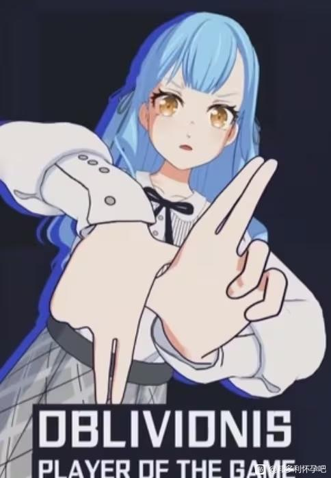
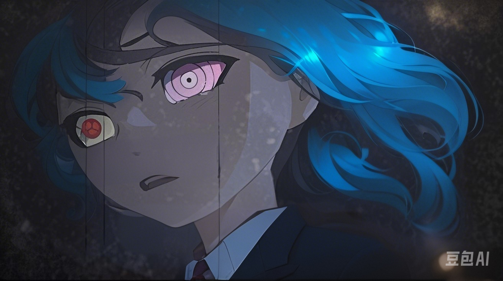

<!--StartFragment-->

<!-- x-tinymce/html -->

深夜，古德里安教授坐在办公桌旁，用鼠标翻看那些履历 

抬头问旁边的酒德亚纪，“挑选到中意的学生了吗。”

 “都是些初中毕业生......”酒德亚纪摊手道，“都是些小女孩啊，我情愿她们全都不及格。”

“其他十七个女孩子都无所谓。”古德里安用手戳了戳其中一页pdf，“只有这个女孩。”

酒德亚纪明显也看过这份文档，无奈道，“拜托，人家可是有权有势财团大小姐，年纪轻轻就组到乐队，甚至能登台表演的超级大现充，怎么会......”

“唉，你也是大现充，你就不会孤独吗？”古德里安打断道，随即点开了人家的演出录像。

没想到这个一头蓬松白发，风尘仆仆的老头还挺接地气。

酒德亚纪摸了摸鼻子，“这个嘛，等下一次面基的结果吧，我可以酌情孤独。”

顿了顿，古德里安教授扬起下巴，朝电脑屏幕示意，“仔细看吧，乐队表演时灯光会比较阴暗，很明显的。”

酒德亚纪将脑袋凑了过去，她皱着眉头，观察着反手摁着键盘炫技的蓝发女孩，“我看不出来有什么特别的。”

“你只盯着人家的胸脯看，当然什么看也不出来.......”

酒德亚纪将视线移向那女孩的脸蛋，舞台上流动着充当氛围的雾气，顶灯折射着棱光，阴影里，那女孩熔金色的眼眸正熊熊燃烧。

“不只是舞台上，我查过了，从小到大，她的瞳孔都是金色的。”古德里安教授惊讶道，“等下，你也点亮黄金瞳干什么，觉得樱花妹可爱，想求偶了？”

“我是不是樱花妹，那我问你，我是不是樱花妹啊？“

古德里安教授捂住心口，“也不用喊那么大声......”

“抱歉，我只是有些吓到了。“酒德亚纪扶着额头，眼眸变回寻常的黑褐色，“那个蓝发的女孩，刚刚朝摄像头看一眼......”

对于像她这样普通的混血种来说，“s”级的惊鸿一瞥，便有夺人心魄的威严。

......

现在快到傍晚了，雷声滚滚，雨点洒落。霓虹灯旁响起广告曲，城市的灯光恰巧同时点亮。

一个小姑娘，为了走出至亲死亡的阴影，要用她一切的能力去撑起属于自己的乐队，直到唱不动了，就在一次成名歌曲的串烧中宣布终止活动。这实在太感人了，人生能够如此就死而无憾了。

可就在刚才，她亲自宣布退出了亲手带起来的乐队“苦来兮苦”。

“哼，笨蛋。”辛酸冲进鼻孔，丰川祥子恨不得仰头痛哭。

可在亲手斩断乐队的因果后，她就连哭的力气都没有了，于是贴着街边缓缓独行。

丰川祥子时常感觉自己融入不到人群中去，即使身处校园等社交环境中与他人互动，内心依旧感到无趣与疏离。起初，她觉得这是一种“群体孤独”，自己是心委屈了，受打击了。

所以，她决定通过改变自己来改变命运，用唯一的爱好......

可现在，那些人告诉她，由于身怀一种血脉结成的诅咒，自己是与生俱来的意识孤岛，永远无法碰触真实的彼此。

“群体孤独”说的太简单了，这叫“血之哀”。

家破人亡，众叛亲离，搞乐队也麻痹不了在这感受到的痛苦，她感觉自己就像那个宇智波带土。

不过丰川祥子并没有爆万花筒血轮眼。

丰川财团的人告诉丰川祥子，祥子她的血统有高达四十好几的的纯度，本应堕落成“鬼”，却十数年如一日的稳定。

而由于过高的血统，她爆的是一种叫“永不熄灭的黄金瞳”的东西，嗯......放不出瞳术。

跟黄金瞳配套的，是龙类、言灵、混血种等一大堆从未听过的设定；自己的身体素质意外地好——都与这个血统有关。

所以按丰川财团的那个人所说，自己拥有成为“皇”级混血种的资质。

她丰川祥子将被过继到丰川家背后的本家，变成“上杉祥子”，作为交换，丰川家有资格将手伸得更远，家里欠的钱也能一笔勾销。

据说“上杉”家是“蛇岐八家”的内家，而“蛇岐八家”，在阴影中统治了整个霓虹。

不过丰川祥子并不想就这样成为黑道大小姐，她感到害怕，所以找了个理由逃跑了。

除了债务压力，也担心自己的黑道背景连累到乐队的大家，她才在逃跑之后，着急忙慌地退出了乐队。

叹了口气，丰川祥子直起疲惫的腰肢，朝新搬的蜗居方向走去。从现在开始，她知道自己要开始考虑怎么挣钱了——因为丰川祥子不但要上学，维持一日三餐。甚至要负担房租、养个颓废的爹......

这时候光从她背后照来，仿佛闪电突破乌云，有人用力的摁了车喇叭。

他骂的谁这么没公德心？

修改头发形象-1-.png

所有人都远离了丰川祥子，这种像是黑帮寻仇的阵仗，以霓虹的社会氛围是没有人会多管闲事，凑过来帮忙的。

从这家黑色的，平平无奇的丰田卡罗拉里，走下来的是一个笑得很甜美的姐姐，穿着一身制服，领口塞着素色的领巾，却沁出股大和抚子的气质。

“贵安，是丰川祥子同学吗？”

“不好意思，您认错人了。”

“稍等一下！”大姐姐高声道，“同学不是向我们卡塞尔提交了申请吗，先自我介绍一下，卡塞尔学院是一所位于美国伊利诺伊州芝加哥远郊的私立学校，有广泛的学术交流。”

“投错简历了真是抱歉，我不知道你们是一所大学。”

“没关系，我们刚开办了高中部。”大姐姐劝说道，“求求你，入我学吧！”

丰川祥子头也不回。

“毕竟，你也不想被困于蛇岐八家，失去掉自由......”

酒德亚纪话还没说完，昂热校长钦定的“S”级已经停住了脚步，回过头，蹙着眉，死死地盯着自己。

丰川同学长得精致可爱，这张软糯的娃娃脸再怎么摆出生气的表情，在常人看来也像是小猫在哈气。

可酒德亚纪忍不住双腿发软，后退两步靠在车子上。

“关于蛇岐八家，你们还知道多少？”丰川祥子询问道。

......

在周末傍晚里，雨点从窗玻璃上流过。

雨中。

有人聚餐、有人弹唱、有人相爱。

而丰川祥子，在开着暖气的车子里，跟两位从事高等教育的学者，掰扯中二的小说设定。

“哟西，我们卡塞尔，大大滴好。”驾驶位上的老头叫古德里安，日语有些蹩脚。

“怎样，有没有兴趣入学？”与自己挤在后排的大姐姐叫酒德亚纪，据说以前也与“蛇岐八家”有联系。

丰川祥子不语，只是一味用人家友情提供的手帕擦拭着身子。

卡塞尔学院的证件齐全，网络上的风评也有口皆碑，他们甚至免了自己的学杂费......

但跟“蛇岐八家”给出的条件比起来，也是九牛一毛。

她还是忍不住拒绝道，“他们说，我会被过继到‘上杉’家，成年后就会继任家主。”

前排的古德里安教授立刻加码道，“啊，丰川同学在卡塞尔毕业了，也能上任新开的高中部的校长，喜欢冒险的话，也可以直入行政部出外勤。”

“教授......”酒德亚纪有些意外。

古德里安教授摸了摸耳机，“校长说只要学校有的，条件随便她开，你没叮到咚鸡吗？”

酒德亚纪无奈道，“我听到通知了，教授，让我们说英文吧。”

“我知道你们很有诚意。”祥子捏着裙摆道，“可是，我不敢......”

沉默了一会儿，丰川祥子继续道，“据说我是‘皇’级混血种，你们大概也是因为这点想要招揽我吧？“

“不全是。”酒德亚纪说道，“丰川同学的品格、学业和英语水平也在考虑范围之内。”

“就是，‘蛇岐八家’说的很明白。”丰川祥子打断道，“我能被你们另眼相看，全是由于这啥血统。”

“请问你们卡塞尔有多少个‘皇’？”

剩下两人对视一眼，古德里安开口道，“‘皇’对标的是卡塞尔的‘S’级血统，暂时来看，学校里应该有一个。”

“对不起......”丰川祥子垂下脑袋。

酒德亚纪忍不住皱眉道，“你不需要抱歉，但请允许我多说两句——”

“身为‘蛇岐八家’的‘皇’，你的自由或许能保证；所谓家族的束缚，换个角度来说，也是能抓到手上的权力。可是，这会禁锢住你的视野、你的一辈子都会在东京蹉跎，而且，会有许多人因为你失去自由，甚至是生命。”

“你，你是霓虹金。”丰川祥子木着脸，询问道，“还是霓虹的混血种......”

酒德亚纪点了点头，“作为被当成家主培养的丰川同学你，‘蛇岐八家’会替你挑选‘家臣’，他们会是你最趁手的工具，也是你的附庸，亦或是奴隶。”

“黑道最重要的是忠诚，为此，‘蛇岐八家’会对你未来的家臣们进行无所不用其极的洗脑。”酒德亚纪补充道。“幸运的是，在下没有被选上。”

丰川祥子不敢相信自己的耳朵，可汽车行驶的颤动又在提醒她这一切都是真的。她眼神涣散地望着自己的小脚，希望这一切都是假的。

她猛地抱住头，回忆起早上跟丰川财团的那个人交流的经过。

那个人拿出一份文件，“我们会指名一些你熟悉的同龄人，陪伴你成为‘上杉’家主，她们会是你最好的帮手。”

“我没有朋友。”丰川祥子倔强道，接过那一份文件。

【橘千代】

【樱井桃华】

丰川祥子翻了个页——

【若叶睦】

“您能理解真是太好了。”那个人恭敬道，“她们确实不能被称为朋友，她们只是您作为‘皇’的‘臣子’。”

“没想到您是如此的高瞻远瞩，那个叫‘若叶睦’的，是您为自己挑选的半身，是您的‘影武者’吧？”

经历了那么多苦难，换来了更多苦难.jpg

<!--StartFragment-->

<!-- x-tinymce/html -->

打开房门，走进玄关，避开满地板的啤酒罐，洗漱完毕的丰川祥子躲回了自己的被褥里。

新租的蜗居在二楼，是改建的出租房，两父女就挤在只有一个小隔间的地方生存。

而隔间的推拉门里，是一个只摆得下台电视机、衣柜和一套小桌椅的起居室。

她老爸就睡在隔间里面，那能看得见电视的地方，而自己躺在门外的那一边休息。

原本，丰川祥子想要过夜，是挤在侧边的壁橱里cos哆啦A梦的。

但自从在里面睡出一条百足后，这伤心之地就彻底变成了杂物柜。

现在，她只好选择在柜子正对面靠窗的位置铺打上地铺，拉着张帘子将就了。

除此以外，日常生活也不太方便。

在这狭小的空间里，即使咬牙买得起，他们这个家也放不下灶台烤炉等大型家电。

聪明的祥子只好在房门旁边的鞋架去掉，添置个长款的矮柜，摆上个面盆和电磁炉来处理食物。

即使就这么一间出租房都要消耗三分之一的工资以做租金，她也打算拿第一个月的人工来给家里买个电饭煲，并以此作为每天上班的动力。

但在此之前，她还有必要的事情要做。

打开手机，能看见社交软件上，已经爽收了【99+】的小红点。

浅浅看了两眼，丰川祥子便心疼得不忍往下翻。她皱着眉头，将消息悉数掠过，再创建了一个新的社交账号。

“只要我离开，就没有人会受伤。”

丰川祥子这样安慰自己。

解下来，该看看人才市场里有什么适合自己的工作了。

来钱要快、不用抛头露面、还不能影响白天的学业。

妈妈刻薄地指责，哗啦啦地拉窗帘声，这便是我醒来第一刻听到的声音。

当我睁开眼睛时，映入眼帘的，是早已挂在窗外的日头，和妈妈特地打开的房门。

门外飘来西多士熟悉的焦香，勾得我顶着昏昏沉沉的脑袋爬起床。

今天好像是周一。

想要穿上拖鞋落地、想要去上课、想要吃早餐……人在一天中该完成的任务在脑子盘旋着，可躯体却愣楞地坐在那，怎么也使唤不动。

这是不对的，别人对我的帮助已经足够多了，我必须回应人家才行。

回应......

昨天的记忆袭来，我眨了眨眼，好像清醒了一些。

我第一次见到祥子这么狼狈的模样，气喘吁吁、全身都湿透了，强撑着说出要退出乐队之类的话。

鼓手立希忍不住开口指责、而贝斯手素世缠上去就要挽留。

环顾四周，好像只有我发觉丰川祥子内心的煎熬与难堪，祥子她，好像快要坏掉了。

从小到大，祥子对我的帮助已经足够多了，我必须回应人家才行。

看着自己的吉他，我听见了自己的心跳声。

我将乐器搭在了大腿上，因为双手止不住地发软——是激动，还是恐惧？

难听的话，就由我来说吧。

如此想着，我望着窗外阴雨，不让人家发现内心的纠结，缓缓开口道，“我从来没有觉得，玩儿乐队开心过。”

从那一天起，我把祥子最看重的东西给弄丢了，我让大家最重视的人离我们而去，我让乐队分崩离析。

我是个坏蛋。

回忆起这样的现实，只用了一瞬间。可想要接受这梦魇般的现实，却又漫长得能让太阳熄灭。

斑驳的阳光撒入窗户，投在靠窗的书桌。已经没电了的手机屏幕上，正反射出白晃晃的光。

昨晚，我用手机软件联系了祥子，想问问她该怎么办。

直到电量耗光，也不见有人答复。

我还会被人需要吗？

“小睦，醒了吗，来吃早餐啦。”

慢了半拍，若叶睦吃吃地回应道，“嗨伊……”

慢悠悠地洗漱完毕，若叶睦抓着三文治，面前摆着一杯牛奶，与家里人坐在一起准备享用早餐。

“早上好，奈美姐姐。”在注视下，若叶睦垂着脸蛋，与妈妈以姐妹相称。

妈妈放下了手中的牛奶，认真地望着若叶睦，等待女儿的倾述。

“我，我又起晚了。”若叶睦羞愧道，“要迟到了……”

“妈妈已经打电话给老师请假了，学校那边也没问题哦。”妈妈笑着安抚完，脸色便低沉下来。

若叶睦感觉拿着早餐的手又开始发软了。

“这半年的请假机会已经消耗掉了，而且，舞蹈课老师反馈你的作业也没有全部完成哦。“妈妈的语气温柔，“是遇到什么困难了吗？”

“没，没有......”

“这是姐姐每天辛苦工作换来的，那个舞蹈老师的班非常难得哦。”她放下了叉子，“如果你能这星期能够达标，可以把最后一节课换成你喜欢的表演课。”

都不喜欢，音乐也好、表演也好、全都讨厌死了。

可是。

爸爸妈妈都这么努力地上班了，我也要跟着好好学习和训练，这才是人之常情。

是我没有做好身为学生跟女儿的责任。

不论是装病还是真不舒服，只要没有像正常孩子那样去上课，就是在犯错吧。

“我知道了。”咽下食物，若叶睦慢慢回应道。

妈妈意犹未尽道，“妈妈昨天听说，隔壁丰川财团已经将业务扩展到公共交通这些行业了哦，斯国一！”

“据说，这多亏了你那个好姐妹，丰川祥子呢......”妈妈直勾勾地盯着若叶睦，“小睦是妈妈的骄傲，你绝对，绝对不会被比下去的哦......”

若叶睦下意识地把头埋低了一点，“啊，是。”

如果小祥是快要快掉了的话，妈妈是已经彻底坏掉了。

祥子，我该怎么办?

若叶妈妈嘴上一松，“托你祥子姐姐的福，丰川财团的那个人也给了我们家一个机会。”

“他说，丰川祥子，需要你的帮助。”她补充道，“妈妈也需要哦。”

“真，真的吗？”若叶睦期待道。

“是啊，他们会把你接过去培训，这样一来，你才能帮到丰川祥子，而且，我们也能摆脱演艺家庭的标签！“

妈妈不止一次抱怨过，“演员”这一职业的社会地位在霓虹其实很低，她每天都要遭受很大的精神压力。

估计正因如此，才会坏掉的吧。

我又眨了眨眼睛，忽然发现早晨的客厅，其实填满了色彩——阳光、盆栽、墙纸和家具。

是啊，妈妈都这么努力，我不能再给他们添麻烦了。

为了不要爸爸妈妈伤心，为了祥子不要坏掉，即使是罪犯的我，也要做出属于自己的贡献。

祥子没有理我，但她绝对是需要我的帮助的。

我扬起由衷地微笑，乖巧地答应道，“我明白了，奈美姐姐，我们什么时候过去呀？”

<!--EndFragment-->

<!--EndFragment-->

