# 世界末日前，高松灯最后的日子

## 1

好像有不得了的事发生了。高松灯想。班里来上课的同学少了快一半，灯把自己刚发现的这一事实告诉给爱音。“欸！tomorin才知道吗？”爱音惊讶地捂嘴，“最近电视不是天天都在播吗？最近形成话题的那个流行性病毒。”病毒？“前两天新闻不是说首相先生他也中招了嘛，现在还在抢救呢。据说政府和机构里得病的人相当多，很多部门现在都处于暂时的停摆状态呢。”“世界会不会因此而毁灭呢——X上还有人这么说呢！哈哈，我觉得有点夸张就是了，大人们肯定会有办法的啦。”爱音挤出一点笑容安慰着灯。“嗯，肯定不会更糟的。”灯也笑了，对爱音点了点头。两人就这么向着RiNG走去，今天也有预定的排练。街道上的行人少了不少，也几乎看不到一张笑脸。“今天就先练到这。”宣布解散后，大家各自收拾起东西。灯偷偷瞄了眼众人，大家脸色都不是很好，刚刚自己出门时还听到凛凛子小姐在员工休息室里抽泣。不确定该怎么做，所以不想说错话的灯在几乎窒息的氛围下选择了闭嘴。“练习的话，从明天开始就得暂停了。”沉默了好一会，立希向大家宣布了这个新消息。“RiNG马上就要关门整顿，在找到新的录音室前不用集合排练了。”大家点点头，一起走到了店门口道别。“不知道还能不能再见面呢...”立希叉着腰看向走往相反方向的爱音和素世。至于乐奈已经被她奶奶接走了，这几天都是她奶奶亲自来接送的。“走吧灯，我送你回家。”残阳的血红将地平线分为两半，宛如梦中的场景，沉浸于自己想法中的灯完全没有注意到身后的异动。二人还没走出几步，身后突然传来了爱音和素世的尖叫声，“不要——放开我！”一个穿着兜帽衫，戴着鸭舌帽的男人用水果刀顶着素世的脖子，同时另一只手摸向她背着的挎包，似乎是冲着穿着月之森校服大小姐的钱财来的。爱音拉住了男人的手想要把他拉开，却被男人一个用力推倒在了地上，似乎是撞到头了，在捂着头打滚。在灯还在大脑当机的瞬间，立希从百褶裙的兜里掏出一根折叠钢制甩棍，向素世的方向冲去，趁着男人注意力还在挣扎的素世身上的机会对准他的脖颈侧面结实地抽了一棍，对方像是被电到的青蛙一样抽搐了一下，接着重重摔晕在了地上。素世惊魂未定，没把握好重心，一下子跪坐在了地上，右手摸着自己正在流血的伤口。“血！”反应过来的灯连忙也跑了过去，从包里取出收藏的创可贴，挑出合适的尺寸给素世处理伤口。立希走到爱音身旁，伸出手帮她站起，而爱音已经一句话都说不出来了。“大家！没事吧？”凛凛子从店里跑了出来，“我已经报警了，接下来的事交给大人吧。总之你们趁着天还没全黑下来，快点回家去。”好像有不得了的事发生了。高松灯想。
  

## 2

“我回来了。”灯推开家门，顿时闻到了浓重的消毒水气味。客厅里比以往更加昏暗，似乎有意关掉了好几盏灯。原本应该上晚班的妈妈正和爸爸坐在餐桌上一起写着什么东西。听到灯的声音，他们同时抬头。“灯，你回来的正好。”高松由司将一张刚写好的清单塞到灯的手里，“你换一下衣服，过会帮爸爸去楼下买点东西。”“嗯，嗯...”灯扫了一眼，清单上是罐头、压缩食品和一些其他的日用品，边角还列着不少数学计算公式。“记住，不能一次性买完所有东西，也不要一次只买一种商品。”“爸爸，这是...”“先听我说，要注意买的店也不能一样，多换几家店分批买完。还有...”“爸爸...”“马路对面太田叔叔那家店你就不用去了，我们经常去他家光顾人家肯定认得你，我和你妈下午已经买过一次了。你得绕远点去...”“爸爸！”灯的声音带着哭腔，“到底..怎么了？”由司看见女儿的这幅样子，深深地叹了口气。而高松光则是抱住灯，和灯一起哭了起来。————————————最后灯还是按爸爸的话分批次买好了东西。高松由司到最后也没告诉灯事态究竟发展到了何种严重的地步，场外人的我们当然能明白他是不希望自己保护的宝贝担心，但这只会让本就心思细腻的灯更加折磨。房间里没有开灯，灯趴在床上，像是之前练习歌唱时那样用被子把自己包裹住，在被窝里用手机搜索有关病毒的消息。糟糕的是似乎为了维持稳定，有关的信息都被封锁了，要么是点进去显示帖子已被删除，要么是加载的圆环根本就转不到尽头。以往只会用手机聊聊天，在在线视频网站看生物和天文纪录片的灯根本没有多少网络经验，零星能看到的信息都指向了正斧对民间的控制能力正在逐步丧失这一绝望的论调。就在灯快要被绝望的气氛吞没之前，一个意想不到的消息框弹了出来。【丰川祥子】“灯，你现在在哪里？”是祥子？！灯很重视与自己亲密联系的人。哪怕是在mygo已经正式成立后，灯也没有删掉或是拉黑祥子和睦的Line好友。【阿德利企鹅】“祥子！”“我在家里，没事。你那边还好吗？”【丰川祥子】“嗯，我没事。”“灯，我一直欠你们一个道歉...”“我回头看了看，自己这辈子都挺有戏剧性的。”“灯，你读过阿瑟米勒的推销员之死吗？”【阿德利企鹅】“嗯，本以为一切都在向好的方向发展，结果却是什么也没实现，主角最后也溺死在了美好却虚妄的幻想之中。”【丰川祥子】“是啊，都是幻想...”“哈哈，果然一和灯聊起文学就会像变了个人似的呢。灯，你真的好可爱。”灯的脸扑腾一下红了。今天的祥子，是不是有点奇怪？哪怕是记忆中曾经的她也不会这么直白地夸自己呀。【丰川祥子】“灯，知道你没事我就放心了。”“请你理解，灯，我真的不是有意离开你们的，当时有很意外的事情发生，所以我不得不...”【阿德利企鹅】“没关系，祥子。知道你还平安无事，这对我就足够了。”祥子的信息停顿了好一会。“对方正在输入”的提示亮了好几次，似乎是在频繁地删改的样子。最后，祥子的信息发来了。【丰川祥子】“灯，最近不要在人多的地方聚集，贵重的东西也不要带在身上，尤其是你们的乐器一类的。如果情况必须的话，可以来这个地方呆一阵子，钥匙我藏在门口外栏杆下的孔洞里。记得把我的消息转发给她们。”“灯，还有大家，请多保重。真的很高兴能遇到你们。”祥子的头像在这之后亮了十几秒，接着灰了下去。不知怎么的，灯感到心口的什么地方痛了一瞬间，但又好像是错觉。虽然不知道为什么祥子像是突然想通了一样来和自己坦白，对她话间的某种诡异的氛围也感到不安，但是灯还是决定相信祥子，帮她把消息转发到了Mygo的群组里。  

## 3

点击展开，查看完整图片
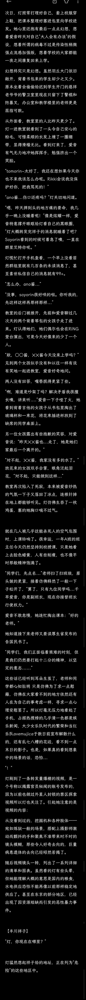  

## 4

结束了早课，灯和爱音一起抱着便当盒前往食堂。虽然本来可以直接在教室里吃，但是她们不忍心让老师和其他没午饭吃的同学盯着她们俩吃饭，于是食堂成为了唯一的就餐空间。两人挑好了座位，坐下开始面对面吃起饭来。灯打开自己盛了午餐肉罐头和蔬菜切片的便当，小心翼翼地扫了眼爱音的饭盒。还好，爱音没有落到和自己一样吃方便食品的地步，毕竟自己昨天去购物时已经连蔬菜都很难买到了，现在只能吃包装食品。爱音注意到灯打量的视线，又看了眼灯便当盒里死气沉沉的罐头肉，犹豫了一会，将便当盒里的一块开花肠夹到了灯的饭碗里。“ano酱？！”灯一下子抬起头，看到的是爱音一如既往地充满活力的笑脸。“tomorin现在可是正在长身体的青春女高中生噢！吃这种东西怎么能长高呢？”爱音俏皮地眨眨眼，“而且我也吃不完...真的啦真的！tomorin放心吃就好啦。”“而且昨天灯你也帮soyorin和我简单处理了一下伤口嘛，这就是回礼啦回礼！”“谢谢你，ano酱...”灯此刻心中除了感激再没有其他能表达的了。两人摆在饭盒旁的手机同时亮了起来，自不必说，一定是Mygo群组的消息【抹茶芭菲】“我有重要的是要河大家说”【花开富贵】“欸！乐奈酱能一口气打这么多字了？”【抹茶芭菲】“对卜起，我要退出Mygo!!!!!。”【阿德利企鹅】“为什么？”【椎名立希】“野猫，你再想想。”【长崎素世】“乐奈酱是不是被盗号了呢~”【抹茶芭菲】“奶奶，生病了，得回去照顾。”【花开富贵】“对不起，乐奈酱...”爱音战战兢兢地看了眼灯，脑中已经在构思安慰灯的语句了。意料之外的是，灯看起来毫无失落之意，只是认真地敲着手机键盘。【阿德利企鹅】“乐奈酱，就算暂时不能在一起，如果有困难的话大家也可以互相商量着解决。所以，至少可以先留在群组里吗？”【抹茶芭菲】“可是，这段时间会弹不了吉他。”爱音似乎有点理解了野猫的想法，于是她开始扣字。【花开富贵】“乐奈酱，那个叫请假噢。”【抹茶芭菲】“噢，那要请假。”【椎名立希】“你这家伙，别老害别人担心呀。”“祝老人家早日康复。”【长崎素世】“嗯，家人很重要呢。要好好和奶奶聊哦。”乐奈回复的意外的快。看到乐奈肯定的回复后，灯也松了口气。刚才连她自己都有些吃惊，在听到同伴退出的消息时第一反应居然不是“为什么”而是“怎么办”，或许自己的心态已经开始发生变化了也说不定。不过至少事情已经平安落地了。就在两人继续闷头吃饭时，附近似乎发生了骚动。爱音和灯循着声音看去，似乎是几个女生围在一张桌前，餐桌的主人正用手护着自己的饭盒。“吃的这么多，分我们一点也没关系的吧？”为首的勒索者她们见过，好像是高年级的学生。“学姐，我只有这一份..”“你要是还认我们当学姐，就乖乖把饭盒放下，我们还会给你留点。这是最后的机会。”“不行，我妈妈说...咳！”女生结结实实挨了一拳，差点把刚吃的饭也吐出来。“我最后说一次，把吃的交出来。”被女孩叫做学姐的人从兜里掏出了尖头剪刀。随后是一声又一声越发微弱的尖叫，喷射出的血液溅到了灯的脚边。爱音捂住嘴，不知道做什么好，她有些疑虑要不要马上带灯离开，但又怕她们俩被盯上。但在她反应过来之前，灯已经拽起她的手向门口飞奔过去了。“喂！你们——不准逃！”无视身后的叫喊，两人只是一味地逃跑。逃出这个曾经她们唤作羽丘女子学院的地方。不需要什么典礼，刚才发生的事已经是两人最好的毕业仪式了。说来灯自己都觉得好笑，她居然直到刚才才发自内心地意识到，以往的那些平凡却又瑰丽无比的日常，能豪气地喊出想成为人类的乐队日子，已经彻底一去不复返，向着深不见底的深渊坠落了。  

## 5

大家太热情了，lz吃个午饭再更顺便今天是三块钱冬瓜卤蛋米饭套餐，扣1给小灯分点  

## 6

拉着爱音跑了不知道有多远，灯实在累得不行了，只好在一处天桥上停下来喘口气。爱音此时也镇静了下来，牵着手，将眼前的灯抱在怀里，轻轻抚摸后背。然而还没能留给两人多久平静的相处时间，受到早上那条病毒般传播的视频影响，东京已经出现了游.行队伍。此时一批游行者已经出现在了天桥街道的另一侧，他们举着“恢复秩序”“消灭病毒”的标语，喊着要求本地.的官员采取措施的口号，却在同时派人打.砸.抢街道两侧的店铺，将商品成堆成堆地搬上队伍中间的货车。爱音很快拉着灯蹲下，两人躲在天桥上的广告板背后，没有被游行队伍注意到。她们隔着广告板的缝隙，看到街上的行人要么被以暴力为乐的人抓住殴打，要么就是被绑着白色臂带的人以“抓.捕.感染者“为由捆绑上货车——尤其令人不安的是，安置俘虏的车辆里分明装的是一桶又一桶的汽.油.罐。过了有多久呢，十分钟？半个小时？终于，游行队伍彻底离开了这个街区，灯和爱音颤抖着从天桥上走下，此时的人行道上已经满是散落的玻璃碎片、被粗暴打开或是破坏的商品和痛苦嚎叫着的伤者了。此外还有不少难辨人形的尸体，这些可怜人并非死在病毒之下，而是死于同族之手。灯想跑过去帮他们，可是爱音拉住了她的手，摇了摇头。这些伤势已经不是她们两个完全没有受过急救培训的高中生能够处理的了。爱音试着打了电话，可是无论医院还是警.局都是占线状态。两个人一路沿着来时的方向往回走，希望能找到维持秩序的人。  

## 7

“这里是...”两人走到了商店街一家夹在破碎店铺中不起眼，可她们却经常关注的一家店。这里是，或者曾经是，山吹面包房，也就是她们在RiNG时经常碰到的前辈山吹沙绫家的面包店。这里也没有逃过那些游行者的魔爪，两人踩着地上的碎片，推开了店门。好臭...店里空空荡荡，原本货架上香喷喷的面包和糕点此刻都不知所踪，收银台也被暴力砸开，看来是把能拿走的东西都掠夺殆尽了。“ano酱，有声音...”灯指着收银台背后的门，她刚刚听到那里传来了轻微的碰撞声，似乎是有人抵在门上。爱音点点头，示意灯不要说话，走到门前敲了敲门。“是...警察吗？”男孩子的声音？爱音和灯对视一眼，确认自己没有听错。“我们不是警察，是这附近的高中生。小朋友，你需要帮忙吗？”爱音努力做出温柔的口吻，轻轻问道。“高中生？那是姐姐的同学吗？”“欸，是沙绫前辈的弟弟吗？”爱音迅速理解了对方话中的意思，“能先让我们进去说吗？”听到爱音提到“沙绫”的名字，对方很快打开了门把手，呈现在两人面前的是一个比她们小得多的男孩，他的样子颇为滑稽，嘴上戴着口罩，头上裹着头巾，脚底的拖鞋还用塑料袋结结实实地裹了一圈。爱音领着灯，跟眼前的男孩走进了客厅。客厅的空间不大，角落堆着不少垃圾袋，窗户被用黑胶带从内部封上，同时还有消毒水的气味。和纯弟弟，也就是眼前的男孩聊了一会后，灯与爱音大概理清楚了山吹家的情况。在数日前病毒初现端倪的时候，山吹爸爸连着去熟人的店里拉了好几车面粉和其他面包的制作原料回库房，还跟商店街的其他邻居感慨大概再过几天就更难买了，得做好长期运营的准备。可是仅仅过了一天，爸爸就因病倒下了，接着是家里的其他人，沙绫也只好临时请了长假回家来照顾他们。纯因为症状还不严重所以也在帮姐姐照顾家务。但是就在爱音她们来的两天前，姐姐突然把自己和爸爸他们锁在楼上的卧室里，只在门上订了一张便条告诉纯接下来几天要怎么做。刚才听到门外有人砸店的声音，纯吓得根本不敢开门，爱音和灯是他这几天来见到的第一批外人。纯弟弟说完，恳求爱音“姐姐”和灯“姐姐”能不能上楼帮他问问姐姐和爸爸他们什么时候出来，他们已经整整两天没吃过饭了。  

## 8

高松灯拉着纯的手，跟在爱音后面，担忧地看着她。爱音来到门前，看了眼沙绫留下的便条：1）保证家门在任何情况下都处于紧锁状态。每日应多次检查门锁情况。2）每天两次检查房间角落，烧掉发现的任何动物尸体并堵上它们爬进来的洞穴（无论多小！）3）不要靠近病患。4）至少每两天一次，摄入维生素C片药片。每天都要记得吃蔬菜。食物要先从易过期的开始吃，不准挑食。5）....爱音咽了咽口水，抿住嘴唇，做足心理准备后扭开了门。站在一侧的灯看到爱音的瞳孔一瞬间缩紧了，纯松开了灯的手想跑过去看，但爱音重重合上了门，紧紧盯着眼前的男孩。“纯弟弟，不要看。”“沙绫前辈她...”大概是心里早就有了个答案吧，男孩很快理解了。灯无声地抱着痛哭的纯，希望这能给他一点聊胜于无的慰藉。“沙绫前辈说的是对的...”爱音又看了一眼便条，“纯弟弟，这里已经有人开始袭击了，你跟我们一起走吧，我们把你送到安全的地方去。”“沙绫前辈...”灯忧心忡忡地看着门，“就这么放着不管了吗。”“灯，我们只能做我们能做的。”爱音说，像是下了某种决心一般，难得没有用昵称称呼灯。“我知道了...”好在公共安全管理系统没有完全崩溃，在领着纯走了几个街区之后，三人幸运地找到了仍然在工作的警察部门。虽然好像办公室里仍在工作的警察不到一半，但是他们还是相当负责任地表示将会暂时照料山吹纯，直到一切恢复正常。做完这些，两人才意识到从她们没吃完午饭就跑出食堂之后，时间已经不知不觉来到傍晚了，两个人的肚子都饿的咕咕叫。虽然很不情愿，但是她们还是来到了离别的车站，坐在长椅上等候着电车。“呐，tomorin。”爱音此时已经没有了先前的余裕，语气中带着某种迷茫，“世界会不会因此而毁灭呢？”“应该不会的吧，ano酱。”“我啊，还不想那么快死掉。其实我一直都在害怕，害怕班里的同学又少掉一个，害怕跑到RiNG排练室的时候发现有人缺席，害怕哪天推开教室门的时候，tomorin你的课桌是空的....”灯知道爱音一直在强撑着，她直到刚才两腿都在打战，但灯也不知道这种时候该做什么，她嘴笨，一下子想不出爱音那样轻柔的安慰话语。但是她知道，爱音想有个人陪着。“没关系的，ano酱，我会一直陪着你的。”“tomorin...”夕阳的见证下，少女们依偎在长椅，祈祷着明天也能平安相见。  

## 9

灯刚刚打开家门——“森先生，你在说什么？‘车票已经没用了’是什么意思？！”“我回来了...”“我还有妻子和女儿，我们家的情况你也清楚的...”高松由司打电话的样子把灯吓住了，她几乎从没见过温柔的爸爸这么生气过。而妈妈则是放下手中的账本，跑到门口牵起灯的手，将灯带到房间里。“森先生，我们也认识这么久了，通融通融....”房门关上后，最后的几个字已经听不到了。灯不知所措地看向妈妈，却发现后者和她一样无助。“妈妈，爸爸说车票...”“嗯。本来想坐车搬到你外婆家那里住一段时间，乡下应该不会受到很大影响。”高松光说，“所以你爸爸之前托熟人买车票了，但是上午的时候城市就被封锁了，军队也驻扎在高速路口上。”是那些骚动导致的吗？说起来，那个奇怪的视频也是早上发布的...“灯，你这段时间不要再出门了，现在外面很危险。”高松光拉住灯的肩膀，“妈妈知道你和朋友很要好，但是你现在去找她们玩，不仅是有受伤的可能，也是对她们的不负责。你的朋友都是好孩子，肯定会理解你的。”“嗯，我知道了，妈妈。”“乖孩子，妈妈爱你。”  

## 10

第三天，灯在自己的笔记本上胡乱图画着。自己所熟知的城市像电影一样被封锁，不少人像条狗一样死在马路上却没人收拾。之前产生的游行团体越来越大，听说已经形成了能跟东京警察对抗的势力，时常听到城市远处传来的枪声和爆炸声，已经发展成内战的样子了。而自己和家人，还有Mygo的大家，像是掉入了深不见底的洞穴里的西瓜虫一样，无论怎么爬都爬不出覆盖着的黑暗。有人在大街上吵闹。灯看向窗外，一群拿着水管，棒球棍甚至是椅子腿的人把一个抱着塑料袋的小学生堵到了墙角，紧接着听到的是一声接一声的闷哼和钝器击打在肉块上的声音。最开始灯还无法接受当街杀人的光景，总是一头闷进被子里哭个不停。但现在，她只是默默把窗帘拉得更紧了一些。虽然白天还会有配枪巡警或是自卫队士兵巡逻，但是他们已经没有维持宵禁的组织能力了，所以居民被告知不要在没有必要的情况下夜晚出行。刚才那个小孩子，应该是家里存粮吃完后出来找食物的可怜人吧。虽然日子很难熬，但好在通信并没有切断。Mygo的大家仍然在群组里发消息互报平安，每天醒来看到大家还在群里发消息就是灯最大的慰藉。爱音说自己家住的比较偏，就在羽丘附近，所以没有受多少冲击。素世家附近的区域安保很好，考虑到素世家附近居民区的地段，有关部门派驻了额外的自卫队部队维持那里的秩序，所以暂时也不需要担心。乐奈因为回不了老家，暂时和凛凛子小姐借住在一起。反倒是立希住的地方情况不妙，离新闻里爆发剧烈冲突的几个地址相当近，所以大家也最关心她的情况。好在立希说她姐姐联合附近认识的居民组成了街区互助会，还有用土质武器武装起来的巡逻队，这样万一发生意外情况的话也能在警察来之前组织有效的防御，立希本人也加入了消毒小组，负责定期给周边区域喷洒消毒水。爱音看到后夸了立希好几句，说她姐姐组织力真强，也要在自己家附近试试。立希嘲讽说就你那身板怕是第一天就得累趴下，气的爱音展开了表情包刷屏攻击，逗得灯咯咯笑。  

## 11

灾难总是猝不及防的。一睁眼，灯看到的是蹲在床前的妈妈正在把自己往床外拽。灯身体一轻，脚踩到梯子爬下了床，彻底清醒过来。“灯！绝对不要出来！”没有给更多反应的机会，高松光把灯塞进了房间的衣柜里，接着快步离开了房间。灯此时注意到柜子里挂着的衣服后暗格里塞满了先前自己分批买的罐头食品和平时妈妈锁在保险柜里的饰品。妈妈离开房间时没有把房门带上，这让灯听到房间外有人在和爸爸对话。“高松先生，我再说一次，我们是市/政/府/本/辖/区的工作人员，负责征/收市/民们多余的可利用资源以进行更公平的分/配。这里有证据表明你们储备了多于配给预定量的食物与饮用水，现依据灾难/紧急/管理/办法第三十三条要求您立即打开房门并接受详细的物资调查与清点，配合我们的工作，谢谢。”“开什么玩笑，我和我夫人每个月都给你们和那帮坐在席位上的家伙乖乖纳/税，从来没有欠过你们的。”“现在是紧急时刻，先生，请你理解，把安全锁取下吧。”“隔壁的小野家上一周被你们查到了，直到现在我都没见过他们第二面。开门？想都别想！”“居民拒不服从管理，现依据相关/管理/方法实行处置。攻坚小组上。”接着是破门锤击打防盗门的巨响。听声音似乎爸爸在推东西堵门，但是门很快就被撞开了。好像打起来了，妈妈在哭，但是好像有人敲了她一棍，之后就没声了。灯也有点想哭了，但是她透过衣柜缝隙看到自己卧室里有人走进来，于是灯死死捂住了嘴，不敢发出半点声音。  

## 12

点击展开，查看完整图片
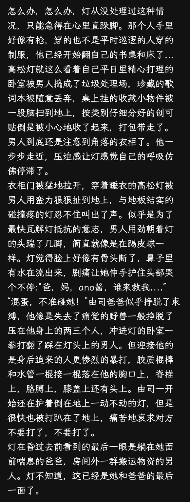  

## 13

还是末日灯好写，就喜欢这种人类衰退的世界景象，废土更是能带来更大惊喜呀。灯灯的心跳废土大冒险，哈吉马路哟  

## 14

灯再次睁开眼时，天已经亮了。家里寂静无比，仿佛夜里发生的一切就是一场噩梦，但满地狼藉的房间和灯脸上火辣辣的伤口提醒着她那一切都是真实的。“爸，妈...”灯挂念着被打伤的家人，强撑着自己爬起来，跌跌撞撞地跑到客厅，可是除了满地垃圾和已经变形的防盗门外什么也没看见，已经不知道被搬到什么地方去了。灯的鼻头又酸了，她呜咽着爸爸妈妈，泪珠一滴滴砸在地上。“我该...怎么办...”哭了不知道多久，灯感觉内心已经麻木了，她已经哭累了。乐队的大家不在，现在连从她出生时就保护着灯的避风港也没有了，她从没像现在这样孤军奋战过。“灯，知道你没事我就放心了。”“tomorin，世界会不会就因此毁灭掉呢？”“乖孩子，妈妈爱你。”灯擦了擦眼泪，有这么多人在乎她，她还不想这么快就让在乎她的人失望。高松灯就是这样的人。对了，手机...灯回到房间捡起屏幕裂开的智能手机，打开熟悉的屏保，好在没有影响原本功能的使用。她试着拨打了几个紧急电话，没有一个接通。也是，连这种事都发生了，他们要是还能响应的话就不会发生这种事了，灯这么想。冷静下来后，灯觉得有些累，但是刚苏醒的她又没有困的意思，于是她趴到餐桌上，闭着眼发呆。不知又过了多久，灯抬头看了眼门口被砸得变形的防盗门，站起身来到客厅拎起爸爸的登山包，接着回到房间找到衣柜里自己先前藏住的暗格。果不其然，那些人已经把物资没收了，只留下了她一人份的配给。灯将剩下的物资和其他的重要物品一点点仔细整理好装进背包里。四瓶矿泉水，五盒午餐肉罐头，一包方便面，一盒压缩饼干，还有纸质存折，身份证件...就算再用多的空容器接自来水喝，也只够吃不到一周的样子。灯慢慢整理着要带走的东西。收拾好时，她又瞄了一眼自己的房间，无言地捡起地上一本绿色封皮笔记本，将其塞入背包。“要去哪里...”反正，家里绝对不能待了，谁也不知道下次还会不会有人来袭击。对了，还没给大家报平安...灯打开手机，惊讶地发现群聊消息居然停在了昨晚，手机网络也完全没有，难怪刚才怎么也打不通电话。去爱音她们家看看吧，就当是报平安了，而且自己也很担心断了通讯后她们的安全。乐队里只有乐奈没有把住址告诉过别人，但是其他几人的地址灯都有好好记住。在确定了目标后，灯在父母的卧室里找到了妈妈的电瓶车钥匙，将头盔好好绑到头上。灯又拿起茶几上的水果刀，脑中浮现起自己像之前看到的团体把人堵到角落然后用刀刺杀，血液飞溅到自己身上的场景。她脸色变得刷白，又把刀扔下了。在出门之前，灯最后看了一眼自己住了16年的家。不大却温馨的客厅，父亲时常下班后就躺在沙发上放松打开一瓶冰啤酒看电视，妈妈则是在忙完晚饭后看手机，吃完饭就要赶去上夜班了。她记得有时爸爸睡着了，妈妈做好饭之后喊也喊不醒，还得自己跑过来把爸爸摇醒，然后领着他到餐桌。这样的日子对现在的高松灯来说，已经是永远的回忆了。于是她呢喃着告别的话语，轻轻地关上门，按下了电梯按钮。  

## 15

点击展开，查看完整图片
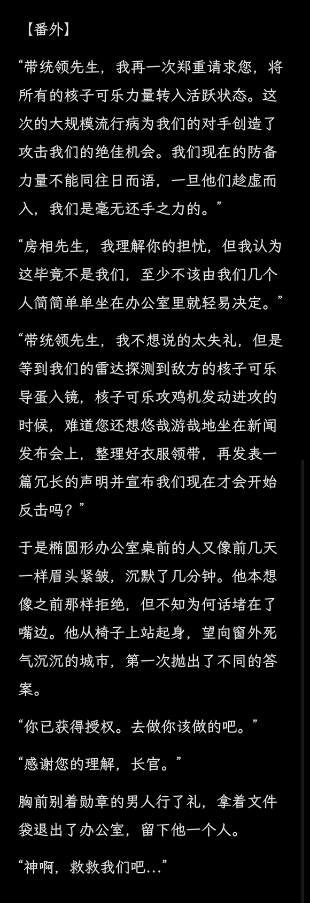  

## 16

对不起大家，今天在图书馆对线日语，没怎么写。明天努力多写一点，明天见
  

## 17

不在屋内自我隔离而是置身于大街上弥漫着腐气与可能的病毒之中，这在他人看来无疑是一种自杀行为，只有那些走投无路吃完了所有补给，又得不到救援的人才会这么铤而走险。而高松灯现在就正驾驶着电瓶车行驶在空旷的街道上，她并非出于什么求生的念头，也没有那个意思。与其说她是像之前告诉自己的为了给Mygo的大家报平安，倒不如说想通了的她只是想在一切完结之前最后看一眼现世。因为，毕竟不管是和家人的一辈子，还是和乐队的大家的一辈子，马上就要走到尽头了嘛，高松灯自顾自这么想着。不知怎么的头有点痛，看来伤口还没好全。车开的很快，害怕随时可能停电的妈妈坚持每天晚上都要给车充一次电，所以现在电瓶还是满电状态，足够她骑不短的距离。爱音的家离灯只隔了几个街区，现在路上也根本不可能堵车，于是不到半小时灯就骑到了爱音家门口。爱音家车库的汽车还在，看来她们还在家。街道虽然有爆炸和燃烧的痕迹，也有已经结块的血和难以辨认的碎片，但是没有看见尸体。灯来到门前敲了敲，没有人回应。她又叫了两声爱音的名字，这才听到门后传来了拖鞋的声音。很快，一旁的电子门禁显示屏亮了。“tomorin，是你...怎么伤成这样了？！”爱音被灯脸上的伤吓了一大跳。灯摸摸自己的脸，原本因为血结块而没了感觉的伤口被触碰时爆发出了惊人的痛感，叫灯立刻收回了手。“我这就给你开门！”门把手转开，灯看到爱音戴着一副口罩，往自己身上喷了点消毒水就领进屋了。灯乖乖地在客厅坐下，把包解开放到地上。爱音抱来急救箱，一边处理伤口，一边询问灯的情况。爱音听着灯的叙述，心疼地看着灯脸上的恐怖创口。就算伤口能够愈合，恐怕脸蛋也无法完全恢复最初的样子了吧。“太恐怖了，怎么会发生这种事。”听到灯描述的恐怖经历，爱音震惊不已，“tomorin，过会我和你一起去报警吧。”“谢谢你ano酱，但是我开车过来的时候没有看到一个巡警，他们好像今天早上就从这片区域撤走了。”“是吗...希望不是抢完东西就开溜了吧。好了灯，吃点抗生素，不然会感染的。”“嗯，谢谢...ano酱，你家就你一个人吗？”“嗯，在事情发生前他们就飞到欧洲度蜜月去了，丢下我一个人在东京看家啦。”“ano酱不担心他们吗？”“他们好的很！听他们说那边24小时有人值班巡逻，安全得很呢。”“是吗，那就好...”这时，爱音的肚子不合时宜地叫了起来，于是她尴尬地挠了挠头，嗯了好一会才下决心问道：“tomorin，那个...你还有吃的吗？我，我已经半天没吃过东西了...”灯连忙打开背包，拿出一包方便面。“ano酱，已经没有吃的了吗。”“嗯，家里储备的东西本来就不多，那次我们分开后东西也越来越难买到，我本来都...”“我也饿了，ano酱和我一起吃吧。”现在的环境，两人自然是没法子像以前那样冲热水泡面了，只好撕开包装袋撒上调味粉，你啃一口我再啃一口。席间灯偷看了一眼爱音的表情，爱音像是求到妈妈买玩具的小孩一样满足地笑起来，每吃一口都发出满意的轻哼声，逗得灯也笑了。“ano酱和仓鼠一样。”“tomorin，我好渴...”“我这里也有水，一起喝吧。”“最喜欢tomorin啦！”“ano酱还没吃饱吧，这里还有罐头...”饭毕，两人并肩躺倒在沙发上，满意地揉着肚子，相视一笑。“ano酱，你和我一起走吧。”“欸？”“这里已经不安全了，祥子之前告诉我如果有情况就可以去她那里...”灯说，爱音听着灯说话的嗓音怪怪的。“嗯，我跟灯你一起去吧。”反正家里也没食物储备了，爱音觉得不如跟灯一起去碰碰运气。灾难发生后，虽然社会秩序崩溃的很快，但好在现代先进的发电设施和自来水厂仍然维持着正常工作，更何况少女们所居住的东京都市圈更是保障的重中之重，所以直到现在水龙头仍然可以出水，插座也能充的上电。爱音开始整理自家还剩的物资，顺便把能带走的水瓶灌满自来水。灯则是把电瓶车推到院子里，用插板给车充电。她们必须快速行动，祥子家的位置很偏远，如果想在天黑前抵达必须得尽早出发。很快，两人把电瓶车的座桶塞满了物资。灯戴好头盔，跨上了车。爱音也背上挎包上了车后座，揽住灯的腰。“tomorin，以前没见你开过电瓶车呀。”“这是妈妈上夜班用的车，她教过我开...”“噢...”意识到话题不对，爱音马上住嘴了。“不过真新鲜呢，坐tomorin开的车什么的，嘻嘻。”“嗯，ano酱坐好了。”灯扭动钥匙，拧下了油门，向着祥子所在的市郊驶去。  

## 18

街道上安静的可怕。运气好的话，灯还能看见燃烧的汽车或是一两个哀嚎的伤员，她们已经对此见怪不怪了。可大多数时候，曾经熙熙攘攘的城市表现得与死城无异。车子拐过弯弯绕绕的道路，渐渐远离了最繁华的地段。路边的尸体肉眼可见地增多了，这里早在瘟疫最开始爆发的时候就是重灾区，于是后来对这里的处置也是最无力的，毕竟其他地方已经自顾不暇了。爱音拍了拍灯的肩膀，指向路边一辆撞毁在墙上的警车。灯看到已经变形的驾驶室内分明躺着一具不成人形的制服骷髅。“tomorin，你看那里。”灯定睛看去，原来骷髅的腰间插着枪套，如果眼睛不尖的话确实很容易忽略掉。她明白了爱音的意思，把车停到了路边，两人走到警车旁，合力拉开了变形的车门。爱音小心地把枪套从骷髅身上解开，这是她经常在电视剧里看到的那种左轮手枪。“ano酱会用这个吗？”灯好奇地问。“我也只是在电视剧里看过啦...不过tomorin，这样坏人出现的时候我就可以保护你了呀。”爱音把枪套绑到腰间，用手指比了个手枪，对着空气biubiu射了两枪，“虽然我不会用，但是把坏人吓跑还是绰绰有余的啦。”“嗯，我相信ano酱。”灯又把视线放回车内，钻了进去。她开始帮骷髅简单整理衣服，扶正帽子，爱音看到也来帮忙，和灯一起整理好了骷髅的仪容。正当两人离开驾驶室时，灯注意到驾驶座下有个像是琴包的箱子，就顺带着把长箱也拖了出来。两个人蹲在地上打开箱子，惊讶地发现里面居然放着一把发射橡胶弹的镇暴霰弹枪。不知怎么的，高松灯感到内心升起一种宛如来自异世界的亲切感，她用自己都有些惊讶的熟练度，学着记忆里在电影看过的动作将橡胶弹一粒粒装进弹仓，接着用背带背上，看的爱音肃然起敬。“欸，tomorin好厉害！是在哪里学过吗？”“不知道...有种用过很多次的感觉，大概是错觉吧。”“嘿嘿，不愧是tomorin。”最后，两人站在车前双手合十拜了拜，祝愿对方成功成佛：“谢谢，骷髅先生。”  

## 19

“丰川同学？喂~我们来找你了哦。”爱音再次敲门，依然没有人回应，但她确实听到屋里头有什么动静。“好奇怪哦，tomorin。我明明听到屋子里有人的。”“没关系，ano酱，我找到钥匙了。”顺着祥子之前发的位置，灯从洞里掏出来一把金属钥匙，“让我来开门吧。”推开门，一股恶臭熏得两人连连后退，不好的预感油然而生。酒精，呕吐物，消毒水，一切在灯和爱音脑中有概念的最腐烂、恶心的气味在这里形成了大杂烩。“tomorin，祥子她真的住这种地方吗？”爱音看着玄关后堆满酒瓶和垃圾的昏暗房间，“这，这真的不是我们走错地方了吗...”“小祥...”灯顶着恶臭走进房间，担忧地寻找着祥子的身影。“小祥，你在吗？”“丰川同学~”爱音也跟了进来，狭小的客厅一下子塞满了两个人。爱音摸索着打开电灯开关，可灯并没有亮，明明周围也没有断电，看来是已经欠费了。忽然，像是一次性勺子折断的声音从内部的一个用床帘隔开的房间传出。爱音和灯对视一眼，确认自己没有听错，两人慢慢靠近床帘。没有错，她们走的越近，恶臭的味道就更加难以忍受，声音也越发明显了——是人类在咀嚼和吞咽什么东西的声音。灯蹲下，在帘布前的地上捡起了一撮蓝色的毛发，还有掉落在旁边的真丝发带。  

## 20

通过百度网盘分享的文件：Screensh…链接:网盘链接提取码:8o58复制这段内容打开「百度网盘APP 即可获取」  

## 21

哐当，哐当，咯噔。灯把最后一点碎骨收集到了收纳袋里，小心地扎好布袋密封。她无神的双眼盯着自己颤抖着的双手，那上面沾着来自骄傲绽放的重要之人的血。爱音收拾好了祥子家剩下的物资，虽然没有一点食物，但好在祥子平日里买的不少实用日用品她们也用得上。似乎是预料到灯她们可能会来一样，祥子还给她们按人头采购了最基本的生活用品，不过现在看来是再也用不上了。大概连祥子自己都想不到自己这原本最不应该成为冲突中心的市郊便宜公寓居然正好处在暴乱团体与警员的最前线吧。爱音走回小隔间，正想安慰一下灯，却听到了灯那勾起她宛如来自遥远回忆里的歌声。“内心满是憔悴 眼神颤抖不止，”“我在这世界孤身一人，”“在不断凋零的春季中，”“每年都只感受到冰冷。”是春日影，但这次没有吉他伴奏，没有架子鼓支撑，没有贝斯辅助，也没有了钢琴温柔的陪伴，只留下灯一人演唱着属于两人的歌。爱音就这么默默地听着灯唱歌。她忽然想到这好像是她在Mygo!!!!!暂停练习后第一次听到灯的歌声，这或多或少勾起了她对旧世界的怀念。但是这又能怎样呢，Mygo已经名存实亡了，就和这个日益腐败的世界一样。现在的她们只不过是乱世之中祈求活的更久的生命罢了，音乐啊，乐队啊什么的，太遥远了。“...没有结束。”爱音被吓了一跳，灯不知何时突然出现在眼前，双眼失神，将手搭在爱音的身上。“乐队，会永远继续下去。”“ano酱，立希，素世，乐奈，大家，大家还能继续陪着我走下去的，因为要组一辈子的乐队嘛。”“对吧，ano酱。”对...对吗？灯的突然袭击搅得爱音顿时不知所措，但千早爱音毕竟不是个喜欢随意糊弄应付人的性格，于是她还是认真想了一会，说：“现状很艰难，我也不一定能陪tomorin走到最后...”“但是在那之前，我会一直陪着tomorin的。”“我相信ano酱的话。”灯笑着点点头，“小祥也会很高兴的。”“欸？丰川同学？”爱音露出了惊谔的神色。“嗯，她刚刚答应我了，愿意和我们一起旅行噢。”灯开心地举起胸前沾着干涸血迹的布袋。“因为，大家要一直一直都在一起嘛。”  

## 22

灯略带抱歉地看向房间角落，穿着月之森校服的祥子只是微笑着摆手表示没关系。爱音看不见小祥，高松灯一眼就看出了这点。在爱音的眼神中灯读出了和以前美绪收到她那满满一箱西瓜虫一样的眼神，何况这也不是她第一次遇到这种情况。灯记得幼儿园时在公园和一个身上缠绕着紫色眼眸，身着黄绿色的洋服女孩一起玩了整整一下午，但是后来来接自己的爸爸妈妈却说当时只有自己一个人。类似的情况发生过很多次，所以高松灯早就是处理这种情况的专家了，她对如何处理这种事得心应手。爱音看到灯不好意思地挠挠头：“对不起，ano酱，我大概又说了什么奇怪的话吧。”“没事哦，tomorin休息好了我们就出发吧。”见到灯冷静下来，爱音松了口气，背起地上整理好的挎包，“等我们找到地方安静下来，再想办法像以前那样开Live吧~”灯也转身去拿登山包，忽然感觉鼻子一凉，又开始流鼻涕了，每到这个时候都会有点头晕。她抽了一张面巾纸擦了擦，发现纸巾上的液体里混着血丝。“..”“Tomorin？还没好吗，我们要出发咯”“来了！”灯回头应道。  

## 23

考虑到灯的情况，爱音接手了司机的任务。立希家离她们的位置最近，同时也形成了自卫团体，对爱音她们来说是最好的去处。因为不知道为何，昨天开始原本在街上巡逻的自卫队就全部失踪了，她们最信任的保障力量就这么消失得无影无踪。询问了路上碰见的出来寻找无人商店觅食的行人，得到的答案是接到命令集体撤离了，居民被要求尽量减少离家频率，没有特殊情况尽量避免外出。但是恐怕随着家里食物的耗尽，像爱音和灯这样的人只会越来越多吧。坐在爱音后座的灯观赏着两侧靠近又远去的景色，脑中响起了嘈杂的环境音。那是在一切发生之前，在她意识到一切都无法挽回之前，这些街道原本的样子。曾经在街道上漫步的高中生，急着下班回家的社畜，现在只剩下了满是垃圾和碎片的路面与少量没来得及处理的尸体。灯忽然感到有些头晕，她拉了拉爱音的衣角，靠到了她的肩膀上。爱音不安地看向一侧的灯，发现她的鼻腔正不断涌出血液，浸染了自己的制服。“血！”爱音连忙刹住车，拍了拍灯的脸，“tomorin，能听到我说话吗？”灯却像是剪断了线的木偶，一点反应也没有。爱音丢下车，把灯扶到街边的墙边靠好，帮灯把身上的大包小包都取了下来，接着把手背放到灯的额头上。“天呐，怎么烧的这么厉害！”爱音被灯的体温吓到了，她连忙从包中取出退烧药和抗生素，但是没有照顾过昏迷病人的她又不知道怎么喂药，轻易用水冲服又害怕灯呛着，急得爱音团团转。就在她几近绝望的时候，路口拐进来一辆高级轿车，她连忙跑到马路上将车拦住，祈求着车主能给她们一点帮助。车窗摇下来了，爱音差点哭出来了，因为她认识后座的人，坐在那儿的正是若叶睦，既然是小灯以前乐队的成员，一定会愿意帮忙的。“那个，是若叶同学吗，能不能帮帮我们...”“...”“tomo...灯她突然发烧了，现在昏迷不醒，求求你，”爱音恳求道，“载我们去附近的医院吧，哪家都好...”睦看了眼前座的方向，随后转过来不好意思地摇摇头：“对不起，我们不能让生病的人上车。”“求求你们，我什么都会做的，救救小灯吧！”爱音拉着门把手，哐当一声跪在车前哭着说，“若叶同学，不要见死不救呀，你们以前关系应该很好吧...”睦的脸色有些为难，她看看跪在地上哭的爱音，又着急地和前座的人说了些什么。虽然隔着挡风玻璃爱音看不到车内，但她听到一声暴怒的斥责，睦好像被吓了一大跳，最后低下了头。“对不起，不行...”“这...”“你们最好也想办法赶紧离开东京，素世和她妈妈刚才也已经走了，”睦看了眼前座，认真地和爱音说，“现在自卫队都在撤离，有消息说随时可能会有核打击到来...”“欸？”“差不多了吧！司机，开车。”陌生的声音打断了她们的对话，汽车发动机再次响起，把爱音甩到了一边。睦担忧地从车窗探出头看向她们，但一只手把她拽了回去，车窗又关上了。爱音绝望地看着汽车远去的缩影，她回到灯的身边，握着灯发热的手，像是下定了某种决心。“tomorin，我不会让你死的...”爱音把要喂的药放进嘴里，含了一口矿泉水，接着扳开灯的嘴，亲上去，把药一点一点小心地喂给了灯。  

## 24

找朋友约了一张末日灯，感谢大佬今天身体不适请个假，昨天切完管人片眼睛痛，休息一天
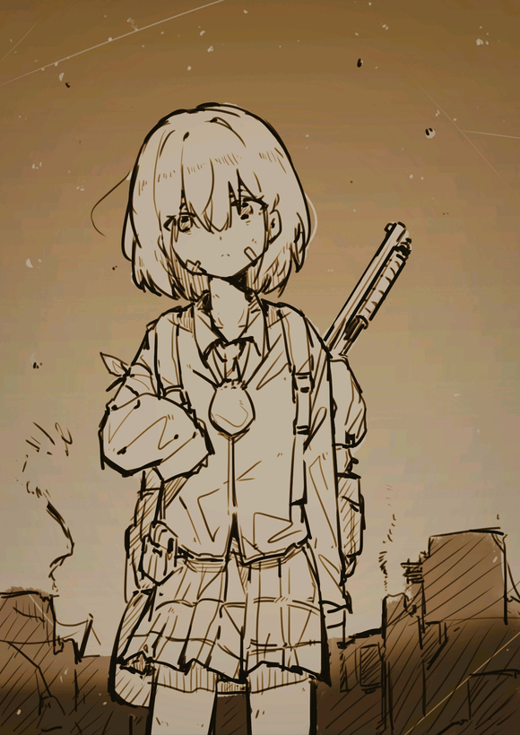  

## 25

脚上传来踩着云朵的触感，头晕晕的，很痛，眼前的光景像是身处暴雨之中模糊不清...灯感觉自己像是走了很长很长的一段路，有好多声音在和自己说话。她听到爸爸妈妈在远方呼唤着自己的名字，听到立希在安慰自己，听到素世在给自己道歉，还听到祥子吟唱着她们第一天认识时的人类之歌。短暂的十六年人生在眼前如走马灯般演进，令灯感到无比安心与舒适，仿佛全身的痛苦都随风飞走了一般。好像隐约听到了爱音的声音...是在哭吗？为什么要哭呢，明明这里这么舒服，这么温馨，宛如能让人忘却一切的天堂...在她最后的意识快要消散前，灯隐约感到有什么东西贴上了嘴唇，温柔地撬开了自己的嘴。接着身体开始发热，但是神智似乎开始回归现实了...对了，我们是在去立希家的路上来着，我怎么睡着了？灯睁开眼，与贴在自己脸上的爱音四目相对，她想说话，可是嘴被爱音堵住了。似乎是发现自己醒了，爱音连忙抬起头，脸红的像是夏天的桃子。“tomorin，你听我解释，退烧药...唔！”灯夹住了爱音的小腿，双手缠绕上爱音的腰肢。“ano酱...喜欢这样吗？”“ano酱说过愿意一直和我在一起，所以我什么都愿意为ano酱做...”没用多大力气，灯把爱音拉近了一些，鼓足勇气吻了上去。爱音起初挣扎了一番，但是看着眼前灯毫无防备的可爱脸庞，渐渐地开始配合起灯的动作。两人难得地收获了短暂的宁静。不知道时间过了多久，从天空传来的喷气引擎声打断了她们。一艘小型客机从天空中飞过，在云彩上划出一道狭长的剪切线。灯和爱音从迷乱的神情中回过神来，互相松开了对方。两人尴尬地沉默了一会，爱音转身去扶车，灯收拾起地上散落的药瓶，接着无言地上了车。坐回后座后，灯的心里一团乱麻，她无法解释自己在刚醒来的时候做出那些事的动机，那时只是内心的潜意识暂时接管了大脑的控制权，也可能是以为自己仍然在梦中...但是不管怎么样，一定伤害到爱音的情感了吧，总之得先道歉才行...就在灯想要开口之前，空中传来一声巨响，她们看到客机的一侧引擎冒出黑烟，同时机体开始调整方向，向着地面飞去。  

## 26

点击展开，查看完整图片
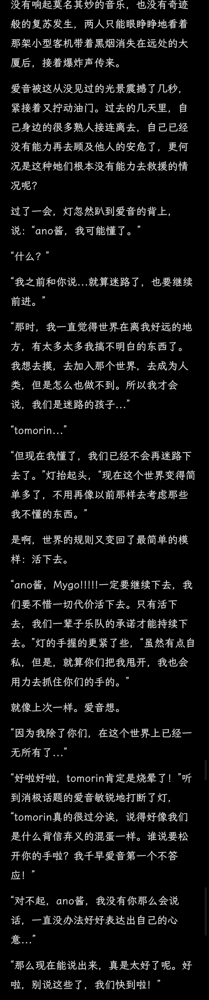  

## 27

顺着爱音指向的路口看去，灯记忆里的面影桥出现在眼前，只是和曾经那座禁止车辆通行的桥不同，此刻在桥对岸出现了用沙袋和旧家具等材料建起的街垒，桥上甚至布置了反载具拒马。立希她们很聪明，利用这条小河把她们住的区域分割开来，宛如一道安心的护城河。如果有暴徒从电车站出发奔袭这里的话，利用唯一可以通过的面影桥和这些掩体完全可以起到干扰阻碍的作用。可以说是相当利于防守的地形。好在爱音她们的电瓶车体积并不大，很轻易地穿过了层层障碍，来到了桥对岸。“喂！你们是什么人？”被突然出现的人吓了一跳，灯和爱音看到街垒后钻出了个举着高压水枪的男人，枪口直直对着她们。“是暴徒吗？...看你们这身制服，是高中生吧？还背着枪...如果不想挨打的话，劝你现在就离开。”“不是的，大叔，我们是逃出来的。”爱音解释道，“我们家里实在没有吃的了，所以...”“..哦。这样啊。”大叔意味深长地看了她们一眼，“那你们跟我来吧，这边...”“灯！爱音！”令两人安心的呼唤从楼里传出，是立希的声音！令两人安心的是，立希没有因为灾难而变化多少，她还是两个人记忆里那个可靠的鼓手形象，只是如果手里没有拿着土质武器的话大概会更像女子高中生一点吧。黑发少女急匆匆地放下手里的长枪，打开门向两人跑来。“rikki！呜，我还以为再也看不见你了...”爱音给了立希一个大大的拥抱。“立希酱，见到你真好。”“嗯，你们还活着真是太好了...吉田叔，她们是我熟人，我来带她们吧。”大叔点点头，提着水枪到一旁继续站岗去了。“走吧，我们上楼去慢慢聊。”  

## 28

点击展开，查看完整图片
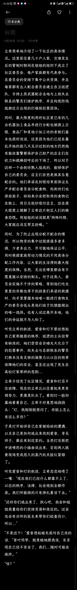  

## 29

点击展开，查看完整图片
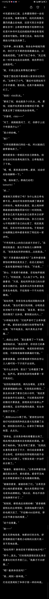  

## 30

下午去看美国内战，晚上再写😋大家也去看电影吧  

## 31

“这...颅内损伤的确有可能影响嗅觉呢。”医生移了一下座位，挡住了灯的视线，“你们的外伤问题不大，年轻人休息几天自己就会好了。高松同学记得及时服药，这里是取药单。”立希接过单子，站起身来：“那医生，我们先走了。”“嗯，祝你们早日恢复健康！”离开诊所回到街上后，灯拉了拉爱音的衣角。“怎么了嘛tomorin？”爱音好奇地回头。“我还是觉得很奇怪...”灯回头看向刚出来的诊所，“有很不好的感觉。”“应该是tomorin想多了吧...刚才的医生不是人还蛮好的嘛，还给我们开了药。”“灯，爱音，现在你们都没事了，本来我还有一个惊喜要给你们，”立希边走边说，“可惜你们带来的信息很重要，我现在必须马上去和姐姐和其他大人们商量。你们就先自己去吧！玩完了回我家就行。”说完，立希指了指一个方向，接着就急匆匆地跑开了。等两人走近后才看到，立希给两人指了个前不久新开的乐器店，店主好像因为疫情跑路了，而小偷们也不太看得上这些吃不了的废铁，于是这家店倒是保留了灾难前的样子。尽管已经数周无人问津，但店内的灯光依旧亮着。二人走进店内，空气中弥漫着木材和金属混合的独特气息，这是长期与乐器相伴的空气才会有的味道。爱音眼睛都瞪大了，兴冲冲地跑到陈列着乐器的墙壁前。墙上挂着各式各样的吉他，从古典到电吉他，它们静静地等待着下一次被弹奏的机会，尽管这种可能微乎其微。尘埃轻轻覆盖在琴弦上，但它们仍然保持着张力。灯不禁想到了自己的一辈子乐队。她们现在就像是这些乐器，虽然暂时无法发光发热，却依然保持着一种等待重生的姿态，静静地诉说着过去的故事，等待着未来的奇迹。爱音听到椅子挪动的声音，回头看去，灯正从自己的包里取出一本绿色封皮的笔记本。爱音认得它，是有着春日影，以及写着那之后Mygo其他歌词的笔记本。“难道说tomorin有新灵感了吗？”“嗯。我要写歌词，让大家一起演奏。”灯坚定地说。如果嘴上表达不出来，就用写的吧。她打开笔盖，开始书写起心中的呐喊。_玻璃窗很快就被云层覆盖。就连稍远的前方也都无法看清，一次又一次回顾那些远去的记忆，在心头边缘徘徊 几近溢出 啊啊 难以平息。尽力摆脱 雨却仍未停歇，假装将那些难以掩饰的后悔，一饮而尽，即使雨消云散 回到起点，天空也一定不会晴朗，现如今这样就好。_不愧是灯，能写出这么多歌词，换我的话拿起笔就头痛了吧，爱音想。她也没闲着，在灯写作时从墙上取了一把以前一直想买却没如愿的吉他弹起《春日影》，爱音没事就喜欢弹这首练手。真好啊，她不禁想到。自己弹着吉他，轻哼歌词，看着灯坐在对面写作歌词，宛如...宛如灾难从没发过一样。  

## 32

点击展开，查看完整图片
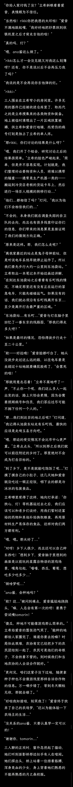  

## 33

通过百度网盘分享的文件：备份零二.jpg链接:网盘链接提取码:soyo复制这段内容打开「百度网盘APP 即可获取」  

## 34

夜里，灯感觉自己在被人推着，一点点移动，身上还有点冷。于是她睁开眼，这里她并不陌生，是昨天和爱音与立希一起去的诊所，而自己躺着的担架上绑着束缚带，动弹不得。她看到桌子后医生领着和自己一样不省人事的爱音和素世进去手术室，红灯亮起。灯觉得自己得跑了，她废了很大力气挣脱开绑带，正好看见医生从手术室走出来接自己。于是灯掉头就跑，却发现诊所门口的卷帘门不知何时已经锁上了。灯拼命拍打着门，喊着所有她认识的人的名字，梦在这个瞬间结束了。当灯睁开眼时，她感到背后一身冷汗。立希的卧室里已经只剩下她和正在整理房间的素世了。大概是托睡了一个好觉的福，比起昨天，素世的状态精神多了。看到灯醒了，素世微笑着用右手端起桌上的盘子走到床边，用筷子将盘子里的水煮肉丸夹起。“灯酱醒了呀，来吃早饭吧。”“嗯，谢谢素世...”难得吃上热食，灯小心地品尝着肉的滋味。肉没有油，有点柴，但是灯并不懂料理，大概是冻太久了吧。不过现在的环境，能吃上东西她就已经很感激了。“真是太好了呢，听说这里的冷货店老板在自家小冰库里藏了很多冻肉，自卫队都没发现呢。”素世感慨说，“我们家那边每天只能领配额补给，还全是压缩饼干...啊，对不起...”似乎是爱音已经和素世讲了灯来这里的经历，素世立马打住了嘴，怕唤起灯不好的回忆。“灯酱现在头还会痛吗？要不要我给你施展痛痛都飞走魔法？”“没关系的，素世。谢谢你。”灯喝完最后一点汤水，“我吃完了。ano酱她们呢？”“爱音和立希她们去和立希的姐姐一起指挥大家整理要带走的资源了。每个人只能携带随身物品程度的补给，难以搬运的货物会被装到卡车上。”素世说，“她们让我们两个病号好好休息，等她们处理好了就会来找我们。”“哦...”灯低下头，“那...我们出去转转吗？”“好啊，我也想出去走走呢。”虽然素世不喜欢外出，但是过去已经隔离了好几个星期的她也多少还是对逛街有了兴致。“我来帮灯酱换衣服吧，就当做灯酱昨天安慰我的谢礼噢。”灯脸一红，她也不知道当时是怎么想的，只是感觉到素世需要她的安慰，于是下意识那么做了。记得以前看到爱音兴冲冲扑上去抱她的soyorin的时候，都会被无情的一把推开，所以昨天她还担心素世会不会因此讨厌自己什么的。“素世...喜欢就好。”“嗯，很喜欢噢。灯酱很温柔呢。”“俄会每天都抱着素世睡觉的！”灯下了个奇怪的决心。“欸，倒也不用那么喜欢啦~”  

## 35

点击展开，查看完整图片
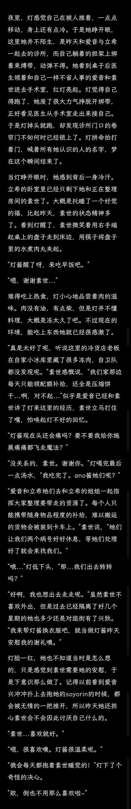  

## 36

于是，两个还能活动的病号获得了自由逛街的权利。毕竟一个头部损伤一个左臂骨折，喊她们干重活多少有点勉为其难了。于是她们开始在街区乱逛，灯帮素世挑了一把新贝斯。路上她们还碰到了在分装食物的爱音，被说了“你们放心去玩吧！这里交给我们”这样的话。但是现在的街区又能有什么好玩的呢？这可能会难倒素世，但不会难倒灯。平日里两人也经常一起出来玩，所以素世大概猜到了灯要去看什么东西。果然啊...“灯酱，石头有这么好玩吗？”“嗯，好看的石头有很多。”“今天就要离开了呢，还要继续捡吗？”“要捡...离开东京后，就再也捡不到这里的石头了。”灯小心地挑出一块她最中意的石头，塞进布袋里。“灯酱，我之前就想问..那个布袋是？”素世好奇地问，那个袋子令她有种说不清的感觉。“是小祥...”“欸？祥子？”素世一惊，爱音好像和自己提到过去祥子家里的事，但是她当时很随便地糊弄过去了，“祥子她...现在还好吗？”“嗯，很好哦。”灯不知道要不要把祥子站在素世旁边的这件事说出口，她害怕素世像爱音和立希一样用奇怪的眼神看待她，可是她又不愿意欺骗自己的好朋友。于是灯只好带着求助的目光看向穿着月之森校服的祥子。像是回到最初组建乐队的那个时刻一般，祥子带着春风般宜人的微笑：“今后，我们就是命运共同体了！”于是灯也笑了，她对素世点点头：“嗯，祥子很好哦，送给我和爱音很多的药和补给。”“是...这样啊。”大概祥子也和我一样想到办法撤离了吧，只是没有像我运气这么差摔下来，素世这么想着。毕竟她可是丰川家的大小姐，肯定有办法逃出去的，灯和爱音能平安无事地来到这里大概也是托了祥子照顾的福吧。“那，我们也得努力活下去呢。”想到这里，素世活下去的理由又多了一个。这时，二人前方几米远的一个小巷传出了对话声。“...么处理？”“上面的意思是不要声张，装进冰柜里带走。”“明白了，我会去安排人手。”声音刚落，一个穿着沾满干涸血液的高大男人从巷子里跑了出来，和灯她们撞了个正面。“欸...你，你们在这干什么？”“...”灯盯着男人的脸由惊恐慢慢平复，换上了和蔼的面具。“啊，是那几个逃过来的高中生吧？哎呀真是辛苦你们了，叔叔我还有事要忙，先走啦！”灯举起拳头放在胸前，感到一阵担忧。她觉得昨天做的梦不是毫无缘由的。但此刻灯只是轻轻拉住了素世的手，后者心领神会，带着灯离开了这个令她们感到有些诡异的地方。  

## 37

点击展开，查看完整图片
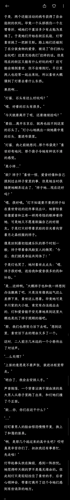  

## 38

点击展开，查看完整图片
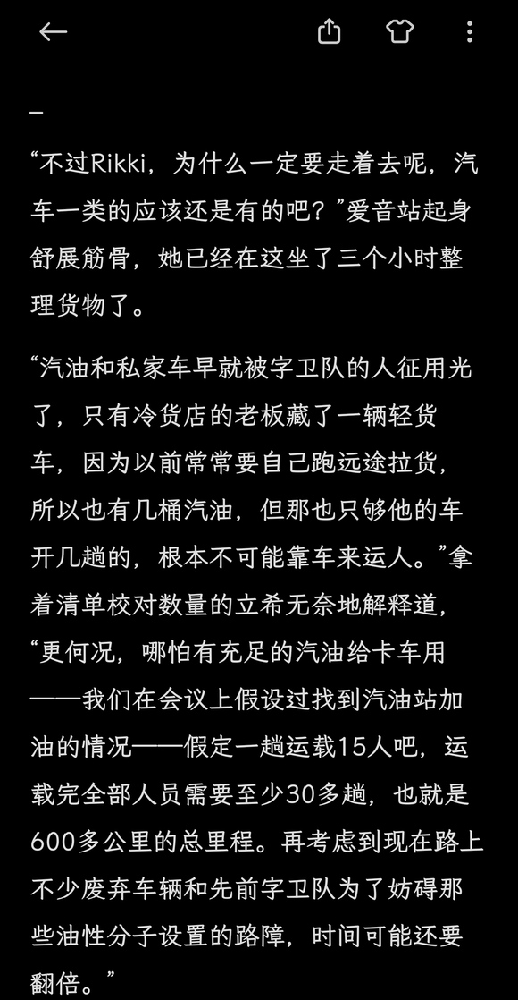  

## 39

点击展开，查看完整图片
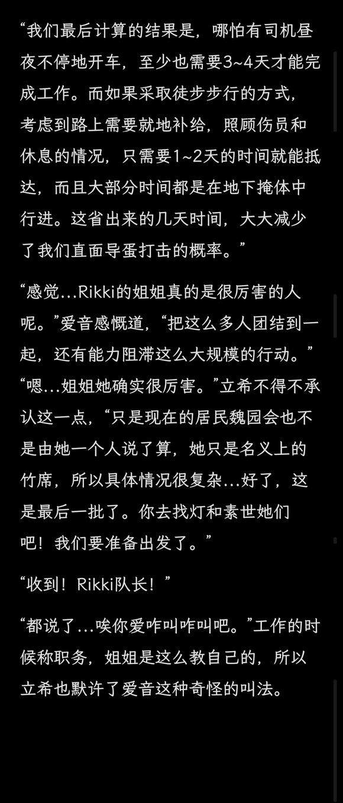  

## 40

“我们最后计算的结果是，哪怕昼夜不停地开车，至少也需要3~4天才能抵达琦玉。而如果采取徒步步行的方式，考虑到路上需要就地补给，照顾伤员和休息的情况，只需要1~2天的时间就能抵达，而且大部分时间都是在地下掩体中行进。这省出来的几天时间，大大减少了我们直面打击的概率。”“感觉...Rikki的姐姐真的是很厉害的人呢。”爱音感慨道，“把这么多人团结到一起，还有能力组织这么大规模的活动。”“嗯...姐姐她确实很厉害。”立希不得不承认这一点，“只是现在的居民会也不是由她一个人说了算，她只是名义上的管理人，所以具体情况很复杂...好了，这是最后一批了。你去找灯和素世她们吧！我们要准备出发了。”“收到！Rikki队长！”“都说了...唉你爱咋叫咋叫吧。”工作的时候称职务，姐姐是这么教自己的，所以立希也默许了爱音这种奇怪的叫法。  

## 41

整备完成后，大家以像是高中生远足活动一般的组织度开始了行动。曾经熙熙攘攘的人流如今已消失无踪，只剩下灰尘与废纸在风中飘舞。人们的脚步声回荡在无比空荡的街道上，仿佛是唯一的生命迹象。偶尔会遇到几个出来寻觅粮食的流浪汉，但是他们似乎对这支队伍十分不信任。有的广告牌上的霓虹灯熄灭了，只剩下残破的广告标语，如同世界的遗忘之语，向人们宣示着这里曾经有过一段喧嚣的时光。是的，最开始大家还很热闹，爱音还和素世聊起了她的宏伟农场计划，灯在给立希介绍自己昨天新写的歌词，她们还计划用卡车上和自己背着的设备找机会再开一场Live，只是素世的左臂可能得需要再休息一段时间了。可是渐渐地，随着路上见到越来越多的似体与遭到破坏的惨状，大家慢慢就没了开心聊天的兴致，于是气氛渐渐冷了下来，只能隐约听到细微的窃窃私语。寂静成为了这段路途最令人难以忍受的部分。没有大型电视的广告声，没有人类的喧哗，只有风吹过建筑的呼啸声。只有心跳声还在回响，仿佛是最后的证明——自己还活着。好在路上没有遇到阻拦的力量，队伍只花了不到一个小时就顺利抵达了东池袋站。也是，连他们都知道了，那帮有枪的家伙早就撤退了。人们排队走下地铁口，以往喧闹的广播声已经消失，取而代之的是空气中的电流声和远处偶尔传来的水滴声。空气中弥漫着一股金属和潮湿的混合气味，这是长时间无人使用的地铁所特有的味道。人们靠着墙壁休息，或坐或躺。不知道为什么，这里给灯一种奇怪的感觉。敏锐的她有种被人盯上的感觉，但是当她想要去找视线来源时却总是没有结果。立希和真希从控制室走到月台，告诉大家一个不幸的消息。因为没有检测到还有在活动的车辆，所以步行仍然不可避免，大家原地休息一个小时后继续出发。于是灯，爱音和素世开始帮老年人和行动不便的人装卸随身货物，灯观察到一个有趣的现象，爱音往往是大大咧咧却自成系统地帮老人分拣好货物，而素世则是斯文却有条不紊地替人们整理物资。果然人的行为真的会反映他们的性格呢，灯不禁这么想。“孩子，你们是附近的学生的吗？”灯整理东西的时候，一旁的老奶奶向她抛出了问题。“嗯，嗯...”灯小声地说，“羽丘，月之森，还有花咲川。”“啊，高中生。真好。我孙女也在你们那个什么雨邱读书。那么大人了，天天都和她妈妈黏在一起。”“是...这样啊。”灯不知道怎么回应好。“那孩子可让人操心了，平时老跟几个朋友一起玩乐队，在家就一直弹琴...”“别管她，她老糊涂了。”旁边一个大叔走到灯旁边小声说，“她家人都失踪了，老伴前两天也走了，这几天她逮到人就自言自语。”“唔...她一定很难过吧...”灯回应道，她还是想陪着老人听她讲故事。大叔见自己劝不动，叹了口气走开了。  

## 42

点击展开，查看完整图片
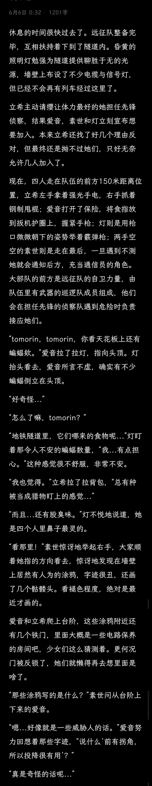  

## 43

涂鸦的话很快得到了印证。又走了半公里左右，手电筒照到前方出现了一个急弯，还有人恶趣味地用红色油漆涂了个大大的向左箭头。灯愈发不安，她闻到的异味越来越重了。“他们人还怪好心的咧，你看还给我们指路。”爱音嘻嘻笑了两声，气氛稍微缓和了些，但这种努力很快就被证明是徒劳的了。靠近拐角，女孩们听到隧道远处的嘈杂声，仿佛有什么东西在隧道深处移动。她们绕过急转弯，拐点后的景象令她们呆若木鸡。数不尽的似体散落在平坦的地面上，有的被老鼠啃咬，有的被蝙蝠盘旋啄食。袭击的痕迹清晰可见：被暴力打开的行李箱、血迹斑斑的墙壁与铁轨，似体的衣服也凌乱无比。腐烂的味道扑鼻而来，空气中弥漫着令人作呕的气味。立希颤抖着用手电筒扫过似体，那些腐蚀的面容和凝视着天花板的空洞眼睛将会永远印刻在她们以后的噩梦里。对立希，爱音和灯这些见过血的人来说还好，住四十多楼的可怜素世哪里见过这种场面，她支撑不住身体，也管不上什么礼仪了，蹲在地上干/呕起来，眼泪和鼻涕直也往外冒。“啊..啊啊...”“这是...什么啊...”“...快跑！”立希最先反应过来，她扭过头对着后方的远征队吼了一嗓子，然而看到的是更绝望的一幕。在远征队的后方，不知道是哪来的大型探照灯照亮了整个隧道，强光照的人们睁不开眼。能隐约看到探照灯后有拿着武/器的人背着光冲向了他们，糟糕的是远征队的紫/卫力量都布置在前方，此时的后方都是毫无还手之力的妇孺老幼，命运在此刻对人们展露出了它最尖锐的獠牙。“啊——”  

## 44

大家全跑散了。素世不愿回想刚才噩梦一般的场景。立希让她们先逃离这里，之后就一个人跑回去救人了。远征队里有她的姐姐和认识的邻居。爱音则是放心不下立希，让带着武器的灯保护好素世先离开，她去帮立希一手。结果和灯没跑出多远就在前面也撞见了零散的强盗，灯用枪吓跑了那些人，但也因此和素世走散了。现在的长崎素世如履薄冰，小心地前进着。可大概是太过紧张的缘故吧，她没注意到身后袭来的那道黑影...一记闷棍敲在了素世头上，她踉跄倒地，连忙用手护住自己的头，尖叫了起来。强盗没有放过她的意思，倒不如说素世这一身月之森校服的服装简直就是把“快来抢我我很有钱”这八个大字写在身上了。他快步绕到素世正前方，踢了她几脚，而素世没有起身的意思。男人注意到素世左臂固定断骨的简易夹板，有了心思。素世绝望地看着男人的靴子踩向了她的左臂。“呜呜，不要，不要，不要不要不要不要不要不——”钢靴落下，脆弱的塑料夹板被轻易踩碎，仍然在恢复的骨肉承受了全部的压力。剧烈的痛苦通过神经传达到大脑，令素世原本姣好的面容扭曲成一团，发出绝望的尖叫与夹杂着哭腔的求饶声，而这只是叫那只钢靴踩得越发用力。像是为了泄恨一般，男人还将踩着的脚用力碾了几圈，动作就像是在踩蟑螂。素世听到原本好像快要愈合的骨头再次因为不堪重负而发出了咯吱咯吱的不妙声音，同时传达到大脑的还有那足以撕裂一切理性，炼狱般的痛苦。“要死了要死了真的要死了呜呜...求求你放过我啊啊啊！呜呜呜呜...”素世的脸上满是泪水与汗水，在剧烈的痛楚之下，多么有礼仪的教养都无济于事，唯一宣泄的方式只有宁愿让自己快点死掉的叫喊。一个看似无关紧要的念头突然浮现，哪怕自己恢复好了，这只手恐怕也不能像以前那样再次控制琴弦演奏贝斯了吧。意识到这个事实的素世感到身体越发寒冷，眼前开始出现黑块。还没到一分钟，忍受不住没有尽头痛苦的素世最终还是因疼痛而休克过去了。就在昏迷过去的最后一刻，她似乎听到了霰弹枪的连续射击声和人摔倒的惨叫。“素世...我来救你....”过了不知道多久，素世再次睁开眼睛，眼前仍然是一望无际的地铁隧道，她感觉到自己正趴在什么人的背上，左手冰冰凉凉的，似乎是被人临时绑了根钢管固定住了。于是她的视线向下看去，高松灯在用全身的力气背负着比她高出七公分的自己，手里还抱着一把霰弹枪。灯的脸涨得通红，哈哈地喘着气，明显是走了不少路了。“灯...把我放下...”素世鼻子一酸。自己最重要的人不在了，重要的左手也被废掉了，全身上下痛的要命。她不想再继续痛苦下去了，而现在还要拖累自己珍视的朋友，她已经不想活下去了。“哈..哈..不可以...”“背着我，你走不出去的！”“那也..不能丢下...”素世哭了，她想起来曾经也有一次，灯也是这样紧紧抓住她的手，把自己从黑暗里拉到了光明的舞台，救赎了她的一切罪恶。到了这种时候自己只想着紫砂，抛下大家自己一个人逃跑。小祥说的对，长崎素世还真是满脑子都只想着自己啊。  

## 45

头痛，肌肉发涨，眼前出现蚊子一般的波动黑点，两脚越来越不听使唤。先前医生提醒过灯剧烈运动可能的结果正在一条条应验，而医生不会想到这位病人的身上还背着另一个人，这只会让灯的情况更糟。头部损伤的情况已经越来越严重了，但现在的情况根本没有给她留下休息的机会。自己走了多远？灯的身体根本没有这个概念，只有保护好身后的人这件事是确信无疑的。可是16岁少女的体力终究不是无限的，虽然身后已经看不到追兵了，但是灯也已经来到了体力的边缘。她忍不住闭上了眼，像是飞了起来——“不可以！”眼冒金星的她被铁轨绊了一跤，像是被什么东西撞了一样摔在了地上。“你不要急吧？”身上好痛，鼻子好像在流血，不管怎么呼吸都觉得好累好累，灯觉得自己已经支撑不住了，她有点困了。“我为撞倒你的事向你道歉...”能走到这里也很不错了，或者，就这样和素世一起睡过去也可...“但是你不可以死！”欸？“你刚才打算寻短见是不是？”“不对，是花...”灯解释道，话出口时连她自己都莫名其妙。清新的空气灌进了肺，明亮的环境替换了黑暗的隧道。灯发现自己坐在一段熟悉的桥上。“花和生命，到底哪个比较重要？”陌生的蓝发女孩质问着，但她随即也陷入了思考，“不对，花也是有生命的...”“因为是凋落的花朵，所以我想应该已经是死掉的了...”灯看了看桥外飞舞着的花朵，回应道。“死？！”来人惊讶了一瞬，顺着灯的视线看向护栏外，接着摇了摇头站起身：“看来是我会错意了。贵安...”“等等！”宛如命运的安排，高松灯又一次叫住了眼前的女孩。于是属于她们的故事再次开始了...隧道里，昏迷的高松灯紧紧抱住睡过去的素世，潜意识让灯用自己的身体保护她。陌生的脚步声从隧道另一段接近，很快停在了昏睡的两人身边。“有趣的女孩子...”  

## 46

唐突闯入的下坠感打断了灯的梦境，她被轻轻摇醒。睁开眼睛，素世躺在自己身边，两人仍然身处黑暗潮湿的隧道内，身上的伤口都被重新包扎过，灯看到素世受伤的地方还被敷上了草药一样的东西。只是她们的位置似乎不是自己摔倒时的位置了...不对，怎么自己和素世睡在轨道一边的台阶上？灯急忙撑起身子，和自己身前蹲着看自己的乐奈打了个照面。“啊！！乐奈酱...？”被打了个猝不及防的灯被吓得不轻，“你怎么在这？”“嘻嘻。”乐奈神秘地笑了笑，天真烂漫地令灯感到自己好似仍然身处回忆之中。她从身边成群结队的猫咪中抱起了一只。“猫猫们让我来的。”“啊...原来是这样。”灯知道猫的听觉很灵敏，从20赫兹到7900赫兹的声音都能被它们准确捕捉。看来乐奈应该是出于某些缘由路过外面出口时，正好捕捉到了隧道内自己和素世的声音才赶来的。这么说的话，出口离她们已经不远了。灯打量了一番乐奈的装备。现在的乐奈手上提的不是吉他盒了，而是一把木制短弓。身上穿的衣服也脏兮兮的，还粘了不少树叶和小树枝。“乐奈酱，还会射箭吗？”“嗯，奶奶教过。”“这样啊...”的确，乐奈总是喜欢一些不像是这个年龄段的女孩会的东西，平时吃老气的抹茶，野餐的时候带老气的荞麦面和寿甘当点心，手机也不会用。大概这和她小时候跟着奶奶住在乡下有关系吧。想到这里，灯一下子有点不知道从何问起，她想知道的太多了，乐奈为什么不在城里？现在住在哪里？乐奈为什么在出口附近游荡？乐奈有没有看到爱音和立希她们？但是她知道以乐奈的性子，短时间想讲清楚这些是不可能的，只能慢慢来了。“乐奈酱，谢谢你救了我们，还帮我们包扎了伤口...”灯一边说一边撑着枪坐起，“我们睡了多久了？”“1个小时多。”“乐奈酱在找到我们之前在干什么呢？”“打猎。抓兔子。”“....欸？”“住在野外，生火做饭，没人管。”乐奈骄傲地叉起腰。难道...乐奈酱意外的很擅长露营？也是，毕竟乐奈酱经常睡在树上呢...“那，你有没有看到爱音她们？”“请我吃东西的女孩子？”乐奈点头，“没有。”“不好，她们还..”这下灯坐不住了，扶着墙想要站起来，却立刻滑了下去。高强度背人快走了这么远，睡了一觉后，大腿和小腿一发力就痛的要命，灯根本站不起来。“别动。”乐奈看出灯的行动不便，于是按住了想要起身的灯，“留在这。”“给。”乐奈从包里拿出水壶和一袋用纸包着的药，“吃药。”“...谢谢，乐奈酱。”的确，自己这个状态能逃到这里都是奇迹了，现在掉头回去找爱音她们简直与自杀无异。还是先跟乐奈讲清楚情况吧...  

## 47

于是灯边在原地揉着腿休息，边和乐奈说明她们的来由，途中还断断续续问了乐奈的情况，这让灯多少知道了和乐奈失去联系后她的行踪。在大家暂停活动分开后，乐奈因为联系不上在乡下老家的奶奶，爸爸妈妈也因工作原因不在市里，于是只好暂时和凛凛子小姐住在一起。最开始隔离的时候凛凛子家的储备还算丰厚，但随着隔离时间的拉长，储备再多也有见底的时候。最后，凛凛子把剩下的食物放到一起，自己带着几日份的口粮出门寻求帮助了，走前叮嘱乐奈不要给不认识的人开门，那之后乐奈就再也没见过凛凛子小姐了。过了大概半个星期，乐奈觉得很奇怪，于是打电话报了晶，晶哥告诉乐奈他们会记录失踪人口，但是目前没有精力调查，他们已经被用简易武器装备起来的油性分子搞得焦头烂额的了。过了几天乐奈再去打电话的时候，晶哥的电话已经打不通了——于是乐奈到底还是打点好行李准备出门离开。这对她来说不是难事，乐奈可是身边人周知的流浪猫，她知道要怎么活下去。乐奈就这样一路风餐露宿地穿过了池袋的危险地带，离开城区来到了这里。  

## 48

快要结尾了😋写完末日灯和启示录后日谈之后就可以着手我的病娇爱音了  

## 49

灯休息的差不多了，她有力气站起来了。素世也睡醒过来，她哭着说自己梦到灾难前的生活了，她想回去。灯则是学着素世曾经做过的那样，把她抱紧自己的怀里像孩子一样安抚，这招意外的管用。灯对素世说，她得去找到其他人——至少也得找到爱音和立希，因为灯承诺过要和她们一辈子在一起的。乐奈告诉素世，她在不远的隧道出口外有一处刚搭好的简易营地，还架了烧烤架的，让素世先去帮她把兔子烤了。灯问乐奈为什么让素世一个人走，乐奈说她也要去救那两个好吃的女孩，这样她们欠了自己这么大人情以后肯定会天天送她零食吃，这话似乎戳中了素世的笑点，气氛终于难得地舒缓了些。和素世分道扬镳后，二人掉头去寻找失踪者的踪迹。灯的霰弹枪能打到五十米左右的目标，所以刚刚燃尽过体力的灯也没必要站到太前面。乐奈的黑暗视觉好像很好，总是看到一些灯看不清的东西，队伍打头的职责自然落在了她身上。路上灯看了乐奈好几次，结果发现自己担心乐奈会不会走累的事完全是杞人忧天。高松灯有所不知，经常和乐奈在一起的人都知道，乐奈平时出门从不坐电车，是坚定的走路派。据某无法透露姓名的黑发知情女士透露，当她想要抓猫猫去排练时，考虑的优先地点往往都是树上，墙上，屋顶上...无论她想到哪，只要那个地方的通风，日照和气氛符合她的要求，就没有什么能阻止乐奈到那去。运气不错，一路上都没有遇见敌人，只有愈发将灯的理智杀死的沉寂。二人一口气走到刚才发生袭击的似体堆放区，在这的似体的数量好像有所增多。乐奈好奇地看着灯紧张兮兮地翻着地上的似体。灯则是一边翻，一边在心中祈祷千万千万不要看见自己熟悉的面孔......很快 灯得到了一个好消息和一个坏消息。好消息是，爱音和立希确实不在这堆人里，这多多少少让灯感到一点安心。坏消息是，她在这里发现了之前在地铁站帮过的老奶奶，看来远征队的的确确是遇袭并战败了。那么，爱音和立希她们应该被是被俘虏了吧...“灯，有字。”乐奈指着附近墙壁上一处标识。灯凑近看了看，惊讶地读了出来：“東京都地下鉄有楽線17号避難所”避难...所？这是人防设施？！灯不敢置信地看了眼周围，没错，刚才逃走的时候太匆忙了，没看清周围有不少的水泥和其他建材，甚至还有没来得及拆的脚手架。看来这里是一个尚未竣工的地下人防设施。那袭击我们的人...难道是叛军？不对 他们好像没有穿军装...还是说，灾难前仍然在这里建设的工人呢？还在灯迟疑的时候，乐奈耳朵动了动，很快拉着灯趴下藏到了似人堆里。贴到地上，灯才听到铁轨上传来隆隆声，似乎是有车在往这边开过来。很快，隧道对面出现了一辆牵引车，两边的台阶上有人从先前灯她们觉得好奇的门钻了出来，跑到了牵引车平台上，这里放着不少货物，都是先前灯见到大人们在往卡车上搬的那些机器，大件行李，还有爱音她们挑的乐器...怎么回事，难道冷货店大叔也遇害了...不对，站在车上的不正是他吗？！灯绝望地看到，他和来接应的人握了握手，等他们把货卸完，就又把牵引车开走了。  

## 50

等到隧道里再次安静下来，乐奈和灯才从地上爬起。看他们的样子至少有几十个人...但是如果现在不行动的话，以后可能再也见不到爱音和立希她们了。灯转过头想看看乐奈的意见，但乐奈不知什么时候已经爬到台阶上去了。“好快...”灯感叹道，接着跟了上去，“我也不能拖后腿才行...”乐奈把耳朵贴到几扇门上，挨个听过，最后拉开角落的一扇门，灯配合着她的动作将枪口对准门内。“灯，没有人。”乐奈摇摇头，于是灯小心地跨入屋内，乐奈跟着进入后关上了门。两人一进来就打了个哆嗦，不只是因为屋里的温度异常的低，还是因为她们看到的东西——这里像是...储藏室？还是说厨房？灯之所以思考这个奇怪的问题，是因为这个昏黄灯光的房间里堆了不少冷柜，很像灯在新闻里看的那些海鲜工厂用的冰柜。同时房间里还挂了不少切肉和剔骨用的器材工具，简直是个大型的羊肉屠宰场。柜子后似乎还摆了一张屠宰台，好像有人躺在上面的样子。灯立即绕过柜子来到桌子正面，倒吸一口凉气。脏兮兮的屠宰台上满是已经干涸的血液与其他液体的恶心凝结物，而躺在上面的人正是失去意识的千早爱音，爱音的脚上缠着镣铐，连接着屠宰台角的一个铁环。灯连忙开始给爱音查看伤势，她一边拍拍爱音的脸试图唤醒她，一边检查她身上有没有缺少零部件，乐奈则是收起弓试着给爱音解开脚链。好在检查一圈下来没查出个所以然，身上也没有刀疤。这叫灯松了口气，她看向乐奈那边，后者无奈地摇摇头，找不到钥匙的话她们对这镣铐的锁是无能为力了。“嗯...tomorin？乐奈酱？！”爱音叫出了声，“我莫不是在做梦吧...你们怎么？”“爱音酱你没事太好了！”灯抱住了醒过来的爱音，“乐奈酱找到我们了，我们现在就想办法救你...”“灯，躲起来。”乐奈动了动耳朵，一把拉住抱着爱音的灯，往旁边一个冷柜后扯去，力气之大叫灯吃惊。紧接着乐奈也移动到门边，藏入门后的阴影中。门把手被转开，一个穿着围裙的男人走进房间，看着桌台上的爱音。“哎呀，小妹妹醒啦，真不是时候。”男人笑了笑，“真可惜，本来可以不用那么痛的。”趁着男人说完话，去拿屠刀时背对自己的时机，乐奈从阴影后冲出，迅速将短弓套上男人的脖颈，同时利用体重将男人撞倒在冰凉的地板上，弓弦紧紧勒住了脖子。“咕！”男人想要叫喊，却连一个字眼都发不出，只能拼命抓住弓弦，一边疯狂蹬着腿试图挣脱。见到乐奈有些难以应对，灯也从箱子后跑出来，摁住了男人还在挣扎的身体，帮助乐奈彻底压制住了他。大概一分钟左右，乐奈和灯感觉他已经不再动弹了，才慢慢松开手。乐奈娴熟地从他衣服里摸出了钥匙链，给爱音解开了锁。“哇，乐奈酱....你好厉害！”爱音开心地抱住了乐奈，“你救了我的命呢！”“嘻嘻。”乐奈骄傲地笑了笑，得意的像是她刚结束了自己的吉他solo环节，正接受着乐队其他人的膜拜一样。  

## 51

在送走灯和素世后，爱音掉头就加入了立希的行列。自然，他们根本不是对面训练有素强盗的对手，加上当时糟糕的队伍配置，很快人们就被制服了。老人，小孩和行动不便的人直接被推去做掉了，其他人被关押起来，爱音这个倒霉蛋则是被推去做了***，用来庆祝今天那些家伙的大丰收。如果不是灯和乐奈来得及时，大概今晚就要吃烤爱音了。至于立希和其他劳动力，现在应该还被关在这个设施的某处。爱音在房间里找回了自己的随身物品，留在这里给她们望风。而灯和乐奈则是要到前面探路。墙壁上挂了火灾紧急疏散图，这帮了她们不少忙，大概掌握了这里的地形。她们所在的地方是有备用发电机供电的贮藏室，其他人被关押的地方应该是位于空间最大的生活区——中间她们会需要穿过医疗站和控制中心。而要穿过这么长的通道，两个大活人也难免不被发现...要怎么办呢？就在灯苦恼的时候，可靠的乐奈同志拉了拉灯的一角。灯顺着猫猫指的方向看去，顿时明白了对方的意思。“俗套的方法...”乐奈踩到垫脚的箱子上钻进通风管道，“但是，好用！”“乐奈酱，天才！”灯惊叹于乐奈的智慧，忍不住夸了一嘴，接着跟着钻了进去。“tomorin，乐奈酱，要小心呀！我在这里等你们。”爱音在二人身后说道。“嗯，相信我们吧爱音酱，一定会把大家带回来的！”通道里的气味并不好闻。潮湿的金属气味和一些难以名状的臭味充斥着二人的鼻腔，耳边只回想着身体与金属管道的冰冷碰撞声。灯老是害怕脚下的铁皮管道万一断掉，自己没抓住摔下去；或者是她没控制好力度，发出的撞击声太大吸引了下面人的注意...乐奈这边则是显得比较轻松，她的动作轻盈地和真的猫一样，在灯前面打头。灯从裙子兜里拿出手机，将爬过的路和刚才拍下的地图照片一点点对照出来，告诉乐奈前进的方向。爬过了几个拐角后，二人抵达了猜测的关押地点。透过管道的间隙向下看去，这是素世家客厅大小的一个空间，能看到立希和其他不少人被锁在角落的一个临时的简陋囚笼里——显然是粗糙地用铁板和钢管加固的房间。监狱外有三个手里握着水管和短刀，戴着施工头盔的守卫，脚边放了几个酒瓶。看样子他们刚刚喝过几轮。他们面朝囚笼，对着里面的人进行威胁，时不时还随机给人来上一顿日式正骨按摩。好在，这也意味着他们是背对着两人的。灯轻轻取下通风口的铁板，乐奈用双脚勾住通道，将上半身探出隧道，支起弓对准了唯一持刀的守卫。她和立希对上了视线，立希心领神会，故意骂了两声把守卫的注意力吸引过去。“沟槽的**，有本事来打我！”“哎小妹妹，活腻歪了是不是？”“搞乐队的是吧？过会唱几首给哥几个听听。”瞄准，推出弓身，拉住弓弦，放出——箭矢直直插入男人的喉咙，他不敢置信地抓着脖子上的箭头，用力拔了两下，以徒劳告终，很快倒在了地上。“我超，有...”旁边的哥俩给吓得不轻，还没等他们反应过来，立希伸出双臂把离自己最近的那人的脖子绑住，将他狠狠勒到了铁栅栏上。紧接着灯跟着乐奈从管道中跳下，在另一个守卫想跑去制止立希前将枪口对准了他。“不想死的话就把武器放下。”高松灯这么说道。  

## 52

点击展开，查看完整图片
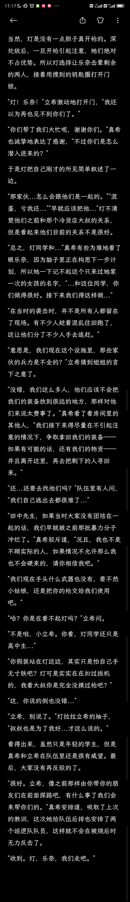  

## 53

果咩民那，要和沟槽的期末周斗争，正在和文学史语用学文明史对线，可能更新效率要下来了，我尽力  

## 54

真希分析的很对。居住于此的强盗分出了不少人手去追捕逃走的人。这给了他们一个巨大的逃脱机会。利用灯手机拍下来的地图，小队走过几个无人看守的通道。显然那些强盗压根就没想到他们会有逃脱的可能。在拐过一个角落前，灯拉住了立希的衣袖，指了指前方的拐角。“立希酱，小心。”顺着灯指的方向看去，原来是走廊中间开了一扇铁栏门，一左一右坐着两个门卫。不过这地方也没监控，他们也就没有顾及形象，只是自顾自地扔下工作，坐在地上打着牌闲聊。因此灯她们一时间没有被发现。立希迅速做了手势要求后方的人们暂停移动。“灯，他们人数不多，你先用枪控制住，然后我和乐奈去制服他们。”立希冷静地下了命令，灯和乐奈点头表示理解。灯从背带上取下枪，将枪口对准门的方向走了过去，立希和乐奈紧随其后。因为没有有意控制脚步，在略显窄小的隧道里，她们的脚步声清晰可闻。“什么人——”“不许动。”灯将枪对准眼前的人，回忆着自己在电视剧里看过的台词，“不...不想吃枪子就把武器扔了！不要做无谓的抵抗，抗拒从宽，服从...”“有趣的女孩子。”听到灯紧张地念错嘴，乐奈咯咯地笑了笑。“小妹妹，别，别开枪...”门卫哪见过这场面，他们平时也就打劫过路的一般市民，哪里见过真枪实弹的武装JK，于是面对着比自己娇小许多的高松灯，他们慢慢放下了武器，抱着头跪在地上。抓住机会，立希和乐奈跑过去一人一个后脑暴击，当场打晕。“嗯，背包，还有武器...”立希扫了眼铁栏门后房间里的物件，这里简直是他们的战利品陈列室，路过的人被抢劫的物件都在这里。“可是怎么开门呢....这也不是挂锁。”“我有。”乐奈拿出一张刚从门卫身上搜到的门禁卡，得意地看着立希。“野猫，你还真是厉害...”“抹茶芭菲。”“哈？你让我现在上哪去给你...”“抹茶。”“...找到了就给你吃。”如同以往无数次的对弈结果一样，立希无奈地低下了头。猫想要，猫得到。很快，门锁被打开了。立希招呼着其他人过来拿回被夺走的装备，乐奈和灯在走廊两侧放风。“大家进去整理一下装备吧，我们在这里看着，他们随时可能追上来的。”“好，好。”在其他人差不多取完被没收的随身物品后，乐奈突然做了一个手势，示意大家安静。她听到了远处传来的密集脚步声，越来越近。人们立刻停止了动作，屏住呼吸等待着。这么久了，他们先前绕过去的居住区里终究还是有人发现他们不见了。看来这波追兵是不得不应付一下了。“...快走！”  

## 55

众人重新钻回了隧道开始向着出口冲刺，现在他们也用不着顾上会不会被发现这种事了。身后的叫骂声越来越明朗，跟在队伍后头的灯试着朝后开了几枪，虽然狭小的通道简直是霰弹枪绝佳的使用场景，但奈何对方似乎已经失去理智到了极点，这让灯的压制效果极为有限。“沟槽的混蛋！给我抓到了弄死你们！”前方就是控制中心了。机灵的乐奈眼尖，在地上捡到了一桶汽油，给全部撒到了地上，让追来的人滑倒了一大片，阻碍了他们不少时间。队伍的先锋踹开了控制中心的门，这是他们回到地铁隧道的最后一个房间。控制中心里只有三个正在打牌的守卫在值班，门被打开时他们还骂了一嘴怎么那么吵，结果还没来得及拿起武器就被制服了。立希和其他几个人抓紧把门锁上，用找得到的家具把门堵住。但这也只是权宜之计，灯的地图说明这里有不止一个出口，他们得赶在追兵从其他站点的备用出口追出来前，策划一个脱离的方案。就在大家还在思考下一步对策时，控制中心通往隧道的门被敲响了。灯提着枪警戒地打开了门，眼前顿时出现了一只黑洞洞的枪口，冷冷地指着自己。“欸，tomorin！”枪口很快放下，爱音从门外走了进来，“我说怎么这么吵呢，果然是你们逃出来了呀！”“爱音酱！”灯激动地抱了上来。“你这家伙！没事真是太好了。”“嗯，我刚自己找到路出去了，然后制服了隧道里的那些家伙。听到你们这边有响动，就想着你们是不是逃出来了，于是来接你们啦。”“欸？制服？”真希有些惊讶，“你一个人吗？”“嘛，算我运气好啦。他们也才十几个人，我一掏出手枪他们就安静了。然后我命令他们中的一个人去给其他人绑上绳子，接着我再制服最后一个人就行啦。”爱音举起自己的手枪，眨了眨眼，“他们都怕得要死呢，好像基本都是被抓来这里当奴隶的可怜人。对了，然后有一辆隧道车开回来，开车的居然是那个冷货店大叔...”空气顿时冷了下来。“嗯，你做的很好，爱音同学。”真希走过来摸了摸爱音的头，“立希，你比较懂电脑，就带着你的朋友在这里守着吧，顺便研究一下这个控制中心有没有什么能做的。我们出去处理一下他们，之后就可以坐轨道车离开了。”“欸，啊，好...”立希答应了下来。爱音侧身让开了空间，让真希带着其他人走了出去。接着，她们听到隧道里传来一声声的质问，以及钝器击打在肉体上的声音。立希打开了控制中心的电脑，这里似乎能控制整个地下避难所的不少关键功能。小到监控广播门禁，大到供电供水通风。密密麻麻的术语让立希有些头疼，她只能先摸索着先设置了避难所为紧急状态操作模式，强制锁上了内部所有能上锁的门2个小时，这些时间应该够她们离开了。接着立希开始摸索有没有什么其他能做的操作。在得知立希已经成功锁上门后，爱音和灯才总算松了口气。终于没有再被人追着跑了，这叫她们的神经难得地放松了片刻。看到一脸安逸的爱音，乐奈心中的小心思又浮了上来。于是她贴到爱音身旁，笑脸盈盈。“啊，乐奈酱！”“抹茶，想要。”“嘿嘿，我还真有！”爱音从口袋里抓出一把抹茶煎糖，“我在他们的车上搜到的，厉害吧！”“爱音，喜欢！”乐奈尝了一口大果，直呼美味。她已经好久没吃过糖了。  

## 56

素世摸着乐奈指给自己的方向前进，离开隧道后她才发现天都已经黑了，所以只能打着手电走路。灯和乐奈掉头去救其他人，而自己的任务是提前找到乐奈的营地并在那里守候其他人的到来。乐奈给出的方向都很模糊，这让素世颇为头疼。什么“有白猫的入口”，“三棵一模一样的树”，“土地和河流的交界地”，“禁止露营的牌子旁边的小路”。辨析这些模糊的指向花费了素世不少时间，好在她还是拖着仍然隐隐作痛的身体抵达了目的地。营地的中心是一顶低调的帐篷，它的颜色与周围的树干和土壤融为一体。帐篷的门口微微敞开，仿佛早已等待着迷子们的到来。帐篷旁边，一套乐奈从某个野营用品店“淘“来的烧烤架和其他炊具被静静地放置在一块平整的石头边。石头上摆着一把刀，还有不少血迹，似乎是被当做临时的宰杀台使用着。不远处的小溪旁还躺着一套简易的净水装置。素世不禁感叹乐奈选址之佳，这里离隧道并不远，如果有列车经过可以第一时间听见。营地本身位于一处森林的掩护中，只要不生火，从外部看是难以察觉的，这也符合野猫的性格。此外，素世觉得乐奈的选址看似随意，但显然是下过心思的。营地在一条小溪附近，也没有建在山脚，这样既可以获得相对清洁的水源，也不用担心会有落石或是滑坡等自然灾害。素世卸下行李，钻进了帐篷里休息。她的身体到处都向大脑输送着钝痛的信号，左手更是几乎动弹不得。好在总算是有个栖身之所了，虽然还不知道小灯那边进展如何，但现在她能做的也只是为她们祈祷了...小憩片刻，素世撑起身子，取出乐奈交给自己的兔子，来到临时屠宰台前。她拿起小刀，在水里清洗一番，忽然意识到自己好像并不会宰杀动物。“我杀过的动物，最多也就是鱼吧...”素世努力地在脑海中回忆有关这方面的记忆，可惜她只是普通的女子高中生而不是什么强健虾仁饭，完全不知道怎么拿眼前的兔子下手。就在素世想要放弃的时候，她看到烧烤架上摆着一本小册子，她刚还以为这是做引火物用的燃料，这才发现原来是一本野外生存指南小册。“我看看，兔子，兔子...”素世认真地打开册子，翻到了有关宰杀猎物的章节。顺着书里的指导，素世先把兔子在石板上固定好，用小刀小心地从肚皮划开，一点点剥离皮毛。接着用蒸煮锅接了一桶水，单手清洗起兔肉。最后按照教程一部部剥离腹部的内脏，用刀将兔肉切成便于烤熟的小块。这一系列操作花费了她将近一个小时，本来素世还害怕自己会不会觉得恶心，做到一半就做不下去了。没想到在经历过前面在地铁内的遭遇后，她面对这种程度的操作心里已经不会泛起一点波澜了。乐奈带来的烧烤架是轻便折叠的气体型烧烤架，这给基本只能单手活动的素世省了不少麻烦。连接上燃气管，只用一只手就可以打开阀门了。预热好铁架后，素世将先前切好的肉块一块块放到了架子上。接下来她要做的就很简单了，只需要顺着自己的心情和想法调整火候和翻面就行了。坐在钓鱼凳上，素世享受着郊外清新的空气，还有架子上传来的阵阵肉香。周围是只有虫鸣的森林和安心的营地。素世点上煤油灯后，周围看起来亮堂不少。如此安逸的环境总是会触发对过往的回忆。素世记得之前爱音在网上看了部很火的露营动漫后，兴致冲冲地拉着大家想要去山上野营。结果当场被立希和自己分别以打工太忙和不想出门为由拒绝，乐奈也不知道去了哪，结果就是爱音一个人拉着灯跑到山上玩了一晚上，立希知道后后悔的要命。最后敏感的小灯察觉到了这点，为了安慰立希，从自己的笔记本收藏里挑出了最精致的那册送给了立希，立希当时手足无措的样子叫自己和爱音笑了好久...这样的日子，这样美好的日常，真的...再也回不去了吗？就要和Crychic一样...一去不复返了么？如同有人听到了自己心中的询问一般，素世听见一旁的灌木丛发出了窸窸窣窣的声音。是什么小动物吗？从灌木丛里钻出了一只野猪，两眼发红，显然是闻到了肉香味而来的。素世很清楚那双眼睛里藏着什么，她在机场外面的隔离区看过太多这样的眼神了。那是种饿到极点的眼神。  

## 57

点击展开，查看完整图片
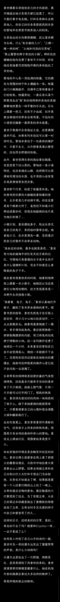  

## 58

“呜呜....呜.....”素世张着嘴说不出话，两腿已经打起战来了。她在Tik Tok上刷到过人在野外被野猪攻击的视频，哪怕是长枪都难以制服这种野兽，而她手里只有把切肉刀，更别谈自己只是个刚学会怎么宰兔的JK了。怎么办？怎么办？？眼前的凶兽并没有给素世多少思考的时间。它迈开腿冲了过来，迅速拉近了距离，撞开了烧烤架，猛地拱到了素世的肚子上。“咕！”素世只感到一阵天旋地转，腹部和胸口火辣辣的疼，身体像是被一台货车撞到了一般不受控制地向后飞去，重重摔在地上。素世感到身上痛的要命，差点连早饭也要吐出来了，甚至有骨头断了也说不定。再睁开眼，眼前是一张长着两只獠牙的兽脸，离自己只有几步距离。“不要，不要啊——别过来啊！”飙升的肾上腺素让素世一下子顾不上疼痛，也顾不得手边有啥了，管他是石头，木棍还是什么的，手边抓到什么就朝着野猪丢过去。而那头猪只是立在原地，只顾着吃掉在地上的烤肉，完全没有理会眼前这个在自己眼中已经定为死刑的猎物还在挣扎些什么。看来这头猪是计划着吃完眼前几口肉，再去慢慢享用素世美味的肉体。忽然，素世觉得抓到了什么烫烫的东西，也没多想立刻就砸了过去。飞出去的烧烤架直接砸在了野猪的脸上，高达300度的热量令后者发出了难以名状的低吼声。野猪被吓得不轻，连续后退了好几步，抖开了自己脸上的炽热金属，用谨慎的目光打量着眼前坐着的素世。“它刚才应该是吃痛了，现在在观察我。”素世见对面停下了动作，强迫自己冷静下来思考对策，她从未感到大脑转动的如此快过，“直接站起来跑吗？刚才它的动作简直和小汽车一样快...对峙在这里也不是办法，正面的话我是没有胜算的...可不可以想办法拖住它，哪怕是一会也好...”帐篷，烧烤架，树，石块，小溪，切肉刀，烧烤架，煤油灯...等等，灯？对了，可以舞使灯呀！素世看向不远处的煤油灯，咬咬牙，抓住野猪还在打量自己的当儿，爬过去提起了灯，毫不犹豫地掷向了那头野兽，精准地命中了它的背部。玻璃碎片四溅，燃烧着的煤油倾泻到了野猪身上皮毛最丰富的部位，火焰蹭地从它的背上飞起。素世头一次听到野猪还能发出这样的嘶吼声，这头凶兽正失了智般在营地里乱串，这也给了她足够的逃跑时间。素世可不想让那对獠牙给扎个透心凉，至少不能坐以待毙。她拖着身子站起来，不再去理会身后那野兽凄惨的吼叫声，朝着先前隧道出口的方向一瘸一拐地走去。  

## 59

沟槽的考试周，这就是大决战口牙！千早爱音保佑我！
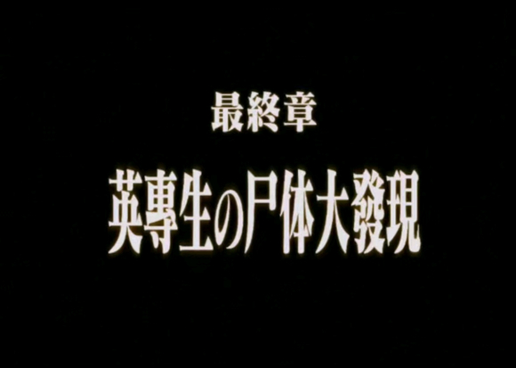  

## 60

点击展开，查看完整图片
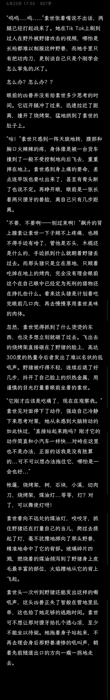  

## 61

“你比我想的要强很多嘛，还以为是手无缚鸡之力的深闺大小姐呢。”听完素世的叙述，轨道旁的立希夸了一句。“哈？”素世气不打一处来，好不容易死里逃生，跑回隧道出口见到你们，结果在这你还挖苦我？“rikki还真是不会夸人呢。”“我的肉...我的烧烤...”得知了BBQ环节取消掉了的乐奈蹲在地上画圈圈诅咒。“立希酱，真希姐姐他们那边应该不会有事吧...”见到素世平安无恙地回来，松了口气的灯又开始担心起和她们分别了的其他人。刚才，真希带着巡逻队的其他人去隧道里找其他逃跑的人了。现在那群强盗基地的控制中心在真希手上，立希在协助真希学会怎么使用操作系统后，他们就有了坚实的战场主动权。当然，更大的原因是真希做不出把其他人扔在隧道里不管的决定，于是她安排立希带着朋友先离开。这支灯和她所在的乐队成员组成的五人先锋小队仍然继续执行先锋的任务——到隧道外探索落脚点。“放心吧，姐姐她会有办法的。那群强盗之所以得手是因为他们的偷袭，但现在姐姐他们有了监控，就是敌在明我在暗了。”立希接着给灯分析的头头是道，把灯最后一点疑虑抚平了。“那现在怎么办？事先说好，我可没亲眼看到那只野兽被烧死。”素世向爱音问道。“唔，去肯定是要去的，听乐奈酱说还有不少宝贝在那里呢。”爱音点起了手指，“帐篷，燃料...”“而且，soyorin不是说她走的时候那只家伙已经烧伤了吗？而且，说不定它早就跑掉了呢。”爱音说的话很有道理，正好她们队伍的任务也是探路，于是大家同意了爱音的提案，开始为出发做起准备。乐奈和立希开始整理她们从先前的强盗据点里带出来还没来得及分类的物资，爱音和灯则是在替素世处理先前没及时处理的手臂。先前灯临时处理时绑的钢管在素世逃跑的时候被丢掉了，断了的手臂看着青一块紫一块，原本白净净的小臂还掉了不少皮，身上还有不少挨打后的瘀伤，叫爱音和灯越看越心疼。虽然没有严重的外伤，但是骨折的情况比之前更严重了。好在立希运气好，在灯带出来的背包里找到了不少专业的救护用品。从止血带，各种绷带到骨折夹板和缝合针都应有尽有，看来背包的主人生前是个生存狂。灯读完说明书，大概理解了使用方法。“素世酱，先躺下，手不要动噢...”灯把包装纸打开，开始延展骨折夹板准备处理。素世则是很听话地准备躺下——“来来soyorin，睡这里~”爱音顺势跪在了素世的背后，帮着素世把脑袋放到自己的膝盖上。“怎么样，要给你唱痛痛飞走的魔法嘛~”“你呀...”素世现在已经没力气去和爱音闹了，只好顺着她的意思舒舒服服躺好。不过，爱音柔软的大腿确实让素世觉得比躺在硬邦邦的水泥地上好一百倍。“素世酱，我要开始了。”灯也坐到了一旁，抓住了素世的手臂，轻轻抬起，也放到了自己的腿上。“嗯，小灯，拜托你了...”灯将方才展开的骨折夹板折成V状，对折贴到了素世的小臂上，接着取出弹性绷带，分别在关节的两侧缠好固定住了夹板。素世有些惊讶，她本以为会更疼一些的，虽然是第一次尝试，但灯的技术还真不错。“tomorin好厉害！”“小灯好熟练啊，是以前学过吗？”“没有，我只是看了一下包装上的说明书...”  

## 62

点击展开，查看完整图片
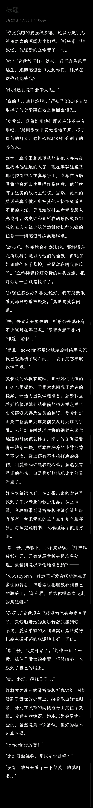  

## 63

爱音的猜测没错，受伤的野猪在把营地大闹一通之后就逃走了。大家帮乐奈清点还有哪些能用的东西。破破烂烂的帐篷和烧烤架是别想了，好在行李箱里的东西被保护的很好，里面的包装食品和瓶装水也安然无恙。“野猪，坏...”乐奈的表情很不好，像是吃了一口撒了辣椒粉的抹茶芭菲一样。“乐奈酱又蹲在地上画圈圈诅咒啦！”“野猫，听话，有机会再做给你吃...”“有机会...可是，现在我们要去哪呢？”素世提出了最关键的问题，“大家现在的状态肯定是不能及时赶到最近的城镇了，如果直接在森林里过夜的话，万一...”乐奈忽然窜了起来，得意地笑着：“秘密基地。”“欸？”“什么意思，野猫？”“看这个。”乐奈从行李箱里掏出一张这附近的旅游地图，指着她们现在的位置，手指沿着小溪向西移动，大家发现了一座土路尽头的高级疗养院。看来这里就是乐奈的原目的地。“难怪乐奈酱那时候正好在隧道口，听到了我们的声音...”灯恍然大悟。乐奈点头：“我在去这里的时候，碰到了你们。”素世盯着疗养院的名字良久，说：“我想起来了，这家疗养院是以小镇风光为招牌运营的机构，除了接待身体不好的人以外还会作为度假项目对外开放。”“欸，soyorin懂得好多！是来过这里玩吗？”爱音好奇地问。“是母亲告诉我的...她那时问我要不要一起去玩，我嫌太远了不想去...”提到那个自己这辈子再也见不到的人，素世的声音有些低沉。爱音看到素世咬紧的嘴唇，意识到自己说错了话，连忙闭上了嘴。气氛沉默了一会后，灯走到素世跟前，牵起了她的手。“素世酱，一定很害怕吧。没关系，大家以后都会陪在你身边的。”“小灯...”“所以，那些伤害自己的事，还是不要想了吧。”灯想了想，又补充了一句，“让大家放弃你什么的这种话，也不可以说了。”“嗯...”“tomorin别说啦，soyorin都要掉小珍珠咯。”“要你管...”讨论的结果是，灯她们要试着与疗养院的管理者沟通，争取到好的交易条件来让她们和其他人落脚休息几天，再做前往下一处可能有人的聚落寻找容身之处的打算。当然，如果能允许他们直接留在那里的话就再好不过了。“可是，真希姐他们过会出来了要怎么找到我们呢？”“放心，我用夜里也看得见的荧光记号笔在来路的树干上打好标识了，姐姐他们会找到我们的。”一番折腾后，大家整理好东西，继续踏上寻找下一个宜居点的旅程了。小队由熟悉地形的乐奈带路，近战组的爱音和立希紧跟，然后是拿着长短枪的素世与灯作后军。因为考虑到素世只有一只手能用了，爱音把自己的手枪交给了她，自己临时从地上捡了根木棍当做长枪用。“嘿嘿，tomorin，快看我的剑！”爱音兴奋地炫耀着自己的新武器，一边走路一边甩着手里的棍子。“ano酱的棒子，好好看。”灯不禁感叹道，她好久没见过长得这么标致的木棍了。“对吧对吧！以后这就是我的御用棍了！”“唉，爱音酱的品味真是...”素世无奈地摇摇头。“不要乱挥！万一打到灯了怎么办！”立希正想要走过去制止爱音的小学生行为，但被野猫拉了拉衣袖。“到了。”森林的土路通向的是一个被树木怀抱的林中空地，排列着几十栋大小不一的木制房屋，房顶上安装着光伏板。顺着连接的电线杆看去，远处似乎还有着几座大棚和工坊。刚才经过的小溪也在这里交汇，河畔上还安装有净水设施，连接着粗大的水管。“好高级！”爱音先叫出了声，“什么疗养院，这一点也不像医院嘛！”“这...简直是个小镇呀。”立希感叹道。“嗯，毕竟也开设有高价旅游项目，所以就建成开放式度假村的样式了吧。”素世说道。“事不宜迟，还是快点进...”爱音迫不及待就想往里走，但她忽然意识到原本在自己身前的乐奈突然不见了，“欸！乐奈酱去哪了？！”“乐奈酱她...”灯指着入口的方向，那里有只乐奈正在跑动，“已经跑进去了...”“啧，野猫...”立希二话不说跟了上去。她看到乐奈打开了一扇最近的房屋的门，好像被吓了一跳，把门合上后跑到了一边蹲下，脸色铁青。这吓得立希连忙跑起来，冲到了乐奈的身旁，顿时闻到了一股恶臭味。“野猫！没事吧，怎么了？”“唔...不要...”“什么？”“不要...进去...”立希没搞懂乐奈的意思。难道里面有人吗？但听了乐奈的话，她也不敢贸然去开门，于是悄悄在门旁的卷帘窗上扳开一个角度。“呼，呼...怎么了，rikki。出事了吗？”爱音她们喘着气跑到了现场。“乐奈酱，喝水...”灯把水壶送到乐奈嘴边，后者大口大口地喝了起来。“什么东西，好臭...”素世不悦地捂住鼻子，靠近这里后才发现，似乎空气里总是有股难以忍受的腐臭味。“...”“怎么了，rikki？”“...别开门。”椎名立希拦住了身边想要扭开门把手的爱音。她看到屋内的天花板上，吊着一具已经不成人样的干尸。  

## 64

素世是最后一个回来汇合的。“怎么样，你那边检查的应该也是...”“嗯，基本上有登记住户的房间，都有紫砂的似体。没有遇到活人。”“唉...”爱音向后一躺，“从他们的遗书内容来看，似乎是因为这里的通信设备在半个月前就联系不上市内，他们以为世上已经没有活人了。为了未来不受病毒折磨的痛苦，就选择了相对体面一些的...”“正好是自卫队对城市封锁加剧的时候...”灯想起来那时自己着急的父母。“唉...没有骨气的家伙。”立希摇摇头。“太刻薄了哦，rikki。”“那...”灯问了最关键的一个问题，“这里是我们要找的地方吗？”“唔，虽然他们消耗了一些，但是冷库里仍然存有不少的食材。附近有小溪的话，饮用水也不成问题。”立希盘算着，“不过这里居然还有太阳能发电，我还蛮惊讶的。”“离网型分布式光伏发电系统。”素世说。“哈？”“这座疗养院地址偏僻，不在任何交通要道上，所以采用了离网型分布式光伏发电系统，也就是说这里的电力系统是不与发电站的电网连接的，而是直接依赖自身的光伏发电系统直接向负载供电。爱音你们看到的那些房屋和大棚不是都装满了光伏板嘛。”“soyorin，你懂的好多...”“我家里是做这个的。”在刚才调查时素世就发现了。。难怪母亲之前问她要不要来这里玩，原来是因为这里安装的光伏系统都是她们长崎家的，素世对母亲公司的logo再熟悉不过了，看来母亲和这里的管理者应该很熟络吧。因为母亲的工作，素世对这方面也略知一二。“也就是说，这里的电源能够稳定运行，我们不需要担心断电的问题吗？”立希急切地问道。“嗯，蓄电池和其他部件不损坏的情况下，基本问题不大。”素世点点头，伸出两根手指，“在现行标准下，这类部件的使用寿命都是25年起步。所以可以放心。”“可是，食物也会有吃完的一天吧？”爱音想到了几块大棚，“我大概是‘五谷不分’的那种啦~种植这种事...”“既然是面向外部游客的项目，应该会有教授入门种植的手册一类的吧。”素世也有些为难了，“不过也有好消息，这里的大棚和老式大棚不同，都是新型的光伏农业大棚。可以阻挡多余的热量进入大棚内；同时在低温时段又阻止棚内的光向外辐射的方式，起到保证作物处在生长适宜温度范围内的作用。”“明明条件这么好，为什么不能再多坚持几天呢...”灯想到之前自己看见的那些饿到极点上街抢劫的人，在棍棒下挣扎的父母，还有没饭吃的小祥......小祥？对了，小祥去哪了...“嗯，但总得好好地给他们安葬呢，好歹我们也是来者。”素世说。好像在隧道里晕过去之后就再也没见到她了...“最好早点开始工作。”立希站起身，抬头看了看天，“至少得先清理出几个能睡的房间。时间不早了...灯？你还好吗？”立希看到灯有些异常。爱音也发现了不对，走过去扶住了灯。灯抬头看向爱音，抓着胸前的布袋，声音里带着哭腔：“ano酱，我怎么看不见小祥了？”“欸，祥子？”这是长崎素世从没想过还会再次听到的名字，“你们见到祥子了？”  

## 65

素世只知道听灯说过她和爱音去过祥子家，拿到了不少补给这件事。灯和爱音当时的回答都很含糊，所以现在灯这一番莫名其妙的话，很是让素世费解。“小灯，你...”素世正要开口询问，却被一旁的立希抓住肩膀，对她摇了摇头。“tomorin，我们...”爱音咬紧嘴唇，她不想再让灯回想起那些东西，可是如果放着忽然失控的灯不管的话...“还记得吗，我们当时，一起去的祥子家。”“....没有。”“嗯？”“祥子她没有死啊！！”灯的突然爆发把爱音和立希吓了一大跳，她们以前从没见过灯崩坏成这个样子，所以两人还没有反应的过来，失控的灯就已经跑出去了，只有眼疾手快的乐奈跳起来追了出去。等到爱音意识到发生了打算追出去时，她的肩膀被人狠狠地抓住，按回了座位。“祥子没有死，是什么意思？”素世黑着脸问，心里渐渐形成一个不详的猜测。“这...”“别像骗灯那样骗我。小祥她是不是死了？你们是不是根本没见到她最后一面？”“素世，别问了。”“告诉我，爱音...”素世没想到自己居然这么镇定。她的语气意外的平静，但是越平静越让爱音和立希感到害怕，“我，不想对爱音你们生气呢...”爱音着急地望了眼窗外，又无助地看了眼立希。“我去找灯，你和素世好好解释下吧，毕竟当时只有你们俩在现场...”立希站起来，追着野猫跑了出去，留下爱音和素世留在房间里。最后忍不住沉默的爱音像是下定决心了一般，开口阐述道：“就是那头，我和灯顺着祥子给的地址去找她，到了她家却发现她并不在家...”“她的家？那里并不是小祥家呀。”素世虽然不知道祥子家地址在哪里，但是灯转发的这个地址的电车方向是和平时祥子练习完回家的路线是相反的。“嗯，明明是那么有大小姐范的同学呢...”爱音回忆起自己与隔壁班的蓝发同学短暂的接触，“钢琴弹得那么好，一定是从小就学吧，我也觉得不该住在那么差的环境呀...可是，她的家里有住了很久的痕迹，应该是和爸爸搬出来住了。”“小祥的父亲？！”素世吃了一惊。“嗯，那个家伙...”爱音想起男人最后的几句话，又看了眼素世，忽然如同大梦初醒，“啊...那些啤酒罐，祥子退出crychic，我懂了...”“欸？”素世没想到能从爱音的口中再听到这个词。“那家伙说，在祥子和灯玩了crychic之后，自己丢了工作，失去了一切...”“怎么会...原来是这样...”眼前是自己一次次熬夜打字恳求原谅的模样，是睦对自己怜悯又有些愤懑的视线，是飞鸟山公园的水池前自己的惊世一跪。难道，我才是那个纠缠不清，自顾自关心他人，却又给小祥添麻烦的人？堵在胸口的石头愈发沉重，喉咙如同做完发声训练一般紧张难耐，素世发不出一点声音，她的头已经开始晕了，一个可怕的念头爬上她的心头。“原来，是这样...那小祥她现在...”“死...了。”如果自己早点注意到小祥的情况，注意到她的变故，早一点伸出援手的话，小祥会不会...会不会，就不用死在那个地方了？“怪我...都怪我啊...”“soyorin，别这样，这不是你的错...”“如果，如果我早点...”窗外原本只是薇薇破晓的天，忽然像是太阳砸到了近地轨道上一般炫亮，剧烈的强光覆盖了森林，晃得爱音下意识用手遮住了眼。紧接着，剧烈的震动从脚底传来——“soyorin！地震！蹲下！”爱音一把把没回过神的素世猛地拽到了桌下。很快，她们听到了这辈子都忘不掉的巨声从远处传来。  

## 66

点击展开，查看完整图片
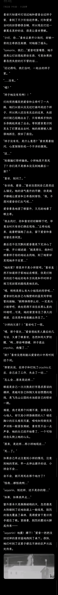  

## 67

【番外】《迷子》女孩总是听她的奶奶说，在古老的“鞑燒女玥对”时代，人们来到被称为“莱芜豪斯”的神社，使用名为“吉太”“贝丝”“剑盘”和与铁片连接起来的鼓具组成的祭祀仪器演奏神乐，主持仪式的巫女再以名为“迈克峰”的法器演唱或激昂或柔和的祷词，如此便能得到音乐之神的祈福。在那个时代，人们沐浴在音乐之神的恩泽之中，骑乘流淌着黑色血液的铁马驰骋在大地，驾驶金属制成的空中方舟航行于天际。女孩已经听厌了奶奶的感慨。毕竟，人又不像鸟一样长了翅膀，怎么可能飞上天呢？奶奶又告诉她，在“神火”烧尽了世界的一切后，她们的村子是极少数幸免于难的那一批。可是后来有一伙来自东面的强盗霸占了这里，村子里的男女都被拉去当了奴隶。好在音乐之神降下她的恩泽，派来了她的使者，五名掌握音乐之力的巫女怀抱着她们的神器演奏起了神乐，接着无数训练有素的天兵下凡，打跑了强盗。为首的女孩手中的魔法之杖一挥，便会激起雷霆之怒，火焰带来死亡，她法杖前的强盗便会如触了雷一般倒下。孩子，如果你不信，你大可以去村口的森林，那贸易商人的大篷车经过的地方看看，你便得知了。神话说音乐之神的使者们当时在村里留宿了一段时间，那附近可能有她们留下的痕迹。于是女孩扒拉开树枝和灌木丛，深入到村里人从未进入过的深处探索数日，居然真的让她在林木之间寻见了一座小木屋。屋子的外设破旧，内部也足够显现出历史的悠久。女孩在桌上看到一个关着的铁盒，她好奇地打开，盒子里躺着一本已经颇为破旧，却依稀可以看见绿色封皮的神话书籍。她知道这是什么，她在村里祭司的房间里看到过类似的本子，祭司们用这些传奇预测晴雨，占卜疾病或是观测星象。女孩一直想当个祭司，她也渴望拥有非凡的力量，于是她翻开了这本破旧的笔记本。古人的文字在现代早已失传，只有极少数的祭司能够略通一二。但女孩或许真有成为祭司的潜力，在看到文字的一瞬间，她感到自己宛如在春日的阳光下，沐浴着清晨的微风，感受到了对自然的敬畏和对友情的渴望。她细细地读着每一行，尽管她看不懂任何一个字，但她感受到作者细腻的内心正逐步踏入她的小小世界。于是她试着吟唱起这段无名之歌，并将它带回到了村里。她要成为祭司，她要成为新的音乐之神的使者。这是女孩第一次对“何为人类”这一问题产生了概念，也是新世界踏上后人称之为“新文艺复兴”的第一步。迷子们终于踏上了新的征程。  

## 68

作者还没死，作者只是在和生活对线。灯灯她们可是肩负着重启文明的责任呢，怎么会那么快完蛋呢。下一章已经在写啦，只是时间可能比较长，所以不用担心断在这里。  

## 69

点击展开，查看完整图片点击展开，查看完整图片
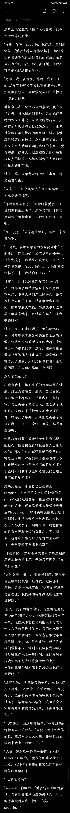
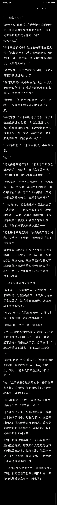  

## 70

孩子们，我更新了原谅我的小学生文笔  

## 71

剧光，燃烧，尖叫声与哭喊。少女只记得在晕过去前，视野中心冒出很大的光斑，越变越黑，不断放大，最后覆盖住了整个世界。在因为之前素世乘坐的座机坠毁后，羽田机场的私人客机就全部禁止通行了。还在坚守岗位的自卫队和特殊急袭部队的士兵正计划分批将他们这些VIP转移到成田机场预备后续的撤离，可惜他们做得还不够快——这个致命的延迟带来了不可挽回的后果。睦撑起身，她很幸运，被先前的人群挤进了一侧的小巷，没有正面迎接冲击。但现在，那些人如同不翼而飞了一般，街道上满是散落的玻璃片。忽然，睦感到眼睛一阵刺痛，她不断地眨眼，眼皮底下宛如钻进了蚯蚓一般瘙痒难耐，泪水开始涌出。她擦着眼泪，不知道眼睛到底出了什么毛病。是被刚才那道光灼伤了吗？...对了，光，爆炸...睦很快理解了刚才发生的事，手顿时停住了。太阳斜挂在天空，光线穿过高楼之间的缝隙，打在空旷的街道上，显得格外刺眼。街道上看不到行人，路两旁的商店仍然挂着已经熄灭了的霓虹灯招牌，仿佛在欢迎不存在的客人。街角的自动贩卖机被什么人砸开了，玻璃碎片反射出阳光，显得格外冰冷。风吹过，带来一丝凉意，吹动路边的树叶，发出沙沙的响声。地上的废纸被风卷起，绕着街道无声地飘舞，这倒是为这寂静的街道增添了一丝生机。自己这是睡了有多久了？...怎么手机也不能开机了...睦挣扎着想要站起来，却发现双脚失去了力气。失去了视觉后，人的耳朵便格外清晰，睦听见街角似乎有人走来。是其他幸存者？睦想起自己在机场的隔离区外看见的那些难民的惨状。自己只是一个毫无防备的女高中生。最坏的情况浮现在睦的脑海中。于是她努力用手撑起自己，似乎有点痛，应该是哪里被碎片割到了吧。她手脚并用，求生欲指引她拖着身体离开这里。但随着脚步声的接近，睦感到身体一轻，自己似乎被人提了起来。她惊叫一声，双手抱住了头，已经在脑中构思求饶的词汇了。“不要...伤害我....”真希对爱音她们讨论出来的计划很满意。既然她们能用这里仍然储存着的不少粮食暂时摆脱温饱之虞，那么当务之急就变成了尽快恢复秩序的生产与学习工作。于是队伍里的所有人被动员起来。身体素质达标的成年人会被立希选入巡逻队和远征队，分别负责维护治安与前往周边的乡镇地区进行物资的搜集。没有达标的人，例如老人或妇女，则被组织去学习度假村大棚里已储存的植物种植方法（虽然大多数是娱乐用的装饰性植株...），或者是担任清扫街道、整理挑拣物资的简单工作。而在灾难前仍在上初中的孩子，在一天的劳动之后还需要抽出时间来上“夜校”——这是长崎老师起的名字。素世组织了队伍里的大学生，勉勉强强为孩子们建立了一个简陋的教学队伍，主要教授以理科为主的实用知识。毕竟，在人类衰退之后，这些未来可能需要数代人才能发现的知识都将是不可多得的瑰宝。既然他们现在有能力这么做，为什么不呢？大家安安稳稳地度过了最初的半个月，她们规划的生存模式暂时运作良好。种子已经全部播下去了，接下来的事就看天意与后期的人为。素世的补习班也正常运作着，没有人指责她在打着延续人类火种浪费资源，久未归校的孩子们也都乐意重新回到这样不需要担心明天会怎样的校园生活，因为不管怎么说这种仍然在学校读书的日子都能让他们有一种灾难还没有发生的错觉。而且不得不说的是，素世似乎颇适合这个与孩子们接触的岗位，大家渐渐能在她的脸上看到久违的发自内心的笑容了。立希带着灯、爱音和乐奈与远征队的其他成员伪装成东京来的正斧人员，与周围没受或是受疫情影响不大的乡镇建立了联系，利用伪装的身份与村民达成了贸易与定期交流的方式，同时还从他们口中了解到附近存在着流窜的土匪——是灾难前的部分町内会成员一类的乡间组织组成的，他们会袭击那些失去保护自身能力的乡镇。立希他们初来乍到所以暂时还没被盯上，但是以后也要小心。“情况就是这么个情况。”真希把报告读完，看着坐在会议室里的Mygo!!!!!几人。这几周以来，她们凭借着自己这方面或那方面出色的惊世智慧与实操能力征得了避难所人们的信任，大家也都乐意让这一批年轻的血液来帮助他们前进（其实还有嫌弃之前委员会的老登们的因素在，毕竟谁不喜欢可爱JK呢），于是她们也成了真希会议室的常客。“大家还有什么要说的吗？”“我先，”爱音举起了手，  

## 72

点击展开，查看完整图片
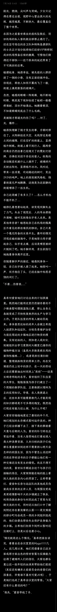  

## 73

“不要再这样吓小睦比较好吧。”初华抚着躺在自己腿上的睦头，“你看她又晕过去了，希望只是累坏了...”“嘿嘿，对不起啦~”喵梦理了理太久没有护理而有些炸毛的头发，有些不好意思地说道，“刚才的睦子实在太可爱了，就忍不住...”“喵梦还真是喜欢趁人之危呢。”“玲子别这样嘛~过分！”四人正乘着喵梦驾驶的车穿梭在街道上。这是一款经典的丰田车型，外观充满了20世纪80年代的复古气息，车身线条流畅而富有力量感。车侧面，黑色的防擦条从前轮拱一直延伸到后轮拱，平行的线条显得车身修长而动感。黑色的尾灯带贯穿整个车尾，与白色车身形成鲜明对比。尾灯组设计简洁，红色的尾灯与白色的倒车灯在黑色的背景下尤为突出。“没想到喵梦会开这样的车呢。”“嘿嘿，没想到吧，公演后不久我就订车了，前不久刚交完首付提车。”喵梦得意地说，“本来还打算开车带你们还有小祥去大阪玩呢，结果病毒爆发后不久就被封锁了，还出了这样的事...”“往好处想，之后的车贷就不用交了不是么？”海玲笑着说。“玲子！还是你懂我啊~”初华感到腿上传来一阵动静，睦头扭了扭身子，似乎醒过来了的样子。“小睦，你终于醒啦！”“噢，若叶同学感觉好点了吗？”“我...谢谢你们救了我...”听到初华和海玲令人安心的声音后，睦一下子放松了下来。看来是路过的队友把自己从歹徒的手中救走了。“对不起，我看不到你们...”“欸？哇，小睦，你眼睑怎么肿成这样了！”初华被睁开眼睛的睦吓了一跳。“别动，让我看看。”海玲侧过身，伸手翻开了睦的眼皮，“眼角这么红，还有不少血丝...若叶同学，你刚才是不是直视爆点了？”“嗯...”睦无力的点点头，“什么都看不见，眼睛又酸又疼，感觉有东西卡在眼皮里...”“强光导致的暂时性失明，”海玲开始在后座找起合适的布料，“得把眼睛遮起来才行...”“我旁边的手套箱里有蒸汽眼罩，平时我自己休息时用的，给睦子拿一下吧。”喵梦肘了一下手套箱，“别忘了先用里面的酒精湿巾擦擦，小心炎症感染。”“嗯，帮大忙了。”“我们这是在去哪里？”睦一边配合着海玲动作套上眼罩，一边问道，“高速公路全都被封锁了，羽田机场已经关停，现在也不知道成田机场有没有在运作，那些自卫队的人也联系不上了。”“去乡下。”喵梦回答道，“往西边的埼玉县走，乡镇地区受这次危机影响不大，应该还有能正常生产运作的地方。而且我的家人都住在那边，正好也回去看看情况。”
  

## 74

点击展开，查看完整图片
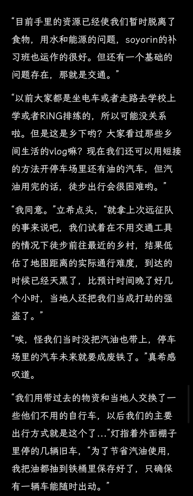  

## 75

“只要铁路能恢复运作就好了，如果我们能控制最近的转运中心的话...”素世指着地图上离她们最近的火车站，“就是这里，我前几天发现这里有一处比较老旧的铁路转运平台，可以追溯到明治时期。因为建立时是用来支持当地农产品发展，所以相当符合我们的需要。如果铁路未来能够为我们所用，那么与周边的聚落建立更紧密的联系就会是我们尝试重建灾前世界的第一步。”“soyorin好有型，真有老师派呢~”“爱音酱，现在可是开会中噢？”素世开启了夹子模式，“玩笑话留到会后讲吧~”“呜，明白了...”“长崎同学考虑的真周到呢。”真希肯定了素世的想法，“恢复这里的运作会很麻烦吗？”“不会的，极端的情况下只需要一个乐队程度的人手就足够了。”素世微笑着伸出五个手指，“司机，装卸工，维修人员...火车站会有详细的应急手册，更何况这次也不像我们之前在东池袋站那样了，我们有充足的时间，慢慢学习的话应该是可以恢复最低程度的运作的。”  

## 76

非常抱歉，这次更新并不是正文，而是我的停更通知。在过去的54天里，我恰巧陷入了这个人生阶段的岔路口，每天都在进行实习工作的活动，同时还要为大四毕业做准备。8月份来到深圳参与培训更是让我无力抽出时间写作，同时剧情的困境也让我束手无策。同时在内容上也犯了一些逻辑上的错误。我一向认为创作应该是一件让作者感到快乐和有成就感的事情，而不是额外的负担。如@哈德曼的蔷薇花 吧友所说，再往下就是无尽的种田内容了，这些已经在起点的末日文里被写烂了（这里个人推荐一本比较古早我很喜欢的末日文【挣扎在生化末日】，作者是饱了），内容也脱离了我想写的mygo的大家在末日发生时会发生怎样交互的故事框架，所以我选择了止笔于此，就用我上面发的那篇番外作为结尾吧。同时我也很感谢吧友们的支持，尤其是@桂人13等给我提过建议的朋友们，还有为末日灯绘制人设图的画师@清一霜（这位是neurosama圈子的知名画师，感谢你抽出时间满足我任性的要求，谢谢）很高兴在入坑mygo后能见到这么多有才的作者热情细心的读者。祝愿☁️吧的各位能够在未来的道路上越走越开，越来越好！谢谢你们能看到这里！  

