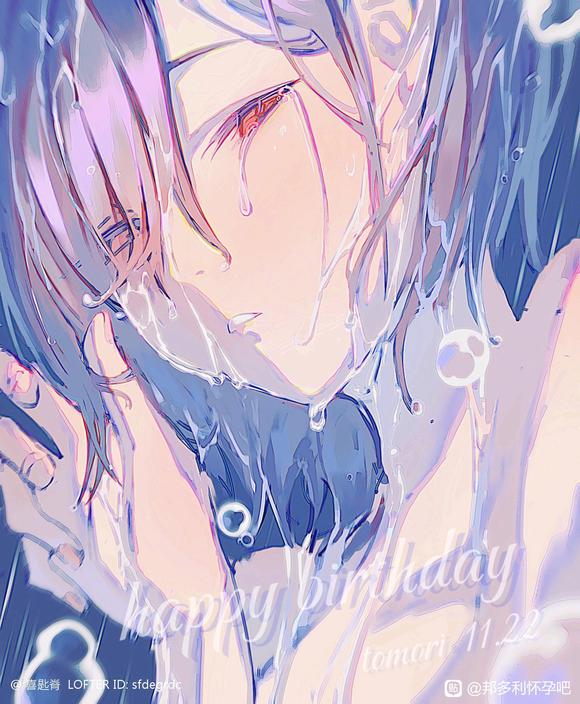

# 一路向北……

**乐队的结局，**
**我们从没想过，**
**直到脱离了父母的羽翼。**
**我才发现，我甚至无法做到自己养活自己。**
**我们的乐队默默无闻，**
**我们入不敷出。**
**大家的脸上的笑容越来越少，**
**我知道她们面对的压力。**
**我也知道父母沉默的眼神背后所蕴含的难义。**
**后来，在我三十岁的时候，那个一事无成的我，结束了乐队。**
**我们都需要去活着，去赚到自己的面包钱。**
**毕竟我所有的关于音乐的各式各样的梦想在“铁饭碗”和“钱”面前都显得如此不值一提啊。**
**然而我还是选择一边假惺惺地鄙夷追名逐利的人，一边对父母夸下海口“我一定会赚很多钱给你们”。**
**如此荒唐却又有趣。**
**我还记得他们那欲言又止的劝解和难以掩盖的欣慰的眼神。**
**我知道他们是真心，可我却只觉得势利。**
**我早就过了20岁，早就不在那种虽然迷惘，也喊着绝望，但骨子里因为相信未知世界也有好的一面，充满希望的状态里了。**
**我被时代的洪流裹挟着前进，却不知道自己想要的是什么。**
**我究竟要怎样才能向上爬？我到底是要如何费心去做才能得到那些别人生来便有的东西？我是该言听计从循规蹈矩去走他们为我规划妥当的人生道路，还是不顾一切孤注一掷去追逐自己真正热爱但实际上几乎难以实现的理想？**
**我选择了第二个，走上了那条路。**
**……**
**当年的我不会后悔。**
**……**
**正如现在的我也不似当年。**
**钟表可以回到起点，但我却回不到曾经。**
**我总是活着别人定义的成功里。**
**那我便是失败者。**
**高松灯最后也没能成为人类。**
**但我也会在戾气侵蚀之下自我怀疑自我封闭，我会病态地痛恨人生起跑线的随机生成机制，我会咒骂一切不公一切特权一切我所无法掌控的事——譬如命运。我的，和那些无辜的、含恨死去的人们的命运。**
**我还有这些人的丑陋的情感是吗？**
**但后来，我已经无力去关心。**
**我老了，**
**我的青春早就结束了。**
**现在的我，已经头发灰白，老眼昏花了。**
**拄着拐杖走在街头，我突然听到了熟悉的旋律。**
**那是我曾经写出来的，用心歌唱的诗。**
**我扭过头，看见了一个年轻的女孩。**
**啊，她与我年轻时真的很像。**
**但她比我活泼，比我阳光，**
**也比我更年轻。**
**我希望她能坚持下去。**
**先有面包，后谈理想，两者其实并不冲突。**
**只是人们忽略了时间。**
**我只好在孤独中死去了。**
**也许是失败了。**

