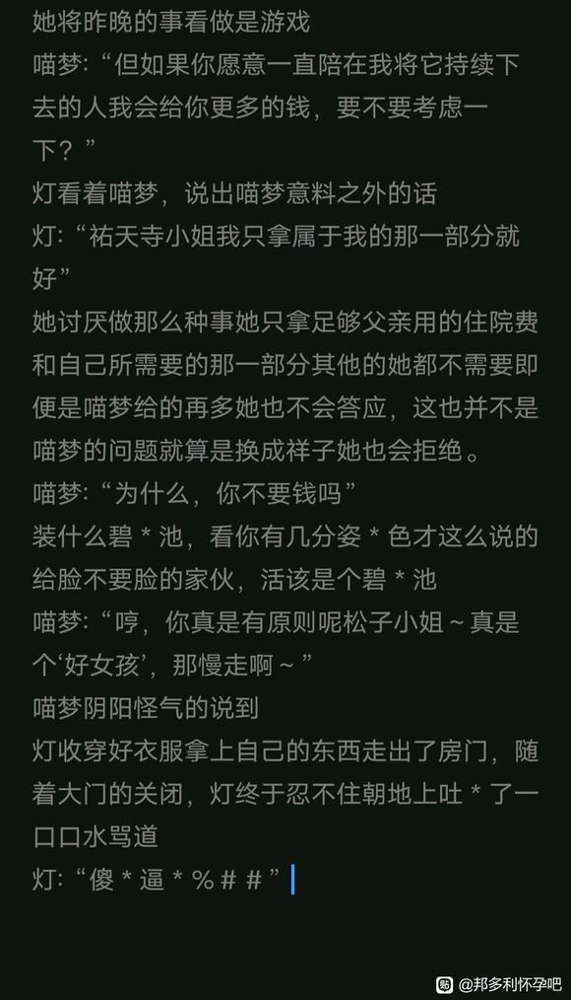

# 【图片】(参加高松灯杯)十年后在百合风俗店工作的灯，遇见了祥子【邦多利怀孕吧】_百度贴吧

## 1

序章灯拉着爱音从毕业典礼上跑了出来，爱音紧紧的抓住灯的手。自从crychic重新组建后开始到现在为止灯无疑是改变最大的那个，也是最让人惊讶的那个。作为灯的朋友爱音对灯的成长自然是欣慰的，但看着离自己最近的灯变得越来越好，自己内心总是莫名涌起一股失落感，这样的失落感来源于想与朋友一起齐头并进的愿望与只有自己原地踏步所造成的反差导致。也许是曾经过于封闭敏感的原因，现在的灯对于周遭朋友的感受意外准确。灯把爱音带到了天台，这是两人约定一辈子组乐队的地方，对她来说意义非凡，正因如此她才想在这里对爱音坦白自己的感情。……“爱音我喜欢你，可以和我交往吗?”将自己内心深处的想法说出来，这便是灯成为人类的方式，不畏失败，不畏将来，至少现在是这样。爱音：“抱歉灯，我现在不能和你交往，我已经决定去英国深造了，因为我不想输给过去，过去那个软弱的自己。”灯：“为什么爱音，是我做的不好吗……”爱音：“不是的，是我自己的想法，和灯没有任何关系”或许吧，想要战胜过去又或者是不想只有自己一尘不变吧。看着面前失落的灯，爱音总觉的得说些什么爱音：“灯，你愿意等我吗，等我从英国回来，那个时候我们再一起一辈子，我会回来的等我。”灯：“即然爱音酱想要证明自己的话，我当然会支持你的，毕竟我是喜欢着爱音酱的，所以我不会无理取闹的。”那天风刮的很大，少女们的发丝被吹的凌乱，爱音说了什么灯已经不记得，她只知道爱音离开了。一年后……灯上了大学，期间灯的家庭遭受变故灯的父亲被搞非法集资的亲戚欺骗把家中的所有积蓄给搭了上去，次年灯的母亲不幸因病去世死因为过度劳累，灯的父亲接受不住打击患上了失心疯，灯迫于无奈缀学打工，但大学都没毕业的她能找到的工作也赚不到多少钱，为了父亲灯在大学同学的引介下进入了一间专门服务女性的会所选择了出卖肉体，幸运的是因为灯的成长她的身形与面貌越来越好，因此父亲的医疗费足以得到保障。同时祥子的乐队Ave muiica也进入了事业高锋期，越来越多的采访和邀请让祥子恰到了巨多的米，初华也在这个时候向祥子坦白了自己的感情，祥子在被初华告白稍做犹豫便答应，尽管祥子沉浸在这么美好的生活里，她依旧没有忘记当初那个纯洁的少女，也许祥子会忘记灯的长相和名字，但她永远不会忘记自己内心仍旧如花一样那个影子。

## 2

1.十年后东京某处街道，灯在路旁拿出刚买的香烟机械般的点燃正当她准放松来一口时，却接到了一个电话。“松子，你去哪了，有俩大款要点所有人，快回来”嘀………电话很快就挂了，跟本没给灯反应的时间。“真是服了装什么13，还点所有人，＃＆％＊”灯不满的飙了几句脏话然后将香烟猛吸一口随意丢弃在路旁，便怱忙进去了。一间宽敞的包间里聚集了二十多个人，而今晚的两位客人正坐在沙发，其中一位紫色头发长得较高的客人双手各抱着一位美女。喵梦:“喂，祥子你别这拘谨啊，这里的女生都相当不错哦！”祥子:“这里装饰的还不错嘛，哈哈”喵梦:“别那么紧张哈，放轻松，这可是你说厌倦了初华，我才带你来的哦”祥子:“你别胡说我没有厌倦初华，而且我也没叫你带我来这，一切都是你自作主张做的”喵梦“唉，不是你说的初华最近总是烦死了吗，难道这不是厌烦了？”祥子:“我要回去了，你自己玩吧”喵梦:“喂，等等我可是特意为找来这么多的美女的”祥子:“你的好意我看还是算了，我受不起”祥子起身快步走到门口，她拉开门刚一步踏出就和迎面走来的“松子”撞在了一起。包间内灯光昏暗，在祥子看清来人的面貌美后便觉有点眼熟，但她并没有过多在意。而灯在短暂的懵圈后，就立马认出了祥子毕竟Ave mujica的知名度非常高而且成员也都是自己认识的人想忘记都难。灯:“啊抱歉，小姐不小心撞到你了还好吗”灯的演技已经十分出色了，她压下心中的冲动边说边往边靠，熟练的对祥子挤出一个胆忧关心的表情，她不怕祥子认出她，毕竟只要她不承认就可以了，况且两人十年没见面了，祥子或许根本忘了自己。但为什么她要装不认识呢？明明直接相认不好就能多一条出路，为什么不呢？或许是内心还残存着最后一丝尊严所导致吧，又或许自己根本没有信心觉得祥子还记得自己吧。

## 3

PS:我每天都会写一千或两千左右，这样到月末应该有3万字，一般没有事我不会鸽

## 4

PS:请各位自行想像长发灯

## 5

2.人偶的歌唱眼前的人，头发及腰并且化着妆与祥子模糊的记亿里的印象虽有相像之处但气质却完全不同，祥子并没多惊讶她只是感叹世间和自己初恋长得像的人还挺多。祥子:“我没事…”说罢祥子转身就走了，顺带将包厢的门猛的一摔拢，以此向喵梦表达自己的不满。面对同伴如此的举动，祐天寺若麦并没有放在心上反到是满脸嘻笑的看向刚进来的松子喵梦:“呀，你惹她生气了呢，那个女人生起气来可是很麻烦的哦”灯:“这下可遭了，该怎么办啊”灯露出麻烦的表情说到。喵:“没事没事，我帮你去道歉吧，对了这位小姐你叫什么？”灯:“真是麻烦你了祐天寺小姐，叫我松子就可以了”喵梦:“嗯～，松子你知道我？，呀还真是开心…呢”灯:“因为祐天寺小姐很有名气，又很可爱所以看过一次Ave mujica的live后，我就是祐天寺小姐的单推人了”在曾是网红又曾加了众多节目的喵梦面前灯的表演尽管很好但依仍是被喵梦识破了，她不讨厌面前这个女生作态，倒不如说这个行业就是这样的，只不过这名叫松子的女生在和祥子撞到后的反应让她有点在意罢了，那种神情与其说是碰到明星的惊喜，倒不如说更像是失落。喵梦:“松子也听live吗？平时都听些什么？要不给大家唱一个”路人女1:“松子的唱功可是我们这里最好的”路人女2:“是啊，松子你就唱一个给客人听吧”灯:“也没有唱的多好听，只是大家给我面子而已，不过即然祐天寺小姐要求那我必须得给大家来一首”祐天寺将麦克风递给灯说到喵梦:“就让我听听松子的歌声吧。”喵梦稍做犹豫，然后再次向灯提出了要求喵梦:“嗯，就这首吧，松子”灯:“Ave mujica的第一首吗，是经典之作呢。”Ave mujica的开始，十二年前的歌，Ave mujica的世界观也是这时确立的，尽管它现在早已不复存在。灯:“那我开始了”灯接过麦克风，熟练的开口唱着，这首歌她听过很多遍也唱过很多遍，这首由祥子作词作曲的歌是她现在能接触到的离祥子最近的东西。“为不可逆的生命历史”“打下通往终焉的木桩”“倾首点头讨好地笑着”“小丑共同编织的故事”…………“是咒缚?”“还是救赎?”…………“染上漆黑的魅惑 成为欢愉的俘虏”…………“持续不断地坠落”“直到那不归之处”…………“若你紧握住这只右手”…………灯站着唱完了整首歌灯:“果然还是不行，在专业人士面唱歌感觉有点盘门弄斧，实在不好意思啊”喵梦:“松子别介意，我又不是主唱只是一个鼓手罢了，如果要说唱歌你比我还历害呢。”路人女3:“松子真是历害，不愧是我们这的王牌。”喵梦:“松子你应该是练习过的吧”灯:“没有练习过，我只是平时喜欢没事的时候唱唱而已啦”喵梦:“话说，松子我帮你向我的朋友道歉的话你是不是应该报答我一下呢，要不就来我家吧我挺喜欢你唱歌的，来我家吧我想多听听你的唱歌好吗？”客人发出来的邀请，看来是一单外带呢。灯:“当然没问题祐天寺小姐，能去偶像家里我也很高兴呢”喵梦:“那我们现在出发吧，我比较喜欢独自欣赏美丽的事物呢”灯:“稍等一下祐天寺小姐，我先和前台小姐说一声”不久后祐天寺若麦带着灯走出了会所，两人一起坐上了车。

## 6

不是我服啦那“小丑”怎么是蓝色字样我怎么都改不掉

## 7

PS:感谢你的点赞与收藏，这是我持续更新的动力

## 8

3.松的枯萎灯和喵梦坐在车中，两人一路上说个不停当然主要是喵在撩起活题，而灯则顺着喵梦说的有一出没一出的附和着。喵梦看向副座的灯，嘴角微微上扬内心深处幻想着等会灯在床上苦苦求饶的模样仅仅这样她就忍不住的颅内高＊潮了啊真是可爱的女生呢，在和我玩过女孩里相比也是属于拔尖的水平了，等会就稍微做过分点吧灯穿着一身黑色的短袖连衣裙，裙摆包裹着臀部＊露出大腿，坐着几乎隐约就快走光，胸＊部也是露出来大半。喵梦:“你能接受怎样程度的对待呢，松子”灯:“什么都可以哦，祐天寺小姐”说罢灯便用抚魅的眼神望向正在开车的喵梦，示意后者不用在意自己的感受。…………所谓的城市耸立的高楼大厦拥挤不堪的电车又或者明星霓虹灯、车灯、路灯，黑夜里无数的灯光照映在一辆保时捷Maca上，十字路口上无人关注一辆正在等红绿灯的车子，车内光线昏暗喵梦侧过头像是上位者一般俯瞰着灯。喵梦:“那么松子你愿＊意做我的＊狗吗？”喵梦的话语中不带有一丝征询的样子反而像是通知一般，她将右手缓缓伸向副座上的灯，似要将那张脸牢牢映在眼中。在这个行业干了多年的高松灯看着面前如此兴奋的祐天寺若麦瞬间便明白了，她为什么不在会所做了，她——祐天寺若麦是一个变＊态性＊虐狂。灯很快便反应过来，用左手托住将喵梦的右手放到自己的脸颊。灯:“我愿意——主人”她紧握住喵梦的右手，张开嘴伸出舌＊头轻轻的舔＊舐着喵梦的右手，从手指再到手背至到绿灯亮起时才停止。喵梦:“你还真是有趣～哼，我会好好疼爱你的”灯没有回应只是单单的看着她，喵梦右手托住灯的下巴眼神炽热喵梦:“我已经迫不及待的想要看到你痛苦的表情了”…………车向着市中心驶去最后来到一栋豪华公寓前，喵梦熟练的将车停在地下车库内。喵梦:“在这把内＊衣＊脱了”灯:“在这里吗？”喵梦:“怎么不想＊脱”灯犹豫了一下，便在车上把内＊衣＊脱了。喵梦:“把这个戴上”不知什么时候喵梦从哪里拿出了一个粉＊红色的圆圆的小玩＊意，灯看着面前的喵梦有些迟疑但还是接了过来并它认真的把它戴＊好。…………电梯内，灯只穿一件黑色的短袖连衣裙面色异常的红＊润喵梦则站在她的身后拿着手机远程操控着震＊动强度。今晚坐电梯的人似乎有点多陆陆续续上来又下去了不少人，随着时间的流逝喵梦不停的加大强度灯左手抓着右臂脑袋拉耸着看上去很不舒服的样子。除二人外还有一个白领，三人一同乘坐电梯上升此时喵梦突然把频率调到了最大，感受着下体传来的震动灯的双腿逐渐酥＊麻手扶着电梯把手才堪堪站立，然而喵梦丝毫没有停下的样子她看着灯努力掩饰的模样内心得到了巨大的满足。灯“嗯——哈——”灯忍不住发出了声音，封闭的空间中灯嬴＊荡的声音显的异常响亮。喵梦此时却接到了一个电话。喵梦:“有什么事吗，我正忙着呢祥子”喵梦:“嗯”喵梦:“好的，我知道了”听到祥子的名字后，灯稍稍失神了一下，但下体强烈的感觉刺激着她，让她无法清醒。一旁的白领看着灯的样子再看着后面坏笑的喵梦就知道这是两人之间奇怪的play而自己显然成为了她们play中的一怀。随着灯发出了一声清脆的响声后她便最也控制不住自己的身体了，她扶住把手双腿止不住的颤＊抖两条雪＊白的大腿之间不禁＊流出一股无法描述的液体。液体滴落在电梯地板上，散发出难闻的气味。一旁的路人白领倾底震惊也不管到了几层红着脸慌不择路的下了电梯。灯此时右手扶着电梯把手，左手则摁住了小腹因快＊感的残留仍旧不停的娇＊喘着，即便以前也接待过玩法变＊态的客户，但在众众目睽睽之下这样她也是第一次。过了一会再也没有人上来，两人一路无阻的来到了喵梦家中，刚进门喵梦便忍不住的扑＊倒了灯。她将包裹首灯下体的裙摆向上一提，露出那白花花的两大片，双手分别搭在上面肆意的拉扯揉捏，随后放开右手将它缓缓伸向灯那早已泛＊滥＊成灾＊的地区。喵梦:“你这里已经变成这样了呢，刚才你还很兴奋吧，真的是发情也有看场合啊不然作为你的主人我可是会感到很麻烦的。”喵梦将灯的连衣＊裙的肩带扯开，露出两座＊雪山。喵梦:“必须得惩罚一下你呢”说罢她一口含住＊了山头，并用力＊咬了一下。灯吃痛，下意识咬紧了牙关然而喵的行为却越来越过分。…………两人持续了很久，直到第二天在凌乱的床上醒来。

## 9

PS:我看评论区里有人总问爱音和立希去哪了统一回复一下在我的大纲里一个死了一个被灯拒绝了

## 10

## 11

## 12

PS:被搞崩心态了，之后的文里我尽量避免这种问题

## 13

14.启程东京高楼大厦之间，车水马龙不停流转茫茫人海汇成大川冲刷过去仅留一人手握真相…………第二天早上素世从客房醒来，在卫生间简单洗漱过后，坐在马桶上拿着手机准备告诉爱音和祥子自己找到了灯“祥子(爱音），我遇到了灯”她犹豫了一下，然后删掉了重改素世:“祥子麻烦帮我和睦拿一下行李”祥子:“在那里？”素世:“就在车上”祥子:“好的”素世:“谢谢”祥子:“若麦醒了吗？”素世:“还没有，我正要去喊她”祥子:“快点！快点！”对话到这便停止了，素世走出卫生间依次叫醒了喵梦和灯。…………喵梦此时正躺在床上昏迷不醒，突然她的卧室门被打开接着是窗帘彼拉开的声音。强烈的日光透过窗户照向了她，然后她听见有人好像在喊她素世:“若麦，若麦，醒醒”喵梦醒来后便头痛不已显然她确实喝的很大，不然也不会忘记要把灯放出来喵梦:“唉，素子怎么是你……唔头真痛啊”看着喵梦的模样素世无奈的叹了口气素世:“真是的，若麦你为什么要喝这么多啊，我倒杯水给你”喵梦:“谢谢素子，你真好”……喵梦接过水一口喝掉了素世:“慢点，别呛到了”喵梦:“嗝……上厕所、上厕所”素世:“等一下若麦，我有事问你”素世拉住了刚刚起身的喵梦问到素世:“关于你客厅里那个女人的事”我糟，忘了还有这茬昨晚真是喝大了，已经被别人发现了吗？素世的问话明显让喵梦愣住了，她尴尬的解释到喵梦:“呃……哈哈素子，你知道的我又没有女朋友，所以有时候就会花钱去找个女人过次一夜情嘛，也不是多大的事，人之常情啊这 m m m是，而且海铃也经常和我一起干这种事，没有什么关系的哈哈……”素世:“你在说什么，我是想问问你关于你客厅里那个女人高松灯的事，等等海铃也经常做这个？”喵梦:“哦哦……灯，灯有什么问题吗？难道说你们也认识？”素世:“嗯……是啊，等一下你为什么要说也”喵梦:“没什么……呃，那有什么要问我的”素世看着喵梦开口说到素世:“我想知道你是在那遇到她的以及勺为什么要对灯做那种事？”素世本想直接去问灯，但她觉得还是先在喵梦这了解一下情况比较好。喵梦:“是在风俗店遇到的哦，至于为什么要对灯做那种事纯粹是我个人喜好”喵梦的回答并不完全没用至少让她知道了灯消失的这几年都在干嘛，同时也无力斥责喵梦毕竟别人是单身干这种事情而自己明明已经有睦了却还出轨，相比之下自己貌似更加可耻。素世:“是这样吗，我知道了谢谢你告诉我这些，若麦，对了，快点准备一下出发吧，祥子已经在催了”喵梦:“啊对了对了，差点忘了……嗯姑且问一下素子也要坐我的车去吗？”素世:“嗯，还有睦哦，不过你怎么又说也？”喵梦:“因为我要把灯也带过去啊，去了那种深山老林里不得无聊死了，行李都已经准备好了就在我车上。”素世:“？”

## 14

15.远离…………车子在高速上行驶着，窗外的景色不停的倒退城市越来越远，直到消失灯远离了……远离了所生活的城市这是她自那天起第一次走这么远。她也曾想逃走……不顾一切的逃走，她也想过如果什么都没有发生的话，自己是不是就不用这样躲躲藏藏但她也只能想想了…………车上素世突然开口问向灯素世:“灯，这些年我和爱音，祥子一直都很想知道你怎么了？”素世并没有看着灯而是面向前方，仿佛只是随意趣起般素世:“大家以前在一起的时候不是很开心吗？为什么要不告而别呢？”对方并没有回应，也没有任何开口的迹象，素世努力的想着该怎么说话，她思考了一下把身子转向灯，以一种道歉的姿态说话素世:“抱歉灯，明明约好了要组一辈子的乐队结果我却失约了，真的抱歉，如果你愿意的话我们还可以重新来过一次……”灯:“没有……”车内仿佛在这一刻静了下来，大家都停了下来等待灯的下一句话灯:“……素世你没有必要道歉的，说到底什么组一辈子乐队这种话根本就是我当时乱说的罢了”灯笑着说到灯:“你不用在意，所以重新来过什么的……还是算了”拒绝……这无疑是拒绝，但素世不想轻易放弃依旧不依不饶道素世:“怎么了，为什么要说这种话，我们不是那么要好的朋友吗？，拜托了，我还想再一次和灯一起……”为什么要这样，为什么要缠着我，是我表达的意思还不够明显吗，即然这样的话……灯:“素世想要和我回到从前的样子吗？”素世:“ 当然了”灯:“我知道了，不过现在不行哦”素世:“什么，为什么现在不行呢？”灯:“若麦小姐付了钱哦让我帮忙处理那方面的事，所以如素世想要的话就等以后我有空了，好吗？”看着灯一脸平静的说出了自己早就从喵梦那知道的事，素世还是忍不住脸红，联想刚见到灯时那涩情的模样，她一下子愣住了不知道说什么好。坐在副驾的睦听到灯的发言后，眼睛忽然睁大了一圈回过头对素世说到睦:“素世还是算了吧，灯好像不是很方便”一旁的喵梦看着这一幕觉得十分有趣。素世:“什么，我才没有想做那种事。”素世把脸转了回去，就没有说话。喵梦:“哼，大家先好好休息一下吧，昨天玩的很晚吧，等到了我再叫醒你们。”目的地距离还有很远，中途主要足弯弯绕绕比较多，所以很花时间。喵梦说完话后，车内又沉静了下来，睡意逐渐涌上心头，众人也相继入睡。……如果我再不做些什么的话，素世就又要被别人给糟蹋了……入睡前若叶睦如此想着

## 15

16.抵达不知过了多久，或许是路面太过于颠簸的原因灯从睡梦中醒了过来。灯抬起头睁开眼看向车窗外的景色，仅仅一眼她便被震惊到。车子正行驶在乡间的小路上，四周空旷田野广茂。而灯的视野里，只见前方突然出现一座大山，近乎占据了她的眼帘，翠绿的大山透露出一股独属于大自然的威严，它就静静躺在那里一动不动几千年来如此却依旧美丽。行驶在这种地方就连心情也逐逐放松了下来。灯打开车窗，瞬间一陈清风吹来拂乱了女人眉间的秀发，她伸手捋了捋被吹乱的刘海呼吸着这清爽的空气。也许是微风的轻抚太过于频繁，素世和睦也醒了过来。喵梦:“你们醒啦，快到了哦”素世:“嗯…”喵梦:“那座大吧。”素世:“是啊，很漂亮呢，偶尔亲近一下大自然也不错嘛”汽车驶过桥梁，向着山脚驶入攀登着这座大山，山间的路更加难走尤其考验驾驶者的技术好在喵梦的车技很稳。各种弯路对她而言都如履平地，车子就这样在喵梦的控制下平缓的绕着山路逐逐往上攀。不知现在是什么高度，反正已经是很高了，视野里山下一座一座的房屋群山环绕着这片区域，中央还有一座大湖，从这个地方看四周全是清一色的翠绿。此时刚好是黄昏，夕阳的光落在湖面映射出一片黄晕。喵梦:“哇哦，真漂亮呢，大家拍张照吧”素世:“好啊”喵梦不知从那拿出了个自拍杆，下车招呼着灯下来素世:“睦，来吧”睦:“嗯”喵梦:“大家站拢一点，看镜头。”喵梦左手拿着自拍扞，右手比着耶，素世牵着睦站在喵梦左手边，灯则站在喵梦右手边。快门按下随着咔嚓一声，一张以山湖与日为背景的四人照片便被记录了下来。………………不久后喵梦开着车来到了一所旅馆前，旅馆不是很大也并不小，旁边还有一个餐馆。喵梦如释重负的叹了口气。喵梦:“终于到了，哈……好累”素世:“真没想到这里还有旅馆呢”素世:“大家饿了吧，我先下去点餐吧”喵梦:“好……那你们先下，我停好车就来”素世、睦和灯先下了车，素世下车后环顾四周。素世:“看来祥子她们还没来呢，没想到居然是我们先到。”睦:“祥子她们应该是中途下车取景拍摄了吧。”素世:“这样啊，对了睦你要吃什么？”睦:“和素世一样就好了”素世:“那灯你呢？”灯:“来点素菜吧”素世:“嗯……不吃肉吗”灯:“抱歉我不用了，因为工作的原因所以我平时会注重保持身材。”素世:“这样啊，难怪灯看起就很苗条呢”三人来到餐桌等待，不一会喵梦也进来了。素世:“这边，若麦”素世呼喊着喵梦，饭菜也已经上好了桌。众人吃完饭后便去旅馆找到了各自的房间住了进去。房间不大不小刚好够两人个人一起住，素世和睦一起，而灯则和喵梦一起。半夜祥子她们也终于到了。节目组事先预定好了房间，他们到了之后便立刻找到了各自的房间。明天早上将会开始录制，所以基本没人熬夜。……夜晚睦躺在床上久久难眠一旁的素世早已睡着。另一个房间里灯也迟迟没有入睡。两人似乎都在纠结、担心着什么。

## 16

17.第一我可以成全别人，但我始终成全不了自己。不论钢琴、吉他还是舞蹈，还是别的什么都不是我想要，因为我是爸爸妈妈的孩子所以我必须优秀必须成才必须什么都会……从来都是如此，只是一味接受。宽敞干净的别墅中永远只回荡着保姆的脚步声，我的生活起居全部都是保姆照顾的，从我记事开始，就是这样了。…………尽管对父母的印象并不怎么深，也从未了解过他们。我还是一如即往的安照他们所期望的那样成长着。没有任何不满，毕竟习惯于被安排人生就像下水沟里的死水一样不需要外力就能自行发臭。我的人生一直这样持续下去又如何，我早已不在乎了自己的感受自己的愿望，那些全部都献给别人又如何。如果……我没有遇见她的话————阳光从窗外射进学校的礼堂内，明𣈲的光仿佛让整个礼堂都染上了一层暖色调。舞台一名亚麻色头发的少女左手扶着一把高于已身的大堤琴右手将弓放在琴上，在这一拉一放的节奏下，一个个动听的音符就被涌跃了出来。台下祥子和睦注视着她，祥子似乎做出了什么决定的样子，表情肉眼可见的高兴与兴奋。不知多久演出结束，早有准备的祥子向素世发出了组乐队的邀请，素世也欣然接受了。几天后，祥子把所有人灯、立希、素世还有睦都叫到了咖啡馆正式宣布了crychic的成立。尽管是出于各种各样的理由聚在一起的乐队，但睦对于这个小团队说不上什么喜欢但也并不讨厌，她觉得即使一直组乐队也不是不行。如果祥子家没有破产的话……总之祥子在那天退出crychic后，乐队的其他人也渐渐离开了先是灯，灯走后立希也走了，最后只剩下素世和睦，crychic也彻底解散了。自己或多或少对此有些愧疚吧，crychic的解散虽然和自己没有什么直接关系但自己似乎有些太冲动什么从来没有开心过只不过是为了祥子才这么说的，貌似那句让某些人觉得很伤心吧。…………crychic虽然解散了但睦和素世的关系却快速上升了起来，也许是为了重组乐队素世才接近的睦，也许是祥子离开后独自一人太过孤单睦总接受了素世，但不管怎样素世成为了自祥子后睦的第二个朋友，两人一起吃午饭一起聊天大多是素世在找话题。两人在学校的花圃种下两人友谊的证明——黄瓜，后来黄瓜开花后，睦用手机把它拍了下来作为自己的网络头像。这是她第一次做这种事——和别人一起用心栽培黄瓜，总觉得心中有一股莫名的成就感。睦很期待黄瓜种出来的那一天，那时候一定要和素世一起品尝她们一起种下的黄瓜。…………月之森的花园素世坐在庭子，看着姗姗到来的睦素世说到素世:“小睦”素世:“对不起，我想在社团活动开始前和你见个面，先坐下吧”素世用手示意着睦，而并没有坐下也走开只是看着素世，仿佛在等素世的下一句话素世:“小祥有和你联系吗？”睦摇了摇头，表示没有。素世:“这样啊，我还以她至少会和儿时的玩伴小睦联络。”祥子曾告诫过睦，不要把她的事出去，即便素世问睦关于祥子的事，也没有用。素世站起了身，走到庭子的外侧看着花田露出关心的神声自顾自的说到素世:“小祥现在在哪里呢，不晓得她现在还好吗？”她转头用眼角的余光看着沉默的睦，停顿了一下接着说到素世:“那个时候，小祥说要退出乐队时”素世:“如果……如果能好倾听她的想法就好了”睦低下了头对此怀有一丝愧疚，而这个动作刚好被素世观察到。素世向着睦冲了过来，睦还没有反应过来就被素世紧紧抱住了。睦迟疑了一下，她没有料到素世会这样，这是她第一次被这么抱着，连父母和祥子都如此过。就算知道素世这么做只是为了知道祥子的处境，可睦还是惶惚了一下，她感到了从未有过温暖，如果从有阳光照亮她灰暗世界的话，她可能不会反抗也不会拒绝，但素世的温柔一点点的渗透了她的世界，让她第一次觉得这么幸福，即使它是虚假，睦也不想失去。…………mygo首次live的时候。海铃和睦一起去了现场观看，live演出完后。若叶睦来到了mygo的体息室内将自己种的黄瓜用装高级巧克力所袋子装着，放在了沙发上。随后睦便走了出去。返回休息室的众人也一眼看到了睦的赠礼正当睦快要出门时，素世突然拿着自己刚刚送出去的黄瓜追了出来……素世四处张望，终于发现正准备走的睦素世:“小睦……”少女因刚刚的忽忙而气喘吁吁着，她努力平覆呼吸对着睦问到素世:“live，你觉得怎么样”听到素世的问题，睦看着她眼神平和脸上带发自内心微笑说到睦:“挺好的”素世:“我唯独不想听到你这么说”她将袋子塞回给了睦素世:“这个不需要了”说完素世转身就走了，她没有注意到在自己说完这句话后睦的神情，那是若叶睦第一次流露出如此强烈的感情，那是她第一次这么的——失落。…………不知多久后，祥子终于找齐组乐队所需的人——初华、喵梦、海铃、她自己还有睦。之后Ave mujica的首次live也在不久后展开了。…………华丽的舞台上，Ave mujica的

## 17

众人正在表演精彩绝伦的舞台剧。她们带着面具，说着早已准备好的台词。祥子:“你知道对人偶来说，什么意味着死亡吗”……睦:“得不到爱”…………雨夜水滴从高空成片的下落，整个世界仿佛都在暴雨的雨幕下。睦失神的走在街道上雨水好倾冰冷的刀子一样打在她身上，刺的她生痛，睦的脸上清析所映着一个红印，那是她父亲打的今晚睦的父母回来了不知发生了什么，睦竟然对父母说如果自己不是他们的孩子该有多好，睦的爸爸一时冲动扇了睦一巴掌，之后睦狼狈的逃了出来。现在的她真的自由无人约束她也无人在乎她，她第一次尝试了反抗，她或许是成功总之她自由，她现在和提现木偶唯一的差别就是她的绳子断了——准确的说她现在是一个被抛弃的人偶。不知行走了多，睦浑身都已经湿透了，雨水和泪水一起朦胧视野，城市里霓虹灯的光因雨的发散显得更加绚烂，她低着头走着，正如死去的人偶一样。…………一把伞突然把她罩住了，她本能的抬头。看见了最不可能出现的面孔——长崎素世。她呆愣愣的看着素世，雨水仿佛也在这一刻停止。素世:“睦，你怎么在这里”睦:“不要……管我”绿色头发的少女用手一把打开撑过来的伞，并加快了步伐。但后面的人顺势找住了她的手。…………雨幕里一位少女牢着另一位少女的手走着两人都没有打伞，任由雨水冲刷着身体。少女将落魄之人带回家中，望着她那狼狈的模样，少女余心不忍，她拿出自己的衣物让她洗完澡后换上，但落水之人没有动作于是她将她拽到浴室亲自脱掉了她的衣服，把她丢了进去。“快点洗，我也要洗澡的”不一会浴室里便传出了流水声。…………亚麻色头发少女躺在沙发，今晚刚好她的母亲加班自己去给她送饭，回来的路上恰巧碰到了她。她本想让少女在家中睡一觉，第二天便把她送回去。可是这一次救助，却不料是引狼入室也不知被她救助过后的少女这一生便认定她。夜晚绿发少从床上起身来到客厅看见躺在沙发上的少女，她像是下定了某种决心，如果语言传达不了自己的感情那么就只有付出行动了。她俯身看着还在睡梦中的爱人，毫无犹豫的吻了下去。被吻之人忽忙惊醒，感受着嘴间传来的温度她愣住了也许自己不过是还在梦中罢了，然而对方接下的动作完全证明了这不是做梦。绿色之人双手解开她的衣裳，露出少女纯白无瑕的私密之处。她拼命反抗，可对方似乎不打算手。渐渐的她不再抗拒，似乎是接受对方的爱意。她任由少女在自己身上施展爱意，腰间到处是被吻红的印记，两名少女脸色双双赤红。她放开抓着对方的手，少女并未出现任何讨厌的表情，只是满脸害羞的“怒视”着她。“抱歉，素世我……”还没等她说完，对方便一把扑倒了她并回以她比刚才更激烈的吻。那一刻木偶知道，现在连着自己的还有这唯一一根“线”。

## 18

18.眼见为实一处无人的角落，若叶睦拿着手机正准备打电话给什么人的样子。在经过一段时间的思考后，睦觉得灯确实是需要帮助，只不过帮助她的人不应该是素世而已。她的心里有一个更好的人选——那就是千早爱音。千早爱音那个女人自从她来到后，素世一有空就会去找她刚开始时，两人也只是正常的聊聊天唠唠嗑可没想到后来竟发展成了那样。不过现在好了。只要把灯的事告诉爱音，不仅可以帮助灯还能让爱音不再缠着素世。想通这点后她果断的联系上了爱音将她所知道的灯的情况全都告诉了爱音。…………正午阳光透过窗帘未闭紧缝隙精准的落在灯闭着的眼皮上，她缓缓的挣开眼从朦胧的睡意中找回清醒。昨天喵梦折腾特别历害，她身上的喵梦留下的痕迹到现在还未消散，不过她早已习惯了这样的对待，毕竟这是她必须承受也应该承受的，这都是她自找的。不是吗…………她拿起手机看了眼时间和日期，今天是她们来到这里后的第五天，距离这一切的结束还剩下最后五天，到那时自己就能回去了。正当她恍惚时，突然传来一阵敲门声紧接便是一声呼喊。素世:“灯，抱歉”素世:“你醒了吗？”意料之中来人正是素世，自从第一天起素世便每天都会过来看看灯，除去喵梦的话素世就是和灯相处最久的了。灯起身走到玄关前打开了门灯:“进来吧”素世:“嗯，打扰了”素世:“灯，你还没吃餐饭吧，我刚好多打了一份快餐。”素世提着一盒饭菜把她放在了桌上。灯:“谢谢”素世:“不用客气，快吃吧”看着一旁吃着面的灯迟疑了一下开口到素世:“灯……你喜欢现在的自己吗？”……(沉默)素世:“对不起，我没有任何看不起灯的意思，我只想知道你愿不愿意说出你的事情”……(沉默)素世:“灯有任何困难我都可以帮你，还有爱音，祥子大家都会愿意帮助你，因为灯是我的朋友啊”……(沉默)素世:“如果是过去发生了什么导致灯变成了这样，请你告诉我吧，一定有办法的。”……(沉默)素世:“拜托了，告诉我吧灯！！！”她突然提高了声调，仿佛这样就能让灯说话。……(沉默)喜欢现在的自己吗？当然是不喜欢了我现在比所有人都要厌恶现在的自己啊…………灯:“你为什么这么想知道我的事”素世:“因为……灯看起来像是坏掉了”……灯:“哼……哈哈”灯:“是吗？我看起来像坏掉了。”素世:“对不起，我只是觉得而已……”灯没有再听素世说什么，她只是机械的说到灯:“我啊，说起来挺矫情的，其实一直都很想去死啊……”……高松灯缓慢又平静的开始讲诉自己的事情，而素世则专心致志所倾听着。另一边提前结束了今天上午拍摄的丰川祥子抢先一步回到了旅馆。祥子路过喵梦房间时，突然听见里面传来了一道声音。“拜托了，告诉我吧灯！！！”

## 19

19.耳听为虚房间内灯自顾讲着发生在她身上的某些事。门外丰川祥子耳朵紧贴门扉窃听着这一场单方面的诉说……灯:“我也很讨厌现在的自己”……灯:“因为父亲的原因，妈妈 去世了，所以我恨父亲，如果当时爸爸他没有被骗的话，我也不用做那种事了”……灯:“我知道的，这种事不应该是爸爸的错，我也不应该怪她。”……灯:“但是我还是这么想了，我……讨厌这样的自己。”……灯:“母亲死的那天，我这样想过——如果死的是我就好，如果死的是我的话，就什么都不会发生了……”……灯:“我现在还是很害怕那天的记忆，这些年来我一想忘记她，可是我忘不掉，那份记忆深刻在我的脑袋里”……灯:“我很害怕，如果被人发现了的话会怎样……”……灯:“我更害怕被你们知道……”……只是听着灯讲，一旁的素世仿佛也要哭出来似的。素世:“没关系的灯，你已经不用再害怕了”素世正准备抱住灯，房门突然被打开。“这就是你一直躲着我的原因吗？”祥子出乎意料的走了进来，她很平静的问到，那此激动的情绪好像以及爆发过了，或者还未爆发。祥子:“为什么一开始的时候不来找我”……祥子:“为什么不告诉，我明明可以帮你”祥子:“为什么、为什么、为什么不告诉我，。”祥子大声的喊到……素世:“等下，祥子你不要这样，灯她……只是害怕而已”祥子:“害怕？害怕什么……尊严，名声”祥子:“我不明白，为什么要去在意那些东西，为什么你要一个人承受……”灯:“祥子，你……不也是这样吗，独自一人承受，我连你家破产的消息都是从电视上知道的，为什么你当时又不告诉我呢”祥子:“那不一样”灯:“又有什么不一样，你可以什么都不说明就离开，难道我就不行吗”灯:“哼，你这个人真的满脑子都是自己呢”素世:“够了，你们都别吵了”……素世几乎是吼着说出来才让两人停了下来。……祥子看向素世祥子:“为什么灯会在这里？”素世:“因为……这是若麦……”祥子:“啧，那个家伙”祥子想起了什么，之前祥子和喵梦一起去的那个风俗店她曾见过现在的灯，当时她没有多想，而喵梦也是的。现在喵梦把灯也带了过来。这样的话就表示喵梦一直满着自己，不管是怎样的原因，反正喵梦她一定对灯做了过分的事。她转身气势汹汹的要去找喵梦，却被灯给拉住了。灯:“你要去那里”灯:“你是要去找她吗，找佑天寺若麦？”祥子:“我绝对不会原谅她居然敢……”素世:“祥子，别这样若麦她……”灯:“停下”灯抓着祥子的手灯:“不止若麦和我做过，还有很多人难道你也想去找到她们吗？”……祥子转过头看着灯这次在阳光的照耀下她看的很清楚。面前的人就是自己记忆里的那个高松灯。祥子:“我不明白你当时为什么要不告而别”祥子紧紧的抱住了灯，灯的手缓缓抬起欲与祥子相抱，但她还是把手放了下来。灯:“我也一样，我也不明白为什么你当时要离开，直到多年在节目采仿上看到我才明白”祥子:“灯以后不要再做这种事了”灯:“……为什么？”祥子:“我喜欢你，灯，从以前开始就是了。”

## 20

20.救赎感爱音盯着睦发来的灯所在的地址出了神，在任由思想发散的时候，她仿佛又回到了从前——十年前羽丘的天台上，还是一名少女的高松灯把爱音拉到天台进行了勇敢的告白虽然爱音当时没有直接接受但告白失败的灯也没有受到太大打击只少以后还有机，灯当时是这么想的。如果那时自己没有那么绝情、那么爱慕虚荣的话……如果那时自接受了灯的告白的话如果自己当时的选择是灯的话，也许一切都会不一样。…………就这样在若叶睦告诉她灯的消息后，经过几天的深思熟虑她义无反顾的开上车带着对灯的愧疚前去救赎灯，也救赎着悔恨的自己。这一次无论怎样自己都不会放手了。这一次她一定会紧紧的拉着灯的手，就像灯过去握着自己的手一样。…………旅馆内另一个还没有人住的房间，灯和祥子一起打开门走了进来。祥子:“灯，这段时间你先住在这里，到节目录完我就带你回去。”灯:“回去吗……”祥子:“嗯，总之你就先住在这里吧，不会太久的。”灯:“祥子……”祥子:“怎么了……”灯轻轻摇了瑶头，顺势坐到了床上。灯:“没事”她凝视着祥子，示意对方也坐下。灯:“可以……跟我说说你为什么喜欢我吗？”祥子听到灯的话后，坐在了她旁边回忆了一下然后说到。祥子:“因为什么……我也不清楚啊”灯:“嗯？”祥子:“时间过的太久了，其他的什么我也不太记得。”……祥子:“不过我想，大概是因为灯的歌词吧”祥子:“灯的歌词就是我内心的呐喊”祥子:“灯你还记得吗，我们那时一起在天桥上的呐喊。”祥子:“想要成为人类，记得吗？”祥子:“灯？”灯没有说话从祥子说出自己的歌词就是她内心的呐喊后她就变得很奇怪。想要成为人类？喜欢我的歌词？……眼泪顺着脸颊流下——灯她哭了祥子:“灯怎么了？”灯低着让人看不见表情，但祥子知道她很不安，于是祥凑近了灯想让她安心一点。灯抬起手缓缓的伸向祥子，她将脸靠向祥子想要亲吻祥子，尽管她知道自己不能这么做但还是忍不住想要握那盏幸福的光。出乎意料的，祥子躲了开来。祥子:“等下灯，我不能和你这么做”祥子:“抱歉，我不能，至少现在不能”祥子:“我不想像若麦那样那么随意”祥子:“你能等等我吗”祥子没说慌她确不喜欢像喵梦那样，同时她也想等初华回来后和初华好好淡。到那时候就可以和灯光明正大的在一起，再没有任何人来打扰。到那时候无论灯有什么困难，自己都搞定。只是灯不这么想，灯现在只想要一个可以包容她任何罪恶的人罢了。灯:“等等……”灯:“等多久？”祥子:“只要等一段时间就好，至少等节目录完吧”…………于是灯好不容易伸出去的手又放了下去，下一次时便再难抬起了。

## 21

马上完结咯，结局已经✍🏻好了

## 22

21.若你紧握住这只右手祥子把灯安置在房间后便离开了，没过多久初华、喵梦和其他人也都回到了旅馆。她们刚走进大门，就看见祥子迎面朝喵梦走来。初华:“祥子怎么了吗？”祥子:“我找她有点事”喵梦:“唉，我吗？”祥子粗暴的抓住喵梦的手腕，将她带到了一处无人的角落。初华:“祥子你怎么了？”喵梦:“等等祥子你干嘛呢”祥子:“闭嘴，跟我来就好”祥子的语气咄咄逼人，让人不明所以。两人越走越远直至在拐角处消失在众人视野中。海钤:“真是莫名其妙，那两个人又搞什么幺蛾子？”睦:“嗯”看着这场景，睦心中若有所思。海铃:“走吧，我们先去吃饭”初华:“海铃、睦你们先去吧”初华:“我……等会再来…”…………昏暗的楼道尽头喵梦和祥子面对面站着，两个人都没有注意到偷偷跟过来躲在拐角处的初华。寂静的环境里丰川祥子率先开口打破了沉默。祥子:“你还真是无可救药呢。”喵梦:“啊，我？”她用手指指自己疑惑的问道喵梦:“我怎么了吗，祥子”祥子:“改一改你那随便乱搞的习惯吧”祥子:“居然还把人带来这里，你现在好歹也是有点名气的人了，一点都不注意自己的形象的吗？”喵梦此时已经懵逼了，她没有想到居然让祥子找到了灯。暗中的初华聚精会神的听着，目前看来只是喵梦的问题而已。正当她准备放下心离开的时候，祥子的下一句话又让她觉得自己被抛弃了。……祥子不耐烦的对喵梦说道。祥子:“我不想多管你的事，但是你为什么要把高松灯带过来？”喵梦:“啊，高松灯”喵梦:“谁啊，不认识”喵梦:“你是说松子吗。”喵梦慌张的掩饰着祥子:“总之我不管你知不知道，我都不会再让你碰她”……角落里初华愣住了，许久回过神后他默默的离开了。远离喵梦和祥子后初华在楼道内越走越快，他来到喵梦的房间冲了进去。没有人，她又出来一间一间房子找着。旅馆内空的房间不多，没过多久她就来到了高松灯所在的房间。初华用力的敲了敲门，静静的等待着。门缓缓的打开，就这样初华和灯面面相觑着。初华:“你就是高松灯吧”灯:“是……”啪……！灯的脸上瞬间挨了一个巴掌。初华咬牙俐齿的重重说道。初华:“**——”初华拿出钱包取出里面的证件，然后把充满钱的包丢给了灯初华:“拿着这些赶快滚”————不知多久过去了，时间也来到了黄昏。祥子来到灯的房间打开门走了进去，然而她却并没有看到灯。————————灯漫无目的走着，对她来说好像无论去那都没有意义。夕阳照耀之下灯的背影显得如此单薄她就这样走着………………爱音开着车在山路上盘旋向上，随海拔越来越高山底下的房子也被缩小成一个个方块积木。群山环绕着一座湖，房子零零散散的分布在周围，这样的景色在黄昏时也别有一番风色。爱音透过窗户看见不远处有一个人影，突然他停下了车。道路很窄车子转不了头于是她直接下了车，跑了过去。那道熟悉的身影距离自己越来越近，她忍不住喊道。爱音:“灯”……爱音:“高松灯！”……爱音:“是我……”……爱音:“……千早爱音！”前方灯停了下来，她缓缓回头看见了向她跑来的爱音。……忽然扬起了一阵，吹拂着灯的长发在空肆意飞舞。灯:“爱音”灯的眼角泛起泪花。爱音在灯面前停下。因刚才的剧烈奔跑她气喘吁吁的说道。爱音:“哈啊……灯，我回来了”爱音向灯伸出右手，等待着灯的回应。————不对我应该离开……不对我犯了错……不对不应该接受……不对可是我只要隐瞒好就可以了……不对拥有幸福对我来说也可以吗……不对……不对……不对……灯看着爱音伸向自己的手……爱音:“哈啊……我们一起回去吧”灯出于渴望向前缓缓探出了一只手，又出于畏惧下意识后来腿了一步。灯脚下突然一滑没有护栏的道路上，旁边是几乎九十度垂直岩壁。就这样爱音看着在自己眼前的向后——坠落下去。爱音趴在地上右手还保持看伸出去姿态。如果她能还再快一点的话如果她直接抱住灯的话她错过两次明明就差一点为什么会这样……就在这时太阳刚好落在湖与天的交界线上，灯头朝下看到了此生最美的景色。……太阳落入倒挂天空的海。或许这样也不错吧她这样想着————救护车的声音响起……祥子事先安排的救护组起了作用，人们在树林里发现了灯。好在岩壁上突出的树枝缓解了冲击力，再加上灯是掉进了水中，她的命是保下来。不过由于头部向下，她也很难再醒来了。————现在灯不用担心了。她可以无忧无虑的享受来自别人的爱祥子、爱音、素世一有空就来医院照顾她。她也不用怕自己的秘密被发现了，因为唯一知道的人已经说不出口了。……到底是什么秘密呢？高松灯的秘密至于让她这么多年一直躲躲藏藏的生活着吗？算了，反正没人知道

## 23

终·持续不断地坠落，直到那不归之处“为不可逆的生命历史，打下通往终焉的木桩”…………是谎言和罪孽、还是解脱与救赎……是什么让人如此的难过………………洁白无瑕的瓷砖铺施着的墙壁与地面上时不时的染上几点红色，这血红的印子还未在瓷砖上多停留几秒就被不断喷出的水流裹挟着冲向了阴暗的下水道。伴随着手臂的一次次挥动，红点又一次的飞溅出来落在了高松灯那煞白的脸上。她看起来像穿着一件血红的晚礼装，这套晚礼装非常破烂只能遮住她一半的身体不到。手臂再次抬起向着下方用力挥着，哐当一声好像什么东西被她斩断了。她就这样一遍又一遍挥砍着，杂乱无章毫无节奏只是像把她分割而已。紧闭的卫生内空气腥臭无比，她放下了手中用力握着的用来挥砍的器具，捂着嘴巴跑到马桶旁蹲着将胃中的残食与液体一起吐了出来。恶心、恶心、恶心……吐出来胃中全部的东西后她打起精神又开始了这仿佛永无止境的分割工作。不知多久过去，终于灯完成了分割工作接下来就是包装了，她将分割好的东西放进了早就准备好的垃圾袋中打好结以防意外，这些东西她不打算一起丢掉，然是不同的地方不同的时间分开扔。剩下的就是整个步骤里最为关键的一步了，她将给昔日的好友椎名立希来一个只针对头部的整容。…………酒精浸湿了的纸 巾覆盖在立希的脸上，灯刮燃一根火柴扔在了纸巾上，时间不需要烧太久只有等到能证明她身份的信息全部消失后，整容就完成了。…………看这眼这漆黑的骷髅头，灯彻底的崩溃了。身体的忙碌停下来后，她大脑终于可以思考，现在她已经不知道自己究竟该干什么，母亲的死，父亲的疯压垮了这个小女孩。现在她又亲手杀死了自己的朋友，这已经不是人能做出来的事了。被发现后会怎么办？不……她就是不想被发现才这么做的……她不应该……不应该就这么向现实妥协，她还有自己的人生，她还年轻不能毁了，她只是太冲动不小心杀死了立希……不……总之她想活下……至少为了父亲……还有自己。…………次日，灯结束一天辛苦的工作。还没吃饭的她准备随便吃点，于是她去平时自己常去的餐馆。服务员看见了来人是熟客，下意识把灯以前常点的牛排套餐给端了上来。这家店烤的牛排鲜嫩肥美外焦里嫩而且非常划算便宜，太多人对这家店的食物和店员服务态度评价都很好。灯看着桌子上的半熟牛排，只感到恶心。胃液在胃里翻江覆海冲破了出口，她又吐了出。店员:“这位客人你怎么了，不舒服吗？要不要叫救护车？”灯:“抱歉，不用了”灯拿出钱包只想快点结账离开这里灯:“我肚子不舒服，就不吃”她把钱递了过去。店员:“可是，您还一口都没吃啊”灯:“拿着吧”店员:“可是……”灯没有再说什么，她把钱放在桌上转身就走出了店。这天她再没去过这家店也再没吃过一次肉，她斩断了一切……斩断了过去。……直至多年后她偶然的碰见了祥子。或许是这么多年的隐瞒让她觉得累了吧，又或许是内心还残存着最后一丝对过去的向往……身为杀人犯的自己、背负着不可救赎的罪孽、这样的自己居然向往着美好。

## 24

ps:耶，完结✌🏻接下来备战踩头杯

## 25

ps:大家看完有什么感受？

## 26

后记:灯在楼道内走着，眼神空洞。医院的楼道好像没有尽头一片黑暗，她搀扶着墙壁站立着。母亲的死她想都没有想过，更没有想到父亲会因此疯掉。她双目无神，仿佛下一刻就要昏倒。…………“立希——说过多少遍了，不要整天抱着那个手机玩，你多花点时间在学习上也不会连大学都考不上了。”一道雄厚的男音响起，带着斥责的意识立希父:“你怎么就不向你姐姐学习学习呢？”立希父:“整天就惦记着你那个破乐队。”立希母:“唉——立希你今天的工作呢，放假吗？”立希:“不用你们管”立希父:“你说什么？”立希父:“你再说一遍？”立希没有说话，而她的父亲死死的盯着她。立希父:“你再说一遍看看”他一脚踢向立希坐的凳子。立希:“干嘛……”立希刚开口一个巴掌就扇了过来。…………夜晚立希脸上贴着ok嘣，走出了家。她不知道去哪，下意识她来到了灯楼下。这么晚灯应该睡了，这样想着时她突然看见了灯。灯打扮的很艳丽你是不知道灯为什么这么晚了还没睡，还打扮的这么漂亮。……第一天工作的灯，明显还不习惯她的妆没有画的很好衣着也算不上有品，但她长得好看又是刚入行，她的生意依旧很好。立希看呆了，她还没见过这样灯。她没有去思考灯为什么这么晚了还没有回家？她只是呆呆了看着入了迷。……灯上了楼睡觉，明天她还要准备搬家。立希觉得只要有灯就好，她已经不想回去了。立希在楼道内睡一夜。第二天醒，立希看见灯下楼忽忙起身跟了上去。灯上了一辆车走了，立希马上叫来另一辆车跟了上去。许久立希跟着灯来到了一处看起来很便宜的出租屋。灯终于发现了这个跟踪狂灯:“立希？”灯:“你在干什么？”被发现的立希手尴尬的挠了挠头。立希:“灯，为什么要来这啊？”灯:“不关你的事你回去吧”灯的语气冷谟，她现在十分烦燥。面前的人明明是灯却又和灯完全不一样，立希觉得一定发生了什么她不知道的事。于是她拉住了从自己身边走过的想问个明白。灯:“放开我”立希:“灯怎么了，发生了什么为什么你要这样，告诉我好吗”灯:“告诉了你又能怎样”灯:“不要再缠着我了”灯:“如果你要我继续和你玩什么乐队的话，还是算了吧”灯:“你也该清醒了，属于被职业队什么的，根本不可能。”灯猛的一甩挣脱了开来，而立希恍惚了一下没有站稳灯甩手的惯性让她摔倒了。刚好两人在楼梯间，就这样立希径直的摔了下去，头部着地。灯回头立希不在了，而是躺在了楼梯间。灯愣住了，她叫了一声立希，对方没有反应她试了试呼吸也没有反应，最后当摸到立希的头时，一股湿润的感觉传上她的手心。她看着满手的血，那一刻她知道立希死了。完了一切都完了，自己干了什么。该怎么办总之先把立希搬进去再说。她又确认了一遍，现在他可以肯定立希确实死了。不能就这样，不能就这样结束。我究竟是为了什么才这么做，不能白白牺牲。她做出了一个的决定。她不能就这么完了，她得活下去。不管怎样现在立希的尸体是最大的麻烦，得先————分尸。

## 27

ps:写了后记，结局确实有点仓促。前面为了凑字数水了很多，关键的伏笔什么的都没有写好。第一次写这么长不知道怎么安排剧情进度，今后努力进步。提升作品的观感。

